cola Report for recount2:SRP042620
==================

**Date**: 2019-12-26 00:16:05 CET, **cola version**: 1.3.2

----------------------------------------------------------------

<style type='text/css'>

body, td, th {
   font-family: Arial,Helvetica,sans-serif;
   background-color: white;
   font-size: 13px;
  max-width: 800px;
  margin: auto;
  margin-left:210px;
  padding: 0px 10px 0px 10px;
  border-left: 1px solid #EEEEEE;
  line-height: 150%;
}

tt, code, pre {
   font-family: 'DejaVu Sans Mono', 'Droid Sans Mono', 'Lucida Console', Consolas, Monaco, 

monospace;
}

h1 {
   font-size:2.2em;
}

h2 {
   font-size:1.8em;
}

h3 {
   font-size:1.4em;
}

h4 {
   font-size:1.0em;
}

h5 {
   font-size:0.9em;
}

h6 {
   font-size:0.8em;
}

a {
  text-decoration: none;
  color: #0366d6;
}

a:hover {
  text-decoration: underline;
}

a:visited {
   color: #0366d6;
}

pre, img {
  max-width: 100%;
}
pre {
  overflow-x: auto;
}
pre code {
   display: block; padding: 0.5em;
}

code {
  font-size: 92%;
  border: 1px solid #ccc;
}

code[class] {
  background-color: #F8F8F8;
}

table, td, th {
  border: 1px solid #ccc;
}

blockquote {
   color:#666666;
   margin:0;
   padding-left: 1em;
   border-left: 0.5em #EEE solid;
}

hr {
   height: 0px;
   border-bottom: none;
   border-top-width: thin;
   border-top-style: dotted;
   border-top-color: #999999;
}

@media print {
   * {
      background: transparent !important;
      color: black !important;
      filter:none !important;
      -ms-filter: none !important;
   }

   body {
      font-size:12pt;
      max-width:100%;
   }

   a, a:visited {
      text-decoration: underline;
   }

   hr {
      visibility: hidden;
      page-break-before: always;
   }

   pre, blockquote {
      padding-right: 1em;
      page-break-inside: avoid;
   }

   tr, img {
      page-break-inside: avoid;
   }

   img {
      max-width: 100% !important;
   }

   @page :left {
      margin: 15mm 20mm 15mm 10mm;
   }

   @page :right {
      margin: 15mm 10mm 15mm 20mm;
   }

   p, h2, h3 {
      orphans: 3; widows: 3;
   }

   h2, h3 {
      page-break-after: avoid;
   }
}
</style>


## Summary


All available functions which can be applied to this `res_list` object:


```r
res_list
```

```
#> A 'ConsensusPartitionList' object with 24 methods.
#>   On a matrix with 18147 rows and 167 columns.
#>   Top rows are extracted by 'SD, CV, MAD, ATC' methods.
#>   Subgroups are detected by 'hclust, kmeans, skmeans, pam, mclust, NMF' method.
#>   Number of partitions are tried for k = 2, 3, 4, 5, 6.
#>   Performed in total 30000 partitions by row resampling.
#> 
#> Following methods can be applied to this 'ConsensusPartitionList' object:
#>  [1] "cola_report"           "collect_classes"       "collect_plots"         "collect_stats"        
#>  [5] "colnames"              "functional_enrichment" "get_anno_col"          "get_anno"             
#>  [9] "get_classes"           "get_matrix"            "get_membership"        "get_stats"            
#> [13] "is_best_k"             "is_stable_k"           "ncol"                  "nrow"                 
#> [17] "rownames"              "show"                  "suggest_best_k"        "test_to_known_factors"
#> [21] "top_rows_heatmap"      "top_rows_overlap"     
#> 
#> You can get result for a single method by, e.g. object["SD", "hclust"] or object["SD:hclust"]
#> or a subset of methods by object[c("SD", "CV")], c("hclust", "kmeans")]
```

The call of `run_all_consensus_partition_methods()` was:


```
#> run_all_consensus_partition_methods(data = mat, mc.cores = 4)
```

Dimension of the input matrix:


```r
mat = get_matrix(res_list)
dim(mat)
```

```
#> [1] 18147   167
```

### Density distribution

The density distribution for each sample is visualized as in one column in the
following heatmap. The clustering is based on the distance which is the
Kolmogorov-Smirnov statistic between two distributions.


```r
library(ComplexHeatmap)
densityHeatmap(mat, ylab = "value", cluster_columns = TRUE, show_column_names = FALSE,
    mc.cores = 4)
```

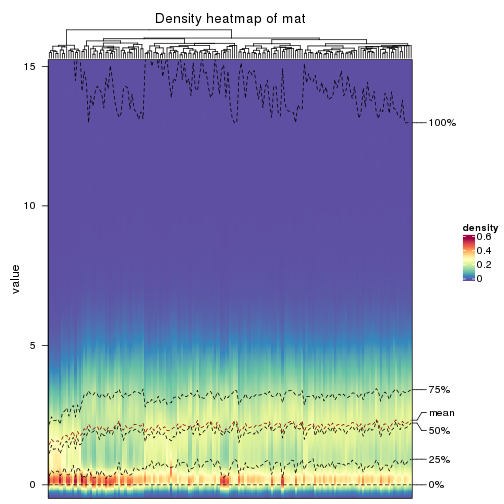


### Suggest the best k


Folowing table shows the best `k` (number of partitions) for each combination
of top-value methods and partition methods. Clicking on the method name in
the table goes to the section for a single combination of methods.

[The cola vignette](http://bioconductor.org/packages/devel/bioc/vignettes/cola/inst/doc/cola.html#toc_13)
explains the definition of the metrics used for determining the best
number of partitions.


```r
suggest_best_k(res_list)
```


|                            | The best k| 1-PAC| Mean silhouette| Concordance|   |Optional k |
|:---------------------------|----------:|-----:|---------------:|-----------:|:--|:----------|
|[CV:kmeans](#CV-kmeans)     |          2| 1.000|           0.980|       0.992|** |           |
|[MAD:kmeans](#MAD-kmeans)   |          2| 1.000|           0.972|       0.987|** |           |
|[ATC:mclust](#ATC-mclust)   |          2| 1.000|           0.986|       0.992|** |           |
|[CV:mclust](#CV-mclust)     |          3| 1.000|           0.964|       0.985|** |           |
|[ATC:kmeans](#ATC-kmeans)   |          3| 0.997|           0.962|       0.976|** |           |
|[ATC:pam](#ATC-pam)         |          4| 0.993|           0.941|       0.974|** |2          |
|[CV:skmeans](#CV-skmeans)   |          5| 0.982|           0.943|       0.968|** |2,3        |
|[SD:NMF](#SD-NMF)           |          2| 0.975|           0.950|       0.980|** |           |
|[SD:skmeans](#SD-skmeans)   |          4| 0.967|           0.933|       0.973|** |2,3        |
|[SD:pam](#SD-pam)           |          2| 0.963|           0.970|       0.986|** |           |
|[MAD:pam](#MAD-pam)         |          4| 0.925|           0.895|       0.957|*  |2,3        |
|[ATC:skmeans](#ATC-skmeans) |          4| 0.923|           0.844|       0.926|*  |2,3        |
|[ATC:NMF](#ATC-NMF)         |          3| 0.918|           0.903|       0.959|*  |2          |
|[CV:pam](#CV-pam)           |          5| 0.915|           0.884|       0.950|*  |2          |
|[MAD:skmeans](#MAD-skmeans) |          6| 0.906|           0.875|       0.926|*  |2,3,4      |
|[CV:NMF](#CV-NMF)           |          6| 0.903|           0.800|       0.900|*  |2,5        |
|[MAD:NMF](#MAD-NMF)         |          2| 0.878|           0.917|       0.965|   |           |
|[SD:kmeans](#SD-kmeans)     |          2| 0.859|           0.943|       0.972|   |           |
|[MAD:mclust](#MAD-mclust)   |          4| 0.718|           0.842|       0.862|   |           |
|[ATC:hclust](#ATC-hclust)   |          3| 0.714|           0.836|       0.910|   |           |
|[MAD:hclust](#MAD-hclust)   |          3| 0.573|           0.799|       0.879|   |           |
|[SD:hclust](#SD-hclust)     |          3| 0.516|           0.786|       0.871|   |           |
|[SD:mclust](#SD-mclust)     |          2| 0.498|           0.695|       0.876|   |           |
|[CV:hclust](#CV-hclust)     |          2| 0.414|           0.846|       0.907|   |           |

\*\*: 1-PAC > 0.95, \*: 1-PAC > 0.9


### CDF of consensus matrices

Cumulative distribution function curves of consensus matrix for all methods.


```r
collect_plots(res_list, fun = plot_ecdf)
```


### Consensus heatmap

Consensus heatmaps for all methods. ([What is a consensus heatmap?](http://bioconductor.org/packages/devel/bioc/vignettes/cola/inst/doc/cola.html#toc_9))


<style type='text/css'>


.ui-helper-hidden {
	display: none;
}
.ui-helper-hidden-accessible {
	border: 0;
	clip: rect(0 0 0 0);
	height: 1px;
	margin: -1px;
	overflow: hidden;
	padding: 0;
	position: absolute;
	width: 1px;
}
.ui-helper-reset {
	margin: 0;
	padding: 0;
	border: 0;
	outline: 0;
	line-height: 1.3;
	text-decoration: none;
	font-size: 100%;
	list-style: none;
}
.ui-helper-clearfix:before,
.ui-helper-clearfix:after {
	content: "";
	display: table;
	border-collapse: collapse;
}
.ui-helper-clearfix:after {
	clear: both;
}
.ui-helper-zfix {
	width: 100%;
	height: 100%;
	top: 0;
	left: 0;
	position: absolute;
	opacity: 0;
	filter:Alpha(Opacity=0); 
}

.ui-front {
	z-index: 100;
}


.ui-state-disabled {
	cursor: default !important;
	pointer-events: none;
}


.ui-icon {
	display: inline-block;
	vertical-align: middle;
	margin-top: -.25em;
	position: relative;
	text-indent: -99999px;
	overflow: hidden;
	background-repeat: no-repeat;
}

.ui-widget-icon-block {
	left: 50%;
	margin-left: -8px;
	display: block;
}


.ui-widget-overlay {
	position: fixed;
	top: 0;
	left: 0;
	width: 100%;
	height: 100%;
}
.ui-accordion .ui-accordion-header {
	display: block;
	cursor: pointer;
	position: relative;
	margin: 2px 0 0 0;
	padding: .5em .5em .5em .7em;
	font-size: 100%;
}
.ui-accordion .ui-accordion-content {
	padding: 1em 2.2em;
	border-top: 0;
	overflow: auto;
}
.ui-autocomplete {
	position: absolute;
	top: 0;
	left: 0;
	cursor: default;
}
.ui-menu {
	list-style: none;
	padding: 0;
	margin: 0;
	display: block;
	outline: 0;
}
.ui-menu .ui-menu {
	position: absolute;
}
.ui-menu .ui-menu-item {
	margin: 0;
	cursor: pointer;
	
	list-style-image: url("data:image/gif;base64,R0lGODlhAQABAIAAAAAAAP///yH5BAEAAAAALAAAAAABAAEAAAIBRAA7");
}
.ui-menu .ui-menu-item-wrapper {
	position: relative;
	padding: 3px 1em 3px .4em;
}
.ui-menu .ui-menu-divider {
	margin: 5px 0;
	height: 0;
	font-size: 0;
	line-height: 0;
	border-width: 1px 0 0 0;
}
.ui-menu .ui-state-focus,
.ui-menu .ui-state-active {
	margin: -1px;
}


.ui-menu-icons {
	position: relative;
}
.ui-menu-icons .ui-menu-item-wrapper {
	padding-left: 2em;
}


.ui-menu .ui-icon {
	position: absolute;
	top: 0;
	bottom: 0;
	left: .2em;
	margin: auto 0;
}


.ui-menu .ui-menu-icon {
	left: auto;
	right: 0;
}
.ui-button {
	padding: .4em 1em;
	display: inline-block;
	position: relative;
	line-height: normal;
	margin-right: .1em;
	cursor: pointer;
	vertical-align: middle;
	text-align: center;
	-webkit-user-select: none;
	-moz-user-select: none;
	-ms-user-select: none;
	user-select: none;

	
	overflow: visible;
}

.ui-button,
.ui-button:link,
.ui-button:visited,
.ui-button:hover,
.ui-button:active {
	text-decoration: none;
}


.ui-button-icon-only {
	width: 2em;
	box-sizing: border-box;
	text-indent: -9999px;
	white-space: nowrap;
}


input.ui-button.ui-button-icon-only {
	text-indent: 0;
}


.ui-button-icon-only .ui-icon {
	position: absolute;
	top: 50%;
	left: 50%;
	margin-top: -8px;
	margin-left: -8px;
}

.ui-button.ui-icon-notext .ui-icon {
	padding: 0;
	width: 2.1em;
	height: 2.1em;
	text-indent: -9999px;
	white-space: nowrap;

}

input.ui-button.ui-icon-notext .ui-icon {
	width: auto;
	height: auto;
	text-indent: 0;
	white-space: normal;
	padding: .4em 1em;
}


input.ui-button::-moz-focus-inner,
button.ui-button::-moz-focus-inner {
	border: 0;
	padding: 0;
}
.ui-controlgroup {
	vertical-align: middle;
	display: inline-block;
}
.ui-controlgroup > .ui-controlgroup-item {
	float: left;
	margin-left: 0;
	margin-right: 0;
}
.ui-controlgroup > .ui-controlgroup-item:focus,
.ui-controlgroup > .ui-controlgroup-item.ui-visual-focus {
	z-index: 9999;
}
.ui-controlgroup-vertical > .ui-controlgroup-item {
	display: block;
	float: none;
	width: 100%;
	margin-top: 0;
	margin-bottom: 0;
	text-align: left;
}
.ui-controlgroup-vertical .ui-controlgroup-item {
	box-sizing: border-box;
}
.ui-controlgroup .ui-controlgroup-label {
	padding: .4em 1em;
}
.ui-controlgroup .ui-controlgroup-label span {
	font-size: 80%;
}
.ui-controlgroup-horizontal .ui-controlgroup-label + .ui-controlgroup-item {
	border-left: none;
}
.ui-controlgroup-vertical .ui-controlgroup-label + .ui-controlgroup-item {
	border-top: none;
}
.ui-controlgroup-horizontal .ui-controlgroup-label.ui-widget-content {
	border-right: none;
}
.ui-controlgroup-vertical .ui-controlgroup-label.ui-widget-content {
	border-bottom: none;
}


.ui-controlgroup-vertical .ui-spinner-input {

	
	width: 75%;
	width: calc( 100% - 2.4em );
}
.ui-controlgroup-vertical .ui-spinner .ui-spinner-up {
	border-top-style: solid;
}

.ui-checkboxradio-label .ui-icon-background {
	box-shadow: inset 1px 1px 1px #ccc;
	border-radius: .12em;
	border: none;
}
.ui-checkboxradio-radio-label .ui-icon-background {
	width: 16px;
	height: 16px;
	border-radius: 1em;
	overflow: visible;
	border: none;
}
.ui-checkboxradio-radio-label.ui-checkboxradio-checked .ui-icon,
.ui-checkboxradio-radio-label.ui-checkboxradio-checked:hover .ui-icon {
	background-image: none;
	width: 8px;
	height: 8px;
	border-width: 4px;
	border-style: solid;
}
.ui-checkboxradio-disabled {
	pointer-events: none;
}
.ui-datepicker {
	width: 17em;
	padding: .2em .2em 0;
	display: none;
}
.ui-datepicker .ui-datepicker-header {
	position: relative;
	padding: .2em 0;
}
.ui-datepicker .ui-datepicker-prev,
.ui-datepicker .ui-datepicker-next {
	position: absolute;
	top: 2px;
	width: 1.8em;
	height: 1.8em;
}
.ui-datepicker .ui-datepicker-prev-hover,
.ui-datepicker .ui-datepicker-next-hover {
	top: 1px;
}
.ui-datepicker .ui-datepicker-prev {
	left: 2px;
}
.ui-datepicker .ui-datepicker-next {
	right: 2px;
}
.ui-datepicker .ui-datepicker-prev-hover {
	left: 1px;
}
.ui-datepicker .ui-datepicker-next-hover {
	right: 1px;
}
.ui-datepicker .ui-datepicker-prev span,
.ui-datepicker .ui-datepicker-next span {
	display: block;
	position: absolute;
	left: 50%;
	margin-left: -8px;
	top: 50%;
	margin-top: -8px;
}
.ui-datepicker .ui-datepicker-title {
	margin: 0 2.3em;
	line-height: 1.8em;
	text-align: center;
}
.ui-datepicker .ui-datepicker-title select {
	font-size: 1em;
	margin: 1px 0;
}
.ui-datepicker select.ui-datepicker-month,
.ui-datepicker select.ui-datepicker-year {
	width: 45%;
}
.ui-datepicker table {
	width: 100%;
	font-size: .9em;
	border-collapse: collapse;
	margin: 0 0 .4em;
}
.ui-datepicker th {
	padding: .7em .3em;
	text-align: center;
	font-weight: bold;
	border: 0;
}
.ui-datepicker td {
	border: 0;
	padding: 1px;
}
.ui-datepicker td span,
.ui-datepicker td a {
	display: block;
	padding: .2em;
	text-align: right;
	text-decoration: none;
}
.ui-datepicker .ui-datepicker-buttonpane {
	background-image: none;
	margin: .7em 0 0 0;
	padding: 0 .2em;
	border-left: 0;
	border-right: 0;
	border-bottom: 0;
}
.ui-datepicker .ui-datepicker-buttonpane button {
	float: right;
	margin: .5em .2em .4em;
	cursor: pointer;
	padding: .2em .6em .3em .6em;
	width: auto;
	overflow: visible;
}
.ui-datepicker .ui-datepicker-buttonpane button.ui-datepicker-current {
	float: left;
}


.ui-datepicker.ui-datepicker-multi {
	width: auto;
}
.ui-datepicker-multi .ui-datepicker-group {
	float: left;
}
.ui-datepicker-multi .ui-datepicker-group table {
	width: 95%;
	margin: 0 auto .4em;
}
.ui-datepicker-multi-2 .ui-datepicker-group {
	width: 50%;
}
.ui-datepicker-multi-3 .ui-datepicker-group {
	width: 33.3%;
}
.ui-datepicker-multi-4 .ui-datepicker-group {
	width: 25%;
}
.ui-datepicker-multi .ui-datepicker-group-last .ui-datepicker-header,
.ui-datepicker-multi .ui-datepicker-group-middle .ui-datepicker-header {
	border-left-width: 0;
}
.ui-datepicker-multi .ui-datepicker-buttonpane {
	clear: left;
}
.ui-datepicker-row-break {
	clear: both;
	width: 100%;
	font-size: 0;
}


.ui-datepicker-rtl {
	direction: rtl;
}
.ui-datepicker-rtl .ui-datepicker-prev {
	right: 2px;
	left: auto;
}
.ui-datepicker-rtl .ui-datepicker-next {
	left: 2px;
	right: auto;
}
.ui-datepicker-rtl .ui-datepicker-prev:hover {
	right: 1px;
	left: auto;
}
.ui-datepicker-rtl .ui-datepicker-next:hover {
	left: 1px;
	right: auto;
}
.ui-datepicker-rtl .ui-datepicker-buttonpane {
	clear: right;
}
.ui-datepicker-rtl .ui-datepicker-buttonpane button {
	float: left;
}
.ui-datepicker-rtl .ui-datepicker-buttonpane button.ui-datepicker-current,
.ui-datepicker-rtl .ui-datepicker-group {
	float: right;
}
.ui-datepicker-rtl .ui-datepicker-group-last .ui-datepicker-header,
.ui-datepicker-rtl .ui-datepicker-group-middle .ui-datepicker-header {
	border-right-width: 0;
	border-left-width: 1px;
}


.ui-datepicker .ui-icon {
	display: block;
	text-indent: -99999px;
	overflow: hidden;
	background-repeat: no-repeat;
	left: .5em;
	top: .3em;
}
.ui-dialog {
	position: absolute;
	top: 0;
	left: 0;
	padding: .2em;
	outline: 0;
}
.ui-dialog .ui-dialog-titlebar {
	padding: .4em 1em;
	position: relative;
}
.ui-dialog .ui-dialog-title {
	float: left;
	margin: .1em 0;
	white-space: nowrap;
	width: 90%;
	overflow: hidden;
	text-overflow: ellipsis;
}
.ui-dialog .ui-dialog-titlebar-close {
	position: absolute;
	right: .3em;
	top: 50%;
	width: 20px;
	margin: -10px 0 0 0;
	padding: 1px;
	height: 20px;
}
.ui-dialog .ui-dialog-content {
	position: relative;
	border: 0;
	padding: .5em 1em;
	background: none;
	overflow: auto;
}
.ui-dialog .ui-dialog-buttonpane {
	text-align: left;
	border-width: 1px 0 0 0;
	background-image: none;
	margin-top: .5em;
	padding: .3em 1em .5em .4em;
}
.ui-dialog .ui-dialog-buttonpane .ui-dialog-buttonset {
	float: right;
}
.ui-dialog .ui-dialog-buttonpane button {
	margin: .5em .4em .5em 0;
	cursor: pointer;
}
.ui-dialog .ui-resizable-n {
	height: 2px;
	top: 0;
}
.ui-dialog .ui-resizable-e {
	width: 2px;
	right: 0;
}
.ui-dialog .ui-resizable-s {
	height: 2px;
	bottom: 0;
}
.ui-dialog .ui-resizable-w {
	width: 2px;
	left: 0;
}
.ui-dialog .ui-resizable-se,
.ui-dialog .ui-resizable-sw,
.ui-dialog .ui-resizable-ne,
.ui-dialog .ui-resizable-nw {
	width: 7px;
	height: 7px;
}
.ui-dialog .ui-resizable-se {
	right: 0;
	bottom: 0;
}
.ui-dialog .ui-resizable-sw {
	left: 0;
	bottom: 0;
}
.ui-dialog .ui-resizable-ne {
	right: 0;
	top: 0;
}
.ui-dialog .ui-resizable-nw {
	left: 0;
	top: 0;
}
.ui-draggable .ui-dialog-titlebar {
	cursor: move;
}
.ui-draggable-handle {
	-ms-touch-action: none;
	touch-action: none;
}
.ui-resizable {
	position: relative;
}
.ui-resizable-handle {
	position: absolute;
	font-size: 0.1px;
	display: block;
	-ms-touch-action: none;
	touch-action: none;
}
.ui-resizable-disabled .ui-resizable-handle,
.ui-resizable-autohide .ui-resizable-handle {
	display: none;
}
.ui-resizable-n {
	cursor: n-resize;
	height: 7px;
	width: 100%;
	top: -5px;
	left: 0;
}
.ui-resizable-s {
	cursor: s-resize;
	height: 7px;
	width: 100%;
	bottom: -5px;
	left: 0;
}
.ui-resizable-e {
	cursor: e-resize;
	width: 7px;
	right: -5px;
	top: 0;
	height: 100%;
}
.ui-resizable-w {
	cursor: w-resize;
	width: 7px;
	left: -5px;
	top: 0;
	height: 100%;
}
.ui-resizable-se {
	cursor: se-resize;
	width: 12px;
	height: 12px;
	right: 1px;
	bottom: 1px;
}
.ui-resizable-sw {
	cursor: sw-resize;
	width: 9px;
	height: 9px;
	left: -5px;
	bottom: -5px;
}
.ui-resizable-nw {
	cursor: nw-resize;
	width: 9px;
	height: 9px;
	left: -5px;
	top: -5px;
}
.ui-resizable-ne {
	cursor: ne-resize;
	width: 9px;
	height: 9px;
	right: -5px;
	top: -5px;
}
.ui-progressbar {
	height: 2em;
	text-align: left;
	overflow: hidden;
}
.ui-progressbar .ui-progressbar-value {
	margin: -1px;
	height: 100%;
}
.ui-progressbar .ui-progressbar-overlay {
	background: url("data:image/gif;base64,R0lGODlhKAAoAIABAAAAAP///yH/C05FVFNDQVBFMi4wAwEAAAAh+QQJAQABACwAAAAAKAAoAAACkYwNqXrdC52DS06a7MFZI+4FHBCKoDeWKXqymPqGqxvJrXZbMx7Ttc+w9XgU2FB3lOyQRWET2IFGiU9m1frDVpxZZc6bfHwv4c1YXP6k1Vdy292Fb6UkuvFtXpvWSzA+HycXJHUXiGYIiMg2R6W459gnWGfHNdjIqDWVqemH2ekpObkpOlppWUqZiqr6edqqWQAAIfkECQEAAQAsAAAAACgAKAAAApSMgZnGfaqcg1E2uuzDmmHUBR8Qil95hiPKqWn3aqtLsS18y7G1SzNeowWBENtQd+T1JktP05nzPTdJZlR6vUxNWWjV+vUWhWNkWFwxl9VpZRedYcflIOLafaa28XdsH/ynlcc1uPVDZxQIR0K25+cICCmoqCe5mGhZOfeYSUh5yJcJyrkZWWpaR8doJ2o4NYq62lAAACH5BAkBAAEALAAAAAAoACgAAAKVDI4Yy22ZnINRNqosw0Bv7i1gyHUkFj7oSaWlu3ovC8GxNso5fluz3qLVhBVeT/Lz7ZTHyxL5dDalQWPVOsQWtRnuwXaFTj9jVVh8pma9JjZ4zYSj5ZOyma7uuolffh+IR5aW97cHuBUXKGKXlKjn+DiHWMcYJah4N0lYCMlJOXipGRr5qdgoSTrqWSq6WFl2ypoaUAAAIfkECQEAAQAsAAAAACgAKAAAApaEb6HLgd/iO7FNWtcFWe+ufODGjRfoiJ2akShbueb0wtI50zm02pbvwfWEMWBQ1zKGlLIhskiEPm9R6vRXxV4ZzWT2yHOGpWMyorblKlNp8HmHEb/lCXjcW7bmtXP8Xt229OVWR1fod2eWqNfHuMjXCPkIGNileOiImVmCOEmoSfn3yXlJWmoHGhqp6ilYuWYpmTqKUgAAIfkECQEAAQAsAAAAACgAKAAAApiEH6kb58biQ3FNWtMFWW3eNVcojuFGfqnZqSebuS06w5V80/X02pKe8zFwP6EFWOT1lDFk8rGERh1TTNOocQ61Hm4Xm2VexUHpzjymViHrFbiELsefVrn6XKfnt2Q9G/+Xdie499XHd2g4h7ioOGhXGJboGAnXSBnoBwKYyfioubZJ2Hn0RuRZaflZOil56Zp6iioKSXpUAAAh+QQJAQABACwAAAAAKAAoAAACkoQRqRvnxuI7kU1a1UU5bd5tnSeOZXhmn5lWK3qNTWvRdQxP8qvaC+/yaYQzXO7BMvaUEmJRd3TsiMAgswmNYrSgZdYrTX6tSHGZO73ezuAw2uxuQ+BbeZfMxsexY35+/Qe4J1inV0g4x3WHuMhIl2jXOKT2Q+VU5fgoSUI52VfZyfkJGkha6jmY+aaYdirq+lQAACH5BAkBAAEALAAAAAAoACgAAAKWBIKpYe0L3YNKToqswUlvznigd4wiR4KhZrKt9Upqip61i9E3vMvxRdHlbEFiEXfk9YARYxOZZD6VQ2pUunBmtRXo1Lf8hMVVcNl8JafV38aM2/Fu5V16Bn63r6xt97j09+MXSFi4BniGFae3hzbH9+hYBzkpuUh5aZmHuanZOZgIuvbGiNeomCnaxxap2upaCZsq+1kAACH5BAkBAAEALAAAAAAoACgAAAKXjI8By5zf4kOxTVrXNVlv1X0d8IGZGKLnNpYtm8Lr9cqVeuOSvfOW79D9aDHizNhDJidFZhNydEahOaDH6nomtJjp1tutKoNWkvA6JqfRVLHU/QUfau9l2x7G54d1fl995xcIGAdXqMfBNadoYrhH+Mg2KBlpVpbluCiXmMnZ2Sh4GBqJ+ckIOqqJ6LmKSllZmsoq6wpQAAAh+QQJAQABACwAAAAAKAAoAAAClYx/oLvoxuJDkU1a1YUZbJ59nSd2ZXhWqbRa2/gF8Gu2DY3iqs7yrq+xBYEkYvFSM8aSSObE+ZgRl1BHFZNr7pRCavZ5BW2142hY3AN/zWtsmf12p9XxxFl2lpLn1rseztfXZjdIWIf2s5dItwjYKBgo9yg5pHgzJXTEeGlZuenpyPmpGQoKOWkYmSpaSnqKileI2FAAACH5BAkBAAEALAAAAAAoACgAAAKVjB+gu+jG4kORTVrVhRlsnn2dJ3ZleFaptFrb+CXmO9OozeL5VfP99HvAWhpiUdcwkpBH3825AwYdU8xTqlLGhtCosArKMpvfa1mMRae9VvWZfeB2XfPkeLmm18lUcBj+p5dnN8jXZ3YIGEhYuOUn45aoCDkp16hl5IjYJvjWKcnoGQpqyPlpOhr3aElaqrq56Bq7VAAAOw==");
	height: 100%;
	filter: alpha(opacity=25); 
	opacity: 0.25;
}
.ui-progressbar-indeterminate .ui-progressbar-value {
	background-image: none;
}
.ui-selectable {
	-ms-touch-action: none;
	touch-action: none;
}
.ui-selectable-helper {
	position: absolute;
	z-index: 100;
	border: 1px dotted black;
}
.ui-selectmenu-menu {
	padding: 0;
	margin: 0;
	position: absolute;
	top: 0;
	left: 0;
	display: none;
}
.ui-selectmenu-menu .ui-menu {
	overflow: auto;
	overflow-x: hidden;
	padding-bottom: 1px;
}
.ui-selectmenu-menu .ui-menu .ui-selectmenu-optgroup {
	font-size: 1em;
	font-weight: bold;
	line-height: 1.5;
	padding: 2px 0.4em;
	margin: 0.5em 0 0 0;
	height: auto;
	border: 0;
}
.ui-selectmenu-open {
	display: block;
}
.ui-selectmenu-text {
	display: block;
	margin-right: 20px;
	overflow: hidden;
	text-overflow: ellipsis;
}
.ui-selectmenu-button.ui-button {
	text-align: left;
	white-space: nowrap;
	width: 14em;
}
.ui-selectmenu-icon.ui-icon {
	float: right;
	margin-top: 0;
}
.ui-slider {
	position: relative;
	text-align: left;
}
.ui-slider .ui-slider-handle {
	position: absolute;
	z-index: 2;
	width: 1.2em;
	height: 1.2em;
	cursor: default;
	-ms-touch-action: none;
	touch-action: none;
}
.ui-slider .ui-slider-range {
	position: absolute;
	z-index: 1;
	font-size: .7em;
	display: block;
	border: 0;
	background-position: 0 0;
}


.ui-slider.ui-state-disabled .ui-slider-handle,
.ui-slider.ui-state-disabled .ui-slider-range {
	filter: inherit;
}

.ui-slider-horizontal {
	height: .8em;
}
.ui-slider-horizontal .ui-slider-handle {
	top: -.3em;
	margin-left: -.6em;
}
.ui-slider-horizontal .ui-slider-range {
	top: 0;
	height: 100%;
}
.ui-slider-horizontal .ui-slider-range-min {
	left: 0;
}
.ui-slider-horizontal .ui-slider-range-max {
	right: 0;
}

.ui-slider-vertical {
	width: .8em;
	height: 100px;
}
.ui-slider-vertical .ui-slider-handle {
	left: -.3em;
	margin-left: 0;
	margin-bottom: -.6em;
}
.ui-slider-vertical .ui-slider-range {
	left: 0;
	width: 100%;
}
.ui-slider-vertical .ui-slider-range-min {
	bottom: 0;
}
.ui-slider-vertical .ui-slider-range-max {
	top: 0;
}
.ui-sortable-handle {
	-ms-touch-action: none;
	touch-action: none;
}
.ui-spinner {
	position: relative;
	display: inline-block;
	overflow: hidden;
	padding: 0;
	vertical-align: middle;
}
.ui-spinner-input {
	border: none;
	background: none;
	color: inherit;
	padding: .222em 0;
	margin: .2em 0;
	vertical-align: middle;
	margin-left: .4em;
	margin-right: 2em;
}
.ui-spinner-button {
	width: 1.6em;
	height: 50%;
	font-size: .5em;
	padding: 0;
	margin: 0;
	text-align: center;
	position: absolute;
	cursor: default;
	display: block;
	overflow: hidden;
	right: 0;
}

.ui-spinner a.ui-spinner-button {
	border-top-style: none;
	border-bottom-style: none;
	border-right-style: none;
}
.ui-spinner-up {
	top: 0;
}
.ui-spinner-down {
	bottom: 0;
}
.ui-tabs {
	position: relative;
	padding: .2em;
}
.ui-tabs .ui-tabs-nav {
	margin: 0;
	padding: .2em .2em 0;
}
.ui-tabs .ui-tabs-nav li {
	list-style: none;
	float: left;
	position: relative;
	top: 0;
	margin: 1px .2em 0 0;
	border-bottom-width: 0;
	padding: 0;
	white-space: nowrap;
}
.ui-tabs .ui-tabs-nav .ui-tabs-anchor {
	float: left;
	padding: .5em 1em;
	text-decoration: none;
}
.ui-tabs .ui-tabs-nav li.ui-tabs-active {
	margin-bottom: -1px;
	padding-bottom: 1px;
}
.ui-tabs .ui-tabs-nav li.ui-tabs-active .ui-tabs-anchor,
.ui-tabs .ui-tabs-nav li.ui-state-disabled .ui-tabs-anchor,
.ui-tabs .ui-tabs-nav li.ui-tabs-loading .ui-tabs-anchor {
	cursor: text;
}
.ui-tabs-collapsible .ui-tabs-nav li.ui-tabs-active .ui-tabs-anchor {
	cursor: pointer;
}
.ui-tabs .ui-tabs-panel {
	display: block;
	border-width: 0;
	padding: 1em 1.4em;
	background: none;
}
.ui-tooltip {
	padding: 8px;
	position: absolute;
	z-index: 9999;
	max-width: 300px;
}
body .ui-tooltip {
	border-width: 2px;
}

.ui-widget {
	font-family: Arial,Helvetica,sans-serif;
	font-size: 1em;
}
.ui-widget .ui-widget {
	font-size: 1em;
}
.ui-widget input,
.ui-widget select,
.ui-widget textarea,
.ui-widget button {
	font-family: Arial,Helvetica,sans-serif;
	font-size: 1em;
}
.ui-widget.ui-widget-content {
	border: 1px solid #c5c5c5;
}
.ui-widget-content {
	border: 1px solid #dddddd;
	background: #ffffff;
	color: #333333;
}
.ui-widget-content a {
	color: #333333;
}
.ui-widget-header {
	border: 1px solid #dddddd;
	background: #e9e9e9;
	color: #333333;
	font-weight: bold;
}
.ui-widget-header a {
	color: #333333;
}


.ui-state-default,
.ui-widget-content .ui-state-default,
.ui-widget-header .ui-state-default,
.ui-button,


html .ui-button.ui-state-disabled:hover,
html .ui-button.ui-state-disabled:active {
	border: 1px solid #c5c5c5;
	background: #f6f6f6;
	font-weight: normal;
	color: #454545;
}
.ui-state-default a,
.ui-state-default a:link,
.ui-state-default a:visited,
a.ui-button,
a:link.ui-button,
a:visited.ui-button,
.ui-button {
	color: #454545;
	text-decoration: none;
}
.ui-state-hover,
.ui-widget-content .ui-state-hover,
.ui-widget-header .ui-state-hover,
.ui-state-focus,
.ui-widget-content .ui-state-focus,
.ui-widget-header .ui-state-focus,
.ui-button:hover,
.ui-button:focus {
	border: 1px solid #cccccc;
	background: #ededed;
	font-weight: normal;
	color: #2b2b2b;
}
.ui-state-hover a,
.ui-state-hover a:hover,
.ui-state-hover a:link,
.ui-state-hover a:visited,
.ui-state-focus a,
.ui-state-focus a:hover,
.ui-state-focus a:link,
.ui-state-focus a:visited,
a.ui-button:hover,
a.ui-button:focus {
	color: #2b2b2b;
	text-decoration: none;
}

.ui-visual-focus {
	box-shadow: 0 0 3px 1px rgb(94, 158, 214);
}
.ui-state-active,
.ui-widget-content .ui-state-active,
.ui-widget-header .ui-state-active,
a.ui-button:active,
.ui-button:active,
.ui-button.ui-state-active:hover {
	border: 1px solid #003eff;
	background: #007fff;
	font-weight: normal;
	color: #ffffff;
}
.ui-icon-background,
.ui-state-active .ui-icon-background {
	border: #003eff;
	background-color: #ffffff;
}
.ui-state-active a,
.ui-state-active a:link,
.ui-state-active a:visited {
	color: #ffffff;
	text-decoration: none;
}


.ui-state-highlight,
.ui-widget-content .ui-state-highlight,
.ui-widget-header .ui-state-highlight {
	border: 1px solid #dad55e;
	background: #fffa90;
	color: #777620;
}
.ui-state-checked {
	border: 1px solid #dad55e;
	background: #fffa90;
}
.ui-state-highlight a,
.ui-widget-content .ui-state-highlight a,
.ui-widget-header .ui-state-highlight a {
	color: #777620;
}
.ui-state-error,
.ui-widget-content .ui-state-error,
.ui-widget-header .ui-state-error {
	border: 1px solid #f1a899;
	background: #fddfdf;
	color: #5f3f3f;
}
.ui-state-error a,
.ui-widget-content .ui-state-error a,
.ui-widget-header .ui-state-error a {
	color: #5f3f3f;
}
.ui-state-error-text,
.ui-widget-content .ui-state-error-text,
.ui-widget-header .ui-state-error-text {
	color: #5f3f3f;
}
.ui-priority-primary,
.ui-widget-content .ui-priority-primary,
.ui-widget-header .ui-priority-primary {
	font-weight: bold;
}
.ui-priority-secondary,
.ui-widget-content .ui-priority-secondary,
.ui-widget-header .ui-priority-secondary {
	opacity: .7;
	filter:Alpha(Opacity=70); 
	font-weight: normal;
}
.ui-state-disabled,
.ui-widget-content .ui-state-disabled,
.ui-widget-header .ui-state-disabled {
	opacity: .35;
	filter:Alpha(Opacity=35); 
	background-image: none;
}
.ui-state-disabled .ui-icon {
	filter:Alpha(Opacity=35); 
}


.ui-icon {
	width: 16px;
	height: 16px;
}
.ui-icon,
.ui-widget-content .ui-icon {
	background-image: url("images/ui-icons_444444_256x240.png");
}
.ui-widget-header .ui-icon {
	background-image: url("images/ui-icons_444444_256x240.png");
}
.ui-state-hover .ui-icon,
.ui-state-focus .ui-icon,
.ui-button:hover .ui-icon,
.ui-button:focus .ui-icon {
	background-image: url("images/ui-icons_555555_256x240.png");
}
.ui-state-active .ui-icon,
.ui-button:active .ui-icon {
	background-image: url("images/ui-icons_ffffff_256x240.png");
}
.ui-state-highlight .ui-icon,
.ui-button .ui-state-highlight.ui-icon {
	background-image: url("images/ui-icons_777620_256x240.png");
}
.ui-state-error .ui-icon,
.ui-state-error-text .ui-icon {
	background-image: url("images/ui-icons_cc0000_256x240.png");
}
.ui-button .ui-icon {
	background-image: url("images/ui-icons_777777_256x240.png");
}


.ui-icon-blank { background-position: 16px 16px; }
.ui-icon-caret-1-n { background-position: 0 0; }
.ui-icon-caret-1-ne { background-position: -16px 0; }
.ui-icon-caret-1-e { background-position: -32px 0; }
.ui-icon-caret-1-se { background-position: -48px 0; }
.ui-icon-caret-1-s { background-position: -65px 0; }
.ui-icon-caret-1-sw { background-position: -80px 0; }
.ui-icon-caret-1-w { background-position: -96px 0; }
.ui-icon-caret-1-nw { background-position: -112px 0; }
.ui-icon-caret-2-n-s { background-position: -128px 0; }
.ui-icon-caret-2-e-w { background-position: -144px 0; }
.ui-icon-triangle-1-n { background-position: 0 -16px; }
.ui-icon-triangle-1-ne { background-position: -16px -16px; }
.ui-icon-triangle-1-e { background-position: -32px -16px; }
.ui-icon-triangle-1-se { background-position: -48px -16px; }
.ui-icon-triangle-1-s { background-position: -65px -16px; }
.ui-icon-triangle-1-sw { background-position: -80px -16px; }
.ui-icon-triangle-1-w { background-position: -96px -16px; }
.ui-icon-triangle-1-nw { background-position: -112px -16px; }
.ui-icon-triangle-2-n-s { background-position: -128px -16px; }
.ui-icon-triangle-2-e-w { background-position: -144px -16px; }
.ui-icon-arrow-1-n { background-position: 0 -32px; }
.ui-icon-arrow-1-ne { background-position: -16px -32px; }
.ui-icon-arrow-1-e { background-position: -32px -32px; }
.ui-icon-arrow-1-se { background-position: -48px -32px; }
.ui-icon-arrow-1-s { background-position: -65px -32px; }
.ui-icon-arrow-1-sw { background-position: -80px -32px; }
.ui-icon-arrow-1-w { background-position: -96px -32px; }
.ui-icon-arrow-1-nw { background-position: -112px -32px; }
.ui-icon-arrow-2-n-s { background-position: -128px -32px; }
.ui-icon-arrow-2-ne-sw { background-position: -144px -32px; }
.ui-icon-arrow-2-e-w { background-position: -160px -32px; }
.ui-icon-arrow-2-se-nw { background-position: -176px -32px; }
.ui-icon-arrowstop-1-n { background-position: -192px -32px; }
.ui-icon-arrowstop-1-e { background-position: -208px -32px; }
.ui-icon-arrowstop-1-s { background-position: -224px -32px; }
.ui-icon-arrowstop-1-w { background-position: -240px -32px; }
.ui-icon-arrowthick-1-n { background-position: 1px -48px; }
.ui-icon-arrowthick-1-ne { background-position: -16px -48px; }
.ui-icon-arrowthick-1-e { background-position: -32px -48px; }
.ui-icon-arrowthick-1-se { background-position: -48px -48px; }
.ui-icon-arrowthick-1-s { background-position: -64px -48px; }
.ui-icon-arrowthick-1-sw { background-position: -80px -48px; }
.ui-icon-arrowthick-1-w { background-position: -96px -48px; }
.ui-icon-arrowthick-1-nw { background-position: -112px -48px; }
.ui-icon-arrowthick-2-n-s { background-position: -128px -48px; }
.ui-icon-arrowthick-2-ne-sw { background-position: -144px -48px; }
.ui-icon-arrowthick-2-e-w { background-position: -160px -48px; }
.ui-icon-arrowthick-2-se-nw { background-position: -176px -48px; }
.ui-icon-arrowthickstop-1-n { background-position: -192px -48px; }
.ui-icon-arrowthickstop-1-e { background-position: -208px -48px; }
.ui-icon-arrowthickstop-1-s { background-position: -224px -48px; }
.ui-icon-arrowthickstop-1-w { background-position: -240px -48px; }
.ui-icon-arrowreturnthick-1-w { background-position: 0 -64px; }
.ui-icon-arrowreturnthick-1-n { background-position: -16px -64px; }
.ui-icon-arrowreturnthick-1-e { background-position: -32px -64px; }
.ui-icon-arrowreturnthick-1-s { background-position: -48px -64px; }
.ui-icon-arrowreturn-1-w { background-position: -64px -64px; }
.ui-icon-arrowreturn-1-n { background-position: -80px -64px; }
.ui-icon-arrowreturn-1-e { background-position: -96px -64px; }
.ui-icon-arrowreturn-1-s { background-position: -112px -64px; }
.ui-icon-arrowrefresh-1-w { background-position: -128px -64px; }
.ui-icon-arrowrefresh-1-n { background-position: -144px -64px; }
.ui-icon-arrowrefresh-1-e { background-position: -160px -64px; }
.ui-icon-arrowrefresh-1-s { background-position: -176px -64px; }
.ui-icon-arrow-4 { background-position: 0 -80px; }
.ui-icon-arrow-4-diag { background-position: -16px -80px; }
.ui-icon-extlink { background-position: -32px -80px; }
.ui-icon-newwin { background-position: -48px -80px; }
.ui-icon-refresh { background-position: -64px -80px; }
.ui-icon-shuffle { background-position: -80px -80px; }
.ui-icon-transfer-e-w { background-position: -96px -80px; }
.ui-icon-transferthick-e-w { background-position: -112px -80px; }
.ui-icon-folder-collapsed { background-position: 0 -96px; }
.ui-icon-folder-open { background-position: -16px -96px; }
.ui-icon-document { background-position: -32px -96px; }
.ui-icon-document-b { background-position: -48px -96px; }
.ui-icon-note { background-position: -64px -96px; }
.ui-icon-mail-closed { background-position: -80px -96px; }
.ui-icon-mail-open { background-position: -96px -96px; }
.ui-icon-suitcase { background-position: -112px -96px; }
.ui-icon-comment { background-position: -128px -96px; }
.ui-icon-person { background-position: -144px -96px; }
.ui-icon-print { background-position: -160px -96px; }
.ui-icon-trash { background-position: -176px -96px; }
.ui-icon-locked { background-position: -192px -96px; }
.ui-icon-unlocked { background-position: -208px -96px; }
.ui-icon-bookmark { background-position: -224px -96px; }
.ui-icon-tag { background-position: -240px -96px; }
.ui-icon-home { background-position: 0 -112px; }
.ui-icon-flag { background-position: -16px -112px; }
.ui-icon-calendar { background-position: -32px -112px; }
.ui-icon-cart { background-position: -48px -112px; }
.ui-icon-pencil { background-position: -64px -112px; }
.ui-icon-clock { background-position: -80px -112px; }
.ui-icon-disk { background-position: -96px -112px; }
.ui-icon-calculator { background-position: -112px -112px; }
.ui-icon-zoomin { background-position: -128px -112px; }
.ui-icon-zoomout { background-position: -144px -112px; }
.ui-icon-search { background-position: -160px -112px; }
.ui-icon-wrench { background-position: -176px -112px; }
.ui-icon-gear { background-position: -192px -112px; }
.ui-icon-heart { background-position: -208px -112px; }
.ui-icon-star { background-position: -224px -112px; }
.ui-icon-link { background-position: -240px -112px; }
.ui-icon-cancel { background-position: 0 -128px; }
.ui-icon-plus { background-position: -16px -128px; }
.ui-icon-plusthick { background-position: -32px -128px; }
.ui-icon-minus { background-position: -48px -128px; }
.ui-icon-minusthick { background-position: -64px -128px; }
.ui-icon-close { background-position: -80px -128px; }
.ui-icon-closethick { background-position: -96px -128px; }
.ui-icon-key { background-position: -112px -128px; }
.ui-icon-lightbulb { background-position: -128px -128px; }
.ui-icon-scissors { background-position: -144px -128px; }
.ui-icon-clipboard { background-position: -160px -128px; }
.ui-icon-copy { background-position: -176px -128px; }
.ui-icon-contact { background-position: -192px -128px; }
.ui-icon-image { background-position: -208px -128px; }
.ui-icon-video { background-position: -224px -128px; }
.ui-icon-script { background-position: -240px -128px; }
.ui-icon-alert { background-position: 0 -144px; }
.ui-icon-info { background-position: -16px -144px; }
.ui-icon-notice { background-position: -32px -144px; }
.ui-icon-help { background-position: -48px -144px; }
.ui-icon-check { background-position: -64px -144px; }
.ui-icon-bullet { background-position: -80px -144px; }
.ui-icon-radio-on { background-position: -96px -144px; }
.ui-icon-radio-off { background-position: -112px -144px; }
.ui-icon-pin-w { background-position: -128px -144px; }
.ui-icon-pin-s { background-position: -144px -144px; }
.ui-icon-play { background-position: 0 -160px; }
.ui-icon-pause { background-position: -16px -160px; }
.ui-icon-seek-next { background-position: -32px -160px; }
.ui-icon-seek-prev { background-position: -48px -160px; }
.ui-icon-seek-end { background-position: -64px -160px; }
.ui-icon-seek-start { background-position: -80px -160px; }

.ui-icon-seek-first { background-position: -80px -160px; }
.ui-icon-stop { background-position: -96px -160px; }
.ui-icon-eject { background-position: -112px -160px; }
.ui-icon-volume-off { background-position: -128px -160px; }
.ui-icon-volume-on { background-position: -144px -160px; }
.ui-icon-power { background-position: 0 -176px; }
.ui-icon-signal-diag { background-position: -16px -176px; }
.ui-icon-signal { background-position: -32px -176px; }
.ui-icon-battery-0 { background-position: -48px -176px; }
.ui-icon-battery-1 { background-position: -64px -176px; }
.ui-icon-battery-2 { background-position: -80px -176px; }
.ui-icon-battery-3 { background-position: -96px -176px; }
.ui-icon-circle-plus { background-position: 0 -192px; }
.ui-icon-circle-minus { background-position: -16px -192px; }
.ui-icon-circle-close { background-position: -32px -192px; }
.ui-icon-circle-triangle-e { background-position: -48px -192px; }
.ui-icon-circle-triangle-s { background-position: -64px -192px; }
.ui-icon-circle-triangle-w { background-position: -80px -192px; }
.ui-icon-circle-triangle-n { background-position: -96px -192px; }
.ui-icon-circle-arrow-e { background-position: -112px -192px; }
.ui-icon-circle-arrow-s { background-position: -128px -192px; }
.ui-icon-circle-arrow-w { background-position: -144px -192px; }
.ui-icon-circle-arrow-n { background-position: -160px -192px; }
.ui-icon-circle-zoomin { background-position: -176px -192px; }
.ui-icon-circle-zoomout { background-position: -192px -192px; }
.ui-icon-circle-check { background-position: -208px -192px; }
.ui-icon-circlesmall-plus { background-position: 0 -208px; }
.ui-icon-circlesmall-minus { background-position: -16px -208px; }
.ui-icon-circlesmall-close { background-position: -32px -208px; }
.ui-icon-squaresmall-plus { background-position: -48px -208px; }
.ui-icon-squaresmall-minus { background-position: -64px -208px; }
.ui-icon-squaresmall-close { background-position: -80px -208px; }
.ui-icon-grip-dotted-vertical { background-position: 0 -224px; }
.ui-icon-grip-dotted-horizontal { background-position: -16px -224px; }
.ui-icon-grip-solid-vertical { background-position: -32px -224px; }
.ui-icon-grip-solid-horizontal { background-position: -48px -224px; }
.ui-icon-gripsmall-diagonal-se { background-position: -64px -224px; }
.ui-icon-grip-diagonal-se { background-position: -80px -224px; }


.ui-corner-all,
.ui-corner-top,
.ui-corner-left,
.ui-corner-tl {
	border-top-left-radius: 3px;
}
.ui-corner-all,
.ui-corner-top,
.ui-corner-right,
.ui-corner-tr {
	border-top-right-radius: 3px;
}
.ui-corner-all,
.ui-corner-bottom,
.ui-corner-left,
.ui-corner-bl {
	border-bottom-left-radius: 3px;
}
.ui-corner-all,
.ui-corner-bottom,
.ui-corner-right,
.ui-corner-br {
	border-bottom-right-radius: 3px;
}


.ui-widget-overlay {
	background: #aaaaaa;
	opacity: .3;
	filter: Alpha(Opacity=30); 
}
.ui-widget-shadow {
	-webkit-box-shadow: 0px 0px 5px #666666;
	box-shadow: 0px 0px 5px #666666;
} 
</style>
<script src='js/jquery-1.12.4.js'></script>
<script src='js/jquery-ui.js'></script>

<script>
$( function() {
	$( '#tabs-collect-consensus-heatmap' ).tabs();
} );
</script>
<div id='tabs-collect-consensus-heatmap'>
<ul>
<li><a href='#tab-collect-consensus-heatmap-1'>k = 2</a></li>
<li><a href='#tab-collect-consensus-heatmap-2'>k = 3</a></li>
<li><a href='#tab-collect-consensus-heatmap-3'>k = 4</a></li>
<li><a href='#tab-collect-consensus-heatmap-4'>k = 5</a></li>
<li><a href='#tab-collect-consensus-heatmap-5'>k = 6</a></li>
</ul>
<div id='tab-collect-consensus-heatmap-1'>
<pre><code class="r">collect_plots(res_list, k = 2, fun = consensus_heatmap, mc.cores = 4)
</code></pre>

<p></p>

</div>
<div id='tab-collect-consensus-heatmap-2'>
<pre><code class="r">collect_plots(res_list, k = 3, fun = consensus_heatmap, mc.cores = 4)
</code></pre>

<p></p>

</div>
<div id='tab-collect-consensus-heatmap-3'>
<pre><code class="r">collect_plots(res_list, k = 4, fun = consensus_heatmap, mc.cores = 4)
</code></pre>

<p></p>

</div>
<div id='tab-collect-consensus-heatmap-4'>
<pre><code class="r">collect_plots(res_list, k = 5, fun = consensus_heatmap, mc.cores = 4)
</code></pre>

<p></p>

</div>
<div id='tab-collect-consensus-heatmap-5'>
<pre><code class="r">collect_plots(res_list, k = 6, fun = consensus_heatmap, mc.cores = 4)
</code></pre>

<p></p>

</div>
</div>


### Membership heatmap

Membership heatmaps for all methods. ([What is a membership heatmap?](http://bioconductor.org/packages/devel/bioc/vignettes/cola/inst/doc/cola.html#toc_12))


<script>
$( function() {
	$( '#tabs-collect-membership-heatmap' ).tabs();
} );
</script>
<div id='tabs-collect-membership-heatmap'>
<ul>
<li><a href='#tab-collect-membership-heatmap-1'>k = 2</a></li>
<li><a href='#tab-collect-membership-heatmap-2'>k = 3</a></li>
<li><a href='#tab-collect-membership-heatmap-3'>k = 4</a></li>
<li><a href='#tab-collect-membership-heatmap-4'>k = 5</a></li>
<li><a href='#tab-collect-membership-heatmap-5'>k = 6</a></li>
</ul>
<div id='tab-collect-membership-heatmap-1'>
<pre><code class="r">collect_plots(res_list, k = 2, fun = membership_heatmap, mc.cores = 4)
</code></pre>

<p></p>

</div>
<div id='tab-collect-membership-heatmap-2'>
<pre><code class="r">collect_plots(res_list, k = 3, fun = membership_heatmap, mc.cores = 4)
</code></pre>

<p></p>

</div>
<div id='tab-collect-membership-heatmap-3'>
<pre><code class="r">collect_plots(res_list, k = 4, fun = membership_heatmap, mc.cores = 4)
</code></pre>

<p></p>

</div>
<div id='tab-collect-membership-heatmap-4'>
<pre><code class="r">collect_plots(res_list, k = 5, fun = membership_heatmap, mc.cores = 4)
</code></pre>

<p>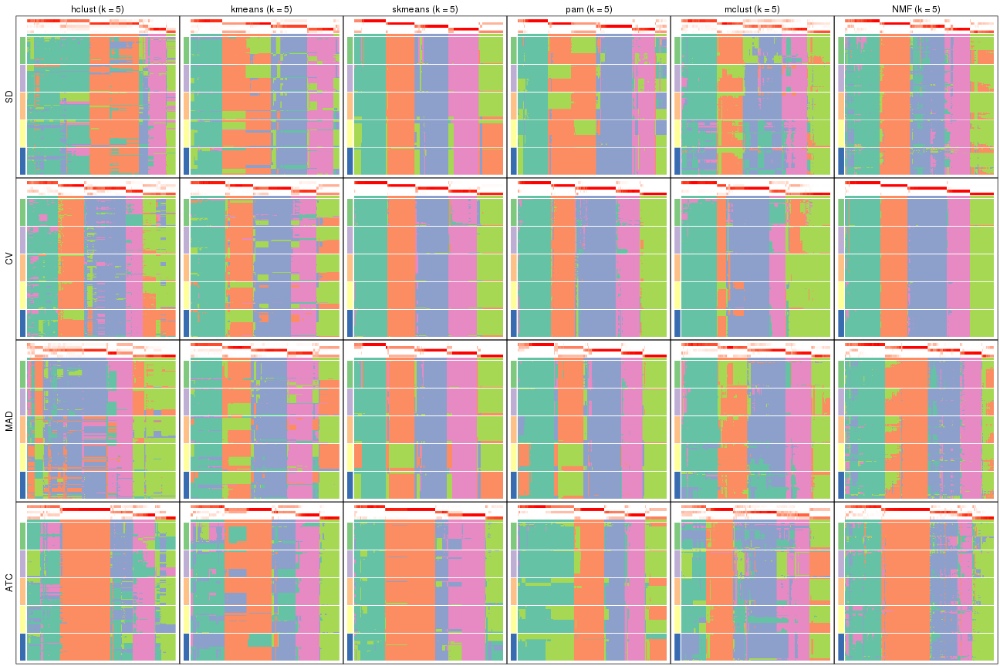</p>

</div>
<div id='tab-collect-membership-heatmap-5'>
<pre><code class="r">collect_plots(res_list, k = 6, fun = membership_heatmap, mc.cores = 4)
</code></pre>

<p></p>

</div>
</div>


### Signature heatmap

Signature heatmaps for all methods. ([What is a signature heatmap?](http://bioconductor.org/packages/devel/bioc/vignettes/cola/inst/doc/cola.html#toc_22))


Note in following heatmaps, rows are scaled.


<script>
$( function() {
	$( '#tabs-collect-get-signatures' ).tabs();
} );
</script>
<div id='tabs-collect-get-signatures'>
<ul>
<li><a href='#tab-collect-get-signatures-1'>k = 2</a></li>
<li><a href='#tab-collect-get-signatures-2'>k = 3</a></li>
<li><a href='#tab-collect-get-signatures-3'>k = 4</a></li>
<li><a href='#tab-collect-get-signatures-4'>k = 5</a></li>
<li><a href='#tab-collect-get-signatures-5'>k = 6</a></li>
</ul>
<div id='tab-collect-get-signatures-1'>
<pre><code class="r">collect_plots(res_list, k = 2, fun = get_signatures, mc.cores = 4)
</code></pre>

<p></p>

</div>
<div id='tab-collect-get-signatures-2'>
<pre><code class="r">collect_plots(res_list, k = 3, fun = get_signatures, mc.cores = 4)
</code></pre>

<p></p>

</div>
<div id='tab-collect-get-signatures-3'>
<pre><code class="r">collect_plots(res_list, k = 4, fun = get_signatures, mc.cores = 4)
</code></pre>

<p></p>

</div>
<div id='tab-collect-get-signatures-4'>
<pre><code class="r">collect_plots(res_list, k = 5, fun = get_signatures, mc.cores = 4)
</code></pre>

<p></p>

</div>
<div id='tab-collect-get-signatures-5'>
<pre><code class="r">collect_plots(res_list, k = 6, fun = get_signatures, mc.cores = 4)
</code></pre>

<p></p>

</div>
</div>


### Statistics table

The statistics used for measuring the stability of consensus partitioning.
([How are they
defined?](http://bioconductor.org/packages/devel/bioc/vignettes/cola/inst/doc/cola.html#toc_13))


<script>
$( function() {
	$( '#tabs-get-stats-from-consensus-partition-list' ).tabs();
} );
</script>
<div id='tabs-get-stats-from-consensus-partition-list'>
<ul>
<li><a href='#tab-get-stats-from-consensus-partition-list-1'>k = 2</a></li>
<li><a href='#tab-get-stats-from-consensus-partition-list-2'>k = 3</a></li>
<li><a href='#tab-get-stats-from-consensus-partition-list-3'>k = 4</a></li>
<li><a href='#tab-get-stats-from-consensus-partition-list-4'>k = 5</a></li>
<li><a href='#tab-get-stats-from-consensus-partition-list-5'>k = 6</a></li>
</ul>
<div id='tab-get-stats-from-consensus-partition-list-1'>
<pre><code class="r">get_stats(res_list, k = 2)
</code></pre>

<pre><code>#&gt;             k 1-PAC mean_silhouette concordance area_increased  Rand Jaccard
#&gt; SD:NMF      2 0.975           0.950       0.980          0.491 0.510   0.510
#&gt; CV:NMF      2 1.000           0.969       0.987          0.493 0.505   0.505
#&gt; MAD:NMF     2 0.878           0.917       0.965          0.490 0.510   0.510
#&gt; ATC:NMF     2 0.975           0.946       0.979          0.501 0.500   0.500
#&gt; SD:skmeans  2 1.000           0.984       0.993          0.500 0.500   0.500
#&gt; CV:skmeans  2 1.000           0.955       0.983          0.485 0.519   0.519
#&gt; MAD:skmeans 2 0.925           0.927       0.969          0.491 0.502   0.502
#&gt; ATC:skmeans 2 1.000           0.972       0.989          0.479 0.519   0.519
#&gt; SD:mclust   2 0.498           0.695       0.876          0.462 0.508   0.508
#&gt; CV:mclust   2 0.369           0.789       0.848          0.467 0.537   0.537
#&gt; MAD:mclust  2 0.505           0.748       0.861          0.454 0.560   0.560
#&gt; ATC:mclust  2 1.000           0.986       0.992          0.444 0.556   0.556
#&gt; SD:kmeans   2 0.859           0.943       0.972          0.466 0.544   0.544
#&gt; CV:kmeans   2 1.000           0.980       0.992          0.460 0.540   0.540
#&gt; MAD:kmeans  2 1.000           0.972       0.987          0.459 0.544   0.544
#&gt; ATC:kmeans  2 0.599           0.932       0.949          0.457 0.548   0.548
#&gt; SD:pam      2 0.963           0.970       0.986          0.463 0.537   0.537
#&gt; CV:pam      2 1.000           0.951       0.980          0.449 0.544   0.544
#&gt; MAD:pam     2 0.962           0.962       0.983          0.464 0.537   0.537
#&gt; ATC:pam     2 1.000           1.000       1.000          0.441 0.560   0.560
#&gt; SD:hclust   2 0.327           0.734       0.778          0.407 0.560   0.560
#&gt; CV:hclust   2 0.414           0.846       0.907          0.472 0.508   0.508
#&gt; MAD:hclust  2 0.450           0.857       0.876          0.431 0.540   0.540
#&gt; ATC:hclust  2 0.512           0.817       0.906          0.458 0.519   0.519
</code></pre>

</div>
<div id='tab-get-stats-from-consensus-partition-list-2'>
<pre><code class="r">get_stats(res_list, k = 3)
</code></pre>

<pre><code>#&gt;             k 1-PAC mean_silhouette concordance area_increased  Rand Jaccard
#&gt; SD:NMF      3 0.784           0.825       0.925          0.355 0.744   0.534
#&gt; CV:NMF      3 0.886           0.911       0.960          0.360 0.742   0.528
#&gt; MAD:NMF     3 0.810           0.831       0.925          0.357 0.758   0.556
#&gt; ATC:NMF     3 0.918           0.903       0.959          0.294 0.812   0.638
#&gt; SD:skmeans  3 1.000           0.953       0.982          0.311 0.787   0.597
#&gt; CV:skmeans  3 1.000           0.980       0.991          0.379 0.781   0.591
#&gt; MAD:skmeans 3 1.000           0.957       0.982          0.333 0.796   0.612
#&gt; ATC:skmeans 3 1.000           0.984       0.994          0.396 0.760   0.560
#&gt; SD:mclust   3 0.482           0.593       0.753          0.356 0.795   0.610
#&gt; CV:mclust   3 1.000           0.964       0.985          0.429 0.757   0.563
#&gt; MAD:mclust  3 0.617           0.655       0.794          0.400 0.770   0.589
#&gt; ATC:mclust  3 0.517           0.582       0.712          0.405 0.790   0.622
#&gt; SD:kmeans   3 0.799           0.872       0.935          0.376 0.797   0.634
#&gt; CV:kmeans   3 0.744           0.865       0.900          0.431 0.759   0.566
#&gt; MAD:kmeans  3 0.726           0.804       0.886          0.395 0.785   0.616
#&gt; ATC:kmeans  3 0.997           0.962       0.976          0.441 0.785   0.611
#&gt; SD:pam      3 0.699           0.872       0.925          0.431 0.780   0.595
#&gt; CV:pam      3 0.884           0.855       0.944          0.484 0.734   0.534
#&gt; MAD:pam     3 0.902           0.897       0.955          0.440 0.769   0.580
#&gt; ATC:pam     3 0.765           0.749       0.890          0.430 0.787   0.625
#&gt; SD:hclust   3 0.516           0.786       0.871          0.535 0.797   0.643
#&gt; CV:hclust   3 0.565           0.719       0.832          0.352 0.827   0.666
#&gt; MAD:hclust  3 0.573           0.799       0.879          0.465 0.796   0.634
#&gt; ATC:hclust  3 0.714           0.836       0.910          0.398 0.819   0.651
</code></pre>

</div>
<div id='tab-get-stats-from-consensus-partition-list-3'>
<pre><code class="r">get_stats(res_list, k = 4)
</code></pre>

<pre><code>#&gt;             k 1-PAC mean_silhouette concordance area_increased  Rand Jaccard
#&gt; SD:NMF      4 0.899           0.876       0.945         0.0936 0.835   0.570
#&gt; CV:NMF      4 0.842           0.891       0.911         0.1021 0.894   0.696
#&gt; MAD:NMF     4 0.886           0.867       0.933         0.0979 0.842   0.586
#&gt; ATC:NMF     4 0.777           0.794       0.905         0.1404 0.805   0.515
#&gt; SD:skmeans  4 0.967           0.933       0.973         0.1326 0.897   0.707
#&gt; CV:skmeans  4 0.827           0.902       0.911         0.1100 0.865   0.627
#&gt; MAD:skmeans 4 0.959           0.935       0.973         0.1355 0.889   0.690
#&gt; ATC:skmeans 4 0.923           0.844       0.926         0.0927 0.923   0.773
#&gt; SD:mclust   4 0.618           0.773       0.822         0.1476 0.820   0.536
#&gt; CV:mclust   4 0.871           0.910       0.910         0.0849 0.950   0.848
#&gt; MAD:mclust  4 0.718           0.842       0.862         0.1348 0.875   0.648
#&gt; ATC:mclust  4 0.572           0.647       0.750         0.1118 0.851   0.605
#&gt; SD:kmeans   4 0.755           0.831       0.832         0.1331 0.861   0.632
#&gt; CV:kmeans   4 0.826           0.853       0.858         0.1168 0.898   0.704
#&gt; MAD:kmeans  4 0.708           0.800       0.813         0.1347 0.878   0.669
#&gt; ATC:kmeans  4 0.879           0.860       0.939         0.1156 0.853   0.613
#&gt; SD:pam      4 0.861           0.825       0.911         0.1109 0.852   0.599
#&gt; CV:pam      4 0.757           0.650       0.801         0.0978 0.903   0.721
#&gt; MAD:pam     4 0.925           0.895       0.957         0.1039 0.853   0.601
#&gt; ATC:pam     4 0.993           0.941       0.974         0.1037 0.835   0.604
#&gt; SD:hclust   4 0.549           0.675       0.814         0.0933 0.953   0.878
#&gt; CV:hclust   4 0.575           0.550       0.716         0.1193 0.846   0.604
#&gt; MAD:hclust  4 0.570           0.615       0.791         0.1004 0.972   0.924
#&gt; ATC:hclust  4 0.732           0.603       0.786         0.1303 0.847   0.596
</code></pre>

</div>
<div id='tab-get-stats-from-consensus-partition-list-4'>
<pre><code class="r">get_stats(res_list, k = 5)
</code></pre>

<pre><code>#&gt;             k 1-PAC mean_silhouette concordance area_increased  Rand Jaccard
#&gt; SD:NMF      5 0.718           0.715       0.848         0.0804 0.874   0.578
#&gt; CV:NMF      5 1.000           0.960       0.982         0.0782 0.926   0.726
#&gt; MAD:NMF     5 0.746           0.655       0.853         0.0628 0.903   0.671
#&gt; ATC:NMF     5 0.804           0.774       0.882         0.0479 0.901   0.662
#&gt; SD:skmeans  5 0.864           0.852       0.869         0.0686 0.930   0.734
#&gt; CV:skmeans  5 0.982           0.943       0.968         0.0804 0.915   0.686
#&gt; MAD:skmeans 5 0.865           0.823       0.854         0.0689 0.923   0.708
#&gt; ATC:skmeans 5 0.882           0.864       0.909         0.0527 0.940   0.787
#&gt; SD:mclust   5 0.576           0.661       0.764         0.0716 0.915   0.689
#&gt; CV:mclust   5 0.810           0.815       0.887         0.0561 0.953   0.837
#&gt; MAD:mclust  5 0.649           0.738       0.822         0.0755 0.940   0.771
#&gt; ATC:mclust  5 0.608           0.551       0.714         0.0860 0.893   0.628
#&gt; SD:kmeans   5 0.774           0.748       0.813         0.0737 0.981   0.928
#&gt; CV:kmeans   5 0.824           0.809       0.842         0.0689 0.934   0.751
#&gt; MAD:kmeans  5 0.779           0.700       0.752         0.0743 0.910   0.669
#&gt; ATC:kmeans  5 0.763           0.695       0.777         0.0676 0.905   0.675
#&gt; SD:pam      5 0.795           0.722       0.824         0.0665 0.954   0.827
#&gt; CV:pam      5 0.915           0.884       0.950         0.0878 0.887   0.615
#&gt; MAD:pam     5 0.840           0.793       0.852         0.0664 0.910   0.674
#&gt; ATC:pam     5 0.776           0.758       0.820         0.0977 0.914   0.728
#&gt; SD:hclust   5 0.604           0.701       0.804         0.0467 0.951   0.859
#&gt; CV:hclust   5 0.686           0.735       0.801         0.0893 0.874   0.584
#&gt; MAD:hclust  5 0.611           0.534       0.731         0.0508 0.934   0.816
#&gt; ATC:hclust  5 0.745           0.631       0.764         0.0451 0.902   0.667
</code></pre>

</div>
<div id='tab-get-stats-from-consensus-partition-list-5'>
<pre><code class="r">get_stats(res_list, k = 6)
</code></pre>

<pre><code>#&gt;             k 1-PAC mean_silhouette concordance area_increased  Rand Jaccard
#&gt; SD:NMF      6 0.786           0.797       0.867         0.0431 0.897   0.572
#&gt; CV:NMF      6 0.903           0.800       0.900         0.0344 0.965   0.833
#&gt; MAD:NMF     6 0.718           0.705       0.809         0.0485 0.850   0.458
#&gt; ATC:NMF     6 0.750           0.595       0.779         0.0409 0.935   0.741
#&gt; SD:skmeans  6 0.894           0.872       0.926         0.0494 0.949   0.753
#&gt; CV:skmeans  6 0.876           0.702       0.864         0.0347 0.970   0.854
#&gt; MAD:skmeans 6 0.906           0.875       0.926         0.0490 0.945   0.737
#&gt; ATC:skmeans 6 0.861           0.853       0.880         0.0466 0.968   0.866
#&gt; SD:mclust   6 0.649           0.543       0.750         0.0521 0.933   0.703
#&gt; CV:mclust   6 0.777           0.686       0.825         0.0470 0.928   0.721
#&gt; MAD:mclust  6 0.718           0.597       0.773         0.0430 0.952   0.785
#&gt; ATC:mclust  6 0.672           0.620       0.748         0.0563 0.896   0.594
#&gt; SD:kmeans   6 0.832           0.832       0.845         0.0447 0.915   0.656
#&gt; CV:kmeans   6 0.777           0.651       0.753         0.0386 0.972   0.868
#&gt; MAD:kmeans  6 0.822           0.797       0.830         0.0418 0.937   0.707
#&gt; ATC:kmeans  6 0.763           0.733       0.809         0.0441 0.908   0.615
#&gt; SD:pam      6 0.867           0.804       0.896         0.0535 0.915   0.648
#&gt; CV:pam      6 0.836           0.689       0.864         0.0277 0.986   0.934
#&gt; MAD:pam     6 0.879           0.814       0.893         0.0448 0.948   0.758
#&gt; ATC:pam     6 0.804           0.727       0.862         0.0789 0.876   0.534
#&gt; SD:hclust   6 0.631           0.584       0.766         0.0490 0.972   0.910
#&gt; CV:hclust   6 0.698           0.700       0.799         0.0163 0.998   0.990
#&gt; MAD:hclust  6 0.656           0.481       0.682         0.0347 0.908   0.730
#&gt; ATC:hclust  6 0.772           0.711       0.799         0.0273 0.945   0.770
</code></pre>

</div>
</div>

Following heatmap plots the partition for each combination of methods and the
lightness correspond to the silhouette scores for samples in each method. On
top the consensus subgroup is inferred from all methods by taking the mean
silhouette scores as weight.


<script>
$( function() {
	$( '#tabs-collect-stats-from-consensus-partition-list' ).tabs();
} );
</script>
<div id='tabs-collect-stats-from-consensus-partition-list'>
<ul>
<li><a href='#tab-collect-stats-from-consensus-partition-list-1'>k = 2</a></li>
<li><a href='#tab-collect-stats-from-consensus-partition-list-2'>k = 3</a></li>
<li><a href='#tab-collect-stats-from-consensus-partition-list-3'>k = 4</a></li>
<li><a href='#tab-collect-stats-from-consensus-partition-list-4'>k = 5</a></li>
<li><a href='#tab-collect-stats-from-consensus-partition-list-5'>k = 6</a></li>
</ul>
<div id='tab-collect-stats-from-consensus-partition-list-1'>
<pre><code class="r">collect_stats(res_list, k = 2)
</code></pre>

<p></p>

</div>
<div id='tab-collect-stats-from-consensus-partition-list-2'>
<pre><code class="r">collect_stats(res_list, k = 3)
</code></pre>

<p></p>

</div>
<div id='tab-collect-stats-from-consensus-partition-list-3'>
<pre><code class="r">collect_stats(res_list, k = 4)
</code></pre>

<p></p>

</div>
<div id='tab-collect-stats-from-consensus-partition-list-4'>
<pre><code class="r">collect_stats(res_list, k = 5)
</code></pre>

<p></p>

</div>
<div id='tab-collect-stats-from-consensus-partition-list-5'>
<pre><code class="r">collect_stats(res_list, k = 6)
</code></pre>

<p></p>

</div>
</div>

### Partition from all methods


Collect partitions from all methods:


<script>
$( function() {
	$( '#tabs-collect-classes-from-consensus-partition-list' ).tabs();
} );
</script>
<div id='tabs-collect-classes-from-consensus-partition-list'>
<ul>
<li><a href='#tab-collect-classes-from-consensus-partition-list-1'>k = 2</a></li>
<li><a href='#tab-collect-classes-from-consensus-partition-list-2'>k = 3</a></li>
<li><a href='#tab-collect-classes-from-consensus-partition-list-3'>k = 4</a></li>
<li><a href='#tab-collect-classes-from-consensus-partition-list-4'>k = 5</a></li>
<li><a href='#tab-collect-classes-from-consensus-partition-list-5'>k = 6</a></li>
</ul>
<div id='tab-collect-classes-from-consensus-partition-list-1'>
<pre><code class="r">collect_classes(res_list, k = 2)
</code></pre>

<p></p>

</div>
<div id='tab-collect-classes-from-consensus-partition-list-2'>
<pre><code class="r">collect_classes(res_list, k = 3)
</code></pre>

<p></p>

</div>
<div id='tab-collect-classes-from-consensus-partition-list-3'>
<pre><code class="r">collect_classes(res_list, k = 4)
</code></pre>

<p></p>

</div>
<div id='tab-collect-classes-from-consensus-partition-list-4'>
<pre><code class="r">collect_classes(res_list, k = 5)
</code></pre>

<p></p>

</div>
<div id='tab-collect-classes-from-consensus-partition-list-5'>
<pre><code class="r">collect_classes(res_list, k = 6)
</code></pre>

<p></p>

</div>
</div>


### Top rows overlap


Overlap of top rows from different top-row methods:


<script>
$( function() {
	$( '#tabs-top-rows-overlap-by-euler' ).tabs();
} );
</script>
<div id='tabs-top-rows-overlap-by-euler'>
<ul>
<li><a href='#tab-top-rows-overlap-by-euler-1'>top_n = 1000</a></li>
<li><a href='#tab-top-rows-overlap-by-euler-2'>top_n = 2000</a></li>
<li><a href='#tab-top-rows-overlap-by-euler-3'>top_n = 3000</a></li>
<li><a href='#tab-top-rows-overlap-by-euler-4'>top_n = 4000</a></li>
<li><a href='#tab-top-rows-overlap-by-euler-5'>top_n = 5000</a></li>
</ul>
<div id='tab-top-rows-overlap-by-euler-1'>
<pre><code class="r">top_rows_overlap(res_list, top_n = 1000, method = &quot;euler&quot;)
</code></pre>

<p></p>

</div>
<div id='tab-top-rows-overlap-by-euler-2'>
<pre><code class="r">top_rows_overlap(res_list, top_n = 2000, method = &quot;euler&quot;)
</code></pre>

<p></p>

</div>
<div id='tab-top-rows-overlap-by-euler-3'>
<pre><code class="r">top_rows_overlap(res_list, top_n = 3000, method = &quot;euler&quot;)
</code></pre>

<p></p>

</div>
<div id='tab-top-rows-overlap-by-euler-4'>
<pre><code class="r">top_rows_overlap(res_list, top_n = 4000, method = &quot;euler&quot;)
</code></pre>

<p></p>

</div>
<div id='tab-top-rows-overlap-by-euler-5'>
<pre><code class="r">top_rows_overlap(res_list, top_n = 5000, method = &quot;euler&quot;)
</code></pre>

<p></p>

</div>
</div>

Also visualize the correspondance of rankings between different top-row methods:


<script>
$( function() {
	$( '#tabs-top-rows-overlap-by-correspondance' ).tabs();
} );
</script>
<div id='tabs-top-rows-overlap-by-correspondance'>
<ul>
<li><a href='#tab-top-rows-overlap-by-correspondance-1'>top_n = 1000</a></li>
<li><a href='#tab-top-rows-overlap-by-correspondance-2'>top_n = 2000</a></li>
<li><a href='#tab-top-rows-overlap-by-correspondance-3'>top_n = 3000</a></li>
<li><a href='#tab-top-rows-overlap-by-correspondance-4'>top_n = 4000</a></li>
<li><a href='#tab-top-rows-overlap-by-correspondance-5'>top_n = 5000</a></li>
</ul>
<div id='tab-top-rows-overlap-by-correspondance-1'>
<pre><code class="r">top_rows_overlap(res_list, top_n = 1000, method = &quot;correspondance&quot;)
</code></pre>

<p></p>

</div>
<div id='tab-top-rows-overlap-by-correspondance-2'>
<pre><code class="r">top_rows_overlap(res_list, top_n = 2000, method = &quot;correspondance&quot;)
</code></pre>

<p></p>

</div>
<div id='tab-top-rows-overlap-by-correspondance-3'>
<pre><code class="r">top_rows_overlap(res_list, top_n = 3000, method = &quot;correspondance&quot;)
</code></pre>

<p></p>

</div>
<div id='tab-top-rows-overlap-by-correspondance-4'>
<pre><code class="r">top_rows_overlap(res_list, top_n = 4000, method = &quot;correspondance&quot;)
</code></pre>

<p></p>

</div>
<div id='tab-top-rows-overlap-by-correspondance-5'>
<pre><code class="r">top_rows_overlap(res_list, top_n = 5000, method = &quot;correspondance&quot;)
</code></pre>

<p></p>

</div>
</div>


Heatmaps of the top rows:


<script>
$( function() {
	$( '#tabs-top-rows-heatmap' ).tabs();
} );
</script>
<div id='tabs-top-rows-heatmap'>
<ul>
<li><a href='#tab-top-rows-heatmap-1'>top_n = 1000</a></li>
<li><a href='#tab-top-rows-heatmap-2'>top_n = 2000</a></li>
<li><a href='#tab-top-rows-heatmap-3'>top_n = 3000</a></li>
<li><a href='#tab-top-rows-heatmap-4'>top_n = 4000</a></li>
<li><a href='#tab-top-rows-heatmap-5'>top_n = 5000</a></li>
</ul>
<div id='tab-top-rows-heatmap-1'>
<pre><code class="r">top_rows_heatmap(res_list, top_n = 1000)
</code></pre>

<p></p>

</div>
<div id='tab-top-rows-heatmap-2'>
<pre><code class="r">top_rows_heatmap(res_list, top_n = 2000)
</code></pre>

<p></p>

</div>
<div id='tab-top-rows-heatmap-3'>
<pre><code class="r">top_rows_heatmap(res_list, top_n = 3000)
</code></pre>

<p></p>

</div>
<div id='tab-top-rows-heatmap-4'>
<pre><code class="r">top_rows_heatmap(res_list, top_n = 4000)
</code></pre>

<p></p>

</div>
<div id='tab-top-rows-heatmap-5'>
<pre><code class="r">top_rows_heatmap(res_list, top_n = 5000)
</code></pre>

<p></p>

</div>
</div>


 
## Results for each method


---------------------------------------------------


### SD:hclust


The object with results only for a single top-value method and a single partition method 
can be extracted as:

```r
res = res_list["SD", "hclust"]
# you can also extract it by
# res = res_list["SD:hclust"]
```

A summary of `res` and all the functions that can be applied to it:

```r
res
```

```
#> A 'ConsensusPartition' object with k = 2, 3, 4, 5, 6.
#>   On a matrix with 18147 rows and 167 columns.
#>   Top rows (1000, 2000, 3000, 4000, 5000) are extracted by 'SD' method.
#>   Subgroups are detected by 'hclust' method.
#>   Performed in total 1250 partitions by row resampling.
#>   Best k for subgroups seems to be 3.
#> 
#> Following methods can be applied to this 'ConsensusPartition' object:
#>  [1] "cola_report"             "collect_classes"         "collect_plots"          
#>  [4] "collect_stats"           "colnames"                "compare_signatures"     
#>  [7] "consensus_heatmap"       "dimension_reduction"     "functional_enrichment"  
#> [10] "get_anno_col"            "get_anno"                "get_classes"            
#> [13] "get_consensus"           "get_matrix"              "get_membership"         
#> [16] "get_param"               "get_signatures"          "get_stats"              
#> [19] "is_best_k"               "is_stable_k"             "membership_heatmap"     
#> [22] "ncol"                    "nrow"                    "plot_ecdf"              
#> [25] "rownames"                "select_partition_number" "show"                   
#> [28] "suggest_best_k"          "test_to_known_factors"
```

`collect_plots()` function collects all the plots made from `res` for all `k` (number of partitions)
into one single page to provide an easy and fast comparison between different `k`.

```r
collect_plots(res)
```


The plots are:

- The first row: a plot of the ECDF (empirical cumulative distribution
  function) curves of the consensus matrix for each `k` and the heatmap of
  predicted classes for each `k`.
- The second row: heatmaps of the consensus matrix for each `k`.
- The third row: heatmaps of the membership matrix for each `k`.
- The fouth row: heatmaps of the signatures for each `k`.

All the plots in panels can be made by individual functions and they are
plotted later in this section.

`select_partition_number()` produces several plots showing different
statistics for choosing "optimized" `k`. There are following statistics:

- ECDF curves of the consensus matrix for each `k`;
- 1-PAC. [The PAC
  score](https://en.wikipedia.org/wiki/Consensus_clustering#Over-interpretation_potential_of_consensus_clustering)
  measures the proportion of the ambiguous subgrouping.
- Mean silhouette score.
- Concordance. The mean probability of fiting the consensus class ids in all
  partitions.
- Area increased. Denote $A_k$ as the area under the ECDF curve for current
  `k`, the area increased is defined as $A_k - A_{k-1}$.
- Rand index. The percent of pairs of samples that are both in a same cluster
  or both are not in a same cluster in the partition of k and k-1.
- Jaccard index. The ratio of pairs of samples are both in a same cluster in
  the partition of k and k-1 and the pairs of samples are both in a same
  cluster in the partition k or k-1.

The detailed explanations of these statistics can be found in [the _cola_
vignette](http://bioconductor.org/packages/devel/bioc/vignettes/cola/inst/doc/cola.html#toc_13).

Generally speaking, lower PAC score, higher mean silhouette score or higher
concordance corresponds to better partition. Rand index and Jaccard index
measure how similar the current partition is compared to partition with `k-1`.
If they are too similar, we won't accept `k` is better than `k-1`.

```r
select_partition_number(res)
```


The numeric values for all these statistics can be obtained by `get_stats()`.

```r
get_stats(res)
```

```
#>   k 1-PAC mean_silhouette concordance area_increased  Rand Jaccard
#> 2 2 0.327           0.734       0.778         0.4067 0.560   0.560
#> 3 3 0.516           0.786       0.871         0.5352 0.797   0.643
#> 4 4 0.549           0.675       0.814         0.0933 0.953   0.878
#> 5 5 0.604           0.701       0.804         0.0467 0.951   0.859
#> 6 6 0.631           0.584       0.766         0.0490 0.972   0.910
```

`suggest_best_k()` suggests the best $k$ based on these statistics. The rules are as follows:

- All $k$ with Jaccard index larger than 0.95 are removed because increasing
  $k$ does not provide enough extra information. If all $k$ are removed, it is
  marked as no subgroup is detected.
- For all $k$ with 1-PAC score larger than 0.9, the maximal $k$ is taken as
  the best $k$, and other $k$ are marked as optional $k$.
- If it does not fit the second rule. The $k$ with the maximal vote of the
  highest 1-PAC score, highest mean silhouette, and highest concordance is
  taken as the best $k$.

```r
suggest_best_k(res)
```

```
#> [1] 3
```


Following shows the table of the partitions (You need to click the **show/hide
code output** link to see it). The membership matrix (columns with name `p*`)
is inferred by
[`clue::cl_consensus()`](https://www.rdocumentation.org/link/cl_consensus?package=clue)
function with the `SE` method. Basically the value in the membership matrix
represents the probability to belong to a certain group. The finall class
label for an item is determined with the group with highest probability it
belongs to.

In `get_classes()` function, the entropy is calculated from the membership
matrix and the silhouette score is calculated from the consensus matrix.


<script>
$( function() {
	$( '#tabs-SD-hclust-get-classes' ).tabs();
} );
</script>
<div id='tabs-SD-hclust-get-classes'>
<ul>
<li><a href='#tab-SD-hclust-get-classes-1'>k = 2</a></li>
<li><a href='#tab-SD-hclust-get-classes-2'>k = 3</a></li>
<li><a href='#tab-SD-hclust-get-classes-3'>k = 4</a></li>
<li><a href='#tab-SD-hclust-get-classes-4'>k = 5</a></li>
<li><a href='#tab-SD-hclust-get-classes-5'>k = 6</a></li>
</ul>

<div id='tab-SD-hclust-get-classes-1'>
<p><a id='tab-SD-hclust-get-classes-1-a' style='color:#0366d6' href='#'>show/hide code output</a></p>
<pre><code class="r">cbind(get_classes(res, k = 2), get_membership(res, k = 2))
</code></pre>

<pre><code>#&gt;            class entropy silhouette    p1    p2
#&gt; SRR1313062     1   0.949      0.612 0.632 0.368
#&gt; SRR1313063     1   0.949      0.612 0.632 0.368
#&gt; SRR1313064     1   0.949      0.612 0.632 0.368
#&gt; SRR1313065     1   0.891      0.640 0.692 0.308
#&gt; SRR1313066     1   0.949      0.612 0.632 0.368
#&gt; SRR1313067     1   0.943      0.615 0.640 0.360
#&gt; SRR1313068     1   0.949      0.612 0.632 0.368
#&gt; SRR1313069     1   0.949      0.612 0.632 0.368
#&gt; SRR1313070     1   0.949      0.612 0.632 0.368
#&gt; SRR1313071     1   0.949      0.612 0.632 0.368
#&gt; SRR1313072     1   0.949      0.612 0.632 0.368
#&gt; SRR1313073     1   0.949      0.612 0.632 0.368
#&gt; SRR1313074     1   0.949      0.612 0.632 0.368
#&gt; SRR1313075     1   0.949      0.612 0.632 0.368
#&gt; SRR1313076     1   0.949      0.612 0.632 0.368
#&gt; SRR1313077     1   0.949      0.612 0.632 0.368
#&gt; SRR1313078     1   0.949      0.612 0.632 0.368
#&gt; SRR1313079     1   0.949      0.612 0.632 0.368
#&gt; SRR1313080     1   0.949      0.612 0.632 0.368
#&gt; SRR1313081     1   0.949      0.612 0.632 0.368
#&gt; SRR1313082     1   0.891      0.640 0.692 0.308
#&gt; SRR1313083     1   0.891      0.640 0.692 0.308
#&gt; SRR1313084     1   0.949      0.612 0.632 0.368
#&gt; SRR1313085     1   0.949      0.612 0.632 0.368
#&gt; SRR1313086     1   0.866      0.649 0.712 0.288
#&gt; SRR1313087     1   0.949      0.612 0.632 0.368
#&gt; SRR1313088     1   0.949      0.612 0.632 0.368
#&gt; SRR1313089     1   0.949      0.612 0.632 0.368
#&gt; SRR1313092     1   0.416      0.679 0.916 0.084
#&gt; SRR1313090     1   0.443      0.693 0.908 0.092
#&gt; SRR1313091     1   0.844      0.163 0.728 0.272
#&gt; SRR1313093     1   0.745      0.714 0.788 0.212
#&gt; SRR1313095     1   0.689      0.720 0.816 0.184
#&gt; SRR1313096     1   0.753      0.713 0.784 0.216
#&gt; SRR1313094     1   0.430      0.675 0.912 0.088
#&gt; SRR1313097     1   0.416      0.679 0.916 0.084
#&gt; SRR1313099     1   0.541      0.635 0.876 0.124
#&gt; SRR1313098     1   0.494      0.722 0.892 0.108
#&gt; SRR1313101     1   0.416      0.679 0.916 0.084
#&gt; SRR1313102     1   0.402      0.683 0.920 0.080
#&gt; SRR1313103     1   0.443      0.670 0.908 0.092
#&gt; SRR1313100     1   0.689      0.721 0.816 0.184
#&gt; SRR1313105     1   0.529      0.632 0.880 0.120
#&gt; SRR1313104     1   0.456      0.690 0.904 0.096
#&gt; SRR1313107     1   0.552      0.628 0.872 0.128
#&gt; SRR1313106     1   0.595      0.586 0.856 0.144
#&gt; SRR1313109     1   0.839      0.182 0.732 0.268
#&gt; SRR1313108     1   0.753      0.713 0.784 0.216
#&gt; SRR1313111     1   0.443      0.670 0.908 0.092
#&gt; SRR1313110     1   0.494      0.722 0.892 0.108
#&gt; SRR1313112     1   0.430      0.675 0.912 0.088
#&gt; SRR1313113     1   0.469      0.660 0.900 0.100
#&gt; SRR1313115     1   0.745      0.714 0.788 0.212
#&gt; SRR1313114     1   0.402      0.715 0.920 0.080
#&gt; SRR1313117     1   0.416      0.679 0.916 0.084
#&gt; SRR1313118     1   0.482      0.713 0.896 0.104
#&gt; SRR1313116     1   0.921     -0.172 0.664 0.336
#&gt; SRR1313120     1   0.541      0.635 0.876 0.124
#&gt; SRR1313119     1   0.416      0.679 0.916 0.084
#&gt; SRR1313122     1   0.689      0.719 0.816 0.184
#&gt; SRR1313124     1   0.443      0.693 0.908 0.092
#&gt; SRR1313121     1   0.416      0.679 0.916 0.084
#&gt; SRR1313125     1   0.402      0.684 0.920 0.080
#&gt; SRR1313127     1   0.518      0.726 0.884 0.116
#&gt; SRR1313123     1   0.388      0.713 0.924 0.076
#&gt; SRR1313128     1   0.482      0.716 0.896 0.104
#&gt; SRR1313126     1   0.689      0.721 0.816 0.184
#&gt; SRR1313130     1   0.844      0.163 0.728 0.272
#&gt; SRR1313132     1   0.506      0.664 0.888 0.112
#&gt; SRR1313129     1   0.443      0.670 0.908 0.092
#&gt; SRR1313133     1   0.482      0.704 0.896 0.104
#&gt; SRR1313131     1   0.753      0.713 0.784 0.216
#&gt; SRR1313134     1   0.506      0.703 0.888 0.112
#&gt; SRR1313135     1   0.184      0.729 0.972 0.028
#&gt; SRR1313136     1   0.163      0.721 0.976 0.024
#&gt; SRR1313137     1   0.224      0.730 0.964 0.036
#&gt; SRR1313138     1   0.278      0.726 0.952 0.048
#&gt; SRR1313140     1   0.753      0.677 0.784 0.216
#&gt; SRR1313141     1   0.753      0.713 0.784 0.216
#&gt; SRR1313139     1   0.697      0.687 0.812 0.188
#&gt; SRR1313143     1   0.753      0.713 0.784 0.216
#&gt; SRR1313142     1   0.242      0.730 0.960 0.040
#&gt; SRR1313144     1   0.224      0.730 0.964 0.036
#&gt; SRR1313145     1   0.163      0.721 0.976 0.024
#&gt; SRR1313146     1   0.163      0.726 0.976 0.024
#&gt; SRR1313147     1   0.224      0.730 0.964 0.036
#&gt; SRR1313150     1   0.224      0.730 0.964 0.036
#&gt; SRR1313149     1   0.753      0.713 0.784 0.216
#&gt; SRR1313152     1   0.224      0.730 0.964 0.036
#&gt; SRR1313151     1   0.163      0.726 0.976 0.024
#&gt; SRR1313154     1   0.295      0.722 0.948 0.052
#&gt; SRR1313153     1   0.242      0.730 0.960 0.040
#&gt; SRR1313156     1   0.295      0.725 0.948 0.052
#&gt; SRR1313155     1   0.141      0.723 0.980 0.020
#&gt; SRR1313157     1   0.224      0.730 0.964 0.036
#&gt; SRR1313158     1   0.163      0.721 0.976 0.024
#&gt; SRR1313161     1   0.242      0.729 0.960 0.040
#&gt; SRR1313159     1   0.671      0.510 0.824 0.176
#&gt; SRR1313160     1   0.242      0.729 0.960 0.040
#&gt; SRR1313162     1   0.402      0.737 0.920 0.080
#&gt; SRR1313163     1   0.278      0.726 0.952 0.048
#&gt; SRR1313165     1   0.224      0.730 0.964 0.036
#&gt; SRR1313166     1   0.163      0.721 0.976 0.024
#&gt; SRR1313164     1   0.469      0.695 0.900 0.100
#&gt; SRR1313167     1   0.224      0.730 0.964 0.036
#&gt; SRR1313168     1   0.224      0.730 0.964 0.036
#&gt; SRR1313170     1   0.966     -0.434 0.608 0.392
#&gt; SRR1313169     1   0.224      0.730 0.964 0.036
#&gt; SRR1313172     1   0.895      0.342 0.688 0.312
#&gt; SRR1313171     1   0.469      0.695 0.900 0.100
#&gt; SRR1313174     2   0.949      0.967 0.368 0.632
#&gt; SRR1313173     1   0.753      0.713 0.784 0.216
#&gt; SRR1313176     2   0.949      0.967 0.368 0.632
#&gt; SRR1313175     2   0.963      0.953 0.388 0.612
#&gt; SRR1313178     2   0.949      0.967 0.368 0.632
#&gt; SRR1313177     2   0.949      0.967 0.368 0.632
#&gt; SRR1313179     2   0.958      0.960 0.380 0.620
#&gt; SRR1313180     2   1.000      0.777 0.492 0.508
#&gt; SRR1313181     2   0.949      0.967 0.368 0.632
#&gt; SRR1313183     2   0.949      0.967 0.368 0.632
#&gt; SRR1313182     2   0.949      0.967 0.368 0.632
#&gt; SRR1313184     2   0.958      0.960 0.380 0.620
#&gt; SRR1313185     2   0.949      0.967 0.368 0.632
#&gt; SRR1313188     2   1.000      0.777 0.492 0.508
#&gt; SRR1313187     2   1.000      0.777 0.492 0.508
#&gt; SRR1313186     2   0.949      0.967 0.368 0.632
#&gt; SRR1313189     2   0.949      0.967 0.368 0.632
#&gt; SRR1313190     2   0.949      0.967 0.368 0.632
#&gt; SRR1313191     2   0.949      0.967 0.368 0.632
#&gt; SRR1313192     2   0.949      0.967 0.368 0.632
#&gt; SRR1313193     2   0.949      0.967 0.368 0.632
#&gt; SRR1313194     2   0.992      0.865 0.448 0.552
#&gt; SRR1313195     2   0.992      0.865 0.448 0.552
#&gt; SRR1313196     2   1.000      0.786 0.488 0.512
#&gt; SRR1313197     2   0.949      0.967 0.368 0.632
#&gt; SRR1313198     2   0.963      0.953 0.388 0.612
#&gt; SRR1313199     2   0.949      0.967 0.368 0.632
#&gt; SRR1313200     2   0.998      0.820 0.472 0.528
#&gt; SRR1313201     2   0.949      0.967 0.368 0.632
#&gt; SRR1313202     2   0.991      0.872 0.444 0.556
#&gt; SRR1313203     1   0.855      0.665 0.720 0.280
#&gt; SRR1313204     2   0.949      0.967 0.368 0.632
#&gt; SRR1313205     2   0.949      0.967 0.368 0.632
#&gt; SRR1313207     2   0.949      0.967 0.368 0.632
#&gt; SRR1313208     2   0.949      0.967 0.368 0.632
#&gt; SRR1313206     2   0.949      0.967 0.368 0.632
#&gt; SRR1313210     2   0.963      0.953 0.388 0.612
#&gt; SRR1313209     2   0.949      0.967 0.368 0.632
#&gt; SRR1313211     2   0.949      0.967 0.368 0.632
#&gt; SRR1313212     2   0.949      0.967 0.368 0.632
#&gt; SRR1313214     2   0.963      0.953 0.388 0.612
#&gt; SRR1313215     2   0.963      0.953 0.388 0.612
#&gt; SRR1313213     2   0.949      0.967 0.368 0.632
#&gt; SRR1313216     2   0.963      0.953 0.388 0.612
#&gt; SRR1313217     2   0.963      0.953 0.388 0.612
#&gt; SRR1313219     2   0.963      0.953 0.388 0.612
#&gt; SRR1313220     2   0.949      0.967 0.368 0.632
#&gt; SRR1313218     2   0.949      0.967 0.368 0.632
#&gt; SRR1313222     2   0.949      0.967 0.368 0.632
#&gt; SRR1313221     2   0.949      0.967 0.368 0.632
#&gt; SRR1313223     2   0.949      0.967 0.368 0.632
#&gt; SRR1313224     2   0.949      0.967 0.368 0.632
#&gt; SRR1313225     2   0.958      0.959 0.380 0.620
#&gt; SRR1313226     1   0.963     -0.405 0.612 0.388
#&gt; SRR1313227     2   0.949      0.967 0.368 0.632
#&gt; SRR1313228     2   0.949      0.967 0.368 0.632
#&gt; SRR1313229     2   0.949      0.967 0.368 0.632
</code></pre>

<script>
$('#tab-SD-hclust-get-classes-1-a').parent().next().next().hide();
$('#tab-SD-hclust-get-classes-1-a').click(function(){
  $('#tab-SD-hclust-get-classes-1-a').parent().next().next().toggle();
  return(false);
});
</script>
</div>

<div id='tab-SD-hclust-get-classes-2'>
<p><a id='tab-SD-hclust-get-classes-2-a' style='color:#0366d6' href='#'>show/hide code output</a></p>
<pre><code class="r">cbind(get_classes(res, k = 3), get_membership(res, k = 3))
</code></pre>

<pre><code>#&gt;            class entropy silhouette    p1    p2    p3
#&gt; SRR1313062     1  0.0424     0.9356 0.992 0.000 0.008
#&gt; SRR1313063     1  0.0424     0.9356 0.992 0.000 0.008
#&gt; SRR1313064     1  0.0000     0.9360 1.000 0.000 0.000
#&gt; SRR1313065     1  0.2261     0.8788 0.932 0.000 0.068
#&gt; SRR1313066     1  0.0000     0.9360 1.000 0.000 0.000
#&gt; SRR1313067     1  0.0747     0.9300 0.984 0.000 0.016
#&gt; SRR1313068     1  0.0424     0.9356 0.992 0.000 0.008
#&gt; SRR1313069     1  0.0000     0.9360 1.000 0.000 0.000
#&gt; SRR1313070     1  0.0000     0.9360 1.000 0.000 0.000
#&gt; SRR1313071     1  0.0000     0.9360 1.000 0.000 0.000
#&gt; SRR1313072     1  0.0000     0.9360 1.000 0.000 0.000
#&gt; SRR1313073     1  0.0424     0.9356 0.992 0.000 0.008
#&gt; SRR1313074     1  0.0000     0.9360 1.000 0.000 0.000
#&gt; SRR1313075     1  0.0000     0.9360 1.000 0.000 0.000
#&gt; SRR1313076     1  0.0424     0.9356 0.992 0.000 0.008
#&gt; SRR1313077     1  0.0424     0.9356 0.992 0.000 0.008
#&gt; SRR1313078     1  0.0424     0.9356 0.992 0.000 0.008
#&gt; SRR1313079     1  0.0000     0.9360 1.000 0.000 0.000
#&gt; SRR1313080     1  0.0424     0.9356 0.992 0.000 0.008
#&gt; SRR1313081     1  0.0424     0.9356 0.992 0.000 0.008
#&gt; SRR1313082     1  0.2261     0.8788 0.932 0.000 0.068
#&gt; SRR1313083     1  0.2261     0.8788 0.932 0.000 0.068
#&gt; SRR1313084     1  0.0000     0.9360 1.000 0.000 0.000
#&gt; SRR1313085     1  0.0000     0.9360 1.000 0.000 0.000
#&gt; SRR1313086     1  0.2860     0.8538 0.912 0.004 0.084
#&gt; SRR1313087     1  0.0000     0.9360 1.000 0.000 0.000
#&gt; SRR1313088     1  0.0000     0.9360 1.000 0.000 0.000
#&gt; SRR1313089     1  0.0000     0.9360 1.000 0.000 0.000
#&gt; SRR1313092     3  0.1999     0.8244 0.012 0.036 0.952
#&gt; SRR1313090     3  0.2689     0.8241 0.032 0.036 0.932
#&gt; SRR1313091     3  0.4974     0.6217 0.000 0.236 0.764
#&gt; SRR1313093     3  0.5061     0.6474 0.208 0.008 0.784
#&gt; SRR1313095     3  0.6141     0.6778 0.232 0.032 0.736
#&gt; SRR1313096     3  0.5247     0.6254 0.224 0.008 0.768
#&gt; SRR1313094     3  0.1525     0.8229 0.004 0.032 0.964
#&gt; SRR1313097     3  0.1832     0.8235 0.008 0.036 0.956
#&gt; SRR1313099     3  0.1529     0.8164 0.000 0.040 0.960
#&gt; SRR1313098     3  0.4217     0.8091 0.100 0.032 0.868
#&gt; SRR1313101     3  0.1832     0.8235 0.008 0.036 0.956
#&gt; SRR1313102     3  0.2152     0.8246 0.016 0.036 0.948
#&gt; SRR1313103     3  0.0892     0.8205 0.000 0.020 0.980
#&gt; SRR1313100     3  0.6224     0.6720 0.240 0.032 0.728
#&gt; SRR1313105     3  0.2165     0.8179 0.000 0.064 0.936
#&gt; SRR1313104     3  0.2806     0.8243 0.032 0.040 0.928
#&gt; SRR1313107     3  0.1643     0.8155 0.000 0.044 0.956
#&gt; SRR1313106     3  0.4110     0.7572 0.004 0.152 0.844
#&gt; SRR1313109     3  0.4750     0.6416 0.000 0.216 0.784
#&gt; SRR1313108     3  0.5247     0.6254 0.224 0.008 0.768
#&gt; SRR1313111     3  0.0892     0.8205 0.000 0.020 0.980
#&gt; SRR1313110     3  0.4056     0.8130 0.092 0.032 0.876
#&gt; SRR1313112     3  0.1950     0.8236 0.008 0.040 0.952
#&gt; SRR1313113     3  0.1860     0.8205 0.000 0.052 0.948
#&gt; SRR1313115     3  0.5061     0.6474 0.208 0.008 0.784
#&gt; SRR1313114     3  0.3434     0.8260 0.064 0.032 0.904
#&gt; SRR1313117     3  0.1832     0.8235 0.008 0.036 0.956
#&gt; SRR1313118     3  0.3456     0.8235 0.060 0.036 0.904
#&gt; SRR1313116     3  0.5760     0.4328 0.000 0.328 0.672
#&gt; SRR1313120     3  0.1529     0.8164 0.000 0.040 0.960
#&gt; SRR1313119     3  0.1999     0.8239 0.012 0.036 0.952
#&gt; SRR1313122     3  0.6056     0.6773 0.224 0.032 0.744
#&gt; SRR1313124     3  0.2689     0.8241 0.032 0.036 0.932
#&gt; SRR1313121     3  0.1832     0.8235 0.008 0.036 0.956
#&gt; SRR1313125     3  0.1999     0.8246 0.012 0.036 0.952
#&gt; SRR1313127     3  0.4591     0.7985 0.120 0.032 0.848
#&gt; SRR1313123     3  0.3134     0.8279 0.052 0.032 0.916
#&gt; SRR1313128     3  0.4059     0.8074 0.128 0.012 0.860
#&gt; SRR1313126     3  0.6224     0.6720 0.240 0.032 0.728
#&gt; SRR1313130     3  0.4974     0.6217 0.000 0.236 0.764
#&gt; SRR1313132     3  0.3856     0.8245 0.072 0.040 0.888
#&gt; SRR1313129     3  0.1529     0.8218 0.000 0.040 0.960
#&gt; SRR1313133     3  0.3377     0.8171 0.092 0.012 0.896
#&gt; SRR1313131     3  0.6540     0.2381 0.408 0.008 0.584
#&gt; SRR1313134     3  0.2939     0.8135 0.072 0.012 0.916
#&gt; SRR1313135     3  0.5466     0.8031 0.160 0.040 0.800
#&gt; SRR1313136     3  0.4731     0.8144 0.128 0.032 0.840
#&gt; SRR1313137     3  0.5692     0.7927 0.176 0.040 0.784
#&gt; SRR1313138     3  0.5847     0.7919 0.172 0.048 0.780
#&gt; SRR1313140     1  0.6540     0.1064 0.584 0.008 0.408
#&gt; SRR1313141     3  0.6669     0.0385 0.468 0.008 0.524
#&gt; SRR1313139     1  0.6659    -0.1059 0.532 0.008 0.460
#&gt; SRR1313143     3  0.6669     0.0385 0.468 0.008 0.524
#&gt; SRR1313142     3  0.5526     0.7964 0.172 0.036 0.792
#&gt; SRR1313144     3  0.5746     0.7910 0.180 0.040 0.780
#&gt; SRR1313145     3  0.4731     0.8144 0.128 0.032 0.840
#&gt; SRR1313146     3  0.5285     0.8085 0.148 0.040 0.812
#&gt; SRR1313147     3  0.5692     0.7927 0.176 0.040 0.784
#&gt; SRR1313150     3  0.5692     0.7927 0.176 0.040 0.784
#&gt; SRR1313149     3  0.6669     0.0385 0.468 0.008 0.524
#&gt; SRR1313152     3  0.5692     0.7927 0.176 0.040 0.784
#&gt; SRR1313151     3  0.5285     0.8085 0.148 0.040 0.812
#&gt; SRR1313154     3  0.4209     0.8165 0.128 0.016 0.856
#&gt; SRR1313153     3  0.5526     0.7964 0.172 0.036 0.792
#&gt; SRR1313156     3  0.5791     0.7931 0.168 0.048 0.784
#&gt; SRR1313155     3  0.4799     0.8135 0.132 0.032 0.836
#&gt; SRR1313157     3  0.5692     0.7927 0.176 0.040 0.784
#&gt; SRR1313158     3  0.4731     0.8144 0.128 0.032 0.840
#&gt; SRR1313161     3  0.5637     0.7938 0.172 0.040 0.788
#&gt; SRR1313159     3  0.7582     0.3030 0.048 0.380 0.572
#&gt; SRR1313160     3  0.5637     0.7938 0.172 0.040 0.788
#&gt; SRR1313162     3  0.5574     0.7867 0.184 0.032 0.784
#&gt; SRR1313163     3  0.5847     0.7919 0.172 0.048 0.780
#&gt; SRR1313165     3  0.5692     0.7927 0.176 0.040 0.784
#&gt; SRR1313166     3  0.4731     0.8144 0.128 0.032 0.840
#&gt; SRR1313164     3  0.2955     0.8224 0.080 0.008 0.912
#&gt; SRR1313167     3  0.5746     0.7910 0.180 0.040 0.780
#&gt; SRR1313168     3  0.5692     0.7927 0.176 0.040 0.784
#&gt; SRR1313170     2  0.6513     0.4452 0.008 0.592 0.400
#&gt; SRR1313169     3  0.5746     0.7910 0.180 0.040 0.780
#&gt; SRR1313172     3  0.8780     0.3918 0.184 0.232 0.584
#&gt; SRR1313171     3  0.2955     0.8224 0.080 0.008 0.912
#&gt; SRR1313174     2  0.3267     0.8721 0.000 0.884 0.116
#&gt; SRR1313173     3  0.6553     0.2263 0.412 0.008 0.580
#&gt; SRR1313176     2  0.0424     0.8843 0.000 0.992 0.008
#&gt; SRR1313175     2  0.4002     0.8478 0.000 0.840 0.160
#&gt; SRR1313178     2  0.0424     0.8843 0.000 0.992 0.008
#&gt; SRR1313177     2  0.0424     0.8843 0.000 0.992 0.008
#&gt; SRR1313179     2  0.1860     0.8870 0.000 0.948 0.052
#&gt; SRR1313180     2  0.5760     0.6414 0.000 0.672 0.328
#&gt; SRR1313181     2  0.0424     0.8843 0.000 0.992 0.008
#&gt; SRR1313183     2  0.0424     0.8843 0.000 0.992 0.008
#&gt; SRR1313182     2  0.2261     0.8874 0.000 0.932 0.068
#&gt; SRR1313184     2  0.1860     0.8870 0.000 0.948 0.052
#&gt; SRR1313185     2  0.2625     0.8836 0.000 0.916 0.084
#&gt; SRR1313188     2  0.5760     0.6414 0.000 0.672 0.328
#&gt; SRR1313187     2  0.5760     0.6414 0.000 0.672 0.328
#&gt; SRR1313186     2  0.2625     0.8836 0.000 0.916 0.084
#&gt; SRR1313189     2  0.0424     0.8843 0.000 0.992 0.008
#&gt; SRR1313190     2  0.0424     0.8843 0.000 0.992 0.008
#&gt; SRR1313191     2  0.3267     0.8721 0.000 0.884 0.116
#&gt; SRR1313192     2  0.1411     0.8899 0.000 0.964 0.036
#&gt; SRR1313193     2  0.1289     0.8897 0.000 0.968 0.032
#&gt; SRR1313194     2  0.5431     0.7100 0.000 0.716 0.284
#&gt; SRR1313195     2  0.5431     0.7100 0.000 0.716 0.284
#&gt; SRR1313196     2  0.5733     0.6484 0.000 0.676 0.324
#&gt; SRR1313197     2  0.3192     0.8738 0.000 0.888 0.112
#&gt; SRR1313198     2  0.4002     0.8478 0.000 0.840 0.160
#&gt; SRR1313199     2  0.0424     0.8843 0.000 0.992 0.008
#&gt; SRR1313200     2  0.5621     0.6754 0.000 0.692 0.308
#&gt; SRR1313201     2  0.0592     0.8859 0.000 0.988 0.012
#&gt; SRR1313202     2  0.5529     0.6943 0.000 0.704 0.296
#&gt; SRR1313203     1  0.7726     0.5813 0.676 0.132 0.192
#&gt; SRR1313204     2  0.0592     0.8859 0.000 0.988 0.012
#&gt; SRR1313205     2  0.1411     0.8899 0.000 0.964 0.036
#&gt; SRR1313207     2  0.0424     0.8843 0.000 0.992 0.008
#&gt; SRR1313208     2  0.1411     0.8899 0.000 0.964 0.036
#&gt; SRR1313206     2  0.0592     0.8859 0.000 0.988 0.012
#&gt; SRR1313210     2  0.4002     0.8478 0.000 0.840 0.160
#&gt; SRR1313209     2  0.3267     0.8721 0.000 0.884 0.116
#&gt; SRR1313211     2  0.1289     0.8897 0.000 0.968 0.032
#&gt; SRR1313212     2  0.0592     0.8859 0.000 0.988 0.012
#&gt; SRR1313214     2  0.4002     0.8478 0.000 0.840 0.160
#&gt; SRR1313215     2  0.4002     0.8478 0.000 0.840 0.160
#&gt; SRR1313213     2  0.0424     0.8843 0.000 0.992 0.008
#&gt; SRR1313216     2  0.4002     0.8478 0.000 0.840 0.160
#&gt; SRR1313217     2  0.4002     0.8478 0.000 0.840 0.160
#&gt; SRR1313219     2  0.4002     0.8478 0.000 0.840 0.160
#&gt; SRR1313220     2  0.0592     0.8859 0.000 0.988 0.012
#&gt; SRR1313218     2  0.1411     0.8899 0.000 0.964 0.036
#&gt; SRR1313222     2  0.0424     0.8843 0.000 0.992 0.008
#&gt; SRR1313221     2  0.0424     0.8843 0.000 0.992 0.008
#&gt; SRR1313223     2  0.0424     0.8843 0.000 0.992 0.008
#&gt; SRR1313224     2  0.1289     0.8897 0.000 0.968 0.032
#&gt; SRR1313225     2  0.3816     0.8551 0.000 0.852 0.148
#&gt; SRR1313226     2  0.6267     0.3260 0.000 0.548 0.452
#&gt; SRR1313227     2  0.0424     0.8843 0.000 0.992 0.008
#&gt; SRR1313228     2  0.0424     0.8843 0.000 0.992 0.008
#&gt; SRR1313229     2  0.0424     0.8843 0.000 0.992 0.008
</code></pre>

<script>
$('#tab-SD-hclust-get-classes-2-a').parent().next().next().hide();
$('#tab-SD-hclust-get-classes-2-a').click(function(){
  $('#tab-SD-hclust-get-classes-2-a').parent().next().next().toggle();
  return(false);
});
</script>
</div>

<div id='tab-SD-hclust-get-classes-3'>
<p><a id='tab-SD-hclust-get-classes-3-a' style='color:#0366d6' href='#'>show/hide code output</a></p>
<pre><code class="r">cbind(get_classes(res, k = 4), get_membership(res, k = 4))
</code></pre>

<pre><code>#&gt;            class entropy silhouette    p1    p2    p3    p4
#&gt; SRR1313062     4  0.0000     0.5983 0.000 0.000 0.000 1.000
#&gt; SRR1313063     4  0.0000     0.5983 0.000 0.000 0.000 1.000
#&gt; SRR1313064     4  0.4978     0.7792 0.384 0.000 0.004 0.612
#&gt; SRR1313065     4  0.6305     0.6992 0.424 0.000 0.060 0.516
#&gt; SRR1313066     4  0.5039     0.7770 0.404 0.000 0.004 0.592
#&gt; SRR1313067     4  0.0336     0.5891 0.000 0.000 0.008 0.992
#&gt; SRR1313068     4  0.0000     0.5983 0.000 0.000 0.000 1.000
#&gt; SRR1313069     4  0.5016     0.7775 0.396 0.000 0.004 0.600
#&gt; SRR1313070     4  0.5039     0.7770 0.404 0.000 0.004 0.592
#&gt; SRR1313071     4  0.5039     0.7770 0.404 0.000 0.004 0.592
#&gt; SRR1313072     4  0.5039     0.7770 0.404 0.000 0.004 0.592
#&gt; SRR1313073     4  0.2408     0.6543 0.104 0.000 0.000 0.896
#&gt; SRR1313074     4  0.4991     0.7788 0.388 0.000 0.004 0.608
#&gt; SRR1313075     4  0.4991     0.7788 0.388 0.000 0.004 0.608
#&gt; SRR1313076     4  0.0000     0.5983 0.000 0.000 0.000 1.000
#&gt; SRR1313077     4  0.0000     0.5983 0.000 0.000 0.000 1.000
#&gt; SRR1313078     4  0.0000     0.5983 0.000 0.000 0.000 1.000
#&gt; SRR1313079     4  0.4978     0.7792 0.384 0.000 0.004 0.612
#&gt; SRR1313080     4  0.0000     0.5983 0.000 0.000 0.000 1.000
#&gt; SRR1313081     4  0.0000     0.5983 0.000 0.000 0.000 1.000
#&gt; SRR1313082     4  0.6292     0.7055 0.416 0.000 0.060 0.524
#&gt; SRR1313083     4  0.6292     0.7055 0.416 0.000 0.060 0.524
#&gt; SRR1313084     4  0.5039     0.7770 0.404 0.000 0.004 0.592
#&gt; SRR1313085     4  0.5039     0.7770 0.404 0.000 0.004 0.592
#&gt; SRR1313086     4  0.6586     0.6731 0.420 0.000 0.080 0.500
#&gt; SRR1313087     4  0.4978     0.7792 0.384 0.000 0.004 0.612
#&gt; SRR1313088     4  0.5016     0.7775 0.396 0.000 0.004 0.600
#&gt; SRR1313089     4  0.4991     0.7788 0.388 0.000 0.004 0.608
#&gt; SRR1313092     3  0.1124     0.7426 0.012 0.004 0.972 0.012
#&gt; SRR1313090     3  0.1598     0.7351 0.020 0.004 0.956 0.020
#&gt; SRR1313091     3  0.4590     0.5406 0.036 0.192 0.772 0.000
#&gt; SRR1313093     3  0.7504    -0.3498 0.344 0.000 0.464 0.192
#&gt; SRR1313095     3  0.4692     0.4955 0.032 0.000 0.756 0.212
#&gt; SRR1313096     3  0.7599    -0.3970 0.344 0.000 0.448 0.208
#&gt; SRR1313094     3  0.0657     0.7435 0.012 0.000 0.984 0.004
#&gt; SRR1313097     3  0.0992     0.7424 0.012 0.004 0.976 0.008
#&gt; SRR1313099     3  0.3760     0.6534 0.136 0.028 0.836 0.000
#&gt; SRR1313098     3  0.2984     0.7002 0.028 0.000 0.888 0.084
#&gt; SRR1313101     3  0.0859     0.7427 0.008 0.004 0.980 0.008
#&gt; SRR1313102     3  0.0992     0.7418 0.012 0.004 0.976 0.008
#&gt; SRR1313103     3  0.2216     0.7094 0.092 0.000 0.908 0.000
#&gt; SRR1313100     3  0.4764     0.4867 0.032 0.000 0.748 0.220
#&gt; SRR1313105     3  0.1936     0.7383 0.028 0.032 0.940 0.000
#&gt; SRR1313104     3  0.1745     0.7351 0.020 0.008 0.952 0.020
#&gt; SRR1313107     3  0.3856     0.6508 0.136 0.032 0.832 0.000
#&gt; SRR1313106     3  0.3350     0.6896 0.016 0.116 0.864 0.004
#&gt; SRR1313109     3  0.5759     0.4786 0.112 0.180 0.708 0.000
#&gt; SRR1313108     3  0.7599    -0.3970 0.344 0.000 0.448 0.208
#&gt; SRR1313111     3  0.2216     0.7094 0.092 0.000 0.908 0.000
#&gt; SRR1313110     3  0.2845     0.7069 0.028 0.000 0.896 0.076
#&gt; SRR1313112     3  0.0859     0.7437 0.008 0.004 0.980 0.008
#&gt; SRR1313113     3  0.1174     0.7414 0.012 0.020 0.968 0.000
#&gt; SRR1313115     3  0.7504    -0.3498 0.344 0.000 0.464 0.192
#&gt; SRR1313114     3  0.2224     0.7349 0.032 0.000 0.928 0.040
#&gt; SRR1313117     3  0.0859     0.7427 0.008 0.004 0.980 0.008
#&gt; SRR1313118     3  0.2275     0.7281 0.020 0.004 0.928 0.048
#&gt; SRR1313116     3  0.5392     0.4238 0.040 0.280 0.680 0.000
#&gt; SRR1313120     3  0.3760     0.6534 0.136 0.028 0.836 0.000
#&gt; SRR1313119     3  0.1114     0.7412 0.016 0.004 0.972 0.008
#&gt; SRR1313122     3  0.5429     0.4148 0.072 0.000 0.720 0.208
#&gt; SRR1313124     3  0.1598     0.7351 0.020 0.004 0.956 0.020
#&gt; SRR1313121     3  0.0992     0.7421 0.012 0.004 0.976 0.008
#&gt; SRR1313125     3  0.0992     0.7437 0.012 0.004 0.976 0.008
#&gt; SRR1313127     3  0.3372     0.6853 0.036 0.000 0.868 0.096
#&gt; SRR1313123     3  0.1936     0.7405 0.032 0.000 0.940 0.028
#&gt; SRR1313128     3  0.5110     0.5451 0.328 0.000 0.656 0.016
#&gt; SRR1313126     3  0.4764     0.4867 0.032 0.000 0.748 0.220
#&gt; SRR1313130     3  0.4590     0.5406 0.036 0.192 0.772 0.000
#&gt; SRR1313132     3  0.5022     0.6498 0.264 0.028 0.708 0.000
#&gt; SRR1313129     3  0.0927     0.7428 0.016 0.008 0.976 0.000
#&gt; SRR1313133     3  0.5038     0.5183 0.336 0.000 0.652 0.012
#&gt; SRR1313131     1  0.7689     0.7711 0.444 0.000 0.236 0.320
#&gt; SRR1313134     3  0.5174     0.3693 0.368 0.000 0.620 0.012
#&gt; SRR1313135     3  0.4004     0.7413 0.164 0.000 0.812 0.024
#&gt; SRR1313136     3  0.3900     0.7446 0.164 0.000 0.816 0.020
#&gt; SRR1313137     3  0.4471     0.7336 0.164 0.004 0.796 0.036
#&gt; SRR1313138     3  0.4693     0.7327 0.160 0.012 0.792 0.036
#&gt; SRR1313140     3  0.7851    -0.0272 0.288 0.000 0.400 0.312
#&gt; SRR1313141     1  0.7105     0.7868 0.560 0.000 0.184 0.256
#&gt; SRR1313139     3  0.7706     0.1660 0.280 0.000 0.452 0.268
#&gt; SRR1313143     1  0.7105     0.7868 0.560 0.000 0.184 0.256
#&gt; SRR1313142     3  0.4290     0.7369 0.164 0.000 0.800 0.036
#&gt; SRR1313144     3  0.4517     0.7321 0.168 0.004 0.792 0.036
#&gt; SRR1313145     3  0.3900     0.7446 0.164 0.000 0.816 0.020
#&gt; SRR1313146     3  0.3900     0.7435 0.164 0.000 0.816 0.020
#&gt; SRR1313147     3  0.4471     0.7336 0.164 0.004 0.796 0.036
#&gt; SRR1313150     3  0.4471     0.7336 0.164 0.004 0.796 0.036
#&gt; SRR1313149     1  0.7105     0.7868 0.560 0.000 0.184 0.256
#&gt; SRR1313152     3  0.4471     0.7336 0.164 0.004 0.796 0.036
#&gt; SRR1313151     3  0.3900     0.7435 0.164 0.000 0.816 0.020
#&gt; SRR1313154     3  0.4524     0.7132 0.204 0.000 0.768 0.028
#&gt; SRR1313153     3  0.4290     0.7369 0.164 0.000 0.800 0.036
#&gt; SRR1313156     3  0.4647     0.7343 0.156 0.012 0.796 0.036
#&gt; SRR1313155     3  0.3946     0.7433 0.168 0.000 0.812 0.020
#&gt; SRR1313157     3  0.4471     0.7336 0.164 0.004 0.796 0.036
#&gt; SRR1313158     3  0.3900     0.7446 0.164 0.000 0.816 0.020
#&gt; SRR1313161     3  0.4425     0.7349 0.160 0.004 0.800 0.036
#&gt; SRR1313159     3  0.6248     0.3615 0.060 0.340 0.596 0.004
#&gt; SRR1313160     3  0.4425     0.7349 0.160 0.004 0.800 0.036
#&gt; SRR1313162     3  0.4599     0.7078 0.088 0.000 0.800 0.112
#&gt; SRR1313163     3  0.4693     0.7327 0.160 0.012 0.792 0.036
#&gt; SRR1313165     3  0.4471     0.7336 0.164 0.004 0.796 0.036
#&gt; SRR1313166     3  0.3900     0.7446 0.164 0.000 0.816 0.020
#&gt; SRR1313164     3  0.4891     0.5753 0.308 0.000 0.680 0.012
#&gt; SRR1313167     3  0.4517     0.7321 0.168 0.004 0.792 0.036
#&gt; SRR1313168     3  0.4471     0.7336 0.164 0.004 0.796 0.036
#&gt; SRR1313170     2  0.6120     0.3768 0.040 0.540 0.416 0.004
#&gt; SRR1313169     3  0.4517     0.7321 0.168 0.004 0.792 0.036
#&gt; SRR1313172     1  0.9182     0.6101 0.440 0.212 0.240 0.108
#&gt; SRR1313171     3  0.4891     0.5753 0.308 0.000 0.680 0.012
#&gt; SRR1313174     2  0.3324     0.8098 0.012 0.852 0.136 0.000
#&gt; SRR1313173     1  0.7670     0.7758 0.448 0.000 0.232 0.320
#&gt; SRR1313176     2  0.1118     0.8085 0.036 0.964 0.000 0.000
#&gt; SRR1313175     2  0.4375     0.7799 0.032 0.788 0.180 0.000
#&gt; SRR1313178     2  0.1302     0.8058 0.044 0.956 0.000 0.000
#&gt; SRR1313177     2  0.1302     0.8058 0.044 0.956 0.000 0.000
#&gt; SRR1313179     2  0.3176     0.8211 0.036 0.880 0.084 0.000
#&gt; SRR1313180     2  0.5649     0.5883 0.036 0.620 0.344 0.000
#&gt; SRR1313181     2  0.1302     0.8058 0.044 0.956 0.000 0.000
#&gt; SRR1313183     2  0.1302     0.8058 0.044 0.956 0.000 0.000
#&gt; SRR1313182     2  0.2480     0.8246 0.008 0.904 0.088 0.000
#&gt; SRR1313184     2  0.3176     0.8211 0.036 0.880 0.084 0.000
#&gt; SRR1313185     2  0.2867     0.8197 0.012 0.884 0.104 0.000
#&gt; SRR1313188     2  0.5649     0.5883 0.036 0.620 0.344 0.000
#&gt; SRR1313187     2  0.5649     0.5883 0.036 0.620 0.344 0.000
#&gt; SRR1313186     2  0.2867     0.8197 0.012 0.884 0.104 0.000
#&gt; SRR1313189     2  0.1302     0.8058 0.044 0.956 0.000 0.000
#&gt; SRR1313190     2  0.1302     0.8058 0.044 0.956 0.000 0.000
#&gt; SRR1313191     2  0.3324     0.8098 0.012 0.852 0.136 0.000
#&gt; SRR1313192     2  0.2101     0.8269 0.012 0.928 0.060 0.000
#&gt; SRR1313193     2  0.1302     0.8249 0.000 0.956 0.044 0.000
#&gt; SRR1313194     2  0.5430     0.6569 0.036 0.664 0.300 0.000
#&gt; SRR1313195     2  0.5430     0.6569 0.036 0.664 0.300 0.000
#&gt; SRR1313196     2  0.5632     0.5960 0.036 0.624 0.340 0.000
#&gt; SRR1313197     2  0.3271     0.8112 0.012 0.856 0.132 0.000
#&gt; SRR1313198     2  0.4375     0.7799 0.032 0.788 0.180 0.000
#&gt; SRR1313199     2  0.1118     0.8085 0.036 0.964 0.000 0.000
#&gt; SRR1313200     2  0.5558     0.6254 0.036 0.640 0.324 0.000
#&gt; SRR1313201     2  0.1209     0.8114 0.032 0.964 0.004 0.000
#&gt; SRR1313202     2  0.5496     0.6429 0.036 0.652 0.312 0.000
#&gt; SRR1313203     4  0.8161    -0.3319 0.240 0.120 0.084 0.556
#&gt; SRR1313204     2  0.1209     0.8114 0.032 0.964 0.004 0.000
#&gt; SRR1313205     2  0.1637     0.8265 0.000 0.940 0.060 0.000
#&gt; SRR1313207     2  0.1302     0.8058 0.044 0.956 0.000 0.000
#&gt; SRR1313208     2  0.1637     0.8265 0.000 0.940 0.060 0.000
#&gt; SRR1313206     2  0.1209     0.8114 0.032 0.964 0.004 0.000
#&gt; SRR1313210     2  0.4375     0.7799 0.032 0.788 0.180 0.000
#&gt; SRR1313209     2  0.3324     0.8098 0.012 0.852 0.136 0.000
#&gt; SRR1313211     2  0.1302     0.8249 0.000 0.956 0.044 0.000
#&gt; SRR1313212     2  0.1209     0.8114 0.032 0.964 0.004 0.000
#&gt; SRR1313214     2  0.4375     0.7799 0.032 0.788 0.180 0.000
#&gt; SRR1313215     2  0.4375     0.7799 0.032 0.788 0.180 0.000
#&gt; SRR1313213     2  0.1302     0.8058 0.044 0.956 0.000 0.000
#&gt; SRR1313216     2  0.4375     0.7799 0.032 0.788 0.180 0.000
#&gt; SRR1313217     2  0.4375     0.7799 0.032 0.788 0.180 0.000
#&gt; SRR1313219     2  0.4375     0.7799 0.032 0.788 0.180 0.000
#&gt; SRR1313220     2  0.1209     0.8114 0.032 0.964 0.004 0.000
#&gt; SRR1313218     2  0.1637     0.8265 0.000 0.940 0.060 0.000
#&gt; SRR1313222     2  0.1302     0.8058 0.044 0.956 0.000 0.000
#&gt; SRR1313221     2  0.1302     0.8058 0.044 0.956 0.000 0.000
#&gt; SRR1313223     2  0.1302     0.8058 0.044 0.956 0.000 0.000
#&gt; SRR1313224     2  0.1557     0.8263 0.000 0.944 0.056 0.000
#&gt; SRR1313225     2  0.4095     0.7879 0.024 0.804 0.172 0.000
#&gt; SRR1313226     2  0.5935     0.2589 0.036 0.496 0.468 0.000
#&gt; SRR1313227     2  0.1118     0.8085 0.036 0.964 0.000 0.000
#&gt; SRR1313228     2  0.1118     0.8085 0.036 0.964 0.000 0.000
#&gt; SRR1313229     2  0.1118     0.8085 0.036 0.964 0.000 0.000
</code></pre>

<script>
$('#tab-SD-hclust-get-classes-3-a').parent().next().next().hide();
$('#tab-SD-hclust-get-classes-3-a').click(function(){
  $('#tab-SD-hclust-get-classes-3-a').parent().next().next().toggle();
  return(false);
});
</script>
</div>

<div id='tab-SD-hclust-get-classes-4'>
<p><a id='tab-SD-hclust-get-classes-4-a' style='color:#0366d6' href='#'>show/hide code output</a></p>
<pre><code class="r">cbind(get_classes(res, k = 5), get_membership(res, k = 5))
</code></pre>

<pre><code>#&gt;            class entropy silhouette    p1    p2    p3    p4    p5
#&gt; SRR1313062     5  0.2970     0.9135 0.004 0.000 0.000 0.168 0.828
#&gt; SRR1313063     5  0.2970     0.9135 0.004 0.000 0.000 0.168 0.828
#&gt; SRR1313064     4  0.0963     0.8412 0.000 0.000 0.000 0.964 0.036
#&gt; SRR1313065     4  0.3186     0.7744 0.056 0.000 0.052 0.872 0.020
#&gt; SRR1313066     4  0.0290     0.8467 0.000 0.000 0.008 0.992 0.000
#&gt; SRR1313067     5  0.3203     0.9011 0.012 0.000 0.000 0.168 0.820
#&gt; SRR1313068     5  0.2970     0.9135 0.004 0.000 0.000 0.168 0.828
#&gt; SRR1313069     4  0.0671     0.8479 0.000 0.000 0.004 0.980 0.016
#&gt; SRR1313070     4  0.0290     0.8467 0.000 0.000 0.008 0.992 0.000
#&gt; SRR1313071     4  0.0290     0.8467 0.000 0.000 0.008 0.992 0.000
#&gt; SRR1313072     4  0.0290     0.8467 0.000 0.000 0.008 0.992 0.000
#&gt; SRR1313073     5  0.3990     0.7313 0.004 0.000 0.000 0.308 0.688
#&gt; SRR1313074     4  0.0703     0.8466 0.000 0.000 0.000 0.976 0.024
#&gt; SRR1313075     4  0.0703     0.8466 0.000 0.000 0.000 0.976 0.024
#&gt; SRR1313076     5  0.2970     0.9135 0.004 0.000 0.000 0.168 0.828
#&gt; SRR1313077     5  0.2970     0.9135 0.004 0.000 0.000 0.168 0.828
#&gt; SRR1313078     5  0.2970     0.9135 0.004 0.000 0.000 0.168 0.828
#&gt; SRR1313079     4  0.0963     0.8412 0.000 0.000 0.000 0.964 0.036
#&gt; SRR1313080     5  0.2970     0.9135 0.004 0.000 0.000 0.168 0.828
#&gt; SRR1313081     5  0.2970     0.9135 0.004 0.000 0.000 0.168 0.828
#&gt; SRR1313082     4  0.3134     0.7787 0.056 0.000 0.044 0.876 0.024
#&gt; SRR1313083     4  0.3134     0.7787 0.056 0.000 0.044 0.876 0.024
#&gt; SRR1313084     4  0.0290     0.8467 0.000 0.000 0.008 0.992 0.000
#&gt; SRR1313085     4  0.0290     0.8467 0.000 0.000 0.008 0.992 0.000
#&gt; SRR1313086     4  0.3514     0.7482 0.072 0.000 0.056 0.852 0.020
#&gt; SRR1313087     4  0.0963     0.8412 0.000 0.000 0.000 0.964 0.036
#&gt; SRR1313088     4  0.0671     0.8479 0.000 0.000 0.004 0.980 0.016
#&gt; SRR1313089     4  0.0609     0.8473 0.000 0.000 0.000 0.980 0.020
#&gt; SRR1313092     1  0.1280     0.7149 0.960 0.008 0.024 0.000 0.008
#&gt; SRR1313090     1  0.1588     0.7034 0.948 0.008 0.028 0.000 0.016
#&gt; SRR1313091     1  0.4333     0.5083 0.752 0.188 0.060 0.000 0.000
#&gt; SRR1313093     3  0.6554     0.5455 0.396 0.000 0.404 0.000 0.200
#&gt; SRR1313095     1  0.4316     0.4482 0.748 0.000 0.040 0.004 0.208
#&gt; SRR1313096     3  0.6616     0.5711 0.380 0.000 0.404 0.000 0.216
#&gt; SRR1313094     1  0.0898     0.7169 0.972 0.008 0.020 0.000 0.000
#&gt; SRR1313097     1  0.1243     0.7142 0.960 0.008 0.028 0.000 0.004
#&gt; SRR1313099     1  0.3616     0.5836 0.804 0.032 0.164 0.000 0.000
#&gt; SRR1313098     1  0.2754     0.6673 0.880 0.000 0.040 0.000 0.080
#&gt; SRR1313101     1  0.0960     0.7150 0.972 0.008 0.016 0.000 0.004
#&gt; SRR1313102     1  0.1059     0.7132 0.968 0.008 0.020 0.000 0.004
#&gt; SRR1313103     1  0.2411     0.6685 0.884 0.008 0.108 0.000 0.000
#&gt; SRR1313100     1  0.4305     0.4384 0.744 0.000 0.036 0.004 0.216
#&gt; SRR1313105     1  0.2149     0.7048 0.916 0.036 0.048 0.000 0.000
#&gt; SRR1313104     1  0.1701     0.7030 0.944 0.012 0.028 0.000 0.016
#&gt; SRR1313107     1  0.3695     0.5799 0.800 0.036 0.164 0.000 0.000
#&gt; SRR1313106     1  0.2824     0.6681 0.864 0.116 0.020 0.000 0.000
#&gt; SRR1313109     1  0.5263     0.4242 0.680 0.176 0.144 0.000 0.000
#&gt; SRR1313108     3  0.6616     0.5711 0.380 0.000 0.404 0.000 0.216
#&gt; SRR1313111     1  0.2411     0.6685 0.884 0.008 0.108 0.000 0.000
#&gt; SRR1313110     1  0.2632     0.6754 0.888 0.000 0.040 0.000 0.072
#&gt; SRR1313112     1  0.0740     0.7182 0.980 0.008 0.008 0.000 0.004
#&gt; SRR1313113     1  0.1493     0.7138 0.948 0.028 0.024 0.000 0.000
#&gt; SRR1313115     3  0.6554     0.5455 0.396 0.000 0.404 0.000 0.200
#&gt; SRR1313114     1  0.2157     0.7021 0.920 0.004 0.040 0.000 0.036
#&gt; SRR1313117     1  0.0854     0.7161 0.976 0.008 0.012 0.000 0.004
#&gt; SRR1313118     1  0.2193     0.6937 0.920 0.008 0.028 0.000 0.044
#&gt; SRR1313116     1  0.5535     0.3414 0.620 0.272 0.108 0.000 0.000
#&gt; SRR1313120     1  0.3616     0.5836 0.804 0.032 0.164 0.000 0.000
#&gt; SRR1313119     1  0.1153     0.7122 0.964 0.008 0.024 0.000 0.004
#&gt; SRR1313122     1  0.4893     0.3481 0.704 0.000 0.088 0.000 0.208
#&gt; SRR1313124     1  0.1588     0.7034 0.948 0.008 0.028 0.000 0.016
#&gt; SRR1313121     1  0.1059     0.7138 0.968 0.008 0.020 0.000 0.004
#&gt; SRR1313125     1  0.1059     0.7161 0.968 0.008 0.020 0.000 0.004
#&gt; SRR1313127     1  0.3130     0.6545 0.856 0.000 0.048 0.000 0.096
#&gt; SRR1313123     1  0.1901     0.7098 0.932 0.004 0.040 0.000 0.024
#&gt; SRR1313128     1  0.6011     0.4242 0.556 0.000 0.356 0.052 0.036
#&gt; SRR1313126     1  0.4305     0.4384 0.744 0.000 0.036 0.004 0.216
#&gt; SRR1313130     1  0.4333     0.5083 0.752 0.188 0.060 0.000 0.000
#&gt; SRR1313132     1  0.5361     0.5335 0.580 0.024 0.372 0.024 0.000
#&gt; SRR1313129     1  0.1211     0.7151 0.960 0.016 0.024 0.000 0.000
#&gt; SRR1313133     1  0.5723     0.3637 0.548 0.000 0.384 0.020 0.048
#&gt; SRR1313131     3  0.6096     0.5437 0.116 0.000 0.576 0.012 0.296
#&gt; SRR1313134     1  0.5865     0.1490 0.508 0.000 0.416 0.016 0.060
#&gt; SRR1313135     1  0.4725     0.7173 0.732 0.000 0.188 0.076 0.004
#&gt; SRR1313136     1  0.4465     0.7162 0.736 0.000 0.204 0.060 0.000
#&gt; SRR1313137     1  0.4970     0.7103 0.728 0.004 0.168 0.096 0.004
#&gt; SRR1313138     1  0.5217     0.7059 0.716 0.012 0.176 0.092 0.004
#&gt; SRR1313140     4  0.6162     0.1472 0.360 0.000 0.112 0.520 0.008
#&gt; SRR1313141     3  0.7076     0.4836 0.072 0.000 0.556 0.208 0.164
#&gt; SRR1313139     4  0.6164    -0.0436 0.408 0.000 0.116 0.472 0.004
#&gt; SRR1313143     3  0.7076     0.4836 0.072 0.000 0.556 0.208 0.164
#&gt; SRR1313142     1  0.4888     0.7124 0.720 0.000 0.188 0.088 0.004
#&gt; SRR1313144     1  0.5006     0.7084 0.724 0.004 0.172 0.096 0.004
#&gt; SRR1313145     1  0.4465     0.7162 0.736 0.000 0.204 0.060 0.000
#&gt; SRR1313146     1  0.4677     0.7173 0.732 0.000 0.196 0.068 0.004
#&gt; SRR1313147     1  0.4970     0.7103 0.728 0.004 0.168 0.096 0.004
#&gt; SRR1313150     1  0.4970     0.7103 0.728 0.004 0.168 0.096 0.004
#&gt; SRR1313149     3  0.7076     0.4836 0.072 0.000 0.556 0.208 0.164
#&gt; SRR1313152     1  0.4970     0.7103 0.728 0.004 0.168 0.096 0.004
#&gt; SRR1313151     1  0.4677     0.7173 0.732 0.000 0.196 0.068 0.004
#&gt; SRR1313154     1  0.5117     0.6546 0.672 0.000 0.268 0.044 0.016
#&gt; SRR1313153     1  0.4888     0.7124 0.720 0.000 0.188 0.088 0.004
#&gt; SRR1313156     1  0.5200     0.7075 0.716 0.012 0.180 0.088 0.004
#&gt; SRR1313155     1  0.4527     0.7143 0.732 0.000 0.204 0.064 0.000
#&gt; SRR1313157     1  0.4970     0.7103 0.728 0.004 0.168 0.096 0.004
#&gt; SRR1313158     1  0.4465     0.7162 0.736 0.000 0.204 0.060 0.000
#&gt; SRR1313161     1  0.4919     0.7119 0.732 0.004 0.168 0.092 0.004
#&gt; SRR1313159     1  0.6553     0.3369 0.512 0.336 0.132 0.020 0.000
#&gt; SRR1313160     1  0.4919     0.7119 0.732 0.004 0.168 0.092 0.004
#&gt; SRR1313162     1  0.5019     0.6836 0.740 0.000 0.136 0.020 0.104
#&gt; SRR1313163     1  0.5217     0.7059 0.716 0.012 0.176 0.092 0.004
#&gt; SRR1313165     1  0.4970     0.7103 0.728 0.004 0.168 0.096 0.004
#&gt; SRR1313166     1  0.4465     0.7162 0.736 0.000 0.204 0.060 0.000
#&gt; SRR1313164     1  0.5280     0.4680 0.584 0.000 0.372 0.024 0.020
#&gt; SRR1313167     1  0.5006     0.7084 0.724 0.004 0.172 0.096 0.004
#&gt; SRR1313168     1  0.4970     0.7103 0.728 0.004 0.168 0.096 0.004
#&gt; SRR1313170     2  0.5873     0.4073 0.372 0.532 0.092 0.004 0.000
#&gt; SRR1313169     1  0.5006     0.7084 0.724 0.004 0.172 0.096 0.004
#&gt; SRR1313172     3  0.7103     0.4075 0.100 0.216 0.572 0.004 0.108
#&gt; SRR1313171     1  0.5280     0.4680 0.584 0.000 0.372 0.024 0.020
#&gt; SRR1313174     2  0.3291     0.8180 0.088 0.848 0.064 0.000 0.000
#&gt; SRR1313173     3  0.6217     0.5413 0.112 0.000 0.576 0.020 0.292
#&gt; SRR1313176     2  0.1549     0.8169 0.000 0.944 0.040 0.000 0.016
#&gt; SRR1313175     2  0.4149     0.7913 0.128 0.784 0.088 0.000 0.000
#&gt; SRR1313178     2  0.1701     0.8138 0.000 0.936 0.048 0.000 0.016
#&gt; SRR1313177     2  0.1893     0.8105 0.000 0.928 0.048 0.000 0.024
#&gt; SRR1313179     2  0.3287     0.8279 0.068 0.864 0.052 0.000 0.016
#&gt; SRR1313180     2  0.5452     0.6153 0.292 0.616 0.092 0.000 0.000
#&gt; SRR1313181     2  0.1701     0.8138 0.000 0.936 0.048 0.000 0.016
#&gt; SRR1313183     2  0.1893     0.8105 0.000 0.928 0.048 0.000 0.024
#&gt; SRR1313182     2  0.2300     0.8314 0.072 0.904 0.024 0.000 0.000
#&gt; SRR1313184     2  0.3287     0.8279 0.068 0.864 0.052 0.000 0.016
#&gt; SRR1313185     2  0.2694     0.8269 0.076 0.884 0.040 0.000 0.000
#&gt; SRR1313188     2  0.5452     0.6153 0.292 0.616 0.092 0.000 0.000
#&gt; SRR1313187     2  0.5452     0.6153 0.292 0.616 0.092 0.000 0.000
#&gt; SRR1313186     2  0.2694     0.8269 0.076 0.884 0.040 0.000 0.000
#&gt; SRR1313189     2  0.1893     0.8105 0.000 0.928 0.048 0.000 0.024
#&gt; SRR1313190     2  0.1893     0.8105 0.000 0.928 0.048 0.000 0.024
#&gt; SRR1313191     2  0.3291     0.8180 0.088 0.848 0.064 0.000 0.000
#&gt; SRR1313192     2  0.1670     0.8342 0.052 0.936 0.012 0.000 0.000
#&gt; SRR1313193     2  0.0963     0.8325 0.036 0.964 0.000 0.000 0.000
#&gt; SRR1313194     2  0.5216     0.6731 0.248 0.660 0.092 0.000 0.000
#&gt; SRR1313195     2  0.5216     0.6731 0.248 0.660 0.092 0.000 0.000
#&gt; SRR1313196     2  0.5433     0.6213 0.288 0.620 0.092 0.000 0.000
#&gt; SRR1313197     2  0.3226     0.8191 0.088 0.852 0.060 0.000 0.000
#&gt; SRR1313198     2  0.4149     0.7913 0.128 0.784 0.088 0.000 0.000
#&gt; SRR1313199     2  0.1549     0.8169 0.000 0.944 0.040 0.000 0.016
#&gt; SRR1313200     2  0.5353     0.6445 0.272 0.636 0.092 0.000 0.000
#&gt; SRR1313201     2  0.1386     0.8192 0.000 0.952 0.032 0.000 0.016
#&gt; SRR1313202     2  0.5287     0.6605 0.260 0.648 0.092 0.000 0.000
#&gt; SRR1313203     5  0.6871     0.0701 0.016 0.100 0.380 0.024 0.480
#&gt; SRR1313204     2  0.1386     0.8192 0.000 0.952 0.032 0.000 0.016
#&gt; SRR1313205     2  0.1270     0.8340 0.052 0.948 0.000 0.000 0.000
#&gt; SRR1313207     2  0.1893     0.8105 0.000 0.928 0.048 0.000 0.024
#&gt; SRR1313208     2  0.1270     0.8340 0.052 0.948 0.000 0.000 0.000
#&gt; SRR1313206     2  0.1386     0.8192 0.000 0.952 0.032 0.000 0.016
#&gt; SRR1313210     2  0.4149     0.7913 0.128 0.784 0.088 0.000 0.000
#&gt; SRR1313209     2  0.3291     0.8180 0.088 0.848 0.064 0.000 0.000
#&gt; SRR1313211     2  0.0963     0.8325 0.036 0.964 0.000 0.000 0.000
#&gt; SRR1313212     2  0.1386     0.8192 0.000 0.952 0.032 0.000 0.016
#&gt; SRR1313214     2  0.4149     0.7913 0.128 0.784 0.088 0.000 0.000
#&gt; SRR1313215     2  0.4149     0.7913 0.128 0.784 0.088 0.000 0.000
#&gt; SRR1313213     2  0.1893     0.8105 0.000 0.928 0.048 0.000 0.024
#&gt; SRR1313216     2  0.4149     0.7913 0.128 0.784 0.088 0.000 0.000
#&gt; SRR1313217     2  0.4149     0.7913 0.128 0.784 0.088 0.000 0.000
#&gt; SRR1313219     2  0.4149     0.7913 0.128 0.784 0.088 0.000 0.000
#&gt; SRR1313220     2  0.1386     0.8192 0.000 0.952 0.032 0.000 0.016
#&gt; SRR1313218     2  0.1270     0.8340 0.052 0.948 0.000 0.000 0.000
#&gt; SRR1313222     2  0.1893     0.8105 0.000 0.928 0.048 0.000 0.024
#&gt; SRR1313221     2  0.1893     0.8105 0.000 0.928 0.048 0.000 0.024
#&gt; SRR1313223     2  0.1893     0.8105 0.000 0.928 0.048 0.000 0.024
#&gt; SRR1313224     2  0.1197     0.8338 0.048 0.952 0.000 0.000 0.000
#&gt; SRR1313225     2  0.3946     0.7989 0.120 0.800 0.080 0.000 0.000
#&gt; SRR1313226     2  0.5803     0.3172 0.420 0.488 0.092 0.000 0.000
#&gt; SRR1313227     2  0.1549     0.8169 0.000 0.944 0.040 0.000 0.016
#&gt; SRR1313228     2  0.1549     0.8169 0.000 0.944 0.040 0.000 0.016
#&gt; SRR1313229     2  0.1549     0.8169 0.000 0.944 0.040 0.000 0.016
</code></pre>

<script>
$('#tab-SD-hclust-get-classes-4-a').parent().next().next().hide();
$('#tab-SD-hclust-get-classes-4-a').click(function(){
  $('#tab-SD-hclust-get-classes-4-a').parent().next().next().toggle();
  return(false);
});
</script>
</div>

<div id='tab-SD-hclust-get-classes-5'>
<p><a id='tab-SD-hclust-get-classes-5-a' style='color:#0366d6' href='#'>show/hide code output</a></p>
<pre><code class="r">cbind(get_classes(res, k = 6), get_membership(res, k = 6))
</code></pre>

<pre><code>#&gt;            class entropy silhouette    p1    p2    p3    p4    p5    p6
#&gt; SRR1313062     1  0.0146     0.9696 0.996 0.000 0.004 0.000 0.000 0.000
#&gt; SRR1313063     1  0.0146     0.9696 0.996 0.000 0.004 0.000 0.000 0.000
#&gt; SRR1313064     4  0.1141     0.8316 0.052 0.000 0.000 0.948 0.000 0.000
#&gt; SRR1313065     4  0.3336     0.7459 0.024 0.000 0.052 0.840 0.000 0.084
#&gt; SRR1313066     4  0.0146     0.8340 0.000 0.000 0.000 0.996 0.004 0.000
#&gt; SRR1313067     1  0.0363     0.9530 0.988 0.000 0.012 0.000 0.000 0.000
#&gt; SRR1313068     1  0.0146     0.9696 0.996 0.000 0.004 0.000 0.000 0.000
#&gt; SRR1313069     4  0.0777     0.8375 0.024 0.000 0.000 0.972 0.000 0.004
#&gt; SRR1313070     4  0.0146     0.8340 0.000 0.000 0.000 0.996 0.004 0.000
#&gt; SRR1313071     4  0.0146     0.8340 0.000 0.000 0.000 0.996 0.004 0.000
#&gt; SRR1313072     4  0.0146     0.8340 0.000 0.000 0.000 0.996 0.004 0.000
#&gt; SRR1313073     1  0.2402     0.7230 0.856 0.000 0.004 0.140 0.000 0.000
#&gt; SRR1313074     4  0.0937     0.8363 0.040 0.000 0.000 0.960 0.000 0.000
#&gt; SRR1313075     4  0.0937     0.8363 0.040 0.000 0.000 0.960 0.000 0.000
#&gt; SRR1313076     1  0.0146     0.9696 0.996 0.000 0.004 0.000 0.000 0.000
#&gt; SRR1313077     1  0.0146     0.9696 0.996 0.000 0.004 0.000 0.000 0.000
#&gt; SRR1313078     1  0.0146     0.9696 0.996 0.000 0.004 0.000 0.000 0.000
#&gt; SRR1313079     4  0.1141     0.8316 0.052 0.000 0.000 0.948 0.000 0.000
#&gt; SRR1313080     1  0.0146     0.9696 0.996 0.000 0.004 0.000 0.000 0.000
#&gt; SRR1313081     1  0.0146     0.9696 0.996 0.000 0.004 0.000 0.000 0.000
#&gt; SRR1313082     4  0.3455     0.7510 0.036 0.000 0.052 0.836 0.000 0.076
#&gt; SRR1313083     4  0.3455     0.7510 0.036 0.000 0.052 0.836 0.000 0.076
#&gt; SRR1313084     4  0.0146     0.8340 0.000 0.000 0.000 0.996 0.004 0.000
#&gt; SRR1313085     4  0.0146     0.8340 0.000 0.000 0.000 0.996 0.004 0.000
#&gt; SRR1313086     4  0.3671     0.7146 0.024 0.000 0.068 0.816 0.000 0.092
#&gt; SRR1313087     4  0.1141     0.8316 0.052 0.000 0.000 0.948 0.000 0.000
#&gt; SRR1313088     4  0.0777     0.8375 0.024 0.000 0.000 0.972 0.000 0.004
#&gt; SRR1313089     4  0.0865     0.8369 0.036 0.000 0.000 0.964 0.000 0.000
#&gt; SRR1313092     3  0.1321     0.6116 0.004 0.020 0.952 0.000 0.000 0.024
#&gt; SRR1313090     3  0.1605     0.6059 0.012 0.016 0.940 0.000 0.000 0.032
#&gt; SRR1313091     3  0.4313     0.3990 0.000 0.184 0.728 0.000 0.004 0.084
#&gt; SRR1313093     6  0.6899     0.3771 0.148 0.000 0.356 0.000 0.092 0.404
#&gt; SRR1313095     3  0.4248     0.4109 0.180 0.000 0.748 0.000 0.024 0.048
#&gt; SRR1313096     6  0.6971     0.3645 0.164 0.000 0.340 0.000 0.092 0.404
#&gt; SRR1313094     3  0.1261     0.6108 0.000 0.024 0.952 0.000 0.000 0.024
#&gt; SRR1313097     3  0.1257     0.6097 0.000 0.020 0.952 0.000 0.000 0.028
#&gt; SRR1313099     3  0.3388     0.4442 0.000 0.036 0.792 0.000 0.000 0.172
#&gt; SRR1313098     3  0.2830     0.5727 0.064 0.000 0.864 0.000 0.004 0.068
#&gt; SRR1313101     3  0.1003     0.6114 0.000 0.020 0.964 0.000 0.000 0.016
#&gt; SRR1313102     3  0.1088     0.6121 0.000 0.016 0.960 0.000 0.000 0.024
#&gt; SRR1313103     3  0.2311     0.5462 0.000 0.016 0.880 0.000 0.000 0.104
#&gt; SRR1313100     3  0.4248     0.4021 0.188 0.000 0.744 0.000 0.024 0.044
#&gt; SRR1313105     3  0.2265     0.5867 0.000 0.052 0.896 0.000 0.000 0.052
#&gt; SRR1313104     3  0.1693     0.6053 0.012 0.020 0.936 0.000 0.000 0.032
#&gt; SRR1313107     3  0.3456     0.4397 0.000 0.040 0.788 0.000 0.000 0.172
#&gt; SRR1313106     3  0.2950     0.5267 0.000 0.148 0.828 0.000 0.000 0.024
#&gt; SRR1313109     3  0.4968     0.3084 0.000 0.164 0.664 0.000 0.004 0.168
#&gt; SRR1313108     6  0.6971     0.3645 0.164 0.000 0.340 0.000 0.092 0.404
#&gt; SRR1313111     3  0.2311     0.5462 0.000 0.016 0.880 0.000 0.000 0.104
#&gt; SRR1313110     3  0.2711     0.5776 0.056 0.000 0.872 0.000 0.004 0.068
#&gt; SRR1313112     3  0.0909     0.6146 0.000 0.020 0.968 0.000 0.000 0.012
#&gt; SRR1313113     3  0.1780     0.6005 0.000 0.048 0.924 0.000 0.000 0.028
#&gt; SRR1313115     6  0.6899     0.3771 0.148 0.000 0.356 0.000 0.092 0.404
#&gt; SRR1313114     3  0.1789     0.6027 0.032 0.000 0.924 0.000 0.000 0.044
#&gt; SRR1313117     3  0.0806     0.6141 0.000 0.020 0.972 0.000 0.000 0.008
#&gt; SRR1313118     3  0.1864     0.5970 0.040 0.004 0.924 0.000 0.000 0.032
#&gt; SRR1313116     3  0.5406     0.2153 0.000 0.276 0.580 0.000 0.004 0.140
#&gt; SRR1313120     3  0.3388     0.4442 0.000 0.036 0.792 0.000 0.000 0.172
#&gt; SRR1313119     3  0.1003     0.6110 0.000 0.016 0.964 0.000 0.000 0.020
#&gt; SRR1313122     3  0.4875     0.3281 0.164 0.000 0.704 0.000 0.024 0.108
#&gt; SRR1313124     3  0.1605     0.6059 0.012 0.016 0.940 0.000 0.000 0.032
#&gt; SRR1313121     3  0.0914     0.6127 0.000 0.016 0.968 0.000 0.000 0.016
#&gt; SRR1313125     3  0.0914     0.6155 0.000 0.016 0.968 0.000 0.000 0.016
#&gt; SRR1313127     3  0.3219     0.5600 0.076 0.000 0.840 0.000 0.008 0.076
#&gt; SRR1313123     3  0.1549     0.6067 0.020 0.000 0.936 0.000 0.000 0.044
#&gt; SRR1313128     6  0.5809    -0.0455 0.000 0.000 0.416 0.028 0.092 0.464
#&gt; SRR1313126     3  0.4248     0.4021 0.188 0.000 0.744 0.000 0.024 0.044
#&gt; SRR1313130     3  0.4313     0.3990 0.000 0.184 0.728 0.000 0.004 0.084
#&gt; SRR1313132     3  0.5332     0.2126 0.000 0.024 0.488 0.000 0.052 0.436
#&gt; SRR1313129     3  0.1334     0.6080 0.000 0.032 0.948 0.000 0.000 0.020
#&gt; SRR1313133     6  0.5358     0.0668 0.000 0.000 0.392 0.000 0.112 0.496
#&gt; SRR1313131     6  0.6932    -0.1117 0.144 0.000 0.060 0.016 0.340 0.440
#&gt; SRR1313134     6  0.5583     0.2480 0.000 0.000 0.336 0.000 0.156 0.508
#&gt; SRR1313135     3  0.4110     0.5640 0.000 0.000 0.608 0.016 0.000 0.376
#&gt; SRR1313136     3  0.3945     0.5537 0.000 0.000 0.612 0.008 0.000 0.380
#&gt; SRR1313137     3  0.4543     0.5602 0.000 0.004 0.604 0.036 0.000 0.356
#&gt; SRR1313138     3  0.4726     0.5588 0.000 0.012 0.600 0.036 0.000 0.352
#&gt; SRR1313140     4  0.6004     0.1316 0.004 0.000 0.256 0.476 0.000 0.264
#&gt; SRR1313141     6  0.6872    -0.2257 0.032 0.000 0.016 0.208 0.320 0.424
#&gt; SRR1313139     4  0.6017     0.0252 0.000 0.000 0.304 0.428 0.000 0.268
#&gt; SRR1313143     6  0.6872    -0.2257 0.032 0.000 0.016 0.208 0.320 0.424
#&gt; SRR1313142     3  0.4333     0.5590 0.000 0.000 0.596 0.028 0.000 0.376
#&gt; SRR1313144     3  0.4554     0.5565 0.000 0.004 0.600 0.036 0.000 0.360
#&gt; SRR1313145     3  0.3945     0.5537 0.000 0.000 0.612 0.008 0.000 0.380
#&gt; SRR1313146     3  0.3955     0.5593 0.000 0.000 0.608 0.008 0.000 0.384
#&gt; SRR1313147     3  0.4543     0.5602 0.000 0.004 0.604 0.036 0.000 0.356
#&gt; SRR1313150     3  0.4543     0.5602 0.000 0.004 0.604 0.036 0.000 0.356
#&gt; SRR1313149     6  0.6872    -0.2257 0.032 0.000 0.016 0.208 0.320 0.424
#&gt; SRR1313152     3  0.4543     0.5602 0.000 0.004 0.604 0.036 0.000 0.356
#&gt; SRR1313151     3  0.3955     0.5593 0.000 0.000 0.608 0.008 0.000 0.384
#&gt; SRR1313154     3  0.4494     0.4236 0.000 0.000 0.544 0.000 0.032 0.424
#&gt; SRR1313153     3  0.4333     0.5590 0.000 0.000 0.596 0.028 0.000 0.376
#&gt; SRR1313156     3  0.4674     0.5598 0.000 0.012 0.600 0.032 0.000 0.356
#&gt; SRR1313155     3  0.3955     0.5506 0.000 0.000 0.608 0.008 0.000 0.384
#&gt; SRR1313157     3  0.4543     0.5602 0.000 0.004 0.604 0.036 0.000 0.356
#&gt; SRR1313158     3  0.3945     0.5537 0.000 0.000 0.612 0.008 0.000 0.380
#&gt; SRR1313161     3  0.4531     0.5626 0.000 0.004 0.608 0.036 0.000 0.352
#&gt; SRR1313159     3  0.6063     0.1571 0.000 0.368 0.412 0.000 0.004 0.216
#&gt; SRR1313160     3  0.4531     0.5626 0.000 0.004 0.608 0.036 0.000 0.352
#&gt; SRR1313162     3  0.4674     0.5481 0.080 0.000 0.684 0.000 0.008 0.228
#&gt; SRR1313163     3  0.4726     0.5588 0.000 0.012 0.600 0.036 0.000 0.352
#&gt; SRR1313165     3  0.4543     0.5602 0.000 0.004 0.604 0.036 0.000 0.356
#&gt; SRR1313166     3  0.3945     0.5537 0.000 0.000 0.612 0.008 0.000 0.380
#&gt; SRR1313164     6  0.5188    -0.0724 0.000 0.004 0.424 0.000 0.076 0.496
#&gt; SRR1313167     3  0.4554     0.5565 0.000 0.004 0.600 0.036 0.000 0.360
#&gt; SRR1313168     3  0.4543     0.5602 0.000 0.004 0.604 0.036 0.000 0.356
#&gt; SRR1313170     2  0.5412     0.4101 0.000 0.544 0.336 0.000 0.004 0.116
#&gt; SRR1313169     3  0.4554     0.5565 0.000 0.004 0.600 0.036 0.000 0.360
#&gt; SRR1313172     6  0.6784    -0.2887 0.000 0.200 0.044 0.008 0.292 0.456
#&gt; SRR1313171     6  0.5188    -0.0724 0.000 0.004 0.424 0.000 0.076 0.496
#&gt; SRR1313174     2  0.2905     0.7351 0.000 0.856 0.048 0.000 0.004 0.092
#&gt; SRR1313173     6  0.7000    -0.1227 0.140 0.000 0.056 0.024 0.340 0.440
#&gt; SRR1313176     2  0.2762     0.7105 0.000 0.804 0.000 0.000 0.196 0.000
#&gt; SRR1313175     2  0.3785     0.7127 0.000 0.788 0.088 0.000 0.004 0.120
#&gt; SRR1313178     2  0.2854     0.7040 0.000 0.792 0.000 0.000 0.208 0.000
#&gt; SRR1313177     2  0.2912     0.6989 0.000 0.784 0.000 0.000 0.216 0.000
#&gt; SRR1313179     2  0.3706     0.7297 0.000 0.796 0.032 0.000 0.148 0.024
#&gt; SRR1313180     2  0.5190     0.5556 0.000 0.620 0.244 0.000 0.004 0.132
#&gt; SRR1313181     2  0.2854     0.7040 0.000 0.792 0.000 0.000 0.208 0.000
#&gt; SRR1313183     2  0.2912     0.6989 0.000 0.784 0.000 0.000 0.216 0.000
#&gt; SRR1313182     2  0.2051     0.7498 0.000 0.916 0.040 0.000 0.008 0.036
#&gt; SRR1313184     2  0.3706     0.7297 0.000 0.796 0.032 0.000 0.148 0.024
#&gt; SRR1313185     2  0.2340     0.7453 0.000 0.896 0.044 0.000 0.004 0.056
#&gt; SRR1313188     2  0.5190     0.5556 0.000 0.620 0.244 0.000 0.004 0.132
#&gt; SRR1313187     2  0.5190     0.5556 0.000 0.620 0.244 0.000 0.004 0.132
#&gt; SRR1313186     2  0.2340     0.7453 0.000 0.896 0.044 0.000 0.004 0.056
#&gt; SRR1313189     2  0.2912     0.6989 0.000 0.784 0.000 0.000 0.216 0.000
#&gt; SRR1313190     2  0.2912     0.6989 0.000 0.784 0.000 0.000 0.216 0.000
#&gt; SRR1313191     2  0.2905     0.7351 0.000 0.856 0.048 0.000 0.004 0.092
#&gt; SRR1313192     2  0.1003     0.7541 0.000 0.964 0.020 0.000 0.016 0.000
#&gt; SRR1313193     2  0.1003     0.7529 0.000 0.964 0.020 0.000 0.016 0.000
#&gt; SRR1313194     2  0.4908     0.6042 0.000 0.664 0.208 0.000 0.004 0.124
#&gt; SRR1313195     2  0.4908     0.6042 0.000 0.664 0.208 0.000 0.004 0.124
#&gt; SRR1313196     2  0.5169     0.5606 0.000 0.624 0.240 0.000 0.004 0.132
#&gt; SRR1313197     2  0.2854     0.7364 0.000 0.860 0.048 0.000 0.004 0.088
#&gt; SRR1313198     2  0.3785     0.7127 0.000 0.788 0.088 0.000 0.004 0.120
#&gt; SRR1313199     2  0.2762     0.7105 0.000 0.804 0.000 0.000 0.196 0.000
#&gt; SRR1313200     2  0.5080     0.5795 0.000 0.640 0.224 0.000 0.004 0.132
#&gt; SRR1313201     2  0.2738     0.7198 0.000 0.820 0.004 0.000 0.176 0.000
#&gt; SRR1313202     2  0.4983     0.5908 0.000 0.652 0.220 0.000 0.004 0.124
#&gt; SRR1313203     5  0.4130     0.0000 0.068 0.004 0.000 0.020 0.780 0.128
#&gt; SRR1313204     2  0.2738     0.7198 0.000 0.820 0.004 0.000 0.176 0.000
#&gt; SRR1313205     2  0.0547     0.7540 0.000 0.980 0.020 0.000 0.000 0.000
#&gt; SRR1313207     2  0.2912     0.6989 0.000 0.784 0.000 0.000 0.216 0.000
#&gt; SRR1313208     2  0.0547     0.7540 0.000 0.980 0.020 0.000 0.000 0.000
#&gt; SRR1313206     2  0.2738     0.7198 0.000 0.820 0.004 0.000 0.176 0.000
#&gt; SRR1313210     2  0.3785     0.7127 0.000 0.788 0.088 0.000 0.004 0.120
#&gt; SRR1313209     2  0.2905     0.7351 0.000 0.856 0.048 0.000 0.004 0.092
#&gt; SRR1313211     2  0.1003     0.7529 0.000 0.964 0.020 0.000 0.016 0.000
#&gt; SRR1313212     2  0.2738     0.7198 0.000 0.820 0.004 0.000 0.176 0.000
#&gt; SRR1313214     2  0.3785     0.7127 0.000 0.788 0.088 0.000 0.004 0.120
#&gt; SRR1313215     2  0.3785     0.7127 0.000 0.788 0.088 0.000 0.004 0.120
#&gt; SRR1313213     2  0.2912     0.6989 0.000 0.784 0.000 0.000 0.216 0.000
#&gt; SRR1313216     2  0.3785     0.7127 0.000 0.788 0.088 0.000 0.004 0.120
#&gt; SRR1313217     2  0.3785     0.7127 0.000 0.788 0.088 0.000 0.004 0.120
#&gt; SRR1313219     2  0.3785     0.7127 0.000 0.788 0.088 0.000 0.004 0.120
#&gt; SRR1313220     2  0.2738     0.7198 0.000 0.820 0.004 0.000 0.176 0.000
#&gt; SRR1313218     2  0.0547     0.7540 0.000 0.980 0.020 0.000 0.000 0.000
#&gt; SRR1313222     2  0.2912     0.6989 0.000 0.784 0.000 0.000 0.216 0.000
#&gt; SRR1313221     2  0.2912     0.6989 0.000 0.784 0.000 0.000 0.216 0.000
#&gt; SRR1313223     2  0.2912     0.6989 0.000 0.784 0.000 0.000 0.216 0.000
#&gt; SRR1313224     2  0.0692     0.7540 0.000 0.976 0.020 0.000 0.004 0.000
#&gt; SRR1313225     2  0.3554     0.7209 0.000 0.808 0.080 0.000 0.004 0.108
#&gt; SRR1313226     2  0.5555     0.3619 0.000 0.500 0.372 0.000 0.004 0.124
#&gt; SRR1313227     2  0.2762     0.7105 0.000 0.804 0.000 0.000 0.196 0.000
#&gt; SRR1313228     2  0.2762     0.7105 0.000 0.804 0.000 0.000 0.196 0.000
#&gt; SRR1313229     2  0.2762     0.7105 0.000 0.804 0.000 0.000 0.196 0.000
</code></pre>

<script>
$('#tab-SD-hclust-get-classes-5-a').parent().next().next().hide();
$('#tab-SD-hclust-get-classes-5-a').click(function(){
  $('#tab-SD-hclust-get-classes-5-a').parent().next().next().toggle();
  return(false);
});
</script>
</div>
</div>

Heatmaps for the consensus matrix. It visualizes the probability of two
samples to be in a same group.


<script>
$( function() {
	$( '#tabs-SD-hclust-consensus-heatmap' ).tabs();
} );
</script>
<div id='tabs-SD-hclust-consensus-heatmap'>
<ul>
<li><a href='#tab-SD-hclust-consensus-heatmap-1'>k = 2</a></li>
<li><a href='#tab-SD-hclust-consensus-heatmap-2'>k = 3</a></li>
<li><a href='#tab-SD-hclust-consensus-heatmap-3'>k = 4</a></li>
<li><a href='#tab-SD-hclust-consensus-heatmap-4'>k = 5</a></li>
<li><a href='#tab-SD-hclust-consensus-heatmap-5'>k = 6</a></li>
</ul>
<div id='tab-SD-hclust-consensus-heatmap-1'>
<pre><code class="r">consensus_heatmap(res, k = 2)
</code></pre>

<p></p>

</div>
<div id='tab-SD-hclust-consensus-heatmap-2'>
<pre><code class="r">consensus_heatmap(res, k = 3)
</code></pre>

<p></p>

</div>
<div id='tab-SD-hclust-consensus-heatmap-3'>
<pre><code class="r">consensus_heatmap(res, k = 4)
</code></pre>

<p></p>

</div>
<div id='tab-SD-hclust-consensus-heatmap-4'>
<pre><code class="r">consensus_heatmap(res, k = 5)
</code></pre>

<p></p>

</div>
<div id='tab-SD-hclust-consensus-heatmap-5'>
<pre><code class="r">consensus_heatmap(res, k = 6)
</code></pre>

<p></p>

</div>
</div>

Heatmaps for the membership of samples in all partitions to see how consistent they are:


<script>
$( function() {
	$( '#tabs-SD-hclust-membership-heatmap' ).tabs();
} );
</script>
<div id='tabs-SD-hclust-membership-heatmap'>
<ul>
<li><a href='#tab-SD-hclust-membership-heatmap-1'>k = 2</a></li>
<li><a href='#tab-SD-hclust-membership-heatmap-2'>k = 3</a></li>
<li><a href='#tab-SD-hclust-membership-heatmap-3'>k = 4</a></li>
<li><a href='#tab-SD-hclust-membership-heatmap-4'>k = 5</a></li>
<li><a href='#tab-SD-hclust-membership-heatmap-5'>k = 6</a></li>
</ul>
<div id='tab-SD-hclust-membership-heatmap-1'>
<pre><code class="r">membership_heatmap(res, k = 2)
</code></pre>

<p></p>

</div>
<div id='tab-SD-hclust-membership-heatmap-2'>
<pre><code class="r">membership_heatmap(res, k = 3)
</code></pre>

<p></p>

</div>
<div id='tab-SD-hclust-membership-heatmap-3'>
<pre><code class="r">membership_heatmap(res, k = 4)
</code></pre>

<p></p>

</div>
<div id='tab-SD-hclust-membership-heatmap-4'>
<pre><code class="r">membership_heatmap(res, k = 5)
</code></pre>

<p></p>

</div>
<div id='tab-SD-hclust-membership-heatmap-5'>
<pre><code class="r">membership_heatmap(res, k = 6)
</code></pre>

<p></p>

</div>
</div>

As soon as we have had the classes for columns, we can look for signatures
which are significantly different between classes which can be candidate marks
for certain classes. Following are the heatmaps for signatures.


Signature heatmaps where rows are scaled:


<script>
$( function() {
	$( '#tabs-SD-hclust-get-signatures' ).tabs();
} );
</script>
<div id='tabs-SD-hclust-get-signatures'>
<ul>
<li><a href='#tab-SD-hclust-get-signatures-1'>k = 2</a></li>
<li><a href='#tab-SD-hclust-get-signatures-2'>k = 3</a></li>
<li><a href='#tab-SD-hclust-get-signatures-3'>k = 4</a></li>
<li><a href='#tab-SD-hclust-get-signatures-4'>k = 5</a></li>
<li><a href='#tab-SD-hclust-get-signatures-5'>k = 6</a></li>
</ul>
<div id='tab-SD-hclust-get-signatures-1'>
<pre><code class="r">get_signatures(res, k = 2)
</code></pre>

<p></p>

</div>
<div id='tab-SD-hclust-get-signatures-2'>
<pre><code class="r">get_signatures(res, k = 3)
</code></pre>

<p></p>

</div>
<div id='tab-SD-hclust-get-signatures-3'>
<pre><code class="r">get_signatures(res, k = 4)
</code></pre>

<p></p>

</div>
<div id='tab-SD-hclust-get-signatures-4'>
<pre><code class="r">get_signatures(res, k = 5)
</code></pre>

<p>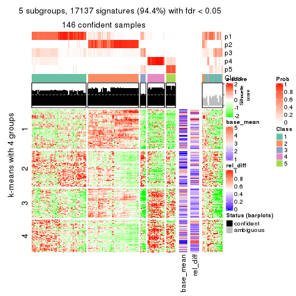</p>

</div>
<div id='tab-SD-hclust-get-signatures-5'>
<pre><code class="r">get_signatures(res, k = 6)
</code></pre>

<p></p>

</div>
</div>


Signature heatmaps where rows are not scaled:


<script>
$( function() {
	$( '#tabs-SD-hclust-get-signatures-no-scale' ).tabs();
} );
</script>
<div id='tabs-SD-hclust-get-signatures-no-scale'>
<ul>
<li><a href='#tab-SD-hclust-get-signatures-no-scale-1'>k = 2</a></li>
<li><a href='#tab-SD-hclust-get-signatures-no-scale-2'>k = 3</a></li>
<li><a href='#tab-SD-hclust-get-signatures-no-scale-3'>k = 4</a></li>
<li><a href='#tab-SD-hclust-get-signatures-no-scale-4'>k = 5</a></li>
<li><a href='#tab-SD-hclust-get-signatures-no-scale-5'>k = 6</a></li>
</ul>
<div id='tab-SD-hclust-get-signatures-no-scale-1'>
<pre><code class="r">get_signatures(res, k = 2, scale_rows = FALSE)
</code></pre>

<p></p>

</div>
<div id='tab-SD-hclust-get-signatures-no-scale-2'>
<pre><code class="r">get_signatures(res, k = 3, scale_rows = FALSE)
</code></pre>

<p></p>

</div>
<div id='tab-SD-hclust-get-signatures-no-scale-3'>
<pre><code class="r">get_signatures(res, k = 4, scale_rows = FALSE)
</code></pre>

<p></p>

</div>
<div id='tab-SD-hclust-get-signatures-no-scale-4'>
<pre><code class="r">get_signatures(res, k = 5, scale_rows = FALSE)
</code></pre>

<p></p>

</div>
<div id='tab-SD-hclust-get-signatures-no-scale-5'>
<pre><code class="r">get_signatures(res, k = 6, scale_rows = FALSE)
</code></pre>

<p></p>

</div>
</div>


Compare the overlap of signatures from different k:

```r
compare_signatures(res)
```


`get_signature()` returns a data frame invisibly. TO get the list of signatures, the function
call should be assigned to a variable explicitly. In following code, if `plot` argument is set
to `FALSE`, no heatmap is plotted while only the differential analysis is performed.

```r
# code only for demonstration
tb = get_signature(res, k = ..., plot = FALSE)
```

An example of the output of `tb` is:

```
#>   which_row         fdr    mean_1    mean_2 scaled_mean_1 scaled_mean_2 km
#> 1        38 0.042760348  8.373488  9.131774    -0.5533452     0.5164555  1
#> 2        40 0.018707592  7.106213  8.469186    -0.6173731     0.5762149  1
#> 3        55 0.019134737 10.221463 11.207825    -0.6159697     0.5749050  1
#> 4        59 0.006059896  5.921854  7.869574    -0.6899429     0.6439467  1
#> 5        60 0.018055526  8.928898 10.211722    -0.6204761     0.5791110  1
#> 6        98 0.009384629 15.714769 14.887706     0.6635654    -0.6193277  2
...
```

The columns in `tb` are:

1. `which_row`: row indices corresponding to the input matrix.
2. `fdr`: FDR for the differential test. 
3. `mean_x`: The mean value in group x.
4. `scaled_mean_x`: The mean value in group x after rows are scaled.
5. `km`: Row groups if k-means clustering is applied to rows.


UMAP plot which shows how samples are separated.


<script>
$( function() {
	$( '#tabs-SD-hclust-dimension-reduction' ).tabs();
} );
</script>
<div id='tabs-SD-hclust-dimension-reduction'>
<ul>
<li><a href='#tab-SD-hclust-dimension-reduction-1'>k = 2</a></li>
<li><a href='#tab-SD-hclust-dimension-reduction-2'>k = 3</a></li>
<li><a href='#tab-SD-hclust-dimension-reduction-3'>k = 4</a></li>
<li><a href='#tab-SD-hclust-dimension-reduction-4'>k = 5</a></li>
<li><a href='#tab-SD-hclust-dimension-reduction-5'>k = 6</a></li>
</ul>
<div id='tab-SD-hclust-dimension-reduction-1'>
<pre><code class="r">dimension_reduction(res, k = 2, method = &quot;UMAP&quot;)
</code></pre>

<p></p>

</div>
<div id='tab-SD-hclust-dimension-reduction-2'>
<pre><code class="r">dimension_reduction(res, k = 3, method = &quot;UMAP&quot;)
</code></pre>

<p></p>

</div>
<div id='tab-SD-hclust-dimension-reduction-3'>
<pre><code class="r">dimension_reduction(res, k = 4, method = &quot;UMAP&quot;)
</code></pre>

<p></p>

</div>
<div id='tab-SD-hclust-dimension-reduction-4'>
<pre><code class="r">dimension_reduction(res, k = 5, method = &quot;UMAP&quot;)
</code></pre>

<p></p>

</div>
<div id='tab-SD-hclust-dimension-reduction-5'>
<pre><code class="r">dimension_reduction(res, k = 6, method = &quot;UMAP&quot;)
</code></pre>

<p></p>

</div>
</div>


Following heatmap shows how subgroups are split when increasing `k`:

```r
collect_classes(res)
```


If matrix rows can be associated to genes, consider to use `functional_enrichment(res,
...)` to perform function enrichment for the signature genes. See [this vignette](http://bioconductor.org/packages/devel/bioc/vignettes/cola/inst/doc/functional_enrichment.html) for more detailed explanations.


 

---------------------------------------------------


### SD:kmeans


The object with results only for a single top-value method and a single partition method 
can be extracted as:

```r
res = res_list["SD", "kmeans"]
# you can also extract it by
# res = res_list["SD:kmeans"]
```

A summary of `res` and all the functions that can be applied to it:

```r
res
```

```
#> A 'ConsensusPartition' object with k = 2, 3, 4, 5, 6.
#>   On a matrix with 18147 rows and 167 columns.
#>   Top rows (1000, 2000, 3000, 4000, 5000) are extracted by 'SD' method.
#>   Subgroups are detected by 'kmeans' method.
#>   Performed in total 1250 partitions by row resampling.
#>   Best k for subgroups seems to be 2.
#> 
#> Following methods can be applied to this 'ConsensusPartition' object:
#>  [1] "cola_report"             "collect_classes"         "collect_plots"          
#>  [4] "collect_stats"           "colnames"                "compare_signatures"     
#>  [7] "consensus_heatmap"       "dimension_reduction"     "functional_enrichment"  
#> [10] "get_anno_col"            "get_anno"                "get_classes"            
#> [13] "get_consensus"           "get_matrix"              "get_membership"         
#> [16] "get_param"               "get_signatures"          "get_stats"              
#> [19] "is_best_k"               "is_stable_k"             "membership_heatmap"     
#> [22] "ncol"                    "nrow"                    "plot_ecdf"              
#> [25] "rownames"                "select_partition_number" "show"                   
#> [28] "suggest_best_k"          "test_to_known_factors"
```

`collect_plots()` function collects all the plots made from `res` for all `k` (number of partitions)
into one single page to provide an easy and fast comparison between different `k`.

```r
collect_plots(res)
```


The plots are:

- The first row: a plot of the ECDF (empirical cumulative distribution
  function) curves of the consensus matrix for each `k` and the heatmap of
  predicted classes for each `k`.
- The second row: heatmaps of the consensus matrix for each `k`.
- The third row: heatmaps of the membership matrix for each `k`.
- The fouth row: heatmaps of the signatures for each `k`.

All the plots in panels can be made by individual functions and they are
plotted later in this section.

`select_partition_number()` produces several plots showing different
statistics for choosing "optimized" `k`. There are following statistics:

- ECDF curves of the consensus matrix for each `k`;
- 1-PAC. [The PAC
  score](https://en.wikipedia.org/wiki/Consensus_clustering#Over-interpretation_potential_of_consensus_clustering)
  measures the proportion of the ambiguous subgrouping.
- Mean silhouette score.
- Concordance. The mean probability of fiting the consensus class ids in all
  partitions.
- Area increased. Denote $A_k$ as the area under the ECDF curve for current
  `k`, the area increased is defined as $A_k - A_{k-1}$.
- Rand index. The percent of pairs of samples that are both in a same cluster
  or both are not in a same cluster in the partition of k and k-1.
- Jaccard index. The ratio of pairs of samples are both in a same cluster in
  the partition of k and k-1 and the pairs of samples are both in a same
  cluster in the partition k or k-1.

The detailed explanations of these statistics can be found in [the _cola_
vignette](http://bioconductor.org/packages/devel/bioc/vignettes/cola/inst/doc/cola.html#toc_13).

Generally speaking, lower PAC score, higher mean silhouette score or higher
concordance corresponds to better partition. Rand index and Jaccard index
measure how similar the current partition is compared to partition with `k-1`.
If they are too similar, we won't accept `k` is better than `k-1`.

```r
select_partition_number(res)
```


The numeric values for all these statistics can be obtained by `get_stats()`.

```r
get_stats(res)
```

```
#>   k 1-PAC mean_silhouette concordance area_increased  Rand Jaccard
#> 2 2 0.859           0.943       0.972         0.4661 0.544   0.544
#> 3 3 0.799           0.872       0.935         0.3764 0.797   0.634
#> 4 4 0.755           0.831       0.832         0.1331 0.861   0.632
#> 5 5 0.774           0.748       0.813         0.0737 0.981   0.928
#> 6 6 0.832           0.832       0.845         0.0447 0.915   0.656
```

`suggest_best_k()` suggests the best $k$ based on these statistics. The rules are as follows:

- All $k$ with Jaccard index larger than 0.95 are removed because increasing
  $k$ does not provide enough extra information. If all $k$ are removed, it is
  marked as no subgroup is detected.
- For all $k$ with 1-PAC score larger than 0.9, the maximal $k$ is taken as
  the best $k$, and other $k$ are marked as optional $k$.
- If it does not fit the second rule. The $k$ with the maximal vote of the
  highest 1-PAC score, highest mean silhouette, and highest concordance is
  taken as the best $k$.

```r
suggest_best_k(res)
```

```
#> [1] 2
```


Following shows the table of the partitions (You need to click the **show/hide
code output** link to see it). The membership matrix (columns with name `p*`)
is inferred by
[`clue::cl_consensus()`](https://www.rdocumentation.org/link/cl_consensus?package=clue)
function with the `SE` method. Basically the value in the membership matrix
represents the probability to belong to a certain group. The finall class
label for an item is determined with the group with highest probability it
belongs to.

In `get_classes()` function, the entropy is calculated from the membership
matrix and the silhouette score is calculated from the consensus matrix.


<script>
$( function() {
	$( '#tabs-SD-kmeans-get-classes' ).tabs();
} );
</script>
<div id='tabs-SD-kmeans-get-classes'>
<ul>
<li><a href='#tab-SD-kmeans-get-classes-1'>k = 2</a></li>
<li><a href='#tab-SD-kmeans-get-classes-2'>k = 3</a></li>
<li><a href='#tab-SD-kmeans-get-classes-3'>k = 4</a></li>
<li><a href='#tab-SD-kmeans-get-classes-4'>k = 5</a></li>
<li><a href='#tab-SD-kmeans-get-classes-5'>k = 6</a></li>
</ul>

<div id='tab-SD-kmeans-get-classes-1'>
<p><a id='tab-SD-kmeans-get-classes-1-a' style='color:#0366d6' href='#'>show/hide code output</a></p>
<pre><code class="r">cbind(get_classes(res, k = 2), get_membership(res, k = 2))
</code></pre>

<pre><code>#&gt;            class entropy silhouette    p1    p2
#&gt; SRR1313062     1  0.0000      0.959 1.000 0.000
#&gt; SRR1313063     1  0.0000      0.959 1.000 0.000
#&gt; SRR1313064     1  0.0000      0.959 1.000 0.000
#&gt; SRR1313065     1  0.0000      0.959 1.000 0.000
#&gt; SRR1313066     1  0.0000      0.959 1.000 0.000
#&gt; SRR1313067     1  0.0000      0.959 1.000 0.000
#&gt; SRR1313068     1  0.0000      0.959 1.000 0.000
#&gt; SRR1313069     1  0.0000      0.959 1.000 0.000
#&gt; SRR1313070     1  0.0000      0.959 1.000 0.000
#&gt; SRR1313071     1  0.0000      0.959 1.000 0.000
#&gt; SRR1313072     1  0.0000      0.959 1.000 0.000
#&gt; SRR1313073     1  0.0000      0.959 1.000 0.000
#&gt; SRR1313074     1  0.0000      0.959 1.000 0.000
#&gt; SRR1313075     1  0.0000      0.959 1.000 0.000
#&gt; SRR1313076     1  0.0000      0.959 1.000 0.000
#&gt; SRR1313077     1  0.0000      0.959 1.000 0.000
#&gt; SRR1313078     1  0.0000      0.959 1.000 0.000
#&gt; SRR1313079     1  0.0000      0.959 1.000 0.000
#&gt; SRR1313080     1  0.0000      0.959 1.000 0.000
#&gt; SRR1313081     1  0.0000      0.959 1.000 0.000
#&gt; SRR1313082     1  0.0000      0.959 1.000 0.000
#&gt; SRR1313083     1  0.0000      0.959 1.000 0.000
#&gt; SRR1313084     1  0.0000      0.959 1.000 0.000
#&gt; SRR1313085     1  0.0000      0.959 1.000 0.000
#&gt; SRR1313086     1  0.0000      0.959 1.000 0.000
#&gt; SRR1313087     1  0.0000      0.959 1.000 0.000
#&gt; SRR1313088     1  0.0000      0.959 1.000 0.000
#&gt; SRR1313089     1  0.0000      0.959 1.000 0.000
#&gt; SRR1313092     1  0.0000      0.959 1.000 0.000
#&gt; SRR1313090     1  0.0376      0.956 0.996 0.004
#&gt; SRR1313091     2  0.0000      0.994 0.000 1.000
#&gt; SRR1313093     1  0.0000      0.959 1.000 0.000
#&gt; SRR1313095     1  0.0000      0.959 1.000 0.000
#&gt; SRR1313096     1  0.0000      0.959 1.000 0.000
#&gt; SRR1313094     1  0.0000      0.959 1.000 0.000
#&gt; SRR1313097     1  0.7299      0.778 0.796 0.204
#&gt; SRR1313099     1  0.8608      0.663 0.716 0.284
#&gt; SRR1313098     1  0.0000      0.959 1.000 0.000
#&gt; SRR1313101     1  0.7299      0.778 0.796 0.204
#&gt; SRR1313102     1  0.7299      0.778 0.796 0.204
#&gt; SRR1313103     1  0.8608      0.663 0.716 0.284
#&gt; SRR1313100     1  0.0000      0.959 1.000 0.000
#&gt; SRR1313105     1  0.6973      0.796 0.812 0.188
#&gt; SRR1313104     1  0.0376      0.956 0.996 0.004
#&gt; SRR1313107     1  0.7299      0.778 0.796 0.204
#&gt; SRR1313106     1  0.4161      0.895 0.916 0.084
#&gt; SRR1313109     2  0.8909      0.505 0.308 0.692
#&gt; SRR1313108     1  0.0000      0.959 1.000 0.000
#&gt; SRR1313111     1  0.7299      0.778 0.796 0.204
#&gt; SRR1313110     1  0.0000      0.959 1.000 0.000
#&gt; SRR1313112     1  0.8608      0.663 0.716 0.284
#&gt; SRR1313113     1  0.7299      0.778 0.796 0.204
#&gt; SRR1313115     1  0.0000      0.959 1.000 0.000
#&gt; SRR1313114     1  0.0000      0.959 1.000 0.000
#&gt; SRR1313117     1  0.0376      0.956 0.996 0.004
#&gt; SRR1313118     1  0.0000      0.959 1.000 0.000
#&gt; SRR1313116     1  0.8763      0.643 0.704 0.296
#&gt; SRR1313120     1  0.7219      0.782 0.800 0.200
#&gt; SRR1313119     1  0.0376      0.956 0.996 0.004
#&gt; SRR1313122     1  0.0000      0.959 1.000 0.000
#&gt; SRR1313124     1  0.0376      0.956 0.996 0.004
#&gt; SRR1313121     1  0.0376      0.956 0.996 0.004
#&gt; SRR1313125     1  0.0376      0.956 0.996 0.004
#&gt; SRR1313127     1  0.0000      0.959 1.000 0.000
#&gt; SRR1313123     1  0.0000      0.959 1.000 0.000
#&gt; SRR1313128     1  0.0000      0.959 1.000 0.000
#&gt; SRR1313126     1  0.0000      0.959 1.000 0.000
#&gt; SRR1313130     2  0.0000      0.994 0.000 1.000
#&gt; SRR1313132     1  0.0000      0.959 1.000 0.000
#&gt; SRR1313129     1  0.8608      0.663 0.716 0.284
#&gt; SRR1313133     1  0.0000      0.959 1.000 0.000
#&gt; SRR1313131     1  0.0000      0.959 1.000 0.000
#&gt; SRR1313134     1  0.0000      0.959 1.000 0.000
#&gt; SRR1313135     1  0.0000      0.959 1.000 0.000
#&gt; SRR1313136     1  0.0000      0.959 1.000 0.000
#&gt; SRR1313137     1  0.0000      0.959 1.000 0.000
#&gt; SRR1313138     1  0.7139      0.787 0.804 0.196
#&gt; SRR1313140     1  0.0000      0.959 1.000 0.000
#&gt; SRR1313141     1  0.0000      0.959 1.000 0.000
#&gt; SRR1313139     1  0.0000      0.959 1.000 0.000
#&gt; SRR1313143     1  0.0000      0.959 1.000 0.000
#&gt; SRR1313142     1  0.0000      0.959 1.000 0.000
#&gt; SRR1313144     1  0.0000      0.959 1.000 0.000
#&gt; SRR1313145     1  0.0000      0.959 1.000 0.000
#&gt; SRR1313146     1  0.0000      0.959 1.000 0.000
#&gt; SRR1313147     1  0.0000      0.959 1.000 0.000
#&gt; SRR1313150     1  0.0000      0.959 1.000 0.000
#&gt; SRR1313149     1  0.0000      0.959 1.000 0.000
#&gt; SRR1313152     1  0.0000      0.959 1.000 0.000
#&gt; SRR1313151     1  0.0000      0.959 1.000 0.000
#&gt; SRR1313154     1  0.0000      0.959 1.000 0.000
#&gt; SRR1313153     1  0.0000      0.959 1.000 0.000
#&gt; SRR1313156     1  0.5294      0.863 0.880 0.120
#&gt; SRR1313155     1  0.0000      0.959 1.000 0.000
#&gt; SRR1313157     1  0.0000      0.959 1.000 0.000
#&gt; SRR1313158     1  0.0000      0.959 1.000 0.000
#&gt; SRR1313161     1  0.0000      0.959 1.000 0.000
#&gt; SRR1313159     1  0.9000      0.606 0.684 0.316
#&gt; SRR1313160     1  0.0000      0.959 1.000 0.000
#&gt; SRR1313162     1  0.0000      0.959 1.000 0.000
#&gt; SRR1313163     1  0.5294      0.863 0.880 0.120
#&gt; SRR1313165     1  0.0000      0.959 1.000 0.000
#&gt; SRR1313166     1  0.0000      0.959 1.000 0.000
#&gt; SRR1313164     1  0.0000      0.959 1.000 0.000
#&gt; SRR1313167     1  0.0000      0.959 1.000 0.000
#&gt; SRR1313168     1  0.0000      0.959 1.000 0.000
#&gt; SRR1313170     1  0.7299      0.778 0.796 0.204
#&gt; SRR1313169     1  0.0000      0.959 1.000 0.000
#&gt; SRR1313172     1  0.7883      0.735 0.764 0.236
#&gt; SRR1313171     1  0.0000      0.959 1.000 0.000
#&gt; SRR1313174     2  0.0000      0.994 0.000 1.000
#&gt; SRR1313173     1  0.0000      0.959 1.000 0.000
#&gt; SRR1313176     2  0.0000      0.994 0.000 1.000
#&gt; SRR1313175     2  0.0000      0.994 0.000 1.000
#&gt; SRR1313178     2  0.0000      0.994 0.000 1.000
#&gt; SRR1313177     2  0.0000      0.994 0.000 1.000
#&gt; SRR1313179     2  0.0000      0.994 0.000 1.000
#&gt; SRR1313180     2  0.0000      0.994 0.000 1.000
#&gt; SRR1313181     2  0.0000      0.994 0.000 1.000
#&gt; SRR1313183     2  0.0000      0.994 0.000 1.000
#&gt; SRR1313182     2  0.0000      0.994 0.000 1.000
#&gt; SRR1313184     2  0.0000      0.994 0.000 1.000
#&gt; SRR1313185     2  0.0000      0.994 0.000 1.000
#&gt; SRR1313188     2  0.0000      0.994 0.000 1.000
#&gt; SRR1313187     2  0.0000      0.994 0.000 1.000
#&gt; SRR1313186     2  0.0000      0.994 0.000 1.000
#&gt; SRR1313189     2  0.0000      0.994 0.000 1.000
#&gt; SRR1313190     2  0.0000      0.994 0.000 1.000
#&gt; SRR1313191     2  0.0000      0.994 0.000 1.000
#&gt; SRR1313192     2  0.0000      0.994 0.000 1.000
#&gt; SRR1313193     2  0.0000      0.994 0.000 1.000
#&gt; SRR1313194     2  0.0000      0.994 0.000 1.000
#&gt; SRR1313195     2  0.0000      0.994 0.000 1.000
#&gt; SRR1313196     2  0.0000      0.994 0.000 1.000
#&gt; SRR1313197     2  0.0000      0.994 0.000 1.000
#&gt; SRR1313198     2  0.0000      0.994 0.000 1.000
#&gt; SRR1313199     2  0.0000      0.994 0.000 1.000
#&gt; SRR1313200     2  0.0000      0.994 0.000 1.000
#&gt; SRR1313201     2  0.0000      0.994 0.000 1.000
#&gt; SRR1313202     2  0.0000      0.994 0.000 1.000
#&gt; SRR1313203     1  0.0000      0.959 1.000 0.000
#&gt; SRR1313204     2  0.0000      0.994 0.000 1.000
#&gt; SRR1313205     2  0.0000      0.994 0.000 1.000
#&gt; SRR1313207     2  0.0000      0.994 0.000 1.000
#&gt; SRR1313208     2  0.0000      0.994 0.000 1.000
#&gt; SRR1313206     2  0.0000      0.994 0.000 1.000
#&gt; SRR1313210     2  0.0000      0.994 0.000 1.000
#&gt; SRR1313209     2  0.0000      0.994 0.000 1.000
#&gt; SRR1313211     2  0.0000      0.994 0.000 1.000
#&gt; SRR1313212     2  0.0000      0.994 0.000 1.000
#&gt; SRR1313214     2  0.0000      0.994 0.000 1.000
#&gt; SRR1313215     2  0.0000      0.994 0.000 1.000
#&gt; SRR1313213     2  0.0000      0.994 0.000 1.000
#&gt; SRR1313216     2  0.0000      0.994 0.000 1.000
#&gt; SRR1313217     2  0.0000      0.994 0.000 1.000
#&gt; SRR1313219     2  0.0000      0.994 0.000 1.000
#&gt; SRR1313220     2  0.0000      0.994 0.000 1.000
#&gt; SRR1313218     2  0.0000      0.994 0.000 1.000
#&gt; SRR1313222     2  0.0000      0.994 0.000 1.000
#&gt; SRR1313221     2  0.0000      0.994 0.000 1.000
#&gt; SRR1313223     2  0.0000      0.994 0.000 1.000
#&gt; SRR1313224     2  0.0000      0.994 0.000 1.000
#&gt; SRR1313225     2  0.0000      0.994 0.000 1.000
#&gt; SRR1313226     2  0.0000      0.994 0.000 1.000
#&gt; SRR1313227     2  0.0000      0.994 0.000 1.000
#&gt; SRR1313228     2  0.0000      0.994 0.000 1.000
#&gt; SRR1313229     2  0.0000      0.994 0.000 1.000
</code></pre>

<script>
$('#tab-SD-kmeans-get-classes-1-a').parent().next().next().hide();
$('#tab-SD-kmeans-get-classes-1-a').click(function(){
  $('#tab-SD-kmeans-get-classes-1-a').parent().next().next().toggle();
  return(false);
});
</script>
</div>

<div id='tab-SD-kmeans-get-classes-2'>
<p><a id='tab-SD-kmeans-get-classes-2-a' style='color:#0366d6' href='#'>show/hide code output</a></p>
<pre><code class="r">cbind(get_classes(res, k = 3), get_membership(res, k = 3))
</code></pre>

<pre><code>#&gt;            class entropy silhouette    p1    p2    p3
#&gt; SRR1313062     1  0.1529     0.9069 0.960 0.000 0.040
#&gt; SRR1313063     1  0.1163     0.9133 0.972 0.000 0.028
#&gt; SRR1313064     1  0.0237     0.9231 0.996 0.000 0.004
#&gt; SRR1313065     1  0.0237     0.9231 0.996 0.000 0.004
#&gt; SRR1313066     1  0.0237     0.9231 0.996 0.000 0.004
#&gt; SRR1313067     1  0.1964     0.8972 0.944 0.000 0.056
#&gt; SRR1313068     1  0.1964     0.8972 0.944 0.000 0.056
#&gt; SRR1313069     1  0.0237     0.9231 0.996 0.000 0.004
#&gt; SRR1313070     1  0.0237     0.9231 0.996 0.000 0.004
#&gt; SRR1313071     1  0.0237     0.9231 0.996 0.000 0.004
#&gt; SRR1313072     1  0.0237     0.9231 0.996 0.000 0.004
#&gt; SRR1313073     1  0.0237     0.9231 0.996 0.000 0.004
#&gt; SRR1313074     1  0.0237     0.9231 0.996 0.000 0.004
#&gt; SRR1313075     1  0.0237     0.9231 0.996 0.000 0.004
#&gt; SRR1313076     1  0.1964     0.8972 0.944 0.000 0.056
#&gt; SRR1313077     1  0.1964     0.8972 0.944 0.000 0.056
#&gt; SRR1313078     1  0.3267     0.8473 0.884 0.000 0.116
#&gt; SRR1313079     1  0.0237     0.9231 0.996 0.000 0.004
#&gt; SRR1313080     1  0.1964     0.8972 0.944 0.000 0.056
#&gt; SRR1313081     1  0.1964     0.8972 0.944 0.000 0.056
#&gt; SRR1313082     1  0.0237     0.9231 0.996 0.000 0.004
#&gt; SRR1313083     1  0.0237     0.9231 0.996 0.000 0.004
#&gt; SRR1313084     1  0.0237     0.9231 0.996 0.000 0.004
#&gt; SRR1313085     1  0.0237     0.9231 0.996 0.000 0.004
#&gt; SRR1313086     1  0.0237     0.9231 0.996 0.000 0.004
#&gt; SRR1313087     1  0.0237     0.9231 0.996 0.000 0.004
#&gt; SRR1313088     1  0.0237     0.9231 0.996 0.000 0.004
#&gt; SRR1313089     1  0.0237     0.9231 0.996 0.000 0.004
#&gt; SRR1313092     3  0.0000     0.8929 0.000 0.000 1.000
#&gt; SRR1313090     3  0.0000     0.8929 0.000 0.000 1.000
#&gt; SRR1313091     2  0.6267     0.1781 0.000 0.548 0.452
#&gt; SRR1313093     3  0.0000     0.8929 0.000 0.000 1.000
#&gt; SRR1313095     3  0.0000     0.8929 0.000 0.000 1.000
#&gt; SRR1313096     3  0.2448     0.8492 0.076 0.000 0.924
#&gt; SRR1313094     3  0.0000     0.8929 0.000 0.000 1.000
#&gt; SRR1313097     3  0.0000     0.8929 0.000 0.000 1.000
#&gt; SRR1313099     3  0.0000     0.8929 0.000 0.000 1.000
#&gt; SRR1313098     3  0.0000     0.8929 0.000 0.000 1.000
#&gt; SRR1313101     3  0.0000     0.8929 0.000 0.000 1.000
#&gt; SRR1313102     3  0.0000     0.8929 0.000 0.000 1.000
#&gt; SRR1313103     3  0.0000     0.8929 0.000 0.000 1.000
#&gt; SRR1313100     3  0.4291     0.7440 0.180 0.000 0.820
#&gt; SRR1313105     3  0.0000     0.8929 0.000 0.000 1.000
#&gt; SRR1313104     3  0.0000     0.8929 0.000 0.000 1.000
#&gt; SRR1313107     3  0.0000     0.8929 0.000 0.000 1.000
#&gt; SRR1313106     3  0.0237     0.8904 0.000 0.004 0.996
#&gt; SRR1313109     3  0.4452     0.7028 0.000 0.192 0.808
#&gt; SRR1313108     3  0.4452     0.7084 0.192 0.000 0.808
#&gt; SRR1313111     3  0.0000     0.8929 0.000 0.000 1.000
#&gt; SRR1313110     3  0.0000     0.8929 0.000 0.000 1.000
#&gt; SRR1313112     3  0.0000     0.8929 0.000 0.000 1.000
#&gt; SRR1313113     3  0.0000     0.8929 0.000 0.000 1.000
#&gt; SRR1313115     3  0.0000     0.8929 0.000 0.000 1.000
#&gt; SRR1313114     3  0.0000     0.8929 0.000 0.000 1.000
#&gt; SRR1313117     3  0.0000     0.8929 0.000 0.000 1.000
#&gt; SRR1313118     3  0.0000     0.8929 0.000 0.000 1.000
#&gt; SRR1313116     3  0.0237     0.8904 0.000 0.004 0.996
#&gt; SRR1313120     3  0.0000     0.8929 0.000 0.000 1.000
#&gt; SRR1313119     3  0.0000     0.8929 0.000 0.000 1.000
#&gt; SRR1313122     3  0.2066     0.8614 0.060 0.000 0.940
#&gt; SRR1313124     3  0.0000     0.8929 0.000 0.000 1.000
#&gt; SRR1313121     3  0.0000     0.8929 0.000 0.000 1.000
#&gt; SRR1313125     3  0.0000     0.8929 0.000 0.000 1.000
#&gt; SRR1313127     3  0.0000     0.8929 0.000 0.000 1.000
#&gt; SRR1313123     3  0.0000     0.8929 0.000 0.000 1.000
#&gt; SRR1313128     3  0.4235     0.8371 0.176 0.000 0.824
#&gt; SRR1313126     3  0.2165     0.8586 0.064 0.000 0.936
#&gt; SRR1313130     3  0.5859     0.4712 0.000 0.344 0.656
#&gt; SRR1313132     3  0.1860     0.8832 0.052 0.000 0.948
#&gt; SRR1313129     3  0.0000     0.8929 0.000 0.000 1.000
#&gt; SRR1313133     3  0.4121     0.8423 0.168 0.000 0.832
#&gt; SRR1313131     3  0.6305     0.0443 0.484 0.000 0.516
#&gt; SRR1313134     3  0.4235     0.8371 0.176 0.000 0.824
#&gt; SRR1313135     3  0.4235     0.8371 0.176 0.000 0.824
#&gt; SRR1313136     3  0.4121     0.8423 0.168 0.000 0.832
#&gt; SRR1313137     3  0.4974     0.7849 0.236 0.000 0.764
#&gt; SRR1313138     3  0.2356     0.8806 0.072 0.000 0.928
#&gt; SRR1313140     1  0.0747     0.9157 0.984 0.000 0.016
#&gt; SRR1313141     1  0.6307    -0.1196 0.512 0.000 0.488
#&gt; SRR1313139     3  0.5948     0.5831 0.360 0.000 0.640
#&gt; SRR1313143     1  0.5988     0.3383 0.632 0.000 0.368
#&gt; SRR1313142     3  0.4235     0.8371 0.176 0.000 0.824
#&gt; SRR1313144     3  0.4235     0.8371 0.176 0.000 0.824
#&gt; SRR1313145     3  0.4121     0.8423 0.168 0.000 0.832
#&gt; SRR1313146     3  0.4235     0.8371 0.176 0.000 0.824
#&gt; SRR1313147     3  0.4974     0.7849 0.236 0.000 0.764
#&gt; SRR1313150     3  0.4974     0.7849 0.236 0.000 0.764
#&gt; SRR1313149     1  0.6095     0.2650 0.608 0.000 0.392
#&gt; SRR1313152     3  0.4974     0.7849 0.236 0.000 0.764
#&gt; SRR1313151     3  0.4235     0.8371 0.176 0.000 0.824
#&gt; SRR1313154     3  0.4235     0.8371 0.176 0.000 0.824
#&gt; SRR1313153     3  0.4235     0.8371 0.176 0.000 0.824
#&gt; SRR1313156     3  0.2356     0.8806 0.072 0.000 0.928
#&gt; SRR1313155     3  0.4235     0.8371 0.176 0.000 0.824
#&gt; SRR1313157     3  0.4974     0.7849 0.236 0.000 0.764
#&gt; SRR1313158     3  0.2356     0.8806 0.072 0.000 0.928
#&gt; SRR1313161     3  0.3619     0.8556 0.136 0.000 0.864
#&gt; SRR1313159     3  0.2152     0.8777 0.016 0.036 0.948
#&gt; SRR1313160     3  0.3816     0.8508 0.148 0.000 0.852
#&gt; SRR1313162     3  0.0000     0.8929 0.000 0.000 1.000
#&gt; SRR1313163     3  0.2356     0.8806 0.072 0.000 0.928
#&gt; SRR1313165     3  0.4796     0.8015 0.220 0.000 0.780
#&gt; SRR1313166     3  0.3879     0.8513 0.152 0.000 0.848
#&gt; SRR1313164     3  0.2711     0.8768 0.088 0.000 0.912
#&gt; SRR1313167     3  0.4974     0.7849 0.236 0.000 0.764
#&gt; SRR1313168     3  0.4399     0.8286 0.188 0.000 0.812
#&gt; SRR1313170     3  0.0000     0.8929 0.000 0.000 1.000
#&gt; SRR1313169     3  0.4974     0.7849 0.236 0.000 0.764
#&gt; SRR1313172     3  0.0000     0.8929 0.000 0.000 1.000
#&gt; SRR1313171     3  0.3879     0.8513 0.152 0.000 0.848
#&gt; SRR1313174     2  0.0000     0.9752 0.000 1.000 0.000
#&gt; SRR1313173     1  0.6252     0.2140 0.556 0.000 0.444
#&gt; SRR1313176     2  0.0237     0.9751 0.004 0.996 0.000
#&gt; SRR1313175     2  0.0000     0.9752 0.000 1.000 0.000
#&gt; SRR1313178     2  0.0237     0.9751 0.004 0.996 0.000
#&gt; SRR1313177     2  0.0237     0.9751 0.004 0.996 0.000
#&gt; SRR1313179     2  0.0237     0.9751 0.004 0.996 0.000
#&gt; SRR1313180     2  0.4452     0.7310 0.000 0.808 0.192
#&gt; SRR1313181     2  0.0237     0.9751 0.004 0.996 0.000
#&gt; SRR1313183     2  0.0237     0.9751 0.004 0.996 0.000
#&gt; SRR1313182     2  0.0000     0.9752 0.000 1.000 0.000
#&gt; SRR1313184     2  0.0237     0.9751 0.004 0.996 0.000
#&gt; SRR1313185     2  0.0000     0.9752 0.000 1.000 0.000
#&gt; SRR1313188     2  0.0000     0.9752 0.000 1.000 0.000
#&gt; SRR1313187     2  0.0000     0.9752 0.000 1.000 0.000
#&gt; SRR1313186     2  0.0000     0.9752 0.000 1.000 0.000
#&gt; SRR1313189     2  0.0237     0.9751 0.004 0.996 0.000
#&gt; SRR1313190     2  0.0237     0.9751 0.004 0.996 0.000
#&gt; SRR1313191     2  0.0000     0.9752 0.000 1.000 0.000
#&gt; SRR1313192     2  0.0237     0.9751 0.004 0.996 0.000
#&gt; SRR1313193     2  0.0000     0.9752 0.000 1.000 0.000
#&gt; SRR1313194     2  0.0000     0.9752 0.000 1.000 0.000
#&gt; SRR1313195     2  0.0000     0.9752 0.000 1.000 0.000
#&gt; SRR1313196     2  0.0000     0.9752 0.000 1.000 0.000
#&gt; SRR1313197     2  0.0000     0.9752 0.000 1.000 0.000
#&gt; SRR1313198     2  0.0000     0.9752 0.000 1.000 0.000
#&gt; SRR1313199     2  0.0237     0.9751 0.004 0.996 0.000
#&gt; SRR1313200     2  0.0000     0.9752 0.000 1.000 0.000
#&gt; SRR1313201     2  0.0237     0.9751 0.004 0.996 0.000
#&gt; SRR1313202     2  0.0000     0.9752 0.000 1.000 0.000
#&gt; SRR1313203     1  0.0592     0.9203 0.988 0.000 0.012
#&gt; SRR1313204     2  0.0237     0.9751 0.004 0.996 0.000
#&gt; SRR1313205     2  0.0237     0.9751 0.004 0.996 0.000
#&gt; SRR1313207     2  0.0237     0.9751 0.004 0.996 0.000
#&gt; SRR1313208     2  0.0237     0.9751 0.004 0.996 0.000
#&gt; SRR1313206     2  0.0237     0.9751 0.004 0.996 0.000
#&gt; SRR1313210     2  0.0000     0.9752 0.000 1.000 0.000
#&gt; SRR1313209     2  0.0000     0.9752 0.000 1.000 0.000
#&gt; SRR1313211     2  0.0000     0.9752 0.000 1.000 0.000
#&gt; SRR1313212     2  0.0237     0.9751 0.004 0.996 0.000
#&gt; SRR1313214     2  0.0000     0.9752 0.000 1.000 0.000
#&gt; SRR1313215     2  0.0000     0.9752 0.000 1.000 0.000
#&gt; SRR1313213     2  0.0237     0.9751 0.004 0.996 0.000
#&gt; SRR1313216     2  0.0000     0.9752 0.000 1.000 0.000
#&gt; SRR1313217     2  0.0000     0.9752 0.000 1.000 0.000
#&gt; SRR1313219     2  0.0000     0.9752 0.000 1.000 0.000
#&gt; SRR1313220     2  0.0237     0.9751 0.004 0.996 0.000
#&gt; SRR1313218     2  0.0000     0.9752 0.000 1.000 0.000
#&gt; SRR1313222     2  0.0237     0.9751 0.004 0.996 0.000
#&gt; SRR1313221     2  0.0237     0.9751 0.004 0.996 0.000
#&gt; SRR1313223     2  0.0237     0.9751 0.004 0.996 0.000
#&gt; SRR1313224     2  0.0000     0.9752 0.000 1.000 0.000
#&gt; SRR1313225     2  0.0000     0.9752 0.000 1.000 0.000
#&gt; SRR1313226     2  0.6244     0.2296 0.000 0.560 0.440
#&gt; SRR1313227     2  0.0237     0.9751 0.004 0.996 0.000
#&gt; SRR1313228     2  0.0237     0.9751 0.004 0.996 0.000
#&gt; SRR1313229     2  0.0237     0.9751 0.004 0.996 0.000
</code></pre>

<script>
$('#tab-SD-kmeans-get-classes-2-a').parent().next().next().hide();
$('#tab-SD-kmeans-get-classes-2-a').click(function(){
  $('#tab-SD-kmeans-get-classes-2-a').parent().next().next().toggle();
  return(false);
});
</script>
</div>

<div id='tab-SD-kmeans-get-classes-3'>
<p><a id='tab-SD-kmeans-get-classes-3-a' style='color:#0366d6' href='#'>show/hide code output</a></p>
<pre><code class="r">cbind(get_classes(res, k = 4), get_membership(res, k = 4))
</code></pre>

<pre><code>#&gt;            class entropy silhouette    p1    p2    p3    p4
#&gt; SRR1313062     4  0.2271     0.8970 0.076 0.000 0.008 0.916
#&gt; SRR1313063     4  0.2271     0.8970 0.076 0.000 0.008 0.916
#&gt; SRR1313064     4  0.0469     0.9174 0.012 0.000 0.000 0.988
#&gt; SRR1313065     4  0.0592     0.9175 0.016 0.000 0.000 0.984
#&gt; SRR1313066     4  0.0817     0.9167 0.024 0.000 0.000 0.976
#&gt; SRR1313067     4  0.2271     0.8970 0.076 0.000 0.008 0.916
#&gt; SRR1313068     4  0.2271     0.8970 0.076 0.000 0.008 0.916
#&gt; SRR1313069     4  0.0592     0.9175 0.016 0.000 0.000 0.984
#&gt; SRR1313070     4  0.0817     0.9167 0.024 0.000 0.000 0.976
#&gt; SRR1313071     4  0.0817     0.9167 0.024 0.000 0.000 0.976
#&gt; SRR1313072     4  0.0817     0.9167 0.024 0.000 0.000 0.976
#&gt; SRR1313073     4  0.1022     0.9098 0.032 0.000 0.000 0.968
#&gt; SRR1313074     4  0.0592     0.9175 0.016 0.000 0.000 0.984
#&gt; SRR1313075     4  0.0817     0.9167 0.024 0.000 0.000 0.976
#&gt; SRR1313076     4  0.2271     0.8970 0.076 0.000 0.008 0.916
#&gt; SRR1313077     4  0.2271     0.8970 0.076 0.000 0.008 0.916
#&gt; SRR1313078     4  0.4214     0.7984 0.204 0.000 0.016 0.780
#&gt; SRR1313079     4  0.0469     0.9174 0.012 0.000 0.000 0.988
#&gt; SRR1313080     4  0.2271     0.8970 0.076 0.000 0.008 0.916
#&gt; SRR1313081     4  0.2271     0.8970 0.076 0.000 0.008 0.916
#&gt; SRR1313082     4  0.0592     0.9175 0.016 0.000 0.000 0.984
#&gt; SRR1313083     4  0.0592     0.9175 0.016 0.000 0.000 0.984
#&gt; SRR1313084     4  0.0817     0.9167 0.024 0.000 0.000 0.976
#&gt; SRR1313085     4  0.0817     0.9167 0.024 0.000 0.000 0.976
#&gt; SRR1313086     4  0.0592     0.9175 0.016 0.000 0.000 0.984
#&gt; SRR1313087     4  0.0469     0.9174 0.012 0.000 0.000 0.988
#&gt; SRR1313088     4  0.0592     0.9175 0.016 0.000 0.000 0.984
#&gt; SRR1313089     4  0.0817     0.9167 0.024 0.000 0.000 0.976
#&gt; SRR1313092     3  0.0188     0.8682 0.004 0.000 0.996 0.000
#&gt; SRR1313090     3  0.0188     0.8691 0.004 0.000 0.996 0.000
#&gt; SRR1313091     3  0.4817     0.4362 0.000 0.388 0.612 0.000
#&gt; SRR1313093     3  0.3401     0.7446 0.152 0.000 0.840 0.008
#&gt; SRR1313095     3  0.2198     0.8217 0.072 0.000 0.920 0.008
#&gt; SRR1313096     3  0.5889     0.5784 0.212 0.000 0.688 0.100
#&gt; SRR1313094     3  0.0188     0.8682 0.004 0.000 0.996 0.000
#&gt; SRR1313097     3  0.0000     0.8690 0.000 0.000 1.000 0.000
#&gt; SRR1313099     3  0.2011     0.8157 0.080 0.000 0.920 0.000
#&gt; SRR1313098     3  0.0524     0.8647 0.004 0.000 0.988 0.008
#&gt; SRR1313101     3  0.0188     0.8691 0.004 0.000 0.996 0.000
#&gt; SRR1313102     3  0.0188     0.8691 0.004 0.000 0.996 0.000
#&gt; SRR1313103     3  0.0000     0.8690 0.000 0.000 1.000 0.000
#&gt; SRR1313100     3  0.3286     0.7832 0.080 0.000 0.876 0.044
#&gt; SRR1313105     3  0.0000     0.8690 0.000 0.000 1.000 0.000
#&gt; SRR1313104     3  0.0188     0.8691 0.004 0.000 0.996 0.000
#&gt; SRR1313107     3  0.2589     0.7828 0.116 0.000 0.884 0.000
#&gt; SRR1313106     3  0.1978     0.8137 0.004 0.068 0.928 0.000
#&gt; SRR1313109     3  0.2408     0.7821 0.000 0.104 0.896 0.000
#&gt; SRR1313108     3  0.6514     0.5111 0.212 0.000 0.636 0.152
#&gt; SRR1313111     3  0.0000     0.8690 0.000 0.000 1.000 0.000
#&gt; SRR1313110     3  0.0188     0.8691 0.004 0.000 0.996 0.000
#&gt; SRR1313112     3  0.0188     0.8691 0.004 0.000 0.996 0.000
#&gt; SRR1313113     3  0.0000     0.8690 0.000 0.000 1.000 0.000
#&gt; SRR1313115     3  0.3249     0.7531 0.140 0.000 0.852 0.008
#&gt; SRR1313114     3  0.0188     0.8691 0.004 0.000 0.996 0.000
#&gt; SRR1313117     3  0.0188     0.8691 0.004 0.000 0.996 0.000
#&gt; SRR1313118     3  0.0188     0.8691 0.004 0.000 0.996 0.000
#&gt; SRR1313116     3  0.3688     0.6510 0.000 0.208 0.792 0.000
#&gt; SRR1313120     3  0.2589     0.7828 0.116 0.000 0.884 0.000
#&gt; SRR1313119     3  0.0188     0.8691 0.004 0.000 0.996 0.000
#&gt; SRR1313122     3  0.2450     0.8150 0.072 0.000 0.912 0.016
#&gt; SRR1313124     3  0.0188     0.8691 0.004 0.000 0.996 0.000
#&gt; SRR1313121     3  0.0188     0.8691 0.004 0.000 0.996 0.000
#&gt; SRR1313125     3  0.0188     0.8691 0.004 0.000 0.996 0.000
#&gt; SRR1313127     3  0.0672     0.8650 0.008 0.000 0.984 0.008
#&gt; SRR1313123     3  0.0188     0.8691 0.004 0.000 0.996 0.000
#&gt; SRR1313128     1  0.5646     0.7876 0.672 0.000 0.272 0.056
#&gt; SRR1313126     3  0.3286     0.7886 0.080 0.000 0.876 0.044
#&gt; SRR1313130     3  0.3837     0.6343 0.000 0.224 0.776 0.000
#&gt; SRR1313132     1  0.4936     0.7841 0.652 0.000 0.340 0.008
#&gt; SRR1313129     3  0.0188     0.8691 0.004 0.000 0.996 0.000
#&gt; SRR1313133     1  0.5672     0.7865 0.668 0.000 0.276 0.056
#&gt; SRR1313131     4  0.7688     0.2367 0.232 0.000 0.328 0.440
#&gt; SRR1313134     1  0.5672     0.7865 0.668 0.000 0.276 0.056
#&gt; SRR1313135     1  0.6042     0.8625 0.560 0.000 0.392 0.048
#&gt; SRR1313136     1  0.6020     0.8643 0.568 0.000 0.384 0.048
#&gt; SRR1313137     1  0.6296     0.8631 0.548 0.000 0.388 0.064
#&gt; SRR1313138     1  0.5650     0.8284 0.544 0.000 0.432 0.024
#&gt; SRR1313140     1  0.6253     0.3370 0.544 0.000 0.060 0.396
#&gt; SRR1313141     1  0.7040     0.0670 0.460 0.000 0.120 0.420
#&gt; SRR1313139     1  0.6738     0.8324 0.544 0.000 0.352 0.104
#&gt; SRR1313143     4  0.6607     0.2352 0.400 0.000 0.084 0.516
#&gt; SRR1313142     1  0.5943     0.8612 0.592 0.000 0.360 0.048
#&gt; SRR1313144     1  0.6233     0.8637 0.552 0.000 0.388 0.060
#&gt; SRR1313145     1  0.5929     0.8597 0.596 0.000 0.356 0.048
#&gt; SRR1313146     1  0.5957     0.8625 0.588 0.000 0.364 0.048
#&gt; SRR1313147     1  0.6357     0.8616 0.544 0.000 0.388 0.068
#&gt; SRR1313150     1  0.6357     0.8616 0.544 0.000 0.388 0.068
#&gt; SRR1313149     1  0.6709    -0.0702 0.460 0.000 0.088 0.452
#&gt; SRR1313152     1  0.6296     0.8631 0.548 0.000 0.388 0.064
#&gt; SRR1313151     1  0.5954     0.8549 0.604 0.000 0.344 0.052
#&gt; SRR1313154     1  0.5524     0.7984 0.676 0.000 0.276 0.048
#&gt; SRR1313153     1  0.5957     0.8625 0.588 0.000 0.364 0.048
#&gt; SRR1313156     1  0.5517     0.8435 0.568 0.000 0.412 0.020
#&gt; SRR1313155     1  0.6020     0.8643 0.568 0.000 0.384 0.048
#&gt; SRR1313157     1  0.6357     0.8616 0.544 0.000 0.388 0.068
#&gt; SRR1313158     1  0.5517     0.8435 0.568 0.000 0.412 0.020
#&gt; SRR1313161     1  0.5950     0.8423 0.544 0.000 0.416 0.040
#&gt; SRR1313159     1  0.5263     0.7915 0.544 0.008 0.448 0.000
#&gt; SRR1313160     1  0.6079     0.8506 0.544 0.000 0.408 0.048
#&gt; SRR1313162     1  0.5268     0.7822 0.540 0.000 0.452 0.008
#&gt; SRR1313163     1  0.5564     0.8236 0.544 0.000 0.436 0.020
#&gt; SRR1313165     1  0.6306     0.8608 0.544 0.000 0.392 0.064
#&gt; SRR1313166     1  0.5442     0.8027 0.672 0.000 0.288 0.040
#&gt; SRR1313164     1  0.5085     0.7948 0.676 0.000 0.304 0.020
#&gt; SRR1313167     1  0.6357     0.8616 0.544 0.000 0.388 0.068
#&gt; SRR1313168     1  0.6296     0.8631 0.548 0.000 0.388 0.064
#&gt; SRR1313170     3  0.0376     0.8668 0.004 0.004 0.992 0.000
#&gt; SRR1313169     1  0.6357     0.8616 0.544 0.000 0.388 0.068
#&gt; SRR1313172     3  0.3743     0.7242 0.160 0.000 0.824 0.016
#&gt; SRR1313171     1  0.5672     0.7865 0.668 0.000 0.276 0.056
#&gt; SRR1313174     2  0.0000     0.8905 0.000 1.000 0.000 0.000
#&gt; SRR1313173     4  0.7626     0.3090 0.232 0.000 0.304 0.464
#&gt; SRR1313176     2  0.3907     0.8884 0.232 0.768 0.000 0.000
#&gt; SRR1313175     2  0.0000     0.8905 0.000 1.000 0.000 0.000
#&gt; SRR1313178     2  0.3907     0.8884 0.232 0.768 0.000 0.000
#&gt; SRR1313177     2  0.3907     0.8884 0.232 0.768 0.000 0.000
#&gt; SRR1313179     2  0.3907     0.8884 0.232 0.768 0.000 0.000
#&gt; SRR1313180     2  0.3074     0.7459 0.000 0.848 0.152 0.000
#&gt; SRR1313181     2  0.3907     0.8884 0.232 0.768 0.000 0.000
#&gt; SRR1313183     2  0.3907     0.8884 0.232 0.768 0.000 0.000
#&gt; SRR1313182     2  0.1557     0.8926 0.056 0.944 0.000 0.000
#&gt; SRR1313184     2  0.3907     0.8884 0.232 0.768 0.000 0.000
#&gt; SRR1313185     2  0.0000     0.8905 0.000 1.000 0.000 0.000
#&gt; SRR1313188     2  0.0336     0.8875 0.000 0.992 0.008 0.000
#&gt; SRR1313187     2  0.0469     0.8852 0.000 0.988 0.012 0.000
#&gt; SRR1313186     2  0.0000     0.8905 0.000 1.000 0.000 0.000
#&gt; SRR1313189     2  0.3907     0.8884 0.232 0.768 0.000 0.000
#&gt; SRR1313190     2  0.3907     0.8884 0.232 0.768 0.000 0.000
#&gt; SRR1313191     2  0.0336     0.8916 0.008 0.992 0.000 0.000
#&gt; SRR1313192     2  0.3873     0.8887 0.228 0.772 0.000 0.000
#&gt; SRR1313193     2  0.0592     0.8922 0.016 0.984 0.000 0.000
#&gt; SRR1313194     2  0.0336     0.8875 0.000 0.992 0.008 0.000
#&gt; SRR1313195     2  0.0336     0.8875 0.000 0.992 0.008 0.000
#&gt; SRR1313196     2  0.1389     0.8594 0.000 0.952 0.048 0.000
#&gt; SRR1313197     2  0.0000     0.8905 0.000 1.000 0.000 0.000
#&gt; SRR1313198     2  0.0000     0.8905 0.000 1.000 0.000 0.000
#&gt; SRR1313199     2  0.3907     0.8884 0.232 0.768 0.000 0.000
#&gt; SRR1313200     2  0.0336     0.8875 0.000 0.992 0.008 0.000
#&gt; SRR1313201     2  0.3907     0.8884 0.232 0.768 0.000 0.000
#&gt; SRR1313202     2  0.0336     0.8875 0.000 0.992 0.008 0.000
#&gt; SRR1313203     4  0.1867     0.8995 0.072 0.000 0.000 0.928
#&gt; SRR1313204     2  0.3907     0.8884 0.232 0.768 0.000 0.000
#&gt; SRR1313205     2  0.3873     0.8887 0.228 0.772 0.000 0.000
#&gt; SRR1313207     2  0.3907     0.8884 0.232 0.768 0.000 0.000
#&gt; SRR1313208     2  0.3873     0.8887 0.228 0.772 0.000 0.000
#&gt; SRR1313206     2  0.3873     0.8887 0.228 0.772 0.000 0.000
#&gt; SRR1313210     2  0.0000     0.8905 0.000 1.000 0.000 0.000
#&gt; SRR1313209     2  0.0000     0.8905 0.000 1.000 0.000 0.000
#&gt; SRR1313211     2  0.0000     0.8905 0.000 1.000 0.000 0.000
#&gt; SRR1313212     2  0.3907     0.8884 0.232 0.768 0.000 0.000
#&gt; SRR1313214     2  0.0000     0.8905 0.000 1.000 0.000 0.000
#&gt; SRR1313215     2  0.0000     0.8905 0.000 1.000 0.000 0.000
#&gt; SRR1313213     2  0.3907     0.8884 0.232 0.768 0.000 0.000
#&gt; SRR1313216     2  0.0336     0.8875 0.000 0.992 0.008 0.000
#&gt; SRR1313217     2  0.0336     0.8875 0.000 0.992 0.008 0.000
#&gt; SRR1313219     2  0.0000     0.8905 0.000 1.000 0.000 0.000
#&gt; SRR1313220     2  0.3907     0.8884 0.232 0.768 0.000 0.000
#&gt; SRR1313218     2  0.0336     0.8916 0.008 0.992 0.000 0.000
#&gt; SRR1313222     2  0.3907     0.8884 0.232 0.768 0.000 0.000
#&gt; SRR1313221     2  0.3907     0.8884 0.232 0.768 0.000 0.000
#&gt; SRR1313223     2  0.3907     0.8884 0.232 0.768 0.000 0.000
#&gt; SRR1313224     2  0.0336     0.8916 0.008 0.992 0.000 0.000
#&gt; SRR1313225     2  0.0000     0.8905 0.000 1.000 0.000 0.000
#&gt; SRR1313226     3  0.4925     0.3596 0.000 0.428 0.572 0.000
#&gt; SRR1313227     2  0.3907     0.8884 0.232 0.768 0.000 0.000
#&gt; SRR1313228     2  0.3907     0.8884 0.232 0.768 0.000 0.000
#&gt; SRR1313229     2  0.3907     0.8884 0.232 0.768 0.000 0.000
</code></pre>

<script>
$('#tab-SD-kmeans-get-classes-3-a').parent().next().next().hide();
$('#tab-SD-kmeans-get-classes-3-a').click(function(){
  $('#tab-SD-kmeans-get-classes-3-a').parent().next().next().toggle();
  return(false);
});
</script>
</div>

<div id='tab-SD-kmeans-get-classes-4'>
<p><a id='tab-SD-kmeans-get-classes-4-a' style='color:#0366d6' href='#'>show/hide code output</a></p>
<pre><code class="r">cbind(get_classes(res, k = 5), get_membership(res, k = 5))
</code></pre>

<pre><code>#&gt;            class entropy silhouette    p1    p2    p3    p4    p5
#&gt; SRR1313062     4  0.3435     0.7905 0.004 0.000 0.020 0.820 0.156
#&gt; SRR1313063     4  0.3435     0.7905 0.004 0.000 0.020 0.820 0.156
#&gt; SRR1313064     4  0.0693     0.8668 0.012 0.000 0.000 0.980 0.008
#&gt; SRR1313065     4  0.0510     0.8670 0.016 0.000 0.000 0.984 0.000
#&gt; SRR1313066     4  0.2580     0.8369 0.016 0.000 0.020 0.900 0.064
#&gt; SRR1313067     4  0.3435     0.7905 0.004 0.000 0.020 0.820 0.156
#&gt; SRR1313068     4  0.3435     0.7905 0.004 0.000 0.020 0.820 0.156
#&gt; SRR1313069     4  0.0404     0.8671 0.012 0.000 0.000 0.988 0.000
#&gt; SRR1313070     4  0.2580     0.8369 0.016 0.000 0.020 0.900 0.064
#&gt; SRR1313071     4  0.2580     0.8369 0.016 0.000 0.020 0.900 0.064
#&gt; SRR1313072     4  0.2580     0.8369 0.016 0.000 0.020 0.900 0.064
#&gt; SRR1313073     4  0.2241     0.8406 0.008 0.000 0.008 0.908 0.076
#&gt; SRR1313074     4  0.0404     0.8671 0.012 0.000 0.000 0.988 0.000
#&gt; SRR1313075     4  0.0854     0.8655 0.012 0.000 0.008 0.976 0.004
#&gt; SRR1313076     4  0.3435     0.7905 0.004 0.000 0.020 0.820 0.156
#&gt; SRR1313077     4  0.3435     0.7905 0.004 0.000 0.020 0.820 0.156
#&gt; SRR1313078     4  0.6137    -0.0851 0.020 0.000 0.076 0.496 0.408
#&gt; SRR1313079     4  0.0693     0.8668 0.012 0.000 0.000 0.980 0.008
#&gt; SRR1313080     4  0.3435     0.7905 0.004 0.000 0.020 0.820 0.156
#&gt; SRR1313081     4  0.3435     0.7905 0.004 0.000 0.020 0.820 0.156
#&gt; SRR1313082     4  0.0404     0.8671 0.012 0.000 0.000 0.988 0.000
#&gt; SRR1313083     4  0.0404     0.8671 0.012 0.000 0.000 0.988 0.000
#&gt; SRR1313084     4  0.2580     0.8369 0.016 0.000 0.020 0.900 0.064
#&gt; SRR1313085     4  0.2580     0.8369 0.016 0.000 0.020 0.900 0.064
#&gt; SRR1313086     4  0.0510     0.8670 0.016 0.000 0.000 0.984 0.000
#&gt; SRR1313087     4  0.0693     0.8668 0.012 0.000 0.000 0.980 0.008
#&gt; SRR1313088     4  0.1179     0.8623 0.016 0.000 0.004 0.964 0.016
#&gt; SRR1313089     4  0.0854     0.8655 0.012 0.000 0.008 0.976 0.004
#&gt; SRR1313092     3  0.2338     0.8542 0.112 0.000 0.884 0.000 0.004
#&gt; SRR1313090     3  0.2179     0.8562 0.112 0.000 0.888 0.000 0.000
#&gt; SRR1313091     3  0.4392     0.4046 0.008 0.380 0.612 0.000 0.000
#&gt; SRR1313093     3  0.5684     0.1833 0.096 0.000 0.600 0.004 0.300
#&gt; SRR1313095     3  0.3754     0.7596 0.084 0.000 0.816 0.000 0.100
#&gt; SRR1313096     5  0.6482     0.4021 0.080 0.000 0.432 0.036 0.452
#&gt; SRR1313094     3  0.2286     0.8529 0.108 0.000 0.888 0.000 0.004
#&gt; SRR1313097     3  0.2179     0.8562 0.112 0.000 0.888 0.000 0.000
#&gt; SRR1313099     3  0.1571     0.8064 0.060 0.000 0.936 0.000 0.004
#&gt; SRR1313098     3  0.3477     0.8171 0.112 0.000 0.832 0.000 0.056
#&gt; SRR1313101     3  0.2179     0.8562 0.112 0.000 0.888 0.000 0.000
#&gt; SRR1313102     3  0.2179     0.8562 0.112 0.000 0.888 0.000 0.000
#&gt; SRR1313103     3  0.2179     0.8562 0.112 0.000 0.888 0.000 0.000
#&gt; SRR1313100     3  0.3018     0.8173 0.084 0.000 0.872 0.008 0.036
#&gt; SRR1313105     3  0.2179     0.8562 0.112 0.000 0.888 0.000 0.000
#&gt; SRR1313104     3  0.2179     0.8562 0.112 0.000 0.888 0.000 0.000
#&gt; SRR1313107     3  0.3301     0.7143 0.072 0.000 0.848 0.000 0.080
#&gt; SRR1313106     3  0.2654     0.7993 0.048 0.064 0.888 0.000 0.000
#&gt; SRR1313109     3  0.4113     0.7218 0.076 0.140 0.784 0.000 0.000
#&gt; SRR1313108     5  0.6456     0.4102 0.072 0.000 0.436 0.040 0.452
#&gt; SRR1313111     3  0.2179     0.8562 0.112 0.000 0.888 0.000 0.000
#&gt; SRR1313110     3  0.2179     0.8562 0.112 0.000 0.888 0.000 0.000
#&gt; SRR1313112     3  0.2179     0.8562 0.112 0.000 0.888 0.000 0.000
#&gt; SRR1313113     3  0.2179     0.8562 0.112 0.000 0.888 0.000 0.000
#&gt; SRR1313115     3  0.5544     0.2208 0.100 0.000 0.608 0.000 0.292
#&gt; SRR1313114     3  0.2338     0.8542 0.112 0.000 0.884 0.000 0.004
#&gt; SRR1313117     3  0.2179     0.8562 0.112 0.000 0.888 0.000 0.000
#&gt; SRR1313118     3  0.2179     0.8562 0.112 0.000 0.888 0.000 0.000
#&gt; SRR1313116     3  0.4356     0.4578 0.012 0.340 0.648 0.000 0.000
#&gt; SRR1313120     3  0.3301     0.7143 0.072 0.000 0.848 0.000 0.080
#&gt; SRR1313119     3  0.2179     0.8562 0.112 0.000 0.888 0.000 0.000
#&gt; SRR1313122     3  0.3956     0.7384 0.080 0.000 0.808 0.004 0.108
#&gt; SRR1313124     3  0.2179     0.8562 0.112 0.000 0.888 0.000 0.000
#&gt; SRR1313121     3  0.2179     0.8562 0.112 0.000 0.888 0.000 0.000
#&gt; SRR1313125     3  0.2179     0.8562 0.112 0.000 0.888 0.000 0.000
#&gt; SRR1313127     3  0.3339     0.8234 0.112 0.000 0.840 0.000 0.048
#&gt; SRR1313123     3  0.2179     0.8562 0.112 0.000 0.888 0.000 0.000
#&gt; SRR1313128     1  0.5299     0.4036 0.640 0.000 0.052 0.012 0.296
#&gt; SRR1313126     3  0.5429     0.5625 0.080 0.000 0.696 0.028 0.196
#&gt; SRR1313130     3  0.4604     0.3385 0.012 0.428 0.560 0.000 0.000
#&gt; SRR1313132     1  0.3055     0.7886 0.864 0.000 0.064 0.000 0.072
#&gt; SRR1313129     3  0.2179     0.8562 0.112 0.000 0.888 0.000 0.000
#&gt; SRR1313133     1  0.5341     0.4036 0.640 0.000 0.056 0.012 0.292
#&gt; SRR1313131     5  0.7592     0.6454 0.072 0.000 0.212 0.252 0.464
#&gt; SRR1313134     1  0.5432     0.3601 0.620 0.000 0.056 0.012 0.312
#&gt; SRR1313135     1  0.0992     0.8962 0.968 0.000 0.024 0.008 0.000
#&gt; SRR1313136     1  0.0671     0.8958 0.980 0.000 0.016 0.004 0.000
#&gt; SRR1313137     1  0.1493     0.8946 0.948 0.000 0.024 0.028 0.000
#&gt; SRR1313138     1  0.1597     0.8886 0.948 0.020 0.024 0.008 0.000
#&gt; SRR1313140     1  0.2074     0.8111 0.896 0.000 0.000 0.104 0.000
#&gt; SRR1313141     5  0.7655     0.6022 0.232 0.000 0.060 0.292 0.416
#&gt; SRR1313139     1  0.1626     0.8872 0.940 0.000 0.016 0.044 0.000
#&gt; SRR1313143     5  0.7603     0.5747 0.204 0.000 0.060 0.324 0.412
#&gt; SRR1313142     1  0.0451     0.8942 0.988 0.000 0.008 0.004 0.000
#&gt; SRR1313144     1  0.1310     0.8966 0.956 0.000 0.024 0.020 0.000
#&gt; SRR1313145     1  0.0451     0.8942 0.988 0.000 0.008 0.004 0.000
#&gt; SRR1313146     1  0.0451     0.8942 0.988 0.000 0.008 0.004 0.000
#&gt; SRR1313147     1  0.1485     0.8944 0.948 0.000 0.020 0.032 0.000
#&gt; SRR1313150     1  0.1485     0.8944 0.948 0.000 0.020 0.032 0.000
#&gt; SRR1313149     5  0.7655     0.6022 0.232 0.000 0.060 0.292 0.416
#&gt; SRR1313152     1  0.1493     0.8946 0.948 0.000 0.024 0.028 0.000
#&gt; SRR1313151     1  0.0324     0.8925 0.992 0.000 0.004 0.004 0.000
#&gt; SRR1313154     1  0.2464     0.8113 0.904 0.000 0.048 0.004 0.044
#&gt; SRR1313153     1  0.0451     0.8942 0.988 0.000 0.008 0.004 0.000
#&gt; SRR1313156     1  0.0771     0.8938 0.976 0.004 0.020 0.000 0.000
#&gt; SRR1313155     1  0.0451     0.8942 0.988 0.000 0.008 0.004 0.000
#&gt; SRR1313157     1  0.1485     0.8944 0.948 0.000 0.020 0.032 0.000
#&gt; SRR1313158     1  0.0609     0.8950 0.980 0.000 0.020 0.000 0.000
#&gt; SRR1313161     1  0.1493     0.8935 0.948 0.000 0.028 0.024 0.000
#&gt; SRR1313159     1  0.1285     0.8857 0.956 0.004 0.036 0.000 0.004
#&gt; SRR1313160     1  0.1493     0.8935 0.948 0.000 0.028 0.024 0.000
#&gt; SRR1313162     1  0.3904     0.6759 0.792 0.000 0.156 0.000 0.052
#&gt; SRR1313163     1  0.1202     0.8925 0.960 0.004 0.032 0.004 0.000
#&gt; SRR1313165     1  0.1493     0.8946 0.948 0.000 0.024 0.028 0.000
#&gt; SRR1313166     1  0.2940     0.7939 0.876 0.000 0.048 0.004 0.072
#&gt; SRR1313164     1  0.3142     0.7851 0.864 0.000 0.056 0.004 0.076
#&gt; SRR1313167     1  0.1485     0.8944 0.948 0.000 0.020 0.032 0.000
#&gt; SRR1313168     1  0.1403     0.8960 0.952 0.000 0.024 0.024 0.000
#&gt; SRR1313170     3  0.2179     0.8562 0.112 0.000 0.888 0.000 0.000
#&gt; SRR1313169     1  0.1485     0.8944 0.948 0.000 0.020 0.032 0.000
#&gt; SRR1313172     3  0.6042    -0.1029 0.100 0.000 0.532 0.008 0.360
#&gt; SRR1313171     1  0.5415     0.3696 0.624 0.000 0.056 0.012 0.308
#&gt; SRR1313174     2  0.0000     0.7337 0.000 1.000 0.000 0.000 0.000
#&gt; SRR1313173     5  0.7587     0.6426 0.072 0.000 0.208 0.256 0.464
#&gt; SRR1313176     2  0.4434     0.7335 0.000 0.536 0.000 0.004 0.460
#&gt; SRR1313175     2  0.0000     0.7337 0.000 1.000 0.000 0.000 0.000
#&gt; SRR1313178     2  0.4684     0.7329 0.000 0.536 0.008 0.004 0.452
#&gt; SRR1313177     2  0.5086     0.7305 0.004 0.536 0.020 0.004 0.436
#&gt; SRR1313179     2  0.4870     0.7298 0.004 0.532 0.016 0.000 0.448
#&gt; SRR1313180     2  0.2732     0.5694 0.000 0.840 0.160 0.000 0.000
#&gt; SRR1313181     2  0.4576     0.7332 0.000 0.536 0.004 0.004 0.456
#&gt; SRR1313183     2  0.5086     0.7305 0.004 0.536 0.020 0.004 0.436
#&gt; SRR1313182     2  0.2329     0.7415 0.000 0.876 0.000 0.000 0.124
#&gt; SRR1313184     2  0.4865     0.7316 0.004 0.536 0.016 0.000 0.444
#&gt; SRR1313185     2  0.0000     0.7337 0.000 1.000 0.000 0.000 0.000
#&gt; SRR1313188     2  0.1341     0.6959 0.000 0.944 0.056 0.000 0.000
#&gt; SRR1313187     2  0.1671     0.6760 0.000 0.924 0.076 0.000 0.000
#&gt; SRR1313186     2  0.0000     0.7337 0.000 1.000 0.000 0.000 0.000
#&gt; SRR1313189     2  0.5086     0.7305 0.004 0.536 0.020 0.004 0.436
#&gt; SRR1313190     2  0.5086     0.7305 0.004 0.536 0.020 0.004 0.436
#&gt; SRR1313191     2  0.1270     0.7401 0.000 0.948 0.000 0.000 0.052
#&gt; SRR1313192     2  0.4291     0.7337 0.000 0.536 0.000 0.000 0.464
#&gt; SRR1313193     2  0.1671     0.7416 0.000 0.924 0.000 0.000 0.076
#&gt; SRR1313194     2  0.0963     0.7128 0.000 0.964 0.036 0.000 0.000
#&gt; SRR1313195     2  0.1197     0.7031 0.000 0.952 0.048 0.000 0.000
#&gt; SRR1313196     2  0.2179     0.6352 0.000 0.888 0.112 0.000 0.000
#&gt; SRR1313197     2  0.0000     0.7337 0.000 1.000 0.000 0.000 0.000
#&gt; SRR1313198     2  0.0000     0.7337 0.000 1.000 0.000 0.000 0.000
#&gt; SRR1313199     2  0.4291     0.7337 0.000 0.536 0.000 0.000 0.464
#&gt; SRR1313200     2  0.0963     0.7128 0.000 0.964 0.036 0.000 0.000
#&gt; SRR1313201     2  0.4291     0.7337 0.000 0.536 0.000 0.000 0.464
#&gt; SRR1313202     2  0.0963     0.7128 0.000 0.964 0.036 0.000 0.000
#&gt; SRR1313203     4  0.5170     0.2947 0.008 0.000 0.028 0.552 0.412
#&gt; SRR1313204     2  0.4291     0.7337 0.000 0.536 0.000 0.000 0.464
#&gt; SRR1313205     2  0.4291     0.7337 0.000 0.536 0.000 0.000 0.464
#&gt; SRR1313207     2  0.4865     0.7319 0.000 0.536 0.016 0.004 0.444
#&gt; SRR1313208     2  0.4291     0.7337 0.000 0.536 0.000 0.000 0.464
#&gt; SRR1313206     2  0.4291     0.7337 0.000 0.536 0.000 0.000 0.464
#&gt; SRR1313210     2  0.0000     0.7337 0.000 1.000 0.000 0.000 0.000
#&gt; SRR1313209     2  0.0000     0.7337 0.000 1.000 0.000 0.000 0.000
#&gt; SRR1313211     2  0.0794     0.7364 0.000 0.972 0.000 0.000 0.028
#&gt; SRR1313212     2  0.4291     0.7337 0.000 0.536 0.000 0.000 0.464
#&gt; SRR1313214     2  0.0000     0.7337 0.000 1.000 0.000 0.000 0.000
#&gt; SRR1313215     2  0.0000     0.7337 0.000 1.000 0.000 0.000 0.000
#&gt; SRR1313213     2  0.5086     0.7305 0.004 0.536 0.020 0.004 0.436
#&gt; SRR1313216     2  0.0609     0.7229 0.000 0.980 0.020 0.000 0.000
#&gt; SRR1313217     2  0.0963     0.7128 0.000 0.964 0.036 0.000 0.000
#&gt; SRR1313219     2  0.0000     0.7337 0.000 1.000 0.000 0.000 0.000
#&gt; SRR1313220     2  0.4291     0.7337 0.000 0.536 0.000 0.000 0.464
#&gt; SRR1313218     2  0.1478     0.7408 0.000 0.936 0.000 0.000 0.064
#&gt; SRR1313222     2  0.4865     0.7319 0.000 0.536 0.016 0.004 0.444
#&gt; SRR1313221     2  0.4779     0.7325 0.000 0.536 0.012 0.004 0.448
#&gt; SRR1313223     2  0.4945     0.7311 0.004 0.536 0.020 0.000 0.440
#&gt; SRR1313224     2  0.1478     0.7408 0.000 0.936 0.000 0.000 0.064
#&gt; SRR1313225     2  0.0000     0.7337 0.000 1.000 0.000 0.000 0.000
#&gt; SRR1313226     3  0.4650     0.2834 0.012 0.468 0.520 0.000 0.000
#&gt; SRR1313227     2  0.4291     0.7337 0.000 0.536 0.000 0.000 0.464
#&gt; SRR1313228     2  0.4291     0.7337 0.000 0.536 0.000 0.000 0.464
#&gt; SRR1313229     2  0.4576     0.7332 0.000 0.536 0.004 0.004 0.456
</code></pre>

<script>
$('#tab-SD-kmeans-get-classes-4-a').parent().next().next().hide();
$('#tab-SD-kmeans-get-classes-4-a').click(function(){
  $('#tab-SD-kmeans-get-classes-4-a').parent().next().next().toggle();
  return(false);
});
</script>
</div>

<div id='tab-SD-kmeans-get-classes-5'>
<p><a id='tab-SD-kmeans-get-classes-5-a' style='color:#0366d6' href='#'>show/hide code output</a></p>
<pre><code class="r">cbind(get_classes(res, k = 6), get_membership(res, k = 6))
</code></pre>

<pre><code>#&gt;            class entropy silhouette    p1    p2    p3    p4    p5    p6
#&gt; SRR1313062     4  0.5102      0.708 0.000 0.152 0.012 0.664 0.000 0.172
#&gt; SRR1313063     4  0.5102      0.708 0.000 0.152 0.012 0.664 0.000 0.172
#&gt; SRR1313064     4  0.0653      0.843 0.004 0.012 0.000 0.980 0.000 0.004
#&gt; SRR1313065     4  0.0260      0.844 0.008 0.000 0.000 0.992 0.000 0.000
#&gt; SRR1313066     4  0.3399      0.793 0.012 0.080 0.008 0.840 0.000 0.060
#&gt; SRR1313067     4  0.5102      0.708 0.000 0.152 0.012 0.664 0.000 0.172
#&gt; SRR1313068     4  0.5102      0.708 0.000 0.152 0.012 0.664 0.000 0.172
#&gt; SRR1313069     4  0.0405      0.844 0.008 0.004 0.000 0.988 0.000 0.000
#&gt; SRR1313070     4  0.3339      0.796 0.012 0.080 0.008 0.844 0.000 0.056
#&gt; SRR1313071     4  0.3339      0.796 0.012 0.080 0.008 0.844 0.000 0.056
#&gt; SRR1313072     4  0.3339      0.796 0.012 0.080 0.008 0.844 0.000 0.056
#&gt; SRR1313073     4  0.4242      0.760 0.004 0.136 0.008 0.760 0.000 0.092
#&gt; SRR1313074     4  0.0405      0.844 0.008 0.004 0.000 0.988 0.000 0.000
#&gt; SRR1313075     4  0.0551      0.843 0.008 0.004 0.004 0.984 0.000 0.000
#&gt; SRR1313076     4  0.5102      0.708 0.000 0.152 0.012 0.664 0.000 0.172
#&gt; SRR1313077     4  0.5102      0.708 0.000 0.152 0.012 0.664 0.000 0.172
#&gt; SRR1313078     6  0.5763      0.155 0.000 0.152 0.012 0.296 0.000 0.540
#&gt; SRR1313079     4  0.0551      0.843 0.004 0.008 0.000 0.984 0.000 0.004
#&gt; SRR1313080     4  0.5102      0.708 0.000 0.152 0.012 0.664 0.000 0.172
#&gt; SRR1313081     4  0.5102      0.708 0.000 0.152 0.012 0.664 0.000 0.172
#&gt; SRR1313082     4  0.0260      0.844 0.008 0.000 0.000 0.992 0.000 0.000
#&gt; SRR1313083     4  0.0260      0.844 0.008 0.000 0.000 0.992 0.000 0.000
#&gt; SRR1313084     4  0.3339      0.796 0.012 0.080 0.008 0.844 0.000 0.056
#&gt; SRR1313085     4  0.3339      0.796 0.012 0.080 0.008 0.844 0.000 0.056
#&gt; SRR1313086     4  0.0551      0.843 0.008 0.004 0.000 0.984 0.000 0.004
#&gt; SRR1313087     4  0.0653      0.843 0.004 0.012 0.000 0.980 0.000 0.004
#&gt; SRR1313088     4  0.1173      0.836 0.008 0.016 0.000 0.960 0.000 0.016
#&gt; SRR1313089     4  0.0551      0.843 0.008 0.004 0.004 0.984 0.000 0.000
#&gt; SRR1313092     3  0.1657      0.897 0.040 0.012 0.936 0.000 0.000 0.012
#&gt; SRR1313090     3  0.1082      0.905 0.040 0.004 0.956 0.000 0.000 0.000
#&gt; SRR1313091     3  0.4746      0.473 0.000 0.016 0.616 0.000 0.332 0.036
#&gt; SRR1313093     6  0.4629      0.356 0.016 0.020 0.388 0.000 0.000 0.576
#&gt; SRR1313095     3  0.3509      0.779 0.024 0.032 0.816 0.000 0.000 0.128
#&gt; SRR1313096     6  0.3457      0.668 0.008 0.028 0.152 0.004 0.000 0.808
#&gt; SRR1313094     3  0.1555      0.902 0.040 0.012 0.940 0.000 0.000 0.008
#&gt; SRR1313097     3  0.1082      0.905 0.040 0.004 0.956 0.000 0.000 0.000
#&gt; SRR1313099     3  0.1675      0.879 0.008 0.024 0.936 0.000 0.000 0.032
#&gt; SRR1313098     3  0.2711      0.860 0.048 0.016 0.880 0.000 0.000 0.056
#&gt; SRR1313101     3  0.0937      0.906 0.040 0.000 0.960 0.000 0.000 0.000
#&gt; SRR1313102     3  0.0937      0.906 0.040 0.000 0.960 0.000 0.000 0.000
#&gt; SRR1313103     3  0.1391      0.902 0.040 0.016 0.944 0.000 0.000 0.000
#&gt; SRR1313100     3  0.3229      0.817 0.020 0.068 0.856 0.008 0.000 0.048
#&gt; SRR1313105     3  0.1297      0.903 0.040 0.012 0.948 0.000 0.000 0.000
#&gt; SRR1313104     3  0.0937      0.906 0.040 0.000 0.960 0.000 0.000 0.000
#&gt; SRR1313107     3  0.2786      0.813 0.012 0.024 0.864 0.000 0.000 0.100
#&gt; SRR1313106     3  0.1049      0.885 0.008 0.000 0.960 0.000 0.032 0.000
#&gt; SRR1313109     3  0.4068      0.745 0.024 0.016 0.788 0.000 0.140 0.032
#&gt; SRR1313108     6  0.3457      0.668 0.008 0.028 0.152 0.004 0.000 0.808
#&gt; SRR1313111     3  0.1297      0.903 0.040 0.012 0.948 0.000 0.000 0.000
#&gt; SRR1313110     3  0.1082      0.905 0.040 0.004 0.956 0.000 0.000 0.000
#&gt; SRR1313112     3  0.0937      0.906 0.040 0.000 0.960 0.000 0.000 0.000
#&gt; SRR1313113     3  0.1297      0.903 0.040 0.012 0.948 0.000 0.000 0.000
#&gt; SRR1313115     6  0.4719      0.188 0.016 0.020 0.448 0.000 0.000 0.516
#&gt; SRR1313114     3  0.1340      0.902 0.040 0.004 0.948 0.000 0.000 0.008
#&gt; SRR1313117     3  0.0937      0.906 0.040 0.000 0.960 0.000 0.000 0.000
#&gt; SRR1313118     3  0.1082      0.905 0.040 0.004 0.956 0.000 0.000 0.000
#&gt; SRR1313116     3  0.4552      0.505 0.000 0.012 0.636 0.000 0.320 0.032
#&gt; SRR1313120     3  0.2786      0.813 0.012 0.024 0.864 0.000 0.000 0.100
#&gt; SRR1313119     3  0.0937      0.906 0.040 0.000 0.960 0.000 0.000 0.000
#&gt; SRR1313122     3  0.3969      0.709 0.020 0.032 0.760 0.000 0.000 0.188
#&gt; SRR1313124     3  0.0937      0.906 0.040 0.000 0.960 0.000 0.000 0.000
#&gt; SRR1313121     3  0.1082      0.905 0.040 0.004 0.956 0.000 0.000 0.000
#&gt; SRR1313125     3  0.0937      0.906 0.040 0.000 0.960 0.000 0.000 0.000
#&gt; SRR1313127     3  0.2519      0.869 0.048 0.016 0.892 0.000 0.000 0.044
#&gt; SRR1313123     3  0.1219      0.902 0.048 0.004 0.948 0.000 0.000 0.000
#&gt; SRR1313128     6  0.4289      0.437 0.360 0.028 0.000 0.000 0.000 0.612
#&gt; SRR1313126     3  0.5478      0.431 0.024 0.100 0.600 0.000 0.000 0.276
#&gt; SRR1313130     3  0.4602      0.506 0.000 0.012 0.636 0.000 0.316 0.036
#&gt; SRR1313132     1  0.3519      0.775 0.804 0.044 0.008 0.000 0.000 0.144
#&gt; SRR1313129     3  0.1297      0.903 0.040 0.012 0.948 0.000 0.000 0.000
#&gt; SRR1313133     6  0.4176      0.359 0.404 0.016 0.000 0.000 0.000 0.580
#&gt; SRR1313131     6  0.3286      0.658 0.008 0.012 0.056 0.076 0.000 0.848
#&gt; SRR1313134     6  0.3714      0.490 0.340 0.004 0.000 0.000 0.000 0.656
#&gt; SRR1313135     1  0.0909      0.949 0.968 0.020 0.012 0.000 0.000 0.000
#&gt; SRR1313136     1  0.0767      0.950 0.976 0.012 0.008 0.000 0.000 0.004
#&gt; SRR1313137     1  0.0508      0.952 0.984 0.004 0.012 0.000 0.000 0.000
#&gt; SRR1313138     1  0.0508      0.952 0.984 0.004 0.012 0.000 0.000 0.000
#&gt; SRR1313140     1  0.1036      0.932 0.964 0.004 0.000 0.024 0.000 0.008
#&gt; SRR1313141     6  0.3972      0.644 0.068 0.012 0.000 0.144 0.000 0.776
#&gt; SRR1313139     1  0.0551      0.948 0.984 0.004 0.004 0.008 0.000 0.000
#&gt; SRR1313143     6  0.3955      0.640 0.064 0.012 0.000 0.148 0.000 0.776
#&gt; SRR1313142     1  0.0951      0.945 0.968 0.020 0.004 0.000 0.000 0.008
#&gt; SRR1313144     1  0.0622      0.951 0.980 0.008 0.012 0.000 0.000 0.000
#&gt; SRR1313145     1  0.0922      0.945 0.968 0.024 0.004 0.000 0.000 0.004
#&gt; SRR1313146     1  0.0837      0.946 0.972 0.020 0.004 0.000 0.000 0.004
#&gt; SRR1313147     1  0.0508      0.952 0.984 0.004 0.012 0.000 0.000 0.000
#&gt; SRR1313150     1  0.0508      0.952 0.984 0.004 0.012 0.000 0.000 0.000
#&gt; SRR1313149     6  0.3972      0.644 0.068 0.012 0.000 0.144 0.000 0.776
#&gt; SRR1313152     1  0.0508      0.952 0.984 0.004 0.012 0.000 0.000 0.000
#&gt; SRR1313151     1  0.0909      0.942 0.968 0.020 0.000 0.000 0.000 0.012
#&gt; SRR1313154     1  0.2662      0.830 0.856 0.024 0.000 0.000 0.000 0.120
#&gt; SRR1313153     1  0.0837      0.946 0.972 0.020 0.004 0.000 0.000 0.004
#&gt; SRR1313156     1  0.0951      0.948 0.968 0.020 0.008 0.000 0.000 0.004
#&gt; SRR1313155     1  0.0653      0.948 0.980 0.012 0.004 0.000 0.000 0.004
#&gt; SRR1313157     1  0.0508      0.952 0.984 0.004 0.012 0.000 0.000 0.000
#&gt; SRR1313158     1  0.0951      0.948 0.968 0.020 0.008 0.000 0.000 0.004
#&gt; SRR1313161     1  0.0508      0.952 0.984 0.004 0.012 0.000 0.000 0.000
#&gt; SRR1313159     1  0.1628      0.937 0.940 0.036 0.012 0.004 0.000 0.008
#&gt; SRR1313160     1  0.0508      0.952 0.984 0.004 0.012 0.000 0.000 0.000
#&gt; SRR1313162     1  0.4512      0.674 0.748 0.032 0.088 0.000 0.000 0.132
#&gt; SRR1313163     1  0.0508      0.952 0.984 0.004 0.012 0.000 0.000 0.000
#&gt; SRR1313165     1  0.0508      0.952 0.984 0.004 0.012 0.000 0.000 0.000
#&gt; SRR1313166     1  0.3050      0.802 0.832 0.028 0.004 0.000 0.000 0.136
#&gt; SRR1313164     1  0.3210      0.759 0.804 0.028 0.000 0.000 0.000 0.168
#&gt; SRR1313167     1  0.0508      0.952 0.984 0.004 0.012 0.000 0.000 0.000
#&gt; SRR1313168     1  0.0508      0.952 0.984 0.004 0.012 0.000 0.000 0.000
#&gt; SRR1313170     3  0.2239      0.885 0.040 0.016 0.912 0.000 0.004 0.028
#&gt; SRR1313169     1  0.0508      0.952 0.984 0.004 0.012 0.000 0.000 0.000
#&gt; SRR1313172     6  0.3764      0.586 0.012 0.008 0.256 0.000 0.000 0.724
#&gt; SRR1313171     6  0.3742      0.478 0.348 0.004 0.000 0.000 0.000 0.648
#&gt; SRR1313174     5  0.0914      0.891 0.000 0.016 0.000 0.000 0.968 0.016
#&gt; SRR1313173     6  0.3330      0.655 0.008 0.012 0.052 0.084 0.000 0.844
#&gt; SRR1313176     2  0.3615      0.959 0.000 0.700 0.008 0.000 0.292 0.000
#&gt; SRR1313175     5  0.0146      0.895 0.000 0.000 0.000 0.000 0.996 0.004
#&gt; SRR1313178     2  0.4222      0.958 0.000 0.676 0.016 0.000 0.292 0.016
#&gt; SRR1313177     2  0.4667      0.954 0.000 0.652 0.020 0.000 0.292 0.036
#&gt; SRR1313179     2  0.4593      0.942 0.000 0.668 0.008 0.004 0.276 0.044
#&gt; SRR1313180     5  0.2537      0.820 0.000 0.000 0.096 0.000 0.872 0.032
#&gt; SRR1313181     2  0.3954      0.959 0.000 0.688 0.012 0.000 0.292 0.008
#&gt; SRR1313183     2  0.4667      0.954 0.000 0.652 0.020 0.000 0.292 0.036
#&gt; SRR1313182     5  0.2981      0.688 0.000 0.160 0.000 0.000 0.820 0.020
#&gt; SRR1313184     2  0.4314      0.947 0.000 0.680 0.004 0.004 0.280 0.032
#&gt; SRR1313185     5  0.0914      0.891 0.000 0.016 0.000 0.000 0.968 0.016
#&gt; SRR1313188     5  0.1984      0.867 0.000 0.000 0.056 0.000 0.912 0.032
#&gt; SRR1313187     5  0.2106      0.859 0.000 0.000 0.064 0.000 0.904 0.032
#&gt; SRR1313186     5  0.0914      0.891 0.000 0.016 0.000 0.000 0.968 0.016
#&gt; SRR1313189     2  0.4667      0.954 0.000 0.652 0.020 0.000 0.292 0.036
#&gt; SRR1313190     2  0.4667      0.954 0.000 0.652 0.020 0.000 0.292 0.036
#&gt; SRR1313191     5  0.1926      0.849 0.000 0.068 0.000 0.000 0.912 0.020
#&gt; SRR1313192     2  0.4170      0.912 0.000 0.648 0.000 0.004 0.328 0.020
#&gt; SRR1313193     5  0.2373      0.824 0.000 0.084 0.000 0.004 0.888 0.024
#&gt; SRR1313194     5  0.1720      0.878 0.000 0.000 0.040 0.000 0.928 0.032
#&gt; SRR1313195     5  0.1856      0.874 0.000 0.000 0.048 0.000 0.920 0.032
#&gt; SRR1313196     5  0.2331      0.841 0.000 0.000 0.080 0.000 0.888 0.032
#&gt; SRR1313197     5  0.0914      0.891 0.000 0.016 0.000 0.000 0.968 0.016
#&gt; SRR1313198     5  0.0146      0.896 0.000 0.000 0.000 0.000 0.996 0.004
#&gt; SRR1313199     2  0.3371      0.957 0.000 0.708 0.000 0.000 0.292 0.000
#&gt; SRR1313200     5  0.1789      0.876 0.000 0.000 0.044 0.000 0.924 0.032
#&gt; SRR1313201     2  0.3508      0.956 0.000 0.704 0.000 0.000 0.292 0.004
#&gt; SRR1313202     5  0.2046      0.872 0.000 0.008 0.044 0.000 0.916 0.032
#&gt; SRR1313203     6  0.4269      0.392 0.000 0.032 0.016 0.244 0.000 0.708
#&gt; SRR1313204     2  0.3508      0.956 0.000 0.704 0.000 0.000 0.292 0.004
#&gt; SRR1313205     2  0.4199      0.902 0.000 0.640 0.000 0.004 0.336 0.020
#&gt; SRR1313207     2  0.4667      0.954 0.000 0.652 0.020 0.000 0.292 0.036
#&gt; SRR1313208     2  0.4245      0.910 0.000 0.644 0.000 0.004 0.328 0.024
#&gt; SRR1313206     2  0.4170      0.912 0.000 0.648 0.000 0.004 0.328 0.020
#&gt; SRR1313210     5  0.0000      0.896 0.000 0.000 0.000 0.000 1.000 0.000
#&gt; SRR1313209     5  0.0914      0.891 0.000 0.016 0.000 0.000 0.968 0.016
#&gt; SRR1313211     5  0.1972      0.857 0.000 0.056 0.000 0.004 0.916 0.024
#&gt; SRR1313212     2  0.3508      0.956 0.000 0.704 0.000 0.000 0.292 0.004
#&gt; SRR1313214     5  0.0458      0.895 0.000 0.000 0.000 0.000 0.984 0.016
#&gt; SRR1313215     5  0.0000      0.896 0.000 0.000 0.000 0.000 1.000 0.000
#&gt; SRR1313213     2  0.4667      0.954 0.000 0.652 0.020 0.000 0.292 0.036
#&gt; SRR1313216     5  0.1854      0.883 0.000 0.016 0.020 0.004 0.932 0.028
#&gt; SRR1313217     5  0.1789      0.876 0.000 0.000 0.044 0.000 0.924 0.032
#&gt; SRR1313219     5  0.0000      0.896 0.000 0.000 0.000 0.000 1.000 0.000
#&gt; SRR1313220     2  0.3508      0.956 0.000 0.704 0.000 0.000 0.292 0.004
#&gt; SRR1313218     5  0.2320      0.830 0.000 0.080 0.000 0.004 0.892 0.024
#&gt; SRR1313222     2  0.4667      0.954 0.000 0.652 0.020 0.000 0.292 0.036
#&gt; SRR1313221     2  0.4587      0.955 0.000 0.656 0.016 0.000 0.292 0.036
#&gt; SRR1313223     2  0.4667      0.954 0.000 0.652 0.020 0.000 0.292 0.036
#&gt; SRR1313224     5  0.2320      0.830 0.000 0.080 0.000 0.004 0.892 0.024
#&gt; SRR1313225     5  0.0922      0.892 0.000 0.004 0.000 0.004 0.968 0.024
#&gt; SRR1313226     5  0.4358      0.500 0.000 0.012 0.276 0.000 0.680 0.032
#&gt; SRR1313227     2  0.3371      0.957 0.000 0.708 0.000 0.000 0.292 0.000
#&gt; SRR1313228     2  0.3371      0.957 0.000 0.708 0.000 0.000 0.292 0.000
#&gt; SRR1313229     2  0.3954      0.959 0.000 0.688 0.012 0.000 0.292 0.008
</code></pre>

<script>
$('#tab-SD-kmeans-get-classes-5-a').parent().next().next().hide();
$('#tab-SD-kmeans-get-classes-5-a').click(function(){
  $('#tab-SD-kmeans-get-classes-5-a').parent().next().next().toggle();
  return(false);
});
</script>
</div>
</div>

Heatmaps for the consensus matrix. It visualizes the probability of two
samples to be in a same group.


<script>
$( function() {
	$( '#tabs-SD-kmeans-consensus-heatmap' ).tabs();
} );
</script>
<div id='tabs-SD-kmeans-consensus-heatmap'>
<ul>
<li><a href='#tab-SD-kmeans-consensus-heatmap-1'>k = 2</a></li>
<li><a href='#tab-SD-kmeans-consensus-heatmap-2'>k = 3</a></li>
<li><a href='#tab-SD-kmeans-consensus-heatmap-3'>k = 4</a></li>
<li><a href='#tab-SD-kmeans-consensus-heatmap-4'>k = 5</a></li>
<li><a href='#tab-SD-kmeans-consensus-heatmap-5'>k = 6</a></li>
</ul>
<div id='tab-SD-kmeans-consensus-heatmap-1'>
<pre><code class="r">consensus_heatmap(res, k = 2)
</code></pre>

<p></p>

</div>
<div id='tab-SD-kmeans-consensus-heatmap-2'>
<pre><code class="r">consensus_heatmap(res, k = 3)
</code></pre>

<p></p>

</div>
<div id='tab-SD-kmeans-consensus-heatmap-3'>
<pre><code class="r">consensus_heatmap(res, k = 4)
</code></pre>

<p></p>

</div>
<div id='tab-SD-kmeans-consensus-heatmap-4'>
<pre><code class="r">consensus_heatmap(res, k = 5)
</code></pre>

<p></p>

</div>
<div id='tab-SD-kmeans-consensus-heatmap-5'>
<pre><code class="r">consensus_heatmap(res, k = 6)
</code></pre>

<p></p>

</div>
</div>

Heatmaps for the membership of samples in all partitions to see how consistent they are:


<script>
$( function() {
	$( '#tabs-SD-kmeans-membership-heatmap' ).tabs();
} );
</script>
<div id='tabs-SD-kmeans-membership-heatmap'>
<ul>
<li><a href='#tab-SD-kmeans-membership-heatmap-1'>k = 2</a></li>
<li><a href='#tab-SD-kmeans-membership-heatmap-2'>k = 3</a></li>
<li><a href='#tab-SD-kmeans-membership-heatmap-3'>k = 4</a></li>
<li><a href='#tab-SD-kmeans-membership-heatmap-4'>k = 5</a></li>
<li><a href='#tab-SD-kmeans-membership-heatmap-5'>k = 6</a></li>
</ul>
<div id='tab-SD-kmeans-membership-heatmap-1'>
<pre><code class="r">membership_heatmap(res, k = 2)
</code></pre>

<p></p>

</div>
<div id='tab-SD-kmeans-membership-heatmap-2'>
<pre><code class="r">membership_heatmap(res, k = 3)
</code></pre>

<p></p>

</div>
<div id='tab-SD-kmeans-membership-heatmap-3'>
<pre><code class="r">membership_heatmap(res, k = 4)
</code></pre>

<p></p>

</div>
<div id='tab-SD-kmeans-membership-heatmap-4'>
<pre><code class="r">membership_heatmap(res, k = 5)
</code></pre>

<p></p>

</div>
<div id='tab-SD-kmeans-membership-heatmap-5'>
<pre><code class="r">membership_heatmap(res, k = 6)
</code></pre>

<p></p>

</div>
</div>

As soon as we have had the classes for columns, we can look for signatures
which are significantly different between classes which can be candidate marks
for certain classes. Following are the heatmaps for signatures.


Signature heatmaps where rows are scaled:


<script>
$( function() {
	$( '#tabs-SD-kmeans-get-signatures' ).tabs();
} );
</script>
<div id='tabs-SD-kmeans-get-signatures'>
<ul>
<li><a href='#tab-SD-kmeans-get-signatures-1'>k = 2</a></li>
<li><a href='#tab-SD-kmeans-get-signatures-2'>k = 3</a></li>
<li><a href='#tab-SD-kmeans-get-signatures-3'>k = 4</a></li>
<li><a href='#tab-SD-kmeans-get-signatures-4'>k = 5</a></li>
<li><a href='#tab-SD-kmeans-get-signatures-5'>k = 6</a></li>
</ul>
<div id='tab-SD-kmeans-get-signatures-1'>
<pre><code class="r">get_signatures(res, k = 2)
</code></pre>

<p></p>

</div>
<div id='tab-SD-kmeans-get-signatures-2'>
<pre><code class="r">get_signatures(res, k = 3)
</code></pre>

<p></p>

</div>
<div id='tab-SD-kmeans-get-signatures-3'>
<pre><code class="r">get_signatures(res, k = 4)
</code></pre>

<p></p>

</div>
<div id='tab-SD-kmeans-get-signatures-4'>
<pre><code class="r">get_signatures(res, k = 5)
</code></pre>

<p></p>

</div>
<div id='tab-SD-kmeans-get-signatures-5'>
<pre><code class="r">get_signatures(res, k = 6)
</code></pre>

<p></p>

</div>
</div>


Signature heatmaps where rows are not scaled:


<script>
$( function() {
	$( '#tabs-SD-kmeans-get-signatures-no-scale' ).tabs();
} );
</script>
<div id='tabs-SD-kmeans-get-signatures-no-scale'>
<ul>
<li><a href='#tab-SD-kmeans-get-signatures-no-scale-1'>k = 2</a></li>
<li><a href='#tab-SD-kmeans-get-signatures-no-scale-2'>k = 3</a></li>
<li><a href='#tab-SD-kmeans-get-signatures-no-scale-3'>k = 4</a></li>
<li><a href='#tab-SD-kmeans-get-signatures-no-scale-4'>k = 5</a></li>
<li><a href='#tab-SD-kmeans-get-signatures-no-scale-5'>k = 6</a></li>
</ul>
<div id='tab-SD-kmeans-get-signatures-no-scale-1'>
<pre><code class="r">get_signatures(res, k = 2, scale_rows = FALSE)
</code></pre>

<p></p>

</div>
<div id='tab-SD-kmeans-get-signatures-no-scale-2'>
<pre><code class="r">get_signatures(res, k = 3, scale_rows = FALSE)
</code></pre>

<p></p>

</div>
<div id='tab-SD-kmeans-get-signatures-no-scale-3'>
<pre><code class="r">get_signatures(res, k = 4, scale_rows = FALSE)
</code></pre>

<p></p>

</div>
<div id='tab-SD-kmeans-get-signatures-no-scale-4'>
<pre><code class="r">get_signatures(res, k = 5, scale_rows = FALSE)
</code></pre>

<p></p>

</div>
<div id='tab-SD-kmeans-get-signatures-no-scale-5'>
<pre><code class="r">get_signatures(res, k = 6, scale_rows = FALSE)
</code></pre>

<p></p>

</div>
</div>


Compare the overlap of signatures from different k:

```r
compare_signatures(res)
```


`get_signature()` returns a data frame invisibly. TO get the list of signatures, the function
call should be assigned to a variable explicitly. In following code, if `plot` argument is set
to `FALSE`, no heatmap is plotted while only the differential analysis is performed.

```r
# code only for demonstration
tb = get_signature(res, k = ..., plot = FALSE)
```

An example of the output of `tb` is:

```
#>   which_row         fdr    mean_1    mean_2 scaled_mean_1 scaled_mean_2 km
#> 1        38 0.042760348  8.373488  9.131774    -0.5533452     0.5164555  1
#> 2        40 0.018707592  7.106213  8.469186    -0.6173731     0.5762149  1
#> 3        55 0.019134737 10.221463 11.207825    -0.6159697     0.5749050  1
#> 4        59 0.006059896  5.921854  7.869574    -0.6899429     0.6439467  1
#> 5        60 0.018055526  8.928898 10.211722    -0.6204761     0.5791110  1
#> 6        98 0.009384629 15.714769 14.887706     0.6635654    -0.6193277  2
...
```

The columns in `tb` are:

1. `which_row`: row indices corresponding to the input matrix.
2. `fdr`: FDR for the differential test. 
3. `mean_x`: The mean value in group x.
4. `scaled_mean_x`: The mean value in group x after rows are scaled.
5. `km`: Row groups if k-means clustering is applied to rows.


UMAP plot which shows how samples are separated.


<script>
$( function() {
	$( '#tabs-SD-kmeans-dimension-reduction' ).tabs();
} );
</script>
<div id='tabs-SD-kmeans-dimension-reduction'>
<ul>
<li><a href='#tab-SD-kmeans-dimension-reduction-1'>k = 2</a></li>
<li><a href='#tab-SD-kmeans-dimension-reduction-2'>k = 3</a></li>
<li><a href='#tab-SD-kmeans-dimension-reduction-3'>k = 4</a></li>
<li><a href='#tab-SD-kmeans-dimension-reduction-4'>k = 5</a></li>
<li><a href='#tab-SD-kmeans-dimension-reduction-5'>k = 6</a></li>
</ul>
<div id='tab-SD-kmeans-dimension-reduction-1'>
<pre><code class="r">dimension_reduction(res, k = 2, method = &quot;UMAP&quot;)
</code></pre>

<p></p>

</div>
<div id='tab-SD-kmeans-dimension-reduction-2'>
<pre><code class="r">dimension_reduction(res, k = 3, method = &quot;UMAP&quot;)
</code></pre>

<p></p>

</div>
<div id='tab-SD-kmeans-dimension-reduction-3'>
<pre><code class="r">dimension_reduction(res, k = 4, method = &quot;UMAP&quot;)
</code></pre>

<p></p>

</div>
<div id='tab-SD-kmeans-dimension-reduction-4'>
<pre><code class="r">dimension_reduction(res, k = 5, method = &quot;UMAP&quot;)
</code></pre>

<p></p>

</div>
<div id='tab-SD-kmeans-dimension-reduction-5'>
<pre><code class="r">dimension_reduction(res, k = 6, method = &quot;UMAP&quot;)
</code></pre>

<p></p>

</div>
</div>


Following heatmap shows how subgroups are split when increasing `k`:

```r
collect_classes(res)
```


If matrix rows can be associated to genes, consider to use `functional_enrichment(res,
...)` to perform function enrichment for the signature genes. See [this vignette](http://bioconductor.org/packages/devel/bioc/vignettes/cola/inst/doc/functional_enrichment.html) for more detailed explanations.


 

---------------------------------------------------


### SD:skmeans**


The object with results only for a single top-value method and a single partition method 
can be extracted as:

```r
res = res_list["SD", "skmeans"]
# you can also extract it by
# res = res_list["SD:skmeans"]
```

A summary of `res` and all the functions that can be applied to it:

```r
res
```

```
#> A 'ConsensusPartition' object with k = 2, 3, 4, 5, 6.
#>   On a matrix with 18147 rows and 167 columns.
#>   Top rows (1000, 2000, 3000, 4000, 5000) are extracted by 'SD' method.
#>   Subgroups are detected by 'skmeans' method.
#>   Performed in total 1250 partitions by row resampling.
#>   Best k for subgroups seems to be 4.
#> 
#> Following methods can be applied to this 'ConsensusPartition' object:
#>  [1] "cola_report"             "collect_classes"         "collect_plots"          
#>  [4] "collect_stats"           "colnames"                "compare_signatures"     
#>  [7] "consensus_heatmap"       "dimension_reduction"     "functional_enrichment"  
#> [10] "get_anno_col"            "get_anno"                "get_classes"            
#> [13] "get_consensus"           "get_matrix"              "get_membership"         
#> [16] "get_param"               "get_signatures"          "get_stats"              
#> [19] "is_best_k"               "is_stable_k"             "membership_heatmap"     
#> [22] "ncol"                    "nrow"                    "plot_ecdf"              
#> [25] "rownames"                "select_partition_number" "show"                   
#> [28] "suggest_best_k"          "test_to_known_factors"
```

`collect_plots()` function collects all the plots made from `res` for all `k` (number of partitions)
into one single page to provide an easy and fast comparison between different `k`.

```r
collect_plots(res)
```


The plots are:

- The first row: a plot of the ECDF (empirical cumulative distribution
  function) curves of the consensus matrix for each `k` and the heatmap of
  predicted classes for each `k`.
- The second row: heatmaps of the consensus matrix for each `k`.
- The third row: heatmaps of the membership matrix for each `k`.
- The fouth row: heatmaps of the signatures for each `k`.

All the plots in panels can be made by individual functions and they are
plotted later in this section.

`select_partition_number()` produces several plots showing different
statistics for choosing "optimized" `k`. There are following statistics:

- ECDF curves of the consensus matrix for each `k`;
- 1-PAC. [The PAC
  score](https://en.wikipedia.org/wiki/Consensus_clustering#Over-interpretation_potential_of_consensus_clustering)
  measures the proportion of the ambiguous subgrouping.
- Mean silhouette score.
- Concordance. The mean probability of fiting the consensus class ids in all
  partitions.
- Area increased. Denote $A_k$ as the area under the ECDF curve for current
  `k`, the area increased is defined as $A_k - A_{k-1}$.
- Rand index. The percent of pairs of samples that are both in a same cluster
  or both are not in a same cluster in the partition of k and k-1.
- Jaccard index. The ratio of pairs of samples are both in a same cluster in
  the partition of k and k-1 and the pairs of samples are both in a same
  cluster in the partition k or k-1.

The detailed explanations of these statistics can be found in [the _cola_
vignette](http://bioconductor.org/packages/devel/bioc/vignettes/cola/inst/doc/cola.html#toc_13).

Generally speaking, lower PAC score, higher mean silhouette score or higher
concordance corresponds to better partition. Rand index and Jaccard index
measure how similar the current partition is compared to partition with `k-1`.
If they are too similar, we won't accept `k` is better than `k-1`.

```r
select_partition_number(res)
```


The numeric values for all these statistics can be obtained by `get_stats()`.

```r
get_stats(res)
```

```
#>   k 1-PAC mean_silhouette concordance area_increased  Rand Jaccard
#> 2 2 1.000           0.984       0.993         0.5003 0.500   0.500
#> 3 3 1.000           0.953       0.982         0.3110 0.787   0.597
#> 4 4 0.967           0.933       0.973         0.1326 0.897   0.707
#> 5 5 0.864           0.852       0.869         0.0686 0.930   0.734
#> 6 6 0.894           0.872       0.926         0.0494 0.949   0.753
```

`suggest_best_k()` suggests the best $k$ based on these statistics. The rules are as follows:

- All $k$ with Jaccard index larger than 0.95 are removed because increasing
  $k$ does not provide enough extra information. If all $k$ are removed, it is
  marked as no subgroup is detected.
- For all $k$ with 1-PAC score larger than 0.9, the maximal $k$ is taken as
  the best $k$, and other $k$ are marked as optional $k$.
- If it does not fit the second rule. The $k$ with the maximal vote of the
  highest 1-PAC score, highest mean silhouette, and highest concordance is
  taken as the best $k$.

```r
suggest_best_k(res)
```

```
#> [1] 4
#> attr(,"optional")
#> [1] 2 3
```

There is also optional best $k$ = 2 3 that is worth to check.

Following shows the table of the partitions (You need to click the **show/hide
code output** link to see it). The membership matrix (columns with name `p*`)
is inferred by
[`clue::cl_consensus()`](https://www.rdocumentation.org/link/cl_consensus?package=clue)
function with the `SE` method. Basically the value in the membership matrix
represents the probability to belong to a certain group. The finall class
label for an item is determined with the group with highest probability it
belongs to.

In `get_classes()` function, the entropy is calculated from the membership
matrix and the silhouette score is calculated from the consensus matrix.


<script>
$( function() {
	$( '#tabs-SD-skmeans-get-classes' ).tabs();
} );
</script>
<div id='tabs-SD-skmeans-get-classes'>
<ul>
<li><a href='#tab-SD-skmeans-get-classes-1'>k = 2</a></li>
<li><a href='#tab-SD-skmeans-get-classes-2'>k = 3</a></li>
<li><a href='#tab-SD-skmeans-get-classes-3'>k = 4</a></li>
<li><a href='#tab-SD-skmeans-get-classes-4'>k = 5</a></li>
<li><a href='#tab-SD-skmeans-get-classes-5'>k = 6</a></li>
</ul>

<div id='tab-SD-skmeans-get-classes-1'>
<p><a id='tab-SD-skmeans-get-classes-1-a' style='color:#0366d6' href='#'>show/hide code output</a></p>
<pre><code class="r">cbind(get_classes(res, k = 2), get_membership(res, k = 2))
</code></pre>

<pre><code>#&gt;            class entropy silhouette    p1    p2
#&gt; SRR1313062     1  0.0000      0.994 1.000 0.000
#&gt; SRR1313063     1  0.0000      0.994 1.000 0.000
#&gt; SRR1313064     1  0.0000      0.994 1.000 0.000
#&gt; SRR1313065     1  0.0000      0.994 1.000 0.000
#&gt; SRR1313066     1  0.0000      0.994 1.000 0.000
#&gt; SRR1313067     1  0.0000      0.994 1.000 0.000
#&gt; SRR1313068     1  0.0000      0.994 1.000 0.000
#&gt; SRR1313069     1  0.0000      0.994 1.000 0.000
#&gt; SRR1313070     1  0.0000      0.994 1.000 0.000
#&gt; SRR1313071     1  0.0000      0.994 1.000 0.000
#&gt; SRR1313072     1  0.0000      0.994 1.000 0.000
#&gt; SRR1313073     1  0.0000      0.994 1.000 0.000
#&gt; SRR1313074     1  0.0000      0.994 1.000 0.000
#&gt; SRR1313075     1  0.0000      0.994 1.000 0.000
#&gt; SRR1313076     1  0.0000      0.994 1.000 0.000
#&gt; SRR1313077     1  0.0000      0.994 1.000 0.000
#&gt; SRR1313078     1  0.0000      0.994 1.000 0.000
#&gt; SRR1313079     1  0.0000      0.994 1.000 0.000
#&gt; SRR1313080     1  0.0000      0.994 1.000 0.000
#&gt; SRR1313081     1  0.0000      0.994 1.000 0.000
#&gt; SRR1313082     1  0.0000      0.994 1.000 0.000
#&gt; SRR1313083     1  0.0000      0.994 1.000 0.000
#&gt; SRR1313084     1  0.0000      0.994 1.000 0.000
#&gt; SRR1313085     1  0.0000      0.994 1.000 0.000
#&gt; SRR1313086     1  0.0000      0.994 1.000 0.000
#&gt; SRR1313087     1  0.0000      0.994 1.000 0.000
#&gt; SRR1313088     1  0.0000      0.994 1.000 0.000
#&gt; SRR1313089     1  0.0000      0.994 1.000 0.000
#&gt; SRR1313092     1  0.0000      0.994 1.000 0.000
#&gt; SRR1313090     1  0.0000      0.994 1.000 0.000
#&gt; SRR1313091     2  0.0000      0.992 0.000 1.000
#&gt; SRR1313093     1  0.0000      0.994 1.000 0.000
#&gt; SRR1313095     1  0.0000      0.994 1.000 0.000
#&gt; SRR1313096     1  0.0000      0.994 1.000 0.000
#&gt; SRR1313094     1  0.0000      0.994 1.000 0.000
#&gt; SRR1313097     2  0.0000      0.992 0.000 1.000
#&gt; SRR1313099     2  0.0000      0.992 0.000 1.000
#&gt; SRR1313098     1  0.0000      0.994 1.000 0.000
#&gt; SRR1313101     2  0.0000      0.992 0.000 1.000
#&gt; SRR1313102     2  0.0000      0.992 0.000 1.000
#&gt; SRR1313103     2  0.0000      0.992 0.000 1.000
#&gt; SRR1313100     1  0.0000      0.994 1.000 0.000
#&gt; SRR1313105     2  0.0000      0.992 0.000 1.000
#&gt; SRR1313104     1  0.0000      0.994 1.000 0.000
#&gt; SRR1313107     2  0.0000      0.992 0.000 1.000
#&gt; SRR1313106     2  0.1184      0.977 0.016 0.984
#&gt; SRR1313109     2  0.0000      0.992 0.000 1.000
#&gt; SRR1313108     1  0.0000      0.994 1.000 0.000
#&gt; SRR1313111     2  0.0000      0.992 0.000 1.000
#&gt; SRR1313110     1  0.0672      0.987 0.992 0.008
#&gt; SRR1313112     2  0.0000      0.992 0.000 1.000
#&gt; SRR1313113     2  0.0000      0.992 0.000 1.000
#&gt; SRR1313115     1  0.0000      0.994 1.000 0.000
#&gt; SRR1313114     1  0.0000      0.994 1.000 0.000
#&gt; SRR1313117     2  0.9881      0.222 0.436 0.564
#&gt; SRR1313118     1  0.0000      0.994 1.000 0.000
#&gt; SRR1313116     2  0.0000      0.992 0.000 1.000
#&gt; SRR1313120     2  0.0376      0.989 0.004 0.996
#&gt; SRR1313119     1  0.3114      0.938 0.944 0.056
#&gt; SRR1313122     1  0.0000      0.994 1.000 0.000
#&gt; SRR1313124     1  0.0000      0.994 1.000 0.000
#&gt; SRR1313121     1  0.0000      0.994 1.000 0.000
#&gt; SRR1313125     1  0.3431      0.930 0.936 0.064
#&gt; SRR1313127     1  0.0000      0.994 1.000 0.000
#&gt; SRR1313123     1  0.0000      0.994 1.000 0.000
#&gt; SRR1313128     1  0.0000      0.994 1.000 0.000
#&gt; SRR1313126     1  0.0000      0.994 1.000 0.000
#&gt; SRR1313130     2  0.0000      0.992 0.000 1.000
#&gt; SRR1313132     1  0.0000      0.994 1.000 0.000
#&gt; SRR1313129     2  0.0000      0.992 0.000 1.000
#&gt; SRR1313133     1  0.0000      0.994 1.000 0.000
#&gt; SRR1313131     1  0.0000      0.994 1.000 0.000
#&gt; SRR1313134     1  0.0000      0.994 1.000 0.000
#&gt; SRR1313135     1  0.0000      0.994 1.000 0.000
#&gt; SRR1313136     1  0.0000      0.994 1.000 0.000
#&gt; SRR1313137     1  0.0000      0.994 1.000 0.000
#&gt; SRR1313138     2  0.5178      0.864 0.116 0.884
#&gt; SRR1313140     1  0.0000      0.994 1.000 0.000
#&gt; SRR1313141     1  0.0000      0.994 1.000 0.000
#&gt; SRR1313139     1  0.0000      0.994 1.000 0.000
#&gt; SRR1313143     1  0.0000      0.994 1.000 0.000
#&gt; SRR1313142     1  0.0000      0.994 1.000 0.000
#&gt; SRR1313144     1  0.0000      0.994 1.000 0.000
#&gt; SRR1313145     1  0.0000      0.994 1.000 0.000
#&gt; SRR1313146     1  0.0000      0.994 1.000 0.000
#&gt; SRR1313147     1  0.0000      0.994 1.000 0.000
#&gt; SRR1313150     1  0.0000      0.994 1.000 0.000
#&gt; SRR1313149     1  0.0000      0.994 1.000 0.000
#&gt; SRR1313152     1  0.0000      0.994 1.000 0.000
#&gt; SRR1313151     1  0.0000      0.994 1.000 0.000
#&gt; SRR1313154     1  0.0000      0.994 1.000 0.000
#&gt; SRR1313153     1  0.0000      0.994 1.000 0.000
#&gt; SRR1313156     1  0.7219      0.753 0.800 0.200
#&gt; SRR1313155     1  0.0000      0.994 1.000 0.000
#&gt; SRR1313157     1  0.0000      0.994 1.000 0.000
#&gt; SRR1313158     1  0.0000      0.994 1.000 0.000
#&gt; SRR1313161     1  0.0000      0.994 1.000 0.000
#&gt; SRR1313159     2  0.0000      0.992 0.000 1.000
#&gt; SRR1313160     1  0.0000      0.994 1.000 0.000
#&gt; SRR1313162     1  0.0000      0.994 1.000 0.000
#&gt; SRR1313163     1  0.7219      0.753 0.800 0.200
#&gt; SRR1313165     1  0.0000      0.994 1.000 0.000
#&gt; SRR1313166     1  0.0000      0.994 1.000 0.000
#&gt; SRR1313164     1  0.0000      0.994 1.000 0.000
#&gt; SRR1313167     1  0.0000      0.994 1.000 0.000
#&gt; SRR1313168     1  0.0000      0.994 1.000 0.000
#&gt; SRR1313170     2  0.0000      0.992 0.000 1.000
#&gt; SRR1313169     1  0.0000      0.994 1.000 0.000
#&gt; SRR1313172     2  0.0000      0.992 0.000 1.000
#&gt; SRR1313171     1  0.0000      0.994 1.000 0.000
#&gt; SRR1313174     2  0.0000      0.992 0.000 1.000
#&gt; SRR1313173     1  0.0000      0.994 1.000 0.000
#&gt; SRR1313176     2  0.0000      0.992 0.000 1.000
#&gt; SRR1313175     2  0.0000      0.992 0.000 1.000
#&gt; SRR1313178     2  0.0000      0.992 0.000 1.000
#&gt; SRR1313177     2  0.0000      0.992 0.000 1.000
#&gt; SRR1313179     2  0.0000      0.992 0.000 1.000
#&gt; SRR1313180     2  0.0000      0.992 0.000 1.000
#&gt; SRR1313181     2  0.0000      0.992 0.000 1.000
#&gt; SRR1313183     2  0.0000      0.992 0.000 1.000
#&gt; SRR1313182     2  0.0000      0.992 0.000 1.000
#&gt; SRR1313184     2  0.0000      0.992 0.000 1.000
#&gt; SRR1313185     2  0.0000      0.992 0.000 1.000
#&gt; SRR1313188     2  0.0000      0.992 0.000 1.000
#&gt; SRR1313187     2  0.0000      0.992 0.000 1.000
#&gt; SRR1313186     2  0.0000      0.992 0.000 1.000
#&gt; SRR1313189     2  0.0000      0.992 0.000 1.000
#&gt; SRR1313190     2  0.0000      0.992 0.000 1.000
#&gt; SRR1313191     2  0.0000      0.992 0.000 1.000
#&gt; SRR1313192     2  0.0000      0.992 0.000 1.000
#&gt; SRR1313193     2  0.0000      0.992 0.000 1.000
#&gt; SRR1313194     2  0.0000      0.992 0.000 1.000
#&gt; SRR1313195     2  0.0000      0.992 0.000 1.000
#&gt; SRR1313196     2  0.0000      0.992 0.000 1.000
#&gt; SRR1313197     2  0.0000      0.992 0.000 1.000
#&gt; SRR1313198     2  0.0000      0.992 0.000 1.000
#&gt; SRR1313199     2  0.0000      0.992 0.000 1.000
#&gt; SRR1313200     2  0.0000      0.992 0.000 1.000
#&gt; SRR1313201     2  0.0000      0.992 0.000 1.000
#&gt; SRR1313202     2  0.0000      0.992 0.000 1.000
#&gt; SRR1313203     1  0.0000      0.994 1.000 0.000
#&gt; SRR1313204     2  0.0000      0.992 0.000 1.000
#&gt; SRR1313205     2  0.0000      0.992 0.000 1.000
#&gt; SRR1313207     2  0.0000      0.992 0.000 1.000
#&gt; SRR1313208     2  0.0000      0.992 0.000 1.000
#&gt; SRR1313206     2  0.0000      0.992 0.000 1.000
#&gt; SRR1313210     2  0.0000      0.992 0.000 1.000
#&gt; SRR1313209     2  0.0000      0.992 0.000 1.000
#&gt; SRR1313211     2  0.0000      0.992 0.000 1.000
#&gt; SRR1313212     2  0.0000      0.992 0.000 1.000
#&gt; SRR1313214     2  0.0000      0.992 0.000 1.000
#&gt; SRR1313215     2  0.0000      0.992 0.000 1.000
#&gt; SRR1313213     2  0.0000      0.992 0.000 1.000
#&gt; SRR1313216     2  0.0000      0.992 0.000 1.000
#&gt; SRR1313217     2  0.0000      0.992 0.000 1.000
#&gt; SRR1313219     2  0.0000      0.992 0.000 1.000
#&gt; SRR1313220     2  0.0000      0.992 0.000 1.000
#&gt; SRR1313218     2  0.0000      0.992 0.000 1.000
#&gt; SRR1313222     2  0.0000      0.992 0.000 1.000
#&gt; SRR1313221     2  0.0000      0.992 0.000 1.000
#&gt; SRR1313223     2  0.0000      0.992 0.000 1.000
#&gt; SRR1313224     2  0.0000      0.992 0.000 1.000
#&gt; SRR1313225     2  0.0000      0.992 0.000 1.000
#&gt; SRR1313226     2  0.0000      0.992 0.000 1.000
#&gt; SRR1313227     2  0.0000      0.992 0.000 1.000
#&gt; SRR1313228     2  0.0000      0.992 0.000 1.000
#&gt; SRR1313229     2  0.0000      0.992 0.000 1.000
</code></pre>

<script>
$('#tab-SD-skmeans-get-classes-1-a').parent().next().next().hide();
$('#tab-SD-skmeans-get-classes-1-a').click(function(){
  $('#tab-SD-skmeans-get-classes-1-a').parent().next().next().toggle();
  return(false);
});
</script>
</div>

<div id='tab-SD-skmeans-get-classes-2'>
<p><a id='tab-SD-skmeans-get-classes-2-a' style='color:#0366d6' href='#'>show/hide code output</a></p>
<pre><code class="r">cbind(get_classes(res, k = 3), get_membership(res, k = 3))
</code></pre>

<pre><code>#&gt;            class entropy silhouette    p1    p2    p3
#&gt; SRR1313062     1  0.0000     0.9895 1.000 0.000 0.000
#&gt; SRR1313063     1  0.0000     0.9895 1.000 0.000 0.000
#&gt; SRR1313064     1  0.0000     0.9895 1.000 0.000 0.000
#&gt; SRR1313065     1  0.0000     0.9895 1.000 0.000 0.000
#&gt; SRR1313066     1  0.0000     0.9895 1.000 0.000 0.000
#&gt; SRR1313067     1  0.0000     0.9895 1.000 0.000 0.000
#&gt; SRR1313068     1  0.0000     0.9895 1.000 0.000 0.000
#&gt; SRR1313069     1  0.0000     0.9895 1.000 0.000 0.000
#&gt; SRR1313070     1  0.0000     0.9895 1.000 0.000 0.000
#&gt; SRR1313071     1  0.0000     0.9895 1.000 0.000 0.000
#&gt; SRR1313072     1  0.0000     0.9895 1.000 0.000 0.000
#&gt; SRR1313073     1  0.0000     0.9895 1.000 0.000 0.000
#&gt; SRR1313074     1  0.0000     0.9895 1.000 0.000 0.000
#&gt; SRR1313075     1  0.0000     0.9895 1.000 0.000 0.000
#&gt; SRR1313076     1  0.0000     0.9895 1.000 0.000 0.000
#&gt; SRR1313077     1  0.0000     0.9895 1.000 0.000 0.000
#&gt; SRR1313078     1  0.0237     0.9874 0.996 0.000 0.004
#&gt; SRR1313079     1  0.0000     0.9895 1.000 0.000 0.000
#&gt; SRR1313080     1  0.0000     0.9895 1.000 0.000 0.000
#&gt; SRR1313081     1  0.0000     0.9895 1.000 0.000 0.000
#&gt; SRR1313082     1  0.0000     0.9895 1.000 0.000 0.000
#&gt; SRR1313083     1  0.0000     0.9895 1.000 0.000 0.000
#&gt; SRR1313084     1  0.0000     0.9895 1.000 0.000 0.000
#&gt; SRR1313085     1  0.0000     0.9895 1.000 0.000 0.000
#&gt; SRR1313086     1  0.0000     0.9895 1.000 0.000 0.000
#&gt; SRR1313087     1  0.0000     0.9895 1.000 0.000 0.000
#&gt; SRR1313088     1  0.0000     0.9895 1.000 0.000 0.000
#&gt; SRR1313089     1  0.0000     0.9895 1.000 0.000 0.000
#&gt; SRR1313092     3  0.0000     0.9747 0.000 0.000 1.000
#&gt; SRR1313090     3  0.0000     0.9747 0.000 0.000 1.000
#&gt; SRR1313091     2  0.6140     0.3034 0.000 0.596 0.404
#&gt; SRR1313093     3  0.0000     0.9747 0.000 0.000 1.000
#&gt; SRR1313095     3  0.0000     0.9747 0.000 0.000 1.000
#&gt; SRR1313096     3  0.4654     0.7328 0.208 0.000 0.792
#&gt; SRR1313094     3  0.0000     0.9747 0.000 0.000 1.000
#&gt; SRR1313097     3  0.0000     0.9747 0.000 0.000 1.000
#&gt; SRR1313099     3  0.0000     0.9747 0.000 0.000 1.000
#&gt; SRR1313098     3  0.0000     0.9747 0.000 0.000 1.000
#&gt; SRR1313101     3  0.0000     0.9747 0.000 0.000 1.000
#&gt; SRR1313102     3  0.0000     0.9747 0.000 0.000 1.000
#&gt; SRR1313103     3  0.0000     0.9747 0.000 0.000 1.000
#&gt; SRR1313100     3  0.0237     0.9711 0.004 0.000 0.996
#&gt; SRR1313105     3  0.0000     0.9747 0.000 0.000 1.000
#&gt; SRR1313104     3  0.0000     0.9747 0.000 0.000 1.000
#&gt; SRR1313107     3  0.0000     0.9747 0.000 0.000 1.000
#&gt; SRR1313106     3  0.0000     0.9747 0.000 0.000 1.000
#&gt; SRR1313109     3  0.4654     0.7234 0.000 0.208 0.792
#&gt; SRR1313108     3  0.0592     0.9643 0.012 0.000 0.988
#&gt; SRR1313111     3  0.0000     0.9747 0.000 0.000 1.000
#&gt; SRR1313110     3  0.0000     0.9747 0.000 0.000 1.000
#&gt; SRR1313112     3  0.0000     0.9747 0.000 0.000 1.000
#&gt; SRR1313113     3  0.0000     0.9747 0.000 0.000 1.000
#&gt; SRR1313115     3  0.0000     0.9747 0.000 0.000 1.000
#&gt; SRR1313114     3  0.0000     0.9747 0.000 0.000 1.000
#&gt; SRR1313117     3  0.0000     0.9747 0.000 0.000 1.000
#&gt; SRR1313118     3  0.0000     0.9747 0.000 0.000 1.000
#&gt; SRR1313116     3  0.0000     0.9747 0.000 0.000 1.000
#&gt; SRR1313120     3  0.0000     0.9747 0.000 0.000 1.000
#&gt; SRR1313119     3  0.0000     0.9747 0.000 0.000 1.000
#&gt; SRR1313122     3  0.0000     0.9747 0.000 0.000 1.000
#&gt; SRR1313124     3  0.0000     0.9747 0.000 0.000 1.000
#&gt; SRR1313121     3  0.0000     0.9747 0.000 0.000 1.000
#&gt; SRR1313125     3  0.0000     0.9747 0.000 0.000 1.000
#&gt; SRR1313127     3  0.0000     0.9747 0.000 0.000 1.000
#&gt; SRR1313123     3  0.0000     0.9747 0.000 0.000 1.000
#&gt; SRR1313128     1  0.0237     0.9874 0.996 0.000 0.004
#&gt; SRR1313126     3  0.1031     0.9532 0.024 0.000 0.976
#&gt; SRR1313130     3  0.6308     0.0164 0.000 0.492 0.508
#&gt; SRR1313132     1  0.3551     0.8444 0.868 0.000 0.132
#&gt; SRR1313129     3  0.0000     0.9747 0.000 0.000 1.000
#&gt; SRR1313133     1  0.0237     0.9874 0.996 0.000 0.004
#&gt; SRR1313131     1  0.0237     0.9874 0.996 0.000 0.004
#&gt; SRR1313134     1  0.0237     0.9874 0.996 0.000 0.004
#&gt; SRR1313135     1  0.0000     0.9895 1.000 0.000 0.000
#&gt; SRR1313136     1  0.0000     0.9895 1.000 0.000 0.000
#&gt; SRR1313137     1  0.0000     0.9895 1.000 0.000 0.000
#&gt; SRR1313138     2  0.6307     0.0447 0.488 0.512 0.000
#&gt; SRR1313140     1  0.0000     0.9895 1.000 0.000 0.000
#&gt; SRR1313141     1  0.0237     0.9874 0.996 0.000 0.004
#&gt; SRR1313139     1  0.0000     0.9895 1.000 0.000 0.000
#&gt; SRR1313143     1  0.0237     0.9874 0.996 0.000 0.004
#&gt; SRR1313142     1  0.0000     0.9895 1.000 0.000 0.000
#&gt; SRR1313144     1  0.0000     0.9895 1.000 0.000 0.000
#&gt; SRR1313145     1  0.0237     0.9874 0.996 0.000 0.004
#&gt; SRR1313146     1  0.0000     0.9895 1.000 0.000 0.000
#&gt; SRR1313147     1  0.0000     0.9895 1.000 0.000 0.000
#&gt; SRR1313150     1  0.0000     0.9895 1.000 0.000 0.000
#&gt; SRR1313149     1  0.0237     0.9874 0.996 0.000 0.004
#&gt; SRR1313152     1  0.0000     0.9895 1.000 0.000 0.000
#&gt; SRR1313151     1  0.0000     0.9895 1.000 0.000 0.000
#&gt; SRR1313154     1  0.0000     0.9895 1.000 0.000 0.000
#&gt; SRR1313153     1  0.0000     0.9895 1.000 0.000 0.000
#&gt; SRR1313156     1  0.4784     0.7439 0.796 0.200 0.004
#&gt; SRR1313155     1  0.0000     0.9895 1.000 0.000 0.000
#&gt; SRR1313157     1  0.0000     0.9895 1.000 0.000 0.000
#&gt; SRR1313158     1  0.0237     0.9874 0.996 0.000 0.004
#&gt; SRR1313161     1  0.0000     0.9895 1.000 0.000 0.000
#&gt; SRR1313159     2  0.0237     0.9709 0.000 0.996 0.004
#&gt; SRR1313160     1  0.0000     0.9895 1.000 0.000 0.000
#&gt; SRR1313162     1  0.2066     0.9312 0.940 0.000 0.060
#&gt; SRR1313163     1  0.4555     0.7457 0.800 0.200 0.000
#&gt; SRR1313165     1  0.0000     0.9895 1.000 0.000 0.000
#&gt; SRR1313166     1  0.0237     0.9874 0.996 0.000 0.004
#&gt; SRR1313164     1  0.0237     0.9874 0.996 0.000 0.004
#&gt; SRR1313167     1  0.0000     0.9895 1.000 0.000 0.000
#&gt; SRR1313168     1  0.0000     0.9895 1.000 0.000 0.000
#&gt; SRR1313170     3  0.0000     0.9747 0.000 0.000 1.000
#&gt; SRR1313169     1  0.0000     0.9895 1.000 0.000 0.000
#&gt; SRR1313172     2  0.6244     0.1949 0.000 0.560 0.440
#&gt; SRR1313171     1  0.0237     0.9874 0.996 0.000 0.004
#&gt; SRR1313174     2  0.0000     0.9750 0.000 1.000 0.000
#&gt; SRR1313173     1  0.0237     0.9874 0.996 0.000 0.004
#&gt; SRR1313176     2  0.0000     0.9750 0.000 1.000 0.000
#&gt; SRR1313175     2  0.0000     0.9750 0.000 1.000 0.000
#&gt; SRR1313178     2  0.0000     0.9750 0.000 1.000 0.000
#&gt; SRR1313177     2  0.0000     0.9750 0.000 1.000 0.000
#&gt; SRR1313179     2  0.0000     0.9750 0.000 1.000 0.000
#&gt; SRR1313180     2  0.0000     0.9750 0.000 1.000 0.000
#&gt; SRR1313181     2  0.0000     0.9750 0.000 1.000 0.000
#&gt; SRR1313183     2  0.0000     0.9750 0.000 1.000 0.000
#&gt; SRR1313182     2  0.0000     0.9750 0.000 1.000 0.000
#&gt; SRR1313184     2  0.0000     0.9750 0.000 1.000 0.000
#&gt; SRR1313185     2  0.0000     0.9750 0.000 1.000 0.000
#&gt; SRR1313188     2  0.0000     0.9750 0.000 1.000 0.000
#&gt; SRR1313187     2  0.0000     0.9750 0.000 1.000 0.000
#&gt; SRR1313186     2  0.0000     0.9750 0.000 1.000 0.000
#&gt; SRR1313189     2  0.0000     0.9750 0.000 1.000 0.000
#&gt; SRR1313190     2  0.0000     0.9750 0.000 1.000 0.000
#&gt; SRR1313191     2  0.0000     0.9750 0.000 1.000 0.000
#&gt; SRR1313192     2  0.0000     0.9750 0.000 1.000 0.000
#&gt; SRR1313193     2  0.0000     0.9750 0.000 1.000 0.000
#&gt; SRR1313194     2  0.0000     0.9750 0.000 1.000 0.000
#&gt; SRR1313195     2  0.0000     0.9750 0.000 1.000 0.000
#&gt; SRR1313196     2  0.0000     0.9750 0.000 1.000 0.000
#&gt; SRR1313197     2  0.0000     0.9750 0.000 1.000 0.000
#&gt; SRR1313198     2  0.0000     0.9750 0.000 1.000 0.000
#&gt; SRR1313199     2  0.0000     0.9750 0.000 1.000 0.000
#&gt; SRR1313200     2  0.0000     0.9750 0.000 1.000 0.000
#&gt; SRR1313201     2  0.0000     0.9750 0.000 1.000 0.000
#&gt; SRR1313202     2  0.0000     0.9750 0.000 1.000 0.000
#&gt; SRR1313203     1  0.0000     0.9895 1.000 0.000 0.000
#&gt; SRR1313204     2  0.0000     0.9750 0.000 1.000 0.000
#&gt; SRR1313205     2  0.0000     0.9750 0.000 1.000 0.000
#&gt; SRR1313207     2  0.0000     0.9750 0.000 1.000 0.000
#&gt; SRR1313208     2  0.0000     0.9750 0.000 1.000 0.000
#&gt; SRR1313206     2  0.0000     0.9750 0.000 1.000 0.000
#&gt; SRR1313210     2  0.0000     0.9750 0.000 1.000 0.000
#&gt; SRR1313209     2  0.0000     0.9750 0.000 1.000 0.000
#&gt; SRR1313211     2  0.0000     0.9750 0.000 1.000 0.000
#&gt; SRR1313212     2  0.0000     0.9750 0.000 1.000 0.000
#&gt; SRR1313214     2  0.0000     0.9750 0.000 1.000 0.000
#&gt; SRR1313215     2  0.0000     0.9750 0.000 1.000 0.000
#&gt; SRR1313213     2  0.0000     0.9750 0.000 1.000 0.000
#&gt; SRR1313216     2  0.0000     0.9750 0.000 1.000 0.000
#&gt; SRR1313217     2  0.0000     0.9750 0.000 1.000 0.000
#&gt; SRR1313219     2  0.0000     0.9750 0.000 1.000 0.000
#&gt; SRR1313220     2  0.0000     0.9750 0.000 1.000 0.000
#&gt; SRR1313218     2  0.0000     0.9750 0.000 1.000 0.000
#&gt; SRR1313222     2  0.0000     0.9750 0.000 1.000 0.000
#&gt; SRR1313221     2  0.0000     0.9750 0.000 1.000 0.000
#&gt; SRR1313223     2  0.0000     0.9750 0.000 1.000 0.000
#&gt; SRR1313224     2  0.0000     0.9750 0.000 1.000 0.000
#&gt; SRR1313225     2  0.0000     0.9750 0.000 1.000 0.000
#&gt; SRR1313226     2  0.0000     0.9750 0.000 1.000 0.000
#&gt; SRR1313227     2  0.0000     0.9750 0.000 1.000 0.000
#&gt; SRR1313228     2  0.0000     0.9750 0.000 1.000 0.000
#&gt; SRR1313229     2  0.0000     0.9750 0.000 1.000 0.000
</code></pre>

<script>
$('#tab-SD-skmeans-get-classes-2-a').parent().next().next().hide();
$('#tab-SD-skmeans-get-classes-2-a').click(function(){
  $('#tab-SD-skmeans-get-classes-2-a').parent().next().next().toggle();
  return(false);
});
</script>
</div>

<div id='tab-SD-skmeans-get-classes-3'>
<p><a id='tab-SD-skmeans-get-classes-3-a' style='color:#0366d6' href='#'>show/hide code output</a></p>
<pre><code class="r">cbind(get_classes(res, k = 4), get_membership(res, k = 4))
</code></pre>

<pre><code>#&gt;            class entropy silhouette    p1    p2    p3    p4
#&gt; SRR1313062     4  0.0000     0.9508 0.000 0.000 0.000 1.000
#&gt; SRR1313063     4  0.0000     0.9508 0.000 0.000 0.000 1.000
#&gt; SRR1313064     4  0.0000     0.9508 0.000 0.000 0.000 1.000
#&gt; SRR1313065     4  0.0000     0.9508 0.000 0.000 0.000 1.000
#&gt; SRR1313066     4  0.0000     0.9508 0.000 0.000 0.000 1.000
#&gt; SRR1313067     4  0.0000     0.9508 0.000 0.000 0.000 1.000
#&gt; SRR1313068     4  0.0000     0.9508 0.000 0.000 0.000 1.000
#&gt; SRR1313069     4  0.0000     0.9508 0.000 0.000 0.000 1.000
#&gt; SRR1313070     4  0.0000     0.9508 0.000 0.000 0.000 1.000
#&gt; SRR1313071     4  0.0000     0.9508 0.000 0.000 0.000 1.000
#&gt; SRR1313072     4  0.0000     0.9508 0.000 0.000 0.000 1.000
#&gt; SRR1313073     4  0.0000     0.9508 0.000 0.000 0.000 1.000
#&gt; SRR1313074     4  0.0000     0.9508 0.000 0.000 0.000 1.000
#&gt; SRR1313075     4  0.0000     0.9508 0.000 0.000 0.000 1.000
#&gt; SRR1313076     4  0.0000     0.9508 0.000 0.000 0.000 1.000
#&gt; SRR1313077     4  0.0000     0.9508 0.000 0.000 0.000 1.000
#&gt; SRR1313078     4  0.0000     0.9508 0.000 0.000 0.000 1.000
#&gt; SRR1313079     4  0.0000     0.9508 0.000 0.000 0.000 1.000
#&gt; SRR1313080     4  0.0000     0.9508 0.000 0.000 0.000 1.000
#&gt; SRR1313081     4  0.0000     0.9508 0.000 0.000 0.000 1.000
#&gt; SRR1313082     4  0.0000     0.9508 0.000 0.000 0.000 1.000
#&gt; SRR1313083     4  0.0000     0.9508 0.000 0.000 0.000 1.000
#&gt; SRR1313084     4  0.0000     0.9508 0.000 0.000 0.000 1.000
#&gt; SRR1313085     4  0.0000     0.9508 0.000 0.000 0.000 1.000
#&gt; SRR1313086     4  0.0000     0.9508 0.000 0.000 0.000 1.000
#&gt; SRR1313087     4  0.0000     0.9508 0.000 0.000 0.000 1.000
#&gt; SRR1313088     4  0.0000     0.9508 0.000 0.000 0.000 1.000
#&gt; SRR1313089     4  0.0000     0.9508 0.000 0.000 0.000 1.000
#&gt; SRR1313092     3  0.0000     0.9478 0.000 0.000 1.000 0.000
#&gt; SRR1313090     3  0.0000     0.9478 0.000 0.000 1.000 0.000
#&gt; SRR1313091     2  0.4866     0.2844 0.000 0.596 0.404 0.000
#&gt; SRR1313093     3  0.0000     0.9478 0.000 0.000 1.000 0.000
#&gt; SRR1313095     3  0.0000     0.9478 0.000 0.000 1.000 0.000
#&gt; SRR1313096     3  0.4248     0.7095 0.012 0.000 0.768 0.220
#&gt; SRR1313094     3  0.0000     0.9478 0.000 0.000 1.000 0.000
#&gt; SRR1313097     3  0.0000     0.9478 0.000 0.000 1.000 0.000
#&gt; SRR1313099     3  0.0000     0.9478 0.000 0.000 1.000 0.000
#&gt; SRR1313098     3  0.0000     0.9478 0.000 0.000 1.000 0.000
#&gt; SRR1313101     3  0.0000     0.9478 0.000 0.000 1.000 0.000
#&gt; SRR1313102     3  0.0000     0.9478 0.000 0.000 1.000 0.000
#&gt; SRR1313103     3  0.0000     0.9478 0.000 0.000 1.000 0.000
#&gt; SRR1313100     3  0.4697     0.4411 0.000 0.000 0.644 0.356
#&gt; SRR1313105     3  0.0000     0.9478 0.000 0.000 1.000 0.000
#&gt; SRR1313104     3  0.0000     0.9478 0.000 0.000 1.000 0.000
#&gt; SRR1313107     3  0.0000     0.9478 0.000 0.000 1.000 0.000
#&gt; SRR1313106     3  0.0000     0.9478 0.000 0.000 1.000 0.000
#&gt; SRR1313109     3  0.3649     0.7298 0.000 0.204 0.796 0.000
#&gt; SRR1313108     3  0.3610     0.7482 0.000 0.000 0.800 0.200
#&gt; SRR1313111     3  0.0000     0.9478 0.000 0.000 1.000 0.000
#&gt; SRR1313110     3  0.0000     0.9478 0.000 0.000 1.000 0.000
#&gt; SRR1313112     3  0.0000     0.9478 0.000 0.000 1.000 0.000
#&gt; SRR1313113     3  0.0000     0.9478 0.000 0.000 1.000 0.000
#&gt; SRR1313115     3  0.0000     0.9478 0.000 0.000 1.000 0.000
#&gt; SRR1313114     3  0.0000     0.9478 0.000 0.000 1.000 0.000
#&gt; SRR1313117     3  0.0000     0.9478 0.000 0.000 1.000 0.000
#&gt; SRR1313118     3  0.0000     0.9478 0.000 0.000 1.000 0.000
#&gt; SRR1313116     3  0.0000     0.9478 0.000 0.000 1.000 0.000
#&gt; SRR1313120     3  0.0000     0.9478 0.000 0.000 1.000 0.000
#&gt; SRR1313119     3  0.0000     0.9478 0.000 0.000 1.000 0.000
#&gt; SRR1313122     3  0.3528     0.7584 0.000 0.000 0.808 0.192
#&gt; SRR1313124     3  0.0000     0.9478 0.000 0.000 1.000 0.000
#&gt; SRR1313121     3  0.0000     0.9478 0.000 0.000 1.000 0.000
#&gt; SRR1313125     3  0.0000     0.9478 0.000 0.000 1.000 0.000
#&gt; SRR1313127     3  0.0000     0.9478 0.000 0.000 1.000 0.000
#&gt; SRR1313123     3  0.0000     0.9478 0.000 0.000 1.000 0.000
#&gt; SRR1313128     1  0.0000     0.9790 1.000 0.000 0.000 0.000
#&gt; SRR1313126     3  0.3610     0.7482 0.000 0.000 0.800 0.200
#&gt; SRR1313130     3  0.4981     0.1485 0.000 0.464 0.536 0.000
#&gt; SRR1313132     1  0.0000     0.9790 1.000 0.000 0.000 0.000
#&gt; SRR1313129     3  0.0000     0.9478 0.000 0.000 1.000 0.000
#&gt; SRR1313133     1  0.0000     0.9790 1.000 0.000 0.000 0.000
#&gt; SRR1313131     4  0.1174     0.9271 0.012 0.000 0.020 0.968
#&gt; SRR1313134     1  0.3219     0.7954 0.836 0.000 0.000 0.164
#&gt; SRR1313135     1  0.0000     0.9790 1.000 0.000 0.000 0.000
#&gt; SRR1313136     1  0.0000     0.9790 1.000 0.000 0.000 0.000
#&gt; SRR1313137     1  0.0000     0.9790 1.000 0.000 0.000 0.000
#&gt; SRR1313138     1  0.0000     0.9790 1.000 0.000 0.000 0.000
#&gt; SRR1313140     1  0.0707     0.9643 0.980 0.000 0.000 0.020
#&gt; SRR1313141     4  0.4790     0.3925 0.380 0.000 0.000 0.620
#&gt; SRR1313139     1  0.0188     0.9771 0.996 0.000 0.000 0.004
#&gt; SRR1313143     4  0.3837     0.6951 0.224 0.000 0.000 0.776
#&gt; SRR1313142     1  0.0000     0.9790 1.000 0.000 0.000 0.000
#&gt; SRR1313144     1  0.0000     0.9790 1.000 0.000 0.000 0.000
#&gt; SRR1313145     1  0.0000     0.9790 1.000 0.000 0.000 0.000
#&gt; SRR1313146     1  0.0000     0.9790 1.000 0.000 0.000 0.000
#&gt; SRR1313147     1  0.0188     0.9771 0.996 0.000 0.000 0.004
#&gt; SRR1313150     1  0.0188     0.9771 0.996 0.000 0.000 0.004
#&gt; SRR1313149     4  0.4790     0.3925 0.380 0.000 0.000 0.620
#&gt; SRR1313152     1  0.0000     0.9790 1.000 0.000 0.000 0.000
#&gt; SRR1313151     1  0.0000     0.9790 1.000 0.000 0.000 0.000
#&gt; SRR1313154     1  0.0000     0.9790 1.000 0.000 0.000 0.000
#&gt; SRR1313153     1  0.0000     0.9790 1.000 0.000 0.000 0.000
#&gt; SRR1313156     1  0.0000     0.9790 1.000 0.000 0.000 0.000
#&gt; SRR1313155     1  0.0000     0.9790 1.000 0.000 0.000 0.000
#&gt; SRR1313157     1  0.0188     0.9771 0.996 0.000 0.000 0.004
#&gt; SRR1313158     1  0.0000     0.9790 1.000 0.000 0.000 0.000
#&gt; SRR1313161     1  0.0188     0.9771 0.996 0.000 0.000 0.004
#&gt; SRR1313159     1  0.3610     0.7331 0.800 0.200 0.000 0.000
#&gt; SRR1313160     1  0.0000     0.9790 1.000 0.000 0.000 0.000
#&gt; SRR1313162     1  0.3486     0.7534 0.812 0.000 0.000 0.188
#&gt; SRR1313163     1  0.0000     0.9790 1.000 0.000 0.000 0.000
#&gt; SRR1313165     1  0.0000     0.9790 1.000 0.000 0.000 0.000
#&gt; SRR1313166     1  0.0000     0.9790 1.000 0.000 0.000 0.000
#&gt; SRR1313164     1  0.0000     0.9790 1.000 0.000 0.000 0.000
#&gt; SRR1313167     1  0.0188     0.9771 0.996 0.000 0.000 0.004
#&gt; SRR1313168     1  0.0000     0.9790 1.000 0.000 0.000 0.000
#&gt; SRR1313170     3  0.0000     0.9478 0.000 0.000 1.000 0.000
#&gt; SRR1313169     1  0.0188     0.9771 0.996 0.000 0.000 0.004
#&gt; SRR1313172     4  0.8279     0.0205 0.012 0.300 0.328 0.360
#&gt; SRR1313171     1  0.1557     0.9278 0.944 0.000 0.000 0.056
#&gt; SRR1313174     2  0.0000     0.9922 0.000 1.000 0.000 0.000
#&gt; SRR1313173     4  0.0469     0.9417 0.012 0.000 0.000 0.988
#&gt; SRR1313176     2  0.0000     0.9922 0.000 1.000 0.000 0.000
#&gt; SRR1313175     2  0.0000     0.9922 0.000 1.000 0.000 0.000
#&gt; SRR1313178     2  0.0000     0.9922 0.000 1.000 0.000 0.000
#&gt; SRR1313177     2  0.0000     0.9922 0.000 1.000 0.000 0.000
#&gt; SRR1313179     2  0.0000     0.9922 0.000 1.000 0.000 0.000
#&gt; SRR1313180     2  0.0000     0.9922 0.000 1.000 0.000 0.000
#&gt; SRR1313181     2  0.0000     0.9922 0.000 1.000 0.000 0.000
#&gt; SRR1313183     2  0.0000     0.9922 0.000 1.000 0.000 0.000
#&gt; SRR1313182     2  0.0000     0.9922 0.000 1.000 0.000 0.000
#&gt; SRR1313184     2  0.0000     0.9922 0.000 1.000 0.000 0.000
#&gt; SRR1313185     2  0.0000     0.9922 0.000 1.000 0.000 0.000
#&gt; SRR1313188     2  0.0000     0.9922 0.000 1.000 0.000 0.000
#&gt; SRR1313187     2  0.0000     0.9922 0.000 1.000 0.000 0.000
#&gt; SRR1313186     2  0.0000     0.9922 0.000 1.000 0.000 0.000
#&gt; SRR1313189     2  0.0000     0.9922 0.000 1.000 0.000 0.000
#&gt; SRR1313190     2  0.0000     0.9922 0.000 1.000 0.000 0.000
#&gt; SRR1313191     2  0.0000     0.9922 0.000 1.000 0.000 0.000
#&gt; SRR1313192     2  0.0000     0.9922 0.000 1.000 0.000 0.000
#&gt; SRR1313193     2  0.0000     0.9922 0.000 1.000 0.000 0.000
#&gt; SRR1313194     2  0.0000     0.9922 0.000 1.000 0.000 0.000
#&gt; SRR1313195     2  0.0000     0.9922 0.000 1.000 0.000 0.000
#&gt; SRR1313196     2  0.0000     0.9922 0.000 1.000 0.000 0.000
#&gt; SRR1313197     2  0.0000     0.9922 0.000 1.000 0.000 0.000
#&gt; SRR1313198     2  0.0000     0.9922 0.000 1.000 0.000 0.000
#&gt; SRR1313199     2  0.0000     0.9922 0.000 1.000 0.000 0.000
#&gt; SRR1313200     2  0.0000     0.9922 0.000 1.000 0.000 0.000
#&gt; SRR1313201     2  0.0000     0.9922 0.000 1.000 0.000 0.000
#&gt; SRR1313202     2  0.0000     0.9922 0.000 1.000 0.000 0.000
#&gt; SRR1313203     4  0.0000     0.9508 0.000 0.000 0.000 1.000
#&gt; SRR1313204     2  0.0000     0.9922 0.000 1.000 0.000 0.000
#&gt; SRR1313205     2  0.0000     0.9922 0.000 1.000 0.000 0.000
#&gt; SRR1313207     2  0.0000     0.9922 0.000 1.000 0.000 0.000
#&gt; SRR1313208     2  0.0000     0.9922 0.000 1.000 0.000 0.000
#&gt; SRR1313206     2  0.0000     0.9922 0.000 1.000 0.000 0.000
#&gt; SRR1313210     2  0.0000     0.9922 0.000 1.000 0.000 0.000
#&gt; SRR1313209     2  0.0000     0.9922 0.000 1.000 0.000 0.000
#&gt; SRR1313211     2  0.0000     0.9922 0.000 1.000 0.000 0.000
#&gt; SRR1313212     2  0.0000     0.9922 0.000 1.000 0.000 0.000
#&gt; SRR1313214     2  0.0000     0.9922 0.000 1.000 0.000 0.000
#&gt; SRR1313215     2  0.0000     0.9922 0.000 1.000 0.000 0.000
#&gt; SRR1313213     2  0.0000     0.9922 0.000 1.000 0.000 0.000
#&gt; SRR1313216     2  0.0000     0.9922 0.000 1.000 0.000 0.000
#&gt; SRR1313217     2  0.0000     0.9922 0.000 1.000 0.000 0.000
#&gt; SRR1313219     2  0.0000     0.9922 0.000 1.000 0.000 0.000
#&gt; SRR1313220     2  0.0000     0.9922 0.000 1.000 0.000 0.000
#&gt; SRR1313218     2  0.0000     0.9922 0.000 1.000 0.000 0.000
#&gt; SRR1313222     2  0.0000     0.9922 0.000 1.000 0.000 0.000
#&gt; SRR1313221     2  0.0000     0.9922 0.000 1.000 0.000 0.000
#&gt; SRR1313223     2  0.0000     0.9922 0.000 1.000 0.000 0.000
#&gt; SRR1313224     2  0.0000     0.9922 0.000 1.000 0.000 0.000
#&gt; SRR1313225     2  0.0000     0.9922 0.000 1.000 0.000 0.000
#&gt; SRR1313226     2  0.0188     0.9881 0.000 0.996 0.004 0.000
#&gt; SRR1313227     2  0.0000     0.9922 0.000 1.000 0.000 0.000
#&gt; SRR1313228     2  0.0000     0.9922 0.000 1.000 0.000 0.000
#&gt; SRR1313229     2  0.0000     0.9922 0.000 1.000 0.000 0.000
</code></pre>

<script>
$('#tab-SD-skmeans-get-classes-3-a').parent().next().next().hide();
$('#tab-SD-skmeans-get-classes-3-a').click(function(){
  $('#tab-SD-skmeans-get-classes-3-a').parent().next().next().toggle();
  return(false);
});
</script>
</div>

<div id='tab-SD-skmeans-get-classes-4'>
<p><a id='tab-SD-skmeans-get-classes-4-a' style='color:#0366d6' href='#'>show/hide code output</a></p>
<pre><code class="r">cbind(get_classes(res, k = 5), get_membership(res, k = 5))
</code></pre>

<pre><code>#&gt;            class entropy silhouette    p1    p2    p3    p4    p5
#&gt; SRR1313062     4  0.0162      0.930 0.000 0.000 0.000 0.996 0.004
#&gt; SRR1313063     4  0.0162      0.930 0.000 0.000 0.000 0.996 0.004
#&gt; SRR1313064     4  0.0000      0.931 0.000 0.000 0.000 1.000 0.000
#&gt; SRR1313065     4  0.0000      0.931 0.000 0.000 0.000 1.000 0.000
#&gt; SRR1313066     4  0.0000      0.931 0.000 0.000 0.000 1.000 0.000
#&gt; SRR1313067     4  0.0162      0.930 0.000 0.000 0.000 0.996 0.004
#&gt; SRR1313068     4  0.0162      0.930 0.000 0.000 0.000 0.996 0.004
#&gt; SRR1313069     4  0.0000      0.931 0.000 0.000 0.000 1.000 0.000
#&gt; SRR1313070     4  0.0000      0.931 0.000 0.000 0.000 1.000 0.000
#&gt; SRR1313071     4  0.0000      0.931 0.000 0.000 0.000 1.000 0.000
#&gt; SRR1313072     4  0.0000      0.931 0.000 0.000 0.000 1.000 0.000
#&gt; SRR1313073     4  0.0162      0.930 0.000 0.000 0.000 0.996 0.004
#&gt; SRR1313074     4  0.0000      0.931 0.000 0.000 0.000 1.000 0.000
#&gt; SRR1313075     4  0.0000      0.931 0.000 0.000 0.000 1.000 0.000
#&gt; SRR1313076     4  0.0162      0.930 0.000 0.000 0.000 0.996 0.004
#&gt; SRR1313077     4  0.0162      0.930 0.000 0.000 0.000 0.996 0.004
#&gt; SRR1313078     4  0.4126      0.637 0.000 0.000 0.000 0.620 0.380
#&gt; SRR1313079     4  0.0000      0.931 0.000 0.000 0.000 1.000 0.000
#&gt; SRR1313080     4  0.0162      0.930 0.000 0.000 0.000 0.996 0.004
#&gt; SRR1313081     4  0.0162      0.930 0.000 0.000 0.000 0.996 0.004
#&gt; SRR1313082     4  0.0000      0.931 0.000 0.000 0.000 1.000 0.000
#&gt; SRR1313083     4  0.0000      0.931 0.000 0.000 0.000 1.000 0.000
#&gt; SRR1313084     4  0.0000      0.931 0.000 0.000 0.000 1.000 0.000
#&gt; SRR1313085     4  0.0000      0.931 0.000 0.000 0.000 1.000 0.000
#&gt; SRR1313086     4  0.0000      0.931 0.000 0.000 0.000 1.000 0.000
#&gt; SRR1313087     4  0.0000      0.931 0.000 0.000 0.000 1.000 0.000
#&gt; SRR1313088     4  0.0000      0.931 0.000 0.000 0.000 1.000 0.000
#&gt; SRR1313089     4  0.0000      0.931 0.000 0.000 0.000 1.000 0.000
#&gt; SRR1313092     3  0.0000      0.897 0.000 0.000 1.000 0.000 0.000
#&gt; SRR1313090     3  0.0000      0.897 0.000 0.000 1.000 0.000 0.000
#&gt; SRR1313091     5  0.4620      0.253 0.000 0.016 0.392 0.000 0.592
#&gt; SRR1313093     3  0.4161      0.593 0.000 0.000 0.608 0.000 0.392
#&gt; SRR1313095     3  0.0404      0.893 0.000 0.000 0.988 0.000 0.012
#&gt; SRR1313096     3  0.6518      0.304 0.000 0.000 0.412 0.192 0.396
#&gt; SRR1313094     3  0.0000      0.897 0.000 0.000 1.000 0.000 0.000
#&gt; SRR1313097     3  0.0000      0.897 0.000 0.000 1.000 0.000 0.000
#&gt; SRR1313099     3  0.1121      0.877 0.000 0.000 0.956 0.000 0.044
#&gt; SRR1313098     3  0.1410      0.871 0.000 0.000 0.940 0.000 0.060
#&gt; SRR1313101     3  0.0000      0.897 0.000 0.000 1.000 0.000 0.000
#&gt; SRR1313102     3  0.0000      0.897 0.000 0.000 1.000 0.000 0.000
#&gt; SRR1313103     3  0.0000      0.897 0.000 0.000 1.000 0.000 0.000
#&gt; SRR1313100     3  0.4067      0.569 0.000 0.000 0.692 0.300 0.008
#&gt; SRR1313105     3  0.0000      0.897 0.000 0.000 1.000 0.000 0.000
#&gt; SRR1313104     3  0.0000      0.897 0.000 0.000 1.000 0.000 0.000
#&gt; SRR1313107     3  0.3612      0.716 0.000 0.000 0.732 0.000 0.268
#&gt; SRR1313106     3  0.0000      0.897 0.000 0.000 1.000 0.000 0.000
#&gt; SRR1313109     3  0.4415      0.342 0.000 0.008 0.604 0.000 0.388
#&gt; SRR1313108     3  0.6518      0.304 0.000 0.000 0.412 0.192 0.396
#&gt; SRR1313111     3  0.0000      0.897 0.000 0.000 1.000 0.000 0.000
#&gt; SRR1313110     3  0.0000      0.897 0.000 0.000 1.000 0.000 0.000
#&gt; SRR1313112     3  0.0000      0.897 0.000 0.000 1.000 0.000 0.000
#&gt; SRR1313113     3  0.0000      0.897 0.000 0.000 1.000 0.000 0.000
#&gt; SRR1313115     3  0.4161      0.593 0.000 0.000 0.608 0.000 0.392
#&gt; SRR1313114     3  0.0000      0.897 0.000 0.000 1.000 0.000 0.000
#&gt; SRR1313117     3  0.0000      0.897 0.000 0.000 1.000 0.000 0.000
#&gt; SRR1313118     3  0.0000      0.897 0.000 0.000 1.000 0.000 0.000
#&gt; SRR1313116     5  0.4201      0.207 0.000 0.000 0.408 0.000 0.592
#&gt; SRR1313120     3  0.3612      0.716 0.000 0.000 0.732 0.000 0.268
#&gt; SRR1313119     3  0.0000      0.897 0.000 0.000 1.000 0.000 0.000
#&gt; SRR1313122     3  0.3355      0.728 0.000 0.000 0.804 0.184 0.012
#&gt; SRR1313124     3  0.0000      0.897 0.000 0.000 1.000 0.000 0.000
#&gt; SRR1313121     3  0.0000      0.897 0.000 0.000 1.000 0.000 0.000
#&gt; SRR1313125     3  0.0000      0.897 0.000 0.000 1.000 0.000 0.000
#&gt; SRR1313127     3  0.0290      0.894 0.000 0.000 0.992 0.000 0.008
#&gt; SRR1313123     3  0.0000      0.897 0.000 0.000 1.000 0.000 0.000
#&gt; SRR1313128     1  0.4150      0.676 0.612 0.000 0.000 0.000 0.388
#&gt; SRR1313126     3  0.3427      0.718 0.000 0.000 0.796 0.192 0.012
#&gt; SRR1313130     5  0.4331      0.229 0.000 0.004 0.400 0.000 0.596
#&gt; SRR1313132     1  0.4138      0.679 0.616 0.000 0.000 0.000 0.384
#&gt; SRR1313129     3  0.0000      0.897 0.000 0.000 1.000 0.000 0.000
#&gt; SRR1313133     1  0.4150      0.676 0.612 0.000 0.000 0.000 0.388
#&gt; SRR1313131     4  0.4171      0.623 0.000 0.000 0.000 0.604 0.396
#&gt; SRR1313134     1  0.5000      0.638 0.576 0.000 0.000 0.036 0.388
#&gt; SRR1313135     1  0.0000      0.903 1.000 0.000 0.000 0.000 0.000
#&gt; SRR1313136     1  0.0000      0.903 1.000 0.000 0.000 0.000 0.000
#&gt; SRR1313137     1  0.0000      0.903 1.000 0.000 0.000 0.000 0.000
#&gt; SRR1313138     1  0.0000      0.903 1.000 0.000 0.000 0.000 0.000
#&gt; SRR1313140     1  0.0794      0.883 0.972 0.000 0.000 0.028 0.000
#&gt; SRR1313141     4  0.5000      0.581 0.036 0.000 0.000 0.576 0.388
#&gt; SRR1313139     1  0.0000      0.903 1.000 0.000 0.000 0.000 0.000
#&gt; SRR1313143     4  0.4517      0.613 0.012 0.000 0.000 0.600 0.388
#&gt; SRR1313142     1  0.0000      0.903 1.000 0.000 0.000 0.000 0.000
#&gt; SRR1313144     1  0.0000      0.903 1.000 0.000 0.000 0.000 0.000
#&gt; SRR1313145     1  0.0000      0.903 1.000 0.000 0.000 0.000 0.000
#&gt; SRR1313146     1  0.0000      0.903 1.000 0.000 0.000 0.000 0.000
#&gt; SRR1313147     1  0.0000      0.903 1.000 0.000 0.000 0.000 0.000
#&gt; SRR1313150     1  0.0000      0.903 1.000 0.000 0.000 0.000 0.000
#&gt; SRR1313149     4  0.5000      0.581 0.036 0.000 0.000 0.576 0.388
#&gt; SRR1313152     1  0.0000      0.903 1.000 0.000 0.000 0.000 0.000
#&gt; SRR1313151     1  0.0000      0.903 1.000 0.000 0.000 0.000 0.000
#&gt; SRR1313154     1  0.4138      0.679 0.616 0.000 0.000 0.000 0.384
#&gt; SRR1313153     1  0.0000      0.903 1.000 0.000 0.000 0.000 0.000
#&gt; SRR1313156     1  0.0000      0.903 1.000 0.000 0.000 0.000 0.000
#&gt; SRR1313155     1  0.0000      0.903 1.000 0.000 0.000 0.000 0.000
#&gt; SRR1313157     1  0.0000      0.903 1.000 0.000 0.000 0.000 0.000
#&gt; SRR1313158     1  0.0000      0.903 1.000 0.000 0.000 0.000 0.000
#&gt; SRR1313161     1  0.0000      0.903 1.000 0.000 0.000 0.000 0.000
#&gt; SRR1313159     1  0.3109      0.709 0.800 0.200 0.000 0.000 0.000
#&gt; SRR1313160     1  0.0000      0.903 1.000 0.000 0.000 0.000 0.000
#&gt; SRR1313162     1  0.5908      0.589 0.628 0.000 0.008 0.184 0.180
#&gt; SRR1313163     1  0.0000      0.903 1.000 0.000 0.000 0.000 0.000
#&gt; SRR1313165     1  0.0000      0.903 1.000 0.000 0.000 0.000 0.000
#&gt; SRR1313166     1  0.4138      0.679 0.616 0.000 0.000 0.000 0.384
#&gt; SRR1313164     1  0.4138      0.679 0.616 0.000 0.000 0.000 0.384
#&gt; SRR1313167     1  0.0000      0.903 1.000 0.000 0.000 0.000 0.000
#&gt; SRR1313168     1  0.0000      0.903 1.000 0.000 0.000 0.000 0.000
#&gt; SRR1313170     3  0.2605      0.771 0.000 0.000 0.852 0.000 0.148
#&gt; SRR1313169     1  0.0000      0.903 1.000 0.000 0.000 0.000 0.000
#&gt; SRR1313172     2  0.4150      0.382 0.000 0.612 0.000 0.000 0.388
#&gt; SRR1313171     1  0.4415      0.669 0.604 0.000 0.000 0.008 0.388
#&gt; SRR1313174     5  0.4171      0.899 0.000 0.396 0.000 0.000 0.604
#&gt; SRR1313173     4  0.4171      0.623 0.000 0.000 0.000 0.604 0.396
#&gt; SRR1313176     2  0.0000      0.966 0.000 1.000 0.000 0.000 0.000
#&gt; SRR1313175     5  0.4171      0.899 0.000 0.396 0.000 0.000 0.604
#&gt; SRR1313178     2  0.0000      0.966 0.000 1.000 0.000 0.000 0.000
#&gt; SRR1313177     2  0.0000      0.966 0.000 1.000 0.000 0.000 0.000
#&gt; SRR1313179     2  0.0000      0.966 0.000 1.000 0.000 0.000 0.000
#&gt; SRR1313180     5  0.4171      0.899 0.000 0.396 0.000 0.000 0.604
#&gt; SRR1313181     2  0.0000      0.966 0.000 1.000 0.000 0.000 0.000
#&gt; SRR1313183     2  0.0000      0.966 0.000 1.000 0.000 0.000 0.000
#&gt; SRR1313182     2  0.0404      0.951 0.000 0.988 0.000 0.000 0.012
#&gt; SRR1313184     2  0.0000      0.966 0.000 1.000 0.000 0.000 0.000
#&gt; SRR1313185     5  0.4171      0.899 0.000 0.396 0.000 0.000 0.604
#&gt; SRR1313188     5  0.4171      0.899 0.000 0.396 0.000 0.000 0.604
#&gt; SRR1313187     5  0.4171      0.899 0.000 0.396 0.000 0.000 0.604
#&gt; SRR1313186     5  0.4171      0.899 0.000 0.396 0.000 0.000 0.604
#&gt; SRR1313189     2  0.0000      0.966 0.000 1.000 0.000 0.000 0.000
#&gt; SRR1313190     2  0.0000      0.966 0.000 1.000 0.000 0.000 0.000
#&gt; SRR1313191     2  0.2891      0.599 0.000 0.824 0.000 0.000 0.176
#&gt; SRR1313192     2  0.0000      0.966 0.000 1.000 0.000 0.000 0.000
#&gt; SRR1313193     2  0.0162      0.962 0.000 0.996 0.000 0.000 0.004
#&gt; SRR1313194     5  0.4171      0.899 0.000 0.396 0.000 0.000 0.604
#&gt; SRR1313195     5  0.4171      0.899 0.000 0.396 0.000 0.000 0.604
#&gt; SRR1313196     5  0.4171      0.899 0.000 0.396 0.000 0.000 0.604
#&gt; SRR1313197     5  0.4171      0.899 0.000 0.396 0.000 0.000 0.604
#&gt; SRR1313198     5  0.4171      0.899 0.000 0.396 0.000 0.000 0.604
#&gt; SRR1313199     2  0.0000      0.966 0.000 1.000 0.000 0.000 0.000
#&gt; SRR1313200     5  0.4171      0.899 0.000 0.396 0.000 0.000 0.604
#&gt; SRR1313201     2  0.0000      0.966 0.000 1.000 0.000 0.000 0.000
#&gt; SRR1313202     5  0.4171      0.899 0.000 0.396 0.000 0.000 0.604
#&gt; SRR1313203     4  0.0000      0.931 0.000 0.000 0.000 1.000 0.000
#&gt; SRR1313204     2  0.0000      0.966 0.000 1.000 0.000 0.000 0.000
#&gt; SRR1313205     2  0.0000      0.966 0.000 1.000 0.000 0.000 0.000
#&gt; SRR1313207     2  0.0000      0.966 0.000 1.000 0.000 0.000 0.000
#&gt; SRR1313208     2  0.0000      0.966 0.000 1.000 0.000 0.000 0.000
#&gt; SRR1313206     2  0.0000      0.966 0.000 1.000 0.000 0.000 0.000
#&gt; SRR1313210     5  0.4171      0.899 0.000 0.396 0.000 0.000 0.604
#&gt; SRR1313209     5  0.4171      0.899 0.000 0.396 0.000 0.000 0.604
#&gt; SRR1313211     5  0.4307      0.699 0.000 0.496 0.000 0.000 0.504
#&gt; SRR1313212     2  0.0000      0.966 0.000 1.000 0.000 0.000 0.000
#&gt; SRR1313214     5  0.4171      0.899 0.000 0.396 0.000 0.000 0.604
#&gt; SRR1313215     5  0.4171      0.899 0.000 0.396 0.000 0.000 0.604
#&gt; SRR1313213     2  0.0000      0.966 0.000 1.000 0.000 0.000 0.000
#&gt; SRR1313216     5  0.4171      0.899 0.000 0.396 0.000 0.000 0.604
#&gt; SRR1313217     5  0.4171      0.899 0.000 0.396 0.000 0.000 0.604
#&gt; SRR1313219     5  0.4171      0.899 0.000 0.396 0.000 0.000 0.604
#&gt; SRR1313220     2  0.0000      0.966 0.000 1.000 0.000 0.000 0.000
#&gt; SRR1313218     2  0.0510      0.945 0.000 0.984 0.000 0.000 0.016
#&gt; SRR1313222     2  0.0000      0.966 0.000 1.000 0.000 0.000 0.000
#&gt; SRR1313221     2  0.0000      0.966 0.000 1.000 0.000 0.000 0.000
#&gt; SRR1313223     2  0.0000      0.966 0.000 1.000 0.000 0.000 0.000
#&gt; SRR1313224     2  0.0162      0.962 0.000 0.996 0.000 0.000 0.004
#&gt; SRR1313225     5  0.4171      0.899 0.000 0.396 0.000 0.000 0.604
#&gt; SRR1313226     5  0.4310      0.893 0.000 0.392 0.004 0.000 0.604
#&gt; SRR1313227     2  0.0000      0.966 0.000 1.000 0.000 0.000 0.000
#&gt; SRR1313228     2  0.0000      0.966 0.000 1.000 0.000 0.000 0.000
#&gt; SRR1313229     2  0.0000      0.966 0.000 1.000 0.000 0.000 0.000
</code></pre>

<script>
$('#tab-SD-skmeans-get-classes-4-a').parent().next().next().hide();
$('#tab-SD-skmeans-get-classes-4-a').click(function(){
  $('#tab-SD-skmeans-get-classes-4-a').parent().next().next().toggle();
  return(false);
});
</script>
</div>

<div id='tab-SD-skmeans-get-classes-5'>
<p><a id='tab-SD-skmeans-get-classes-5-a' style='color:#0366d6' href='#'>show/hide code output</a></p>
<pre><code class="r">cbind(get_classes(res, k = 6), get_membership(res, k = 6))
</code></pre>

<pre><code>#&gt;            class entropy silhouette    p1    p2    p3    p4    p5    p6
#&gt; SRR1313062     4  0.2416      0.867 0.000 0.000 0.000 0.844 0.000 0.156
#&gt; SRR1313063     4  0.2416      0.867 0.000 0.000 0.000 0.844 0.000 0.156
#&gt; SRR1313064     4  0.0000      0.942 0.000 0.000 0.000 1.000 0.000 0.000
#&gt; SRR1313065     4  0.0000      0.942 0.000 0.000 0.000 1.000 0.000 0.000
#&gt; SRR1313066     4  0.0260      0.940 0.000 0.000 0.000 0.992 0.000 0.008
#&gt; SRR1313067     4  0.2416      0.867 0.000 0.000 0.000 0.844 0.000 0.156
#&gt; SRR1313068     4  0.2416      0.867 0.000 0.000 0.000 0.844 0.000 0.156
#&gt; SRR1313069     4  0.0000      0.942 0.000 0.000 0.000 1.000 0.000 0.000
#&gt; SRR1313070     4  0.0260      0.940 0.000 0.000 0.000 0.992 0.000 0.008
#&gt; SRR1313071     4  0.0260      0.940 0.000 0.000 0.000 0.992 0.000 0.008
#&gt; SRR1313072     4  0.0260      0.940 0.000 0.000 0.000 0.992 0.000 0.008
#&gt; SRR1313073     4  0.0790      0.929 0.000 0.000 0.000 0.968 0.000 0.032
#&gt; SRR1313074     4  0.0000      0.942 0.000 0.000 0.000 1.000 0.000 0.000
#&gt; SRR1313075     4  0.0000      0.942 0.000 0.000 0.000 1.000 0.000 0.000
#&gt; SRR1313076     4  0.2416      0.867 0.000 0.000 0.000 0.844 0.000 0.156
#&gt; SRR1313077     4  0.2416      0.867 0.000 0.000 0.000 0.844 0.000 0.156
#&gt; SRR1313078     6  0.3695      0.266 0.000 0.000 0.000 0.376 0.000 0.624
#&gt; SRR1313079     4  0.0000      0.942 0.000 0.000 0.000 1.000 0.000 0.000
#&gt; SRR1313080     4  0.2416      0.867 0.000 0.000 0.000 0.844 0.000 0.156
#&gt; SRR1313081     4  0.2416      0.867 0.000 0.000 0.000 0.844 0.000 0.156
#&gt; SRR1313082     4  0.0000      0.942 0.000 0.000 0.000 1.000 0.000 0.000
#&gt; SRR1313083     4  0.0000      0.942 0.000 0.000 0.000 1.000 0.000 0.000
#&gt; SRR1313084     4  0.0260      0.940 0.000 0.000 0.000 0.992 0.000 0.008
#&gt; SRR1313085     4  0.0260      0.940 0.000 0.000 0.000 0.992 0.000 0.008
#&gt; SRR1313086     4  0.0000      0.942 0.000 0.000 0.000 1.000 0.000 0.000
#&gt; SRR1313087     4  0.0000      0.942 0.000 0.000 0.000 1.000 0.000 0.000
#&gt; SRR1313088     4  0.0146      0.941 0.000 0.000 0.000 0.996 0.000 0.004
#&gt; SRR1313089     4  0.0000      0.942 0.000 0.000 0.000 1.000 0.000 0.000
#&gt; SRR1313092     3  0.0713      0.887 0.000 0.000 0.972 0.000 0.000 0.028
#&gt; SRR1313090     3  0.0632      0.888 0.000 0.000 0.976 0.000 0.000 0.024
#&gt; SRR1313091     5  0.3109      0.685 0.000 0.000 0.224 0.000 0.772 0.004
#&gt; SRR1313093     6  0.3515      0.434 0.000 0.000 0.324 0.000 0.000 0.676
#&gt; SRR1313095     3  0.3076      0.734 0.000 0.000 0.760 0.000 0.000 0.240
#&gt; SRR1313096     6  0.0806      0.746 0.000 0.000 0.008 0.020 0.000 0.972
#&gt; SRR1313094     3  0.0891      0.886 0.000 0.000 0.968 0.000 0.024 0.008
#&gt; SRR1313097     3  0.0632      0.884 0.000 0.000 0.976 0.000 0.024 0.000
#&gt; SRR1313099     3  0.3483      0.659 0.000 0.000 0.764 0.000 0.024 0.212
#&gt; SRR1313098     3  0.3126      0.727 0.000 0.000 0.752 0.000 0.000 0.248
#&gt; SRR1313101     3  0.0000      0.888 0.000 0.000 1.000 0.000 0.000 0.000
#&gt; SRR1313102     3  0.0146      0.889 0.000 0.000 0.996 0.000 0.000 0.004
#&gt; SRR1313103     3  0.0632      0.884 0.000 0.000 0.976 0.000 0.024 0.000
#&gt; SRR1313100     3  0.5348      0.501 0.000 0.000 0.592 0.192 0.000 0.216
#&gt; SRR1313105     3  0.0632      0.884 0.000 0.000 0.976 0.000 0.024 0.000
#&gt; SRR1313104     3  0.0632      0.888 0.000 0.000 0.976 0.000 0.000 0.024
#&gt; SRR1313107     3  0.4230      0.339 0.000 0.000 0.612 0.000 0.024 0.364
#&gt; SRR1313106     3  0.0891      0.886 0.000 0.000 0.968 0.000 0.024 0.008
#&gt; SRR1313109     3  0.3923      0.413 0.000 0.000 0.620 0.000 0.372 0.008
#&gt; SRR1313108     6  0.0806      0.746 0.000 0.000 0.008 0.020 0.000 0.972
#&gt; SRR1313111     3  0.0632      0.884 0.000 0.000 0.976 0.000 0.024 0.000
#&gt; SRR1313110     3  0.0713      0.887 0.000 0.000 0.972 0.000 0.000 0.028
#&gt; SRR1313112     3  0.0000      0.888 0.000 0.000 1.000 0.000 0.000 0.000
#&gt; SRR1313113     3  0.0632      0.884 0.000 0.000 0.976 0.000 0.024 0.000
#&gt; SRR1313115     6  0.3607      0.379 0.000 0.000 0.348 0.000 0.000 0.652
#&gt; SRR1313114     3  0.0713      0.887 0.000 0.000 0.972 0.000 0.000 0.028
#&gt; SRR1313117     3  0.0000      0.888 0.000 0.000 1.000 0.000 0.000 0.000
#&gt; SRR1313118     3  0.0713      0.887 0.000 0.000 0.972 0.000 0.000 0.028
#&gt; SRR1313116     5  0.3043      0.714 0.000 0.000 0.200 0.000 0.792 0.008
#&gt; SRR1313120     3  0.4230      0.339 0.000 0.000 0.612 0.000 0.024 0.364
#&gt; SRR1313119     3  0.0146      0.889 0.000 0.000 0.996 0.000 0.000 0.004
#&gt; SRR1313122     3  0.3592      0.713 0.000 0.000 0.740 0.020 0.000 0.240
#&gt; SRR1313124     3  0.0632      0.888 0.000 0.000 0.976 0.000 0.000 0.024
#&gt; SRR1313121     3  0.0632      0.888 0.000 0.000 0.976 0.000 0.000 0.024
#&gt; SRR1313125     3  0.0146      0.889 0.000 0.000 0.996 0.000 0.000 0.004
#&gt; SRR1313127     3  0.1663      0.857 0.000 0.000 0.912 0.000 0.000 0.088
#&gt; SRR1313123     3  0.0632      0.888 0.000 0.000 0.976 0.000 0.000 0.024
#&gt; SRR1313128     6  0.3050      0.714 0.236 0.000 0.000 0.000 0.000 0.764
#&gt; SRR1313126     3  0.3592      0.713 0.000 0.000 0.740 0.020 0.000 0.240
#&gt; SRR1313130     5  0.3271      0.673 0.000 0.000 0.232 0.000 0.760 0.008
#&gt; SRR1313132     6  0.3531      0.613 0.328 0.000 0.000 0.000 0.000 0.672
#&gt; SRR1313129     3  0.0632      0.884 0.000 0.000 0.976 0.000 0.024 0.000
#&gt; SRR1313133     6  0.3050      0.714 0.236 0.000 0.000 0.000 0.000 0.764
#&gt; SRR1313131     6  0.1141      0.742 0.000 0.000 0.000 0.052 0.000 0.948
#&gt; SRR1313134     6  0.3469      0.767 0.088 0.000 0.000 0.104 0.000 0.808
#&gt; SRR1313135     1  0.0000      0.979 1.000 0.000 0.000 0.000 0.000 0.000
#&gt; SRR1313136     1  0.0000      0.979 1.000 0.000 0.000 0.000 0.000 0.000
#&gt; SRR1313137     1  0.0000      0.979 1.000 0.000 0.000 0.000 0.000 0.000
#&gt; SRR1313138     1  0.0000      0.979 1.000 0.000 0.000 0.000 0.000 0.000
#&gt; SRR1313140     1  0.2730      0.769 0.836 0.000 0.000 0.152 0.000 0.012
#&gt; SRR1313141     6  0.2730      0.717 0.000 0.000 0.000 0.192 0.000 0.808
#&gt; SRR1313139     1  0.0000      0.979 1.000 0.000 0.000 0.000 0.000 0.000
#&gt; SRR1313143     6  0.2730      0.717 0.000 0.000 0.000 0.192 0.000 0.808
#&gt; SRR1313142     1  0.0363      0.971 0.988 0.000 0.000 0.000 0.000 0.012
#&gt; SRR1313144     1  0.0363      0.971 0.988 0.000 0.000 0.000 0.000 0.012
#&gt; SRR1313145     1  0.0000      0.979 1.000 0.000 0.000 0.000 0.000 0.000
#&gt; SRR1313146     1  0.0146      0.976 0.996 0.000 0.000 0.000 0.000 0.004
#&gt; SRR1313147     1  0.0000      0.979 1.000 0.000 0.000 0.000 0.000 0.000
#&gt; SRR1313150     1  0.0000      0.979 1.000 0.000 0.000 0.000 0.000 0.000
#&gt; SRR1313149     6  0.2730      0.717 0.000 0.000 0.000 0.192 0.000 0.808
#&gt; SRR1313152     1  0.0000      0.979 1.000 0.000 0.000 0.000 0.000 0.000
#&gt; SRR1313151     1  0.0363      0.971 0.988 0.000 0.000 0.000 0.000 0.012
#&gt; SRR1313154     6  0.3198      0.694 0.260 0.000 0.000 0.000 0.000 0.740
#&gt; SRR1313153     1  0.0363      0.971 0.988 0.000 0.000 0.000 0.000 0.012
#&gt; SRR1313156     1  0.0000      0.979 1.000 0.000 0.000 0.000 0.000 0.000
#&gt; SRR1313155     1  0.0000      0.979 1.000 0.000 0.000 0.000 0.000 0.000
#&gt; SRR1313157     1  0.0000      0.979 1.000 0.000 0.000 0.000 0.000 0.000
#&gt; SRR1313158     1  0.0000      0.979 1.000 0.000 0.000 0.000 0.000 0.000
#&gt; SRR1313161     1  0.0000      0.979 1.000 0.000 0.000 0.000 0.000 0.000
#&gt; SRR1313159     1  0.2902      0.689 0.800 0.196 0.000 0.000 0.004 0.000
#&gt; SRR1313160     1  0.0000      0.979 1.000 0.000 0.000 0.000 0.000 0.000
#&gt; SRR1313162     6  0.3555      0.517 0.280 0.000 0.000 0.008 0.000 0.712
#&gt; SRR1313163     1  0.0000      0.979 1.000 0.000 0.000 0.000 0.000 0.000
#&gt; SRR1313165     1  0.0000      0.979 1.000 0.000 0.000 0.000 0.000 0.000
#&gt; SRR1313166     6  0.3774      0.485 0.408 0.000 0.000 0.000 0.000 0.592
#&gt; SRR1313164     6  0.3151      0.701 0.252 0.000 0.000 0.000 0.000 0.748
#&gt; SRR1313167     1  0.0000      0.979 1.000 0.000 0.000 0.000 0.000 0.000
#&gt; SRR1313168     1  0.0000      0.979 1.000 0.000 0.000 0.000 0.000 0.000
#&gt; SRR1313170     3  0.2553      0.786 0.000 0.000 0.848 0.000 0.144 0.008
#&gt; SRR1313169     1  0.0000      0.979 1.000 0.000 0.000 0.000 0.000 0.000
#&gt; SRR1313172     6  0.3076      0.614 0.000 0.240 0.000 0.000 0.000 0.760
#&gt; SRR1313171     6  0.3558      0.766 0.112 0.000 0.000 0.088 0.000 0.800
#&gt; SRR1313174     5  0.0632      0.959 0.000 0.024 0.000 0.000 0.976 0.000
#&gt; SRR1313173     6  0.1141      0.742 0.000 0.000 0.000 0.052 0.000 0.948
#&gt; SRR1313176     2  0.0000      0.970 0.000 1.000 0.000 0.000 0.000 0.000
#&gt; SRR1313175     5  0.0632      0.959 0.000 0.024 0.000 0.000 0.976 0.000
#&gt; SRR1313178     2  0.0000      0.970 0.000 1.000 0.000 0.000 0.000 0.000
#&gt; SRR1313177     2  0.0000      0.970 0.000 1.000 0.000 0.000 0.000 0.000
#&gt; SRR1313179     2  0.0000      0.970 0.000 1.000 0.000 0.000 0.000 0.000
#&gt; SRR1313180     5  0.0891      0.958 0.000 0.024 0.000 0.000 0.968 0.008
#&gt; SRR1313181     2  0.0000      0.970 0.000 1.000 0.000 0.000 0.000 0.000
#&gt; SRR1313183     2  0.0000      0.970 0.000 1.000 0.000 0.000 0.000 0.000
#&gt; SRR1313182     2  0.2823      0.754 0.000 0.796 0.000 0.000 0.204 0.000
#&gt; SRR1313184     2  0.0000      0.970 0.000 1.000 0.000 0.000 0.000 0.000
#&gt; SRR1313185     5  0.0632      0.959 0.000 0.024 0.000 0.000 0.976 0.000
#&gt; SRR1313188     5  0.0891      0.958 0.000 0.024 0.000 0.000 0.968 0.008
#&gt; SRR1313187     5  0.0891      0.958 0.000 0.024 0.000 0.000 0.968 0.008
#&gt; SRR1313186     5  0.0632      0.959 0.000 0.024 0.000 0.000 0.976 0.000
#&gt; SRR1313189     2  0.0000      0.970 0.000 1.000 0.000 0.000 0.000 0.000
#&gt; SRR1313190     2  0.0000      0.970 0.000 1.000 0.000 0.000 0.000 0.000
#&gt; SRR1313191     2  0.3607      0.490 0.000 0.652 0.000 0.000 0.348 0.000
#&gt; SRR1313192     2  0.0260      0.965 0.000 0.992 0.000 0.000 0.008 0.000
#&gt; SRR1313193     2  0.0260      0.965 0.000 0.992 0.000 0.000 0.008 0.000
#&gt; SRR1313194     5  0.0891      0.958 0.000 0.024 0.000 0.000 0.968 0.008
#&gt; SRR1313195     5  0.0891      0.958 0.000 0.024 0.000 0.000 0.968 0.008
#&gt; SRR1313196     5  0.0891      0.958 0.000 0.024 0.000 0.000 0.968 0.008
#&gt; SRR1313197     5  0.0632      0.959 0.000 0.024 0.000 0.000 0.976 0.000
#&gt; SRR1313198     5  0.0632      0.959 0.000 0.024 0.000 0.000 0.976 0.000
#&gt; SRR1313199     2  0.0000      0.970 0.000 1.000 0.000 0.000 0.000 0.000
#&gt; SRR1313200     5  0.0891      0.958 0.000 0.024 0.000 0.000 0.968 0.008
#&gt; SRR1313201     2  0.0000      0.970 0.000 1.000 0.000 0.000 0.000 0.000
#&gt; SRR1313202     5  0.0891      0.958 0.000 0.024 0.000 0.000 0.968 0.008
#&gt; SRR1313203     4  0.1863      0.871 0.000 0.000 0.000 0.896 0.000 0.104
#&gt; SRR1313204     2  0.0000      0.970 0.000 1.000 0.000 0.000 0.000 0.000
#&gt; SRR1313205     2  0.0260      0.965 0.000 0.992 0.000 0.000 0.008 0.000
#&gt; SRR1313207     2  0.0000      0.970 0.000 1.000 0.000 0.000 0.000 0.000
#&gt; SRR1313208     2  0.0260      0.965 0.000 0.992 0.000 0.000 0.008 0.000
#&gt; SRR1313206     2  0.0260      0.965 0.000 0.992 0.000 0.000 0.008 0.000
#&gt; SRR1313210     5  0.0632      0.959 0.000 0.024 0.000 0.000 0.976 0.000
#&gt; SRR1313209     5  0.0632      0.959 0.000 0.024 0.000 0.000 0.976 0.000
#&gt; SRR1313211     5  0.2135      0.842 0.000 0.128 0.000 0.000 0.872 0.000
#&gt; SRR1313212     2  0.0000      0.970 0.000 1.000 0.000 0.000 0.000 0.000
#&gt; SRR1313214     5  0.0632      0.959 0.000 0.024 0.000 0.000 0.976 0.000
#&gt; SRR1313215     5  0.0632      0.959 0.000 0.024 0.000 0.000 0.976 0.000
#&gt; SRR1313213     2  0.0000      0.970 0.000 1.000 0.000 0.000 0.000 0.000
#&gt; SRR1313216     5  0.0632      0.959 0.000 0.024 0.000 0.000 0.976 0.000
#&gt; SRR1313217     5  0.0891      0.958 0.000 0.024 0.000 0.000 0.968 0.008
#&gt; SRR1313219     5  0.0632      0.959 0.000 0.024 0.000 0.000 0.976 0.000
#&gt; SRR1313220     2  0.0000      0.970 0.000 1.000 0.000 0.000 0.000 0.000
#&gt; SRR1313218     2  0.2912      0.737 0.000 0.784 0.000 0.000 0.216 0.000
#&gt; SRR1313222     2  0.0000      0.970 0.000 1.000 0.000 0.000 0.000 0.000
#&gt; SRR1313221     2  0.0000      0.970 0.000 1.000 0.000 0.000 0.000 0.000
#&gt; SRR1313223     2  0.0000      0.970 0.000 1.000 0.000 0.000 0.000 0.000
#&gt; SRR1313224     2  0.0260      0.965 0.000 0.992 0.000 0.000 0.008 0.000
#&gt; SRR1313225     5  0.0632      0.959 0.000 0.024 0.000 0.000 0.976 0.000
#&gt; SRR1313226     5  0.0806      0.955 0.000 0.020 0.000 0.000 0.972 0.008
#&gt; SRR1313227     2  0.0000      0.970 0.000 1.000 0.000 0.000 0.000 0.000
#&gt; SRR1313228     2  0.0000      0.970 0.000 1.000 0.000 0.000 0.000 0.000
#&gt; SRR1313229     2  0.0000      0.970 0.000 1.000 0.000 0.000 0.000 0.000
</code></pre>

<script>
$('#tab-SD-skmeans-get-classes-5-a').parent().next().next().hide();
$('#tab-SD-skmeans-get-classes-5-a').click(function(){
  $('#tab-SD-skmeans-get-classes-5-a').parent().next().next().toggle();
  return(false);
});
</script>
</div>
</div>

Heatmaps for the consensus matrix. It visualizes the probability of two
samples to be in a same group.


<script>
$( function() {
	$( '#tabs-SD-skmeans-consensus-heatmap' ).tabs();
} );
</script>
<div id='tabs-SD-skmeans-consensus-heatmap'>
<ul>
<li><a href='#tab-SD-skmeans-consensus-heatmap-1'>k = 2</a></li>
<li><a href='#tab-SD-skmeans-consensus-heatmap-2'>k = 3</a></li>
<li><a href='#tab-SD-skmeans-consensus-heatmap-3'>k = 4</a></li>
<li><a href='#tab-SD-skmeans-consensus-heatmap-4'>k = 5</a></li>
<li><a href='#tab-SD-skmeans-consensus-heatmap-5'>k = 6</a></li>
</ul>
<div id='tab-SD-skmeans-consensus-heatmap-1'>
<pre><code class="r">consensus_heatmap(res, k = 2)
</code></pre>

<p></p>

</div>
<div id='tab-SD-skmeans-consensus-heatmap-2'>
<pre><code class="r">consensus_heatmap(res, k = 3)
</code></pre>

<p></p>

</div>
<div id='tab-SD-skmeans-consensus-heatmap-3'>
<pre><code class="r">consensus_heatmap(res, k = 4)
</code></pre>

<p></p>

</div>
<div id='tab-SD-skmeans-consensus-heatmap-4'>
<pre><code class="r">consensus_heatmap(res, k = 5)
</code></pre>

<p></p>

</div>
<div id='tab-SD-skmeans-consensus-heatmap-5'>
<pre><code class="r">consensus_heatmap(res, k = 6)
</code></pre>

<p></p>

</div>
</div>

Heatmaps for the membership of samples in all partitions to see how consistent they are:


<script>
$( function() {
	$( '#tabs-SD-skmeans-membership-heatmap' ).tabs();
} );
</script>
<div id='tabs-SD-skmeans-membership-heatmap'>
<ul>
<li><a href='#tab-SD-skmeans-membership-heatmap-1'>k = 2</a></li>
<li><a href='#tab-SD-skmeans-membership-heatmap-2'>k = 3</a></li>
<li><a href='#tab-SD-skmeans-membership-heatmap-3'>k = 4</a></li>
<li><a href='#tab-SD-skmeans-membership-heatmap-4'>k = 5</a></li>
<li><a href='#tab-SD-skmeans-membership-heatmap-5'>k = 6</a></li>
</ul>
<div id='tab-SD-skmeans-membership-heatmap-1'>
<pre><code class="r">membership_heatmap(res, k = 2)
</code></pre>

<p></p>

</div>
<div id='tab-SD-skmeans-membership-heatmap-2'>
<pre><code class="r">membership_heatmap(res, k = 3)
</code></pre>

<p></p>

</div>
<div id='tab-SD-skmeans-membership-heatmap-3'>
<pre><code class="r">membership_heatmap(res, k = 4)
</code></pre>

<p></p>

</div>
<div id='tab-SD-skmeans-membership-heatmap-4'>
<pre><code class="r">membership_heatmap(res, k = 5)
</code></pre>

<p></p>

</div>
<div id='tab-SD-skmeans-membership-heatmap-5'>
<pre><code class="r">membership_heatmap(res, k = 6)
</code></pre>

<p></p>

</div>
</div>

As soon as we have had the classes for columns, we can look for signatures
which are significantly different between classes which can be candidate marks
for certain classes. Following are the heatmaps for signatures.


Signature heatmaps where rows are scaled:


<script>
$( function() {
	$( '#tabs-SD-skmeans-get-signatures' ).tabs();
} );
</script>
<div id='tabs-SD-skmeans-get-signatures'>
<ul>
<li><a href='#tab-SD-skmeans-get-signatures-1'>k = 2</a></li>
<li><a href='#tab-SD-skmeans-get-signatures-2'>k = 3</a></li>
<li><a href='#tab-SD-skmeans-get-signatures-3'>k = 4</a></li>
<li><a href='#tab-SD-skmeans-get-signatures-4'>k = 5</a></li>
<li><a href='#tab-SD-skmeans-get-signatures-5'>k = 6</a></li>
</ul>
<div id='tab-SD-skmeans-get-signatures-1'>
<pre><code class="r">get_signatures(res, k = 2)
</code></pre>

<p></p>

</div>
<div id='tab-SD-skmeans-get-signatures-2'>
<pre><code class="r">get_signatures(res, k = 3)
</code></pre>

<p></p>

</div>
<div id='tab-SD-skmeans-get-signatures-3'>
<pre><code class="r">get_signatures(res, k = 4)
</code></pre>

<p></p>

</div>
<div id='tab-SD-skmeans-get-signatures-4'>
<pre><code class="r">get_signatures(res, k = 5)
</code></pre>

<p></p>

</div>
<div id='tab-SD-skmeans-get-signatures-5'>
<pre><code class="r">get_signatures(res, k = 6)
</code></pre>

<p></p>

</div>
</div>


Signature heatmaps where rows are not scaled:


<script>
$( function() {
	$( '#tabs-SD-skmeans-get-signatures-no-scale' ).tabs();
} );
</script>
<div id='tabs-SD-skmeans-get-signatures-no-scale'>
<ul>
<li><a href='#tab-SD-skmeans-get-signatures-no-scale-1'>k = 2</a></li>
<li><a href='#tab-SD-skmeans-get-signatures-no-scale-2'>k = 3</a></li>
<li><a href='#tab-SD-skmeans-get-signatures-no-scale-3'>k = 4</a></li>
<li><a href='#tab-SD-skmeans-get-signatures-no-scale-4'>k = 5</a></li>
<li><a href='#tab-SD-skmeans-get-signatures-no-scale-5'>k = 6</a></li>
</ul>
<div id='tab-SD-skmeans-get-signatures-no-scale-1'>
<pre><code class="r">get_signatures(res, k = 2, scale_rows = FALSE)
</code></pre>

<p></p>

</div>
<div id='tab-SD-skmeans-get-signatures-no-scale-2'>
<pre><code class="r">get_signatures(res, k = 3, scale_rows = FALSE)
</code></pre>

<p></p>

</div>
<div id='tab-SD-skmeans-get-signatures-no-scale-3'>
<pre><code class="r">get_signatures(res, k = 4, scale_rows = FALSE)
</code></pre>

<p></p>

</div>
<div id='tab-SD-skmeans-get-signatures-no-scale-4'>
<pre><code class="r">get_signatures(res, k = 5, scale_rows = FALSE)
</code></pre>

<p></p>

</div>
<div id='tab-SD-skmeans-get-signatures-no-scale-5'>
<pre><code class="r">get_signatures(res, k = 6, scale_rows = FALSE)
</code></pre>

<p></p>

</div>
</div>


Compare the overlap of signatures from different k:

```r
compare_signatures(res)
```

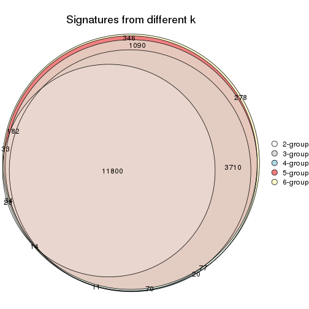

`get_signature()` returns a data frame invisibly. TO get the list of signatures, the function
call should be assigned to a variable explicitly. In following code, if `plot` argument is set
to `FALSE`, no heatmap is plotted while only the differential analysis is performed.

```r
# code only for demonstration
tb = get_signature(res, k = ..., plot = FALSE)
```

An example of the output of `tb` is:

```
#>   which_row         fdr    mean_1    mean_2 scaled_mean_1 scaled_mean_2 km
#> 1        38 0.042760348  8.373488  9.131774    -0.5533452     0.5164555  1
#> 2        40 0.018707592  7.106213  8.469186    -0.6173731     0.5762149  1
#> 3        55 0.019134737 10.221463 11.207825    -0.6159697     0.5749050  1
#> 4        59 0.006059896  5.921854  7.869574    -0.6899429     0.6439467  1
#> 5        60 0.018055526  8.928898 10.211722    -0.6204761     0.5791110  1
#> 6        98 0.009384629 15.714769 14.887706     0.6635654    -0.6193277  2
...
```

The columns in `tb` are:

1. `which_row`: row indices corresponding to the input matrix.
2. `fdr`: FDR for the differential test. 
3. `mean_x`: The mean value in group x.
4. `scaled_mean_x`: The mean value in group x after rows are scaled.
5. `km`: Row groups if k-means clustering is applied to rows.


UMAP plot which shows how samples are separated.


<script>
$( function() {
	$( '#tabs-SD-skmeans-dimension-reduction' ).tabs();
} );
</script>
<div id='tabs-SD-skmeans-dimension-reduction'>
<ul>
<li><a href='#tab-SD-skmeans-dimension-reduction-1'>k = 2</a></li>
<li><a href='#tab-SD-skmeans-dimension-reduction-2'>k = 3</a></li>
<li><a href='#tab-SD-skmeans-dimension-reduction-3'>k = 4</a></li>
<li><a href='#tab-SD-skmeans-dimension-reduction-4'>k = 5</a></li>
<li><a href='#tab-SD-skmeans-dimension-reduction-5'>k = 6</a></li>
</ul>
<div id='tab-SD-skmeans-dimension-reduction-1'>
<pre><code class="r">dimension_reduction(res, k = 2, method = &quot;UMAP&quot;)
</code></pre>

<p></p>

</div>
<div id='tab-SD-skmeans-dimension-reduction-2'>
<pre><code class="r">dimension_reduction(res, k = 3, method = &quot;UMAP&quot;)
</code></pre>

<p></p>

</div>
<div id='tab-SD-skmeans-dimension-reduction-3'>
<pre><code class="r">dimension_reduction(res, k = 4, method = &quot;UMAP&quot;)
</code></pre>

<p></p>

</div>
<div id='tab-SD-skmeans-dimension-reduction-4'>
<pre><code class="r">dimension_reduction(res, k = 5, method = &quot;UMAP&quot;)
</code></pre>

<p></p>

</div>
<div id='tab-SD-skmeans-dimension-reduction-5'>
<pre><code class="r">dimension_reduction(res, k = 6, method = &quot;UMAP&quot;)
</code></pre>

<p></p>

</div>
</div>


Following heatmap shows how subgroups are split when increasing `k`:

```r
collect_classes(res)
```


If matrix rows can be associated to genes, consider to use `functional_enrichment(res,
...)` to perform function enrichment for the signature genes. See [this vignette](http://bioconductor.org/packages/devel/bioc/vignettes/cola/inst/doc/functional_enrichment.html) for more detailed explanations.


 

---------------------------------------------------


### SD:pam**


The object with results only for a single top-value method and a single partition method 
can be extracted as:

```r
res = res_list["SD", "pam"]
# you can also extract it by
# res = res_list["SD:pam"]
```

A summary of `res` and all the functions that can be applied to it:

```r
res
```

```
#> A 'ConsensusPartition' object with k = 2, 3, 4, 5, 6.
#>   On a matrix with 18147 rows and 167 columns.
#>   Top rows (1000, 2000, 3000, 4000, 5000) are extracted by 'SD' method.
#>   Subgroups are detected by 'pam' method.
#>   Performed in total 1250 partitions by row resampling.
#>   Best k for subgroups seems to be 2.
#> 
#> Following methods can be applied to this 'ConsensusPartition' object:
#>  [1] "cola_report"             "collect_classes"         "collect_plots"          
#>  [4] "collect_stats"           "colnames"                "compare_signatures"     
#>  [7] "consensus_heatmap"       "dimension_reduction"     "functional_enrichment"  
#> [10] "get_anno_col"            "get_anno"                "get_classes"            
#> [13] "get_consensus"           "get_matrix"              "get_membership"         
#> [16] "get_param"               "get_signatures"          "get_stats"              
#> [19] "is_best_k"               "is_stable_k"             "membership_heatmap"     
#> [22] "ncol"                    "nrow"                    "plot_ecdf"              
#> [25] "rownames"                "select_partition_number" "show"                   
#> [28] "suggest_best_k"          "test_to_known_factors"
```

`collect_plots()` function collects all the plots made from `res` for all `k` (number of partitions)
into one single page to provide an easy and fast comparison between different `k`.

```r
collect_plots(res)
```


The plots are:

- The first row: a plot of the ECDF (empirical cumulative distribution
  function) curves of the consensus matrix for each `k` and the heatmap of
  predicted classes for each `k`.
- The second row: heatmaps of the consensus matrix for each `k`.
- The third row: heatmaps of the membership matrix for each `k`.
- The fouth row: heatmaps of the signatures for each `k`.

All the plots in panels can be made by individual functions and they are
plotted later in this section.

`select_partition_number()` produces several plots showing different
statistics for choosing "optimized" `k`. There are following statistics:

- ECDF curves of the consensus matrix for each `k`;
- 1-PAC. [The PAC
  score](https://en.wikipedia.org/wiki/Consensus_clustering#Over-interpretation_potential_of_consensus_clustering)
  measures the proportion of the ambiguous subgrouping.
- Mean silhouette score.
- Concordance. The mean probability of fiting the consensus class ids in all
  partitions.
- Area increased. Denote $A_k$ as the area under the ECDF curve for current
  `k`, the area increased is defined as $A_k - A_{k-1}$.
- Rand index. The percent of pairs of samples that are both in a same cluster
  or both are not in a same cluster in the partition of k and k-1.
- Jaccard index. The ratio of pairs of samples are both in a same cluster in
  the partition of k and k-1 and the pairs of samples are both in a same
  cluster in the partition k or k-1.

The detailed explanations of these statistics can be found in [the _cola_
vignette](http://bioconductor.org/packages/devel/bioc/vignettes/cola/inst/doc/cola.html#toc_13).

Generally speaking, lower PAC score, higher mean silhouette score or higher
concordance corresponds to better partition. Rand index and Jaccard index
measure how similar the current partition is compared to partition with `k-1`.
If they are too similar, we won't accept `k` is better than `k-1`.

```r
select_partition_number(res)
```


The numeric values for all these statistics can be obtained by `get_stats()`.

```r
get_stats(res)
```

```
#>   k 1-PAC mean_silhouette concordance area_increased  Rand Jaccard
#> 2 2 0.963           0.970       0.986         0.4627 0.537   0.537
#> 3 3 0.699           0.872       0.925         0.4310 0.780   0.595
#> 4 4 0.861           0.825       0.911         0.1109 0.852   0.599
#> 5 5 0.795           0.722       0.824         0.0665 0.954   0.827
#> 6 6 0.867           0.804       0.896         0.0535 0.915   0.648
```

`suggest_best_k()` suggests the best $k$ based on these statistics. The rules are as follows:

- All $k$ with Jaccard index larger than 0.95 are removed because increasing
  $k$ does not provide enough extra information. If all $k$ are removed, it is
  marked as no subgroup is detected.
- For all $k$ with 1-PAC score larger than 0.9, the maximal $k$ is taken as
  the best $k$, and other $k$ are marked as optional $k$.
- If it does not fit the second rule. The $k$ with the maximal vote of the
  highest 1-PAC score, highest mean silhouette, and highest concordance is
  taken as the best $k$.

```r
suggest_best_k(res)
```

```
#> [1] 2
```


Following shows the table of the partitions (You need to click the **show/hide
code output** link to see it). The membership matrix (columns with name `p*`)
is inferred by
[`clue::cl_consensus()`](https://www.rdocumentation.org/link/cl_consensus?package=clue)
function with the `SE` method. Basically the value in the membership matrix
represents the probability to belong to a certain group. The finall class
label for an item is determined with the group with highest probability it
belongs to.

In `get_classes()` function, the entropy is calculated from the membership
matrix and the silhouette score is calculated from the consensus matrix.


<script>
$( function() {
	$( '#tabs-SD-pam-get-classes' ).tabs();
} );
</script>
<div id='tabs-SD-pam-get-classes'>
<ul>
<li><a href='#tab-SD-pam-get-classes-1'>k = 2</a></li>
<li><a href='#tab-SD-pam-get-classes-2'>k = 3</a></li>
<li><a href='#tab-SD-pam-get-classes-3'>k = 4</a></li>
<li><a href='#tab-SD-pam-get-classes-4'>k = 5</a></li>
<li><a href='#tab-SD-pam-get-classes-5'>k = 6</a></li>
</ul>

<div id='tab-SD-pam-get-classes-1'>
<p><a id='tab-SD-pam-get-classes-1-a' style='color:#0366d6' href='#'>show/hide code output</a></p>
<pre><code class="r">cbind(get_classes(res, k = 2), get_membership(res, k = 2))
</code></pre>

<pre><code>#&gt;            class entropy silhouette    p1    p2
#&gt; SRR1313062     1  0.0000      0.989 1.000 0.000
#&gt; SRR1313063     1  0.0000      0.989 1.000 0.000
#&gt; SRR1313064     1  0.0000      0.989 1.000 0.000
#&gt; SRR1313065     1  0.0000      0.989 1.000 0.000
#&gt; SRR1313066     1  0.4939      0.879 0.892 0.108
#&gt; SRR1313067     1  0.0000      0.989 1.000 0.000
#&gt; SRR1313068     1  0.0000      0.989 1.000 0.000
#&gt; SRR1313069     1  0.0000      0.989 1.000 0.000
#&gt; SRR1313070     1  0.4690      0.889 0.900 0.100
#&gt; SRR1313071     1  0.0000      0.989 1.000 0.000
#&gt; SRR1313072     1  0.2423      0.953 0.960 0.040
#&gt; SRR1313073     1  0.0000      0.989 1.000 0.000
#&gt; SRR1313074     1  0.0000      0.989 1.000 0.000
#&gt; SRR1313075     1  0.0000      0.989 1.000 0.000
#&gt; SRR1313076     1  0.0000      0.989 1.000 0.000
#&gt; SRR1313077     1  0.0000      0.989 1.000 0.000
#&gt; SRR1313078     1  0.0000      0.989 1.000 0.000
#&gt; SRR1313079     1  0.0000      0.989 1.000 0.000
#&gt; SRR1313080     1  0.0000      0.989 1.000 0.000
#&gt; SRR1313081     1  0.0000      0.989 1.000 0.000
#&gt; SRR1313082     1  0.0000      0.989 1.000 0.000
#&gt; SRR1313083     1  0.0000      0.989 1.000 0.000
#&gt; SRR1313084     1  0.5519      0.854 0.872 0.128
#&gt; SRR1313085     1  0.5842      0.838 0.860 0.140
#&gt; SRR1313086     1  0.0000      0.989 1.000 0.000
#&gt; SRR1313087     1  0.0000      0.989 1.000 0.000
#&gt; SRR1313088     1  0.0000      0.989 1.000 0.000
#&gt; SRR1313089     1  0.0000      0.989 1.000 0.000
#&gt; SRR1313092     1  0.0000      0.989 1.000 0.000
#&gt; SRR1313090     1  0.0000      0.989 1.000 0.000
#&gt; SRR1313091     2  0.0000      0.978 0.000 1.000
#&gt; SRR1313093     1  0.0000      0.989 1.000 0.000
#&gt; SRR1313095     1  0.0000      0.989 1.000 0.000
#&gt; SRR1313096     1  0.0000      0.989 1.000 0.000
#&gt; SRR1313094     1  0.0000      0.989 1.000 0.000
#&gt; SRR1313097     1  0.0000      0.989 1.000 0.000
#&gt; SRR1313099     1  0.0376      0.986 0.996 0.004
#&gt; SRR1313098     1  0.0000      0.989 1.000 0.000
#&gt; SRR1313101     1  0.0000      0.989 1.000 0.000
#&gt; SRR1313102     1  0.0000      0.989 1.000 0.000
#&gt; SRR1313103     1  0.0672      0.983 0.992 0.008
#&gt; SRR1313100     1  0.0000      0.989 1.000 0.000
#&gt; SRR1313105     1  0.0000      0.989 1.000 0.000
#&gt; SRR1313104     1  0.0000      0.989 1.000 0.000
#&gt; SRR1313107     1  0.0000      0.989 1.000 0.000
#&gt; SRR1313106     1  0.1843      0.965 0.972 0.028
#&gt; SRR1313109     1  0.8144      0.668 0.748 0.252
#&gt; SRR1313108     1  0.0000      0.989 1.000 0.000
#&gt; SRR1313111     1  0.0000      0.989 1.000 0.000
#&gt; SRR1313110     1  0.0000      0.989 1.000 0.000
#&gt; SRR1313112     1  0.6247      0.815 0.844 0.156
#&gt; SRR1313113     1  0.0000      0.989 1.000 0.000
#&gt; SRR1313115     1  0.0000      0.989 1.000 0.000
#&gt; SRR1313114     1  0.0000      0.989 1.000 0.000
#&gt; SRR1313117     1  0.0000      0.989 1.000 0.000
#&gt; SRR1313118     1  0.0000      0.989 1.000 0.000
#&gt; SRR1313116     1  0.3584      0.925 0.932 0.068
#&gt; SRR1313120     1  0.0000      0.989 1.000 0.000
#&gt; SRR1313119     1  0.0000      0.989 1.000 0.000
#&gt; SRR1313122     1  0.0000      0.989 1.000 0.000
#&gt; SRR1313124     1  0.0000      0.989 1.000 0.000
#&gt; SRR1313121     1  0.0000      0.989 1.000 0.000
#&gt; SRR1313125     1  0.0000      0.989 1.000 0.000
#&gt; SRR1313127     1  0.0000      0.989 1.000 0.000
#&gt; SRR1313123     1  0.0000      0.989 1.000 0.000
#&gt; SRR1313128     1  0.0000      0.989 1.000 0.000
#&gt; SRR1313126     1  0.0000      0.989 1.000 0.000
#&gt; SRR1313130     2  0.0000      0.978 0.000 1.000
#&gt; SRR1313132     1  0.0000      0.989 1.000 0.000
#&gt; SRR1313129     1  0.0672      0.983 0.992 0.008
#&gt; SRR1313133     1  0.0000      0.989 1.000 0.000
#&gt; SRR1313131     1  0.0000      0.989 1.000 0.000
#&gt; SRR1313134     1  0.0000      0.989 1.000 0.000
#&gt; SRR1313135     1  0.0000      0.989 1.000 0.000
#&gt; SRR1313136     1  0.0000      0.989 1.000 0.000
#&gt; SRR1313137     1  0.0000      0.989 1.000 0.000
#&gt; SRR1313138     2  0.7815      0.717 0.232 0.768
#&gt; SRR1313140     1  0.0000      0.989 1.000 0.000
#&gt; SRR1313141     1  0.0000      0.989 1.000 0.000
#&gt; SRR1313139     1  0.0000      0.989 1.000 0.000
#&gt; SRR1313143     1  0.0000      0.989 1.000 0.000
#&gt; SRR1313142     1  0.0000      0.989 1.000 0.000
#&gt; SRR1313144     1  0.0000      0.989 1.000 0.000
#&gt; SRR1313145     1  0.0000      0.989 1.000 0.000
#&gt; SRR1313146     1  0.0000      0.989 1.000 0.000
#&gt; SRR1313147     1  0.0000      0.989 1.000 0.000
#&gt; SRR1313150     1  0.0672      0.983 0.992 0.008
#&gt; SRR1313149     1  0.0000      0.989 1.000 0.000
#&gt; SRR1313152     1  0.0000      0.989 1.000 0.000
#&gt; SRR1313151     1  0.0000      0.989 1.000 0.000
#&gt; SRR1313154     1  0.0000      0.989 1.000 0.000
#&gt; SRR1313153     1  0.0000      0.989 1.000 0.000
#&gt; SRR1313156     1  0.1843      0.965 0.972 0.028
#&gt; SRR1313155     1  0.0000      0.989 1.000 0.000
#&gt; SRR1313157     1  0.0000      0.989 1.000 0.000
#&gt; SRR1313158     1  0.0000      0.989 1.000 0.000
#&gt; SRR1313161     1  0.0000      0.989 1.000 0.000
#&gt; SRR1313159     2  0.7674      0.730 0.224 0.776
#&gt; SRR1313160     1  0.0000      0.989 1.000 0.000
#&gt; SRR1313162     1  0.0000      0.989 1.000 0.000
#&gt; SRR1313163     1  0.0000      0.989 1.000 0.000
#&gt; SRR1313165     1  0.0000      0.989 1.000 0.000
#&gt; SRR1313166     1  0.0000      0.989 1.000 0.000
#&gt; SRR1313164     1  0.0000      0.989 1.000 0.000
#&gt; SRR1313167     1  0.0000      0.989 1.000 0.000
#&gt; SRR1313168     1  0.0000      0.989 1.000 0.000
#&gt; SRR1313170     1  0.0000      0.989 1.000 0.000
#&gt; SRR1313169     1  0.0000      0.989 1.000 0.000
#&gt; SRR1313172     2  0.8207      0.676 0.256 0.744
#&gt; SRR1313171     1  0.0000      0.989 1.000 0.000
#&gt; SRR1313174     2  0.0000      0.978 0.000 1.000
#&gt; SRR1313173     1  0.0000      0.989 1.000 0.000
#&gt; SRR1313176     2  0.0000      0.978 0.000 1.000
#&gt; SRR1313175     2  0.0000      0.978 0.000 1.000
#&gt; SRR1313178     2  0.0000      0.978 0.000 1.000
#&gt; SRR1313177     2  0.0000      0.978 0.000 1.000
#&gt; SRR1313179     2  0.6623      0.801 0.172 0.828
#&gt; SRR1313180     2  0.6343      0.815 0.160 0.840
#&gt; SRR1313181     2  0.0000      0.978 0.000 1.000
#&gt; SRR1313183     2  0.0000      0.978 0.000 1.000
#&gt; SRR1313182     2  0.0000      0.978 0.000 1.000
#&gt; SRR1313184     2  0.0000      0.978 0.000 1.000
#&gt; SRR1313185     2  0.0000      0.978 0.000 1.000
#&gt; SRR1313188     2  0.0000      0.978 0.000 1.000
#&gt; SRR1313187     2  0.0000      0.978 0.000 1.000
#&gt; SRR1313186     2  0.0000      0.978 0.000 1.000
#&gt; SRR1313189     2  0.0000      0.978 0.000 1.000
#&gt; SRR1313190     2  0.0000      0.978 0.000 1.000
#&gt; SRR1313191     2  0.0000      0.978 0.000 1.000
#&gt; SRR1313192     2  0.0000      0.978 0.000 1.000
#&gt; SRR1313193     2  0.0000      0.978 0.000 1.000
#&gt; SRR1313194     2  0.0000      0.978 0.000 1.000
#&gt; SRR1313195     2  0.0000      0.978 0.000 1.000
#&gt; SRR1313196     2  0.0000      0.978 0.000 1.000
#&gt; SRR1313197     2  0.0000      0.978 0.000 1.000
#&gt; SRR1313198     2  0.0000      0.978 0.000 1.000
#&gt; SRR1313199     2  0.0000      0.978 0.000 1.000
#&gt; SRR1313200     2  0.0000      0.978 0.000 1.000
#&gt; SRR1313201     2  0.0000      0.978 0.000 1.000
#&gt; SRR1313202     2  0.0000      0.978 0.000 1.000
#&gt; SRR1313203     1  0.1184      0.976 0.984 0.016
#&gt; SRR1313204     2  0.0000      0.978 0.000 1.000
#&gt; SRR1313205     2  0.0000      0.978 0.000 1.000
#&gt; SRR1313207     2  0.0000      0.978 0.000 1.000
#&gt; SRR1313208     2  0.0000      0.978 0.000 1.000
#&gt; SRR1313206     2  0.0000      0.978 0.000 1.000
#&gt; SRR1313210     2  0.0000      0.978 0.000 1.000
#&gt; SRR1313209     2  0.0000      0.978 0.000 1.000
#&gt; SRR1313211     2  0.0000      0.978 0.000 1.000
#&gt; SRR1313212     2  0.0000      0.978 0.000 1.000
#&gt; SRR1313214     2  0.0000      0.978 0.000 1.000
#&gt; SRR1313215     2  0.0000      0.978 0.000 1.000
#&gt; SRR1313213     2  0.0000      0.978 0.000 1.000
#&gt; SRR1313216     2  0.0000      0.978 0.000 1.000
#&gt; SRR1313217     2  0.0000      0.978 0.000 1.000
#&gt; SRR1313219     2  0.0000      0.978 0.000 1.000
#&gt; SRR1313220     2  0.0000      0.978 0.000 1.000
#&gt; SRR1313218     2  0.0000      0.978 0.000 1.000
#&gt; SRR1313222     2  0.0000      0.978 0.000 1.000
#&gt; SRR1313221     2  0.0000      0.978 0.000 1.000
#&gt; SRR1313223     2  0.0000      0.978 0.000 1.000
#&gt; SRR1313224     2  0.0000      0.978 0.000 1.000
#&gt; SRR1313225     2  0.0000      0.978 0.000 1.000
#&gt; SRR1313226     2  0.7376      0.753 0.208 0.792
#&gt; SRR1313227     2  0.0000      0.978 0.000 1.000
#&gt; SRR1313228     2  0.0000      0.978 0.000 1.000
#&gt; SRR1313229     2  0.0000      0.978 0.000 1.000
</code></pre>

<script>
$('#tab-SD-pam-get-classes-1-a').parent().next().next().hide();
$('#tab-SD-pam-get-classes-1-a').click(function(){
  $('#tab-SD-pam-get-classes-1-a').parent().next().next().toggle();
  return(false);
});
</script>
</div>

<div id='tab-SD-pam-get-classes-2'>
<p><a id='tab-SD-pam-get-classes-2-a' style='color:#0366d6' href='#'>show/hide code output</a></p>
<pre><code class="r">cbind(get_classes(res, k = 3), get_membership(res, k = 3))
</code></pre>

<pre><code>#&gt;            class entropy silhouette    p1    p2    p3
#&gt; SRR1313062     3  0.4931      0.784 0.232 0.000 0.768
#&gt; SRR1313063     3  0.4974      0.781 0.236 0.000 0.764
#&gt; SRR1313064     1  0.0000      0.881 1.000 0.000 0.000
#&gt; SRR1313065     1  0.0892      0.887 0.980 0.000 0.020
#&gt; SRR1313066     1  0.0237      0.883 0.996 0.000 0.004
#&gt; SRR1313067     3  0.4887      0.787 0.228 0.000 0.772
#&gt; SRR1313068     3  0.4931      0.784 0.232 0.000 0.768
#&gt; SRR1313069     1  0.0000      0.881 1.000 0.000 0.000
#&gt; SRR1313070     1  0.0000      0.881 1.000 0.000 0.000
#&gt; SRR1313071     1  0.0237      0.883 0.996 0.000 0.004
#&gt; SRR1313072     1  0.0000      0.881 1.000 0.000 0.000
#&gt; SRR1313073     3  0.6235      0.455 0.436 0.000 0.564
#&gt; SRR1313074     1  0.0000      0.881 1.000 0.000 0.000
#&gt; SRR1313075     1  0.0000      0.881 1.000 0.000 0.000
#&gt; SRR1313076     3  0.4931      0.784 0.232 0.000 0.768
#&gt; SRR1313077     3  0.4974      0.781 0.236 0.000 0.764
#&gt; SRR1313078     3  0.4974      0.781 0.236 0.000 0.764
#&gt; SRR1313079     1  0.0424      0.878 0.992 0.000 0.008
#&gt; SRR1313080     3  0.4931      0.784 0.232 0.000 0.768
#&gt; SRR1313081     3  0.4931      0.784 0.232 0.000 0.768
#&gt; SRR1313082     1  0.0424      0.884 0.992 0.000 0.008
#&gt; SRR1313083     1  0.0000      0.881 1.000 0.000 0.000
#&gt; SRR1313084     1  0.0000      0.881 1.000 0.000 0.000
#&gt; SRR1313085     1  0.0000      0.881 1.000 0.000 0.000
#&gt; SRR1313086     1  0.0237      0.883 0.996 0.000 0.004
#&gt; SRR1313087     1  0.4605      0.645 0.796 0.000 0.204
#&gt; SRR1313088     1  0.0000      0.881 1.000 0.000 0.000
#&gt; SRR1313089     1  0.0000      0.881 1.000 0.000 0.000
#&gt; SRR1313092     3  0.0000      0.896 0.000 0.000 1.000
#&gt; SRR1313090     3  0.0000      0.896 0.000 0.000 1.000
#&gt; SRR1313091     2  0.4452      0.745 0.000 0.808 0.192
#&gt; SRR1313093     3  0.0747      0.891 0.016 0.000 0.984
#&gt; SRR1313095     3  0.0747      0.891 0.016 0.000 0.984
#&gt; SRR1313096     3  0.3482      0.831 0.128 0.000 0.872
#&gt; SRR1313094     3  0.0237      0.895 0.004 0.000 0.996
#&gt; SRR1313097     3  0.0000      0.896 0.000 0.000 1.000
#&gt; SRR1313099     3  0.0000      0.896 0.000 0.000 1.000
#&gt; SRR1313098     3  0.0237      0.894 0.004 0.000 0.996
#&gt; SRR1313101     3  0.0000      0.896 0.000 0.000 1.000
#&gt; SRR1313102     3  0.0000      0.896 0.000 0.000 1.000
#&gt; SRR1313103     3  0.0000      0.896 0.000 0.000 1.000
#&gt; SRR1313100     3  0.0892      0.889 0.020 0.000 0.980
#&gt; SRR1313105     3  0.0000      0.896 0.000 0.000 1.000
#&gt; SRR1313104     3  0.0000      0.896 0.000 0.000 1.000
#&gt; SRR1313107     3  0.0000      0.896 0.000 0.000 1.000
#&gt; SRR1313106     3  0.0000      0.896 0.000 0.000 1.000
#&gt; SRR1313109     3  0.3686      0.776 0.000 0.140 0.860
#&gt; SRR1313108     3  0.2711      0.860 0.088 0.000 0.912
#&gt; SRR1313111     3  0.0000      0.896 0.000 0.000 1.000
#&gt; SRR1313110     3  0.0000      0.896 0.000 0.000 1.000
#&gt; SRR1313112     3  0.3038      0.809 0.000 0.104 0.896
#&gt; SRR1313113     3  0.0000      0.896 0.000 0.000 1.000
#&gt; SRR1313115     3  0.0747      0.891 0.016 0.000 0.984
#&gt; SRR1313114     3  0.0000      0.896 0.000 0.000 1.000
#&gt; SRR1313117     3  0.0000      0.896 0.000 0.000 1.000
#&gt; SRR1313118     3  0.0000      0.896 0.000 0.000 1.000
#&gt; SRR1313116     3  0.0000      0.896 0.000 0.000 1.000
#&gt; SRR1313120     3  0.0000      0.896 0.000 0.000 1.000
#&gt; SRR1313119     3  0.0000      0.896 0.000 0.000 1.000
#&gt; SRR1313122     3  0.0892      0.889 0.020 0.000 0.980
#&gt; SRR1313124     3  0.0000      0.896 0.000 0.000 1.000
#&gt; SRR1313121     3  0.0000      0.896 0.000 0.000 1.000
#&gt; SRR1313125     3  0.0000      0.896 0.000 0.000 1.000
#&gt; SRR1313127     3  0.0000      0.896 0.000 0.000 1.000
#&gt; SRR1313123     3  0.0000      0.896 0.000 0.000 1.000
#&gt; SRR1313128     1  0.3412      0.921 0.876 0.000 0.124
#&gt; SRR1313126     3  0.0892      0.889 0.020 0.000 0.980
#&gt; SRR1313130     2  0.5529      0.600 0.000 0.704 0.296
#&gt; SRR1313132     1  0.3816      0.904 0.852 0.000 0.148
#&gt; SRR1313129     3  0.0000      0.896 0.000 0.000 1.000
#&gt; SRR1313133     3  0.6274      0.104 0.456 0.000 0.544
#&gt; SRR1313131     3  0.3551      0.831 0.132 0.000 0.868
#&gt; SRR1313134     3  0.6204      0.228 0.424 0.000 0.576
#&gt; SRR1313135     1  0.3412      0.921 0.876 0.000 0.124
#&gt; SRR1313136     1  0.3412      0.921 0.876 0.000 0.124
#&gt; SRR1313137     1  0.3412      0.921 0.876 0.000 0.124
#&gt; SRR1313138     1  0.3686      0.910 0.860 0.000 0.140
#&gt; SRR1313140     1  0.3412      0.921 0.876 0.000 0.124
#&gt; SRR1313141     3  0.5529      0.616 0.296 0.000 0.704
#&gt; SRR1313139     1  0.3412      0.921 0.876 0.000 0.124
#&gt; SRR1313143     3  0.5529      0.623 0.296 0.000 0.704
#&gt; SRR1313142     1  0.3412      0.921 0.876 0.000 0.124
#&gt; SRR1313144     1  0.3412      0.921 0.876 0.000 0.124
#&gt; SRR1313145     1  0.3412      0.921 0.876 0.000 0.124
#&gt; SRR1313146     1  0.3412      0.921 0.876 0.000 0.124
#&gt; SRR1313147     1  0.3412      0.921 0.876 0.000 0.124
#&gt; SRR1313150     1  0.3482      0.919 0.872 0.000 0.128
#&gt; SRR1313149     1  0.6062      0.432 0.616 0.000 0.384
#&gt; SRR1313152     1  0.3412      0.921 0.876 0.000 0.124
#&gt; SRR1313151     1  0.3412      0.921 0.876 0.000 0.124
#&gt; SRR1313154     1  0.3412      0.921 0.876 0.000 0.124
#&gt; SRR1313153     1  0.3412      0.921 0.876 0.000 0.124
#&gt; SRR1313156     1  0.3412      0.921 0.876 0.000 0.124
#&gt; SRR1313155     1  0.3412      0.921 0.876 0.000 0.124
#&gt; SRR1313157     1  0.3412      0.921 0.876 0.000 0.124
#&gt; SRR1313158     1  0.3412      0.921 0.876 0.000 0.124
#&gt; SRR1313161     1  0.4504      0.852 0.804 0.000 0.196
#&gt; SRR1313159     1  0.4891      0.891 0.836 0.040 0.124
#&gt; SRR1313160     1  0.3551      0.916 0.868 0.000 0.132
#&gt; SRR1313162     3  0.4887      0.701 0.228 0.000 0.772
#&gt; SRR1313163     1  0.4887      0.811 0.772 0.000 0.228
#&gt; SRR1313165     1  0.3482      0.919 0.872 0.000 0.128
#&gt; SRR1313166     1  0.3412      0.921 0.876 0.000 0.124
#&gt; SRR1313164     1  0.5621      0.655 0.692 0.000 0.308
#&gt; SRR1313167     1  0.3412      0.921 0.876 0.000 0.124
#&gt; SRR1313168     1  0.3412      0.921 0.876 0.000 0.124
#&gt; SRR1313170     3  0.0000      0.896 0.000 0.000 1.000
#&gt; SRR1313169     1  0.3412      0.921 0.876 0.000 0.124
#&gt; SRR1313172     2  0.8185      0.107 0.072 0.500 0.428
#&gt; SRR1313171     3  0.5431      0.606 0.284 0.000 0.716
#&gt; SRR1313174     2  0.0000      0.966 0.000 1.000 0.000
#&gt; SRR1313173     3  0.3551      0.831 0.132 0.000 0.868
#&gt; SRR1313176     2  0.0000      0.966 0.000 1.000 0.000
#&gt; SRR1313175     2  0.0000      0.966 0.000 1.000 0.000
#&gt; SRR1313178     2  0.0000      0.966 0.000 1.000 0.000
#&gt; SRR1313177     2  0.0000      0.966 0.000 1.000 0.000
#&gt; SRR1313179     2  0.5307      0.765 0.056 0.820 0.124
#&gt; SRR1313180     2  0.5016      0.698 0.000 0.760 0.240
#&gt; SRR1313181     2  0.0000      0.966 0.000 1.000 0.000
#&gt; SRR1313183     2  0.0000      0.966 0.000 1.000 0.000
#&gt; SRR1313182     2  0.0000      0.966 0.000 1.000 0.000
#&gt; SRR1313184     2  0.0000      0.966 0.000 1.000 0.000
#&gt; SRR1313185     2  0.0000      0.966 0.000 1.000 0.000
#&gt; SRR1313188     2  0.0000      0.966 0.000 1.000 0.000
#&gt; SRR1313187     2  0.0424      0.960 0.000 0.992 0.008
#&gt; SRR1313186     2  0.0000      0.966 0.000 1.000 0.000
#&gt; SRR1313189     2  0.0000      0.966 0.000 1.000 0.000
#&gt; SRR1313190     2  0.0000      0.966 0.000 1.000 0.000
#&gt; SRR1313191     2  0.0000      0.966 0.000 1.000 0.000
#&gt; SRR1313192     2  0.0000      0.966 0.000 1.000 0.000
#&gt; SRR1313193     2  0.0000      0.966 0.000 1.000 0.000
#&gt; SRR1313194     2  0.0000      0.966 0.000 1.000 0.000
#&gt; SRR1313195     2  0.0000      0.966 0.000 1.000 0.000
#&gt; SRR1313196     2  0.1289      0.939 0.000 0.968 0.032
#&gt; SRR1313197     2  0.0000      0.966 0.000 1.000 0.000
#&gt; SRR1313198     2  0.0000      0.966 0.000 1.000 0.000
#&gt; SRR1313199     2  0.0000      0.966 0.000 1.000 0.000
#&gt; SRR1313200     2  0.0000      0.966 0.000 1.000 0.000
#&gt; SRR1313201     2  0.0000      0.966 0.000 1.000 0.000
#&gt; SRR1313202     2  0.0000      0.966 0.000 1.000 0.000
#&gt; SRR1313203     3  0.5363      0.652 0.276 0.000 0.724
#&gt; SRR1313204     2  0.0000      0.966 0.000 1.000 0.000
#&gt; SRR1313205     2  0.0000      0.966 0.000 1.000 0.000
#&gt; SRR1313207     2  0.0000      0.966 0.000 1.000 0.000
#&gt; SRR1313208     2  0.0000      0.966 0.000 1.000 0.000
#&gt; SRR1313206     2  0.0000      0.966 0.000 1.000 0.000
#&gt; SRR1313210     2  0.0000      0.966 0.000 1.000 0.000
#&gt; SRR1313209     2  0.0000      0.966 0.000 1.000 0.000
#&gt; SRR1313211     2  0.0000      0.966 0.000 1.000 0.000
#&gt; SRR1313212     2  0.0000      0.966 0.000 1.000 0.000
#&gt; SRR1313214     2  0.0000      0.966 0.000 1.000 0.000
#&gt; SRR1313215     2  0.0000      0.966 0.000 1.000 0.000
#&gt; SRR1313213     2  0.0000      0.966 0.000 1.000 0.000
#&gt; SRR1313216     2  0.0000      0.966 0.000 1.000 0.000
#&gt; SRR1313217     2  0.0000      0.966 0.000 1.000 0.000
#&gt; SRR1313219     2  0.0000      0.966 0.000 1.000 0.000
#&gt; SRR1313220     2  0.0000      0.966 0.000 1.000 0.000
#&gt; SRR1313218     2  0.0000      0.966 0.000 1.000 0.000
#&gt; SRR1313222     2  0.0000      0.966 0.000 1.000 0.000
#&gt; SRR1313221     2  0.0000      0.966 0.000 1.000 0.000
#&gt; SRR1313223     2  0.0000      0.966 0.000 1.000 0.000
#&gt; SRR1313224     2  0.0000      0.966 0.000 1.000 0.000
#&gt; SRR1313225     2  0.0000      0.966 0.000 1.000 0.000
#&gt; SRR1313226     2  0.6280      0.225 0.000 0.540 0.460
#&gt; SRR1313227     2  0.0000      0.966 0.000 1.000 0.000
#&gt; SRR1313228     2  0.0000      0.966 0.000 1.000 0.000
#&gt; SRR1313229     2  0.0000      0.966 0.000 1.000 0.000
</code></pre>

<script>
$('#tab-SD-pam-get-classes-2-a').parent().next().next().hide();
$('#tab-SD-pam-get-classes-2-a').click(function(){
  $('#tab-SD-pam-get-classes-2-a').parent().next().next().toggle();
  return(false);
});
</script>
</div>

<div id='tab-SD-pam-get-classes-3'>
<p><a id='tab-SD-pam-get-classes-3-a' style='color:#0366d6' href='#'>show/hide code output</a></p>
<pre><code class="r">cbind(get_classes(res, k = 4), get_membership(res, k = 4))
</code></pre>

<pre><code>#&gt;            class entropy silhouette    p1    p2    p3    p4
#&gt; SRR1313062     4  0.2281     0.8428 0.000 0.000 0.096 0.904
#&gt; SRR1313063     4  0.2281     0.8428 0.000 0.000 0.096 0.904
#&gt; SRR1313064     4  0.2281     0.8934 0.096 0.000 0.000 0.904
#&gt; SRR1313065     4  0.4155     0.7663 0.240 0.000 0.004 0.756
#&gt; SRR1313066     4  0.2704     0.8795 0.124 0.000 0.000 0.876
#&gt; SRR1313067     3  0.4967     0.1401 0.000 0.000 0.548 0.452
#&gt; SRR1313068     4  0.3837     0.7094 0.000 0.000 0.224 0.776
#&gt; SRR1313069     4  0.2281     0.8934 0.096 0.000 0.000 0.904
#&gt; SRR1313070     4  0.2281     0.8934 0.096 0.000 0.000 0.904
#&gt; SRR1313071     4  0.2760     0.8764 0.128 0.000 0.000 0.872
#&gt; SRR1313072     4  0.2281     0.8934 0.096 0.000 0.000 0.904
#&gt; SRR1313073     4  0.2480     0.8495 0.008 0.000 0.088 0.904
#&gt; SRR1313074     4  0.2281     0.8934 0.096 0.000 0.000 0.904
#&gt; SRR1313075     4  0.2281     0.8934 0.096 0.000 0.000 0.904
#&gt; SRR1313076     4  0.4382     0.5943 0.000 0.000 0.296 0.704
#&gt; SRR1313077     4  0.2281     0.8428 0.000 0.000 0.096 0.904
#&gt; SRR1313078     3  0.5663     0.1331 0.024 0.000 0.536 0.440
#&gt; SRR1313079     4  0.2281     0.8934 0.096 0.000 0.000 0.904
#&gt; SRR1313080     4  0.2281     0.8428 0.000 0.000 0.096 0.904
#&gt; SRR1313081     4  0.4454     0.5709 0.000 0.000 0.308 0.692
#&gt; SRR1313082     4  0.3311     0.8394 0.172 0.000 0.000 0.828
#&gt; SRR1313083     4  0.4500     0.6538 0.316 0.000 0.000 0.684
#&gt; SRR1313084     4  0.2281     0.8934 0.096 0.000 0.000 0.904
#&gt; SRR1313085     4  0.2814     0.8739 0.132 0.000 0.000 0.868
#&gt; SRR1313086     4  0.4679     0.5696 0.352 0.000 0.000 0.648
#&gt; SRR1313087     4  0.2542     0.8899 0.084 0.000 0.012 0.904
#&gt; SRR1313088     4  0.2281     0.8934 0.096 0.000 0.000 0.904
#&gt; SRR1313089     4  0.2281     0.8934 0.096 0.000 0.000 0.904
#&gt; SRR1313092     3  0.0000     0.8819 0.000 0.000 1.000 0.000
#&gt; SRR1313090     3  0.0000     0.8819 0.000 0.000 1.000 0.000
#&gt; SRR1313091     2  0.6751     0.2229 0.000 0.508 0.396 0.096
#&gt; SRR1313093     3  0.0000     0.8819 0.000 0.000 1.000 0.000
#&gt; SRR1313095     3  0.1118     0.8594 0.000 0.000 0.964 0.036
#&gt; SRR1313096     3  0.5915     0.2051 0.400 0.000 0.560 0.040
#&gt; SRR1313094     3  0.0000     0.8819 0.000 0.000 1.000 0.000
#&gt; SRR1313097     3  0.0000     0.8819 0.000 0.000 1.000 0.000
#&gt; SRR1313099     3  0.0000     0.8819 0.000 0.000 1.000 0.000
#&gt; SRR1313098     3  0.4008     0.6074 0.244 0.000 0.756 0.000
#&gt; SRR1313101     3  0.0000     0.8819 0.000 0.000 1.000 0.000
#&gt; SRR1313102     3  0.0000     0.8819 0.000 0.000 1.000 0.000
#&gt; SRR1313103     3  0.0000     0.8819 0.000 0.000 1.000 0.000
#&gt; SRR1313100     3  0.0000     0.8819 0.000 0.000 1.000 0.000
#&gt; SRR1313105     3  0.0000     0.8819 0.000 0.000 1.000 0.000
#&gt; SRR1313104     3  0.0000     0.8819 0.000 0.000 1.000 0.000
#&gt; SRR1313107     3  0.0000     0.8819 0.000 0.000 1.000 0.000
#&gt; SRR1313106     3  0.0000     0.8819 0.000 0.000 1.000 0.000
#&gt; SRR1313109     3  0.1940     0.8267 0.000 0.000 0.924 0.076
#&gt; SRR1313108     3  0.2048     0.8351 0.008 0.000 0.928 0.064
#&gt; SRR1313111     3  0.0000     0.8819 0.000 0.000 1.000 0.000
#&gt; SRR1313110     3  0.0000     0.8819 0.000 0.000 1.000 0.000
#&gt; SRR1313112     3  0.0000     0.8819 0.000 0.000 1.000 0.000
#&gt; SRR1313113     3  0.0000     0.8819 0.000 0.000 1.000 0.000
#&gt; SRR1313115     3  0.1118     0.8594 0.000 0.000 0.964 0.036
#&gt; SRR1313114     3  0.0000     0.8819 0.000 0.000 1.000 0.000
#&gt; SRR1313117     3  0.0000     0.8819 0.000 0.000 1.000 0.000
#&gt; SRR1313118     3  0.0000     0.8819 0.000 0.000 1.000 0.000
#&gt; SRR1313116     3  0.2281     0.8100 0.000 0.000 0.904 0.096
#&gt; SRR1313120     3  0.0000     0.8819 0.000 0.000 1.000 0.000
#&gt; SRR1313119     3  0.0000     0.8819 0.000 0.000 1.000 0.000
#&gt; SRR1313122     3  0.1118     0.8594 0.000 0.000 0.964 0.036
#&gt; SRR1313124     3  0.0000     0.8819 0.000 0.000 1.000 0.000
#&gt; SRR1313121     3  0.0000     0.8819 0.000 0.000 1.000 0.000
#&gt; SRR1313125     3  0.0000     0.8819 0.000 0.000 1.000 0.000
#&gt; SRR1313127     3  0.0000     0.8819 0.000 0.000 1.000 0.000
#&gt; SRR1313123     3  0.0000     0.8819 0.000 0.000 1.000 0.000
#&gt; SRR1313128     1  0.0000     0.8906 1.000 0.000 0.000 0.000
#&gt; SRR1313126     3  0.1302     0.8539 0.000 0.000 0.956 0.044
#&gt; SRR1313130     3  0.5615     0.5929 0.000 0.188 0.716 0.096
#&gt; SRR1313132     1  0.0000     0.8906 1.000 0.000 0.000 0.000
#&gt; SRR1313129     3  0.0000     0.8819 0.000 0.000 1.000 0.000
#&gt; SRR1313133     1  0.3975     0.6487 0.760 0.000 0.240 0.000
#&gt; SRR1313131     3  0.6347     0.2138 0.384 0.000 0.548 0.068
#&gt; SRR1313134     1  0.5398     0.3248 0.580 0.000 0.404 0.016
#&gt; SRR1313135     1  0.0000     0.8906 1.000 0.000 0.000 0.000
#&gt; SRR1313136     1  0.0000     0.8906 1.000 0.000 0.000 0.000
#&gt; SRR1313137     1  0.0000     0.8906 1.000 0.000 0.000 0.000
#&gt; SRR1313138     1  0.0000     0.8906 1.000 0.000 0.000 0.000
#&gt; SRR1313140     1  0.0000     0.8906 1.000 0.000 0.000 0.000
#&gt; SRR1313141     1  0.5873     0.2659 0.548 0.000 0.416 0.036
#&gt; SRR1313139     1  0.0000     0.8906 1.000 0.000 0.000 0.000
#&gt; SRR1313143     1  0.6360     0.2128 0.516 0.000 0.420 0.064
#&gt; SRR1313142     1  0.0000     0.8906 1.000 0.000 0.000 0.000
#&gt; SRR1313144     1  0.0000     0.8906 1.000 0.000 0.000 0.000
#&gt; SRR1313145     1  0.0000     0.8906 1.000 0.000 0.000 0.000
#&gt; SRR1313146     1  0.0000     0.8906 1.000 0.000 0.000 0.000
#&gt; SRR1313147     1  0.0000     0.8906 1.000 0.000 0.000 0.000
#&gt; SRR1313150     1  0.0000     0.8906 1.000 0.000 0.000 0.000
#&gt; SRR1313149     1  0.5837     0.3072 0.564 0.000 0.400 0.036
#&gt; SRR1313152     1  0.0000     0.8906 1.000 0.000 0.000 0.000
#&gt; SRR1313151     1  0.0000     0.8906 1.000 0.000 0.000 0.000
#&gt; SRR1313154     1  0.0000     0.8906 1.000 0.000 0.000 0.000
#&gt; SRR1313153     1  0.0000     0.8906 1.000 0.000 0.000 0.000
#&gt; SRR1313156     1  0.0000     0.8906 1.000 0.000 0.000 0.000
#&gt; SRR1313155     1  0.0000     0.8906 1.000 0.000 0.000 0.000
#&gt; SRR1313157     1  0.0000     0.8906 1.000 0.000 0.000 0.000
#&gt; SRR1313158     1  0.0000     0.8906 1.000 0.000 0.000 0.000
#&gt; SRR1313161     1  0.0000     0.8906 1.000 0.000 0.000 0.000
#&gt; SRR1313159     1  0.0804     0.8709 0.980 0.012 0.000 0.008
#&gt; SRR1313160     1  0.0000     0.8906 1.000 0.000 0.000 0.000
#&gt; SRR1313162     1  0.4741     0.6381 0.744 0.000 0.228 0.028
#&gt; SRR1313163     1  0.0000     0.8906 1.000 0.000 0.000 0.000
#&gt; SRR1313165     1  0.0000     0.8906 1.000 0.000 0.000 0.000
#&gt; SRR1313166     1  0.0000     0.8906 1.000 0.000 0.000 0.000
#&gt; SRR1313164     1  0.0000     0.8906 1.000 0.000 0.000 0.000
#&gt; SRR1313167     1  0.0000     0.8906 1.000 0.000 0.000 0.000
#&gt; SRR1313168     1  0.0000     0.8906 1.000 0.000 0.000 0.000
#&gt; SRR1313170     3  0.4022     0.7741 0.096 0.000 0.836 0.068
#&gt; SRR1313169     1  0.0000     0.8906 1.000 0.000 0.000 0.000
#&gt; SRR1313172     3  0.8466     0.2393 0.248 0.280 0.440 0.032
#&gt; SRR1313171     1  0.5888     0.2437 0.540 0.000 0.424 0.036
#&gt; SRR1313174     2  0.2281     0.9372 0.000 0.904 0.000 0.096
#&gt; SRR1313173     3  0.6396     0.2198 0.380 0.000 0.548 0.072
#&gt; SRR1313176     2  0.0000     0.9463 0.000 1.000 0.000 0.000
#&gt; SRR1313175     2  0.2281     0.9372 0.000 0.904 0.000 0.096
#&gt; SRR1313178     2  0.0000     0.9463 0.000 1.000 0.000 0.000
#&gt; SRR1313177     2  0.0000     0.9463 0.000 1.000 0.000 0.000
#&gt; SRR1313179     2  0.2469     0.8440 0.108 0.892 0.000 0.000
#&gt; SRR1313180     3  0.6770     0.0246 0.000 0.408 0.496 0.096
#&gt; SRR1313181     2  0.0000     0.9463 0.000 1.000 0.000 0.000
#&gt; SRR1313183     2  0.0000     0.9463 0.000 1.000 0.000 0.000
#&gt; SRR1313182     2  0.0000     0.9463 0.000 1.000 0.000 0.000
#&gt; SRR1313184     2  0.0000     0.9463 0.000 1.000 0.000 0.000
#&gt; SRR1313185     2  0.2281     0.9372 0.000 0.904 0.000 0.096
#&gt; SRR1313188     2  0.2281     0.9372 0.000 0.904 0.000 0.096
#&gt; SRR1313187     2  0.3716     0.8986 0.000 0.852 0.052 0.096
#&gt; SRR1313186     2  0.2281     0.9372 0.000 0.904 0.000 0.096
#&gt; SRR1313189     2  0.0000     0.9463 0.000 1.000 0.000 0.000
#&gt; SRR1313190     2  0.0000     0.9463 0.000 1.000 0.000 0.000
#&gt; SRR1313191     2  0.2281     0.9372 0.000 0.904 0.000 0.096
#&gt; SRR1313192     2  0.0000     0.9463 0.000 1.000 0.000 0.000
#&gt; SRR1313193     2  0.0000     0.9463 0.000 1.000 0.000 0.000
#&gt; SRR1313194     2  0.2281     0.9372 0.000 0.904 0.000 0.096
#&gt; SRR1313195     2  0.2281     0.9372 0.000 0.904 0.000 0.096
#&gt; SRR1313196     2  0.5140     0.7974 0.000 0.760 0.144 0.096
#&gt; SRR1313197     2  0.2281     0.9372 0.000 0.904 0.000 0.096
#&gt; SRR1313198     2  0.2281     0.9372 0.000 0.904 0.000 0.096
#&gt; SRR1313199     2  0.0000     0.9463 0.000 1.000 0.000 0.000
#&gt; SRR1313200     2  0.2281     0.9372 0.000 0.904 0.000 0.096
#&gt; SRR1313201     2  0.0000     0.9463 0.000 1.000 0.000 0.000
#&gt; SRR1313202     2  0.2281     0.9372 0.000 0.904 0.000 0.096
#&gt; SRR1313203     1  0.6207     0.1291 0.496 0.000 0.452 0.052
#&gt; SRR1313204     2  0.0000     0.9463 0.000 1.000 0.000 0.000
#&gt; SRR1313205     2  0.0000     0.9463 0.000 1.000 0.000 0.000
#&gt; SRR1313207     2  0.0000     0.9463 0.000 1.000 0.000 0.000
#&gt; SRR1313208     2  0.0000     0.9463 0.000 1.000 0.000 0.000
#&gt; SRR1313206     2  0.0000     0.9463 0.000 1.000 0.000 0.000
#&gt; SRR1313210     2  0.2281     0.9372 0.000 0.904 0.000 0.096
#&gt; SRR1313209     2  0.2281     0.9372 0.000 0.904 0.000 0.096
#&gt; SRR1313211     2  0.2081     0.9386 0.000 0.916 0.000 0.084
#&gt; SRR1313212     2  0.0000     0.9463 0.000 1.000 0.000 0.000
#&gt; SRR1313214     2  0.2281     0.9372 0.000 0.904 0.000 0.096
#&gt; SRR1313215     2  0.2281     0.9372 0.000 0.904 0.000 0.096
#&gt; SRR1313213     2  0.0000     0.9463 0.000 1.000 0.000 0.000
#&gt; SRR1313216     2  0.2281     0.9372 0.000 0.904 0.000 0.096
#&gt; SRR1313217     2  0.2281     0.9372 0.000 0.904 0.000 0.096
#&gt; SRR1313219     2  0.2281     0.9372 0.000 0.904 0.000 0.096
#&gt; SRR1313220     2  0.0000     0.9463 0.000 1.000 0.000 0.000
#&gt; SRR1313218     2  0.2281     0.9372 0.000 0.904 0.000 0.096
#&gt; SRR1313222     2  0.0000     0.9463 0.000 1.000 0.000 0.000
#&gt; SRR1313221     2  0.0000     0.9463 0.000 1.000 0.000 0.000
#&gt; SRR1313223     2  0.0000     0.9463 0.000 1.000 0.000 0.000
#&gt; SRR1313224     2  0.0000     0.9463 0.000 1.000 0.000 0.000
#&gt; SRR1313225     2  0.2281     0.9372 0.000 0.904 0.000 0.096
#&gt; SRR1313226     3  0.5690     0.5837 0.000 0.196 0.708 0.096
#&gt; SRR1313227     2  0.0000     0.9463 0.000 1.000 0.000 0.000
#&gt; SRR1313228     2  0.0000     0.9463 0.000 1.000 0.000 0.000
#&gt; SRR1313229     2  0.0000     0.9463 0.000 1.000 0.000 0.000
</code></pre>

<script>
$('#tab-SD-pam-get-classes-3-a').parent().next().next().hide();
$('#tab-SD-pam-get-classes-3-a').click(function(){
  $('#tab-SD-pam-get-classes-3-a').parent().next().next().toggle();
  return(false);
});
</script>
</div>

<div id='tab-SD-pam-get-classes-4'>
<p><a id='tab-SD-pam-get-classes-4-a' style='color:#0366d6' href='#'>show/hide code output</a></p>
<pre><code class="r">cbind(get_classes(res, k = 5), get_membership(res, k = 5))
</code></pre>

<pre><code>#&gt;            class entropy silhouette    p1    p2    p3    p4    p5
#&gt; SRR1313062     4  0.1197     0.8381 0.000 0.000 0.000 0.952 0.048
#&gt; SRR1313063     4  0.1341     0.8353 0.000 0.000 0.000 0.944 0.056
#&gt; SRR1313064     4  0.0000     0.8458 0.000 0.000 0.000 1.000 0.000
#&gt; SRR1313065     4  0.4066     0.5481 0.324 0.000 0.004 0.672 0.000
#&gt; SRR1313066     4  0.4632     0.3365 0.012 0.000 0.000 0.540 0.448
#&gt; SRR1313067     3  0.5605     0.0851 0.000 0.000 0.520 0.404 0.076
#&gt; SRR1313068     4  0.3800     0.7072 0.000 0.000 0.108 0.812 0.080
#&gt; SRR1313069     4  0.0000     0.8458 0.000 0.000 0.000 1.000 0.000
#&gt; SRR1313070     4  0.2074     0.8223 0.000 0.000 0.000 0.896 0.104
#&gt; SRR1313071     4  0.2864     0.8114 0.024 0.000 0.000 0.864 0.112
#&gt; SRR1313072     4  0.1851     0.8281 0.000 0.000 0.000 0.912 0.088
#&gt; SRR1313073     4  0.0510     0.8441 0.000 0.000 0.000 0.984 0.016
#&gt; SRR1313074     4  0.0000     0.8458 0.000 0.000 0.000 1.000 0.000
#&gt; SRR1313075     4  0.0000     0.8458 0.000 0.000 0.000 1.000 0.000
#&gt; SRR1313076     4  0.5498     0.2563 0.000 0.000 0.340 0.580 0.080
#&gt; SRR1313077     4  0.1671     0.8298 0.000 0.000 0.000 0.924 0.076
#&gt; SRR1313078     5  0.6653     0.3426 0.000 0.000 0.244 0.320 0.436
#&gt; SRR1313079     4  0.0000     0.8458 0.000 0.000 0.000 1.000 0.000
#&gt; SRR1313080     4  0.1410     0.8341 0.000 0.000 0.000 0.940 0.060
#&gt; SRR1313081     4  0.4854     0.4560 0.000 0.000 0.260 0.680 0.060
#&gt; SRR1313082     4  0.2280     0.7904 0.120 0.000 0.000 0.880 0.000
#&gt; SRR1313083     4  0.4906     0.6184 0.232 0.000 0.000 0.692 0.076
#&gt; SRR1313084     4  0.2020     0.8266 0.000 0.000 0.000 0.900 0.100
#&gt; SRR1313085     4  0.2873     0.8042 0.016 0.000 0.000 0.856 0.128
#&gt; SRR1313086     4  0.3636     0.6228 0.272 0.000 0.000 0.728 0.000
#&gt; SRR1313087     4  0.0000     0.8458 0.000 0.000 0.000 1.000 0.000
#&gt; SRR1313088     4  0.1732     0.8314 0.000 0.000 0.000 0.920 0.080
#&gt; SRR1313089     4  0.0703     0.8455 0.000 0.000 0.000 0.976 0.024
#&gt; SRR1313092     3  0.0000     0.8985 0.000 0.000 1.000 0.000 0.000
#&gt; SRR1313090     3  0.0000     0.8985 0.000 0.000 1.000 0.000 0.000
#&gt; SRR1313091     2  0.4074     0.1070 0.000 0.636 0.364 0.000 0.000
#&gt; SRR1313093     3  0.0404     0.8877 0.000 0.000 0.988 0.000 0.012
#&gt; SRR1313095     3  0.1764     0.8241 0.000 0.000 0.928 0.008 0.064
#&gt; SRR1313096     5  0.5967     0.6292 0.072 0.000 0.384 0.016 0.528
#&gt; SRR1313094     3  0.0000     0.8985 0.000 0.000 1.000 0.000 0.000
#&gt; SRR1313097     3  0.0000     0.8985 0.000 0.000 1.000 0.000 0.000
#&gt; SRR1313099     3  0.0000     0.8985 0.000 0.000 1.000 0.000 0.000
#&gt; SRR1313098     3  0.1121     0.8432 0.044 0.000 0.956 0.000 0.000
#&gt; SRR1313101     3  0.0000     0.8985 0.000 0.000 1.000 0.000 0.000
#&gt; SRR1313102     3  0.0000     0.8985 0.000 0.000 1.000 0.000 0.000
#&gt; SRR1313103     3  0.0000     0.8985 0.000 0.000 1.000 0.000 0.000
#&gt; SRR1313100     3  0.0000     0.8985 0.000 0.000 1.000 0.000 0.000
#&gt; SRR1313105     3  0.0000     0.8985 0.000 0.000 1.000 0.000 0.000
#&gt; SRR1313104     3  0.0000     0.8985 0.000 0.000 1.000 0.000 0.000
#&gt; SRR1313107     3  0.0162     0.8945 0.004 0.000 0.996 0.000 0.000
#&gt; SRR1313106     3  0.0000     0.8985 0.000 0.000 1.000 0.000 0.000
#&gt; SRR1313109     3  0.3424     0.6006 0.000 0.240 0.760 0.000 0.000
#&gt; SRR1313108     5  0.5126     0.5162 0.008 0.000 0.432 0.024 0.536
#&gt; SRR1313111     3  0.0000     0.8985 0.000 0.000 1.000 0.000 0.000
#&gt; SRR1313110     3  0.0000     0.8985 0.000 0.000 1.000 0.000 0.000
#&gt; SRR1313112     3  0.0000     0.8985 0.000 0.000 1.000 0.000 0.000
#&gt; SRR1313113     3  0.0000     0.8985 0.000 0.000 1.000 0.000 0.000
#&gt; SRR1313115     3  0.1956     0.8111 0.000 0.000 0.916 0.008 0.076
#&gt; SRR1313114     3  0.0000     0.8985 0.000 0.000 1.000 0.000 0.000
#&gt; SRR1313117     3  0.0000     0.8985 0.000 0.000 1.000 0.000 0.000
#&gt; SRR1313118     3  0.0000     0.8985 0.000 0.000 1.000 0.000 0.000
#&gt; SRR1313116     3  0.4249     0.3460 0.000 0.432 0.568 0.000 0.000
#&gt; SRR1313120     3  0.0000     0.8985 0.000 0.000 1.000 0.000 0.000
#&gt; SRR1313119     3  0.0000     0.8985 0.000 0.000 1.000 0.000 0.000
#&gt; SRR1313122     3  0.1764     0.8241 0.000 0.000 0.928 0.008 0.064
#&gt; SRR1313124     3  0.0000     0.8985 0.000 0.000 1.000 0.000 0.000
#&gt; SRR1313121     3  0.0000     0.8985 0.000 0.000 1.000 0.000 0.000
#&gt; SRR1313125     3  0.0000     0.8985 0.000 0.000 1.000 0.000 0.000
#&gt; SRR1313127     3  0.0000     0.8985 0.000 0.000 1.000 0.000 0.000
#&gt; SRR1313123     3  0.0000     0.8985 0.000 0.000 1.000 0.000 0.000
#&gt; SRR1313128     1  0.4283     0.2555 0.544 0.000 0.000 0.000 0.456
#&gt; SRR1313126     3  0.2325     0.7972 0.000 0.000 0.904 0.028 0.068
#&gt; SRR1313130     3  0.4101     0.4211 0.000 0.372 0.628 0.000 0.000
#&gt; SRR1313132     1  0.4030     0.4610 0.648 0.000 0.000 0.000 0.352
#&gt; SRR1313129     3  0.0000     0.8985 0.000 0.000 1.000 0.000 0.000
#&gt; SRR1313133     1  0.5039     0.1403 0.512 0.000 0.032 0.000 0.456
#&gt; SRR1313131     5  0.6011     0.6339 0.064 0.000 0.376 0.024 0.536
#&gt; SRR1313134     5  0.6447     0.3973 0.364 0.000 0.160 0.004 0.472
#&gt; SRR1313135     1  0.0000     0.8612 1.000 0.000 0.000 0.000 0.000
#&gt; SRR1313136     1  0.0000     0.8612 1.000 0.000 0.000 0.000 0.000
#&gt; SRR1313137     1  0.0000     0.8612 1.000 0.000 0.000 0.000 0.000
#&gt; SRR1313138     1  0.0000     0.8612 1.000 0.000 0.000 0.000 0.000
#&gt; SRR1313140     1  0.1410     0.8217 0.940 0.000 0.000 0.000 0.060
#&gt; SRR1313141     5  0.6529     0.5945 0.272 0.000 0.196 0.008 0.524
#&gt; SRR1313139     1  0.0000     0.8612 1.000 0.000 0.000 0.000 0.000
#&gt; SRR1313143     5  0.7223     0.6422 0.196 0.000 0.196 0.072 0.536
#&gt; SRR1313142     1  0.3424     0.6382 0.760 0.000 0.000 0.000 0.240
#&gt; SRR1313144     1  0.0000     0.8612 1.000 0.000 0.000 0.000 0.000
#&gt; SRR1313145     1  0.0000     0.8612 1.000 0.000 0.000 0.000 0.000
#&gt; SRR1313146     1  0.0000     0.8612 1.000 0.000 0.000 0.000 0.000
#&gt; SRR1313147     1  0.0000     0.8612 1.000 0.000 0.000 0.000 0.000
#&gt; SRR1313150     1  0.0000     0.8612 1.000 0.000 0.000 0.000 0.000
#&gt; SRR1313149     5  0.6491     0.5313 0.300 0.000 0.160 0.012 0.528
#&gt; SRR1313152     1  0.0000     0.8612 1.000 0.000 0.000 0.000 0.000
#&gt; SRR1313151     1  0.0794     0.8444 0.972 0.000 0.000 0.000 0.028
#&gt; SRR1313154     1  0.4283     0.2555 0.544 0.000 0.000 0.000 0.456
#&gt; SRR1313153     1  0.0000     0.8612 1.000 0.000 0.000 0.000 0.000
#&gt; SRR1313156     1  0.1544     0.8128 0.932 0.000 0.000 0.000 0.068
#&gt; SRR1313155     1  0.0000     0.8612 1.000 0.000 0.000 0.000 0.000
#&gt; SRR1313157     1  0.0000     0.8612 1.000 0.000 0.000 0.000 0.000
#&gt; SRR1313158     1  0.0000     0.8612 1.000 0.000 0.000 0.000 0.000
#&gt; SRR1313161     1  0.0000     0.8612 1.000 0.000 0.000 0.000 0.000
#&gt; SRR1313159     1  0.4291     0.6503 0.772 0.136 0.000 0.000 0.092
#&gt; SRR1313160     1  0.0000     0.8612 1.000 0.000 0.000 0.000 0.000
#&gt; SRR1313162     1  0.6339    -0.1798 0.496 0.000 0.352 0.004 0.148
#&gt; SRR1313163     1  0.0000     0.8612 1.000 0.000 0.000 0.000 0.000
#&gt; SRR1313165     1  0.0000     0.8612 1.000 0.000 0.000 0.000 0.000
#&gt; SRR1313166     1  0.4210     0.3465 0.588 0.000 0.000 0.000 0.412
#&gt; SRR1313164     1  0.4283     0.2555 0.544 0.000 0.000 0.000 0.456
#&gt; SRR1313167     1  0.0000     0.8612 1.000 0.000 0.000 0.000 0.000
#&gt; SRR1313168     1  0.0000     0.8612 1.000 0.000 0.000 0.000 0.000
#&gt; SRR1313170     3  0.4509     0.5500 0.048 0.236 0.716 0.000 0.000
#&gt; SRR1313169     1  0.0000     0.8612 1.000 0.000 0.000 0.000 0.000
#&gt; SRR1313172     5  0.6138     0.6819 0.144 0.000 0.296 0.004 0.556
#&gt; SRR1313171     5  0.6577     0.6195 0.256 0.000 0.216 0.008 0.520
#&gt; SRR1313174     2  0.0000     0.7221 0.000 1.000 0.000 0.000 0.000
#&gt; SRR1313173     5  0.6011     0.6339 0.064 0.000 0.376 0.024 0.536
#&gt; SRR1313176     2  0.4291     0.7329 0.000 0.536 0.000 0.000 0.464
#&gt; SRR1313175     2  0.0000     0.7221 0.000 1.000 0.000 0.000 0.000
#&gt; SRR1313178     2  0.4291     0.7329 0.000 0.536 0.000 0.000 0.464
#&gt; SRR1313177     2  0.4291     0.7329 0.000 0.536 0.000 0.000 0.464
#&gt; SRR1313179     5  0.5238    -0.6679 0.044 0.472 0.000 0.000 0.484
#&gt; SRR1313180     2  0.3752     0.3184 0.000 0.708 0.292 0.000 0.000
#&gt; SRR1313181     2  0.4291     0.7329 0.000 0.536 0.000 0.000 0.464
#&gt; SRR1313183     2  0.4291     0.7329 0.000 0.536 0.000 0.000 0.464
#&gt; SRR1313182     2  0.3876     0.7382 0.000 0.684 0.000 0.000 0.316
#&gt; SRR1313184     2  0.4227     0.7357 0.000 0.580 0.000 0.000 0.420
#&gt; SRR1313185     2  0.0000     0.7221 0.000 1.000 0.000 0.000 0.000
#&gt; SRR1313188     2  0.0000     0.7221 0.000 1.000 0.000 0.000 0.000
#&gt; SRR1313187     2  0.0880     0.6947 0.000 0.968 0.032 0.000 0.000
#&gt; SRR1313186     2  0.0000     0.7221 0.000 1.000 0.000 0.000 0.000
#&gt; SRR1313189     2  0.4291     0.7329 0.000 0.536 0.000 0.000 0.464
#&gt; SRR1313190     2  0.4291     0.7329 0.000 0.536 0.000 0.000 0.464
#&gt; SRR1313191     2  0.0000     0.7221 0.000 1.000 0.000 0.000 0.000
#&gt; SRR1313192     2  0.4249     0.7350 0.000 0.568 0.000 0.000 0.432
#&gt; SRR1313193     2  0.3876     0.7382 0.000 0.684 0.000 0.000 0.316
#&gt; SRR1313194     2  0.0000     0.7221 0.000 1.000 0.000 0.000 0.000
#&gt; SRR1313195     2  0.0000     0.7221 0.000 1.000 0.000 0.000 0.000
#&gt; SRR1313196     2  0.1341     0.6710 0.000 0.944 0.056 0.000 0.000
#&gt; SRR1313197     2  0.0000     0.7221 0.000 1.000 0.000 0.000 0.000
#&gt; SRR1313198     2  0.0000     0.7221 0.000 1.000 0.000 0.000 0.000
#&gt; SRR1313199     2  0.4291     0.7329 0.000 0.536 0.000 0.000 0.464
#&gt; SRR1313200     2  0.0000     0.7221 0.000 1.000 0.000 0.000 0.000
#&gt; SRR1313201     2  0.4291     0.7329 0.000 0.536 0.000 0.000 0.464
#&gt; SRR1313202     2  0.0000     0.7221 0.000 1.000 0.000 0.000 0.000
#&gt; SRR1313203     5  0.6507     0.6911 0.156 0.000 0.288 0.016 0.540
#&gt; SRR1313204     2  0.4291     0.7329 0.000 0.536 0.000 0.000 0.464
#&gt; SRR1313205     2  0.4291     0.7329 0.000 0.536 0.000 0.000 0.464
#&gt; SRR1313207     2  0.4291     0.7329 0.000 0.536 0.000 0.000 0.464
#&gt; SRR1313208     2  0.4291     0.7329 0.000 0.536 0.000 0.000 0.464
#&gt; SRR1313206     2  0.4291     0.7329 0.000 0.536 0.000 0.000 0.464
#&gt; SRR1313210     2  0.0000     0.7221 0.000 1.000 0.000 0.000 0.000
#&gt; SRR1313209     2  0.0000     0.7221 0.000 1.000 0.000 0.000 0.000
#&gt; SRR1313211     2  0.2377     0.7319 0.000 0.872 0.000 0.000 0.128
#&gt; SRR1313212     2  0.4291     0.7329 0.000 0.536 0.000 0.000 0.464
#&gt; SRR1313214     2  0.0000     0.7221 0.000 1.000 0.000 0.000 0.000
#&gt; SRR1313215     2  0.0000     0.7221 0.000 1.000 0.000 0.000 0.000
#&gt; SRR1313213     2  0.4291     0.7329 0.000 0.536 0.000 0.000 0.464
#&gt; SRR1313216     2  0.0000     0.7221 0.000 1.000 0.000 0.000 0.000
#&gt; SRR1313217     2  0.0000     0.7221 0.000 1.000 0.000 0.000 0.000
#&gt; SRR1313219     2  0.0000     0.7221 0.000 1.000 0.000 0.000 0.000
#&gt; SRR1313220     2  0.4291     0.7329 0.000 0.536 0.000 0.000 0.464
#&gt; SRR1313218     2  0.1851     0.7294 0.000 0.912 0.000 0.000 0.088
#&gt; SRR1313222     2  0.4291     0.7329 0.000 0.536 0.000 0.000 0.464
#&gt; SRR1313221     2  0.4291     0.7329 0.000 0.536 0.000 0.000 0.464
#&gt; SRR1313223     2  0.4291     0.7329 0.000 0.536 0.000 0.000 0.464
#&gt; SRR1313224     2  0.3661     0.7378 0.000 0.724 0.000 0.000 0.276
#&gt; SRR1313225     2  0.0000     0.7221 0.000 1.000 0.000 0.000 0.000
#&gt; SRR1313226     3  0.4300     0.2875 0.000 0.476 0.524 0.000 0.000
#&gt; SRR1313227     2  0.4291     0.7329 0.000 0.536 0.000 0.000 0.464
#&gt; SRR1313228     2  0.4291     0.7329 0.000 0.536 0.000 0.000 0.464
#&gt; SRR1313229     2  0.4291     0.7329 0.000 0.536 0.000 0.000 0.464
</code></pre>

<script>
$('#tab-SD-pam-get-classes-4-a').parent().next().next().hide();
$('#tab-SD-pam-get-classes-4-a').click(function(){
  $('#tab-SD-pam-get-classes-4-a').parent().next().next().toggle();
  return(false);
});
</script>
</div>

<div id='tab-SD-pam-get-classes-5'>
<p><a id='tab-SD-pam-get-classes-5-a' style='color:#0366d6' href='#'>show/hide code output</a></p>
<pre><code class="r">cbind(get_classes(res, k = 6), get_membership(res, k = 6))
</code></pre>

<pre><code>#&gt;            class entropy silhouette    p1    p2    p3    p4    p5    p6
#&gt; SRR1313062     4  0.1957     0.7529 0.000 0.000 0.000 0.888 0.000 0.112
#&gt; SRR1313063     4  0.2092     0.7472 0.000 0.000 0.000 0.876 0.000 0.124
#&gt; SRR1313064     4  0.0146     0.7809 0.000 0.000 0.000 0.996 0.000 0.004
#&gt; SRR1313065     4  0.4246     0.3917 0.400 0.000 0.020 0.580 0.000 0.000
#&gt; SRR1313066     6  0.3766     0.3840 0.000 0.000 0.000 0.232 0.032 0.736
#&gt; SRR1313067     3  0.5799    -0.0531 0.000 0.000 0.428 0.392 0.000 0.180
#&gt; SRR1313068     4  0.3923     0.6653 0.000 0.000 0.060 0.748 0.000 0.192
#&gt; SRR1313069     4  0.0260     0.7816 0.000 0.000 0.000 0.992 0.000 0.008
#&gt; SRR1313070     4  0.3956     0.6896 0.000 0.000 0.000 0.704 0.032 0.264
#&gt; SRR1313071     4  0.4135     0.6623 0.000 0.000 0.000 0.668 0.032 0.300
#&gt; SRR1313072     4  0.3686     0.7107 0.000 0.000 0.000 0.748 0.032 0.220
#&gt; SRR1313073     4  0.1141     0.7715 0.000 0.000 0.000 0.948 0.000 0.052
#&gt; SRR1313074     4  0.0547     0.7822 0.000 0.000 0.000 0.980 0.000 0.020
#&gt; SRR1313075     4  0.2277     0.7699 0.000 0.000 0.000 0.892 0.032 0.076
#&gt; SRR1313076     4  0.5202     0.5080 0.000 0.000 0.192 0.616 0.000 0.192
#&gt; SRR1313077     4  0.2340     0.7378 0.000 0.000 0.000 0.852 0.000 0.148
#&gt; SRR1313078     6  0.3221     0.4651 0.000 0.000 0.000 0.264 0.000 0.736
#&gt; SRR1313079     4  0.0547     0.7822 0.000 0.000 0.000 0.980 0.020 0.000
#&gt; SRR1313080     4  0.2300     0.7399 0.000 0.000 0.000 0.856 0.000 0.144
#&gt; SRR1313081     4  0.4728     0.5719 0.000 0.000 0.176 0.680 0.000 0.144
#&gt; SRR1313082     4  0.4120     0.6836 0.188 0.000 0.000 0.748 0.012 0.052
#&gt; SRR1313083     4  0.5508     0.5352 0.200 0.000 0.004 0.584 0.000 0.212
#&gt; SRR1313084     4  0.3934     0.6985 0.000 0.000 0.000 0.708 0.032 0.260
#&gt; SRR1313085     4  0.4203     0.6452 0.000 0.000 0.000 0.652 0.032 0.316
#&gt; SRR1313086     4  0.3853     0.5665 0.304 0.000 0.000 0.680 0.000 0.016
#&gt; SRR1313087     4  0.0146     0.7809 0.000 0.000 0.000 0.996 0.000 0.004
#&gt; SRR1313088     4  0.3686     0.7107 0.000 0.000 0.000 0.748 0.032 0.220
#&gt; SRR1313089     4  0.2858     0.7603 0.000 0.000 0.000 0.844 0.032 0.124
#&gt; SRR1313092     3  0.0000     0.9385 0.000 0.000 1.000 0.000 0.000 0.000
#&gt; SRR1313090     3  0.0000     0.9385 0.000 0.000 1.000 0.000 0.000 0.000
#&gt; SRR1313091     5  0.4318     0.1245 0.000 0.020 0.448 0.000 0.532 0.000
#&gt; SRR1313093     3  0.1501     0.8831 0.000 0.000 0.924 0.000 0.000 0.076
#&gt; SRR1313095     3  0.2178     0.8314 0.000 0.000 0.868 0.000 0.000 0.132
#&gt; SRR1313096     6  0.4459     0.6163 0.084 0.000 0.204 0.004 0.000 0.708
#&gt; SRR1313094     3  0.0146     0.9378 0.000 0.000 0.996 0.000 0.004 0.000
#&gt; SRR1313097     3  0.0146     0.9378 0.000 0.000 0.996 0.000 0.004 0.000
#&gt; SRR1313099     3  0.0146     0.9378 0.000 0.000 0.996 0.000 0.004 0.000
#&gt; SRR1313098     3  0.1075     0.8960 0.048 0.000 0.952 0.000 0.000 0.000
#&gt; SRR1313101     3  0.0000     0.9385 0.000 0.000 1.000 0.000 0.000 0.000
#&gt; SRR1313102     3  0.0000     0.9385 0.000 0.000 1.000 0.000 0.000 0.000
#&gt; SRR1313103     3  0.0146     0.9378 0.000 0.000 0.996 0.000 0.004 0.000
#&gt; SRR1313100     3  0.0790     0.9177 0.000 0.000 0.968 0.032 0.000 0.000
#&gt; SRR1313105     3  0.0146     0.9378 0.000 0.000 0.996 0.000 0.004 0.000
#&gt; SRR1313104     3  0.0000     0.9385 0.000 0.000 1.000 0.000 0.000 0.000
#&gt; SRR1313107     3  0.0777     0.9234 0.000 0.000 0.972 0.000 0.004 0.024
#&gt; SRR1313106     3  0.0000     0.9385 0.000 0.000 1.000 0.000 0.000 0.000
#&gt; SRR1313109     3  0.2454     0.7861 0.000 0.000 0.840 0.000 0.160 0.000
#&gt; SRR1313108     6  0.3509     0.5281 0.000 0.000 0.240 0.016 0.000 0.744
#&gt; SRR1313111     3  0.0146     0.9378 0.000 0.000 0.996 0.000 0.004 0.000
#&gt; SRR1313110     3  0.0000     0.9385 0.000 0.000 1.000 0.000 0.000 0.000
#&gt; SRR1313112     3  0.0000     0.9385 0.000 0.000 1.000 0.000 0.000 0.000
#&gt; SRR1313113     3  0.0146     0.9378 0.000 0.000 0.996 0.000 0.004 0.000
#&gt; SRR1313115     3  0.2964     0.7567 0.000 0.000 0.792 0.000 0.004 0.204
#&gt; SRR1313114     3  0.0000     0.9385 0.000 0.000 1.000 0.000 0.000 0.000
#&gt; SRR1313117     3  0.0000     0.9385 0.000 0.000 1.000 0.000 0.000 0.000
#&gt; SRR1313118     3  0.0000     0.9385 0.000 0.000 1.000 0.000 0.000 0.000
#&gt; SRR1313116     5  0.3823     0.1712 0.000 0.000 0.436 0.000 0.564 0.000
#&gt; SRR1313120     3  0.0146     0.9378 0.000 0.000 0.996 0.000 0.004 0.000
#&gt; SRR1313119     3  0.0000     0.9385 0.000 0.000 1.000 0.000 0.000 0.000
#&gt; SRR1313122     3  0.2219     0.8281 0.000 0.000 0.864 0.000 0.000 0.136
#&gt; SRR1313124     3  0.0000     0.9385 0.000 0.000 1.000 0.000 0.000 0.000
#&gt; SRR1313121     3  0.0000     0.9385 0.000 0.000 1.000 0.000 0.000 0.000
#&gt; SRR1313125     3  0.0000     0.9385 0.000 0.000 1.000 0.000 0.000 0.000
#&gt; SRR1313127     3  0.0000     0.9385 0.000 0.000 1.000 0.000 0.000 0.000
#&gt; SRR1313123     3  0.0000     0.9385 0.000 0.000 1.000 0.000 0.000 0.000
#&gt; SRR1313128     6  0.3198     0.7313 0.260 0.000 0.000 0.000 0.000 0.740
#&gt; SRR1313126     3  0.3416     0.7710 0.000 0.000 0.804 0.056 0.000 0.140
#&gt; SRR1313130     3  0.3175     0.6417 0.000 0.000 0.744 0.000 0.256 0.000
#&gt; SRR1313132     6  0.3847     0.3745 0.456 0.000 0.000 0.000 0.000 0.544
#&gt; SRR1313129     3  0.0146     0.9378 0.000 0.000 0.996 0.000 0.004 0.000
#&gt; SRR1313133     6  0.3221     0.7274 0.264 0.000 0.000 0.000 0.000 0.736
#&gt; SRR1313131     6  0.1668     0.7051 0.008 0.000 0.004 0.060 0.000 0.928
#&gt; SRR1313134     6  0.3023     0.7524 0.232 0.000 0.000 0.000 0.000 0.768
#&gt; SRR1313135     1  0.0000     0.9190 1.000 0.000 0.000 0.000 0.000 0.000
#&gt; SRR1313136     1  0.0000     0.9190 1.000 0.000 0.000 0.000 0.000 0.000
#&gt; SRR1313137     1  0.0000     0.9190 1.000 0.000 0.000 0.000 0.000 0.000
#&gt; SRR1313138     1  0.0000     0.9190 1.000 0.000 0.000 0.000 0.000 0.000
#&gt; SRR1313140     1  0.1501     0.8422 0.924 0.000 0.000 0.000 0.000 0.076
#&gt; SRR1313141     6  0.2135     0.7843 0.128 0.000 0.000 0.000 0.000 0.872
#&gt; SRR1313139     1  0.0000     0.9190 1.000 0.000 0.000 0.000 0.000 0.000
#&gt; SRR1313143     6  0.2112     0.7715 0.088 0.000 0.000 0.016 0.000 0.896
#&gt; SRR1313142     1  0.3868    -0.2537 0.504 0.000 0.000 0.000 0.000 0.496
#&gt; SRR1313144     1  0.0000     0.9190 1.000 0.000 0.000 0.000 0.000 0.000
#&gt; SRR1313145     1  0.0000     0.9190 1.000 0.000 0.000 0.000 0.000 0.000
#&gt; SRR1313146     1  0.0000     0.9190 1.000 0.000 0.000 0.000 0.000 0.000
#&gt; SRR1313147     1  0.0000     0.9190 1.000 0.000 0.000 0.000 0.000 0.000
#&gt; SRR1313150     1  0.0000     0.9190 1.000 0.000 0.000 0.000 0.000 0.000
#&gt; SRR1313149     6  0.2146     0.7821 0.116 0.000 0.000 0.004 0.000 0.880
#&gt; SRR1313152     1  0.0000     0.9190 1.000 0.000 0.000 0.000 0.000 0.000
#&gt; SRR1313151     1  0.1610     0.8328 0.916 0.000 0.000 0.000 0.000 0.084
#&gt; SRR1313154     6  0.3244     0.7239 0.268 0.000 0.000 0.000 0.000 0.732
#&gt; SRR1313153     1  0.0000     0.9190 1.000 0.000 0.000 0.000 0.000 0.000
#&gt; SRR1313156     1  0.2454     0.7171 0.840 0.000 0.000 0.000 0.000 0.160
#&gt; SRR1313155     1  0.0000     0.9190 1.000 0.000 0.000 0.000 0.000 0.000
#&gt; SRR1313157     1  0.0000     0.9190 1.000 0.000 0.000 0.000 0.000 0.000
#&gt; SRR1313158     1  0.0000     0.9190 1.000 0.000 0.000 0.000 0.000 0.000
#&gt; SRR1313161     1  0.0000     0.9190 1.000 0.000 0.000 0.000 0.000 0.000
#&gt; SRR1313159     1  0.4620     0.3423 0.584 0.000 0.000 0.000 0.368 0.048
#&gt; SRR1313160     1  0.0000     0.9190 1.000 0.000 0.000 0.000 0.000 0.000
#&gt; SRR1313162     1  0.5787     0.0863 0.504 0.000 0.248 0.000 0.000 0.248
#&gt; SRR1313163     1  0.0000     0.9190 1.000 0.000 0.000 0.000 0.000 0.000
#&gt; SRR1313165     1  0.0000     0.9190 1.000 0.000 0.000 0.000 0.000 0.000
#&gt; SRR1313166     6  0.3607     0.6172 0.348 0.000 0.000 0.000 0.000 0.652
#&gt; SRR1313164     6  0.3244     0.7239 0.268 0.000 0.000 0.000 0.000 0.732
#&gt; SRR1313167     1  0.0000     0.9190 1.000 0.000 0.000 0.000 0.000 0.000
#&gt; SRR1313168     1  0.0000     0.9190 1.000 0.000 0.000 0.000 0.000 0.000
#&gt; SRR1313170     3  0.3829     0.7087 0.060 0.000 0.760 0.000 0.180 0.000
#&gt; SRR1313169     1  0.0000     0.9190 1.000 0.000 0.000 0.000 0.000 0.000
#&gt; SRR1313172     6  0.4065     0.7290 0.060 0.064 0.080 0.000 0.000 0.796
#&gt; SRR1313171     6  0.2278     0.7849 0.128 0.000 0.004 0.000 0.000 0.868
#&gt; SRR1313174     5  0.1387     0.9119 0.000 0.068 0.000 0.000 0.932 0.000
#&gt; SRR1313173     6  0.1444     0.6937 0.000 0.000 0.000 0.072 0.000 0.928
#&gt; SRR1313176     2  0.0000     0.9341 0.000 1.000 0.000 0.000 0.000 0.000
#&gt; SRR1313175     5  0.0865     0.9256 0.000 0.036 0.000 0.000 0.964 0.000
#&gt; SRR1313178     2  0.0000     0.9341 0.000 1.000 0.000 0.000 0.000 0.000
#&gt; SRR1313177     2  0.0000     0.9341 0.000 1.000 0.000 0.000 0.000 0.000
#&gt; SRR1313179     2  0.1168     0.8925 0.016 0.956 0.000 0.000 0.000 0.028
#&gt; SRR1313180     5  0.0865     0.9256 0.000 0.036 0.000 0.000 0.964 0.000
#&gt; SRR1313181     2  0.0000     0.9341 0.000 1.000 0.000 0.000 0.000 0.000
#&gt; SRR1313183     2  0.0000     0.9341 0.000 1.000 0.000 0.000 0.000 0.000
#&gt; SRR1313182     2  0.3727     0.3648 0.000 0.612 0.000 0.000 0.388 0.000
#&gt; SRR1313184     2  0.0790     0.9083 0.000 0.968 0.000 0.000 0.032 0.000
#&gt; SRR1313185     5  0.1387     0.9119 0.000 0.068 0.000 0.000 0.932 0.000
#&gt; SRR1313188     5  0.0865     0.9256 0.000 0.036 0.000 0.000 0.964 0.000
#&gt; SRR1313187     5  0.0865     0.9256 0.000 0.036 0.000 0.000 0.964 0.000
#&gt; SRR1313186     5  0.0865     0.9256 0.000 0.036 0.000 0.000 0.964 0.000
#&gt; SRR1313189     2  0.0000     0.9341 0.000 1.000 0.000 0.000 0.000 0.000
#&gt; SRR1313190     2  0.0000     0.9341 0.000 1.000 0.000 0.000 0.000 0.000
#&gt; SRR1313191     5  0.1387     0.9119 0.000 0.068 0.000 0.000 0.932 0.000
#&gt; SRR1313192     2  0.3371     0.5711 0.000 0.708 0.000 0.000 0.292 0.000
#&gt; SRR1313193     2  0.3727     0.3648 0.000 0.612 0.000 0.000 0.388 0.000
#&gt; SRR1313194     5  0.0865     0.9256 0.000 0.036 0.000 0.000 0.964 0.000
#&gt; SRR1313195     5  0.0865     0.9256 0.000 0.036 0.000 0.000 0.964 0.000
#&gt; SRR1313196     5  0.0865     0.9256 0.000 0.036 0.000 0.000 0.964 0.000
#&gt; SRR1313197     5  0.0865     0.9256 0.000 0.036 0.000 0.000 0.964 0.000
#&gt; SRR1313198     5  0.0865     0.9256 0.000 0.036 0.000 0.000 0.964 0.000
#&gt; SRR1313199     2  0.0000     0.9341 0.000 1.000 0.000 0.000 0.000 0.000
#&gt; SRR1313200     5  0.0865     0.9256 0.000 0.036 0.000 0.000 0.964 0.000
#&gt; SRR1313201     2  0.0000     0.9341 0.000 1.000 0.000 0.000 0.000 0.000
#&gt; SRR1313202     5  0.0790     0.9224 0.000 0.032 0.000 0.000 0.968 0.000
#&gt; SRR1313203     6  0.1897     0.7708 0.084 0.000 0.004 0.004 0.000 0.908
#&gt; SRR1313204     2  0.0000     0.9341 0.000 1.000 0.000 0.000 0.000 0.000
#&gt; SRR1313205     2  0.0363     0.9256 0.000 0.988 0.000 0.000 0.012 0.000
#&gt; SRR1313207     2  0.0000     0.9341 0.000 1.000 0.000 0.000 0.000 0.000
#&gt; SRR1313208     2  0.0000     0.9341 0.000 1.000 0.000 0.000 0.000 0.000
#&gt; SRR1313206     2  0.0000     0.9341 0.000 1.000 0.000 0.000 0.000 0.000
#&gt; SRR1313210     5  0.0865     0.9256 0.000 0.036 0.000 0.000 0.964 0.000
#&gt; SRR1313209     5  0.1387     0.9119 0.000 0.068 0.000 0.000 0.932 0.000
#&gt; SRR1313211     5  0.3620     0.4614 0.000 0.352 0.000 0.000 0.648 0.000
#&gt; SRR1313212     2  0.0000     0.9341 0.000 1.000 0.000 0.000 0.000 0.000
#&gt; SRR1313214     5  0.1387     0.9119 0.000 0.068 0.000 0.000 0.932 0.000
#&gt; SRR1313215     5  0.0865     0.9256 0.000 0.036 0.000 0.000 0.964 0.000
#&gt; SRR1313213     2  0.0000     0.9341 0.000 1.000 0.000 0.000 0.000 0.000
#&gt; SRR1313216     5  0.1075     0.9202 0.000 0.048 0.000 0.000 0.952 0.000
#&gt; SRR1313217     5  0.0865     0.9256 0.000 0.036 0.000 0.000 0.964 0.000
#&gt; SRR1313219     5  0.0865     0.9256 0.000 0.036 0.000 0.000 0.964 0.000
#&gt; SRR1313220     2  0.0000     0.9341 0.000 1.000 0.000 0.000 0.000 0.000
#&gt; SRR1313218     5  0.2969     0.7172 0.000 0.224 0.000 0.000 0.776 0.000
#&gt; SRR1313222     2  0.0000     0.9341 0.000 1.000 0.000 0.000 0.000 0.000
#&gt; SRR1313221     2  0.0000     0.9341 0.000 1.000 0.000 0.000 0.000 0.000
#&gt; SRR1313223     2  0.0000     0.9341 0.000 1.000 0.000 0.000 0.000 0.000
#&gt; SRR1313224     2  0.3833     0.2038 0.000 0.556 0.000 0.000 0.444 0.000
#&gt; SRR1313225     5  0.1387     0.9119 0.000 0.068 0.000 0.000 0.932 0.000
#&gt; SRR1313226     5  0.0790     0.8867 0.000 0.000 0.032 0.000 0.968 0.000
#&gt; SRR1313227     2  0.0000     0.9341 0.000 1.000 0.000 0.000 0.000 0.000
#&gt; SRR1313228     2  0.0000     0.9341 0.000 1.000 0.000 0.000 0.000 0.000
#&gt; SRR1313229     2  0.0000     0.9341 0.000 1.000 0.000 0.000 0.000 0.000
</code></pre>

<script>
$('#tab-SD-pam-get-classes-5-a').parent().next().next().hide();
$('#tab-SD-pam-get-classes-5-a').click(function(){
  $('#tab-SD-pam-get-classes-5-a').parent().next().next().toggle();
  return(false);
});
</script>
</div>
</div>

Heatmaps for the consensus matrix. It visualizes the probability of two
samples to be in a same group.


<script>
$( function() {
	$( '#tabs-SD-pam-consensus-heatmap' ).tabs();
} );
</script>
<div id='tabs-SD-pam-consensus-heatmap'>
<ul>
<li><a href='#tab-SD-pam-consensus-heatmap-1'>k = 2</a></li>
<li><a href='#tab-SD-pam-consensus-heatmap-2'>k = 3</a></li>
<li><a href='#tab-SD-pam-consensus-heatmap-3'>k = 4</a></li>
<li><a href='#tab-SD-pam-consensus-heatmap-4'>k = 5</a></li>
<li><a href='#tab-SD-pam-consensus-heatmap-5'>k = 6</a></li>
</ul>
<div id='tab-SD-pam-consensus-heatmap-1'>
<pre><code class="r">consensus_heatmap(res, k = 2)
</code></pre>

<p></p>

</div>
<div id='tab-SD-pam-consensus-heatmap-2'>
<pre><code class="r">consensus_heatmap(res, k = 3)
</code></pre>

<p></p>

</div>
<div id='tab-SD-pam-consensus-heatmap-3'>
<pre><code class="r">consensus_heatmap(res, k = 4)
</code></pre>

<p></p>

</div>
<div id='tab-SD-pam-consensus-heatmap-4'>
<pre><code class="r">consensus_heatmap(res, k = 5)
</code></pre>

<p></p>

</div>
<div id='tab-SD-pam-consensus-heatmap-5'>
<pre><code class="r">consensus_heatmap(res, k = 6)
</code></pre>

<p></p>

</div>
</div>

Heatmaps for the membership of samples in all partitions to see how consistent they are:


<script>
$( function() {
	$( '#tabs-SD-pam-membership-heatmap' ).tabs();
} );
</script>
<div id='tabs-SD-pam-membership-heatmap'>
<ul>
<li><a href='#tab-SD-pam-membership-heatmap-1'>k = 2</a></li>
<li><a href='#tab-SD-pam-membership-heatmap-2'>k = 3</a></li>
<li><a href='#tab-SD-pam-membership-heatmap-3'>k = 4</a></li>
<li><a href='#tab-SD-pam-membership-heatmap-4'>k = 5</a></li>
<li><a href='#tab-SD-pam-membership-heatmap-5'>k = 6</a></li>
</ul>
<div id='tab-SD-pam-membership-heatmap-1'>
<pre><code class="r">membership_heatmap(res, k = 2)
</code></pre>

<p></p>

</div>
<div id='tab-SD-pam-membership-heatmap-2'>
<pre><code class="r">membership_heatmap(res, k = 3)
</code></pre>

<p></p>

</div>
<div id='tab-SD-pam-membership-heatmap-3'>
<pre><code class="r">membership_heatmap(res, k = 4)
</code></pre>

<p></p>

</div>
<div id='tab-SD-pam-membership-heatmap-4'>
<pre><code class="r">membership_heatmap(res, k = 5)
</code></pre>

<p></p>

</div>
<div id='tab-SD-pam-membership-heatmap-5'>
<pre><code class="r">membership_heatmap(res, k = 6)
</code></pre>

<p></p>

</div>
</div>

As soon as we have had the classes for columns, we can look for signatures
which are significantly different between classes which can be candidate marks
for certain classes. Following are the heatmaps for signatures.


Signature heatmaps where rows are scaled:


<script>
$( function() {
	$( '#tabs-SD-pam-get-signatures' ).tabs();
} );
</script>
<div id='tabs-SD-pam-get-signatures'>
<ul>
<li><a href='#tab-SD-pam-get-signatures-1'>k = 2</a></li>
<li><a href='#tab-SD-pam-get-signatures-2'>k = 3</a></li>
<li><a href='#tab-SD-pam-get-signatures-3'>k = 4</a></li>
<li><a href='#tab-SD-pam-get-signatures-4'>k = 5</a></li>
<li><a href='#tab-SD-pam-get-signatures-5'>k = 6</a></li>
</ul>
<div id='tab-SD-pam-get-signatures-1'>
<pre><code class="r">get_signatures(res, k = 2)
</code></pre>

<p></p>

</div>
<div id='tab-SD-pam-get-signatures-2'>
<pre><code class="r">get_signatures(res, k = 3)
</code></pre>

<p></p>

</div>
<div id='tab-SD-pam-get-signatures-3'>
<pre><code class="r">get_signatures(res, k = 4)
</code></pre>

<p>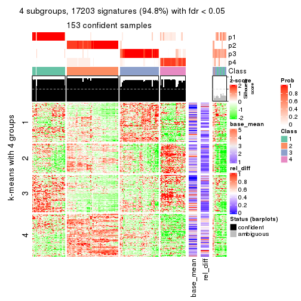</p>

</div>
<div id='tab-SD-pam-get-signatures-4'>
<pre><code class="r">get_signatures(res, k = 5)
</code></pre>

<p></p>

</div>
<div id='tab-SD-pam-get-signatures-5'>
<pre><code class="r">get_signatures(res, k = 6)
</code></pre>

<p></p>

</div>
</div>


Signature heatmaps where rows are not scaled:


<script>
$( function() {
	$( '#tabs-SD-pam-get-signatures-no-scale' ).tabs();
} );
</script>
<div id='tabs-SD-pam-get-signatures-no-scale'>
<ul>
<li><a href='#tab-SD-pam-get-signatures-no-scale-1'>k = 2</a></li>
<li><a href='#tab-SD-pam-get-signatures-no-scale-2'>k = 3</a></li>
<li><a href='#tab-SD-pam-get-signatures-no-scale-3'>k = 4</a></li>
<li><a href='#tab-SD-pam-get-signatures-no-scale-4'>k = 5</a></li>
<li><a href='#tab-SD-pam-get-signatures-no-scale-5'>k = 6</a></li>
</ul>
<div id='tab-SD-pam-get-signatures-no-scale-1'>
<pre><code class="r">get_signatures(res, k = 2, scale_rows = FALSE)
</code></pre>

<p></p>

</div>
<div id='tab-SD-pam-get-signatures-no-scale-2'>
<pre><code class="r">get_signatures(res, k = 3, scale_rows = FALSE)
</code></pre>

<p></p>

</div>
<div id='tab-SD-pam-get-signatures-no-scale-3'>
<pre><code class="r">get_signatures(res, k = 4, scale_rows = FALSE)
</code></pre>

<p></p>

</div>
<div id='tab-SD-pam-get-signatures-no-scale-4'>
<pre><code class="r">get_signatures(res, k = 5, scale_rows = FALSE)
</code></pre>

<p></p>

</div>
<div id='tab-SD-pam-get-signatures-no-scale-5'>
<pre><code class="r">get_signatures(res, k = 6, scale_rows = FALSE)
</code></pre>

<p></p>

</div>
</div>


Compare the overlap of signatures from different k:

```r
compare_signatures(res)
```


`get_signature()` returns a data frame invisibly. TO get the list of signatures, the function
call should be assigned to a variable explicitly. In following code, if `plot` argument is set
to `FALSE`, no heatmap is plotted while only the differential analysis is performed.

```r
# code only for demonstration
tb = get_signature(res, k = ..., plot = FALSE)
```

An example of the output of `tb` is:

```
#>   which_row         fdr    mean_1    mean_2 scaled_mean_1 scaled_mean_2 km
#> 1        38 0.042760348  8.373488  9.131774    -0.5533452     0.5164555  1
#> 2        40 0.018707592  7.106213  8.469186    -0.6173731     0.5762149  1
#> 3        55 0.019134737 10.221463 11.207825    -0.6159697     0.5749050  1
#> 4        59 0.006059896  5.921854  7.869574    -0.6899429     0.6439467  1
#> 5        60 0.018055526  8.928898 10.211722    -0.6204761     0.5791110  1
#> 6        98 0.009384629 15.714769 14.887706     0.6635654    -0.6193277  2
...
```

The columns in `tb` are:

1. `which_row`: row indices corresponding to the input matrix.
2. `fdr`: FDR for the differential test. 
3. `mean_x`: The mean value in group x.
4. `scaled_mean_x`: The mean value in group x after rows are scaled.
5. `km`: Row groups if k-means clustering is applied to rows.


UMAP plot which shows how samples are separated.


<script>
$( function() {
	$( '#tabs-SD-pam-dimension-reduction' ).tabs();
} );
</script>
<div id='tabs-SD-pam-dimension-reduction'>
<ul>
<li><a href='#tab-SD-pam-dimension-reduction-1'>k = 2</a></li>
<li><a href='#tab-SD-pam-dimension-reduction-2'>k = 3</a></li>
<li><a href='#tab-SD-pam-dimension-reduction-3'>k = 4</a></li>
<li><a href='#tab-SD-pam-dimension-reduction-4'>k = 5</a></li>
<li><a href='#tab-SD-pam-dimension-reduction-5'>k = 6</a></li>
</ul>
<div id='tab-SD-pam-dimension-reduction-1'>
<pre><code class="r">dimension_reduction(res, k = 2, method = &quot;UMAP&quot;)
</code></pre>

<p></p>

</div>
<div id='tab-SD-pam-dimension-reduction-2'>
<pre><code class="r">dimension_reduction(res, k = 3, method = &quot;UMAP&quot;)
</code></pre>

<p></p>

</div>
<div id='tab-SD-pam-dimension-reduction-3'>
<pre><code class="r">dimension_reduction(res, k = 4, method = &quot;UMAP&quot;)
</code></pre>

<p></p>

</div>
<div id='tab-SD-pam-dimension-reduction-4'>
<pre><code class="r">dimension_reduction(res, k = 5, method = &quot;UMAP&quot;)
</code></pre>

<p></p>

</div>
<div id='tab-SD-pam-dimension-reduction-5'>
<pre><code class="r">dimension_reduction(res, k = 6, method = &quot;UMAP&quot;)
</code></pre>

<p></p>

</div>
</div>


Following heatmap shows how subgroups are split when increasing `k`:

```r
collect_classes(res)
```


If matrix rows can be associated to genes, consider to use `functional_enrichment(res,
...)` to perform function enrichment for the signature genes. See [this vignette](http://bioconductor.org/packages/devel/bioc/vignettes/cola/inst/doc/functional_enrichment.html) for more detailed explanations.


 

---------------------------------------------------


### SD:mclust


The object with results only for a single top-value method and a single partition method 
can be extracted as:

```r
res = res_list["SD", "mclust"]
# you can also extract it by
# res = res_list["SD:mclust"]
```

A summary of `res` and all the functions that can be applied to it:

```r
res
```

```
#> A 'ConsensusPartition' object with k = 2, 3, 4, 5, 6.
#>   On a matrix with 18147 rows and 167 columns.
#>   Top rows (1000, 2000, 3000, 4000, 5000) are extracted by 'SD' method.
#>   Subgroups are detected by 'mclust' method.
#>   Performed in total 1250 partitions by row resampling.
#>   Best k for subgroups seems to be 2.
#> 
#> Following methods can be applied to this 'ConsensusPartition' object:
#>  [1] "cola_report"             "collect_classes"         "collect_plots"          
#>  [4] "collect_stats"           "colnames"                "compare_signatures"     
#>  [7] "consensus_heatmap"       "dimension_reduction"     "functional_enrichment"  
#> [10] "get_anno_col"            "get_anno"                "get_classes"            
#> [13] "get_consensus"           "get_matrix"              "get_membership"         
#> [16] "get_param"               "get_signatures"          "get_stats"              
#> [19] "is_best_k"               "is_stable_k"             "membership_heatmap"     
#> [22] "ncol"                    "nrow"                    "plot_ecdf"              
#> [25] "rownames"                "select_partition_number" "show"                   
#> [28] "suggest_best_k"          "test_to_known_factors"
```

`collect_plots()` function collects all the plots made from `res` for all `k` (number of partitions)
into one single page to provide an easy and fast comparison between different `k`.

```r
collect_plots(res)
```


The plots are:

- The first row: a plot of the ECDF (empirical cumulative distribution
  function) curves of the consensus matrix for each `k` and the heatmap of
  predicted classes for each `k`.
- The second row: heatmaps of the consensus matrix for each `k`.
- The third row: heatmaps of the membership matrix for each `k`.
- The fouth row: heatmaps of the signatures for each `k`.

All the plots in panels can be made by individual functions and they are
plotted later in this section.

`select_partition_number()` produces several plots showing different
statistics for choosing "optimized" `k`. There are following statistics:

- ECDF curves of the consensus matrix for each `k`;
- 1-PAC. [The PAC
  score](https://en.wikipedia.org/wiki/Consensus_clustering#Over-interpretation_potential_of_consensus_clustering)
  measures the proportion of the ambiguous subgrouping.
- Mean silhouette score.
- Concordance. The mean probability of fiting the consensus class ids in all
  partitions.
- Area increased. Denote $A_k$ as the area under the ECDF curve for current
  `k`, the area increased is defined as $A_k - A_{k-1}$.
- Rand index. The percent of pairs of samples that are both in a same cluster
  or both are not in a same cluster in the partition of k and k-1.
- Jaccard index. The ratio of pairs of samples are both in a same cluster in
  the partition of k and k-1 and the pairs of samples are both in a same
  cluster in the partition k or k-1.

The detailed explanations of these statistics can be found in [the _cola_
vignette](http://bioconductor.org/packages/devel/bioc/vignettes/cola/inst/doc/cola.html#toc_13).

Generally speaking, lower PAC score, higher mean silhouette score or higher
concordance corresponds to better partition. Rand index and Jaccard index
measure how similar the current partition is compared to partition with `k-1`.
If they are too similar, we won't accept `k` is better than `k-1`.

```r
select_partition_number(res)
```


The numeric values for all these statistics can be obtained by `get_stats()`.

```r
get_stats(res)
```

```
#>   k 1-PAC mean_silhouette concordance area_increased  Rand Jaccard
#> 2 2 0.498           0.695       0.876         0.4623 0.508   0.508
#> 3 3 0.482           0.593       0.753         0.3559 0.795   0.610
#> 4 4 0.618           0.773       0.822         0.1476 0.820   0.536
#> 5 5 0.576           0.661       0.764         0.0716 0.915   0.689
#> 6 6 0.649           0.543       0.750         0.0521 0.933   0.703
```

`suggest_best_k()` suggests the best $k$ based on these statistics. The rules are as follows:

- All $k$ with Jaccard index larger than 0.95 are removed because increasing
  $k$ does not provide enough extra information. If all $k$ are removed, it is
  marked as no subgroup is detected.
- For all $k$ with 1-PAC score larger than 0.9, the maximal $k$ is taken as
  the best $k$, and other $k$ are marked as optional $k$.
- If it does not fit the second rule. The $k$ with the maximal vote of the
  highest 1-PAC score, highest mean silhouette, and highest concordance is
  taken as the best $k$.

```r
suggest_best_k(res)
```

```
#> [1] 2
```


Following shows the table of the partitions (You need to click the **show/hide
code output** link to see it). The membership matrix (columns with name `p*`)
is inferred by
[`clue::cl_consensus()`](https://www.rdocumentation.org/link/cl_consensus?package=clue)
function with the `SE` method. Basically the value in the membership matrix
represents the probability to belong to a certain group. The finall class
label for an item is determined with the group with highest probability it
belongs to.

In `get_classes()` function, the entropy is calculated from the membership
matrix and the silhouette score is calculated from the consensus matrix.


<script>
$( function() {
	$( '#tabs-SD-mclust-get-classes' ).tabs();
} );
</script>
<div id='tabs-SD-mclust-get-classes'>
<ul>
<li><a href='#tab-SD-mclust-get-classes-1'>k = 2</a></li>
<li><a href='#tab-SD-mclust-get-classes-2'>k = 3</a></li>
<li><a href='#tab-SD-mclust-get-classes-3'>k = 4</a></li>
<li><a href='#tab-SD-mclust-get-classes-4'>k = 5</a></li>
<li><a href='#tab-SD-mclust-get-classes-5'>k = 6</a></li>
</ul>

<div id='tab-SD-mclust-get-classes-1'>
<p><a id='tab-SD-mclust-get-classes-1-a' style='color:#0366d6' href='#'>show/hide code output</a></p>
<pre><code class="r">cbind(get_classes(res, k = 2), get_membership(res, k = 2))
</code></pre>

<pre><code>#&gt;            class entropy silhouette    p1    p2
#&gt; SRR1313062     1  0.7056     0.7202 0.808 0.192
#&gt; SRR1313063     1  0.7056     0.7202 0.808 0.192
#&gt; SRR1313064     1  0.0000     0.8268 1.000 0.000
#&gt; SRR1313065     1  0.0000     0.8268 1.000 0.000
#&gt; SRR1313066     1  0.0376     0.8254 0.996 0.004
#&gt; SRR1313067     1  0.7056     0.7202 0.808 0.192
#&gt; SRR1313068     1  0.7056     0.7202 0.808 0.192
#&gt; SRR1313069     1  0.0000     0.8268 1.000 0.000
#&gt; SRR1313070     1  0.0376     0.8254 0.996 0.004
#&gt; SRR1313071     1  0.0376     0.8254 0.996 0.004
#&gt; SRR1313072     1  0.0376     0.8254 0.996 0.004
#&gt; SRR1313073     1  0.0000     0.8268 1.000 0.000
#&gt; SRR1313074     1  0.0000     0.8268 1.000 0.000
#&gt; SRR1313075     1  0.0000     0.8268 1.000 0.000
#&gt; SRR1313076     1  0.7056     0.7202 0.808 0.192
#&gt; SRR1313077     1  0.7056     0.7202 0.808 0.192
#&gt; SRR1313078     1  0.7139     0.7179 0.804 0.196
#&gt; SRR1313079     1  0.0000     0.8268 1.000 0.000
#&gt; SRR1313080     1  0.7056     0.7202 0.808 0.192
#&gt; SRR1313081     1  0.7056     0.7202 0.808 0.192
#&gt; SRR1313082     1  0.0000     0.8268 1.000 0.000
#&gt; SRR1313083     1  0.0000     0.8268 1.000 0.000
#&gt; SRR1313084     1  0.0376     0.8254 0.996 0.004
#&gt; SRR1313085     1  0.0376     0.8254 0.996 0.004
#&gt; SRR1313086     1  0.0000     0.8268 1.000 0.000
#&gt; SRR1313087     1  0.0000     0.8268 1.000 0.000
#&gt; SRR1313088     1  0.0000     0.8268 1.000 0.000
#&gt; SRR1313089     1  0.0000     0.8268 1.000 0.000
#&gt; SRR1313092     1  0.9775     0.3885 0.588 0.412
#&gt; SRR1313090     1  0.9833     0.3576 0.576 0.424
#&gt; SRR1313091     2  0.9552     0.3450 0.376 0.624
#&gt; SRR1313093     1  0.9795     0.3838 0.584 0.416
#&gt; SRR1313095     1  0.9661     0.4341 0.608 0.392
#&gt; SRR1313096     1  0.7219     0.7152 0.800 0.200
#&gt; SRR1313094     1  0.9866     0.3407 0.568 0.432
#&gt; SRR1313097     2  0.9833     0.2205 0.424 0.576
#&gt; SRR1313099     2  0.9833     0.2143 0.424 0.576
#&gt; SRR1313098     1  0.8016     0.6654 0.756 0.244
#&gt; SRR1313101     2  0.9775     0.2543 0.412 0.588
#&gt; SRR1313102     2  0.9754     0.2621 0.408 0.592
#&gt; SRR1313103     2  0.9815     0.2277 0.420 0.580
#&gt; SRR1313100     1  0.9661     0.4341 0.608 0.392
#&gt; SRR1313105     2  0.9833     0.2143 0.424 0.576
#&gt; SRR1313104     1  0.9983     0.1843 0.524 0.476
#&gt; SRR1313107     2  0.9833     0.2143 0.424 0.576
#&gt; SRR1313106     1  0.9922     0.2957 0.552 0.448
#&gt; SRR1313109     2  0.9661     0.3064 0.392 0.608
#&gt; SRR1313108     1  0.9710     0.4214 0.600 0.400
#&gt; SRR1313111     2  0.9815     0.2274 0.420 0.580
#&gt; SRR1313110     1  0.9732     0.4077 0.596 0.404
#&gt; SRR1313112     2  0.9815     0.2288 0.420 0.580
#&gt; SRR1313113     2  0.9815     0.2274 0.420 0.580
#&gt; SRR1313115     1  0.9754     0.4033 0.592 0.408
#&gt; SRR1313114     1  0.9661     0.4341 0.608 0.392
#&gt; SRR1313117     1  0.9850     0.3463 0.572 0.428
#&gt; SRR1313118     1  0.9661     0.4341 0.608 0.392
#&gt; SRR1313116     2  0.9661     0.3064 0.392 0.608
#&gt; SRR1313120     2  0.9833     0.2143 0.424 0.576
#&gt; SRR1313119     1  0.9833     0.3576 0.576 0.424
#&gt; SRR1313122     1  0.9686     0.4278 0.604 0.396
#&gt; SRR1313124     1  0.9833     0.3576 0.576 0.424
#&gt; SRR1313121     1  0.9833     0.3576 0.576 0.424
#&gt; SRR1313125     2  0.9954     0.0774 0.460 0.540
#&gt; SRR1313127     1  0.8713     0.6024 0.708 0.292
#&gt; SRR1313123     1  0.9427     0.4941 0.640 0.360
#&gt; SRR1313128     1  0.0672     0.8250 0.992 0.008
#&gt; SRR1313126     1  0.7745     0.6837 0.772 0.228
#&gt; SRR1313130     2  0.9552     0.3450 0.376 0.624
#&gt; SRR1313132     1  0.0672     0.8250 0.992 0.008
#&gt; SRR1313129     2  0.9661     0.3064 0.392 0.608
#&gt; SRR1313133     1  0.0672     0.8250 0.992 0.008
#&gt; SRR1313131     1  0.7219     0.7152 0.800 0.200
#&gt; SRR1313134     1  0.0672     0.8250 0.992 0.008
#&gt; SRR1313135     1  0.0000     0.8268 1.000 0.000
#&gt; SRR1313136     1  0.0000     0.8268 1.000 0.000
#&gt; SRR1313137     1  0.0000     0.8268 1.000 0.000
#&gt; SRR1313138     1  0.0938     0.8213 0.988 0.012
#&gt; SRR1313140     1  0.0000     0.8268 1.000 0.000
#&gt; SRR1313141     1  0.0672     0.8250 0.992 0.008
#&gt; SRR1313139     1  0.0000     0.8268 1.000 0.000
#&gt; SRR1313143     1  0.0672     0.8250 0.992 0.008
#&gt; SRR1313142     1  0.0000     0.8268 1.000 0.000
#&gt; SRR1313144     1  0.0000     0.8268 1.000 0.000
#&gt; SRR1313145     1  0.0376     0.8260 0.996 0.004
#&gt; SRR1313146     1  0.0000     0.8268 1.000 0.000
#&gt; SRR1313147     1  0.0000     0.8268 1.000 0.000
#&gt; SRR1313150     1  0.0000     0.8268 1.000 0.000
#&gt; SRR1313149     1  0.0672     0.8250 0.992 0.008
#&gt; SRR1313152     1  0.0000     0.8268 1.000 0.000
#&gt; SRR1313151     1  0.0000     0.8268 1.000 0.000
#&gt; SRR1313154     1  0.0000     0.8268 1.000 0.000
#&gt; SRR1313153     1  0.0000     0.8268 1.000 0.000
#&gt; SRR1313156     1  0.0672     0.8250 0.992 0.008
#&gt; SRR1313155     1  0.0000     0.8268 1.000 0.000
#&gt; SRR1313157     1  0.0000     0.8268 1.000 0.000
#&gt; SRR1313158     1  0.0672     0.8250 0.992 0.008
#&gt; SRR1313161     1  0.0000     0.8268 1.000 0.000
#&gt; SRR1313159     1  0.3879     0.7894 0.924 0.076
#&gt; SRR1313160     1  0.0000     0.8268 1.000 0.000
#&gt; SRR1313162     1  0.0000     0.8268 1.000 0.000
#&gt; SRR1313163     1  0.0000     0.8268 1.000 0.000
#&gt; SRR1313165     1  0.0000     0.8268 1.000 0.000
#&gt; SRR1313166     1  0.0672     0.8250 0.992 0.008
#&gt; SRR1313164     1  0.0672     0.8250 0.992 0.008
#&gt; SRR1313167     1  0.0000     0.8268 1.000 0.000
#&gt; SRR1313168     1  0.0000     0.8268 1.000 0.000
#&gt; SRR1313170     1  0.9954     0.2557 0.540 0.460
#&gt; SRR1313169     1  0.0000     0.8268 1.000 0.000
#&gt; SRR1313172     1  0.9922     0.2974 0.552 0.448
#&gt; SRR1313171     1  0.0672     0.8250 0.992 0.008
#&gt; SRR1313174     2  0.0000     0.8519 0.000 1.000
#&gt; SRR1313173     1  0.7219     0.7152 0.800 0.200
#&gt; SRR1313176     2  0.0000     0.8519 0.000 1.000
#&gt; SRR1313175     2  0.0000     0.8519 0.000 1.000
#&gt; SRR1313178     2  0.0000     0.8519 0.000 1.000
#&gt; SRR1313177     2  0.0000     0.8519 0.000 1.000
#&gt; SRR1313179     1  0.9998     0.1490 0.508 0.492
#&gt; SRR1313180     2  0.0000     0.8519 0.000 1.000
#&gt; SRR1313181     2  0.0000     0.8519 0.000 1.000
#&gt; SRR1313183     2  0.0000     0.8519 0.000 1.000
#&gt; SRR1313182     2  0.0000     0.8519 0.000 1.000
#&gt; SRR1313184     2  0.5946     0.7188 0.144 0.856
#&gt; SRR1313185     2  0.0000     0.8519 0.000 1.000
#&gt; SRR1313188     2  0.0000     0.8519 0.000 1.000
#&gt; SRR1313187     2  0.0000     0.8519 0.000 1.000
#&gt; SRR1313186     2  0.0000     0.8519 0.000 1.000
#&gt; SRR1313189     2  0.0000     0.8519 0.000 1.000
#&gt; SRR1313190     2  0.0000     0.8519 0.000 1.000
#&gt; SRR1313191     2  0.0000     0.8519 0.000 1.000
#&gt; SRR1313192     2  0.0000     0.8519 0.000 1.000
#&gt; SRR1313193     2  0.0000     0.8519 0.000 1.000
#&gt; SRR1313194     2  0.0000     0.8519 0.000 1.000
#&gt; SRR1313195     2  0.0000     0.8519 0.000 1.000
#&gt; SRR1313196     2  0.0000     0.8519 0.000 1.000
#&gt; SRR1313197     2  0.0000     0.8519 0.000 1.000
#&gt; SRR1313198     2  0.0000     0.8519 0.000 1.000
#&gt; SRR1313199     2  0.0000     0.8519 0.000 1.000
#&gt; SRR1313200     2  0.0000     0.8519 0.000 1.000
#&gt; SRR1313201     2  0.0000     0.8519 0.000 1.000
#&gt; SRR1313202     2  0.0938     0.8429 0.012 0.988
#&gt; SRR1313203     1  0.9732     0.4159 0.596 0.404
#&gt; SRR1313204     2  0.0000     0.8519 0.000 1.000
#&gt; SRR1313205     2  0.0000     0.8519 0.000 1.000
#&gt; SRR1313207     2  0.0000     0.8519 0.000 1.000
#&gt; SRR1313208     2  0.0000     0.8519 0.000 1.000
#&gt; SRR1313206     2  0.0000     0.8519 0.000 1.000
#&gt; SRR1313210     2  0.0000     0.8519 0.000 1.000
#&gt; SRR1313209     2  0.0000     0.8519 0.000 1.000
#&gt; SRR1313211     2  0.0000     0.8519 0.000 1.000
#&gt; SRR1313212     2  0.0000     0.8519 0.000 1.000
#&gt; SRR1313214     2  0.0000     0.8519 0.000 1.000
#&gt; SRR1313215     2  0.0000     0.8519 0.000 1.000
#&gt; SRR1313213     2  0.0000     0.8519 0.000 1.000
#&gt; SRR1313216     2  0.8661     0.5182 0.288 0.712
#&gt; SRR1313217     2  0.0000     0.8519 0.000 1.000
#&gt; SRR1313219     2  0.0000     0.8519 0.000 1.000
#&gt; SRR1313220     2  0.0000     0.8519 0.000 1.000
#&gt; SRR1313218     2  0.0000     0.8519 0.000 1.000
#&gt; SRR1313222     2  0.0000     0.8519 0.000 1.000
#&gt; SRR1313221     2  0.0000     0.8519 0.000 1.000
#&gt; SRR1313223     2  0.0000     0.8519 0.000 1.000
#&gt; SRR1313224     2  0.0000     0.8519 0.000 1.000
#&gt; SRR1313225     2  0.0000     0.8519 0.000 1.000
#&gt; SRR1313226     2  0.9209     0.4293 0.336 0.664
#&gt; SRR1313227     2  0.0000     0.8519 0.000 1.000
#&gt; SRR1313228     2  0.0000     0.8519 0.000 1.000
#&gt; SRR1313229     2  0.0000     0.8519 0.000 1.000
</code></pre>

<script>
$('#tab-SD-mclust-get-classes-1-a').parent().next().next().hide();
$('#tab-SD-mclust-get-classes-1-a').click(function(){
  $('#tab-SD-mclust-get-classes-1-a').parent().next().next().toggle();
  return(false);
});
</script>
</div>

<div id='tab-SD-mclust-get-classes-2'>
<p><a id='tab-SD-mclust-get-classes-2-a' style='color:#0366d6' href='#'>show/hide code output</a></p>
<pre><code class="r">cbind(get_classes(res, k = 3), get_membership(res, k = 3))
</code></pre>

<pre><code>#&gt;            class entropy silhouette    p1    p2    p3
#&gt; SRR1313062     3  0.6026     0.4547 0.376 0.000 0.624
#&gt; SRR1313063     3  0.5905     0.4380 0.352 0.000 0.648
#&gt; SRR1313064     1  0.5948     0.3244 0.640 0.000 0.360
#&gt; SRR1313065     1  0.5431     0.5355 0.716 0.000 0.284
#&gt; SRR1313066     1  0.5621     0.5154 0.692 0.000 0.308
#&gt; SRR1313067     3  0.5706     0.5320 0.320 0.000 0.680
#&gt; SRR1313068     3  0.5733     0.4933 0.324 0.000 0.676
#&gt; SRR1313069     1  0.5138     0.5319 0.748 0.000 0.252
#&gt; SRR1313070     1  0.5621     0.5154 0.692 0.000 0.308
#&gt; SRR1313071     1  0.5621     0.5154 0.692 0.000 0.308
#&gt; SRR1313072     1  0.5621     0.5154 0.692 0.000 0.308
#&gt; SRR1313073     1  0.6299    -0.1288 0.524 0.000 0.476
#&gt; SRR1313074     1  0.5138     0.5319 0.748 0.000 0.252
#&gt; SRR1313075     1  0.5497     0.5157 0.708 0.000 0.292
#&gt; SRR1313076     3  0.5785     0.4983 0.332 0.000 0.668
#&gt; SRR1313077     3  0.4796     0.5580 0.220 0.000 0.780
#&gt; SRR1313078     3  0.3551     0.5209 0.132 0.000 0.868
#&gt; SRR1313079     1  0.5882     0.3869 0.652 0.000 0.348
#&gt; SRR1313080     3  0.5948     0.4578 0.360 0.000 0.640
#&gt; SRR1313081     3  0.4842     0.5524 0.224 0.000 0.776
#&gt; SRR1313082     1  0.4887     0.5362 0.772 0.000 0.228
#&gt; SRR1313083     1  0.5431     0.5367 0.716 0.000 0.284
#&gt; SRR1313084     1  0.5621     0.5154 0.692 0.000 0.308
#&gt; SRR1313085     1  0.5621     0.5154 0.692 0.000 0.308
#&gt; SRR1313086     1  0.5178     0.5306 0.744 0.000 0.256
#&gt; SRR1313087     1  0.6280    -0.0431 0.540 0.000 0.460
#&gt; SRR1313088     1  0.5621     0.5154 0.692 0.000 0.308
#&gt; SRR1313089     1  0.5431     0.5167 0.716 0.000 0.284
#&gt; SRR1313092     3  0.7706     0.5883 0.264 0.088 0.648
#&gt; SRR1313090     3  0.9212     0.5554 0.304 0.180 0.516
#&gt; SRR1313091     2  0.8203     0.4686 0.116 0.616 0.268
#&gt; SRR1313093     3  0.5573     0.5613 0.160 0.044 0.796
#&gt; SRR1313095     3  0.5363     0.5820 0.276 0.000 0.724
#&gt; SRR1313096     3  0.3879     0.5326 0.152 0.000 0.848
#&gt; SRR1313094     3  0.8911     0.5583 0.260 0.176 0.564
#&gt; SRR1313097     3  0.9193     0.2631 0.156 0.364 0.480
#&gt; SRR1313099     2  0.9457    -0.2250 0.180 0.428 0.392
#&gt; SRR1313098     3  0.5363     0.5820 0.276 0.000 0.724
#&gt; SRR1313101     3  0.9336     0.1309 0.164 0.412 0.424
#&gt; SRR1313102     2  0.9266    -0.1084 0.156 0.424 0.420
#&gt; SRR1313103     2  0.9659    -0.2553 0.216 0.432 0.352
#&gt; SRR1313100     3  0.5650     0.5653 0.312 0.000 0.688
#&gt; SRR1313105     3  0.9626     0.3012 0.204 0.392 0.404
#&gt; SRR1313104     3  0.8076     0.5509 0.168 0.180 0.652
#&gt; SRR1313107     2  0.9541    -0.2430 0.192 0.424 0.384
#&gt; SRR1313106     3  0.8076     0.5534 0.168 0.180 0.652
#&gt; SRR1313109     2  0.9049     0.0459 0.136 0.464 0.400
#&gt; SRR1313108     3  0.3879     0.5326 0.152 0.000 0.848
#&gt; SRR1313111     2  0.9454    -0.1682 0.180 0.432 0.388
#&gt; SRR1313110     3  0.9825     0.4916 0.308 0.268 0.424
#&gt; SRR1313112     3  0.9247     0.1992 0.156 0.392 0.452
#&gt; SRR1313113     2  0.9266    -0.1084 0.156 0.424 0.420
#&gt; SRR1313115     3  0.5092     0.5598 0.176 0.020 0.804
#&gt; SRR1313114     3  0.5621     0.5665 0.308 0.000 0.692
#&gt; SRR1313117     3  0.8787     0.5427 0.228 0.188 0.584
#&gt; SRR1313118     3  0.6018     0.5709 0.308 0.008 0.684
#&gt; SRR1313116     2  0.9147    -0.0430 0.144 0.444 0.412
#&gt; SRR1313120     2  0.9569    -0.2535 0.196 0.420 0.384
#&gt; SRR1313119     3  0.9672     0.5200 0.304 0.240 0.456
#&gt; SRR1313122     3  0.5692     0.5882 0.268 0.008 0.724
#&gt; SRR1313124     3  0.8845     0.5533 0.240 0.184 0.576
#&gt; SRR1313121     3  0.9173     0.5567 0.304 0.176 0.520
#&gt; SRR1313125     3  0.8550     0.5310 0.176 0.216 0.608
#&gt; SRR1313127     3  0.5363     0.5820 0.276 0.000 0.724
#&gt; SRR1313123     3  0.5291     0.5847 0.268 0.000 0.732
#&gt; SRR1313128     1  0.5363     0.6499 0.724 0.000 0.276
#&gt; SRR1313126     3  0.5431     0.5788 0.284 0.000 0.716
#&gt; SRR1313130     2  0.7884     0.5509 0.120 0.656 0.224
#&gt; SRR1313132     1  0.4796     0.6704 0.780 0.000 0.220
#&gt; SRR1313129     2  0.9069    -0.0391 0.136 0.440 0.424
#&gt; SRR1313133     1  0.5363     0.6499 0.724 0.000 0.276
#&gt; SRR1313131     3  0.3551     0.5251 0.132 0.000 0.868
#&gt; SRR1313134     1  0.6168     0.5863 0.588 0.000 0.412
#&gt; SRR1313135     1  0.3752     0.6987 0.856 0.000 0.144
#&gt; SRR1313136     1  0.3941     0.6959 0.844 0.000 0.156
#&gt; SRR1313137     1  0.2796     0.7071 0.908 0.000 0.092
#&gt; SRR1313138     1  0.4002     0.6882 0.840 0.000 0.160
#&gt; SRR1313140     1  0.2878     0.6917 0.904 0.000 0.096
#&gt; SRR1313141     1  0.6079     0.6133 0.612 0.000 0.388
#&gt; SRR1313139     1  0.2356     0.7080 0.928 0.000 0.072
#&gt; SRR1313143     1  0.6252     0.5702 0.556 0.000 0.444
#&gt; SRR1313142     1  0.4346     0.6955 0.816 0.000 0.184
#&gt; SRR1313144     1  0.3267     0.7081 0.884 0.000 0.116
#&gt; SRR1313145     1  0.4346     0.6891 0.816 0.000 0.184
#&gt; SRR1313146     1  0.3879     0.7006 0.848 0.000 0.152
#&gt; SRR1313147     1  0.2711     0.7082 0.912 0.000 0.088
#&gt; SRR1313150     1  0.2878     0.7050 0.904 0.000 0.096
#&gt; SRR1313149     1  0.6140     0.6103 0.596 0.000 0.404
#&gt; SRR1313152     1  0.2796     0.7071 0.908 0.000 0.092
#&gt; SRR1313151     1  0.4291     0.7034 0.820 0.000 0.180
#&gt; SRR1313154     1  0.5016     0.6747 0.760 0.000 0.240
#&gt; SRR1313153     1  0.4062     0.6981 0.836 0.000 0.164
#&gt; SRR1313156     1  0.4796     0.6741 0.780 0.000 0.220
#&gt; SRR1313155     1  0.3879     0.6984 0.848 0.000 0.152
#&gt; SRR1313157     1  0.2796     0.7071 0.908 0.000 0.092
#&gt; SRR1313158     1  0.4452     0.6846 0.808 0.000 0.192
#&gt; SRR1313161     1  0.3038     0.7000 0.896 0.000 0.104
#&gt; SRR1313159     1  0.6180     0.6564 0.716 0.024 0.260
#&gt; SRR1313160     1  0.2959     0.7027 0.900 0.000 0.100
#&gt; SRR1313162     3  0.5560     0.5547 0.300 0.000 0.700
#&gt; SRR1313163     1  0.3879     0.6929 0.848 0.000 0.152
#&gt; SRR1313165     1  0.3038     0.7000 0.896 0.000 0.104
#&gt; SRR1313166     1  0.4702     0.6775 0.788 0.000 0.212
#&gt; SRR1313164     1  0.4702     0.6732 0.788 0.000 0.212
#&gt; SRR1313167     1  0.3192     0.7044 0.888 0.000 0.112
#&gt; SRR1313168     1  0.2796     0.7071 0.908 0.000 0.092
#&gt; SRR1313170     3  0.9421     0.2248 0.176 0.388 0.436
#&gt; SRR1313169     1  0.2711     0.7088 0.912 0.000 0.088
#&gt; SRR1313172     3  0.8826     0.2504 0.116 0.412 0.472
#&gt; SRR1313171     1  0.6244     0.5494 0.560 0.000 0.440
#&gt; SRR1313174     2  0.2448     0.8327 0.000 0.924 0.076
#&gt; SRR1313173     3  0.3551     0.5209 0.132 0.000 0.868
#&gt; SRR1313176     2  0.0000     0.8365 0.000 1.000 0.000
#&gt; SRR1313175     2  0.2448     0.8327 0.000 0.924 0.076
#&gt; SRR1313178     2  0.0000     0.8365 0.000 1.000 0.000
#&gt; SRR1313177     2  0.1411     0.8226 0.000 0.964 0.036
#&gt; SRR1313179     2  0.8655     0.0814 0.108 0.512 0.380
#&gt; SRR1313180     2  0.2625     0.8294 0.000 0.916 0.084
#&gt; SRR1313181     2  0.0000     0.8365 0.000 1.000 0.000
#&gt; SRR1313183     2  0.1411     0.8226 0.000 0.964 0.036
#&gt; SRR1313182     2  0.0000     0.8365 0.000 1.000 0.000
#&gt; SRR1313184     2  0.6224     0.6702 0.032 0.728 0.240
#&gt; SRR1313185     2  0.2165     0.8340 0.000 0.936 0.064
#&gt; SRR1313188     2  0.2448     0.8327 0.000 0.924 0.076
#&gt; SRR1313187     2  0.2448     0.8327 0.000 0.924 0.076
#&gt; SRR1313186     2  0.2165     0.8340 0.000 0.936 0.064
#&gt; SRR1313189     2  0.1411     0.8226 0.000 0.964 0.036
#&gt; SRR1313190     2  0.0237     0.8354 0.000 0.996 0.004
#&gt; SRR1313191     2  0.0000     0.8365 0.000 1.000 0.000
#&gt; SRR1313192     2  0.0000     0.8365 0.000 1.000 0.000
#&gt; SRR1313193     2  0.0000     0.8365 0.000 1.000 0.000
#&gt; SRR1313194     2  0.2448     0.8327 0.000 0.924 0.076
#&gt; SRR1313195     2  0.2448     0.8327 0.000 0.924 0.076
#&gt; SRR1313196     2  0.2448     0.8327 0.000 0.924 0.076
#&gt; SRR1313197     2  0.2448     0.8327 0.000 0.924 0.076
#&gt; SRR1313198     2  0.2448     0.8327 0.000 0.924 0.076
#&gt; SRR1313199     2  0.0000     0.8365 0.000 1.000 0.000
#&gt; SRR1313200     2  0.2448     0.8327 0.000 0.924 0.076
#&gt; SRR1313201     2  0.0000     0.8365 0.000 1.000 0.000
#&gt; SRR1313202     2  0.5012     0.7281 0.008 0.788 0.204
#&gt; SRR1313203     3  0.6126    -0.0644 0.352 0.004 0.644
#&gt; SRR1313204     2  0.0000     0.8365 0.000 1.000 0.000
#&gt; SRR1313205     2  0.0000     0.8365 0.000 1.000 0.000
#&gt; SRR1313207     2  0.0000     0.8365 0.000 1.000 0.000
#&gt; SRR1313208     2  0.0000     0.8365 0.000 1.000 0.000
#&gt; SRR1313206     2  0.0000     0.8365 0.000 1.000 0.000
#&gt; SRR1313210     2  0.2448     0.8327 0.000 0.924 0.076
#&gt; SRR1313209     2  0.2448     0.8327 0.000 0.924 0.076
#&gt; SRR1313211     2  0.0000     0.8365 0.000 1.000 0.000
#&gt; SRR1313212     2  0.0000     0.8365 0.000 1.000 0.000
#&gt; SRR1313214     2  0.2448     0.8327 0.000 0.924 0.076
#&gt; SRR1313215     2  0.2448     0.8327 0.000 0.924 0.076
#&gt; SRR1313213     2  0.0000     0.8365 0.000 1.000 0.000
#&gt; SRR1313216     2  0.6586     0.6614 0.056 0.728 0.216
#&gt; SRR1313217     2  0.2448     0.8327 0.000 0.924 0.076
#&gt; SRR1313219     2  0.2448     0.8327 0.000 0.924 0.076
#&gt; SRR1313220     2  0.0000     0.8365 0.000 1.000 0.000
#&gt; SRR1313218     2  0.0237     0.8367 0.000 0.996 0.004
#&gt; SRR1313222     2  0.0000     0.8365 0.000 1.000 0.000
#&gt; SRR1313221     2  0.0000     0.8365 0.000 1.000 0.000
#&gt; SRR1313223     2  0.1163     0.8264 0.000 0.972 0.028
#&gt; SRR1313224     2  0.2448     0.8327 0.000 0.924 0.076
#&gt; SRR1313225     2  0.2448     0.8327 0.000 0.924 0.076
#&gt; SRR1313226     2  0.5881     0.6441 0.016 0.728 0.256
#&gt; SRR1313227     2  0.0000     0.8365 0.000 1.000 0.000
#&gt; SRR1313228     2  0.0000     0.8365 0.000 1.000 0.000
#&gt; SRR1313229     2  0.0000     0.8365 0.000 1.000 0.000
</code></pre>

<script>
$('#tab-SD-mclust-get-classes-2-a').parent().next().next().hide();
$('#tab-SD-mclust-get-classes-2-a').click(function(){
  $('#tab-SD-mclust-get-classes-2-a').parent().next().next().toggle();
  return(false);
});
</script>
</div>

<div id='tab-SD-mclust-get-classes-3'>
<p><a id='tab-SD-mclust-get-classes-3-a' style='color:#0366d6' href='#'>show/hide code output</a></p>
<pre><code class="r">cbind(get_classes(res, k = 4), get_membership(res, k = 4))
</code></pre>

<pre><code>#&gt;            class entropy silhouette    p1    p2    p3    p4
#&gt; SRR1313062     4  0.2760     0.7331 0.000 0.000 0.128 0.872
#&gt; SRR1313063     4  0.1716     0.7576 0.000 0.000 0.064 0.936
#&gt; SRR1313064     4  0.1118     0.7621 0.000 0.000 0.036 0.964
#&gt; SRR1313065     4  0.7365    -0.0541 0.400 0.000 0.160 0.440
#&gt; SRR1313066     4  0.1118     0.7621 0.000 0.000 0.036 0.964
#&gt; SRR1313067     4  0.4797     0.6068 0.020 0.000 0.260 0.720
#&gt; SRR1313068     4  0.3400     0.6990 0.000 0.000 0.180 0.820
#&gt; SRR1313069     4  0.5793     0.2874 0.384 0.000 0.036 0.580
#&gt; SRR1313070     4  0.1118     0.7621 0.000 0.000 0.036 0.964
#&gt; SRR1313071     4  0.1118     0.7621 0.000 0.000 0.036 0.964
#&gt; SRR1313072     4  0.1118     0.7621 0.000 0.000 0.036 0.964
#&gt; SRR1313073     4  0.1118     0.7621 0.000 0.000 0.036 0.964
#&gt; SRR1313074     4  0.5781     0.2970 0.380 0.000 0.036 0.584
#&gt; SRR1313075     4  0.1452     0.7604 0.008 0.000 0.036 0.956
#&gt; SRR1313076     4  0.4542     0.6618 0.020 0.000 0.228 0.752
#&gt; SRR1313077     4  0.6371     0.4784 0.092 0.000 0.300 0.608
#&gt; SRR1313078     4  0.6944     0.4613 0.216 0.000 0.196 0.588
#&gt; SRR1313079     4  0.1118     0.7621 0.000 0.000 0.036 0.964
#&gt; SRR1313080     4  0.2530     0.7402 0.000 0.000 0.112 0.888
#&gt; SRR1313081     4  0.6037     0.5023 0.068 0.000 0.304 0.628
#&gt; SRR1313082     4  0.6938     0.1116 0.400 0.000 0.112 0.488
#&gt; SRR1313083     4  0.7075     0.1186 0.384 0.000 0.128 0.488
#&gt; SRR1313084     4  0.1118     0.7621 0.000 0.000 0.036 0.964
#&gt; SRR1313085     4  0.1118     0.7621 0.000 0.000 0.036 0.964
#&gt; SRR1313086     4  0.6635     0.2049 0.388 0.000 0.088 0.524
#&gt; SRR1313087     4  0.1118     0.7621 0.000 0.000 0.036 0.964
#&gt; SRR1313088     4  0.1389     0.7605 0.000 0.000 0.048 0.952
#&gt; SRR1313089     4  0.1452     0.7604 0.008 0.000 0.036 0.956
#&gt; SRR1313092     3  0.1474     0.8434 0.052 0.000 0.948 0.000
#&gt; SRR1313090     3  0.1022     0.8551 0.000 0.000 0.968 0.032
#&gt; SRR1313091     3  0.7131     0.0909 0.068 0.436 0.472 0.024
#&gt; SRR1313093     3  0.3569     0.7411 0.196 0.000 0.804 0.000
#&gt; SRR1313095     3  0.1716     0.8378 0.064 0.000 0.936 0.000
#&gt; SRR1313096     3  0.4446     0.7221 0.196 0.000 0.776 0.028
#&gt; SRR1313094     3  0.1474     0.8434 0.052 0.000 0.948 0.000
#&gt; SRR1313097     3  0.0817     0.8598 0.000 0.000 0.976 0.024
#&gt; SRR1313099     3  0.3479     0.7747 0.148 0.012 0.840 0.000
#&gt; SRR1313098     3  0.1716     0.8378 0.064 0.000 0.936 0.000
#&gt; SRR1313101     3  0.0921     0.8578 0.000 0.000 0.972 0.028
#&gt; SRR1313102     3  0.1004     0.8597 0.004 0.000 0.972 0.024
#&gt; SRR1313103     3  0.1716     0.8392 0.064 0.000 0.936 0.000
#&gt; SRR1313100     3  0.2805     0.7787 0.012 0.000 0.888 0.100
#&gt; SRR1313105     3  0.0000     0.8585 0.000 0.000 1.000 0.000
#&gt; SRR1313104     3  0.0817     0.8598 0.000 0.000 0.976 0.024
#&gt; SRR1313107     3  0.3074     0.7761 0.152 0.000 0.848 0.000
#&gt; SRR1313106     3  0.0817     0.8598 0.000 0.000 0.976 0.024
#&gt; SRR1313109     3  0.4920     0.6197 0.052 0.192 0.756 0.000
#&gt; SRR1313108     3  0.4245     0.7281 0.196 0.000 0.784 0.020
#&gt; SRR1313111     3  0.0592     0.8541 0.016 0.000 0.984 0.000
#&gt; SRR1313110     3  0.1389     0.8390 0.000 0.000 0.952 0.048
#&gt; SRR1313112     3  0.1004     0.8593 0.000 0.004 0.972 0.024
#&gt; SRR1313113     3  0.0592     0.8604 0.000 0.000 0.984 0.016
#&gt; SRR1313115     3  0.3444     0.7545 0.184 0.000 0.816 0.000
#&gt; SRR1313114     3  0.1118     0.8516 0.000 0.000 0.964 0.036
#&gt; SRR1313117     3  0.1022     0.8551 0.000 0.000 0.968 0.032
#&gt; SRR1313118     3  0.1302     0.8445 0.000 0.000 0.956 0.044
#&gt; SRR1313116     3  0.0817     0.8598 0.000 0.000 0.976 0.024
#&gt; SRR1313120     3  0.3074     0.7761 0.152 0.000 0.848 0.000
#&gt; SRR1313119     3  0.1022     0.8551 0.000 0.000 0.968 0.032
#&gt; SRR1313122     3  0.2060     0.8403 0.052 0.000 0.932 0.016
#&gt; SRR1313124     3  0.0921     0.8578 0.000 0.000 0.972 0.028
#&gt; SRR1313121     3  0.1022     0.8551 0.000 0.000 0.968 0.032
#&gt; SRR1313125     3  0.0817     0.8598 0.000 0.000 0.976 0.024
#&gt; SRR1313127     3  0.1716     0.8378 0.064 0.000 0.936 0.000
#&gt; SRR1313123     3  0.1557     0.8418 0.056 0.000 0.944 0.000
#&gt; SRR1313128     1  0.3355     0.7900 0.836 0.000 0.160 0.004
#&gt; SRR1313126     3  0.2546     0.8301 0.060 0.000 0.912 0.028
#&gt; SRR1313130     3  0.6796     0.2914 0.052 0.380 0.544 0.024
#&gt; SRR1313132     1  0.3764     0.8223 0.784 0.000 0.216 0.000
#&gt; SRR1313129     3  0.1394     0.8587 0.012 0.008 0.964 0.016
#&gt; SRR1313133     1  0.3306     0.7865 0.840 0.000 0.156 0.004
#&gt; SRR1313131     4  0.7687     0.2518 0.240 0.000 0.312 0.448
#&gt; SRR1313134     1  0.4418     0.7687 0.784 0.000 0.184 0.032
#&gt; SRR1313135     1  0.4584     0.8356 0.696 0.000 0.300 0.004
#&gt; SRR1313136     1  0.4406     0.8345 0.700 0.000 0.300 0.000
#&gt; SRR1313137     1  0.6084     0.8057 0.660 0.000 0.244 0.096
#&gt; SRR1313138     1  0.5690     0.8251 0.672 0.000 0.268 0.060
#&gt; SRR1313140     1  0.6984     0.5916 0.580 0.000 0.184 0.236
#&gt; SRR1313141     1  0.4511     0.7628 0.784 0.000 0.176 0.040
#&gt; SRR1313139     1  0.6523     0.7564 0.628 0.000 0.236 0.136
#&gt; SRR1313143     1  0.5159     0.7279 0.756 0.000 0.156 0.088
#&gt; SRR1313142     1  0.3975     0.8368 0.760 0.000 0.240 0.000
#&gt; SRR1313144     1  0.5687     0.8302 0.684 0.000 0.248 0.068
#&gt; SRR1313145     1  0.4103     0.8403 0.744 0.000 0.256 0.000
#&gt; SRR1313146     1  0.4406     0.8345 0.700 0.000 0.300 0.000
#&gt; SRR1313147     1  0.6084     0.8057 0.660 0.000 0.244 0.096
#&gt; SRR1313150     1  0.6124     0.7978 0.640 0.000 0.276 0.084
#&gt; SRR1313149     1  0.4966     0.7406 0.768 0.000 0.156 0.076
#&gt; SRR1313152     1  0.6084     0.8057 0.660 0.000 0.244 0.096
#&gt; SRR1313151     1  0.4304     0.8398 0.716 0.000 0.284 0.000
#&gt; SRR1313154     1  0.3764     0.8273 0.784 0.000 0.216 0.000
#&gt; SRR1313153     1  0.4103     0.8405 0.744 0.000 0.256 0.000
#&gt; SRR1313156     1  0.3801     0.8299 0.780 0.000 0.220 0.000
#&gt; SRR1313155     1  0.4584     0.8356 0.696 0.000 0.300 0.004
#&gt; SRR1313157     1  0.6167     0.7972 0.648 0.000 0.256 0.096
#&gt; SRR1313158     1  0.4072     0.8393 0.748 0.000 0.252 0.000
#&gt; SRR1313161     1  0.6124     0.7978 0.640 0.000 0.276 0.084
#&gt; SRR1313159     1  0.4662     0.8249 0.768 0.016 0.204 0.012
#&gt; SRR1313160     1  0.6100     0.8013 0.644 0.000 0.272 0.084
#&gt; SRR1313162     3  0.3991     0.6910 0.172 0.000 0.808 0.020
#&gt; SRR1313163     1  0.5678     0.8083 0.640 0.000 0.316 0.044
#&gt; SRR1313165     1  0.6124     0.7978 0.640 0.000 0.276 0.084
#&gt; SRR1313166     1  0.3837     0.8266 0.776 0.000 0.224 0.000
#&gt; SRR1313164     1  0.3528     0.8116 0.808 0.000 0.192 0.000
#&gt; SRR1313167     1  0.6084     0.8057 0.660 0.000 0.244 0.096
#&gt; SRR1313168     1  0.6056     0.8085 0.660 0.000 0.248 0.092
#&gt; SRR1313170     3  0.1004     0.8597 0.004 0.000 0.972 0.024
#&gt; SRR1313169     1  0.6025     0.8084 0.668 0.000 0.236 0.096
#&gt; SRR1313172     2  0.8429    -0.0216 0.252 0.400 0.324 0.024
#&gt; SRR1313171     1  0.4365     0.7657 0.784 0.000 0.188 0.028
#&gt; SRR1313174     2  0.1302     0.8982 0.044 0.956 0.000 0.000
#&gt; SRR1313173     4  0.7627     0.3023 0.240 0.000 0.292 0.468
#&gt; SRR1313176     2  0.2480     0.9014 0.088 0.904 0.000 0.008
#&gt; SRR1313175     2  0.1302     0.8982 0.044 0.956 0.000 0.000
#&gt; SRR1313178     2  0.3616     0.8892 0.112 0.852 0.000 0.036
#&gt; SRR1313177     2  0.3731     0.8865 0.120 0.844 0.000 0.036
#&gt; SRR1313179     2  0.7116     0.5193 0.196 0.608 0.184 0.012
#&gt; SRR1313180     2  0.5188     0.6243 0.044 0.716 0.240 0.000
#&gt; SRR1313181     2  0.3557     0.8905 0.108 0.856 0.000 0.036
#&gt; SRR1313183     2  0.3731     0.8865 0.120 0.844 0.000 0.036
#&gt; SRR1313182     2  0.1022     0.8999 0.032 0.968 0.000 0.000
#&gt; SRR1313184     2  0.5984     0.7193 0.136 0.732 0.108 0.024
#&gt; SRR1313185     2  0.0469     0.9042 0.012 0.988 0.000 0.000
#&gt; SRR1313188     2  0.1302     0.8982 0.044 0.956 0.000 0.000
#&gt; SRR1313187     2  0.1302     0.8982 0.044 0.956 0.000 0.000
#&gt; SRR1313186     2  0.0188     0.9038 0.004 0.996 0.000 0.000
#&gt; SRR1313189     2  0.3842     0.8829 0.128 0.836 0.000 0.036
#&gt; SRR1313190     2  0.3674     0.8879 0.116 0.848 0.000 0.036
#&gt; SRR1313191     2  0.0336     0.9029 0.008 0.992 0.000 0.000
#&gt; SRR1313192     2  0.2412     0.9019 0.084 0.908 0.000 0.008
#&gt; SRR1313193     2  0.1545     0.9045 0.040 0.952 0.000 0.008
#&gt; SRR1313194     2  0.1302     0.8982 0.044 0.956 0.000 0.000
#&gt; SRR1313195     2  0.1302     0.8982 0.044 0.956 0.000 0.000
#&gt; SRR1313196     2  0.1302     0.8982 0.044 0.956 0.000 0.000
#&gt; SRR1313197     2  0.1302     0.8982 0.044 0.956 0.000 0.000
#&gt; SRR1313198     2  0.1302     0.8982 0.044 0.956 0.000 0.000
#&gt; SRR1313199     2  0.2412     0.9019 0.084 0.908 0.000 0.008
#&gt; SRR1313200     2  0.1302     0.8982 0.044 0.956 0.000 0.000
#&gt; SRR1313201     2  0.2480     0.9016 0.088 0.904 0.000 0.008
#&gt; SRR1313202     2  0.5539     0.7467 0.088 0.764 0.124 0.024
#&gt; SRR1313203     4  0.6251     0.5524 0.196 0.000 0.140 0.664
#&gt; SRR1313204     2  0.2480     0.9014 0.088 0.904 0.000 0.008
#&gt; SRR1313205     2  0.2271     0.9024 0.076 0.916 0.000 0.008
#&gt; SRR1313207     2  0.3674     0.8879 0.116 0.848 0.000 0.036
#&gt; SRR1313208     2  0.2662     0.9011 0.084 0.900 0.000 0.016
#&gt; SRR1313206     2  0.2342     0.9021 0.080 0.912 0.000 0.008
#&gt; SRR1313210     2  0.1302     0.8982 0.044 0.956 0.000 0.000
#&gt; SRR1313209     2  0.1302     0.8982 0.044 0.956 0.000 0.000
#&gt; SRR1313211     2  0.0000     0.9034 0.000 1.000 0.000 0.000
#&gt; SRR1313212     2  0.3497     0.8921 0.104 0.860 0.000 0.036
#&gt; SRR1313214     2  0.1302     0.8982 0.044 0.956 0.000 0.000
#&gt; SRR1313215     2  0.1302     0.8982 0.044 0.956 0.000 0.000
#&gt; SRR1313213     2  0.3674     0.8879 0.116 0.848 0.000 0.036
#&gt; SRR1313216     2  0.6282     0.6878 0.116 0.712 0.144 0.028
#&gt; SRR1313217     2  0.1302     0.8982 0.044 0.956 0.000 0.000
#&gt; SRR1313219     2  0.1302     0.8982 0.044 0.956 0.000 0.000
#&gt; SRR1313220     2  0.2412     0.9019 0.084 0.908 0.000 0.008
#&gt; SRR1313218     2  0.0817     0.9014 0.024 0.976 0.000 0.000
#&gt; SRR1313222     2  0.3616     0.8892 0.112 0.852 0.000 0.036
#&gt; SRR1313221     2  0.3616     0.8892 0.112 0.852 0.000 0.036
#&gt; SRR1313223     2  0.3674     0.8879 0.116 0.848 0.000 0.036
#&gt; SRR1313224     2  0.1302     0.8982 0.044 0.956 0.000 0.000
#&gt; SRR1313225     2  0.0592     0.9022 0.016 0.984 0.000 0.000
#&gt; SRR1313226     3  0.5233     0.4825 0.020 0.332 0.648 0.000
#&gt; SRR1313227     2  0.3279     0.8950 0.096 0.872 0.000 0.032
#&gt; SRR1313228     2  0.3435     0.8927 0.100 0.864 0.000 0.036
#&gt; SRR1313229     2  0.3435     0.8927 0.100 0.864 0.000 0.036
</code></pre>

<script>
$('#tab-SD-mclust-get-classes-3-a').parent().next().next().hide();
$('#tab-SD-mclust-get-classes-3-a').click(function(){
  $('#tab-SD-mclust-get-classes-3-a').parent().next().next().toggle();
  return(false);
});
</script>
</div>

<div id='tab-SD-mclust-get-classes-4'>
<p><a id='tab-SD-mclust-get-classes-4-a' style='color:#0366d6' href='#'>show/hide code output</a></p>
<pre><code class="r">cbind(get_classes(res, k = 5), get_membership(res, k = 5))
</code></pre>

<pre><code>#&gt;            class entropy silhouette    p1    p2    p3    p4    p5
#&gt; SRR1313062     4  0.2791     0.7629 0.036 0.000 0.016 0.892 0.056
#&gt; SRR1313063     4  0.2502     0.7659 0.024 0.000 0.012 0.904 0.060
#&gt; SRR1313064     4  0.1043     0.7851 0.040 0.000 0.000 0.960 0.000
#&gt; SRR1313065     1  0.4949     0.2223 0.572 0.000 0.032 0.396 0.000
#&gt; SRR1313066     4  0.0963     0.7814 0.000 0.000 0.000 0.964 0.036
#&gt; SRR1313067     4  0.6214     0.4942 0.292 0.000 0.060 0.592 0.056
#&gt; SRR1313068     4  0.4964     0.6613 0.192 0.000 0.024 0.728 0.056
#&gt; SRR1313069     4  0.3707     0.5637 0.284 0.000 0.000 0.716 0.000
#&gt; SRR1313070     4  0.0963     0.7814 0.000 0.000 0.000 0.964 0.036
#&gt; SRR1313071     4  0.0963     0.7814 0.000 0.000 0.000 0.964 0.036
#&gt; SRR1313072     4  0.0963     0.7814 0.000 0.000 0.000 0.964 0.036
#&gt; SRR1313073     4  0.0404     0.7824 0.012 0.000 0.000 0.988 0.000
#&gt; SRR1313074     4  0.3508     0.6052 0.252 0.000 0.000 0.748 0.000
#&gt; SRR1313075     4  0.1270     0.7807 0.052 0.000 0.000 0.948 0.000
#&gt; SRR1313076     4  0.5830     0.5845 0.232 0.000 0.056 0.656 0.056
#&gt; SRR1313077     4  0.6238     0.4613 0.312 0.000 0.056 0.576 0.056
#&gt; SRR1313078     4  0.7016     0.4641 0.276 0.000 0.140 0.528 0.056
#&gt; SRR1313079     4  0.1043     0.7851 0.040 0.000 0.000 0.960 0.000
#&gt; SRR1313080     4  0.3763     0.7363 0.096 0.000 0.016 0.832 0.056
#&gt; SRR1313081     4  0.6096     0.4933 0.292 0.000 0.052 0.600 0.056
#&gt; SRR1313082     4  0.4582     0.3367 0.416 0.000 0.012 0.572 0.000
#&gt; SRR1313083     4  0.4268     0.2884 0.444 0.000 0.000 0.556 0.000
#&gt; SRR1313084     4  0.0963     0.7814 0.000 0.000 0.000 0.964 0.036
#&gt; SRR1313085     4  0.0963     0.7814 0.000 0.000 0.000 0.964 0.036
#&gt; SRR1313086     4  0.3774     0.5480 0.296 0.000 0.000 0.704 0.000
#&gt; SRR1313087     4  0.0703     0.7866 0.024 0.000 0.000 0.976 0.000
#&gt; SRR1313088     4  0.2377     0.7574 0.128 0.000 0.000 0.872 0.000
#&gt; SRR1313089     4  0.1270     0.7817 0.052 0.000 0.000 0.948 0.000
#&gt; SRR1313092     3  0.5072     0.6454 0.340 0.000 0.620 0.028 0.012
#&gt; SRR1313090     3  0.3141     0.7250 0.152 0.000 0.832 0.000 0.016
#&gt; SRR1313091     3  0.8079     0.1326 0.220 0.104 0.360 0.000 0.316
#&gt; SRR1313093     3  0.4896     0.5602 0.252 0.000 0.696 0.032 0.020
#&gt; SRR1313095     3  0.5817     0.6254 0.328 0.000 0.588 0.060 0.024
#&gt; SRR1313096     3  0.6012     0.5102 0.252 0.000 0.632 0.056 0.060
#&gt; SRR1313094     3  0.4822     0.6628 0.344 0.000 0.628 0.008 0.020
#&gt; SRR1313097     3  0.4437     0.7183 0.140 0.000 0.760 0.000 0.100
#&gt; SRR1313099     3  0.6133     0.6015 0.300 0.000 0.540 0.000 0.160
#&gt; SRR1313098     3  0.5692     0.6262 0.332 0.000 0.592 0.056 0.020
#&gt; SRR1313101     3  0.5087     0.6970 0.148 0.000 0.700 0.000 0.152
#&gt; SRR1313102     3  0.4113     0.7239 0.140 0.000 0.784 0.000 0.076
#&gt; SRR1313103     3  0.5831     0.6453 0.236 0.000 0.604 0.000 0.160
#&gt; SRR1313100     3  0.5933     0.6563 0.232 0.000 0.640 0.100 0.028
#&gt; SRR1313105     3  0.3932     0.7257 0.140 0.000 0.796 0.000 0.064
#&gt; SRR1313104     3  0.2798     0.7244 0.140 0.000 0.852 0.000 0.008
#&gt; SRR1313107     3  0.6119     0.6005 0.296 0.000 0.544 0.000 0.160
#&gt; SRR1313106     3  0.3489     0.7282 0.144 0.000 0.820 0.000 0.036
#&gt; SRR1313109     3  0.6840     0.5675 0.212 0.040 0.556 0.000 0.192
#&gt; SRR1313108     3  0.6335     0.4829 0.252 0.000 0.604 0.100 0.044
#&gt; SRR1313111     3  0.4487     0.7171 0.140 0.000 0.756 0.000 0.104
#&gt; SRR1313110     3  0.5065     0.7204 0.232 0.000 0.692 0.008 0.068
#&gt; SRR1313112     3  0.5087     0.6970 0.148 0.000 0.700 0.000 0.152
#&gt; SRR1313113     3  0.4535     0.7160 0.140 0.000 0.752 0.000 0.108
#&gt; SRR1313115     3  0.5012     0.5615 0.244 0.000 0.696 0.032 0.028
#&gt; SRR1313114     3  0.4376     0.7056 0.216 0.000 0.744 0.028 0.012
#&gt; SRR1313117     3  0.3098     0.7240 0.148 0.000 0.836 0.000 0.016
#&gt; SRR1313118     3  0.4248     0.7086 0.200 0.000 0.760 0.028 0.012
#&gt; SRR1313116     3  0.4785     0.7135 0.140 0.004 0.740 0.000 0.116
#&gt; SRR1313120     3  0.6133     0.6015 0.300 0.000 0.540 0.000 0.160
#&gt; SRR1313119     3  0.3488     0.7281 0.168 0.000 0.808 0.000 0.024
#&gt; SRR1313122     3  0.6161     0.6136 0.324 0.000 0.564 0.088 0.024
#&gt; SRR1313124     3  0.3183     0.7252 0.156 0.000 0.828 0.000 0.016
#&gt; SRR1313121     3  0.3399     0.7259 0.168 0.000 0.812 0.000 0.020
#&gt; SRR1313125     3  0.3256     0.7244 0.148 0.000 0.832 0.004 0.016
#&gt; SRR1313127     3  0.5692     0.6262 0.332 0.000 0.592 0.056 0.020
#&gt; SRR1313123     3  0.4335     0.6594 0.324 0.000 0.664 0.008 0.004
#&gt; SRR1313128     1  0.3197     0.7030 0.836 0.000 0.140 0.000 0.024
#&gt; SRR1313126     3  0.6595     0.5820 0.332 0.000 0.532 0.088 0.048
#&gt; SRR1313130     3  0.8496     0.1369 0.208 0.196 0.304 0.000 0.292
#&gt; SRR1313132     1  0.2305     0.7789 0.896 0.000 0.092 0.000 0.012
#&gt; SRR1313129     3  0.5555     0.6952 0.204 0.000 0.644 0.000 0.152
#&gt; SRR1313133     1  0.3197     0.7030 0.836 0.000 0.140 0.000 0.024
#&gt; SRR1313131     3  0.7981     0.0249 0.228 0.000 0.384 0.296 0.092
#&gt; SRR1313134     1  0.5528     0.6225 0.700 0.000 0.184 0.068 0.048
#&gt; SRR1313135     1  0.1836     0.8193 0.932 0.000 0.036 0.032 0.000
#&gt; SRR1313136     1  0.1907     0.8200 0.928 0.000 0.044 0.028 0.000
#&gt; SRR1313137     1  0.2491     0.8229 0.896 0.000 0.036 0.068 0.000
#&gt; SRR1313138     1  0.1978     0.8296 0.928 0.000 0.024 0.044 0.004
#&gt; SRR1313140     1  0.3246     0.7093 0.808 0.000 0.008 0.184 0.000
#&gt; SRR1313141     1  0.5368     0.6026 0.708 0.000 0.168 0.100 0.024
#&gt; SRR1313139     1  0.2769     0.8058 0.876 0.000 0.032 0.092 0.000
#&gt; SRR1313143     1  0.6637     0.3162 0.564 0.000 0.140 0.260 0.036
#&gt; SRR1313142     1  0.0963     0.8159 0.964 0.000 0.036 0.000 0.000
#&gt; SRR1313144     1  0.2304     0.8245 0.908 0.000 0.044 0.048 0.000
#&gt; SRR1313145     1  0.0963     0.8155 0.964 0.000 0.036 0.000 0.000
#&gt; SRR1313146     1  0.1818     0.8157 0.932 0.000 0.044 0.024 0.000
#&gt; SRR1313147     1  0.2409     0.8240 0.900 0.000 0.032 0.068 0.000
#&gt; SRR1313150     1  0.2659     0.8161 0.888 0.000 0.060 0.052 0.000
#&gt; SRR1313149     1  0.6000     0.5221 0.660 0.000 0.140 0.164 0.036
#&gt; SRR1313152     1  0.2409     0.8245 0.900 0.000 0.032 0.068 0.000
#&gt; SRR1313151     1  0.1661     0.8189 0.940 0.000 0.036 0.024 0.000
#&gt; SRR1313154     1  0.1197     0.8119 0.952 0.000 0.048 0.000 0.000
#&gt; SRR1313153     1  0.1124     0.8177 0.960 0.000 0.036 0.004 0.000
#&gt; SRR1313156     1  0.2361     0.7791 0.892 0.000 0.096 0.000 0.012
#&gt; SRR1313155     1  0.1915     0.8196 0.928 0.000 0.040 0.032 0.000
#&gt; SRR1313157     1  0.2580     0.8210 0.892 0.000 0.044 0.064 0.000
#&gt; SRR1313158     1  0.1544     0.8092 0.932 0.000 0.068 0.000 0.000
#&gt; SRR1313161     1  0.2654     0.8151 0.888 0.000 0.064 0.048 0.000
#&gt; SRR1313159     1  0.3209     0.7622 0.848 0.000 0.120 0.004 0.028
#&gt; SRR1313160     1  0.2659     0.8161 0.888 0.000 0.060 0.052 0.000
#&gt; SRR1313162     1  0.6155    -0.3430 0.476 0.000 0.428 0.076 0.020
#&gt; SRR1313163     1  0.2390     0.8078 0.896 0.000 0.084 0.020 0.000
#&gt; SRR1313165     1  0.2726     0.8128 0.884 0.000 0.064 0.052 0.000
#&gt; SRR1313166     1  0.1764     0.7806 0.928 0.000 0.064 0.000 0.008
#&gt; SRR1313164     1  0.2864     0.7612 0.864 0.000 0.112 0.000 0.024
#&gt; SRR1313167     1  0.2409     0.8245 0.900 0.000 0.032 0.068 0.000
#&gt; SRR1313168     1  0.2409     0.8245 0.900 0.000 0.032 0.068 0.000
#&gt; SRR1313170     3  0.5327     0.7072 0.216 0.000 0.664 0.000 0.120
#&gt; SRR1313169     1  0.2409     0.8245 0.900 0.000 0.032 0.068 0.000
#&gt; SRR1313172     3  0.9151     0.2708 0.236 0.076 0.336 0.092 0.260
#&gt; SRR1313171     1  0.5561     0.6195 0.696 0.000 0.188 0.068 0.048
#&gt; SRR1313174     2  0.4294     0.2188 0.000 0.532 0.000 0.000 0.468
#&gt; SRR1313173     3  0.8037    -0.1001 0.224 0.000 0.348 0.332 0.096
#&gt; SRR1313176     2  0.2891     0.7824 0.000 0.824 0.000 0.000 0.176
#&gt; SRR1313175     5  0.2813     0.7935 0.000 0.168 0.000 0.000 0.832
#&gt; SRR1313178     2  0.1121     0.7984 0.000 0.956 0.000 0.000 0.044
#&gt; SRR1313177     2  0.0404     0.7623 0.000 0.988 0.000 0.000 0.012
#&gt; SRR1313179     5  0.9303     0.1613 0.156 0.300 0.152 0.076 0.316
#&gt; SRR1313180     5  0.3427     0.7789 0.000 0.108 0.056 0.000 0.836
#&gt; SRR1313181     2  0.1197     0.8000 0.000 0.952 0.000 0.000 0.048
#&gt; SRR1313183     2  0.0162     0.7701 0.000 0.996 0.000 0.000 0.004
#&gt; SRR1313182     2  0.4219     0.3887 0.000 0.584 0.000 0.000 0.416
#&gt; SRR1313184     5  0.7053     0.4498 0.072 0.336 0.100 0.000 0.492
#&gt; SRR1313185     2  0.4278     0.0625 0.000 0.548 0.000 0.000 0.452
#&gt; SRR1313188     5  0.3339     0.7955 0.000 0.124 0.040 0.000 0.836
#&gt; SRR1313187     5  0.3309     0.7987 0.000 0.128 0.036 0.000 0.836
#&gt; SRR1313186     5  0.4227     0.3132 0.000 0.420 0.000 0.000 0.580
#&gt; SRR1313189     2  0.1410     0.7993 0.000 0.940 0.000 0.000 0.060
#&gt; SRR1313190     2  0.0162     0.7701 0.000 0.996 0.000 0.000 0.004
#&gt; SRR1313191     2  0.4219     0.3887 0.000 0.584 0.000 0.000 0.416
#&gt; SRR1313192     2  0.2516     0.7981 0.000 0.860 0.000 0.000 0.140
#&gt; SRR1313193     2  0.3884     0.6535 0.000 0.708 0.004 0.000 0.288
#&gt; SRR1313194     5  0.3309     0.7987 0.000 0.128 0.036 0.000 0.836
#&gt; SRR1313195     5  0.3309     0.7987 0.000 0.128 0.036 0.000 0.836
#&gt; SRR1313196     5  0.3309     0.7987 0.000 0.128 0.036 0.000 0.836
#&gt; SRR1313197     5  0.3003     0.7827 0.000 0.188 0.000 0.000 0.812
#&gt; SRR1313198     5  0.2891     0.7900 0.000 0.176 0.000 0.000 0.824
#&gt; SRR1313199     2  0.2929     0.7803 0.000 0.820 0.000 0.000 0.180
#&gt; SRR1313200     5  0.3309     0.7987 0.000 0.128 0.036 0.000 0.836
#&gt; SRR1313201     2  0.2230     0.7980 0.000 0.884 0.000 0.000 0.116
#&gt; SRR1313202     5  0.7217     0.4848 0.072 0.292 0.132 0.000 0.504
#&gt; SRR1313203     4  0.8231     0.4638 0.216 0.040 0.132 0.496 0.116
#&gt; SRR1313204     2  0.2424     0.8017 0.000 0.868 0.000 0.000 0.132
#&gt; SRR1313205     2  0.3039     0.7731 0.000 0.808 0.000 0.000 0.192
#&gt; SRR1313207     2  0.1043     0.7971 0.000 0.960 0.000 0.000 0.040
#&gt; SRR1313208     2  0.4307    -0.2454 0.000 0.500 0.000 0.000 0.500
#&gt; SRR1313206     2  0.3074     0.7704 0.000 0.804 0.000 0.000 0.196
#&gt; SRR1313210     5  0.3327     0.8012 0.000 0.144 0.028 0.000 0.828
#&gt; SRR1313209     5  0.2929     0.7867 0.000 0.180 0.000 0.000 0.820
#&gt; SRR1313211     5  0.4192     0.3037 0.000 0.404 0.000 0.000 0.596
#&gt; SRR1313212     2  0.3336     0.6554 0.000 0.772 0.000 0.000 0.228
#&gt; SRR1313214     5  0.3039     0.7784 0.000 0.192 0.000 0.000 0.808
#&gt; SRR1313215     5  0.2891     0.7900 0.000 0.176 0.000 0.000 0.824
#&gt; SRR1313213     2  0.0000     0.7734 0.000 1.000 0.000 0.000 0.000
#&gt; SRR1313216     5  0.7572     0.4335 0.076 0.300 0.172 0.000 0.452
#&gt; SRR1313217     5  0.3098     0.8001 0.000 0.148 0.016 0.000 0.836
#&gt; SRR1313219     5  0.3327     0.8012 0.000 0.144 0.028 0.000 0.828
#&gt; SRR1313220     2  0.2280     0.7974 0.000 0.880 0.000 0.000 0.120
#&gt; SRR1313218     5  0.3210     0.7629 0.000 0.212 0.000 0.000 0.788
#&gt; SRR1313222     2  0.0963     0.7954 0.000 0.964 0.000 0.000 0.036
#&gt; SRR1313221     2  0.1410     0.8012 0.000 0.940 0.000 0.000 0.060
#&gt; SRR1313223     2  0.0000     0.7734 0.000 1.000 0.000 0.000 0.000
#&gt; SRR1313224     5  0.3177     0.7650 0.000 0.208 0.000 0.000 0.792
#&gt; SRR1313225     5  0.3752     0.6810 0.000 0.292 0.000 0.000 0.708
#&gt; SRR1313226     5  0.7204     0.2704 0.100 0.100 0.284 0.000 0.516
#&gt; SRR1313227     2  0.2852     0.7841 0.000 0.828 0.000 0.000 0.172
#&gt; SRR1313228     2  0.2891     0.7816 0.000 0.824 0.000 0.000 0.176
#&gt; SRR1313229     2  0.2732     0.7876 0.000 0.840 0.000 0.000 0.160
</code></pre>

<script>
$('#tab-SD-mclust-get-classes-4-a').parent().next().next().hide();
$('#tab-SD-mclust-get-classes-4-a').click(function(){
  $('#tab-SD-mclust-get-classes-4-a').parent().next().next().toggle();
  return(false);
});
</script>
</div>

<div id='tab-SD-mclust-get-classes-5'>
<p><a id='tab-SD-mclust-get-classes-5-a' style='color:#0366d6' href='#'>show/hide code output</a></p>
<pre><code class="r">cbind(get_classes(res, k = 6), get_membership(res, k = 6))
</code></pre>

<pre><code>#&gt;            class entropy silhouette    p1    p2    p3    p4    p5    p6
#&gt; SRR1313062     4  0.0935    0.33382 0.032 0.000 0.004 0.964 0.000 0.000
#&gt; SRR1313063     4  0.0603    0.31502 0.016 0.000 0.000 0.980 0.000 0.004
#&gt; SRR1313064     4  0.4018   -0.18533 0.008 0.000 0.000 0.580 0.000 0.412
#&gt; SRR1313065     1  0.5443   -0.27393 0.492 0.000 0.000 0.124 0.000 0.384
#&gt; SRR1313066     6  0.3756    0.38268 0.000 0.000 0.000 0.400 0.000 0.600
#&gt; SRR1313067     4  0.5534    0.36976 0.124 0.000 0.104 0.672 0.000 0.100
#&gt; SRR1313068     4  0.3376    0.35818 0.180 0.000 0.004 0.792 0.000 0.024
#&gt; SRR1313069     6  0.5411    0.33928 0.116 0.000 0.000 0.412 0.000 0.472
#&gt; SRR1313070     6  0.3756    0.38268 0.000 0.000 0.000 0.400 0.000 0.600
#&gt; SRR1313071     6  0.3756    0.38268 0.000 0.000 0.000 0.400 0.000 0.600
#&gt; SRR1313072     6  0.3756    0.38268 0.000 0.000 0.000 0.400 0.000 0.600
#&gt; SRR1313073     4  0.3595   -0.00405 0.008 0.000 0.000 0.704 0.000 0.288
#&gt; SRR1313074     6  0.5113    0.32498 0.080 0.000 0.000 0.448 0.000 0.472
#&gt; SRR1313075     4  0.4471   -0.31825 0.028 0.000 0.000 0.500 0.000 0.472
#&gt; SRR1313076     4  0.4562    0.38286 0.108 0.000 0.068 0.756 0.000 0.068
#&gt; SRR1313077     4  0.5858    0.33920 0.188 0.000 0.076 0.624 0.000 0.112
#&gt; SRR1313078     4  0.5968    0.29955 0.116 0.000 0.052 0.600 0.004 0.228
#&gt; SRR1313079     4  0.3915   -0.18528 0.004 0.000 0.000 0.584 0.000 0.412
#&gt; SRR1313080     4  0.2092    0.34677 0.124 0.000 0.000 0.876 0.000 0.000
#&gt; SRR1313081     4  0.5816    0.35513 0.116 0.000 0.124 0.644 0.000 0.116
#&gt; SRR1313082     6  0.5911    0.28521 0.252 0.000 0.000 0.280 0.000 0.468
#&gt; SRR1313083     6  0.5861    0.20957 0.220 0.000 0.000 0.308 0.000 0.472
#&gt; SRR1313084     6  0.3756    0.38268 0.000 0.000 0.000 0.400 0.000 0.600
#&gt; SRR1313085     6  0.3756    0.38268 0.000 0.000 0.000 0.400 0.000 0.600
#&gt; SRR1313086     6  0.5290    0.31455 0.100 0.000 0.000 0.428 0.000 0.472
#&gt; SRR1313087     4  0.3907   -0.17991 0.004 0.000 0.000 0.588 0.000 0.408
#&gt; SRR1313088     4  0.4592   -0.31487 0.036 0.000 0.000 0.496 0.000 0.468
#&gt; SRR1313089     4  0.4471   -0.31825 0.028 0.000 0.000 0.500 0.000 0.472
#&gt; SRR1313092     3  0.3626    0.72982 0.068 0.000 0.788 0.000 0.000 0.144
#&gt; SRR1313090     3  0.0363    0.76912 0.012 0.000 0.988 0.000 0.000 0.000
#&gt; SRR1313091     5  0.7108   -0.12401 0.040 0.020 0.256 0.000 0.416 0.268
#&gt; SRR1313093     3  0.5236    0.58209 0.040 0.000 0.572 0.028 0.004 0.356
#&gt; SRR1313095     3  0.4301    0.71791 0.068 0.000 0.760 0.028 0.000 0.144
#&gt; SRR1313096     3  0.5349    0.57990 0.044 0.000 0.568 0.032 0.004 0.352
#&gt; SRR1313094     3  0.3683    0.73172 0.052 0.000 0.784 0.000 0.004 0.160
#&gt; SRR1313097     3  0.0632    0.77106 0.000 0.000 0.976 0.000 0.024 0.000
#&gt; SRR1313099     3  0.6563    0.52259 0.044 0.000 0.448 0.000 0.188 0.320
#&gt; SRR1313098     3  0.4373    0.71295 0.068 0.000 0.752 0.028 0.000 0.152
#&gt; SRR1313101     3  0.2346    0.72987 0.008 0.000 0.868 0.000 0.124 0.000
#&gt; SRR1313102     3  0.0717    0.77331 0.000 0.000 0.976 0.000 0.016 0.008
#&gt; SRR1313103     3  0.5749    0.64605 0.036 0.000 0.600 0.000 0.128 0.236
#&gt; SRR1313100     3  0.3794    0.65658 0.216 0.000 0.744 0.040 0.000 0.000
#&gt; SRR1313105     3  0.0508    0.77289 0.000 0.000 0.984 0.000 0.012 0.004
#&gt; SRR1313104     3  0.0405    0.77025 0.004 0.000 0.988 0.000 0.008 0.000
#&gt; SRR1313107     3  0.6669    0.50817 0.052 0.000 0.428 0.000 0.184 0.336
#&gt; SRR1313106     3  0.1387    0.76117 0.000 0.000 0.932 0.000 0.068 0.000
#&gt; SRR1313109     3  0.6242    0.43607 0.024 0.000 0.488 0.000 0.292 0.196
#&gt; SRR1313108     3  0.6249    0.48563 0.040 0.000 0.484 0.116 0.004 0.356
#&gt; SRR1313111     3  0.1152    0.76952 0.000 0.000 0.952 0.000 0.044 0.004
#&gt; SRR1313110     3  0.1296    0.77233 0.032 0.000 0.952 0.004 0.012 0.000
#&gt; SRR1313112     3  0.2664    0.68616 0.000 0.000 0.816 0.000 0.184 0.000
#&gt; SRR1313113     3  0.1958    0.74750 0.000 0.000 0.896 0.000 0.100 0.004
#&gt; SRR1313115     3  0.5329    0.58473 0.048 0.000 0.572 0.028 0.004 0.348
#&gt; SRR1313114     3  0.1003    0.76825 0.028 0.000 0.964 0.004 0.000 0.004
#&gt; SRR1313117     3  0.0508    0.76970 0.012 0.000 0.984 0.000 0.004 0.000
#&gt; SRR1313118     3  0.0363    0.76912 0.012 0.000 0.988 0.000 0.000 0.000
#&gt; SRR1313116     3  0.2494    0.74020 0.000 0.000 0.864 0.000 0.120 0.016
#&gt; SRR1313120     3  0.6696    0.50453 0.056 0.000 0.428 0.000 0.180 0.336
#&gt; SRR1313119     3  0.0622    0.77000 0.012 0.000 0.980 0.000 0.008 0.000
#&gt; SRR1313122     3  0.5463    0.66061 0.068 0.000 0.672 0.116 0.000 0.144
#&gt; SRR1313124     3  0.0603    0.77058 0.004 0.000 0.980 0.000 0.016 0.000
#&gt; SRR1313121     3  0.0363    0.76912 0.012 0.000 0.988 0.000 0.000 0.000
#&gt; SRR1313125     3  0.0405    0.77025 0.004 0.000 0.988 0.000 0.008 0.000
#&gt; SRR1313127     3  0.4315    0.71530 0.072 0.000 0.756 0.024 0.000 0.148
#&gt; SRR1313123     3  0.4286    0.71104 0.108 0.000 0.740 0.000 0.004 0.148
#&gt; SRR1313128     1  0.3892    0.69094 0.640 0.000 0.004 0.000 0.004 0.352
#&gt; SRR1313126     3  0.4649    0.70452 0.076 0.000 0.736 0.040 0.000 0.148
#&gt; SRR1313130     5  0.7045   -0.10060 0.024 0.112 0.364 0.000 0.424 0.076
#&gt; SRR1313132     1  0.4326    0.72429 0.656 0.000 0.044 0.000 0.000 0.300
#&gt; SRR1313129     3  0.3695    0.68508 0.004 0.000 0.772 0.000 0.184 0.040
#&gt; SRR1313133     1  0.3769    0.68762 0.640 0.000 0.000 0.000 0.004 0.356
#&gt; SRR1313131     4  0.6352    0.19825 0.040 0.000 0.128 0.464 0.004 0.364
#&gt; SRR1313134     1  0.4474    0.66335 0.608 0.000 0.012 0.020 0.000 0.360
#&gt; SRR1313135     1  0.3514    0.77976 0.804 0.000 0.088 0.000 0.000 0.108
#&gt; SRR1313136     1  0.3883    0.78035 0.768 0.000 0.088 0.000 0.000 0.144
#&gt; SRR1313137     1  0.0508    0.75397 0.984 0.000 0.012 0.004 0.000 0.000
#&gt; SRR1313138     1  0.3903    0.78813 0.764 0.000 0.060 0.004 0.000 0.172
#&gt; SRR1313140     1  0.2595    0.62569 0.836 0.000 0.000 0.160 0.000 0.004
#&gt; SRR1313141     6  0.4883   -0.24480 0.360 0.000 0.012 0.036 0.004 0.588
#&gt; SRR1313139     1  0.0865    0.72311 0.964 0.000 0.000 0.036 0.000 0.000
#&gt; SRR1313143     6  0.4339    0.07834 0.120 0.000 0.000 0.140 0.004 0.736
#&gt; SRR1313142     1  0.4094    0.77629 0.740 0.000 0.080 0.000 0.000 0.180
#&gt; SRR1313144     1  0.1615    0.76093 0.928 0.000 0.064 0.004 0.000 0.004
#&gt; SRR1313145     1  0.4156    0.77404 0.732 0.000 0.080 0.000 0.000 0.188
#&gt; SRR1313146     1  0.3907    0.77919 0.764 0.000 0.084 0.000 0.000 0.152
#&gt; SRR1313147     1  0.0458    0.74685 0.984 0.000 0.000 0.016 0.000 0.000
#&gt; SRR1313150     1  0.0508    0.75397 0.984 0.000 0.012 0.004 0.000 0.000
#&gt; SRR1313149     6  0.4790    0.02607 0.268 0.000 0.000 0.080 0.004 0.648
#&gt; SRR1313152     1  0.0508    0.75397 0.984 0.000 0.012 0.004 0.000 0.000
#&gt; SRR1313151     1  0.3746    0.78205 0.780 0.000 0.080 0.000 0.000 0.140
#&gt; SRR1313154     1  0.4094    0.77629 0.740 0.000 0.080 0.000 0.000 0.180
#&gt; SRR1313153     1  0.4156    0.77410 0.732 0.000 0.080 0.000 0.000 0.188
#&gt; SRR1313156     1  0.4680    0.72962 0.648 0.004 0.052 0.000 0.004 0.292
#&gt; SRR1313155     1  0.3602    0.78026 0.796 0.000 0.088 0.000 0.000 0.116
#&gt; SRR1313157     1  0.0508    0.74984 0.984 0.000 0.004 0.012 0.000 0.000
#&gt; SRR1313158     1  0.4428    0.76537 0.696 0.000 0.084 0.000 0.000 0.220
#&gt; SRR1313161     1  0.0692    0.75215 0.976 0.000 0.020 0.004 0.000 0.000
#&gt; SRR1313159     1  0.4819    0.71983 0.636 0.004 0.052 0.000 0.008 0.300
#&gt; SRR1313160     1  0.0508    0.75397 0.984 0.000 0.012 0.004 0.000 0.000
#&gt; SRR1313162     3  0.4970    0.67550 0.120 0.000 0.700 0.028 0.000 0.152
#&gt; SRR1313163     1  0.4077    0.70228 0.724 0.000 0.228 0.004 0.000 0.044
#&gt; SRR1313165     1  0.0603    0.75315 0.980 0.000 0.016 0.004 0.000 0.000
#&gt; SRR1313166     1  0.4381    0.75774 0.692 0.000 0.072 0.000 0.000 0.236
#&gt; SRR1313164     1  0.4186    0.71873 0.656 0.000 0.032 0.000 0.000 0.312
#&gt; SRR1313167     1  0.0508    0.74984 0.984 0.000 0.004 0.012 0.000 0.000
#&gt; SRR1313168     1  0.0508    0.75397 0.984 0.000 0.012 0.004 0.000 0.000
#&gt; SRR1313170     3  0.2898    0.76611 0.020 0.000 0.868 0.000 0.072 0.040
#&gt; SRR1313169     1  0.1296    0.76330 0.952 0.000 0.004 0.012 0.000 0.032
#&gt; SRR1313172     6  0.7593   -0.12219 0.052 0.028 0.160 0.036 0.240 0.484
#&gt; SRR1313171     1  0.4480    0.66414 0.608 0.000 0.016 0.016 0.000 0.360
#&gt; SRR1313174     5  0.3867    0.36183 0.000 0.328 0.000 0.000 0.660 0.012
#&gt; SRR1313173     4  0.6323    0.20042 0.040 0.000 0.124 0.468 0.004 0.364
#&gt; SRR1313176     2  0.3014    0.76262 0.000 0.804 0.000 0.000 0.184 0.012
#&gt; SRR1313175     5  0.0363    0.66268 0.000 0.012 0.000 0.000 0.988 0.000
#&gt; SRR1313178     2  0.0713    0.79311 0.000 0.972 0.000 0.000 0.028 0.000
#&gt; SRR1313177     2  0.0260    0.78134 0.000 0.992 0.000 0.000 0.000 0.008
#&gt; SRR1313179     5  0.6942    0.27952 0.040 0.180 0.020 0.000 0.432 0.328
#&gt; SRR1313180     5  0.2118    0.60353 0.000 0.008 0.104 0.000 0.888 0.000
#&gt; SRR1313181     2  0.2019    0.79484 0.000 0.900 0.000 0.000 0.088 0.012
#&gt; SRR1313183     2  0.0260    0.78134 0.000 0.992 0.000 0.000 0.000 0.008
#&gt; SRR1313182     5  0.4399   -0.10139 0.000 0.460 0.000 0.000 0.516 0.024
#&gt; SRR1313184     5  0.6145    0.41861 0.028 0.172 0.020 0.000 0.596 0.184
#&gt; SRR1313185     5  0.4399    0.08261 0.000 0.460 0.000 0.000 0.516 0.024
#&gt; SRR1313188     5  0.0520    0.66295 0.000 0.008 0.000 0.000 0.984 0.008
#&gt; SRR1313187     5  0.0520    0.66295 0.000 0.008 0.000 0.000 0.984 0.008
#&gt; SRR1313186     5  0.4273    0.29143 0.000 0.380 0.000 0.000 0.596 0.024
#&gt; SRR1313189     2  0.2669    0.75017 0.000 0.836 0.000 0.000 0.156 0.008
#&gt; SRR1313190     2  0.0260    0.78134 0.000 0.992 0.000 0.000 0.000 0.008
#&gt; SRR1313191     5  0.4407   -0.17687 0.000 0.484 0.000 0.000 0.492 0.024
#&gt; SRR1313192     2  0.3743    0.67818 0.000 0.724 0.000 0.000 0.252 0.024
#&gt; SRR1313193     2  0.4273    0.47525 0.000 0.596 0.000 0.000 0.380 0.024
#&gt; SRR1313194     5  0.0520    0.66295 0.000 0.008 0.000 0.000 0.984 0.008
#&gt; SRR1313195     5  0.0520    0.66295 0.000 0.008 0.000 0.000 0.984 0.008
#&gt; SRR1313196     5  0.0520    0.66295 0.000 0.008 0.000 0.000 0.984 0.008
#&gt; SRR1313197     5  0.3110    0.58205 0.000 0.196 0.000 0.000 0.792 0.012
#&gt; SRR1313198     5  0.2912    0.60127 0.000 0.172 0.000 0.000 0.816 0.012
#&gt; SRR1313199     2  0.2946    0.76591 0.000 0.812 0.000 0.000 0.176 0.012
#&gt; SRR1313200     5  0.0520    0.66295 0.000 0.008 0.000 0.000 0.984 0.008
#&gt; SRR1313201     2  0.2915    0.73948 0.000 0.808 0.000 0.000 0.184 0.008
#&gt; SRR1313202     5  0.5860    0.45231 0.024 0.160 0.024 0.000 0.636 0.156
#&gt; SRR1313203     6  0.4531   -0.05580 0.040 0.032 0.000 0.216 0.000 0.712
#&gt; SRR1313204     2  0.2877    0.77130 0.000 0.820 0.000 0.000 0.168 0.012
#&gt; SRR1313205     2  0.4109    0.58631 0.000 0.648 0.000 0.000 0.328 0.024
#&gt; SRR1313207     2  0.0622    0.78736 0.000 0.980 0.000 0.000 0.012 0.008
#&gt; SRR1313208     2  0.4123    0.14207 0.000 0.568 0.000 0.000 0.420 0.012
#&gt; SRR1313206     2  0.4153    0.56691 0.000 0.636 0.000 0.000 0.340 0.024
#&gt; SRR1313210     5  0.0865    0.66039 0.000 0.036 0.000 0.000 0.964 0.000
#&gt; SRR1313209     5  0.3201    0.57064 0.000 0.208 0.000 0.000 0.780 0.012
#&gt; SRR1313211     5  0.4396   -0.06510 0.000 0.456 0.000 0.000 0.520 0.024
#&gt; SRR1313212     2  0.2980    0.72802 0.000 0.800 0.000 0.000 0.192 0.008
#&gt; SRR1313214     5  0.3110    0.58205 0.000 0.196 0.000 0.000 0.792 0.012
#&gt; SRR1313215     5  0.2562    0.60396 0.000 0.172 0.000 0.000 0.828 0.000
#&gt; SRR1313213     2  0.0260    0.78134 0.000 0.992 0.000 0.000 0.000 0.008
#&gt; SRR1313216     5  0.6001    0.43341 0.020 0.156 0.028 0.000 0.616 0.180
#&gt; SRR1313217     5  0.0520    0.66295 0.000 0.008 0.000 0.000 0.984 0.008
#&gt; SRR1313219     5  0.0713    0.66188 0.000 0.028 0.000 0.000 0.972 0.000
#&gt; SRR1313220     2  0.2980    0.73674 0.000 0.800 0.000 0.000 0.192 0.008
#&gt; SRR1313218     5  0.3645    0.53718 0.000 0.236 0.000 0.000 0.740 0.024
#&gt; SRR1313222     2  0.0622    0.78736 0.000 0.980 0.000 0.000 0.012 0.008
#&gt; SRR1313221     2  0.1049    0.79267 0.000 0.960 0.000 0.000 0.032 0.008
#&gt; SRR1313223     2  0.0260    0.78134 0.000 0.992 0.000 0.000 0.000 0.008
#&gt; SRR1313224     5  0.3593    0.54412 0.000 0.228 0.000 0.000 0.748 0.024
#&gt; SRR1313225     5  0.3566    0.55881 0.000 0.224 0.000 0.000 0.752 0.024
#&gt; SRR1313226     5  0.4675    0.31901 0.028 0.008 0.288 0.000 0.660 0.016
#&gt; SRR1313227     2  0.2980    0.76262 0.000 0.808 0.000 0.000 0.180 0.012
#&gt; SRR1313228     2  0.2946    0.76505 0.000 0.812 0.000 0.000 0.176 0.012
#&gt; SRR1313229     2  0.2912    0.76784 0.000 0.816 0.000 0.000 0.172 0.012
</code></pre>

<script>
$('#tab-SD-mclust-get-classes-5-a').parent().next().next().hide();
$('#tab-SD-mclust-get-classes-5-a').click(function(){
  $('#tab-SD-mclust-get-classes-5-a').parent().next().next().toggle();
  return(false);
});
</script>
</div>
</div>

Heatmaps for the consensus matrix. It visualizes the probability of two
samples to be in a same group.


<script>
$( function() {
	$( '#tabs-SD-mclust-consensus-heatmap' ).tabs();
} );
</script>
<div id='tabs-SD-mclust-consensus-heatmap'>
<ul>
<li><a href='#tab-SD-mclust-consensus-heatmap-1'>k = 2</a></li>
<li><a href='#tab-SD-mclust-consensus-heatmap-2'>k = 3</a></li>
<li><a href='#tab-SD-mclust-consensus-heatmap-3'>k = 4</a></li>
<li><a href='#tab-SD-mclust-consensus-heatmap-4'>k = 5</a></li>
<li><a href='#tab-SD-mclust-consensus-heatmap-5'>k = 6</a></li>
</ul>
<div id='tab-SD-mclust-consensus-heatmap-1'>
<pre><code class="r">consensus_heatmap(res, k = 2)
</code></pre>

<p></p>

</div>
<div id='tab-SD-mclust-consensus-heatmap-2'>
<pre><code class="r">consensus_heatmap(res, k = 3)
</code></pre>

<p></p>

</div>
<div id='tab-SD-mclust-consensus-heatmap-3'>
<pre><code class="r">consensus_heatmap(res, k = 4)
</code></pre>

<p></p>

</div>
<div id='tab-SD-mclust-consensus-heatmap-4'>
<pre><code class="r">consensus_heatmap(res, k = 5)
</code></pre>

<p></p>

</div>
<div id='tab-SD-mclust-consensus-heatmap-5'>
<pre><code class="r">consensus_heatmap(res, k = 6)
</code></pre>

<p></p>

</div>
</div>

Heatmaps for the membership of samples in all partitions to see how consistent they are:


<script>
$( function() {
	$( '#tabs-SD-mclust-membership-heatmap' ).tabs();
} );
</script>
<div id='tabs-SD-mclust-membership-heatmap'>
<ul>
<li><a href='#tab-SD-mclust-membership-heatmap-1'>k = 2</a></li>
<li><a href='#tab-SD-mclust-membership-heatmap-2'>k = 3</a></li>
<li><a href='#tab-SD-mclust-membership-heatmap-3'>k = 4</a></li>
<li><a href='#tab-SD-mclust-membership-heatmap-4'>k = 5</a></li>
<li><a href='#tab-SD-mclust-membership-heatmap-5'>k = 6</a></li>
</ul>
<div id='tab-SD-mclust-membership-heatmap-1'>
<pre><code class="r">membership_heatmap(res, k = 2)
</code></pre>

<p></p>

</div>
<div id='tab-SD-mclust-membership-heatmap-2'>
<pre><code class="r">membership_heatmap(res, k = 3)
</code></pre>

<p></p>

</div>
<div id='tab-SD-mclust-membership-heatmap-3'>
<pre><code class="r">membership_heatmap(res, k = 4)
</code></pre>

<p></p>

</div>
<div id='tab-SD-mclust-membership-heatmap-4'>
<pre><code class="r">membership_heatmap(res, k = 5)
</code></pre>

<p></p>

</div>
<div id='tab-SD-mclust-membership-heatmap-5'>
<pre><code class="r">membership_heatmap(res, k = 6)
</code></pre>

<p></p>

</div>
</div>

As soon as we have had the classes for columns, we can look for signatures
which are significantly different between classes which can be candidate marks
for certain classes. Following are the heatmaps for signatures.


Signature heatmaps where rows are scaled:


<script>
$( function() {
	$( '#tabs-SD-mclust-get-signatures' ).tabs();
} );
</script>
<div id='tabs-SD-mclust-get-signatures'>
<ul>
<li><a href='#tab-SD-mclust-get-signatures-1'>k = 2</a></li>
<li><a href='#tab-SD-mclust-get-signatures-2'>k = 3</a></li>
<li><a href='#tab-SD-mclust-get-signatures-3'>k = 4</a></li>
<li><a href='#tab-SD-mclust-get-signatures-4'>k = 5</a></li>
<li><a href='#tab-SD-mclust-get-signatures-5'>k = 6</a></li>
</ul>
<div id='tab-SD-mclust-get-signatures-1'>
<pre><code class="r">get_signatures(res, k = 2)
</code></pre>

<p></p>

</div>
<div id='tab-SD-mclust-get-signatures-2'>
<pre><code class="r">get_signatures(res, k = 3)
</code></pre>

<p></p>

</div>
<div id='tab-SD-mclust-get-signatures-3'>
<pre><code class="r">get_signatures(res, k = 4)
</code></pre>

<p></p>

</div>
<div id='tab-SD-mclust-get-signatures-4'>
<pre><code class="r">get_signatures(res, k = 5)
</code></pre>

<p></p>

</div>
<div id='tab-SD-mclust-get-signatures-5'>
<pre><code class="r">get_signatures(res, k = 6)
</code></pre>

<p></p>

</div>
</div>


Signature heatmaps where rows are not scaled:


<script>
$( function() {
	$( '#tabs-SD-mclust-get-signatures-no-scale' ).tabs();
} );
</script>
<div id='tabs-SD-mclust-get-signatures-no-scale'>
<ul>
<li><a href='#tab-SD-mclust-get-signatures-no-scale-1'>k = 2</a></li>
<li><a href='#tab-SD-mclust-get-signatures-no-scale-2'>k = 3</a></li>
<li><a href='#tab-SD-mclust-get-signatures-no-scale-3'>k = 4</a></li>
<li><a href='#tab-SD-mclust-get-signatures-no-scale-4'>k = 5</a></li>
<li><a href='#tab-SD-mclust-get-signatures-no-scale-5'>k = 6</a></li>
</ul>
<div id='tab-SD-mclust-get-signatures-no-scale-1'>
<pre><code class="r">get_signatures(res, k = 2, scale_rows = FALSE)
</code></pre>

<p></p>

</div>
<div id='tab-SD-mclust-get-signatures-no-scale-2'>
<pre><code class="r">get_signatures(res, k = 3, scale_rows = FALSE)
</code></pre>

<p></p>

</div>
<div id='tab-SD-mclust-get-signatures-no-scale-3'>
<pre><code class="r">get_signatures(res, k = 4, scale_rows = FALSE)
</code></pre>

<p></p>

</div>
<div id='tab-SD-mclust-get-signatures-no-scale-4'>
<pre><code class="r">get_signatures(res, k = 5, scale_rows = FALSE)
</code></pre>

<p></p>

</div>
<div id='tab-SD-mclust-get-signatures-no-scale-5'>
<pre><code class="r">get_signatures(res, k = 6, scale_rows = FALSE)
</code></pre>

<p></p>

</div>
</div>


Compare the overlap of signatures from different k:

```r
compare_signatures(res)
```

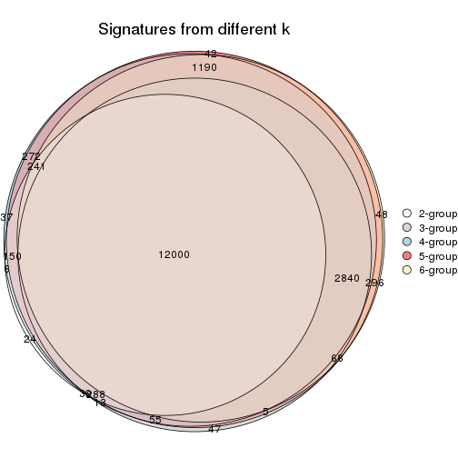

`get_signature()` returns a data frame invisibly. TO get the list of signatures, the function
call should be assigned to a variable explicitly. In following code, if `plot` argument is set
to `FALSE`, no heatmap is plotted while only the differential analysis is performed.

```r
# code only for demonstration
tb = get_signature(res, k = ..., plot = FALSE)
```

An example of the output of `tb` is:

```
#>   which_row         fdr    mean_1    mean_2 scaled_mean_1 scaled_mean_2 km
#> 1        38 0.042760348  8.373488  9.131774    -0.5533452     0.5164555  1
#> 2        40 0.018707592  7.106213  8.469186    -0.6173731     0.5762149  1
#> 3        55 0.019134737 10.221463 11.207825    -0.6159697     0.5749050  1
#> 4        59 0.006059896  5.921854  7.869574    -0.6899429     0.6439467  1
#> 5        60 0.018055526  8.928898 10.211722    -0.6204761     0.5791110  1
#> 6        98 0.009384629 15.714769 14.887706     0.6635654    -0.6193277  2
...
```

The columns in `tb` are:

1. `which_row`: row indices corresponding to the input matrix.
2. `fdr`: FDR for the differential test. 
3. `mean_x`: The mean value in group x.
4. `scaled_mean_x`: The mean value in group x after rows are scaled.
5. `km`: Row groups if k-means clustering is applied to rows.


UMAP plot which shows how samples are separated.


<script>
$( function() {
	$( '#tabs-SD-mclust-dimension-reduction' ).tabs();
} );
</script>
<div id='tabs-SD-mclust-dimension-reduction'>
<ul>
<li><a href='#tab-SD-mclust-dimension-reduction-1'>k = 2</a></li>
<li><a href='#tab-SD-mclust-dimension-reduction-2'>k = 3</a></li>
<li><a href='#tab-SD-mclust-dimension-reduction-3'>k = 4</a></li>
<li><a href='#tab-SD-mclust-dimension-reduction-4'>k = 5</a></li>
<li><a href='#tab-SD-mclust-dimension-reduction-5'>k = 6</a></li>
</ul>
<div id='tab-SD-mclust-dimension-reduction-1'>
<pre><code class="r">dimension_reduction(res, k = 2, method = &quot;UMAP&quot;)
</code></pre>

<p>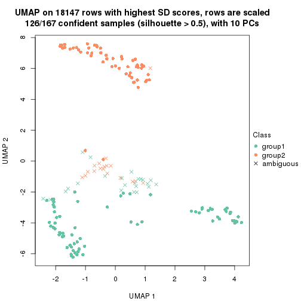</p>

</div>
<div id='tab-SD-mclust-dimension-reduction-2'>
<pre><code class="r">dimension_reduction(res, k = 3, method = &quot;UMAP&quot;)
</code></pre>

<p></p>

</div>
<div id='tab-SD-mclust-dimension-reduction-3'>
<pre><code class="r">dimension_reduction(res, k = 4, method = &quot;UMAP&quot;)
</code></pre>

<p></p>

</div>
<div id='tab-SD-mclust-dimension-reduction-4'>
<pre><code class="r">dimension_reduction(res, k = 5, method = &quot;UMAP&quot;)
</code></pre>

<p></p>

</div>
<div id='tab-SD-mclust-dimension-reduction-5'>
<pre><code class="r">dimension_reduction(res, k = 6, method = &quot;UMAP&quot;)
</code></pre>

<p></p>

</div>
</div>


Following heatmap shows how subgroups are split when increasing `k`:

```r
collect_classes(res)
```


If matrix rows can be associated to genes, consider to use `functional_enrichment(res,
...)` to perform function enrichment for the signature genes. See [this vignette](http://bioconductor.org/packages/devel/bioc/vignettes/cola/inst/doc/functional_enrichment.html) for more detailed explanations.


 

---------------------------------------------------


### SD:NMF**


The object with results only for a single top-value method and a single partition method 
can be extracted as:

```r
res = res_list["SD", "NMF"]
# you can also extract it by
# res = res_list["SD:NMF"]
```

A summary of `res` and all the functions that can be applied to it:

```r
res
```

```
#> A 'ConsensusPartition' object with k = 2, 3, 4, 5, 6.
#>   On a matrix with 18147 rows and 167 columns.
#>   Top rows (1000, 2000, 3000, 4000, 5000) are extracted by 'SD' method.
#>   Subgroups are detected by 'NMF' method.
#>   Performed in total 1250 partitions by row resampling.
#>   Best k for subgroups seems to be 2.
#> 
#> Following methods can be applied to this 'ConsensusPartition' object:
#>  [1] "cola_report"             "collect_classes"         "collect_plots"          
#>  [4] "collect_stats"           "colnames"                "compare_signatures"     
#>  [7] "consensus_heatmap"       "dimension_reduction"     "functional_enrichment"  
#> [10] "get_anno_col"            "get_anno"                "get_classes"            
#> [13] "get_consensus"           "get_matrix"              "get_membership"         
#> [16] "get_param"               "get_signatures"          "get_stats"              
#> [19] "is_best_k"               "is_stable_k"             "membership_heatmap"     
#> [22] "ncol"                    "nrow"                    "plot_ecdf"              
#> [25] "rownames"                "select_partition_number" "show"                   
#> [28] "suggest_best_k"          "test_to_known_factors"
```

`collect_plots()` function collects all the plots made from `res` for all `k` (number of partitions)
into one single page to provide an easy and fast comparison between different `k`.

```r
collect_plots(res)
```


The plots are:

- The first row: a plot of the ECDF (empirical cumulative distribution
  function) curves of the consensus matrix for each `k` and the heatmap of
  predicted classes for each `k`.
- The second row: heatmaps of the consensus matrix for each `k`.
- The third row: heatmaps of the membership matrix for each `k`.
- The fouth row: heatmaps of the signatures for each `k`.

All the plots in panels can be made by individual functions and they are
plotted later in this section.

`select_partition_number()` produces several plots showing different
statistics for choosing "optimized" `k`. There are following statistics:

- ECDF curves of the consensus matrix for each `k`;
- 1-PAC. [The PAC
  score](https://en.wikipedia.org/wiki/Consensus_clustering#Over-interpretation_potential_of_consensus_clustering)
  measures the proportion of the ambiguous subgrouping.
- Mean silhouette score.
- Concordance. The mean probability of fiting the consensus class ids in all
  partitions.
- Area increased. Denote $A_k$ as the area under the ECDF curve for current
  `k`, the area increased is defined as $A_k - A_{k-1}$.
- Rand index. The percent of pairs of samples that are both in a same cluster
  or both are not in a same cluster in the partition of k and k-1.
- Jaccard index. The ratio of pairs of samples are both in a same cluster in
  the partition of k and k-1 and the pairs of samples are both in a same
  cluster in the partition k or k-1.

The detailed explanations of these statistics can be found in [the _cola_
vignette](http://bioconductor.org/packages/devel/bioc/vignettes/cola/inst/doc/cola.html#toc_13).

Generally speaking, lower PAC score, higher mean silhouette score or higher
concordance corresponds to better partition. Rand index and Jaccard index
measure how similar the current partition is compared to partition with `k-1`.
If they are too similar, we won't accept `k` is better than `k-1`.

```r
select_partition_number(res)
```


The numeric values for all these statistics can be obtained by `get_stats()`.

```r
get_stats(res)
```

```
#>   k 1-PAC mean_silhouette concordance area_increased  Rand Jaccard
#> 2 2 0.975           0.950       0.980         0.4914 0.510   0.510
#> 3 3 0.784           0.825       0.925         0.3549 0.744   0.534
#> 4 4 0.899           0.876       0.945         0.0936 0.835   0.570
#> 5 5 0.718           0.715       0.848         0.0804 0.874   0.578
#> 6 6 0.786           0.797       0.867         0.0431 0.897   0.572
```

`suggest_best_k()` suggests the best $k$ based on these statistics. The rules are as follows:

- All $k$ with Jaccard index larger than 0.95 are removed because increasing
  $k$ does not provide enough extra information. If all $k$ are removed, it is
  marked as no subgroup is detected.
- For all $k$ with 1-PAC score larger than 0.9, the maximal $k$ is taken as
  the best $k$, and other $k$ are marked as optional $k$.
- If it does not fit the second rule. The $k$ with the maximal vote of the
  highest 1-PAC score, highest mean silhouette, and highest concordance is
  taken as the best $k$.

```r
suggest_best_k(res)
```

```
#> [1] 2
```


Following shows the table of the partitions (You need to click the **show/hide
code output** link to see it). The membership matrix (columns with name `p*`)
is inferred by
[`clue::cl_consensus()`](https://www.rdocumentation.org/link/cl_consensus?package=clue)
function with the `SE` method. Basically the value in the membership matrix
represents the probability to belong to a certain group. The finall class
label for an item is determined with the group with highest probability it
belongs to.

In `get_classes()` function, the entropy is calculated from the membership
matrix and the silhouette score is calculated from the consensus matrix.


<script>
$( function() {
	$( '#tabs-SD-NMF-get-classes' ).tabs();
} );
</script>
<div id='tabs-SD-NMF-get-classes'>
<ul>
<li><a href='#tab-SD-NMF-get-classes-1'>k = 2</a></li>
<li><a href='#tab-SD-NMF-get-classes-2'>k = 3</a></li>
<li><a href='#tab-SD-NMF-get-classes-3'>k = 4</a></li>
<li><a href='#tab-SD-NMF-get-classes-4'>k = 5</a></li>
<li><a href='#tab-SD-NMF-get-classes-5'>k = 6</a></li>
</ul>

<div id='tab-SD-NMF-get-classes-1'>
<p><a id='tab-SD-NMF-get-classes-1-a' style='color:#0366d6' href='#'>show/hide code output</a></p>
<pre><code class="r">cbind(get_classes(res, k = 2), get_membership(res, k = 2))
</code></pre>

<pre><code>#&gt;            class entropy silhouette    p1    p2
#&gt; SRR1313062     1   0.000      0.976 1.000 0.000
#&gt; SRR1313063     1   0.000      0.976 1.000 0.000
#&gt; SRR1313064     1   0.000      0.976 1.000 0.000
#&gt; SRR1313065     1   0.000      0.976 1.000 0.000
#&gt; SRR1313066     1   0.163      0.955 0.976 0.024
#&gt; SRR1313067     1   0.000      0.976 1.000 0.000
#&gt; SRR1313068     1   0.000      0.976 1.000 0.000
#&gt; SRR1313069     1   0.000      0.976 1.000 0.000
#&gt; SRR1313070     1   0.000      0.976 1.000 0.000
#&gt; SRR1313071     1   0.000      0.976 1.000 0.000
#&gt; SRR1313072     1   0.000      0.976 1.000 0.000
#&gt; SRR1313073     1   0.000      0.976 1.000 0.000
#&gt; SRR1313074     1   0.000      0.976 1.000 0.000
#&gt; SRR1313075     1   0.000      0.976 1.000 0.000
#&gt; SRR1313076     1   0.000      0.976 1.000 0.000
#&gt; SRR1313077     1   0.000      0.976 1.000 0.000
#&gt; SRR1313078     1   0.000      0.976 1.000 0.000
#&gt; SRR1313079     1   0.000      0.976 1.000 0.000
#&gt; SRR1313080     1   0.000      0.976 1.000 0.000
#&gt; SRR1313081     1   0.000      0.976 1.000 0.000
#&gt; SRR1313082     1   0.000      0.976 1.000 0.000
#&gt; SRR1313083     1   0.000      0.976 1.000 0.000
#&gt; SRR1313084     1   0.000      0.976 1.000 0.000
#&gt; SRR1313085     1   0.000      0.976 1.000 0.000
#&gt; SRR1313086     1   0.000      0.976 1.000 0.000
#&gt; SRR1313087     1   0.000      0.976 1.000 0.000
#&gt; SRR1313088     1   0.000      0.976 1.000 0.000
#&gt; SRR1313089     1   0.000      0.976 1.000 0.000
#&gt; SRR1313092     1   0.000      0.976 1.000 0.000
#&gt; SRR1313090     1   0.000      0.976 1.000 0.000
#&gt; SRR1313091     2   0.000      0.983 0.000 1.000
#&gt; SRR1313093     1   0.000      0.976 1.000 0.000
#&gt; SRR1313095     1   0.000      0.976 1.000 0.000
#&gt; SRR1313096     1   0.000      0.976 1.000 0.000
#&gt; SRR1313094     1   0.000      0.976 1.000 0.000
#&gt; SRR1313097     1   0.141      0.958 0.980 0.020
#&gt; SRR1313099     2   0.000      0.983 0.000 1.000
#&gt; SRR1313098     1   0.000      0.976 1.000 0.000
#&gt; SRR1313101     1   0.850      0.629 0.724 0.276
#&gt; SRR1313102     1   0.000      0.976 1.000 0.000
#&gt; SRR1313103     2   0.981      0.254 0.420 0.580
#&gt; SRR1313100     1   0.000      0.976 1.000 0.000
#&gt; SRR1313105     1   0.861      0.615 0.716 0.284
#&gt; SRR1313104     1   0.000      0.976 1.000 0.000
#&gt; SRR1313107     2   0.000      0.983 0.000 1.000
#&gt; SRR1313106     2   0.000      0.983 0.000 1.000
#&gt; SRR1313109     2   0.000      0.983 0.000 1.000
#&gt; SRR1313108     1   0.000      0.976 1.000 0.000
#&gt; SRR1313111     1   0.482      0.872 0.896 0.104
#&gt; SRR1313110     1   0.000      0.976 1.000 0.000
#&gt; SRR1313112     1   0.961      0.394 0.616 0.384
#&gt; SRR1313113     1   0.808      0.677 0.752 0.248
#&gt; SRR1313115     1   0.000      0.976 1.000 0.000
#&gt; SRR1313114     1   0.000      0.976 1.000 0.000
#&gt; SRR1313117     1   0.000      0.976 1.000 0.000
#&gt; SRR1313118     1   0.000      0.976 1.000 0.000
#&gt; SRR1313116     2   0.000      0.983 0.000 1.000
#&gt; SRR1313120     2   0.955      0.380 0.376 0.624
#&gt; SRR1313119     1   0.000      0.976 1.000 0.000
#&gt; SRR1313122     1   0.000      0.976 1.000 0.000
#&gt; SRR1313124     1   0.000      0.976 1.000 0.000
#&gt; SRR1313121     1   0.000      0.976 1.000 0.000
#&gt; SRR1313125     1   0.000      0.976 1.000 0.000
#&gt; SRR1313127     1   0.000      0.976 1.000 0.000
#&gt; SRR1313123     1   0.000      0.976 1.000 0.000
#&gt; SRR1313128     1   0.000      0.976 1.000 0.000
#&gt; SRR1313126     1   0.000      0.976 1.000 0.000
#&gt; SRR1313130     2   0.000      0.983 0.000 1.000
#&gt; SRR1313132     1   0.000      0.976 1.000 0.000
#&gt; SRR1313129     2   0.000      0.983 0.000 1.000
#&gt; SRR1313133     1   0.000      0.976 1.000 0.000
#&gt; SRR1313131     1   0.000      0.976 1.000 0.000
#&gt; SRR1313134     1   0.714      0.757 0.804 0.196
#&gt; SRR1313135     1   0.000      0.976 1.000 0.000
#&gt; SRR1313136     1   0.000      0.976 1.000 0.000
#&gt; SRR1313137     1   0.000      0.976 1.000 0.000
#&gt; SRR1313138     1   0.909      0.534 0.676 0.324
#&gt; SRR1313140     1   0.000      0.976 1.000 0.000
#&gt; SRR1313141     1   0.000      0.976 1.000 0.000
#&gt; SRR1313139     1   0.000      0.976 1.000 0.000
#&gt; SRR1313143     1   0.000      0.976 1.000 0.000
#&gt; SRR1313142     1   0.000      0.976 1.000 0.000
#&gt; SRR1313144     1   0.000      0.976 1.000 0.000
#&gt; SRR1313145     1   0.000      0.976 1.000 0.000
#&gt; SRR1313146     1   0.000      0.976 1.000 0.000
#&gt; SRR1313147     1   0.000      0.976 1.000 0.000
#&gt; SRR1313150     1   0.000      0.976 1.000 0.000
#&gt; SRR1313149     1   0.000      0.976 1.000 0.000
#&gt; SRR1313152     1   0.000      0.976 1.000 0.000
#&gt; SRR1313151     1   0.000      0.976 1.000 0.000
#&gt; SRR1313154     1   0.000      0.976 1.000 0.000
#&gt; SRR1313153     1   0.000      0.976 1.000 0.000
#&gt; SRR1313156     1   0.966      0.373 0.608 0.392
#&gt; SRR1313155     1   0.000      0.976 1.000 0.000
#&gt; SRR1313157     1   0.000      0.976 1.000 0.000
#&gt; SRR1313158     1   0.000      0.976 1.000 0.000
#&gt; SRR1313161     1   0.000      0.976 1.000 0.000
#&gt; SRR1313159     2   0.000      0.983 0.000 1.000
#&gt; SRR1313160     1   0.000      0.976 1.000 0.000
#&gt; SRR1313162     1   0.000      0.976 1.000 0.000
#&gt; SRR1313163     1   0.000      0.976 1.000 0.000
#&gt; SRR1313165     1   0.000      0.976 1.000 0.000
#&gt; SRR1313166     1   0.000      0.976 1.000 0.000
#&gt; SRR1313164     1   0.000      0.976 1.000 0.000
#&gt; SRR1313167     1   0.000      0.976 1.000 0.000
#&gt; SRR1313168     1   0.000      0.976 1.000 0.000
#&gt; SRR1313170     2   0.839      0.621 0.268 0.732
#&gt; SRR1313169     1   0.000      0.976 1.000 0.000
#&gt; SRR1313172     2   0.000      0.983 0.000 1.000
#&gt; SRR1313171     2   0.430      0.890 0.088 0.912
#&gt; SRR1313174     2   0.000      0.983 0.000 1.000
#&gt; SRR1313173     1   0.000      0.976 1.000 0.000
#&gt; SRR1313176     2   0.000      0.983 0.000 1.000
#&gt; SRR1313175     2   0.000      0.983 0.000 1.000
#&gt; SRR1313178     2   0.000      0.983 0.000 1.000
#&gt; SRR1313177     2   0.000      0.983 0.000 1.000
#&gt; SRR1313179     2   0.000      0.983 0.000 1.000
#&gt; SRR1313180     2   0.000      0.983 0.000 1.000
#&gt; SRR1313181     2   0.000      0.983 0.000 1.000
#&gt; SRR1313183     2   0.000      0.983 0.000 1.000
#&gt; SRR1313182     2   0.000      0.983 0.000 1.000
#&gt; SRR1313184     2   0.000      0.983 0.000 1.000
#&gt; SRR1313185     2   0.000      0.983 0.000 1.000
#&gt; SRR1313188     2   0.000      0.983 0.000 1.000
#&gt; SRR1313187     2   0.000      0.983 0.000 1.000
#&gt; SRR1313186     2   0.000      0.983 0.000 1.000
#&gt; SRR1313189     2   0.000      0.983 0.000 1.000
#&gt; SRR1313190     2   0.000      0.983 0.000 1.000
#&gt; SRR1313191     2   0.000      0.983 0.000 1.000
#&gt; SRR1313192     2   0.000      0.983 0.000 1.000
#&gt; SRR1313193     2   0.000      0.983 0.000 1.000
#&gt; SRR1313194     2   0.000      0.983 0.000 1.000
#&gt; SRR1313195     2   0.000      0.983 0.000 1.000
#&gt; SRR1313196     2   0.000      0.983 0.000 1.000
#&gt; SRR1313197     2   0.000      0.983 0.000 1.000
#&gt; SRR1313198     2   0.000      0.983 0.000 1.000
#&gt; SRR1313199     2   0.000      0.983 0.000 1.000
#&gt; SRR1313200     2   0.000      0.983 0.000 1.000
#&gt; SRR1313201     2   0.000      0.983 0.000 1.000
#&gt; SRR1313202     2   0.000      0.983 0.000 1.000
#&gt; SRR1313203     2   0.000      0.983 0.000 1.000
#&gt; SRR1313204     2   0.000      0.983 0.000 1.000
#&gt; SRR1313205     2   0.000      0.983 0.000 1.000
#&gt; SRR1313207     2   0.000      0.983 0.000 1.000
#&gt; SRR1313208     2   0.000      0.983 0.000 1.000
#&gt; SRR1313206     2   0.000      0.983 0.000 1.000
#&gt; SRR1313210     2   0.000      0.983 0.000 1.000
#&gt; SRR1313209     2   0.000      0.983 0.000 1.000
#&gt; SRR1313211     2   0.000      0.983 0.000 1.000
#&gt; SRR1313212     2   0.000      0.983 0.000 1.000
#&gt; SRR1313214     2   0.000      0.983 0.000 1.000
#&gt; SRR1313215     2   0.000      0.983 0.000 1.000
#&gt; SRR1313213     2   0.000      0.983 0.000 1.000
#&gt; SRR1313216     2   0.000      0.983 0.000 1.000
#&gt; SRR1313217     2   0.000      0.983 0.000 1.000
#&gt; SRR1313219     2   0.000      0.983 0.000 1.000
#&gt; SRR1313220     2   0.000      0.983 0.000 1.000
#&gt; SRR1313218     2   0.000      0.983 0.000 1.000
#&gt; SRR1313222     2   0.000      0.983 0.000 1.000
#&gt; SRR1313221     2   0.000      0.983 0.000 1.000
#&gt; SRR1313223     2   0.000      0.983 0.000 1.000
#&gt; SRR1313224     2   0.000      0.983 0.000 1.000
#&gt; SRR1313225     2   0.000      0.983 0.000 1.000
#&gt; SRR1313226     2   0.000      0.983 0.000 1.000
#&gt; SRR1313227     2   0.000      0.983 0.000 1.000
#&gt; SRR1313228     2   0.000      0.983 0.000 1.000
#&gt; SRR1313229     2   0.000      0.983 0.000 1.000
</code></pre>

<script>
$('#tab-SD-NMF-get-classes-1-a').parent().next().next().hide();
$('#tab-SD-NMF-get-classes-1-a').click(function(){
  $('#tab-SD-NMF-get-classes-1-a').parent().next().next().toggle();
  return(false);
});
</script>
</div>

<div id='tab-SD-NMF-get-classes-2'>
<p><a id='tab-SD-NMF-get-classes-2-a' style='color:#0366d6' href='#'>show/hide code output</a></p>
<pre><code class="r">cbind(get_classes(res, k = 3), get_membership(res, k = 3))
</code></pre>

<pre><code>#&gt;            class entropy silhouette    p1    p2    p3
#&gt; SRR1313062     1  0.4555     0.7074 0.800 0.000 0.200
#&gt; SRR1313063     1  0.4654     0.6982 0.792 0.000 0.208
#&gt; SRR1313064     1  0.0000     0.8871 1.000 0.000 0.000
#&gt; SRR1313065     1  0.0000     0.8871 1.000 0.000 0.000
#&gt; SRR1313066     1  0.0000     0.8871 1.000 0.000 0.000
#&gt; SRR1313067     1  0.5948     0.4872 0.640 0.000 0.360
#&gt; SRR1313068     1  0.6126     0.4107 0.600 0.000 0.400
#&gt; SRR1313069     1  0.0000     0.8871 1.000 0.000 0.000
#&gt; SRR1313070     1  0.0000     0.8871 1.000 0.000 0.000
#&gt; SRR1313071     1  0.0000     0.8871 1.000 0.000 0.000
#&gt; SRR1313072     1  0.0000     0.8871 1.000 0.000 0.000
#&gt; SRR1313073     1  0.2625     0.8234 0.916 0.000 0.084
#&gt; SRR1313074     1  0.0000     0.8871 1.000 0.000 0.000
#&gt; SRR1313075     1  0.0000     0.8871 1.000 0.000 0.000
#&gt; SRR1313076     1  0.5905     0.5009 0.648 0.000 0.352
#&gt; SRR1313077     1  0.6079     0.4355 0.612 0.000 0.388
#&gt; SRR1313078     3  0.0000     0.8536 0.000 0.000 1.000
#&gt; SRR1313079     1  0.0000     0.8871 1.000 0.000 0.000
#&gt; SRR1313080     1  0.6062     0.4431 0.616 0.000 0.384
#&gt; SRR1313081     1  0.5905     0.5008 0.648 0.000 0.352
#&gt; SRR1313082     1  0.0000     0.8871 1.000 0.000 0.000
#&gt; SRR1313083     1  0.0000     0.8871 1.000 0.000 0.000
#&gt; SRR1313084     1  0.0000     0.8871 1.000 0.000 0.000
#&gt; SRR1313085     1  0.0000     0.8871 1.000 0.000 0.000
#&gt; SRR1313086     1  0.0000     0.8871 1.000 0.000 0.000
#&gt; SRR1313087     1  0.0237     0.8846 0.996 0.000 0.004
#&gt; SRR1313088     1  0.0000     0.8871 1.000 0.000 0.000
#&gt; SRR1313089     1  0.0000     0.8871 1.000 0.000 0.000
#&gt; SRR1313092     3  0.0000     0.8536 0.000 0.000 1.000
#&gt; SRR1313090     3  0.0000     0.8536 0.000 0.000 1.000
#&gt; SRR1313091     2  0.2959     0.8719 0.000 0.900 0.100
#&gt; SRR1313093     3  0.0000     0.8536 0.000 0.000 1.000
#&gt; SRR1313095     3  0.0000     0.8536 0.000 0.000 1.000
#&gt; SRR1313096     3  0.0000     0.8536 0.000 0.000 1.000
#&gt; SRR1313094     3  0.0000     0.8536 0.000 0.000 1.000
#&gt; SRR1313097     3  0.0000     0.8536 0.000 0.000 1.000
#&gt; SRR1313099     3  0.4504     0.7123 0.000 0.196 0.804
#&gt; SRR1313098     3  0.0000     0.8536 0.000 0.000 1.000
#&gt; SRR1313101     3  0.0000     0.8536 0.000 0.000 1.000
#&gt; SRR1313102     3  0.0237     0.8523 0.000 0.004 0.996
#&gt; SRR1313103     3  0.2066     0.8218 0.000 0.060 0.940
#&gt; SRR1313100     3  0.6126     0.1574 0.400 0.000 0.600
#&gt; SRR1313105     3  0.0000     0.8536 0.000 0.000 1.000
#&gt; SRR1313104     3  0.0000     0.8536 0.000 0.000 1.000
#&gt; SRR1313107     3  0.3116     0.7892 0.000 0.108 0.892
#&gt; SRR1313106     3  0.0237     0.8516 0.000 0.004 0.996
#&gt; SRR1313109     3  0.4555     0.7084 0.000 0.200 0.800
#&gt; SRR1313108     3  0.0000     0.8536 0.000 0.000 1.000
#&gt; SRR1313111     3  0.0000     0.8536 0.000 0.000 1.000
#&gt; SRR1313110     3  0.0000     0.8536 0.000 0.000 1.000
#&gt; SRR1313112     3  0.0000     0.8536 0.000 0.000 1.000
#&gt; SRR1313113     3  0.0000     0.8536 0.000 0.000 1.000
#&gt; SRR1313115     3  0.0000     0.8536 0.000 0.000 1.000
#&gt; SRR1313114     3  0.0237     0.8524 0.004 0.000 0.996
#&gt; SRR1313117     3  0.0000     0.8536 0.000 0.000 1.000
#&gt; SRR1313118     3  0.0592     0.8462 0.012 0.000 0.988
#&gt; SRR1313116     3  0.0747     0.8467 0.000 0.016 0.984
#&gt; SRR1313120     3  0.0237     0.8523 0.000 0.004 0.996
#&gt; SRR1313119     3  0.0000     0.8536 0.000 0.000 1.000
#&gt; SRR1313122     3  0.0000     0.8536 0.000 0.000 1.000
#&gt; SRR1313124     3  0.0000     0.8536 0.000 0.000 1.000
#&gt; SRR1313121     3  0.0000     0.8536 0.000 0.000 1.000
#&gt; SRR1313125     3  0.0000     0.8536 0.000 0.000 1.000
#&gt; SRR1313127     3  0.0000     0.8536 0.000 0.000 1.000
#&gt; SRR1313123     3  0.0892     0.8459 0.020 0.000 0.980
#&gt; SRR1313128     3  0.5948     0.5292 0.360 0.000 0.640
#&gt; SRR1313126     3  0.0000     0.8536 0.000 0.000 1.000
#&gt; SRR1313130     2  0.5363     0.6023 0.000 0.724 0.276
#&gt; SRR1313132     3  0.4931     0.6928 0.232 0.000 0.768
#&gt; SRR1313129     3  0.2796     0.8008 0.000 0.092 0.908
#&gt; SRR1313133     3  0.5397     0.6404 0.280 0.000 0.720
#&gt; SRR1313131     3  0.0000     0.8536 0.000 0.000 1.000
#&gt; SRR1313134     3  0.6105     0.6599 0.252 0.024 0.724
#&gt; SRR1313135     1  0.0237     0.8842 0.996 0.000 0.004
#&gt; SRR1313136     1  0.6180     0.0921 0.584 0.000 0.416
#&gt; SRR1313137     1  0.0000     0.8871 1.000 0.000 0.000
#&gt; SRR1313138     2  0.6603     0.4558 0.332 0.648 0.020
#&gt; SRR1313140     1  0.0000     0.8871 1.000 0.000 0.000
#&gt; SRR1313141     3  0.6045     0.4968 0.380 0.000 0.620
#&gt; SRR1313139     1  0.0000     0.8871 1.000 0.000 0.000
#&gt; SRR1313143     3  0.6126     0.4610 0.400 0.000 0.600
#&gt; SRR1313142     3  0.6111     0.4690 0.396 0.000 0.604
#&gt; SRR1313144     1  0.0000     0.8871 1.000 0.000 0.000
#&gt; SRR1313145     3  0.6244     0.3692 0.440 0.000 0.560
#&gt; SRR1313146     1  0.6079     0.1907 0.612 0.000 0.388
#&gt; SRR1313147     1  0.0000     0.8871 1.000 0.000 0.000
#&gt; SRR1313150     1  0.0000     0.8871 1.000 0.000 0.000
#&gt; SRR1313149     3  0.6126     0.4610 0.400 0.000 0.600
#&gt; SRR1313152     1  0.0000     0.8871 1.000 0.000 0.000
#&gt; SRR1313151     1  0.3412     0.7624 0.876 0.000 0.124
#&gt; SRR1313154     1  0.6286    -0.0974 0.536 0.000 0.464
#&gt; SRR1313153     3  0.6305     0.2455 0.484 0.000 0.516
#&gt; SRR1313156     3  0.8649     0.5417 0.196 0.204 0.600
#&gt; SRR1313155     1  0.2959     0.7919 0.900 0.000 0.100
#&gt; SRR1313157     1  0.0000     0.8871 1.000 0.000 0.000
#&gt; SRR1313158     3  0.6111     0.4690 0.396 0.000 0.604
#&gt; SRR1313161     1  0.0000     0.8871 1.000 0.000 0.000
#&gt; SRR1313159     2  0.5882     0.4063 0.000 0.652 0.348
#&gt; SRR1313160     1  0.0000     0.8871 1.000 0.000 0.000
#&gt; SRR1313162     3  0.4555     0.7225 0.200 0.000 0.800
#&gt; SRR1313163     3  0.6111     0.4690 0.396 0.000 0.604
#&gt; SRR1313165     1  0.0000     0.8871 1.000 0.000 0.000
#&gt; SRR1313166     3  0.6111     0.4690 0.396 0.000 0.604
#&gt; SRR1313164     3  0.5291     0.6547 0.268 0.000 0.732
#&gt; SRR1313167     1  0.0000     0.8871 1.000 0.000 0.000
#&gt; SRR1313168     1  0.0000     0.8871 1.000 0.000 0.000
#&gt; SRR1313170     3  0.3038     0.7923 0.000 0.104 0.896
#&gt; SRR1313169     1  0.0000     0.8871 1.000 0.000 0.000
#&gt; SRR1313172     2  0.0000     0.9793 0.000 1.000 0.000
#&gt; SRR1313171     3  0.7016     0.6846 0.116 0.156 0.728
#&gt; SRR1313174     2  0.0000     0.9793 0.000 1.000 0.000
#&gt; SRR1313173     3  0.0000     0.8536 0.000 0.000 1.000
#&gt; SRR1313176     2  0.0000     0.9793 0.000 1.000 0.000
#&gt; SRR1313175     2  0.0000     0.9793 0.000 1.000 0.000
#&gt; SRR1313178     2  0.0000     0.9793 0.000 1.000 0.000
#&gt; SRR1313177     2  0.0000     0.9793 0.000 1.000 0.000
#&gt; SRR1313179     2  0.0000     0.9793 0.000 1.000 0.000
#&gt; SRR1313180     2  0.0000     0.9793 0.000 1.000 0.000
#&gt; SRR1313181     2  0.0000     0.9793 0.000 1.000 0.000
#&gt; SRR1313183     2  0.0000     0.9793 0.000 1.000 0.000
#&gt; SRR1313182     2  0.0000     0.9793 0.000 1.000 0.000
#&gt; SRR1313184     2  0.0000     0.9793 0.000 1.000 0.000
#&gt; SRR1313185     2  0.0000     0.9793 0.000 1.000 0.000
#&gt; SRR1313188     2  0.0000     0.9793 0.000 1.000 0.000
#&gt; SRR1313187     2  0.0000     0.9793 0.000 1.000 0.000
#&gt; SRR1313186     2  0.0000     0.9793 0.000 1.000 0.000
#&gt; SRR1313189     2  0.0000     0.9793 0.000 1.000 0.000
#&gt; SRR1313190     2  0.0000     0.9793 0.000 1.000 0.000
#&gt; SRR1313191     2  0.0000     0.9793 0.000 1.000 0.000
#&gt; SRR1313192     2  0.0000     0.9793 0.000 1.000 0.000
#&gt; SRR1313193     2  0.0000     0.9793 0.000 1.000 0.000
#&gt; SRR1313194     2  0.0000     0.9793 0.000 1.000 0.000
#&gt; SRR1313195     2  0.0000     0.9793 0.000 1.000 0.000
#&gt; SRR1313196     2  0.0000     0.9793 0.000 1.000 0.000
#&gt; SRR1313197     2  0.0000     0.9793 0.000 1.000 0.000
#&gt; SRR1313198     2  0.0000     0.9793 0.000 1.000 0.000
#&gt; SRR1313199     2  0.0000     0.9793 0.000 1.000 0.000
#&gt; SRR1313200     2  0.0000     0.9793 0.000 1.000 0.000
#&gt; SRR1313201     2  0.0000     0.9793 0.000 1.000 0.000
#&gt; SRR1313202     2  0.0000     0.9793 0.000 1.000 0.000
#&gt; SRR1313203     2  0.0000     0.9793 0.000 1.000 0.000
#&gt; SRR1313204     2  0.0000     0.9793 0.000 1.000 0.000
#&gt; SRR1313205     2  0.0000     0.9793 0.000 1.000 0.000
#&gt; SRR1313207     2  0.0000     0.9793 0.000 1.000 0.000
#&gt; SRR1313208     2  0.0000     0.9793 0.000 1.000 0.000
#&gt; SRR1313206     2  0.0000     0.9793 0.000 1.000 0.000
#&gt; SRR1313210     2  0.0000     0.9793 0.000 1.000 0.000
#&gt; SRR1313209     2  0.0000     0.9793 0.000 1.000 0.000
#&gt; SRR1313211     2  0.0000     0.9793 0.000 1.000 0.000
#&gt; SRR1313212     2  0.0000     0.9793 0.000 1.000 0.000
#&gt; SRR1313214     2  0.0000     0.9793 0.000 1.000 0.000
#&gt; SRR1313215     2  0.0000     0.9793 0.000 1.000 0.000
#&gt; SRR1313213     2  0.0000     0.9793 0.000 1.000 0.000
#&gt; SRR1313216     2  0.0000     0.9793 0.000 1.000 0.000
#&gt; SRR1313217     2  0.0000     0.9793 0.000 1.000 0.000
#&gt; SRR1313219     2  0.0000     0.9793 0.000 1.000 0.000
#&gt; SRR1313220     2  0.0000     0.9793 0.000 1.000 0.000
#&gt; SRR1313218     2  0.0000     0.9793 0.000 1.000 0.000
#&gt; SRR1313222     2  0.0000     0.9793 0.000 1.000 0.000
#&gt; SRR1313221     2  0.0000     0.9793 0.000 1.000 0.000
#&gt; SRR1313223     2  0.0000     0.9793 0.000 1.000 0.000
#&gt; SRR1313224     2  0.0000     0.9793 0.000 1.000 0.000
#&gt; SRR1313225     2  0.0000     0.9793 0.000 1.000 0.000
#&gt; SRR1313226     2  0.2625     0.8949 0.000 0.916 0.084
#&gt; SRR1313227     2  0.0000     0.9793 0.000 1.000 0.000
#&gt; SRR1313228     2  0.0000     0.9793 0.000 1.000 0.000
#&gt; SRR1313229     2  0.0000     0.9793 0.000 1.000 0.000
</code></pre>

<script>
$('#tab-SD-NMF-get-classes-2-a').parent().next().next().hide();
$('#tab-SD-NMF-get-classes-2-a').click(function(){
  $('#tab-SD-NMF-get-classes-2-a').parent().next().next().toggle();
  return(false);
});
</script>
</div>

<div id='tab-SD-NMF-get-classes-3'>
<p><a id='tab-SD-NMF-get-classes-3-a' style='color:#0366d6' href='#'>show/hide code output</a></p>
<pre><code class="r">cbind(get_classes(res, k = 4), get_membership(res, k = 4))
</code></pre>

<pre><code>#&gt;            class entropy silhouette    p1    p2    p3    p4
#&gt; SRR1313062     4  0.4955    0.28542 0.000 0.000 0.444 0.556
#&gt; SRR1313063     4  0.4877    0.37876 0.000 0.000 0.408 0.592
#&gt; SRR1313064     4  0.0000    0.92862 0.000 0.000 0.000 1.000
#&gt; SRR1313065     4  0.0000    0.92862 0.000 0.000 0.000 1.000
#&gt; SRR1313066     4  0.0000    0.92862 0.000 0.000 0.000 1.000
#&gt; SRR1313067     3  0.0336    0.85283 0.000 0.000 0.992 0.008
#&gt; SRR1313068     3  0.3123    0.71547 0.000 0.000 0.844 0.156
#&gt; SRR1313069     4  0.0000    0.92862 0.000 0.000 0.000 1.000
#&gt; SRR1313070     4  0.0000    0.92862 0.000 0.000 0.000 1.000
#&gt; SRR1313071     4  0.0000    0.92862 0.000 0.000 0.000 1.000
#&gt; SRR1313072     4  0.0000    0.92862 0.000 0.000 0.000 1.000
#&gt; SRR1313073     4  0.0000    0.92862 0.000 0.000 0.000 1.000
#&gt; SRR1313074     4  0.0000    0.92862 0.000 0.000 0.000 1.000
#&gt; SRR1313075     4  0.0000    0.92862 0.000 0.000 0.000 1.000
#&gt; SRR1313076     3  0.3123    0.71567 0.000 0.000 0.844 0.156
#&gt; SRR1313077     3  0.0707    0.84579 0.000 0.000 0.980 0.020
#&gt; SRR1313078     3  0.0000    0.85633 0.000 0.000 1.000 0.000
#&gt; SRR1313079     4  0.0000    0.92862 0.000 0.000 0.000 1.000
#&gt; SRR1313080     3  0.3942    0.59071 0.000 0.000 0.764 0.236
#&gt; SRR1313081     3  0.0188    0.85489 0.000 0.000 0.996 0.004
#&gt; SRR1313082     4  0.0000    0.92862 0.000 0.000 0.000 1.000
#&gt; SRR1313083     4  0.0000    0.92862 0.000 0.000 0.000 1.000
#&gt; SRR1313084     4  0.0000    0.92862 0.000 0.000 0.000 1.000
#&gt; SRR1313085     4  0.0000    0.92862 0.000 0.000 0.000 1.000
#&gt; SRR1313086     4  0.0000    0.92862 0.000 0.000 0.000 1.000
#&gt; SRR1313087     4  0.0000    0.92862 0.000 0.000 0.000 1.000
#&gt; SRR1313088     4  0.0000    0.92862 0.000 0.000 0.000 1.000
#&gt; SRR1313089     4  0.0000    0.92862 0.000 0.000 0.000 1.000
#&gt; SRR1313092     3  0.4072    0.70327 0.252 0.000 0.748 0.000
#&gt; SRR1313090     3  0.1211    0.85701 0.040 0.000 0.960 0.000
#&gt; SRR1313091     2  0.0000    0.98855 0.000 1.000 0.000 0.000
#&gt; SRR1313093     1  0.2973    0.80717 0.856 0.000 0.144 0.000
#&gt; SRR1313095     3  0.2868    0.81599 0.136 0.000 0.864 0.000
#&gt; SRR1313096     1  0.0188    0.91789 0.996 0.000 0.004 0.000
#&gt; SRR1313094     3  0.4008    0.71652 0.244 0.000 0.756 0.000
#&gt; SRR1313097     3  0.3024    0.80943 0.148 0.000 0.852 0.000
#&gt; SRR1313099     1  0.4388    0.76746 0.808 0.060 0.132 0.000
#&gt; SRR1313098     1  0.1792    0.88041 0.932 0.000 0.068 0.000
#&gt; SRR1313101     3  0.0336    0.85843 0.008 0.000 0.992 0.000
#&gt; SRR1313102     1  0.4888    0.25153 0.588 0.000 0.412 0.000
#&gt; SRR1313103     1  0.1867    0.87696 0.928 0.000 0.072 0.000
#&gt; SRR1313100     3  0.0000    0.85633 0.000 0.000 1.000 0.000
#&gt; SRR1313105     3  0.4477    0.61236 0.312 0.000 0.688 0.000
#&gt; SRR1313104     3  0.4277    0.66679 0.280 0.000 0.720 0.000
#&gt; SRR1313107     1  0.2081    0.86627 0.916 0.000 0.084 0.000
#&gt; SRR1313106     3  0.0000    0.85633 0.000 0.000 1.000 0.000
#&gt; SRR1313109     2  0.6936    0.37602 0.188 0.588 0.224 0.000
#&gt; SRR1313108     3  0.2011    0.83438 0.080 0.000 0.920 0.000
#&gt; SRR1313111     1  0.4790    0.34682 0.620 0.000 0.380 0.000
#&gt; SRR1313110     3  0.4040    0.70873 0.248 0.000 0.752 0.000
#&gt; SRR1313112     3  0.0000    0.85633 0.000 0.000 1.000 0.000
#&gt; SRR1313113     3  0.1302    0.85640 0.044 0.000 0.956 0.000
#&gt; SRR1313115     1  0.1557    0.89066 0.944 0.000 0.056 0.000
#&gt; SRR1313114     1  0.4948    0.15286 0.560 0.000 0.440 0.000
#&gt; SRR1313117     3  0.0000    0.85633 0.000 0.000 1.000 0.000
#&gt; SRR1313118     3  0.4564    0.58034 0.328 0.000 0.672 0.000
#&gt; SRR1313116     3  0.0188    0.85784 0.004 0.000 0.996 0.000
#&gt; SRR1313120     1  0.3688    0.73591 0.792 0.000 0.208 0.000
#&gt; SRR1313119     3  0.3528    0.77470 0.192 0.000 0.808 0.000
#&gt; SRR1313122     3  0.0188    0.85775 0.004 0.000 0.996 0.000
#&gt; SRR1313124     3  0.1557    0.85340 0.056 0.000 0.944 0.000
#&gt; SRR1313121     3  0.0336    0.85843 0.008 0.000 0.992 0.000
#&gt; SRR1313125     3  0.4941    0.29538 0.436 0.000 0.564 0.000
#&gt; SRR1313127     1  0.0707    0.91144 0.980 0.000 0.020 0.000
#&gt; SRR1313123     1  0.0000    0.91929 1.000 0.000 0.000 0.000
#&gt; SRR1313128     1  0.0000    0.91929 1.000 0.000 0.000 0.000
#&gt; SRR1313126     3  0.0188    0.85775 0.004 0.000 0.996 0.000
#&gt; SRR1313130     2  0.1388    0.94693 0.028 0.960 0.012 0.000
#&gt; SRR1313132     1  0.0000    0.91929 1.000 0.000 0.000 0.000
#&gt; SRR1313129     1  0.4916    0.21102 0.576 0.000 0.424 0.000
#&gt; SRR1313133     1  0.0000    0.91929 1.000 0.000 0.000 0.000
#&gt; SRR1313131     1  0.1557    0.88801 0.944 0.000 0.056 0.000
#&gt; SRR1313134     1  0.0000    0.91929 1.000 0.000 0.000 0.000
#&gt; SRR1313135     1  0.1716    0.87721 0.936 0.000 0.000 0.064
#&gt; SRR1313136     1  0.0000    0.91929 1.000 0.000 0.000 0.000
#&gt; SRR1313137     1  0.0188    0.91798 0.996 0.000 0.000 0.004
#&gt; SRR1313138     1  0.0000    0.91929 1.000 0.000 0.000 0.000
#&gt; SRR1313140     4  0.0592    0.91883 0.016 0.000 0.000 0.984
#&gt; SRR1313141     1  0.0000    0.91929 1.000 0.000 0.000 0.000
#&gt; SRR1313139     4  0.0000    0.92862 0.000 0.000 0.000 1.000
#&gt; SRR1313143     1  0.2149    0.85400 0.912 0.000 0.000 0.088
#&gt; SRR1313142     1  0.0000    0.91929 1.000 0.000 0.000 0.000
#&gt; SRR1313144     1  0.0817    0.90681 0.976 0.000 0.000 0.024
#&gt; SRR1313145     1  0.0000    0.91929 1.000 0.000 0.000 0.000
#&gt; SRR1313146     1  0.1792    0.87387 0.932 0.000 0.000 0.068
#&gt; SRR1313147     4  0.2149    0.86063 0.088 0.000 0.000 0.912
#&gt; SRR1313150     4  0.2011    0.86528 0.080 0.000 0.000 0.920
#&gt; SRR1313149     1  0.0336    0.91609 0.992 0.000 0.000 0.008
#&gt; SRR1313152     1  0.0188    0.91798 0.996 0.000 0.000 0.004
#&gt; SRR1313151     1  0.3074    0.78383 0.848 0.000 0.000 0.152
#&gt; SRR1313154     1  0.0000    0.91929 1.000 0.000 0.000 0.000
#&gt; SRR1313153     1  0.0000    0.91929 1.000 0.000 0.000 0.000
#&gt; SRR1313156     1  0.0000    0.91929 1.000 0.000 0.000 0.000
#&gt; SRR1313155     1  0.0000    0.91929 1.000 0.000 0.000 0.000
#&gt; SRR1313157     4  0.2081    0.85974 0.084 0.000 0.000 0.916
#&gt; SRR1313158     1  0.0000    0.91929 1.000 0.000 0.000 0.000
#&gt; SRR1313161     4  0.4999    0.00579 0.492 0.000 0.000 0.508
#&gt; SRR1313159     1  0.0000    0.91929 1.000 0.000 0.000 0.000
#&gt; SRR1313160     1  0.2921    0.80157 0.860 0.000 0.000 0.140
#&gt; SRR1313162     1  0.0000    0.91929 1.000 0.000 0.000 0.000
#&gt; SRR1313163     1  0.0000    0.91929 1.000 0.000 0.000 0.000
#&gt; SRR1313165     1  0.2281    0.84923 0.904 0.000 0.000 0.096
#&gt; SRR1313166     1  0.0000    0.91929 1.000 0.000 0.000 0.000
#&gt; SRR1313164     1  0.0000    0.91929 1.000 0.000 0.000 0.000
#&gt; SRR1313167     4  0.0336    0.92379 0.008 0.000 0.000 0.992
#&gt; SRR1313168     1  0.0000    0.91929 1.000 0.000 0.000 0.000
#&gt; SRR1313170     1  0.0921    0.90931 0.972 0.000 0.028 0.000
#&gt; SRR1313169     4  0.3311    0.76907 0.172 0.000 0.000 0.828
#&gt; SRR1313172     2  0.0188    0.98454 0.004 0.996 0.000 0.000
#&gt; SRR1313171     1  0.0000    0.91929 1.000 0.000 0.000 0.000
#&gt; SRR1313174     2  0.0000    0.98855 0.000 1.000 0.000 0.000
#&gt; SRR1313173     1  0.1211    0.90250 0.960 0.000 0.040 0.000
#&gt; SRR1313176     2  0.0000    0.98855 0.000 1.000 0.000 0.000
#&gt; SRR1313175     2  0.0000    0.98855 0.000 1.000 0.000 0.000
#&gt; SRR1313178     2  0.0000    0.98855 0.000 1.000 0.000 0.000
#&gt; SRR1313177     2  0.0000    0.98855 0.000 1.000 0.000 0.000
#&gt; SRR1313179     2  0.0000    0.98855 0.000 1.000 0.000 0.000
#&gt; SRR1313180     2  0.0000    0.98855 0.000 1.000 0.000 0.000
#&gt; SRR1313181     2  0.0000    0.98855 0.000 1.000 0.000 0.000
#&gt; SRR1313183     2  0.0000    0.98855 0.000 1.000 0.000 0.000
#&gt; SRR1313182     2  0.0000    0.98855 0.000 1.000 0.000 0.000
#&gt; SRR1313184     2  0.0000    0.98855 0.000 1.000 0.000 0.000
#&gt; SRR1313185     2  0.0000    0.98855 0.000 1.000 0.000 0.000
#&gt; SRR1313188     2  0.0000    0.98855 0.000 1.000 0.000 0.000
#&gt; SRR1313187     2  0.0000    0.98855 0.000 1.000 0.000 0.000
#&gt; SRR1313186     2  0.0000    0.98855 0.000 1.000 0.000 0.000
#&gt; SRR1313189     2  0.0000    0.98855 0.000 1.000 0.000 0.000
#&gt; SRR1313190     2  0.0000    0.98855 0.000 1.000 0.000 0.000
#&gt; SRR1313191     2  0.0000    0.98855 0.000 1.000 0.000 0.000
#&gt; SRR1313192     2  0.0000    0.98855 0.000 1.000 0.000 0.000
#&gt; SRR1313193     2  0.0000    0.98855 0.000 1.000 0.000 0.000
#&gt; SRR1313194     2  0.0000    0.98855 0.000 1.000 0.000 0.000
#&gt; SRR1313195     2  0.0000    0.98855 0.000 1.000 0.000 0.000
#&gt; SRR1313196     2  0.0000    0.98855 0.000 1.000 0.000 0.000
#&gt; SRR1313197     2  0.0000    0.98855 0.000 1.000 0.000 0.000
#&gt; SRR1313198     2  0.0000    0.98855 0.000 1.000 0.000 0.000
#&gt; SRR1313199     2  0.0000    0.98855 0.000 1.000 0.000 0.000
#&gt; SRR1313200     2  0.0000    0.98855 0.000 1.000 0.000 0.000
#&gt; SRR1313201     2  0.0000    0.98855 0.000 1.000 0.000 0.000
#&gt; SRR1313202     2  0.0000    0.98855 0.000 1.000 0.000 0.000
#&gt; SRR1313203     2  0.0000    0.98855 0.000 1.000 0.000 0.000
#&gt; SRR1313204     2  0.0000    0.98855 0.000 1.000 0.000 0.000
#&gt; SRR1313205     2  0.0000    0.98855 0.000 1.000 0.000 0.000
#&gt; SRR1313207     2  0.0000    0.98855 0.000 1.000 0.000 0.000
#&gt; SRR1313208     2  0.0000    0.98855 0.000 1.000 0.000 0.000
#&gt; SRR1313206     2  0.0000    0.98855 0.000 1.000 0.000 0.000
#&gt; SRR1313210     2  0.0000    0.98855 0.000 1.000 0.000 0.000
#&gt; SRR1313209     2  0.0000    0.98855 0.000 1.000 0.000 0.000
#&gt; SRR1313211     2  0.0000    0.98855 0.000 1.000 0.000 0.000
#&gt; SRR1313212     2  0.0000    0.98855 0.000 1.000 0.000 0.000
#&gt; SRR1313214     2  0.0000    0.98855 0.000 1.000 0.000 0.000
#&gt; SRR1313215     2  0.0000    0.98855 0.000 1.000 0.000 0.000
#&gt; SRR1313213     2  0.0000    0.98855 0.000 1.000 0.000 0.000
#&gt; SRR1313216     2  0.0000    0.98855 0.000 1.000 0.000 0.000
#&gt; SRR1313217     2  0.0000    0.98855 0.000 1.000 0.000 0.000
#&gt; SRR1313219     2  0.0000    0.98855 0.000 1.000 0.000 0.000
#&gt; SRR1313220     2  0.0000    0.98855 0.000 1.000 0.000 0.000
#&gt; SRR1313218     2  0.0000    0.98855 0.000 1.000 0.000 0.000
#&gt; SRR1313222     2  0.0000    0.98855 0.000 1.000 0.000 0.000
#&gt; SRR1313221     2  0.0000    0.98855 0.000 1.000 0.000 0.000
#&gt; SRR1313223     2  0.0000    0.98855 0.000 1.000 0.000 0.000
#&gt; SRR1313224     2  0.0000    0.98855 0.000 1.000 0.000 0.000
#&gt; SRR1313225     2  0.0000    0.98855 0.000 1.000 0.000 0.000
#&gt; SRR1313226     2  0.3801    0.72049 0.000 0.780 0.220 0.000
#&gt; SRR1313227     2  0.0000    0.98855 0.000 1.000 0.000 0.000
#&gt; SRR1313228     2  0.0000    0.98855 0.000 1.000 0.000 0.000
#&gt; SRR1313229     2  0.0000    0.98855 0.000 1.000 0.000 0.000
</code></pre>

<script>
$('#tab-SD-NMF-get-classes-3-a').parent().next().next().hide();
$('#tab-SD-NMF-get-classes-3-a').click(function(){
  $('#tab-SD-NMF-get-classes-3-a').parent().next().next().toggle();
  return(false);
});
</script>
</div>

<div id='tab-SD-NMF-get-classes-4'>
<p><a id='tab-SD-NMF-get-classes-4-a' style='color:#0366d6' href='#'>show/hide code output</a></p>
<pre><code class="r">cbind(get_classes(res, k = 5), get_membership(res, k = 5))
</code></pre>

<pre><code>#&gt;            class entropy silhouette    p1    p2    p3    p4    p5
#&gt; SRR1313062     4  0.4907     0.0623 0.000 0.000 0.488 0.488 0.024
#&gt; SRR1313063     4  0.5014     0.2233 0.000 0.000 0.432 0.536 0.032
#&gt; SRR1313064     4  0.0693     0.8583 0.000 0.000 0.012 0.980 0.008
#&gt; SRR1313065     4  0.0000     0.8662 0.000 0.000 0.000 1.000 0.000
#&gt; SRR1313066     4  0.0162     0.8664 0.000 0.000 0.000 0.996 0.004
#&gt; SRR1313067     3  0.3002     0.6712 0.000 0.000 0.856 0.116 0.028
#&gt; SRR1313068     3  0.4370     0.5031 0.000 0.000 0.724 0.236 0.040
#&gt; SRR1313069     4  0.0404     0.8644 0.000 0.000 0.000 0.988 0.012
#&gt; SRR1313070     4  0.0162     0.8664 0.000 0.000 0.000 0.996 0.004
#&gt; SRR1313071     4  0.0162     0.8664 0.000 0.000 0.000 0.996 0.004
#&gt; SRR1313072     4  0.0162     0.8664 0.000 0.000 0.000 0.996 0.004
#&gt; SRR1313073     4  0.2046     0.8056 0.000 0.000 0.068 0.916 0.016
#&gt; SRR1313074     4  0.0162     0.8651 0.000 0.000 0.000 0.996 0.004
#&gt; SRR1313075     4  0.0000     0.8662 0.000 0.000 0.000 1.000 0.000
#&gt; SRR1313076     3  0.4014     0.5115 0.000 0.000 0.728 0.256 0.016
#&gt; SRR1313077     3  0.3146     0.6606 0.000 0.000 0.844 0.128 0.028
#&gt; SRR1313078     3  0.0833     0.7568 0.004 0.000 0.976 0.004 0.016
#&gt; SRR1313079     4  0.0451     0.8616 0.000 0.000 0.008 0.988 0.004
#&gt; SRR1313080     3  0.4708     0.3925 0.000 0.000 0.668 0.292 0.040
#&gt; SRR1313081     3  0.2293     0.7119 0.000 0.000 0.900 0.084 0.016
#&gt; SRR1313082     4  0.0000     0.8662 0.000 0.000 0.000 1.000 0.000
#&gt; SRR1313083     4  0.0162     0.8664 0.000 0.000 0.000 0.996 0.004
#&gt; SRR1313084     4  0.0162     0.8664 0.000 0.000 0.000 0.996 0.004
#&gt; SRR1313085     4  0.0162     0.8664 0.000 0.000 0.000 0.996 0.004
#&gt; SRR1313086     4  0.0162     0.8657 0.000 0.000 0.000 0.996 0.004
#&gt; SRR1313087     4  0.0807     0.8568 0.000 0.000 0.012 0.976 0.012
#&gt; SRR1313088     4  0.0000     0.8662 0.000 0.000 0.000 1.000 0.000
#&gt; SRR1313089     4  0.0162     0.8664 0.000 0.000 0.000 0.996 0.004
#&gt; SRR1313092     3  0.2230     0.7457 0.116 0.000 0.884 0.000 0.000
#&gt; SRR1313090     3  0.0566     0.7617 0.004 0.000 0.984 0.000 0.012
#&gt; SRR1313091     2  0.4646     0.5014 0.000 0.712 0.228 0.000 0.060
#&gt; SRR1313093     3  0.4305     0.2139 0.488 0.000 0.512 0.000 0.000
#&gt; SRR1313095     3  0.2127     0.7486 0.108 0.000 0.892 0.000 0.000
#&gt; SRR1313096     1  0.4278     0.0307 0.548 0.000 0.452 0.000 0.000
#&gt; SRR1313094     3  0.3246     0.7143 0.184 0.000 0.808 0.000 0.008
#&gt; SRR1313097     3  0.2069     0.7584 0.076 0.000 0.912 0.000 0.012
#&gt; SRR1313099     1  0.5255     0.0754 0.560 0.052 0.388 0.000 0.000
#&gt; SRR1313098     3  0.4653     0.2214 0.472 0.000 0.516 0.000 0.012
#&gt; SRR1313101     3  0.0566     0.7617 0.004 0.000 0.984 0.000 0.012
#&gt; SRR1313102     3  0.4622     0.3634 0.440 0.000 0.548 0.000 0.012
#&gt; SRR1313103     1  0.3861     0.4433 0.712 0.000 0.284 0.000 0.004
#&gt; SRR1313100     3  0.0898     0.7529 0.000 0.000 0.972 0.008 0.020
#&gt; SRR1313105     3  0.5602     0.5976 0.164 0.000 0.640 0.000 0.196
#&gt; SRR1313104     3  0.2006     0.7580 0.072 0.000 0.916 0.000 0.012
#&gt; SRR1313107     1  0.4193     0.3849 0.684 0.000 0.304 0.000 0.012
#&gt; SRR1313106     3  0.3999     0.3720 0.000 0.000 0.656 0.000 0.344
#&gt; SRR1313109     3  0.7058     0.3733 0.248 0.252 0.476 0.000 0.024
#&gt; SRR1313108     3  0.2127     0.7438 0.108 0.000 0.892 0.000 0.000
#&gt; SRR1313111     3  0.4555     0.2905 0.472 0.000 0.520 0.000 0.008
#&gt; SRR1313110     3  0.2144     0.7599 0.068 0.000 0.912 0.000 0.020
#&gt; SRR1313112     3  0.0000     0.7599 0.000 0.000 1.000 0.000 0.000
#&gt; SRR1313113     3  0.3171     0.6582 0.008 0.000 0.816 0.000 0.176
#&gt; SRR1313115     1  0.4192     0.1512 0.596 0.000 0.404 0.000 0.000
#&gt; SRR1313114     3  0.4384     0.5691 0.324 0.000 0.660 0.000 0.016
#&gt; SRR1313117     3  0.0510     0.7603 0.000 0.000 0.984 0.000 0.016
#&gt; SRR1313118     3  0.3163     0.7202 0.164 0.000 0.824 0.000 0.012
#&gt; SRR1313116     5  0.2074     0.6904 0.000 0.000 0.104 0.000 0.896
#&gt; SRR1313120     3  0.4300     0.2398 0.476 0.000 0.524 0.000 0.000
#&gt; SRR1313119     3  0.2674     0.7438 0.120 0.000 0.868 0.000 0.012
#&gt; SRR1313122     3  0.0162     0.7605 0.000 0.000 0.996 0.000 0.004
#&gt; SRR1313124     3  0.0671     0.7616 0.004 0.000 0.980 0.000 0.016
#&gt; SRR1313121     3  0.0671     0.7616 0.004 0.000 0.980 0.000 0.016
#&gt; SRR1313125     3  0.4108     0.5898 0.308 0.000 0.684 0.000 0.008
#&gt; SRR1313127     3  0.4542     0.2755 0.456 0.000 0.536 0.000 0.008
#&gt; SRR1313123     1  0.3209     0.6365 0.812 0.000 0.180 0.000 0.008
#&gt; SRR1313128     1  0.0000     0.8360 1.000 0.000 0.000 0.000 0.000
#&gt; SRR1313126     3  0.0510     0.7566 0.000 0.000 0.984 0.000 0.016
#&gt; SRR1313130     5  0.6449     0.6861 0.024 0.188 0.200 0.000 0.588
#&gt; SRR1313132     1  0.0000     0.8360 1.000 0.000 0.000 0.000 0.000
#&gt; SRR1313129     3  0.4574     0.4247 0.412 0.000 0.576 0.000 0.012
#&gt; SRR1313133     1  0.0000     0.8360 1.000 0.000 0.000 0.000 0.000
#&gt; SRR1313131     1  0.4030     0.3546 0.648 0.000 0.352 0.000 0.000
#&gt; SRR1313134     1  0.0000     0.8360 1.000 0.000 0.000 0.000 0.000
#&gt; SRR1313135     1  0.2179     0.8049 0.888 0.000 0.000 0.112 0.000
#&gt; SRR1313136     1  0.0609     0.8367 0.980 0.000 0.000 0.000 0.020
#&gt; SRR1313137     1  0.2616     0.8106 0.888 0.000 0.000 0.076 0.036
#&gt; SRR1313138     1  0.1892     0.8174 0.916 0.000 0.000 0.004 0.080
#&gt; SRR1313140     4  0.3586     0.7072 0.188 0.000 0.000 0.792 0.020
#&gt; SRR1313141     1  0.1787     0.8301 0.936 0.000 0.004 0.044 0.016
#&gt; SRR1313139     4  0.2331     0.8117 0.080 0.000 0.000 0.900 0.020
#&gt; SRR1313143     1  0.3918     0.7416 0.804 0.000 0.000 0.096 0.100
#&gt; SRR1313142     1  0.0510     0.8370 0.984 0.000 0.000 0.000 0.016
#&gt; SRR1313144     1  0.3151     0.7693 0.836 0.000 0.000 0.144 0.020
#&gt; SRR1313145     1  0.0162     0.8367 0.996 0.000 0.000 0.000 0.004
#&gt; SRR1313146     1  0.2416     0.8074 0.888 0.000 0.000 0.100 0.012
#&gt; SRR1313147     4  0.4457     0.4211 0.368 0.000 0.000 0.620 0.012
#&gt; SRR1313150     4  0.6326     0.4703 0.248 0.000 0.000 0.528 0.224
#&gt; SRR1313149     1  0.1121     0.8321 0.956 0.000 0.000 0.044 0.000
#&gt; SRR1313152     1  0.2482     0.8136 0.892 0.000 0.000 0.084 0.024
#&gt; SRR1313151     1  0.3123     0.7554 0.828 0.000 0.000 0.160 0.012
#&gt; SRR1313154     1  0.1628     0.8286 0.936 0.000 0.000 0.056 0.008
#&gt; SRR1313153     1  0.0510     0.8370 0.984 0.000 0.000 0.000 0.016
#&gt; SRR1313156     1  0.0510     0.8370 0.984 0.000 0.000 0.000 0.016
#&gt; SRR1313155     1  0.2708     0.8144 0.884 0.000 0.000 0.072 0.044
#&gt; SRR1313157     4  0.4419     0.5288 0.312 0.000 0.000 0.668 0.020
#&gt; SRR1313158     1  0.0000     0.8360 1.000 0.000 0.000 0.000 0.000
#&gt; SRR1313161     1  0.4649     0.2412 0.580 0.000 0.000 0.404 0.016
#&gt; SRR1313159     1  0.0693     0.8360 0.980 0.008 0.000 0.000 0.012
#&gt; SRR1313160     1  0.3488     0.7223 0.808 0.000 0.000 0.168 0.024
#&gt; SRR1313162     1  0.0794     0.8200 0.972 0.000 0.028 0.000 0.000
#&gt; SRR1313163     1  0.1270     0.8283 0.948 0.000 0.000 0.000 0.052
#&gt; SRR1313165     1  0.5653     0.5256 0.632 0.000 0.000 0.208 0.160
#&gt; SRR1313166     1  0.0000     0.8360 1.000 0.000 0.000 0.000 0.000
#&gt; SRR1313164     1  0.0162     0.8367 0.996 0.000 0.000 0.000 0.004
#&gt; SRR1313167     4  0.5191     0.5815 0.252 0.000 0.000 0.660 0.088
#&gt; SRR1313168     1  0.3437     0.7752 0.832 0.000 0.000 0.120 0.048
#&gt; SRR1313170     5  0.5523     0.3829 0.320 0.000 0.088 0.000 0.592
#&gt; SRR1313169     4  0.4689     0.2702 0.424 0.000 0.000 0.560 0.016
#&gt; SRR1313172     2  0.0324     0.9209 0.004 0.992 0.004 0.000 0.000
#&gt; SRR1313171     1  0.0290     0.8369 0.992 0.000 0.000 0.000 0.008
#&gt; SRR1313174     5  0.4150     0.6968 0.000 0.388 0.000 0.000 0.612
#&gt; SRR1313173     3  0.4302     0.2022 0.480 0.000 0.520 0.000 0.000
#&gt; SRR1313176     2  0.0000     0.9315 0.000 1.000 0.000 0.000 0.000
#&gt; SRR1313175     5  0.3612     0.8252 0.000 0.268 0.000 0.000 0.732
#&gt; SRR1313178     2  0.0000     0.9315 0.000 1.000 0.000 0.000 0.000
#&gt; SRR1313177     2  0.0000     0.9315 0.000 1.000 0.000 0.000 0.000
#&gt; SRR1313179     2  0.0000     0.9315 0.000 1.000 0.000 0.000 0.000
#&gt; SRR1313180     5  0.1579     0.7337 0.000 0.024 0.032 0.000 0.944
#&gt; SRR1313181     2  0.0000     0.9315 0.000 1.000 0.000 0.000 0.000
#&gt; SRR1313183     2  0.0000     0.9315 0.000 1.000 0.000 0.000 0.000
#&gt; SRR1313182     2  0.3612     0.4341 0.000 0.732 0.000 0.000 0.268
#&gt; SRR1313184     2  0.0000     0.9315 0.000 1.000 0.000 0.000 0.000
#&gt; SRR1313185     5  0.4201     0.6612 0.000 0.408 0.000 0.000 0.592
#&gt; SRR1313188     5  0.1704     0.7656 0.000 0.068 0.004 0.000 0.928
#&gt; SRR1313187     5  0.3409     0.8264 0.000 0.160 0.024 0.000 0.816
#&gt; SRR1313186     5  0.4114     0.7162 0.000 0.376 0.000 0.000 0.624
#&gt; SRR1313189     2  0.0000     0.9315 0.000 1.000 0.000 0.000 0.000
#&gt; SRR1313190     2  0.0000     0.9315 0.000 1.000 0.000 0.000 0.000
#&gt; SRR1313191     5  0.4287     0.5428 0.000 0.460 0.000 0.000 0.540
#&gt; SRR1313192     2  0.0000     0.9315 0.000 1.000 0.000 0.000 0.000
#&gt; SRR1313193     2  0.2230     0.7741 0.000 0.884 0.000 0.000 0.116
#&gt; SRR1313194     5  0.3863     0.8326 0.000 0.248 0.012 0.000 0.740
#&gt; SRR1313195     5  0.4519     0.8272 0.000 0.228 0.052 0.000 0.720
#&gt; SRR1313196     5  0.3535     0.8284 0.000 0.164 0.028 0.000 0.808
#&gt; SRR1313197     5  0.3932     0.7784 0.000 0.328 0.000 0.000 0.672
#&gt; SRR1313198     5  0.3480     0.8327 0.000 0.248 0.000 0.000 0.752
#&gt; SRR1313199     2  0.0000     0.9315 0.000 1.000 0.000 0.000 0.000
#&gt; SRR1313200     5  0.3242     0.8314 0.000 0.172 0.012 0.000 0.816
#&gt; SRR1313201     2  0.0000     0.9315 0.000 1.000 0.000 0.000 0.000
#&gt; SRR1313202     5  0.3636     0.8232 0.000 0.272 0.000 0.000 0.728
#&gt; SRR1313203     2  0.0000     0.9315 0.000 1.000 0.000 0.000 0.000
#&gt; SRR1313204     2  0.0000     0.9315 0.000 1.000 0.000 0.000 0.000
#&gt; SRR1313205     2  0.0162     0.9273 0.000 0.996 0.000 0.000 0.004
#&gt; SRR1313207     2  0.0000     0.9315 0.000 1.000 0.000 0.000 0.000
#&gt; SRR1313208     2  0.0000     0.9315 0.000 1.000 0.000 0.000 0.000
#&gt; SRR1313206     2  0.0000     0.9315 0.000 1.000 0.000 0.000 0.000
#&gt; SRR1313210     5  0.2813     0.8273 0.000 0.168 0.000 0.000 0.832
#&gt; SRR1313209     5  0.3837     0.7974 0.000 0.308 0.000 0.000 0.692
#&gt; SRR1313211     2  0.4297    -0.3772 0.000 0.528 0.000 0.000 0.472
#&gt; SRR1313212     2  0.0000     0.9315 0.000 1.000 0.000 0.000 0.000
#&gt; SRR1313214     5  0.3730     0.8130 0.000 0.288 0.000 0.000 0.712
#&gt; SRR1313215     5  0.3395     0.8351 0.000 0.236 0.000 0.000 0.764
#&gt; SRR1313213     2  0.0000     0.9315 0.000 1.000 0.000 0.000 0.000
#&gt; SRR1313216     5  0.3274     0.8361 0.000 0.220 0.000 0.000 0.780
#&gt; SRR1313217     5  0.3093     0.8298 0.000 0.168 0.008 0.000 0.824
#&gt; SRR1313219     5  0.3003     0.8332 0.000 0.188 0.000 0.000 0.812
#&gt; SRR1313220     2  0.0000     0.9315 0.000 1.000 0.000 0.000 0.000
#&gt; SRR1313218     2  0.4273    -0.2936 0.000 0.552 0.000 0.000 0.448
#&gt; SRR1313222     2  0.0000     0.9315 0.000 1.000 0.000 0.000 0.000
#&gt; SRR1313221     2  0.0000     0.9315 0.000 1.000 0.000 0.000 0.000
#&gt; SRR1313223     2  0.0000     0.9315 0.000 1.000 0.000 0.000 0.000
#&gt; SRR1313224     2  0.0000     0.9315 0.000 1.000 0.000 0.000 0.000
#&gt; SRR1313225     5  0.3999     0.7604 0.000 0.344 0.000 0.000 0.656
#&gt; SRR1313226     5  0.1661     0.7338 0.000 0.024 0.036 0.000 0.940
#&gt; SRR1313227     2  0.0000     0.9315 0.000 1.000 0.000 0.000 0.000
#&gt; SRR1313228     2  0.0000     0.9315 0.000 1.000 0.000 0.000 0.000
#&gt; SRR1313229     2  0.0000     0.9315 0.000 1.000 0.000 0.000 0.000
</code></pre>

<script>
$('#tab-SD-NMF-get-classes-4-a').parent().next().next().hide();
$('#tab-SD-NMF-get-classes-4-a').click(function(){
  $('#tab-SD-NMF-get-classes-4-a').parent().next().next().toggle();
  return(false);
});
</script>
</div>

<div id='tab-SD-NMF-get-classes-5'>
<p><a id='tab-SD-NMF-get-classes-5-a' style='color:#0366d6' href='#'>show/hide code output</a></p>
<pre><code class="r">cbind(get_classes(res, k = 6), get_membership(res, k = 6))
</code></pre>

<pre><code>#&gt;            class entropy silhouette    p1    p2    p3    p4    p5    p6
#&gt; SRR1313062     6  0.3254     0.7402 0.004 0.000 0.052 0.104 0.004 0.836
#&gt; SRR1313063     6  0.3316     0.6989 0.000 0.000 0.028 0.152 0.008 0.812
#&gt; SRR1313064     6  0.4931     0.2706 0.084 0.000 0.000 0.324 0.000 0.592
#&gt; SRR1313065     4  0.0146     0.8762 0.000 0.000 0.000 0.996 0.000 0.004
#&gt; SRR1313066     4  0.0000     0.8776 0.000 0.000 0.000 1.000 0.000 0.000
#&gt; SRR1313067     6  0.3427     0.7548 0.000 0.000 0.156 0.032 0.008 0.804
#&gt; SRR1313068     6  0.3752     0.7668 0.000 0.000 0.116 0.080 0.008 0.796
#&gt; SRR1313069     6  0.5195     0.3548 0.208 0.000 0.000 0.176 0.000 0.616
#&gt; SRR1313070     4  0.0000     0.8776 0.000 0.000 0.000 1.000 0.000 0.000
#&gt; SRR1313071     4  0.0000     0.8776 0.000 0.000 0.000 1.000 0.000 0.000
#&gt; SRR1313072     4  0.0000     0.8776 0.000 0.000 0.000 1.000 0.000 0.000
#&gt; SRR1313073     6  0.3566     0.5714 0.024 0.000 0.000 0.224 0.000 0.752
#&gt; SRR1313074     4  0.4918     0.4683 0.088 0.000 0.000 0.604 0.000 0.308
#&gt; SRR1313075     4  0.2164     0.8273 0.032 0.000 0.000 0.900 0.000 0.068
#&gt; SRR1313076     6  0.3150     0.7704 0.000 0.000 0.104 0.064 0.000 0.832
#&gt; SRR1313077     6  0.3090     0.7647 0.004 0.000 0.140 0.028 0.000 0.828
#&gt; SRR1313078     6  0.2738     0.7413 0.004 0.000 0.176 0.000 0.000 0.820
#&gt; SRR1313079     4  0.4534     0.0669 0.032 0.000 0.000 0.492 0.000 0.476
#&gt; SRR1313080     6  0.3576     0.7640 0.000 0.000 0.096 0.084 0.008 0.812
#&gt; SRR1313081     6  0.2971     0.7624 0.004 0.000 0.144 0.020 0.000 0.832
#&gt; SRR1313082     4  0.1124     0.8598 0.008 0.000 0.000 0.956 0.000 0.036
#&gt; SRR1313083     4  0.0000     0.8776 0.000 0.000 0.000 1.000 0.000 0.000
#&gt; SRR1313084     4  0.0000     0.8776 0.000 0.000 0.000 1.000 0.000 0.000
#&gt; SRR1313085     4  0.0000     0.8776 0.000 0.000 0.000 1.000 0.000 0.000
#&gt; SRR1313086     4  0.4159     0.6868 0.176 0.000 0.000 0.736 0.000 0.088
#&gt; SRR1313087     6  0.4433     0.2999 0.040 0.000 0.000 0.344 0.000 0.616
#&gt; SRR1313088     4  0.3819     0.7074 0.172 0.000 0.000 0.764 0.000 0.064
#&gt; SRR1313089     4  0.0000     0.8776 0.000 0.000 0.000 1.000 0.000 0.000
#&gt; SRR1313092     3  0.3136     0.7579 0.016 0.000 0.796 0.000 0.000 0.188
#&gt; SRR1313090     3  0.3109     0.7315 0.000 0.000 0.772 0.000 0.004 0.224
#&gt; SRR1313091     3  0.4528     0.6126 0.000 0.148 0.716 0.000 0.132 0.004
#&gt; SRR1313093     3  0.3196     0.7823 0.064 0.000 0.828 0.000 0.000 0.108
#&gt; SRR1313095     3  0.3784     0.6536 0.012 0.000 0.680 0.000 0.000 0.308
#&gt; SRR1313096     3  0.4520     0.7471 0.128 0.000 0.704 0.000 0.000 0.168
#&gt; SRR1313094     3  0.1285     0.7840 0.004 0.000 0.944 0.000 0.000 0.052
#&gt; SRR1313097     3  0.1753     0.7819 0.000 0.000 0.912 0.000 0.004 0.084
#&gt; SRR1313099     3  0.2002     0.7470 0.076 0.004 0.908 0.000 0.000 0.012
#&gt; SRR1313098     6  0.4798     0.4277 0.080 0.000 0.300 0.000 0.000 0.620
#&gt; SRR1313101     3  0.3240     0.7379 0.000 0.000 0.752 0.000 0.004 0.244
#&gt; SRR1313102     3  0.3092     0.7043 0.060 0.000 0.836 0.000 0.000 0.104
#&gt; SRR1313103     3  0.3006     0.7098 0.092 0.000 0.844 0.000 0.000 0.064
#&gt; SRR1313100     6  0.3881     0.6407 0.000 0.000 0.252 0.024 0.004 0.720
#&gt; SRR1313105     3  0.2500     0.7355 0.004 0.000 0.868 0.000 0.116 0.012
#&gt; SRR1313104     3  0.2979     0.7508 0.004 0.000 0.804 0.000 0.004 0.188
#&gt; SRR1313107     3  0.3045     0.7067 0.100 0.000 0.840 0.000 0.000 0.060
#&gt; SRR1313106     5  0.4189     0.3575 0.000 0.000 0.376 0.000 0.604 0.020
#&gt; SRR1313109     3  0.3374     0.7427 0.024 0.052 0.848 0.000 0.068 0.008
#&gt; SRR1313108     3  0.3279     0.7628 0.028 0.000 0.796 0.000 0.000 0.176
#&gt; SRR1313111     3  0.1921     0.7490 0.052 0.000 0.916 0.000 0.000 0.032
#&gt; SRR1313110     6  0.3253     0.6054 0.020 0.000 0.192 0.000 0.000 0.788
#&gt; SRR1313112     3  0.3126     0.7131 0.000 0.000 0.752 0.000 0.000 0.248
#&gt; SRR1313113     3  0.3248     0.6961 0.000 0.000 0.804 0.000 0.164 0.032
#&gt; SRR1313115     3  0.3473     0.7710 0.096 0.000 0.808 0.000 0.000 0.096
#&gt; SRR1313114     3  0.4903     0.2760 0.060 0.000 0.476 0.000 0.000 0.464
#&gt; SRR1313117     3  0.4328     0.7012 0.000 0.000 0.720 0.000 0.100 0.180
#&gt; SRR1313118     3  0.4315     0.5285 0.016 0.000 0.612 0.008 0.000 0.364
#&gt; SRR1313116     5  0.0790     0.8752 0.000 0.000 0.032 0.000 0.968 0.000
#&gt; SRR1313120     3  0.2744     0.7793 0.064 0.000 0.864 0.000 0.000 0.072
#&gt; SRR1313119     3  0.3128     0.7442 0.012 0.000 0.812 0.000 0.008 0.168
#&gt; SRR1313122     3  0.3023     0.7248 0.000 0.000 0.768 0.000 0.000 0.232
#&gt; SRR1313124     3  0.3374     0.7375 0.000 0.000 0.772 0.000 0.020 0.208
#&gt; SRR1313121     3  0.3468     0.6728 0.000 0.000 0.712 0.000 0.004 0.284
#&gt; SRR1313125     3  0.2752     0.7759 0.036 0.000 0.856 0.000 0.000 0.108
#&gt; SRR1313127     3  0.4686     0.7376 0.092 0.000 0.660 0.000 0.000 0.248
#&gt; SRR1313123     3  0.3992     0.6521 0.104 0.000 0.760 0.000 0.000 0.136
#&gt; SRR1313128     1  0.1524     0.8857 0.932 0.000 0.060 0.000 0.000 0.008
#&gt; SRR1313126     6  0.3774     0.2289 0.000 0.000 0.408 0.000 0.000 0.592
#&gt; SRR1313130     5  0.4310     0.0193 0.004 0.000 0.472 0.000 0.512 0.012
#&gt; SRR1313132     1  0.2703     0.8352 0.824 0.000 0.172 0.000 0.000 0.004
#&gt; SRR1313129     3  0.2908     0.7121 0.048 0.000 0.848 0.000 0.000 0.104
#&gt; SRR1313133     1  0.1701     0.8835 0.920 0.000 0.072 0.000 0.000 0.008
#&gt; SRR1313131     3  0.4045     0.7584 0.120 0.000 0.756 0.000 0.000 0.124
#&gt; SRR1313134     1  0.2553     0.8528 0.848 0.000 0.144 0.000 0.000 0.008
#&gt; SRR1313135     1  0.0951     0.8850 0.968 0.000 0.008 0.004 0.000 0.020
#&gt; SRR1313136     1  0.1333     0.8884 0.944 0.000 0.048 0.000 0.000 0.008
#&gt; SRR1313137     1  0.2102     0.8790 0.908 0.000 0.012 0.012 0.000 0.068
#&gt; SRR1313138     1  0.4311     0.8304 0.756 0.000 0.108 0.000 0.016 0.120
#&gt; SRR1313140     1  0.2966     0.8177 0.856 0.000 0.000 0.048 0.008 0.088
#&gt; SRR1313141     1  0.0862     0.8851 0.972 0.000 0.008 0.000 0.004 0.016
#&gt; SRR1313139     1  0.3979     0.7228 0.752 0.000 0.000 0.172 0.000 0.076
#&gt; SRR1313143     1  0.1542     0.8721 0.936 0.000 0.008 0.000 0.004 0.052
#&gt; SRR1313142     1  0.0713     0.8880 0.972 0.000 0.028 0.000 0.000 0.000
#&gt; SRR1313144     1  0.1075     0.8756 0.952 0.000 0.000 0.000 0.000 0.048
#&gt; SRR1313145     1  0.0790     0.8879 0.968 0.000 0.032 0.000 0.000 0.000
#&gt; SRR1313146     1  0.1010     0.8753 0.960 0.000 0.004 0.000 0.000 0.036
#&gt; SRR1313147     1  0.3118     0.8175 0.836 0.000 0.000 0.072 0.000 0.092
#&gt; SRR1313150     1  0.3616     0.8187 0.828 0.000 0.000 0.056 0.056 0.060
#&gt; SRR1313149     1  0.0806     0.8844 0.972 0.000 0.008 0.000 0.000 0.020
#&gt; SRR1313152     1  0.2691     0.8758 0.872 0.000 0.032 0.008 0.000 0.088
#&gt; SRR1313151     1  0.1152     0.8720 0.952 0.000 0.004 0.000 0.000 0.044
#&gt; SRR1313154     1  0.0405     0.8849 0.988 0.000 0.008 0.000 0.000 0.004
#&gt; SRR1313153     1  0.1349     0.8865 0.940 0.000 0.056 0.000 0.000 0.004
#&gt; SRR1313156     1  0.1444     0.8825 0.928 0.000 0.072 0.000 0.000 0.000
#&gt; SRR1313155     1  0.0363     0.8844 0.988 0.000 0.000 0.000 0.000 0.012
#&gt; SRR1313157     1  0.3469     0.8107 0.824 0.000 0.000 0.072 0.012 0.092
#&gt; SRR1313158     1  0.3168     0.8317 0.804 0.000 0.172 0.000 0.000 0.024
#&gt; SRR1313161     1  0.5464     0.7619 0.668 0.000 0.152 0.060 0.000 0.120
#&gt; SRR1313159     1  0.2442     0.8538 0.852 0.000 0.144 0.000 0.000 0.004
#&gt; SRR1313160     1  0.4204     0.8320 0.764 0.000 0.092 0.008 0.004 0.132
#&gt; SRR1313162     1  0.4222     0.7929 0.728 0.000 0.184 0.000 0.000 0.088
#&gt; SRR1313163     1  0.2872     0.8784 0.864 0.000 0.076 0.000 0.008 0.052
#&gt; SRR1313165     1  0.2488     0.8603 0.880 0.000 0.000 0.000 0.044 0.076
#&gt; SRR1313166     1  0.2257     0.8665 0.876 0.000 0.116 0.000 0.000 0.008
#&gt; SRR1313164     1  0.2362     0.8570 0.860 0.000 0.136 0.000 0.000 0.004
#&gt; SRR1313167     1  0.4476     0.6096 0.668 0.000 0.000 0.280 0.008 0.044
#&gt; SRR1313168     1  0.1667     0.8842 0.936 0.000 0.008 0.008 0.004 0.044
#&gt; SRR1313170     5  0.4630     0.5265 0.048 0.000 0.280 0.000 0.660 0.012
#&gt; SRR1313169     1  0.3454     0.8085 0.812 0.000 0.004 0.124 0.000 0.060
#&gt; SRR1313172     2  0.2932     0.7903 0.000 0.820 0.164 0.000 0.000 0.016
#&gt; SRR1313171     1  0.3073     0.8095 0.788 0.000 0.204 0.000 0.000 0.008
#&gt; SRR1313174     5  0.2260     0.8367 0.000 0.140 0.000 0.000 0.860 0.000
#&gt; SRR1313173     3  0.4120     0.7624 0.096 0.000 0.744 0.000 0.000 0.160
#&gt; SRR1313176     2  0.0000     0.9726 0.000 1.000 0.000 0.000 0.000 0.000
#&gt; SRR1313175     5  0.1141     0.8867 0.000 0.052 0.000 0.000 0.948 0.000
#&gt; SRR1313178     2  0.0000     0.9726 0.000 1.000 0.000 0.000 0.000 0.000
#&gt; SRR1313177     2  0.0000     0.9726 0.000 1.000 0.000 0.000 0.000 0.000
#&gt; SRR1313179     2  0.0146     0.9694 0.000 0.996 0.004 0.000 0.000 0.000
#&gt; SRR1313180     5  0.0363     0.8798 0.000 0.000 0.012 0.000 0.988 0.000
#&gt; SRR1313181     2  0.0000     0.9726 0.000 1.000 0.000 0.000 0.000 0.000
#&gt; SRR1313183     2  0.0000     0.9726 0.000 1.000 0.000 0.000 0.000 0.000
#&gt; SRR1313182     2  0.2912     0.7031 0.000 0.784 0.000 0.000 0.216 0.000
#&gt; SRR1313184     2  0.0260     0.9638 0.000 0.992 0.008 0.000 0.000 0.000
#&gt; SRR1313185     5  0.2300     0.8335 0.000 0.144 0.000 0.000 0.856 0.000
#&gt; SRR1313188     5  0.0260     0.8794 0.000 0.000 0.008 0.000 0.992 0.000
#&gt; SRR1313187     5  0.0363     0.8798 0.000 0.000 0.012 0.000 0.988 0.000
#&gt; SRR1313186     5  0.2178     0.8436 0.000 0.132 0.000 0.000 0.868 0.000
#&gt; SRR1313189     2  0.0000     0.9726 0.000 1.000 0.000 0.000 0.000 0.000
#&gt; SRR1313190     2  0.0000     0.9726 0.000 1.000 0.000 0.000 0.000 0.000
#&gt; SRR1313191     5  0.3221     0.6900 0.000 0.264 0.000 0.000 0.736 0.000
#&gt; SRR1313192     2  0.0000     0.9726 0.000 1.000 0.000 0.000 0.000 0.000
#&gt; SRR1313193     2  0.2300     0.8156 0.000 0.856 0.000 0.000 0.144 0.000
#&gt; SRR1313194     5  0.1196     0.8890 0.000 0.040 0.008 0.000 0.952 0.000
#&gt; SRR1313195     5  0.1477     0.8876 0.000 0.048 0.008 0.000 0.940 0.004
#&gt; SRR1313196     5  0.0363     0.8798 0.000 0.000 0.012 0.000 0.988 0.000
#&gt; SRR1313197     5  0.1863     0.8629 0.000 0.104 0.000 0.000 0.896 0.000
#&gt; SRR1313198     5  0.0865     0.8886 0.000 0.036 0.000 0.000 0.964 0.000
#&gt; SRR1313199     2  0.0000     0.9726 0.000 1.000 0.000 0.000 0.000 0.000
#&gt; SRR1313200     5  0.0508     0.8819 0.000 0.004 0.012 0.000 0.984 0.000
#&gt; SRR1313201     2  0.0000     0.9726 0.000 1.000 0.000 0.000 0.000 0.000
#&gt; SRR1313202     5  0.1196     0.8893 0.000 0.040 0.008 0.000 0.952 0.000
#&gt; SRR1313203     2  0.0000     0.9726 0.000 1.000 0.000 0.000 0.000 0.000
#&gt; SRR1313204     2  0.0000     0.9726 0.000 1.000 0.000 0.000 0.000 0.000
#&gt; SRR1313205     2  0.0000     0.9726 0.000 1.000 0.000 0.000 0.000 0.000
#&gt; SRR1313207     2  0.0000     0.9726 0.000 1.000 0.000 0.000 0.000 0.000
#&gt; SRR1313208     2  0.0000     0.9726 0.000 1.000 0.000 0.000 0.000 0.000
#&gt; SRR1313206     2  0.0000     0.9726 0.000 1.000 0.000 0.000 0.000 0.000
#&gt; SRR1313210     5  0.0622     0.8833 0.008 0.012 0.000 0.000 0.980 0.000
#&gt; SRR1313209     5  0.1610     0.8747 0.000 0.084 0.000 0.000 0.916 0.000
#&gt; SRR1313211     5  0.3634     0.5191 0.000 0.356 0.000 0.000 0.644 0.000
#&gt; SRR1313212     2  0.0000     0.9726 0.000 1.000 0.000 0.000 0.000 0.000
#&gt; SRR1313214     5  0.1267     0.8843 0.000 0.060 0.000 0.000 0.940 0.000
#&gt; SRR1313215     5  0.0632     0.8870 0.000 0.024 0.000 0.000 0.976 0.000
#&gt; SRR1313213     2  0.0000     0.9726 0.000 1.000 0.000 0.000 0.000 0.000
#&gt; SRR1313216     5  0.1196     0.8882 0.008 0.040 0.000 0.000 0.952 0.000
#&gt; SRR1313217     5  0.0520     0.8833 0.000 0.008 0.008 0.000 0.984 0.000
#&gt; SRR1313219     5  0.0603     0.8853 0.004 0.016 0.000 0.000 0.980 0.000
#&gt; SRR1313220     2  0.0000     0.9726 0.000 1.000 0.000 0.000 0.000 0.000
#&gt; SRR1313218     2  0.2793     0.7319 0.000 0.800 0.000 0.000 0.200 0.000
#&gt; SRR1313222     2  0.0000     0.9726 0.000 1.000 0.000 0.000 0.000 0.000
#&gt; SRR1313221     2  0.0000     0.9726 0.000 1.000 0.000 0.000 0.000 0.000
#&gt; SRR1313223     2  0.0000     0.9726 0.000 1.000 0.000 0.000 0.000 0.000
#&gt; SRR1313224     2  0.0000     0.9726 0.000 1.000 0.000 0.000 0.000 0.000
#&gt; SRR1313225     5  0.1610     0.8752 0.000 0.084 0.000 0.000 0.916 0.000
#&gt; SRR1313226     5  0.0363     0.8798 0.000 0.000 0.012 0.000 0.988 0.000
#&gt; SRR1313227     2  0.0000     0.9726 0.000 1.000 0.000 0.000 0.000 0.000
#&gt; SRR1313228     2  0.0000     0.9726 0.000 1.000 0.000 0.000 0.000 0.000
#&gt; SRR1313229     2  0.0000     0.9726 0.000 1.000 0.000 0.000 0.000 0.000
</code></pre>

<script>
$('#tab-SD-NMF-get-classes-5-a').parent().next().next().hide();
$('#tab-SD-NMF-get-classes-5-a').click(function(){
  $('#tab-SD-NMF-get-classes-5-a').parent().next().next().toggle();
  return(false);
});
</script>
</div>
</div>

Heatmaps for the consensus matrix. It visualizes the probability of two
samples to be in a same group.


<script>
$( function() {
	$( '#tabs-SD-NMF-consensus-heatmap' ).tabs();
} );
</script>
<div id='tabs-SD-NMF-consensus-heatmap'>
<ul>
<li><a href='#tab-SD-NMF-consensus-heatmap-1'>k = 2</a></li>
<li><a href='#tab-SD-NMF-consensus-heatmap-2'>k = 3</a></li>
<li><a href='#tab-SD-NMF-consensus-heatmap-3'>k = 4</a></li>
<li><a href='#tab-SD-NMF-consensus-heatmap-4'>k = 5</a></li>
<li><a href='#tab-SD-NMF-consensus-heatmap-5'>k = 6</a></li>
</ul>
<div id='tab-SD-NMF-consensus-heatmap-1'>
<pre><code class="r">consensus_heatmap(res, k = 2)
</code></pre>

<p></p>

</div>
<div id='tab-SD-NMF-consensus-heatmap-2'>
<pre><code class="r">consensus_heatmap(res, k = 3)
</code></pre>

<p></p>

</div>
<div id='tab-SD-NMF-consensus-heatmap-3'>
<pre><code class="r">consensus_heatmap(res, k = 4)
</code></pre>

<p></p>

</div>
<div id='tab-SD-NMF-consensus-heatmap-4'>
<pre><code class="r">consensus_heatmap(res, k = 5)
</code></pre>

<p>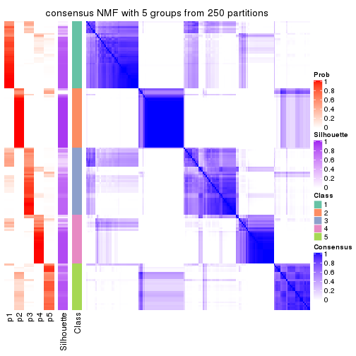</p>

</div>
<div id='tab-SD-NMF-consensus-heatmap-5'>
<pre><code class="r">consensus_heatmap(res, k = 6)
</code></pre>

<p></p>

</div>
</div>

Heatmaps for the membership of samples in all partitions to see how consistent they are:


<script>
$( function() {
	$( '#tabs-SD-NMF-membership-heatmap' ).tabs();
} );
</script>
<div id='tabs-SD-NMF-membership-heatmap'>
<ul>
<li><a href='#tab-SD-NMF-membership-heatmap-1'>k = 2</a></li>
<li><a href='#tab-SD-NMF-membership-heatmap-2'>k = 3</a></li>
<li><a href='#tab-SD-NMF-membership-heatmap-3'>k = 4</a></li>
<li><a href='#tab-SD-NMF-membership-heatmap-4'>k = 5</a></li>
<li><a href='#tab-SD-NMF-membership-heatmap-5'>k = 6</a></li>
</ul>
<div id='tab-SD-NMF-membership-heatmap-1'>
<pre><code class="r">membership_heatmap(res, k = 2)
</code></pre>

<p></p>

</div>
<div id='tab-SD-NMF-membership-heatmap-2'>
<pre><code class="r">membership_heatmap(res, k = 3)
</code></pre>

<p></p>

</div>
<div id='tab-SD-NMF-membership-heatmap-3'>
<pre><code class="r">membership_heatmap(res, k = 4)
</code></pre>

<p></p>

</div>
<div id='tab-SD-NMF-membership-heatmap-4'>
<pre><code class="r">membership_heatmap(res, k = 5)
</code></pre>

<p></p>

</div>
<div id='tab-SD-NMF-membership-heatmap-5'>
<pre><code class="r">membership_heatmap(res, k = 6)
</code></pre>

<p></p>

</div>
</div>

As soon as we have had the classes for columns, we can look for signatures
which are significantly different between classes which can be candidate marks
for certain classes. Following are the heatmaps for signatures.


Signature heatmaps where rows are scaled:


<script>
$( function() {
	$( '#tabs-SD-NMF-get-signatures' ).tabs();
} );
</script>
<div id='tabs-SD-NMF-get-signatures'>
<ul>
<li><a href='#tab-SD-NMF-get-signatures-1'>k = 2</a></li>
<li><a href='#tab-SD-NMF-get-signatures-2'>k = 3</a></li>
<li><a href='#tab-SD-NMF-get-signatures-3'>k = 4</a></li>
<li><a href='#tab-SD-NMF-get-signatures-4'>k = 5</a></li>
<li><a href='#tab-SD-NMF-get-signatures-5'>k = 6</a></li>
</ul>
<div id='tab-SD-NMF-get-signatures-1'>
<pre><code class="r">get_signatures(res, k = 2)
</code></pre>

<p></p>

</div>
<div id='tab-SD-NMF-get-signatures-2'>
<pre><code class="r">get_signatures(res, k = 3)
</code></pre>

<p></p>

</div>
<div id='tab-SD-NMF-get-signatures-3'>
<pre><code class="r">get_signatures(res, k = 4)
</code></pre>

<p>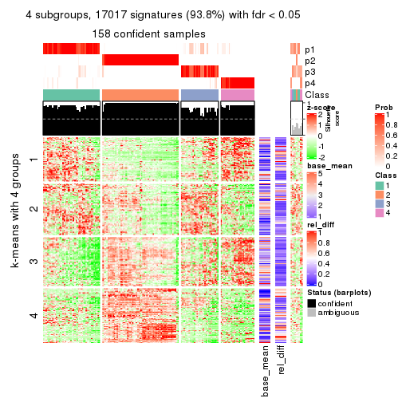</p>

</div>
<div id='tab-SD-NMF-get-signatures-4'>
<pre><code class="r">get_signatures(res, k = 5)
</code></pre>

<p></p>

</div>
<div id='tab-SD-NMF-get-signatures-5'>
<pre><code class="r">get_signatures(res, k = 6)
</code></pre>

<p></p>

</div>
</div>


Signature heatmaps where rows are not scaled:


<script>
$( function() {
	$( '#tabs-SD-NMF-get-signatures-no-scale' ).tabs();
} );
</script>
<div id='tabs-SD-NMF-get-signatures-no-scale'>
<ul>
<li><a href='#tab-SD-NMF-get-signatures-no-scale-1'>k = 2</a></li>
<li><a href='#tab-SD-NMF-get-signatures-no-scale-2'>k = 3</a></li>
<li><a href='#tab-SD-NMF-get-signatures-no-scale-3'>k = 4</a></li>
<li><a href='#tab-SD-NMF-get-signatures-no-scale-4'>k = 5</a></li>
<li><a href='#tab-SD-NMF-get-signatures-no-scale-5'>k = 6</a></li>
</ul>
<div id='tab-SD-NMF-get-signatures-no-scale-1'>
<pre><code class="r">get_signatures(res, k = 2, scale_rows = FALSE)
</code></pre>

<p></p>

</div>
<div id='tab-SD-NMF-get-signatures-no-scale-2'>
<pre><code class="r">get_signatures(res, k = 3, scale_rows = FALSE)
</code></pre>

<p></p>

</div>
<div id='tab-SD-NMF-get-signatures-no-scale-3'>
<pre><code class="r">get_signatures(res, k = 4, scale_rows = FALSE)
</code></pre>

<p></p>

</div>
<div id='tab-SD-NMF-get-signatures-no-scale-4'>
<pre><code class="r">get_signatures(res, k = 5, scale_rows = FALSE)
</code></pre>

<p></p>

</div>
<div id='tab-SD-NMF-get-signatures-no-scale-5'>
<pre><code class="r">get_signatures(res, k = 6, scale_rows = FALSE)
</code></pre>

<p></p>

</div>
</div>


Compare the overlap of signatures from different k:

```r
compare_signatures(res)
```


`get_signature()` returns a data frame invisibly. TO get the list of signatures, the function
call should be assigned to a variable explicitly. In following code, if `plot` argument is set
to `FALSE`, no heatmap is plotted while only the differential analysis is performed.

```r
# code only for demonstration
tb = get_signature(res, k = ..., plot = FALSE)
```

An example of the output of `tb` is:

```
#>   which_row         fdr    mean_1    mean_2 scaled_mean_1 scaled_mean_2 km
#> 1        38 0.042760348  8.373488  9.131774    -0.5533452     0.5164555  1
#> 2        40 0.018707592  7.106213  8.469186    -0.6173731     0.5762149  1
#> 3        55 0.019134737 10.221463 11.207825    -0.6159697     0.5749050  1
#> 4        59 0.006059896  5.921854  7.869574    -0.6899429     0.6439467  1
#> 5        60 0.018055526  8.928898 10.211722    -0.6204761     0.5791110  1
#> 6        98 0.009384629 15.714769 14.887706     0.6635654    -0.6193277  2
...
```

The columns in `tb` are:

1. `which_row`: row indices corresponding to the input matrix.
2. `fdr`: FDR for the differential test. 
3. `mean_x`: The mean value in group x.
4. `scaled_mean_x`: The mean value in group x after rows are scaled.
5. `km`: Row groups if k-means clustering is applied to rows.


UMAP plot which shows how samples are separated.


<script>
$( function() {
	$( '#tabs-SD-NMF-dimension-reduction' ).tabs();
} );
</script>
<div id='tabs-SD-NMF-dimension-reduction'>
<ul>
<li><a href='#tab-SD-NMF-dimension-reduction-1'>k = 2</a></li>
<li><a href='#tab-SD-NMF-dimension-reduction-2'>k = 3</a></li>
<li><a href='#tab-SD-NMF-dimension-reduction-3'>k = 4</a></li>
<li><a href='#tab-SD-NMF-dimension-reduction-4'>k = 5</a></li>
<li><a href='#tab-SD-NMF-dimension-reduction-5'>k = 6</a></li>
</ul>
<div id='tab-SD-NMF-dimension-reduction-1'>
<pre><code class="r">dimension_reduction(res, k = 2, method = &quot;UMAP&quot;)
</code></pre>

<p></p>

</div>
<div id='tab-SD-NMF-dimension-reduction-2'>
<pre><code class="r">dimension_reduction(res, k = 3, method = &quot;UMAP&quot;)
</code></pre>

<p></p>

</div>
<div id='tab-SD-NMF-dimension-reduction-3'>
<pre><code class="r">dimension_reduction(res, k = 4, method = &quot;UMAP&quot;)
</code></pre>

<p></p>

</div>
<div id='tab-SD-NMF-dimension-reduction-4'>
<pre><code class="r">dimension_reduction(res, k = 5, method = &quot;UMAP&quot;)
</code></pre>

<p></p>

</div>
<div id='tab-SD-NMF-dimension-reduction-5'>
<pre><code class="r">dimension_reduction(res, k = 6, method = &quot;UMAP&quot;)
</code></pre>

<p></p>

</div>
</div>


Following heatmap shows how subgroups are split when increasing `k`:

```r
collect_classes(res)
```

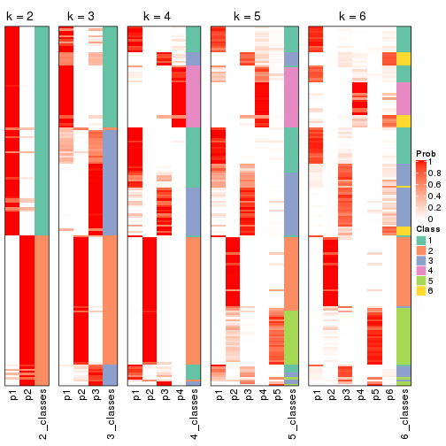


If matrix rows can be associated to genes, consider to use `functional_enrichment(res,
...)` to perform function enrichment for the signature genes. See [this vignette](http://bioconductor.org/packages/devel/bioc/vignettes/cola/inst/doc/functional_enrichment.html) for more detailed explanations.


 

---------------------------------------------------


### CV:hclust


The object with results only for a single top-value method and a single partition method 
can be extracted as:

```r
res = res_list["CV", "hclust"]
# you can also extract it by
# res = res_list["CV:hclust"]
```

A summary of `res` and all the functions that can be applied to it:

```r
res
```

```
#> A 'ConsensusPartition' object with k = 2, 3, 4, 5, 6.
#>   On a matrix with 18147 rows and 167 columns.
#>   Top rows (1000, 2000, 3000, 4000, 5000) are extracted by 'CV' method.
#>   Subgroups are detected by 'hclust' method.
#>   Performed in total 1250 partitions by row resampling.
#>   Best k for subgroups seems to be 2.
#> 
#> Following methods can be applied to this 'ConsensusPartition' object:
#>  [1] "cola_report"             "collect_classes"         "collect_plots"          
#>  [4] "collect_stats"           "colnames"                "compare_signatures"     
#>  [7] "consensus_heatmap"       "dimension_reduction"     "functional_enrichment"  
#> [10] "get_anno_col"            "get_anno"                "get_classes"            
#> [13] "get_consensus"           "get_matrix"              "get_membership"         
#> [16] "get_param"               "get_signatures"          "get_stats"              
#> [19] "is_best_k"               "is_stable_k"             "membership_heatmap"     
#> [22] "ncol"                    "nrow"                    "plot_ecdf"              
#> [25] "rownames"                "select_partition_number" "show"                   
#> [28] "suggest_best_k"          "test_to_known_factors"
```

`collect_plots()` function collects all the plots made from `res` for all `k` (number of partitions)
into one single page to provide an easy and fast comparison between different `k`.

```r
collect_plots(res)
```


The plots are:

- The first row: a plot of the ECDF (empirical cumulative distribution
  function) curves of the consensus matrix for each `k` and the heatmap of
  predicted classes for each `k`.
- The second row: heatmaps of the consensus matrix for each `k`.
- The third row: heatmaps of the membership matrix for each `k`.
- The fouth row: heatmaps of the signatures for each `k`.

All the plots in panels can be made by individual functions and they are
plotted later in this section.

`select_partition_number()` produces several plots showing different
statistics for choosing "optimized" `k`. There are following statistics:

- ECDF curves of the consensus matrix for each `k`;
- 1-PAC. [The PAC
  score](https://en.wikipedia.org/wiki/Consensus_clustering#Over-interpretation_potential_of_consensus_clustering)
  measures the proportion of the ambiguous subgrouping.
- Mean silhouette score.
- Concordance. The mean probability of fiting the consensus class ids in all
  partitions.
- Area increased. Denote $A_k$ as the area under the ECDF curve for current
  `k`, the area increased is defined as $A_k - A_{k-1}$.
- Rand index. The percent of pairs of samples that are both in a same cluster
  or both are not in a same cluster in the partition of k and k-1.
- Jaccard index. The ratio of pairs of samples are both in a same cluster in
  the partition of k and k-1 and the pairs of samples are both in a same
  cluster in the partition k or k-1.

The detailed explanations of these statistics can be found in [the _cola_
vignette](http://bioconductor.org/packages/devel/bioc/vignettes/cola/inst/doc/cola.html#toc_13).

Generally speaking, lower PAC score, higher mean silhouette score or higher
concordance corresponds to better partition. Rand index and Jaccard index
measure how similar the current partition is compared to partition with `k-1`.
If they are too similar, we won't accept `k` is better than `k-1`.

```r
select_partition_number(res)
```


The numeric values for all these statistics can be obtained by `get_stats()`.

```r
get_stats(res)
```

```
#>   k 1-PAC mean_silhouette concordance area_increased  Rand Jaccard
#> 2 2 0.414           0.846       0.907         0.4717 0.508   0.508
#> 3 3 0.565           0.719       0.832         0.3515 0.827   0.666
#> 4 4 0.575           0.550       0.716         0.1193 0.846   0.604
#> 5 5 0.686           0.735       0.801         0.0893 0.874   0.584
#> 6 6 0.698           0.700       0.799         0.0163 0.998   0.990
```

`suggest_best_k()` suggests the best $k$ based on these statistics. The rules are as follows:

- All $k$ with Jaccard index larger than 0.95 are removed because increasing
  $k$ does not provide enough extra information. If all $k$ are removed, it is
  marked as no subgroup is detected.
- For all $k$ with 1-PAC score larger than 0.9, the maximal $k$ is taken as
  the best $k$, and other $k$ are marked as optional $k$.
- If it does not fit the second rule. The $k$ with the maximal vote of the
  highest 1-PAC score, highest mean silhouette, and highest concordance is
  taken as the best $k$.

```r
suggest_best_k(res)
```

```
#> [1] 2
```


Following shows the table of the partitions (You need to click the **show/hide
code output** link to see it). The membership matrix (columns with name `p*`)
is inferred by
[`clue::cl_consensus()`](https://www.rdocumentation.org/link/cl_consensus?package=clue)
function with the `SE` method. Basically the value in the membership matrix
represents the probability to belong to a certain group. The finall class
label for an item is determined with the group with highest probability it
belongs to.

In `get_classes()` function, the entropy is calculated from the membership
matrix and the silhouette score is calculated from the consensus matrix.


<script>
$( function() {
	$( '#tabs-CV-hclust-get-classes' ).tabs();
} );
</script>
<div id='tabs-CV-hclust-get-classes'>
<ul>
<li><a href='#tab-CV-hclust-get-classes-1'>k = 2</a></li>
<li><a href='#tab-CV-hclust-get-classes-2'>k = 3</a></li>
<li><a href='#tab-CV-hclust-get-classes-3'>k = 4</a></li>
<li><a href='#tab-CV-hclust-get-classes-4'>k = 5</a></li>
<li><a href='#tab-CV-hclust-get-classes-5'>k = 6</a></li>
</ul>

<div id='tab-CV-hclust-get-classes-1'>
<p><a id='tab-CV-hclust-get-classes-1-a' style='color:#0366d6' href='#'>show/hide code output</a></p>
<pre><code class="r">cbind(get_classes(res, k = 2), get_membership(res, k = 2))
</code></pre>

<pre><code>#&gt;            class entropy silhouette    p1    p2
#&gt; SRR1313062     1  0.0000     0.8705 1.000 0.000
#&gt; SRR1313063     1  0.0672     0.8718 0.992 0.008
#&gt; SRR1313064     1  0.0000     0.8705 1.000 0.000
#&gt; SRR1313065     1  0.0000     0.8705 1.000 0.000
#&gt; SRR1313066     1  0.0000     0.8705 1.000 0.000
#&gt; SRR1313067     1  0.0000     0.8705 1.000 0.000
#&gt; SRR1313068     1  0.0672     0.8718 0.992 0.008
#&gt; SRR1313069     1  0.0000     0.8705 1.000 0.000
#&gt; SRR1313070     1  0.0000     0.8705 1.000 0.000
#&gt; SRR1313071     1  0.0000     0.8705 1.000 0.000
#&gt; SRR1313072     1  0.0000     0.8705 1.000 0.000
#&gt; SRR1313073     1  0.0000     0.8705 1.000 0.000
#&gt; SRR1313074     1  0.0000     0.8705 1.000 0.000
#&gt; SRR1313075     1  0.0000     0.8705 1.000 0.000
#&gt; SRR1313076     1  0.0000     0.8705 1.000 0.000
#&gt; SRR1313077     1  0.0000     0.8705 1.000 0.000
#&gt; SRR1313078     1  0.0000     0.8705 1.000 0.000
#&gt; SRR1313079     1  0.0000     0.8705 1.000 0.000
#&gt; SRR1313080     1  0.0672     0.8718 0.992 0.008
#&gt; SRR1313081     1  0.0000     0.8705 1.000 0.000
#&gt; SRR1313082     1  0.0000     0.8705 1.000 0.000
#&gt; SRR1313083     1  0.0376     0.8717 0.996 0.004
#&gt; SRR1313084     1  0.0000     0.8705 1.000 0.000
#&gt; SRR1313085     1  0.0000     0.8705 1.000 0.000
#&gt; SRR1313086     1  0.0000     0.8705 1.000 0.000
#&gt; SRR1313087     1  0.0000     0.8705 1.000 0.000
#&gt; SRR1313088     1  0.0000     0.8705 1.000 0.000
#&gt; SRR1313089     1  0.0000     0.8705 1.000 0.000
#&gt; SRR1313092     1  0.6148     0.8518 0.848 0.152
#&gt; SRR1313090     1  0.5737     0.8611 0.864 0.136
#&gt; SRR1313091     2  0.7139     0.7273 0.196 0.804
#&gt; SRR1313093     1  0.5629     0.8607 0.868 0.132
#&gt; SRR1313095     1  0.5178     0.8700 0.884 0.116
#&gt; SRR1313096     1  0.4298     0.8781 0.912 0.088
#&gt; SRR1313094     1  0.7139     0.8168 0.804 0.196
#&gt; SRR1313097     2  0.9460     0.3350 0.364 0.636
#&gt; SRR1313099     2  0.7219     0.7218 0.200 0.800
#&gt; SRR1313098     1  0.3733     0.8835 0.928 0.072
#&gt; SRR1313101     1  0.7219     0.8045 0.800 0.200
#&gt; SRR1313102     1  0.6048     0.8555 0.852 0.148
#&gt; SRR1313103     2  0.9427     0.3477 0.360 0.640
#&gt; SRR1313100     1  0.4562     0.8777 0.904 0.096
#&gt; SRR1313105     2  0.9993    -0.0787 0.484 0.516
#&gt; SRR1313104     1  0.5737     0.8611 0.864 0.136
#&gt; SRR1313107     2  0.9833     0.1108 0.424 0.576
#&gt; SRR1313106     1  0.8443     0.6987 0.728 0.272
#&gt; SRR1313109     2  0.7139     0.7273 0.196 0.804
#&gt; SRR1313108     1  0.4939     0.8717 0.892 0.108
#&gt; SRR1313111     1  0.9993     0.2098 0.516 0.484
#&gt; SRR1313110     1  0.3733     0.8835 0.928 0.072
#&gt; SRR1313112     1  0.6343     0.8455 0.840 0.160
#&gt; SRR1313113     1  0.7745     0.7768 0.772 0.228
#&gt; SRR1313115     1  0.5059     0.8698 0.888 0.112
#&gt; SRR1313114     1  0.4690     0.8791 0.900 0.100
#&gt; SRR1313117     1  0.6343     0.8446 0.840 0.160
#&gt; SRR1313118     1  0.2778     0.8809 0.952 0.048
#&gt; SRR1313116     2  0.1414     0.9188 0.020 0.980
#&gt; SRR1313120     2  0.7219     0.7218 0.200 0.800
#&gt; SRR1313119     1  0.5842     0.8588 0.860 0.140
#&gt; SRR1313122     1  0.4815     0.8732 0.896 0.104
#&gt; SRR1313124     1  0.5842     0.8588 0.860 0.140
#&gt; SRR1313121     1  0.5737     0.8611 0.864 0.136
#&gt; SRR1313125     1  0.6048     0.8555 0.852 0.148
#&gt; SRR1313127     1  0.4431     0.8774 0.908 0.092
#&gt; SRR1313123     1  0.6048     0.8555 0.852 0.148
#&gt; SRR1313128     1  0.7219     0.8291 0.800 0.200
#&gt; SRR1313126     1  0.4431     0.8774 0.908 0.092
#&gt; SRR1313130     2  0.7139     0.7273 0.196 0.804
#&gt; SRR1313132     2  0.7376     0.7118 0.208 0.792
#&gt; SRR1313129     2  0.9460     0.3350 0.364 0.636
#&gt; SRR1313133     1  0.7219     0.8315 0.800 0.200
#&gt; SRR1313131     1  0.4562     0.8762 0.904 0.096
#&gt; SRR1313134     1  0.4939     0.8832 0.892 0.108
#&gt; SRR1313135     1  0.7602     0.8098 0.780 0.220
#&gt; SRR1313136     1  0.6048     0.8643 0.852 0.148
#&gt; SRR1313137     1  0.6048     0.8643 0.852 0.148
#&gt; SRR1313138     1  0.7950     0.7890 0.760 0.240
#&gt; SRR1313140     1  0.5629     0.8715 0.868 0.132
#&gt; SRR1313141     1  0.4939     0.8770 0.892 0.108
#&gt; SRR1313139     1  0.5737     0.8700 0.864 0.136
#&gt; SRR1313143     1  0.4939     0.8770 0.892 0.108
#&gt; SRR1313142     1  0.7376     0.8224 0.792 0.208
#&gt; SRR1313144     1  0.7950     0.7890 0.760 0.240
#&gt; SRR1313145     1  0.7528     0.8139 0.784 0.216
#&gt; SRR1313146     1  0.7139     0.8327 0.804 0.196
#&gt; SRR1313147     1  0.6887     0.8431 0.816 0.184
#&gt; SRR1313150     1  0.6887     0.8456 0.816 0.184
#&gt; SRR1313149     1  0.6887     0.8427 0.816 0.184
#&gt; SRR1313152     1  0.7602     0.8098 0.780 0.220
#&gt; SRR1313151     1  0.7139     0.8327 0.804 0.196
#&gt; SRR1313154     1  0.7602     0.8098 0.780 0.220
#&gt; SRR1313153     1  0.7950     0.7890 0.760 0.240
#&gt; SRR1313156     1  0.8016     0.7860 0.756 0.244
#&gt; SRR1313155     1  0.6048     0.8643 0.852 0.148
#&gt; SRR1313157     1  0.6048     0.8643 0.852 0.148
#&gt; SRR1313158     1  0.7528     0.8139 0.784 0.216
#&gt; SRR1313161     1  0.6048     0.8643 0.852 0.148
#&gt; SRR1313159     2  0.7376     0.7118 0.208 0.792
#&gt; SRR1313160     1  0.6048     0.8643 0.852 0.148
#&gt; SRR1313162     1  0.5294     0.8824 0.880 0.120
#&gt; SRR1313163     1  0.7883     0.7944 0.764 0.236
#&gt; SRR1313165     1  0.6973     0.8400 0.812 0.188
#&gt; SRR1313166     1  0.7528     0.8139 0.784 0.216
#&gt; SRR1313164     1  0.8267     0.7702 0.740 0.260
#&gt; SRR1313167     1  0.5737     0.8693 0.864 0.136
#&gt; SRR1313168     1  0.6887     0.8430 0.816 0.184
#&gt; SRR1313170     2  0.7139     0.7281 0.196 0.804
#&gt; SRR1313169     1  0.6048     0.8643 0.852 0.148
#&gt; SRR1313172     2  0.7299     0.7155 0.204 0.796
#&gt; SRR1313171     1  0.8267     0.7702 0.740 0.260
#&gt; SRR1313174     2  0.0000     0.9256 0.000 1.000
#&gt; SRR1313173     1  0.4161     0.8789 0.916 0.084
#&gt; SRR1313176     2  0.0000     0.9256 0.000 1.000
#&gt; SRR1313175     2  0.0672     0.9244 0.008 0.992
#&gt; SRR1313178     2  0.0000     0.9256 0.000 1.000
#&gt; SRR1313177     2  0.0000     0.9256 0.000 1.000
#&gt; SRR1313179     2  0.4022     0.8664 0.080 0.920
#&gt; SRR1313180     2  0.1414     0.9188 0.020 0.980
#&gt; SRR1313181     2  0.0000     0.9256 0.000 1.000
#&gt; SRR1313183     2  0.0000     0.9256 0.000 1.000
#&gt; SRR1313182     2  0.0000     0.9256 0.000 1.000
#&gt; SRR1313184     2  0.4022     0.8664 0.080 0.920
#&gt; SRR1313185     2  0.0000     0.9256 0.000 1.000
#&gt; SRR1313188     2  0.1414     0.9188 0.020 0.980
#&gt; SRR1313187     2  0.1414     0.9188 0.020 0.980
#&gt; SRR1313186     2  0.0376     0.9252 0.004 0.996
#&gt; SRR1313189     2  0.0000     0.9256 0.000 1.000
#&gt; SRR1313190     2  0.0000     0.9256 0.000 1.000
#&gt; SRR1313191     2  0.0000     0.9256 0.000 1.000
#&gt; SRR1313192     2  0.0000     0.9256 0.000 1.000
#&gt; SRR1313193     2  0.0000     0.9256 0.000 1.000
#&gt; SRR1313194     2  0.1184     0.9210 0.016 0.984
#&gt; SRR1313195     2  0.1184     0.9210 0.016 0.984
#&gt; SRR1313196     2  0.1414     0.9188 0.020 0.980
#&gt; SRR1313197     2  0.0000     0.9256 0.000 1.000
#&gt; SRR1313198     2  0.0376     0.9252 0.004 0.996
#&gt; SRR1313199     2  0.0000     0.9256 0.000 1.000
#&gt; SRR1313200     2  0.0938     0.9229 0.012 0.988
#&gt; SRR1313201     2  0.0000     0.9256 0.000 1.000
#&gt; SRR1313202     2  0.1184     0.9210 0.016 0.984
#&gt; SRR1313203     2  0.0938     0.9211 0.012 0.988
#&gt; SRR1313204     2  0.0000     0.9256 0.000 1.000
#&gt; SRR1313205     2  0.0000     0.9256 0.000 1.000
#&gt; SRR1313207     2  0.0000     0.9256 0.000 1.000
#&gt; SRR1313208     2  0.0000     0.9256 0.000 1.000
#&gt; SRR1313206     2  0.0000     0.9256 0.000 1.000
#&gt; SRR1313210     2  0.0672     0.9244 0.008 0.992
#&gt; SRR1313209     2  0.0000     0.9256 0.000 1.000
#&gt; SRR1313211     2  0.0000     0.9256 0.000 1.000
#&gt; SRR1313212     2  0.0000     0.9256 0.000 1.000
#&gt; SRR1313214     2  0.0376     0.9252 0.004 0.996
#&gt; SRR1313215     2  0.0938     0.9229 0.012 0.988
#&gt; SRR1313213     2  0.0000     0.9256 0.000 1.000
#&gt; SRR1313216     2  0.0672     0.9244 0.008 0.992
#&gt; SRR1313217     2  0.0672     0.9244 0.008 0.992
#&gt; SRR1313219     2  0.0672     0.9244 0.008 0.992
#&gt; SRR1313220     2  0.0000     0.9256 0.000 1.000
#&gt; SRR1313218     2  0.0000     0.9256 0.000 1.000
#&gt; SRR1313222     2  0.0000     0.9256 0.000 1.000
#&gt; SRR1313221     2  0.0000     0.9256 0.000 1.000
#&gt; SRR1313223     2  0.0000     0.9256 0.000 1.000
#&gt; SRR1313224     2  0.0000     0.9256 0.000 1.000
#&gt; SRR1313225     2  0.0672     0.9244 0.008 0.992
#&gt; SRR1313226     2  0.1414     0.9188 0.020 0.980
#&gt; SRR1313227     2  0.0000     0.9256 0.000 1.000
#&gt; SRR1313228     2  0.0000     0.9256 0.000 1.000
#&gt; SRR1313229     2  0.0000     0.9256 0.000 1.000
</code></pre>

<script>
$('#tab-CV-hclust-get-classes-1-a').parent().next().next().hide();
$('#tab-CV-hclust-get-classes-1-a').click(function(){
  $('#tab-CV-hclust-get-classes-1-a').parent().next().next().toggle();
  return(false);
});
</script>
</div>

<div id='tab-CV-hclust-get-classes-2'>
<p><a id='tab-CV-hclust-get-classes-2-a' style='color:#0366d6' href='#'>show/hide code output</a></p>
<pre><code class="r">cbind(get_classes(res, k = 3), get_membership(res, k = 3))
</code></pre>

<pre><code>#&gt;            class entropy silhouette    p1    p2    p3
#&gt; SRR1313062     3  0.3340     0.6908 0.120 0.000 0.880
#&gt; SRR1313063     3  0.2537     0.7064 0.080 0.000 0.920
#&gt; SRR1313064     3  0.5882     0.4506 0.348 0.000 0.652
#&gt; SRR1313065     3  0.6079     0.3656 0.388 0.000 0.612
#&gt; SRR1313066     3  0.5905     0.4500 0.352 0.000 0.648
#&gt; SRR1313067     3  0.3340     0.6908 0.120 0.000 0.880
#&gt; SRR1313068     3  0.2356     0.7082 0.072 0.000 0.928
#&gt; SRR1313069     3  0.6079     0.3657 0.388 0.000 0.612
#&gt; SRR1313070     3  0.5882     0.4506 0.348 0.000 0.652
#&gt; SRR1313071     3  0.5882     0.4506 0.348 0.000 0.652
#&gt; SRR1313072     3  0.5882     0.4506 0.348 0.000 0.652
#&gt; SRR1313073     3  0.5529     0.5233 0.296 0.000 0.704
#&gt; SRR1313074     3  0.5882     0.4506 0.348 0.000 0.652
#&gt; SRR1313075     3  0.5882     0.4506 0.348 0.000 0.652
#&gt; SRR1313076     3  0.3192     0.6980 0.112 0.000 0.888
#&gt; SRR1313077     3  0.3340     0.6908 0.120 0.000 0.880
#&gt; SRR1313078     3  0.3340     0.6908 0.120 0.000 0.880
#&gt; SRR1313079     3  0.5905     0.4500 0.352 0.000 0.648
#&gt; SRR1313080     3  0.2356     0.7082 0.072 0.000 0.928
#&gt; SRR1313081     3  0.3267     0.6927 0.116 0.000 0.884
#&gt; SRR1313082     3  0.5968     0.4154 0.364 0.000 0.636
#&gt; SRR1313083     3  0.6154     0.3268 0.408 0.000 0.592
#&gt; SRR1313084     3  0.5882     0.4506 0.348 0.000 0.652
#&gt; SRR1313085     3  0.5882     0.4506 0.348 0.000 0.652
#&gt; SRR1313086     3  0.6168     0.2984 0.412 0.000 0.588
#&gt; SRR1313087     3  0.5882     0.4506 0.348 0.000 0.652
#&gt; SRR1313088     3  0.6079     0.3657 0.388 0.000 0.612
#&gt; SRR1313089     3  0.5905     0.4500 0.352 0.000 0.648
#&gt; SRR1313092     3  0.3369     0.7030 0.052 0.040 0.908
#&gt; SRR1313090     3  0.2903     0.7116 0.048 0.028 0.924
#&gt; SRR1313091     2  0.8266     0.6590 0.136 0.624 0.240
#&gt; SRR1313093     3  0.2806     0.7117 0.040 0.032 0.928
#&gt; SRR1313095     3  0.2492     0.7158 0.048 0.016 0.936
#&gt; SRR1313096     3  0.3091     0.7214 0.072 0.016 0.912
#&gt; SRR1313094     3  0.4458     0.6659 0.056 0.080 0.864
#&gt; SRR1313097     2  0.9140     0.3161 0.144 0.452 0.404
#&gt; SRR1313099     2  0.8374     0.6481 0.144 0.616 0.240
#&gt; SRR1313098     3  0.5366     0.6525 0.208 0.016 0.776
#&gt; SRR1313101     3  0.4527     0.6654 0.052 0.088 0.860
#&gt; SRR1313102     3  0.3263     0.7065 0.048 0.040 0.912
#&gt; SRR1313103     2  0.9136     0.3270 0.144 0.456 0.400
#&gt; SRR1313100     3  0.3445     0.7214 0.088 0.016 0.896
#&gt; SRR1313105     3  0.8439     0.0700 0.096 0.368 0.536
#&gt; SRR1313104     3  0.2903     0.7116 0.048 0.028 0.924
#&gt; SRR1313107     3  0.9118    -0.1426 0.144 0.388 0.468
#&gt; SRR1313106     3  0.5777     0.5834 0.052 0.160 0.788
#&gt; SRR1313109     2  0.8266     0.6590 0.136 0.624 0.240
#&gt; SRR1313108     3  0.2492     0.7173 0.048 0.016 0.936
#&gt; SRR1313111     3  0.8395     0.1822 0.104 0.328 0.568
#&gt; SRR1313110     3  0.5366     0.6525 0.208 0.016 0.776
#&gt; SRR1313112     3  0.3589     0.6990 0.052 0.048 0.900
#&gt; SRR1313113     3  0.5166     0.6313 0.056 0.116 0.828
#&gt; SRR1313115     3  0.2383     0.7159 0.044 0.016 0.940
#&gt; SRR1313114     3  0.3415     0.7203 0.080 0.020 0.900
#&gt; SRR1313117     3  0.3589     0.6981 0.052 0.048 0.900
#&gt; SRR1313118     3  0.4261     0.7070 0.140 0.012 0.848
#&gt; SRR1313116     2  0.4136     0.8679 0.116 0.864 0.020
#&gt; SRR1313120     2  0.8374     0.6481 0.144 0.616 0.240
#&gt; SRR1313119     3  0.3028     0.7102 0.048 0.032 0.920
#&gt; SRR1313122     3  0.2703     0.7191 0.056 0.016 0.928
#&gt; SRR1313124     3  0.3028     0.7102 0.048 0.032 0.920
#&gt; SRR1313121     3  0.2903     0.7116 0.048 0.028 0.924
#&gt; SRR1313125     3  0.3263     0.7065 0.048 0.040 0.912
#&gt; SRR1313127     3  0.3528     0.7206 0.092 0.016 0.892
#&gt; SRR1313123     3  0.3263     0.7065 0.048 0.040 0.912
#&gt; SRR1313128     1  0.3412     0.8545 0.876 0.000 0.124
#&gt; SRR1313126     3  0.3528     0.7206 0.092 0.016 0.892
#&gt; SRR1313130     2  0.8266     0.6590 0.136 0.624 0.240
#&gt; SRR1313132     2  0.8384     0.4790 0.392 0.520 0.088
#&gt; SRR1313129     2  0.9140     0.3161 0.144 0.452 0.404
#&gt; SRR1313133     1  0.3038     0.8559 0.896 0.000 0.104
#&gt; SRR1313131     3  0.3445     0.7212 0.088 0.016 0.896
#&gt; SRR1313134     3  0.6823     0.0913 0.484 0.012 0.504
#&gt; SRR1313135     1  0.2711     0.8604 0.912 0.000 0.088
#&gt; SRR1313136     1  0.4178     0.8320 0.828 0.000 0.172
#&gt; SRR1313137     1  0.4121     0.8337 0.832 0.000 0.168
#&gt; SRR1313138     1  0.1129     0.8206 0.976 0.004 0.020
#&gt; SRR1313140     1  0.4931     0.7708 0.768 0.000 0.232
#&gt; SRR1313141     1  0.5882     0.5394 0.652 0.000 0.348
#&gt; SRR1313139     1  0.4750     0.7937 0.784 0.000 0.216
#&gt; SRR1313143     1  0.5882     0.5394 0.652 0.000 0.348
#&gt; SRR1313142     1  0.3038     0.8571 0.896 0.000 0.104
#&gt; SRR1313144     1  0.1129     0.8206 0.976 0.004 0.020
#&gt; SRR1313145     1  0.2537     0.8594 0.920 0.000 0.080
#&gt; SRR1313146     1  0.3551     0.8563 0.868 0.000 0.132
#&gt; SRR1313147     1  0.3482     0.8583 0.872 0.000 0.128
#&gt; SRR1313150     1  0.2356     0.8495 0.928 0.000 0.072
#&gt; SRR1313149     1  0.4974     0.7559 0.764 0.000 0.236
#&gt; SRR1313152     1  0.2448     0.8583 0.924 0.000 0.076
#&gt; SRR1313151     1  0.3551     0.8563 0.868 0.000 0.132
#&gt; SRR1313154     1  0.1643     0.8398 0.956 0.000 0.044
#&gt; SRR1313153     1  0.1129     0.8206 0.976 0.004 0.020
#&gt; SRR1313156     1  0.1267     0.8186 0.972 0.004 0.024
#&gt; SRR1313155     1  0.4750     0.7917 0.784 0.000 0.216
#&gt; SRR1313157     1  0.4750     0.7917 0.784 0.000 0.216
#&gt; SRR1313158     1  0.2537     0.8594 0.920 0.000 0.080
#&gt; SRR1313161     1  0.4931     0.7707 0.768 0.000 0.232
#&gt; SRR1313159     2  0.8384     0.4790 0.392 0.520 0.088
#&gt; SRR1313160     1  0.4842     0.7818 0.776 0.000 0.224
#&gt; SRR1313162     3  0.6498     0.3136 0.396 0.008 0.596
#&gt; SRR1313163     1  0.1399     0.8272 0.968 0.004 0.028
#&gt; SRR1313165     1  0.3267     0.8603 0.884 0.000 0.116
#&gt; SRR1313166     1  0.2711     0.8609 0.912 0.000 0.088
#&gt; SRR1313164     1  0.2773     0.8046 0.928 0.024 0.048
#&gt; SRR1313167     1  0.5363     0.6981 0.724 0.000 0.276
#&gt; SRR1313168     1  0.3412     0.8582 0.876 0.000 0.124
#&gt; SRR1313170     2  0.8346     0.5374 0.360 0.548 0.092
#&gt; SRR1313169     1  0.5058     0.7546 0.756 0.000 0.244
#&gt; SRR1313172     2  0.8355     0.6446 0.140 0.616 0.244
#&gt; SRR1313171     1  0.2773     0.8046 0.928 0.024 0.048
#&gt; SRR1313174     2  0.2680     0.8856 0.068 0.924 0.008
#&gt; SRR1313173     3  0.3183     0.7216 0.076 0.016 0.908
#&gt; SRR1313176     2  0.0237     0.8772 0.004 0.996 0.000
#&gt; SRR1313175     2  0.3183     0.8837 0.076 0.908 0.016
#&gt; SRR1313178     2  0.0237     0.8772 0.004 0.996 0.000
#&gt; SRR1313177     2  0.0237     0.8772 0.004 0.996 0.000
#&gt; SRR1313179     2  0.7545     0.6941 0.272 0.652 0.076
#&gt; SRR1313180     2  0.4136     0.8679 0.116 0.864 0.020
#&gt; SRR1313181     2  0.0237     0.8772 0.004 0.996 0.000
#&gt; SRR1313183     2  0.0237     0.8772 0.004 0.996 0.000
#&gt; SRR1313182     2  0.2680     0.8856 0.068 0.924 0.008
#&gt; SRR1313184     2  0.7545     0.6941 0.272 0.652 0.076
#&gt; SRR1313185     2  0.2774     0.8851 0.072 0.920 0.008
#&gt; SRR1313188     2  0.4136     0.8679 0.116 0.864 0.020
#&gt; SRR1313187     2  0.4136     0.8679 0.116 0.864 0.020
#&gt; SRR1313186     2  0.2939     0.8851 0.072 0.916 0.012
#&gt; SRR1313189     2  0.0237     0.8772 0.004 0.996 0.000
#&gt; SRR1313190     2  0.0237     0.8772 0.004 0.996 0.000
#&gt; SRR1313191     2  0.2680     0.8856 0.068 0.924 0.008
#&gt; SRR1313192     2  0.0237     0.8772 0.004 0.996 0.000
#&gt; SRR1313193     2  0.0424     0.8778 0.008 0.992 0.000
#&gt; SRR1313194     2  0.3995     0.8690 0.116 0.868 0.016
#&gt; SRR1313195     2  0.3995     0.8690 0.116 0.868 0.016
#&gt; SRR1313196     2  0.4136     0.8679 0.116 0.864 0.020
#&gt; SRR1313197     2  0.2680     0.8856 0.068 0.924 0.008
#&gt; SRR1313198     2  0.3031     0.8843 0.076 0.912 0.012
#&gt; SRR1313199     2  0.0237     0.8772 0.004 0.996 0.000
#&gt; SRR1313200     2  0.3921     0.8709 0.112 0.872 0.016
#&gt; SRR1313201     2  0.0237     0.8772 0.004 0.996 0.000
#&gt; SRR1313202     2  0.3769     0.8746 0.104 0.880 0.016
#&gt; SRR1313203     2  0.2550     0.8564 0.012 0.932 0.056
#&gt; SRR1313204     2  0.0237     0.8772 0.004 0.996 0.000
#&gt; SRR1313205     2  0.1860     0.8843 0.052 0.948 0.000
#&gt; SRR1313207     2  0.0237     0.8772 0.004 0.996 0.000
#&gt; SRR1313208     2  0.1860     0.8843 0.052 0.948 0.000
#&gt; SRR1313206     2  0.0237     0.8772 0.004 0.996 0.000
#&gt; SRR1313210     2  0.3091     0.8848 0.072 0.912 0.016
#&gt; SRR1313209     2  0.2680     0.8856 0.068 0.924 0.008
#&gt; SRR1313211     2  0.2400     0.8856 0.064 0.932 0.004
#&gt; SRR1313212     2  0.0237     0.8772 0.004 0.996 0.000
#&gt; SRR1313214     2  0.3031     0.8843 0.076 0.912 0.012
#&gt; SRR1313215     2  0.3769     0.8745 0.104 0.880 0.016
#&gt; SRR1313213     2  0.0237     0.8772 0.004 0.996 0.000
#&gt; SRR1313216     2  0.3091     0.8845 0.072 0.912 0.016
#&gt; SRR1313217     2  0.3183     0.8837 0.076 0.908 0.016
#&gt; SRR1313219     2  0.3183     0.8837 0.076 0.908 0.016
#&gt; SRR1313220     2  0.0237     0.8772 0.004 0.996 0.000
#&gt; SRR1313218     2  0.2486     0.8860 0.060 0.932 0.008
#&gt; SRR1313222     2  0.0237     0.8772 0.004 0.996 0.000
#&gt; SRR1313221     2  0.0237     0.8772 0.004 0.996 0.000
#&gt; SRR1313223     2  0.0237     0.8772 0.004 0.996 0.000
#&gt; SRR1313224     2  0.2486     0.8860 0.060 0.932 0.008
#&gt; SRR1313225     2  0.2902     0.8859 0.064 0.920 0.016
#&gt; SRR1313226     2  0.4136     0.8679 0.116 0.864 0.020
#&gt; SRR1313227     2  0.0237     0.8772 0.004 0.996 0.000
#&gt; SRR1313228     2  0.0237     0.8772 0.004 0.996 0.000
#&gt; SRR1313229     2  0.0237     0.8772 0.004 0.996 0.000
</code></pre>

<script>
$('#tab-CV-hclust-get-classes-2-a').parent().next().next().hide();
$('#tab-CV-hclust-get-classes-2-a').click(function(){
  $('#tab-CV-hclust-get-classes-2-a').parent().next().next().toggle();
  return(false);
});
</script>
</div>

<div id='tab-CV-hclust-get-classes-3'>
<p><a id='tab-CV-hclust-get-classes-3-a' style='color:#0366d6' href='#'>show/hide code output</a></p>
<pre><code class="r">cbind(get_classes(res, k = 4), get_membership(res, k = 4))
</code></pre>

<pre><code>#&gt;            class entropy silhouette    p1    p2    p3    p4
#&gt; SRR1313062     3  0.4088   0.621716 0.004 0.000 0.764 0.232
#&gt; SRR1313063     3  0.3710   0.670878 0.004 0.000 0.804 0.192
#&gt; SRR1313064     4  0.3942   0.607725 0.000 0.000 0.236 0.764
#&gt; SRR1313065     4  0.5397   0.604546 0.064 0.000 0.220 0.716
#&gt; SRR1313066     4  0.4122   0.604446 0.004 0.000 0.236 0.760
#&gt; SRR1313067     3  0.4088   0.621716 0.004 0.000 0.764 0.232
#&gt; SRR1313068     3  0.3626   0.679261 0.004 0.000 0.812 0.184
#&gt; SRR1313069     4  0.5466   0.603193 0.068 0.000 0.220 0.712
#&gt; SRR1313070     4  0.4122   0.609637 0.004 0.000 0.236 0.760
#&gt; SRR1313071     4  0.4122   0.609637 0.004 0.000 0.236 0.760
#&gt; SRR1313072     4  0.3942   0.607725 0.000 0.000 0.236 0.764
#&gt; SRR1313073     4  0.4746   0.391814 0.000 0.000 0.368 0.632
#&gt; SRR1313074     4  0.3942   0.607725 0.000 0.000 0.236 0.764
#&gt; SRR1313075     4  0.3942   0.607725 0.000 0.000 0.236 0.764
#&gt; SRR1313076     3  0.3402   0.691002 0.004 0.000 0.832 0.164
#&gt; SRR1313077     3  0.4088   0.621716 0.004 0.000 0.764 0.232
#&gt; SRR1313078     3  0.4088   0.621716 0.004 0.000 0.764 0.232
#&gt; SRR1313079     4  0.4155   0.600308 0.004 0.000 0.240 0.756
#&gt; SRR1313080     3  0.3626   0.679261 0.004 0.000 0.812 0.184
#&gt; SRR1313081     3  0.4053   0.626398 0.004 0.000 0.768 0.228
#&gt; SRR1313082     4  0.4922   0.615286 0.036 0.000 0.228 0.736
#&gt; SRR1313083     4  0.5184   0.596882 0.060 0.000 0.204 0.736
#&gt; SRR1313084     4  0.3942   0.607725 0.000 0.000 0.236 0.764
#&gt; SRR1313085     4  0.4122   0.609637 0.004 0.000 0.236 0.760
#&gt; SRR1313086     4  0.5620   0.587062 0.084 0.000 0.208 0.708
#&gt; SRR1313087     4  0.4040   0.596195 0.000 0.000 0.248 0.752
#&gt; SRR1313088     4  0.5466   0.603193 0.068 0.000 0.220 0.712
#&gt; SRR1313089     4  0.4122   0.604446 0.004 0.000 0.236 0.760
#&gt; SRR1313092     3  0.1118   0.783234 0.036 0.000 0.964 0.000
#&gt; SRR1313090     3  0.0804   0.787858 0.012 0.008 0.980 0.000
#&gt; SRR1313091     2  0.7831   0.467084 0.312 0.408 0.280 0.000
#&gt; SRR1313093     3  0.0895   0.787077 0.020 0.000 0.976 0.004
#&gt; SRR1313095     3  0.0937   0.786315 0.012 0.000 0.976 0.012
#&gt; SRR1313096     3  0.1209   0.779575 0.004 0.000 0.964 0.032
#&gt; SRR1313094     3  0.2300   0.760649 0.064 0.016 0.920 0.000
#&gt; SRR1313097     3  0.7707  -0.016672 0.276 0.272 0.452 0.000
#&gt; SRR1313099     2  0.7844   0.455500 0.308 0.404 0.288 0.000
#&gt; SRR1313098     3  0.4483   0.671495 0.104 0.000 0.808 0.088
#&gt; SRR1313101     3  0.2494   0.759163 0.048 0.036 0.916 0.000
#&gt; SRR1313102     3  0.1174   0.786802 0.020 0.012 0.968 0.000
#&gt; SRR1313103     3  0.7721  -0.031963 0.276 0.276 0.448 0.000
#&gt; SRR1313100     3  0.1576   0.774109 0.004 0.000 0.948 0.048
#&gt; SRR1313105     3  0.6975   0.348604 0.216 0.200 0.584 0.000
#&gt; SRR1313104     3  0.0804   0.787858 0.012 0.008 0.980 0.000
#&gt; SRR1313107     3  0.7533   0.211368 0.272 0.208 0.516 0.004
#&gt; SRR1313106     3  0.3903   0.698946 0.076 0.080 0.844 0.000
#&gt; SRR1313109     2  0.7831   0.467084 0.312 0.408 0.280 0.000
#&gt; SRR1313108     3  0.0524   0.785050 0.004 0.000 0.988 0.008
#&gt; SRR1313111     3  0.6675   0.426150 0.228 0.156 0.616 0.000
#&gt; SRR1313110     3  0.4483   0.671495 0.104 0.000 0.808 0.088
#&gt; SRR1313112     3  0.1488   0.781900 0.032 0.012 0.956 0.000
#&gt; SRR1313113     3  0.3156   0.736207 0.068 0.048 0.884 0.000
#&gt; SRR1313115     3  0.0188   0.785161 0.000 0.000 0.996 0.004
#&gt; SRR1313114     3  0.1543   0.782608 0.008 0.004 0.956 0.032
#&gt; SRR1313117     3  0.1452   0.780566 0.036 0.008 0.956 0.000
#&gt; SRR1313118     3  0.3489   0.728721 0.012 0.008 0.856 0.124
#&gt; SRR1313116     2  0.5766   0.716338 0.404 0.564 0.032 0.000
#&gt; SRR1313120     2  0.7844   0.455500 0.308 0.404 0.288 0.000
#&gt; SRR1313119     3  0.0927   0.787516 0.016 0.008 0.976 0.000
#&gt; SRR1313122     3  0.0779   0.783602 0.004 0.000 0.980 0.016
#&gt; SRR1313124     3  0.0927   0.787516 0.016 0.008 0.976 0.000
#&gt; SRR1313121     3  0.0804   0.787858 0.012 0.008 0.980 0.000
#&gt; SRR1313125     3  0.1174   0.786802 0.020 0.012 0.968 0.000
#&gt; SRR1313127     3  0.1474   0.769782 0.000 0.000 0.948 0.052
#&gt; SRR1313123     3  0.1174   0.786802 0.020 0.012 0.968 0.000
#&gt; SRR1313128     1  0.6867   0.470345 0.508 0.000 0.108 0.384
#&gt; SRR1313126     3  0.1557   0.768076 0.000 0.000 0.944 0.056
#&gt; SRR1313130     2  0.7831   0.467084 0.312 0.408 0.280 0.000
#&gt; SRR1313132     1  0.7745  -0.239736 0.540 0.316 0.084 0.060
#&gt; SRR1313129     3  0.7707  -0.016672 0.276 0.272 0.452 0.000
#&gt; SRR1313133     1  0.6626   0.523165 0.544 0.000 0.092 0.364
#&gt; SRR1313131     3  0.1389   0.772425 0.000 0.000 0.952 0.048
#&gt; SRR1313134     3  0.7468  -0.191268 0.228 0.000 0.504 0.268
#&gt; SRR1313135     1  0.5764   0.513310 0.520 0.000 0.028 0.452
#&gt; SRR1313136     4  0.6438  -0.350404 0.436 0.000 0.068 0.496
#&gt; SRR1313137     4  0.6442  -0.355868 0.440 0.000 0.068 0.492
#&gt; SRR1313138     1  0.5007   0.558243 0.636 0.000 0.008 0.356
#&gt; SRR1313140     4  0.6980  -0.176957 0.400 0.000 0.116 0.484
#&gt; SRR1313141     4  0.7620   0.119605 0.316 0.000 0.224 0.460
#&gt; SRR1313139     4  0.6659  -0.235259 0.400 0.000 0.088 0.512
#&gt; SRR1313143     4  0.7620   0.119605 0.316 0.000 0.224 0.460
#&gt; SRR1313142     1  0.6658   0.500726 0.532 0.000 0.092 0.376
#&gt; SRR1313144     1  0.4872   0.555664 0.640 0.000 0.004 0.356
#&gt; SRR1313145     1  0.6000   0.522084 0.508 0.000 0.040 0.452
#&gt; SRR1313146     1  0.6745   0.458427 0.480 0.000 0.092 0.428
#&gt; SRR1313147     4  0.6081  -0.466936 0.472 0.000 0.044 0.484
#&gt; SRR1313150     1  0.5856   0.522122 0.556 0.000 0.036 0.408
#&gt; SRR1313149     1  0.7545   0.124332 0.416 0.000 0.188 0.396
#&gt; SRR1313152     1  0.5755   0.526732 0.528 0.000 0.028 0.444
#&gt; SRR1313151     1  0.6745   0.458427 0.480 0.000 0.092 0.428
#&gt; SRR1313154     1  0.5872   0.560902 0.576 0.000 0.040 0.384
#&gt; SRR1313153     1  0.4872   0.555664 0.640 0.000 0.004 0.356
#&gt; SRR1313156     1  0.5110   0.557853 0.636 0.000 0.012 0.352
#&gt; SRR1313155     4  0.6709  -0.197870 0.400 0.000 0.092 0.508
#&gt; SRR1313157     4  0.6709  -0.197870 0.400 0.000 0.092 0.508
#&gt; SRR1313158     1  0.6000   0.522084 0.508 0.000 0.040 0.452
#&gt; SRR1313161     4  0.6718  -0.134668 0.380 0.000 0.096 0.524
#&gt; SRR1313159     1  0.7745  -0.239736 0.540 0.316 0.084 0.060
#&gt; SRR1313160     4  0.6751  -0.170303 0.396 0.000 0.096 0.508
#&gt; SRR1313162     3  0.6805   0.259143 0.260 0.000 0.592 0.148
#&gt; SRR1313163     1  0.5085   0.555215 0.616 0.000 0.008 0.376
#&gt; SRR1313165     1  0.6011   0.451410 0.484 0.000 0.040 0.476
#&gt; SRR1313166     1  0.6005   0.513064 0.500 0.000 0.040 0.460
#&gt; SRR1313164     1  0.6314   0.554860 0.596 0.008 0.056 0.340
#&gt; SRR1313167     4  0.6894  -0.000839 0.344 0.000 0.120 0.536
#&gt; SRR1313168     4  0.6011  -0.471680 0.476 0.000 0.040 0.484
#&gt; SRR1313170     1  0.7890  -0.315636 0.508 0.344 0.088 0.060
#&gt; SRR1313169     4  0.6757  -0.123244 0.376 0.000 0.100 0.524
#&gt; SRR1313172     2  0.7989   0.453243 0.300 0.408 0.288 0.004
#&gt; SRR1313171     1  0.6314   0.554860 0.596 0.008 0.056 0.340
#&gt; SRR1313174     2  0.4795   0.776734 0.292 0.696 0.012 0.000
#&gt; SRR1313173     3  0.1305   0.778164 0.004 0.000 0.960 0.036
#&gt; SRR1313176     2  0.0376   0.763258 0.004 0.992 0.000 0.004
#&gt; SRR1313175     2  0.5108   0.770914 0.308 0.672 0.020 0.000
#&gt; SRR1313178     2  0.0657   0.760722 0.012 0.984 0.000 0.004
#&gt; SRR1313177     2  0.0657   0.760722 0.012 0.984 0.000 0.004
#&gt; SRR1313179     1  0.6495  -0.490294 0.492 0.436 0.072 0.000
#&gt; SRR1313180     2  0.5766   0.716338 0.404 0.564 0.032 0.000
#&gt; SRR1313181     2  0.0524   0.761946 0.008 0.988 0.000 0.004
#&gt; SRR1313183     2  0.0657   0.760722 0.012 0.984 0.000 0.004
#&gt; SRR1313182     2  0.4422   0.781263 0.256 0.736 0.008 0.000
#&gt; SRR1313184     1  0.6495  -0.490294 0.492 0.436 0.072 0.000
#&gt; SRR1313185     2  0.4820   0.777150 0.296 0.692 0.012 0.000
#&gt; SRR1313188     2  0.5766   0.716338 0.404 0.564 0.032 0.000
#&gt; SRR1313187     2  0.5766   0.716338 0.404 0.564 0.032 0.000
#&gt; SRR1313186     2  0.4933   0.776501 0.296 0.688 0.016 0.000
#&gt; SRR1313189     2  0.0657   0.760722 0.012 0.984 0.000 0.004
#&gt; SRR1313190     2  0.0657   0.760722 0.012 0.984 0.000 0.004
#&gt; SRR1313191     2  0.4744   0.778400 0.284 0.704 0.012 0.000
#&gt; SRR1313192     2  0.0188   0.767056 0.004 0.996 0.000 0.000
#&gt; SRR1313193     2  0.0707   0.771021 0.020 0.980 0.000 0.000
#&gt; SRR1313194     2  0.5681   0.718649 0.404 0.568 0.028 0.000
#&gt; SRR1313195     2  0.5681   0.718649 0.404 0.568 0.028 0.000
#&gt; SRR1313196     2  0.5766   0.716338 0.404 0.564 0.032 0.000
#&gt; SRR1313197     2  0.4795   0.776734 0.292 0.696 0.012 0.000
#&gt; SRR1313198     2  0.4980   0.773628 0.304 0.680 0.016 0.000
#&gt; SRR1313199     2  0.0188   0.767244 0.004 0.996 0.000 0.000
#&gt; SRR1313200     2  0.5671   0.721755 0.400 0.572 0.028 0.000
#&gt; SRR1313201     2  0.0336   0.763950 0.008 0.992 0.000 0.000
#&gt; SRR1313202     2  0.5571   0.727107 0.396 0.580 0.024 0.000
#&gt; SRR1313203     2  0.4086   0.731479 0.080 0.840 0.076 0.004
#&gt; SRR1313204     2  0.0188   0.767056 0.004 0.996 0.000 0.000
#&gt; SRR1313205     2  0.2654   0.779652 0.108 0.888 0.004 0.000
#&gt; SRR1313207     2  0.0657   0.760722 0.012 0.984 0.000 0.004
#&gt; SRR1313208     2  0.2654   0.779652 0.108 0.888 0.004 0.000
#&gt; SRR1313206     2  0.0188   0.767056 0.004 0.996 0.000 0.000
#&gt; SRR1313210     2  0.5152   0.768876 0.316 0.664 0.020 0.000
#&gt; SRR1313209     2  0.4718   0.779102 0.280 0.708 0.012 0.000
#&gt; SRR1313211     2  0.3768   0.784098 0.184 0.808 0.008 0.000
#&gt; SRR1313212     2  0.0000   0.765975 0.000 1.000 0.000 0.000
#&gt; SRR1313214     2  0.4957   0.774832 0.300 0.684 0.016 0.000
#&gt; SRR1313215     2  0.5465   0.731462 0.392 0.588 0.020 0.000
#&gt; SRR1313213     2  0.0657   0.760722 0.012 0.984 0.000 0.004
#&gt; SRR1313216     2  0.5184   0.771661 0.304 0.672 0.024 0.000
#&gt; SRR1313217     2  0.5213   0.763492 0.328 0.652 0.020 0.000
#&gt; SRR1313219     2  0.5085   0.772302 0.304 0.676 0.020 0.000
#&gt; SRR1313220     2  0.0000   0.765975 0.000 1.000 0.000 0.000
#&gt; SRR1313218     2  0.3972   0.784000 0.204 0.788 0.008 0.000
#&gt; SRR1313222     2  0.0657   0.760722 0.012 0.984 0.000 0.004
#&gt; SRR1313221     2  0.0657   0.760722 0.012 0.984 0.000 0.004
#&gt; SRR1313223     2  0.0657   0.760722 0.012 0.984 0.000 0.004
#&gt; SRR1313224     2  0.3351   0.782796 0.148 0.844 0.008 0.000
#&gt; SRR1313225     2  0.4776   0.780476 0.272 0.712 0.016 0.000
#&gt; SRR1313226     2  0.5766   0.716338 0.404 0.564 0.032 0.000
#&gt; SRR1313227     2  0.0188   0.767244 0.004 0.996 0.000 0.000
#&gt; SRR1313228     2  0.0188   0.767244 0.004 0.996 0.000 0.000
#&gt; SRR1313229     2  0.0524   0.761946 0.008 0.988 0.000 0.004
</code></pre>

<script>
$('#tab-CV-hclust-get-classes-3-a').parent().next().next().hide();
$('#tab-CV-hclust-get-classes-3-a').click(function(){
  $('#tab-CV-hclust-get-classes-3-a').parent().next().next().toggle();
  return(false);
});
</script>
</div>

<div id='tab-CV-hclust-get-classes-4'>
<p><a id='tab-CV-hclust-get-classes-4-a' style='color:#0366d6' href='#'>show/hide code output</a></p>
<pre><code class="r">cbind(get_classes(res, k = 5), get_membership(res, k = 5))
</code></pre>

<pre><code>#&gt;            class entropy silhouette    p1    p2    p3    p4    p5
#&gt; SRR1313062     3  0.3826     0.6846 0.008 0.000 0.752 0.236 0.004
#&gt; SRR1313063     3  0.3578     0.7216 0.004 0.000 0.784 0.204 0.008
#&gt; SRR1313064     4  0.0880     0.9242 0.032 0.000 0.000 0.968 0.000
#&gt; SRR1313065     4  0.2732     0.8346 0.160 0.000 0.000 0.840 0.000
#&gt; SRR1313066     4  0.0794     0.9217 0.028 0.000 0.000 0.972 0.000
#&gt; SRR1313067     3  0.3826     0.6846 0.008 0.000 0.752 0.236 0.004
#&gt; SRR1313068     3  0.3509     0.7290 0.004 0.000 0.792 0.196 0.008
#&gt; SRR1313069     4  0.2891     0.8133 0.176 0.000 0.000 0.824 0.000
#&gt; SRR1313070     4  0.1197     0.9225 0.048 0.000 0.000 0.952 0.000
#&gt; SRR1313071     4  0.1270     0.9217 0.052 0.000 0.000 0.948 0.000
#&gt; SRR1313072     4  0.0880     0.9242 0.032 0.000 0.000 0.968 0.000
#&gt; SRR1313073     4  0.3655     0.7341 0.036 0.000 0.160 0.804 0.000
#&gt; SRR1313074     4  0.0880     0.9242 0.032 0.000 0.000 0.968 0.000
#&gt; SRR1313075     4  0.0880     0.9242 0.032 0.000 0.000 0.968 0.000
#&gt; SRR1313076     3  0.3205     0.7429 0.004 0.000 0.816 0.176 0.004
#&gt; SRR1313077     3  0.3826     0.6846 0.008 0.000 0.752 0.236 0.004
#&gt; SRR1313078     3  0.3826     0.6846 0.008 0.000 0.752 0.236 0.004
#&gt; SRR1313079     4  0.0955     0.9195 0.028 0.000 0.004 0.968 0.000
#&gt; SRR1313080     3  0.3509     0.7290 0.004 0.000 0.792 0.196 0.008
#&gt; SRR1313081     3  0.3797     0.6887 0.008 0.000 0.756 0.232 0.004
#&gt; SRR1313082     4  0.1908     0.8974 0.092 0.000 0.000 0.908 0.000
#&gt; SRR1313083     4  0.2690     0.8402 0.156 0.000 0.000 0.844 0.000
#&gt; SRR1313084     4  0.0880     0.9242 0.032 0.000 0.000 0.968 0.000
#&gt; SRR1313085     4  0.1270     0.9217 0.052 0.000 0.000 0.948 0.000
#&gt; SRR1313086     4  0.2891     0.8084 0.176 0.000 0.000 0.824 0.000
#&gt; SRR1313087     4  0.1281     0.9170 0.032 0.000 0.012 0.956 0.000
#&gt; SRR1313088     4  0.2891     0.8133 0.176 0.000 0.000 0.824 0.000
#&gt; SRR1313089     4  0.0794     0.9217 0.028 0.000 0.000 0.972 0.000
#&gt; SRR1313092     3  0.1168     0.8212 0.008 0.000 0.960 0.000 0.032
#&gt; SRR1313090     3  0.0798     0.8232 0.008 0.000 0.976 0.000 0.016
#&gt; SRR1313091     5  0.6023     0.5719 0.008 0.128 0.276 0.000 0.588
#&gt; SRR1313093     3  0.0771     0.8238 0.000 0.000 0.976 0.004 0.020
#&gt; SRR1313095     3  0.0854     0.8230 0.004 0.000 0.976 0.012 0.008
#&gt; SRR1313096     3  0.1412     0.8176 0.004 0.000 0.952 0.036 0.008
#&gt; SRR1313094     3  0.2115     0.7995 0.008 0.008 0.916 0.000 0.068
#&gt; SRR1313097     3  0.6316    -0.1773 0.008 0.120 0.448 0.000 0.424
#&gt; SRR1313099     5  0.6021     0.5613 0.008 0.124 0.284 0.000 0.584
#&gt; SRR1313098     3  0.4166     0.7346 0.144 0.000 0.792 0.052 0.012
#&gt; SRR1313101     3  0.2017     0.7967 0.008 0.000 0.912 0.000 0.080
#&gt; SRR1313102     3  0.1153     0.8227 0.008 0.004 0.964 0.000 0.024
#&gt; SRR1313103     3  0.6318    -0.1905 0.008 0.120 0.444 0.000 0.428
#&gt; SRR1313100     3  0.1408     0.8163 0.008 0.000 0.948 0.044 0.000
#&gt; SRR1313105     3  0.5733     0.2776 0.008 0.080 0.580 0.000 0.332
#&gt; SRR1313104     3  0.0798     0.8232 0.008 0.000 0.976 0.000 0.016
#&gt; SRR1313107     3  0.6316     0.0614 0.008 0.112 0.512 0.004 0.364
#&gt; SRR1313106     3  0.3124     0.7364 0.008 0.008 0.840 0.000 0.144
#&gt; SRR1313109     5  0.6023     0.5719 0.008 0.128 0.276 0.000 0.588
#&gt; SRR1313108     3  0.0693     0.8217 0.000 0.000 0.980 0.012 0.008
#&gt; SRR1313111     3  0.5573     0.3535 0.008 0.076 0.612 0.000 0.304
#&gt; SRR1313110     3  0.4166     0.7346 0.144 0.000 0.792 0.052 0.012
#&gt; SRR1313112     3  0.1331     0.8197 0.008 0.000 0.952 0.000 0.040
#&gt; SRR1313113     3  0.2642     0.7733 0.008 0.008 0.880 0.000 0.104
#&gt; SRR1313115     3  0.0451     0.8217 0.000 0.000 0.988 0.008 0.004
#&gt; SRR1313114     3  0.1603     0.8219 0.012 0.004 0.948 0.032 0.004
#&gt; SRR1313117     3  0.1331     0.8187 0.008 0.000 0.952 0.000 0.040
#&gt; SRR1313118     3  0.3163     0.7791 0.012 0.000 0.848 0.128 0.012
#&gt; SRR1313116     5  0.3381     0.7585 0.004 0.160 0.016 0.000 0.820
#&gt; SRR1313120     5  0.6021     0.5613 0.008 0.124 0.284 0.000 0.584
#&gt; SRR1313119     3  0.0898     0.8231 0.008 0.000 0.972 0.000 0.020
#&gt; SRR1313122     3  0.0898     0.8209 0.000 0.000 0.972 0.020 0.008
#&gt; SRR1313124     3  0.0898     0.8231 0.008 0.000 0.972 0.000 0.020
#&gt; SRR1313121     3  0.0798     0.8232 0.008 0.000 0.976 0.000 0.016
#&gt; SRR1313125     3  0.1153     0.8227 0.008 0.004 0.964 0.000 0.024
#&gt; SRR1313127     3  0.1341     0.8126 0.000 0.000 0.944 0.056 0.000
#&gt; SRR1313123     3  0.1153     0.8227 0.008 0.004 0.964 0.000 0.024
#&gt; SRR1313128     1  0.3683     0.8064 0.828 0.000 0.072 0.096 0.004
#&gt; SRR1313126     3  0.1410     0.8112 0.000 0.000 0.940 0.060 0.000
#&gt; SRR1313130     5  0.6023     0.5719 0.008 0.128 0.276 0.000 0.588
#&gt; SRR1313132     5  0.4374     0.5567 0.144 0.000 0.072 0.008 0.776
#&gt; SRR1313129     3  0.6316    -0.1773 0.008 0.120 0.448 0.000 0.424
#&gt; SRR1313133     1  0.1502     0.7994 0.940 0.000 0.056 0.004 0.000
#&gt; SRR1313131     3  0.1270     0.8139 0.000 0.000 0.948 0.052 0.000
#&gt; SRR1313134     3  0.6294    -0.1016 0.376 0.000 0.468 0.156 0.000
#&gt; SRR1313135     1  0.3193     0.8339 0.852 0.000 0.004 0.112 0.032
#&gt; SRR1313136     1  0.3318     0.8082 0.800 0.000 0.008 0.192 0.000
#&gt; SRR1313137     1  0.3209     0.8137 0.812 0.000 0.008 0.180 0.000
#&gt; SRR1313138     1  0.2280     0.7565 0.880 0.000 0.000 0.000 0.120
#&gt; SRR1313140     1  0.4181     0.7356 0.712 0.000 0.020 0.268 0.000
#&gt; SRR1313141     1  0.5905     0.5542 0.572 0.000 0.136 0.292 0.000
#&gt; SRR1313139     1  0.3607     0.7754 0.752 0.000 0.004 0.244 0.000
#&gt; SRR1313143     1  0.5905     0.5542 0.572 0.000 0.136 0.292 0.000
#&gt; SRR1313142     1  0.3985     0.8127 0.828 0.000 0.064 0.072 0.036
#&gt; SRR1313144     1  0.2516     0.7436 0.860 0.000 0.000 0.000 0.140
#&gt; SRR1313145     1  0.2445     0.8343 0.884 0.000 0.004 0.108 0.004
#&gt; SRR1313146     1  0.3359     0.8265 0.840 0.000 0.052 0.108 0.000
#&gt; SRR1313147     1  0.3154     0.8305 0.836 0.000 0.004 0.148 0.012
#&gt; SRR1313150     1  0.2075     0.8125 0.924 0.000 0.004 0.040 0.032
#&gt; SRR1313149     1  0.5107     0.6991 0.688 0.000 0.108 0.204 0.000
#&gt; SRR1313152     1  0.3117     0.8339 0.860 0.000 0.004 0.100 0.036
#&gt; SRR1313151     1  0.3359     0.8265 0.840 0.000 0.052 0.108 0.000
#&gt; SRR1313154     1  0.1059     0.8048 0.968 0.000 0.004 0.008 0.020
#&gt; SRR1313153     1  0.2516     0.7436 0.860 0.000 0.000 0.000 0.140
#&gt; SRR1313156     1  0.2439     0.7547 0.876 0.000 0.004 0.000 0.120
#&gt; SRR1313155     1  0.3756     0.7677 0.744 0.000 0.008 0.248 0.000
#&gt; SRR1313157     1  0.3756     0.7677 0.744 0.000 0.008 0.248 0.000
#&gt; SRR1313158     1  0.2392     0.8332 0.888 0.000 0.004 0.104 0.004
#&gt; SRR1313161     1  0.3957     0.7364 0.712 0.000 0.008 0.280 0.000
#&gt; SRR1313159     5  0.4374     0.5567 0.144 0.000 0.072 0.008 0.776
#&gt; SRR1313160     1  0.3835     0.7572 0.732 0.000 0.008 0.260 0.000
#&gt; SRR1313162     3  0.5787     0.3791 0.344 0.000 0.580 0.040 0.036
#&gt; SRR1313163     1  0.3507     0.7894 0.828 0.000 0.000 0.052 0.120
#&gt; SRR1313165     1  0.2976     0.8324 0.852 0.000 0.004 0.132 0.012
#&gt; SRR1313166     1  0.2445     0.8329 0.884 0.000 0.004 0.108 0.004
#&gt; SRR1313164     1  0.2110     0.7789 0.912 0.000 0.016 0.000 0.072
#&gt; SRR1313167     1  0.4268     0.6457 0.648 0.000 0.008 0.344 0.000
#&gt; SRR1313168     1  0.3067     0.8311 0.844 0.000 0.004 0.140 0.012
#&gt; SRR1313170     5  0.4926     0.5825 0.128 0.024 0.076 0.008 0.764
#&gt; SRR1313169     1  0.4003     0.7259 0.704 0.000 0.008 0.288 0.000
#&gt; SRR1313172     5  0.6245     0.5559 0.008 0.132 0.284 0.004 0.572
#&gt; SRR1313171     1  0.2110     0.7789 0.912 0.000 0.016 0.000 0.072
#&gt; SRR1313174     5  0.3999     0.6642 0.000 0.344 0.000 0.000 0.656
#&gt; SRR1313173     3  0.1492     0.8167 0.004 0.000 0.948 0.040 0.008
#&gt; SRR1313176     2  0.0290     0.9044 0.000 0.992 0.000 0.000 0.008
#&gt; SRR1313175     5  0.3969     0.7049 0.000 0.304 0.004 0.000 0.692
#&gt; SRR1313178     2  0.0000     0.9038 0.000 1.000 0.000 0.000 0.000
#&gt; SRR1313177     2  0.0000     0.9038 0.000 1.000 0.000 0.000 0.000
#&gt; SRR1313179     5  0.4639     0.5838 0.024 0.124 0.060 0.008 0.784
#&gt; SRR1313180     5  0.3381     0.7585 0.004 0.160 0.016 0.000 0.820
#&gt; SRR1313181     2  0.0162     0.9044 0.000 0.996 0.000 0.000 0.004
#&gt; SRR1313183     2  0.0000     0.9038 0.000 1.000 0.000 0.000 0.000
#&gt; SRR1313182     5  0.4291     0.4095 0.000 0.464 0.000 0.000 0.536
#&gt; SRR1313184     5  0.4639     0.5838 0.024 0.124 0.060 0.008 0.784
#&gt; SRR1313185     5  0.4238     0.6336 0.000 0.368 0.004 0.000 0.628
#&gt; SRR1313188     5  0.3381     0.7585 0.004 0.160 0.016 0.000 0.820
#&gt; SRR1313187     5  0.3381     0.7585 0.004 0.160 0.016 0.000 0.820
#&gt; SRR1313186     5  0.4354     0.6335 0.000 0.368 0.008 0.000 0.624
#&gt; SRR1313189     2  0.0000     0.9038 0.000 1.000 0.000 0.000 0.000
#&gt; SRR1313190     2  0.0000     0.9038 0.000 1.000 0.000 0.000 0.000
#&gt; SRR1313191     5  0.4030     0.6572 0.000 0.352 0.000 0.000 0.648
#&gt; SRR1313192     2  0.0880     0.8999 0.000 0.968 0.000 0.000 0.032
#&gt; SRR1313193     2  0.1410     0.8737 0.000 0.940 0.000 0.000 0.060
#&gt; SRR1313194     5  0.3320     0.7583 0.004 0.164 0.012 0.000 0.820
#&gt; SRR1313195     5  0.3320     0.7583 0.004 0.164 0.012 0.000 0.820
#&gt; SRR1313196     5  0.3381     0.7585 0.004 0.160 0.016 0.000 0.820
#&gt; SRR1313197     5  0.3999     0.6642 0.000 0.344 0.000 0.000 0.656
#&gt; SRR1313198     5  0.3966     0.6802 0.000 0.336 0.000 0.000 0.664
#&gt; SRR1313199     2  0.0880     0.8998 0.000 0.968 0.000 0.000 0.032
#&gt; SRR1313200     5  0.3360     0.7583 0.004 0.168 0.012 0.000 0.816
#&gt; SRR1313201     2  0.0404     0.9041 0.000 0.988 0.000 0.000 0.012
#&gt; SRR1313202     5  0.3171     0.7564 0.000 0.176 0.008 0.000 0.816
#&gt; SRR1313203     2  0.4732     0.6400 0.000 0.744 0.068 0.012 0.176
#&gt; SRR1313204     2  0.0880     0.8999 0.000 0.968 0.000 0.000 0.032
#&gt; SRR1313205     2  0.2891     0.7220 0.000 0.824 0.000 0.000 0.176
#&gt; SRR1313207     2  0.0000     0.9038 0.000 1.000 0.000 0.000 0.000
#&gt; SRR1313208     2  0.2891     0.7220 0.000 0.824 0.000 0.000 0.176
#&gt; SRR1313206     2  0.0880     0.8999 0.000 0.968 0.000 0.000 0.032
#&gt; SRR1313210     5  0.3949     0.7085 0.000 0.300 0.004 0.000 0.696
#&gt; SRR1313209     5  0.4045     0.6533 0.000 0.356 0.000 0.000 0.644
#&gt; SRR1313211     2  0.4182     0.0344 0.000 0.600 0.000 0.000 0.400
#&gt; SRR1313212     2  0.0703     0.9026 0.000 0.976 0.000 0.000 0.024
#&gt; SRR1313214     5  0.3999     0.6734 0.000 0.344 0.000 0.000 0.656
#&gt; SRR1313215     5  0.3160     0.7538 0.000 0.188 0.004 0.000 0.808
#&gt; SRR1313213     2  0.0000     0.9038 0.000 1.000 0.000 0.000 0.000
#&gt; SRR1313216     5  0.4088     0.7055 0.000 0.304 0.008 0.000 0.688
#&gt; SRR1313217     5  0.3838     0.7197 0.000 0.280 0.004 0.000 0.716
#&gt; SRR1313219     5  0.4009     0.6982 0.000 0.312 0.004 0.000 0.684
#&gt; SRR1313220     2  0.0703     0.9026 0.000 0.976 0.000 0.000 0.024
#&gt; SRR1313218     2  0.4182     0.0621 0.000 0.600 0.000 0.000 0.400
#&gt; SRR1313222     2  0.0000     0.9038 0.000 1.000 0.000 0.000 0.000
#&gt; SRR1313221     2  0.0000     0.9038 0.000 1.000 0.000 0.000 0.000
#&gt; SRR1313223     2  0.0000     0.9038 0.000 1.000 0.000 0.000 0.000
#&gt; SRR1313224     2  0.3612     0.5185 0.000 0.732 0.000 0.000 0.268
#&gt; SRR1313225     5  0.4238     0.6316 0.000 0.368 0.004 0.000 0.628
#&gt; SRR1313226     5  0.3381     0.7585 0.004 0.160 0.016 0.000 0.820
#&gt; SRR1313227     2  0.0880     0.8998 0.000 0.968 0.000 0.000 0.032
#&gt; SRR1313228     2  0.0880     0.8998 0.000 0.968 0.000 0.000 0.032
#&gt; SRR1313229     2  0.0162     0.9044 0.000 0.996 0.000 0.000 0.004
</code></pre>

<script>
$('#tab-CV-hclust-get-classes-4-a').parent().next().next().hide();
$('#tab-CV-hclust-get-classes-4-a').click(function(){
  $('#tab-CV-hclust-get-classes-4-a').parent().next().next().toggle();
  return(false);
});
</script>
</div>

<div id='tab-CV-hclust-get-classes-5'>
<p><a id='tab-CV-hclust-get-classes-5-a' style='color:#0366d6' href='#'>show/hide code output</a></p>
<pre><code class="r">cbind(get_classes(res, k = 6), get_membership(res, k = 6))
</code></pre>

<pre><code>#&gt;            class entropy silhouette    p1    p2    p3    p4    p5    p6
#&gt; SRR1313062     3  0.4565     0.6418 0.008 0.000 0.716 0.108 0.000 0.168
#&gt; SRR1313063     3  0.4195     0.6744 0.008 0.000 0.756 0.100 0.000 0.136
#&gt; SRR1313064     4  0.0146     0.8882 0.000 0.000 0.000 0.996 0.000 0.004
#&gt; SRR1313065     4  0.3130     0.7989 0.144 0.000 0.000 0.824 0.004 0.028
#&gt; SRR1313066     4  0.0146     0.8878 0.000 0.000 0.000 0.996 0.000 0.004
#&gt; SRR1313067     3  0.4565     0.6418 0.008 0.000 0.716 0.108 0.000 0.168
#&gt; SRR1313068     3  0.4103     0.6817 0.008 0.000 0.764 0.092 0.000 0.136
#&gt; SRR1313069     4  0.3959     0.7369 0.172 0.000 0.000 0.760 0.004 0.064
#&gt; SRR1313070     4  0.0777     0.8882 0.024 0.000 0.000 0.972 0.000 0.004
#&gt; SRR1313071     4  0.0858     0.8877 0.028 0.000 0.000 0.968 0.000 0.004
#&gt; SRR1313072     4  0.0000     0.8880 0.000 0.000 0.000 1.000 0.000 0.000
#&gt; SRR1313073     4  0.3728     0.6228 0.004 0.000 0.152 0.784 0.000 0.060
#&gt; SRR1313074     4  0.0146     0.8882 0.000 0.000 0.000 0.996 0.000 0.004
#&gt; SRR1313075     4  0.0146     0.8882 0.000 0.000 0.000 0.996 0.000 0.004
#&gt; SRR1313076     3  0.3812     0.6920 0.008 0.000 0.776 0.036 0.004 0.176
#&gt; SRR1313077     3  0.4565     0.6418 0.008 0.000 0.716 0.108 0.000 0.168
#&gt; SRR1313078     3  0.4565     0.6418 0.008 0.000 0.716 0.108 0.000 0.168
#&gt; SRR1313079     4  0.0603     0.8830 0.000 0.000 0.004 0.980 0.000 0.016
#&gt; SRR1313080     3  0.4103     0.6817 0.008 0.000 0.764 0.092 0.000 0.136
#&gt; SRR1313081     3  0.4522     0.6457 0.008 0.000 0.720 0.104 0.000 0.168
#&gt; SRR1313082     4  0.1812     0.8594 0.080 0.000 0.000 0.912 0.000 0.008
#&gt; SRR1313083     4  0.2909     0.8043 0.136 0.000 0.000 0.836 0.000 0.028
#&gt; SRR1313084     4  0.0000     0.8880 0.000 0.000 0.000 1.000 0.000 0.000
#&gt; SRR1313085     4  0.0858     0.8877 0.028 0.000 0.000 0.968 0.000 0.004
#&gt; SRR1313086     4  0.3840     0.7540 0.152 0.000 0.000 0.776 0.004 0.068
#&gt; SRR1313087     4  0.0993     0.8724 0.000 0.000 0.012 0.964 0.000 0.024
#&gt; SRR1313088     4  0.3959     0.7369 0.172 0.000 0.000 0.760 0.004 0.064
#&gt; SRR1313089     4  0.0260     0.8875 0.000 0.000 0.000 0.992 0.000 0.008
#&gt; SRR1313092     3  0.0972     0.7759 0.008 0.000 0.964 0.000 0.028 0.000
#&gt; SRR1313090     3  0.0665     0.7796 0.008 0.000 0.980 0.000 0.008 0.004
#&gt; SRR1313091     5  0.5418     0.4964 0.008 0.112 0.280 0.000 0.596 0.004
#&gt; SRR1313093     3  0.0820     0.7814 0.000 0.000 0.972 0.000 0.016 0.012
#&gt; SRR1313095     3  0.0692     0.7817 0.004 0.000 0.976 0.000 0.000 0.020
#&gt; SRR1313096     3  0.1285     0.7742 0.004 0.000 0.944 0.000 0.000 0.052
#&gt; SRR1313094     3  0.1841     0.7500 0.008 0.008 0.920 0.000 0.064 0.000
#&gt; SRR1313097     3  0.5711    -0.1705 0.008 0.108 0.452 0.000 0.428 0.004
#&gt; SRR1313099     5  0.5413     0.4882 0.008 0.108 0.288 0.000 0.592 0.004
#&gt; SRR1313098     3  0.3808     0.6745 0.132 0.000 0.784 0.000 0.004 0.080
#&gt; SRR1313101     3  0.1845     0.7488 0.008 0.000 0.916 0.000 0.072 0.004
#&gt; SRR1313102     3  0.1007     0.7783 0.008 0.004 0.968 0.000 0.016 0.004
#&gt; SRR1313103     3  0.5712    -0.1838 0.008 0.108 0.448 0.000 0.432 0.004
#&gt; SRR1313100     3  0.1333     0.7768 0.008 0.000 0.944 0.000 0.000 0.048
#&gt; SRR1313105     3  0.5192     0.2813 0.008 0.072 0.584 0.000 0.332 0.004
#&gt; SRR1313104     3  0.0665     0.7796 0.008 0.000 0.980 0.000 0.008 0.004
#&gt; SRR1313107     3  0.5731     0.0648 0.008 0.108 0.516 0.000 0.360 0.008
#&gt; SRR1313106     3  0.2695     0.6815 0.008 0.000 0.844 0.000 0.144 0.004
#&gt; SRR1313109     5  0.5418     0.4964 0.008 0.112 0.280 0.000 0.596 0.004
#&gt; SRR1313108     3  0.0632     0.7799 0.000 0.000 0.976 0.000 0.000 0.024
#&gt; SRR1313111     3  0.5109     0.3507 0.008 0.076 0.616 0.000 0.296 0.004
#&gt; SRR1313110     3  0.3808     0.6745 0.132 0.000 0.784 0.000 0.004 0.080
#&gt; SRR1313112     3  0.1194     0.7739 0.008 0.000 0.956 0.000 0.032 0.004
#&gt; SRR1313113     3  0.2418     0.7231 0.008 0.008 0.884 0.000 0.096 0.004
#&gt; SRR1313115     3  0.0458     0.7800 0.000 0.000 0.984 0.000 0.000 0.016
#&gt; SRR1313114     3  0.1442     0.7804 0.012 0.004 0.944 0.000 0.000 0.040
#&gt; SRR1313117     3  0.1194     0.7728 0.008 0.000 0.956 0.000 0.032 0.004
#&gt; SRR1313118     3  0.3288     0.7350 0.016 0.000 0.824 0.016 0.004 0.140
#&gt; SRR1313116     5  0.2806     0.7376 0.004 0.136 0.016 0.000 0.844 0.000
#&gt; SRR1313120     5  0.5413     0.4882 0.008 0.108 0.288 0.000 0.592 0.004
#&gt; SRR1313119     3  0.0767     0.7792 0.008 0.000 0.976 0.000 0.012 0.004
#&gt; SRR1313122     3  0.0713     0.7795 0.000 0.000 0.972 0.000 0.000 0.028
#&gt; SRR1313124     3  0.0767     0.7792 0.008 0.000 0.976 0.000 0.012 0.004
#&gt; SRR1313121     3  0.0665     0.7796 0.008 0.000 0.980 0.000 0.008 0.004
#&gt; SRR1313125     3  0.1007     0.7783 0.008 0.004 0.968 0.000 0.016 0.004
#&gt; SRR1313127     3  0.1471     0.7701 0.000 0.000 0.932 0.004 0.000 0.064
#&gt; SRR1313123     3  0.1007     0.7783 0.008 0.004 0.968 0.000 0.016 0.004
#&gt; SRR1313128     1  0.3984     0.7956 0.804 0.000 0.068 0.088 0.004 0.036
#&gt; SRR1313126     3  0.1531     0.7688 0.000 0.000 0.928 0.004 0.000 0.068
#&gt; SRR1313130     5  0.5418     0.4964 0.008 0.112 0.280 0.000 0.596 0.004
#&gt; SRR1313132     5  0.4467     0.3609 0.088 0.000 0.056 0.000 0.764 0.092
#&gt; SRR1313129     3  0.5711    -0.1705 0.008 0.108 0.452 0.000 0.428 0.004
#&gt; SRR1313133     1  0.2421     0.7711 0.896 0.000 0.052 0.004 0.004 0.044
#&gt; SRR1313131     3  0.1387     0.7702 0.000 0.000 0.932 0.000 0.000 0.068
#&gt; SRR1313134     3  0.6366    -0.1204 0.372 0.000 0.448 0.132 0.000 0.048
#&gt; SRR1313135     1  0.3117     0.8227 0.848 0.000 0.000 0.100 0.032 0.020
#&gt; SRR1313136     1  0.3610     0.7989 0.792 0.000 0.004 0.152 0.000 0.052
#&gt; SRR1313137     1  0.3249     0.8110 0.824 0.000 0.004 0.128 0.000 0.044
#&gt; SRR1313138     1  0.3285     0.7023 0.820 0.000 0.000 0.000 0.116 0.064
#&gt; SRR1313140     1  0.4550     0.7428 0.704 0.000 0.016 0.220 0.000 0.060
#&gt; SRR1313141     1  0.6419     0.5811 0.556 0.000 0.124 0.236 0.004 0.080
#&gt; SRR1313139     1  0.3744     0.7758 0.756 0.000 0.000 0.200 0.000 0.044
#&gt; SRR1313143     1  0.6419     0.5811 0.556 0.000 0.124 0.236 0.004 0.080
#&gt; SRR1313142     1  0.4362     0.7952 0.796 0.000 0.060 0.068 0.036 0.040
#&gt; SRR1313144     1  0.3570     0.6814 0.792 0.000 0.000 0.000 0.144 0.064
#&gt; SRR1313145     1  0.2476     0.8256 0.880 0.000 0.000 0.092 0.004 0.024
#&gt; SRR1313146     1  0.3389     0.8164 0.832 0.000 0.048 0.100 0.000 0.020
#&gt; SRR1313147     1  0.3123     0.8235 0.840 0.000 0.000 0.116 0.012 0.032
#&gt; SRR1313150     1  0.2628     0.7832 0.884 0.000 0.000 0.024 0.024 0.068
#&gt; SRR1313149     1  0.5367     0.7026 0.672 0.000 0.100 0.172 0.000 0.056
#&gt; SRR1313152     1  0.2883     0.8218 0.868 0.000 0.000 0.076 0.036 0.020
#&gt; SRR1313151     1  0.3389     0.8164 0.832 0.000 0.048 0.100 0.000 0.020
#&gt; SRR1313154     1  0.1769     0.7745 0.924 0.000 0.000 0.004 0.012 0.060
#&gt; SRR1313153     1  0.3493     0.6851 0.800 0.000 0.000 0.000 0.136 0.064
#&gt; SRR1313156     1  0.3426     0.6994 0.816 0.000 0.004 0.000 0.116 0.064
#&gt; SRR1313155     1  0.4064     0.7644 0.740 0.000 0.004 0.200 0.000 0.056
#&gt; SRR1313157     1  0.4064     0.7644 0.740 0.000 0.004 0.200 0.000 0.056
#&gt; SRR1313158     1  0.2476     0.8252 0.880 0.000 0.000 0.092 0.004 0.024
#&gt; SRR1313161     1  0.4361     0.7321 0.700 0.000 0.004 0.236 0.000 0.060
#&gt; SRR1313159     5  0.4467     0.3609 0.088 0.000 0.056 0.000 0.764 0.092
#&gt; SRR1313160     1  0.4206     0.7530 0.724 0.000 0.004 0.212 0.000 0.060
#&gt; SRR1313162     3  0.5848     0.2804 0.288 0.000 0.560 0.000 0.032 0.120
#&gt; SRR1313163     1  0.4077     0.7517 0.788 0.000 0.000 0.040 0.112 0.060
#&gt; SRR1313165     1  0.2766     0.8259 0.868 0.000 0.000 0.092 0.012 0.028
#&gt; SRR1313166     1  0.2527     0.8241 0.880 0.000 0.000 0.084 0.004 0.032
#&gt; SRR1313164     1  0.2987     0.7289 0.856 0.000 0.008 0.000 0.056 0.080
#&gt; SRR1313167     1  0.4688     0.6471 0.636 0.000 0.004 0.300 0.000 0.060
#&gt; SRR1313168     1  0.2890     0.8257 0.860 0.000 0.000 0.096 0.012 0.032
#&gt; SRR1313170     5  0.4925     0.4182 0.076 0.024 0.060 0.000 0.752 0.088
#&gt; SRR1313169     1  0.4385     0.7254 0.696 0.000 0.004 0.240 0.000 0.060
#&gt; SRR1313172     5  0.5590     0.4808 0.008 0.116 0.288 0.000 0.580 0.008
#&gt; SRR1313171     1  0.2987     0.7289 0.856 0.000 0.008 0.000 0.056 0.080
#&gt; SRR1313174     5  0.3499     0.6815 0.000 0.320 0.000 0.000 0.680 0.000
#&gt; SRR1313173     3  0.1462     0.7723 0.008 0.000 0.936 0.000 0.000 0.056
#&gt; SRR1313176     2  0.0260     0.8844 0.000 0.992 0.000 0.000 0.008 0.000
#&gt; SRR1313175     5  0.3448     0.7173 0.000 0.280 0.004 0.000 0.716 0.000
#&gt; SRR1313178     2  0.0000     0.8829 0.000 1.000 0.000 0.000 0.000 0.000
#&gt; SRR1313177     2  0.0000     0.8829 0.000 1.000 0.000 0.000 0.000 0.000
#&gt; SRR1313179     5  0.4325     0.4389 0.000 0.124 0.044 0.000 0.768 0.064
#&gt; SRR1313180     5  0.2806     0.7376 0.004 0.136 0.016 0.000 0.844 0.000
#&gt; SRR1313181     2  0.0146     0.8841 0.000 0.996 0.000 0.000 0.004 0.000
#&gt; SRR1313183     2  0.0000     0.8829 0.000 1.000 0.000 0.000 0.000 0.000
#&gt; SRR1313182     5  0.3838     0.4223 0.000 0.448 0.000 0.000 0.552 0.000
#&gt; SRR1313184     5  0.4325     0.4389 0.000 0.124 0.044 0.000 0.768 0.064
#&gt; SRR1313185     5  0.3728     0.6528 0.000 0.344 0.004 0.000 0.652 0.000
#&gt; SRR1313188     5  0.2806     0.7376 0.004 0.136 0.016 0.000 0.844 0.000
#&gt; SRR1313187     5  0.2806     0.7376 0.004 0.136 0.016 0.000 0.844 0.000
#&gt; SRR1313186     5  0.3833     0.6526 0.000 0.344 0.008 0.000 0.648 0.000
#&gt; SRR1313189     2  0.0000     0.8829 0.000 1.000 0.000 0.000 0.000 0.000
#&gt; SRR1313190     2  0.0000     0.8829 0.000 1.000 0.000 0.000 0.000 0.000
#&gt; SRR1313191     5  0.3531     0.6747 0.000 0.328 0.000 0.000 0.672 0.000
#&gt; SRR1313192     2  0.0790     0.8810 0.000 0.968 0.000 0.000 0.032 0.000
#&gt; SRR1313193     2  0.1267     0.8517 0.000 0.940 0.000 0.000 0.060 0.000
#&gt; SRR1313194     5  0.2755     0.7385 0.004 0.140 0.012 0.000 0.844 0.000
#&gt; SRR1313195     5  0.2755     0.7385 0.004 0.140 0.012 0.000 0.844 0.000
#&gt; SRR1313196     5  0.2806     0.7376 0.004 0.136 0.016 0.000 0.844 0.000
#&gt; SRR1313197     5  0.3499     0.6815 0.000 0.320 0.000 0.000 0.680 0.000
#&gt; SRR1313198     5  0.3464     0.6941 0.000 0.312 0.000 0.000 0.688 0.000
#&gt; SRR1313199     2  0.0865     0.8784 0.000 0.964 0.000 0.000 0.036 0.000
#&gt; SRR1313200     5  0.2794     0.7394 0.004 0.144 0.012 0.000 0.840 0.000
#&gt; SRR1313201     2  0.0363     0.8845 0.000 0.988 0.000 0.000 0.012 0.000
#&gt; SRR1313202     5  0.2631     0.7391 0.000 0.152 0.008 0.000 0.840 0.000
#&gt; SRR1313203     6  0.5662     0.0000 0.000 0.204 0.068 0.000 0.092 0.636
#&gt; SRR1313204     2  0.0790     0.8810 0.000 0.968 0.000 0.000 0.032 0.000
#&gt; SRR1313205     2  0.2697     0.6891 0.000 0.812 0.000 0.000 0.188 0.000
#&gt; SRR1313207     2  0.0000     0.8829 0.000 1.000 0.000 0.000 0.000 0.000
#&gt; SRR1313208     2  0.2697     0.6891 0.000 0.812 0.000 0.000 0.188 0.000
#&gt; SRR1313206     2  0.0790     0.8810 0.000 0.968 0.000 0.000 0.032 0.000
#&gt; SRR1313210     5  0.3426     0.7207 0.000 0.276 0.004 0.000 0.720 0.000
#&gt; SRR1313209     5  0.3547     0.6709 0.000 0.332 0.000 0.000 0.668 0.000
#&gt; SRR1313211     2  0.3804    -0.0321 0.000 0.576 0.000 0.000 0.424 0.000
#&gt; SRR1313212     2  0.0632     0.8836 0.000 0.976 0.000 0.000 0.024 0.000
#&gt; SRR1313214     5  0.3499     0.6878 0.000 0.320 0.000 0.000 0.680 0.000
#&gt; SRR1313215     5  0.2632     0.7394 0.000 0.164 0.004 0.000 0.832 0.000
#&gt; SRR1313213     2  0.0000     0.8829 0.000 1.000 0.000 0.000 0.000 0.000
#&gt; SRR1313216     5  0.3555     0.7180 0.000 0.280 0.008 0.000 0.712 0.000
#&gt; SRR1313217     5  0.3314     0.7284 0.000 0.256 0.004 0.000 0.740 0.000
#&gt; SRR1313219     5  0.3489     0.7111 0.000 0.288 0.004 0.000 0.708 0.000
#&gt; SRR1313220     2  0.0632     0.8836 0.000 0.976 0.000 0.000 0.024 0.000
#&gt; SRR1313218     2  0.3789     0.0306 0.000 0.584 0.000 0.000 0.416 0.000
#&gt; SRR1313222     2  0.0000     0.8829 0.000 1.000 0.000 0.000 0.000 0.000
#&gt; SRR1313221     2  0.0000     0.8829 0.000 1.000 0.000 0.000 0.000 0.000
#&gt; SRR1313223     2  0.0000     0.8829 0.000 1.000 0.000 0.000 0.000 0.000
#&gt; SRR1313224     2  0.3330     0.4941 0.000 0.716 0.000 0.000 0.284 0.000
#&gt; SRR1313225     5  0.3728     0.6485 0.000 0.344 0.004 0.000 0.652 0.000
#&gt; SRR1313226     5  0.2806     0.7376 0.004 0.136 0.016 0.000 0.844 0.000
#&gt; SRR1313227     2  0.0865     0.8784 0.000 0.964 0.000 0.000 0.036 0.000
#&gt; SRR1313228     2  0.0865     0.8784 0.000 0.964 0.000 0.000 0.036 0.000
#&gt; SRR1313229     2  0.0146     0.8841 0.000 0.996 0.000 0.000 0.004 0.000
</code></pre>

<script>
$('#tab-CV-hclust-get-classes-5-a').parent().next().next().hide();
$('#tab-CV-hclust-get-classes-5-a').click(function(){
  $('#tab-CV-hclust-get-classes-5-a').parent().next().next().toggle();
  return(false);
});
</script>
</div>
</div>

Heatmaps for the consensus matrix. It visualizes the probability of two
samples to be in a same group.


<script>
$( function() {
	$( '#tabs-CV-hclust-consensus-heatmap' ).tabs();
} );
</script>
<div id='tabs-CV-hclust-consensus-heatmap'>
<ul>
<li><a href='#tab-CV-hclust-consensus-heatmap-1'>k = 2</a></li>
<li><a href='#tab-CV-hclust-consensus-heatmap-2'>k = 3</a></li>
<li><a href='#tab-CV-hclust-consensus-heatmap-3'>k = 4</a></li>
<li><a href='#tab-CV-hclust-consensus-heatmap-4'>k = 5</a></li>
<li><a href='#tab-CV-hclust-consensus-heatmap-5'>k = 6</a></li>
</ul>
<div id='tab-CV-hclust-consensus-heatmap-1'>
<pre><code class="r">consensus_heatmap(res, k = 2)
</code></pre>

<p></p>

</div>
<div id='tab-CV-hclust-consensus-heatmap-2'>
<pre><code class="r">consensus_heatmap(res, k = 3)
</code></pre>

<p>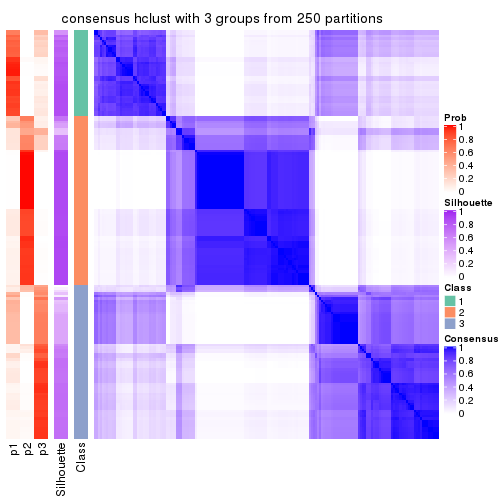</p>

</div>
<div id='tab-CV-hclust-consensus-heatmap-3'>
<pre><code class="r">consensus_heatmap(res, k = 4)
</code></pre>

<p></p>

</div>
<div id='tab-CV-hclust-consensus-heatmap-4'>
<pre><code class="r">consensus_heatmap(res, k = 5)
</code></pre>

<p></p>

</div>
<div id='tab-CV-hclust-consensus-heatmap-5'>
<pre><code class="r">consensus_heatmap(res, k = 6)
</code></pre>

<p></p>

</div>
</div>

Heatmaps for the membership of samples in all partitions to see how consistent they are:


<script>
$( function() {
	$( '#tabs-CV-hclust-membership-heatmap' ).tabs();
} );
</script>
<div id='tabs-CV-hclust-membership-heatmap'>
<ul>
<li><a href='#tab-CV-hclust-membership-heatmap-1'>k = 2</a></li>
<li><a href='#tab-CV-hclust-membership-heatmap-2'>k = 3</a></li>
<li><a href='#tab-CV-hclust-membership-heatmap-3'>k = 4</a></li>
<li><a href='#tab-CV-hclust-membership-heatmap-4'>k = 5</a></li>
<li><a href='#tab-CV-hclust-membership-heatmap-5'>k = 6</a></li>
</ul>
<div id='tab-CV-hclust-membership-heatmap-1'>
<pre><code class="r">membership_heatmap(res, k = 2)
</code></pre>

<p></p>

</div>
<div id='tab-CV-hclust-membership-heatmap-2'>
<pre><code class="r">membership_heatmap(res, k = 3)
</code></pre>

<p></p>

</div>
<div id='tab-CV-hclust-membership-heatmap-3'>
<pre><code class="r">membership_heatmap(res, k = 4)
</code></pre>

<p></p>

</div>
<div id='tab-CV-hclust-membership-heatmap-4'>
<pre><code class="r">membership_heatmap(res, k = 5)
</code></pre>

<p></p>

</div>
<div id='tab-CV-hclust-membership-heatmap-5'>
<pre><code class="r">membership_heatmap(res, k = 6)
</code></pre>

<p></p>

</div>
</div>

As soon as we have had the classes for columns, we can look for signatures
which are significantly different between classes which can be candidate marks
for certain classes. Following are the heatmaps for signatures.


Signature heatmaps where rows are scaled:


<script>
$( function() {
	$( '#tabs-CV-hclust-get-signatures' ).tabs();
} );
</script>
<div id='tabs-CV-hclust-get-signatures'>
<ul>
<li><a href='#tab-CV-hclust-get-signatures-1'>k = 2</a></li>
<li><a href='#tab-CV-hclust-get-signatures-2'>k = 3</a></li>
<li><a href='#tab-CV-hclust-get-signatures-3'>k = 4</a></li>
<li><a href='#tab-CV-hclust-get-signatures-4'>k = 5</a></li>
<li><a href='#tab-CV-hclust-get-signatures-5'>k = 6</a></li>
</ul>
<div id='tab-CV-hclust-get-signatures-1'>
<pre><code class="r">get_signatures(res, k = 2)
</code></pre>

<p></p>

</div>
<div id='tab-CV-hclust-get-signatures-2'>
<pre><code class="r">get_signatures(res, k = 3)
</code></pre>

<p></p>

</div>
<div id='tab-CV-hclust-get-signatures-3'>
<pre><code class="r">get_signatures(res, k = 4)
</code></pre>

<p></p>

</div>
<div id='tab-CV-hclust-get-signatures-4'>
<pre><code class="r">get_signatures(res, k = 5)
</code></pre>

<p></p>

</div>
<div id='tab-CV-hclust-get-signatures-5'>
<pre><code class="r">get_signatures(res, k = 6)
</code></pre>

<p></p>

</div>
</div>


Signature heatmaps where rows are not scaled:


<script>
$( function() {
	$( '#tabs-CV-hclust-get-signatures-no-scale' ).tabs();
} );
</script>
<div id='tabs-CV-hclust-get-signatures-no-scale'>
<ul>
<li><a href='#tab-CV-hclust-get-signatures-no-scale-1'>k = 2</a></li>
<li><a href='#tab-CV-hclust-get-signatures-no-scale-2'>k = 3</a></li>
<li><a href='#tab-CV-hclust-get-signatures-no-scale-3'>k = 4</a></li>
<li><a href='#tab-CV-hclust-get-signatures-no-scale-4'>k = 5</a></li>
<li><a href='#tab-CV-hclust-get-signatures-no-scale-5'>k = 6</a></li>
</ul>
<div id='tab-CV-hclust-get-signatures-no-scale-1'>
<pre><code class="r">get_signatures(res, k = 2, scale_rows = FALSE)
</code></pre>

<p></p>

</div>
<div id='tab-CV-hclust-get-signatures-no-scale-2'>
<pre><code class="r">get_signatures(res, k = 3, scale_rows = FALSE)
</code></pre>

<p></p>

</div>
<div id='tab-CV-hclust-get-signatures-no-scale-3'>
<pre><code class="r">get_signatures(res, k = 4, scale_rows = FALSE)
</code></pre>

<p></p>

</div>
<div id='tab-CV-hclust-get-signatures-no-scale-4'>
<pre><code class="r">get_signatures(res, k = 5, scale_rows = FALSE)
</code></pre>

<p></p>

</div>
<div id='tab-CV-hclust-get-signatures-no-scale-5'>
<pre><code class="r">get_signatures(res, k = 6, scale_rows = FALSE)
</code></pre>

<p>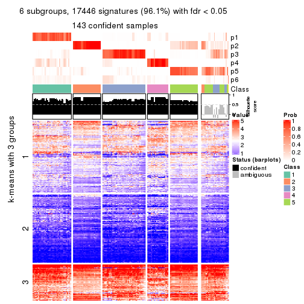</p>

</div>
</div>


Compare the overlap of signatures from different k:

```r
compare_signatures(res)
```


`get_signature()` returns a data frame invisibly. TO get the list of signatures, the function
call should be assigned to a variable explicitly. In following code, if `plot` argument is set
to `FALSE`, no heatmap is plotted while only the differential analysis is performed.

```r
# code only for demonstration
tb = get_signature(res, k = ..., plot = FALSE)
```

An example of the output of `tb` is:

```
#>   which_row         fdr    mean_1    mean_2 scaled_mean_1 scaled_mean_2 km
#> 1        38 0.042760348  8.373488  9.131774    -0.5533452     0.5164555  1
#> 2        40 0.018707592  7.106213  8.469186    -0.6173731     0.5762149  1
#> 3        55 0.019134737 10.221463 11.207825    -0.6159697     0.5749050  1
#> 4        59 0.006059896  5.921854  7.869574    -0.6899429     0.6439467  1
#> 5        60 0.018055526  8.928898 10.211722    -0.6204761     0.5791110  1
#> 6        98 0.009384629 15.714769 14.887706     0.6635654    -0.6193277  2
...
```

The columns in `tb` are:

1. `which_row`: row indices corresponding to the input matrix.
2. `fdr`: FDR for the differential test. 
3. `mean_x`: The mean value in group x.
4. `scaled_mean_x`: The mean value in group x after rows are scaled.
5. `km`: Row groups if k-means clustering is applied to rows.


UMAP plot which shows how samples are separated.


<script>
$( function() {
	$( '#tabs-CV-hclust-dimension-reduction' ).tabs();
} );
</script>
<div id='tabs-CV-hclust-dimension-reduction'>
<ul>
<li><a href='#tab-CV-hclust-dimension-reduction-1'>k = 2</a></li>
<li><a href='#tab-CV-hclust-dimension-reduction-2'>k = 3</a></li>
<li><a href='#tab-CV-hclust-dimension-reduction-3'>k = 4</a></li>
<li><a href='#tab-CV-hclust-dimension-reduction-4'>k = 5</a></li>
<li><a href='#tab-CV-hclust-dimension-reduction-5'>k = 6</a></li>
</ul>
<div id='tab-CV-hclust-dimension-reduction-1'>
<pre><code class="r">dimension_reduction(res, k = 2, method = &quot;UMAP&quot;)
</code></pre>

<p></p>

</div>
<div id='tab-CV-hclust-dimension-reduction-2'>
<pre><code class="r">dimension_reduction(res, k = 3, method = &quot;UMAP&quot;)
</code></pre>

<p></p>

</div>
<div id='tab-CV-hclust-dimension-reduction-3'>
<pre><code class="r">dimension_reduction(res, k = 4, method = &quot;UMAP&quot;)
</code></pre>

<p></p>

</div>
<div id='tab-CV-hclust-dimension-reduction-4'>
<pre><code class="r">dimension_reduction(res, k = 5, method = &quot;UMAP&quot;)
</code></pre>

<p></p>

</div>
<div id='tab-CV-hclust-dimension-reduction-5'>
<pre><code class="r">dimension_reduction(res, k = 6, method = &quot;UMAP&quot;)
</code></pre>

<p></p>

</div>
</div>


Following heatmap shows how subgroups are split when increasing `k`:

```r
collect_classes(res)
```


If matrix rows can be associated to genes, consider to use `functional_enrichment(res,
...)` to perform function enrichment for the signature genes. See [this vignette](http://bioconductor.org/packages/devel/bioc/vignettes/cola/inst/doc/functional_enrichment.html) for more detailed explanations.


 

---------------------------------------------------


### CV:kmeans**


The object with results only for a single top-value method and a single partition method 
can be extracted as:

```r
res = res_list["CV", "kmeans"]
# you can also extract it by
# res = res_list["CV:kmeans"]
```

A summary of `res` and all the functions that can be applied to it:

```r
res
```

```
#> A 'ConsensusPartition' object with k = 2, 3, 4, 5, 6.
#>   On a matrix with 18147 rows and 167 columns.
#>   Top rows (1000, 2000, 3000, 4000, 5000) are extracted by 'CV' method.
#>   Subgroups are detected by 'kmeans' method.
#>   Performed in total 1250 partitions by row resampling.
#>   Best k for subgroups seems to be 2.
#> 
#> Following methods can be applied to this 'ConsensusPartition' object:
#>  [1] "cola_report"             "collect_classes"         "collect_plots"          
#>  [4] "collect_stats"           "colnames"                "compare_signatures"     
#>  [7] "consensus_heatmap"       "dimension_reduction"     "functional_enrichment"  
#> [10] "get_anno_col"            "get_anno"                "get_classes"            
#> [13] "get_consensus"           "get_matrix"              "get_membership"         
#> [16] "get_param"               "get_signatures"          "get_stats"              
#> [19] "is_best_k"               "is_stable_k"             "membership_heatmap"     
#> [22] "ncol"                    "nrow"                    "plot_ecdf"              
#> [25] "rownames"                "select_partition_number" "show"                   
#> [28] "suggest_best_k"          "test_to_known_factors"
```

`collect_plots()` function collects all the plots made from `res` for all `k` (number of partitions)
into one single page to provide an easy and fast comparison between different `k`.

```r
collect_plots(res)
```

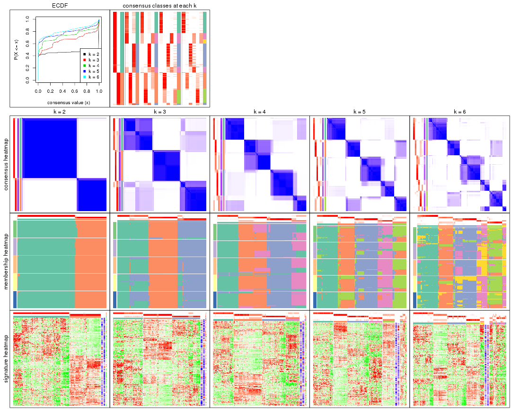

The plots are:

- The first row: a plot of the ECDF (empirical cumulative distribution
  function) curves of the consensus matrix for each `k` and the heatmap of
  predicted classes for each `k`.
- The second row: heatmaps of the consensus matrix for each `k`.
- The third row: heatmaps of the membership matrix for each `k`.
- The fouth row: heatmaps of the signatures for each `k`.

All the plots in panels can be made by individual functions and they are
plotted later in this section.

`select_partition_number()` produces several plots showing different
statistics for choosing "optimized" `k`. There are following statistics:

- ECDF curves of the consensus matrix for each `k`;
- 1-PAC. [The PAC
  score](https://en.wikipedia.org/wiki/Consensus_clustering#Over-interpretation_potential_of_consensus_clustering)
  measures the proportion of the ambiguous subgrouping.
- Mean silhouette score.
- Concordance. The mean probability of fiting the consensus class ids in all
  partitions.
- Area increased. Denote $A_k$ as the area under the ECDF curve for current
  `k`, the area increased is defined as $A_k - A_{k-1}$.
- Rand index. The percent of pairs of samples that are both in a same cluster
  or both are not in a same cluster in the partition of k and k-1.
- Jaccard index. The ratio of pairs of samples are both in a same cluster in
  the partition of k and k-1 and the pairs of samples are both in a same
  cluster in the partition k or k-1.

The detailed explanations of these statistics can be found in [the _cola_
vignette](http://bioconductor.org/packages/devel/bioc/vignettes/cola/inst/doc/cola.html#toc_13).

Generally speaking, lower PAC score, higher mean silhouette score or higher
concordance corresponds to better partition. Rand index and Jaccard index
measure how similar the current partition is compared to partition with `k-1`.
If they are too similar, we won't accept `k` is better than `k-1`.

```r
select_partition_number(res)
```


The numeric values for all these statistics can be obtained by `get_stats()`.

```r
get_stats(res)
```

```
#>   k 1-PAC mean_silhouette concordance area_increased  Rand Jaccard
#> 2 2 1.000           0.980       0.992         0.4597 0.540   0.540
#> 3 3 0.744           0.865       0.900         0.4312 0.759   0.566
#> 4 4 0.826           0.853       0.858         0.1168 0.898   0.704
#> 5 5 0.824           0.809       0.842         0.0689 0.934   0.751
#> 6 6 0.777           0.651       0.753         0.0386 0.972   0.868
```

`suggest_best_k()` suggests the best $k$ based on these statistics. The rules are as follows:

- All $k$ with Jaccard index larger than 0.95 are removed because increasing
  $k$ does not provide enough extra information. If all $k$ are removed, it is
  marked as no subgroup is detected.
- For all $k$ with 1-PAC score larger than 0.9, the maximal $k$ is taken as
  the best $k$, and other $k$ are marked as optional $k$.
- If it does not fit the second rule. The $k$ with the maximal vote of the
  highest 1-PAC score, highest mean silhouette, and highest concordance is
  taken as the best $k$.

```r
suggest_best_k(res)
```

```
#> [1] 2
```


Following shows the table of the partitions (You need to click the **show/hide
code output** link to see it). The membership matrix (columns with name `p*`)
is inferred by
[`clue::cl_consensus()`](https://www.rdocumentation.org/link/cl_consensus?package=clue)
function with the `SE` method. Basically the value in the membership matrix
represents the probability to belong to a certain group. The finall class
label for an item is determined with the group with highest probability it
belongs to.

In `get_classes()` function, the entropy is calculated from the membership
matrix and the silhouette score is calculated from the consensus matrix.


<script>
$( function() {
	$( '#tabs-CV-kmeans-get-classes' ).tabs();
} );
</script>
<div id='tabs-CV-kmeans-get-classes'>
<ul>
<li><a href='#tab-CV-kmeans-get-classes-1'>k = 2</a></li>
<li><a href='#tab-CV-kmeans-get-classes-2'>k = 3</a></li>
<li><a href='#tab-CV-kmeans-get-classes-3'>k = 4</a></li>
<li><a href='#tab-CV-kmeans-get-classes-4'>k = 5</a></li>
<li><a href='#tab-CV-kmeans-get-classes-5'>k = 6</a></li>
</ul>

<div id='tab-CV-kmeans-get-classes-1'>
<p><a id='tab-CV-kmeans-get-classes-1-a' style='color:#0366d6' href='#'>show/hide code output</a></p>
<pre><code class="r">cbind(get_classes(res, k = 2), get_membership(res, k = 2))
</code></pre>

<pre><code>#&gt;            class entropy silhouette    p1    p2
#&gt; SRR1313062     1   0.000      0.994 1.000 0.000
#&gt; SRR1313063     1   0.000      0.994 1.000 0.000
#&gt; SRR1313064     1   0.000      0.994 1.000 0.000
#&gt; SRR1313065     1   0.000      0.994 1.000 0.000
#&gt; SRR1313066     1   0.000      0.994 1.000 0.000
#&gt; SRR1313067     1   0.000      0.994 1.000 0.000
#&gt; SRR1313068     1   0.000      0.994 1.000 0.000
#&gt; SRR1313069     1   0.000      0.994 1.000 0.000
#&gt; SRR1313070     1   0.000      0.994 1.000 0.000
#&gt; SRR1313071     1   0.000      0.994 1.000 0.000
#&gt; SRR1313072     1   0.000      0.994 1.000 0.000
#&gt; SRR1313073     1   0.000      0.994 1.000 0.000
#&gt; SRR1313074     1   0.000      0.994 1.000 0.000
#&gt; SRR1313075     1   0.000      0.994 1.000 0.000
#&gt; SRR1313076     1   0.000      0.994 1.000 0.000
#&gt; SRR1313077     1   0.000      0.994 1.000 0.000
#&gt; SRR1313078     1   0.000      0.994 1.000 0.000
#&gt; SRR1313079     1   0.000      0.994 1.000 0.000
#&gt; SRR1313080     1   0.000      0.994 1.000 0.000
#&gt; SRR1313081     1   0.000      0.994 1.000 0.000
#&gt; SRR1313082     1   0.000      0.994 1.000 0.000
#&gt; SRR1313083     1   0.000      0.994 1.000 0.000
#&gt; SRR1313084     1   0.000      0.994 1.000 0.000
#&gt; SRR1313085     1   0.000      0.994 1.000 0.000
#&gt; SRR1313086     1   0.000      0.994 1.000 0.000
#&gt; SRR1313087     1   0.000      0.994 1.000 0.000
#&gt; SRR1313088     1   0.000      0.994 1.000 0.000
#&gt; SRR1313089     1   0.000      0.994 1.000 0.000
#&gt; SRR1313092     1   0.000      0.994 1.000 0.000
#&gt; SRR1313090     1   0.000      0.994 1.000 0.000
#&gt; SRR1313091     2   0.000      0.988 0.000 1.000
#&gt; SRR1313093     1   0.000      0.994 1.000 0.000
#&gt; SRR1313095     1   0.000      0.994 1.000 0.000
#&gt; SRR1313096     1   0.000      0.994 1.000 0.000
#&gt; SRR1313094     1   0.000      0.994 1.000 0.000
#&gt; SRR1313097     1   0.000      0.994 1.000 0.000
#&gt; SRR1313099     1   0.242      0.954 0.960 0.040
#&gt; SRR1313098     1   0.000      0.994 1.000 0.000
#&gt; SRR1313101     1   0.000      0.994 1.000 0.000
#&gt; SRR1313102     1   0.000      0.994 1.000 0.000
#&gt; SRR1313103     1   0.000      0.994 1.000 0.000
#&gt; SRR1313100     1   0.000      0.994 1.000 0.000
#&gt; SRR1313105     1   0.000      0.994 1.000 0.000
#&gt; SRR1313104     1   0.000      0.994 1.000 0.000
#&gt; SRR1313107     1   0.000      0.994 1.000 0.000
#&gt; SRR1313106     1   0.000      0.994 1.000 0.000
#&gt; SRR1313109     2   0.518      0.869 0.116 0.884
#&gt; SRR1313108     1   0.000      0.994 1.000 0.000
#&gt; SRR1313111     1   0.000      0.994 1.000 0.000
#&gt; SRR1313110     1   0.000      0.994 1.000 0.000
#&gt; SRR1313112     1   0.000      0.994 1.000 0.000
#&gt; SRR1313113     1   0.000      0.994 1.000 0.000
#&gt; SRR1313115     1   0.000      0.994 1.000 0.000
#&gt; SRR1313114     1   0.000      0.994 1.000 0.000
#&gt; SRR1313117     1   0.000      0.994 1.000 0.000
#&gt; SRR1313118     1   0.000      0.994 1.000 0.000
#&gt; SRR1313116     1   0.327      0.933 0.940 0.060
#&gt; SRR1313120     1   0.000      0.994 1.000 0.000
#&gt; SRR1313119     1   0.000      0.994 1.000 0.000
#&gt; SRR1313122     1   0.000      0.994 1.000 0.000
#&gt; SRR1313124     1   0.000      0.994 1.000 0.000
#&gt; SRR1313121     1   0.000      0.994 1.000 0.000
#&gt; SRR1313125     1   0.000      0.994 1.000 0.000
#&gt; SRR1313127     1   0.000      0.994 1.000 0.000
#&gt; SRR1313123     1   0.000      0.994 1.000 0.000
#&gt; SRR1313128     1   0.000      0.994 1.000 0.000
#&gt; SRR1313126     1   0.000      0.994 1.000 0.000
#&gt; SRR1313130     2   0.605      0.829 0.148 0.852
#&gt; SRR1313132     1   0.000      0.994 1.000 0.000
#&gt; SRR1313129     1   0.000      0.994 1.000 0.000
#&gt; SRR1313133     1   0.000      0.994 1.000 0.000
#&gt; SRR1313131     1   0.000      0.994 1.000 0.000
#&gt; SRR1313134     1   0.000      0.994 1.000 0.000
#&gt; SRR1313135     1   0.000      0.994 1.000 0.000
#&gt; SRR1313136     1   0.000      0.994 1.000 0.000
#&gt; SRR1313137     1   0.000      0.994 1.000 0.000
#&gt; SRR1313138     1   0.000      0.994 1.000 0.000
#&gt; SRR1313140     1   0.000      0.994 1.000 0.000
#&gt; SRR1313141     1   0.000      0.994 1.000 0.000
#&gt; SRR1313139     1   0.000      0.994 1.000 0.000
#&gt; SRR1313143     1   0.000      0.994 1.000 0.000
#&gt; SRR1313142     1   0.000      0.994 1.000 0.000
#&gt; SRR1313144     1   0.000      0.994 1.000 0.000
#&gt; SRR1313145     1   0.000      0.994 1.000 0.000
#&gt; SRR1313146     1   0.000      0.994 1.000 0.000
#&gt; SRR1313147     1   0.000      0.994 1.000 0.000
#&gt; SRR1313150     1   0.000      0.994 1.000 0.000
#&gt; SRR1313149     1   0.000      0.994 1.000 0.000
#&gt; SRR1313152     1   0.000      0.994 1.000 0.000
#&gt; SRR1313151     1   0.000      0.994 1.000 0.000
#&gt; SRR1313154     1   0.000      0.994 1.000 0.000
#&gt; SRR1313153     1   0.000      0.994 1.000 0.000
#&gt; SRR1313156     1   0.000      0.994 1.000 0.000
#&gt; SRR1313155     1   0.000      0.994 1.000 0.000
#&gt; SRR1313157     1   0.000      0.994 1.000 0.000
#&gt; SRR1313158     1   0.000      0.994 1.000 0.000
#&gt; SRR1313161     1   0.000      0.994 1.000 0.000
#&gt; SRR1313159     2   0.904      0.538 0.320 0.680
#&gt; SRR1313160     1   0.000      0.994 1.000 0.000
#&gt; SRR1313162     1   0.000      0.994 1.000 0.000
#&gt; SRR1313163     1   0.000      0.994 1.000 0.000
#&gt; SRR1313165     1   0.000      0.994 1.000 0.000
#&gt; SRR1313166     1   0.000      0.994 1.000 0.000
#&gt; SRR1313164     1   0.000      0.994 1.000 0.000
#&gt; SRR1313167     1   0.000      0.994 1.000 0.000
#&gt; SRR1313168     1   0.000      0.994 1.000 0.000
#&gt; SRR1313170     1   0.242      0.954 0.960 0.040
#&gt; SRR1313169     1   0.000      0.994 1.000 0.000
#&gt; SRR1313172     1   0.995      0.126 0.540 0.460
#&gt; SRR1313171     1   0.000      0.994 1.000 0.000
#&gt; SRR1313174     2   0.000      0.988 0.000 1.000
#&gt; SRR1313173     1   0.000      0.994 1.000 0.000
#&gt; SRR1313176     2   0.000      0.988 0.000 1.000
#&gt; SRR1313175     2   0.000      0.988 0.000 1.000
#&gt; SRR1313178     2   0.000      0.988 0.000 1.000
#&gt; SRR1313177     2   0.000      0.988 0.000 1.000
#&gt; SRR1313179     2   0.000      0.988 0.000 1.000
#&gt; SRR1313180     2   0.000      0.988 0.000 1.000
#&gt; SRR1313181     2   0.000      0.988 0.000 1.000
#&gt; SRR1313183     2   0.000      0.988 0.000 1.000
#&gt; SRR1313182     2   0.000      0.988 0.000 1.000
#&gt; SRR1313184     2   0.000      0.988 0.000 1.000
#&gt; SRR1313185     2   0.000      0.988 0.000 1.000
#&gt; SRR1313188     2   0.000      0.988 0.000 1.000
#&gt; SRR1313187     2   0.000      0.988 0.000 1.000
#&gt; SRR1313186     2   0.000      0.988 0.000 1.000
#&gt; SRR1313189     2   0.000      0.988 0.000 1.000
#&gt; SRR1313190     2   0.000      0.988 0.000 1.000
#&gt; SRR1313191     2   0.000      0.988 0.000 1.000
#&gt; SRR1313192     2   0.000      0.988 0.000 1.000
#&gt; SRR1313193     2   0.000      0.988 0.000 1.000
#&gt; SRR1313194     2   0.000      0.988 0.000 1.000
#&gt; SRR1313195     2   0.000      0.988 0.000 1.000
#&gt; SRR1313196     2   0.000      0.988 0.000 1.000
#&gt; SRR1313197     2   0.000      0.988 0.000 1.000
#&gt; SRR1313198     2   0.000      0.988 0.000 1.000
#&gt; SRR1313199     2   0.000      0.988 0.000 1.000
#&gt; SRR1313200     2   0.000      0.988 0.000 1.000
#&gt; SRR1313201     2   0.000      0.988 0.000 1.000
#&gt; SRR1313202     2   0.000      0.988 0.000 1.000
#&gt; SRR1313203     1   0.184      0.967 0.972 0.028
#&gt; SRR1313204     2   0.000      0.988 0.000 1.000
#&gt; SRR1313205     2   0.000      0.988 0.000 1.000
#&gt; SRR1313207     2   0.000      0.988 0.000 1.000
#&gt; SRR1313208     2   0.000      0.988 0.000 1.000
#&gt; SRR1313206     2   0.000      0.988 0.000 1.000
#&gt; SRR1313210     2   0.000      0.988 0.000 1.000
#&gt; SRR1313209     2   0.000      0.988 0.000 1.000
#&gt; SRR1313211     2   0.000      0.988 0.000 1.000
#&gt; SRR1313212     2   0.000      0.988 0.000 1.000
#&gt; SRR1313214     2   0.000      0.988 0.000 1.000
#&gt; SRR1313215     2   0.000      0.988 0.000 1.000
#&gt; SRR1313213     2   0.000      0.988 0.000 1.000
#&gt; SRR1313216     2   0.000      0.988 0.000 1.000
#&gt; SRR1313217     2   0.000      0.988 0.000 1.000
#&gt; SRR1313219     2   0.000      0.988 0.000 1.000
#&gt; SRR1313220     2   0.000      0.988 0.000 1.000
#&gt; SRR1313218     2   0.000      0.988 0.000 1.000
#&gt; SRR1313222     2   0.000      0.988 0.000 1.000
#&gt; SRR1313221     2   0.000      0.988 0.000 1.000
#&gt; SRR1313223     2   0.000      0.988 0.000 1.000
#&gt; SRR1313224     2   0.000      0.988 0.000 1.000
#&gt; SRR1313225     2   0.000      0.988 0.000 1.000
#&gt; SRR1313226     2   0.552      0.855 0.128 0.872
#&gt; SRR1313227     2   0.000      0.988 0.000 1.000
#&gt; SRR1313228     2   0.000      0.988 0.000 1.000
#&gt; SRR1313229     2   0.000      0.988 0.000 1.000
</code></pre>

<script>
$('#tab-CV-kmeans-get-classes-1-a').parent().next().next().hide();
$('#tab-CV-kmeans-get-classes-1-a').click(function(){
  $('#tab-CV-kmeans-get-classes-1-a').parent().next().next().toggle();
  return(false);
});
</script>
</div>

<div id='tab-CV-kmeans-get-classes-2'>
<p><a id='tab-CV-kmeans-get-classes-2-a' style='color:#0366d6' href='#'>show/hide code output</a></p>
<pre><code class="r">cbind(get_classes(res, k = 3), get_membership(res, k = 3))
</code></pre>

<pre><code>#&gt;            class entropy silhouette    p1    p2    p3
#&gt; SRR1313062     3  0.6062      0.556 0.384 0.000 0.616
#&gt; SRR1313063     3  0.6062      0.556 0.384 0.000 0.616
#&gt; SRR1313064     1  0.1163      0.801 0.972 0.000 0.028
#&gt; SRR1313065     1  0.1163      0.801 0.972 0.000 0.028
#&gt; SRR1313066     1  0.1163      0.801 0.972 0.000 0.028
#&gt; SRR1313067     3  0.5948      0.589 0.360 0.000 0.640
#&gt; SRR1313068     3  0.5859      0.607 0.344 0.000 0.656
#&gt; SRR1313069     1  0.0892      0.800 0.980 0.000 0.020
#&gt; SRR1313070     1  0.1163      0.801 0.972 0.000 0.028
#&gt; SRR1313071     1  0.1163      0.801 0.972 0.000 0.028
#&gt; SRR1313072     1  0.1163      0.801 0.972 0.000 0.028
#&gt; SRR1313073     1  0.1163      0.801 0.972 0.000 0.028
#&gt; SRR1313074     1  0.1163      0.801 0.972 0.000 0.028
#&gt; SRR1313075     1  0.1163      0.801 0.972 0.000 0.028
#&gt; SRR1313076     3  0.5948      0.589 0.360 0.000 0.640
#&gt; SRR1313077     3  0.6062      0.556 0.384 0.000 0.616
#&gt; SRR1313078     3  0.6062      0.556 0.384 0.000 0.616
#&gt; SRR1313079     1  0.1163      0.801 0.972 0.000 0.028
#&gt; SRR1313080     3  0.5905      0.599 0.352 0.000 0.648
#&gt; SRR1313081     3  0.6062      0.556 0.384 0.000 0.616
#&gt; SRR1313082     1  0.1163      0.801 0.972 0.000 0.028
#&gt; SRR1313083     1  0.0892      0.800 0.980 0.000 0.020
#&gt; SRR1313084     1  0.1163      0.801 0.972 0.000 0.028
#&gt; SRR1313085     1  0.1163      0.801 0.972 0.000 0.028
#&gt; SRR1313086     1  0.1163      0.801 0.972 0.000 0.028
#&gt; SRR1313087     1  0.1163      0.801 0.972 0.000 0.028
#&gt; SRR1313088     1  0.1163      0.801 0.972 0.000 0.028
#&gt; SRR1313089     1  0.1163      0.801 0.972 0.000 0.028
#&gt; SRR1313092     3  0.1031      0.905 0.024 0.000 0.976
#&gt; SRR1313090     3  0.1031      0.905 0.024 0.000 0.976
#&gt; SRR1313091     2  0.4605      0.774 0.000 0.796 0.204
#&gt; SRR1313093     3  0.1031      0.905 0.024 0.000 0.976
#&gt; SRR1313095     3  0.1031      0.905 0.024 0.000 0.976
#&gt; SRR1313096     3  0.1031      0.905 0.024 0.000 0.976
#&gt; SRR1313094     3  0.1031      0.905 0.024 0.000 0.976
#&gt; SRR1313097     3  0.0892      0.904 0.020 0.000 0.980
#&gt; SRR1313099     3  0.1525      0.894 0.032 0.004 0.964
#&gt; SRR1313098     3  0.1031      0.905 0.024 0.000 0.976
#&gt; SRR1313101     3  0.0892      0.904 0.020 0.000 0.980
#&gt; SRR1313102     3  0.1031      0.905 0.024 0.000 0.976
#&gt; SRR1313103     3  0.1411      0.892 0.036 0.000 0.964
#&gt; SRR1313100     3  0.1163      0.903 0.028 0.000 0.972
#&gt; SRR1313105     3  0.0892      0.904 0.020 0.000 0.980
#&gt; SRR1313104     3  0.1031      0.905 0.024 0.000 0.976
#&gt; SRR1313107     3  0.0892      0.904 0.020 0.000 0.980
#&gt; SRR1313106     3  0.0892      0.904 0.020 0.000 0.980
#&gt; SRR1313109     3  0.1163      0.864 0.000 0.028 0.972
#&gt; SRR1313108     3  0.1031      0.905 0.024 0.000 0.976
#&gt; SRR1313111     3  0.0892      0.904 0.020 0.000 0.980
#&gt; SRR1313110     3  0.1031      0.905 0.024 0.000 0.976
#&gt; SRR1313112     3  0.0892      0.904 0.020 0.000 0.980
#&gt; SRR1313113     3  0.0892      0.904 0.020 0.000 0.980
#&gt; SRR1313115     3  0.1031      0.905 0.024 0.000 0.976
#&gt; SRR1313114     3  0.1031      0.905 0.024 0.000 0.976
#&gt; SRR1313117     3  0.0892      0.904 0.020 0.000 0.980
#&gt; SRR1313118     3  0.1031      0.905 0.024 0.000 0.976
#&gt; SRR1313116     3  0.0747      0.875 0.000 0.016 0.984
#&gt; SRR1313120     3  0.0892      0.904 0.020 0.000 0.980
#&gt; SRR1313119     3  0.1031      0.905 0.024 0.000 0.976
#&gt; SRR1313122     3  0.1163      0.903 0.028 0.000 0.972
#&gt; SRR1313124     3  0.1031      0.905 0.024 0.000 0.976
#&gt; SRR1313121     3  0.1031      0.905 0.024 0.000 0.976
#&gt; SRR1313125     3  0.0892      0.904 0.020 0.000 0.980
#&gt; SRR1313127     3  0.1031      0.905 0.024 0.000 0.976
#&gt; SRR1313123     3  0.1031      0.905 0.024 0.000 0.976
#&gt; SRR1313128     1  0.4750      0.847 0.784 0.000 0.216
#&gt; SRR1313126     3  0.2448      0.868 0.076 0.000 0.924
#&gt; SRR1313130     3  0.5327      0.572 0.000 0.272 0.728
#&gt; SRR1313132     1  0.5706      0.732 0.680 0.000 0.320
#&gt; SRR1313129     3  0.1267      0.900 0.024 0.004 0.972
#&gt; SRR1313133     1  0.4750      0.847 0.784 0.000 0.216
#&gt; SRR1313131     3  0.1411      0.899 0.036 0.000 0.964
#&gt; SRR1313134     1  0.4842      0.843 0.776 0.000 0.224
#&gt; SRR1313135     1  0.4750      0.847 0.784 0.000 0.216
#&gt; SRR1313136     1  0.4750      0.847 0.784 0.000 0.216
#&gt; SRR1313137     1  0.4750      0.847 0.784 0.000 0.216
#&gt; SRR1313138     1  0.5706      0.732 0.680 0.000 0.320
#&gt; SRR1313140     1  0.0424      0.803 0.992 0.000 0.008
#&gt; SRR1313141     1  0.4887      0.837 0.772 0.000 0.228
#&gt; SRR1313139     1  0.1289      0.813 0.968 0.000 0.032
#&gt; SRR1313143     1  0.2796      0.817 0.908 0.000 0.092
#&gt; SRR1313142     1  0.4750      0.847 0.784 0.000 0.216
#&gt; SRR1313144     1  0.4750      0.847 0.784 0.000 0.216
#&gt; SRR1313145     1  0.4750      0.847 0.784 0.000 0.216
#&gt; SRR1313146     1  0.4702      0.847 0.788 0.000 0.212
#&gt; SRR1313147     1  0.4702      0.847 0.788 0.000 0.212
#&gt; SRR1313150     1  0.4750      0.847 0.784 0.000 0.216
#&gt; SRR1313149     1  0.4702      0.847 0.788 0.000 0.212
#&gt; SRR1313152     1  0.4750      0.847 0.784 0.000 0.216
#&gt; SRR1313151     1  0.4654      0.847 0.792 0.000 0.208
#&gt; SRR1313154     1  0.4750      0.847 0.784 0.000 0.216
#&gt; SRR1313153     1  0.4750      0.847 0.784 0.000 0.216
#&gt; SRR1313156     1  0.5706      0.732 0.680 0.000 0.320
#&gt; SRR1313155     1  0.4702      0.847 0.788 0.000 0.212
#&gt; SRR1313157     1  0.4702      0.847 0.788 0.000 0.212
#&gt; SRR1313158     1  0.5254      0.801 0.736 0.000 0.264
#&gt; SRR1313161     1  0.4750      0.847 0.784 0.000 0.216
#&gt; SRR1313159     1  0.9738      0.382 0.424 0.232 0.344
#&gt; SRR1313160     1  0.4750      0.847 0.784 0.000 0.216
#&gt; SRR1313162     1  0.5926      0.679 0.644 0.000 0.356
#&gt; SRR1313163     1  0.5621      0.748 0.692 0.000 0.308
#&gt; SRR1313165     1  0.4750      0.847 0.784 0.000 0.216
#&gt; SRR1313166     1  0.4750      0.847 0.784 0.000 0.216
#&gt; SRR1313164     1  0.5706      0.732 0.680 0.000 0.320
#&gt; SRR1313167     1  0.1289      0.813 0.968 0.000 0.032
#&gt; SRR1313168     1  0.4750      0.847 0.784 0.000 0.216
#&gt; SRR1313170     3  0.1289      0.873 0.032 0.000 0.968
#&gt; SRR1313169     1  0.4702      0.847 0.788 0.000 0.212
#&gt; SRR1313172     3  0.1781      0.889 0.020 0.020 0.960
#&gt; SRR1313171     1  0.5733      0.727 0.676 0.000 0.324
#&gt; SRR1313174     2  0.1031      0.977 0.000 0.976 0.024
#&gt; SRR1313173     3  0.1411      0.899 0.036 0.000 0.964
#&gt; SRR1313176     2  0.0000      0.978 0.000 1.000 0.000
#&gt; SRR1313175     2  0.1031      0.977 0.000 0.976 0.024
#&gt; SRR1313178     2  0.0000      0.978 0.000 1.000 0.000
#&gt; SRR1313177     2  0.0000      0.978 0.000 1.000 0.000
#&gt; SRR1313179     2  0.5461      0.657 0.008 0.748 0.244
#&gt; SRR1313180     2  0.1163      0.974 0.000 0.972 0.028
#&gt; SRR1313181     2  0.0000      0.978 0.000 1.000 0.000
#&gt; SRR1313183     2  0.0000      0.978 0.000 1.000 0.000
#&gt; SRR1313182     2  0.0592      0.978 0.000 0.988 0.012
#&gt; SRR1313184     2  0.5178      0.646 0.000 0.744 0.256
#&gt; SRR1313185     2  0.1031      0.977 0.000 0.976 0.024
#&gt; SRR1313188     2  0.1031      0.977 0.000 0.976 0.024
#&gt; SRR1313187     2  0.1163      0.974 0.000 0.972 0.028
#&gt; SRR1313186     2  0.1031      0.977 0.000 0.976 0.024
#&gt; SRR1313189     2  0.0000      0.978 0.000 1.000 0.000
#&gt; SRR1313190     2  0.0000      0.978 0.000 1.000 0.000
#&gt; SRR1313191     2  0.0424      0.978 0.000 0.992 0.008
#&gt; SRR1313192     2  0.0000      0.978 0.000 1.000 0.000
#&gt; SRR1313193     2  0.0000      0.978 0.000 1.000 0.000
#&gt; SRR1313194     2  0.1031      0.977 0.000 0.976 0.024
#&gt; SRR1313195     2  0.1031      0.977 0.000 0.976 0.024
#&gt; SRR1313196     2  0.1163      0.974 0.000 0.972 0.028
#&gt; SRR1313197     2  0.1031      0.977 0.000 0.976 0.024
#&gt; SRR1313198     2  0.1031      0.977 0.000 0.976 0.024
#&gt; SRR1313199     2  0.0000      0.978 0.000 1.000 0.000
#&gt; SRR1313200     2  0.1031      0.977 0.000 0.976 0.024
#&gt; SRR1313201     2  0.0000      0.978 0.000 1.000 0.000
#&gt; SRR1313202     2  0.1031      0.977 0.000 0.976 0.024
#&gt; SRR1313203     3  0.2772      0.864 0.080 0.004 0.916
#&gt; SRR1313204     2  0.0000      0.978 0.000 1.000 0.000
#&gt; SRR1313205     2  0.0000      0.978 0.000 1.000 0.000
#&gt; SRR1313207     2  0.0000      0.978 0.000 1.000 0.000
#&gt; SRR1313208     2  0.0000      0.978 0.000 1.000 0.000
#&gt; SRR1313206     2  0.0000      0.978 0.000 1.000 0.000
#&gt; SRR1313210     2  0.1031      0.977 0.000 0.976 0.024
#&gt; SRR1313209     2  0.1031      0.977 0.000 0.976 0.024
#&gt; SRR1313211     2  0.0892      0.977 0.000 0.980 0.020
#&gt; SRR1313212     2  0.0000      0.978 0.000 1.000 0.000
#&gt; SRR1313214     2  0.1031      0.977 0.000 0.976 0.024
#&gt; SRR1313215     2  0.1031      0.977 0.000 0.976 0.024
#&gt; SRR1313213     2  0.0000      0.978 0.000 1.000 0.000
#&gt; SRR1313216     2  0.1031      0.977 0.000 0.976 0.024
#&gt; SRR1313217     2  0.1031      0.977 0.000 0.976 0.024
#&gt; SRR1313219     2  0.1031      0.977 0.000 0.976 0.024
#&gt; SRR1313220     2  0.0000      0.978 0.000 1.000 0.000
#&gt; SRR1313218     2  0.0424      0.978 0.000 0.992 0.008
#&gt; SRR1313222     2  0.0000      0.978 0.000 1.000 0.000
#&gt; SRR1313221     2  0.0000      0.978 0.000 1.000 0.000
#&gt; SRR1313223     2  0.0000      0.978 0.000 1.000 0.000
#&gt; SRR1313224     2  0.0000      0.978 0.000 1.000 0.000
#&gt; SRR1313225     2  0.1031      0.977 0.000 0.976 0.024
#&gt; SRR1313226     3  0.5760      0.459 0.000 0.328 0.672
#&gt; SRR1313227     2  0.0000      0.978 0.000 1.000 0.000
#&gt; SRR1313228     2  0.0000      0.978 0.000 1.000 0.000
#&gt; SRR1313229     2  0.0000      0.978 0.000 1.000 0.000
</code></pre>

<script>
$('#tab-CV-kmeans-get-classes-2-a').parent().next().next().hide();
$('#tab-CV-kmeans-get-classes-2-a').click(function(){
  $('#tab-CV-kmeans-get-classes-2-a').parent().next().next().toggle();
  return(false);
});
</script>
</div>

<div id='tab-CV-kmeans-get-classes-3'>
<p><a id='tab-CV-kmeans-get-classes-3-a' style='color:#0366d6' href='#'>show/hide code output</a></p>
<pre><code class="r">cbind(get_classes(res, k = 4), get_membership(res, k = 4))
</code></pre>

<pre><code>#&gt;            class entropy silhouette    p1    p2    p3    p4
#&gt; SRR1313062     4  0.5925      0.619 0.068 0.000 0.284 0.648
#&gt; SRR1313063     4  0.6187      0.566 0.068 0.000 0.336 0.596
#&gt; SRR1313064     4  0.5007      0.789 0.356 0.000 0.008 0.636
#&gt; SRR1313065     4  0.5007      0.789 0.356 0.000 0.008 0.636
#&gt; SRR1313066     4  0.4973      0.791 0.348 0.000 0.008 0.644
#&gt; SRR1313067     4  0.6187      0.566 0.068 0.000 0.336 0.596
#&gt; SRR1313068     4  0.6452      0.298 0.068 0.000 0.464 0.468
#&gt; SRR1313069     4  0.5004      0.741 0.392 0.000 0.004 0.604
#&gt; SRR1313070     4  0.5007      0.789 0.356 0.000 0.008 0.636
#&gt; SRR1313071     4  0.5007      0.789 0.356 0.000 0.008 0.636
#&gt; SRR1313072     4  0.4973      0.791 0.348 0.000 0.008 0.644
#&gt; SRR1313073     4  0.4955      0.790 0.344 0.000 0.008 0.648
#&gt; SRR1313074     4  0.5007      0.789 0.356 0.000 0.008 0.636
#&gt; SRR1313075     4  0.5007      0.789 0.356 0.000 0.008 0.636
#&gt; SRR1313076     4  0.6249      0.540 0.068 0.000 0.352 0.580
#&gt; SRR1313077     4  0.6187      0.566 0.068 0.000 0.336 0.596
#&gt; SRR1313078     4  0.6187      0.566 0.068 0.000 0.336 0.596
#&gt; SRR1313079     4  0.4973      0.791 0.348 0.000 0.008 0.644
#&gt; SRR1313080     4  0.6452      0.298 0.068 0.000 0.464 0.468
#&gt; SRR1313081     4  0.5994      0.608 0.068 0.000 0.296 0.636
#&gt; SRR1313082     4  0.5007      0.789 0.356 0.000 0.008 0.636
#&gt; SRR1313083     4  0.4889      0.784 0.360 0.000 0.004 0.636
#&gt; SRR1313084     4  0.4973      0.791 0.348 0.000 0.008 0.644
#&gt; SRR1313085     4  0.5007      0.789 0.356 0.000 0.008 0.636
#&gt; SRR1313086     4  0.4889      0.784 0.360 0.000 0.004 0.636
#&gt; SRR1313087     4  0.4955      0.790 0.344 0.000 0.008 0.648
#&gt; SRR1313088     4  0.4905      0.780 0.364 0.000 0.004 0.632
#&gt; SRR1313089     4  0.4990      0.791 0.352 0.000 0.008 0.640
#&gt; SRR1313092     3  0.0000      0.943 0.000 0.000 1.000 0.000
#&gt; SRR1313090     3  0.0000      0.943 0.000 0.000 1.000 0.000
#&gt; SRR1313091     3  0.5320      0.448 0.000 0.416 0.572 0.012
#&gt; SRR1313093     3  0.0000      0.943 0.000 0.000 1.000 0.000
#&gt; SRR1313095     3  0.0469      0.940 0.000 0.000 0.988 0.012
#&gt; SRR1313096     3  0.0469      0.940 0.000 0.000 0.988 0.012
#&gt; SRR1313094     3  0.0000      0.943 0.000 0.000 1.000 0.000
#&gt; SRR1313097     3  0.0657      0.938 0.000 0.004 0.984 0.012
#&gt; SRR1313099     3  0.0804      0.936 0.000 0.008 0.980 0.012
#&gt; SRR1313098     3  0.0469      0.940 0.000 0.000 0.988 0.012
#&gt; SRR1313101     3  0.0188      0.942 0.000 0.000 0.996 0.004
#&gt; SRR1313102     3  0.0469      0.939 0.000 0.000 0.988 0.012
#&gt; SRR1313103     3  0.0844      0.936 0.004 0.004 0.980 0.012
#&gt; SRR1313100     3  0.0469      0.940 0.000 0.000 0.988 0.012
#&gt; SRR1313105     3  0.0657      0.938 0.000 0.004 0.984 0.012
#&gt; SRR1313104     3  0.0000      0.943 0.000 0.000 1.000 0.000
#&gt; SRR1313107     3  0.0657      0.938 0.000 0.004 0.984 0.012
#&gt; SRR1313106     3  0.0376      0.941 0.000 0.004 0.992 0.004
#&gt; SRR1313109     3  0.4098      0.738 0.000 0.204 0.784 0.012
#&gt; SRR1313108     3  0.0336      0.941 0.000 0.000 0.992 0.008
#&gt; SRR1313111     3  0.0657      0.938 0.000 0.004 0.984 0.012
#&gt; SRR1313110     3  0.0469      0.940 0.000 0.000 0.988 0.012
#&gt; SRR1313112     3  0.0000      0.943 0.000 0.000 1.000 0.000
#&gt; SRR1313113     3  0.0657      0.938 0.000 0.004 0.984 0.012
#&gt; SRR1313115     3  0.0336      0.941 0.000 0.000 0.992 0.008
#&gt; SRR1313114     3  0.0469      0.940 0.000 0.000 0.988 0.012
#&gt; SRR1313117     3  0.0000      0.943 0.000 0.000 1.000 0.000
#&gt; SRR1313118     3  0.0469      0.940 0.000 0.000 0.988 0.012
#&gt; SRR1313116     3  0.5093      0.566 0.000 0.348 0.640 0.012
#&gt; SRR1313120     3  0.0657      0.938 0.000 0.004 0.984 0.012
#&gt; SRR1313119     3  0.0000      0.943 0.000 0.000 1.000 0.000
#&gt; SRR1313122     3  0.0469      0.940 0.000 0.000 0.988 0.012
#&gt; SRR1313124     3  0.0000      0.943 0.000 0.000 1.000 0.000
#&gt; SRR1313121     3  0.0000      0.943 0.000 0.000 1.000 0.000
#&gt; SRR1313125     3  0.0188      0.942 0.000 0.000 0.996 0.004
#&gt; SRR1313127     3  0.0469      0.940 0.000 0.000 0.988 0.012
#&gt; SRR1313123     3  0.0000      0.943 0.000 0.000 1.000 0.000
#&gt; SRR1313128     1  0.1716      0.967 0.936 0.000 0.064 0.000
#&gt; SRR1313126     3  0.0469      0.940 0.000 0.000 0.988 0.012
#&gt; SRR1313130     3  0.4453      0.693 0.000 0.244 0.744 0.012
#&gt; SRR1313132     1  0.2593      0.943 0.904 0.000 0.080 0.016
#&gt; SRR1313129     3  0.0804      0.936 0.000 0.008 0.980 0.012
#&gt; SRR1313133     1  0.1902      0.966 0.932 0.000 0.064 0.004
#&gt; SRR1313131     3  0.0469      0.940 0.000 0.000 0.988 0.012
#&gt; SRR1313134     1  0.1716      0.967 0.936 0.000 0.064 0.000
#&gt; SRR1313135     1  0.1902      0.967 0.932 0.000 0.064 0.004
#&gt; SRR1313136     1  0.1902      0.967 0.932 0.000 0.064 0.004
#&gt; SRR1313137     1  0.1716      0.967 0.936 0.000 0.064 0.000
#&gt; SRR1313138     1  0.2593      0.943 0.904 0.000 0.080 0.016
#&gt; SRR1313140     1  0.0657      0.895 0.984 0.000 0.012 0.004
#&gt; SRR1313141     1  0.1978      0.964 0.928 0.000 0.068 0.004
#&gt; SRR1313139     1  0.0657      0.895 0.984 0.000 0.012 0.004
#&gt; SRR1313143     1  0.2500      0.882 0.916 0.000 0.040 0.044
#&gt; SRR1313142     1  0.1902      0.966 0.932 0.000 0.064 0.004
#&gt; SRR1313144     1  0.1902      0.966 0.932 0.000 0.064 0.004
#&gt; SRR1313145     1  0.1902      0.967 0.932 0.000 0.064 0.004
#&gt; SRR1313146     1  0.1902      0.967 0.932 0.000 0.064 0.004
#&gt; SRR1313147     1  0.1902      0.967 0.932 0.000 0.064 0.004
#&gt; SRR1313150     1  0.1902      0.966 0.932 0.000 0.064 0.004
#&gt; SRR1313149     1  0.1902      0.966 0.932 0.000 0.064 0.004
#&gt; SRR1313152     1  0.1716      0.967 0.936 0.000 0.064 0.000
#&gt; SRR1313151     1  0.1743      0.959 0.940 0.000 0.056 0.004
#&gt; SRR1313154     1  0.1902      0.966 0.932 0.000 0.064 0.004
#&gt; SRR1313153     1  0.1902      0.966 0.932 0.000 0.064 0.004
#&gt; SRR1313156     1  0.2593      0.943 0.904 0.000 0.080 0.016
#&gt; SRR1313155     1  0.1902      0.967 0.932 0.000 0.064 0.004
#&gt; SRR1313157     1  0.1902      0.967 0.932 0.000 0.064 0.004
#&gt; SRR1313158     1  0.2053      0.963 0.924 0.000 0.072 0.004
#&gt; SRR1313161     1  0.1902      0.967 0.932 0.000 0.064 0.004
#&gt; SRR1313159     1  0.6117      0.612 0.688 0.224 0.072 0.016
#&gt; SRR1313160     1  0.1902      0.967 0.932 0.000 0.064 0.004
#&gt; SRR1313162     1  0.3047      0.899 0.872 0.000 0.116 0.012
#&gt; SRR1313163     1  0.2402      0.950 0.912 0.000 0.076 0.012
#&gt; SRR1313165     1  0.1716      0.967 0.936 0.000 0.064 0.000
#&gt; SRR1313166     1  0.1902      0.967 0.932 0.000 0.064 0.004
#&gt; SRR1313164     1  0.2593      0.943 0.904 0.000 0.080 0.016
#&gt; SRR1313167     1  0.0657      0.895 0.984 0.000 0.012 0.004
#&gt; SRR1313168     1  0.1902      0.967 0.932 0.000 0.064 0.004
#&gt; SRR1313170     3  0.4377      0.745 0.008 0.188 0.788 0.016
#&gt; SRR1313169     1  0.1902      0.967 0.932 0.000 0.064 0.004
#&gt; SRR1313172     3  0.0657      0.938 0.000 0.004 0.984 0.012
#&gt; SRR1313171     1  0.2593      0.943 0.904 0.000 0.080 0.016
#&gt; SRR1313174     2  0.0000      0.818 0.000 1.000 0.000 0.000
#&gt; SRR1313173     3  0.0469      0.940 0.000 0.000 0.988 0.012
#&gt; SRR1313176     2  0.5038      0.842 0.012 0.652 0.000 0.336
#&gt; SRR1313175     2  0.0336      0.814 0.000 0.992 0.000 0.008
#&gt; SRR1313178     2  0.5038      0.842 0.012 0.652 0.000 0.336
#&gt; SRR1313177     2  0.5038      0.842 0.012 0.652 0.000 0.336
#&gt; SRR1313179     2  0.5722      0.806 0.012 0.724 0.072 0.192
#&gt; SRR1313180     2  0.1767      0.781 0.000 0.944 0.044 0.012
#&gt; SRR1313181     2  0.5038      0.842 0.012 0.652 0.000 0.336
#&gt; SRR1313183     2  0.5038      0.842 0.012 0.652 0.000 0.336
#&gt; SRR1313182     2  0.3808      0.838 0.012 0.812 0.000 0.176
#&gt; SRR1313184     2  0.6363      0.769 0.012 0.680 0.116 0.192
#&gt; SRR1313185     2  0.0000      0.818 0.000 1.000 0.000 0.000
#&gt; SRR1313188     2  0.0804      0.808 0.000 0.980 0.008 0.012
#&gt; SRR1313187     2  0.1767      0.781 0.000 0.944 0.044 0.012
#&gt; SRR1313186     2  0.0000      0.818 0.000 1.000 0.000 0.000
#&gt; SRR1313189     2  0.5038      0.842 0.012 0.652 0.000 0.336
#&gt; SRR1313190     2  0.5038      0.842 0.012 0.652 0.000 0.336
#&gt; SRR1313191     2  0.3105      0.836 0.004 0.856 0.000 0.140
#&gt; SRR1313192     2  0.5038      0.842 0.012 0.652 0.000 0.336
#&gt; SRR1313193     2  0.5038      0.842 0.012 0.652 0.000 0.336
#&gt; SRR1313194     2  0.0524      0.813 0.000 0.988 0.004 0.008
#&gt; SRR1313195     2  0.0524      0.813 0.000 0.988 0.004 0.008
#&gt; SRR1313196     2  0.1767      0.781 0.000 0.944 0.044 0.012
#&gt; SRR1313197     2  0.0000      0.818 0.000 1.000 0.000 0.000
#&gt; SRR1313198     2  0.0000      0.818 0.000 1.000 0.000 0.000
#&gt; SRR1313199     2  0.5038      0.842 0.012 0.652 0.000 0.336
#&gt; SRR1313200     2  0.0524      0.813 0.000 0.988 0.004 0.008
#&gt; SRR1313201     2  0.5038      0.842 0.012 0.652 0.000 0.336
#&gt; SRR1313202     2  0.0657      0.810 0.000 0.984 0.004 0.012
#&gt; SRR1313203     3  0.0469      0.940 0.000 0.000 0.988 0.012
#&gt; SRR1313204     2  0.5038      0.842 0.012 0.652 0.000 0.336
#&gt; SRR1313205     2  0.5038      0.842 0.012 0.652 0.000 0.336
#&gt; SRR1313207     2  0.5038      0.842 0.012 0.652 0.000 0.336
#&gt; SRR1313208     2  0.5038      0.842 0.012 0.652 0.000 0.336
#&gt; SRR1313206     2  0.5038      0.842 0.012 0.652 0.000 0.336
#&gt; SRR1313210     2  0.0000      0.818 0.000 1.000 0.000 0.000
#&gt; SRR1313209     2  0.0000      0.818 0.000 1.000 0.000 0.000
#&gt; SRR1313211     2  0.0188      0.818 0.000 0.996 0.000 0.004
#&gt; SRR1313212     2  0.5038      0.842 0.012 0.652 0.000 0.336
#&gt; SRR1313214     2  0.0000      0.818 0.000 1.000 0.000 0.000
#&gt; SRR1313215     2  0.0000      0.818 0.000 1.000 0.000 0.000
#&gt; SRR1313213     2  0.5038      0.842 0.012 0.652 0.000 0.336
#&gt; SRR1313216     2  0.0336      0.814 0.000 0.992 0.000 0.008
#&gt; SRR1313217     2  0.0336      0.814 0.000 0.992 0.000 0.008
#&gt; SRR1313219     2  0.0000      0.818 0.000 1.000 0.000 0.000
#&gt; SRR1313220     2  0.5038      0.842 0.012 0.652 0.000 0.336
#&gt; SRR1313218     2  0.3545      0.838 0.008 0.828 0.000 0.164
#&gt; SRR1313222     2  0.5038      0.842 0.012 0.652 0.000 0.336
#&gt; SRR1313221     2  0.5038      0.842 0.012 0.652 0.000 0.336
#&gt; SRR1313223     2  0.5038      0.842 0.012 0.652 0.000 0.336
#&gt; SRR1313224     2  0.4999      0.842 0.012 0.660 0.000 0.328
#&gt; SRR1313225     2  0.0000      0.818 0.000 1.000 0.000 0.000
#&gt; SRR1313226     3  0.5093      0.566 0.000 0.348 0.640 0.012
#&gt; SRR1313227     2  0.5038      0.842 0.012 0.652 0.000 0.336
#&gt; SRR1313228     2  0.5038      0.842 0.012 0.652 0.000 0.336
#&gt; SRR1313229     2  0.5038      0.842 0.012 0.652 0.000 0.336
</code></pre>

<script>
$('#tab-CV-kmeans-get-classes-3-a').parent().next().next().hide();
$('#tab-CV-kmeans-get-classes-3-a').click(function(){
  $('#tab-CV-kmeans-get-classes-3-a').parent().next().next().toggle();
  return(false);
});
</script>
</div>

<div id='tab-CV-kmeans-get-classes-4'>
<p><a id='tab-CV-kmeans-get-classes-4-a' style='color:#0366d6' href='#'>show/hide code output</a></p>
<pre><code class="r">cbind(get_classes(res, k = 5), get_membership(res, k = 5))
</code></pre>

<pre><code>#&gt;            class entropy silhouette    p1    p2    p3    p4    p5
#&gt; SRR1313062     4  0.4898     0.7140 0.000 0.000 0.068 0.684 0.248
#&gt; SRR1313063     4  0.5447     0.6764 0.000 0.000 0.112 0.640 0.248
#&gt; SRR1313064     4  0.1830     0.8584 0.068 0.000 0.000 0.924 0.008
#&gt; SRR1313065     4  0.1851     0.8511 0.088 0.000 0.000 0.912 0.000
#&gt; SRR1313066     4  0.1697     0.8592 0.060 0.000 0.000 0.932 0.008
#&gt; SRR1313067     4  0.5612     0.6567 0.000 0.000 0.128 0.624 0.248
#&gt; SRR1313068     4  0.6623     0.3254 0.000 0.000 0.300 0.452 0.248
#&gt; SRR1313069     4  0.2471     0.8112 0.136 0.000 0.000 0.864 0.000
#&gt; SRR1313070     4  0.1830     0.8582 0.068 0.000 0.000 0.924 0.008
#&gt; SRR1313071     4  0.1830     0.8582 0.068 0.000 0.000 0.924 0.008
#&gt; SRR1313072     4  0.1697     0.8592 0.060 0.000 0.000 0.932 0.008
#&gt; SRR1313073     4  0.1862     0.8540 0.048 0.000 0.004 0.932 0.016
#&gt; SRR1313074     4  0.1830     0.8584 0.068 0.000 0.000 0.924 0.008
#&gt; SRR1313075     4  0.1830     0.8584 0.068 0.000 0.000 0.924 0.008
#&gt; SRR1313076     4  0.5931     0.6058 0.000 0.000 0.164 0.588 0.248
#&gt; SRR1313077     4  0.5447     0.6764 0.000 0.000 0.112 0.640 0.248
#&gt; SRR1313078     4  0.5447     0.6764 0.000 0.000 0.112 0.640 0.248
#&gt; SRR1313079     4  0.1697     0.8592 0.060 0.000 0.000 0.932 0.008
#&gt; SRR1313080     4  0.6633     0.3143 0.000 0.000 0.304 0.448 0.248
#&gt; SRR1313081     4  0.5010     0.7082 0.000 0.000 0.076 0.676 0.248
#&gt; SRR1313082     4  0.1894     0.8573 0.072 0.000 0.000 0.920 0.008
#&gt; SRR1313083     4  0.1894     0.8573 0.072 0.000 0.000 0.920 0.008
#&gt; SRR1313084     4  0.1697     0.8592 0.060 0.000 0.000 0.932 0.008
#&gt; SRR1313085     4  0.1830     0.8582 0.068 0.000 0.000 0.924 0.008
#&gt; SRR1313086     4  0.1732     0.8550 0.080 0.000 0.000 0.920 0.000
#&gt; SRR1313087     4  0.1557     0.8578 0.052 0.000 0.000 0.940 0.008
#&gt; SRR1313088     4  0.1851     0.8510 0.088 0.000 0.000 0.912 0.000
#&gt; SRR1313089     4  0.2046     0.8574 0.068 0.000 0.000 0.916 0.016
#&gt; SRR1313092     3  0.0162     0.8852 0.000 0.000 0.996 0.000 0.004
#&gt; SRR1313090     3  0.0000     0.8856 0.000 0.000 1.000 0.000 0.000
#&gt; SRR1313091     5  0.5489     0.1785 0.000 0.028 0.448 0.020 0.504
#&gt; SRR1313093     3  0.0404     0.8842 0.000 0.000 0.988 0.000 0.012
#&gt; SRR1313095     3  0.3579     0.7778 0.000 0.000 0.756 0.004 0.240
#&gt; SRR1313096     3  0.4014     0.7572 0.000 0.000 0.728 0.016 0.256
#&gt; SRR1313094     3  0.0000     0.8856 0.000 0.000 1.000 0.000 0.000
#&gt; SRR1313097     3  0.0162     0.8847 0.000 0.000 0.996 0.004 0.000
#&gt; SRR1313099     3  0.0404     0.8813 0.000 0.000 0.988 0.012 0.000
#&gt; SRR1313098     3  0.4106     0.7530 0.000 0.000 0.724 0.020 0.256
#&gt; SRR1313101     3  0.0000     0.8856 0.000 0.000 1.000 0.000 0.000
#&gt; SRR1313102     3  0.0162     0.8847 0.000 0.000 0.996 0.004 0.000
#&gt; SRR1313103     3  0.0404     0.8813 0.000 0.000 0.988 0.012 0.000
#&gt; SRR1313100     3  0.4014     0.7572 0.000 0.000 0.728 0.016 0.256
#&gt; SRR1313105     3  0.0162     0.8847 0.000 0.000 0.996 0.004 0.000
#&gt; SRR1313104     3  0.0000     0.8856 0.000 0.000 1.000 0.000 0.000
#&gt; SRR1313107     3  0.0162     0.8847 0.000 0.000 0.996 0.004 0.000
#&gt; SRR1313106     3  0.0000     0.8856 0.000 0.000 1.000 0.000 0.000
#&gt; SRR1313109     3  0.3882     0.6247 0.000 0.000 0.756 0.020 0.224
#&gt; SRR1313108     3  0.3274     0.7930 0.000 0.000 0.780 0.000 0.220
#&gt; SRR1313111     3  0.0162     0.8847 0.000 0.000 0.996 0.004 0.000
#&gt; SRR1313110     3  0.2464     0.8482 0.000 0.000 0.888 0.016 0.096
#&gt; SRR1313112     3  0.0000     0.8856 0.000 0.000 1.000 0.000 0.000
#&gt; SRR1313113     3  0.0000     0.8856 0.000 0.000 1.000 0.000 0.000
#&gt; SRR1313115     3  0.1792     0.8598 0.000 0.000 0.916 0.000 0.084
#&gt; SRR1313114     3  0.3098     0.8250 0.000 0.000 0.836 0.016 0.148
#&gt; SRR1313117     3  0.0000     0.8856 0.000 0.000 1.000 0.000 0.000
#&gt; SRR1313118     3  0.3011     0.8279 0.000 0.000 0.844 0.016 0.140
#&gt; SRR1313116     5  0.4481     0.2640 0.000 0.000 0.416 0.008 0.576
#&gt; SRR1313120     3  0.0404     0.8813 0.000 0.000 0.988 0.012 0.000
#&gt; SRR1313119     3  0.0000     0.8856 0.000 0.000 1.000 0.000 0.000
#&gt; SRR1313122     3  0.4014     0.7572 0.000 0.000 0.728 0.016 0.256
#&gt; SRR1313124     3  0.0000     0.8856 0.000 0.000 1.000 0.000 0.000
#&gt; SRR1313121     3  0.0404     0.8838 0.000 0.000 0.988 0.000 0.012
#&gt; SRR1313125     3  0.0162     0.8847 0.000 0.000 0.996 0.004 0.000
#&gt; SRR1313127     3  0.3819     0.7780 0.000 0.000 0.756 0.016 0.228
#&gt; SRR1313123     3  0.0404     0.8838 0.000 0.000 0.988 0.000 0.012
#&gt; SRR1313128     1  0.0671     0.9480 0.980 0.000 0.000 0.004 0.016
#&gt; SRR1313126     3  0.4014     0.7572 0.000 0.000 0.728 0.016 0.256
#&gt; SRR1313130     3  0.4697     0.2695 0.000 0.000 0.592 0.020 0.388
#&gt; SRR1313132     1  0.2953     0.8767 0.844 0.000 0.000 0.012 0.144
#&gt; SRR1313129     3  0.0290     0.8831 0.000 0.000 0.992 0.008 0.000
#&gt; SRR1313133     1  0.1341     0.9329 0.944 0.000 0.000 0.000 0.056
#&gt; SRR1313131     3  0.4014     0.7572 0.000 0.000 0.728 0.016 0.256
#&gt; SRR1313134     1  0.1300     0.9471 0.956 0.000 0.000 0.016 0.028
#&gt; SRR1313135     1  0.0510     0.9517 0.984 0.000 0.000 0.016 0.000
#&gt; SRR1313136     1  0.0510     0.9517 0.984 0.000 0.000 0.016 0.000
#&gt; SRR1313137     1  0.0510     0.9517 0.984 0.000 0.000 0.016 0.000
#&gt; SRR1313138     1  0.2798     0.8818 0.852 0.000 0.000 0.008 0.140
#&gt; SRR1313140     1  0.0510     0.9517 0.984 0.000 0.000 0.016 0.000
#&gt; SRR1313141     1  0.2920     0.8602 0.852 0.000 0.000 0.016 0.132
#&gt; SRR1313139     1  0.0510     0.9517 0.984 0.000 0.000 0.016 0.000
#&gt; SRR1313143     1  0.4078     0.7789 0.784 0.000 0.000 0.068 0.148
#&gt; SRR1313142     1  0.0609     0.9456 0.980 0.000 0.000 0.000 0.020
#&gt; SRR1313144     1  0.2516     0.8868 0.860 0.000 0.000 0.000 0.140
#&gt; SRR1313145     1  0.0510     0.9517 0.984 0.000 0.000 0.016 0.000
#&gt; SRR1313146     1  0.0510     0.9517 0.984 0.000 0.000 0.016 0.000
#&gt; SRR1313147     1  0.0510     0.9517 0.984 0.000 0.000 0.016 0.000
#&gt; SRR1313150     1  0.0963     0.9398 0.964 0.000 0.000 0.000 0.036
#&gt; SRR1313149     1  0.0794     0.9444 0.972 0.000 0.000 0.000 0.028
#&gt; SRR1313152     1  0.0290     0.9509 0.992 0.000 0.000 0.008 0.000
#&gt; SRR1313151     1  0.0510     0.9517 0.984 0.000 0.000 0.016 0.000
#&gt; SRR1313154     1  0.0290     0.9479 0.992 0.000 0.000 0.000 0.008
#&gt; SRR1313153     1  0.2516     0.8868 0.860 0.000 0.000 0.000 0.140
#&gt; SRR1313156     1  0.2249     0.9096 0.896 0.000 0.000 0.008 0.096
#&gt; SRR1313155     1  0.0510     0.9517 0.984 0.000 0.000 0.016 0.000
#&gt; SRR1313157     1  0.0510     0.9517 0.984 0.000 0.000 0.016 0.000
#&gt; SRR1313158     1  0.0510     0.9517 0.984 0.000 0.000 0.016 0.000
#&gt; SRR1313161     1  0.0671     0.9504 0.980 0.000 0.000 0.016 0.004
#&gt; SRR1313159     1  0.3456     0.8392 0.800 0.000 0.000 0.016 0.184
#&gt; SRR1313160     1  0.0510     0.9517 0.984 0.000 0.000 0.016 0.000
#&gt; SRR1313162     1  0.4166     0.8129 0.772 0.000 0.020 0.020 0.188
#&gt; SRR1313163     1  0.0451     0.9470 0.988 0.000 0.000 0.004 0.008
#&gt; SRR1313165     1  0.0290     0.9509 0.992 0.000 0.000 0.008 0.000
#&gt; SRR1313166     1  0.0510     0.9517 0.984 0.000 0.000 0.016 0.000
#&gt; SRR1313164     1  0.2843     0.8797 0.848 0.000 0.000 0.008 0.144
#&gt; SRR1313167     1  0.0865     0.9465 0.972 0.000 0.000 0.024 0.004
#&gt; SRR1313168     1  0.0510     0.9517 0.984 0.000 0.000 0.016 0.000
#&gt; SRR1313170     3  0.5334     0.4179 0.028 0.000 0.588 0.020 0.364
#&gt; SRR1313169     1  0.0510     0.9517 0.984 0.000 0.000 0.016 0.000
#&gt; SRR1313172     3  0.0807     0.8801 0.000 0.000 0.976 0.012 0.012
#&gt; SRR1313171     1  0.1082     0.9413 0.964 0.000 0.000 0.008 0.028
#&gt; SRR1313174     5  0.4674     0.8243 0.000 0.416 0.000 0.016 0.568
#&gt; SRR1313173     3  0.4014     0.7572 0.000 0.000 0.728 0.016 0.256
#&gt; SRR1313176     2  0.0510     0.8804 0.000 0.984 0.000 0.016 0.000
#&gt; SRR1313175     5  0.4219     0.8278 0.000 0.416 0.000 0.000 0.584
#&gt; SRR1313178     2  0.0510     0.8804 0.000 0.984 0.000 0.016 0.000
#&gt; SRR1313177     2  0.0510     0.8804 0.000 0.984 0.000 0.016 0.000
#&gt; SRR1313179     2  0.7713     0.2297 0.144 0.504 0.080 0.016 0.256
#&gt; SRR1313180     5  0.6115     0.6915 0.000 0.280 0.136 0.008 0.576
#&gt; SRR1313181     2  0.0510     0.8804 0.000 0.984 0.000 0.016 0.000
#&gt; SRR1313183     2  0.0510     0.8804 0.000 0.984 0.000 0.016 0.000
#&gt; SRR1313182     2  0.4366    -0.0319 0.000 0.664 0.000 0.016 0.320
#&gt; SRR1313184     2  0.7352     0.1553 0.016 0.464 0.252 0.016 0.252
#&gt; SRR1313185     5  0.4674     0.8243 0.000 0.416 0.000 0.016 0.568
#&gt; SRR1313188     5  0.5182     0.8045 0.000 0.384 0.032 0.008 0.576
#&gt; SRR1313187     5  0.6034     0.7113 0.000 0.296 0.120 0.008 0.576
#&gt; SRR1313186     5  0.4674     0.8243 0.000 0.416 0.000 0.016 0.568
#&gt; SRR1313189     2  0.0510     0.8804 0.000 0.984 0.000 0.016 0.000
#&gt; SRR1313190     2  0.0510     0.8804 0.000 0.984 0.000 0.016 0.000
#&gt; SRR1313191     2  0.4702    -0.5160 0.000 0.552 0.000 0.016 0.432
#&gt; SRR1313192     2  0.0404     0.8744 0.000 0.988 0.000 0.012 0.000
#&gt; SRR1313193     2  0.0510     0.8718 0.000 0.984 0.000 0.016 0.000
#&gt; SRR1313194     5  0.4727     0.8251 0.000 0.408 0.008 0.008 0.576
#&gt; SRR1313195     5  0.4727     0.8251 0.000 0.408 0.008 0.008 0.576
#&gt; SRR1313196     5  0.6034     0.7113 0.000 0.296 0.120 0.008 0.576
#&gt; SRR1313197     5  0.4674     0.8243 0.000 0.416 0.000 0.016 0.568
#&gt; SRR1313198     5  0.4674     0.8243 0.000 0.416 0.000 0.016 0.568
#&gt; SRR1313199     2  0.0000     0.8801 0.000 1.000 0.000 0.000 0.000
#&gt; SRR1313200     5  0.4727     0.8251 0.000 0.408 0.008 0.008 0.576
#&gt; SRR1313201     2  0.0000     0.8801 0.000 1.000 0.000 0.000 0.000
#&gt; SRR1313202     5  0.4613     0.8266 0.000 0.408 0.008 0.004 0.580
#&gt; SRR1313203     3  0.4132     0.7541 0.000 0.000 0.720 0.020 0.260
#&gt; SRR1313204     2  0.0000     0.8801 0.000 1.000 0.000 0.000 0.000
#&gt; SRR1313205     2  0.0798     0.8656 0.000 0.976 0.000 0.016 0.008
#&gt; SRR1313207     2  0.0510     0.8804 0.000 0.984 0.000 0.016 0.000
#&gt; SRR1313208     2  0.0671     0.8689 0.000 0.980 0.000 0.016 0.004
#&gt; SRR1313206     2  0.0671     0.8689 0.000 0.980 0.000 0.016 0.004
#&gt; SRR1313210     5  0.4367     0.8280 0.000 0.416 0.000 0.004 0.580
#&gt; SRR1313209     5  0.4674     0.8243 0.000 0.416 0.000 0.016 0.568
#&gt; SRR1313211     5  0.4702     0.8024 0.000 0.432 0.000 0.016 0.552
#&gt; SRR1313212     2  0.0000     0.8801 0.000 1.000 0.000 0.000 0.000
#&gt; SRR1313214     5  0.4674     0.8243 0.000 0.416 0.000 0.016 0.568
#&gt; SRR1313215     5  0.4481     0.8278 0.000 0.416 0.000 0.008 0.576
#&gt; SRR1313213     2  0.0510     0.8804 0.000 0.984 0.000 0.016 0.000
#&gt; SRR1313216     5  0.4367     0.8280 0.000 0.416 0.000 0.004 0.580
#&gt; SRR1313217     5  0.4481     0.8255 0.000 0.416 0.000 0.008 0.576
#&gt; SRR1313219     5  0.4367     0.8280 0.000 0.416 0.000 0.004 0.580
#&gt; SRR1313220     2  0.0000     0.8801 0.000 1.000 0.000 0.000 0.000
#&gt; SRR1313218     2  0.4114     0.2140 0.000 0.712 0.000 0.016 0.272
#&gt; SRR1313222     2  0.0510     0.8804 0.000 0.984 0.000 0.016 0.000
#&gt; SRR1313221     2  0.0510     0.8804 0.000 0.984 0.000 0.016 0.000
#&gt; SRR1313223     2  0.0000     0.8801 0.000 1.000 0.000 0.000 0.000
#&gt; SRR1313224     2  0.1386     0.8367 0.000 0.952 0.000 0.016 0.032
#&gt; SRR1313225     5  0.4481     0.8272 0.000 0.416 0.000 0.008 0.576
#&gt; SRR1313226     5  0.4481     0.2640 0.000 0.000 0.416 0.008 0.576
#&gt; SRR1313227     2  0.0000     0.8801 0.000 1.000 0.000 0.000 0.000
#&gt; SRR1313228     2  0.0000     0.8801 0.000 1.000 0.000 0.000 0.000
#&gt; SRR1313229     2  0.0510     0.8804 0.000 0.984 0.000 0.016 0.000
</code></pre>

<script>
$('#tab-CV-kmeans-get-classes-4-a').parent().next().next().hide();
$('#tab-CV-kmeans-get-classes-4-a').click(function(){
  $('#tab-CV-kmeans-get-classes-4-a').parent().next().next().toggle();
  return(false);
});
</script>
</div>

<div id='tab-CV-kmeans-get-classes-5'>
<p><a id='tab-CV-kmeans-get-classes-5-a' style='color:#0366d6' href='#'>show/hide code output</a></p>
<pre><code class="r">cbind(get_classes(res, k = 6), get_membership(res, k = 6))
</code></pre>

<pre><code>#&gt;            class entropy silhouette    p1    p2    p3    p4    p5    p6
#&gt; SRR1313062     4  0.0458     0.3196 0.000 0.000 0.016 0.984 0.000 0.000
#&gt; SRR1313063     4  0.1444     0.3710 0.000 0.000 0.072 0.928 0.000 0.000
#&gt; SRR1313064     4  0.4563    -0.7782 0.020 0.008 0.000 0.504 0.000 0.468
#&gt; SRR1313065     4  0.4984    -0.8031 0.048 0.008 0.000 0.476 0.000 0.468
#&gt; SRR1313066     6  0.4579     0.8836 0.012 0.016 0.000 0.476 0.000 0.496
#&gt; SRR1313067     4  0.1957     0.3701 0.000 0.000 0.112 0.888 0.000 0.000
#&gt; SRR1313068     4  0.2980     0.3344 0.000 0.000 0.192 0.800 0.000 0.008
#&gt; SRR1313069     6  0.5452     0.6901 0.092 0.008 0.000 0.448 0.000 0.452
#&gt; SRR1313070     6  0.4795     0.8931 0.024 0.016 0.000 0.456 0.000 0.504
#&gt; SRR1313071     6  0.4795     0.8931 0.024 0.016 0.000 0.456 0.000 0.504
#&gt; SRR1313072     6  0.4579     0.8836 0.012 0.016 0.000 0.476 0.000 0.496
#&gt; SRR1313073     4  0.4135    -0.6804 0.008 0.004 0.000 0.584 0.000 0.404
#&gt; SRR1313074     4  0.4563    -0.7782 0.020 0.008 0.000 0.504 0.000 0.468
#&gt; SRR1313075     4  0.4564    -0.7843 0.020 0.008 0.000 0.500 0.000 0.472
#&gt; SRR1313076     4  0.2362     0.3629 0.000 0.004 0.136 0.860 0.000 0.000
#&gt; SRR1313077     4  0.1501     0.3725 0.000 0.000 0.076 0.924 0.000 0.000
#&gt; SRR1313078     4  0.1501     0.3725 0.000 0.000 0.076 0.924 0.000 0.000
#&gt; SRR1313079     4  0.4488    -0.7747 0.016 0.008 0.000 0.508 0.000 0.468
#&gt; SRR1313080     4  0.3078     0.3330 0.000 0.000 0.192 0.796 0.000 0.012
#&gt; SRR1313081     4  0.1075     0.3535 0.000 0.000 0.048 0.952 0.000 0.000
#&gt; SRR1313082     4  0.4634    -0.8049 0.024 0.008 0.000 0.496 0.000 0.472
#&gt; SRR1313083     4  0.4634    -0.8049 0.024 0.008 0.000 0.496 0.000 0.472
#&gt; SRR1313084     6  0.4579     0.8836 0.012 0.016 0.000 0.476 0.000 0.496
#&gt; SRR1313085     6  0.4795     0.8931 0.024 0.016 0.000 0.456 0.000 0.504
#&gt; SRR1313086     4  0.4822    -0.8097 0.036 0.008 0.000 0.480 0.000 0.476
#&gt; SRR1313087     4  0.4320    -0.7657 0.008 0.008 0.000 0.516 0.000 0.468
#&gt; SRR1313088     6  0.4985     0.7667 0.048 0.008 0.000 0.472 0.000 0.472
#&gt; SRR1313089     4  0.4492    -0.7975 0.016 0.008 0.000 0.496 0.000 0.480
#&gt; SRR1313092     3  0.0146     0.8004 0.000 0.000 0.996 0.000 0.000 0.004
#&gt; SRR1313090     3  0.0000     0.8006 0.000 0.000 1.000 0.000 0.000 0.000
#&gt; SRR1313091     3  0.5573     0.0404 0.000 0.004 0.488 0.000 0.384 0.124
#&gt; SRR1313093     3  0.0405     0.7993 0.000 0.000 0.988 0.008 0.000 0.004
#&gt; SRR1313095     3  0.4114     0.5931 0.000 0.008 0.628 0.356 0.000 0.008
#&gt; SRR1313096     3  0.4462     0.5067 0.000 0.008 0.540 0.436 0.000 0.016
#&gt; SRR1313094     3  0.0146     0.8004 0.000 0.000 0.996 0.000 0.000 0.004
#&gt; SRR1313097     3  0.0547     0.7964 0.000 0.000 0.980 0.000 0.000 0.020
#&gt; SRR1313099     3  0.2094     0.7592 0.000 0.020 0.900 0.000 0.000 0.080
#&gt; SRR1313098     3  0.4617     0.4913 0.000 0.008 0.524 0.444 0.000 0.024
#&gt; SRR1313101     3  0.0000     0.8006 0.000 0.000 1.000 0.000 0.000 0.000
#&gt; SRR1313102     3  0.0806     0.7983 0.000 0.000 0.972 0.008 0.000 0.020
#&gt; SRR1313103     3  0.1983     0.7639 0.000 0.020 0.908 0.000 0.000 0.072
#&gt; SRR1313100     3  0.4291     0.5129 0.000 0.008 0.548 0.436 0.000 0.008
#&gt; SRR1313105     3  0.0632     0.7956 0.000 0.000 0.976 0.000 0.000 0.024
#&gt; SRR1313104     3  0.0000     0.8006 0.000 0.000 1.000 0.000 0.000 0.000
#&gt; SRR1313107     3  0.0547     0.7964 0.000 0.000 0.980 0.000 0.000 0.020
#&gt; SRR1313106     3  0.0000     0.8006 0.000 0.000 1.000 0.000 0.000 0.000
#&gt; SRR1313109     3  0.4419     0.6301 0.000 0.020 0.748 0.000 0.096 0.136
#&gt; SRR1313108     3  0.4113     0.6281 0.000 0.008 0.668 0.308 0.000 0.016
#&gt; SRR1313111     3  0.0547     0.7964 0.000 0.000 0.980 0.000 0.000 0.020
#&gt; SRR1313110     3  0.3043     0.7133 0.000 0.000 0.792 0.200 0.000 0.008
#&gt; SRR1313112     3  0.0000     0.8006 0.000 0.000 1.000 0.000 0.000 0.000
#&gt; SRR1313113     3  0.0146     0.8000 0.000 0.000 0.996 0.000 0.000 0.004
#&gt; SRR1313115     3  0.1700     0.7735 0.000 0.000 0.916 0.080 0.000 0.004
#&gt; SRR1313114     3  0.3840     0.6498 0.000 0.008 0.696 0.288 0.000 0.008
#&gt; SRR1313117     3  0.0000     0.8006 0.000 0.000 1.000 0.000 0.000 0.000
#&gt; SRR1313118     3  0.3489     0.6562 0.000 0.004 0.708 0.288 0.000 0.000
#&gt; SRR1313116     5  0.4718     0.4534 0.000 0.000 0.316 0.000 0.616 0.068
#&gt; SRR1313120     3  0.1204     0.7818 0.000 0.000 0.944 0.000 0.000 0.056
#&gt; SRR1313119     3  0.0000     0.8006 0.000 0.000 1.000 0.000 0.000 0.000
#&gt; SRR1313122     3  0.4462     0.5067 0.000 0.008 0.540 0.436 0.000 0.016
#&gt; SRR1313124     3  0.0000     0.8006 0.000 0.000 1.000 0.000 0.000 0.000
#&gt; SRR1313121     3  0.0547     0.7974 0.000 0.000 0.980 0.020 0.000 0.000
#&gt; SRR1313125     3  0.0146     0.8000 0.000 0.000 0.996 0.000 0.000 0.004
#&gt; SRR1313127     3  0.4088     0.6007 0.000 0.008 0.636 0.348 0.000 0.008
#&gt; SRR1313123     3  0.0692     0.7965 0.000 0.000 0.976 0.020 0.000 0.004
#&gt; SRR1313128     1  0.1930     0.8868 0.916 0.036 0.000 0.000 0.000 0.048
#&gt; SRR1313126     3  0.4556     0.4779 0.000 0.008 0.516 0.456 0.000 0.020
#&gt; SRR1313130     3  0.5661     0.3439 0.000 0.020 0.580 0.000 0.268 0.132
#&gt; SRR1313132     1  0.5202     0.7060 0.616 0.196 0.000 0.000 0.000 0.188
#&gt; SRR1313129     3  0.0865     0.7909 0.000 0.000 0.964 0.000 0.000 0.036
#&gt; SRR1313133     1  0.2997     0.8571 0.844 0.096 0.000 0.000 0.000 0.060
#&gt; SRR1313131     3  0.4621     0.4837 0.000 0.008 0.520 0.448 0.000 0.024
#&gt; SRR1313134     1  0.2908     0.8717 0.864 0.048 0.000 0.012 0.000 0.076
#&gt; SRR1313135     1  0.0363     0.8997 0.988 0.000 0.000 0.000 0.000 0.012
#&gt; SRR1313136     1  0.0508     0.8984 0.984 0.004 0.000 0.000 0.000 0.012
#&gt; SRR1313137     1  0.0000     0.8997 1.000 0.000 0.000 0.000 0.000 0.000
#&gt; SRR1313138     1  0.4980     0.7314 0.648 0.184 0.000 0.000 0.000 0.168
#&gt; SRR1313140     1  0.1124     0.8918 0.956 0.008 0.000 0.000 0.000 0.036
#&gt; SRR1313141     1  0.4715     0.7648 0.736 0.048 0.000 0.136 0.000 0.080
#&gt; SRR1313139     1  0.0891     0.8935 0.968 0.008 0.000 0.000 0.000 0.024
#&gt; SRR1313143     1  0.4859     0.7474 0.720 0.048 0.000 0.152 0.000 0.080
#&gt; SRR1313142     1  0.2328     0.8800 0.892 0.056 0.000 0.000 0.000 0.052
#&gt; SRR1313144     1  0.4950     0.7342 0.652 0.184 0.000 0.000 0.000 0.164
#&gt; SRR1313145     1  0.0146     0.8996 0.996 0.000 0.000 0.000 0.000 0.004
#&gt; SRR1313146     1  0.0000     0.8997 1.000 0.000 0.000 0.000 0.000 0.000
#&gt; SRR1313147     1  0.0000     0.8997 1.000 0.000 0.000 0.000 0.000 0.000
#&gt; SRR1313150     1  0.1341     0.8910 0.948 0.028 0.000 0.000 0.000 0.024
#&gt; SRR1313149     1  0.2846     0.8729 0.856 0.060 0.000 0.000 0.000 0.084
#&gt; SRR1313152     1  0.0000     0.8997 1.000 0.000 0.000 0.000 0.000 0.000
#&gt; SRR1313151     1  0.0891     0.8943 0.968 0.008 0.000 0.000 0.000 0.024
#&gt; SRR1313154     1  0.0820     0.8983 0.972 0.012 0.000 0.000 0.000 0.016
#&gt; SRR1313153     1  0.4921     0.7373 0.656 0.180 0.000 0.000 0.000 0.164
#&gt; SRR1313156     1  0.4074     0.8057 0.752 0.140 0.000 0.000 0.000 0.108
#&gt; SRR1313155     1  0.0291     0.8991 0.992 0.004 0.000 0.000 0.000 0.004
#&gt; SRR1313157     1  0.0146     0.8997 0.996 0.004 0.000 0.000 0.000 0.000
#&gt; SRR1313158     1  0.0363     0.8991 0.988 0.000 0.000 0.000 0.000 0.012
#&gt; SRR1313161     1  0.0508     0.8994 0.984 0.004 0.000 0.000 0.000 0.012
#&gt; SRR1313159     1  0.5740     0.6249 0.536 0.200 0.000 0.000 0.004 0.260
#&gt; SRR1313160     1  0.0146     0.8997 0.996 0.000 0.000 0.000 0.000 0.004
#&gt; SRR1313162     1  0.6603     0.6453 0.552 0.188 0.020 0.048 0.000 0.192
#&gt; SRR1313163     1  0.0363     0.8994 0.988 0.000 0.000 0.000 0.000 0.012
#&gt; SRR1313165     1  0.0000     0.8997 1.000 0.000 0.000 0.000 0.000 0.000
#&gt; SRR1313166     1  0.0146     0.8996 0.996 0.000 0.000 0.000 0.000 0.004
#&gt; SRR1313164     1  0.5065     0.7227 0.636 0.192 0.000 0.000 0.000 0.172
#&gt; SRR1313167     1  0.1297     0.8865 0.948 0.012 0.000 0.000 0.000 0.040
#&gt; SRR1313168     1  0.0000     0.8997 1.000 0.000 0.000 0.000 0.000 0.000
#&gt; SRR1313170     3  0.7470     0.2538 0.012 0.168 0.400 0.000 0.124 0.296
#&gt; SRR1313169     1  0.0972     0.8931 0.964 0.008 0.000 0.000 0.000 0.028
#&gt; SRR1313172     3  0.1845     0.7798 0.000 0.008 0.916 0.004 0.000 0.072
#&gt; SRR1313171     1  0.2948     0.8685 0.848 0.060 0.000 0.000 0.000 0.092
#&gt; SRR1313174     5  0.0935     0.8616 0.000 0.000 0.000 0.004 0.964 0.032
#&gt; SRR1313173     3  0.4687     0.4823 0.000 0.008 0.516 0.448 0.000 0.028
#&gt; SRR1313176     2  0.4615     0.8686 0.000 0.676 0.000 0.004 0.244 0.076
#&gt; SRR1313175     5  0.0547     0.8675 0.000 0.000 0.000 0.000 0.980 0.020
#&gt; SRR1313178     2  0.4663     0.8687 0.000 0.672 0.000 0.004 0.244 0.080
#&gt; SRR1313177     2  0.4663     0.8687 0.000 0.672 0.000 0.004 0.244 0.080
#&gt; SRR1313179     2  0.7911     0.0860 0.092 0.400 0.112 0.000 0.096 0.300
#&gt; SRR1313180     5  0.2852     0.8015 0.000 0.000 0.080 0.000 0.856 0.064
#&gt; SRR1313181     2  0.4663     0.8687 0.000 0.672 0.000 0.004 0.244 0.080
#&gt; SRR1313183     2  0.4663     0.8687 0.000 0.672 0.000 0.004 0.244 0.080
#&gt; SRR1313182     5  0.3621     0.6014 0.000 0.192 0.000 0.004 0.772 0.032
#&gt; SRR1313184     2  0.7330     0.0483 0.012 0.396 0.216 0.000 0.080 0.296
#&gt; SRR1313185     5  0.0935     0.8616 0.000 0.000 0.000 0.004 0.964 0.032
#&gt; SRR1313188     5  0.2318     0.8327 0.000 0.000 0.044 0.000 0.892 0.064
#&gt; SRR1313187     5  0.2852     0.8015 0.000 0.000 0.080 0.000 0.856 0.064
#&gt; SRR1313186     5  0.0935     0.8616 0.000 0.000 0.000 0.004 0.964 0.032
#&gt; SRR1313189     2  0.4663     0.8687 0.000 0.672 0.000 0.004 0.244 0.080
#&gt; SRR1313190     2  0.4663     0.8687 0.000 0.672 0.000 0.004 0.244 0.080
#&gt; SRR1313191     5  0.3351     0.6745 0.000 0.152 0.000 0.004 0.808 0.036
#&gt; SRR1313192     2  0.4071     0.8459 0.000 0.712 0.000 0.004 0.248 0.036
#&gt; SRR1313193     2  0.4355     0.8019 0.000 0.656 0.000 0.004 0.304 0.036
#&gt; SRR1313194     5  0.1686     0.8529 0.000 0.000 0.012 0.000 0.924 0.064
#&gt; SRR1313195     5  0.1686     0.8529 0.000 0.000 0.012 0.000 0.924 0.064
#&gt; SRR1313196     5  0.2852     0.8015 0.000 0.000 0.080 0.000 0.856 0.064
#&gt; SRR1313197     5  0.0935     0.8616 0.000 0.000 0.000 0.004 0.964 0.032
#&gt; SRR1313198     5  0.0146     0.8688 0.000 0.000 0.000 0.000 0.996 0.004
#&gt; SRR1313199     2  0.3101     0.8670 0.000 0.756 0.000 0.000 0.244 0.000
#&gt; SRR1313200     5  0.1686     0.8529 0.000 0.000 0.012 0.000 0.924 0.064
#&gt; SRR1313201     2  0.3240     0.8676 0.000 0.752 0.000 0.000 0.244 0.004
#&gt; SRR1313202     5  0.1625     0.8545 0.000 0.000 0.012 0.000 0.928 0.060
#&gt; SRR1313203     3  0.5163     0.4650 0.000 0.012 0.488 0.444 0.000 0.056
#&gt; SRR1313204     2  0.3240     0.8660 0.000 0.752 0.000 0.000 0.244 0.004
#&gt; SRR1313205     2  0.4355     0.8019 0.000 0.656 0.000 0.004 0.304 0.036
#&gt; SRR1313207     2  0.4663     0.8687 0.000 0.672 0.000 0.004 0.244 0.080
#&gt; SRR1313208     2  0.4355     0.8019 0.000 0.656 0.000 0.004 0.304 0.036
#&gt; SRR1313206     2  0.4355     0.8019 0.000 0.656 0.000 0.004 0.304 0.036
#&gt; SRR1313210     5  0.0000     0.8689 0.000 0.000 0.000 0.000 1.000 0.000
#&gt; SRR1313209     5  0.0935     0.8616 0.000 0.000 0.000 0.004 0.964 0.032
#&gt; SRR1313211     5  0.2600     0.7788 0.000 0.084 0.000 0.004 0.876 0.036
#&gt; SRR1313212     2  0.3240     0.8660 0.000 0.752 0.000 0.000 0.244 0.004
#&gt; SRR1313214     5  0.0777     0.8640 0.000 0.000 0.000 0.004 0.972 0.024
#&gt; SRR1313215     5  0.0260     0.8693 0.000 0.000 0.000 0.000 0.992 0.008
#&gt; SRR1313213     2  0.4663     0.8687 0.000 0.672 0.000 0.004 0.244 0.080
#&gt; SRR1313216     5  0.0260     0.8692 0.000 0.000 0.000 0.000 0.992 0.008
#&gt; SRR1313217     5  0.0790     0.8649 0.000 0.000 0.000 0.000 0.968 0.032
#&gt; SRR1313219     5  0.0260     0.8683 0.000 0.000 0.000 0.000 0.992 0.008
#&gt; SRR1313220     2  0.3240     0.8660 0.000 0.752 0.000 0.000 0.244 0.004
#&gt; SRR1313218     5  0.4244     0.3500 0.000 0.280 0.000 0.004 0.680 0.036
#&gt; SRR1313222     2  0.4663     0.8687 0.000 0.672 0.000 0.004 0.244 0.080
#&gt; SRR1313221     2  0.4663     0.8687 0.000 0.672 0.000 0.004 0.244 0.080
#&gt; SRR1313223     2  0.3349     0.8670 0.000 0.748 0.000 0.000 0.244 0.008
#&gt; SRR1313224     2  0.4450     0.7707 0.000 0.632 0.000 0.004 0.328 0.036
#&gt; SRR1313225     5  0.0777     0.8640 0.000 0.000 0.000 0.004 0.972 0.024
#&gt; SRR1313226     5  0.4365     0.6087 0.000 0.004 0.228 0.000 0.704 0.064
#&gt; SRR1313227     2  0.3240     0.8678 0.000 0.752 0.000 0.004 0.244 0.000
#&gt; SRR1313228     2  0.3101     0.8670 0.000 0.756 0.000 0.000 0.244 0.000
#&gt; SRR1313229     2  0.4663     0.8687 0.000 0.672 0.000 0.004 0.244 0.080
</code></pre>

<script>
$('#tab-CV-kmeans-get-classes-5-a').parent().next().next().hide();
$('#tab-CV-kmeans-get-classes-5-a').click(function(){
  $('#tab-CV-kmeans-get-classes-5-a').parent().next().next().toggle();
  return(false);
});
</script>
</div>
</div>

Heatmaps for the consensus matrix. It visualizes the probability of two
samples to be in a same group.


<script>
$( function() {
	$( '#tabs-CV-kmeans-consensus-heatmap' ).tabs();
} );
</script>
<div id='tabs-CV-kmeans-consensus-heatmap'>
<ul>
<li><a href='#tab-CV-kmeans-consensus-heatmap-1'>k = 2</a></li>
<li><a href='#tab-CV-kmeans-consensus-heatmap-2'>k = 3</a></li>
<li><a href='#tab-CV-kmeans-consensus-heatmap-3'>k = 4</a></li>
<li><a href='#tab-CV-kmeans-consensus-heatmap-4'>k = 5</a></li>
<li><a href='#tab-CV-kmeans-consensus-heatmap-5'>k = 6</a></li>
</ul>
<div id='tab-CV-kmeans-consensus-heatmap-1'>
<pre><code class="r">consensus_heatmap(res, k = 2)
</code></pre>

<p></p>

</div>
<div id='tab-CV-kmeans-consensus-heatmap-2'>
<pre><code class="r">consensus_heatmap(res, k = 3)
</code></pre>

<p></p>

</div>
<div id='tab-CV-kmeans-consensus-heatmap-3'>
<pre><code class="r">consensus_heatmap(res, k = 4)
</code></pre>

<p></p>

</div>
<div id='tab-CV-kmeans-consensus-heatmap-4'>
<pre><code class="r">consensus_heatmap(res, k = 5)
</code></pre>

<p></p>

</div>
<div id='tab-CV-kmeans-consensus-heatmap-5'>
<pre><code class="r">consensus_heatmap(res, k = 6)
</code></pre>

<p></p>

</div>
</div>

Heatmaps for the membership of samples in all partitions to see how consistent they are:


<script>
$( function() {
	$( '#tabs-CV-kmeans-membership-heatmap' ).tabs();
} );
</script>
<div id='tabs-CV-kmeans-membership-heatmap'>
<ul>
<li><a href='#tab-CV-kmeans-membership-heatmap-1'>k = 2</a></li>
<li><a href='#tab-CV-kmeans-membership-heatmap-2'>k = 3</a></li>
<li><a href='#tab-CV-kmeans-membership-heatmap-3'>k = 4</a></li>
<li><a href='#tab-CV-kmeans-membership-heatmap-4'>k = 5</a></li>
<li><a href='#tab-CV-kmeans-membership-heatmap-5'>k = 6</a></li>
</ul>
<div id='tab-CV-kmeans-membership-heatmap-1'>
<pre><code class="r">membership_heatmap(res, k = 2)
</code></pre>

<p></p>

</div>
<div id='tab-CV-kmeans-membership-heatmap-2'>
<pre><code class="r">membership_heatmap(res, k = 3)
</code></pre>

<p>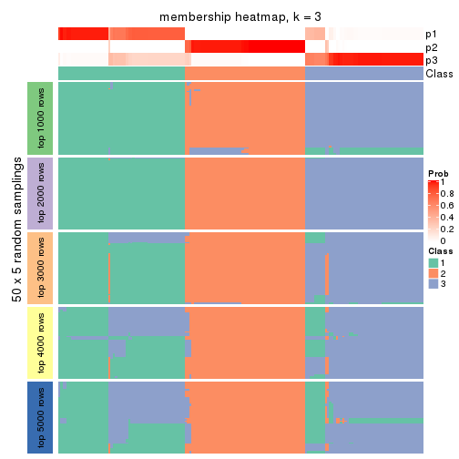</p>

</div>
<div id='tab-CV-kmeans-membership-heatmap-3'>
<pre><code class="r">membership_heatmap(res, k = 4)
</code></pre>

<p></p>

</div>
<div id='tab-CV-kmeans-membership-heatmap-4'>
<pre><code class="r">membership_heatmap(res, k = 5)
</code></pre>

<p></p>

</div>
<div id='tab-CV-kmeans-membership-heatmap-5'>
<pre><code class="r">membership_heatmap(res, k = 6)
</code></pre>

<p></p>

</div>
</div>

As soon as we have had the classes for columns, we can look for signatures
which are significantly different between classes which can be candidate marks
for certain classes. Following are the heatmaps for signatures.


Signature heatmaps where rows are scaled:


<script>
$( function() {
	$( '#tabs-CV-kmeans-get-signatures' ).tabs();
} );
</script>
<div id='tabs-CV-kmeans-get-signatures'>
<ul>
<li><a href='#tab-CV-kmeans-get-signatures-1'>k = 2</a></li>
<li><a href='#tab-CV-kmeans-get-signatures-2'>k = 3</a></li>
<li><a href='#tab-CV-kmeans-get-signatures-3'>k = 4</a></li>
<li><a href='#tab-CV-kmeans-get-signatures-4'>k = 5</a></li>
<li><a href='#tab-CV-kmeans-get-signatures-5'>k = 6</a></li>
</ul>
<div id='tab-CV-kmeans-get-signatures-1'>
<pre><code class="r">get_signatures(res, k = 2)
</code></pre>

<p></p>

</div>
<div id='tab-CV-kmeans-get-signatures-2'>
<pre><code class="r">get_signatures(res, k = 3)
</code></pre>

<p></p>

</div>
<div id='tab-CV-kmeans-get-signatures-3'>
<pre><code class="r">get_signatures(res, k = 4)
</code></pre>

<p></p>

</div>
<div id='tab-CV-kmeans-get-signatures-4'>
<pre><code class="r">get_signatures(res, k = 5)
</code></pre>

<p>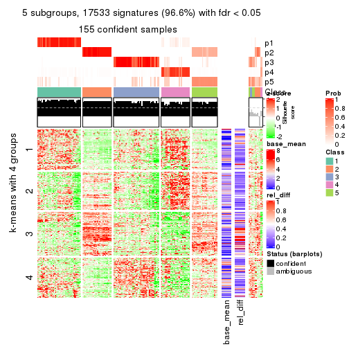</p>

</div>
<div id='tab-CV-kmeans-get-signatures-5'>
<pre><code class="r">get_signatures(res, k = 6)
</code></pre>

<p></p>

</div>
</div>


Signature heatmaps where rows are not scaled:


<script>
$( function() {
	$( '#tabs-CV-kmeans-get-signatures-no-scale' ).tabs();
} );
</script>
<div id='tabs-CV-kmeans-get-signatures-no-scale'>
<ul>
<li><a href='#tab-CV-kmeans-get-signatures-no-scale-1'>k = 2</a></li>
<li><a href='#tab-CV-kmeans-get-signatures-no-scale-2'>k = 3</a></li>
<li><a href='#tab-CV-kmeans-get-signatures-no-scale-3'>k = 4</a></li>
<li><a href='#tab-CV-kmeans-get-signatures-no-scale-4'>k = 5</a></li>
<li><a href='#tab-CV-kmeans-get-signatures-no-scale-5'>k = 6</a></li>
</ul>
<div id='tab-CV-kmeans-get-signatures-no-scale-1'>
<pre><code class="r">get_signatures(res, k = 2, scale_rows = FALSE)
</code></pre>

<p></p>

</div>
<div id='tab-CV-kmeans-get-signatures-no-scale-2'>
<pre><code class="r">get_signatures(res, k = 3, scale_rows = FALSE)
</code></pre>

<p></p>

</div>
<div id='tab-CV-kmeans-get-signatures-no-scale-3'>
<pre><code class="r">get_signatures(res, k = 4, scale_rows = FALSE)
</code></pre>

<p></p>

</div>
<div id='tab-CV-kmeans-get-signatures-no-scale-4'>
<pre><code class="r">get_signatures(res, k = 5, scale_rows = FALSE)
</code></pre>

<p></p>

</div>
<div id='tab-CV-kmeans-get-signatures-no-scale-5'>
<pre><code class="r">get_signatures(res, k = 6, scale_rows = FALSE)
</code></pre>

<p></p>

</div>
</div>


Compare the overlap of signatures from different k:

```r
compare_signatures(res)
```


`get_signature()` returns a data frame invisibly. TO get the list of signatures, the function
call should be assigned to a variable explicitly. In following code, if `plot` argument is set
to `FALSE`, no heatmap is plotted while only the differential analysis is performed.

```r
# code only for demonstration
tb = get_signature(res, k = ..., plot = FALSE)
```

An example of the output of `tb` is:

```
#>   which_row         fdr    mean_1    mean_2 scaled_mean_1 scaled_mean_2 km
#> 1        38 0.042760348  8.373488  9.131774    -0.5533452     0.5164555  1
#> 2        40 0.018707592  7.106213  8.469186    -0.6173731     0.5762149  1
#> 3        55 0.019134737 10.221463 11.207825    -0.6159697     0.5749050  1
#> 4        59 0.006059896  5.921854  7.869574    -0.6899429     0.6439467  1
#> 5        60 0.018055526  8.928898 10.211722    -0.6204761     0.5791110  1
#> 6        98 0.009384629 15.714769 14.887706     0.6635654    -0.6193277  2
...
```

The columns in `tb` are:

1. `which_row`: row indices corresponding to the input matrix.
2. `fdr`: FDR for the differential test. 
3. `mean_x`: The mean value in group x.
4. `scaled_mean_x`: The mean value in group x after rows are scaled.
5. `km`: Row groups if k-means clustering is applied to rows.


UMAP plot which shows how samples are separated.


<script>
$( function() {
	$( '#tabs-CV-kmeans-dimension-reduction' ).tabs();
} );
</script>
<div id='tabs-CV-kmeans-dimension-reduction'>
<ul>
<li><a href='#tab-CV-kmeans-dimension-reduction-1'>k = 2</a></li>
<li><a href='#tab-CV-kmeans-dimension-reduction-2'>k = 3</a></li>
<li><a href='#tab-CV-kmeans-dimension-reduction-3'>k = 4</a></li>
<li><a href='#tab-CV-kmeans-dimension-reduction-4'>k = 5</a></li>
<li><a href='#tab-CV-kmeans-dimension-reduction-5'>k = 6</a></li>
</ul>
<div id='tab-CV-kmeans-dimension-reduction-1'>
<pre><code class="r">dimension_reduction(res, k = 2, method = &quot;UMAP&quot;)
</code></pre>

<p></p>

</div>
<div id='tab-CV-kmeans-dimension-reduction-2'>
<pre><code class="r">dimension_reduction(res, k = 3, method = &quot;UMAP&quot;)
</code></pre>

<p></p>

</div>
<div id='tab-CV-kmeans-dimension-reduction-3'>
<pre><code class="r">dimension_reduction(res, k = 4, method = &quot;UMAP&quot;)
</code></pre>

<p></p>

</div>
<div id='tab-CV-kmeans-dimension-reduction-4'>
<pre><code class="r">dimension_reduction(res, k = 5, method = &quot;UMAP&quot;)
</code></pre>

<p></p>

</div>
<div id='tab-CV-kmeans-dimension-reduction-5'>
<pre><code class="r">dimension_reduction(res, k = 6, method = &quot;UMAP&quot;)
</code></pre>

<p></p>

</div>
</div>


Following heatmap shows how subgroups are split when increasing `k`:

```r
collect_classes(res)
```


If matrix rows can be associated to genes, consider to use `functional_enrichment(res,
...)` to perform function enrichment for the signature genes. See [this vignette](http://bioconductor.org/packages/devel/bioc/vignettes/cola/inst/doc/functional_enrichment.html) for more detailed explanations.


 

---------------------------------------------------


### CV:skmeans**


The object with results only for a single top-value method and a single partition method 
can be extracted as:

```r
res = res_list["CV", "skmeans"]
# you can also extract it by
# res = res_list["CV:skmeans"]
```

A summary of `res` and all the functions that can be applied to it:

```r
res
```

```
#> A 'ConsensusPartition' object with k = 2, 3, 4, 5, 6.
#>   On a matrix with 18147 rows and 167 columns.
#>   Top rows (1000, 2000, 3000, 4000, 5000) are extracted by 'CV' method.
#>   Subgroups are detected by 'skmeans' method.
#>   Performed in total 1250 partitions by row resampling.
#>   Best k for subgroups seems to be 5.
#> 
#> Following methods can be applied to this 'ConsensusPartition' object:
#>  [1] "cola_report"             "collect_classes"         "collect_plots"          
#>  [4] "collect_stats"           "colnames"                "compare_signatures"     
#>  [7] "consensus_heatmap"       "dimension_reduction"     "functional_enrichment"  
#> [10] "get_anno_col"            "get_anno"                "get_classes"            
#> [13] "get_consensus"           "get_matrix"              "get_membership"         
#> [16] "get_param"               "get_signatures"          "get_stats"              
#> [19] "is_best_k"               "is_stable_k"             "membership_heatmap"     
#> [22] "ncol"                    "nrow"                    "plot_ecdf"              
#> [25] "rownames"                "select_partition_number" "show"                   
#> [28] "suggest_best_k"          "test_to_known_factors"
```

`collect_plots()` function collects all the plots made from `res` for all `k` (number of partitions)
into one single page to provide an easy and fast comparison between different `k`.

```r
collect_plots(res)
```


The plots are:

- The first row: a plot of the ECDF (empirical cumulative distribution
  function) curves of the consensus matrix for each `k` and the heatmap of
  predicted classes for each `k`.
- The second row: heatmaps of the consensus matrix for each `k`.
- The third row: heatmaps of the membership matrix for each `k`.
- The fouth row: heatmaps of the signatures for each `k`.

All the plots in panels can be made by individual functions and they are
plotted later in this section.

`select_partition_number()` produces several plots showing different
statistics for choosing "optimized" `k`. There are following statistics:

- ECDF curves of the consensus matrix for each `k`;
- 1-PAC. [The PAC
  score](https://en.wikipedia.org/wiki/Consensus_clustering#Over-interpretation_potential_of_consensus_clustering)
  measures the proportion of the ambiguous subgrouping.
- Mean silhouette score.
- Concordance. The mean probability of fiting the consensus class ids in all
  partitions.
- Area increased. Denote $A_k$ as the area under the ECDF curve for current
  `k`, the area increased is defined as $A_k - A_{k-1}$.
- Rand index. The percent of pairs of samples that are both in a same cluster
  or both are not in a same cluster in the partition of k and k-1.
- Jaccard index. The ratio of pairs of samples are both in a same cluster in
  the partition of k and k-1 and the pairs of samples are both in a same
  cluster in the partition k or k-1.

The detailed explanations of these statistics can be found in [the _cola_
vignette](http://bioconductor.org/packages/devel/bioc/vignettes/cola/inst/doc/cola.html#toc_13).

Generally speaking, lower PAC score, higher mean silhouette score or higher
concordance corresponds to better partition. Rand index and Jaccard index
measure how similar the current partition is compared to partition with `k-1`.
If they are too similar, we won't accept `k` is better than `k-1`.

```r
select_partition_number(res)
```


The numeric values for all these statistics can be obtained by `get_stats()`.

```r
get_stats(res)
```

```
#>   k 1-PAC mean_silhouette concordance area_increased  Rand Jaccard
#> 2 2 1.000           0.955       0.983         0.4846 0.519   0.519
#> 3 3 1.000           0.980       0.991         0.3795 0.781   0.591
#> 4 4 0.827           0.902       0.911         0.1100 0.865   0.627
#> 5 5 0.982           0.943       0.968         0.0804 0.915   0.686
#> 6 6 0.876           0.702       0.864         0.0347 0.970   0.854
```

`suggest_best_k()` suggests the best $k$ based on these statistics. The rules are as follows:

- All $k$ with Jaccard index larger than 0.95 are removed because increasing
  $k$ does not provide enough extra information. If all $k$ are removed, it is
  marked as no subgroup is detected.
- For all $k$ with 1-PAC score larger than 0.9, the maximal $k$ is taken as
  the best $k$, and other $k$ are marked as optional $k$.
- If it does not fit the second rule. The $k$ with the maximal vote of the
  highest 1-PAC score, highest mean silhouette, and highest concordance is
  taken as the best $k$.

```r
suggest_best_k(res)
```

```
#> [1] 5
#> attr(,"optional")
#> [1] 2 3
```

There is also optional best $k$ = 2 3 that is worth to check.

Following shows the table of the partitions (You need to click the **show/hide
code output** link to see it). The membership matrix (columns with name `p*`)
is inferred by
[`clue::cl_consensus()`](https://www.rdocumentation.org/link/cl_consensus?package=clue)
function with the `SE` method. Basically the value in the membership matrix
represents the probability to belong to a certain group. The finall class
label for an item is determined with the group with highest probability it
belongs to.

In `get_classes()` function, the entropy is calculated from the membership
matrix and the silhouette score is calculated from the consensus matrix.


<script>
$( function() {
	$( '#tabs-CV-skmeans-get-classes' ).tabs();
} );
</script>
<div id='tabs-CV-skmeans-get-classes'>
<ul>
<li><a href='#tab-CV-skmeans-get-classes-1'>k = 2</a></li>
<li><a href='#tab-CV-skmeans-get-classes-2'>k = 3</a></li>
<li><a href='#tab-CV-skmeans-get-classes-3'>k = 4</a></li>
<li><a href='#tab-CV-skmeans-get-classes-4'>k = 5</a></li>
<li><a href='#tab-CV-skmeans-get-classes-5'>k = 6</a></li>
</ul>

<div id='tab-CV-skmeans-get-classes-1'>
<p><a id='tab-CV-skmeans-get-classes-1-a' style='color:#0366d6' href='#'>show/hide code output</a></p>
<pre><code class="r">cbind(get_classes(res, k = 2), get_membership(res, k = 2))
</code></pre>

<pre><code>#&gt;            class entropy silhouette    p1    p2
#&gt; SRR1313062     1  0.0000      0.978 1.000 0.000
#&gt; SRR1313063     1  0.0000      0.978 1.000 0.000
#&gt; SRR1313064     1  0.0000      0.978 1.000 0.000
#&gt; SRR1313065     1  0.0000      0.978 1.000 0.000
#&gt; SRR1313066     1  0.0000      0.978 1.000 0.000
#&gt; SRR1313067     1  0.0000      0.978 1.000 0.000
#&gt; SRR1313068     1  0.0000      0.978 1.000 0.000
#&gt; SRR1313069     1  0.0000      0.978 1.000 0.000
#&gt; SRR1313070     1  0.0000      0.978 1.000 0.000
#&gt; SRR1313071     1  0.0000      0.978 1.000 0.000
#&gt; SRR1313072     1  0.0000      0.978 1.000 0.000
#&gt; SRR1313073     1  0.0000      0.978 1.000 0.000
#&gt; SRR1313074     1  0.0000      0.978 1.000 0.000
#&gt; SRR1313075     1  0.0000      0.978 1.000 0.000
#&gt; SRR1313076     1  0.0000      0.978 1.000 0.000
#&gt; SRR1313077     1  0.0000      0.978 1.000 0.000
#&gt; SRR1313078     1  0.0000      0.978 1.000 0.000
#&gt; SRR1313079     1  0.0000      0.978 1.000 0.000
#&gt; SRR1313080     1  0.0000      0.978 1.000 0.000
#&gt; SRR1313081     1  0.0000      0.978 1.000 0.000
#&gt; SRR1313082     1  0.0000      0.978 1.000 0.000
#&gt; SRR1313083     1  0.0000      0.978 1.000 0.000
#&gt; SRR1313084     1  0.0000      0.978 1.000 0.000
#&gt; SRR1313085     1  0.0000      0.978 1.000 0.000
#&gt; SRR1313086     1  0.0000      0.978 1.000 0.000
#&gt; SRR1313087     1  0.0000      0.978 1.000 0.000
#&gt; SRR1313088     1  0.0000      0.978 1.000 0.000
#&gt; SRR1313089     1  0.0000      0.978 1.000 0.000
#&gt; SRR1313092     1  0.0000      0.978 1.000 0.000
#&gt; SRR1313090     1  0.0000      0.978 1.000 0.000
#&gt; SRR1313091     2  0.0000      0.989 0.000 1.000
#&gt; SRR1313093     1  0.0000      0.978 1.000 0.000
#&gt; SRR1313095     1  0.0000      0.978 1.000 0.000
#&gt; SRR1313096     1  0.0000      0.978 1.000 0.000
#&gt; SRR1313094     1  0.0000      0.978 1.000 0.000
#&gt; SRR1313097     1  0.3733      0.909 0.928 0.072
#&gt; SRR1313099     2  0.0000      0.989 0.000 1.000
#&gt; SRR1313098     1  0.0000      0.978 1.000 0.000
#&gt; SRR1313101     1  0.0376      0.975 0.996 0.004
#&gt; SRR1313102     1  0.0000      0.978 1.000 0.000
#&gt; SRR1313103     2  0.6887      0.766 0.184 0.816
#&gt; SRR1313100     1  0.0000      0.978 1.000 0.000
#&gt; SRR1313105     1  0.2603      0.938 0.956 0.044
#&gt; SRR1313104     1  0.0000      0.978 1.000 0.000
#&gt; SRR1313107     1  0.2423      0.941 0.960 0.040
#&gt; SRR1313106     1  0.9983      0.104 0.524 0.476
#&gt; SRR1313109     2  0.0000      0.989 0.000 1.000
#&gt; SRR1313108     1  0.0000      0.978 1.000 0.000
#&gt; SRR1313111     1  0.0938      0.968 0.988 0.012
#&gt; SRR1313110     1  0.0000      0.978 1.000 0.000
#&gt; SRR1313112     1  0.9833      0.278 0.576 0.424
#&gt; SRR1313113     1  0.6623      0.785 0.828 0.172
#&gt; SRR1313115     1  0.0000      0.978 1.000 0.000
#&gt; SRR1313114     1  0.0000      0.978 1.000 0.000
#&gt; SRR1313117     1  0.0000      0.978 1.000 0.000
#&gt; SRR1313118     1  0.0000      0.978 1.000 0.000
#&gt; SRR1313116     2  0.0000      0.989 0.000 1.000
#&gt; SRR1313120     2  0.9922      0.156 0.448 0.552
#&gt; SRR1313119     1  0.0000      0.978 1.000 0.000
#&gt; SRR1313122     1  0.0000      0.978 1.000 0.000
#&gt; SRR1313124     1  0.0000      0.978 1.000 0.000
#&gt; SRR1313121     1  0.0000      0.978 1.000 0.000
#&gt; SRR1313125     1  0.0000      0.978 1.000 0.000
#&gt; SRR1313127     1  0.0000      0.978 1.000 0.000
#&gt; SRR1313123     1  0.0000      0.978 1.000 0.000
#&gt; SRR1313128     1  0.0000      0.978 1.000 0.000
#&gt; SRR1313126     1  0.0000      0.978 1.000 0.000
#&gt; SRR1313130     2  0.0000      0.989 0.000 1.000
#&gt; SRR1313132     1  0.0000      0.978 1.000 0.000
#&gt; SRR1313129     2  0.3733      0.913 0.072 0.928
#&gt; SRR1313133     1  0.0000      0.978 1.000 0.000
#&gt; SRR1313131     1  0.0000      0.978 1.000 0.000
#&gt; SRR1313134     1  0.0000      0.978 1.000 0.000
#&gt; SRR1313135     1  0.0000      0.978 1.000 0.000
#&gt; SRR1313136     1  0.0000      0.978 1.000 0.000
#&gt; SRR1313137     1  0.0000      0.978 1.000 0.000
#&gt; SRR1313138     1  0.9710      0.331 0.600 0.400
#&gt; SRR1313140     1  0.0000      0.978 1.000 0.000
#&gt; SRR1313141     1  0.0000      0.978 1.000 0.000
#&gt; SRR1313139     1  0.0000      0.978 1.000 0.000
#&gt; SRR1313143     1  0.0000      0.978 1.000 0.000
#&gt; SRR1313142     1  0.0000      0.978 1.000 0.000
#&gt; SRR1313144     1  0.0000      0.978 1.000 0.000
#&gt; SRR1313145     1  0.0000      0.978 1.000 0.000
#&gt; SRR1313146     1  0.0000      0.978 1.000 0.000
#&gt; SRR1313147     1  0.0000      0.978 1.000 0.000
#&gt; SRR1313150     1  0.0000      0.978 1.000 0.000
#&gt; SRR1313149     1  0.0000      0.978 1.000 0.000
#&gt; SRR1313152     1  0.0000      0.978 1.000 0.000
#&gt; SRR1313151     1  0.0000      0.978 1.000 0.000
#&gt; SRR1313154     1  0.0000      0.978 1.000 0.000
#&gt; SRR1313153     1  0.0000      0.978 1.000 0.000
#&gt; SRR1313156     1  0.0000      0.978 1.000 0.000
#&gt; SRR1313155     1  0.0000      0.978 1.000 0.000
#&gt; SRR1313157     1  0.0000      0.978 1.000 0.000
#&gt; SRR1313158     1  0.0000      0.978 1.000 0.000
#&gt; SRR1313161     1  0.0000      0.978 1.000 0.000
#&gt; SRR1313159     2  0.0000      0.989 0.000 1.000
#&gt; SRR1313160     1  0.0000      0.978 1.000 0.000
#&gt; SRR1313162     1  0.0000      0.978 1.000 0.000
#&gt; SRR1313163     1  0.0000      0.978 1.000 0.000
#&gt; SRR1313165     1  0.0000      0.978 1.000 0.000
#&gt; SRR1313166     1  0.0000      0.978 1.000 0.000
#&gt; SRR1313164     1  0.0000      0.978 1.000 0.000
#&gt; SRR1313167     1  0.0000      0.978 1.000 0.000
#&gt; SRR1313168     1  0.0000      0.978 1.000 0.000
#&gt; SRR1313170     2  0.0000      0.989 0.000 1.000
#&gt; SRR1313169     1  0.0000      0.978 1.000 0.000
#&gt; SRR1313172     2  0.0000      0.989 0.000 1.000
#&gt; SRR1313171     1  0.0000      0.978 1.000 0.000
#&gt; SRR1313174     2  0.0000      0.989 0.000 1.000
#&gt; SRR1313173     1  0.0000      0.978 1.000 0.000
#&gt; SRR1313176     2  0.0000      0.989 0.000 1.000
#&gt; SRR1313175     2  0.0000      0.989 0.000 1.000
#&gt; SRR1313178     2  0.0000      0.989 0.000 1.000
#&gt; SRR1313177     2  0.0000      0.989 0.000 1.000
#&gt; SRR1313179     2  0.0000      0.989 0.000 1.000
#&gt; SRR1313180     2  0.0000      0.989 0.000 1.000
#&gt; SRR1313181     2  0.0000      0.989 0.000 1.000
#&gt; SRR1313183     2  0.0000      0.989 0.000 1.000
#&gt; SRR1313182     2  0.0000      0.989 0.000 1.000
#&gt; SRR1313184     2  0.0000      0.989 0.000 1.000
#&gt; SRR1313185     2  0.0000      0.989 0.000 1.000
#&gt; SRR1313188     2  0.0000      0.989 0.000 1.000
#&gt; SRR1313187     2  0.0000      0.989 0.000 1.000
#&gt; SRR1313186     2  0.0000      0.989 0.000 1.000
#&gt; SRR1313189     2  0.0000      0.989 0.000 1.000
#&gt; SRR1313190     2  0.0000      0.989 0.000 1.000
#&gt; SRR1313191     2  0.0000      0.989 0.000 1.000
#&gt; SRR1313192     2  0.0000      0.989 0.000 1.000
#&gt; SRR1313193     2  0.0000      0.989 0.000 1.000
#&gt; SRR1313194     2  0.0000      0.989 0.000 1.000
#&gt; SRR1313195     2  0.0000      0.989 0.000 1.000
#&gt; SRR1313196     2  0.0000      0.989 0.000 1.000
#&gt; SRR1313197     2  0.0000      0.989 0.000 1.000
#&gt; SRR1313198     2  0.0000      0.989 0.000 1.000
#&gt; SRR1313199     2  0.0000      0.989 0.000 1.000
#&gt; SRR1313200     2  0.0000      0.989 0.000 1.000
#&gt; SRR1313201     2  0.0000      0.989 0.000 1.000
#&gt; SRR1313202     2  0.0000      0.989 0.000 1.000
#&gt; SRR1313203     1  0.9977      0.119 0.528 0.472
#&gt; SRR1313204     2  0.0000      0.989 0.000 1.000
#&gt; SRR1313205     2  0.0000      0.989 0.000 1.000
#&gt; SRR1313207     2  0.0000      0.989 0.000 1.000
#&gt; SRR1313208     2  0.0000      0.989 0.000 1.000
#&gt; SRR1313206     2  0.0000      0.989 0.000 1.000
#&gt; SRR1313210     2  0.0000      0.989 0.000 1.000
#&gt; SRR1313209     2  0.0000      0.989 0.000 1.000
#&gt; SRR1313211     2  0.0000      0.989 0.000 1.000
#&gt; SRR1313212     2  0.0000      0.989 0.000 1.000
#&gt; SRR1313214     2  0.0000      0.989 0.000 1.000
#&gt; SRR1313215     2  0.0000      0.989 0.000 1.000
#&gt; SRR1313213     2  0.0000      0.989 0.000 1.000
#&gt; SRR1313216     2  0.0000      0.989 0.000 1.000
#&gt; SRR1313217     2  0.0000      0.989 0.000 1.000
#&gt; SRR1313219     2  0.0000      0.989 0.000 1.000
#&gt; SRR1313220     2  0.0000      0.989 0.000 1.000
#&gt; SRR1313218     2  0.0000      0.989 0.000 1.000
#&gt; SRR1313222     2  0.0000      0.989 0.000 1.000
#&gt; SRR1313221     2  0.0000      0.989 0.000 1.000
#&gt; SRR1313223     2  0.0000      0.989 0.000 1.000
#&gt; SRR1313224     2  0.0000      0.989 0.000 1.000
#&gt; SRR1313225     2  0.0000      0.989 0.000 1.000
#&gt; SRR1313226     2  0.0000      0.989 0.000 1.000
#&gt; SRR1313227     2  0.0000      0.989 0.000 1.000
#&gt; SRR1313228     2  0.0000      0.989 0.000 1.000
#&gt; SRR1313229     2  0.0000      0.989 0.000 1.000
</code></pre>

<script>
$('#tab-CV-skmeans-get-classes-1-a').parent().next().next().hide();
$('#tab-CV-skmeans-get-classes-1-a').click(function(){
  $('#tab-CV-skmeans-get-classes-1-a').parent().next().next().toggle();
  return(false);
});
</script>
</div>

<div id='tab-CV-skmeans-get-classes-2'>
<p><a id='tab-CV-skmeans-get-classes-2-a' style='color:#0366d6' href='#'>show/hide code output</a></p>
<pre><code class="r">cbind(get_classes(res, k = 3), get_membership(res, k = 3))
</code></pre>

<pre><code>#&gt;            class entropy silhouette p1    p2    p3
#&gt; SRR1313062     3   0.000      0.989  0 0.000 1.000
#&gt; SRR1313063     3   0.000      0.989  0 0.000 1.000
#&gt; SRR1313064     1   0.000      1.000  1 0.000 0.000
#&gt; SRR1313065     1   0.000      1.000  1 0.000 0.000
#&gt; SRR1313066     1   0.000      1.000  1 0.000 0.000
#&gt; SRR1313067     3   0.000      0.989  0 0.000 1.000
#&gt; SRR1313068     3   0.000      0.989  0 0.000 1.000
#&gt; SRR1313069     1   0.000      1.000  1 0.000 0.000
#&gt; SRR1313070     1   0.000      1.000  1 0.000 0.000
#&gt; SRR1313071     1   0.000      1.000  1 0.000 0.000
#&gt; SRR1313072     1   0.000      1.000  1 0.000 0.000
#&gt; SRR1313073     1   0.000      1.000  1 0.000 0.000
#&gt; SRR1313074     1   0.000      1.000  1 0.000 0.000
#&gt; SRR1313075     1   0.000      1.000  1 0.000 0.000
#&gt; SRR1313076     3   0.000      0.989  0 0.000 1.000
#&gt; SRR1313077     3   0.000      0.989  0 0.000 1.000
#&gt; SRR1313078     3   0.000      0.989  0 0.000 1.000
#&gt; SRR1313079     1   0.000      1.000  1 0.000 0.000
#&gt; SRR1313080     3   0.000      0.989  0 0.000 1.000
#&gt; SRR1313081     3   0.000      0.989  0 0.000 1.000
#&gt; SRR1313082     1   0.000      1.000  1 0.000 0.000
#&gt; SRR1313083     1   0.000      1.000  1 0.000 0.000
#&gt; SRR1313084     1   0.000      1.000  1 0.000 0.000
#&gt; SRR1313085     1   0.000      1.000  1 0.000 0.000
#&gt; SRR1313086     1   0.000      1.000  1 0.000 0.000
#&gt; SRR1313087     1   0.000      1.000  1 0.000 0.000
#&gt; SRR1313088     1   0.000      1.000  1 0.000 0.000
#&gt; SRR1313089     1   0.000      1.000  1 0.000 0.000
#&gt; SRR1313092     3   0.000      0.989  0 0.000 1.000
#&gt; SRR1313090     3   0.000      0.989  0 0.000 1.000
#&gt; SRR1313091     2   0.000      0.984  0 1.000 0.000
#&gt; SRR1313093     3   0.000      0.989  0 0.000 1.000
#&gt; SRR1313095     3   0.000      0.989  0 0.000 1.000
#&gt; SRR1313096     3   0.000      0.989  0 0.000 1.000
#&gt; SRR1313094     3   0.000      0.989  0 0.000 1.000
#&gt; SRR1313097     3   0.000      0.989  0 0.000 1.000
#&gt; SRR1313099     3   0.000      0.989  0 0.000 1.000
#&gt; SRR1313098     3   0.000      0.989  0 0.000 1.000
#&gt; SRR1313101     3   0.000      0.989  0 0.000 1.000
#&gt; SRR1313102     3   0.000      0.989  0 0.000 1.000
#&gt; SRR1313103     3   0.000      0.989  0 0.000 1.000
#&gt; SRR1313100     3   0.000      0.989  0 0.000 1.000
#&gt; SRR1313105     3   0.000      0.989  0 0.000 1.000
#&gt; SRR1313104     3   0.000      0.989  0 0.000 1.000
#&gt; SRR1313107     3   0.000      0.989  0 0.000 1.000
#&gt; SRR1313106     3   0.000      0.989  0 0.000 1.000
#&gt; SRR1313109     2   0.445      0.768  0 0.808 0.192
#&gt; SRR1313108     3   0.000      0.989  0 0.000 1.000
#&gt; SRR1313111     3   0.000      0.989  0 0.000 1.000
#&gt; SRR1313110     3   0.000      0.989  0 0.000 1.000
#&gt; SRR1313112     3   0.000      0.989  0 0.000 1.000
#&gt; SRR1313113     3   0.000      0.989  0 0.000 1.000
#&gt; SRR1313115     3   0.000      0.989  0 0.000 1.000
#&gt; SRR1313114     3   0.000      0.989  0 0.000 1.000
#&gt; SRR1313117     3   0.000      0.989  0 0.000 1.000
#&gt; SRR1313118     3   0.000      0.989  0 0.000 1.000
#&gt; SRR1313116     3   0.565      0.533  0 0.312 0.688
#&gt; SRR1313120     3   0.000      0.989  0 0.000 1.000
#&gt; SRR1313119     3   0.000      0.989  0 0.000 1.000
#&gt; SRR1313122     3   0.000      0.989  0 0.000 1.000
#&gt; SRR1313124     3   0.000      0.989  0 0.000 1.000
#&gt; SRR1313121     3   0.000      0.989  0 0.000 1.000
#&gt; SRR1313125     3   0.000      0.989  0 0.000 1.000
#&gt; SRR1313127     3   0.000      0.989  0 0.000 1.000
#&gt; SRR1313123     3   0.000      0.989  0 0.000 1.000
#&gt; SRR1313128     1   0.000      1.000  1 0.000 0.000
#&gt; SRR1313126     3   0.000      0.989  0 0.000 1.000
#&gt; SRR1313130     2   0.455      0.756  0 0.800 0.200
#&gt; SRR1313132     1   0.000      1.000  1 0.000 0.000
#&gt; SRR1313129     3   0.000      0.989  0 0.000 1.000
#&gt; SRR1313133     1   0.000      1.000  1 0.000 0.000
#&gt; SRR1313131     3   0.000      0.989  0 0.000 1.000
#&gt; SRR1313134     1   0.000      1.000  1 0.000 0.000
#&gt; SRR1313135     1   0.000      1.000  1 0.000 0.000
#&gt; SRR1313136     1   0.000      1.000  1 0.000 0.000
#&gt; SRR1313137     1   0.000      1.000  1 0.000 0.000
#&gt; SRR1313138     1   0.000      1.000  1 0.000 0.000
#&gt; SRR1313140     1   0.000      1.000  1 0.000 0.000
#&gt; SRR1313141     1   0.000      1.000  1 0.000 0.000
#&gt; SRR1313139     1   0.000      1.000  1 0.000 0.000
#&gt; SRR1313143     1   0.000      1.000  1 0.000 0.000
#&gt; SRR1313142     1   0.000      1.000  1 0.000 0.000
#&gt; SRR1313144     1   0.000      1.000  1 0.000 0.000
#&gt; SRR1313145     1   0.000      1.000  1 0.000 0.000
#&gt; SRR1313146     1   0.000      1.000  1 0.000 0.000
#&gt; SRR1313147     1   0.000      1.000  1 0.000 0.000
#&gt; SRR1313150     1   0.000      1.000  1 0.000 0.000
#&gt; SRR1313149     1   0.000      1.000  1 0.000 0.000
#&gt; SRR1313152     1   0.000      1.000  1 0.000 0.000
#&gt; SRR1313151     1   0.000      1.000  1 0.000 0.000
#&gt; SRR1313154     1   0.000      1.000  1 0.000 0.000
#&gt; SRR1313153     1   0.000      1.000  1 0.000 0.000
#&gt; SRR1313156     1   0.000      1.000  1 0.000 0.000
#&gt; SRR1313155     1   0.000      1.000  1 0.000 0.000
#&gt; SRR1313157     1   0.000      1.000  1 0.000 0.000
#&gt; SRR1313158     1   0.000      1.000  1 0.000 0.000
#&gt; SRR1313161     1   0.000      1.000  1 0.000 0.000
#&gt; SRR1313159     2   0.000      0.984  0 1.000 0.000
#&gt; SRR1313160     1   0.000      1.000  1 0.000 0.000
#&gt; SRR1313162     1   0.000      1.000  1 0.000 0.000
#&gt; SRR1313163     1   0.000      1.000  1 0.000 0.000
#&gt; SRR1313165     1   0.000      1.000  1 0.000 0.000
#&gt; SRR1313166     1   0.000      1.000  1 0.000 0.000
#&gt; SRR1313164     1   0.000      1.000  1 0.000 0.000
#&gt; SRR1313167     1   0.000      1.000  1 0.000 0.000
#&gt; SRR1313168     1   0.000      1.000  1 0.000 0.000
#&gt; SRR1313170     2   0.573      0.535  0 0.676 0.324
#&gt; SRR1313169     1   0.000      1.000  1 0.000 0.000
#&gt; SRR1313172     2   0.418      0.795  0 0.828 0.172
#&gt; SRR1313171     1   0.000      1.000  1 0.000 0.000
#&gt; SRR1313174     2   0.000      0.984  0 1.000 0.000
#&gt; SRR1313173     3   0.000      0.989  0 0.000 1.000
#&gt; SRR1313176     2   0.000      0.984  0 1.000 0.000
#&gt; SRR1313175     2   0.000      0.984  0 1.000 0.000
#&gt; SRR1313178     2   0.000      0.984  0 1.000 0.000
#&gt; SRR1313177     2   0.000      0.984  0 1.000 0.000
#&gt; SRR1313179     2   0.000      0.984  0 1.000 0.000
#&gt; SRR1313180     2   0.000      0.984  0 1.000 0.000
#&gt; SRR1313181     2   0.000      0.984  0 1.000 0.000
#&gt; SRR1313183     2   0.000      0.984  0 1.000 0.000
#&gt; SRR1313182     2   0.000      0.984  0 1.000 0.000
#&gt; SRR1313184     2   0.000      0.984  0 1.000 0.000
#&gt; SRR1313185     2   0.000      0.984  0 1.000 0.000
#&gt; SRR1313188     2   0.000      0.984  0 1.000 0.000
#&gt; SRR1313187     2   0.000      0.984  0 1.000 0.000
#&gt; SRR1313186     2   0.000      0.984  0 1.000 0.000
#&gt; SRR1313189     2   0.000      0.984  0 1.000 0.000
#&gt; SRR1313190     2   0.000      0.984  0 1.000 0.000
#&gt; SRR1313191     2   0.000      0.984  0 1.000 0.000
#&gt; SRR1313192     2   0.000      0.984  0 1.000 0.000
#&gt; SRR1313193     2   0.000      0.984  0 1.000 0.000
#&gt; SRR1313194     2   0.000      0.984  0 1.000 0.000
#&gt; SRR1313195     2   0.000      0.984  0 1.000 0.000
#&gt; SRR1313196     2   0.000      0.984  0 1.000 0.000
#&gt; SRR1313197     2   0.000      0.984  0 1.000 0.000
#&gt; SRR1313198     2   0.000      0.984  0 1.000 0.000
#&gt; SRR1313199     2   0.000      0.984  0 1.000 0.000
#&gt; SRR1313200     2   0.000      0.984  0 1.000 0.000
#&gt; SRR1313201     2   0.000      0.984  0 1.000 0.000
#&gt; SRR1313202     2   0.000      0.984  0 1.000 0.000
#&gt; SRR1313203     3   0.475      0.722  0 0.216 0.784
#&gt; SRR1313204     2   0.000      0.984  0 1.000 0.000
#&gt; SRR1313205     2   0.000      0.984  0 1.000 0.000
#&gt; SRR1313207     2   0.000      0.984  0 1.000 0.000
#&gt; SRR1313208     2   0.000      0.984  0 1.000 0.000
#&gt; SRR1313206     2   0.000      0.984  0 1.000 0.000
#&gt; SRR1313210     2   0.000      0.984  0 1.000 0.000
#&gt; SRR1313209     2   0.000      0.984  0 1.000 0.000
#&gt; SRR1313211     2   0.000      0.984  0 1.000 0.000
#&gt; SRR1313212     2   0.000      0.984  0 1.000 0.000
#&gt; SRR1313214     2   0.000      0.984  0 1.000 0.000
#&gt; SRR1313215     2   0.000      0.984  0 1.000 0.000
#&gt; SRR1313213     2   0.000      0.984  0 1.000 0.000
#&gt; SRR1313216     2   0.000      0.984  0 1.000 0.000
#&gt; SRR1313217     2   0.000      0.984  0 1.000 0.000
#&gt; SRR1313219     2   0.000      0.984  0 1.000 0.000
#&gt; SRR1313220     2   0.000      0.984  0 1.000 0.000
#&gt; SRR1313218     2   0.000      0.984  0 1.000 0.000
#&gt; SRR1313222     2   0.000      0.984  0 1.000 0.000
#&gt; SRR1313221     2   0.000      0.984  0 1.000 0.000
#&gt; SRR1313223     2   0.000      0.984  0 1.000 0.000
#&gt; SRR1313224     2   0.000      0.984  0 1.000 0.000
#&gt; SRR1313225     2   0.000      0.984  0 1.000 0.000
#&gt; SRR1313226     2   0.103      0.963  0 0.976 0.024
#&gt; SRR1313227     2   0.000      0.984  0 1.000 0.000
#&gt; SRR1313228     2   0.000      0.984  0 1.000 0.000
#&gt; SRR1313229     2   0.000      0.984  0 1.000 0.000
</code></pre>

<script>
$('#tab-CV-skmeans-get-classes-2-a').parent().next().next().hide();
$('#tab-CV-skmeans-get-classes-2-a').click(function(){
  $('#tab-CV-skmeans-get-classes-2-a').parent().next().next().toggle();
  return(false);
});
</script>
</div>

<div id='tab-CV-skmeans-get-classes-3'>
<p><a id='tab-CV-skmeans-get-classes-3-a' style='color:#0366d6' href='#'>show/hide code output</a></p>
<pre><code class="r">cbind(get_classes(res, k = 4), get_membership(res, k = 4))
</code></pre>

<pre><code>#&gt;            class entropy silhouette    p1    p2    p3    p4
#&gt; SRR1313062     4  0.3764     0.7721 0.000 0.000 0.216 0.784
#&gt; SRR1313063     4  0.3764     0.7721 0.000 0.000 0.216 0.784
#&gt; SRR1313064     4  0.0000     0.8624 0.000 0.000 0.000 1.000
#&gt; SRR1313065     4  0.0000     0.8624 0.000 0.000 0.000 1.000
#&gt; SRR1313066     4  0.0000     0.8624 0.000 0.000 0.000 1.000
#&gt; SRR1313067     4  0.3764     0.7721 0.000 0.000 0.216 0.784
#&gt; SRR1313068     4  0.3764     0.7721 0.000 0.000 0.216 0.784
#&gt; SRR1313069     4  0.0336     0.8542 0.008 0.000 0.000 0.992
#&gt; SRR1313070     4  0.0000     0.8624 0.000 0.000 0.000 1.000
#&gt; SRR1313071     4  0.0000     0.8624 0.000 0.000 0.000 1.000
#&gt; SRR1313072     4  0.0000     0.8624 0.000 0.000 0.000 1.000
#&gt; SRR1313073     4  0.0000     0.8624 0.000 0.000 0.000 1.000
#&gt; SRR1313074     4  0.0000     0.8624 0.000 0.000 0.000 1.000
#&gt; SRR1313075     4  0.0000     0.8624 0.000 0.000 0.000 1.000
#&gt; SRR1313076     4  0.3764     0.7721 0.000 0.000 0.216 0.784
#&gt; SRR1313077     4  0.3764     0.7721 0.000 0.000 0.216 0.784
#&gt; SRR1313078     4  0.3764     0.7721 0.000 0.000 0.216 0.784
#&gt; SRR1313079     4  0.0000     0.8624 0.000 0.000 0.000 1.000
#&gt; SRR1313080     4  0.3764     0.7721 0.000 0.000 0.216 0.784
#&gt; SRR1313081     4  0.3764     0.7721 0.000 0.000 0.216 0.784
#&gt; SRR1313082     4  0.0000     0.8624 0.000 0.000 0.000 1.000
#&gt; SRR1313083     4  0.0000     0.8624 0.000 0.000 0.000 1.000
#&gt; SRR1313084     4  0.0000     0.8624 0.000 0.000 0.000 1.000
#&gt; SRR1313085     4  0.0000     0.8624 0.000 0.000 0.000 1.000
#&gt; SRR1313086     4  0.0000     0.8624 0.000 0.000 0.000 1.000
#&gt; SRR1313087     4  0.0000     0.8624 0.000 0.000 0.000 1.000
#&gt; SRR1313088     4  0.0000     0.8624 0.000 0.000 0.000 1.000
#&gt; SRR1313089     4  0.0000     0.8624 0.000 0.000 0.000 1.000
#&gt; SRR1313092     3  0.0000     0.9601 0.000 0.000 1.000 0.000
#&gt; SRR1313090     3  0.0000     0.9601 0.000 0.000 1.000 0.000
#&gt; SRR1313091     2  0.3764     0.8878 0.216 0.784 0.000 0.000
#&gt; SRR1313093     3  0.0000     0.9601 0.000 0.000 1.000 0.000
#&gt; SRR1313095     3  0.0000     0.9601 0.000 0.000 1.000 0.000
#&gt; SRR1313096     3  0.0000     0.9601 0.000 0.000 1.000 0.000
#&gt; SRR1313094     3  0.0000     0.9601 0.000 0.000 1.000 0.000
#&gt; SRR1313097     3  0.0000     0.9601 0.000 0.000 1.000 0.000
#&gt; SRR1313099     3  0.0000     0.9601 0.000 0.000 1.000 0.000
#&gt; SRR1313098     3  0.4941     0.0602 0.000 0.000 0.564 0.436
#&gt; SRR1313101     3  0.0000     0.9601 0.000 0.000 1.000 0.000
#&gt; SRR1313102     3  0.0000     0.9601 0.000 0.000 1.000 0.000
#&gt; SRR1313103     3  0.0000     0.9601 0.000 0.000 1.000 0.000
#&gt; SRR1313100     3  0.0000     0.9601 0.000 0.000 1.000 0.000
#&gt; SRR1313105     3  0.0000     0.9601 0.000 0.000 1.000 0.000
#&gt; SRR1313104     3  0.0000     0.9601 0.000 0.000 1.000 0.000
#&gt; SRR1313107     3  0.0000     0.9601 0.000 0.000 1.000 0.000
#&gt; SRR1313106     3  0.0000     0.9601 0.000 0.000 1.000 0.000
#&gt; SRR1313109     3  0.3726     0.7513 0.212 0.000 0.788 0.000
#&gt; SRR1313108     3  0.0000     0.9601 0.000 0.000 1.000 0.000
#&gt; SRR1313111     3  0.0000     0.9601 0.000 0.000 1.000 0.000
#&gt; SRR1313110     3  0.0000     0.9601 0.000 0.000 1.000 0.000
#&gt; SRR1313112     3  0.0000     0.9601 0.000 0.000 1.000 0.000
#&gt; SRR1313113     3  0.0000     0.9601 0.000 0.000 1.000 0.000
#&gt; SRR1313115     3  0.0000     0.9601 0.000 0.000 1.000 0.000
#&gt; SRR1313114     3  0.0000     0.9601 0.000 0.000 1.000 0.000
#&gt; SRR1313117     3  0.0000     0.9601 0.000 0.000 1.000 0.000
#&gt; SRR1313118     3  0.0000     0.9601 0.000 0.000 1.000 0.000
#&gt; SRR1313116     3  0.3764     0.7470 0.216 0.000 0.784 0.000
#&gt; SRR1313120     3  0.0000     0.9601 0.000 0.000 1.000 0.000
#&gt; SRR1313119     3  0.0000     0.9601 0.000 0.000 1.000 0.000
#&gt; SRR1313122     3  0.0000     0.9601 0.000 0.000 1.000 0.000
#&gt; SRR1313124     3  0.0000     0.9601 0.000 0.000 1.000 0.000
#&gt; SRR1313121     3  0.0000     0.9601 0.000 0.000 1.000 0.000
#&gt; SRR1313125     3  0.0000     0.9601 0.000 0.000 1.000 0.000
#&gt; SRR1313127     3  0.0000     0.9601 0.000 0.000 1.000 0.000
#&gt; SRR1313123     3  0.0000     0.9601 0.000 0.000 1.000 0.000
#&gt; SRR1313128     1  0.3764     0.9836 0.784 0.000 0.000 0.216
#&gt; SRR1313126     4  0.3975     0.7460 0.000 0.000 0.240 0.760
#&gt; SRR1313130     3  0.4086     0.7389 0.216 0.008 0.776 0.000
#&gt; SRR1313132     1  0.3764     0.9836 0.784 0.000 0.000 0.216
#&gt; SRR1313129     3  0.0000     0.9601 0.000 0.000 1.000 0.000
#&gt; SRR1313133     1  0.3764     0.9836 0.784 0.000 0.000 0.216
#&gt; SRR1313131     4  0.4134     0.7207 0.000 0.000 0.260 0.740
#&gt; SRR1313134     1  0.3801     0.9795 0.780 0.000 0.000 0.220
#&gt; SRR1313135     1  0.3764     0.9836 0.784 0.000 0.000 0.216
#&gt; SRR1313136     1  0.3764     0.9836 0.784 0.000 0.000 0.216
#&gt; SRR1313137     1  0.3764     0.9836 0.784 0.000 0.000 0.216
#&gt; SRR1313138     1  0.3764     0.9836 0.784 0.000 0.000 0.216
#&gt; SRR1313140     1  0.3907     0.9661 0.768 0.000 0.000 0.232
#&gt; SRR1313141     4  0.2011     0.7619 0.080 0.000 0.000 0.920
#&gt; SRR1313139     1  0.3764     0.9836 0.784 0.000 0.000 0.216
#&gt; SRR1313143     4  0.0000     0.8624 0.000 0.000 0.000 1.000
#&gt; SRR1313142     1  0.3764     0.9836 0.784 0.000 0.000 0.216
#&gt; SRR1313144     1  0.3764     0.9836 0.784 0.000 0.000 0.216
#&gt; SRR1313145     1  0.3764     0.9836 0.784 0.000 0.000 0.216
#&gt; SRR1313146     1  0.3764     0.9836 0.784 0.000 0.000 0.216
#&gt; SRR1313147     1  0.3764     0.9836 0.784 0.000 0.000 0.216
#&gt; SRR1313150     1  0.3764     0.9836 0.784 0.000 0.000 0.216
#&gt; SRR1313149     1  0.3764     0.9836 0.784 0.000 0.000 0.216
#&gt; SRR1313152     1  0.3764     0.9836 0.784 0.000 0.000 0.216
#&gt; SRR1313151     1  0.3764     0.9836 0.784 0.000 0.000 0.216
#&gt; SRR1313154     1  0.3764     0.9836 0.784 0.000 0.000 0.216
#&gt; SRR1313153     1  0.3764     0.9836 0.784 0.000 0.000 0.216
#&gt; SRR1313156     1  0.3764     0.9836 0.784 0.000 0.000 0.216
#&gt; SRR1313155     1  0.3764     0.9836 0.784 0.000 0.000 0.216
#&gt; SRR1313157     1  0.3764     0.9836 0.784 0.000 0.000 0.216
#&gt; SRR1313158     1  0.3764     0.9836 0.784 0.000 0.000 0.216
#&gt; SRR1313161     1  0.3764     0.9836 0.784 0.000 0.000 0.216
#&gt; SRR1313159     1  0.0000     0.6986 1.000 0.000 0.000 0.000
#&gt; SRR1313160     1  0.3764     0.9836 0.784 0.000 0.000 0.216
#&gt; SRR1313162     1  0.3908     0.9786 0.784 0.000 0.004 0.212
#&gt; SRR1313163     1  0.3764     0.9836 0.784 0.000 0.000 0.216
#&gt; SRR1313165     1  0.3764     0.9836 0.784 0.000 0.000 0.216
#&gt; SRR1313166     1  0.3764     0.9836 0.784 0.000 0.000 0.216
#&gt; SRR1313164     1  0.3764     0.9836 0.784 0.000 0.000 0.216
#&gt; SRR1313167     1  0.4941     0.6373 0.564 0.000 0.000 0.436
#&gt; SRR1313168     1  0.3764     0.9836 0.784 0.000 0.000 0.216
#&gt; SRR1313170     3  0.3764     0.7470 0.216 0.000 0.784 0.000
#&gt; SRR1313169     1  0.3764     0.9836 0.784 0.000 0.000 0.216
#&gt; SRR1313172     2  0.1940     0.8735 0.000 0.924 0.076 0.000
#&gt; SRR1313171     1  0.3764     0.9836 0.784 0.000 0.000 0.216
#&gt; SRR1313174     2  0.3649     0.8898 0.204 0.796 0.000 0.000
#&gt; SRR1313173     4  0.3764     0.7721 0.000 0.000 0.216 0.784
#&gt; SRR1313176     2  0.0000     0.9111 0.000 1.000 0.000 0.000
#&gt; SRR1313175     2  0.3764     0.8878 0.216 0.784 0.000 0.000
#&gt; SRR1313178     2  0.0000     0.9111 0.000 1.000 0.000 0.000
#&gt; SRR1313177     2  0.0000     0.9111 0.000 1.000 0.000 0.000
#&gt; SRR1313179     2  0.0000     0.9111 0.000 1.000 0.000 0.000
#&gt; SRR1313180     2  0.3764     0.8878 0.216 0.784 0.000 0.000
#&gt; SRR1313181     2  0.0000     0.9111 0.000 1.000 0.000 0.000
#&gt; SRR1313183     2  0.0000     0.9111 0.000 1.000 0.000 0.000
#&gt; SRR1313182     2  0.1716     0.9057 0.064 0.936 0.000 0.000
#&gt; SRR1313184     2  0.0000     0.9111 0.000 1.000 0.000 0.000
#&gt; SRR1313185     2  0.3688     0.8892 0.208 0.792 0.000 0.000
#&gt; SRR1313188     2  0.3764     0.8878 0.216 0.784 0.000 0.000
#&gt; SRR1313187     2  0.3764     0.8878 0.216 0.784 0.000 0.000
#&gt; SRR1313186     2  0.3764     0.8878 0.216 0.784 0.000 0.000
#&gt; SRR1313189     2  0.0000     0.9111 0.000 1.000 0.000 0.000
#&gt; SRR1313190     2  0.0000     0.9111 0.000 1.000 0.000 0.000
#&gt; SRR1313191     2  0.0000     0.9111 0.000 1.000 0.000 0.000
#&gt; SRR1313192     2  0.0000     0.9111 0.000 1.000 0.000 0.000
#&gt; SRR1313193     2  0.0000     0.9111 0.000 1.000 0.000 0.000
#&gt; SRR1313194     2  0.3764     0.8878 0.216 0.784 0.000 0.000
#&gt; SRR1313195     2  0.3764     0.8878 0.216 0.784 0.000 0.000
#&gt; SRR1313196     2  0.3764     0.8878 0.216 0.784 0.000 0.000
#&gt; SRR1313197     2  0.3764     0.8878 0.216 0.784 0.000 0.000
#&gt; SRR1313198     2  0.3764     0.8878 0.216 0.784 0.000 0.000
#&gt; SRR1313199     2  0.0000     0.9111 0.000 1.000 0.000 0.000
#&gt; SRR1313200     2  0.3764     0.8878 0.216 0.784 0.000 0.000
#&gt; SRR1313201     2  0.0000     0.9111 0.000 1.000 0.000 0.000
#&gt; SRR1313202     2  0.3764     0.8878 0.216 0.784 0.000 0.000
#&gt; SRR1313203     4  0.4011     0.7261 0.000 0.208 0.008 0.784
#&gt; SRR1313204     2  0.0000     0.9111 0.000 1.000 0.000 0.000
#&gt; SRR1313205     2  0.0000     0.9111 0.000 1.000 0.000 0.000
#&gt; SRR1313207     2  0.0000     0.9111 0.000 1.000 0.000 0.000
#&gt; SRR1313208     2  0.0000     0.9111 0.000 1.000 0.000 0.000
#&gt; SRR1313206     2  0.0000     0.9111 0.000 1.000 0.000 0.000
#&gt; SRR1313210     2  0.3764     0.8878 0.216 0.784 0.000 0.000
#&gt; SRR1313209     2  0.3764     0.8878 0.216 0.784 0.000 0.000
#&gt; SRR1313211     2  0.3688     0.8892 0.208 0.792 0.000 0.000
#&gt; SRR1313212     2  0.0000     0.9111 0.000 1.000 0.000 0.000
#&gt; SRR1313214     2  0.3764     0.8878 0.216 0.784 0.000 0.000
#&gt; SRR1313215     2  0.3764     0.8878 0.216 0.784 0.000 0.000
#&gt; SRR1313213     2  0.0000     0.9111 0.000 1.000 0.000 0.000
#&gt; SRR1313216     2  0.3764     0.8878 0.216 0.784 0.000 0.000
#&gt; SRR1313217     2  0.3764     0.8878 0.216 0.784 0.000 0.000
#&gt; SRR1313219     2  0.3764     0.8878 0.216 0.784 0.000 0.000
#&gt; SRR1313220     2  0.0000     0.9111 0.000 1.000 0.000 0.000
#&gt; SRR1313218     2  0.0000     0.9111 0.000 1.000 0.000 0.000
#&gt; SRR1313222     2  0.0000     0.9111 0.000 1.000 0.000 0.000
#&gt; SRR1313221     2  0.0000     0.9111 0.000 1.000 0.000 0.000
#&gt; SRR1313223     2  0.0000     0.9111 0.000 1.000 0.000 0.000
#&gt; SRR1313224     2  0.0000     0.9111 0.000 1.000 0.000 0.000
#&gt; SRR1313225     2  0.3764     0.8878 0.216 0.784 0.000 0.000
#&gt; SRR1313226     2  0.4818     0.8622 0.216 0.748 0.036 0.000
#&gt; SRR1313227     2  0.0000     0.9111 0.000 1.000 0.000 0.000
#&gt; SRR1313228     2  0.0000     0.9111 0.000 1.000 0.000 0.000
#&gt; SRR1313229     2  0.0000     0.9111 0.000 1.000 0.000 0.000
</code></pre>

<script>
$('#tab-CV-skmeans-get-classes-3-a').parent().next().next().hide();
$('#tab-CV-skmeans-get-classes-3-a').click(function(){
  $('#tab-CV-skmeans-get-classes-3-a').parent().next().next().toggle();
  return(false);
});
</script>
</div>

<div id='tab-CV-skmeans-get-classes-4'>
<p><a id='tab-CV-skmeans-get-classes-4-a' style='color:#0366d6' href='#'>show/hide code output</a></p>
<pre><code class="r">cbind(get_classes(res, k = 5), get_membership(res, k = 5))
</code></pre>

<pre><code>#&gt;            class entropy silhouette    p1    p2    p3    p4    p5
#&gt; SRR1313062     4  0.0898      0.946 0.000 0.000 0.008 0.972 0.020
#&gt; SRR1313063     4  0.0898      0.946 0.000 0.000 0.008 0.972 0.020
#&gt; SRR1313064     4  0.0510      0.953 0.016 0.000 0.000 0.984 0.000
#&gt; SRR1313065     4  0.0609      0.952 0.020 0.000 0.000 0.980 0.000
#&gt; SRR1313066     4  0.0290      0.953 0.008 0.000 0.000 0.992 0.000
#&gt; SRR1313067     4  0.1012      0.945 0.000 0.000 0.012 0.968 0.020
#&gt; SRR1313068     4  0.2144      0.903 0.000 0.000 0.068 0.912 0.020
#&gt; SRR1313069     4  0.2280      0.870 0.120 0.000 0.000 0.880 0.000
#&gt; SRR1313070     4  0.0510      0.953 0.016 0.000 0.000 0.984 0.000
#&gt; SRR1313071     4  0.0510      0.953 0.016 0.000 0.000 0.984 0.000
#&gt; SRR1313072     4  0.0290      0.953 0.008 0.000 0.000 0.992 0.000
#&gt; SRR1313073     4  0.0162      0.952 0.004 0.000 0.000 0.996 0.000
#&gt; SRR1313074     4  0.0510      0.953 0.016 0.000 0.000 0.984 0.000
#&gt; SRR1313075     4  0.0510      0.953 0.016 0.000 0.000 0.984 0.000
#&gt; SRR1313076     4  0.1117      0.943 0.000 0.000 0.016 0.964 0.020
#&gt; SRR1313077     4  0.1012      0.945 0.000 0.000 0.012 0.968 0.020
#&gt; SRR1313078     4  0.1012      0.945 0.000 0.000 0.012 0.968 0.020
#&gt; SRR1313079     4  0.0290      0.953 0.008 0.000 0.000 0.992 0.000
#&gt; SRR1313080     4  0.1943      0.914 0.000 0.000 0.056 0.924 0.020
#&gt; SRR1313081     4  0.0898      0.946 0.000 0.000 0.008 0.972 0.020
#&gt; SRR1313082     4  0.0609      0.952 0.020 0.000 0.000 0.980 0.000
#&gt; SRR1313083     4  0.0510      0.953 0.016 0.000 0.000 0.984 0.000
#&gt; SRR1313084     4  0.0290      0.953 0.008 0.000 0.000 0.992 0.000
#&gt; SRR1313085     4  0.0510      0.953 0.016 0.000 0.000 0.984 0.000
#&gt; SRR1313086     4  0.0703      0.950 0.024 0.000 0.000 0.976 0.000
#&gt; SRR1313087     4  0.0162      0.952 0.004 0.000 0.000 0.996 0.000
#&gt; SRR1313088     4  0.1043      0.940 0.040 0.000 0.000 0.960 0.000
#&gt; SRR1313089     4  0.0510      0.953 0.016 0.000 0.000 0.984 0.000
#&gt; SRR1313092     3  0.0162      0.955 0.000 0.000 0.996 0.000 0.004
#&gt; SRR1313090     3  0.0162      0.955 0.000 0.000 0.996 0.000 0.004
#&gt; SRR1313091     5  0.1026      0.948 0.000 0.004 0.024 0.004 0.968
#&gt; SRR1313093     3  0.0162      0.955 0.000 0.000 0.996 0.000 0.004
#&gt; SRR1313095     3  0.0771      0.945 0.000 0.000 0.976 0.004 0.020
#&gt; SRR1313096     3  0.1012      0.942 0.000 0.000 0.968 0.012 0.020
#&gt; SRR1313094     3  0.0162      0.955 0.000 0.000 0.996 0.000 0.004
#&gt; SRR1313097     3  0.0162      0.955 0.000 0.000 0.996 0.000 0.004
#&gt; SRR1313099     3  0.0566      0.949 0.000 0.000 0.984 0.004 0.012
#&gt; SRR1313098     3  0.4821      0.125 0.000 0.000 0.516 0.464 0.020
#&gt; SRR1313101     3  0.0162      0.955 0.000 0.000 0.996 0.000 0.004
#&gt; SRR1313102     3  0.0000      0.954 0.000 0.000 1.000 0.000 0.000
#&gt; SRR1313103     3  0.0451      0.951 0.000 0.000 0.988 0.004 0.008
#&gt; SRR1313100     3  0.1012      0.942 0.000 0.000 0.968 0.012 0.020
#&gt; SRR1313105     3  0.0162      0.955 0.000 0.000 0.996 0.000 0.004
#&gt; SRR1313104     3  0.0000      0.954 0.000 0.000 1.000 0.000 0.000
#&gt; SRR1313107     3  0.0162      0.955 0.000 0.000 0.996 0.000 0.004
#&gt; SRR1313106     3  0.0162      0.955 0.000 0.000 0.996 0.000 0.004
#&gt; SRR1313109     5  0.3266      0.759 0.000 0.000 0.200 0.004 0.796
#&gt; SRR1313108     3  0.0671      0.947 0.000 0.000 0.980 0.004 0.016
#&gt; SRR1313111     3  0.0162      0.955 0.000 0.000 0.996 0.000 0.004
#&gt; SRR1313110     3  0.1018      0.942 0.000 0.000 0.968 0.016 0.016
#&gt; SRR1313112     3  0.0162      0.955 0.000 0.000 0.996 0.000 0.004
#&gt; SRR1313113     3  0.0162      0.955 0.000 0.000 0.996 0.000 0.004
#&gt; SRR1313115     3  0.0000      0.954 0.000 0.000 1.000 0.000 0.000
#&gt; SRR1313114     3  0.1117      0.939 0.000 0.000 0.964 0.016 0.020
#&gt; SRR1313117     3  0.0162      0.955 0.000 0.000 0.996 0.000 0.004
#&gt; SRR1313118     3  0.1012      0.942 0.000 0.000 0.968 0.012 0.020
#&gt; SRR1313116     5  0.0703      0.948 0.000 0.000 0.024 0.000 0.976
#&gt; SRR1313120     3  0.0451      0.951 0.000 0.000 0.988 0.004 0.008
#&gt; SRR1313119     3  0.0162      0.955 0.000 0.000 0.996 0.000 0.004
#&gt; SRR1313122     3  0.1012      0.942 0.000 0.000 0.968 0.012 0.020
#&gt; SRR1313124     3  0.0162      0.955 0.000 0.000 0.996 0.000 0.004
#&gt; SRR1313121     3  0.0000      0.954 0.000 0.000 1.000 0.000 0.000
#&gt; SRR1313125     3  0.0162      0.955 0.000 0.000 0.996 0.000 0.004
#&gt; SRR1313127     3  0.1117      0.939 0.000 0.000 0.964 0.016 0.020
#&gt; SRR1313123     3  0.0000      0.954 0.000 0.000 1.000 0.000 0.000
#&gt; SRR1313128     1  0.0000      0.987 1.000 0.000 0.000 0.000 0.000
#&gt; SRR1313126     3  0.4651      0.393 0.000 0.000 0.608 0.372 0.020
#&gt; SRR1313130     5  0.3333      0.747 0.000 0.000 0.208 0.004 0.788
#&gt; SRR1313132     1  0.0162      0.985 0.996 0.000 0.000 0.000 0.004
#&gt; SRR1313129     3  0.0290      0.953 0.000 0.000 0.992 0.000 0.008
#&gt; SRR1313133     1  0.0000      0.987 1.000 0.000 0.000 0.000 0.000
#&gt; SRR1313131     3  0.4639      0.403 0.000 0.000 0.612 0.368 0.020
#&gt; SRR1313134     1  0.0000      0.987 1.000 0.000 0.000 0.000 0.000
#&gt; SRR1313135     1  0.0000      0.987 1.000 0.000 0.000 0.000 0.000
#&gt; SRR1313136     1  0.0000      0.987 1.000 0.000 0.000 0.000 0.000
#&gt; SRR1313137     1  0.0000      0.987 1.000 0.000 0.000 0.000 0.000
#&gt; SRR1313138     1  0.0162      0.985 0.996 0.000 0.000 0.000 0.004
#&gt; SRR1313140     1  0.1043      0.950 0.960 0.000 0.000 0.040 0.000
#&gt; SRR1313141     4  0.4211      0.478 0.360 0.000 0.000 0.636 0.004
#&gt; SRR1313139     1  0.0162      0.984 0.996 0.000 0.000 0.004 0.000
#&gt; SRR1313143     4  0.2338      0.882 0.112 0.000 0.000 0.884 0.004
#&gt; SRR1313142     1  0.0000      0.987 1.000 0.000 0.000 0.000 0.000
#&gt; SRR1313144     1  0.0162      0.985 0.996 0.000 0.000 0.000 0.004
#&gt; SRR1313145     1  0.0000      0.987 1.000 0.000 0.000 0.000 0.000
#&gt; SRR1313146     1  0.0000      0.987 1.000 0.000 0.000 0.000 0.000
#&gt; SRR1313147     1  0.0000      0.987 1.000 0.000 0.000 0.000 0.000
#&gt; SRR1313150     1  0.0000      0.987 1.000 0.000 0.000 0.000 0.000
#&gt; SRR1313149     1  0.0000      0.987 1.000 0.000 0.000 0.000 0.000
#&gt; SRR1313152     1  0.0000      0.987 1.000 0.000 0.000 0.000 0.000
#&gt; SRR1313151     1  0.0000      0.987 1.000 0.000 0.000 0.000 0.000
#&gt; SRR1313154     1  0.0000      0.987 1.000 0.000 0.000 0.000 0.000
#&gt; SRR1313153     1  0.0000      0.987 1.000 0.000 0.000 0.000 0.000
#&gt; SRR1313156     1  0.0162      0.985 0.996 0.000 0.000 0.000 0.004
#&gt; SRR1313155     1  0.0000      0.987 1.000 0.000 0.000 0.000 0.000
#&gt; SRR1313157     1  0.0000      0.987 1.000 0.000 0.000 0.000 0.000
#&gt; SRR1313158     1  0.0000      0.987 1.000 0.000 0.000 0.000 0.000
#&gt; SRR1313161     1  0.0162      0.984 0.996 0.000 0.000 0.004 0.000
#&gt; SRR1313159     1  0.0671      0.973 0.980 0.000 0.000 0.004 0.016
#&gt; SRR1313160     1  0.0000      0.987 1.000 0.000 0.000 0.000 0.000
#&gt; SRR1313162     1  0.2069      0.906 0.912 0.000 0.000 0.076 0.012
#&gt; SRR1313163     1  0.0000      0.987 1.000 0.000 0.000 0.000 0.000
#&gt; SRR1313165     1  0.0000      0.987 1.000 0.000 0.000 0.000 0.000
#&gt; SRR1313166     1  0.0000      0.987 1.000 0.000 0.000 0.000 0.000
#&gt; SRR1313164     1  0.0162      0.985 0.996 0.000 0.000 0.000 0.004
#&gt; SRR1313167     1  0.3774      0.561 0.704 0.000 0.000 0.296 0.000
#&gt; SRR1313168     1  0.0000      0.987 1.000 0.000 0.000 0.000 0.000
#&gt; SRR1313170     5  0.3123      0.781 0.000 0.000 0.184 0.004 0.812
#&gt; SRR1313169     1  0.0000      0.987 1.000 0.000 0.000 0.000 0.000
#&gt; SRR1313172     2  0.2054      0.907 0.000 0.916 0.072 0.008 0.004
#&gt; SRR1313171     1  0.0162      0.985 0.996 0.000 0.000 0.000 0.004
#&gt; SRR1313174     5  0.1043      0.966 0.000 0.040 0.000 0.000 0.960
#&gt; SRR1313173     4  0.2144      0.903 0.000 0.000 0.068 0.912 0.020
#&gt; SRR1313176     2  0.0000      0.992 0.000 1.000 0.000 0.000 0.000
#&gt; SRR1313175     5  0.0880      0.972 0.000 0.032 0.000 0.000 0.968
#&gt; SRR1313178     2  0.0000      0.992 0.000 1.000 0.000 0.000 0.000
#&gt; SRR1313177     2  0.0000      0.992 0.000 1.000 0.000 0.000 0.000
#&gt; SRR1313179     2  0.0451      0.983 0.000 0.988 0.000 0.004 0.008
#&gt; SRR1313180     5  0.0880      0.972 0.000 0.032 0.000 0.000 0.968
#&gt; SRR1313181     2  0.0000      0.992 0.000 1.000 0.000 0.000 0.000
#&gt; SRR1313183     2  0.0000      0.992 0.000 1.000 0.000 0.000 0.000
#&gt; SRR1313182     2  0.2424      0.845 0.000 0.868 0.000 0.000 0.132
#&gt; SRR1313184     2  0.0451      0.983 0.000 0.988 0.000 0.004 0.008
#&gt; SRR1313185     5  0.0880      0.972 0.000 0.032 0.000 0.000 0.968
#&gt; SRR1313188     5  0.0880      0.972 0.000 0.032 0.000 0.000 0.968
#&gt; SRR1313187     5  0.0880      0.972 0.000 0.032 0.000 0.000 0.968
#&gt; SRR1313186     5  0.0880      0.972 0.000 0.032 0.000 0.000 0.968
#&gt; SRR1313189     2  0.0000      0.992 0.000 1.000 0.000 0.000 0.000
#&gt; SRR1313190     2  0.0000      0.992 0.000 1.000 0.000 0.000 0.000
#&gt; SRR1313191     2  0.0290      0.985 0.000 0.992 0.000 0.000 0.008
#&gt; SRR1313192     2  0.0000      0.992 0.000 1.000 0.000 0.000 0.000
#&gt; SRR1313193     2  0.0000      0.992 0.000 1.000 0.000 0.000 0.000
#&gt; SRR1313194     5  0.0880      0.972 0.000 0.032 0.000 0.000 0.968
#&gt; SRR1313195     5  0.0880      0.972 0.000 0.032 0.000 0.000 0.968
#&gt; SRR1313196     5  0.0880      0.972 0.000 0.032 0.000 0.000 0.968
#&gt; SRR1313197     5  0.0880      0.972 0.000 0.032 0.000 0.000 0.968
#&gt; SRR1313198     5  0.0880      0.972 0.000 0.032 0.000 0.000 0.968
#&gt; SRR1313199     2  0.0000      0.992 0.000 1.000 0.000 0.000 0.000
#&gt; SRR1313200     5  0.0880      0.972 0.000 0.032 0.000 0.000 0.968
#&gt; SRR1313201     2  0.0000      0.992 0.000 1.000 0.000 0.000 0.000
#&gt; SRR1313202     5  0.0880      0.972 0.000 0.032 0.000 0.000 0.968
#&gt; SRR1313203     4  0.4208      0.678 0.000 0.248 0.004 0.728 0.020
#&gt; SRR1313204     2  0.0000      0.992 0.000 1.000 0.000 0.000 0.000
#&gt; SRR1313205     2  0.0000      0.992 0.000 1.000 0.000 0.000 0.000
#&gt; SRR1313207     2  0.0000      0.992 0.000 1.000 0.000 0.000 0.000
#&gt; SRR1313208     2  0.0000      0.992 0.000 1.000 0.000 0.000 0.000
#&gt; SRR1313206     2  0.0000      0.992 0.000 1.000 0.000 0.000 0.000
#&gt; SRR1313210     5  0.0880      0.972 0.000 0.032 0.000 0.000 0.968
#&gt; SRR1313209     5  0.0880      0.972 0.000 0.032 0.000 0.000 0.968
#&gt; SRR1313211     5  0.0963      0.969 0.000 0.036 0.000 0.000 0.964
#&gt; SRR1313212     2  0.0000      0.992 0.000 1.000 0.000 0.000 0.000
#&gt; SRR1313214     5  0.0880      0.972 0.000 0.032 0.000 0.000 0.968
#&gt; SRR1313215     5  0.0880      0.972 0.000 0.032 0.000 0.000 0.968
#&gt; SRR1313213     2  0.0000      0.992 0.000 1.000 0.000 0.000 0.000
#&gt; SRR1313216     5  0.0880      0.972 0.000 0.032 0.000 0.000 0.968
#&gt; SRR1313217     5  0.0880      0.972 0.000 0.032 0.000 0.000 0.968
#&gt; SRR1313219     5  0.0880      0.972 0.000 0.032 0.000 0.000 0.968
#&gt; SRR1313220     2  0.0000      0.992 0.000 1.000 0.000 0.000 0.000
#&gt; SRR1313218     2  0.0000      0.992 0.000 1.000 0.000 0.000 0.000
#&gt; SRR1313222     2  0.0000      0.992 0.000 1.000 0.000 0.000 0.000
#&gt; SRR1313221     2  0.0000      0.992 0.000 1.000 0.000 0.000 0.000
#&gt; SRR1313223     2  0.0000      0.992 0.000 1.000 0.000 0.000 0.000
#&gt; SRR1313224     2  0.0000      0.992 0.000 1.000 0.000 0.000 0.000
#&gt; SRR1313225     5  0.0880      0.972 0.000 0.032 0.000 0.000 0.968
#&gt; SRR1313226     5  0.0771      0.951 0.000 0.004 0.020 0.000 0.976
#&gt; SRR1313227     2  0.0000      0.992 0.000 1.000 0.000 0.000 0.000
#&gt; SRR1313228     2  0.0000      0.992 0.000 1.000 0.000 0.000 0.000
#&gt; SRR1313229     2  0.0000      0.992 0.000 1.000 0.000 0.000 0.000
</code></pre>

<script>
$('#tab-CV-skmeans-get-classes-4-a').parent().next().next().hide();
$('#tab-CV-skmeans-get-classes-4-a').click(function(){
  $('#tab-CV-skmeans-get-classes-4-a').parent().next().next().toggle();
  return(false);
});
</script>
</div>

<div id='tab-CV-skmeans-get-classes-5'>
<p><a id='tab-CV-skmeans-get-classes-5-a' style='color:#0366d6' href='#'>show/hide code output</a></p>
<pre><code class="r">cbind(get_classes(res, k = 6), get_membership(res, k = 6))
</code></pre>

<pre><code>#&gt;            class entropy silhouette    p1    p2    p3    p4    p5    p6
#&gt; SRR1313062     4  0.3860     0.3281 0.000 0.000 0.000 0.528 0.000 0.472
#&gt; SRR1313063     4  0.3862     0.3227 0.000 0.000 0.000 0.524 0.000 0.476
#&gt; SRR1313064     4  0.0000     0.7610 0.000 0.000 0.000 1.000 0.000 0.000
#&gt; SRR1313065     4  0.0790     0.7458 0.032 0.000 0.000 0.968 0.000 0.000
#&gt; SRR1313066     4  0.0000     0.7610 0.000 0.000 0.000 1.000 0.000 0.000
#&gt; SRR1313067     4  0.3860     0.3281 0.000 0.000 0.000 0.528 0.000 0.472
#&gt; SRR1313068     4  0.4594     0.2298 0.000 0.000 0.036 0.488 0.000 0.476
#&gt; SRR1313069     4  0.1501     0.7129 0.076 0.000 0.000 0.924 0.000 0.000
#&gt; SRR1313070     4  0.0000     0.7610 0.000 0.000 0.000 1.000 0.000 0.000
#&gt; SRR1313071     4  0.0000     0.7610 0.000 0.000 0.000 1.000 0.000 0.000
#&gt; SRR1313072     4  0.0000     0.7610 0.000 0.000 0.000 1.000 0.000 0.000
#&gt; SRR1313073     4  0.0260     0.7577 0.000 0.000 0.000 0.992 0.000 0.008
#&gt; SRR1313074     4  0.0000     0.7610 0.000 0.000 0.000 1.000 0.000 0.000
#&gt; SRR1313075     4  0.0000     0.7610 0.000 0.000 0.000 1.000 0.000 0.000
#&gt; SRR1313076     4  0.4471     0.2606 0.000 0.000 0.028 0.500 0.000 0.472
#&gt; SRR1313077     4  0.3860     0.3281 0.000 0.000 0.000 0.528 0.000 0.472
#&gt; SRR1313078     4  0.3860     0.3281 0.000 0.000 0.000 0.528 0.000 0.472
#&gt; SRR1313079     4  0.0000     0.7610 0.000 0.000 0.000 1.000 0.000 0.000
#&gt; SRR1313080     4  0.4534     0.2415 0.000 0.000 0.032 0.492 0.000 0.476
#&gt; SRR1313081     4  0.3860     0.3281 0.000 0.000 0.000 0.528 0.000 0.472
#&gt; SRR1313082     4  0.0547     0.7524 0.020 0.000 0.000 0.980 0.000 0.000
#&gt; SRR1313083     4  0.0260     0.7580 0.008 0.000 0.000 0.992 0.000 0.000
#&gt; SRR1313084     4  0.0000     0.7610 0.000 0.000 0.000 1.000 0.000 0.000
#&gt; SRR1313085     4  0.0000     0.7610 0.000 0.000 0.000 1.000 0.000 0.000
#&gt; SRR1313086     4  0.0790     0.7458 0.032 0.000 0.000 0.968 0.000 0.000
#&gt; SRR1313087     4  0.0146     0.7590 0.000 0.000 0.000 0.996 0.000 0.004
#&gt; SRR1313088     4  0.0790     0.7458 0.032 0.000 0.000 0.968 0.000 0.000
#&gt; SRR1313089     4  0.0000     0.7610 0.000 0.000 0.000 1.000 0.000 0.000
#&gt; SRR1313092     3  0.0146     0.6542 0.000 0.000 0.996 0.000 0.000 0.004
#&gt; SRR1313090     3  0.0146     0.6542 0.000 0.000 0.996 0.000 0.000 0.004
#&gt; SRR1313091     5  0.5699     0.3066 0.000 0.000 0.172 0.000 0.484 0.344
#&gt; SRR1313093     3  0.0146     0.6542 0.000 0.000 0.996 0.000 0.000 0.004
#&gt; SRR1313095     3  0.3765    -0.1759 0.000 0.000 0.596 0.000 0.000 0.404
#&gt; SRR1313096     3  0.3864    -0.3519 0.000 0.000 0.520 0.000 0.000 0.480
#&gt; SRR1313094     3  0.0146     0.6552 0.000 0.000 0.996 0.000 0.000 0.004
#&gt; SRR1313097     3  0.2454     0.5827 0.000 0.000 0.840 0.000 0.000 0.160
#&gt; SRR1313099     3  0.3620     0.4083 0.000 0.000 0.648 0.000 0.000 0.352
#&gt; SRR1313098     6  0.5532     0.4681 0.000 0.000 0.384 0.136 0.000 0.480
#&gt; SRR1313101     3  0.0146     0.6551 0.000 0.000 0.996 0.000 0.000 0.004
#&gt; SRR1313102     3  0.1610     0.6261 0.000 0.000 0.916 0.000 0.000 0.084
#&gt; SRR1313103     3  0.3592     0.4172 0.000 0.000 0.656 0.000 0.000 0.344
#&gt; SRR1313100     3  0.4091    -0.3574 0.000 0.000 0.520 0.008 0.000 0.472
#&gt; SRR1313105     3  0.2048     0.6095 0.000 0.000 0.880 0.000 0.000 0.120
#&gt; SRR1313104     3  0.0632     0.6401 0.000 0.000 0.976 0.000 0.000 0.024
#&gt; SRR1313107     3  0.2664     0.5644 0.000 0.000 0.816 0.000 0.000 0.184
#&gt; SRR1313106     3  0.0458     0.6528 0.000 0.000 0.984 0.000 0.000 0.016
#&gt; SRR1313109     3  0.5523     0.2393 0.000 0.000 0.500 0.000 0.140 0.360
#&gt; SRR1313108     3  0.3309     0.1984 0.000 0.000 0.720 0.000 0.000 0.280
#&gt; SRR1313111     3  0.2048     0.6095 0.000 0.000 0.880 0.000 0.000 0.120
#&gt; SRR1313110     3  0.4136    -0.2709 0.000 0.000 0.560 0.012 0.000 0.428
#&gt; SRR1313112     3  0.0146     0.6551 0.000 0.000 0.996 0.000 0.000 0.004
#&gt; SRR1313113     3  0.1075     0.6425 0.000 0.000 0.952 0.000 0.000 0.048
#&gt; SRR1313115     3  0.0632     0.6401 0.000 0.000 0.976 0.000 0.000 0.024
#&gt; SRR1313114     3  0.4089    -0.3478 0.000 0.000 0.524 0.008 0.000 0.468
#&gt; SRR1313117     3  0.0146     0.6551 0.000 0.000 0.996 0.000 0.000 0.004
#&gt; SRR1313118     3  0.3989    -0.3374 0.000 0.000 0.528 0.004 0.000 0.468
#&gt; SRR1313116     5  0.0937     0.9532 0.000 0.000 0.000 0.000 0.960 0.040
#&gt; SRR1313120     3  0.3515     0.4380 0.000 0.000 0.676 0.000 0.000 0.324
#&gt; SRR1313119     3  0.0146     0.6542 0.000 0.000 0.996 0.000 0.000 0.004
#&gt; SRR1313122     3  0.3862    -0.3443 0.000 0.000 0.524 0.000 0.000 0.476
#&gt; SRR1313124     3  0.0146     0.6542 0.000 0.000 0.996 0.000 0.000 0.004
#&gt; SRR1313121     3  0.0363     0.6493 0.000 0.000 0.988 0.000 0.000 0.012
#&gt; SRR1313125     3  0.0000     0.6547 0.000 0.000 1.000 0.000 0.000 0.000
#&gt; SRR1313127     3  0.4089    -0.3478 0.000 0.000 0.524 0.008 0.000 0.468
#&gt; SRR1313123     3  0.0146     0.6542 0.000 0.000 0.996 0.000 0.000 0.004
#&gt; SRR1313128     1  0.1124     0.9059 0.956 0.000 0.000 0.008 0.000 0.036
#&gt; SRR1313126     6  0.4947     0.4105 0.000 0.000 0.456 0.064 0.000 0.480
#&gt; SRR1313130     3  0.5659     0.2275 0.000 0.000 0.488 0.000 0.164 0.348
#&gt; SRR1313132     1  0.3266     0.7644 0.728 0.000 0.000 0.000 0.000 0.272
#&gt; SRR1313129     3  0.3409     0.4610 0.000 0.000 0.700 0.000 0.000 0.300
#&gt; SRR1313133     1  0.2300     0.8622 0.856 0.000 0.000 0.000 0.000 0.144
#&gt; SRR1313131     6  0.4990     0.4191 0.000 0.000 0.452 0.068 0.000 0.480
#&gt; SRR1313134     1  0.1657     0.8889 0.928 0.000 0.000 0.056 0.000 0.016
#&gt; SRR1313135     1  0.0458     0.9112 0.984 0.000 0.000 0.016 0.000 0.000
#&gt; SRR1313136     1  0.0458     0.9112 0.984 0.000 0.000 0.016 0.000 0.000
#&gt; SRR1313137     1  0.0363     0.9113 0.988 0.000 0.000 0.012 0.000 0.000
#&gt; SRR1313138     1  0.2454     0.8526 0.840 0.000 0.000 0.000 0.000 0.160
#&gt; SRR1313140     1  0.3052     0.7202 0.780 0.000 0.000 0.216 0.000 0.004
#&gt; SRR1313141     1  0.4646     0.0984 0.500 0.000 0.000 0.460 0.000 0.040
#&gt; SRR1313139     1  0.1910     0.8502 0.892 0.000 0.000 0.108 0.000 0.000
#&gt; SRR1313143     4  0.3351     0.6238 0.160 0.000 0.000 0.800 0.000 0.040
#&gt; SRR1313142     1  0.1471     0.8972 0.932 0.000 0.000 0.004 0.000 0.064
#&gt; SRR1313144     1  0.2454     0.8526 0.840 0.000 0.000 0.000 0.000 0.160
#&gt; SRR1313145     1  0.0363     0.9113 0.988 0.000 0.000 0.012 0.000 0.000
#&gt; SRR1313146     1  0.0458     0.9112 0.984 0.000 0.000 0.016 0.000 0.000
#&gt; SRR1313147     1  0.0458     0.9112 0.984 0.000 0.000 0.016 0.000 0.000
#&gt; SRR1313150     1  0.0713     0.9047 0.972 0.000 0.000 0.000 0.000 0.028
#&gt; SRR1313149     1  0.1444     0.8945 0.928 0.000 0.000 0.000 0.000 0.072
#&gt; SRR1313152     1  0.0363     0.9113 0.988 0.000 0.000 0.012 0.000 0.000
#&gt; SRR1313151     1  0.0458     0.9112 0.984 0.000 0.000 0.016 0.000 0.000
#&gt; SRR1313154     1  0.0146     0.9099 0.996 0.000 0.000 0.004 0.000 0.000
#&gt; SRR1313153     1  0.2491     0.8511 0.836 0.000 0.000 0.000 0.000 0.164
#&gt; SRR1313156     1  0.2454     0.8526 0.840 0.000 0.000 0.000 0.000 0.160
#&gt; SRR1313155     1  0.0458     0.9112 0.984 0.000 0.000 0.016 0.000 0.000
#&gt; SRR1313157     1  0.0458     0.9112 0.984 0.000 0.000 0.016 0.000 0.000
#&gt; SRR1313158     1  0.0363     0.9113 0.988 0.000 0.000 0.012 0.000 0.000
#&gt; SRR1313161     1  0.1327     0.8887 0.936 0.000 0.000 0.064 0.000 0.000
#&gt; SRR1313159     1  0.3979     0.5270 0.540 0.000 0.000 0.000 0.004 0.456
#&gt; SRR1313160     1  0.0458     0.9112 0.984 0.000 0.000 0.016 0.000 0.000
#&gt; SRR1313162     1  0.3766     0.7055 0.684 0.000 0.000 0.012 0.000 0.304
#&gt; SRR1313163     1  0.0000     0.9090 1.000 0.000 0.000 0.000 0.000 0.000
#&gt; SRR1313165     1  0.0363     0.9113 0.988 0.000 0.000 0.012 0.000 0.000
#&gt; SRR1313166     1  0.0458     0.9112 0.984 0.000 0.000 0.016 0.000 0.000
#&gt; SRR1313164     1  0.2527     0.8483 0.832 0.000 0.000 0.000 0.000 0.168
#&gt; SRR1313167     4  0.3838     0.0498 0.448 0.000 0.000 0.552 0.000 0.000
#&gt; SRR1313168     1  0.0363     0.9113 0.988 0.000 0.000 0.012 0.000 0.000
#&gt; SRR1313170     6  0.4789    -0.3297 0.016 0.000 0.448 0.000 0.024 0.512
#&gt; SRR1313169     1  0.1007     0.8992 0.956 0.000 0.000 0.044 0.000 0.000
#&gt; SRR1313172     2  0.1921     0.8793 0.000 0.916 0.052 0.000 0.000 0.032
#&gt; SRR1313171     1  0.2260     0.8655 0.860 0.000 0.000 0.000 0.000 0.140
#&gt; SRR1313174     5  0.0363     0.9641 0.000 0.012 0.000 0.000 0.988 0.000
#&gt; SRR1313173     6  0.5750     0.1497 0.000 0.000 0.184 0.336 0.000 0.480
#&gt; SRR1313176     2  0.0000     0.9519 0.000 1.000 0.000 0.000 0.000 0.000
#&gt; SRR1313175     5  0.0000     0.9719 0.000 0.000 0.000 0.000 1.000 0.000
#&gt; SRR1313178     2  0.0000     0.9519 0.000 1.000 0.000 0.000 0.000 0.000
#&gt; SRR1313177     2  0.0000     0.9519 0.000 1.000 0.000 0.000 0.000 0.000
#&gt; SRR1313179     2  0.4076     0.4654 0.008 0.540 0.000 0.000 0.000 0.452
#&gt; SRR1313180     5  0.0458     0.9701 0.000 0.000 0.000 0.000 0.984 0.016
#&gt; SRR1313181     2  0.0000     0.9519 0.000 1.000 0.000 0.000 0.000 0.000
#&gt; SRR1313183     2  0.0000     0.9519 0.000 1.000 0.000 0.000 0.000 0.000
#&gt; SRR1313182     2  0.2941     0.7236 0.000 0.780 0.000 0.000 0.220 0.000
#&gt; SRR1313184     2  0.3833     0.4867 0.000 0.556 0.000 0.000 0.000 0.444
#&gt; SRR1313185     5  0.0363     0.9641 0.000 0.012 0.000 0.000 0.988 0.000
#&gt; SRR1313188     5  0.0458     0.9701 0.000 0.000 0.000 0.000 0.984 0.016
#&gt; SRR1313187     5  0.0458     0.9701 0.000 0.000 0.000 0.000 0.984 0.016
#&gt; SRR1313186     5  0.0000     0.9719 0.000 0.000 0.000 0.000 1.000 0.000
#&gt; SRR1313189     2  0.0000     0.9519 0.000 1.000 0.000 0.000 0.000 0.000
#&gt; SRR1313190     2  0.0000     0.9519 0.000 1.000 0.000 0.000 0.000 0.000
#&gt; SRR1313191     2  0.3198     0.6626 0.000 0.740 0.000 0.000 0.260 0.000
#&gt; SRR1313192     2  0.0000     0.9519 0.000 1.000 0.000 0.000 0.000 0.000
#&gt; SRR1313193     2  0.0000     0.9519 0.000 1.000 0.000 0.000 0.000 0.000
#&gt; SRR1313194     5  0.0458     0.9701 0.000 0.000 0.000 0.000 0.984 0.016
#&gt; SRR1313195     5  0.0458     0.9701 0.000 0.000 0.000 0.000 0.984 0.016
#&gt; SRR1313196     5  0.0458     0.9701 0.000 0.000 0.000 0.000 0.984 0.016
#&gt; SRR1313197     5  0.0000     0.9719 0.000 0.000 0.000 0.000 1.000 0.000
#&gt; SRR1313198     5  0.0000     0.9719 0.000 0.000 0.000 0.000 1.000 0.000
#&gt; SRR1313199     2  0.0000     0.9519 0.000 1.000 0.000 0.000 0.000 0.000
#&gt; SRR1313200     5  0.0458     0.9701 0.000 0.000 0.000 0.000 0.984 0.016
#&gt; SRR1313201     2  0.0000     0.9519 0.000 1.000 0.000 0.000 0.000 0.000
#&gt; SRR1313202     5  0.0146     0.9717 0.000 0.000 0.000 0.000 0.996 0.004
#&gt; SRR1313203     4  0.5951     0.2384 0.000 0.192 0.004 0.448 0.000 0.356
#&gt; SRR1313204     2  0.0000     0.9519 0.000 1.000 0.000 0.000 0.000 0.000
#&gt; SRR1313205     2  0.0363     0.9445 0.000 0.988 0.000 0.000 0.012 0.000
#&gt; SRR1313207     2  0.0000     0.9519 0.000 1.000 0.000 0.000 0.000 0.000
#&gt; SRR1313208     2  0.0260     0.9472 0.000 0.992 0.000 0.000 0.008 0.000
#&gt; SRR1313206     2  0.0146     0.9496 0.000 0.996 0.000 0.000 0.004 0.000
#&gt; SRR1313210     5  0.0000     0.9719 0.000 0.000 0.000 0.000 1.000 0.000
#&gt; SRR1313209     5  0.0000     0.9719 0.000 0.000 0.000 0.000 1.000 0.000
#&gt; SRR1313211     5  0.0632     0.9526 0.000 0.024 0.000 0.000 0.976 0.000
#&gt; SRR1313212     2  0.0000     0.9519 0.000 1.000 0.000 0.000 0.000 0.000
#&gt; SRR1313214     5  0.0000     0.9719 0.000 0.000 0.000 0.000 1.000 0.000
#&gt; SRR1313215     5  0.0260     0.9714 0.000 0.000 0.000 0.000 0.992 0.008
#&gt; SRR1313213     2  0.0000     0.9519 0.000 1.000 0.000 0.000 0.000 0.000
#&gt; SRR1313216     5  0.0000     0.9719 0.000 0.000 0.000 0.000 1.000 0.000
#&gt; SRR1313217     5  0.0260     0.9714 0.000 0.000 0.000 0.000 0.992 0.008
#&gt; SRR1313219     5  0.0000     0.9719 0.000 0.000 0.000 0.000 1.000 0.000
#&gt; SRR1313220     2  0.0000     0.9519 0.000 1.000 0.000 0.000 0.000 0.000
#&gt; SRR1313218     2  0.0790     0.9295 0.000 0.968 0.000 0.000 0.032 0.000
#&gt; SRR1313222     2  0.0000     0.9519 0.000 1.000 0.000 0.000 0.000 0.000
#&gt; SRR1313221     2  0.0000     0.9519 0.000 1.000 0.000 0.000 0.000 0.000
#&gt; SRR1313223     2  0.0000     0.9519 0.000 1.000 0.000 0.000 0.000 0.000
#&gt; SRR1313224     2  0.0000     0.9519 0.000 1.000 0.000 0.000 0.000 0.000
#&gt; SRR1313225     5  0.0000     0.9719 0.000 0.000 0.000 0.000 1.000 0.000
#&gt; SRR1313226     5  0.0458     0.9701 0.000 0.000 0.000 0.000 0.984 0.016
#&gt; SRR1313227     2  0.0000     0.9519 0.000 1.000 0.000 0.000 0.000 0.000
#&gt; SRR1313228     2  0.0000     0.9519 0.000 1.000 0.000 0.000 0.000 0.000
#&gt; SRR1313229     2  0.0000     0.9519 0.000 1.000 0.000 0.000 0.000 0.000
</code></pre>

<script>
$('#tab-CV-skmeans-get-classes-5-a').parent().next().next().hide();
$('#tab-CV-skmeans-get-classes-5-a').click(function(){
  $('#tab-CV-skmeans-get-classes-5-a').parent().next().next().toggle();
  return(false);
});
</script>
</div>
</div>

Heatmaps for the consensus matrix. It visualizes the probability of two
samples to be in a same group.


<script>
$( function() {
	$( '#tabs-CV-skmeans-consensus-heatmap' ).tabs();
} );
</script>
<div id='tabs-CV-skmeans-consensus-heatmap'>
<ul>
<li><a href='#tab-CV-skmeans-consensus-heatmap-1'>k = 2</a></li>
<li><a href='#tab-CV-skmeans-consensus-heatmap-2'>k = 3</a></li>
<li><a href='#tab-CV-skmeans-consensus-heatmap-3'>k = 4</a></li>
<li><a href='#tab-CV-skmeans-consensus-heatmap-4'>k = 5</a></li>
<li><a href='#tab-CV-skmeans-consensus-heatmap-5'>k = 6</a></li>
</ul>
<div id='tab-CV-skmeans-consensus-heatmap-1'>
<pre><code class="r">consensus_heatmap(res, k = 2)
</code></pre>

<p></p>

</div>
<div id='tab-CV-skmeans-consensus-heatmap-2'>
<pre><code class="r">consensus_heatmap(res, k = 3)
</code></pre>

<p></p>

</div>
<div id='tab-CV-skmeans-consensus-heatmap-3'>
<pre><code class="r">consensus_heatmap(res, k = 4)
</code></pre>

<p></p>

</div>
<div id='tab-CV-skmeans-consensus-heatmap-4'>
<pre><code class="r">consensus_heatmap(res, k = 5)
</code></pre>

<p></p>

</div>
<div id='tab-CV-skmeans-consensus-heatmap-5'>
<pre><code class="r">consensus_heatmap(res, k = 6)
</code></pre>

<p></p>

</div>
</div>

Heatmaps for the membership of samples in all partitions to see how consistent they are:


<script>
$( function() {
	$( '#tabs-CV-skmeans-membership-heatmap' ).tabs();
} );
</script>
<div id='tabs-CV-skmeans-membership-heatmap'>
<ul>
<li><a href='#tab-CV-skmeans-membership-heatmap-1'>k = 2</a></li>
<li><a href='#tab-CV-skmeans-membership-heatmap-2'>k = 3</a></li>
<li><a href='#tab-CV-skmeans-membership-heatmap-3'>k = 4</a></li>
<li><a href='#tab-CV-skmeans-membership-heatmap-4'>k = 5</a></li>
<li><a href='#tab-CV-skmeans-membership-heatmap-5'>k = 6</a></li>
</ul>
<div id='tab-CV-skmeans-membership-heatmap-1'>
<pre><code class="r">membership_heatmap(res, k = 2)
</code></pre>

<p></p>

</div>
<div id='tab-CV-skmeans-membership-heatmap-2'>
<pre><code class="r">membership_heatmap(res, k = 3)
</code></pre>

<p></p>

</div>
<div id='tab-CV-skmeans-membership-heatmap-3'>
<pre><code class="r">membership_heatmap(res, k = 4)
</code></pre>

<p></p>

</div>
<div id='tab-CV-skmeans-membership-heatmap-4'>
<pre><code class="r">membership_heatmap(res, k = 5)
</code></pre>

<p></p>

</div>
<div id='tab-CV-skmeans-membership-heatmap-5'>
<pre><code class="r">membership_heatmap(res, k = 6)
</code></pre>

<p></p>

</div>
</div>

As soon as we have had the classes for columns, we can look for signatures
which are significantly different between classes which can be candidate marks
for certain classes. Following are the heatmaps for signatures.


Signature heatmaps where rows are scaled:


<script>
$( function() {
	$( '#tabs-CV-skmeans-get-signatures' ).tabs();
} );
</script>
<div id='tabs-CV-skmeans-get-signatures'>
<ul>
<li><a href='#tab-CV-skmeans-get-signatures-1'>k = 2</a></li>
<li><a href='#tab-CV-skmeans-get-signatures-2'>k = 3</a></li>
<li><a href='#tab-CV-skmeans-get-signatures-3'>k = 4</a></li>
<li><a href='#tab-CV-skmeans-get-signatures-4'>k = 5</a></li>
<li><a href='#tab-CV-skmeans-get-signatures-5'>k = 6</a></li>
</ul>
<div id='tab-CV-skmeans-get-signatures-1'>
<pre><code class="r">get_signatures(res, k = 2)
</code></pre>

<p></p>

</div>
<div id='tab-CV-skmeans-get-signatures-2'>
<pre><code class="r">get_signatures(res, k = 3)
</code></pre>

<p>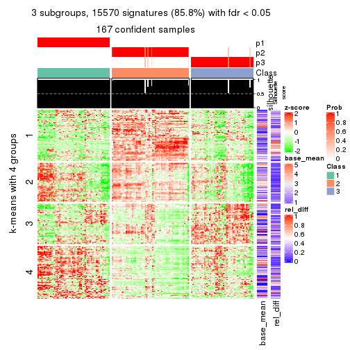</p>

</div>
<div id='tab-CV-skmeans-get-signatures-3'>
<pre><code class="r">get_signatures(res, k = 4)
</code></pre>

<p></p>

</div>
<div id='tab-CV-skmeans-get-signatures-4'>
<pre><code class="r">get_signatures(res, k = 5)
</code></pre>

<p></p>

</div>
<div id='tab-CV-skmeans-get-signatures-5'>
<pre><code class="r">get_signatures(res, k = 6)
</code></pre>

<p></p>

</div>
</div>


Signature heatmaps where rows are not scaled:


<script>
$( function() {
	$( '#tabs-CV-skmeans-get-signatures-no-scale' ).tabs();
} );
</script>
<div id='tabs-CV-skmeans-get-signatures-no-scale'>
<ul>
<li><a href='#tab-CV-skmeans-get-signatures-no-scale-1'>k = 2</a></li>
<li><a href='#tab-CV-skmeans-get-signatures-no-scale-2'>k = 3</a></li>
<li><a href='#tab-CV-skmeans-get-signatures-no-scale-3'>k = 4</a></li>
<li><a href='#tab-CV-skmeans-get-signatures-no-scale-4'>k = 5</a></li>
<li><a href='#tab-CV-skmeans-get-signatures-no-scale-5'>k = 6</a></li>
</ul>
<div id='tab-CV-skmeans-get-signatures-no-scale-1'>
<pre><code class="r">get_signatures(res, k = 2, scale_rows = FALSE)
</code></pre>

<p></p>

</div>
<div id='tab-CV-skmeans-get-signatures-no-scale-2'>
<pre><code class="r">get_signatures(res, k = 3, scale_rows = FALSE)
</code></pre>

<p></p>

</div>
<div id='tab-CV-skmeans-get-signatures-no-scale-3'>
<pre><code class="r">get_signatures(res, k = 4, scale_rows = FALSE)
</code></pre>

<p></p>

</div>
<div id='tab-CV-skmeans-get-signatures-no-scale-4'>
<pre><code class="r">get_signatures(res, k = 5, scale_rows = FALSE)
</code></pre>

<p></p>

</div>
<div id='tab-CV-skmeans-get-signatures-no-scale-5'>
<pre><code class="r">get_signatures(res, k = 6, scale_rows = FALSE)
</code></pre>

<p></p>

</div>
</div>


Compare the overlap of signatures from different k:

```r
compare_signatures(res)
```


`get_signature()` returns a data frame invisibly. TO get the list of signatures, the function
call should be assigned to a variable explicitly. In following code, if `plot` argument is set
to `FALSE`, no heatmap is plotted while only the differential analysis is performed.

```r
# code only for demonstration
tb = get_signature(res, k = ..., plot = FALSE)
```

An example of the output of `tb` is:

```
#>   which_row         fdr    mean_1    mean_2 scaled_mean_1 scaled_mean_2 km
#> 1        38 0.042760348  8.373488  9.131774    -0.5533452     0.5164555  1
#> 2        40 0.018707592  7.106213  8.469186    -0.6173731     0.5762149  1
#> 3        55 0.019134737 10.221463 11.207825    -0.6159697     0.5749050  1
#> 4        59 0.006059896  5.921854  7.869574    -0.6899429     0.6439467  1
#> 5        60 0.018055526  8.928898 10.211722    -0.6204761     0.5791110  1
#> 6        98 0.009384629 15.714769 14.887706     0.6635654    -0.6193277  2
...
```

The columns in `tb` are:

1. `which_row`: row indices corresponding to the input matrix.
2. `fdr`: FDR for the differential test. 
3. `mean_x`: The mean value in group x.
4. `scaled_mean_x`: The mean value in group x after rows are scaled.
5. `km`: Row groups if k-means clustering is applied to rows.


UMAP plot which shows how samples are separated.


<script>
$( function() {
	$( '#tabs-CV-skmeans-dimension-reduction' ).tabs();
} );
</script>
<div id='tabs-CV-skmeans-dimension-reduction'>
<ul>
<li><a href='#tab-CV-skmeans-dimension-reduction-1'>k = 2</a></li>
<li><a href='#tab-CV-skmeans-dimension-reduction-2'>k = 3</a></li>
<li><a href='#tab-CV-skmeans-dimension-reduction-3'>k = 4</a></li>
<li><a href='#tab-CV-skmeans-dimension-reduction-4'>k = 5</a></li>
<li><a href='#tab-CV-skmeans-dimension-reduction-5'>k = 6</a></li>
</ul>
<div id='tab-CV-skmeans-dimension-reduction-1'>
<pre><code class="r">dimension_reduction(res, k = 2, method = &quot;UMAP&quot;)
</code></pre>

<p></p>

</div>
<div id='tab-CV-skmeans-dimension-reduction-2'>
<pre><code class="r">dimension_reduction(res, k = 3, method = &quot;UMAP&quot;)
</code></pre>

<p></p>

</div>
<div id='tab-CV-skmeans-dimension-reduction-3'>
<pre><code class="r">dimension_reduction(res, k = 4, method = &quot;UMAP&quot;)
</code></pre>

<p></p>

</div>
<div id='tab-CV-skmeans-dimension-reduction-4'>
<pre><code class="r">dimension_reduction(res, k = 5, method = &quot;UMAP&quot;)
</code></pre>

<p></p>

</div>
<div id='tab-CV-skmeans-dimension-reduction-5'>
<pre><code class="r">dimension_reduction(res, k = 6, method = &quot;UMAP&quot;)
</code></pre>

<p></p>

</div>
</div>


Following heatmap shows how subgroups are split when increasing `k`:

```r
collect_classes(res)
```


If matrix rows can be associated to genes, consider to use `functional_enrichment(res,
...)` to perform function enrichment for the signature genes. See [this vignette](http://bioconductor.org/packages/devel/bioc/vignettes/cola/inst/doc/functional_enrichment.html) for more detailed explanations.


 

---------------------------------------------------


### CV:pam*


The object with results only for a single top-value method and a single partition method 
can be extracted as:

```r
res = res_list["CV", "pam"]
# you can also extract it by
# res = res_list["CV:pam"]
```

A summary of `res` and all the functions that can be applied to it:

```r
res
```

```
#> A 'ConsensusPartition' object with k = 2, 3, 4, 5, 6.
#>   On a matrix with 18147 rows and 167 columns.
#>   Top rows (1000, 2000, 3000, 4000, 5000) are extracted by 'CV' method.
#>   Subgroups are detected by 'pam' method.
#>   Performed in total 1250 partitions by row resampling.
#>   Best k for subgroups seems to be 5.
#> 
#> Following methods can be applied to this 'ConsensusPartition' object:
#>  [1] "cola_report"             "collect_classes"         "collect_plots"          
#>  [4] "collect_stats"           "colnames"                "compare_signatures"     
#>  [7] "consensus_heatmap"       "dimension_reduction"     "functional_enrichment"  
#> [10] "get_anno_col"            "get_anno"                "get_classes"            
#> [13] "get_consensus"           "get_matrix"              "get_membership"         
#> [16] "get_param"               "get_signatures"          "get_stats"              
#> [19] "is_best_k"               "is_stable_k"             "membership_heatmap"     
#> [22] "ncol"                    "nrow"                    "plot_ecdf"              
#> [25] "rownames"                "select_partition_number" "show"                   
#> [28] "suggest_best_k"          "test_to_known_factors"
```

`collect_plots()` function collects all the plots made from `res` for all `k` (number of partitions)
into one single page to provide an easy and fast comparison between different `k`.

```r
collect_plots(res)
```


The plots are:

- The first row: a plot of the ECDF (empirical cumulative distribution
  function) curves of the consensus matrix for each `k` and the heatmap of
  predicted classes for each `k`.
- The second row: heatmaps of the consensus matrix for each `k`.
- The third row: heatmaps of the membership matrix for each `k`.
- The fouth row: heatmaps of the signatures for each `k`.

All the plots in panels can be made by individual functions and they are
plotted later in this section.

`select_partition_number()` produces several plots showing different
statistics for choosing "optimized" `k`. There are following statistics:

- ECDF curves of the consensus matrix for each `k`;
- 1-PAC. [The PAC
  score](https://en.wikipedia.org/wiki/Consensus_clustering#Over-interpretation_potential_of_consensus_clustering)
  measures the proportion of the ambiguous subgrouping.
- Mean silhouette score.
- Concordance. The mean probability of fiting the consensus class ids in all
  partitions.
- Area increased. Denote $A_k$ as the area under the ECDF curve for current
  `k`, the area increased is defined as $A_k - A_{k-1}$.
- Rand index. The percent of pairs of samples that are both in a same cluster
  or both are not in a same cluster in the partition of k and k-1.
- Jaccard index. The ratio of pairs of samples are both in a same cluster in
  the partition of k and k-1 and the pairs of samples are both in a same
  cluster in the partition k or k-1.

The detailed explanations of these statistics can be found in [the _cola_
vignette](http://bioconductor.org/packages/devel/bioc/vignettes/cola/inst/doc/cola.html#toc_13).

Generally speaking, lower PAC score, higher mean silhouette score or higher
concordance corresponds to better partition. Rand index and Jaccard index
measure how similar the current partition is compared to partition with `k-1`.
If they are too similar, we won't accept `k` is better than `k-1`.

```r
select_partition_number(res)
```


The numeric values for all these statistics can be obtained by `get_stats()`.

```r
get_stats(res)
```

```
#>   k 1-PAC mean_silhouette concordance area_increased  Rand Jaccard
#> 2 2 1.000           0.951       0.980         0.4485 0.544   0.544
#> 3 3 0.884           0.855       0.944         0.4841 0.734   0.534
#> 4 4 0.757           0.650       0.801         0.0978 0.903   0.721
#> 5 5 0.915           0.884       0.950         0.0878 0.887   0.615
#> 6 6 0.836           0.689       0.864         0.0277 0.986   0.934
```

`suggest_best_k()` suggests the best $k$ based on these statistics. The rules are as follows:

- All $k$ with Jaccard index larger than 0.95 are removed because increasing
  $k$ does not provide enough extra information. If all $k$ are removed, it is
  marked as no subgroup is detected.
- For all $k$ with 1-PAC score larger than 0.9, the maximal $k$ is taken as
  the best $k$, and other $k$ are marked as optional $k$.
- If it does not fit the second rule. The $k$ with the maximal vote of the
  highest 1-PAC score, highest mean silhouette, and highest concordance is
  taken as the best $k$.

```r
suggest_best_k(res)
```

```
#> [1] 5
#> attr(,"optional")
#> [1] 2
```

There is also optional best $k$ = 2 that is worth to check.

Following shows the table of the partitions (You need to click the **show/hide
code output** link to see it). The membership matrix (columns with name `p*`)
is inferred by
[`clue::cl_consensus()`](https://www.rdocumentation.org/link/cl_consensus?package=clue)
function with the `SE` method. Basically the value in the membership matrix
represents the probability to belong to a certain group. The finall class
label for an item is determined with the group with highest probability it
belongs to.

In `get_classes()` function, the entropy is calculated from the membership
matrix and the silhouette score is calculated from the consensus matrix.


<script>
$( function() {
	$( '#tabs-CV-pam-get-classes' ).tabs();
} );
</script>
<div id='tabs-CV-pam-get-classes'>
<ul>
<li><a href='#tab-CV-pam-get-classes-1'>k = 2</a></li>
<li><a href='#tab-CV-pam-get-classes-2'>k = 3</a></li>
<li><a href='#tab-CV-pam-get-classes-3'>k = 4</a></li>
<li><a href='#tab-CV-pam-get-classes-4'>k = 5</a></li>
<li><a href='#tab-CV-pam-get-classes-5'>k = 6</a></li>
</ul>

<div id='tab-CV-pam-get-classes-1'>
<p><a id='tab-CV-pam-get-classes-1-a' style='color:#0366d6' href='#'>show/hide code output</a></p>
<pre><code class="r">cbind(get_classes(res, k = 2), get_membership(res, k = 2))
</code></pre>

<pre><code>#&gt;            class entropy silhouette    p1    p2
#&gt; SRR1313062     1  0.0000      0.993 1.000 0.000
#&gt; SRR1313063     1  0.0000      0.993 1.000 0.000
#&gt; SRR1313064     1  0.0000      0.993 1.000 0.000
#&gt; SRR1313065     1  0.0000      0.993 1.000 0.000
#&gt; SRR1313066     1  0.0000      0.993 1.000 0.000
#&gt; SRR1313067     1  0.0000      0.993 1.000 0.000
#&gt; SRR1313068     1  0.0000      0.993 1.000 0.000
#&gt; SRR1313069     1  0.0000      0.993 1.000 0.000
#&gt; SRR1313070     1  0.0000      0.993 1.000 0.000
#&gt; SRR1313071     1  0.0000      0.993 1.000 0.000
#&gt; SRR1313072     1  0.0000      0.993 1.000 0.000
#&gt; SRR1313073     1  0.0000      0.993 1.000 0.000
#&gt; SRR1313074     1  0.0000      0.993 1.000 0.000
#&gt; SRR1313075     1  0.0000      0.993 1.000 0.000
#&gt; SRR1313076     1  0.0000      0.993 1.000 0.000
#&gt; SRR1313077     1  0.0000      0.993 1.000 0.000
#&gt; SRR1313078     1  0.0000      0.993 1.000 0.000
#&gt; SRR1313079     1  0.0000      0.993 1.000 0.000
#&gt; SRR1313080     1  0.0000      0.993 1.000 0.000
#&gt; SRR1313081     1  0.0000      0.993 1.000 0.000
#&gt; SRR1313082     1  0.0000      0.993 1.000 0.000
#&gt; SRR1313083     1  0.0000      0.993 1.000 0.000
#&gt; SRR1313084     1  0.0000      0.993 1.000 0.000
#&gt; SRR1313085     1  0.0000      0.993 1.000 0.000
#&gt; SRR1313086     1  0.0000      0.993 1.000 0.000
#&gt; SRR1313087     1  0.0000      0.993 1.000 0.000
#&gt; SRR1313088     1  0.0000      0.993 1.000 0.000
#&gt; SRR1313089     1  0.0000      0.993 1.000 0.000
#&gt; SRR1313092     1  0.0000      0.993 1.000 0.000
#&gt; SRR1313090     1  0.0000      0.993 1.000 0.000
#&gt; SRR1313091     2  0.9522      0.453 0.372 0.628
#&gt; SRR1313093     1  0.0000      0.993 1.000 0.000
#&gt; SRR1313095     1  0.0000      0.993 1.000 0.000
#&gt; SRR1313096     1  0.0000      0.993 1.000 0.000
#&gt; SRR1313094     1  0.0000      0.993 1.000 0.000
#&gt; SRR1313097     1  0.0000      0.993 1.000 0.000
#&gt; SRR1313099     1  0.0000      0.993 1.000 0.000
#&gt; SRR1313098     1  0.0000      0.993 1.000 0.000
#&gt; SRR1313101     1  0.0000      0.993 1.000 0.000
#&gt; SRR1313102     1  0.0000      0.993 1.000 0.000
#&gt; SRR1313103     1  0.0000      0.993 1.000 0.000
#&gt; SRR1313100     1  0.0000      0.993 1.000 0.000
#&gt; SRR1313105     1  0.0000      0.993 1.000 0.000
#&gt; SRR1313104     1  0.0000      0.993 1.000 0.000
#&gt; SRR1313107     1  0.0000      0.993 1.000 0.000
#&gt; SRR1313106     1  0.0000      0.993 1.000 0.000
#&gt; SRR1313109     2  0.9954      0.222 0.460 0.540
#&gt; SRR1313108     1  0.0000      0.993 1.000 0.000
#&gt; SRR1313111     1  0.0000      0.993 1.000 0.000
#&gt; SRR1313110     1  0.0000      0.993 1.000 0.000
#&gt; SRR1313112     1  0.1184      0.977 0.984 0.016
#&gt; SRR1313113     1  0.0000      0.993 1.000 0.000
#&gt; SRR1313115     1  0.0000      0.993 1.000 0.000
#&gt; SRR1313114     1  0.0000      0.993 1.000 0.000
#&gt; SRR1313117     1  0.0000      0.993 1.000 0.000
#&gt; SRR1313118     1  0.0000      0.993 1.000 0.000
#&gt; SRR1313116     1  0.2948      0.937 0.948 0.052
#&gt; SRR1313120     1  0.0000      0.993 1.000 0.000
#&gt; SRR1313119     1  0.0000      0.993 1.000 0.000
#&gt; SRR1313122     1  0.0000      0.993 1.000 0.000
#&gt; SRR1313124     1  0.0000      0.993 1.000 0.000
#&gt; SRR1313121     1  0.0000      0.993 1.000 0.000
#&gt; SRR1313125     1  0.0000      0.993 1.000 0.000
#&gt; SRR1313127     1  0.0000      0.993 1.000 0.000
#&gt; SRR1313123     1  0.0000      0.993 1.000 0.000
#&gt; SRR1313128     1  0.0000      0.993 1.000 0.000
#&gt; SRR1313126     1  0.0000      0.993 1.000 0.000
#&gt; SRR1313130     2  0.9954      0.222 0.460 0.540
#&gt; SRR1313132     1  0.0000      0.993 1.000 0.000
#&gt; SRR1313129     1  0.0000      0.993 1.000 0.000
#&gt; SRR1313133     1  0.0000      0.993 1.000 0.000
#&gt; SRR1313131     1  0.0000      0.993 1.000 0.000
#&gt; SRR1313134     1  0.0000      0.993 1.000 0.000
#&gt; SRR1313135     1  0.0000      0.993 1.000 0.000
#&gt; SRR1313136     1  0.0000      0.993 1.000 0.000
#&gt; SRR1313137     1  0.0000      0.993 1.000 0.000
#&gt; SRR1313138     1  0.0000      0.993 1.000 0.000
#&gt; SRR1313140     1  0.0000      0.993 1.000 0.000
#&gt; SRR1313141     1  0.0000      0.993 1.000 0.000
#&gt; SRR1313139     1  0.0000      0.993 1.000 0.000
#&gt; SRR1313143     1  0.0000      0.993 1.000 0.000
#&gt; SRR1313142     1  0.0000      0.993 1.000 0.000
#&gt; SRR1313144     1  0.0000      0.993 1.000 0.000
#&gt; SRR1313145     1  0.0000      0.993 1.000 0.000
#&gt; SRR1313146     1  0.0000      0.993 1.000 0.000
#&gt; SRR1313147     1  0.0000      0.993 1.000 0.000
#&gt; SRR1313150     1  0.0000      0.993 1.000 0.000
#&gt; SRR1313149     1  0.0000      0.993 1.000 0.000
#&gt; SRR1313152     1  0.0000      0.993 1.000 0.000
#&gt; SRR1313151     1  0.0000      0.993 1.000 0.000
#&gt; SRR1313154     1  0.0000      0.993 1.000 0.000
#&gt; SRR1313153     1  0.0000      0.993 1.000 0.000
#&gt; SRR1313156     1  0.0000      0.993 1.000 0.000
#&gt; SRR1313155     1  0.0000      0.993 1.000 0.000
#&gt; SRR1313157     1  0.0000      0.993 1.000 0.000
#&gt; SRR1313158     1  0.0000      0.993 1.000 0.000
#&gt; SRR1313161     1  0.0000      0.993 1.000 0.000
#&gt; SRR1313159     1  0.9044      0.503 0.680 0.320
#&gt; SRR1313160     1  0.0000      0.993 1.000 0.000
#&gt; SRR1313162     1  0.0000      0.993 1.000 0.000
#&gt; SRR1313163     1  0.0000      0.993 1.000 0.000
#&gt; SRR1313165     1  0.0000      0.993 1.000 0.000
#&gt; SRR1313166     1  0.0000      0.993 1.000 0.000
#&gt; SRR1313164     1  0.0000      0.993 1.000 0.000
#&gt; SRR1313167     1  0.0000      0.993 1.000 0.000
#&gt; SRR1313168     1  0.0000      0.993 1.000 0.000
#&gt; SRR1313170     1  0.0672      0.985 0.992 0.008
#&gt; SRR1313169     1  0.0000      0.993 1.000 0.000
#&gt; SRR1313172     1  0.8386      0.613 0.732 0.268
#&gt; SRR1313171     1  0.0000      0.993 1.000 0.000
#&gt; SRR1313174     2  0.0000      0.953 0.000 1.000
#&gt; SRR1313173     1  0.0000      0.993 1.000 0.000
#&gt; SRR1313176     2  0.0000      0.953 0.000 1.000
#&gt; SRR1313175     2  0.0000      0.953 0.000 1.000
#&gt; SRR1313178     2  0.0000      0.953 0.000 1.000
#&gt; SRR1313177     2  0.0000      0.953 0.000 1.000
#&gt; SRR1313179     2  0.0938      0.943 0.012 0.988
#&gt; SRR1313180     2  0.8861      0.588 0.304 0.696
#&gt; SRR1313181     2  0.0000      0.953 0.000 1.000
#&gt; SRR1313183     2  0.0000      0.953 0.000 1.000
#&gt; SRR1313182     2  0.0000      0.953 0.000 1.000
#&gt; SRR1313184     2  0.8081      0.679 0.248 0.752
#&gt; SRR1313185     2  0.0000      0.953 0.000 1.000
#&gt; SRR1313188     2  0.0000      0.953 0.000 1.000
#&gt; SRR1313187     2  0.9248      0.521 0.340 0.660
#&gt; SRR1313186     2  0.0000      0.953 0.000 1.000
#&gt; SRR1313189     2  0.0000      0.953 0.000 1.000
#&gt; SRR1313190     2  0.0000      0.953 0.000 1.000
#&gt; SRR1313191     2  0.0000      0.953 0.000 1.000
#&gt; SRR1313192     2  0.0000      0.953 0.000 1.000
#&gt; SRR1313193     2  0.0000      0.953 0.000 1.000
#&gt; SRR1313194     2  0.0000      0.953 0.000 1.000
#&gt; SRR1313195     2  0.0000      0.953 0.000 1.000
#&gt; SRR1313196     2  0.0000      0.953 0.000 1.000
#&gt; SRR1313197     2  0.0000      0.953 0.000 1.000
#&gt; SRR1313198     2  0.0000      0.953 0.000 1.000
#&gt; SRR1313199     2  0.0000      0.953 0.000 1.000
#&gt; SRR1313200     2  0.0000      0.953 0.000 1.000
#&gt; SRR1313201     2  0.0000      0.953 0.000 1.000
#&gt; SRR1313202     2  0.0000      0.953 0.000 1.000
#&gt; SRR1313203     1  0.0376      0.990 0.996 0.004
#&gt; SRR1313204     2  0.0000      0.953 0.000 1.000
#&gt; SRR1313205     2  0.0000      0.953 0.000 1.000
#&gt; SRR1313207     2  0.0000      0.953 0.000 1.000
#&gt; SRR1313208     2  0.0000      0.953 0.000 1.000
#&gt; SRR1313206     2  0.0000      0.953 0.000 1.000
#&gt; SRR1313210     2  0.0000      0.953 0.000 1.000
#&gt; SRR1313209     2  0.0000      0.953 0.000 1.000
#&gt; SRR1313211     2  0.0000      0.953 0.000 1.000
#&gt; SRR1313212     2  0.0000      0.953 0.000 1.000
#&gt; SRR1313214     2  0.0000      0.953 0.000 1.000
#&gt; SRR1313215     2  0.0000      0.953 0.000 1.000
#&gt; SRR1313213     2  0.0000      0.953 0.000 1.000
#&gt; SRR1313216     2  0.0000      0.953 0.000 1.000
#&gt; SRR1313217     2  0.0000      0.953 0.000 1.000
#&gt; SRR1313219     2  0.0000      0.953 0.000 1.000
#&gt; SRR1313220     2  0.0000      0.953 0.000 1.000
#&gt; SRR1313218     2  0.0000      0.953 0.000 1.000
#&gt; SRR1313222     2  0.0000      0.953 0.000 1.000
#&gt; SRR1313221     2  0.0000      0.953 0.000 1.000
#&gt; SRR1313223     2  0.0000      0.953 0.000 1.000
#&gt; SRR1313224     2  0.0000      0.953 0.000 1.000
#&gt; SRR1313225     2  0.0000      0.953 0.000 1.000
#&gt; SRR1313226     2  0.9954      0.222 0.460 0.540
#&gt; SRR1313227     2  0.0000      0.953 0.000 1.000
#&gt; SRR1313228     2  0.0000      0.953 0.000 1.000
#&gt; SRR1313229     2  0.0000      0.953 0.000 1.000
</code></pre>

<script>
$('#tab-CV-pam-get-classes-1-a').parent().next().next().hide();
$('#tab-CV-pam-get-classes-1-a').click(function(){
  $('#tab-CV-pam-get-classes-1-a').parent().next().next().toggle();
  return(false);
});
</script>
</div>

<div id='tab-CV-pam-get-classes-2'>
<p><a id='tab-CV-pam-get-classes-2-a' style='color:#0366d6' href='#'>show/hide code output</a></p>
<pre><code class="r">cbind(get_classes(res, k = 3), get_membership(res, k = 3))
</code></pre>

<pre><code>#&gt;            class entropy silhouette    p1    p2    p3
#&gt; SRR1313062     3  0.6225      0.256 0.432 0.000 0.568
#&gt; SRR1313063     3  0.6168      0.310 0.412 0.000 0.588
#&gt; SRR1313064     1  0.0000      0.928 1.000 0.000 0.000
#&gt; SRR1313065     1  0.0000      0.928 1.000 0.000 0.000
#&gt; SRR1313066     1  0.6280      0.103 0.540 0.000 0.460
#&gt; SRR1313067     3  0.0000      0.892 0.000 0.000 1.000
#&gt; SRR1313068     3  0.0424      0.887 0.008 0.000 0.992
#&gt; SRR1313069     1  0.0000      0.928 1.000 0.000 0.000
#&gt; SRR1313070     1  0.0000      0.928 1.000 0.000 0.000
#&gt; SRR1313071     1  0.0000      0.928 1.000 0.000 0.000
#&gt; SRR1313072     1  0.1163      0.908 0.972 0.000 0.028
#&gt; SRR1313073     1  0.6244      0.169 0.560 0.000 0.440
#&gt; SRR1313074     1  0.0000      0.928 1.000 0.000 0.000
#&gt; SRR1313075     1  0.0000      0.928 1.000 0.000 0.000
#&gt; SRR1313076     3  0.0000      0.892 0.000 0.000 1.000
#&gt; SRR1313077     3  0.6225      0.256 0.432 0.000 0.568
#&gt; SRR1313078     3  0.6215      0.268 0.428 0.000 0.572
#&gt; SRR1313079     1  0.6192      0.229 0.580 0.000 0.420
#&gt; SRR1313080     3  0.0892      0.878 0.020 0.000 0.980
#&gt; SRR1313081     3  0.6267      0.194 0.452 0.000 0.548
#&gt; SRR1313082     1  0.0000      0.928 1.000 0.000 0.000
#&gt; SRR1313083     1  0.0000      0.928 1.000 0.000 0.000
#&gt; SRR1313084     1  0.6260      0.145 0.552 0.000 0.448
#&gt; SRR1313085     1  0.0592      0.920 0.988 0.000 0.012
#&gt; SRR1313086     1  0.0000      0.928 1.000 0.000 0.000
#&gt; SRR1313087     1  0.6260      0.145 0.552 0.000 0.448
#&gt; SRR1313088     1  0.0000      0.928 1.000 0.000 0.000
#&gt; SRR1313089     1  0.2165      0.874 0.936 0.000 0.064
#&gt; SRR1313092     3  0.0000      0.892 0.000 0.000 1.000
#&gt; SRR1313090     3  0.0000      0.892 0.000 0.000 1.000
#&gt; SRR1313091     3  0.4121      0.747 0.000 0.168 0.832
#&gt; SRR1313093     3  0.0000      0.892 0.000 0.000 1.000
#&gt; SRR1313095     3  0.0000      0.892 0.000 0.000 1.000
#&gt; SRR1313096     3  0.1289      0.869 0.032 0.000 0.968
#&gt; SRR1313094     3  0.0000      0.892 0.000 0.000 1.000
#&gt; SRR1313097     3  0.0000      0.892 0.000 0.000 1.000
#&gt; SRR1313099     3  0.0000      0.892 0.000 0.000 1.000
#&gt; SRR1313098     3  0.6192      0.289 0.420 0.000 0.580
#&gt; SRR1313101     3  0.0000      0.892 0.000 0.000 1.000
#&gt; SRR1313102     3  0.0000      0.892 0.000 0.000 1.000
#&gt; SRR1313103     3  0.0000      0.892 0.000 0.000 1.000
#&gt; SRR1313100     3  0.0000      0.892 0.000 0.000 1.000
#&gt; SRR1313105     3  0.0000      0.892 0.000 0.000 1.000
#&gt; SRR1313104     3  0.0000      0.892 0.000 0.000 1.000
#&gt; SRR1313107     3  0.0000      0.892 0.000 0.000 1.000
#&gt; SRR1313106     3  0.0000      0.892 0.000 0.000 1.000
#&gt; SRR1313109     3  0.0000      0.892 0.000 0.000 1.000
#&gt; SRR1313108     3  0.0000      0.892 0.000 0.000 1.000
#&gt; SRR1313111     3  0.0000      0.892 0.000 0.000 1.000
#&gt; SRR1313110     3  0.0000      0.892 0.000 0.000 1.000
#&gt; SRR1313112     3  0.0000      0.892 0.000 0.000 1.000
#&gt; SRR1313113     3  0.0000      0.892 0.000 0.000 1.000
#&gt; SRR1313115     3  0.0000      0.892 0.000 0.000 1.000
#&gt; SRR1313114     3  0.0000      0.892 0.000 0.000 1.000
#&gt; SRR1313117     3  0.0000      0.892 0.000 0.000 1.000
#&gt; SRR1313118     3  0.0000      0.892 0.000 0.000 1.000
#&gt; SRR1313116     3  0.0000      0.892 0.000 0.000 1.000
#&gt; SRR1313120     3  0.0000      0.892 0.000 0.000 1.000
#&gt; SRR1313119     3  0.0000      0.892 0.000 0.000 1.000
#&gt; SRR1313122     3  0.0000      0.892 0.000 0.000 1.000
#&gt; SRR1313124     3  0.0000      0.892 0.000 0.000 1.000
#&gt; SRR1313121     3  0.0000      0.892 0.000 0.000 1.000
#&gt; SRR1313125     3  0.0000      0.892 0.000 0.000 1.000
#&gt; SRR1313127     3  0.0000      0.892 0.000 0.000 1.000
#&gt; SRR1313123     3  0.0000      0.892 0.000 0.000 1.000
#&gt; SRR1313128     1  0.0000      0.928 1.000 0.000 0.000
#&gt; SRR1313126     3  0.0000      0.892 0.000 0.000 1.000
#&gt; SRR1313130     3  0.0000      0.892 0.000 0.000 1.000
#&gt; SRR1313132     1  0.0237      0.926 0.996 0.000 0.004
#&gt; SRR1313129     3  0.0000      0.892 0.000 0.000 1.000
#&gt; SRR1313133     1  0.0000      0.928 1.000 0.000 0.000
#&gt; SRR1313131     3  0.6140      0.330 0.404 0.000 0.596
#&gt; SRR1313134     1  0.6260      0.145 0.552 0.000 0.448
#&gt; SRR1313135     1  0.0000      0.928 1.000 0.000 0.000
#&gt; SRR1313136     1  0.0000      0.928 1.000 0.000 0.000
#&gt; SRR1313137     1  0.0000      0.928 1.000 0.000 0.000
#&gt; SRR1313138     1  0.0000      0.928 1.000 0.000 0.000
#&gt; SRR1313140     1  0.0000      0.928 1.000 0.000 0.000
#&gt; SRR1313141     1  0.0424      0.923 0.992 0.000 0.008
#&gt; SRR1313139     1  0.0000      0.928 1.000 0.000 0.000
#&gt; SRR1313143     1  0.1860      0.886 0.948 0.000 0.052
#&gt; SRR1313142     1  0.0000      0.928 1.000 0.000 0.000
#&gt; SRR1313144     1  0.0000      0.928 1.000 0.000 0.000
#&gt; SRR1313145     1  0.0000      0.928 1.000 0.000 0.000
#&gt; SRR1313146     1  0.0000      0.928 1.000 0.000 0.000
#&gt; SRR1313147     1  0.0000      0.928 1.000 0.000 0.000
#&gt; SRR1313150     1  0.0000      0.928 1.000 0.000 0.000
#&gt; SRR1313149     1  0.0000      0.928 1.000 0.000 0.000
#&gt; SRR1313152     1  0.0000      0.928 1.000 0.000 0.000
#&gt; SRR1313151     1  0.0000      0.928 1.000 0.000 0.000
#&gt; SRR1313154     1  0.0000      0.928 1.000 0.000 0.000
#&gt; SRR1313153     1  0.0000      0.928 1.000 0.000 0.000
#&gt; SRR1313156     1  0.0237      0.926 0.996 0.000 0.004
#&gt; SRR1313155     1  0.0000      0.928 1.000 0.000 0.000
#&gt; SRR1313157     1  0.0000      0.928 1.000 0.000 0.000
#&gt; SRR1313158     1  0.0000      0.928 1.000 0.000 0.000
#&gt; SRR1313161     1  0.1289      0.904 0.968 0.000 0.032
#&gt; SRR1313159     1  0.2280      0.882 0.940 0.008 0.052
#&gt; SRR1313160     1  0.1964      0.880 0.944 0.000 0.056
#&gt; SRR1313162     3  0.6291      0.140 0.468 0.000 0.532
#&gt; SRR1313163     1  0.0000      0.928 1.000 0.000 0.000
#&gt; SRR1313165     1  0.0000      0.928 1.000 0.000 0.000
#&gt; SRR1313166     1  0.0000      0.928 1.000 0.000 0.000
#&gt; SRR1313164     1  0.0000      0.928 1.000 0.000 0.000
#&gt; SRR1313167     1  0.0000      0.928 1.000 0.000 0.000
#&gt; SRR1313168     1  0.0000      0.928 1.000 0.000 0.000
#&gt; SRR1313170     3  0.0000      0.892 0.000 0.000 1.000
#&gt; SRR1313169     1  0.0000      0.928 1.000 0.000 0.000
#&gt; SRR1313172     3  0.9738      0.251 0.304 0.252 0.444
#&gt; SRR1313171     1  0.6274      0.117 0.544 0.000 0.456
#&gt; SRR1313174     2  0.0000      0.995 0.000 1.000 0.000
#&gt; SRR1313173     3  0.6192      0.289 0.420 0.000 0.580
#&gt; SRR1313176     2  0.0000      0.995 0.000 1.000 0.000
#&gt; SRR1313175     2  0.0000      0.995 0.000 1.000 0.000
#&gt; SRR1313178     2  0.0000      0.995 0.000 1.000 0.000
#&gt; SRR1313177     2  0.0000      0.995 0.000 1.000 0.000
#&gt; SRR1313179     2  0.5874      0.700 0.032 0.760 0.208
#&gt; SRR1313180     3  0.5327      0.594 0.000 0.272 0.728
#&gt; SRR1313181     2  0.0000      0.995 0.000 1.000 0.000
#&gt; SRR1313183     2  0.0000      0.995 0.000 1.000 0.000
#&gt; SRR1313182     2  0.0000      0.995 0.000 1.000 0.000
#&gt; SRR1313184     3  0.5178      0.610 0.000 0.256 0.744
#&gt; SRR1313185     2  0.0000      0.995 0.000 1.000 0.000
#&gt; SRR1313188     2  0.0000      0.995 0.000 1.000 0.000
#&gt; SRR1313187     3  0.4062      0.745 0.000 0.164 0.836
#&gt; SRR1313186     2  0.0000      0.995 0.000 1.000 0.000
#&gt; SRR1313189     2  0.0000      0.995 0.000 1.000 0.000
#&gt; SRR1313190     2  0.0000      0.995 0.000 1.000 0.000
#&gt; SRR1313191     2  0.0000      0.995 0.000 1.000 0.000
#&gt; SRR1313192     2  0.0000      0.995 0.000 1.000 0.000
#&gt; SRR1313193     2  0.0000      0.995 0.000 1.000 0.000
#&gt; SRR1313194     2  0.0000      0.995 0.000 1.000 0.000
#&gt; SRR1313195     2  0.0000      0.995 0.000 1.000 0.000
#&gt; SRR1313196     2  0.0000      0.995 0.000 1.000 0.000
#&gt; SRR1313197     2  0.0000      0.995 0.000 1.000 0.000
#&gt; SRR1313198     2  0.0000      0.995 0.000 1.000 0.000
#&gt; SRR1313199     2  0.0000      0.995 0.000 1.000 0.000
#&gt; SRR1313200     2  0.0000      0.995 0.000 1.000 0.000
#&gt; SRR1313201     2  0.0000      0.995 0.000 1.000 0.000
#&gt; SRR1313202     2  0.0000      0.995 0.000 1.000 0.000
#&gt; SRR1313203     3  0.6183      0.631 0.236 0.032 0.732
#&gt; SRR1313204     2  0.0000      0.995 0.000 1.000 0.000
#&gt; SRR1313205     2  0.0000      0.995 0.000 1.000 0.000
#&gt; SRR1313207     2  0.0000      0.995 0.000 1.000 0.000
#&gt; SRR1313208     2  0.0000      0.995 0.000 1.000 0.000
#&gt; SRR1313206     2  0.0000      0.995 0.000 1.000 0.000
#&gt; SRR1313210     2  0.0000      0.995 0.000 1.000 0.000
#&gt; SRR1313209     2  0.0000      0.995 0.000 1.000 0.000
#&gt; SRR1313211     2  0.0000      0.995 0.000 1.000 0.000
#&gt; SRR1313212     2  0.0000      0.995 0.000 1.000 0.000
#&gt; SRR1313214     2  0.0000      0.995 0.000 1.000 0.000
#&gt; SRR1313215     2  0.0000      0.995 0.000 1.000 0.000
#&gt; SRR1313213     2  0.0000      0.995 0.000 1.000 0.000
#&gt; SRR1313216     2  0.0000      0.995 0.000 1.000 0.000
#&gt; SRR1313217     2  0.0000      0.995 0.000 1.000 0.000
#&gt; SRR1313219     2  0.0000      0.995 0.000 1.000 0.000
#&gt; SRR1313220     2  0.0000      0.995 0.000 1.000 0.000
#&gt; SRR1313218     2  0.0000      0.995 0.000 1.000 0.000
#&gt; SRR1313222     2  0.0000      0.995 0.000 1.000 0.000
#&gt; SRR1313221     2  0.0000      0.995 0.000 1.000 0.000
#&gt; SRR1313223     2  0.0000      0.995 0.000 1.000 0.000
#&gt; SRR1313224     2  0.0000      0.995 0.000 1.000 0.000
#&gt; SRR1313225     2  0.0000      0.995 0.000 1.000 0.000
#&gt; SRR1313226     3  0.0424      0.887 0.000 0.008 0.992
#&gt; SRR1313227     2  0.0000      0.995 0.000 1.000 0.000
#&gt; SRR1313228     2  0.0000      0.995 0.000 1.000 0.000
#&gt; SRR1313229     2  0.0000      0.995 0.000 1.000 0.000
</code></pre>

<script>
$('#tab-CV-pam-get-classes-2-a').parent().next().next().hide();
$('#tab-CV-pam-get-classes-2-a').click(function(){
  $('#tab-CV-pam-get-classes-2-a').parent().next().next().toggle();
  return(false);
});
</script>
</div>

<div id='tab-CV-pam-get-classes-3'>
<p><a id='tab-CV-pam-get-classes-3-a' style='color:#0366d6' href='#'>show/hide code output</a></p>
<pre><code class="r">cbind(get_classes(res, k = 4), get_membership(res, k = 4))
</code></pre>

<pre><code>#&gt;            class entropy silhouette    p1    p2    p3    p4
#&gt; SRR1313062     4  0.6371     0.6455 0.428 0.000 0.064 0.508
#&gt; SRR1313063     4  0.6709     0.6273 0.400 0.000 0.092 0.508
#&gt; SRR1313064     4  0.4999     0.6238 0.492 0.000 0.000 0.508
#&gt; SRR1313065     1  0.5713    -0.2873 0.604 0.000 0.036 0.360
#&gt; SRR1313066     1  0.6795    -0.5733 0.472 0.000 0.096 0.432
#&gt; SRR1313067     4  0.4999     0.0419 0.000 0.000 0.492 0.508
#&gt; SRR1313068     4  0.5406     0.0807 0.012 0.000 0.480 0.508
#&gt; SRR1313069     1  0.4989    -0.5626 0.528 0.000 0.000 0.472
#&gt; SRR1313070     4  0.5000     0.6158 0.496 0.000 0.000 0.504
#&gt; SRR1313071     1  0.4994    -0.5838 0.520 0.000 0.000 0.480
#&gt; SRR1313072     4  0.5294     0.6352 0.484 0.000 0.008 0.508
#&gt; SRR1313073     4  0.5406     0.6391 0.480 0.000 0.012 0.508
#&gt; SRR1313074     4  0.4999     0.6238 0.492 0.000 0.000 0.508
#&gt; SRR1313075     4  0.4999     0.6238 0.492 0.000 0.000 0.508
#&gt; SRR1313076     4  0.4999     0.0419 0.000 0.000 0.492 0.508
#&gt; SRR1313077     4  0.6575     0.6384 0.412 0.000 0.080 0.508
#&gt; SRR1313078     4  0.6575     0.6384 0.412 0.000 0.080 0.508
#&gt; SRR1313079     4  0.5294     0.6355 0.484 0.000 0.008 0.508
#&gt; SRR1313080     4  0.5602     0.1035 0.020 0.000 0.472 0.508
#&gt; SRR1313081     4  0.6425     0.6441 0.424 0.000 0.068 0.508
#&gt; SRR1313082     1  0.4790    -0.2662 0.620 0.000 0.000 0.380
#&gt; SRR1313083     1  0.1302     0.7445 0.956 0.000 0.000 0.044
#&gt; SRR1313084     4  0.5691     0.6435 0.468 0.000 0.024 0.508
#&gt; SRR1313085     4  0.5000     0.6158 0.496 0.000 0.000 0.504
#&gt; SRR1313086     1  0.4888    -0.3832 0.588 0.000 0.000 0.412
#&gt; SRR1313087     4  0.5508     0.6412 0.476 0.000 0.016 0.508
#&gt; SRR1313088     1  0.4925    -0.4333 0.572 0.000 0.000 0.428
#&gt; SRR1313089     4  0.4999     0.6238 0.492 0.000 0.000 0.508
#&gt; SRR1313092     3  0.0000     0.8852 0.000 0.000 1.000 0.000
#&gt; SRR1313090     3  0.0000     0.8852 0.000 0.000 1.000 0.000
#&gt; SRR1313091     3  0.4843     0.4331 0.000 0.396 0.604 0.000
#&gt; SRR1313093     3  0.0000     0.8852 0.000 0.000 1.000 0.000
#&gt; SRR1313095     3  0.0000     0.8852 0.000 0.000 1.000 0.000
#&gt; SRR1313096     3  0.0817     0.8641 0.024 0.000 0.976 0.000
#&gt; SRR1313094     3  0.0000     0.8852 0.000 0.000 1.000 0.000
#&gt; SRR1313097     3  0.0000     0.8852 0.000 0.000 1.000 0.000
#&gt; SRR1313099     3  0.0000     0.8852 0.000 0.000 1.000 0.000
#&gt; SRR1313098     3  0.6672    -0.1229 0.408 0.000 0.504 0.088
#&gt; SRR1313101     3  0.0000     0.8852 0.000 0.000 1.000 0.000
#&gt; SRR1313102     3  0.0000     0.8852 0.000 0.000 1.000 0.000
#&gt; SRR1313103     3  0.0000     0.8852 0.000 0.000 1.000 0.000
#&gt; SRR1313100     3  0.0000     0.8852 0.000 0.000 1.000 0.000
#&gt; SRR1313105     3  0.0000     0.8852 0.000 0.000 1.000 0.000
#&gt; SRR1313104     3  0.0000     0.8852 0.000 0.000 1.000 0.000
#&gt; SRR1313107     3  0.0000     0.8852 0.000 0.000 1.000 0.000
#&gt; SRR1313106     3  0.0000     0.8852 0.000 0.000 1.000 0.000
#&gt; SRR1313109     3  0.0000     0.8852 0.000 0.000 1.000 0.000
#&gt; SRR1313108     3  0.0000     0.8852 0.000 0.000 1.000 0.000
#&gt; SRR1313111     3  0.0000     0.8852 0.000 0.000 1.000 0.000
#&gt; SRR1313110     3  0.0817     0.8674 0.000 0.000 0.976 0.024
#&gt; SRR1313112     3  0.0000     0.8852 0.000 0.000 1.000 0.000
#&gt; SRR1313113     3  0.0000     0.8852 0.000 0.000 1.000 0.000
#&gt; SRR1313115     3  0.0000     0.8852 0.000 0.000 1.000 0.000
#&gt; SRR1313114     3  0.0000     0.8852 0.000 0.000 1.000 0.000
#&gt; SRR1313117     3  0.0000     0.8852 0.000 0.000 1.000 0.000
#&gt; SRR1313118     3  0.1211     0.8525 0.000 0.000 0.960 0.040
#&gt; SRR1313116     3  0.4999     0.2750 0.000 0.492 0.508 0.000
#&gt; SRR1313120     3  0.0000     0.8852 0.000 0.000 1.000 0.000
#&gt; SRR1313119     3  0.0000     0.8852 0.000 0.000 1.000 0.000
#&gt; SRR1313122     3  0.0000     0.8852 0.000 0.000 1.000 0.000
#&gt; SRR1313124     3  0.0000     0.8852 0.000 0.000 1.000 0.000
#&gt; SRR1313121     3  0.0000     0.8852 0.000 0.000 1.000 0.000
#&gt; SRR1313125     3  0.0000     0.8852 0.000 0.000 1.000 0.000
#&gt; SRR1313127     3  0.0188     0.8823 0.000 0.000 0.996 0.004
#&gt; SRR1313123     3  0.0000     0.8852 0.000 0.000 1.000 0.000
#&gt; SRR1313128     1  0.0000     0.7929 1.000 0.000 0.000 0.000
#&gt; SRR1313126     3  0.0592     0.8735 0.000 0.000 0.984 0.016
#&gt; SRR1313130     3  0.2345     0.8059 0.000 0.100 0.900 0.000
#&gt; SRR1313132     1  0.0336     0.7846 0.992 0.000 0.008 0.000
#&gt; SRR1313129     3  0.0000     0.8852 0.000 0.000 1.000 0.000
#&gt; SRR1313133     1  0.0000     0.7929 1.000 0.000 0.000 0.000
#&gt; SRR1313131     3  0.4804     0.1805 0.384 0.000 0.616 0.000
#&gt; SRR1313134     1  0.4996    -0.0256 0.516 0.000 0.484 0.000
#&gt; SRR1313135     1  0.0000     0.7929 1.000 0.000 0.000 0.000
#&gt; SRR1313136     1  0.0000     0.7929 1.000 0.000 0.000 0.000
#&gt; SRR1313137     1  0.0000     0.7929 1.000 0.000 0.000 0.000
#&gt; SRR1313138     1  0.0000     0.7929 1.000 0.000 0.000 0.000
#&gt; SRR1313140     1  0.0000     0.7929 1.000 0.000 0.000 0.000
#&gt; SRR1313141     1  0.1488     0.7485 0.956 0.000 0.012 0.032
#&gt; SRR1313139     1  0.0000     0.7929 1.000 0.000 0.000 0.000
#&gt; SRR1313143     1  0.6764    -0.3438 0.556 0.000 0.112 0.332
#&gt; SRR1313142     1  0.0000     0.7929 1.000 0.000 0.000 0.000
#&gt; SRR1313144     1  0.0000     0.7929 1.000 0.000 0.000 0.000
#&gt; SRR1313145     1  0.0000     0.7929 1.000 0.000 0.000 0.000
#&gt; SRR1313146     1  0.0000     0.7929 1.000 0.000 0.000 0.000
#&gt; SRR1313147     1  0.0000     0.7929 1.000 0.000 0.000 0.000
#&gt; SRR1313150     1  0.0000     0.7929 1.000 0.000 0.000 0.000
#&gt; SRR1313149     1  0.0000     0.7929 1.000 0.000 0.000 0.000
#&gt; SRR1313152     1  0.0000     0.7929 1.000 0.000 0.000 0.000
#&gt; SRR1313151     1  0.0000     0.7929 1.000 0.000 0.000 0.000
#&gt; SRR1313154     1  0.0000     0.7929 1.000 0.000 0.000 0.000
#&gt; SRR1313153     1  0.0000     0.7929 1.000 0.000 0.000 0.000
#&gt; SRR1313156     1  0.0188     0.7885 0.996 0.000 0.004 0.000
#&gt; SRR1313155     1  0.0000     0.7929 1.000 0.000 0.000 0.000
#&gt; SRR1313157     1  0.0000     0.7929 1.000 0.000 0.000 0.000
#&gt; SRR1313158     1  0.0000     0.7929 1.000 0.000 0.000 0.000
#&gt; SRR1313161     1  0.0937     0.7717 0.976 0.000 0.012 0.012
#&gt; SRR1313159     1  0.6323     0.1433 0.500 0.440 0.060 0.000
#&gt; SRR1313160     1  0.0817     0.7607 0.976 0.000 0.024 0.000
#&gt; SRR1313162     3  0.6148    -0.1263 0.468 0.000 0.484 0.048
#&gt; SRR1313163     1  0.0188     0.7885 0.996 0.004 0.000 0.000
#&gt; SRR1313165     1  0.0000     0.7929 1.000 0.000 0.000 0.000
#&gt; SRR1313166     1  0.0000     0.7929 1.000 0.000 0.000 0.000
#&gt; SRR1313164     1  0.0000     0.7929 1.000 0.000 0.000 0.000
#&gt; SRR1313167     1  0.0188     0.7892 0.996 0.000 0.000 0.004
#&gt; SRR1313168     1  0.0000     0.7929 1.000 0.000 0.000 0.000
#&gt; SRR1313170     3  0.3157     0.7388 0.144 0.004 0.852 0.000
#&gt; SRR1313169     1  0.0000     0.7929 1.000 0.000 0.000 0.000
#&gt; SRR1313172     3  0.8625     0.0526 0.280 0.252 0.428 0.040
#&gt; SRR1313171     1  0.4134     0.3496 0.740 0.000 0.260 0.000
#&gt; SRR1313174     2  0.0000     0.7587 0.000 1.000 0.000 0.000
#&gt; SRR1313173     1  0.7803    -0.3180 0.404 0.000 0.340 0.256
#&gt; SRR1313176     2  0.4999     0.7505 0.000 0.508 0.000 0.492
#&gt; SRR1313175     2  0.0000     0.7587 0.000 1.000 0.000 0.000
#&gt; SRR1313178     2  0.4999     0.7505 0.000 0.508 0.000 0.492
#&gt; SRR1313177     2  0.4999     0.7505 0.000 0.508 0.000 0.492
#&gt; SRR1313179     2  0.8273     0.5997 0.032 0.468 0.196 0.304
#&gt; SRR1313180     2  0.4543     0.2400 0.000 0.676 0.324 0.000
#&gt; SRR1313181     2  0.4999     0.7505 0.000 0.508 0.000 0.492
#&gt; SRR1313183     2  0.4999     0.7505 0.000 0.508 0.000 0.492
#&gt; SRR1313182     2  0.0000     0.7587 0.000 1.000 0.000 0.000
#&gt; SRR1313184     3  0.6788     0.3983 0.004 0.200 0.624 0.172
#&gt; SRR1313185     2  0.0000     0.7587 0.000 1.000 0.000 0.000
#&gt; SRR1313188     2  0.0000     0.7587 0.000 1.000 0.000 0.000
#&gt; SRR1313187     2  0.4843     0.0241 0.000 0.604 0.396 0.000
#&gt; SRR1313186     2  0.0000     0.7587 0.000 1.000 0.000 0.000
#&gt; SRR1313189     2  0.4999     0.7505 0.000 0.508 0.000 0.492
#&gt; SRR1313190     2  0.4999     0.7505 0.000 0.508 0.000 0.492
#&gt; SRR1313191     2  0.0000     0.7587 0.000 1.000 0.000 0.000
#&gt; SRR1313192     2  0.4967     0.7542 0.000 0.548 0.000 0.452
#&gt; SRR1313193     2  0.3975     0.7619 0.000 0.760 0.000 0.240
#&gt; SRR1313194     2  0.0000     0.7587 0.000 1.000 0.000 0.000
#&gt; SRR1313195     2  0.0000     0.7587 0.000 1.000 0.000 0.000
#&gt; SRR1313196     2  0.0000     0.7587 0.000 1.000 0.000 0.000
#&gt; SRR1313197     2  0.0000     0.7587 0.000 1.000 0.000 0.000
#&gt; SRR1313198     2  0.0000     0.7587 0.000 1.000 0.000 0.000
#&gt; SRR1313199     2  0.4999     0.7505 0.000 0.508 0.000 0.492
#&gt; SRR1313200     2  0.0000     0.7587 0.000 1.000 0.000 0.000
#&gt; SRR1313201     2  0.4999     0.7505 0.000 0.508 0.000 0.492
#&gt; SRR1313202     2  0.0000     0.7587 0.000 1.000 0.000 0.000
#&gt; SRR1313203     3  0.4464     0.5578 0.224 0.012 0.760 0.004
#&gt; SRR1313204     2  0.4999     0.7505 0.000 0.508 0.000 0.492
#&gt; SRR1313205     2  0.4955     0.7545 0.000 0.556 0.000 0.444
#&gt; SRR1313207     2  0.4999     0.7505 0.000 0.508 0.000 0.492
#&gt; SRR1313208     2  0.4994     0.7517 0.000 0.520 0.000 0.480
#&gt; SRR1313206     2  0.4998     0.7510 0.000 0.512 0.000 0.488
#&gt; SRR1313210     2  0.0000     0.7587 0.000 1.000 0.000 0.000
#&gt; SRR1313209     2  0.0000     0.7587 0.000 1.000 0.000 0.000
#&gt; SRR1313211     2  0.2281     0.7630 0.000 0.904 0.000 0.096
#&gt; SRR1313212     2  0.4999     0.7505 0.000 0.508 0.000 0.492
#&gt; SRR1313214     2  0.0000     0.7587 0.000 1.000 0.000 0.000
#&gt; SRR1313215     2  0.0000     0.7587 0.000 1.000 0.000 0.000
#&gt; SRR1313213     2  0.4999     0.7505 0.000 0.508 0.000 0.492
#&gt; SRR1313216     2  0.0000     0.7587 0.000 1.000 0.000 0.000
#&gt; SRR1313217     2  0.0000     0.7587 0.000 1.000 0.000 0.000
#&gt; SRR1313219     2  0.0000     0.7587 0.000 1.000 0.000 0.000
#&gt; SRR1313220     2  0.4999     0.7505 0.000 0.508 0.000 0.492
#&gt; SRR1313218     2  0.2760     0.7640 0.000 0.872 0.000 0.128
#&gt; SRR1313222     2  0.4999     0.7505 0.000 0.508 0.000 0.492
#&gt; SRR1313221     2  0.4999     0.7505 0.000 0.508 0.000 0.492
#&gt; SRR1313223     2  0.4999     0.7505 0.000 0.508 0.000 0.492
#&gt; SRR1313224     2  0.2408     0.7634 0.000 0.896 0.000 0.104
#&gt; SRR1313225     2  0.0000     0.7587 0.000 1.000 0.000 0.000
#&gt; SRR1313226     3  0.4999     0.2750 0.000 0.492 0.508 0.000
#&gt; SRR1313227     2  0.4999     0.7505 0.000 0.508 0.000 0.492
#&gt; SRR1313228     2  0.4999     0.7505 0.000 0.508 0.000 0.492
#&gt; SRR1313229     2  0.4999     0.7505 0.000 0.508 0.000 0.492
</code></pre>

<script>
$('#tab-CV-pam-get-classes-3-a').parent().next().next().hide();
$('#tab-CV-pam-get-classes-3-a').click(function(){
  $('#tab-CV-pam-get-classes-3-a').parent().next().next().toggle();
  return(false);
});
</script>
</div>

<div id='tab-CV-pam-get-classes-4'>
<p><a id='tab-CV-pam-get-classes-4-a' style='color:#0366d6' href='#'>show/hide code output</a></p>
<pre><code class="r">cbind(get_classes(res, k = 5), get_membership(res, k = 5))
</code></pre>

<pre><code>#&gt;            class entropy silhouette    p1    p2    p3    p4    p5
#&gt; SRR1313062     4  0.0162     0.9122 0.000 0.000 0.004 0.996 0.000
#&gt; SRR1313063     4  0.0290     0.9124 0.000 0.000 0.008 0.992 0.000
#&gt; SRR1313064     4  0.0000     0.9114 0.000 0.000 0.000 1.000 0.000
#&gt; SRR1313065     1  0.5157     0.0260 0.520 0.000 0.040 0.440 0.000
#&gt; SRR1313066     4  0.2922     0.8616 0.056 0.000 0.072 0.872 0.000
#&gt; SRR1313067     4  0.0404     0.9107 0.000 0.000 0.012 0.988 0.000
#&gt; SRR1313068     4  0.0609     0.9081 0.000 0.000 0.020 0.980 0.000
#&gt; SRR1313069     4  0.2852     0.7894 0.172 0.000 0.000 0.828 0.000
#&gt; SRR1313070     4  0.1341     0.9015 0.056 0.000 0.000 0.944 0.000
#&gt; SRR1313071     4  0.2424     0.8445 0.132 0.000 0.000 0.868 0.000
#&gt; SRR1313072     4  0.1197     0.9053 0.048 0.000 0.000 0.952 0.000
#&gt; SRR1313073     4  0.0162     0.9123 0.004 0.000 0.000 0.996 0.000
#&gt; SRR1313074     4  0.0794     0.9108 0.028 0.000 0.000 0.972 0.000
#&gt; SRR1313075     4  0.0703     0.9120 0.024 0.000 0.000 0.976 0.000
#&gt; SRR1313076     4  0.0404     0.9107 0.000 0.000 0.012 0.988 0.000
#&gt; SRR1313077     4  0.0290     0.9124 0.000 0.000 0.008 0.992 0.000
#&gt; SRR1313078     4  0.0290     0.9124 0.000 0.000 0.008 0.992 0.000
#&gt; SRR1313079     4  0.0000     0.9114 0.000 0.000 0.000 1.000 0.000
#&gt; SRR1313080     4  0.0290     0.9124 0.000 0.000 0.008 0.992 0.000
#&gt; SRR1313081     4  0.0290     0.9124 0.000 0.000 0.008 0.992 0.000
#&gt; SRR1313082     1  0.4150     0.3035 0.612 0.000 0.000 0.388 0.000
#&gt; SRR1313083     1  0.1671     0.8967 0.924 0.000 0.000 0.076 0.000
#&gt; SRR1313084     4  0.1270     0.9039 0.052 0.000 0.000 0.948 0.000
#&gt; SRR1313085     4  0.1270     0.9037 0.052 0.000 0.000 0.948 0.000
#&gt; SRR1313086     4  0.3932     0.5609 0.328 0.000 0.000 0.672 0.000
#&gt; SRR1313087     4  0.0000     0.9114 0.000 0.000 0.000 1.000 0.000
#&gt; SRR1313088     4  0.4242     0.3058 0.428 0.000 0.000 0.572 0.000
#&gt; SRR1313089     4  0.1043     0.9084 0.040 0.000 0.000 0.960 0.000
#&gt; SRR1313092     3  0.0000     0.9329 0.000 0.000 1.000 0.000 0.000
#&gt; SRR1313090     3  0.0000     0.9329 0.000 0.000 1.000 0.000 0.000
#&gt; SRR1313091     3  0.4088     0.4366 0.000 0.000 0.632 0.000 0.368
#&gt; SRR1313093     3  0.0000     0.9329 0.000 0.000 1.000 0.000 0.000
#&gt; SRR1313095     3  0.0000     0.9329 0.000 0.000 1.000 0.000 0.000
#&gt; SRR1313096     3  0.0609     0.9200 0.020 0.000 0.980 0.000 0.000
#&gt; SRR1313094     3  0.0000     0.9329 0.000 0.000 1.000 0.000 0.000
#&gt; SRR1313097     3  0.0000     0.9329 0.000 0.000 1.000 0.000 0.000
#&gt; SRR1313099     3  0.0000     0.9329 0.000 0.000 1.000 0.000 0.000
#&gt; SRR1313098     3  0.4305     0.0801 0.000 0.000 0.512 0.488 0.000
#&gt; SRR1313101     3  0.0000     0.9329 0.000 0.000 1.000 0.000 0.000
#&gt; SRR1313102     3  0.0000     0.9329 0.000 0.000 1.000 0.000 0.000
#&gt; SRR1313103     3  0.0000     0.9329 0.000 0.000 1.000 0.000 0.000
#&gt; SRR1313100     3  0.0404     0.9268 0.000 0.000 0.988 0.012 0.000
#&gt; SRR1313105     3  0.0000     0.9329 0.000 0.000 1.000 0.000 0.000
#&gt; SRR1313104     3  0.0000     0.9329 0.000 0.000 1.000 0.000 0.000
#&gt; SRR1313107     3  0.0000     0.9329 0.000 0.000 1.000 0.000 0.000
#&gt; SRR1313106     3  0.0000     0.9329 0.000 0.000 1.000 0.000 0.000
#&gt; SRR1313109     3  0.0000     0.9329 0.000 0.000 1.000 0.000 0.000
#&gt; SRR1313108     3  0.0000     0.9329 0.000 0.000 1.000 0.000 0.000
#&gt; SRR1313111     3  0.0000     0.9329 0.000 0.000 1.000 0.000 0.000
#&gt; SRR1313110     3  0.1908     0.8627 0.000 0.000 0.908 0.092 0.000
#&gt; SRR1313112     3  0.0000     0.9329 0.000 0.000 1.000 0.000 0.000
#&gt; SRR1313113     3  0.0000     0.9329 0.000 0.000 1.000 0.000 0.000
#&gt; SRR1313115     3  0.0000     0.9329 0.000 0.000 1.000 0.000 0.000
#&gt; SRR1313114     3  0.0000     0.9329 0.000 0.000 1.000 0.000 0.000
#&gt; SRR1313117     3  0.0000     0.9329 0.000 0.000 1.000 0.000 0.000
#&gt; SRR1313118     3  0.1671     0.8770 0.000 0.000 0.924 0.076 0.000
#&gt; SRR1313116     5  0.0000     0.9650 0.000 0.000 0.000 0.000 1.000
#&gt; SRR1313120     3  0.0000     0.9329 0.000 0.000 1.000 0.000 0.000
#&gt; SRR1313119     3  0.0000     0.9329 0.000 0.000 1.000 0.000 0.000
#&gt; SRR1313122     3  0.0000     0.9329 0.000 0.000 1.000 0.000 0.000
#&gt; SRR1313124     3  0.0000     0.9329 0.000 0.000 1.000 0.000 0.000
#&gt; SRR1313121     3  0.0000     0.9329 0.000 0.000 1.000 0.000 0.000
#&gt; SRR1313125     3  0.0000     0.9329 0.000 0.000 1.000 0.000 0.000
#&gt; SRR1313127     3  0.0290     0.9285 0.000 0.000 0.992 0.008 0.000
#&gt; SRR1313123     3  0.0000     0.9329 0.000 0.000 1.000 0.000 0.000
#&gt; SRR1313128     1  0.0000     0.9643 1.000 0.000 0.000 0.000 0.000
#&gt; SRR1313126     3  0.2605     0.7977 0.000 0.000 0.852 0.148 0.000
#&gt; SRR1313130     3  0.4306     0.0578 0.000 0.000 0.508 0.000 0.492
#&gt; SRR1313132     1  0.0771     0.9448 0.976 0.000 0.020 0.004 0.000
#&gt; SRR1313129     3  0.0000     0.9329 0.000 0.000 1.000 0.000 0.000
#&gt; SRR1313133     1  0.0162     0.9628 0.996 0.000 0.000 0.004 0.000
#&gt; SRR1313131     3  0.1124     0.9036 0.036 0.000 0.960 0.004 0.000
#&gt; SRR1313134     3  0.2536     0.8184 0.128 0.000 0.868 0.004 0.000
#&gt; SRR1313135     1  0.0000     0.9643 1.000 0.000 0.000 0.000 0.000
#&gt; SRR1313136     1  0.0000     0.9643 1.000 0.000 0.000 0.000 0.000
#&gt; SRR1313137     1  0.0000     0.9643 1.000 0.000 0.000 0.000 0.000
#&gt; SRR1313138     1  0.0000     0.9643 1.000 0.000 0.000 0.000 0.000
#&gt; SRR1313140     1  0.0000     0.9643 1.000 0.000 0.000 0.000 0.000
#&gt; SRR1313141     1  0.3141     0.8152 0.852 0.000 0.040 0.108 0.000
#&gt; SRR1313139     1  0.0000     0.9643 1.000 0.000 0.000 0.000 0.000
#&gt; SRR1313143     4  0.5076     0.6976 0.200 0.000 0.108 0.692 0.000
#&gt; SRR1313142     1  0.0162     0.9628 0.996 0.000 0.000 0.004 0.000
#&gt; SRR1313144     1  0.0000     0.9643 1.000 0.000 0.000 0.000 0.000
#&gt; SRR1313145     1  0.0000     0.9643 1.000 0.000 0.000 0.000 0.000
#&gt; SRR1313146     1  0.0000     0.9643 1.000 0.000 0.000 0.000 0.000
#&gt; SRR1313147     1  0.0000     0.9643 1.000 0.000 0.000 0.000 0.000
#&gt; SRR1313150     1  0.0000     0.9643 1.000 0.000 0.000 0.000 0.000
#&gt; SRR1313149     1  0.0162     0.9628 0.996 0.000 0.000 0.004 0.000
#&gt; SRR1313152     1  0.0000     0.9643 1.000 0.000 0.000 0.000 0.000
#&gt; SRR1313151     1  0.0000     0.9643 1.000 0.000 0.000 0.000 0.000
#&gt; SRR1313154     1  0.0162     0.9628 0.996 0.000 0.000 0.004 0.000
#&gt; SRR1313153     1  0.0000     0.9643 1.000 0.000 0.000 0.000 0.000
#&gt; SRR1313156     1  0.0324     0.9604 0.992 0.000 0.004 0.004 0.000
#&gt; SRR1313155     1  0.0000     0.9643 1.000 0.000 0.000 0.000 0.000
#&gt; SRR1313157     1  0.0000     0.9643 1.000 0.000 0.000 0.000 0.000
#&gt; SRR1313158     1  0.0162     0.9628 0.996 0.000 0.000 0.004 0.000
#&gt; SRR1313161     1  0.0510     0.9524 0.984 0.000 0.000 0.016 0.000
#&gt; SRR1313159     5  0.3913     0.5189 0.324 0.000 0.000 0.000 0.676
#&gt; SRR1313160     1  0.0579     0.9549 0.984 0.000 0.008 0.008 0.000
#&gt; SRR1313162     3  0.4761     0.6756 0.124 0.000 0.732 0.144 0.000
#&gt; SRR1313163     1  0.0000     0.9643 1.000 0.000 0.000 0.000 0.000
#&gt; SRR1313165     1  0.0000     0.9643 1.000 0.000 0.000 0.000 0.000
#&gt; SRR1313166     1  0.0162     0.9628 0.996 0.000 0.000 0.004 0.000
#&gt; SRR1313164     1  0.0162     0.9628 0.996 0.000 0.000 0.004 0.000
#&gt; SRR1313167     1  0.0290     0.9593 0.992 0.000 0.000 0.008 0.000
#&gt; SRR1313168     1  0.0000     0.9643 1.000 0.000 0.000 0.000 0.000
#&gt; SRR1313170     3  0.4157     0.6169 0.020 0.000 0.716 0.000 0.264
#&gt; SRR1313169     1  0.0000     0.9643 1.000 0.000 0.000 0.000 0.000
#&gt; SRR1313172     3  0.2285     0.8785 0.024 0.052 0.916 0.004 0.004
#&gt; SRR1313171     3  0.3906     0.5926 0.292 0.000 0.704 0.004 0.000
#&gt; SRR1313174     5  0.0000     0.9650 0.000 0.000 0.000 0.000 1.000
#&gt; SRR1313173     4  0.4550     0.5861 0.036 0.000 0.276 0.688 0.000
#&gt; SRR1313176     2  0.0000     0.9489 0.000 1.000 0.000 0.000 0.000
#&gt; SRR1313175     5  0.0000     0.9650 0.000 0.000 0.000 0.000 1.000
#&gt; SRR1313178     2  0.0000     0.9489 0.000 1.000 0.000 0.000 0.000
#&gt; SRR1313177     2  0.0000     0.9489 0.000 1.000 0.000 0.000 0.000
#&gt; SRR1313179     2  0.5268     0.6712 0.024 0.704 0.200 0.000 0.072
#&gt; SRR1313180     5  0.0000     0.9650 0.000 0.000 0.000 0.000 1.000
#&gt; SRR1313181     2  0.0000     0.9489 0.000 1.000 0.000 0.000 0.000
#&gt; SRR1313183     2  0.0000     0.9489 0.000 1.000 0.000 0.000 0.000
#&gt; SRR1313182     5  0.0162     0.9618 0.000 0.004 0.000 0.000 0.996
#&gt; SRR1313184     2  0.4415     0.2064 0.004 0.552 0.444 0.000 0.000
#&gt; SRR1313185     5  0.0000     0.9650 0.000 0.000 0.000 0.000 1.000
#&gt; SRR1313188     5  0.0000     0.9650 0.000 0.000 0.000 0.000 1.000
#&gt; SRR1313187     5  0.0000     0.9650 0.000 0.000 0.000 0.000 1.000
#&gt; SRR1313186     5  0.0000     0.9650 0.000 0.000 0.000 0.000 1.000
#&gt; SRR1313189     2  0.0000     0.9489 0.000 1.000 0.000 0.000 0.000
#&gt; SRR1313190     2  0.0000     0.9489 0.000 1.000 0.000 0.000 0.000
#&gt; SRR1313191     5  0.0000     0.9650 0.000 0.000 0.000 0.000 1.000
#&gt; SRR1313192     2  0.1270     0.9098 0.000 0.948 0.000 0.000 0.052
#&gt; SRR1313193     2  0.3932     0.4878 0.000 0.672 0.000 0.000 0.328
#&gt; SRR1313194     5  0.0000     0.9650 0.000 0.000 0.000 0.000 1.000
#&gt; SRR1313195     5  0.0000     0.9650 0.000 0.000 0.000 0.000 1.000
#&gt; SRR1313196     5  0.0000     0.9650 0.000 0.000 0.000 0.000 1.000
#&gt; SRR1313197     5  0.0000     0.9650 0.000 0.000 0.000 0.000 1.000
#&gt; SRR1313198     5  0.0000     0.9650 0.000 0.000 0.000 0.000 1.000
#&gt; SRR1313199     2  0.0000     0.9489 0.000 1.000 0.000 0.000 0.000
#&gt; SRR1313200     5  0.0000     0.9650 0.000 0.000 0.000 0.000 1.000
#&gt; SRR1313201     2  0.0000     0.9489 0.000 1.000 0.000 0.000 0.000
#&gt; SRR1313202     5  0.0000     0.9650 0.000 0.000 0.000 0.000 1.000
#&gt; SRR1313203     3  0.0981     0.9189 0.012 0.000 0.972 0.008 0.008
#&gt; SRR1313204     2  0.0000     0.9489 0.000 1.000 0.000 0.000 0.000
#&gt; SRR1313205     2  0.1732     0.8830 0.000 0.920 0.000 0.000 0.080
#&gt; SRR1313207     2  0.0000     0.9489 0.000 1.000 0.000 0.000 0.000
#&gt; SRR1313208     2  0.0510     0.9382 0.000 0.984 0.000 0.000 0.016
#&gt; SRR1313206     2  0.0162     0.9464 0.000 0.996 0.000 0.000 0.004
#&gt; SRR1313210     5  0.0000     0.9650 0.000 0.000 0.000 0.000 1.000
#&gt; SRR1313209     5  0.0000     0.9650 0.000 0.000 0.000 0.000 1.000
#&gt; SRR1313211     5  0.2179     0.8549 0.000 0.112 0.000 0.000 0.888
#&gt; SRR1313212     2  0.0000     0.9489 0.000 1.000 0.000 0.000 0.000
#&gt; SRR1313214     5  0.0000     0.9650 0.000 0.000 0.000 0.000 1.000
#&gt; SRR1313215     5  0.0000     0.9650 0.000 0.000 0.000 0.000 1.000
#&gt; SRR1313213     2  0.0000     0.9489 0.000 1.000 0.000 0.000 0.000
#&gt; SRR1313216     5  0.0000     0.9650 0.000 0.000 0.000 0.000 1.000
#&gt; SRR1313217     5  0.0000     0.9650 0.000 0.000 0.000 0.000 1.000
#&gt; SRR1313219     5  0.0000     0.9650 0.000 0.000 0.000 0.000 1.000
#&gt; SRR1313220     2  0.0000     0.9489 0.000 1.000 0.000 0.000 0.000
#&gt; SRR1313218     5  0.2773     0.7929 0.000 0.164 0.000 0.000 0.836
#&gt; SRR1313222     2  0.0000     0.9489 0.000 1.000 0.000 0.000 0.000
#&gt; SRR1313221     2  0.0000     0.9489 0.000 1.000 0.000 0.000 0.000
#&gt; SRR1313223     2  0.0000     0.9489 0.000 1.000 0.000 0.000 0.000
#&gt; SRR1313224     5  0.3949     0.4935 0.000 0.332 0.000 0.000 0.668
#&gt; SRR1313225     5  0.0000     0.9650 0.000 0.000 0.000 0.000 1.000
#&gt; SRR1313226     5  0.0000     0.9650 0.000 0.000 0.000 0.000 1.000
#&gt; SRR1313227     2  0.0000     0.9489 0.000 1.000 0.000 0.000 0.000
#&gt; SRR1313228     2  0.0000     0.9489 0.000 1.000 0.000 0.000 0.000
#&gt; SRR1313229     2  0.0000     0.9489 0.000 1.000 0.000 0.000 0.000
</code></pre>

<script>
$('#tab-CV-pam-get-classes-4-a').parent().next().next().hide();
$('#tab-CV-pam-get-classes-4-a').click(function(){
  $('#tab-CV-pam-get-classes-4-a').parent().next().next().toggle();
  return(false);
});
</script>
</div>

<div id='tab-CV-pam-get-classes-5'>
<p><a id='tab-CV-pam-get-classes-5-a' style='color:#0366d6' href='#'>show/hide code output</a></p>
<pre><code class="r">cbind(get_classes(res, k = 6), get_membership(res, k = 6))
</code></pre>

<pre><code>#&gt;            class entropy silhouette    p1    p2    p3    p4    p5    p6
#&gt; SRR1313062     4  0.0146     0.5249 0.000 0.000 0.004 0.996 0.000 0.000
#&gt; SRR1313063     4  0.0260     0.5277 0.000 0.000 0.008 0.992 0.000 0.000
#&gt; SRR1313064     4  0.1327     0.4778 0.000 0.000 0.000 0.936 0.000 0.064
#&gt; SRR1313065     1  0.6579    -0.0877 0.476 0.000 0.096 0.324 0.000 0.104
#&gt; SRR1313066     4  0.3971    -0.3373 0.000 0.000 0.004 0.548 0.000 0.448
#&gt; SRR1313067     4  0.0260     0.5277 0.000 0.000 0.008 0.992 0.000 0.000
#&gt; SRR1313068     4  0.0547     0.5189 0.000 0.000 0.020 0.980 0.000 0.000
#&gt; SRR1313069     4  0.3718     0.1973 0.084 0.000 0.000 0.784 0.000 0.132
#&gt; SRR1313070     4  0.3864    -0.4672 0.000 0.000 0.000 0.520 0.000 0.480
#&gt; SRR1313071     6  0.4335     0.2753 0.020 0.000 0.000 0.472 0.000 0.508
#&gt; SRR1313072     4  0.3833    -0.3180 0.000 0.000 0.000 0.556 0.000 0.444
#&gt; SRR1313073     4  0.0363     0.5179 0.000 0.000 0.000 0.988 0.000 0.012
#&gt; SRR1313074     4  0.3531    -0.0171 0.000 0.000 0.000 0.672 0.000 0.328
#&gt; SRR1313075     4  0.4168    -0.2283 0.016 0.000 0.000 0.584 0.000 0.400
#&gt; SRR1313076     4  0.0260     0.5277 0.000 0.000 0.008 0.992 0.000 0.000
#&gt; SRR1313077     4  0.0260     0.5277 0.000 0.000 0.008 0.992 0.000 0.000
#&gt; SRR1313078     4  0.0260     0.5277 0.000 0.000 0.008 0.992 0.000 0.000
#&gt; SRR1313079     4  0.2491     0.3502 0.000 0.000 0.000 0.836 0.000 0.164
#&gt; SRR1313080     4  0.0260     0.5277 0.000 0.000 0.008 0.992 0.000 0.000
#&gt; SRR1313081     4  0.0260     0.5277 0.000 0.000 0.008 0.992 0.000 0.000
#&gt; SRR1313082     1  0.5709    -0.4313 0.452 0.000 0.000 0.164 0.000 0.384
#&gt; SRR1313083     1  0.4125     0.5808 0.736 0.000 0.000 0.080 0.000 0.184
#&gt; SRR1313084     4  0.3838    -0.3325 0.000 0.000 0.000 0.552 0.000 0.448
#&gt; SRR1313085     4  0.3864    -0.4635 0.000 0.000 0.000 0.520 0.000 0.480
#&gt; SRR1313086     4  0.5984    -0.3896 0.280 0.000 0.000 0.444 0.000 0.276
#&gt; SRR1313087     4  0.0547     0.5122 0.000 0.000 0.000 0.980 0.000 0.020
#&gt; SRR1313088     6  0.5714     0.4756 0.196 0.000 0.000 0.296 0.000 0.508
#&gt; SRR1313089     4  0.4109    -0.2542 0.012 0.000 0.000 0.576 0.000 0.412
#&gt; SRR1313092     3  0.0000     0.9130 0.000 0.000 1.000 0.000 0.000 0.000
#&gt; SRR1313090     3  0.0000     0.9130 0.000 0.000 1.000 0.000 0.000 0.000
#&gt; SRR1313091     3  0.3992     0.4225 0.000 0.000 0.624 0.000 0.364 0.012
#&gt; SRR1313093     3  0.0000     0.9130 0.000 0.000 1.000 0.000 0.000 0.000
#&gt; SRR1313095     3  0.0146     0.9113 0.000 0.000 0.996 0.004 0.000 0.000
#&gt; SRR1313096     3  0.1010     0.8891 0.000 0.000 0.960 0.004 0.000 0.036
#&gt; SRR1313094     3  0.0000     0.9130 0.000 0.000 1.000 0.000 0.000 0.000
#&gt; SRR1313097     3  0.0000     0.9130 0.000 0.000 1.000 0.000 0.000 0.000
#&gt; SRR1313099     3  0.0000     0.9130 0.000 0.000 1.000 0.000 0.000 0.000
#&gt; SRR1313098     4  0.3851     0.0874 0.000 0.000 0.460 0.540 0.000 0.000
#&gt; SRR1313101     3  0.0000     0.9130 0.000 0.000 1.000 0.000 0.000 0.000
#&gt; SRR1313102     3  0.0000     0.9130 0.000 0.000 1.000 0.000 0.000 0.000
#&gt; SRR1313103     3  0.0000     0.9130 0.000 0.000 1.000 0.000 0.000 0.000
#&gt; SRR1313100     3  0.0363     0.9071 0.000 0.000 0.988 0.012 0.000 0.000
#&gt; SRR1313105     3  0.0000     0.9130 0.000 0.000 1.000 0.000 0.000 0.000
#&gt; SRR1313104     3  0.0000     0.9130 0.000 0.000 1.000 0.000 0.000 0.000
#&gt; SRR1313107     3  0.0000     0.9130 0.000 0.000 1.000 0.000 0.000 0.000
#&gt; SRR1313106     3  0.0000     0.9130 0.000 0.000 1.000 0.000 0.000 0.000
#&gt; SRR1313109     3  0.0000     0.9130 0.000 0.000 1.000 0.000 0.000 0.000
#&gt; SRR1313108     3  0.0146     0.9113 0.000 0.000 0.996 0.004 0.000 0.000
#&gt; SRR1313111     3  0.0000     0.9130 0.000 0.000 1.000 0.000 0.000 0.000
#&gt; SRR1313110     3  0.1663     0.8435 0.000 0.000 0.912 0.088 0.000 0.000
#&gt; SRR1313112     3  0.0000     0.9130 0.000 0.000 1.000 0.000 0.000 0.000
#&gt; SRR1313113     3  0.0000     0.9130 0.000 0.000 1.000 0.000 0.000 0.000
#&gt; SRR1313115     3  0.0146     0.9113 0.000 0.000 0.996 0.004 0.000 0.000
#&gt; SRR1313114     3  0.0000     0.9130 0.000 0.000 1.000 0.000 0.000 0.000
#&gt; SRR1313117     3  0.0000     0.9130 0.000 0.000 1.000 0.000 0.000 0.000
#&gt; SRR1313118     3  0.1663     0.8441 0.000 0.000 0.912 0.088 0.000 0.000
#&gt; SRR1313116     5  0.0000     0.9167 0.000 0.000 0.000 0.000 1.000 0.000
#&gt; SRR1313120     3  0.0000     0.9130 0.000 0.000 1.000 0.000 0.000 0.000
#&gt; SRR1313119     3  0.0000     0.9130 0.000 0.000 1.000 0.000 0.000 0.000
#&gt; SRR1313122     3  0.0146     0.9113 0.000 0.000 0.996 0.004 0.000 0.000
#&gt; SRR1313124     3  0.0000     0.9130 0.000 0.000 1.000 0.000 0.000 0.000
#&gt; SRR1313121     3  0.0000     0.9130 0.000 0.000 1.000 0.000 0.000 0.000
#&gt; SRR1313125     3  0.0000     0.9130 0.000 0.000 1.000 0.000 0.000 0.000
#&gt; SRR1313127     3  0.0458     0.9048 0.000 0.000 0.984 0.016 0.000 0.000
#&gt; SRR1313123     3  0.0000     0.9130 0.000 0.000 1.000 0.000 0.000 0.000
#&gt; SRR1313128     1  0.3390     0.7359 0.704 0.000 0.000 0.000 0.000 0.296
#&gt; SRR1313126     3  0.2048     0.8088 0.000 0.000 0.880 0.120 0.000 0.000
#&gt; SRR1313130     3  0.3868     0.0617 0.000 0.000 0.508 0.000 0.492 0.000
#&gt; SRR1313132     1  0.3774     0.6632 0.592 0.000 0.000 0.000 0.000 0.408
#&gt; SRR1313129     3  0.0000     0.9130 0.000 0.000 1.000 0.000 0.000 0.000
#&gt; SRR1313133     1  0.3634     0.7032 0.644 0.000 0.000 0.000 0.000 0.356
#&gt; SRR1313131     3  0.1082     0.8850 0.000 0.000 0.956 0.004 0.000 0.040
#&gt; SRR1313134     3  0.4064     0.6421 0.040 0.000 0.720 0.004 0.000 0.236
#&gt; SRR1313135     1  0.2048     0.8090 0.880 0.000 0.000 0.000 0.000 0.120
#&gt; SRR1313136     1  0.0000     0.8174 1.000 0.000 0.000 0.000 0.000 0.000
#&gt; SRR1313137     1  0.0000     0.8174 1.000 0.000 0.000 0.000 0.000 0.000
#&gt; SRR1313138     1  0.3198     0.7296 0.740 0.000 0.000 0.000 0.000 0.260
#&gt; SRR1313140     1  0.2260     0.7892 0.860 0.000 0.000 0.000 0.000 0.140
#&gt; SRR1313141     1  0.3915     0.7282 0.696 0.000 0.012 0.008 0.000 0.284
#&gt; SRR1313139     1  0.0000     0.8174 1.000 0.000 0.000 0.000 0.000 0.000
#&gt; SRR1313143     4  0.7545    -0.1969 0.172 0.000 0.212 0.348 0.000 0.268
#&gt; SRR1313142     1  0.3774     0.6632 0.592 0.000 0.000 0.000 0.000 0.408
#&gt; SRR1313144     1  0.3647     0.6919 0.640 0.000 0.000 0.000 0.000 0.360
#&gt; SRR1313145     1  0.0000     0.8174 1.000 0.000 0.000 0.000 0.000 0.000
#&gt; SRR1313146     1  0.1007     0.8158 0.956 0.000 0.000 0.000 0.000 0.044
#&gt; SRR1313147     1  0.0632     0.8188 0.976 0.000 0.000 0.000 0.000 0.024
#&gt; SRR1313150     1  0.1267     0.8148 0.940 0.000 0.000 0.000 0.000 0.060
#&gt; SRR1313149     1  0.3742     0.7060 0.648 0.000 0.000 0.004 0.000 0.348
#&gt; SRR1313152     1  0.0937     0.8174 0.960 0.000 0.000 0.000 0.000 0.040
#&gt; SRR1313151     1  0.2178     0.7935 0.868 0.000 0.000 0.000 0.000 0.132
#&gt; SRR1313154     1  0.2697     0.7820 0.812 0.000 0.000 0.000 0.000 0.188
#&gt; SRR1313153     1  0.3464     0.7126 0.688 0.000 0.000 0.000 0.000 0.312
#&gt; SRR1313156     1  0.3852     0.6777 0.612 0.000 0.004 0.000 0.000 0.384
#&gt; SRR1313155     1  0.0000     0.8174 1.000 0.000 0.000 0.000 0.000 0.000
#&gt; SRR1313157     1  0.0000     0.8174 1.000 0.000 0.000 0.000 0.000 0.000
#&gt; SRR1313158     1  0.2048     0.8032 0.880 0.000 0.000 0.000 0.000 0.120
#&gt; SRR1313161     1  0.0000     0.8174 1.000 0.000 0.000 0.000 0.000 0.000
#&gt; SRR1313159     5  0.6029    -0.0398 0.256 0.000 0.000 0.000 0.412 0.332
#&gt; SRR1313160     1  0.1007     0.8134 0.956 0.000 0.000 0.000 0.000 0.044
#&gt; SRR1313162     3  0.4884     0.4130 0.048 0.000 0.564 0.008 0.000 0.380
#&gt; SRR1313163     1  0.0547     0.8200 0.980 0.000 0.000 0.000 0.000 0.020
#&gt; SRR1313165     1  0.0000     0.8174 1.000 0.000 0.000 0.000 0.000 0.000
#&gt; SRR1313166     1  0.0865     0.8137 0.964 0.000 0.000 0.000 0.000 0.036
#&gt; SRR1313164     1  0.3774     0.6632 0.592 0.000 0.000 0.000 0.000 0.408
#&gt; SRR1313167     1  0.0000     0.8174 1.000 0.000 0.000 0.000 0.000 0.000
#&gt; SRR1313168     1  0.0000     0.8174 1.000 0.000 0.000 0.000 0.000 0.000
#&gt; SRR1313170     3  0.5962     0.3067 0.004 0.000 0.488 0.000 0.248 0.260
#&gt; SRR1313169     1  0.0363     0.8191 0.988 0.000 0.000 0.000 0.000 0.012
#&gt; SRR1313172     3  0.3114     0.7778 0.000 0.036 0.832 0.000 0.004 0.128
#&gt; SRR1313171     3  0.5619     0.3649 0.188 0.000 0.560 0.004 0.000 0.248
#&gt; SRR1313174     5  0.0000     0.9167 0.000 0.000 0.000 0.000 1.000 0.000
#&gt; SRR1313173     4  0.4493     0.1056 0.000 0.000 0.364 0.596 0.000 0.040
#&gt; SRR1313176     2  0.0000     0.8611 0.000 1.000 0.000 0.000 0.000 0.000
#&gt; SRR1313175     5  0.0000     0.9167 0.000 0.000 0.000 0.000 1.000 0.000
#&gt; SRR1313178     2  0.0000     0.8611 0.000 1.000 0.000 0.000 0.000 0.000
#&gt; SRR1313177     2  0.0000     0.8611 0.000 1.000 0.000 0.000 0.000 0.000
#&gt; SRR1313179     2  0.6866     0.3793 0.000 0.416 0.080 0.000 0.164 0.340
#&gt; SRR1313180     5  0.0000     0.9167 0.000 0.000 0.000 0.000 1.000 0.000
#&gt; SRR1313181     2  0.0000     0.8611 0.000 1.000 0.000 0.000 0.000 0.000
#&gt; SRR1313183     2  0.0000     0.8611 0.000 1.000 0.000 0.000 0.000 0.000
#&gt; SRR1313182     5  0.2854     0.7683 0.000 0.000 0.000 0.000 0.792 0.208
#&gt; SRR1313184     3  0.5565     0.1750 0.000 0.340 0.508 0.000 0.000 0.152
#&gt; SRR1313185     5  0.0000     0.9167 0.000 0.000 0.000 0.000 1.000 0.000
#&gt; SRR1313188     5  0.0000     0.9167 0.000 0.000 0.000 0.000 1.000 0.000
#&gt; SRR1313187     5  0.0000     0.9167 0.000 0.000 0.000 0.000 1.000 0.000
#&gt; SRR1313186     5  0.2823     0.7719 0.000 0.000 0.000 0.000 0.796 0.204
#&gt; SRR1313189     2  0.0000     0.8611 0.000 1.000 0.000 0.000 0.000 0.000
#&gt; SRR1313190     2  0.0000     0.8611 0.000 1.000 0.000 0.000 0.000 0.000
#&gt; SRR1313191     5  0.0713     0.8998 0.000 0.000 0.000 0.000 0.972 0.028
#&gt; SRR1313192     2  0.3924     0.8297 0.000 0.740 0.000 0.000 0.052 0.208
#&gt; SRR1313193     2  0.5651     0.5323 0.000 0.532 0.000 0.000 0.260 0.208
#&gt; SRR1313194     5  0.0000     0.9167 0.000 0.000 0.000 0.000 1.000 0.000
#&gt; SRR1313195     5  0.0000     0.9167 0.000 0.000 0.000 0.000 1.000 0.000
#&gt; SRR1313196     5  0.0000     0.9167 0.000 0.000 0.000 0.000 1.000 0.000
#&gt; SRR1313197     5  0.0000     0.9167 0.000 0.000 0.000 0.000 1.000 0.000
#&gt; SRR1313198     5  0.0000     0.9167 0.000 0.000 0.000 0.000 1.000 0.000
#&gt; SRR1313199     2  0.2762     0.8622 0.000 0.804 0.000 0.000 0.000 0.196
#&gt; SRR1313200     5  0.0000     0.9167 0.000 0.000 0.000 0.000 1.000 0.000
#&gt; SRR1313201     2  0.2854     0.8609 0.000 0.792 0.000 0.000 0.000 0.208
#&gt; SRR1313202     5  0.0000     0.9167 0.000 0.000 0.000 0.000 1.000 0.000
#&gt; SRR1313203     3  0.1036     0.8940 0.000 0.000 0.964 0.004 0.008 0.024
#&gt; SRR1313204     2  0.2854     0.8609 0.000 0.792 0.000 0.000 0.000 0.208
#&gt; SRR1313205     2  0.4300     0.8060 0.000 0.712 0.000 0.000 0.080 0.208
#&gt; SRR1313207     2  0.0000     0.8611 0.000 1.000 0.000 0.000 0.000 0.000
#&gt; SRR1313208     2  0.3290     0.8536 0.000 0.776 0.000 0.000 0.016 0.208
#&gt; SRR1313206     2  0.2994     0.8593 0.000 0.788 0.000 0.000 0.004 0.208
#&gt; SRR1313210     5  0.0000     0.9167 0.000 0.000 0.000 0.000 1.000 0.000
#&gt; SRR1313209     5  0.0000     0.9167 0.000 0.000 0.000 0.000 1.000 0.000
#&gt; SRR1313211     5  0.4349     0.6627 0.000 0.084 0.000 0.000 0.708 0.208
#&gt; SRR1313212     2  0.2854     0.8609 0.000 0.792 0.000 0.000 0.000 0.208
#&gt; SRR1313214     5  0.0000     0.9167 0.000 0.000 0.000 0.000 1.000 0.000
#&gt; SRR1313215     5  0.0000     0.9167 0.000 0.000 0.000 0.000 1.000 0.000
#&gt; SRR1313213     2  0.0000     0.8611 0.000 1.000 0.000 0.000 0.000 0.000
#&gt; SRR1313216     5  0.0000     0.9167 0.000 0.000 0.000 0.000 1.000 0.000
#&gt; SRR1313217     5  0.0000     0.9167 0.000 0.000 0.000 0.000 1.000 0.000
#&gt; SRR1313219     5  0.0000     0.9167 0.000 0.000 0.000 0.000 1.000 0.000
#&gt; SRR1313220     2  0.2854     0.8609 0.000 0.792 0.000 0.000 0.000 0.208
#&gt; SRR1313218     5  0.4734     0.6070 0.000 0.120 0.000 0.000 0.672 0.208
#&gt; SRR1313222     2  0.0000     0.8611 0.000 1.000 0.000 0.000 0.000 0.000
#&gt; SRR1313221     2  0.0000     0.8611 0.000 1.000 0.000 0.000 0.000 0.000
#&gt; SRR1313223     2  0.2854     0.8609 0.000 0.792 0.000 0.000 0.000 0.208
#&gt; SRR1313224     5  0.5486     0.3803 0.000 0.224 0.000 0.000 0.568 0.208
#&gt; SRR1313225     5  0.2854     0.7683 0.000 0.000 0.000 0.000 0.792 0.208
#&gt; SRR1313226     5  0.0000     0.9167 0.000 0.000 0.000 0.000 1.000 0.000
#&gt; SRR1313227     2  0.2854     0.8609 0.000 0.792 0.000 0.000 0.000 0.208
#&gt; SRR1313228     2  0.2854     0.8609 0.000 0.792 0.000 0.000 0.000 0.208
#&gt; SRR1313229     2  0.0000     0.8611 0.000 1.000 0.000 0.000 0.000 0.000
</code></pre>

<script>
$('#tab-CV-pam-get-classes-5-a').parent().next().next().hide();
$('#tab-CV-pam-get-classes-5-a').click(function(){
  $('#tab-CV-pam-get-classes-5-a').parent().next().next().toggle();
  return(false);
});
</script>
</div>
</div>

Heatmaps for the consensus matrix. It visualizes the probability of two
samples to be in a same group.


<script>
$( function() {
	$( '#tabs-CV-pam-consensus-heatmap' ).tabs();
} );
</script>
<div id='tabs-CV-pam-consensus-heatmap'>
<ul>
<li><a href='#tab-CV-pam-consensus-heatmap-1'>k = 2</a></li>
<li><a href='#tab-CV-pam-consensus-heatmap-2'>k = 3</a></li>
<li><a href='#tab-CV-pam-consensus-heatmap-3'>k = 4</a></li>
<li><a href='#tab-CV-pam-consensus-heatmap-4'>k = 5</a></li>
<li><a href='#tab-CV-pam-consensus-heatmap-5'>k = 6</a></li>
</ul>
<div id='tab-CV-pam-consensus-heatmap-1'>
<pre><code class="r">consensus_heatmap(res, k = 2)
</code></pre>

<p></p>

</div>
<div id='tab-CV-pam-consensus-heatmap-2'>
<pre><code class="r">consensus_heatmap(res, k = 3)
</code></pre>

<p></p>

</div>
<div id='tab-CV-pam-consensus-heatmap-3'>
<pre><code class="r">consensus_heatmap(res, k = 4)
</code></pre>

<p></p>

</div>
<div id='tab-CV-pam-consensus-heatmap-4'>
<pre><code class="r">consensus_heatmap(res, k = 5)
</code></pre>

<p></p>

</div>
<div id='tab-CV-pam-consensus-heatmap-5'>
<pre><code class="r">consensus_heatmap(res, k = 6)
</code></pre>

<p></p>

</div>
</div>

Heatmaps for the membership of samples in all partitions to see how consistent they are:


<script>
$( function() {
	$( '#tabs-CV-pam-membership-heatmap' ).tabs();
} );
</script>
<div id='tabs-CV-pam-membership-heatmap'>
<ul>
<li><a href='#tab-CV-pam-membership-heatmap-1'>k = 2</a></li>
<li><a href='#tab-CV-pam-membership-heatmap-2'>k = 3</a></li>
<li><a href='#tab-CV-pam-membership-heatmap-3'>k = 4</a></li>
<li><a href='#tab-CV-pam-membership-heatmap-4'>k = 5</a></li>
<li><a href='#tab-CV-pam-membership-heatmap-5'>k = 6</a></li>
</ul>
<div id='tab-CV-pam-membership-heatmap-1'>
<pre><code class="r">membership_heatmap(res, k = 2)
</code></pre>

<p></p>

</div>
<div id='tab-CV-pam-membership-heatmap-2'>
<pre><code class="r">membership_heatmap(res, k = 3)
</code></pre>

<p></p>

</div>
<div id='tab-CV-pam-membership-heatmap-3'>
<pre><code class="r">membership_heatmap(res, k = 4)
</code></pre>

<p></p>

</div>
<div id='tab-CV-pam-membership-heatmap-4'>
<pre><code class="r">membership_heatmap(res, k = 5)
</code></pre>

<p></p>

</div>
<div id='tab-CV-pam-membership-heatmap-5'>
<pre><code class="r">membership_heatmap(res, k = 6)
</code></pre>

<p></p>

</div>
</div>

As soon as we have had the classes for columns, we can look for signatures
which are significantly different between classes which can be candidate marks
for certain classes. Following are the heatmaps for signatures.


Signature heatmaps where rows are scaled:


<script>
$( function() {
	$( '#tabs-CV-pam-get-signatures' ).tabs();
} );
</script>
<div id='tabs-CV-pam-get-signatures'>
<ul>
<li><a href='#tab-CV-pam-get-signatures-1'>k = 2</a></li>
<li><a href='#tab-CV-pam-get-signatures-2'>k = 3</a></li>
<li><a href='#tab-CV-pam-get-signatures-3'>k = 4</a></li>
<li><a href='#tab-CV-pam-get-signatures-4'>k = 5</a></li>
<li><a href='#tab-CV-pam-get-signatures-5'>k = 6</a></li>
</ul>
<div id='tab-CV-pam-get-signatures-1'>
<pre><code class="r">get_signatures(res, k = 2)
</code></pre>

<p></p>

</div>
<div id='tab-CV-pam-get-signatures-2'>
<pre><code class="r">get_signatures(res, k = 3)
</code></pre>

<p></p>

</div>
<div id='tab-CV-pam-get-signatures-3'>
<pre><code class="r">get_signatures(res, k = 4)
</code></pre>

<p></p>

</div>
<div id='tab-CV-pam-get-signatures-4'>
<pre><code class="r">get_signatures(res, k = 5)
</code></pre>

<p></p>

</div>
<div id='tab-CV-pam-get-signatures-5'>
<pre><code class="r">get_signatures(res, k = 6)
</code></pre>

<p></p>

</div>
</div>


Signature heatmaps where rows are not scaled:


<script>
$( function() {
	$( '#tabs-CV-pam-get-signatures-no-scale' ).tabs();
} );
</script>
<div id='tabs-CV-pam-get-signatures-no-scale'>
<ul>
<li><a href='#tab-CV-pam-get-signatures-no-scale-1'>k = 2</a></li>
<li><a href='#tab-CV-pam-get-signatures-no-scale-2'>k = 3</a></li>
<li><a href='#tab-CV-pam-get-signatures-no-scale-3'>k = 4</a></li>
<li><a href='#tab-CV-pam-get-signatures-no-scale-4'>k = 5</a></li>
<li><a href='#tab-CV-pam-get-signatures-no-scale-5'>k = 6</a></li>
</ul>
<div id='tab-CV-pam-get-signatures-no-scale-1'>
<pre><code class="r">get_signatures(res, k = 2, scale_rows = FALSE)
</code></pre>

<p></p>

</div>
<div id='tab-CV-pam-get-signatures-no-scale-2'>
<pre><code class="r">get_signatures(res, k = 3, scale_rows = FALSE)
</code></pre>

<p></p>

</div>
<div id='tab-CV-pam-get-signatures-no-scale-3'>
<pre><code class="r">get_signatures(res, k = 4, scale_rows = FALSE)
</code></pre>

<p></p>

</div>
<div id='tab-CV-pam-get-signatures-no-scale-4'>
<pre><code class="r">get_signatures(res, k = 5, scale_rows = FALSE)
</code></pre>

<p></p>

</div>
<div id='tab-CV-pam-get-signatures-no-scale-5'>
<pre><code class="r">get_signatures(res, k = 6, scale_rows = FALSE)
</code></pre>

<p></p>

</div>
</div>


Compare the overlap of signatures from different k:

```r
compare_signatures(res)
```


`get_signature()` returns a data frame invisibly. TO get the list of signatures, the function
call should be assigned to a variable explicitly. In following code, if `plot` argument is set
to `FALSE`, no heatmap is plotted while only the differential analysis is performed.

```r
# code only for demonstration
tb = get_signature(res, k = ..., plot = FALSE)
```

An example of the output of `tb` is:

```
#>   which_row         fdr    mean_1    mean_2 scaled_mean_1 scaled_mean_2 km
#> 1        38 0.042760348  8.373488  9.131774    -0.5533452     0.5164555  1
#> 2        40 0.018707592  7.106213  8.469186    -0.6173731     0.5762149  1
#> 3        55 0.019134737 10.221463 11.207825    -0.6159697     0.5749050  1
#> 4        59 0.006059896  5.921854  7.869574    -0.6899429     0.6439467  1
#> 5        60 0.018055526  8.928898 10.211722    -0.6204761     0.5791110  1
#> 6        98 0.009384629 15.714769 14.887706     0.6635654    -0.6193277  2
...
```

The columns in `tb` are:

1. `which_row`: row indices corresponding to the input matrix.
2. `fdr`: FDR for the differential test. 
3. `mean_x`: The mean value in group x.
4. `scaled_mean_x`: The mean value in group x after rows are scaled.
5. `km`: Row groups if k-means clustering is applied to rows.


UMAP plot which shows how samples are separated.


<script>
$( function() {
	$( '#tabs-CV-pam-dimension-reduction' ).tabs();
} );
</script>
<div id='tabs-CV-pam-dimension-reduction'>
<ul>
<li><a href='#tab-CV-pam-dimension-reduction-1'>k = 2</a></li>
<li><a href='#tab-CV-pam-dimension-reduction-2'>k = 3</a></li>
<li><a href='#tab-CV-pam-dimension-reduction-3'>k = 4</a></li>
<li><a href='#tab-CV-pam-dimension-reduction-4'>k = 5</a></li>
<li><a href='#tab-CV-pam-dimension-reduction-5'>k = 6</a></li>
</ul>
<div id='tab-CV-pam-dimension-reduction-1'>
<pre><code class="r">dimension_reduction(res, k = 2, method = &quot;UMAP&quot;)
</code></pre>

<p></p>

</div>
<div id='tab-CV-pam-dimension-reduction-2'>
<pre><code class="r">dimension_reduction(res, k = 3, method = &quot;UMAP&quot;)
</code></pre>

<p></p>

</div>
<div id='tab-CV-pam-dimension-reduction-3'>
<pre><code class="r">dimension_reduction(res, k = 4, method = &quot;UMAP&quot;)
</code></pre>

<p></p>

</div>
<div id='tab-CV-pam-dimension-reduction-4'>
<pre><code class="r">dimension_reduction(res, k = 5, method = &quot;UMAP&quot;)
</code></pre>

<p></p>

</div>
<div id='tab-CV-pam-dimension-reduction-5'>
<pre><code class="r">dimension_reduction(res, k = 6, method = &quot;UMAP&quot;)
</code></pre>

<p></p>

</div>
</div>


Following heatmap shows how subgroups are split when increasing `k`:

```r
collect_classes(res)
```


If matrix rows can be associated to genes, consider to use `functional_enrichment(res,
...)` to perform function enrichment for the signature genes. See [this vignette](http://bioconductor.org/packages/devel/bioc/vignettes/cola/inst/doc/functional_enrichment.html) for more detailed explanations.


 

---------------------------------------------------


### CV:mclust**


The object with results only for a single top-value method and a single partition method 
can be extracted as:

```r
res = res_list["CV", "mclust"]
# you can also extract it by
# res = res_list["CV:mclust"]
```

A summary of `res` and all the functions that can be applied to it:

```r
res
```

```
#> A 'ConsensusPartition' object with k = 2, 3, 4, 5, 6.
#>   On a matrix with 18147 rows and 167 columns.
#>   Top rows (1000, 2000, 3000, 4000, 5000) are extracted by 'CV' method.
#>   Subgroups are detected by 'mclust' method.
#>   Performed in total 1250 partitions by row resampling.
#>   Best k for subgroups seems to be 3.
#> 
#> Following methods can be applied to this 'ConsensusPartition' object:
#>  [1] "cola_report"             "collect_classes"         "collect_plots"          
#>  [4] "collect_stats"           "colnames"                "compare_signatures"     
#>  [7] "consensus_heatmap"       "dimension_reduction"     "functional_enrichment"  
#> [10] "get_anno_col"            "get_anno"                "get_classes"            
#> [13] "get_consensus"           "get_matrix"              "get_membership"         
#> [16] "get_param"               "get_signatures"          "get_stats"              
#> [19] "is_best_k"               "is_stable_k"             "membership_heatmap"     
#> [22] "ncol"                    "nrow"                    "plot_ecdf"              
#> [25] "rownames"                "select_partition_number" "show"                   
#> [28] "suggest_best_k"          "test_to_known_factors"
```

`collect_plots()` function collects all the plots made from `res` for all `k` (number of partitions)
into one single page to provide an easy and fast comparison between different `k`.

```r
collect_plots(res)
```


The plots are:

- The first row: a plot of the ECDF (empirical cumulative distribution
  function) curves of the consensus matrix for each `k` and the heatmap of
  predicted classes for each `k`.
- The second row: heatmaps of the consensus matrix for each `k`.
- The third row: heatmaps of the membership matrix for each `k`.
- The fouth row: heatmaps of the signatures for each `k`.

All the plots in panels can be made by individual functions and they are
plotted later in this section.

`select_partition_number()` produces several plots showing different
statistics for choosing "optimized" `k`. There are following statistics:

- ECDF curves of the consensus matrix for each `k`;
- 1-PAC. [The PAC
  score](https://en.wikipedia.org/wiki/Consensus_clustering#Over-interpretation_potential_of_consensus_clustering)
  measures the proportion of the ambiguous subgrouping.
- Mean silhouette score.
- Concordance. The mean probability of fiting the consensus class ids in all
  partitions.
- Area increased. Denote $A_k$ as the area under the ECDF curve for current
  `k`, the area increased is defined as $A_k - A_{k-1}$.
- Rand index. The percent of pairs of samples that are both in a same cluster
  or both are not in a same cluster in the partition of k and k-1.
- Jaccard index. The ratio of pairs of samples are both in a same cluster in
  the partition of k and k-1 and the pairs of samples are both in a same
  cluster in the partition k or k-1.

The detailed explanations of these statistics can be found in [the _cola_
vignette](http://bioconductor.org/packages/devel/bioc/vignettes/cola/inst/doc/cola.html#toc_13).

Generally speaking, lower PAC score, higher mean silhouette score or higher
concordance corresponds to better partition. Rand index and Jaccard index
measure how similar the current partition is compared to partition with `k-1`.
If they are too similar, we won't accept `k` is better than `k-1`.

```r
select_partition_number(res)
```


The numeric values for all these statistics can be obtained by `get_stats()`.

```r
get_stats(res)
```

```
#>   k 1-PAC mean_silhouette concordance area_increased  Rand Jaccard
#> 2 2 0.369           0.789       0.848         0.4672 0.537   0.537
#> 3 3 1.000           0.964       0.985         0.4295 0.757   0.563
#> 4 4 0.871           0.910       0.910         0.0849 0.950   0.848
#> 5 5 0.810           0.815       0.887         0.0561 0.953   0.837
#> 6 6 0.777           0.686       0.825         0.0470 0.928   0.721
```

`suggest_best_k()` suggests the best $k$ based on these statistics. The rules are as follows:

- All $k$ with Jaccard index larger than 0.95 are removed because increasing
  $k$ does not provide enough extra information. If all $k$ are removed, it is
  marked as no subgroup is detected.
- For all $k$ with 1-PAC score larger than 0.9, the maximal $k$ is taken as
  the best $k$, and other $k$ are marked as optional $k$.
- If it does not fit the second rule. The $k$ with the maximal vote of the
  highest 1-PAC score, highest mean silhouette, and highest concordance is
  taken as the best $k$.

```r
suggest_best_k(res)
```

```
#> [1] 3
```


Following shows the table of the partitions (You need to click the **show/hide
code output** link to see it). The membership matrix (columns with name `p*`)
is inferred by
[`clue::cl_consensus()`](https://www.rdocumentation.org/link/cl_consensus?package=clue)
function with the `SE` method. Basically the value in the membership matrix
represents the probability to belong to a certain group. The finall class
label for an item is determined with the group with highest probability it
belongs to.

In `get_classes()` function, the entropy is calculated from the membership
matrix and the silhouette score is calculated from the consensus matrix.


<script>
$( function() {
	$( '#tabs-CV-mclust-get-classes' ).tabs();
} );
</script>
<div id='tabs-CV-mclust-get-classes'>
<ul>
<li><a href='#tab-CV-mclust-get-classes-1'>k = 2</a></li>
<li><a href='#tab-CV-mclust-get-classes-2'>k = 3</a></li>
<li><a href='#tab-CV-mclust-get-classes-3'>k = 4</a></li>
<li><a href='#tab-CV-mclust-get-classes-4'>k = 5</a></li>
<li><a href='#tab-CV-mclust-get-classes-5'>k = 6</a></li>
</ul>

<div id='tab-CV-mclust-get-classes-1'>
<p><a id='tab-CV-mclust-get-classes-1-a' style='color:#0366d6' href='#'>show/hide code output</a></p>
<pre><code class="r">cbind(get_classes(res, k = 2), get_membership(res, k = 2))
</code></pre>

<pre><code>#&gt;            class entropy silhouette    p1    p2
#&gt; SRR1313062     1  0.0000     0.7733 1.000 0.000
#&gt; SRR1313063     1  0.0000     0.7733 1.000 0.000
#&gt; SRR1313064     1  0.7883     0.7966 0.764 0.236
#&gt; SRR1313065     1  0.7883     0.7966 0.764 0.236
#&gt; SRR1313066     1  0.7883     0.7966 0.764 0.236
#&gt; SRR1313067     1  0.0000     0.7733 1.000 0.000
#&gt; SRR1313068     1  0.0000     0.7733 1.000 0.000
#&gt; SRR1313069     1  0.9044     0.7633 0.680 0.320
#&gt; SRR1313070     1  0.7883     0.7966 0.764 0.236
#&gt; SRR1313071     1  0.7883     0.7966 0.764 0.236
#&gt; SRR1313072     1  0.7883     0.7966 0.764 0.236
#&gt; SRR1313073     1  0.7745     0.7966 0.772 0.228
#&gt; SRR1313074     1  0.7883     0.7966 0.764 0.236
#&gt; SRR1313075     1  0.7883     0.7966 0.764 0.236
#&gt; SRR1313076     1  0.0000     0.7733 1.000 0.000
#&gt; SRR1313077     1  0.0000     0.7733 1.000 0.000
#&gt; SRR1313078     1  0.0000     0.7733 1.000 0.000
#&gt; SRR1313079     1  0.7883     0.7966 0.764 0.236
#&gt; SRR1313080     1  0.0000     0.7733 1.000 0.000
#&gt; SRR1313081     1  0.0000     0.7733 1.000 0.000
#&gt; SRR1313082     1  0.7883     0.7966 0.764 0.236
#&gt; SRR1313083     1  0.8267     0.7893 0.740 0.260
#&gt; SRR1313084     1  0.7745     0.7966 0.772 0.228
#&gt; SRR1313085     1  0.7883     0.7966 0.764 0.236
#&gt; SRR1313086     1  0.7883     0.7966 0.764 0.236
#&gt; SRR1313087     1  0.7745     0.7966 0.772 0.228
#&gt; SRR1313088     1  0.7883     0.7966 0.764 0.236
#&gt; SRR1313089     1  0.7883     0.7966 0.764 0.236
#&gt; SRR1313092     1  0.1633     0.7657 0.976 0.024
#&gt; SRR1313090     1  0.1843     0.7637 0.972 0.028
#&gt; SRR1313091     2  0.7602     0.7821 0.220 0.780
#&gt; SRR1313093     1  0.1633     0.7657 0.976 0.024
#&gt; SRR1313095     1  0.0000     0.7733 1.000 0.000
#&gt; SRR1313096     1  0.0000     0.7733 1.000 0.000
#&gt; SRR1313094     1  0.1633     0.7657 0.976 0.024
#&gt; SRR1313097     1  0.2778     0.7513 0.952 0.048
#&gt; SRR1313099     2  0.9323     0.6190 0.348 0.652
#&gt; SRR1313098     1  0.0376     0.7745 0.996 0.004
#&gt; SRR1313101     1  0.2778     0.7513 0.952 0.048
#&gt; SRR1313102     1  0.1414     0.7673 0.980 0.020
#&gt; SRR1313103     1  0.9522     0.0565 0.628 0.372
#&gt; SRR1313100     1  0.0000     0.7733 1.000 0.000
#&gt; SRR1313105     1  0.2603     0.7541 0.956 0.044
#&gt; SRR1313104     1  0.1414     0.7673 0.980 0.020
#&gt; SRR1313107     1  0.2948     0.7484 0.948 0.052
#&gt; SRR1313106     1  0.2236     0.7592 0.964 0.036
#&gt; SRR1313109     2  0.8207     0.7409 0.256 0.744
#&gt; SRR1313108     1  0.0938     0.7700 0.988 0.012
#&gt; SRR1313111     1  0.2423     0.7568 0.960 0.040
#&gt; SRR1313110     1  0.0000     0.7733 1.000 0.000
#&gt; SRR1313112     1  0.4022     0.7482 0.920 0.080
#&gt; SRR1313113     1  0.2778     0.7513 0.952 0.048
#&gt; SRR1313115     1  0.1633     0.7657 0.976 0.024
#&gt; SRR1313114     1  0.0000     0.7733 1.000 0.000
#&gt; SRR1313117     1  0.2043     0.7616 0.968 0.032
#&gt; SRR1313118     1  0.0000     0.7733 1.000 0.000
#&gt; SRR1313116     2  0.9460     0.5673 0.364 0.636
#&gt; SRR1313120     1  0.3584     0.7345 0.932 0.068
#&gt; SRR1313119     1  0.1414     0.7673 0.980 0.020
#&gt; SRR1313122     1  0.0000     0.7733 1.000 0.000
#&gt; SRR1313124     1  0.2043     0.7616 0.968 0.032
#&gt; SRR1313121     1  0.1414     0.7673 0.980 0.020
#&gt; SRR1313125     1  0.2043     0.7616 0.968 0.032
#&gt; SRR1313127     1  0.0000     0.7733 1.000 0.000
#&gt; SRR1313123     1  0.0000     0.7733 1.000 0.000
#&gt; SRR1313128     1  0.9393     0.7438 0.644 0.356
#&gt; SRR1313126     1  0.0000     0.7733 1.000 0.000
#&gt; SRR1313130     2  0.8386     0.7267 0.268 0.732
#&gt; SRR1313132     1  0.9393     0.7438 0.644 0.356
#&gt; SRR1313129     2  0.9998     0.3792 0.492 0.508
#&gt; SRR1313133     1  0.9393     0.7438 0.644 0.356
#&gt; SRR1313131     1  0.0000     0.7733 1.000 0.000
#&gt; SRR1313134     1  0.7883     0.7966 0.764 0.236
#&gt; SRR1313135     1  0.9393     0.7438 0.644 0.356
#&gt; SRR1313136     1  0.9393     0.7438 0.644 0.356
#&gt; SRR1313137     1  0.9393     0.7438 0.644 0.356
#&gt; SRR1313138     1  0.9393     0.7438 0.644 0.356
#&gt; SRR1313140     1  0.9286     0.7504 0.656 0.344
#&gt; SRR1313141     1  0.7883     0.7966 0.764 0.236
#&gt; SRR1313139     1  0.9393     0.7438 0.644 0.356
#&gt; SRR1313143     1  0.7883     0.7966 0.764 0.236
#&gt; SRR1313142     1  0.9393     0.7438 0.644 0.356
#&gt; SRR1313144     1  0.9393     0.7438 0.644 0.356
#&gt; SRR1313145     1  0.9393     0.7438 0.644 0.356
#&gt; SRR1313146     1  0.9393     0.7438 0.644 0.356
#&gt; SRR1313147     1  0.9393     0.7438 0.644 0.356
#&gt; SRR1313150     1  0.9393     0.7438 0.644 0.356
#&gt; SRR1313149     1  0.9170     0.7574 0.668 0.332
#&gt; SRR1313152     1  0.9393     0.7438 0.644 0.356
#&gt; SRR1313151     1  0.9393     0.7438 0.644 0.356
#&gt; SRR1313154     1  0.9393     0.7438 0.644 0.356
#&gt; SRR1313153     1  0.9393     0.7438 0.644 0.356
#&gt; SRR1313156     1  0.9393     0.7438 0.644 0.356
#&gt; SRR1313155     1  0.9393     0.7438 0.644 0.356
#&gt; SRR1313157     1  0.9393     0.7438 0.644 0.356
#&gt; SRR1313158     1  0.9393     0.7438 0.644 0.356
#&gt; SRR1313161     1  0.9393     0.7438 0.644 0.356
#&gt; SRR1313159     1  0.9393     0.7438 0.644 0.356
#&gt; SRR1313160     1  0.9393     0.7438 0.644 0.356
#&gt; SRR1313162     1  0.8016     0.7924 0.756 0.244
#&gt; SRR1313163     1  0.9393     0.7438 0.644 0.356
#&gt; SRR1313165     1  0.9393     0.7438 0.644 0.356
#&gt; SRR1313166     1  0.9393     0.7438 0.644 0.356
#&gt; SRR1313164     1  0.9393     0.7438 0.644 0.356
#&gt; SRR1313167     1  0.9209     0.7544 0.664 0.336
#&gt; SRR1313168     1  0.9393     0.7438 0.644 0.356
#&gt; SRR1313170     1  0.7815     0.7493 0.768 0.232
#&gt; SRR1313169     1  0.9393     0.7438 0.644 0.356
#&gt; SRR1313172     1  0.8763     0.6435 0.704 0.296
#&gt; SRR1313171     1  0.8207     0.7892 0.744 0.256
#&gt; SRR1313174     2  0.3274     0.8892 0.060 0.940
#&gt; SRR1313173     1  0.0000     0.7733 1.000 0.000
#&gt; SRR1313176     2  0.0000     0.8880 0.000 1.000
#&gt; SRR1313175     2  0.3584     0.8874 0.068 0.932
#&gt; SRR1313178     2  0.0000     0.8880 0.000 1.000
#&gt; SRR1313177     2  0.0000     0.8880 0.000 1.000
#&gt; SRR1313179     1  0.9866     0.6525 0.568 0.432
#&gt; SRR1313180     2  0.7602     0.7821 0.220 0.780
#&gt; SRR1313181     2  0.0000     0.8880 0.000 1.000
#&gt; SRR1313183     2  0.0000     0.8880 0.000 1.000
#&gt; SRR1313182     2  0.3114     0.8896 0.056 0.944
#&gt; SRR1313184     2  0.0938     0.8871 0.012 0.988
#&gt; SRR1313185     2  0.3274     0.8892 0.060 0.940
#&gt; SRR1313188     2  0.7602     0.7821 0.220 0.780
#&gt; SRR1313187     2  0.7602     0.7821 0.220 0.780
#&gt; SRR1313186     2  0.3584     0.8874 0.068 0.932
#&gt; SRR1313189     2  0.0000     0.8880 0.000 1.000
#&gt; SRR1313190     2  0.0000     0.8880 0.000 1.000
#&gt; SRR1313191     2  0.2236     0.8905 0.036 0.964
#&gt; SRR1313192     2  0.0000     0.8880 0.000 1.000
#&gt; SRR1313193     2  0.2603     0.8904 0.044 0.956
#&gt; SRR1313194     2  0.7602     0.7821 0.220 0.780
#&gt; SRR1313195     2  0.7602     0.7821 0.220 0.780
#&gt; SRR1313196     2  0.7602     0.7821 0.220 0.780
#&gt; SRR1313197     2  0.3584     0.8874 0.068 0.932
#&gt; SRR1313198     2  0.3584     0.8874 0.068 0.932
#&gt; SRR1313199     2  0.0000     0.8880 0.000 1.000
#&gt; SRR1313200     2  0.7602     0.7821 0.220 0.780
#&gt; SRR1313201     2  0.0000     0.8880 0.000 1.000
#&gt; SRR1313202     2  0.7602     0.7821 0.220 0.780
#&gt; SRR1313203     1  0.8327     0.7576 0.736 0.264
#&gt; SRR1313204     2  0.0000     0.8880 0.000 1.000
#&gt; SRR1313205     2  0.0000     0.8880 0.000 1.000
#&gt; SRR1313207     2  0.0000     0.8880 0.000 1.000
#&gt; SRR1313208     2  0.0000     0.8880 0.000 1.000
#&gt; SRR1313206     2  0.0672     0.8892 0.008 0.992
#&gt; SRR1313210     2  0.3584     0.8874 0.068 0.932
#&gt; SRR1313209     2  0.3431     0.8884 0.064 0.936
#&gt; SRR1313211     2  0.3274     0.8892 0.060 0.940
#&gt; SRR1313212     2  0.0000     0.8880 0.000 1.000
#&gt; SRR1313214     2  0.3584     0.8874 0.068 0.932
#&gt; SRR1313215     2  0.3584     0.8874 0.068 0.932
#&gt; SRR1313213     2  0.0000     0.8880 0.000 1.000
#&gt; SRR1313216     2  0.3584     0.8874 0.068 0.932
#&gt; SRR1313217     2  0.6887     0.8108 0.184 0.816
#&gt; SRR1313219     2  0.3584     0.8874 0.068 0.932
#&gt; SRR1313220     2  0.0000     0.8880 0.000 1.000
#&gt; SRR1313218     2  0.0376     0.8887 0.004 0.996
#&gt; SRR1313222     2  0.0000     0.8880 0.000 1.000
#&gt; SRR1313221     2  0.0000     0.8880 0.000 1.000
#&gt; SRR1313223     2  0.0000     0.8880 0.000 1.000
#&gt; SRR1313224     2  0.0000     0.8880 0.000 1.000
#&gt; SRR1313225     2  0.3584     0.8874 0.068 0.932
#&gt; SRR1313226     2  0.7950     0.7583 0.240 0.760
#&gt; SRR1313227     2  0.0000     0.8880 0.000 1.000
#&gt; SRR1313228     2  0.0000     0.8880 0.000 1.000
#&gt; SRR1313229     2  0.0000     0.8880 0.000 1.000
</code></pre>

<script>
$('#tab-CV-mclust-get-classes-1-a').parent().next().next().hide();
$('#tab-CV-mclust-get-classes-1-a').click(function(){
  $('#tab-CV-mclust-get-classes-1-a').parent().next().next().toggle();
  return(false);
});
</script>
</div>

<div id='tab-CV-mclust-get-classes-2'>
<p><a id='tab-CV-mclust-get-classes-2-a' style='color:#0366d6' href='#'>show/hide code output</a></p>
<pre><code class="r">cbind(get_classes(res, k = 3), get_membership(res, k = 3))
</code></pre>

<pre><code>#&gt;            class entropy silhouette    p1    p2    p3
#&gt; SRR1313062     3  0.0000      0.965 0.000 0.000 1.000
#&gt; SRR1313063     3  0.0000      0.965 0.000 0.000 1.000
#&gt; SRR1313064     1  0.0000      0.998 1.000 0.000 0.000
#&gt; SRR1313065     1  0.0000      0.998 1.000 0.000 0.000
#&gt; SRR1313066     1  0.0000      0.998 1.000 0.000 0.000
#&gt; SRR1313067     3  0.0000      0.965 0.000 0.000 1.000
#&gt; SRR1313068     3  0.0000      0.965 0.000 0.000 1.000
#&gt; SRR1313069     1  0.0000      0.998 1.000 0.000 0.000
#&gt; SRR1313070     1  0.0000      0.998 1.000 0.000 0.000
#&gt; SRR1313071     1  0.0000      0.998 1.000 0.000 0.000
#&gt; SRR1313072     1  0.0000      0.998 1.000 0.000 0.000
#&gt; SRR1313073     1  0.0000      0.998 1.000 0.000 0.000
#&gt; SRR1313074     1  0.0000      0.998 1.000 0.000 0.000
#&gt; SRR1313075     1  0.0000      0.998 1.000 0.000 0.000
#&gt; SRR1313076     3  0.0000      0.965 0.000 0.000 1.000
#&gt; SRR1313077     3  0.0000      0.965 0.000 0.000 1.000
#&gt; SRR1313078     3  0.0000      0.965 0.000 0.000 1.000
#&gt; SRR1313079     1  0.0000      0.998 1.000 0.000 0.000
#&gt; SRR1313080     3  0.0000      0.965 0.000 0.000 1.000
#&gt; SRR1313081     3  0.0000      0.965 0.000 0.000 1.000
#&gt; SRR1313082     1  0.0000      0.998 1.000 0.000 0.000
#&gt; SRR1313083     1  0.0000      0.998 1.000 0.000 0.000
#&gt; SRR1313084     1  0.0000      0.998 1.000 0.000 0.000
#&gt; SRR1313085     1  0.0000      0.998 1.000 0.000 0.000
#&gt; SRR1313086     1  0.0000      0.998 1.000 0.000 0.000
#&gt; SRR1313087     1  0.0000      0.998 1.000 0.000 0.000
#&gt; SRR1313088     1  0.0000      0.998 1.000 0.000 0.000
#&gt; SRR1313089     1  0.0000      0.998 1.000 0.000 0.000
#&gt; SRR1313092     3  0.0000      0.965 0.000 0.000 1.000
#&gt; SRR1313090     3  0.0000      0.965 0.000 0.000 1.000
#&gt; SRR1313091     2  0.0000      0.988 0.000 1.000 0.000
#&gt; SRR1313093     3  0.0000      0.965 0.000 0.000 1.000
#&gt; SRR1313095     3  0.0000      0.965 0.000 0.000 1.000
#&gt; SRR1313096     3  0.0000      0.965 0.000 0.000 1.000
#&gt; SRR1313094     3  0.0000      0.965 0.000 0.000 1.000
#&gt; SRR1313097     3  0.0000      0.965 0.000 0.000 1.000
#&gt; SRR1313099     3  0.5363      0.628 0.000 0.276 0.724
#&gt; SRR1313098     3  0.0000      0.965 0.000 0.000 1.000
#&gt; SRR1313101     3  0.0424      0.959 0.000 0.008 0.992
#&gt; SRR1313102     3  0.0000      0.965 0.000 0.000 1.000
#&gt; SRR1313103     3  0.0424      0.959 0.000 0.008 0.992
#&gt; SRR1313100     3  0.0000      0.965 0.000 0.000 1.000
#&gt; SRR1313105     3  0.0000      0.965 0.000 0.000 1.000
#&gt; SRR1313104     3  0.0000      0.965 0.000 0.000 1.000
#&gt; SRR1313107     3  0.0000      0.965 0.000 0.000 1.000
#&gt; SRR1313106     3  0.0000      0.965 0.000 0.000 1.000
#&gt; SRR1313109     2  0.2261      0.918 0.000 0.932 0.068
#&gt; SRR1313108     3  0.0000      0.965 0.000 0.000 1.000
#&gt; SRR1313111     3  0.0000      0.965 0.000 0.000 1.000
#&gt; SRR1313110     3  0.0000      0.965 0.000 0.000 1.000
#&gt; SRR1313112     3  0.1753      0.924 0.000 0.048 0.952
#&gt; SRR1313113     3  0.0000      0.965 0.000 0.000 1.000
#&gt; SRR1313115     3  0.0000      0.965 0.000 0.000 1.000
#&gt; SRR1313114     3  0.0000      0.965 0.000 0.000 1.000
#&gt; SRR1313117     3  0.0000      0.965 0.000 0.000 1.000
#&gt; SRR1313118     3  0.0000      0.965 0.000 0.000 1.000
#&gt; SRR1313116     3  0.4887      0.705 0.000 0.228 0.772
#&gt; SRR1313120     3  0.0424      0.959 0.000 0.008 0.992
#&gt; SRR1313119     3  0.0000      0.965 0.000 0.000 1.000
#&gt; SRR1313122     3  0.0000      0.965 0.000 0.000 1.000
#&gt; SRR1313124     3  0.0000      0.965 0.000 0.000 1.000
#&gt; SRR1313121     3  0.0000      0.965 0.000 0.000 1.000
#&gt; SRR1313125     3  0.0000      0.965 0.000 0.000 1.000
#&gt; SRR1313127     3  0.0000      0.965 0.000 0.000 1.000
#&gt; SRR1313123     3  0.0000      0.965 0.000 0.000 1.000
#&gt; SRR1313128     1  0.0000      0.998 1.000 0.000 0.000
#&gt; SRR1313126     3  0.0000      0.965 0.000 0.000 1.000
#&gt; SRR1313130     2  0.2959      0.879 0.000 0.900 0.100
#&gt; SRR1313132     1  0.0000      0.998 1.000 0.000 0.000
#&gt; SRR1313129     3  0.3879      0.812 0.000 0.152 0.848
#&gt; SRR1313133     1  0.0000      0.998 1.000 0.000 0.000
#&gt; SRR1313131     3  0.0000      0.965 0.000 0.000 1.000
#&gt; SRR1313134     1  0.0000      0.998 1.000 0.000 0.000
#&gt; SRR1313135     1  0.0000      0.998 1.000 0.000 0.000
#&gt; SRR1313136     1  0.0000      0.998 1.000 0.000 0.000
#&gt; SRR1313137     1  0.0000      0.998 1.000 0.000 0.000
#&gt; SRR1313138     1  0.0000      0.998 1.000 0.000 0.000
#&gt; SRR1313140     1  0.0000      0.998 1.000 0.000 0.000
#&gt; SRR1313141     1  0.0000      0.998 1.000 0.000 0.000
#&gt; SRR1313139     1  0.0000      0.998 1.000 0.000 0.000
#&gt; SRR1313143     1  0.0000      0.998 1.000 0.000 0.000
#&gt; SRR1313142     1  0.0000      0.998 1.000 0.000 0.000
#&gt; SRR1313144     1  0.0000      0.998 1.000 0.000 0.000
#&gt; SRR1313145     1  0.0000      0.998 1.000 0.000 0.000
#&gt; SRR1313146     1  0.0000      0.998 1.000 0.000 0.000
#&gt; SRR1313147     1  0.0000      0.998 1.000 0.000 0.000
#&gt; SRR1313150     1  0.0000      0.998 1.000 0.000 0.000
#&gt; SRR1313149     1  0.0000      0.998 1.000 0.000 0.000
#&gt; SRR1313152     1  0.0000      0.998 1.000 0.000 0.000
#&gt; SRR1313151     1  0.0000      0.998 1.000 0.000 0.000
#&gt; SRR1313154     1  0.0000      0.998 1.000 0.000 0.000
#&gt; SRR1313153     1  0.0000      0.998 1.000 0.000 0.000
#&gt; SRR1313156     1  0.0000      0.998 1.000 0.000 0.000
#&gt; SRR1313155     1  0.0000      0.998 1.000 0.000 0.000
#&gt; SRR1313157     1  0.0000      0.998 1.000 0.000 0.000
#&gt; SRR1313158     1  0.0000      0.998 1.000 0.000 0.000
#&gt; SRR1313161     1  0.0000      0.998 1.000 0.000 0.000
#&gt; SRR1313159     1  0.2796      0.895 0.908 0.092 0.000
#&gt; SRR1313160     1  0.0000      0.998 1.000 0.000 0.000
#&gt; SRR1313162     1  0.1163      0.970 0.972 0.000 0.028
#&gt; SRR1313163     1  0.0000      0.998 1.000 0.000 0.000
#&gt; SRR1313165     1  0.0000      0.998 1.000 0.000 0.000
#&gt; SRR1313166     1  0.0000      0.998 1.000 0.000 0.000
#&gt; SRR1313164     1  0.0000      0.998 1.000 0.000 0.000
#&gt; SRR1313167     1  0.0000      0.998 1.000 0.000 0.000
#&gt; SRR1313168     1  0.0000      0.998 1.000 0.000 0.000
#&gt; SRR1313170     2  0.4015      0.865 0.096 0.876 0.028
#&gt; SRR1313169     1  0.0000      0.998 1.000 0.000 0.000
#&gt; SRR1313172     3  0.6286      0.168 0.000 0.464 0.536
#&gt; SRR1313171     1  0.0000      0.998 1.000 0.000 0.000
#&gt; SRR1313174     2  0.0000      0.988 0.000 1.000 0.000
#&gt; SRR1313173     3  0.0000      0.965 0.000 0.000 1.000
#&gt; SRR1313176     2  0.0000      0.988 0.000 1.000 0.000
#&gt; SRR1313175     2  0.0000      0.988 0.000 1.000 0.000
#&gt; SRR1313178     2  0.0000      0.988 0.000 1.000 0.000
#&gt; SRR1313177     2  0.0000      0.988 0.000 1.000 0.000
#&gt; SRR1313179     2  0.6008      0.410 0.372 0.628 0.000
#&gt; SRR1313180     2  0.0000      0.988 0.000 1.000 0.000
#&gt; SRR1313181     2  0.0000      0.988 0.000 1.000 0.000
#&gt; SRR1313183     2  0.0000      0.988 0.000 1.000 0.000
#&gt; SRR1313182     2  0.0000      0.988 0.000 1.000 0.000
#&gt; SRR1313184     2  0.0000      0.988 0.000 1.000 0.000
#&gt; SRR1313185     2  0.0000      0.988 0.000 1.000 0.000
#&gt; SRR1313188     2  0.0000      0.988 0.000 1.000 0.000
#&gt; SRR1313187     2  0.0000      0.988 0.000 1.000 0.000
#&gt; SRR1313186     2  0.0000      0.988 0.000 1.000 0.000
#&gt; SRR1313189     2  0.0000      0.988 0.000 1.000 0.000
#&gt; SRR1313190     2  0.0000      0.988 0.000 1.000 0.000
#&gt; SRR1313191     2  0.0000      0.988 0.000 1.000 0.000
#&gt; SRR1313192     2  0.0000      0.988 0.000 1.000 0.000
#&gt; SRR1313193     2  0.0000      0.988 0.000 1.000 0.000
#&gt; SRR1313194     2  0.0000      0.988 0.000 1.000 0.000
#&gt; SRR1313195     2  0.0000      0.988 0.000 1.000 0.000
#&gt; SRR1313196     2  0.0000      0.988 0.000 1.000 0.000
#&gt; SRR1313197     2  0.0000      0.988 0.000 1.000 0.000
#&gt; SRR1313198     2  0.0000      0.988 0.000 1.000 0.000
#&gt; SRR1313199     2  0.0000      0.988 0.000 1.000 0.000
#&gt; SRR1313200     2  0.0000      0.988 0.000 1.000 0.000
#&gt; SRR1313201     2  0.0000      0.988 0.000 1.000 0.000
#&gt; SRR1313202     2  0.0000      0.988 0.000 1.000 0.000
#&gt; SRR1313203     3  0.9638      0.146 0.372 0.208 0.420
#&gt; SRR1313204     2  0.0000      0.988 0.000 1.000 0.000
#&gt; SRR1313205     2  0.0000      0.988 0.000 1.000 0.000
#&gt; SRR1313207     2  0.0000      0.988 0.000 1.000 0.000
#&gt; SRR1313208     2  0.0000      0.988 0.000 1.000 0.000
#&gt; SRR1313206     2  0.0000      0.988 0.000 1.000 0.000
#&gt; SRR1313210     2  0.0000      0.988 0.000 1.000 0.000
#&gt; SRR1313209     2  0.0000      0.988 0.000 1.000 0.000
#&gt; SRR1313211     2  0.0000      0.988 0.000 1.000 0.000
#&gt; SRR1313212     2  0.0000      0.988 0.000 1.000 0.000
#&gt; SRR1313214     2  0.0000      0.988 0.000 1.000 0.000
#&gt; SRR1313215     2  0.0000      0.988 0.000 1.000 0.000
#&gt; SRR1313213     2  0.0000      0.988 0.000 1.000 0.000
#&gt; SRR1313216     2  0.0000      0.988 0.000 1.000 0.000
#&gt; SRR1313217     2  0.0000      0.988 0.000 1.000 0.000
#&gt; SRR1313219     2  0.0000      0.988 0.000 1.000 0.000
#&gt; SRR1313220     2  0.0000      0.988 0.000 1.000 0.000
#&gt; SRR1313218     2  0.0000      0.988 0.000 1.000 0.000
#&gt; SRR1313222     2  0.0000      0.988 0.000 1.000 0.000
#&gt; SRR1313221     2  0.0000      0.988 0.000 1.000 0.000
#&gt; SRR1313223     2  0.0000      0.988 0.000 1.000 0.000
#&gt; SRR1313224     2  0.0000      0.988 0.000 1.000 0.000
#&gt; SRR1313225     2  0.0000      0.988 0.000 1.000 0.000
#&gt; SRR1313226     2  0.0000      0.988 0.000 1.000 0.000
#&gt; SRR1313227     2  0.0000      0.988 0.000 1.000 0.000
#&gt; SRR1313228     2  0.0000      0.988 0.000 1.000 0.000
#&gt; SRR1313229     2  0.0000      0.988 0.000 1.000 0.000
</code></pre>

<script>
$('#tab-CV-mclust-get-classes-2-a').parent().next().next().hide();
$('#tab-CV-mclust-get-classes-2-a').click(function(){
  $('#tab-CV-mclust-get-classes-2-a').parent().next().next().toggle();
  return(false);
});
</script>
</div>

<div id='tab-CV-mclust-get-classes-3'>
<p><a id='tab-CV-mclust-get-classes-3-a' style='color:#0366d6' href='#'>show/hide code output</a></p>
<pre><code class="r">cbind(get_classes(res, k = 4), get_membership(res, k = 4))
</code></pre>

<pre><code>#&gt;            class entropy silhouette    p1    p2    p3    p4
#&gt; SRR1313062     3  0.2814      0.869 0.000 0.000 0.868 0.132
#&gt; SRR1313063     3  0.1940      0.922 0.000 0.000 0.924 0.076
#&gt; SRR1313064     4  0.4222      0.967 0.272 0.000 0.000 0.728
#&gt; SRR1313065     4  0.4624      0.890 0.340 0.000 0.000 0.660
#&gt; SRR1313066     4  0.4072      0.967 0.252 0.000 0.000 0.748
#&gt; SRR1313067     3  0.1867      0.925 0.000 0.000 0.928 0.072
#&gt; SRR1313068     3  0.1792      0.928 0.000 0.000 0.932 0.068
#&gt; SRR1313069     1  0.4961     -0.381 0.552 0.000 0.000 0.448
#&gt; SRR1313070     4  0.4072      0.967 0.252 0.000 0.000 0.748
#&gt; SRR1313071     4  0.4072      0.967 0.252 0.000 0.000 0.748
#&gt; SRR1313072     4  0.4072      0.967 0.252 0.000 0.000 0.748
#&gt; SRR1313073     4  0.4164      0.970 0.264 0.000 0.000 0.736
#&gt; SRR1313074     4  0.4193      0.969 0.268 0.000 0.000 0.732
#&gt; SRR1313075     4  0.4134      0.970 0.260 0.000 0.000 0.740
#&gt; SRR1313076     3  0.0817      0.955 0.000 0.000 0.976 0.024
#&gt; SRR1313077     3  0.1867      0.925 0.000 0.000 0.928 0.072
#&gt; SRR1313078     3  0.1716      0.931 0.000 0.000 0.936 0.064
#&gt; SRR1313079     4  0.4193      0.969 0.268 0.000 0.000 0.732
#&gt; SRR1313080     3  0.1792      0.928 0.000 0.000 0.932 0.068
#&gt; SRR1313081     3  0.1792      0.928 0.000 0.000 0.932 0.068
#&gt; SRR1313082     4  0.4406      0.942 0.300 0.000 0.000 0.700
#&gt; SRR1313083     1  0.2973      0.743 0.856 0.000 0.000 0.144
#&gt; SRR1313084     4  0.4072      0.967 0.252 0.000 0.000 0.748
#&gt; SRR1313085     4  0.4072      0.967 0.252 0.000 0.000 0.748
#&gt; SRR1313086     4  0.4585      0.903 0.332 0.000 0.000 0.668
#&gt; SRR1313087     4  0.4193      0.969 0.268 0.000 0.000 0.732
#&gt; SRR1313088     4  0.4522      0.920 0.320 0.000 0.000 0.680
#&gt; SRR1313089     4  0.4134      0.970 0.260 0.000 0.000 0.740
#&gt; SRR1313092     3  0.0000      0.966 0.000 0.000 1.000 0.000
#&gt; SRR1313090     3  0.0000      0.966 0.000 0.000 1.000 0.000
#&gt; SRR1313091     2  0.1398      0.868 0.000 0.956 0.040 0.004
#&gt; SRR1313093     3  0.0000      0.966 0.000 0.000 1.000 0.000
#&gt; SRR1313095     3  0.0000      0.966 0.000 0.000 1.000 0.000
#&gt; SRR1313096     3  0.0000      0.966 0.000 0.000 1.000 0.000
#&gt; SRR1313094     3  0.0000      0.966 0.000 0.000 1.000 0.000
#&gt; SRR1313097     3  0.0000      0.966 0.000 0.000 1.000 0.000
#&gt; SRR1313099     3  0.2466      0.872 0.000 0.096 0.900 0.004
#&gt; SRR1313098     3  0.0188      0.965 0.000 0.000 0.996 0.004
#&gt; SRR1313101     3  0.0188      0.965 0.000 0.004 0.996 0.000
#&gt; SRR1313102     3  0.0188      0.965 0.000 0.004 0.996 0.000
#&gt; SRR1313103     3  0.0817      0.952 0.000 0.024 0.976 0.000
#&gt; SRR1313100     3  0.0000      0.966 0.000 0.000 1.000 0.000
#&gt; SRR1313105     3  0.0336      0.963 0.000 0.008 0.992 0.000
#&gt; SRR1313104     3  0.0000      0.966 0.000 0.000 1.000 0.000
#&gt; SRR1313107     3  0.0000      0.966 0.000 0.000 1.000 0.000
#&gt; SRR1313106     3  0.0000      0.966 0.000 0.000 1.000 0.000
#&gt; SRR1313109     2  0.4088      0.709 0.000 0.764 0.232 0.004
#&gt; SRR1313108     3  0.0000      0.966 0.000 0.000 1.000 0.000
#&gt; SRR1313111     3  0.0000      0.966 0.000 0.000 1.000 0.000
#&gt; SRR1313110     3  0.0000      0.966 0.000 0.000 1.000 0.000
#&gt; SRR1313112     3  0.0376      0.964 0.000 0.004 0.992 0.004
#&gt; SRR1313113     3  0.0188      0.965 0.000 0.004 0.996 0.000
#&gt; SRR1313115     3  0.0000      0.966 0.000 0.000 1.000 0.000
#&gt; SRR1313114     3  0.0000      0.966 0.000 0.000 1.000 0.000
#&gt; SRR1313117     3  0.0000      0.966 0.000 0.000 1.000 0.000
#&gt; SRR1313118     3  0.0000      0.966 0.000 0.000 1.000 0.000
#&gt; SRR1313116     3  0.4483      0.647 0.000 0.284 0.712 0.004
#&gt; SRR1313120     3  0.0469      0.960 0.000 0.012 0.988 0.000
#&gt; SRR1313119     3  0.0000      0.966 0.000 0.000 1.000 0.000
#&gt; SRR1313122     3  0.0000      0.966 0.000 0.000 1.000 0.000
#&gt; SRR1313124     3  0.0000      0.966 0.000 0.000 1.000 0.000
#&gt; SRR1313121     3  0.0000      0.966 0.000 0.000 1.000 0.000
#&gt; SRR1313125     3  0.0000      0.966 0.000 0.000 1.000 0.000
#&gt; SRR1313127     3  0.0000      0.966 0.000 0.000 1.000 0.000
#&gt; SRR1313123     3  0.0000      0.966 0.000 0.000 1.000 0.000
#&gt; SRR1313128     1  0.0000      0.974 1.000 0.000 0.000 0.000
#&gt; SRR1313126     3  0.0000      0.966 0.000 0.000 1.000 0.000
#&gt; SRR1313130     2  0.1661      0.857 0.000 0.944 0.052 0.004
#&gt; SRR1313132     1  0.0336      0.969 0.992 0.000 0.000 0.008
#&gt; SRR1313129     3  0.1211      0.938 0.000 0.040 0.960 0.000
#&gt; SRR1313133     1  0.0000      0.974 1.000 0.000 0.000 0.000
#&gt; SRR1313131     3  0.0000      0.966 0.000 0.000 1.000 0.000
#&gt; SRR1313134     1  0.0336      0.969 0.992 0.000 0.000 0.008
#&gt; SRR1313135     1  0.0000      0.974 1.000 0.000 0.000 0.000
#&gt; SRR1313136     1  0.0000      0.974 1.000 0.000 0.000 0.000
#&gt; SRR1313137     1  0.0000      0.974 1.000 0.000 0.000 0.000
#&gt; SRR1313138     1  0.0336      0.969 0.992 0.000 0.000 0.008
#&gt; SRR1313140     1  0.0000      0.974 1.000 0.000 0.000 0.000
#&gt; SRR1313141     1  0.0188      0.972 0.996 0.000 0.000 0.004
#&gt; SRR1313139     1  0.0000      0.974 1.000 0.000 0.000 0.000
#&gt; SRR1313143     1  0.0336      0.966 0.992 0.000 0.000 0.008
#&gt; SRR1313142     1  0.0000      0.974 1.000 0.000 0.000 0.000
#&gt; SRR1313144     1  0.0000      0.974 1.000 0.000 0.000 0.000
#&gt; SRR1313145     1  0.0000      0.974 1.000 0.000 0.000 0.000
#&gt; SRR1313146     1  0.0000      0.974 1.000 0.000 0.000 0.000
#&gt; SRR1313147     1  0.0000      0.974 1.000 0.000 0.000 0.000
#&gt; SRR1313150     1  0.0000      0.974 1.000 0.000 0.000 0.000
#&gt; SRR1313149     1  0.0000      0.974 1.000 0.000 0.000 0.000
#&gt; SRR1313152     1  0.0000      0.974 1.000 0.000 0.000 0.000
#&gt; SRR1313151     1  0.0000      0.974 1.000 0.000 0.000 0.000
#&gt; SRR1313154     1  0.0000      0.974 1.000 0.000 0.000 0.000
#&gt; SRR1313153     1  0.0000      0.974 1.000 0.000 0.000 0.000
#&gt; SRR1313156     1  0.0336      0.969 0.992 0.000 0.000 0.008
#&gt; SRR1313155     1  0.0000      0.974 1.000 0.000 0.000 0.000
#&gt; SRR1313157     1  0.0000      0.974 1.000 0.000 0.000 0.000
#&gt; SRR1313158     1  0.0000      0.974 1.000 0.000 0.000 0.000
#&gt; SRR1313161     1  0.0000      0.974 1.000 0.000 0.000 0.000
#&gt; SRR1313159     1  0.0657      0.959 0.984 0.004 0.000 0.012
#&gt; SRR1313160     1  0.0000      0.974 1.000 0.000 0.000 0.000
#&gt; SRR1313162     1  0.1635      0.900 0.948 0.000 0.044 0.008
#&gt; SRR1313163     1  0.0336      0.969 0.992 0.000 0.000 0.008
#&gt; SRR1313165     1  0.0000      0.974 1.000 0.000 0.000 0.000
#&gt; SRR1313166     1  0.0000      0.974 1.000 0.000 0.000 0.000
#&gt; SRR1313164     1  0.0188      0.972 0.996 0.000 0.000 0.004
#&gt; SRR1313167     1  0.0000      0.974 1.000 0.000 0.000 0.000
#&gt; SRR1313168     1  0.0000      0.974 1.000 0.000 0.000 0.000
#&gt; SRR1313170     2  0.6369      0.424 0.260 0.640 0.096 0.004
#&gt; SRR1313169     1  0.0000      0.974 1.000 0.000 0.000 0.000
#&gt; SRR1313172     3  0.4464      0.710 0.000 0.208 0.768 0.024
#&gt; SRR1313171     1  0.0336      0.969 0.992 0.000 0.000 0.008
#&gt; SRR1313174     2  0.2647      0.886 0.000 0.880 0.000 0.120
#&gt; SRR1313173     3  0.0000      0.966 0.000 0.000 1.000 0.000
#&gt; SRR1313176     2  0.3975      0.876 0.000 0.760 0.000 0.240
#&gt; SRR1313175     2  0.0000      0.877 0.000 1.000 0.000 0.000
#&gt; SRR1313178     2  0.3975      0.876 0.000 0.760 0.000 0.240
#&gt; SRR1313177     2  0.3975      0.876 0.000 0.760 0.000 0.240
#&gt; SRR1313179     2  0.7663      0.362 0.340 0.528 0.060 0.072
#&gt; SRR1313180     2  0.0188      0.876 0.000 0.996 0.000 0.004
#&gt; SRR1313181     2  0.3975      0.876 0.000 0.760 0.000 0.240
#&gt; SRR1313183     2  0.3975      0.876 0.000 0.760 0.000 0.240
#&gt; SRR1313182     2  0.3688      0.881 0.000 0.792 0.000 0.208
#&gt; SRR1313184     2  0.4570      0.825 0.008 0.812 0.116 0.064
#&gt; SRR1313185     2  0.2469      0.886 0.000 0.892 0.000 0.108
#&gt; SRR1313188     2  0.0188      0.876 0.000 0.996 0.000 0.004
#&gt; SRR1313187     2  0.0188      0.876 0.000 0.996 0.000 0.004
#&gt; SRR1313186     2  0.0000      0.877 0.000 1.000 0.000 0.000
#&gt; SRR1313189     2  0.3975      0.876 0.000 0.760 0.000 0.240
#&gt; SRR1313190     2  0.3975      0.876 0.000 0.760 0.000 0.240
#&gt; SRR1313191     2  0.3356      0.885 0.000 0.824 0.000 0.176
#&gt; SRR1313192     2  0.3837      0.879 0.000 0.776 0.000 0.224
#&gt; SRR1313193     2  0.3356      0.882 0.000 0.824 0.000 0.176
#&gt; SRR1313194     2  0.0188      0.876 0.000 0.996 0.000 0.004
#&gt; SRR1313195     2  0.0188      0.876 0.000 0.996 0.000 0.004
#&gt; SRR1313196     2  0.0188      0.876 0.000 0.996 0.000 0.004
#&gt; SRR1313197     2  0.0000      0.877 0.000 1.000 0.000 0.000
#&gt; SRR1313198     2  0.0000      0.877 0.000 1.000 0.000 0.000
#&gt; SRR1313199     2  0.3975      0.876 0.000 0.760 0.000 0.240
#&gt; SRR1313200     2  0.0188      0.876 0.000 0.996 0.000 0.004
#&gt; SRR1313201     2  0.3975      0.876 0.000 0.760 0.000 0.240
#&gt; SRR1313202     2  0.0188      0.876 0.000 0.996 0.000 0.004
#&gt; SRR1313203     3  0.4754      0.737 0.008 0.016 0.748 0.228
#&gt; SRR1313204     2  0.3975      0.876 0.000 0.760 0.000 0.240
#&gt; SRR1313205     2  0.3801      0.879 0.000 0.780 0.000 0.220
#&gt; SRR1313207     2  0.3975      0.876 0.000 0.760 0.000 0.240
#&gt; SRR1313208     2  0.2149      0.885 0.000 0.912 0.000 0.088
#&gt; SRR1313206     2  0.3764      0.880 0.000 0.784 0.000 0.216
#&gt; SRR1313210     2  0.0000      0.877 0.000 1.000 0.000 0.000
#&gt; SRR1313209     2  0.0000      0.877 0.000 1.000 0.000 0.000
#&gt; SRR1313211     2  0.2408      0.886 0.000 0.896 0.000 0.104
#&gt; SRR1313212     2  0.3975      0.876 0.000 0.760 0.000 0.240
#&gt; SRR1313214     2  0.0000      0.877 0.000 1.000 0.000 0.000
#&gt; SRR1313215     2  0.0000      0.877 0.000 1.000 0.000 0.000
#&gt; SRR1313213     2  0.3975      0.876 0.000 0.760 0.000 0.240
#&gt; SRR1313216     2  0.0000      0.877 0.000 1.000 0.000 0.000
#&gt; SRR1313217     2  0.0000      0.877 0.000 1.000 0.000 0.000
#&gt; SRR1313219     2  0.0000      0.877 0.000 1.000 0.000 0.000
#&gt; SRR1313220     2  0.3975      0.876 0.000 0.760 0.000 0.240
#&gt; SRR1313218     2  0.1557      0.883 0.000 0.944 0.000 0.056
#&gt; SRR1313222     2  0.3975      0.876 0.000 0.760 0.000 0.240
#&gt; SRR1313221     2  0.3975      0.876 0.000 0.760 0.000 0.240
#&gt; SRR1313223     2  0.3975      0.876 0.000 0.760 0.000 0.240
#&gt; SRR1313224     2  0.1792      0.883 0.000 0.932 0.000 0.068
#&gt; SRR1313225     2  0.0000      0.877 0.000 1.000 0.000 0.000
#&gt; SRR1313226     2  0.0657      0.870 0.000 0.984 0.012 0.004
#&gt; SRR1313227     2  0.3975      0.876 0.000 0.760 0.000 0.240
#&gt; SRR1313228     2  0.3975      0.876 0.000 0.760 0.000 0.240
#&gt; SRR1313229     2  0.3975      0.876 0.000 0.760 0.000 0.240
</code></pre>

<script>
$('#tab-CV-mclust-get-classes-3-a').parent().next().next().hide();
$('#tab-CV-mclust-get-classes-3-a').click(function(){
  $('#tab-CV-mclust-get-classes-3-a').parent().next().next().toggle();
  return(false);
});
</script>
</div>

<div id='tab-CV-mclust-get-classes-4'>
<p><a id='tab-CV-mclust-get-classes-4-a' style='color:#0366d6' href='#'>show/hide code output</a></p>
<pre><code class="r">cbind(get_classes(res, k = 5), get_membership(res, k = 5))
</code></pre>

<pre><code>#&gt;            class entropy silhouette    p1    p2    p3    p4    p5
#&gt; SRR1313062     3  0.2416      0.882 0.000 0.100 0.888 0.012 0.000
#&gt; SRR1313063     3  0.2304      0.884 0.000 0.100 0.892 0.008 0.000
#&gt; SRR1313064     4  0.2773      0.929 0.164 0.000 0.000 0.836 0.000
#&gt; SRR1313065     4  0.4171      0.617 0.396 0.000 0.000 0.604 0.000
#&gt; SRR1313066     4  0.2377      0.912 0.128 0.000 0.000 0.872 0.000
#&gt; SRR1313067     3  0.2304      0.884 0.000 0.100 0.892 0.008 0.000
#&gt; SRR1313068     3  0.2304      0.884 0.000 0.100 0.892 0.008 0.000
#&gt; SRR1313069     4  0.4302      0.397 0.480 0.000 0.000 0.520 0.000
#&gt; SRR1313070     4  0.2377      0.912 0.128 0.000 0.000 0.872 0.000
#&gt; SRR1313071     4  0.2424      0.916 0.132 0.000 0.000 0.868 0.000
#&gt; SRR1313072     4  0.2648      0.930 0.152 0.000 0.000 0.848 0.000
#&gt; SRR1313073     4  0.2516      0.923 0.140 0.000 0.000 0.860 0.000
#&gt; SRR1313074     4  0.2732      0.930 0.160 0.000 0.000 0.840 0.000
#&gt; SRR1313075     4  0.2690      0.930 0.156 0.000 0.000 0.844 0.000
#&gt; SRR1313076     3  0.2304      0.884 0.000 0.100 0.892 0.008 0.000
#&gt; SRR1313077     3  0.2304      0.884 0.000 0.100 0.892 0.008 0.000
#&gt; SRR1313078     3  0.2304      0.884 0.000 0.100 0.892 0.008 0.000
#&gt; SRR1313079     4  0.2690      0.930 0.156 0.000 0.000 0.844 0.000
#&gt; SRR1313080     3  0.2304      0.884 0.000 0.100 0.892 0.008 0.000
#&gt; SRR1313081     3  0.2304      0.884 0.000 0.100 0.892 0.008 0.000
#&gt; SRR1313082     4  0.2966      0.917 0.184 0.000 0.000 0.816 0.000
#&gt; SRR1313083     1  0.2230      0.852 0.884 0.000 0.000 0.116 0.000
#&gt; SRR1313084     4  0.2605      0.929 0.148 0.000 0.000 0.852 0.000
#&gt; SRR1313085     4  0.2605      0.929 0.148 0.000 0.000 0.852 0.000
#&gt; SRR1313086     4  0.3707      0.809 0.284 0.000 0.000 0.716 0.000
#&gt; SRR1313087     4  0.2605      0.929 0.148 0.000 0.000 0.852 0.000
#&gt; SRR1313088     4  0.2966      0.917 0.184 0.000 0.000 0.816 0.000
#&gt; SRR1313089     4  0.2773      0.929 0.164 0.000 0.000 0.836 0.000
#&gt; SRR1313092     3  0.0000      0.925 0.000 0.000 1.000 0.000 0.000
#&gt; SRR1313090     3  0.0000      0.925 0.000 0.000 1.000 0.000 0.000
#&gt; SRR1313091     5  0.1405      0.771 0.000 0.008 0.016 0.020 0.956
#&gt; SRR1313093     3  0.0000      0.925 0.000 0.000 1.000 0.000 0.000
#&gt; SRR1313095     3  0.0000      0.925 0.000 0.000 1.000 0.000 0.000
#&gt; SRR1313096     3  0.0162      0.924 0.000 0.004 0.996 0.000 0.000
#&gt; SRR1313094     3  0.0000      0.925 0.000 0.000 1.000 0.000 0.000
#&gt; SRR1313097     3  0.0000      0.925 0.000 0.000 1.000 0.000 0.000
#&gt; SRR1313099     5  0.5750      0.174 0.000 0.008 0.436 0.064 0.492
#&gt; SRR1313098     3  0.0000      0.925 0.000 0.000 1.000 0.000 0.000
#&gt; SRR1313101     3  0.0807      0.914 0.000 0.000 0.976 0.012 0.012
#&gt; SRR1313102     3  0.0162      0.923 0.000 0.000 0.996 0.000 0.004
#&gt; SRR1313103     3  0.4491      0.443 0.000 0.000 0.652 0.020 0.328
#&gt; SRR1313100     3  0.0000      0.925 0.000 0.000 1.000 0.000 0.000
#&gt; SRR1313105     3  0.0000      0.925 0.000 0.000 1.000 0.000 0.000
#&gt; SRR1313104     3  0.0000      0.925 0.000 0.000 1.000 0.000 0.000
#&gt; SRR1313107     3  0.0000      0.925 0.000 0.000 1.000 0.000 0.000
#&gt; SRR1313106     3  0.0162      0.924 0.000 0.000 0.996 0.004 0.000
#&gt; SRR1313109     5  0.2661      0.738 0.000 0.008 0.044 0.052 0.896
#&gt; SRR1313108     3  0.0000      0.925 0.000 0.000 1.000 0.000 0.000
#&gt; SRR1313111     3  0.0000      0.925 0.000 0.000 1.000 0.000 0.000
#&gt; SRR1313110     3  0.0000      0.925 0.000 0.000 1.000 0.000 0.000
#&gt; SRR1313112     3  0.2037      0.881 0.000 0.004 0.920 0.064 0.012
#&gt; SRR1313113     3  0.0162      0.924 0.000 0.000 0.996 0.004 0.000
#&gt; SRR1313115     3  0.0963      0.908 0.000 0.036 0.964 0.000 0.000
#&gt; SRR1313114     3  0.0000      0.925 0.000 0.000 1.000 0.000 0.000
#&gt; SRR1313117     3  0.0000      0.925 0.000 0.000 1.000 0.000 0.000
#&gt; SRR1313118     3  0.0000      0.925 0.000 0.000 1.000 0.000 0.000
#&gt; SRR1313116     3  0.4825      0.345 0.000 0.024 0.568 0.000 0.408
#&gt; SRR1313120     3  0.1809      0.887 0.000 0.000 0.928 0.060 0.012
#&gt; SRR1313119     3  0.0000      0.925 0.000 0.000 1.000 0.000 0.000
#&gt; SRR1313122     3  0.0000      0.925 0.000 0.000 1.000 0.000 0.000
#&gt; SRR1313124     3  0.0000      0.925 0.000 0.000 1.000 0.000 0.000
#&gt; SRR1313121     3  0.0000      0.925 0.000 0.000 1.000 0.000 0.000
#&gt; SRR1313125     3  0.0000      0.925 0.000 0.000 1.000 0.000 0.000
#&gt; SRR1313127     3  0.0000      0.925 0.000 0.000 1.000 0.000 0.000
#&gt; SRR1313123     3  0.0000      0.925 0.000 0.000 1.000 0.000 0.000
#&gt; SRR1313128     1  0.0510      0.963 0.984 0.000 0.000 0.016 0.000
#&gt; SRR1313126     3  0.1671      0.898 0.000 0.076 0.924 0.000 0.000
#&gt; SRR1313130     5  0.1299      0.772 0.000 0.008 0.012 0.020 0.960
#&gt; SRR1313132     1  0.1671      0.907 0.924 0.000 0.000 0.076 0.000
#&gt; SRR1313129     3  0.4506      0.500 0.000 0.000 0.676 0.028 0.296
#&gt; SRR1313133     1  0.0290      0.964 0.992 0.000 0.000 0.008 0.000
#&gt; SRR1313131     3  0.1608      0.900 0.000 0.072 0.928 0.000 0.000
#&gt; SRR1313134     1  0.1410      0.922 0.940 0.000 0.000 0.060 0.000
#&gt; SRR1313135     1  0.0794      0.957 0.972 0.000 0.000 0.028 0.000
#&gt; SRR1313136     1  0.0290      0.964 0.992 0.000 0.000 0.008 0.000
#&gt; SRR1313137     1  0.0290      0.964 0.992 0.000 0.000 0.008 0.000
#&gt; SRR1313138     1  0.1732      0.903 0.920 0.000 0.000 0.080 0.000
#&gt; SRR1313140     1  0.0794      0.957 0.972 0.000 0.000 0.028 0.000
#&gt; SRR1313141     1  0.0404      0.963 0.988 0.000 0.000 0.012 0.000
#&gt; SRR1313139     1  0.0510      0.963 0.984 0.000 0.000 0.016 0.000
#&gt; SRR1313143     1  0.0609      0.962 0.980 0.000 0.000 0.020 0.000
#&gt; SRR1313142     1  0.0000      0.962 1.000 0.000 0.000 0.000 0.000
#&gt; SRR1313144     1  0.0404      0.964 0.988 0.000 0.000 0.012 0.000
#&gt; SRR1313145     1  0.0510      0.963 0.984 0.000 0.000 0.016 0.000
#&gt; SRR1313146     1  0.0510      0.963 0.984 0.000 0.000 0.016 0.000
#&gt; SRR1313147     1  0.0510      0.963 0.984 0.000 0.000 0.016 0.000
#&gt; SRR1313150     1  0.0000      0.962 1.000 0.000 0.000 0.000 0.000
#&gt; SRR1313149     1  0.0794      0.957 0.972 0.000 0.000 0.028 0.000
#&gt; SRR1313152     1  0.0404      0.964 0.988 0.000 0.000 0.012 0.000
#&gt; SRR1313151     1  0.0794      0.957 0.972 0.000 0.000 0.028 0.000
#&gt; SRR1313154     1  0.0000      0.962 1.000 0.000 0.000 0.000 0.000
#&gt; SRR1313153     1  0.0000      0.962 1.000 0.000 0.000 0.000 0.000
#&gt; SRR1313156     1  0.2179      0.871 0.888 0.000 0.000 0.112 0.000
#&gt; SRR1313155     1  0.0162      0.960 0.996 0.000 0.000 0.004 0.000
#&gt; SRR1313157     1  0.0162      0.963 0.996 0.000 0.000 0.004 0.000
#&gt; SRR1313158     1  0.0880      0.955 0.968 0.000 0.000 0.032 0.000
#&gt; SRR1313161     1  0.0703      0.960 0.976 0.000 0.000 0.024 0.000
#&gt; SRR1313159     1  0.2877      0.819 0.848 0.004 0.000 0.144 0.004
#&gt; SRR1313160     1  0.0290      0.964 0.992 0.000 0.000 0.008 0.000
#&gt; SRR1313162     1  0.2139      0.911 0.916 0.000 0.032 0.052 0.000
#&gt; SRR1313163     1  0.1732      0.903 0.920 0.000 0.000 0.080 0.000
#&gt; SRR1313165     1  0.0000      0.962 1.000 0.000 0.000 0.000 0.000
#&gt; SRR1313166     1  0.0703      0.960 0.976 0.000 0.000 0.024 0.000
#&gt; SRR1313164     1  0.0609      0.953 0.980 0.000 0.000 0.020 0.000
#&gt; SRR1313167     1  0.0703      0.961 0.976 0.000 0.000 0.024 0.000
#&gt; SRR1313168     1  0.0000      0.962 1.000 0.000 0.000 0.000 0.000
#&gt; SRR1313170     5  0.5878      0.409 0.208 0.004 0.060 0.056 0.672
#&gt; SRR1313169     1  0.0880      0.955 0.968 0.000 0.000 0.032 0.000
#&gt; SRR1313172     3  0.7698      0.173 0.020 0.352 0.440 0.128 0.060
#&gt; SRR1313171     1  0.1544      0.914 0.932 0.000 0.000 0.068 0.000
#&gt; SRR1313174     5  0.4182      0.249 0.000 0.400 0.000 0.000 0.600
#&gt; SRR1313173     3  0.1671      0.898 0.000 0.076 0.924 0.000 0.000
#&gt; SRR1313176     2  0.2329      0.926 0.000 0.876 0.000 0.000 0.124
#&gt; SRR1313175     5  0.0162      0.784 0.000 0.004 0.000 0.000 0.996
#&gt; SRR1313178     2  0.2074      0.950 0.000 0.896 0.000 0.000 0.104
#&gt; SRR1313177     2  0.2074      0.950 0.000 0.896 0.000 0.000 0.104
#&gt; SRR1313179     5  0.6848      0.249 0.280 0.048 0.000 0.132 0.540
#&gt; SRR1313180     5  0.0162      0.782 0.000 0.004 0.000 0.000 0.996
#&gt; SRR1313181     2  0.2074      0.950 0.000 0.896 0.000 0.000 0.104
#&gt; SRR1313183     2  0.2074      0.950 0.000 0.896 0.000 0.000 0.104
#&gt; SRR1313182     5  0.3210      0.676 0.000 0.212 0.000 0.000 0.788
#&gt; SRR1313184     5  0.4052      0.699 0.004 0.044 0.012 0.132 0.808
#&gt; SRR1313185     5  0.2127      0.750 0.000 0.108 0.000 0.000 0.892
#&gt; SRR1313188     5  0.0000      0.783 0.000 0.000 0.000 0.000 1.000
#&gt; SRR1313187     5  0.0162      0.782 0.000 0.004 0.000 0.000 0.996
#&gt; SRR1313186     5  0.0162      0.784 0.000 0.004 0.000 0.000 0.996
#&gt; SRR1313189     2  0.2074      0.950 0.000 0.896 0.000 0.000 0.104
#&gt; SRR1313190     2  0.2074      0.950 0.000 0.896 0.000 0.000 0.104
#&gt; SRR1313191     5  0.2516      0.733 0.000 0.140 0.000 0.000 0.860
#&gt; SRR1313192     5  0.3983      0.519 0.000 0.340 0.000 0.000 0.660
#&gt; SRR1313193     5  0.3774      0.574 0.000 0.296 0.000 0.000 0.704
#&gt; SRR1313194     5  0.1908      0.715 0.000 0.092 0.000 0.000 0.908
#&gt; SRR1313195     5  0.0794      0.770 0.000 0.028 0.000 0.000 0.972
#&gt; SRR1313196     5  0.0162      0.782 0.000 0.004 0.000 0.000 0.996
#&gt; SRR1313197     5  0.0162      0.784 0.000 0.004 0.000 0.000 0.996
#&gt; SRR1313198     5  0.0162      0.784 0.000 0.004 0.000 0.000 0.996
#&gt; SRR1313199     5  0.4201      0.409 0.000 0.408 0.000 0.000 0.592
#&gt; SRR1313200     5  0.0162      0.782 0.000 0.004 0.000 0.000 0.996
#&gt; SRR1313201     5  0.4192      0.416 0.000 0.404 0.000 0.000 0.596
#&gt; SRR1313202     5  0.0162      0.782 0.000 0.004 0.000 0.000 0.996
#&gt; SRR1313203     3  0.7174      0.198 0.028 0.396 0.428 0.136 0.012
#&gt; SRR1313204     5  0.4201      0.409 0.000 0.408 0.000 0.000 0.592
#&gt; SRR1313205     5  0.3366      0.658 0.000 0.232 0.000 0.000 0.768
#&gt; SRR1313207     2  0.2074      0.950 0.000 0.896 0.000 0.000 0.104
#&gt; SRR1313208     5  0.2020      0.758 0.000 0.100 0.000 0.000 0.900
#&gt; SRR1313206     5  0.3424      0.650 0.000 0.240 0.000 0.000 0.760
#&gt; SRR1313210     5  0.0162      0.784 0.000 0.004 0.000 0.000 0.996
#&gt; SRR1313209     5  0.0162      0.784 0.000 0.004 0.000 0.000 0.996
#&gt; SRR1313211     5  0.2230      0.746 0.000 0.116 0.000 0.000 0.884
#&gt; SRR1313212     5  0.4171      0.432 0.000 0.396 0.000 0.000 0.604
#&gt; SRR1313214     5  0.0162      0.784 0.000 0.004 0.000 0.000 0.996
#&gt; SRR1313215     5  0.0290      0.783 0.000 0.008 0.000 0.000 0.992
#&gt; SRR1313213     2  0.2074      0.950 0.000 0.896 0.000 0.000 0.104
#&gt; SRR1313216     5  0.0000      0.783 0.000 0.000 0.000 0.000 1.000
#&gt; SRR1313217     5  0.0000      0.783 0.000 0.000 0.000 0.000 1.000
#&gt; SRR1313219     5  0.0162      0.784 0.000 0.004 0.000 0.000 0.996
#&gt; SRR1313220     5  0.4201      0.409 0.000 0.408 0.000 0.000 0.592
#&gt; SRR1313218     5  0.1197      0.776 0.000 0.048 0.000 0.000 0.952
#&gt; SRR1313222     2  0.4101      0.366 0.000 0.628 0.000 0.000 0.372
#&gt; SRR1313221     5  0.4201      0.409 0.000 0.408 0.000 0.000 0.592
#&gt; SRR1313223     5  0.4287      0.255 0.000 0.460 0.000 0.000 0.540
#&gt; SRR1313224     5  0.1740      0.771 0.000 0.056 0.000 0.012 0.932
#&gt; SRR1313225     5  0.0162      0.784 0.000 0.004 0.000 0.000 0.996
#&gt; SRR1313226     5  0.0162      0.782 0.000 0.004 0.000 0.000 0.996
#&gt; SRR1313227     5  0.4201      0.409 0.000 0.408 0.000 0.000 0.592
#&gt; SRR1313228     5  0.4201      0.409 0.000 0.408 0.000 0.000 0.592
#&gt; SRR1313229     5  0.4201      0.409 0.000 0.408 0.000 0.000 0.592
</code></pre>

<script>
$('#tab-CV-mclust-get-classes-4-a').parent().next().next().hide();
$('#tab-CV-mclust-get-classes-4-a').click(function(){
  $('#tab-CV-mclust-get-classes-4-a').parent().next().next().toggle();
  return(false);
});
</script>
</div>

<div id='tab-CV-mclust-get-classes-5'>
<p><a id='tab-CV-mclust-get-classes-5-a' style='color:#0366d6' href='#'>show/hide code output</a></p>
<pre><code class="r">cbind(get_classes(res, k = 6), get_membership(res, k = 6))
</code></pre>

<pre><code>#&gt;            class entropy silhouette    p1    p2    p3    p4    p5    p6
#&gt; SRR1313062     6  0.3518    0.92984 0.000 0.000 0.256 0.012 0.000 0.732
#&gt; SRR1313063     6  0.3314    0.93711 0.000 0.000 0.256 0.004 0.000 0.740
#&gt; SRR1313064     4  0.2340    0.96519 0.148 0.000 0.000 0.852 0.000 0.000
#&gt; SRR1313065     1  0.3843   -0.08921 0.548 0.000 0.000 0.452 0.000 0.000
#&gt; SRR1313066     4  0.1714    0.92134 0.092 0.000 0.000 0.908 0.000 0.000
#&gt; SRR1313067     6  0.3198    0.94113 0.000 0.000 0.260 0.000 0.000 0.740
#&gt; SRR1313068     6  0.3198    0.94113 0.000 0.000 0.260 0.000 0.000 0.740
#&gt; SRR1313069     1  0.3647    0.29089 0.640 0.000 0.000 0.360 0.000 0.000
#&gt; SRR1313070     4  0.2048    0.95441 0.120 0.000 0.000 0.880 0.000 0.000
#&gt; SRR1313071     4  0.2219    0.96779 0.136 0.000 0.000 0.864 0.000 0.000
#&gt; SRR1313072     4  0.2219    0.96779 0.136 0.000 0.000 0.864 0.000 0.000
#&gt; SRR1313073     4  0.2699    0.94817 0.124 0.000 0.012 0.856 0.000 0.008
#&gt; SRR1313074     4  0.2300    0.96736 0.144 0.000 0.000 0.856 0.000 0.000
#&gt; SRR1313075     4  0.2300    0.96736 0.144 0.000 0.000 0.856 0.000 0.000
#&gt; SRR1313076     6  0.3198    0.94113 0.000 0.000 0.260 0.000 0.000 0.740
#&gt; SRR1313077     6  0.3198    0.94113 0.000 0.000 0.260 0.000 0.000 0.740
#&gt; SRR1313078     6  0.3198    0.94113 0.000 0.000 0.260 0.000 0.000 0.740
#&gt; SRR1313079     4  0.2219    0.96779 0.136 0.000 0.000 0.864 0.000 0.000
#&gt; SRR1313080     6  0.3198    0.94113 0.000 0.000 0.260 0.000 0.000 0.740
#&gt; SRR1313081     6  0.3421    0.93470 0.000 0.000 0.256 0.008 0.000 0.736
#&gt; SRR1313082     4  0.2664    0.93541 0.184 0.000 0.000 0.816 0.000 0.000
#&gt; SRR1313083     1  0.1327    0.89366 0.936 0.000 0.000 0.064 0.000 0.000
#&gt; SRR1313084     4  0.2219    0.96779 0.136 0.000 0.000 0.864 0.000 0.000
#&gt; SRR1313085     4  0.2219    0.96779 0.136 0.000 0.000 0.864 0.000 0.000
#&gt; SRR1313086     4  0.3390    0.76679 0.296 0.000 0.000 0.704 0.000 0.000
#&gt; SRR1313087     4  0.2260    0.96798 0.140 0.000 0.000 0.860 0.000 0.000
#&gt; SRR1313088     4  0.2597    0.94250 0.176 0.000 0.000 0.824 0.000 0.000
#&gt; SRR1313089     4  0.2300    0.96729 0.144 0.000 0.000 0.856 0.000 0.000
#&gt; SRR1313092     3  0.1075    0.66543 0.000 0.000 0.952 0.000 0.000 0.048
#&gt; SRR1313090     3  0.0363    0.66958 0.000 0.000 0.988 0.000 0.000 0.012
#&gt; SRR1313091     5  0.2706    0.76102 0.000 0.028 0.024 0.000 0.880 0.068
#&gt; SRR1313093     3  0.3266    0.51924 0.000 0.000 0.728 0.000 0.000 0.272
#&gt; SRR1313095     3  0.3695    0.17403 0.000 0.000 0.624 0.000 0.000 0.376
#&gt; SRR1313096     3  0.3607    0.25516 0.000 0.000 0.652 0.000 0.000 0.348
#&gt; SRR1313094     3  0.1204    0.65458 0.000 0.000 0.944 0.000 0.000 0.056
#&gt; SRR1313097     3  0.0363    0.66923 0.000 0.000 0.988 0.000 0.000 0.012
#&gt; SRR1313099     5  0.6182    0.37571 0.000 0.028 0.296 0.016 0.544 0.116
#&gt; SRR1313098     3  0.3390    0.37830 0.000 0.000 0.704 0.000 0.000 0.296
#&gt; SRR1313101     3  0.1814    0.61178 0.000 0.000 0.900 0.000 0.000 0.100
#&gt; SRR1313102     3  0.2092    0.61555 0.000 0.000 0.876 0.000 0.000 0.124
#&gt; SRR1313103     3  0.5404    0.07739 0.000 0.016 0.524 0.000 0.384 0.076
#&gt; SRR1313100     3  0.3789    0.00828 0.000 0.000 0.584 0.000 0.000 0.416
#&gt; SRR1313105     3  0.0458    0.66608 0.000 0.000 0.984 0.000 0.000 0.016
#&gt; SRR1313104     3  0.0458    0.66973 0.000 0.000 0.984 0.000 0.000 0.016
#&gt; SRR1313107     3  0.0520    0.66898 0.000 0.008 0.984 0.000 0.000 0.008
#&gt; SRR1313106     3  0.0260    0.66944 0.000 0.000 0.992 0.000 0.000 0.008
#&gt; SRR1313109     5  0.4423    0.69945 0.000 0.024 0.056 0.048 0.788 0.084
#&gt; SRR1313108     3  0.3482    0.47871 0.000 0.000 0.684 0.000 0.000 0.316
#&gt; SRR1313111     3  0.0508    0.66674 0.000 0.004 0.984 0.000 0.000 0.012
#&gt; SRR1313110     3  0.3288    0.41065 0.000 0.000 0.724 0.000 0.000 0.276
#&gt; SRR1313112     3  0.3978    0.51528 0.000 0.000 0.744 0.064 0.000 0.192
#&gt; SRR1313113     3  0.0547    0.66772 0.000 0.000 0.980 0.000 0.000 0.020
#&gt; SRR1313115     3  0.3515    0.47857 0.000 0.000 0.676 0.000 0.000 0.324
#&gt; SRR1313114     3  0.3390    0.37481 0.000 0.000 0.704 0.000 0.000 0.296
#&gt; SRR1313117     3  0.0146    0.66937 0.000 0.000 0.996 0.000 0.000 0.004
#&gt; SRR1313118     3  0.3464    0.34550 0.000 0.000 0.688 0.000 0.000 0.312
#&gt; SRR1313116     5  0.5456    0.18650 0.000 0.032 0.388 0.000 0.524 0.056
#&gt; SRR1313120     3  0.2070    0.61145 0.000 0.012 0.896 0.000 0.000 0.092
#&gt; SRR1313119     3  0.0547    0.66809 0.000 0.000 0.980 0.000 0.000 0.020
#&gt; SRR1313122     3  0.2854    0.52744 0.000 0.000 0.792 0.000 0.000 0.208
#&gt; SRR1313124     3  0.0458    0.66796 0.000 0.000 0.984 0.000 0.000 0.016
#&gt; SRR1313121     3  0.1714    0.63953 0.000 0.000 0.908 0.000 0.000 0.092
#&gt; SRR1313125     3  0.0260    0.66969 0.000 0.000 0.992 0.000 0.000 0.008
#&gt; SRR1313127     3  0.3464    0.34161 0.000 0.000 0.688 0.000 0.000 0.312
#&gt; SRR1313123     3  0.3309    0.40617 0.000 0.000 0.720 0.000 0.000 0.280
#&gt; SRR1313128     1  0.0363    0.93446 0.988 0.000 0.000 0.012 0.000 0.000
#&gt; SRR1313126     6  0.3869    0.25033 0.000 0.000 0.500 0.000 0.000 0.500
#&gt; SRR1313130     5  0.2681    0.76091 0.000 0.020 0.028 0.000 0.880 0.072
#&gt; SRR1313132     1  0.1267    0.90062 0.940 0.000 0.000 0.060 0.000 0.000
#&gt; SRR1313129     3  0.5664    0.02463 0.000 0.028 0.504 0.000 0.388 0.080
#&gt; SRR1313133     1  0.0000    0.93598 1.000 0.000 0.000 0.000 0.000 0.000
#&gt; SRR1313131     3  0.3868   -0.31065 0.000 0.000 0.508 0.000 0.000 0.492
#&gt; SRR1313134     1  0.2213    0.86191 0.888 0.000 0.004 0.100 0.000 0.008
#&gt; SRR1313135     1  0.0458    0.93343 0.984 0.000 0.000 0.016 0.000 0.000
#&gt; SRR1313136     1  0.0000    0.93598 1.000 0.000 0.000 0.000 0.000 0.000
#&gt; SRR1313137     1  0.0146    0.93647 0.996 0.000 0.000 0.004 0.000 0.000
#&gt; SRR1313138     1  0.2121    0.86625 0.892 0.000 0.000 0.096 0.000 0.012
#&gt; SRR1313140     1  0.0458    0.93343 0.984 0.000 0.000 0.016 0.000 0.000
#&gt; SRR1313141     1  0.0858    0.92045 0.968 0.000 0.004 0.028 0.000 0.000
#&gt; SRR1313139     1  0.0146    0.93647 0.996 0.000 0.000 0.004 0.000 0.000
#&gt; SRR1313143     1  0.1152    0.92145 0.952 0.000 0.004 0.044 0.000 0.000
#&gt; SRR1313142     1  0.0146    0.93491 0.996 0.000 0.000 0.004 0.000 0.000
#&gt; SRR1313144     1  0.0146    0.93647 0.996 0.000 0.000 0.004 0.000 0.000
#&gt; SRR1313145     1  0.0260    0.93591 0.992 0.000 0.000 0.008 0.000 0.000
#&gt; SRR1313146     1  0.0363    0.93496 0.988 0.000 0.000 0.012 0.000 0.000
#&gt; SRR1313147     1  0.0260    0.93591 0.992 0.000 0.000 0.008 0.000 0.000
#&gt; SRR1313150     1  0.0146    0.93647 0.996 0.000 0.000 0.004 0.000 0.000
#&gt; SRR1313149     1  0.0458    0.93343 0.984 0.000 0.000 0.016 0.000 0.000
#&gt; SRR1313152     1  0.0146    0.93647 0.996 0.000 0.000 0.004 0.000 0.000
#&gt; SRR1313151     1  0.0458    0.93343 0.984 0.000 0.000 0.016 0.000 0.000
#&gt; SRR1313154     1  0.0000    0.93598 1.000 0.000 0.000 0.000 0.000 0.000
#&gt; SRR1313153     1  0.0146    0.93647 0.996 0.000 0.000 0.004 0.000 0.000
#&gt; SRR1313156     1  0.2706    0.82856 0.852 0.000 0.000 0.124 0.000 0.024
#&gt; SRR1313155     1  0.0260    0.93598 0.992 0.000 0.000 0.008 0.000 0.000
#&gt; SRR1313157     1  0.0146    0.93647 0.996 0.000 0.000 0.004 0.000 0.000
#&gt; SRR1313158     1  0.0458    0.93343 0.984 0.000 0.000 0.016 0.000 0.000
#&gt; SRR1313161     1  0.0458    0.93343 0.984 0.000 0.000 0.016 0.000 0.000
#&gt; SRR1313159     1  0.3142    0.80884 0.832 0.000 0.000 0.132 0.012 0.024
#&gt; SRR1313160     1  0.0146    0.93491 0.996 0.000 0.000 0.004 0.000 0.000
#&gt; SRR1313162     1  0.5114    0.61827 0.692 0.000 0.052 0.080 0.000 0.176
#&gt; SRR1313163     1  0.2070    0.86981 0.896 0.000 0.000 0.092 0.000 0.012
#&gt; SRR1313165     1  0.0146    0.93491 0.996 0.000 0.000 0.004 0.000 0.000
#&gt; SRR1313166     1  0.0458    0.93343 0.984 0.000 0.000 0.016 0.000 0.000
#&gt; SRR1313164     1  0.0547    0.92721 0.980 0.000 0.000 0.020 0.000 0.000
#&gt; SRR1313167     1  0.0363    0.93496 0.988 0.000 0.000 0.012 0.000 0.000
#&gt; SRR1313168     1  0.0146    0.93647 0.996 0.000 0.000 0.004 0.000 0.000
#&gt; SRR1313170     5  0.6628    0.28139 0.324 0.000 0.040 0.052 0.508 0.076
#&gt; SRR1313169     1  0.0458    0.93343 0.984 0.000 0.000 0.016 0.000 0.000
#&gt; SRR1313172     3  0.7720    0.10669 0.040 0.132 0.380 0.100 0.004 0.344
#&gt; SRR1313171     1  0.2001    0.87170 0.900 0.000 0.004 0.092 0.000 0.004
#&gt; SRR1313174     5  0.3854    0.12571 0.000 0.464 0.000 0.000 0.536 0.000
#&gt; SRR1313173     3  0.3866   -0.28365 0.000 0.000 0.516 0.000 0.000 0.484
#&gt; SRR1313176     2  0.0790    0.75311 0.000 0.968 0.000 0.000 0.032 0.000
#&gt; SRR1313175     5  0.0146    0.78866 0.000 0.004 0.000 0.000 0.996 0.000
#&gt; SRR1313178     2  0.0146    0.75586 0.000 0.996 0.000 0.000 0.004 0.000
#&gt; SRR1313177     2  0.0000    0.75378 0.000 1.000 0.000 0.000 0.000 0.000
#&gt; SRR1313179     5  0.7435    0.21106 0.316 0.032 0.024 0.104 0.460 0.064
#&gt; SRR1313180     5  0.1700    0.77776 0.000 0.024 0.000 0.000 0.928 0.048
#&gt; SRR1313181     2  0.0632    0.75474 0.000 0.976 0.000 0.000 0.024 0.000
#&gt; SRR1313183     2  0.0146    0.75586 0.000 0.996 0.000 0.000 0.004 0.000
#&gt; SRR1313182     5  0.2664    0.64227 0.000 0.184 0.000 0.000 0.816 0.000
#&gt; SRR1313184     5  0.5269    0.63620 0.028 0.036 0.028 0.104 0.744 0.060
#&gt; SRR1313185     5  0.1556    0.76828 0.000 0.080 0.000 0.000 0.920 0.000
#&gt; SRR1313188     5  0.1010    0.78535 0.000 0.004 0.000 0.000 0.960 0.036
#&gt; SRR1313187     5  0.2101    0.77348 0.000 0.028 0.008 0.000 0.912 0.052
#&gt; SRR1313186     5  0.0547    0.78630 0.000 0.020 0.000 0.000 0.980 0.000
#&gt; SRR1313189     2  0.0000    0.75378 0.000 1.000 0.000 0.000 0.000 0.000
#&gt; SRR1313190     2  0.0000    0.75378 0.000 1.000 0.000 0.000 0.000 0.000
#&gt; SRR1313191     5  0.2762    0.63600 0.000 0.196 0.000 0.000 0.804 0.000
#&gt; SRR1313192     5  0.3857   -0.16165 0.000 0.468 0.000 0.000 0.532 0.000
#&gt; SRR1313193     5  0.3847   -0.14391 0.000 0.456 0.000 0.000 0.544 0.000
#&gt; SRR1313194     5  0.2197    0.76443 0.000 0.056 0.000 0.000 0.900 0.044
#&gt; SRR1313195     5  0.1921    0.77546 0.000 0.032 0.000 0.000 0.916 0.052
#&gt; SRR1313196     5  0.1780    0.77626 0.000 0.028 0.000 0.000 0.924 0.048
#&gt; SRR1313197     5  0.0260    0.78872 0.000 0.008 0.000 0.000 0.992 0.000
#&gt; SRR1313198     5  0.0260    0.78872 0.000 0.008 0.000 0.000 0.992 0.000
#&gt; SRR1313199     2  0.3659    0.57393 0.000 0.636 0.000 0.000 0.364 0.000
#&gt; SRR1313200     5  0.1320    0.78207 0.000 0.016 0.000 0.000 0.948 0.036
#&gt; SRR1313201     2  0.3659    0.57661 0.000 0.636 0.000 0.000 0.364 0.000
#&gt; SRR1313202     5  0.1633    0.77918 0.000 0.024 0.000 0.000 0.932 0.044
#&gt; SRR1313203     3  0.7318    0.08460 0.028 0.108 0.384 0.104 0.000 0.376
#&gt; SRR1313204     2  0.3607    0.59104 0.000 0.652 0.000 0.000 0.348 0.000
#&gt; SRR1313205     5  0.2664    0.64402 0.000 0.184 0.000 0.000 0.816 0.000
#&gt; SRR1313207     2  0.0146    0.75586 0.000 0.996 0.000 0.000 0.004 0.000
#&gt; SRR1313208     5  0.1327    0.76504 0.000 0.064 0.000 0.000 0.936 0.000
#&gt; SRR1313206     5  0.3804    0.01248 0.000 0.424 0.000 0.000 0.576 0.000
#&gt; SRR1313210     5  0.0260    0.78872 0.000 0.008 0.000 0.000 0.992 0.000
#&gt; SRR1313209     5  0.0260    0.78872 0.000 0.008 0.000 0.000 0.992 0.000
#&gt; SRR1313211     5  0.1765    0.73921 0.000 0.096 0.000 0.000 0.904 0.000
#&gt; SRR1313212     5  0.3782    0.06689 0.000 0.412 0.000 0.000 0.588 0.000
#&gt; SRR1313214     5  0.0260    0.78872 0.000 0.008 0.000 0.000 0.992 0.000
#&gt; SRR1313215     5  0.0260    0.78872 0.000 0.008 0.000 0.000 0.992 0.000
#&gt; SRR1313213     2  0.0146    0.75564 0.000 0.996 0.000 0.000 0.004 0.000
#&gt; SRR1313216     5  0.0146    0.78866 0.000 0.004 0.000 0.000 0.996 0.000
#&gt; SRR1313217     5  0.1176    0.78575 0.000 0.020 0.000 0.000 0.956 0.024
#&gt; SRR1313219     5  0.0260    0.78872 0.000 0.008 0.000 0.000 0.992 0.000
#&gt; SRR1313220     2  0.3756    0.50243 0.000 0.600 0.000 0.000 0.400 0.000
#&gt; SRR1313218     5  0.0632    0.78455 0.000 0.024 0.000 0.000 0.976 0.000
#&gt; SRR1313222     2  0.2378    0.71510 0.000 0.848 0.000 0.000 0.152 0.000
#&gt; SRR1313221     2  0.3868    0.24682 0.000 0.508 0.000 0.000 0.492 0.000
#&gt; SRR1313223     2  0.3244    0.65277 0.000 0.732 0.000 0.000 0.268 0.000
#&gt; SRR1313224     5  0.1124    0.78019 0.000 0.036 0.000 0.008 0.956 0.000
#&gt; SRR1313225     5  0.0260    0.78872 0.000 0.008 0.000 0.000 0.992 0.000
#&gt; SRR1313226     5  0.2036    0.77438 0.000 0.028 0.008 0.000 0.916 0.048
#&gt; SRR1313227     2  0.3864    0.28902 0.000 0.520 0.000 0.000 0.480 0.000
#&gt; SRR1313228     5  0.3854   -0.14759 0.000 0.464 0.000 0.000 0.536 0.000
#&gt; SRR1313229     2  0.3659    0.57380 0.000 0.636 0.000 0.000 0.364 0.000
</code></pre>

<script>
$('#tab-CV-mclust-get-classes-5-a').parent().next().next().hide();
$('#tab-CV-mclust-get-classes-5-a').click(function(){
  $('#tab-CV-mclust-get-classes-5-a').parent().next().next().toggle();
  return(false);
});
</script>
</div>
</div>

Heatmaps for the consensus matrix. It visualizes the probability of two
samples to be in a same group.


<script>
$( function() {
	$( '#tabs-CV-mclust-consensus-heatmap' ).tabs();
} );
</script>
<div id='tabs-CV-mclust-consensus-heatmap'>
<ul>
<li><a href='#tab-CV-mclust-consensus-heatmap-1'>k = 2</a></li>
<li><a href='#tab-CV-mclust-consensus-heatmap-2'>k = 3</a></li>
<li><a href='#tab-CV-mclust-consensus-heatmap-3'>k = 4</a></li>
<li><a href='#tab-CV-mclust-consensus-heatmap-4'>k = 5</a></li>
<li><a href='#tab-CV-mclust-consensus-heatmap-5'>k = 6</a></li>
</ul>
<div id='tab-CV-mclust-consensus-heatmap-1'>
<pre><code class="r">consensus_heatmap(res, k = 2)
</code></pre>

<p></p>

</div>
<div id='tab-CV-mclust-consensus-heatmap-2'>
<pre><code class="r">consensus_heatmap(res, k = 3)
</code></pre>

<p></p>

</div>
<div id='tab-CV-mclust-consensus-heatmap-3'>
<pre><code class="r">consensus_heatmap(res, k = 4)
</code></pre>

<p>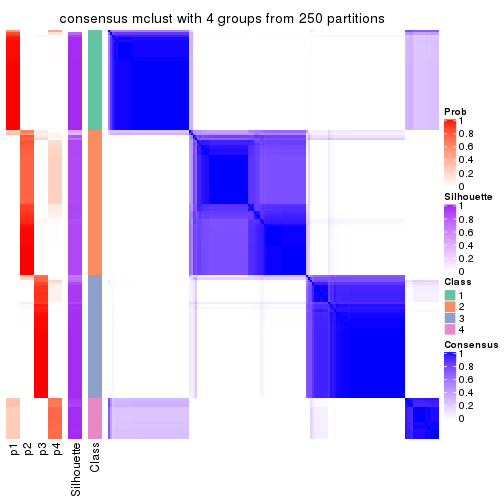</p>

</div>
<div id='tab-CV-mclust-consensus-heatmap-4'>
<pre><code class="r">consensus_heatmap(res, k = 5)
</code></pre>

<p></p>

</div>
<div id='tab-CV-mclust-consensus-heatmap-5'>
<pre><code class="r">consensus_heatmap(res, k = 6)
</code></pre>

<p></p>

</div>
</div>

Heatmaps for the membership of samples in all partitions to see how consistent they are:


<script>
$( function() {
	$( '#tabs-CV-mclust-membership-heatmap' ).tabs();
} );
</script>
<div id='tabs-CV-mclust-membership-heatmap'>
<ul>
<li><a href='#tab-CV-mclust-membership-heatmap-1'>k = 2</a></li>
<li><a href='#tab-CV-mclust-membership-heatmap-2'>k = 3</a></li>
<li><a href='#tab-CV-mclust-membership-heatmap-3'>k = 4</a></li>
<li><a href='#tab-CV-mclust-membership-heatmap-4'>k = 5</a></li>
<li><a href='#tab-CV-mclust-membership-heatmap-5'>k = 6</a></li>
</ul>
<div id='tab-CV-mclust-membership-heatmap-1'>
<pre><code class="r">membership_heatmap(res, k = 2)
</code></pre>

<p></p>

</div>
<div id='tab-CV-mclust-membership-heatmap-2'>
<pre><code class="r">membership_heatmap(res, k = 3)
</code></pre>

<p></p>

</div>
<div id='tab-CV-mclust-membership-heatmap-3'>
<pre><code class="r">membership_heatmap(res, k = 4)
</code></pre>

<p></p>

</div>
<div id='tab-CV-mclust-membership-heatmap-4'>
<pre><code class="r">membership_heatmap(res, k = 5)
</code></pre>

<p></p>

</div>
<div id='tab-CV-mclust-membership-heatmap-5'>
<pre><code class="r">membership_heatmap(res, k = 6)
</code></pre>

<p></p>

</div>
</div>

As soon as we have had the classes for columns, we can look for signatures
which are significantly different between classes which can be candidate marks
for certain classes. Following are the heatmaps for signatures.


Signature heatmaps where rows are scaled:


<script>
$( function() {
	$( '#tabs-CV-mclust-get-signatures' ).tabs();
} );
</script>
<div id='tabs-CV-mclust-get-signatures'>
<ul>
<li><a href='#tab-CV-mclust-get-signatures-1'>k = 2</a></li>
<li><a href='#tab-CV-mclust-get-signatures-2'>k = 3</a></li>
<li><a href='#tab-CV-mclust-get-signatures-3'>k = 4</a></li>
<li><a href='#tab-CV-mclust-get-signatures-4'>k = 5</a></li>
<li><a href='#tab-CV-mclust-get-signatures-5'>k = 6</a></li>
</ul>
<div id='tab-CV-mclust-get-signatures-1'>
<pre><code class="r">get_signatures(res, k = 2)
</code></pre>

<p></p>

</div>
<div id='tab-CV-mclust-get-signatures-2'>
<pre><code class="r">get_signatures(res, k = 3)
</code></pre>

<p></p>

</div>
<div id='tab-CV-mclust-get-signatures-3'>
<pre><code class="r">get_signatures(res, k = 4)
</code></pre>

<p></p>

</div>
<div id='tab-CV-mclust-get-signatures-4'>
<pre><code class="r">get_signatures(res, k = 5)
</code></pre>

<p></p>

</div>
<div id='tab-CV-mclust-get-signatures-5'>
<pre><code class="r">get_signatures(res, k = 6)
</code></pre>

<p></p>

</div>
</div>


Signature heatmaps where rows are not scaled:


<script>
$( function() {
	$( '#tabs-CV-mclust-get-signatures-no-scale' ).tabs();
} );
</script>
<div id='tabs-CV-mclust-get-signatures-no-scale'>
<ul>
<li><a href='#tab-CV-mclust-get-signatures-no-scale-1'>k = 2</a></li>
<li><a href='#tab-CV-mclust-get-signatures-no-scale-2'>k = 3</a></li>
<li><a href='#tab-CV-mclust-get-signatures-no-scale-3'>k = 4</a></li>
<li><a href='#tab-CV-mclust-get-signatures-no-scale-4'>k = 5</a></li>
<li><a href='#tab-CV-mclust-get-signatures-no-scale-5'>k = 6</a></li>
</ul>
<div id='tab-CV-mclust-get-signatures-no-scale-1'>
<pre><code class="r">get_signatures(res, k = 2, scale_rows = FALSE)
</code></pre>

<p></p>

</div>
<div id='tab-CV-mclust-get-signatures-no-scale-2'>
<pre><code class="r">get_signatures(res, k = 3, scale_rows = FALSE)
</code></pre>

<p></p>

</div>
<div id='tab-CV-mclust-get-signatures-no-scale-3'>
<pre><code class="r">get_signatures(res, k = 4, scale_rows = FALSE)
</code></pre>

<p></p>

</div>
<div id='tab-CV-mclust-get-signatures-no-scale-4'>
<pre><code class="r">get_signatures(res, k = 5, scale_rows = FALSE)
</code></pre>

<p></p>

</div>
<div id='tab-CV-mclust-get-signatures-no-scale-5'>
<pre><code class="r">get_signatures(res, k = 6, scale_rows = FALSE)
</code></pre>

<p></p>

</div>
</div>


Compare the overlap of signatures from different k:

```r
compare_signatures(res)
```


`get_signature()` returns a data frame invisibly. TO get the list of signatures, the function
call should be assigned to a variable explicitly. In following code, if `plot` argument is set
to `FALSE`, no heatmap is plotted while only the differential analysis is performed.

```r
# code only for demonstration
tb = get_signature(res, k = ..., plot = FALSE)
```

An example of the output of `tb` is:

```
#>   which_row         fdr    mean_1    mean_2 scaled_mean_1 scaled_mean_2 km
#> 1        38 0.042760348  8.373488  9.131774    -0.5533452     0.5164555  1
#> 2        40 0.018707592  7.106213  8.469186    -0.6173731     0.5762149  1
#> 3        55 0.019134737 10.221463 11.207825    -0.6159697     0.5749050  1
#> 4        59 0.006059896  5.921854  7.869574    -0.6899429     0.6439467  1
#> 5        60 0.018055526  8.928898 10.211722    -0.6204761     0.5791110  1
#> 6        98 0.009384629 15.714769 14.887706     0.6635654    -0.6193277  2
...
```

The columns in `tb` are:

1. `which_row`: row indices corresponding to the input matrix.
2. `fdr`: FDR for the differential test. 
3. `mean_x`: The mean value in group x.
4. `scaled_mean_x`: The mean value in group x after rows are scaled.
5. `km`: Row groups if k-means clustering is applied to rows.


UMAP plot which shows how samples are separated.


<script>
$( function() {
	$( '#tabs-CV-mclust-dimension-reduction' ).tabs();
} );
</script>
<div id='tabs-CV-mclust-dimension-reduction'>
<ul>
<li><a href='#tab-CV-mclust-dimension-reduction-1'>k = 2</a></li>
<li><a href='#tab-CV-mclust-dimension-reduction-2'>k = 3</a></li>
<li><a href='#tab-CV-mclust-dimension-reduction-3'>k = 4</a></li>
<li><a href='#tab-CV-mclust-dimension-reduction-4'>k = 5</a></li>
<li><a href='#tab-CV-mclust-dimension-reduction-5'>k = 6</a></li>
</ul>
<div id='tab-CV-mclust-dimension-reduction-1'>
<pre><code class="r">dimension_reduction(res, k = 2, method = &quot;UMAP&quot;)
</code></pre>

<p></p>

</div>
<div id='tab-CV-mclust-dimension-reduction-2'>
<pre><code class="r">dimension_reduction(res, k = 3, method = &quot;UMAP&quot;)
</code></pre>

<p></p>

</div>
<div id='tab-CV-mclust-dimension-reduction-3'>
<pre><code class="r">dimension_reduction(res, k = 4, method = &quot;UMAP&quot;)
</code></pre>

<p></p>

</div>
<div id='tab-CV-mclust-dimension-reduction-4'>
<pre><code class="r">dimension_reduction(res, k = 5, method = &quot;UMAP&quot;)
</code></pre>

<p></p>

</div>
<div id='tab-CV-mclust-dimension-reduction-5'>
<pre><code class="r">dimension_reduction(res, k = 6, method = &quot;UMAP&quot;)
</code></pre>

<p></p>

</div>
</div>


Following heatmap shows how subgroups are split when increasing `k`:

```r
collect_classes(res)
```


If matrix rows can be associated to genes, consider to use `functional_enrichment(res,
...)` to perform function enrichment for the signature genes. See [this vignette](http://bioconductor.org/packages/devel/bioc/vignettes/cola/inst/doc/functional_enrichment.html) for more detailed explanations.


 

---------------------------------------------------


### CV:NMF*


The object with results only for a single top-value method and a single partition method 
can be extracted as:

```r
res = res_list["CV", "NMF"]
# you can also extract it by
# res = res_list["CV:NMF"]
```

A summary of `res` and all the functions that can be applied to it:

```r
res
```

```
#> A 'ConsensusPartition' object with k = 2, 3, 4, 5, 6.
#>   On a matrix with 18147 rows and 167 columns.
#>   Top rows (1000, 2000, 3000, 4000, 5000) are extracted by 'CV' method.
#>   Subgroups are detected by 'NMF' method.
#>   Performed in total 1250 partitions by row resampling.
#>   Best k for subgroups seems to be 6.
#> 
#> Following methods can be applied to this 'ConsensusPartition' object:
#>  [1] "cola_report"             "collect_classes"         "collect_plots"          
#>  [4] "collect_stats"           "colnames"                "compare_signatures"     
#>  [7] "consensus_heatmap"       "dimension_reduction"     "functional_enrichment"  
#> [10] "get_anno_col"            "get_anno"                "get_classes"            
#> [13] "get_consensus"           "get_matrix"              "get_membership"         
#> [16] "get_param"               "get_signatures"          "get_stats"              
#> [19] "is_best_k"               "is_stable_k"             "membership_heatmap"     
#> [22] "ncol"                    "nrow"                    "plot_ecdf"              
#> [25] "rownames"                "select_partition_number" "show"                   
#> [28] "suggest_best_k"          "test_to_known_factors"
```

`collect_plots()` function collects all the plots made from `res` for all `k` (number of partitions)
into one single page to provide an easy and fast comparison between different `k`.

```r
collect_plots(res)
```


The plots are:

- The first row: a plot of the ECDF (empirical cumulative distribution
  function) curves of the consensus matrix for each `k` and the heatmap of
  predicted classes for each `k`.
- The second row: heatmaps of the consensus matrix for each `k`.
- The third row: heatmaps of the membership matrix for each `k`.
- The fouth row: heatmaps of the signatures for each `k`.

All the plots in panels can be made by individual functions and they are
plotted later in this section.

`select_partition_number()` produces several plots showing different
statistics for choosing "optimized" `k`. There are following statistics:

- ECDF curves of the consensus matrix for each `k`;
- 1-PAC. [The PAC
  score](https://en.wikipedia.org/wiki/Consensus_clustering#Over-interpretation_potential_of_consensus_clustering)
  measures the proportion of the ambiguous subgrouping.
- Mean silhouette score.
- Concordance. The mean probability of fiting the consensus class ids in all
  partitions.
- Area increased. Denote $A_k$ as the area under the ECDF curve for current
  `k`, the area increased is defined as $A_k - A_{k-1}$.
- Rand index. The percent of pairs of samples that are both in a same cluster
  or both are not in a same cluster in the partition of k and k-1.
- Jaccard index. The ratio of pairs of samples are both in a same cluster in
  the partition of k and k-1 and the pairs of samples are both in a same
  cluster in the partition k or k-1.

The detailed explanations of these statistics can be found in [the _cola_
vignette](http://bioconductor.org/packages/devel/bioc/vignettes/cola/inst/doc/cola.html#toc_13).

Generally speaking, lower PAC score, higher mean silhouette score or higher
concordance corresponds to better partition. Rand index and Jaccard index
measure how similar the current partition is compared to partition with `k-1`.
If they are too similar, we won't accept `k` is better than `k-1`.

```r
select_partition_number(res)
```


The numeric values for all these statistics can be obtained by `get_stats()`.

```r
get_stats(res)
```

```
#>   k 1-PAC mean_silhouette concordance area_increased  Rand Jaccard
#> 2 2 1.000           0.969       0.987         0.4927 0.505   0.505
#> 3 3 0.886           0.911       0.960         0.3598 0.742   0.528
#> 4 4 0.842           0.891       0.911         0.1021 0.894   0.696
#> 5 5 1.000           0.960       0.982         0.0782 0.926   0.726
#> 6 6 0.903           0.800       0.900         0.0344 0.965   0.833
```

`suggest_best_k()` suggests the best $k$ based on these statistics. The rules are as follows:

- All $k$ with Jaccard index larger than 0.95 are removed because increasing
  $k$ does not provide enough extra information. If all $k$ are removed, it is
  marked as no subgroup is detected.
- For all $k$ with 1-PAC score larger than 0.9, the maximal $k$ is taken as
  the best $k$, and other $k$ are marked as optional $k$.
- If it does not fit the second rule. The $k$ with the maximal vote of the
  highest 1-PAC score, highest mean silhouette, and highest concordance is
  taken as the best $k$.

```r
suggest_best_k(res)
```

```
#> [1] 6
#> attr(,"optional")
#> [1] 2 5
```

There is also optional best $k$ = 2 5 that is worth to check.

Following shows the table of the partitions (You need to click the **show/hide
code output** link to see it). The membership matrix (columns with name `p*`)
is inferred by
[`clue::cl_consensus()`](https://www.rdocumentation.org/link/cl_consensus?package=clue)
function with the `SE` method. Basically the value in the membership matrix
represents the probability to belong to a certain group. The finall class
label for an item is determined with the group with highest probability it
belongs to.

In `get_classes()` function, the entropy is calculated from the membership
matrix and the silhouette score is calculated from the consensus matrix.


<script>
$( function() {
	$( '#tabs-CV-NMF-get-classes' ).tabs();
} );
</script>
<div id='tabs-CV-NMF-get-classes'>
<ul>
<li><a href='#tab-CV-NMF-get-classes-1'>k = 2</a></li>
<li><a href='#tab-CV-NMF-get-classes-2'>k = 3</a></li>
<li><a href='#tab-CV-NMF-get-classes-3'>k = 4</a></li>
<li><a href='#tab-CV-NMF-get-classes-4'>k = 5</a></li>
<li><a href='#tab-CV-NMF-get-classes-5'>k = 6</a></li>
</ul>

<div id='tab-CV-NMF-get-classes-1'>
<p><a id='tab-CV-NMF-get-classes-1-a' style='color:#0366d6' href='#'>show/hide code output</a></p>
<pre><code class="r">cbind(get_classes(res, k = 2), get_membership(res, k = 2))
</code></pre>

<pre><code>#&gt;            class entropy silhouette    p1    p2
#&gt; SRR1313062     1  0.0000      0.996 1.000 0.000
#&gt; SRR1313063     1  0.0000      0.996 1.000 0.000
#&gt; SRR1313064     1  0.0000      0.996 1.000 0.000
#&gt; SRR1313065     1  0.0000      0.996 1.000 0.000
#&gt; SRR1313066     1  0.0000      0.996 1.000 0.000
#&gt; SRR1313067     1  0.0000      0.996 1.000 0.000
#&gt; SRR1313068     1  0.0000      0.996 1.000 0.000
#&gt; SRR1313069     1  0.0000      0.996 1.000 0.000
#&gt; SRR1313070     1  0.0000      0.996 1.000 0.000
#&gt; SRR1313071     1  0.0000      0.996 1.000 0.000
#&gt; SRR1313072     1  0.0000      0.996 1.000 0.000
#&gt; SRR1313073     1  0.0000      0.996 1.000 0.000
#&gt; SRR1313074     1  0.0000      0.996 1.000 0.000
#&gt; SRR1313075     1  0.0000      0.996 1.000 0.000
#&gt; SRR1313076     1  0.0000      0.996 1.000 0.000
#&gt; SRR1313077     1  0.0000      0.996 1.000 0.000
#&gt; SRR1313078     1  0.0000      0.996 1.000 0.000
#&gt; SRR1313079     1  0.0000      0.996 1.000 0.000
#&gt; SRR1313080     1  0.0000      0.996 1.000 0.000
#&gt; SRR1313081     1  0.0000      0.996 1.000 0.000
#&gt; SRR1313082     1  0.0000      0.996 1.000 0.000
#&gt; SRR1313083     1  0.0000      0.996 1.000 0.000
#&gt; SRR1313084     1  0.0000      0.996 1.000 0.000
#&gt; SRR1313085     1  0.0000      0.996 1.000 0.000
#&gt; SRR1313086     1  0.0000      0.996 1.000 0.000
#&gt; SRR1313087     1  0.0000      0.996 1.000 0.000
#&gt; SRR1313088     1  0.0000      0.996 1.000 0.000
#&gt; SRR1313089     1  0.0000      0.996 1.000 0.000
#&gt; SRR1313092     1  0.0000      0.996 1.000 0.000
#&gt; SRR1313090     1  0.0000      0.996 1.000 0.000
#&gt; SRR1313091     2  0.0000      0.975 0.000 1.000
#&gt; SRR1313093     1  0.0000      0.996 1.000 0.000
#&gt; SRR1313095     1  0.0000      0.996 1.000 0.000
#&gt; SRR1313096     1  0.0000      0.996 1.000 0.000
#&gt; SRR1313094     1  0.0000      0.996 1.000 0.000
#&gt; SRR1313097     1  0.7674      0.699 0.776 0.224
#&gt; SRR1313099     2  0.0000      0.975 0.000 1.000
#&gt; SRR1313098     1  0.0000      0.996 1.000 0.000
#&gt; SRR1313101     2  0.0672      0.968 0.008 0.992
#&gt; SRR1313102     1  0.0000      0.996 1.000 0.000
#&gt; SRR1313103     2  0.9608      0.404 0.384 0.616
#&gt; SRR1313100     1  0.0000      0.996 1.000 0.000
#&gt; SRR1313105     2  0.8713      0.605 0.292 0.708
#&gt; SRR1313104     1  0.0000      0.996 1.000 0.000
#&gt; SRR1313107     1  0.4161      0.904 0.916 0.084
#&gt; SRR1313106     2  0.0000      0.975 0.000 1.000
#&gt; SRR1313109     2  0.0000      0.975 0.000 1.000
#&gt; SRR1313108     1  0.0000      0.996 1.000 0.000
#&gt; SRR1313111     1  0.0376      0.993 0.996 0.004
#&gt; SRR1313110     1  0.0000      0.996 1.000 0.000
#&gt; SRR1313112     2  0.4298      0.892 0.088 0.912
#&gt; SRR1313113     2  0.3431      0.916 0.064 0.936
#&gt; SRR1313115     1  0.0000      0.996 1.000 0.000
#&gt; SRR1313114     1  0.0000      0.996 1.000 0.000
#&gt; SRR1313117     2  0.9988      0.112 0.480 0.520
#&gt; SRR1313118     1  0.0000      0.996 1.000 0.000
#&gt; SRR1313116     2  0.0000      0.975 0.000 1.000
#&gt; SRR1313120     2  0.7139      0.760 0.196 0.804
#&gt; SRR1313119     1  0.0000      0.996 1.000 0.000
#&gt; SRR1313122     1  0.0000      0.996 1.000 0.000
#&gt; SRR1313124     1  0.0000      0.996 1.000 0.000
#&gt; SRR1313121     1  0.0000      0.996 1.000 0.000
#&gt; SRR1313125     1  0.0000      0.996 1.000 0.000
#&gt; SRR1313127     1  0.0000      0.996 1.000 0.000
#&gt; SRR1313123     1  0.0000      0.996 1.000 0.000
#&gt; SRR1313128     1  0.0000      0.996 1.000 0.000
#&gt; SRR1313126     1  0.0000      0.996 1.000 0.000
#&gt; SRR1313130     2  0.0000      0.975 0.000 1.000
#&gt; SRR1313132     1  0.0000      0.996 1.000 0.000
#&gt; SRR1313129     2  0.0376      0.971 0.004 0.996
#&gt; SRR1313133     1  0.0000      0.996 1.000 0.000
#&gt; SRR1313131     1  0.0000      0.996 1.000 0.000
#&gt; SRR1313134     1  0.0000      0.996 1.000 0.000
#&gt; SRR1313135     1  0.0000      0.996 1.000 0.000
#&gt; SRR1313136     1  0.0000      0.996 1.000 0.000
#&gt; SRR1313137     1  0.0000      0.996 1.000 0.000
#&gt; SRR1313138     1  0.0376      0.993 0.996 0.004
#&gt; SRR1313140     1  0.0000      0.996 1.000 0.000
#&gt; SRR1313141     1  0.0000      0.996 1.000 0.000
#&gt; SRR1313139     1  0.0000      0.996 1.000 0.000
#&gt; SRR1313143     1  0.0000      0.996 1.000 0.000
#&gt; SRR1313142     1  0.0000      0.996 1.000 0.000
#&gt; SRR1313144     1  0.0000      0.996 1.000 0.000
#&gt; SRR1313145     1  0.0000      0.996 1.000 0.000
#&gt; SRR1313146     1  0.0000      0.996 1.000 0.000
#&gt; SRR1313147     1  0.0000      0.996 1.000 0.000
#&gt; SRR1313150     1  0.0000      0.996 1.000 0.000
#&gt; SRR1313149     1  0.0000      0.996 1.000 0.000
#&gt; SRR1313152     1  0.0000      0.996 1.000 0.000
#&gt; SRR1313151     1  0.0000      0.996 1.000 0.000
#&gt; SRR1313154     1  0.0000      0.996 1.000 0.000
#&gt; SRR1313153     1  0.0000      0.996 1.000 0.000
#&gt; SRR1313156     1  0.0000      0.996 1.000 0.000
#&gt; SRR1313155     1  0.0000      0.996 1.000 0.000
#&gt; SRR1313157     1  0.0000      0.996 1.000 0.000
#&gt; SRR1313158     1  0.0000      0.996 1.000 0.000
#&gt; SRR1313161     1  0.0000      0.996 1.000 0.000
#&gt; SRR1313159     2  0.0000      0.975 0.000 1.000
#&gt; SRR1313160     1  0.0000      0.996 1.000 0.000
#&gt; SRR1313162     1  0.0000      0.996 1.000 0.000
#&gt; SRR1313163     1  0.0000      0.996 1.000 0.000
#&gt; SRR1313165     1  0.0000      0.996 1.000 0.000
#&gt; SRR1313166     1  0.0000      0.996 1.000 0.000
#&gt; SRR1313164     1  0.0000      0.996 1.000 0.000
#&gt; SRR1313167     1  0.0000      0.996 1.000 0.000
#&gt; SRR1313168     1  0.0000      0.996 1.000 0.000
#&gt; SRR1313170     2  0.8813      0.590 0.300 0.700
#&gt; SRR1313169     1  0.0000      0.996 1.000 0.000
#&gt; SRR1313172     2  0.0000      0.975 0.000 1.000
#&gt; SRR1313171     1  0.0000      0.996 1.000 0.000
#&gt; SRR1313174     2  0.0000      0.975 0.000 1.000
#&gt; SRR1313173     1  0.0000      0.996 1.000 0.000
#&gt; SRR1313176     2  0.0000      0.975 0.000 1.000
#&gt; SRR1313175     2  0.0000      0.975 0.000 1.000
#&gt; SRR1313178     2  0.0000      0.975 0.000 1.000
#&gt; SRR1313177     2  0.0000      0.975 0.000 1.000
#&gt; SRR1313179     2  0.0000      0.975 0.000 1.000
#&gt; SRR1313180     2  0.0000      0.975 0.000 1.000
#&gt; SRR1313181     2  0.0000      0.975 0.000 1.000
#&gt; SRR1313183     2  0.0000      0.975 0.000 1.000
#&gt; SRR1313182     2  0.0000      0.975 0.000 1.000
#&gt; SRR1313184     2  0.0000      0.975 0.000 1.000
#&gt; SRR1313185     2  0.0000      0.975 0.000 1.000
#&gt; SRR1313188     2  0.0000      0.975 0.000 1.000
#&gt; SRR1313187     2  0.0000      0.975 0.000 1.000
#&gt; SRR1313186     2  0.0000      0.975 0.000 1.000
#&gt; SRR1313189     2  0.0000      0.975 0.000 1.000
#&gt; SRR1313190     2  0.0000      0.975 0.000 1.000
#&gt; SRR1313191     2  0.0000      0.975 0.000 1.000
#&gt; SRR1313192     2  0.0000      0.975 0.000 1.000
#&gt; SRR1313193     2  0.0000      0.975 0.000 1.000
#&gt; SRR1313194     2  0.0000      0.975 0.000 1.000
#&gt; SRR1313195     2  0.0000      0.975 0.000 1.000
#&gt; SRR1313196     2  0.0000      0.975 0.000 1.000
#&gt; SRR1313197     2  0.0000      0.975 0.000 1.000
#&gt; SRR1313198     2  0.0000      0.975 0.000 1.000
#&gt; SRR1313199     2  0.0000      0.975 0.000 1.000
#&gt; SRR1313200     2  0.0000      0.975 0.000 1.000
#&gt; SRR1313201     2  0.0000      0.975 0.000 1.000
#&gt; SRR1313202     2  0.0000      0.975 0.000 1.000
#&gt; SRR1313203     2  0.0000      0.975 0.000 1.000
#&gt; SRR1313204     2  0.0000      0.975 0.000 1.000
#&gt; SRR1313205     2  0.0000      0.975 0.000 1.000
#&gt; SRR1313207     2  0.0000      0.975 0.000 1.000
#&gt; SRR1313208     2  0.0000      0.975 0.000 1.000
#&gt; SRR1313206     2  0.0000      0.975 0.000 1.000
#&gt; SRR1313210     2  0.0000      0.975 0.000 1.000
#&gt; SRR1313209     2  0.0000      0.975 0.000 1.000
#&gt; SRR1313211     2  0.0000      0.975 0.000 1.000
#&gt; SRR1313212     2  0.0000      0.975 0.000 1.000
#&gt; SRR1313214     2  0.0000      0.975 0.000 1.000
#&gt; SRR1313215     2  0.0000      0.975 0.000 1.000
#&gt; SRR1313213     2  0.0000      0.975 0.000 1.000
#&gt; SRR1313216     2  0.0000      0.975 0.000 1.000
#&gt; SRR1313217     2  0.0000      0.975 0.000 1.000
#&gt; SRR1313219     2  0.0000      0.975 0.000 1.000
#&gt; SRR1313220     2  0.0000      0.975 0.000 1.000
#&gt; SRR1313218     2  0.0000      0.975 0.000 1.000
#&gt; SRR1313222     2  0.0000      0.975 0.000 1.000
#&gt; SRR1313221     2  0.0000      0.975 0.000 1.000
#&gt; SRR1313223     2  0.0000      0.975 0.000 1.000
#&gt; SRR1313224     2  0.0000      0.975 0.000 1.000
#&gt; SRR1313225     2  0.0000      0.975 0.000 1.000
#&gt; SRR1313226     2  0.0000      0.975 0.000 1.000
#&gt; SRR1313227     2  0.0000      0.975 0.000 1.000
#&gt; SRR1313228     2  0.0000      0.975 0.000 1.000
#&gt; SRR1313229     2  0.0000      0.975 0.000 1.000
</code></pre>

<script>
$('#tab-CV-NMF-get-classes-1-a').parent().next().next().hide();
$('#tab-CV-NMF-get-classes-1-a').click(function(){
  $('#tab-CV-NMF-get-classes-1-a').parent().next().next().toggle();
  return(false);
});
</script>
</div>

<div id='tab-CV-NMF-get-classes-2'>
<p><a id='tab-CV-NMF-get-classes-2-a' style='color:#0366d6' href='#'>show/hide code output</a></p>
<pre><code class="r">cbind(get_classes(res, k = 3), get_membership(res, k = 3))
</code></pre>

<pre><code>#&gt;            class entropy silhouette    p1    p2    p3
#&gt; SRR1313062     1  0.5905      0.402 0.648 0.000 0.352
#&gt; SRR1313063     3  0.5835      0.532 0.340 0.000 0.660
#&gt; SRR1313064     1  0.0000      0.938 1.000 0.000 0.000
#&gt; SRR1313065     1  0.0000      0.938 1.000 0.000 0.000
#&gt; SRR1313066     1  0.0000      0.938 1.000 0.000 0.000
#&gt; SRR1313067     3  0.5138      0.678 0.252 0.000 0.748
#&gt; SRR1313068     3  0.2625      0.867 0.084 0.000 0.916
#&gt; SRR1313069     1  0.0000      0.938 1.000 0.000 0.000
#&gt; SRR1313070     1  0.0000      0.938 1.000 0.000 0.000
#&gt; SRR1313071     1  0.0000      0.938 1.000 0.000 0.000
#&gt; SRR1313072     1  0.0000      0.938 1.000 0.000 0.000
#&gt; SRR1313073     1  0.0000      0.938 1.000 0.000 0.000
#&gt; SRR1313074     1  0.0000      0.938 1.000 0.000 0.000
#&gt; SRR1313075     1  0.0000      0.938 1.000 0.000 0.000
#&gt; SRR1313076     3  0.5016      0.694 0.240 0.000 0.760
#&gt; SRR1313077     3  0.5178      0.673 0.256 0.000 0.744
#&gt; SRR1313078     3  0.5138      0.678 0.252 0.000 0.748
#&gt; SRR1313079     1  0.0000      0.938 1.000 0.000 0.000
#&gt; SRR1313080     3  0.4702      0.730 0.212 0.000 0.788
#&gt; SRR1313081     3  0.6180      0.355 0.416 0.000 0.584
#&gt; SRR1313082     1  0.0000      0.938 1.000 0.000 0.000
#&gt; SRR1313083     1  0.0000      0.938 1.000 0.000 0.000
#&gt; SRR1313084     1  0.0000      0.938 1.000 0.000 0.000
#&gt; SRR1313085     1  0.0000      0.938 1.000 0.000 0.000
#&gt; SRR1313086     1  0.0000      0.938 1.000 0.000 0.000
#&gt; SRR1313087     1  0.0000      0.938 1.000 0.000 0.000
#&gt; SRR1313088     1  0.0000      0.938 1.000 0.000 0.000
#&gt; SRR1313089     1  0.0000      0.938 1.000 0.000 0.000
#&gt; SRR1313092     3  0.0000      0.938 0.000 0.000 1.000
#&gt; SRR1313090     3  0.0000      0.938 0.000 0.000 1.000
#&gt; SRR1313091     3  0.6252      0.196 0.000 0.444 0.556
#&gt; SRR1313093     3  0.0000      0.938 0.000 0.000 1.000
#&gt; SRR1313095     3  0.0000      0.938 0.000 0.000 1.000
#&gt; SRR1313096     3  0.0000      0.938 0.000 0.000 1.000
#&gt; SRR1313094     3  0.0000      0.938 0.000 0.000 1.000
#&gt; SRR1313097     3  0.0000      0.938 0.000 0.000 1.000
#&gt; SRR1313099     3  0.0000      0.938 0.000 0.000 1.000
#&gt; SRR1313098     3  0.0000      0.938 0.000 0.000 1.000
#&gt; SRR1313101     3  0.0000      0.938 0.000 0.000 1.000
#&gt; SRR1313102     3  0.0000      0.938 0.000 0.000 1.000
#&gt; SRR1313103     3  0.0000      0.938 0.000 0.000 1.000
#&gt; SRR1313100     3  0.0000      0.938 0.000 0.000 1.000
#&gt; SRR1313105     3  0.0000      0.938 0.000 0.000 1.000
#&gt; SRR1313104     3  0.0000      0.938 0.000 0.000 1.000
#&gt; SRR1313107     3  0.0000      0.938 0.000 0.000 1.000
#&gt; SRR1313106     3  0.0000      0.938 0.000 0.000 1.000
#&gt; SRR1313109     3  0.0000      0.938 0.000 0.000 1.000
#&gt; SRR1313108     3  0.0000      0.938 0.000 0.000 1.000
#&gt; SRR1313111     3  0.0000      0.938 0.000 0.000 1.000
#&gt; SRR1313110     3  0.0000      0.938 0.000 0.000 1.000
#&gt; SRR1313112     3  0.0000      0.938 0.000 0.000 1.000
#&gt; SRR1313113     3  0.0000      0.938 0.000 0.000 1.000
#&gt; SRR1313115     3  0.0000      0.938 0.000 0.000 1.000
#&gt; SRR1313114     3  0.0000      0.938 0.000 0.000 1.000
#&gt; SRR1313117     3  0.0000      0.938 0.000 0.000 1.000
#&gt; SRR1313118     3  0.0000      0.938 0.000 0.000 1.000
#&gt; SRR1313116     3  0.0000      0.938 0.000 0.000 1.000
#&gt; SRR1313120     3  0.0000      0.938 0.000 0.000 1.000
#&gt; SRR1313119     3  0.0000      0.938 0.000 0.000 1.000
#&gt; SRR1313122     3  0.0000      0.938 0.000 0.000 1.000
#&gt; SRR1313124     3  0.0000      0.938 0.000 0.000 1.000
#&gt; SRR1313121     3  0.0000      0.938 0.000 0.000 1.000
#&gt; SRR1313125     3  0.0000      0.938 0.000 0.000 1.000
#&gt; SRR1313127     3  0.0000      0.938 0.000 0.000 1.000
#&gt; SRR1313123     3  0.0000      0.938 0.000 0.000 1.000
#&gt; SRR1313128     1  0.4750      0.759 0.784 0.000 0.216
#&gt; SRR1313126     3  0.0000      0.938 0.000 0.000 1.000
#&gt; SRR1313130     3  0.0000      0.938 0.000 0.000 1.000
#&gt; SRR1313132     1  0.5178      0.708 0.744 0.000 0.256
#&gt; SRR1313129     3  0.0000      0.938 0.000 0.000 1.000
#&gt; SRR1313133     1  0.5058      0.724 0.756 0.000 0.244
#&gt; SRR1313131     3  0.0000      0.938 0.000 0.000 1.000
#&gt; SRR1313134     1  0.4796      0.754 0.780 0.000 0.220
#&gt; SRR1313135     1  0.0000      0.938 1.000 0.000 0.000
#&gt; SRR1313136     1  0.0000      0.938 1.000 0.000 0.000
#&gt; SRR1313137     1  0.0000      0.938 1.000 0.000 0.000
#&gt; SRR1313138     1  0.6372      0.747 0.756 0.068 0.176
#&gt; SRR1313140     1  0.0000      0.938 1.000 0.000 0.000
#&gt; SRR1313141     1  0.3038      0.865 0.896 0.000 0.104
#&gt; SRR1313139     1  0.0000      0.938 1.000 0.000 0.000
#&gt; SRR1313143     1  0.0000      0.938 1.000 0.000 0.000
#&gt; SRR1313142     1  0.4702      0.763 0.788 0.000 0.212
#&gt; SRR1313144     1  0.0000      0.938 1.000 0.000 0.000
#&gt; SRR1313145     1  0.0000      0.938 1.000 0.000 0.000
#&gt; SRR1313146     1  0.0000      0.938 1.000 0.000 0.000
#&gt; SRR1313147     1  0.0000      0.938 1.000 0.000 0.000
#&gt; SRR1313150     1  0.0000      0.938 1.000 0.000 0.000
#&gt; SRR1313149     1  0.1289      0.919 0.968 0.000 0.032
#&gt; SRR1313152     1  0.0000      0.938 1.000 0.000 0.000
#&gt; SRR1313151     1  0.0000      0.938 1.000 0.000 0.000
#&gt; SRR1313154     1  0.0000      0.938 1.000 0.000 0.000
#&gt; SRR1313153     1  0.1964      0.902 0.944 0.000 0.056
#&gt; SRR1313156     1  0.5681      0.722 0.748 0.016 0.236
#&gt; SRR1313155     1  0.0000      0.938 1.000 0.000 0.000
#&gt; SRR1313157     1  0.0000      0.938 1.000 0.000 0.000
#&gt; SRR1313158     1  0.4796      0.754 0.780 0.000 0.220
#&gt; SRR1313161     1  0.0000      0.938 1.000 0.000 0.000
#&gt; SRR1313159     2  0.8835      0.412 0.180 0.576 0.244
#&gt; SRR1313160     1  0.0000      0.938 1.000 0.000 0.000
#&gt; SRR1313162     1  0.5650      0.620 0.688 0.000 0.312
#&gt; SRR1313163     1  0.1031      0.924 0.976 0.000 0.024
#&gt; SRR1313165     1  0.0000      0.938 1.000 0.000 0.000
#&gt; SRR1313166     1  0.0424      0.933 0.992 0.000 0.008
#&gt; SRR1313164     1  0.5178      0.708 0.744 0.000 0.256
#&gt; SRR1313167     1  0.0000      0.938 1.000 0.000 0.000
#&gt; SRR1313168     1  0.0000      0.938 1.000 0.000 0.000
#&gt; SRR1313170     3  0.0000      0.938 0.000 0.000 1.000
#&gt; SRR1313169     1  0.0000      0.938 1.000 0.000 0.000
#&gt; SRR1313172     2  0.0000      0.990 0.000 1.000 0.000
#&gt; SRR1313171     1  0.5291      0.691 0.732 0.000 0.268
#&gt; SRR1313174     2  0.0000      0.990 0.000 1.000 0.000
#&gt; SRR1313173     3  0.0000      0.938 0.000 0.000 1.000
#&gt; SRR1313176     2  0.0000      0.990 0.000 1.000 0.000
#&gt; SRR1313175     2  0.0000      0.990 0.000 1.000 0.000
#&gt; SRR1313178     2  0.0000      0.990 0.000 1.000 0.000
#&gt; SRR1313177     2  0.0000      0.990 0.000 1.000 0.000
#&gt; SRR1313179     2  0.0000      0.990 0.000 1.000 0.000
#&gt; SRR1313180     2  0.0000      0.990 0.000 1.000 0.000
#&gt; SRR1313181     2  0.0000      0.990 0.000 1.000 0.000
#&gt; SRR1313183     2  0.0000      0.990 0.000 1.000 0.000
#&gt; SRR1313182     2  0.0000      0.990 0.000 1.000 0.000
#&gt; SRR1313184     2  0.4002      0.798 0.000 0.840 0.160
#&gt; SRR1313185     2  0.0000      0.990 0.000 1.000 0.000
#&gt; SRR1313188     2  0.0000      0.990 0.000 1.000 0.000
#&gt; SRR1313187     2  0.0000      0.990 0.000 1.000 0.000
#&gt; SRR1313186     2  0.0000      0.990 0.000 1.000 0.000
#&gt; SRR1313189     2  0.0000      0.990 0.000 1.000 0.000
#&gt; SRR1313190     2  0.0000      0.990 0.000 1.000 0.000
#&gt; SRR1313191     2  0.0000      0.990 0.000 1.000 0.000
#&gt; SRR1313192     2  0.0000      0.990 0.000 1.000 0.000
#&gt; SRR1313193     2  0.0000      0.990 0.000 1.000 0.000
#&gt; SRR1313194     2  0.0000      0.990 0.000 1.000 0.000
#&gt; SRR1313195     2  0.0000      0.990 0.000 1.000 0.000
#&gt; SRR1313196     2  0.0000      0.990 0.000 1.000 0.000
#&gt; SRR1313197     2  0.0000      0.990 0.000 1.000 0.000
#&gt; SRR1313198     2  0.0000      0.990 0.000 1.000 0.000
#&gt; SRR1313199     2  0.0000      0.990 0.000 1.000 0.000
#&gt; SRR1313200     2  0.0000      0.990 0.000 1.000 0.000
#&gt; SRR1313201     2  0.0000      0.990 0.000 1.000 0.000
#&gt; SRR1313202     2  0.0000      0.990 0.000 1.000 0.000
#&gt; SRR1313203     2  0.0000      0.990 0.000 1.000 0.000
#&gt; SRR1313204     2  0.0000      0.990 0.000 1.000 0.000
#&gt; SRR1313205     2  0.0000      0.990 0.000 1.000 0.000
#&gt; SRR1313207     2  0.0000      0.990 0.000 1.000 0.000
#&gt; SRR1313208     2  0.0000      0.990 0.000 1.000 0.000
#&gt; SRR1313206     2  0.0000      0.990 0.000 1.000 0.000
#&gt; SRR1313210     2  0.0000      0.990 0.000 1.000 0.000
#&gt; SRR1313209     2  0.0000      0.990 0.000 1.000 0.000
#&gt; SRR1313211     2  0.0000      0.990 0.000 1.000 0.000
#&gt; SRR1313212     2  0.0000      0.990 0.000 1.000 0.000
#&gt; SRR1313214     2  0.0000      0.990 0.000 1.000 0.000
#&gt; SRR1313215     2  0.0000      0.990 0.000 1.000 0.000
#&gt; SRR1313213     2  0.0000      0.990 0.000 1.000 0.000
#&gt; SRR1313216     2  0.0000      0.990 0.000 1.000 0.000
#&gt; SRR1313217     2  0.0000      0.990 0.000 1.000 0.000
#&gt; SRR1313219     2  0.0000      0.990 0.000 1.000 0.000
#&gt; SRR1313220     2  0.0000      0.990 0.000 1.000 0.000
#&gt; SRR1313218     2  0.0000      0.990 0.000 1.000 0.000
#&gt; SRR1313222     2  0.0000      0.990 0.000 1.000 0.000
#&gt; SRR1313221     2  0.0000      0.990 0.000 1.000 0.000
#&gt; SRR1313223     2  0.0000      0.990 0.000 1.000 0.000
#&gt; SRR1313224     2  0.0000      0.990 0.000 1.000 0.000
#&gt; SRR1313225     2  0.0000      0.990 0.000 1.000 0.000
#&gt; SRR1313226     3  0.6111      0.355 0.000 0.396 0.604
#&gt; SRR1313227     2  0.0000      0.990 0.000 1.000 0.000
#&gt; SRR1313228     2  0.0000      0.990 0.000 1.000 0.000
#&gt; SRR1313229     2  0.0000      0.990 0.000 1.000 0.000
</code></pre>

<script>
$('#tab-CV-NMF-get-classes-2-a').parent().next().next().hide();
$('#tab-CV-NMF-get-classes-2-a').click(function(){
  $('#tab-CV-NMF-get-classes-2-a').parent().next().next().toggle();
  return(false);
});
</script>
</div>

<div id='tab-CV-NMF-get-classes-3'>
<p><a id='tab-CV-NMF-get-classes-3-a' style='color:#0366d6' href='#'>show/hide code output</a></p>
<pre><code class="r">cbind(get_classes(res, k = 4), get_membership(res, k = 4))
</code></pre>

<pre><code>#&gt;            class entropy silhouette    p1    p2    p3    p4
#&gt; SRR1313062     4  0.3726      0.702 0.000 0.000 0.212 0.788
#&gt; SRR1313063     4  0.3764      0.697 0.000 0.000 0.216 0.784
#&gt; SRR1313064     4  0.0000      0.865 0.000 0.000 0.000 1.000
#&gt; SRR1313065     4  0.0000      0.865 0.000 0.000 0.000 1.000
#&gt; SRR1313066     4  0.0000      0.865 0.000 0.000 0.000 1.000
#&gt; SRR1313067     4  0.4072      0.655 0.000 0.000 0.252 0.748
#&gt; SRR1313068     3  0.1302      0.928 0.000 0.000 0.956 0.044
#&gt; SRR1313069     4  0.0817      0.840 0.024 0.000 0.000 0.976
#&gt; SRR1313070     4  0.0000      0.865 0.000 0.000 0.000 1.000
#&gt; SRR1313071     4  0.0000      0.865 0.000 0.000 0.000 1.000
#&gt; SRR1313072     4  0.0000      0.865 0.000 0.000 0.000 1.000
#&gt; SRR1313073     4  0.0000      0.865 0.000 0.000 0.000 1.000
#&gt; SRR1313074     4  0.0000      0.865 0.000 0.000 0.000 1.000
#&gt; SRR1313075     4  0.0000      0.865 0.000 0.000 0.000 1.000
#&gt; SRR1313076     4  0.4898      0.333 0.000 0.000 0.416 0.584
#&gt; SRR1313077     4  0.3764      0.697 0.000 0.000 0.216 0.784
#&gt; SRR1313078     4  0.4103      0.650 0.000 0.000 0.256 0.744
#&gt; SRR1313079     4  0.0000      0.865 0.000 0.000 0.000 1.000
#&gt; SRR1313080     3  0.3400      0.751 0.000 0.000 0.820 0.180
#&gt; SRR1313081     4  0.3764      0.697 0.000 0.000 0.216 0.784
#&gt; SRR1313082     4  0.0000      0.865 0.000 0.000 0.000 1.000
#&gt; SRR1313083     4  0.0000      0.865 0.000 0.000 0.000 1.000
#&gt; SRR1313084     4  0.0000      0.865 0.000 0.000 0.000 1.000
#&gt; SRR1313085     4  0.0000      0.865 0.000 0.000 0.000 1.000
#&gt; SRR1313086     4  0.0000      0.865 0.000 0.000 0.000 1.000
#&gt; SRR1313087     4  0.0000      0.865 0.000 0.000 0.000 1.000
#&gt; SRR1313088     4  0.0000      0.865 0.000 0.000 0.000 1.000
#&gt; SRR1313089     4  0.0000      0.865 0.000 0.000 0.000 1.000
#&gt; SRR1313092     3  0.0000      0.967 0.000 0.000 1.000 0.000
#&gt; SRR1313090     3  0.0000      0.967 0.000 0.000 1.000 0.000
#&gt; SRR1313091     3  0.4477      0.577 0.000 0.312 0.688 0.000
#&gt; SRR1313093     3  0.0000      0.967 0.000 0.000 1.000 0.000
#&gt; SRR1313095     3  0.0000      0.967 0.000 0.000 1.000 0.000
#&gt; SRR1313096     3  0.0000      0.967 0.000 0.000 1.000 0.000
#&gt; SRR1313094     3  0.0000      0.967 0.000 0.000 1.000 0.000
#&gt; SRR1313097     3  0.0000      0.967 0.000 0.000 1.000 0.000
#&gt; SRR1313099     3  0.1022      0.940 0.032 0.000 0.968 0.000
#&gt; SRR1313098     3  0.0921      0.944 0.028 0.000 0.972 0.000
#&gt; SRR1313101     3  0.0000      0.967 0.000 0.000 1.000 0.000
#&gt; SRR1313102     3  0.0000      0.967 0.000 0.000 1.000 0.000
#&gt; SRR1313103     3  0.1211      0.932 0.040 0.000 0.960 0.000
#&gt; SRR1313100     3  0.0000      0.967 0.000 0.000 1.000 0.000
#&gt; SRR1313105     3  0.0921      0.945 0.000 0.028 0.972 0.000
#&gt; SRR1313104     3  0.0000      0.967 0.000 0.000 1.000 0.000
#&gt; SRR1313107     3  0.0000      0.967 0.000 0.000 1.000 0.000
#&gt; SRR1313106     3  0.0000      0.967 0.000 0.000 1.000 0.000
#&gt; SRR1313109     3  0.0000      0.967 0.000 0.000 1.000 0.000
#&gt; SRR1313108     3  0.0000      0.967 0.000 0.000 1.000 0.000
#&gt; SRR1313111     3  0.0000      0.967 0.000 0.000 1.000 0.000
#&gt; SRR1313110     3  0.0000      0.967 0.000 0.000 1.000 0.000
#&gt; SRR1313112     3  0.0000      0.967 0.000 0.000 1.000 0.000
#&gt; SRR1313113     3  0.0000      0.967 0.000 0.000 1.000 0.000
#&gt; SRR1313115     3  0.0000      0.967 0.000 0.000 1.000 0.000
#&gt; SRR1313114     3  0.0000      0.967 0.000 0.000 1.000 0.000
#&gt; SRR1313117     3  0.0000      0.967 0.000 0.000 1.000 0.000
#&gt; SRR1313118     3  0.0000      0.967 0.000 0.000 1.000 0.000
#&gt; SRR1313116     3  0.3764      0.736 0.000 0.216 0.784 0.000
#&gt; SRR1313120     3  0.0000      0.967 0.000 0.000 1.000 0.000
#&gt; SRR1313119     3  0.0000      0.967 0.000 0.000 1.000 0.000
#&gt; SRR1313122     3  0.0000      0.967 0.000 0.000 1.000 0.000
#&gt; SRR1313124     3  0.0000      0.967 0.000 0.000 1.000 0.000
#&gt; SRR1313121     3  0.0000      0.967 0.000 0.000 1.000 0.000
#&gt; SRR1313125     3  0.0000      0.967 0.000 0.000 1.000 0.000
#&gt; SRR1313127     3  0.0000      0.967 0.000 0.000 1.000 0.000
#&gt; SRR1313123     3  0.0000      0.967 0.000 0.000 1.000 0.000
#&gt; SRR1313128     1  0.3764      0.963 0.784 0.000 0.000 0.216
#&gt; SRR1313126     3  0.0000      0.967 0.000 0.000 1.000 0.000
#&gt; SRR1313130     3  0.1557      0.919 0.000 0.056 0.944 0.000
#&gt; SRR1313132     1  0.3764      0.963 0.784 0.000 0.000 0.216
#&gt; SRR1313129     3  0.0000      0.967 0.000 0.000 1.000 0.000
#&gt; SRR1313133     1  0.3764      0.963 0.784 0.000 0.000 0.216
#&gt; SRR1313131     3  0.0000      0.967 0.000 0.000 1.000 0.000
#&gt; SRR1313134     1  0.3764      0.963 0.784 0.000 0.000 0.216
#&gt; SRR1313135     1  0.3801      0.960 0.780 0.000 0.000 0.220
#&gt; SRR1313136     1  0.3764      0.963 0.784 0.000 0.000 0.216
#&gt; SRR1313137     1  0.3764      0.963 0.784 0.000 0.000 0.216
#&gt; SRR1313138     1  0.3764      0.963 0.784 0.000 0.000 0.216
#&gt; SRR1313140     1  0.4304      0.885 0.716 0.000 0.000 0.284
#&gt; SRR1313141     1  0.3764      0.963 0.784 0.000 0.000 0.216
#&gt; SRR1313139     1  0.4543      0.827 0.676 0.000 0.000 0.324
#&gt; SRR1313143     1  0.3764      0.963 0.784 0.000 0.000 0.216
#&gt; SRR1313142     1  0.3764      0.963 0.784 0.000 0.000 0.216
#&gt; SRR1313144     1  0.3764      0.963 0.784 0.000 0.000 0.216
#&gt; SRR1313145     1  0.3764      0.963 0.784 0.000 0.000 0.216
#&gt; SRR1313146     1  0.3801      0.960 0.780 0.000 0.000 0.220
#&gt; SRR1313147     1  0.3764      0.963 0.784 0.000 0.000 0.216
#&gt; SRR1313150     1  0.3764      0.963 0.784 0.000 0.000 0.216
#&gt; SRR1313149     1  0.3764      0.963 0.784 0.000 0.000 0.216
#&gt; SRR1313152     1  0.3764      0.963 0.784 0.000 0.000 0.216
#&gt; SRR1313151     1  0.3873      0.952 0.772 0.000 0.000 0.228
#&gt; SRR1313154     1  0.3764      0.963 0.784 0.000 0.000 0.216
#&gt; SRR1313153     1  0.3764      0.963 0.784 0.000 0.000 0.216
#&gt; SRR1313156     1  0.3764      0.963 0.784 0.000 0.000 0.216
#&gt; SRR1313155     1  0.3764      0.963 0.784 0.000 0.000 0.216
#&gt; SRR1313157     1  0.3837      0.956 0.776 0.000 0.000 0.224
#&gt; SRR1313158     1  0.3764      0.963 0.784 0.000 0.000 0.216
#&gt; SRR1313161     4  0.4972     -0.337 0.456 0.000 0.000 0.544
#&gt; SRR1313159     1  0.4775      0.868 0.784 0.076 0.000 0.140
#&gt; SRR1313160     1  0.3764      0.963 0.784 0.000 0.000 0.216
#&gt; SRR1313162     1  0.4406      0.925 0.780 0.000 0.028 0.192
#&gt; SRR1313163     1  0.3908      0.959 0.784 0.004 0.000 0.212
#&gt; SRR1313165     1  0.3764      0.963 0.784 0.000 0.000 0.216
#&gt; SRR1313166     1  0.3764      0.963 0.784 0.000 0.000 0.216
#&gt; SRR1313164     1  0.3764      0.963 0.784 0.000 0.000 0.216
#&gt; SRR1313167     4  0.3219      0.633 0.164 0.000 0.000 0.836
#&gt; SRR1313168     1  0.3764      0.963 0.784 0.000 0.000 0.216
#&gt; SRR1313170     1  0.6764      0.417 0.596 0.144 0.260 0.000
#&gt; SRR1313169     1  0.3873      0.953 0.772 0.000 0.000 0.228
#&gt; SRR1313172     2  0.3764      0.905 0.216 0.784 0.000 0.000
#&gt; SRR1313171     1  0.3764      0.963 0.784 0.000 0.000 0.216
#&gt; SRR1313174     2  0.0000      0.890 0.000 1.000 0.000 0.000
#&gt; SRR1313173     3  0.0000      0.967 0.000 0.000 1.000 0.000
#&gt; SRR1313176     2  0.3764      0.905 0.216 0.784 0.000 0.000
#&gt; SRR1313175     2  0.0000      0.890 0.000 1.000 0.000 0.000
#&gt; SRR1313178     2  0.3764      0.905 0.216 0.784 0.000 0.000
#&gt; SRR1313177     2  0.3764      0.905 0.216 0.784 0.000 0.000
#&gt; SRR1313179     1  0.2345      0.531 0.900 0.100 0.000 0.000
#&gt; SRR1313180     2  0.0000      0.890 0.000 1.000 0.000 0.000
#&gt; SRR1313181     2  0.3764      0.905 0.216 0.784 0.000 0.000
#&gt; SRR1313183     2  0.3764      0.905 0.216 0.784 0.000 0.000
#&gt; SRR1313182     2  0.0469      0.891 0.012 0.988 0.000 0.000
#&gt; SRR1313184     2  0.4679      0.778 0.352 0.648 0.000 0.000
#&gt; SRR1313185     2  0.0000      0.890 0.000 1.000 0.000 0.000
#&gt; SRR1313188     2  0.0000      0.890 0.000 1.000 0.000 0.000
#&gt; SRR1313187     2  0.0000      0.890 0.000 1.000 0.000 0.000
#&gt; SRR1313186     2  0.0000      0.890 0.000 1.000 0.000 0.000
#&gt; SRR1313189     2  0.3764      0.905 0.216 0.784 0.000 0.000
#&gt; SRR1313190     2  0.3764      0.905 0.216 0.784 0.000 0.000
#&gt; SRR1313191     2  0.0921      0.893 0.028 0.972 0.000 0.000
#&gt; SRR1313192     2  0.3764      0.905 0.216 0.784 0.000 0.000
#&gt; SRR1313193     2  0.3764      0.905 0.216 0.784 0.000 0.000
#&gt; SRR1313194     2  0.0000      0.890 0.000 1.000 0.000 0.000
#&gt; SRR1313195     2  0.0000      0.890 0.000 1.000 0.000 0.000
#&gt; SRR1313196     2  0.0000      0.890 0.000 1.000 0.000 0.000
#&gt; SRR1313197     2  0.0000      0.890 0.000 1.000 0.000 0.000
#&gt; SRR1313198     2  0.0000      0.890 0.000 1.000 0.000 0.000
#&gt; SRR1313199     2  0.3764      0.905 0.216 0.784 0.000 0.000
#&gt; SRR1313200     2  0.0000      0.890 0.000 1.000 0.000 0.000
#&gt; SRR1313201     2  0.3764      0.905 0.216 0.784 0.000 0.000
#&gt; SRR1313202     2  0.0000      0.890 0.000 1.000 0.000 0.000
#&gt; SRR1313203     2  0.3764      0.905 0.216 0.784 0.000 0.000
#&gt; SRR1313204     2  0.3764      0.905 0.216 0.784 0.000 0.000
#&gt; SRR1313205     2  0.3764      0.905 0.216 0.784 0.000 0.000
#&gt; SRR1313207     2  0.3764      0.905 0.216 0.784 0.000 0.000
#&gt; SRR1313208     2  0.3764      0.905 0.216 0.784 0.000 0.000
#&gt; SRR1313206     2  0.3764      0.905 0.216 0.784 0.000 0.000
#&gt; SRR1313210     2  0.0000      0.890 0.000 1.000 0.000 0.000
#&gt; SRR1313209     2  0.0000      0.890 0.000 1.000 0.000 0.000
#&gt; SRR1313211     2  0.0000      0.890 0.000 1.000 0.000 0.000
#&gt; SRR1313212     2  0.3764      0.905 0.216 0.784 0.000 0.000
#&gt; SRR1313214     2  0.0000      0.890 0.000 1.000 0.000 0.000
#&gt; SRR1313215     2  0.0000      0.890 0.000 1.000 0.000 0.000
#&gt; SRR1313213     2  0.3764      0.905 0.216 0.784 0.000 0.000
#&gt; SRR1313216     2  0.0000      0.890 0.000 1.000 0.000 0.000
#&gt; SRR1313217     2  0.0000      0.890 0.000 1.000 0.000 0.000
#&gt; SRR1313219     2  0.0000      0.890 0.000 1.000 0.000 0.000
#&gt; SRR1313220     2  0.3764      0.905 0.216 0.784 0.000 0.000
#&gt; SRR1313218     2  0.2469      0.899 0.108 0.892 0.000 0.000
#&gt; SRR1313222     2  0.3764      0.905 0.216 0.784 0.000 0.000
#&gt; SRR1313221     2  0.3764      0.905 0.216 0.784 0.000 0.000
#&gt; SRR1313223     2  0.3764      0.905 0.216 0.784 0.000 0.000
#&gt; SRR1313224     2  0.3764      0.905 0.216 0.784 0.000 0.000
#&gt; SRR1313225     2  0.0000      0.890 0.000 1.000 0.000 0.000
#&gt; SRR1313226     3  0.4477      0.615 0.000 0.312 0.688 0.000
#&gt; SRR1313227     2  0.3764      0.905 0.216 0.784 0.000 0.000
#&gt; SRR1313228     2  0.3764      0.905 0.216 0.784 0.000 0.000
#&gt; SRR1313229     2  0.3764      0.905 0.216 0.784 0.000 0.000
</code></pre>

<script>
$('#tab-CV-NMF-get-classes-3-a').parent().next().next().hide();
$('#tab-CV-NMF-get-classes-3-a').click(function(){
  $('#tab-CV-NMF-get-classes-3-a').parent().next().next().toggle();
  return(false);
});
</script>
</div>

<div id='tab-CV-NMF-get-classes-4'>
<p><a id='tab-CV-NMF-get-classes-4-a' style='color:#0366d6' href='#'>show/hide code output</a></p>
<pre><code class="r">cbind(get_classes(res, k = 5), get_membership(res, k = 5))
</code></pre>

<pre><code>#&gt;            class entropy silhouette    p1    p2    p3    p4    p5
#&gt; SRR1313062     4  0.0000      0.970 0.000 0.000 0.000 1.000 0.000
#&gt; SRR1313063     4  0.0290      0.965 0.000 0.000 0.008 0.992 0.000
#&gt; SRR1313064     4  0.0000      0.970 0.000 0.000 0.000 1.000 0.000
#&gt; SRR1313065     4  0.0000      0.970 0.000 0.000 0.000 1.000 0.000
#&gt; SRR1313066     4  0.0000      0.970 0.000 0.000 0.000 1.000 0.000
#&gt; SRR1313067     4  0.1410      0.921 0.000 0.000 0.060 0.940 0.000
#&gt; SRR1313068     3  0.0794      0.960 0.000 0.000 0.972 0.028 0.000
#&gt; SRR1313069     4  0.2074      0.874 0.104 0.000 0.000 0.896 0.000
#&gt; SRR1313070     4  0.0000      0.970 0.000 0.000 0.000 1.000 0.000
#&gt; SRR1313071     4  0.0000      0.970 0.000 0.000 0.000 1.000 0.000
#&gt; SRR1313072     4  0.0000      0.970 0.000 0.000 0.000 1.000 0.000
#&gt; SRR1313073     4  0.0000      0.970 0.000 0.000 0.000 1.000 0.000
#&gt; SRR1313074     4  0.0000      0.970 0.000 0.000 0.000 1.000 0.000
#&gt; SRR1313075     4  0.0000      0.970 0.000 0.000 0.000 1.000 0.000
#&gt; SRR1313076     3  0.3661      0.619 0.000 0.000 0.724 0.276 0.000
#&gt; SRR1313077     4  0.1043      0.940 0.000 0.000 0.040 0.960 0.000
#&gt; SRR1313078     4  0.2377      0.848 0.000 0.000 0.128 0.872 0.000
#&gt; SRR1313079     4  0.0000      0.970 0.000 0.000 0.000 1.000 0.000
#&gt; SRR1313080     3  0.3242      0.724 0.000 0.000 0.784 0.216 0.000
#&gt; SRR1313081     4  0.0963      0.944 0.000 0.000 0.036 0.964 0.000
#&gt; SRR1313082     4  0.0000      0.970 0.000 0.000 0.000 1.000 0.000
#&gt; SRR1313083     4  0.0000      0.970 0.000 0.000 0.000 1.000 0.000
#&gt; SRR1313084     4  0.0000      0.970 0.000 0.000 0.000 1.000 0.000
#&gt; SRR1313085     4  0.0000      0.970 0.000 0.000 0.000 1.000 0.000
#&gt; SRR1313086     4  0.0000      0.970 0.000 0.000 0.000 1.000 0.000
#&gt; SRR1313087     4  0.0000      0.970 0.000 0.000 0.000 1.000 0.000
#&gt; SRR1313088     4  0.0000      0.970 0.000 0.000 0.000 1.000 0.000
#&gt; SRR1313089     4  0.0000      0.970 0.000 0.000 0.000 1.000 0.000
#&gt; SRR1313092     3  0.0000      0.984 0.000 0.000 1.000 0.000 0.000
#&gt; SRR1313090     3  0.0000      0.984 0.000 0.000 1.000 0.000 0.000
#&gt; SRR1313091     3  0.0510      0.972 0.000 0.000 0.984 0.000 0.016
#&gt; SRR1313093     3  0.0000      0.984 0.000 0.000 1.000 0.000 0.000
#&gt; SRR1313095     3  0.0000      0.984 0.000 0.000 1.000 0.000 0.000
#&gt; SRR1313096     3  0.0162      0.982 0.000 0.000 0.996 0.000 0.004
#&gt; SRR1313094     3  0.0000      0.984 0.000 0.000 1.000 0.000 0.000
#&gt; SRR1313097     3  0.0000      0.984 0.000 0.000 1.000 0.000 0.000
#&gt; SRR1313099     3  0.0324      0.979 0.004 0.000 0.992 0.000 0.004
#&gt; SRR1313098     3  0.0000      0.984 0.000 0.000 1.000 0.000 0.000
#&gt; SRR1313101     3  0.0000      0.984 0.000 0.000 1.000 0.000 0.000
#&gt; SRR1313102     3  0.0000      0.984 0.000 0.000 1.000 0.000 0.000
#&gt; SRR1313103     3  0.0000      0.984 0.000 0.000 1.000 0.000 0.000
#&gt; SRR1313100     3  0.0000      0.984 0.000 0.000 1.000 0.000 0.000
#&gt; SRR1313105     3  0.0404      0.976 0.000 0.000 0.988 0.000 0.012
#&gt; SRR1313104     3  0.0000      0.984 0.000 0.000 1.000 0.000 0.000
#&gt; SRR1313107     3  0.0000      0.984 0.000 0.000 1.000 0.000 0.000
#&gt; SRR1313106     3  0.0404      0.976 0.000 0.000 0.988 0.000 0.012
#&gt; SRR1313109     3  0.0162      0.982 0.000 0.000 0.996 0.000 0.004
#&gt; SRR1313108     3  0.0000      0.984 0.000 0.000 1.000 0.000 0.000
#&gt; SRR1313111     3  0.0000      0.984 0.000 0.000 1.000 0.000 0.000
#&gt; SRR1313110     3  0.0000      0.984 0.000 0.000 1.000 0.000 0.000
#&gt; SRR1313112     3  0.0000      0.984 0.000 0.000 1.000 0.000 0.000
#&gt; SRR1313113     3  0.0162      0.982 0.000 0.000 0.996 0.000 0.004
#&gt; SRR1313115     3  0.0000      0.984 0.000 0.000 1.000 0.000 0.000
#&gt; SRR1313114     3  0.0000      0.984 0.000 0.000 1.000 0.000 0.000
#&gt; SRR1313117     3  0.0162      0.982 0.000 0.000 0.996 0.000 0.004
#&gt; SRR1313118     3  0.0000      0.984 0.000 0.000 1.000 0.000 0.000
#&gt; SRR1313116     5  0.0162      0.993 0.000 0.000 0.004 0.000 0.996
#&gt; SRR1313120     3  0.0000      0.984 0.000 0.000 1.000 0.000 0.000
#&gt; SRR1313119     3  0.0000      0.984 0.000 0.000 1.000 0.000 0.000
#&gt; SRR1313122     3  0.0000      0.984 0.000 0.000 1.000 0.000 0.000
#&gt; SRR1313124     3  0.0000      0.984 0.000 0.000 1.000 0.000 0.000
#&gt; SRR1313121     3  0.0000      0.984 0.000 0.000 1.000 0.000 0.000
#&gt; SRR1313125     3  0.0000      0.984 0.000 0.000 1.000 0.000 0.000
#&gt; SRR1313127     3  0.0000      0.984 0.000 0.000 1.000 0.000 0.000
#&gt; SRR1313123     3  0.0000      0.984 0.000 0.000 1.000 0.000 0.000
#&gt; SRR1313128     1  0.0000      0.966 1.000 0.000 0.000 0.000 0.000
#&gt; SRR1313126     3  0.0000      0.984 0.000 0.000 1.000 0.000 0.000
#&gt; SRR1313130     3  0.1732      0.909 0.000 0.000 0.920 0.000 0.080
#&gt; SRR1313132     1  0.0162      0.965 0.996 0.000 0.000 0.000 0.004
#&gt; SRR1313129     3  0.0000      0.984 0.000 0.000 1.000 0.000 0.000
#&gt; SRR1313133     1  0.0000      0.966 1.000 0.000 0.000 0.000 0.000
#&gt; SRR1313131     3  0.0000      0.984 0.000 0.000 1.000 0.000 0.000
#&gt; SRR1313134     1  0.0000      0.966 1.000 0.000 0.000 0.000 0.000
#&gt; SRR1313135     1  0.0000      0.966 1.000 0.000 0.000 0.000 0.000
#&gt; SRR1313136     1  0.0000      0.966 1.000 0.000 0.000 0.000 0.000
#&gt; SRR1313137     1  0.0000      0.966 1.000 0.000 0.000 0.000 0.000
#&gt; SRR1313138     1  0.0000      0.966 1.000 0.000 0.000 0.000 0.000
#&gt; SRR1313140     1  0.1544      0.908 0.932 0.000 0.000 0.068 0.000
#&gt; SRR1313141     1  0.0000      0.966 1.000 0.000 0.000 0.000 0.000
#&gt; SRR1313139     1  0.1792      0.891 0.916 0.000 0.000 0.084 0.000
#&gt; SRR1313143     1  0.0000      0.966 1.000 0.000 0.000 0.000 0.000
#&gt; SRR1313142     1  0.0000      0.966 1.000 0.000 0.000 0.000 0.000
#&gt; SRR1313144     1  0.0162      0.965 0.996 0.000 0.000 0.000 0.004
#&gt; SRR1313145     1  0.0000      0.966 1.000 0.000 0.000 0.000 0.000
#&gt; SRR1313146     1  0.0000      0.966 1.000 0.000 0.000 0.000 0.000
#&gt; SRR1313147     1  0.0000      0.966 1.000 0.000 0.000 0.000 0.000
#&gt; SRR1313150     1  0.0000      0.966 1.000 0.000 0.000 0.000 0.000
#&gt; SRR1313149     1  0.0000      0.966 1.000 0.000 0.000 0.000 0.000
#&gt; SRR1313152     1  0.0000      0.966 1.000 0.000 0.000 0.000 0.000
#&gt; SRR1313151     1  0.0000      0.966 1.000 0.000 0.000 0.000 0.000
#&gt; SRR1313154     1  0.0000      0.966 1.000 0.000 0.000 0.000 0.000
#&gt; SRR1313153     1  0.0000      0.966 1.000 0.000 0.000 0.000 0.000
#&gt; SRR1313156     1  0.0162      0.965 0.996 0.000 0.000 0.000 0.004
#&gt; SRR1313155     1  0.0290      0.961 0.992 0.000 0.000 0.008 0.000
#&gt; SRR1313157     1  0.0510      0.955 0.984 0.000 0.000 0.016 0.000
#&gt; SRR1313158     1  0.0000      0.966 1.000 0.000 0.000 0.000 0.000
#&gt; SRR1313161     1  0.3612      0.628 0.732 0.000 0.000 0.268 0.000
#&gt; SRR1313159     1  0.0162      0.965 0.996 0.000 0.000 0.000 0.004
#&gt; SRR1313160     1  0.0000      0.966 1.000 0.000 0.000 0.000 0.000
#&gt; SRR1313162     1  0.0566      0.955 0.984 0.000 0.012 0.000 0.004
#&gt; SRR1313163     1  0.0000      0.966 1.000 0.000 0.000 0.000 0.000
#&gt; SRR1313165     1  0.0000      0.966 1.000 0.000 0.000 0.000 0.000
#&gt; SRR1313166     1  0.0000      0.966 1.000 0.000 0.000 0.000 0.000
#&gt; SRR1313164     1  0.0162      0.965 0.996 0.000 0.000 0.000 0.004
#&gt; SRR1313167     4  0.3796      0.571 0.300 0.000 0.000 0.700 0.000
#&gt; SRR1313168     1  0.0000      0.966 1.000 0.000 0.000 0.000 0.000
#&gt; SRR1313170     1  0.5590      0.555 0.640 0.000 0.204 0.000 0.156
#&gt; SRR1313169     1  0.0000      0.966 1.000 0.000 0.000 0.000 0.000
#&gt; SRR1313172     2  0.0162      0.987 0.000 0.996 0.004 0.000 0.000
#&gt; SRR1313171     1  0.0000      0.966 1.000 0.000 0.000 0.000 0.000
#&gt; SRR1313174     5  0.0290      0.995 0.000 0.008 0.000 0.000 0.992
#&gt; SRR1313173     3  0.0000      0.984 0.000 0.000 1.000 0.000 0.000
#&gt; SRR1313176     2  0.0000      0.991 0.000 1.000 0.000 0.000 0.000
#&gt; SRR1313175     5  0.0162      0.998 0.000 0.004 0.000 0.000 0.996
#&gt; SRR1313178     2  0.0000      0.991 0.000 1.000 0.000 0.000 0.000
#&gt; SRR1313177     2  0.0000      0.991 0.000 1.000 0.000 0.000 0.000
#&gt; SRR1313179     1  0.4397      0.239 0.564 0.432 0.000 0.000 0.004
#&gt; SRR1313180     5  0.0162      0.998 0.000 0.004 0.000 0.000 0.996
#&gt; SRR1313181     2  0.0000      0.991 0.000 1.000 0.000 0.000 0.000
#&gt; SRR1313183     2  0.0000      0.991 0.000 1.000 0.000 0.000 0.000
#&gt; SRR1313182     5  0.0609      0.984 0.000 0.020 0.000 0.000 0.980
#&gt; SRR1313184     2  0.0162      0.987 0.000 0.996 0.000 0.000 0.004
#&gt; SRR1313185     5  0.0290      0.995 0.000 0.008 0.000 0.000 0.992
#&gt; SRR1313188     5  0.0162      0.998 0.000 0.004 0.000 0.000 0.996
#&gt; SRR1313187     5  0.0162      0.998 0.000 0.004 0.000 0.000 0.996
#&gt; SRR1313186     5  0.0162      0.998 0.000 0.004 0.000 0.000 0.996
#&gt; SRR1313189     2  0.0000      0.991 0.000 1.000 0.000 0.000 0.000
#&gt; SRR1313190     2  0.0000      0.991 0.000 1.000 0.000 0.000 0.000
#&gt; SRR1313191     5  0.0510      0.988 0.000 0.016 0.000 0.000 0.984
#&gt; SRR1313192     2  0.0000      0.991 0.000 1.000 0.000 0.000 0.000
#&gt; SRR1313193     2  0.0000      0.991 0.000 1.000 0.000 0.000 0.000
#&gt; SRR1313194     5  0.0162      0.998 0.000 0.004 0.000 0.000 0.996
#&gt; SRR1313195     5  0.0162      0.998 0.000 0.004 0.000 0.000 0.996
#&gt; SRR1313196     5  0.0162      0.998 0.000 0.004 0.000 0.000 0.996
#&gt; SRR1313197     5  0.0162      0.998 0.000 0.004 0.000 0.000 0.996
#&gt; SRR1313198     5  0.0162      0.998 0.000 0.004 0.000 0.000 0.996
#&gt; SRR1313199     2  0.0000      0.991 0.000 1.000 0.000 0.000 0.000
#&gt; SRR1313200     5  0.0162      0.998 0.000 0.004 0.000 0.000 0.996
#&gt; SRR1313201     2  0.0000      0.991 0.000 1.000 0.000 0.000 0.000
#&gt; SRR1313202     5  0.0162      0.998 0.000 0.004 0.000 0.000 0.996
#&gt; SRR1313203     2  0.0000      0.991 0.000 1.000 0.000 0.000 0.000
#&gt; SRR1313204     2  0.0000      0.991 0.000 1.000 0.000 0.000 0.000
#&gt; SRR1313205     2  0.0000      0.991 0.000 1.000 0.000 0.000 0.000
#&gt; SRR1313207     2  0.0000      0.991 0.000 1.000 0.000 0.000 0.000
#&gt; SRR1313208     2  0.0000      0.991 0.000 1.000 0.000 0.000 0.000
#&gt; SRR1313206     2  0.0162      0.987 0.000 0.996 0.000 0.000 0.004
#&gt; SRR1313210     5  0.0162      0.998 0.000 0.004 0.000 0.000 0.996
#&gt; SRR1313209     5  0.0290      0.995 0.000 0.008 0.000 0.000 0.992
#&gt; SRR1313211     5  0.0290      0.995 0.000 0.008 0.000 0.000 0.992
#&gt; SRR1313212     2  0.0000      0.991 0.000 1.000 0.000 0.000 0.000
#&gt; SRR1313214     5  0.0162      0.998 0.000 0.004 0.000 0.000 0.996
#&gt; SRR1313215     5  0.0162      0.998 0.000 0.004 0.000 0.000 0.996
#&gt; SRR1313213     2  0.0000      0.991 0.000 1.000 0.000 0.000 0.000
#&gt; SRR1313216     5  0.0162      0.998 0.000 0.004 0.000 0.000 0.996
#&gt; SRR1313217     5  0.0162      0.998 0.000 0.004 0.000 0.000 0.996
#&gt; SRR1313219     5  0.0162      0.998 0.000 0.004 0.000 0.000 0.996
#&gt; SRR1313220     2  0.0000      0.991 0.000 1.000 0.000 0.000 0.000
#&gt; SRR1313218     2  0.3508      0.661 0.000 0.748 0.000 0.000 0.252
#&gt; SRR1313222     2  0.0000      0.991 0.000 1.000 0.000 0.000 0.000
#&gt; SRR1313221     2  0.0000      0.991 0.000 1.000 0.000 0.000 0.000
#&gt; SRR1313223     2  0.0000      0.991 0.000 1.000 0.000 0.000 0.000
#&gt; SRR1313224     2  0.0000      0.991 0.000 1.000 0.000 0.000 0.000
#&gt; SRR1313225     5  0.0162      0.998 0.000 0.004 0.000 0.000 0.996
#&gt; SRR1313226     5  0.0162      0.993 0.000 0.000 0.004 0.000 0.996
#&gt; SRR1313227     2  0.0000      0.991 0.000 1.000 0.000 0.000 0.000
#&gt; SRR1313228     2  0.0000      0.991 0.000 1.000 0.000 0.000 0.000
#&gt; SRR1313229     2  0.0000      0.991 0.000 1.000 0.000 0.000 0.000
</code></pre>

<script>
$('#tab-CV-NMF-get-classes-4-a').parent().next().next().hide();
$('#tab-CV-NMF-get-classes-4-a').click(function(){
  $('#tab-CV-NMF-get-classes-4-a').parent().next().next().toggle();
  return(false);
});
</script>
</div>

<div id='tab-CV-NMF-get-classes-5'>
<p><a id='tab-CV-NMF-get-classes-5-a' style='color:#0366d6' href='#'>show/hide code output</a></p>
<pre><code class="r">cbind(get_classes(res, k = 6), get_membership(res, k = 6))
</code></pre>

<pre><code>#&gt;            class entropy silhouette    p1    p2    p3    p4    p5    p6
#&gt; SRR1313062     6  0.4168     0.3435 0.000 0.000 0.016 0.400 0.000 0.584
#&gt; SRR1313063     6  0.4301     0.3636 0.000 0.000 0.024 0.392 0.000 0.584
#&gt; SRR1313064     4  0.2340     0.6937 0.000 0.000 0.000 0.852 0.000 0.148
#&gt; SRR1313065     4  0.2178     0.7360 0.132 0.000 0.000 0.868 0.000 0.000
#&gt; SRR1313066     4  0.0000     0.8290 0.000 0.000 0.000 1.000 0.000 0.000
#&gt; SRR1313067     6  0.4786     0.4468 0.000 0.000 0.064 0.352 0.000 0.584
#&gt; SRR1313068     6  0.4926     0.4954 0.000 0.000 0.336 0.080 0.000 0.584
#&gt; SRR1313069     4  0.3743     0.6081 0.252 0.000 0.000 0.724 0.000 0.024
#&gt; SRR1313070     4  0.0000     0.8290 0.000 0.000 0.000 1.000 0.000 0.000
#&gt; SRR1313071     4  0.0000     0.8290 0.000 0.000 0.000 1.000 0.000 0.000
#&gt; SRR1313072     4  0.0000     0.8290 0.000 0.000 0.000 1.000 0.000 0.000
#&gt; SRR1313073     4  0.3868    -0.1410 0.000 0.000 0.000 0.504 0.000 0.496
#&gt; SRR1313074     4  0.0260     0.8253 0.000 0.000 0.000 0.992 0.000 0.008
#&gt; SRR1313075     4  0.0000     0.8290 0.000 0.000 0.000 1.000 0.000 0.000
#&gt; SRR1313076     6  0.4846     0.4704 0.000 0.000 0.356 0.068 0.000 0.576
#&gt; SRR1313077     6  0.4786     0.4468 0.000 0.000 0.064 0.352 0.000 0.584
#&gt; SRR1313078     6  0.4823     0.4505 0.000 0.000 0.068 0.348 0.000 0.584
#&gt; SRR1313079     4  0.1501     0.7731 0.000 0.000 0.000 0.924 0.000 0.076
#&gt; SRR1313080     6  0.5388     0.5471 0.000 0.000 0.228 0.188 0.000 0.584
#&gt; SRR1313081     6  0.4786     0.4468 0.000 0.000 0.064 0.352 0.000 0.584
#&gt; SRR1313082     4  0.0000     0.8290 0.000 0.000 0.000 1.000 0.000 0.000
#&gt; SRR1313083     4  0.0146     0.8273 0.000 0.000 0.000 0.996 0.000 0.004
#&gt; SRR1313084     4  0.0000     0.8290 0.000 0.000 0.000 1.000 0.000 0.000
#&gt; SRR1313085     4  0.0000     0.8290 0.000 0.000 0.000 1.000 0.000 0.000
#&gt; SRR1313086     4  0.2597     0.7007 0.176 0.000 0.000 0.824 0.000 0.000
#&gt; SRR1313087     4  0.3727     0.2123 0.000 0.000 0.000 0.612 0.000 0.388
#&gt; SRR1313088     4  0.2823     0.6705 0.204 0.000 0.000 0.796 0.000 0.000
#&gt; SRR1313089     4  0.0000     0.8290 0.000 0.000 0.000 1.000 0.000 0.000
#&gt; SRR1313092     3  0.0363     0.8864 0.000 0.000 0.988 0.000 0.000 0.012
#&gt; SRR1313090     3  0.0363     0.8864 0.000 0.000 0.988 0.000 0.000 0.012
#&gt; SRR1313091     3  0.1141     0.8536 0.000 0.000 0.948 0.000 0.052 0.000
#&gt; SRR1313093     3  0.0363     0.8864 0.000 0.000 0.988 0.000 0.000 0.012
#&gt; SRR1313095     3  0.0547     0.8839 0.000 0.000 0.980 0.000 0.000 0.020
#&gt; SRR1313096     3  0.3810     0.2010 0.000 0.000 0.572 0.000 0.000 0.428
#&gt; SRR1313094     3  0.0000     0.8859 0.000 0.000 1.000 0.000 0.000 0.000
#&gt; SRR1313097     3  0.0000     0.8859 0.000 0.000 1.000 0.000 0.000 0.000
#&gt; SRR1313099     3  0.3151     0.6092 0.000 0.000 0.748 0.000 0.000 0.252
#&gt; SRR1313098     6  0.3915     0.3598 0.000 0.000 0.412 0.004 0.000 0.584
#&gt; SRR1313101     3  0.0713     0.8789 0.000 0.000 0.972 0.000 0.000 0.028
#&gt; SRR1313102     3  0.1267     0.8619 0.000 0.000 0.940 0.000 0.000 0.060
#&gt; SRR1313103     3  0.1444     0.8534 0.000 0.000 0.928 0.000 0.000 0.072
#&gt; SRR1313100     6  0.3838     0.2711 0.000 0.000 0.448 0.000 0.000 0.552
#&gt; SRR1313105     3  0.0790     0.8713 0.000 0.000 0.968 0.000 0.032 0.000
#&gt; SRR1313104     3  0.0458     0.8855 0.000 0.000 0.984 0.000 0.000 0.016
#&gt; SRR1313107     3  0.0547     0.8822 0.000 0.000 0.980 0.000 0.000 0.020
#&gt; SRR1313106     3  0.0972     0.8766 0.000 0.000 0.964 0.000 0.028 0.008
#&gt; SRR1313109     3  0.1327     0.8564 0.000 0.000 0.936 0.000 0.000 0.064
#&gt; SRR1313108     3  0.0363     0.8864 0.000 0.000 0.988 0.000 0.000 0.012
#&gt; SRR1313111     3  0.0790     0.8777 0.000 0.000 0.968 0.000 0.000 0.032
#&gt; SRR1313110     3  0.3833     0.1785 0.000 0.000 0.556 0.000 0.000 0.444
#&gt; SRR1313112     3  0.0363     0.8864 0.000 0.000 0.988 0.000 0.000 0.012
#&gt; SRR1313113     3  0.0000     0.8859 0.000 0.000 1.000 0.000 0.000 0.000
#&gt; SRR1313115     3  0.0458     0.8855 0.000 0.000 0.984 0.000 0.000 0.016
#&gt; SRR1313114     3  0.2340     0.7791 0.000 0.000 0.852 0.000 0.000 0.148
#&gt; SRR1313117     3  0.0363     0.8864 0.000 0.000 0.988 0.000 0.000 0.012
#&gt; SRR1313118     3  0.1714     0.8431 0.000 0.000 0.908 0.000 0.000 0.092
#&gt; SRR1313116     5  0.0000     0.9971 0.000 0.000 0.000 0.000 1.000 0.000
#&gt; SRR1313120     3  0.0632     0.8830 0.000 0.000 0.976 0.000 0.000 0.024
#&gt; SRR1313119     3  0.0713     0.8789 0.000 0.000 0.972 0.000 0.000 0.028
#&gt; SRR1313122     3  0.0547     0.8839 0.000 0.000 0.980 0.000 0.000 0.020
#&gt; SRR1313124     3  0.0363     0.8864 0.000 0.000 0.988 0.000 0.000 0.012
#&gt; SRR1313121     3  0.0458     0.8855 0.000 0.000 0.984 0.000 0.000 0.016
#&gt; SRR1313125     3  0.0713     0.8817 0.000 0.000 0.972 0.000 0.000 0.028
#&gt; SRR1313127     3  0.3659     0.3227 0.000 0.000 0.636 0.000 0.000 0.364
#&gt; SRR1313123     3  0.1007     0.8716 0.000 0.000 0.956 0.000 0.000 0.044
#&gt; SRR1313128     1  0.1075     0.8875 0.952 0.000 0.000 0.000 0.000 0.048
#&gt; SRR1313126     6  0.3789     0.3503 0.000 0.000 0.416 0.000 0.000 0.584
#&gt; SRR1313130     3  0.2527     0.7053 0.000 0.000 0.832 0.000 0.168 0.000
#&gt; SRR1313132     1  0.3727     0.6037 0.612 0.000 0.000 0.000 0.000 0.388
#&gt; SRR1313129     3  0.1267     0.8619 0.000 0.000 0.940 0.000 0.000 0.060
#&gt; SRR1313133     1  0.0865     0.8919 0.964 0.000 0.000 0.000 0.000 0.036
#&gt; SRR1313131     3  0.3076     0.6055 0.000 0.000 0.760 0.000 0.000 0.240
#&gt; SRR1313134     1  0.0146     0.8975 0.996 0.000 0.000 0.000 0.000 0.004
#&gt; SRR1313135     1  0.0632     0.8951 0.976 0.000 0.000 0.000 0.000 0.024
#&gt; SRR1313136     1  0.0603     0.8934 0.980 0.000 0.004 0.000 0.000 0.016
#&gt; SRR1313137     1  0.0632     0.8917 0.976 0.000 0.000 0.000 0.000 0.024
#&gt; SRR1313138     1  0.1204     0.8833 0.944 0.000 0.000 0.000 0.000 0.056
#&gt; SRR1313140     1  0.0260     0.8963 0.992 0.000 0.000 0.008 0.000 0.000
#&gt; SRR1313141     1  0.0632     0.8948 0.976 0.000 0.000 0.000 0.000 0.024
#&gt; SRR1313139     1  0.3563     0.4275 0.664 0.000 0.000 0.336 0.000 0.000
#&gt; SRR1313143     1  0.0632     0.8948 0.976 0.000 0.000 0.000 0.000 0.024
#&gt; SRR1313142     1  0.1556     0.8717 0.920 0.000 0.000 0.000 0.000 0.080
#&gt; SRR1313144     1  0.3607     0.6460 0.652 0.000 0.000 0.000 0.000 0.348
#&gt; SRR1313145     1  0.0000     0.8971 1.000 0.000 0.000 0.000 0.000 0.000
#&gt; SRR1313146     1  0.0000     0.8971 1.000 0.000 0.000 0.000 0.000 0.000
#&gt; SRR1313147     1  0.0146     0.8975 0.996 0.000 0.000 0.000 0.000 0.004
#&gt; SRR1313150     1  0.0000     0.8971 1.000 0.000 0.000 0.000 0.000 0.000
#&gt; SRR1313149     1  0.1075     0.8876 0.952 0.000 0.000 0.000 0.000 0.048
#&gt; SRR1313152     1  0.0146     0.8975 0.996 0.000 0.000 0.000 0.000 0.004
#&gt; SRR1313151     1  0.0000     0.8971 1.000 0.000 0.000 0.000 0.000 0.000
#&gt; SRR1313154     1  0.0000     0.8971 1.000 0.000 0.000 0.000 0.000 0.000
#&gt; SRR1313153     1  0.1714     0.8640 0.908 0.000 0.000 0.000 0.000 0.092
#&gt; SRR1313156     1  0.0632     0.8953 0.976 0.000 0.000 0.000 0.000 0.024
#&gt; SRR1313155     1  0.1082     0.8789 0.956 0.000 0.000 0.040 0.000 0.004
#&gt; SRR1313157     1  0.0935     0.8839 0.964 0.000 0.000 0.032 0.000 0.004
#&gt; SRR1313158     1  0.1225     0.8893 0.952 0.000 0.012 0.000 0.000 0.036
#&gt; SRR1313161     1  0.4908    -0.0841 0.476 0.000 0.012 0.476 0.000 0.036
#&gt; SRR1313159     1  0.3727     0.6037 0.612 0.000 0.000 0.000 0.000 0.388
#&gt; SRR1313160     1  0.1367     0.8825 0.944 0.000 0.012 0.000 0.000 0.044
#&gt; SRR1313162     1  0.3828     0.5311 0.560 0.000 0.000 0.000 0.000 0.440
#&gt; SRR1313163     1  0.0000     0.8971 1.000 0.000 0.000 0.000 0.000 0.000
#&gt; SRR1313165     1  0.0000     0.8971 1.000 0.000 0.000 0.000 0.000 0.000
#&gt; SRR1313166     1  0.0146     0.8971 0.996 0.000 0.004 0.000 0.000 0.000
#&gt; SRR1313164     1  0.3706     0.6130 0.620 0.000 0.000 0.000 0.000 0.380
#&gt; SRR1313167     4  0.3634     0.4408 0.356 0.000 0.000 0.644 0.000 0.000
#&gt; SRR1313168     1  0.0632     0.8917 0.976 0.000 0.000 0.000 0.000 0.024
#&gt; SRR1313170     6  0.6063    -0.1854 0.348 0.000 0.264 0.000 0.000 0.388
#&gt; SRR1313169     1  0.1713     0.8635 0.928 0.000 0.000 0.044 0.000 0.028
#&gt; SRR1313172     2  0.1858     0.8571 0.000 0.904 0.092 0.000 0.000 0.004
#&gt; SRR1313171     1  0.2941     0.7732 0.780 0.000 0.000 0.000 0.000 0.220
#&gt; SRR1313174     5  0.0000     0.9971 0.000 0.000 0.000 0.000 1.000 0.000
#&gt; SRR1313173     3  0.3866    -0.1078 0.000 0.000 0.516 0.000 0.000 0.484
#&gt; SRR1313176     2  0.0000     0.9670 0.000 1.000 0.000 0.000 0.000 0.000
#&gt; SRR1313175     5  0.0000     0.9971 0.000 0.000 0.000 0.000 1.000 0.000
#&gt; SRR1313178     2  0.0000     0.9670 0.000 1.000 0.000 0.000 0.000 0.000
#&gt; SRR1313177     2  0.0000     0.9670 0.000 1.000 0.000 0.000 0.000 0.000
#&gt; SRR1313179     6  0.6041    -0.2663 0.360 0.252 0.000 0.000 0.000 0.388
#&gt; SRR1313180     5  0.0000     0.9971 0.000 0.000 0.000 0.000 1.000 0.000
#&gt; SRR1313181     2  0.0000     0.9670 0.000 1.000 0.000 0.000 0.000 0.000
#&gt; SRR1313183     2  0.0000     0.9670 0.000 1.000 0.000 0.000 0.000 0.000
#&gt; SRR1313182     5  0.1141     0.9371 0.000 0.052 0.000 0.000 0.948 0.000
#&gt; SRR1313184     2  0.3862     0.5249 0.000 0.608 0.004 0.000 0.000 0.388
#&gt; SRR1313185     5  0.0000     0.9971 0.000 0.000 0.000 0.000 1.000 0.000
#&gt; SRR1313188     5  0.0000     0.9971 0.000 0.000 0.000 0.000 1.000 0.000
#&gt; SRR1313187     5  0.0000     0.9971 0.000 0.000 0.000 0.000 1.000 0.000
#&gt; SRR1313186     5  0.0000     0.9971 0.000 0.000 0.000 0.000 1.000 0.000
#&gt; SRR1313189     2  0.0000     0.9670 0.000 1.000 0.000 0.000 0.000 0.000
#&gt; SRR1313190     2  0.0000     0.9670 0.000 1.000 0.000 0.000 0.000 0.000
#&gt; SRR1313191     5  0.0363     0.9843 0.000 0.012 0.000 0.000 0.988 0.000
#&gt; SRR1313192     2  0.0000     0.9670 0.000 1.000 0.000 0.000 0.000 0.000
#&gt; SRR1313193     2  0.0000     0.9670 0.000 1.000 0.000 0.000 0.000 0.000
#&gt; SRR1313194     5  0.0000     0.9971 0.000 0.000 0.000 0.000 1.000 0.000
#&gt; SRR1313195     5  0.0000     0.9971 0.000 0.000 0.000 0.000 1.000 0.000
#&gt; SRR1313196     5  0.0000     0.9971 0.000 0.000 0.000 0.000 1.000 0.000
#&gt; SRR1313197     5  0.0000     0.9971 0.000 0.000 0.000 0.000 1.000 0.000
#&gt; SRR1313198     5  0.0000     0.9971 0.000 0.000 0.000 0.000 1.000 0.000
#&gt; SRR1313199     2  0.0000     0.9670 0.000 1.000 0.000 0.000 0.000 0.000
#&gt; SRR1313200     5  0.0000     0.9971 0.000 0.000 0.000 0.000 1.000 0.000
#&gt; SRR1313201     2  0.0000     0.9670 0.000 1.000 0.000 0.000 0.000 0.000
#&gt; SRR1313202     5  0.0000     0.9971 0.000 0.000 0.000 0.000 1.000 0.000
#&gt; SRR1313203     2  0.2996     0.7004 0.000 0.772 0.000 0.000 0.000 0.228
#&gt; SRR1313204     2  0.0000     0.9670 0.000 1.000 0.000 0.000 0.000 0.000
#&gt; SRR1313205     2  0.0000     0.9670 0.000 1.000 0.000 0.000 0.000 0.000
#&gt; SRR1313207     2  0.0000     0.9670 0.000 1.000 0.000 0.000 0.000 0.000
#&gt; SRR1313208     2  0.0000     0.9670 0.000 1.000 0.000 0.000 0.000 0.000
#&gt; SRR1313206     2  0.0000     0.9670 0.000 1.000 0.000 0.000 0.000 0.000
#&gt; SRR1313210     5  0.0000     0.9971 0.000 0.000 0.000 0.000 1.000 0.000
#&gt; SRR1313209     5  0.0000     0.9971 0.000 0.000 0.000 0.000 1.000 0.000
#&gt; SRR1313211     5  0.0000     0.9971 0.000 0.000 0.000 0.000 1.000 0.000
#&gt; SRR1313212     2  0.0000     0.9670 0.000 1.000 0.000 0.000 0.000 0.000
#&gt; SRR1313214     5  0.0000     0.9971 0.000 0.000 0.000 0.000 1.000 0.000
#&gt; SRR1313215     5  0.0000     0.9971 0.000 0.000 0.000 0.000 1.000 0.000
#&gt; SRR1313213     2  0.0000     0.9670 0.000 1.000 0.000 0.000 0.000 0.000
#&gt; SRR1313216     5  0.0000     0.9971 0.000 0.000 0.000 0.000 1.000 0.000
#&gt; SRR1313217     5  0.0000     0.9971 0.000 0.000 0.000 0.000 1.000 0.000
#&gt; SRR1313219     5  0.0000     0.9971 0.000 0.000 0.000 0.000 1.000 0.000
#&gt; SRR1313220     2  0.0000     0.9670 0.000 1.000 0.000 0.000 0.000 0.000
#&gt; SRR1313218     2  0.2730     0.7470 0.000 0.808 0.000 0.000 0.192 0.000
#&gt; SRR1313222     2  0.0000     0.9670 0.000 1.000 0.000 0.000 0.000 0.000
#&gt; SRR1313221     2  0.0000     0.9670 0.000 1.000 0.000 0.000 0.000 0.000
#&gt; SRR1313223     2  0.0000     0.9670 0.000 1.000 0.000 0.000 0.000 0.000
#&gt; SRR1313224     2  0.0000     0.9670 0.000 1.000 0.000 0.000 0.000 0.000
#&gt; SRR1313225     5  0.0000     0.9971 0.000 0.000 0.000 0.000 1.000 0.000
#&gt; SRR1313226     5  0.0000     0.9971 0.000 0.000 0.000 0.000 1.000 0.000
#&gt; SRR1313227     2  0.0000     0.9670 0.000 1.000 0.000 0.000 0.000 0.000
#&gt; SRR1313228     2  0.0000     0.9670 0.000 1.000 0.000 0.000 0.000 0.000
#&gt; SRR1313229     2  0.0000     0.9670 0.000 1.000 0.000 0.000 0.000 0.000
</code></pre>

<script>
$('#tab-CV-NMF-get-classes-5-a').parent().next().next().hide();
$('#tab-CV-NMF-get-classes-5-a').click(function(){
  $('#tab-CV-NMF-get-classes-5-a').parent().next().next().toggle();
  return(false);
});
</script>
</div>
</div>

Heatmaps for the consensus matrix. It visualizes the probability of two
samples to be in a same group.


<script>
$( function() {
	$( '#tabs-CV-NMF-consensus-heatmap' ).tabs();
} );
</script>
<div id='tabs-CV-NMF-consensus-heatmap'>
<ul>
<li><a href='#tab-CV-NMF-consensus-heatmap-1'>k = 2</a></li>
<li><a href='#tab-CV-NMF-consensus-heatmap-2'>k = 3</a></li>
<li><a href='#tab-CV-NMF-consensus-heatmap-3'>k = 4</a></li>
<li><a href='#tab-CV-NMF-consensus-heatmap-4'>k = 5</a></li>
<li><a href='#tab-CV-NMF-consensus-heatmap-5'>k = 6</a></li>
</ul>
<div id='tab-CV-NMF-consensus-heatmap-1'>
<pre><code class="r">consensus_heatmap(res, k = 2)
</code></pre>

<p></p>

</div>
<div id='tab-CV-NMF-consensus-heatmap-2'>
<pre><code class="r">consensus_heatmap(res, k = 3)
</code></pre>

<p></p>

</div>
<div id='tab-CV-NMF-consensus-heatmap-3'>
<pre><code class="r">consensus_heatmap(res, k = 4)
</code></pre>

<p></p>

</div>
<div id='tab-CV-NMF-consensus-heatmap-4'>
<pre><code class="r">consensus_heatmap(res, k = 5)
</code></pre>

<p></p>

</div>
<div id='tab-CV-NMF-consensus-heatmap-5'>
<pre><code class="r">consensus_heatmap(res, k = 6)
</code></pre>

<p></p>

</div>
</div>

Heatmaps for the membership of samples in all partitions to see how consistent they are:


<script>
$( function() {
	$( '#tabs-CV-NMF-membership-heatmap' ).tabs();
} );
</script>
<div id='tabs-CV-NMF-membership-heatmap'>
<ul>
<li><a href='#tab-CV-NMF-membership-heatmap-1'>k = 2</a></li>
<li><a href='#tab-CV-NMF-membership-heatmap-2'>k = 3</a></li>
<li><a href='#tab-CV-NMF-membership-heatmap-3'>k = 4</a></li>
<li><a href='#tab-CV-NMF-membership-heatmap-4'>k = 5</a></li>
<li><a href='#tab-CV-NMF-membership-heatmap-5'>k = 6</a></li>
</ul>
<div id='tab-CV-NMF-membership-heatmap-1'>
<pre><code class="r">membership_heatmap(res, k = 2)
</code></pre>

<p></p>

</div>
<div id='tab-CV-NMF-membership-heatmap-2'>
<pre><code class="r">membership_heatmap(res, k = 3)
</code></pre>

<p></p>

</div>
<div id='tab-CV-NMF-membership-heatmap-3'>
<pre><code class="r">membership_heatmap(res, k = 4)
</code></pre>

<p>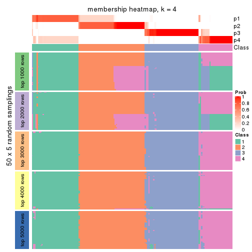</p>

</div>
<div id='tab-CV-NMF-membership-heatmap-4'>
<pre><code class="r">membership_heatmap(res, k = 5)
</code></pre>

<p></p>

</div>
<div id='tab-CV-NMF-membership-heatmap-5'>
<pre><code class="r">membership_heatmap(res, k = 6)
</code></pre>

<p></p>

</div>
</div>

As soon as we have had the classes for columns, we can look for signatures
which are significantly different between classes which can be candidate marks
for certain classes. Following are the heatmaps for signatures.


Signature heatmaps where rows are scaled:


<script>
$( function() {
	$( '#tabs-CV-NMF-get-signatures' ).tabs();
} );
</script>
<div id='tabs-CV-NMF-get-signatures'>
<ul>
<li><a href='#tab-CV-NMF-get-signatures-1'>k = 2</a></li>
<li><a href='#tab-CV-NMF-get-signatures-2'>k = 3</a></li>
<li><a href='#tab-CV-NMF-get-signatures-3'>k = 4</a></li>
<li><a href='#tab-CV-NMF-get-signatures-4'>k = 5</a></li>
<li><a href='#tab-CV-NMF-get-signatures-5'>k = 6</a></li>
</ul>
<div id='tab-CV-NMF-get-signatures-1'>
<pre><code class="r">get_signatures(res, k = 2)
</code></pre>

<p></p>

</div>
<div id='tab-CV-NMF-get-signatures-2'>
<pre><code class="r">get_signatures(res, k = 3)
</code></pre>

<p></p>

</div>
<div id='tab-CV-NMF-get-signatures-3'>
<pre><code class="r">get_signatures(res, k = 4)
</code></pre>

<p></p>

</div>
<div id='tab-CV-NMF-get-signatures-4'>
<pre><code class="r">get_signatures(res, k = 5)
</code></pre>

<p></p>

</div>
<div id='tab-CV-NMF-get-signatures-5'>
<pre><code class="r">get_signatures(res, k = 6)
</code></pre>

<p></p>

</div>
</div>


Signature heatmaps where rows are not scaled:


<script>
$( function() {
	$( '#tabs-CV-NMF-get-signatures-no-scale' ).tabs();
} );
</script>
<div id='tabs-CV-NMF-get-signatures-no-scale'>
<ul>
<li><a href='#tab-CV-NMF-get-signatures-no-scale-1'>k = 2</a></li>
<li><a href='#tab-CV-NMF-get-signatures-no-scale-2'>k = 3</a></li>
<li><a href='#tab-CV-NMF-get-signatures-no-scale-3'>k = 4</a></li>
<li><a href='#tab-CV-NMF-get-signatures-no-scale-4'>k = 5</a></li>
<li><a href='#tab-CV-NMF-get-signatures-no-scale-5'>k = 6</a></li>
</ul>
<div id='tab-CV-NMF-get-signatures-no-scale-1'>
<pre><code class="r">get_signatures(res, k = 2, scale_rows = FALSE)
</code></pre>

<p></p>

</div>
<div id='tab-CV-NMF-get-signatures-no-scale-2'>
<pre><code class="r">get_signatures(res, k = 3, scale_rows = FALSE)
</code></pre>

<p></p>

</div>
<div id='tab-CV-NMF-get-signatures-no-scale-3'>
<pre><code class="r">get_signatures(res, k = 4, scale_rows = FALSE)
</code></pre>

<p>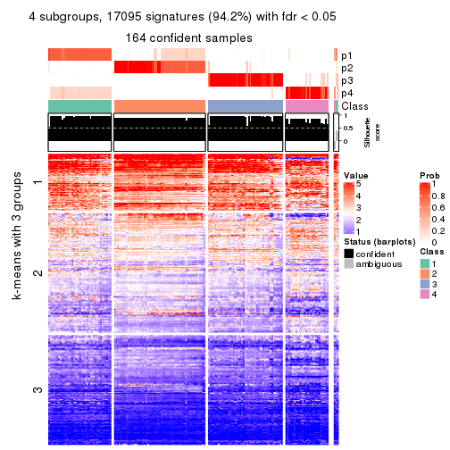</p>

</div>
<div id='tab-CV-NMF-get-signatures-no-scale-4'>
<pre><code class="r">get_signatures(res, k = 5, scale_rows = FALSE)
</code></pre>

<p></p>

</div>
<div id='tab-CV-NMF-get-signatures-no-scale-5'>
<pre><code class="r">get_signatures(res, k = 6, scale_rows = FALSE)
</code></pre>

<p></p>

</div>
</div>


Compare the overlap of signatures from different k:

```r
compare_signatures(res)
```


`get_signature()` returns a data frame invisibly. TO get the list of signatures, the function
call should be assigned to a variable explicitly. In following code, if `plot` argument is set
to `FALSE`, no heatmap is plotted while only the differential analysis is performed.

```r
# code only for demonstration
tb = get_signature(res, k = ..., plot = FALSE)
```

An example of the output of `tb` is:

```
#>   which_row         fdr    mean_1    mean_2 scaled_mean_1 scaled_mean_2 km
#> 1        38 0.042760348  8.373488  9.131774    -0.5533452     0.5164555  1
#> 2        40 0.018707592  7.106213  8.469186    -0.6173731     0.5762149  1
#> 3        55 0.019134737 10.221463 11.207825    -0.6159697     0.5749050  1
#> 4        59 0.006059896  5.921854  7.869574    -0.6899429     0.6439467  1
#> 5        60 0.018055526  8.928898 10.211722    -0.6204761     0.5791110  1
#> 6        98 0.009384629 15.714769 14.887706     0.6635654    -0.6193277  2
...
```

The columns in `tb` are:

1. `which_row`: row indices corresponding to the input matrix.
2. `fdr`: FDR for the differential test. 
3. `mean_x`: The mean value in group x.
4. `scaled_mean_x`: The mean value in group x after rows are scaled.
5. `km`: Row groups if k-means clustering is applied to rows.


UMAP plot which shows how samples are separated.


<script>
$( function() {
	$( '#tabs-CV-NMF-dimension-reduction' ).tabs();
} );
</script>
<div id='tabs-CV-NMF-dimension-reduction'>
<ul>
<li><a href='#tab-CV-NMF-dimension-reduction-1'>k = 2</a></li>
<li><a href='#tab-CV-NMF-dimension-reduction-2'>k = 3</a></li>
<li><a href='#tab-CV-NMF-dimension-reduction-3'>k = 4</a></li>
<li><a href='#tab-CV-NMF-dimension-reduction-4'>k = 5</a></li>
<li><a href='#tab-CV-NMF-dimension-reduction-5'>k = 6</a></li>
</ul>
<div id='tab-CV-NMF-dimension-reduction-1'>
<pre><code class="r">dimension_reduction(res, k = 2, method = &quot;UMAP&quot;)
</code></pre>

<p></p>

</div>
<div id='tab-CV-NMF-dimension-reduction-2'>
<pre><code class="r">dimension_reduction(res, k = 3, method = &quot;UMAP&quot;)
</code></pre>

<p></p>

</div>
<div id='tab-CV-NMF-dimension-reduction-3'>
<pre><code class="r">dimension_reduction(res, k = 4, method = &quot;UMAP&quot;)
</code></pre>

<p></p>

</div>
<div id='tab-CV-NMF-dimension-reduction-4'>
<pre><code class="r">dimension_reduction(res, k = 5, method = &quot;UMAP&quot;)
</code></pre>

<p></p>

</div>
<div id='tab-CV-NMF-dimension-reduction-5'>
<pre><code class="r">dimension_reduction(res, k = 6, method = &quot;UMAP&quot;)
</code></pre>

<p></p>

</div>
</div>


Following heatmap shows how subgroups are split when increasing `k`:

```r
collect_classes(res)
```


If matrix rows can be associated to genes, consider to use `functional_enrichment(res,
...)` to perform function enrichment for the signature genes. See [this vignette](http://bioconductor.org/packages/devel/bioc/vignettes/cola/inst/doc/functional_enrichment.html) for more detailed explanations.


 

---------------------------------------------------


### MAD:hclust


The object with results only for a single top-value method and a single partition method 
can be extracted as:

```r
res = res_list["MAD", "hclust"]
# you can also extract it by
# res = res_list["MAD:hclust"]
```

A summary of `res` and all the functions that can be applied to it:

```r
res
```

```
#> A 'ConsensusPartition' object with k = 2, 3, 4, 5, 6.
#>   On a matrix with 18147 rows and 167 columns.
#>   Top rows (1000, 2000, 3000, 4000, 5000) are extracted by 'MAD' method.
#>   Subgroups are detected by 'hclust' method.
#>   Performed in total 1250 partitions by row resampling.
#>   Best k for subgroups seems to be 3.
#> 
#> Following methods can be applied to this 'ConsensusPartition' object:
#>  [1] "cola_report"             "collect_classes"         "collect_plots"          
#>  [4] "collect_stats"           "colnames"                "compare_signatures"     
#>  [7] "consensus_heatmap"       "dimension_reduction"     "functional_enrichment"  
#> [10] "get_anno_col"            "get_anno"                "get_classes"            
#> [13] "get_consensus"           "get_matrix"              "get_membership"         
#> [16] "get_param"               "get_signatures"          "get_stats"              
#> [19] "is_best_k"               "is_stable_k"             "membership_heatmap"     
#> [22] "ncol"                    "nrow"                    "plot_ecdf"              
#> [25] "rownames"                "select_partition_number" "show"                   
#> [28] "suggest_best_k"          "test_to_known_factors"
```

`collect_plots()` function collects all the plots made from `res` for all `k` (number of partitions)
into one single page to provide an easy and fast comparison between different `k`.

```r
collect_plots(res)
```


The plots are:

- The first row: a plot of the ECDF (empirical cumulative distribution
  function) curves of the consensus matrix for each `k` and the heatmap of
  predicted classes for each `k`.
- The second row: heatmaps of the consensus matrix for each `k`.
- The third row: heatmaps of the membership matrix for each `k`.
- The fouth row: heatmaps of the signatures for each `k`.

All the plots in panels can be made by individual functions and they are
plotted later in this section.

`select_partition_number()` produces several plots showing different
statistics for choosing "optimized" `k`. There are following statistics:

- ECDF curves of the consensus matrix for each `k`;
- 1-PAC. [The PAC
  score](https://en.wikipedia.org/wiki/Consensus_clustering#Over-interpretation_potential_of_consensus_clustering)
  measures the proportion of the ambiguous subgrouping.
- Mean silhouette score.
- Concordance. The mean probability of fiting the consensus class ids in all
  partitions.
- Area increased. Denote $A_k$ as the area under the ECDF curve for current
  `k`, the area increased is defined as $A_k - A_{k-1}$.
- Rand index. The percent of pairs of samples that are both in a same cluster
  or both are not in a same cluster in the partition of k and k-1.
- Jaccard index. The ratio of pairs of samples are both in a same cluster in
  the partition of k and k-1 and the pairs of samples are both in a same
  cluster in the partition k or k-1.

The detailed explanations of these statistics can be found in [the _cola_
vignette](http://bioconductor.org/packages/devel/bioc/vignettes/cola/inst/doc/cola.html#toc_13).

Generally speaking, lower PAC score, higher mean silhouette score or higher
concordance corresponds to better partition. Rand index and Jaccard index
measure how similar the current partition is compared to partition with `k-1`.
If they are too similar, we won't accept `k` is better than `k-1`.

```r
select_partition_number(res)
```


The numeric values for all these statistics can be obtained by `get_stats()`.

```r
get_stats(res)
```

```
#>   k 1-PAC mean_silhouette concordance area_increased  Rand Jaccard
#> 2 2 0.450           0.857       0.876         0.4309 0.540   0.540
#> 3 3 0.573           0.799       0.879         0.4647 0.796   0.634
#> 4 4 0.570           0.615       0.791         0.1004 0.972   0.924
#> 5 5 0.611           0.534       0.731         0.0508 0.934   0.816
#> 6 6 0.656           0.481       0.682         0.0347 0.908   0.730
```

`suggest_best_k()` suggests the best $k$ based on these statistics. The rules are as follows:

- All $k$ with Jaccard index larger than 0.95 are removed because increasing
  $k$ does not provide enough extra information. If all $k$ are removed, it is
  marked as no subgroup is detected.
- For all $k$ with 1-PAC score larger than 0.9, the maximal $k$ is taken as
  the best $k$, and other $k$ are marked as optional $k$.
- If it does not fit the second rule. The $k$ with the maximal vote of the
  highest 1-PAC score, highest mean silhouette, and highest concordance is
  taken as the best $k$.

```r
suggest_best_k(res)
```

```
#> [1] 3
```


Following shows the table of the partitions (You need to click the **show/hide
code output** link to see it). The membership matrix (columns with name `p*`)
is inferred by
[`clue::cl_consensus()`](https://www.rdocumentation.org/link/cl_consensus?package=clue)
function with the `SE` method. Basically the value in the membership matrix
represents the probability to belong to a certain group. The finall class
label for an item is determined with the group with highest probability it
belongs to.

In `get_classes()` function, the entropy is calculated from the membership
matrix and the silhouette score is calculated from the consensus matrix.


<script>
$( function() {
	$( '#tabs-MAD-hclust-get-classes' ).tabs();
} );
</script>
<div id='tabs-MAD-hclust-get-classes'>
<ul>
<li><a href='#tab-MAD-hclust-get-classes-1'>k = 2</a></li>
<li><a href='#tab-MAD-hclust-get-classes-2'>k = 3</a></li>
<li><a href='#tab-MAD-hclust-get-classes-3'>k = 4</a></li>
<li><a href='#tab-MAD-hclust-get-classes-4'>k = 5</a></li>
<li><a href='#tab-MAD-hclust-get-classes-5'>k = 6</a></li>
</ul>

<div id='tab-MAD-hclust-get-classes-1'>
<p><a id='tab-MAD-hclust-get-classes-1-a' style='color:#0366d6' href='#'>show/hide code output</a></p>
<pre><code class="r">cbind(get_classes(res, k = 2), get_membership(res, k = 2))
</code></pre>

<pre><code>#&gt;            class entropy silhouette    p1    p2
#&gt; SRR1313062     1  0.0376      0.807 0.996 0.004
#&gt; SRR1313063     1  0.0376      0.807 0.996 0.004
#&gt; SRR1313064     1  0.0000      0.806 1.000 0.000
#&gt; SRR1313065     1  0.1843      0.823 0.972 0.028
#&gt; SRR1313066     1  0.0000      0.806 1.000 0.000
#&gt; SRR1313067     1  0.1633      0.820 0.976 0.024
#&gt; SRR1313068     1  0.0376      0.807 0.996 0.004
#&gt; SRR1313069     1  0.0000      0.806 1.000 0.000
#&gt; SRR1313070     1  0.0000      0.806 1.000 0.000
#&gt; SRR1313071     1  0.0000      0.806 1.000 0.000
#&gt; SRR1313072     1  0.0000      0.806 1.000 0.000
#&gt; SRR1313073     1  0.0376      0.807 0.996 0.004
#&gt; SRR1313074     1  0.0000      0.806 1.000 0.000
#&gt; SRR1313075     1  0.0000      0.806 1.000 0.000
#&gt; SRR1313076     1  0.0376      0.807 0.996 0.004
#&gt; SRR1313077     1  0.0376      0.807 0.996 0.004
#&gt; SRR1313078     1  0.0376      0.807 0.996 0.004
#&gt; SRR1313079     1  0.0000      0.806 1.000 0.000
#&gt; SRR1313080     1  0.0376      0.807 0.996 0.004
#&gt; SRR1313081     1  0.0376      0.807 0.996 0.004
#&gt; SRR1313082     1  0.1843      0.823 0.972 0.028
#&gt; SRR1313083     1  0.1843      0.823 0.972 0.028
#&gt; SRR1313084     1  0.0000      0.806 1.000 0.000
#&gt; SRR1313085     1  0.0000      0.806 1.000 0.000
#&gt; SRR1313086     1  0.5178      0.869 0.884 0.116
#&gt; SRR1313087     1  0.0000      0.806 1.000 0.000
#&gt; SRR1313088     1  0.0000      0.806 1.000 0.000
#&gt; SRR1313089     1  0.0000      0.806 1.000 0.000
#&gt; SRR1313092     1  0.7602      0.877 0.780 0.220
#&gt; SRR1313090     1  0.8081      0.859 0.752 0.248
#&gt; SRR1313091     1  0.9963      0.477 0.536 0.464
#&gt; SRR1313093     1  0.6531      0.885 0.832 0.168
#&gt; SRR1313095     1  0.6712      0.886 0.824 0.176
#&gt; SRR1313096     1  0.6531      0.885 0.832 0.168
#&gt; SRR1313094     1  0.7602      0.877 0.780 0.220
#&gt; SRR1313097     1  0.8267      0.848 0.740 0.260
#&gt; SRR1313099     1  0.9087      0.775 0.676 0.324
#&gt; SRR1313098     1  0.6531      0.885 0.832 0.168
#&gt; SRR1313101     1  0.8081      0.858 0.752 0.248
#&gt; SRR1313102     1  0.8081      0.859 0.752 0.248
#&gt; SRR1313103     1  0.8861      0.802 0.696 0.304
#&gt; SRR1313100     1  0.6801      0.887 0.820 0.180
#&gt; SRR1313105     1  0.9460      0.710 0.636 0.364
#&gt; SRR1313104     1  0.8081      0.859 0.752 0.248
#&gt; SRR1313107     1  0.9087      0.775 0.676 0.324
#&gt; SRR1313106     2  0.9933     -0.215 0.452 0.548
#&gt; SRR1313109     1  0.9970      0.466 0.532 0.468
#&gt; SRR1313108     1  0.6531      0.885 0.832 0.168
#&gt; SRR1313111     1  0.8861      0.802 0.696 0.304
#&gt; SRR1313110     1  0.8016      0.861 0.756 0.244
#&gt; SRR1313112     1  0.8327      0.844 0.736 0.264
#&gt; SRR1313113     1  0.8763      0.809 0.704 0.296
#&gt; SRR1313115     1  0.6531      0.885 0.832 0.168
#&gt; SRR1313114     1  0.7815      0.868 0.768 0.232
#&gt; SRR1313117     1  0.8081      0.858 0.752 0.248
#&gt; SRR1313118     1  0.7950      0.863 0.760 0.240
#&gt; SRR1313116     2  0.8608      0.476 0.284 0.716
#&gt; SRR1313120     1  0.9087      0.775 0.676 0.324
#&gt; SRR1313119     1  0.8081      0.859 0.752 0.248
#&gt; SRR1313122     1  0.6712      0.886 0.824 0.176
#&gt; SRR1313124     1  0.8081      0.859 0.752 0.248
#&gt; SRR1313121     1  0.8081      0.859 0.752 0.248
#&gt; SRR1313125     1  0.8081      0.858 0.752 0.248
#&gt; SRR1313127     1  0.6623      0.886 0.828 0.172
#&gt; SRR1313123     1  0.7815      0.868 0.768 0.232
#&gt; SRR1313128     1  0.7139      0.885 0.804 0.196
#&gt; SRR1313126     1  0.6531      0.885 0.832 0.168
#&gt; SRR1313130     1  0.9963      0.477 0.536 0.464
#&gt; SRR1313132     1  0.8661      0.823 0.712 0.288
#&gt; SRR1313129     1  0.8955      0.790 0.688 0.312
#&gt; SRR1313133     1  0.7139      0.885 0.804 0.196
#&gt; SRR1313131     1  0.6531      0.885 0.832 0.168
#&gt; SRR1313134     1  0.7139      0.885 0.804 0.196
#&gt; SRR1313135     1  0.7139      0.885 0.804 0.196
#&gt; SRR1313136     1  0.7139      0.885 0.804 0.196
#&gt; SRR1313137     1  0.6973      0.886 0.812 0.188
#&gt; SRR1313138     1  0.7056      0.886 0.808 0.192
#&gt; SRR1313140     1  0.5629      0.876 0.868 0.132
#&gt; SRR1313141     1  0.6531      0.885 0.832 0.168
#&gt; SRR1313139     1  0.5629      0.876 0.868 0.132
#&gt; SRR1313143     1  0.6531      0.885 0.832 0.168
#&gt; SRR1313142     1  0.7056      0.886 0.808 0.192
#&gt; SRR1313144     1  0.7528      0.879 0.784 0.216
#&gt; SRR1313145     1  0.7139      0.885 0.804 0.196
#&gt; SRR1313146     1  0.7139      0.885 0.804 0.196
#&gt; SRR1313147     1  0.6973      0.886 0.812 0.188
#&gt; SRR1313150     1  0.6973      0.886 0.812 0.188
#&gt; SRR1313149     1  0.6531      0.885 0.832 0.168
#&gt; SRR1313152     1  0.6973      0.886 0.812 0.188
#&gt; SRR1313151     1  0.7139      0.885 0.804 0.196
#&gt; SRR1313154     1  0.7453      0.881 0.788 0.212
#&gt; SRR1313153     1  0.7056      0.886 0.808 0.192
#&gt; SRR1313156     1  0.7056      0.886 0.808 0.192
#&gt; SRR1313155     1  0.7139      0.885 0.804 0.196
#&gt; SRR1313157     1  0.6973      0.886 0.812 0.188
#&gt; SRR1313158     1  0.7139      0.885 0.804 0.196
#&gt; SRR1313161     1  0.6973      0.886 0.812 0.188
#&gt; SRR1313159     1  0.9977      0.441 0.528 0.472
#&gt; SRR1313160     1  0.6973      0.886 0.812 0.188
#&gt; SRR1313162     1  0.6531      0.886 0.832 0.168
#&gt; SRR1313163     1  0.7056      0.886 0.808 0.192
#&gt; SRR1313165     1  0.6973      0.886 0.812 0.188
#&gt; SRR1313166     1  0.7139      0.885 0.804 0.196
#&gt; SRR1313164     1  0.7883      0.870 0.764 0.236
#&gt; SRR1313167     1  0.6973      0.886 0.812 0.188
#&gt; SRR1313168     1  0.6973      0.886 0.812 0.188
#&gt; SRR1313170     2  0.7056      0.703 0.192 0.808
#&gt; SRR1313169     1  0.6973      0.886 0.812 0.188
#&gt; SRR1313172     2  0.9427      0.218 0.360 0.640
#&gt; SRR1313171     1  0.7883      0.870 0.764 0.236
#&gt; SRR1313174     2  0.0000      0.950 0.000 1.000
#&gt; SRR1313173     1  0.6531      0.885 0.832 0.168
#&gt; SRR1313176     2  0.0376      0.951 0.004 0.996
#&gt; SRR1313175     2  0.0000      0.950 0.000 1.000
#&gt; SRR1313178     2  0.0376      0.951 0.004 0.996
#&gt; SRR1313177     2  0.0376      0.951 0.004 0.996
#&gt; SRR1313179     2  0.2043      0.930 0.032 0.968
#&gt; SRR1313180     2  0.4161      0.880 0.084 0.916
#&gt; SRR1313181     2  0.0376      0.951 0.004 0.996
#&gt; SRR1313183     2  0.0376      0.951 0.004 0.996
#&gt; SRR1313182     2  0.0000      0.950 0.000 1.000
#&gt; SRR1313184     2  0.2043      0.930 0.032 0.968
#&gt; SRR1313185     2  0.0000      0.950 0.000 1.000
#&gt; SRR1313188     2  0.4161      0.880 0.084 0.916
#&gt; SRR1313187     2  0.4161      0.880 0.084 0.916
#&gt; SRR1313186     2  0.0000      0.950 0.000 1.000
#&gt; SRR1313189     2  0.0376      0.951 0.004 0.996
#&gt; SRR1313190     2  0.0376      0.951 0.004 0.996
#&gt; SRR1313191     2  0.0000      0.950 0.000 1.000
#&gt; SRR1313192     2  0.0000      0.950 0.000 1.000
#&gt; SRR1313193     2  0.0376      0.951 0.004 0.996
#&gt; SRR1313194     2  0.4161      0.880 0.084 0.916
#&gt; SRR1313195     2  0.4161      0.880 0.084 0.916
#&gt; SRR1313196     2  0.4161      0.880 0.084 0.916
#&gt; SRR1313197     2  0.0000      0.950 0.000 1.000
#&gt; SRR1313198     2  0.0000      0.950 0.000 1.000
#&gt; SRR1313199     2  0.0376      0.951 0.004 0.996
#&gt; SRR1313200     2  0.4161      0.880 0.084 0.916
#&gt; SRR1313201     2  0.0376      0.951 0.004 0.996
#&gt; SRR1313202     2  0.4161      0.880 0.084 0.916
#&gt; SRR1313203     1  0.8443      0.721 0.728 0.272
#&gt; SRR1313204     2  0.0376      0.951 0.004 0.996
#&gt; SRR1313205     2  0.0376      0.951 0.004 0.996
#&gt; SRR1313207     2  0.0376      0.951 0.004 0.996
#&gt; SRR1313208     2  0.0376      0.951 0.004 0.996
#&gt; SRR1313206     2  0.0376      0.951 0.004 0.996
#&gt; SRR1313210     2  0.0000      0.950 0.000 1.000
#&gt; SRR1313209     2  0.0000      0.950 0.000 1.000
#&gt; SRR1313211     2  0.0000      0.950 0.000 1.000
#&gt; SRR1313212     2  0.0376      0.951 0.004 0.996
#&gt; SRR1313214     2  0.0000      0.950 0.000 1.000
#&gt; SRR1313215     2  0.0000      0.950 0.000 1.000
#&gt; SRR1313213     2  0.0376      0.951 0.004 0.996
#&gt; SRR1313216     2  0.0376      0.949 0.004 0.996
#&gt; SRR1313217     2  0.0000      0.950 0.000 1.000
#&gt; SRR1313219     2  0.0000      0.950 0.000 1.000
#&gt; SRR1313220     2  0.0376      0.951 0.004 0.996
#&gt; SRR1313218     2  0.0000      0.950 0.000 1.000
#&gt; SRR1313222     2  0.0376      0.951 0.004 0.996
#&gt; SRR1313221     2  0.0376      0.951 0.004 0.996
#&gt; SRR1313223     2  0.0376      0.951 0.004 0.996
#&gt; SRR1313224     2  0.0000      0.950 0.000 1.000
#&gt; SRR1313225     2  0.0000      0.950 0.000 1.000
#&gt; SRR1313226     2  0.4298      0.874 0.088 0.912
#&gt; SRR1313227     2  0.0376      0.951 0.004 0.996
#&gt; SRR1313228     2  0.0376      0.951 0.004 0.996
#&gt; SRR1313229     2  0.0376      0.951 0.004 0.996
</code></pre>

<script>
$('#tab-MAD-hclust-get-classes-1-a').parent().next().next().hide();
$('#tab-MAD-hclust-get-classes-1-a').click(function(){
  $('#tab-MAD-hclust-get-classes-1-a').parent().next().next().toggle();
  return(false);
});
</script>
</div>

<div id='tab-MAD-hclust-get-classes-2'>
<p><a id='tab-MAD-hclust-get-classes-2-a' style='color:#0366d6' href='#'>show/hide code output</a></p>
<pre><code class="r">cbind(get_classes(res, k = 3), get_membership(res, k = 3))
</code></pre>

<pre><code>#&gt;            class entropy silhouette    p1    p2    p3
#&gt; SRR1313062     1  0.2625     0.8649 0.916 0.000 0.084
#&gt; SRR1313063     1  0.2625     0.8649 0.916 0.000 0.084
#&gt; SRR1313064     1  0.0983     0.8780 0.980 0.004 0.016
#&gt; SRR1313065     1  0.2772     0.8578 0.916 0.004 0.080
#&gt; SRR1313066     1  0.0983     0.8780 0.980 0.004 0.016
#&gt; SRR1313067     1  0.3116     0.8442 0.892 0.000 0.108
#&gt; SRR1313068     1  0.2625     0.8649 0.916 0.000 0.084
#&gt; SRR1313069     1  0.1129     0.8781 0.976 0.004 0.020
#&gt; SRR1313070     1  0.0983     0.8780 0.980 0.004 0.016
#&gt; SRR1313071     1  0.0983     0.8780 0.980 0.004 0.016
#&gt; SRR1313072     1  0.0983     0.8780 0.980 0.004 0.016
#&gt; SRR1313073     1  0.2625     0.8649 0.916 0.000 0.084
#&gt; SRR1313074     1  0.0983     0.8780 0.980 0.004 0.016
#&gt; SRR1313075     1  0.0983     0.8780 0.980 0.004 0.016
#&gt; SRR1313076     1  0.2711     0.8625 0.912 0.000 0.088
#&gt; SRR1313077     1  0.2711     0.8625 0.912 0.000 0.088
#&gt; SRR1313078     1  0.2711     0.8625 0.912 0.000 0.088
#&gt; SRR1313079     1  0.0983     0.8780 0.980 0.004 0.016
#&gt; SRR1313080     1  0.2625     0.8649 0.916 0.000 0.084
#&gt; SRR1313081     1  0.2711     0.8625 0.912 0.000 0.088
#&gt; SRR1313082     1  0.2772     0.8578 0.916 0.004 0.080
#&gt; SRR1313083     1  0.2772     0.8578 0.916 0.004 0.080
#&gt; SRR1313084     1  0.0983     0.8780 0.980 0.004 0.016
#&gt; SRR1313085     1  0.0983     0.8780 0.980 0.004 0.016
#&gt; SRR1313086     1  0.4805     0.7431 0.812 0.012 0.176
#&gt; SRR1313087     1  0.0983     0.8780 0.980 0.004 0.016
#&gt; SRR1313088     1  0.1129     0.8781 0.976 0.004 0.020
#&gt; SRR1313089     1  0.0983     0.8780 0.980 0.004 0.016
#&gt; SRR1313092     3  0.3623     0.8088 0.072 0.032 0.896
#&gt; SRR1313090     3  0.2806     0.8031 0.040 0.032 0.928
#&gt; SRR1313091     3  0.6200     0.5253 0.012 0.312 0.676
#&gt; SRR1313093     3  0.5016     0.6510 0.240 0.000 0.760
#&gt; SRR1313095     3  0.5247     0.6823 0.224 0.008 0.768
#&gt; SRR1313096     3  0.5465     0.5738 0.288 0.000 0.712
#&gt; SRR1313094     3  0.3337     0.8107 0.060 0.032 0.908
#&gt; SRR1313097     3  0.2229     0.8025 0.012 0.044 0.944
#&gt; SRR1313099     3  0.3213     0.7740 0.008 0.092 0.900
#&gt; SRR1313098     3  0.4755     0.7244 0.184 0.008 0.808
#&gt; SRR1313101     3  0.1877     0.8044 0.012 0.032 0.956
#&gt; SRR1313102     3  0.2031     0.8044 0.016 0.032 0.952
#&gt; SRR1313103     3  0.2866     0.7869 0.008 0.076 0.916
#&gt; SRR1313100     3  0.5122     0.7126 0.200 0.012 0.788
#&gt; SRR1313105     3  0.3851     0.7448 0.004 0.136 0.860
#&gt; SRR1313104     3  0.2806     0.8031 0.040 0.032 0.928
#&gt; SRR1313107     3  0.3213     0.7740 0.008 0.092 0.900
#&gt; SRR1313106     3  0.6688     0.2807 0.012 0.408 0.580
#&gt; SRR1313109     3  0.6255     0.5095 0.012 0.320 0.668
#&gt; SRR1313108     3  0.5465     0.5738 0.288 0.000 0.712
#&gt; SRR1313111     3  0.2866     0.7869 0.008 0.076 0.916
#&gt; SRR1313110     3  0.3112     0.7989 0.056 0.028 0.916
#&gt; SRR1313112     3  0.2339     0.8021 0.012 0.048 0.940
#&gt; SRR1313113     3  0.3120     0.7877 0.012 0.080 0.908
#&gt; SRR1313115     3  0.5016     0.6510 0.240 0.000 0.760
#&gt; SRR1313114     3  0.3181     0.7965 0.064 0.024 0.912
#&gt; SRR1313117     3  0.1877     0.8044 0.012 0.032 0.956
#&gt; SRR1313118     3  0.2903     0.8017 0.048 0.028 0.924
#&gt; SRR1313116     3  0.6683    -0.0416 0.008 0.496 0.496
#&gt; SRR1313120     3  0.3213     0.7740 0.008 0.092 0.900
#&gt; SRR1313119     3  0.1877     0.8040 0.012 0.032 0.956
#&gt; SRR1313122     3  0.5656     0.6239 0.264 0.008 0.728
#&gt; SRR1313124     3  0.2806     0.8031 0.040 0.032 0.928
#&gt; SRR1313121     3  0.1905     0.8041 0.016 0.028 0.956
#&gt; SRR1313125     3  0.1877     0.8044 0.012 0.032 0.956
#&gt; SRR1313127     3  0.4531     0.7424 0.168 0.008 0.824
#&gt; SRR1313123     3  0.3083     0.7979 0.060 0.024 0.916
#&gt; SRR1313128     3  0.4521     0.7761 0.180 0.004 0.816
#&gt; SRR1313126     3  0.5335     0.6702 0.232 0.008 0.760
#&gt; SRR1313130     3  0.6200     0.5253 0.012 0.312 0.676
#&gt; SRR1313132     3  0.4745     0.8027 0.068 0.080 0.852
#&gt; SRR1313129     3  0.4575     0.7262 0.012 0.160 0.828
#&gt; SRR1313133     3  0.4047     0.7950 0.148 0.004 0.848
#&gt; SRR1313131     3  0.5859     0.4797 0.344 0.000 0.656
#&gt; SRR1313134     3  0.3551     0.7923 0.132 0.000 0.868
#&gt; SRR1313135     3  0.4280     0.8059 0.124 0.020 0.856
#&gt; SRR1313136     3  0.4280     0.8059 0.124 0.020 0.856
#&gt; SRR1313137     3  0.4418     0.8027 0.132 0.020 0.848
#&gt; SRR1313138     3  0.4349     0.8045 0.128 0.020 0.852
#&gt; SRR1313140     3  0.6754     0.2912 0.432 0.012 0.556
#&gt; SRR1313141     1  0.6309     0.0135 0.504 0.000 0.496
#&gt; SRR1313139     3  0.6754     0.2912 0.432 0.012 0.556
#&gt; SRR1313143     1  0.6309     0.0135 0.504 0.000 0.496
#&gt; SRR1313142     3  0.4349     0.8045 0.128 0.020 0.852
#&gt; SRR1313144     3  0.4891     0.8021 0.124 0.040 0.836
#&gt; SRR1313145     3  0.4280     0.8059 0.124 0.020 0.856
#&gt; SRR1313146     3  0.4280     0.8059 0.124 0.020 0.856
#&gt; SRR1313147     3  0.4418     0.8027 0.132 0.020 0.848
#&gt; SRR1313150     3  0.4418     0.8027 0.132 0.020 0.848
#&gt; SRR1313149     1  0.6309     0.0135 0.504 0.000 0.496
#&gt; SRR1313152     3  0.4418     0.8027 0.132 0.020 0.848
#&gt; SRR1313151     3  0.4280     0.8059 0.124 0.020 0.856
#&gt; SRR1313154     3  0.3295     0.8100 0.096 0.008 0.896
#&gt; SRR1313153     3  0.4349     0.8045 0.128 0.020 0.852
#&gt; SRR1313156     3  0.4349     0.8045 0.128 0.020 0.852
#&gt; SRR1313155     3  0.4280     0.8059 0.124 0.020 0.856
#&gt; SRR1313157     3  0.4418     0.8027 0.132 0.020 0.848
#&gt; SRR1313158     3  0.4280     0.8059 0.124 0.020 0.856
#&gt; SRR1313161     3  0.4418     0.8027 0.132 0.020 0.848
#&gt; SRR1313159     3  0.7406     0.4519 0.044 0.360 0.596
#&gt; SRR1313160     3  0.4418     0.8027 0.132 0.020 0.848
#&gt; SRR1313162     3  0.5122     0.7369 0.200 0.012 0.788
#&gt; SRR1313163     3  0.4349     0.8045 0.128 0.020 0.852
#&gt; SRR1313165     3  0.4418     0.8027 0.132 0.020 0.848
#&gt; SRR1313166     3  0.4280     0.8059 0.124 0.020 0.856
#&gt; SRR1313164     3  0.3765     0.8131 0.084 0.028 0.888
#&gt; SRR1313167     3  0.4418     0.8027 0.132 0.020 0.848
#&gt; SRR1313168     3  0.4418     0.8027 0.132 0.020 0.848
#&gt; SRR1313170     2  0.6341     0.5743 0.016 0.672 0.312
#&gt; SRR1313169     3  0.4418     0.8027 0.132 0.020 0.848
#&gt; SRR1313172     3  0.7274     0.2157 0.028 0.452 0.520
#&gt; SRR1313171     3  0.3765     0.8131 0.084 0.028 0.888
#&gt; SRR1313174     2  0.1643     0.9483 0.000 0.956 0.044
#&gt; SRR1313173     3  0.5859     0.4797 0.344 0.000 0.656
#&gt; SRR1313176     2  0.0000     0.9446 0.000 1.000 0.000
#&gt; SRR1313175     2  0.1753     0.9474 0.000 0.952 0.048
#&gt; SRR1313178     2  0.0000     0.9446 0.000 1.000 0.000
#&gt; SRR1313177     2  0.0000     0.9446 0.000 1.000 0.000
#&gt; SRR1313179     2  0.2486     0.9259 0.008 0.932 0.060
#&gt; SRR1313180     2  0.4514     0.8592 0.012 0.832 0.156
#&gt; SRR1313181     2  0.0000     0.9446 0.000 1.000 0.000
#&gt; SRR1313183     2  0.0000     0.9446 0.000 1.000 0.000
#&gt; SRR1313182     2  0.1411     0.9494 0.000 0.964 0.036
#&gt; SRR1313184     2  0.2486     0.9259 0.008 0.932 0.060
#&gt; SRR1313185     2  0.1529     0.9487 0.000 0.960 0.040
#&gt; SRR1313188     2  0.4514     0.8592 0.012 0.832 0.156
#&gt; SRR1313187     2  0.4514     0.8592 0.012 0.832 0.156
#&gt; SRR1313186     2  0.1529     0.9487 0.000 0.960 0.040
#&gt; SRR1313189     2  0.0000     0.9446 0.000 1.000 0.000
#&gt; SRR1313190     2  0.0000     0.9446 0.000 1.000 0.000
#&gt; SRR1313191     2  0.1643     0.9483 0.000 0.956 0.044
#&gt; SRR1313192     2  0.0747     0.9477 0.000 0.984 0.016
#&gt; SRR1313193     2  0.1289     0.9492 0.000 0.968 0.032
#&gt; SRR1313194     2  0.4514     0.8592 0.012 0.832 0.156
#&gt; SRR1313195     2  0.4514     0.8592 0.012 0.832 0.156
#&gt; SRR1313196     2  0.4514     0.8592 0.012 0.832 0.156
#&gt; SRR1313197     2  0.1643     0.9483 0.000 0.956 0.044
#&gt; SRR1313198     2  0.1753     0.9474 0.000 0.952 0.048
#&gt; SRR1313199     2  0.0000     0.9446 0.000 1.000 0.000
#&gt; SRR1313200     2  0.4514     0.8592 0.012 0.832 0.156
#&gt; SRR1313201     2  0.0000     0.9446 0.000 1.000 0.000
#&gt; SRR1313202     2  0.4514     0.8592 0.012 0.832 0.156
#&gt; SRR1313203     1  0.8536     0.5180 0.596 0.260 0.144
#&gt; SRR1313204     2  0.0424     0.9463 0.000 0.992 0.008
#&gt; SRR1313205     2  0.1289     0.9492 0.000 0.968 0.032
#&gt; SRR1313207     2  0.0000     0.9446 0.000 1.000 0.000
#&gt; SRR1313208     2  0.1289     0.9492 0.000 0.968 0.032
#&gt; SRR1313206     2  0.1031     0.9488 0.000 0.976 0.024
#&gt; SRR1313210     2  0.1753     0.9474 0.000 0.952 0.048
#&gt; SRR1313209     2  0.1643     0.9483 0.000 0.956 0.044
#&gt; SRR1313211     2  0.1411     0.9487 0.000 0.964 0.036
#&gt; SRR1313212     2  0.0000     0.9446 0.000 1.000 0.000
#&gt; SRR1313214     2  0.1753     0.9474 0.000 0.952 0.048
#&gt; SRR1313215     2  0.1753     0.9474 0.000 0.952 0.048
#&gt; SRR1313213     2  0.0000     0.9446 0.000 1.000 0.000
#&gt; SRR1313216     2  0.3193     0.9087 0.004 0.896 0.100
#&gt; SRR1313217     2  0.1753     0.9474 0.000 0.952 0.048
#&gt; SRR1313219     2  0.1753     0.9474 0.000 0.952 0.048
#&gt; SRR1313220     2  0.0000     0.9446 0.000 1.000 0.000
#&gt; SRR1313218     2  0.1411     0.9487 0.000 0.964 0.036
#&gt; SRR1313222     2  0.0000     0.9446 0.000 1.000 0.000
#&gt; SRR1313221     2  0.0000     0.9446 0.000 1.000 0.000
#&gt; SRR1313223     2  0.0000     0.9446 0.000 1.000 0.000
#&gt; SRR1313224     2  0.1411     0.9487 0.000 0.964 0.036
#&gt; SRR1313225     2  0.1753     0.9474 0.000 0.952 0.048
#&gt; SRR1313226     2  0.4575     0.8541 0.012 0.828 0.160
#&gt; SRR1313227     2  0.0000     0.9446 0.000 1.000 0.000
#&gt; SRR1313228     2  0.0000     0.9446 0.000 1.000 0.000
#&gt; SRR1313229     2  0.0000     0.9446 0.000 1.000 0.000
</code></pre>

<script>
$('#tab-MAD-hclust-get-classes-2-a').parent().next().next().hide();
$('#tab-MAD-hclust-get-classes-2-a').click(function(){
  $('#tab-MAD-hclust-get-classes-2-a').parent().next().next().toggle();
  return(false);
});
</script>
</div>

<div id='tab-MAD-hclust-get-classes-3'>
<p><a id='tab-MAD-hclust-get-classes-3-a' style='color:#0366d6' href='#'>show/hide code output</a></p>
<pre><code class="r">cbind(get_classes(res, k = 4), get_membership(res, k = 4))
</code></pre>

<pre><code>#&gt;            class entropy silhouette    p1    p2    p3    p4
#&gt; SRR1313062     4  0.4872     0.6643 0.244 0.000 0.028 0.728
#&gt; SRR1313063     4  0.4872     0.6643 0.244 0.000 0.028 0.728
#&gt; SRR1313064     4  0.0707     0.7770 0.000 0.000 0.020 0.980
#&gt; SRR1313065     4  0.2742     0.7171 0.024 0.000 0.076 0.900
#&gt; SRR1313066     4  0.0707     0.7770 0.000 0.000 0.020 0.980
#&gt; SRR1313067     4  0.5328     0.6423 0.248 0.000 0.048 0.704
#&gt; SRR1313068     4  0.4903     0.6620 0.248 0.000 0.028 0.724
#&gt; SRR1313069     4  0.1406     0.7685 0.016 0.000 0.024 0.960
#&gt; SRR1313070     4  0.0707     0.7770 0.000 0.000 0.020 0.980
#&gt; SRR1313071     4  0.0707     0.7770 0.000 0.000 0.020 0.980
#&gt; SRR1313072     4  0.0707     0.7770 0.000 0.000 0.020 0.980
#&gt; SRR1313073     4  0.4974     0.6814 0.224 0.000 0.040 0.736
#&gt; SRR1313074     4  0.0707     0.7770 0.000 0.000 0.020 0.980
#&gt; SRR1313075     4  0.0707     0.7770 0.000 0.000 0.020 0.980
#&gt; SRR1313076     4  0.4903     0.6621 0.248 0.000 0.028 0.724
#&gt; SRR1313077     4  0.4903     0.6621 0.248 0.000 0.028 0.724
#&gt; SRR1313078     4  0.4903     0.6621 0.248 0.000 0.028 0.724
#&gt; SRR1313079     4  0.0707     0.7770 0.000 0.000 0.020 0.980
#&gt; SRR1313080     4  0.4903     0.6620 0.248 0.000 0.028 0.724
#&gt; SRR1313081     4  0.4903     0.6621 0.248 0.000 0.028 0.724
#&gt; SRR1313082     4  0.2742     0.7171 0.024 0.000 0.076 0.900
#&gt; SRR1313083     4  0.2742     0.7171 0.024 0.000 0.076 0.900
#&gt; SRR1313084     4  0.0707     0.7770 0.000 0.000 0.020 0.980
#&gt; SRR1313085     4  0.0707     0.7770 0.000 0.000 0.020 0.980
#&gt; SRR1313086     4  0.4771     0.5642 0.060 0.004 0.148 0.788
#&gt; SRR1313087     4  0.0707     0.7770 0.000 0.000 0.020 0.980
#&gt; SRR1313088     4  0.1406     0.7685 0.016 0.000 0.024 0.960
#&gt; SRR1313089     4  0.0707     0.7770 0.000 0.000 0.020 0.980
#&gt; SRR1313092     3  0.2650     0.6549 0.036 0.008 0.916 0.040
#&gt; SRR1313090     3  0.2594     0.6575 0.044 0.036 0.916 0.004
#&gt; SRR1313091     3  0.4936     0.3153 0.012 0.316 0.672 0.000
#&gt; SRR1313093     3  0.6659    -0.3072 0.400 0.000 0.512 0.088
#&gt; SRR1313095     3  0.5396     0.3756 0.156 0.000 0.740 0.104
#&gt; SRR1313096     3  0.7073    -0.4453 0.412 0.000 0.464 0.124
#&gt; SRR1313094     3  0.2364     0.6624 0.036 0.008 0.928 0.028
#&gt; SRR1313097     3  0.1854     0.6677 0.012 0.048 0.940 0.000
#&gt; SRR1313099     3  0.4786     0.5513 0.104 0.108 0.788 0.000
#&gt; SRR1313098     3  0.4656     0.5041 0.136 0.000 0.792 0.072
#&gt; SRR1313101     3  0.1798     0.6688 0.016 0.040 0.944 0.000
#&gt; SRR1313102     3  0.2007     0.6681 0.020 0.036 0.940 0.004
#&gt; SRR1313103     3  0.2984     0.6410 0.028 0.084 0.888 0.000
#&gt; SRR1313100     3  0.5212     0.4437 0.140 0.004 0.764 0.092
#&gt; SRR1313105     3  0.3763     0.5898 0.024 0.144 0.832 0.000
#&gt; SRR1313104     3  0.2594     0.6575 0.044 0.036 0.916 0.004
#&gt; SRR1313107     3  0.4844     0.5467 0.108 0.108 0.784 0.000
#&gt; SRR1313106     3  0.5775     0.1376 0.032 0.408 0.560 0.000
#&gt; SRR1313109     3  0.5193     0.2893 0.020 0.324 0.656 0.000
#&gt; SRR1313108     3  0.7073    -0.4453 0.412 0.000 0.464 0.124
#&gt; SRR1313111     3  0.2984     0.6410 0.028 0.084 0.888 0.000
#&gt; SRR1313110     3  0.2814     0.6493 0.052 0.032 0.908 0.008
#&gt; SRR1313112     3  0.2142     0.6631 0.016 0.056 0.928 0.000
#&gt; SRR1313113     3  0.2542     0.6475 0.012 0.084 0.904 0.000
#&gt; SRR1313115     3  0.6659    -0.3072 0.400 0.000 0.512 0.088
#&gt; SRR1313114     3  0.3052     0.6415 0.064 0.032 0.896 0.008
#&gt; SRR1313117     3  0.1798     0.6688 0.016 0.040 0.944 0.000
#&gt; SRR1313118     3  0.2731     0.6553 0.048 0.032 0.912 0.008
#&gt; SRR1313116     2  0.5780    -0.0708 0.028 0.496 0.476 0.000
#&gt; SRR1313120     3  0.4786     0.5513 0.104 0.108 0.788 0.000
#&gt; SRR1313119     3  0.2007     0.6679 0.020 0.036 0.940 0.004
#&gt; SRR1313122     3  0.6027     0.2304 0.192 0.000 0.684 0.124
#&gt; SRR1313124     3  0.2594     0.6575 0.044 0.036 0.916 0.004
#&gt; SRR1313121     3  0.2019     0.6663 0.024 0.032 0.940 0.004
#&gt; SRR1313125     3  0.1677     0.6694 0.012 0.040 0.948 0.000
#&gt; SRR1313127     3  0.4301     0.5293 0.120 0.000 0.816 0.064
#&gt; SRR1313123     3  0.2907     0.6445 0.064 0.032 0.900 0.004
#&gt; SRR1313128     3  0.5696     0.5164 0.232 0.000 0.692 0.076
#&gt; SRR1313126     3  0.5484     0.3541 0.164 0.000 0.732 0.104
#&gt; SRR1313130     3  0.4936     0.3153 0.012 0.316 0.672 0.000
#&gt; SRR1313132     3  0.5446     0.6285 0.164 0.060 0.756 0.020
#&gt; SRR1313129     3  0.3672     0.5658 0.012 0.164 0.824 0.000
#&gt; SRR1313133     3  0.5123     0.5637 0.232 0.000 0.724 0.044
#&gt; SRR1313131     1  0.7249     0.4167 0.444 0.000 0.412 0.144
#&gt; SRR1313134     3  0.5272     0.3500 0.288 0.000 0.680 0.032
#&gt; SRR1313135     3  0.4683     0.6880 0.100 0.008 0.808 0.084
#&gt; SRR1313136     3  0.4683     0.6880 0.100 0.008 0.808 0.084
#&gt; SRR1313137     3  0.4750     0.6854 0.096 0.008 0.804 0.092
#&gt; SRR1313138     3  0.4687     0.6872 0.096 0.008 0.808 0.088
#&gt; SRR1313140     3  0.6612     0.2187 0.072 0.004 0.524 0.400
#&gt; SRR1313141     4  0.7883    -0.2909 0.316 0.000 0.300 0.384
#&gt; SRR1313139     3  0.6612     0.2187 0.072 0.004 0.524 0.400
#&gt; SRR1313143     4  0.7883    -0.2909 0.316 0.000 0.300 0.384
#&gt; SRR1313142     3  0.4687     0.6872 0.096 0.008 0.808 0.088
#&gt; SRR1313144     3  0.5083     0.6828 0.088 0.032 0.800 0.080
#&gt; SRR1313145     3  0.4683     0.6880 0.100 0.008 0.808 0.084
#&gt; SRR1313146     3  0.4683     0.6880 0.100 0.008 0.808 0.084
#&gt; SRR1313147     3  0.4750     0.6854 0.096 0.008 0.804 0.092
#&gt; SRR1313150     3  0.4750     0.6854 0.096 0.008 0.804 0.092
#&gt; SRR1313149     4  0.7883    -0.2909 0.316 0.000 0.300 0.384
#&gt; SRR1313152     3  0.4750     0.6854 0.096 0.008 0.804 0.092
#&gt; SRR1313151     3  0.4683     0.6880 0.100 0.008 0.808 0.084
#&gt; SRR1313154     3  0.4882     0.6552 0.164 0.004 0.776 0.056
#&gt; SRR1313153     3  0.4687     0.6872 0.096 0.008 0.808 0.088
#&gt; SRR1313156     3  0.4687     0.6872 0.096 0.008 0.808 0.088
#&gt; SRR1313155     3  0.4683     0.6880 0.100 0.008 0.808 0.084
#&gt; SRR1313157     3  0.4750     0.6854 0.096 0.008 0.804 0.092
#&gt; SRR1313158     3  0.4683     0.6880 0.100 0.008 0.808 0.084
#&gt; SRR1313161     3  0.4750     0.6854 0.096 0.008 0.804 0.092
#&gt; SRR1313159     3  0.6538     0.2533 0.072 0.332 0.588 0.008
#&gt; SRR1313160     3  0.4750     0.6854 0.096 0.008 0.804 0.092
#&gt; SRR1313162     3  0.5596     0.5498 0.180 0.004 0.728 0.088
#&gt; SRR1313163     3  0.4687     0.6872 0.096 0.008 0.808 0.088
#&gt; SRR1313165     3  0.4750     0.6854 0.096 0.008 0.804 0.092
#&gt; SRR1313166     3  0.4683     0.6880 0.100 0.008 0.808 0.084
#&gt; SRR1313164     3  0.5735     0.5417 0.208 0.020 0.720 0.052
#&gt; SRR1313167     3  0.4750     0.6854 0.096 0.008 0.804 0.092
#&gt; SRR1313168     3  0.4750     0.6854 0.096 0.008 0.804 0.092
#&gt; SRR1313170     2  0.5921     0.4272 0.068 0.672 0.256 0.004
#&gt; SRR1313169     3  0.4750     0.6854 0.096 0.008 0.804 0.092
#&gt; SRR1313172     1  0.7844     0.2870 0.444 0.236 0.316 0.004
#&gt; SRR1313171     3  0.5735     0.5417 0.208 0.020 0.720 0.052
#&gt; SRR1313174     2  0.0921     0.8079 0.000 0.972 0.028 0.000
#&gt; SRR1313173     1  0.7249     0.4167 0.444 0.000 0.412 0.144
#&gt; SRR1313176     2  0.4040     0.7541 0.248 0.752 0.000 0.000
#&gt; SRR1313175     2  0.1022     0.8072 0.000 0.968 0.032 0.000
#&gt; SRR1313178     2  0.4072     0.7520 0.252 0.748 0.000 0.000
#&gt; SRR1313177     2  0.4564     0.7055 0.328 0.672 0.000 0.000
#&gt; SRR1313179     2  0.5845     0.7411 0.252 0.672 0.076 0.000
#&gt; SRR1313180     2  0.3812     0.7042 0.028 0.832 0.140 0.000
#&gt; SRR1313181     2  0.4072     0.7520 0.252 0.748 0.000 0.000
#&gt; SRR1313183     2  0.4564     0.7055 0.328 0.672 0.000 0.000
#&gt; SRR1313182     2  0.1510     0.8111 0.016 0.956 0.028 0.000
#&gt; SRR1313184     2  0.5845     0.7411 0.252 0.672 0.076 0.000
#&gt; SRR1313185     2  0.1388     0.8099 0.012 0.960 0.028 0.000
#&gt; SRR1313188     2  0.3812     0.7042 0.028 0.832 0.140 0.000
#&gt; SRR1313187     2  0.3812     0.7042 0.028 0.832 0.140 0.000
#&gt; SRR1313186     2  0.1388     0.8099 0.012 0.960 0.028 0.000
#&gt; SRR1313189     2  0.4564     0.7055 0.328 0.672 0.000 0.000
#&gt; SRR1313190     2  0.4564     0.7055 0.328 0.672 0.000 0.000
#&gt; SRR1313191     2  0.0921     0.8079 0.000 0.972 0.028 0.000
#&gt; SRR1313192     2  0.2915     0.8082 0.080 0.892 0.028 0.000
#&gt; SRR1313193     2  0.1584     0.8092 0.036 0.952 0.012 0.000
#&gt; SRR1313194     2  0.3812     0.7042 0.028 0.832 0.140 0.000
#&gt; SRR1313195     2  0.3812     0.7042 0.028 0.832 0.140 0.000
#&gt; SRR1313196     2  0.3812     0.7042 0.028 0.832 0.140 0.000
#&gt; SRR1313197     2  0.0921     0.8079 0.000 0.972 0.028 0.000
#&gt; SRR1313198     2  0.1022     0.8072 0.000 0.968 0.032 0.000
#&gt; SRR1313199     2  0.4040     0.7541 0.248 0.752 0.000 0.000
#&gt; SRR1313200     2  0.3812     0.7042 0.028 0.832 0.140 0.000
#&gt; SRR1313201     2  0.4040     0.7541 0.248 0.752 0.000 0.000
#&gt; SRR1313202     2  0.3812     0.7042 0.028 0.832 0.140 0.000
#&gt; SRR1313203     1  0.8497    -0.1616 0.412 0.116 0.076 0.396
#&gt; SRR1313204     2  0.3893     0.7756 0.196 0.796 0.008 0.000
#&gt; SRR1313205     2  0.1388     0.8101 0.028 0.960 0.012 0.000
#&gt; SRR1313207     2  0.4564     0.7055 0.328 0.672 0.000 0.000
#&gt; SRR1313208     2  0.1388     0.8101 0.028 0.960 0.012 0.000
#&gt; SRR1313206     2  0.2737     0.7991 0.104 0.888 0.008 0.000
#&gt; SRR1313210     2  0.1022     0.8072 0.000 0.968 0.032 0.000
#&gt; SRR1313209     2  0.0921     0.8079 0.000 0.972 0.028 0.000
#&gt; SRR1313211     2  0.1833     0.8115 0.032 0.944 0.024 0.000
#&gt; SRR1313212     2  0.4040     0.7541 0.248 0.752 0.000 0.000
#&gt; SRR1313214     2  0.1022     0.8072 0.000 0.968 0.032 0.000
#&gt; SRR1313215     2  0.1022     0.8072 0.000 0.968 0.032 0.000
#&gt; SRR1313213     2  0.4564     0.7055 0.328 0.672 0.000 0.000
#&gt; SRR1313216     2  0.2266     0.7739 0.004 0.912 0.084 0.000
#&gt; SRR1313217     2  0.1022     0.8072 0.000 0.968 0.032 0.000
#&gt; SRR1313219     2  0.1022     0.8072 0.000 0.968 0.032 0.000
#&gt; SRR1313220     2  0.4040     0.7541 0.248 0.752 0.000 0.000
#&gt; SRR1313218     2  0.1733     0.8110 0.024 0.948 0.028 0.000
#&gt; SRR1313222     2  0.4564     0.7055 0.328 0.672 0.000 0.000
#&gt; SRR1313221     2  0.4543     0.7082 0.324 0.676 0.000 0.000
#&gt; SRR1313223     2  0.4564     0.7055 0.328 0.672 0.000 0.000
#&gt; SRR1313224     2  0.1733     0.8115 0.028 0.948 0.024 0.000
#&gt; SRR1313225     2  0.1022     0.8072 0.000 0.968 0.032 0.000
#&gt; SRR1313226     2  0.3863     0.6985 0.028 0.828 0.144 0.000
#&gt; SRR1313227     2  0.4072     0.7520 0.252 0.748 0.000 0.000
#&gt; SRR1313228     2  0.4072     0.7520 0.252 0.748 0.000 0.000
#&gt; SRR1313229     2  0.4072     0.7520 0.252 0.748 0.000 0.000
</code></pre>

<script>
$('#tab-MAD-hclust-get-classes-3-a').parent().next().next().hide();
$('#tab-MAD-hclust-get-classes-3-a').click(function(){
  $('#tab-MAD-hclust-get-classes-3-a').parent().next().next().toggle();
  return(false);
});
</script>
</div>

<div id='tab-MAD-hclust-get-classes-4'>
<p><a id='tab-MAD-hclust-get-classes-4-a' style='color:#0366d6' href='#'>show/hide code output</a></p>
<pre><code class="r">cbind(get_classes(res, k = 5), get_membership(res, k = 5))
</code></pre>

<pre><code>#&gt;            class entropy silhouette    p1    p2    p3    p4    p5
#&gt; SRR1313062     4  0.0162    0.40950 0.004 0.000 0.000 0.996 0.000
#&gt; SRR1313063     4  0.0162    0.40950 0.004 0.000 0.000 0.996 0.000
#&gt; SRR1313064     4  0.5396    0.62617 0.376 0.000 0.064 0.560 0.000
#&gt; SRR1313065     4  0.6146    0.54840 0.376 0.000 0.136 0.488 0.000
#&gt; SRR1313066     4  0.5415    0.62519 0.384 0.000 0.064 0.552 0.000
#&gt; SRR1313067     4  0.0798    0.38168 0.000 0.008 0.016 0.976 0.000
#&gt; SRR1313068     4  0.0794    0.38247 0.028 0.000 0.000 0.972 0.000
#&gt; SRR1313069     4  0.5559    0.61269 0.380 0.000 0.076 0.544 0.000
#&gt; SRR1313070     4  0.5415    0.62519 0.384 0.000 0.064 0.552 0.000
#&gt; SRR1313071     4  0.5415    0.62519 0.384 0.000 0.064 0.552 0.000
#&gt; SRR1313072     4  0.5415    0.62519 0.384 0.000 0.064 0.552 0.000
#&gt; SRR1313073     4  0.1410    0.43006 0.060 0.000 0.000 0.940 0.000
#&gt; SRR1313074     4  0.5396    0.62617 0.376 0.000 0.064 0.560 0.000
#&gt; SRR1313075     4  0.5396    0.62617 0.376 0.000 0.064 0.560 0.000
#&gt; SRR1313076     4  0.0162    0.40705 0.000 0.004 0.000 0.996 0.000
#&gt; SRR1313077     4  0.0162    0.40705 0.000 0.004 0.000 0.996 0.000
#&gt; SRR1313078     4  0.0162    0.40705 0.000 0.004 0.000 0.996 0.000
#&gt; SRR1313079     4  0.5396    0.62617 0.376 0.000 0.064 0.560 0.000
#&gt; SRR1313080     4  0.0794    0.38247 0.028 0.000 0.000 0.972 0.000
#&gt; SRR1313081     4  0.0162    0.40705 0.000 0.004 0.000 0.996 0.000
#&gt; SRR1313082     4  0.6146    0.54840 0.376 0.000 0.136 0.488 0.000
#&gt; SRR1313083     4  0.6146    0.54840 0.376 0.000 0.136 0.488 0.000
#&gt; SRR1313084     4  0.5415    0.62519 0.384 0.000 0.064 0.552 0.000
#&gt; SRR1313085     4  0.5415    0.62519 0.384 0.000 0.064 0.552 0.000
#&gt; SRR1313086     4  0.6824    0.37049 0.352 0.000 0.240 0.404 0.004
#&gt; SRR1313087     4  0.5396    0.62617 0.376 0.000 0.064 0.560 0.000
#&gt; SRR1313088     4  0.5559    0.61269 0.380 0.000 0.076 0.544 0.000
#&gt; SRR1313089     4  0.5396    0.62617 0.376 0.000 0.064 0.560 0.000
#&gt; SRR1313092     3  0.5623    0.71617 0.036 0.140 0.728 0.072 0.024
#&gt; SRR1313090     3  0.5732    0.71701 0.032 0.144 0.724 0.048 0.052
#&gt; SRR1313091     3  0.6649    0.46442 0.016 0.136 0.508 0.004 0.336
#&gt; SRR1313093     2  0.8418   -0.33122 0.160 0.324 0.232 0.284 0.000
#&gt; SRR1313095     3  0.6872    0.52647 0.052 0.128 0.568 0.248 0.004
#&gt; SRR1313096     2  0.8393   -0.35854 0.184 0.324 0.184 0.308 0.000
#&gt; SRR1313094     3  0.5443    0.72143 0.036 0.140 0.740 0.060 0.024
#&gt; SRR1313097     3  0.5084    0.72364 0.028 0.152 0.748 0.008 0.064
#&gt; SRR1313099     3  0.6732    0.64062 0.092 0.184 0.608 0.000 0.116
#&gt; SRR1313098     3  0.6326    0.60921 0.048 0.112 0.640 0.196 0.004
#&gt; SRR1313101     3  0.5217    0.72441 0.028 0.148 0.748 0.020 0.056
#&gt; SRR1313102     3  0.5272    0.72383 0.032 0.152 0.744 0.020 0.052
#&gt; SRR1313103     3  0.5519    0.70613 0.036 0.164 0.704 0.000 0.096
#&gt; SRR1313100     3  0.6906    0.56936 0.048 0.132 0.588 0.220 0.012
#&gt; SRR1313105     3  0.6119    0.66941 0.036 0.144 0.660 0.004 0.156
#&gt; SRR1313104     3  0.5732    0.71701 0.032 0.144 0.724 0.048 0.052
#&gt; SRR1313107     3  0.6935    0.61888 0.100 0.200 0.584 0.000 0.116
#&gt; SRR1313106     3  0.6506    0.25637 0.024 0.088 0.448 0.004 0.436
#&gt; SRR1313109     3  0.6587    0.44783 0.016 0.144 0.496 0.000 0.344
#&gt; SRR1313108     2  0.8393   -0.35854 0.184 0.324 0.184 0.308 0.000
#&gt; SRR1313111     3  0.5519    0.70613 0.036 0.164 0.704 0.000 0.096
#&gt; SRR1313110     3  0.5899    0.71170 0.040 0.140 0.716 0.060 0.044
#&gt; SRR1313112     3  0.5461    0.71978 0.028 0.148 0.732 0.020 0.072
#&gt; SRR1313113     3  0.5455    0.70871 0.028 0.152 0.716 0.004 0.100
#&gt; SRR1313115     2  0.8418   -0.33122 0.160 0.324 0.232 0.284 0.000
#&gt; SRR1313114     3  0.5994    0.70691 0.040 0.132 0.712 0.072 0.044
#&gt; SRR1313117     3  0.5217    0.72441 0.028 0.148 0.748 0.020 0.056
#&gt; SRR1313118     3  0.5832    0.71535 0.036 0.140 0.720 0.056 0.048
#&gt; SRR1313116     5  0.6345   -0.00549 0.016 0.096 0.364 0.004 0.520
#&gt; SRR1313120     3  0.6732    0.64062 0.092 0.184 0.608 0.000 0.116
#&gt; SRR1313119     3  0.5272    0.72360 0.032 0.152 0.744 0.020 0.052
#&gt; SRR1313122     3  0.7527    0.43733 0.080 0.136 0.504 0.272 0.008
#&gt; SRR1313124     3  0.5732    0.71701 0.032 0.144 0.724 0.048 0.052
#&gt; SRR1313121     3  0.5369    0.72247 0.036 0.152 0.740 0.024 0.048
#&gt; SRR1313125     3  0.5125    0.72489 0.028 0.148 0.752 0.016 0.056
#&gt; SRR1313127     3  0.6401    0.61758 0.048 0.128 0.636 0.184 0.004
#&gt; SRR1313123     3  0.5937    0.70908 0.040 0.132 0.716 0.068 0.044
#&gt; SRR1313128     3  0.5967    0.48177 0.124 0.124 0.684 0.068 0.000
#&gt; SRR1313126     3  0.6931    0.50773 0.052 0.128 0.556 0.260 0.004
#&gt; SRR1313130     3  0.6649    0.46442 0.016 0.136 0.508 0.004 0.336
#&gt; SRR1313132     3  0.4852    0.63324 0.056 0.100 0.772 0.000 0.072
#&gt; SRR1313129     3  0.6166    0.65144 0.028 0.140 0.644 0.004 0.184
#&gt; SRR1313133     3  0.5543    0.52997 0.108 0.124 0.716 0.052 0.000
#&gt; SRR1313131     4  0.8419   -0.45347 0.280 0.256 0.152 0.312 0.000
#&gt; SRR1313134     3  0.7318    0.19210 0.208 0.252 0.488 0.052 0.000
#&gt; SRR1313135     3  0.1331    0.73382 0.040 0.000 0.952 0.000 0.008
#&gt; SRR1313136     3  0.1331    0.73382 0.040 0.000 0.952 0.000 0.008
#&gt; SRR1313137     3  0.1408    0.73156 0.044 0.000 0.948 0.000 0.008
#&gt; SRR1313138     3  0.1331    0.73314 0.040 0.000 0.952 0.000 0.008
#&gt; SRR1313140     3  0.5568    0.34180 0.116 0.000 0.644 0.236 0.004
#&gt; SRR1313141     1  0.7352    0.73726 0.464 0.256 0.044 0.236 0.000
#&gt; SRR1313139     3  0.5568    0.34180 0.116 0.000 0.644 0.236 0.004
#&gt; SRR1313143     1  0.7352    0.73726 0.464 0.256 0.044 0.236 0.000
#&gt; SRR1313142     3  0.1331    0.73314 0.040 0.000 0.952 0.000 0.008
#&gt; SRR1313144     3  0.1997    0.73119 0.036 0.000 0.924 0.000 0.040
#&gt; SRR1313145     3  0.1331    0.73382 0.040 0.000 0.952 0.000 0.008
#&gt; SRR1313146     3  0.1331    0.73382 0.040 0.000 0.952 0.000 0.008
#&gt; SRR1313147     3  0.1408    0.73156 0.044 0.000 0.948 0.000 0.008
#&gt; SRR1313150     3  0.1408    0.73156 0.044 0.000 0.948 0.000 0.008
#&gt; SRR1313149     1  0.7352    0.73726 0.464 0.256 0.044 0.236 0.000
#&gt; SRR1313152     3  0.1408    0.73156 0.044 0.000 0.948 0.000 0.008
#&gt; SRR1313151     3  0.1331    0.73382 0.040 0.000 0.952 0.000 0.008
#&gt; SRR1313154     3  0.3392    0.66008 0.064 0.084 0.848 0.000 0.004
#&gt; SRR1313153     3  0.1331    0.73314 0.040 0.000 0.952 0.000 0.008
#&gt; SRR1313156     3  0.1331    0.73314 0.040 0.000 0.952 0.000 0.008
#&gt; SRR1313155     3  0.1331    0.73382 0.040 0.000 0.952 0.000 0.008
#&gt; SRR1313157     3  0.1408    0.73156 0.044 0.000 0.948 0.000 0.008
#&gt; SRR1313158     3  0.1331    0.73382 0.040 0.000 0.952 0.000 0.008
#&gt; SRR1313161     3  0.1408    0.73156 0.044 0.000 0.948 0.000 0.008
#&gt; SRR1313159     3  0.4682    0.38625 0.000 0.024 0.620 0.000 0.356
#&gt; SRR1313160     3  0.1408    0.73156 0.044 0.000 0.948 0.000 0.008
#&gt; SRR1313162     3  0.5453    0.63485 0.052 0.044 0.716 0.180 0.008
#&gt; SRR1313163     3  0.1331    0.73314 0.040 0.000 0.952 0.000 0.008
#&gt; SRR1313165     3  0.1408    0.73156 0.044 0.000 0.948 0.000 0.008
#&gt; SRR1313166     3  0.1331    0.73382 0.040 0.000 0.952 0.000 0.008
#&gt; SRR1313164     3  0.6023    0.49112 0.128 0.212 0.636 0.000 0.024
#&gt; SRR1313167     3  0.1408    0.73156 0.044 0.000 0.948 0.000 0.008
#&gt; SRR1313168     3  0.1408    0.73156 0.044 0.000 0.948 0.000 0.008
#&gt; SRR1313170     5  0.4479    0.39894 0.000 0.036 0.264 0.000 0.700
#&gt; SRR1313169     3  0.1408    0.73156 0.044 0.000 0.948 0.000 0.008
#&gt; SRR1313172     2  0.7598   -0.14080 0.188 0.524 0.112 0.004 0.172
#&gt; SRR1313171     3  0.6023    0.49112 0.128 0.212 0.636 0.000 0.024
#&gt; SRR1313174     5  0.0162    0.72508 0.000 0.004 0.000 0.000 0.996
#&gt; SRR1313173     4  0.8419   -0.45347 0.280 0.256 0.152 0.312 0.000
#&gt; SRR1313176     5  0.4171    0.20416 0.000 0.396 0.000 0.000 0.604
#&gt; SRR1313175     5  0.0162    0.72526 0.000 0.000 0.004 0.000 0.996
#&gt; SRR1313178     5  0.4192    0.18320 0.000 0.404 0.000 0.000 0.596
#&gt; SRR1313177     2  0.4291    0.24686 0.000 0.536 0.000 0.000 0.464
#&gt; SRR1313179     5  0.5168    0.31956 0.000 0.356 0.052 0.000 0.592
#&gt; SRR1313180     5  0.2984    0.63417 0.000 0.032 0.108 0.000 0.860
#&gt; SRR1313181     5  0.4192    0.18320 0.000 0.404 0.000 0.000 0.596
#&gt; SRR1313183     2  0.4291    0.24686 0.000 0.536 0.000 0.000 0.464
#&gt; SRR1313182     5  0.0609    0.72268 0.000 0.020 0.000 0.000 0.980
#&gt; SRR1313184     5  0.5168    0.31956 0.000 0.356 0.052 0.000 0.592
#&gt; SRR1313185     5  0.0510    0.72323 0.000 0.016 0.000 0.000 0.984
#&gt; SRR1313188     5  0.2984    0.63417 0.000 0.032 0.108 0.000 0.860
#&gt; SRR1313187     5  0.2984    0.63417 0.000 0.032 0.108 0.000 0.860
#&gt; SRR1313186     5  0.0510    0.72323 0.000 0.016 0.000 0.000 0.984
#&gt; SRR1313189     2  0.4291    0.24686 0.000 0.536 0.000 0.000 0.464
#&gt; SRR1313190     2  0.4291    0.24686 0.000 0.536 0.000 0.000 0.464
#&gt; SRR1313191     5  0.0162    0.72508 0.000 0.004 0.000 0.000 0.996
#&gt; SRR1313192     5  0.1965    0.67667 0.000 0.096 0.000 0.000 0.904
#&gt; SRR1313193     5  0.1608    0.69607 0.000 0.072 0.000 0.000 0.928
#&gt; SRR1313194     5  0.2984    0.63417 0.000 0.032 0.108 0.000 0.860
#&gt; SRR1313195     5  0.2984    0.63417 0.000 0.032 0.108 0.000 0.860
#&gt; SRR1313196     5  0.2984    0.63417 0.000 0.032 0.108 0.000 0.860
#&gt; SRR1313197     5  0.0162    0.72508 0.000 0.004 0.000 0.000 0.996
#&gt; SRR1313198     5  0.0162    0.72526 0.000 0.000 0.004 0.000 0.996
#&gt; SRR1313199     5  0.4182    0.19394 0.000 0.400 0.000 0.000 0.600
#&gt; SRR1313200     5  0.2984    0.63417 0.000 0.032 0.108 0.000 0.860
#&gt; SRR1313201     5  0.4150    0.22482 0.000 0.388 0.000 0.000 0.612
#&gt; SRR1313202     5  0.2984    0.63417 0.000 0.032 0.108 0.000 0.860
#&gt; SRR1313203     1  0.5658    0.35294 0.572 0.332 0.000 0.096 0.000
#&gt; SRR1313204     5  0.3857    0.38353 0.000 0.312 0.000 0.000 0.688
#&gt; SRR1313205     5  0.1410    0.70432 0.000 0.060 0.000 0.000 0.940
#&gt; SRR1313207     2  0.4291    0.24686 0.000 0.536 0.000 0.000 0.464
#&gt; SRR1313208     5  0.1410    0.70432 0.000 0.060 0.000 0.000 0.940
#&gt; SRR1313206     5  0.2929    0.58940 0.000 0.180 0.000 0.000 0.820
#&gt; SRR1313210     5  0.0162    0.72526 0.000 0.000 0.004 0.000 0.996
#&gt; SRR1313209     5  0.0162    0.72508 0.000 0.004 0.000 0.000 0.996
#&gt; SRR1313211     5  0.1341    0.70773 0.000 0.056 0.000 0.000 0.944
#&gt; SRR1313212     5  0.4150    0.22482 0.000 0.388 0.000 0.000 0.612
#&gt; SRR1313214     5  0.0162    0.72526 0.000 0.000 0.004 0.000 0.996
#&gt; SRR1313215     5  0.0162    0.72526 0.000 0.000 0.004 0.000 0.996
#&gt; SRR1313213     2  0.4291    0.24686 0.000 0.536 0.000 0.000 0.464
#&gt; SRR1313216     5  0.1648    0.68903 0.000 0.020 0.040 0.000 0.940
#&gt; SRR1313217     5  0.0162    0.72526 0.000 0.000 0.004 0.000 0.996
#&gt; SRR1313219     5  0.0162    0.72526 0.000 0.000 0.004 0.000 0.996
#&gt; SRR1313220     5  0.4150    0.22482 0.000 0.388 0.000 0.000 0.612
#&gt; SRR1313218     5  0.0880    0.71849 0.000 0.032 0.000 0.000 0.968
#&gt; SRR1313222     2  0.4291    0.24686 0.000 0.536 0.000 0.000 0.464
#&gt; SRR1313221     2  0.4294    0.23470 0.000 0.532 0.000 0.000 0.468
#&gt; SRR1313223     2  0.4291    0.24686 0.000 0.536 0.000 0.000 0.464
#&gt; SRR1313224     5  0.1197    0.71185 0.000 0.048 0.000 0.000 0.952
#&gt; SRR1313225     5  0.0162    0.72526 0.000 0.000 0.004 0.000 0.996
#&gt; SRR1313226     5  0.3035    0.62832 0.000 0.032 0.112 0.000 0.856
#&gt; SRR1313227     5  0.4192    0.18320 0.000 0.404 0.000 0.000 0.596
#&gt; SRR1313228     5  0.4192    0.18320 0.000 0.404 0.000 0.000 0.596
#&gt; SRR1313229     5  0.4192    0.18320 0.000 0.404 0.000 0.000 0.596
</code></pre>

<script>
$('#tab-MAD-hclust-get-classes-4-a').parent().next().next().hide();
$('#tab-MAD-hclust-get-classes-4-a').click(function(){
  $('#tab-MAD-hclust-get-classes-4-a').parent().next().next().toggle();
  return(false);
});
</script>
</div>

<div id='tab-MAD-hclust-get-classes-5'>
<p><a id='tab-MAD-hclust-get-classes-5-a' style='color:#0366d6' href='#'>show/hide code output</a></p>
<pre><code class="r">cbind(get_classes(res, k = 6), get_membership(res, k = 6))
</code></pre>

<pre><code>#&gt;            class entropy silhouette    p1    p2    p3    p4    p5    p6
#&gt; SRR1313062     4  0.0291      0.966 0.004 0.000 0.000 0.992 0.000 0.004
#&gt; SRR1313063     4  0.0291      0.966 0.004 0.000 0.000 0.992 0.000 0.004
#&gt; SRR1313064     5  0.6766      0.345 0.028 0.000 0.048 0.112 0.472 0.340
#&gt; SRR1313065     5  0.7397      0.296 0.028 0.000 0.132 0.096 0.404 0.340
#&gt; SRR1313066     5  0.6846      0.343 0.036 0.000 0.048 0.108 0.472 0.336
#&gt; SRR1313067     4  0.0603      0.941 0.000 0.000 0.016 0.980 0.000 0.004
#&gt; SRR1313068     4  0.0914      0.952 0.016 0.000 0.000 0.968 0.000 0.016
#&gt; SRR1313069     5  0.7109      0.326 0.028 0.000 0.072 0.124 0.448 0.328
#&gt; SRR1313070     5  0.6846      0.343 0.036 0.000 0.048 0.108 0.472 0.336
#&gt; SRR1313071     5  0.6846      0.343 0.036 0.000 0.048 0.108 0.472 0.336
#&gt; SRR1313072     5  0.6846      0.343 0.036 0.000 0.048 0.108 0.472 0.336
#&gt; SRR1313073     4  0.2036      0.847 0.008 0.000 0.000 0.912 0.016 0.064
#&gt; SRR1313074     5  0.6766      0.345 0.028 0.000 0.048 0.112 0.472 0.340
#&gt; SRR1313075     5  0.6766      0.345 0.028 0.000 0.048 0.112 0.472 0.340
#&gt; SRR1313076     4  0.0000      0.969 0.000 0.000 0.000 1.000 0.000 0.000
#&gt; SRR1313077     4  0.0000      0.969 0.000 0.000 0.000 1.000 0.000 0.000
#&gt; SRR1313078     4  0.0000      0.969 0.000 0.000 0.000 1.000 0.000 0.000
#&gt; SRR1313079     5  0.6766      0.345 0.028 0.000 0.048 0.112 0.472 0.340
#&gt; SRR1313080     4  0.0914      0.952 0.016 0.000 0.000 0.968 0.000 0.016
#&gt; SRR1313081     4  0.0000      0.969 0.000 0.000 0.000 1.000 0.000 0.000
#&gt; SRR1313082     5  0.7397      0.296 0.028 0.000 0.132 0.096 0.404 0.340
#&gt; SRR1313083     5  0.7397      0.296 0.028 0.000 0.132 0.096 0.404 0.340
#&gt; SRR1313084     5  0.6846      0.343 0.036 0.000 0.048 0.108 0.472 0.336
#&gt; SRR1313085     5  0.6846      0.343 0.036 0.000 0.048 0.108 0.472 0.336
#&gt; SRR1313086     5  0.7495      0.145 0.020 0.000 0.264 0.068 0.324 0.324
#&gt; SRR1313087     5  0.6766      0.345 0.028 0.000 0.048 0.112 0.472 0.340
#&gt; SRR1313088     5  0.7109      0.326 0.028 0.000 0.072 0.124 0.448 0.328
#&gt; SRR1313089     5  0.6766      0.345 0.028 0.000 0.048 0.112 0.472 0.340
#&gt; SRR1313092     3  0.5506      0.594 0.004 0.000 0.588 0.072 0.028 0.308
#&gt; SRR1313090     3  0.5461      0.608 0.004 0.000 0.604 0.048 0.048 0.296
#&gt; SRR1313091     3  0.7359      0.347 0.000 0.104 0.388 0.004 0.236 0.268
#&gt; SRR1313093     6  0.7049      0.584 0.044 0.000 0.144 0.268 0.048 0.496
#&gt; SRR1313095     3  0.6211      0.377 0.016 0.000 0.480 0.244 0.000 0.260
#&gt; SRR1313096     6  0.6933      0.598 0.056 0.000 0.100 0.292 0.048 0.504
#&gt; SRR1313094     3  0.5359      0.603 0.004 0.000 0.600 0.060 0.028 0.308
#&gt; SRR1313097     3  0.5122      0.609 0.000 0.008 0.600 0.008 0.060 0.324
#&gt; SRR1313099     3  0.6090      0.487 0.008 0.032 0.460 0.000 0.092 0.408
#&gt; SRR1313098     3  0.5816      0.484 0.012 0.000 0.552 0.192 0.000 0.244
#&gt; SRR1313101     3  0.5124      0.609 0.000 0.000 0.600 0.020 0.060 0.320
#&gt; SRR1313102     3  0.5206      0.610 0.004 0.000 0.600 0.020 0.056 0.320
#&gt; SRR1313103     3  0.5486      0.583 0.000 0.028 0.556 0.000 0.072 0.344
#&gt; SRR1313100     3  0.6274      0.429 0.012 0.000 0.496 0.220 0.008 0.264
#&gt; SRR1313105     3  0.6114      0.542 0.000 0.028 0.516 0.004 0.132 0.320
#&gt; SRR1313104     3  0.5516      0.607 0.004 0.000 0.600 0.048 0.052 0.296
#&gt; SRR1313107     3  0.6099      0.455 0.008 0.032 0.436 0.000 0.092 0.432
#&gt; SRR1313106     3  0.7486      0.212 0.000 0.124 0.336 0.004 0.324 0.212
#&gt; SRR1313109     3  0.7306      0.329 0.000 0.112 0.376 0.000 0.236 0.276
#&gt; SRR1313108     6  0.6933      0.598 0.056 0.000 0.100 0.292 0.048 0.504
#&gt; SRR1313111     3  0.5486      0.583 0.000 0.028 0.556 0.000 0.072 0.344
#&gt; SRR1313110     3  0.5543      0.606 0.008 0.000 0.612 0.060 0.040 0.280
#&gt; SRR1313112     3  0.5318      0.602 0.000 0.000 0.584 0.020 0.076 0.320
#&gt; SRR1313113     3  0.5582      0.589 0.000 0.024 0.568 0.004 0.080 0.324
#&gt; SRR1313115     6  0.7049      0.584 0.044 0.000 0.144 0.268 0.048 0.496
#&gt; SRR1313114     3  0.5643      0.599 0.008 0.000 0.604 0.068 0.040 0.280
#&gt; SRR1313117     3  0.5124      0.609 0.000 0.000 0.600 0.020 0.060 0.320
#&gt; SRR1313118     3  0.5497      0.606 0.004 0.000 0.604 0.056 0.044 0.292
#&gt; SRR1313116     5  0.6992     -0.144 0.000 0.076 0.264 0.004 0.452 0.204
#&gt; SRR1313120     3  0.6090      0.487 0.008 0.032 0.460 0.000 0.092 0.408
#&gt; SRR1313119     3  0.5166      0.610 0.004 0.000 0.600 0.020 0.052 0.324
#&gt; SRR1313122     3  0.6734      0.256 0.032 0.000 0.416 0.272 0.004 0.276
#&gt; SRR1313124     3  0.5461      0.608 0.004 0.000 0.604 0.048 0.048 0.296
#&gt; SRR1313121     3  0.5185      0.609 0.004 0.000 0.600 0.024 0.048 0.324
#&gt; SRR1313125     3  0.5046      0.611 0.000 0.000 0.604 0.016 0.060 0.320
#&gt; SRR1313127     3  0.5805      0.496 0.012 0.000 0.548 0.176 0.000 0.264
#&gt; SRR1313123     3  0.5594      0.601 0.008 0.000 0.608 0.064 0.040 0.280
#&gt; SRR1313128     3  0.5695      0.287 0.084 0.000 0.644 0.036 0.020 0.216
#&gt; SRR1313126     3  0.6254      0.352 0.016 0.000 0.468 0.256 0.000 0.260
#&gt; SRR1313130     3  0.7359      0.347 0.000 0.104 0.388 0.004 0.236 0.268
#&gt; SRR1313132     3  0.4874      0.486 0.020 0.020 0.728 0.000 0.076 0.156
#&gt; SRR1313129     3  0.6550      0.523 0.000 0.100 0.504 0.004 0.088 0.304
#&gt; SRR1313133     3  0.5383      0.345 0.080 0.000 0.676 0.028 0.020 0.196
#&gt; SRR1313131     6  0.7836      0.554 0.176 0.000 0.088 0.280 0.056 0.400
#&gt; SRR1313134     3  0.6989     -0.199 0.128 0.000 0.444 0.028 0.056 0.344
#&gt; SRR1313135     3  0.0146      0.649 0.000 0.000 0.996 0.000 0.000 0.004
#&gt; SRR1313136     3  0.0146      0.649 0.000 0.000 0.996 0.000 0.000 0.004
#&gt; SRR1313137     3  0.0260      0.648 0.000 0.000 0.992 0.000 0.008 0.000
#&gt; SRR1313138     3  0.0146      0.649 0.000 0.000 0.996 0.000 0.004 0.000
#&gt; SRR1313140     3  0.4878      0.295 0.008 0.000 0.680 0.028 0.244 0.040
#&gt; SRR1313141     6  0.6030      0.273 0.164 0.000 0.000 0.112 0.108 0.616
#&gt; SRR1313139     3  0.4878      0.295 0.008 0.000 0.680 0.028 0.244 0.040
#&gt; SRR1313143     6  0.6030      0.273 0.164 0.000 0.000 0.112 0.108 0.616
#&gt; SRR1313142     3  0.0146      0.649 0.000 0.000 0.996 0.000 0.004 0.000
#&gt; SRR1313144     3  0.0993      0.645 0.000 0.012 0.964 0.000 0.024 0.000
#&gt; SRR1313145     3  0.0146      0.649 0.000 0.000 0.996 0.000 0.000 0.004
#&gt; SRR1313146     3  0.0146      0.649 0.000 0.000 0.996 0.000 0.000 0.004
#&gt; SRR1313147     3  0.0260      0.648 0.000 0.000 0.992 0.000 0.008 0.000
#&gt; SRR1313150     3  0.0260      0.648 0.000 0.000 0.992 0.000 0.008 0.000
#&gt; SRR1313149     6  0.6030      0.273 0.164 0.000 0.000 0.112 0.108 0.616
#&gt; SRR1313152     3  0.0260      0.648 0.000 0.000 0.992 0.000 0.008 0.000
#&gt; SRR1313151     3  0.0146      0.649 0.000 0.000 0.996 0.000 0.000 0.004
#&gt; SRR1313154     3  0.3359      0.521 0.024 0.000 0.820 0.000 0.020 0.136
#&gt; SRR1313153     3  0.0146      0.649 0.000 0.000 0.996 0.000 0.004 0.000
#&gt; SRR1313156     3  0.0146      0.649 0.000 0.000 0.996 0.000 0.004 0.000
#&gt; SRR1313155     3  0.0146      0.649 0.000 0.000 0.996 0.000 0.000 0.004
#&gt; SRR1313157     3  0.0260      0.648 0.000 0.000 0.992 0.000 0.008 0.000
#&gt; SRR1313158     3  0.0146      0.649 0.000 0.000 0.996 0.000 0.000 0.004
#&gt; SRR1313161     3  0.0260      0.648 0.000 0.000 0.992 0.000 0.008 0.000
#&gt; SRR1313159     3  0.5477      0.320 0.000 0.252 0.616 0.000 0.104 0.028
#&gt; SRR1313160     3  0.0260      0.648 0.000 0.000 0.992 0.000 0.008 0.000
#&gt; SRR1313162     3  0.4805      0.516 0.012 0.000 0.696 0.176 0.000 0.116
#&gt; SRR1313163     3  0.0146      0.649 0.000 0.000 0.996 0.000 0.004 0.000
#&gt; SRR1313165     3  0.0260      0.648 0.000 0.000 0.992 0.000 0.008 0.000
#&gt; SRR1313166     3  0.0146      0.649 0.000 0.000 0.996 0.000 0.000 0.004
#&gt; SRR1313164     3  0.5691      0.236 0.040 0.008 0.600 0.000 0.072 0.280
#&gt; SRR1313167     3  0.0260      0.648 0.000 0.000 0.992 0.000 0.008 0.000
#&gt; SRR1313168     3  0.0260      0.648 0.000 0.000 0.992 0.000 0.008 0.000
#&gt; SRR1313170     5  0.6963     -0.272 0.000 0.260 0.212 0.000 0.444 0.084
#&gt; SRR1313169     3  0.0260      0.648 0.000 0.000 0.992 0.000 0.008 0.000
#&gt; SRR1313172     2  0.7902     -0.396 0.112 0.356 0.060 0.000 0.132 0.340
#&gt; SRR1313171     3  0.5691      0.236 0.040 0.008 0.600 0.000 0.072 0.280
#&gt; SRR1313174     2  0.3966      0.638 0.000 0.552 0.004 0.000 0.444 0.000
#&gt; SRR1313173     6  0.7836      0.554 0.176 0.000 0.088 0.280 0.056 0.400
#&gt; SRR1313176     2  0.0520      0.617 0.008 0.984 0.000 0.000 0.008 0.000
#&gt; SRR1313175     2  0.4072      0.632 0.000 0.544 0.008 0.000 0.448 0.000
#&gt; SRR1313178     2  0.0260      0.612 0.008 0.992 0.000 0.000 0.000 0.000
#&gt; SRR1313177     2  0.2260      0.479 0.140 0.860 0.000 0.000 0.000 0.000
#&gt; SRR1313179     2  0.4003      0.593 0.016 0.804 0.048 0.000 0.108 0.024
#&gt; SRR1313180     5  0.6011     -0.434 0.000 0.396 0.052 0.000 0.472 0.080
#&gt; SRR1313181     2  0.0260      0.612 0.008 0.992 0.000 0.000 0.000 0.000
#&gt; SRR1313183     2  0.2260      0.479 0.140 0.860 0.000 0.000 0.000 0.000
#&gt; SRR1313182     2  0.3944      0.646 0.000 0.568 0.004 0.000 0.428 0.000
#&gt; SRR1313184     2  0.4003      0.593 0.016 0.804 0.048 0.000 0.108 0.024
#&gt; SRR1313185     2  0.3950      0.644 0.000 0.564 0.004 0.000 0.432 0.000
#&gt; SRR1313188     5  0.6011     -0.434 0.000 0.396 0.052 0.000 0.472 0.080
#&gt; SRR1313187     5  0.6011     -0.434 0.000 0.396 0.052 0.000 0.472 0.080
#&gt; SRR1313186     2  0.3950      0.644 0.000 0.564 0.004 0.000 0.432 0.000
#&gt; SRR1313189     2  0.2260      0.479 0.140 0.860 0.000 0.000 0.000 0.000
#&gt; SRR1313190     2  0.2260      0.479 0.140 0.860 0.000 0.000 0.000 0.000
#&gt; SRR1313191     2  0.3966      0.638 0.000 0.552 0.004 0.000 0.444 0.000
#&gt; SRR1313192     2  0.3756      0.664 0.000 0.644 0.004 0.000 0.352 0.000
#&gt; SRR1313193     2  0.3659      0.664 0.000 0.636 0.000 0.000 0.364 0.000
#&gt; SRR1313194     5  0.6011     -0.434 0.000 0.396 0.052 0.000 0.472 0.080
#&gt; SRR1313195     5  0.6011     -0.434 0.000 0.396 0.052 0.000 0.472 0.080
#&gt; SRR1313196     5  0.6011     -0.434 0.000 0.396 0.052 0.000 0.472 0.080
#&gt; SRR1313197     2  0.3966      0.638 0.000 0.552 0.004 0.000 0.444 0.000
#&gt; SRR1313198     2  0.4072      0.632 0.000 0.544 0.008 0.000 0.448 0.000
#&gt; SRR1313199     2  0.0405      0.615 0.008 0.988 0.000 0.000 0.004 0.000
#&gt; SRR1313200     5  0.6011     -0.434 0.000 0.396 0.052 0.000 0.472 0.080
#&gt; SRR1313201     2  0.0777      0.627 0.004 0.972 0.000 0.000 0.024 0.000
#&gt; SRR1313202     5  0.6011     -0.434 0.000 0.396 0.052 0.000 0.472 0.080
#&gt; SRR1313203     1  0.1464      0.000 0.944 0.036 0.000 0.000 0.004 0.016
#&gt; SRR1313204     2  0.1765      0.650 0.000 0.904 0.000 0.000 0.096 0.000
#&gt; SRR1313205     2  0.3706      0.662 0.000 0.620 0.000 0.000 0.380 0.000
#&gt; SRR1313207     2  0.2260      0.479 0.140 0.860 0.000 0.000 0.000 0.000
#&gt; SRR1313208     2  0.3706      0.662 0.000 0.620 0.000 0.000 0.380 0.000
#&gt; SRR1313206     2  0.3023      0.670 0.000 0.768 0.000 0.000 0.232 0.000
#&gt; SRR1313210     2  0.4072      0.632 0.000 0.544 0.008 0.000 0.448 0.000
#&gt; SRR1313209     2  0.3966      0.638 0.000 0.552 0.004 0.000 0.444 0.000
#&gt; SRR1313211     2  0.3830      0.662 0.000 0.620 0.004 0.000 0.376 0.000
#&gt; SRR1313212     2  0.0777      0.627 0.004 0.972 0.000 0.000 0.024 0.000
#&gt; SRR1313214     2  0.4072      0.632 0.000 0.544 0.008 0.000 0.448 0.000
#&gt; SRR1313215     2  0.4072      0.632 0.000 0.544 0.008 0.000 0.448 0.000
#&gt; SRR1313213     2  0.2260      0.479 0.140 0.860 0.000 0.000 0.000 0.000
#&gt; SRR1313216     2  0.5126      0.562 0.000 0.484 0.024 0.000 0.456 0.036
#&gt; SRR1313217     2  0.4072      0.632 0.000 0.544 0.008 0.000 0.448 0.000
#&gt; SRR1313219     2  0.4072      0.632 0.000 0.544 0.008 0.000 0.448 0.000
#&gt; SRR1313220     2  0.0777      0.627 0.004 0.972 0.000 0.000 0.024 0.000
#&gt; SRR1313218     2  0.3923      0.650 0.000 0.580 0.004 0.000 0.416 0.000
#&gt; SRR1313222     2  0.2260      0.479 0.140 0.860 0.000 0.000 0.000 0.000
#&gt; SRR1313221     2  0.2219      0.483 0.136 0.864 0.000 0.000 0.000 0.000
#&gt; SRR1313223     2  0.2260      0.479 0.140 0.860 0.000 0.000 0.000 0.000
#&gt; SRR1313224     2  0.3852      0.660 0.000 0.612 0.004 0.000 0.384 0.000
#&gt; SRR1313225     2  0.4072      0.632 0.000 0.544 0.008 0.000 0.448 0.000
#&gt; SRR1313226     5  0.6055     -0.429 0.000 0.392 0.056 0.000 0.472 0.080
#&gt; SRR1313227     2  0.0260      0.612 0.008 0.992 0.000 0.000 0.000 0.000
#&gt; SRR1313228     2  0.0260      0.612 0.008 0.992 0.000 0.000 0.000 0.000
#&gt; SRR1313229     2  0.0260      0.612 0.008 0.992 0.000 0.000 0.000 0.000
</code></pre>

<script>
$('#tab-MAD-hclust-get-classes-5-a').parent().next().next().hide();
$('#tab-MAD-hclust-get-classes-5-a').click(function(){
  $('#tab-MAD-hclust-get-classes-5-a').parent().next().next().toggle();
  return(false);
});
</script>
</div>
</div>

Heatmaps for the consensus matrix. It visualizes the probability of two
samples to be in a same group.


<script>
$( function() {
	$( '#tabs-MAD-hclust-consensus-heatmap' ).tabs();
} );
</script>
<div id='tabs-MAD-hclust-consensus-heatmap'>
<ul>
<li><a href='#tab-MAD-hclust-consensus-heatmap-1'>k = 2</a></li>
<li><a href='#tab-MAD-hclust-consensus-heatmap-2'>k = 3</a></li>
<li><a href='#tab-MAD-hclust-consensus-heatmap-3'>k = 4</a></li>
<li><a href='#tab-MAD-hclust-consensus-heatmap-4'>k = 5</a></li>
<li><a href='#tab-MAD-hclust-consensus-heatmap-5'>k = 6</a></li>
</ul>
<div id='tab-MAD-hclust-consensus-heatmap-1'>
<pre><code class="r">consensus_heatmap(res, k = 2)
</code></pre>

<p></p>

</div>
<div id='tab-MAD-hclust-consensus-heatmap-2'>
<pre><code class="r">consensus_heatmap(res, k = 3)
</code></pre>

<p></p>

</div>
<div id='tab-MAD-hclust-consensus-heatmap-3'>
<pre><code class="r">consensus_heatmap(res, k = 4)
</code></pre>

<p></p>

</div>
<div id='tab-MAD-hclust-consensus-heatmap-4'>
<pre><code class="r">consensus_heatmap(res, k = 5)
</code></pre>

<p></p>

</div>
<div id='tab-MAD-hclust-consensus-heatmap-5'>
<pre><code class="r">consensus_heatmap(res, k = 6)
</code></pre>

<p></p>

</div>
</div>

Heatmaps for the membership of samples in all partitions to see how consistent they are:


<script>
$( function() {
	$( '#tabs-MAD-hclust-membership-heatmap' ).tabs();
} );
</script>
<div id='tabs-MAD-hclust-membership-heatmap'>
<ul>
<li><a href='#tab-MAD-hclust-membership-heatmap-1'>k = 2</a></li>
<li><a href='#tab-MAD-hclust-membership-heatmap-2'>k = 3</a></li>
<li><a href='#tab-MAD-hclust-membership-heatmap-3'>k = 4</a></li>
<li><a href='#tab-MAD-hclust-membership-heatmap-4'>k = 5</a></li>
<li><a href='#tab-MAD-hclust-membership-heatmap-5'>k = 6</a></li>
</ul>
<div id='tab-MAD-hclust-membership-heatmap-1'>
<pre><code class="r">membership_heatmap(res, k = 2)
</code></pre>

<p></p>

</div>
<div id='tab-MAD-hclust-membership-heatmap-2'>
<pre><code class="r">membership_heatmap(res, k = 3)
</code></pre>

<p></p>

</div>
<div id='tab-MAD-hclust-membership-heatmap-3'>
<pre><code class="r">membership_heatmap(res, k = 4)
</code></pre>

<p></p>

</div>
<div id='tab-MAD-hclust-membership-heatmap-4'>
<pre><code class="r">membership_heatmap(res, k = 5)
</code></pre>

<p></p>

</div>
<div id='tab-MAD-hclust-membership-heatmap-5'>
<pre><code class="r">membership_heatmap(res, k = 6)
</code></pre>

<p></p>

</div>
</div>

As soon as we have had the classes for columns, we can look for signatures
which are significantly different between classes which can be candidate marks
for certain classes. Following are the heatmaps for signatures.


Signature heatmaps where rows are scaled:


<script>
$( function() {
	$( '#tabs-MAD-hclust-get-signatures' ).tabs();
} );
</script>
<div id='tabs-MAD-hclust-get-signatures'>
<ul>
<li><a href='#tab-MAD-hclust-get-signatures-1'>k = 2</a></li>
<li><a href='#tab-MAD-hclust-get-signatures-2'>k = 3</a></li>
<li><a href='#tab-MAD-hclust-get-signatures-3'>k = 4</a></li>
<li><a href='#tab-MAD-hclust-get-signatures-4'>k = 5</a></li>
<li><a href='#tab-MAD-hclust-get-signatures-5'>k = 6</a></li>
</ul>
<div id='tab-MAD-hclust-get-signatures-1'>
<pre><code class="r">get_signatures(res, k = 2)
</code></pre>

<p></p>

</div>
<div id='tab-MAD-hclust-get-signatures-2'>
<pre><code class="r">get_signatures(res, k = 3)
</code></pre>

<p></p>

</div>
<div id='tab-MAD-hclust-get-signatures-3'>
<pre><code class="r">get_signatures(res, k = 4)
</code></pre>

<p></p>

</div>
<div id='tab-MAD-hclust-get-signatures-4'>
<pre><code class="r">get_signatures(res, k = 5)
</code></pre>

<p></p>

</div>
<div id='tab-MAD-hclust-get-signatures-5'>
<pre><code class="r">get_signatures(res, k = 6)
</code></pre>

<p></p>

</div>
</div>


Signature heatmaps where rows are not scaled:


<script>
$( function() {
	$( '#tabs-MAD-hclust-get-signatures-no-scale' ).tabs();
} );
</script>
<div id='tabs-MAD-hclust-get-signatures-no-scale'>
<ul>
<li><a href='#tab-MAD-hclust-get-signatures-no-scale-1'>k = 2</a></li>
<li><a href='#tab-MAD-hclust-get-signatures-no-scale-2'>k = 3</a></li>
<li><a href='#tab-MAD-hclust-get-signatures-no-scale-3'>k = 4</a></li>
<li><a href='#tab-MAD-hclust-get-signatures-no-scale-4'>k = 5</a></li>
<li><a href='#tab-MAD-hclust-get-signatures-no-scale-5'>k = 6</a></li>
</ul>
<div id='tab-MAD-hclust-get-signatures-no-scale-1'>
<pre><code class="r">get_signatures(res, k = 2, scale_rows = FALSE)
</code></pre>

<p></p>

</div>
<div id='tab-MAD-hclust-get-signatures-no-scale-2'>
<pre><code class="r">get_signatures(res, k = 3, scale_rows = FALSE)
</code></pre>

<p></p>

</div>
<div id='tab-MAD-hclust-get-signatures-no-scale-3'>
<pre><code class="r">get_signatures(res, k = 4, scale_rows = FALSE)
</code></pre>

<p></p>

</div>
<div id='tab-MAD-hclust-get-signatures-no-scale-4'>
<pre><code class="r">get_signatures(res, k = 5, scale_rows = FALSE)
</code></pre>

<p></p>

</div>
<div id='tab-MAD-hclust-get-signatures-no-scale-5'>
<pre><code class="r">get_signatures(res, k = 6, scale_rows = FALSE)
</code></pre>

<p></p>

</div>
</div>


Compare the overlap of signatures from different k:

```r
compare_signatures(res)
```


`get_signature()` returns a data frame invisibly. TO get the list of signatures, the function
call should be assigned to a variable explicitly. In following code, if `plot` argument is set
to `FALSE`, no heatmap is plotted while only the differential analysis is performed.

```r
# code only for demonstration
tb = get_signature(res, k = ..., plot = FALSE)
```

An example of the output of `tb` is:

```
#>   which_row         fdr    mean_1    mean_2 scaled_mean_1 scaled_mean_2 km
#> 1        38 0.042760348  8.373488  9.131774    -0.5533452     0.5164555  1
#> 2        40 0.018707592  7.106213  8.469186    -0.6173731     0.5762149  1
#> 3        55 0.019134737 10.221463 11.207825    -0.6159697     0.5749050  1
#> 4        59 0.006059896  5.921854  7.869574    -0.6899429     0.6439467  1
#> 5        60 0.018055526  8.928898 10.211722    -0.6204761     0.5791110  1
#> 6        98 0.009384629 15.714769 14.887706     0.6635654    -0.6193277  2
...
```

The columns in `tb` are:

1. `which_row`: row indices corresponding to the input matrix.
2. `fdr`: FDR for the differential test. 
3. `mean_x`: The mean value in group x.
4. `scaled_mean_x`: The mean value in group x after rows are scaled.
5. `km`: Row groups if k-means clustering is applied to rows.


UMAP plot which shows how samples are separated.


<script>
$( function() {
	$( '#tabs-MAD-hclust-dimension-reduction' ).tabs();
} );
</script>
<div id='tabs-MAD-hclust-dimension-reduction'>
<ul>
<li><a href='#tab-MAD-hclust-dimension-reduction-1'>k = 2</a></li>
<li><a href='#tab-MAD-hclust-dimension-reduction-2'>k = 3</a></li>
<li><a href='#tab-MAD-hclust-dimension-reduction-3'>k = 4</a></li>
<li><a href='#tab-MAD-hclust-dimension-reduction-4'>k = 5</a></li>
<li><a href='#tab-MAD-hclust-dimension-reduction-5'>k = 6</a></li>
</ul>
<div id='tab-MAD-hclust-dimension-reduction-1'>
<pre><code class="r">dimension_reduction(res, k = 2, method = &quot;UMAP&quot;)
</code></pre>

<p></p>

</div>
<div id='tab-MAD-hclust-dimension-reduction-2'>
<pre><code class="r">dimension_reduction(res, k = 3, method = &quot;UMAP&quot;)
</code></pre>

<p></p>

</div>
<div id='tab-MAD-hclust-dimension-reduction-3'>
<pre><code class="r">dimension_reduction(res, k = 4, method = &quot;UMAP&quot;)
</code></pre>

<p></p>

</div>
<div id='tab-MAD-hclust-dimension-reduction-4'>
<pre><code class="r">dimension_reduction(res, k = 5, method = &quot;UMAP&quot;)
</code></pre>

<p></p>

</div>
<div id='tab-MAD-hclust-dimension-reduction-5'>
<pre><code class="r">dimension_reduction(res, k = 6, method = &quot;UMAP&quot;)
</code></pre>

<p></p>

</div>
</div>


Following heatmap shows how subgroups are split when increasing `k`:

```r
collect_classes(res)
```


If matrix rows can be associated to genes, consider to use `functional_enrichment(res,
...)` to perform function enrichment for the signature genes. See [this vignette](http://bioconductor.org/packages/devel/bioc/vignettes/cola/inst/doc/functional_enrichment.html) for more detailed explanations.


 

---------------------------------------------------


### MAD:kmeans**


The object with results only for a single top-value method and a single partition method 
can be extracted as:

```r
res = res_list["MAD", "kmeans"]
# you can also extract it by
# res = res_list["MAD:kmeans"]
```

A summary of `res` and all the functions that can be applied to it:

```r
res
```

```
#> A 'ConsensusPartition' object with k = 2, 3, 4, 5, 6.
#>   On a matrix with 18147 rows and 167 columns.
#>   Top rows (1000, 2000, 3000, 4000, 5000) are extracted by 'MAD' method.
#>   Subgroups are detected by 'kmeans' method.
#>   Performed in total 1250 partitions by row resampling.
#>   Best k for subgroups seems to be 2.
#> 
#> Following methods can be applied to this 'ConsensusPartition' object:
#>  [1] "cola_report"             "collect_classes"         "collect_plots"          
#>  [4] "collect_stats"           "colnames"                "compare_signatures"     
#>  [7] "consensus_heatmap"       "dimension_reduction"     "functional_enrichment"  
#> [10] "get_anno_col"            "get_anno"                "get_classes"            
#> [13] "get_consensus"           "get_matrix"              "get_membership"         
#> [16] "get_param"               "get_signatures"          "get_stats"              
#> [19] "is_best_k"               "is_stable_k"             "membership_heatmap"     
#> [22] "ncol"                    "nrow"                    "plot_ecdf"              
#> [25] "rownames"                "select_partition_number" "show"                   
#> [28] "suggest_best_k"          "test_to_known_factors"
```

`collect_plots()` function collects all the plots made from `res` for all `k` (number of partitions)
into one single page to provide an easy and fast comparison between different `k`.

```r
collect_plots(res)
```


The plots are:

- The first row: a plot of the ECDF (empirical cumulative distribution
  function) curves of the consensus matrix for each `k` and the heatmap of
  predicted classes for each `k`.
- The second row: heatmaps of the consensus matrix for each `k`.
- The third row: heatmaps of the membership matrix for each `k`.
- The fouth row: heatmaps of the signatures for each `k`.

All the plots in panels can be made by individual functions and they are
plotted later in this section.

`select_partition_number()` produces several plots showing different
statistics for choosing "optimized" `k`. There are following statistics:

- ECDF curves of the consensus matrix for each `k`;
- 1-PAC. [The PAC
  score](https://en.wikipedia.org/wiki/Consensus_clustering#Over-interpretation_potential_of_consensus_clustering)
  measures the proportion of the ambiguous subgrouping.
- Mean silhouette score.
- Concordance. The mean probability of fiting the consensus class ids in all
  partitions.
- Area increased. Denote $A_k$ as the area under the ECDF curve for current
  `k`, the area increased is defined as $A_k - A_{k-1}$.
- Rand index. The percent of pairs of samples that are both in a same cluster
  or both are not in a same cluster in the partition of k and k-1.
- Jaccard index. The ratio of pairs of samples are both in a same cluster in
  the partition of k and k-1 and the pairs of samples are both in a same
  cluster in the partition k or k-1.

The detailed explanations of these statistics can be found in [the _cola_
vignette](http://bioconductor.org/packages/devel/bioc/vignettes/cola/inst/doc/cola.html#toc_13).

Generally speaking, lower PAC score, higher mean silhouette score or higher
concordance corresponds to better partition. Rand index and Jaccard index
measure how similar the current partition is compared to partition with `k-1`.
If they are too similar, we won't accept `k` is better than `k-1`.

```r
select_partition_number(res)
```


The numeric values for all these statistics can be obtained by `get_stats()`.

```r
get_stats(res)
```

```
#>   k 1-PAC mean_silhouette concordance area_increased  Rand Jaccard
#> 2 2 1.000           0.972       0.987         0.4591 0.544   0.544
#> 3 3 0.726           0.804       0.886         0.3951 0.785   0.616
#> 4 4 0.708           0.800       0.813         0.1347 0.878   0.669
#> 5 5 0.779           0.700       0.752         0.0743 0.910   0.669
#> 6 6 0.822           0.797       0.830         0.0418 0.937   0.707
```

`suggest_best_k()` suggests the best $k$ based on these statistics. The rules are as follows:

- All $k$ with Jaccard index larger than 0.95 are removed because increasing
  $k$ does not provide enough extra information. If all $k$ are removed, it is
  marked as no subgroup is detected.
- For all $k$ with 1-PAC score larger than 0.9, the maximal $k$ is taken as
  the best $k$, and other $k$ are marked as optional $k$.
- If it does not fit the second rule. The $k$ with the maximal vote of the
  highest 1-PAC score, highest mean silhouette, and highest concordance is
  taken as the best $k$.

```r
suggest_best_k(res)
```

```
#> [1] 2
```


Following shows the table of the partitions (You need to click the **show/hide
code output** link to see it). The membership matrix (columns with name `p*`)
is inferred by
[`clue::cl_consensus()`](https://www.rdocumentation.org/link/cl_consensus?package=clue)
function with the `SE` method. Basically the value in the membership matrix
represents the probability to belong to a certain group. The finall class
label for an item is determined with the group with highest probability it
belongs to.

In `get_classes()` function, the entropy is calculated from the membership
matrix and the silhouette score is calculated from the consensus matrix.


<script>
$( function() {
	$( '#tabs-MAD-kmeans-get-classes' ).tabs();
} );
</script>
<div id='tabs-MAD-kmeans-get-classes'>
<ul>
<li><a href='#tab-MAD-kmeans-get-classes-1'>k = 2</a></li>
<li><a href='#tab-MAD-kmeans-get-classes-2'>k = 3</a></li>
<li><a href='#tab-MAD-kmeans-get-classes-3'>k = 4</a></li>
<li><a href='#tab-MAD-kmeans-get-classes-4'>k = 5</a></li>
<li><a href='#tab-MAD-kmeans-get-classes-5'>k = 6</a></li>
</ul>

<div id='tab-MAD-kmeans-get-classes-1'>
<p><a id='tab-MAD-kmeans-get-classes-1-a' style='color:#0366d6' href='#'>show/hide code output</a></p>
<pre><code class="r">cbind(get_classes(res, k = 2), get_membership(res, k = 2))
</code></pre>

<pre><code>#&gt;            class entropy silhouette    p1    p2
#&gt; SRR1313062     1   0.000     0.9849 1.000 0.000
#&gt; SRR1313063     1   0.000     0.9849 1.000 0.000
#&gt; SRR1313064     1   0.000     0.9849 1.000 0.000
#&gt; SRR1313065     1   0.000     0.9849 1.000 0.000
#&gt; SRR1313066     1   0.000     0.9849 1.000 0.000
#&gt; SRR1313067     1   0.000     0.9849 1.000 0.000
#&gt; SRR1313068     1   0.000     0.9849 1.000 0.000
#&gt; SRR1313069     1   0.000     0.9849 1.000 0.000
#&gt; SRR1313070     1   0.000     0.9849 1.000 0.000
#&gt; SRR1313071     1   0.000     0.9849 1.000 0.000
#&gt; SRR1313072     1   0.000     0.9849 1.000 0.000
#&gt; SRR1313073     1   0.000     0.9849 1.000 0.000
#&gt; SRR1313074     1   0.000     0.9849 1.000 0.000
#&gt; SRR1313075     1   0.000     0.9849 1.000 0.000
#&gt; SRR1313076     1   0.000     0.9849 1.000 0.000
#&gt; SRR1313077     1   0.000     0.9849 1.000 0.000
#&gt; SRR1313078     1   0.000     0.9849 1.000 0.000
#&gt; SRR1313079     1   0.000     0.9849 1.000 0.000
#&gt; SRR1313080     1   0.000     0.9849 1.000 0.000
#&gt; SRR1313081     1   0.000     0.9849 1.000 0.000
#&gt; SRR1313082     1   0.000     0.9849 1.000 0.000
#&gt; SRR1313083     1   0.000     0.9849 1.000 0.000
#&gt; SRR1313084     1   0.000     0.9849 1.000 0.000
#&gt; SRR1313085     1   0.000     0.9849 1.000 0.000
#&gt; SRR1313086     1   0.000     0.9849 1.000 0.000
#&gt; SRR1313087     1   0.000     0.9849 1.000 0.000
#&gt; SRR1313088     1   0.000     0.9849 1.000 0.000
#&gt; SRR1313089     1   0.000     0.9849 1.000 0.000
#&gt; SRR1313092     1   0.000     0.9849 1.000 0.000
#&gt; SRR1313090     1   0.000     0.9849 1.000 0.000
#&gt; SRR1313091     2   0.000     0.9910 0.000 1.000
#&gt; SRR1313093     1   0.000     0.9849 1.000 0.000
#&gt; SRR1313095     1   0.000     0.9849 1.000 0.000
#&gt; SRR1313096     1   0.000     0.9849 1.000 0.000
#&gt; SRR1313094     1   0.000     0.9849 1.000 0.000
#&gt; SRR1313097     1   0.311     0.9448 0.944 0.056
#&gt; SRR1313099     1   0.469     0.8999 0.900 0.100
#&gt; SRR1313098     1   0.000     0.9849 1.000 0.000
#&gt; SRR1313101     1   0.311     0.9448 0.944 0.056
#&gt; SRR1313102     1   0.278     0.9511 0.952 0.048
#&gt; SRR1313103     1   0.311     0.9448 0.944 0.056
#&gt; SRR1313100     1   0.000     0.9849 1.000 0.000
#&gt; SRR1313105     1   0.311     0.9448 0.944 0.056
#&gt; SRR1313104     1   0.000     0.9849 1.000 0.000
#&gt; SRR1313107     1   0.311     0.9448 0.944 0.056
#&gt; SRR1313106     1   0.311     0.9448 0.944 0.056
#&gt; SRR1313109     2   1.000    -0.0396 0.496 0.504
#&gt; SRR1313108     1   0.000     0.9849 1.000 0.000
#&gt; SRR1313111     1   0.311     0.9448 0.944 0.056
#&gt; SRR1313110     1   0.000     0.9849 1.000 0.000
#&gt; SRR1313112     1   0.311     0.9448 0.944 0.056
#&gt; SRR1313113     1   0.311     0.9448 0.944 0.056
#&gt; SRR1313115     1   0.000     0.9849 1.000 0.000
#&gt; SRR1313114     1   0.000     0.9849 1.000 0.000
#&gt; SRR1313117     1   0.000     0.9849 1.000 0.000
#&gt; SRR1313118     1   0.000     0.9849 1.000 0.000
#&gt; SRR1313116     1   0.833     0.6656 0.736 0.264
#&gt; SRR1313120     1   0.311     0.9448 0.944 0.056
#&gt; SRR1313119     1   0.000     0.9849 1.000 0.000
#&gt; SRR1313122     1   0.000     0.9849 1.000 0.000
#&gt; SRR1313124     1   0.000     0.9849 1.000 0.000
#&gt; SRR1313121     1   0.000     0.9849 1.000 0.000
#&gt; SRR1313125     1   0.000     0.9849 1.000 0.000
#&gt; SRR1313127     1   0.000     0.9849 1.000 0.000
#&gt; SRR1313123     1   0.000     0.9849 1.000 0.000
#&gt; SRR1313128     1   0.000     0.9849 1.000 0.000
#&gt; SRR1313126     1   0.000     0.9849 1.000 0.000
#&gt; SRR1313130     2   0.000     0.9910 0.000 1.000
#&gt; SRR1313132     1   0.000     0.9849 1.000 0.000
#&gt; SRR1313129     1   0.722     0.7704 0.800 0.200
#&gt; SRR1313133     1   0.000     0.9849 1.000 0.000
#&gt; SRR1313131     1   0.000     0.9849 1.000 0.000
#&gt; SRR1313134     1   0.000     0.9849 1.000 0.000
#&gt; SRR1313135     1   0.000     0.9849 1.000 0.000
#&gt; SRR1313136     1   0.000     0.9849 1.000 0.000
#&gt; SRR1313137     1   0.000     0.9849 1.000 0.000
#&gt; SRR1313138     1   0.295     0.9480 0.948 0.052
#&gt; SRR1313140     1   0.000     0.9849 1.000 0.000
#&gt; SRR1313141     1   0.000     0.9849 1.000 0.000
#&gt; SRR1313139     1   0.000     0.9849 1.000 0.000
#&gt; SRR1313143     1   0.000     0.9849 1.000 0.000
#&gt; SRR1313142     1   0.000     0.9849 1.000 0.000
#&gt; SRR1313144     1   0.000     0.9849 1.000 0.000
#&gt; SRR1313145     1   0.000     0.9849 1.000 0.000
#&gt; SRR1313146     1   0.000     0.9849 1.000 0.000
#&gt; SRR1313147     1   0.000     0.9849 1.000 0.000
#&gt; SRR1313150     1   0.000     0.9849 1.000 0.000
#&gt; SRR1313149     1   0.000     0.9849 1.000 0.000
#&gt; SRR1313152     1   0.000     0.9849 1.000 0.000
#&gt; SRR1313151     1   0.000     0.9849 1.000 0.000
#&gt; SRR1313154     1   0.000     0.9849 1.000 0.000
#&gt; SRR1313153     1   0.000     0.9849 1.000 0.000
#&gt; SRR1313156     1   0.278     0.9511 0.952 0.048
#&gt; SRR1313155     1   0.000     0.9849 1.000 0.000
#&gt; SRR1313157     1   0.000     0.9849 1.000 0.000
#&gt; SRR1313158     1   0.000     0.9849 1.000 0.000
#&gt; SRR1313161     1   0.000     0.9849 1.000 0.000
#&gt; SRR1313159     1   0.722     0.7704 0.800 0.200
#&gt; SRR1313160     1   0.000     0.9849 1.000 0.000
#&gt; SRR1313162     1   0.000     0.9849 1.000 0.000
#&gt; SRR1313163     1   0.242     0.9570 0.960 0.040
#&gt; SRR1313165     1   0.000     0.9849 1.000 0.000
#&gt; SRR1313166     1   0.000     0.9849 1.000 0.000
#&gt; SRR1313164     1   0.000     0.9849 1.000 0.000
#&gt; SRR1313167     1   0.000     0.9849 1.000 0.000
#&gt; SRR1313168     1   0.000     0.9849 1.000 0.000
#&gt; SRR1313170     1   0.311     0.9448 0.944 0.056
#&gt; SRR1313169     1   0.000     0.9849 1.000 0.000
#&gt; SRR1313172     1   0.311     0.9448 0.944 0.056
#&gt; SRR1313171     1   0.000     0.9849 1.000 0.000
#&gt; SRR1313174     2   0.000     0.9910 0.000 1.000
#&gt; SRR1313173     1   0.000     0.9849 1.000 0.000
#&gt; SRR1313176     2   0.000     0.9910 0.000 1.000
#&gt; SRR1313175     2   0.000     0.9910 0.000 1.000
#&gt; SRR1313178     2   0.000     0.9910 0.000 1.000
#&gt; SRR1313177     2   0.000     0.9910 0.000 1.000
#&gt; SRR1313179     2   0.000     0.9910 0.000 1.000
#&gt; SRR1313180     2   0.000     0.9910 0.000 1.000
#&gt; SRR1313181     2   0.000     0.9910 0.000 1.000
#&gt; SRR1313183     2   0.000     0.9910 0.000 1.000
#&gt; SRR1313182     2   0.000     0.9910 0.000 1.000
#&gt; SRR1313184     2   0.000     0.9910 0.000 1.000
#&gt; SRR1313185     2   0.000     0.9910 0.000 1.000
#&gt; SRR1313188     2   0.000     0.9910 0.000 1.000
#&gt; SRR1313187     2   0.000     0.9910 0.000 1.000
#&gt; SRR1313186     2   0.000     0.9910 0.000 1.000
#&gt; SRR1313189     2   0.000     0.9910 0.000 1.000
#&gt; SRR1313190     2   0.000     0.9910 0.000 1.000
#&gt; SRR1313191     2   0.000     0.9910 0.000 1.000
#&gt; SRR1313192     2   0.000     0.9910 0.000 1.000
#&gt; SRR1313193     2   0.000     0.9910 0.000 1.000
#&gt; SRR1313194     2   0.000     0.9910 0.000 1.000
#&gt; SRR1313195     2   0.000     0.9910 0.000 1.000
#&gt; SRR1313196     2   0.000     0.9910 0.000 1.000
#&gt; SRR1313197     2   0.000     0.9910 0.000 1.000
#&gt; SRR1313198     2   0.000     0.9910 0.000 1.000
#&gt; SRR1313199     2   0.000     0.9910 0.000 1.000
#&gt; SRR1313200     2   0.000     0.9910 0.000 1.000
#&gt; SRR1313201     2   0.000     0.9910 0.000 1.000
#&gt; SRR1313202     2   0.000     0.9910 0.000 1.000
#&gt; SRR1313203     1   0.000     0.9849 1.000 0.000
#&gt; SRR1313204     2   0.000     0.9910 0.000 1.000
#&gt; SRR1313205     2   0.000     0.9910 0.000 1.000
#&gt; SRR1313207     2   0.000     0.9910 0.000 1.000
#&gt; SRR1313208     2   0.000     0.9910 0.000 1.000
#&gt; SRR1313206     2   0.000     0.9910 0.000 1.000
#&gt; SRR1313210     2   0.000     0.9910 0.000 1.000
#&gt; SRR1313209     2   0.000     0.9910 0.000 1.000
#&gt; SRR1313211     2   0.000     0.9910 0.000 1.000
#&gt; SRR1313212     2   0.000     0.9910 0.000 1.000
#&gt; SRR1313214     2   0.000     0.9910 0.000 1.000
#&gt; SRR1313215     2   0.000     0.9910 0.000 1.000
#&gt; SRR1313213     2   0.000     0.9910 0.000 1.000
#&gt; SRR1313216     2   0.000     0.9910 0.000 1.000
#&gt; SRR1313217     2   0.000     0.9910 0.000 1.000
#&gt; SRR1313219     2   0.000     0.9910 0.000 1.000
#&gt; SRR1313220     2   0.000     0.9910 0.000 1.000
#&gt; SRR1313218     2   0.000     0.9910 0.000 1.000
#&gt; SRR1313222     2   0.000     0.9910 0.000 1.000
#&gt; SRR1313221     2   0.000     0.9910 0.000 1.000
#&gt; SRR1313223     2   0.000     0.9910 0.000 1.000
#&gt; SRR1313224     2   0.000     0.9910 0.000 1.000
#&gt; SRR1313225     2   0.000     0.9910 0.000 1.000
#&gt; SRR1313226     2   0.000     0.9910 0.000 1.000
#&gt; SRR1313227     2   0.000     0.9910 0.000 1.000
#&gt; SRR1313228     2   0.000     0.9910 0.000 1.000
#&gt; SRR1313229     2   0.000     0.9910 0.000 1.000
</code></pre>

<script>
$('#tab-MAD-kmeans-get-classes-1-a').parent().next().next().hide();
$('#tab-MAD-kmeans-get-classes-1-a').click(function(){
  $('#tab-MAD-kmeans-get-classes-1-a').parent().next().next().toggle();
  return(false);
});
</script>
</div>

<div id='tab-MAD-kmeans-get-classes-2'>
<p><a id='tab-MAD-kmeans-get-classes-2-a' style='color:#0366d6' href='#'>show/hide code output</a></p>
<pre><code class="r">cbind(get_classes(res, k = 3), get_membership(res, k = 3))
</code></pre>

<pre><code>#&gt;            class entropy silhouette    p1    p2    p3
#&gt; SRR1313062     1  0.3267     0.8883 0.884 0.000 0.116
#&gt; SRR1313063     1  0.2625     0.9076 0.916 0.000 0.084
#&gt; SRR1313064     1  0.2165     0.9152 0.936 0.000 0.064
#&gt; SRR1313065     1  0.2165     0.9152 0.936 0.000 0.064
#&gt; SRR1313066     1  0.2066     0.9134 0.940 0.000 0.060
#&gt; SRR1313067     1  0.3412     0.8825 0.876 0.000 0.124
#&gt; SRR1313068     1  0.3412     0.8825 0.876 0.000 0.124
#&gt; SRR1313069     1  0.2165     0.9152 0.936 0.000 0.064
#&gt; SRR1313070     1  0.2066     0.9134 0.940 0.000 0.060
#&gt; SRR1313071     1  0.2066     0.9134 0.940 0.000 0.060
#&gt; SRR1313072     1  0.2066     0.9134 0.940 0.000 0.060
#&gt; SRR1313073     1  0.2165     0.9152 0.936 0.000 0.064
#&gt; SRR1313074     1  0.2165     0.9152 0.936 0.000 0.064
#&gt; SRR1313075     1  0.2165     0.9152 0.936 0.000 0.064
#&gt; SRR1313076     1  0.3412     0.8825 0.876 0.000 0.124
#&gt; SRR1313077     1  0.3412     0.8825 0.876 0.000 0.124
#&gt; SRR1313078     1  0.3482     0.8801 0.872 0.000 0.128
#&gt; SRR1313079     1  0.2165     0.9152 0.936 0.000 0.064
#&gt; SRR1313080     1  0.3412     0.8825 0.876 0.000 0.124
#&gt; SRR1313081     1  0.3412     0.8825 0.876 0.000 0.124
#&gt; SRR1313082     1  0.2165     0.9152 0.936 0.000 0.064
#&gt; SRR1313083     1  0.2165     0.9152 0.936 0.000 0.064
#&gt; SRR1313084     1  0.2066     0.9134 0.940 0.000 0.060
#&gt; SRR1313085     1  0.2066     0.9134 0.940 0.000 0.060
#&gt; SRR1313086     1  0.2165     0.9152 0.936 0.000 0.064
#&gt; SRR1313087     1  0.2165     0.9152 0.936 0.000 0.064
#&gt; SRR1313088     1  0.2165     0.9152 0.936 0.000 0.064
#&gt; SRR1313089     1  0.2165     0.9152 0.936 0.000 0.064
#&gt; SRR1313092     3  0.0000     0.7787 0.000 0.000 1.000
#&gt; SRR1313090     3  0.0000     0.7787 0.000 0.000 1.000
#&gt; SRR1313091     3  0.5859     0.4337 0.000 0.344 0.656
#&gt; SRR1313093     3  0.0000     0.7787 0.000 0.000 1.000
#&gt; SRR1313095     3  0.0000     0.7787 0.000 0.000 1.000
#&gt; SRR1313096     3  0.5138     0.6178 0.252 0.000 0.748
#&gt; SRR1313094     3  0.0000     0.7787 0.000 0.000 1.000
#&gt; SRR1313097     3  0.0000     0.7787 0.000 0.000 1.000
#&gt; SRR1313099     3  0.0000     0.7787 0.000 0.000 1.000
#&gt; SRR1313098     3  0.0000     0.7787 0.000 0.000 1.000
#&gt; SRR1313101     3  0.0000     0.7787 0.000 0.000 1.000
#&gt; SRR1313102     3  0.0000     0.7787 0.000 0.000 1.000
#&gt; SRR1313103     3  0.0000     0.7787 0.000 0.000 1.000
#&gt; SRR1313100     3  0.3879     0.6369 0.152 0.000 0.848
#&gt; SRR1313105     3  0.0000     0.7787 0.000 0.000 1.000
#&gt; SRR1313104     3  0.0000     0.7787 0.000 0.000 1.000
#&gt; SRR1313107     3  0.0000     0.7787 0.000 0.000 1.000
#&gt; SRR1313106     3  0.1964     0.7313 0.000 0.056 0.944
#&gt; SRR1313109     3  0.4178     0.6251 0.000 0.172 0.828
#&gt; SRR1313108     3  0.5254     0.5993 0.264 0.000 0.736
#&gt; SRR1313111     3  0.0000     0.7787 0.000 0.000 1.000
#&gt; SRR1313110     3  0.0000     0.7787 0.000 0.000 1.000
#&gt; SRR1313112     3  0.0000     0.7787 0.000 0.000 1.000
#&gt; SRR1313113     3  0.0000     0.7787 0.000 0.000 1.000
#&gt; SRR1313115     3  0.0000     0.7787 0.000 0.000 1.000
#&gt; SRR1313114     3  0.0000     0.7787 0.000 0.000 1.000
#&gt; SRR1313117     3  0.0000     0.7787 0.000 0.000 1.000
#&gt; SRR1313118     3  0.0000     0.7787 0.000 0.000 1.000
#&gt; SRR1313116     3  0.2066     0.7275 0.000 0.060 0.940
#&gt; SRR1313120     3  0.0000     0.7787 0.000 0.000 1.000
#&gt; SRR1313119     3  0.0000     0.7787 0.000 0.000 1.000
#&gt; SRR1313122     3  0.0747     0.7706 0.016 0.000 0.984
#&gt; SRR1313124     3  0.0000     0.7787 0.000 0.000 1.000
#&gt; SRR1313121     3  0.0000     0.7787 0.000 0.000 1.000
#&gt; SRR1313125     3  0.0000     0.7787 0.000 0.000 1.000
#&gt; SRR1313127     3  0.0000     0.7787 0.000 0.000 1.000
#&gt; SRR1313123     3  0.0000     0.7787 0.000 0.000 1.000
#&gt; SRR1313128     3  0.6045     0.5463 0.380 0.000 0.620
#&gt; SRR1313126     3  0.4796     0.6593 0.220 0.000 0.780
#&gt; SRR1313130     3  0.6267     0.0932 0.000 0.452 0.548
#&gt; SRR1313132     3  0.2066     0.7632 0.060 0.000 0.940
#&gt; SRR1313129     3  0.0000     0.7787 0.000 0.000 1.000
#&gt; SRR1313133     3  0.6026     0.5518 0.376 0.000 0.624
#&gt; SRR1313131     1  0.6026     0.4578 0.624 0.000 0.376
#&gt; SRR1313134     3  0.6045     0.5463 0.380 0.000 0.620
#&gt; SRR1313135     3  0.6045     0.5463 0.380 0.000 0.620
#&gt; SRR1313136     3  0.6026     0.5518 0.376 0.000 0.624
#&gt; SRR1313137     3  0.6062     0.5402 0.384 0.000 0.616
#&gt; SRR1313138     3  0.3686     0.7374 0.140 0.000 0.860
#&gt; SRR1313140     1  0.4346     0.7777 0.816 0.000 0.184
#&gt; SRR1313141     1  0.5810     0.4532 0.664 0.000 0.336
#&gt; SRR1313139     3  0.6309     0.2385 0.496 0.000 0.504
#&gt; SRR1313143     1  0.5560     0.5545 0.700 0.000 0.300
#&gt; SRR1313142     3  0.6045     0.5463 0.380 0.000 0.620
#&gt; SRR1313144     3  0.6045     0.5463 0.380 0.000 0.620
#&gt; SRR1313145     3  0.5968     0.5662 0.364 0.000 0.636
#&gt; SRR1313146     3  0.6045     0.5463 0.380 0.000 0.620
#&gt; SRR1313147     3  0.6062     0.5402 0.384 0.000 0.616
#&gt; SRR1313150     3  0.6062     0.5402 0.384 0.000 0.616
#&gt; SRR1313149     1  0.5591     0.5444 0.696 0.000 0.304
#&gt; SRR1313152     3  0.6062     0.5402 0.384 0.000 0.616
#&gt; SRR1313151     3  0.6045     0.5463 0.380 0.000 0.620
#&gt; SRR1313154     3  0.6045     0.5463 0.380 0.000 0.620
#&gt; SRR1313153     3  0.6045     0.5463 0.380 0.000 0.620
#&gt; SRR1313156     3  0.3686     0.7374 0.140 0.000 0.860
#&gt; SRR1313155     3  0.6045     0.5463 0.380 0.000 0.620
#&gt; SRR1313157     3  0.6062     0.5402 0.384 0.000 0.616
#&gt; SRR1313158     3  0.3686     0.7374 0.140 0.000 0.860
#&gt; SRR1313161     3  0.3879     0.7317 0.152 0.000 0.848
#&gt; SRR1313159     3  0.2383     0.7642 0.044 0.016 0.940
#&gt; SRR1313160     3  0.4605     0.6989 0.204 0.000 0.796
#&gt; SRR1313162     3  0.4121     0.7042 0.168 0.000 0.832
#&gt; SRR1313163     3  0.3116     0.7503 0.108 0.000 0.892
#&gt; SRR1313165     3  0.5650     0.6170 0.312 0.000 0.688
#&gt; SRR1313166     3  0.5968     0.5662 0.364 0.000 0.636
#&gt; SRR1313164     3  0.5733     0.6080 0.324 0.000 0.676
#&gt; SRR1313167     3  0.6062     0.5402 0.384 0.000 0.616
#&gt; SRR1313168     3  0.6045     0.5463 0.380 0.000 0.620
#&gt; SRR1313170     3  0.0424     0.7730 0.000 0.008 0.992
#&gt; SRR1313169     3  0.6062     0.5402 0.384 0.000 0.616
#&gt; SRR1313172     3  0.0237     0.7763 0.004 0.000 0.996
#&gt; SRR1313171     3  0.6026     0.5518 0.376 0.000 0.624
#&gt; SRR1313174     2  0.0000     0.9718 0.000 1.000 0.000
#&gt; SRR1313173     1  0.5968     0.4932 0.636 0.000 0.364
#&gt; SRR1313176     2  0.2066     0.9710 0.060 0.940 0.000
#&gt; SRR1313175     2  0.0000     0.9718 0.000 1.000 0.000
#&gt; SRR1313178     2  0.2066     0.9710 0.060 0.940 0.000
#&gt; SRR1313177     2  0.2165     0.9697 0.064 0.936 0.000
#&gt; SRR1313179     2  0.2066     0.9708 0.060 0.940 0.000
#&gt; SRR1313180     2  0.1031     0.9556 0.000 0.976 0.024
#&gt; SRR1313181     2  0.2066     0.9710 0.060 0.940 0.000
#&gt; SRR1313183     2  0.2165     0.9697 0.064 0.936 0.000
#&gt; SRR1313182     2  0.0237     0.9719 0.004 0.996 0.000
#&gt; SRR1313184     2  0.1964     0.9714 0.056 0.944 0.000
#&gt; SRR1313185     2  0.0000     0.9718 0.000 1.000 0.000
#&gt; SRR1313188     2  0.0000     0.9718 0.000 1.000 0.000
#&gt; SRR1313187     2  0.0000     0.9718 0.000 1.000 0.000
#&gt; SRR1313186     2  0.0000     0.9718 0.000 1.000 0.000
#&gt; SRR1313189     2  0.2165     0.9697 0.064 0.936 0.000
#&gt; SRR1313190     2  0.2165     0.9697 0.064 0.936 0.000
#&gt; SRR1313191     2  0.0000     0.9718 0.000 1.000 0.000
#&gt; SRR1313192     2  0.2066     0.9710 0.060 0.940 0.000
#&gt; SRR1313193     2  0.1643     0.9718 0.044 0.956 0.000
#&gt; SRR1313194     2  0.0000     0.9718 0.000 1.000 0.000
#&gt; SRR1313195     2  0.0000     0.9718 0.000 1.000 0.000
#&gt; SRR1313196     2  0.0000     0.9718 0.000 1.000 0.000
#&gt; SRR1313197     2  0.0000     0.9718 0.000 1.000 0.000
#&gt; SRR1313198     2  0.0000     0.9718 0.000 1.000 0.000
#&gt; SRR1313199     2  0.2066     0.9710 0.060 0.940 0.000
#&gt; SRR1313200     2  0.0000     0.9718 0.000 1.000 0.000
#&gt; SRR1313201     2  0.2066     0.9710 0.060 0.940 0.000
#&gt; SRR1313202     2  0.0000     0.9718 0.000 1.000 0.000
#&gt; SRR1313203     1  0.2448     0.9090 0.924 0.000 0.076
#&gt; SRR1313204     2  0.2066     0.9710 0.060 0.940 0.000
#&gt; SRR1313205     2  0.2066     0.9710 0.060 0.940 0.000
#&gt; SRR1313207     2  0.2165     0.9697 0.064 0.936 0.000
#&gt; SRR1313208     2  0.2066     0.9710 0.060 0.940 0.000
#&gt; SRR1313206     2  0.2066     0.9710 0.060 0.940 0.000
#&gt; SRR1313210     2  0.0000     0.9718 0.000 1.000 0.000
#&gt; SRR1313209     2  0.0000     0.9718 0.000 1.000 0.000
#&gt; SRR1313211     2  0.0000     0.9718 0.000 1.000 0.000
#&gt; SRR1313212     2  0.2066     0.9710 0.060 0.940 0.000
#&gt; SRR1313214     2  0.0000     0.9718 0.000 1.000 0.000
#&gt; SRR1313215     2  0.0000     0.9718 0.000 1.000 0.000
#&gt; SRR1313213     2  0.2165     0.9697 0.064 0.936 0.000
#&gt; SRR1313216     2  0.0000     0.9718 0.000 1.000 0.000
#&gt; SRR1313217     2  0.0000     0.9718 0.000 1.000 0.000
#&gt; SRR1313219     2  0.0000     0.9718 0.000 1.000 0.000
#&gt; SRR1313220     2  0.2066     0.9710 0.060 0.940 0.000
#&gt; SRR1313218     2  0.0000     0.9718 0.000 1.000 0.000
#&gt; SRR1313222     2  0.2165     0.9697 0.064 0.936 0.000
#&gt; SRR1313221     2  0.2066     0.9710 0.060 0.940 0.000
#&gt; SRR1313223     2  0.2165     0.9697 0.064 0.936 0.000
#&gt; SRR1313224     2  0.0000     0.9718 0.000 1.000 0.000
#&gt; SRR1313225     2  0.0000     0.9718 0.000 1.000 0.000
#&gt; SRR1313226     2  0.4235     0.7869 0.000 0.824 0.176
#&gt; SRR1313227     2  0.2066     0.9710 0.060 0.940 0.000
#&gt; SRR1313228     2  0.2066     0.9710 0.060 0.940 0.000
#&gt; SRR1313229     2  0.2066     0.9710 0.060 0.940 0.000
</code></pre>

<script>
$('#tab-MAD-kmeans-get-classes-2-a').parent().next().next().hide();
$('#tab-MAD-kmeans-get-classes-2-a').click(function(){
  $('#tab-MAD-kmeans-get-classes-2-a').parent().next().next().toggle();
  return(false);
});
</script>
</div>

<div id='tab-MAD-kmeans-get-classes-3'>
<p><a id='tab-MAD-kmeans-get-classes-3-a' style='color:#0366d6' href='#'>show/hide code output</a></p>
<pre><code class="r">cbind(get_classes(res, k = 4), get_membership(res, k = 4))
</code></pre>

<pre><code>#&gt;            class entropy silhouette    p1    p2    p3    p4
#&gt; SRR1313062     4  0.1398      0.910 0.040 0.000 0.004 0.956
#&gt; SRR1313063     4  0.1398      0.910 0.040 0.000 0.004 0.956
#&gt; SRR1313064     4  0.0188      0.920 0.004 0.000 0.000 0.996
#&gt; SRR1313065     4  0.0336      0.920 0.008 0.000 0.000 0.992
#&gt; SRR1313066     4  0.0707      0.918 0.020 0.000 0.000 0.980
#&gt; SRR1313067     4  0.1398      0.910 0.040 0.000 0.004 0.956
#&gt; SRR1313068     4  0.1398      0.910 0.040 0.000 0.004 0.956
#&gt; SRR1313069     4  0.0336      0.920 0.008 0.000 0.000 0.992
#&gt; SRR1313070     4  0.0707      0.918 0.020 0.000 0.000 0.980
#&gt; SRR1313071     4  0.0707      0.918 0.020 0.000 0.000 0.980
#&gt; SRR1313072     4  0.0707      0.918 0.020 0.000 0.000 0.980
#&gt; SRR1313073     4  0.0592      0.917 0.016 0.000 0.000 0.984
#&gt; SRR1313074     4  0.0336      0.920 0.008 0.000 0.000 0.992
#&gt; SRR1313075     4  0.0592      0.919 0.016 0.000 0.000 0.984
#&gt; SRR1313076     4  0.1398      0.910 0.040 0.000 0.004 0.956
#&gt; SRR1313077     4  0.1661      0.905 0.052 0.000 0.004 0.944
#&gt; SRR1313078     4  0.3636      0.807 0.172 0.000 0.008 0.820
#&gt; SRR1313079     4  0.0188      0.920 0.004 0.000 0.000 0.996
#&gt; SRR1313080     4  0.1398      0.910 0.040 0.000 0.004 0.956
#&gt; SRR1313081     4  0.1661      0.905 0.052 0.000 0.004 0.944
#&gt; SRR1313082     4  0.0336      0.920 0.008 0.000 0.000 0.992
#&gt; SRR1313083     4  0.0336      0.920 0.008 0.000 0.000 0.992
#&gt; SRR1313084     4  0.0707      0.918 0.020 0.000 0.000 0.980
#&gt; SRR1313085     4  0.0707      0.918 0.020 0.000 0.000 0.980
#&gt; SRR1313086     4  0.0336      0.920 0.008 0.000 0.000 0.992
#&gt; SRR1313087     4  0.0188      0.920 0.004 0.000 0.000 0.996
#&gt; SRR1313088     4  0.0469      0.919 0.012 0.000 0.000 0.988
#&gt; SRR1313089     4  0.0707      0.918 0.020 0.000 0.000 0.980
#&gt; SRR1313092     3  0.0000      0.841 0.000 0.000 1.000 0.000
#&gt; SRR1313090     3  0.0000      0.841 0.000 0.000 1.000 0.000
#&gt; SRR1313091     3  0.6397      0.452 0.208 0.144 0.648 0.000
#&gt; SRR1313093     3  0.3306      0.707 0.156 0.000 0.840 0.004
#&gt; SRR1313095     3  0.1576      0.809 0.048 0.000 0.948 0.004
#&gt; SRR1313096     3  0.7006      0.320 0.204 0.000 0.580 0.216
#&gt; SRR1313094     3  0.0000      0.841 0.000 0.000 1.000 0.000
#&gt; SRR1313097     3  0.0000      0.841 0.000 0.000 1.000 0.000
#&gt; SRR1313099     3  0.1716      0.794 0.064 0.000 0.936 0.000
#&gt; SRR1313098     3  0.0188      0.838 0.000 0.000 0.996 0.004
#&gt; SRR1313101     3  0.0000      0.841 0.000 0.000 1.000 0.000
#&gt; SRR1313102     3  0.0000      0.841 0.000 0.000 1.000 0.000
#&gt; SRR1313103     3  0.0000      0.841 0.000 0.000 1.000 0.000
#&gt; SRR1313100     3  0.2060      0.789 0.016 0.000 0.932 0.052
#&gt; SRR1313105     3  0.0000      0.841 0.000 0.000 1.000 0.000
#&gt; SRR1313104     3  0.0000      0.841 0.000 0.000 1.000 0.000
#&gt; SRR1313107     3  0.2469      0.751 0.108 0.000 0.892 0.000
#&gt; SRR1313106     3  0.2216      0.752 0.092 0.000 0.908 0.000
#&gt; SRR1313109     3  0.1888      0.795 0.044 0.016 0.940 0.000
#&gt; SRR1313108     3  0.6714      0.394 0.176 0.000 0.616 0.208
#&gt; SRR1313111     3  0.0000      0.841 0.000 0.000 1.000 0.000
#&gt; SRR1313110     3  0.0000      0.841 0.000 0.000 1.000 0.000
#&gt; SRR1313112     3  0.0000      0.841 0.000 0.000 1.000 0.000
#&gt; SRR1313113     3  0.0000      0.841 0.000 0.000 1.000 0.000
#&gt; SRR1313115     3  0.3257      0.711 0.152 0.000 0.844 0.004
#&gt; SRR1313114     3  0.0000      0.841 0.000 0.000 1.000 0.000
#&gt; SRR1313117     3  0.0000      0.841 0.000 0.000 1.000 0.000
#&gt; SRR1313118     3  0.0000      0.841 0.000 0.000 1.000 0.000
#&gt; SRR1313116     3  0.3975      0.585 0.240 0.000 0.760 0.000
#&gt; SRR1313120     3  0.2469      0.751 0.108 0.000 0.892 0.000
#&gt; SRR1313119     3  0.0000      0.841 0.000 0.000 1.000 0.000
#&gt; SRR1313122     3  0.1854      0.803 0.048 0.000 0.940 0.012
#&gt; SRR1313124     3  0.0000      0.841 0.000 0.000 1.000 0.000
#&gt; SRR1313121     3  0.0000      0.841 0.000 0.000 1.000 0.000
#&gt; SRR1313125     3  0.0000      0.841 0.000 0.000 1.000 0.000
#&gt; SRR1313127     3  0.0188      0.838 0.000 0.000 0.996 0.004
#&gt; SRR1313123     3  0.0000      0.841 0.000 0.000 1.000 0.000
#&gt; SRR1313128     1  0.6373      0.807 0.636 0.000 0.248 0.116
#&gt; SRR1313126     3  0.4624      0.600 0.052 0.000 0.784 0.164
#&gt; SRR1313130     3  0.5143      0.527 0.256 0.036 0.708 0.000
#&gt; SRR1313132     1  0.4950      0.737 0.620 0.000 0.376 0.004
#&gt; SRR1313129     3  0.0000      0.841 0.000 0.000 1.000 0.000
#&gt; SRR1313133     1  0.6350      0.810 0.636 0.000 0.252 0.112
#&gt; SRR1313131     4  0.7023      0.342 0.312 0.000 0.144 0.544
#&gt; SRR1313134     1  0.6350      0.810 0.636 0.000 0.252 0.112
#&gt; SRR1313135     1  0.6865      0.862 0.524 0.000 0.364 0.112
#&gt; SRR1313136     1  0.6750      0.863 0.540 0.000 0.356 0.104
#&gt; SRR1313137     1  0.6954      0.855 0.500 0.000 0.384 0.116
#&gt; SRR1313138     1  0.5606      0.730 0.500 0.000 0.480 0.020
#&gt; SRR1313140     1  0.6988      0.472 0.500 0.000 0.120 0.380
#&gt; SRR1313141     1  0.6949      0.168 0.480 0.000 0.112 0.408
#&gt; SRR1313139     1  0.7321      0.822 0.500 0.000 0.328 0.172
#&gt; SRR1313143     4  0.6561      0.340 0.344 0.000 0.092 0.564
#&gt; SRR1313142     1  0.6733      0.860 0.564 0.000 0.324 0.112
#&gt; SRR1313144     1  0.6954      0.856 0.500 0.000 0.384 0.116
#&gt; SRR1313145     1  0.6669      0.861 0.564 0.000 0.332 0.104
#&gt; SRR1313146     1  0.6748      0.861 0.560 0.000 0.328 0.112
#&gt; SRR1313147     1  0.6988      0.856 0.500 0.000 0.380 0.120
#&gt; SRR1313150     1  0.6988      0.856 0.500 0.000 0.380 0.120
#&gt; SRR1313149     4  0.6694      0.197 0.392 0.000 0.092 0.516
#&gt; SRR1313152     1  0.6954      0.855 0.500 0.000 0.384 0.116
#&gt; SRR1313151     1  0.6711      0.853 0.576 0.000 0.308 0.116
#&gt; SRR1313154     1  0.6350      0.813 0.636 0.000 0.252 0.112
#&gt; SRR1313153     1  0.6748      0.861 0.560 0.000 0.328 0.112
#&gt; SRR1313156     1  0.5478      0.765 0.540 0.000 0.444 0.016
#&gt; SRR1313155     1  0.6748      0.861 0.560 0.000 0.328 0.112
#&gt; SRR1313157     1  0.6988      0.856 0.500 0.000 0.380 0.120
#&gt; SRR1313158     1  0.5478      0.765 0.540 0.000 0.444 0.016
#&gt; SRR1313161     1  0.5778      0.740 0.500 0.000 0.472 0.028
#&gt; SRR1313159     3  0.5168     -0.701 0.496 0.000 0.500 0.004
#&gt; SRR1313160     1  0.6140      0.775 0.500 0.000 0.452 0.048
#&gt; SRR1313162     1  0.6315      0.823 0.540 0.000 0.396 0.064
#&gt; SRR1313163     1  0.5511      0.724 0.500 0.000 0.484 0.016
#&gt; SRR1313165     1  0.6722      0.835 0.500 0.000 0.408 0.092
#&gt; SRR1313166     1  0.6347      0.823 0.624 0.000 0.276 0.100
#&gt; SRR1313164     1  0.6252      0.822 0.624 0.000 0.288 0.088
#&gt; SRR1313167     1  0.6988      0.856 0.500 0.000 0.380 0.120
#&gt; SRR1313168     1  0.6954      0.856 0.500 0.000 0.384 0.116
#&gt; SRR1313170     3  0.0000      0.841 0.000 0.000 1.000 0.000
#&gt; SRR1313169     1  0.6988      0.856 0.500 0.000 0.380 0.120
#&gt; SRR1313172     3  0.4401      0.468 0.272 0.000 0.724 0.004
#&gt; SRR1313171     1  0.6350      0.810 0.636 0.000 0.252 0.112
#&gt; SRR1313174     2  0.4477      0.861 0.312 0.688 0.000 0.000
#&gt; SRR1313173     4  0.6945      0.367 0.312 0.000 0.136 0.552
#&gt; SRR1313176     2  0.0000      0.852 0.000 1.000 0.000 0.000
#&gt; SRR1313175     2  0.4477      0.861 0.312 0.688 0.000 0.000
#&gt; SRR1313178     2  0.0000      0.852 0.000 1.000 0.000 0.000
#&gt; SRR1313177     2  0.0000      0.852 0.000 1.000 0.000 0.000
#&gt; SRR1313179     2  0.0188      0.853 0.004 0.996 0.000 0.000
#&gt; SRR1313180     2  0.4655      0.860 0.312 0.684 0.004 0.000
#&gt; SRR1313181     2  0.0000      0.852 0.000 1.000 0.000 0.000
#&gt; SRR1313183     2  0.0000      0.852 0.000 1.000 0.000 0.000
#&gt; SRR1313182     2  0.4164      0.862 0.264 0.736 0.000 0.000
#&gt; SRR1313184     2  0.0188      0.853 0.004 0.996 0.000 0.000
#&gt; SRR1313185     2  0.4477      0.861 0.312 0.688 0.000 0.000
#&gt; SRR1313188     2  0.4655      0.860 0.312 0.684 0.004 0.000
#&gt; SRR1313187     2  0.4655      0.860 0.312 0.684 0.004 0.000
#&gt; SRR1313186     2  0.4477      0.861 0.312 0.688 0.000 0.000
#&gt; SRR1313189     2  0.0000      0.852 0.000 1.000 0.000 0.000
#&gt; SRR1313190     2  0.0000      0.852 0.000 1.000 0.000 0.000
#&gt; SRR1313191     2  0.4477      0.861 0.312 0.688 0.000 0.000
#&gt; SRR1313192     2  0.0336      0.853 0.008 0.992 0.000 0.000
#&gt; SRR1313193     2  0.3907      0.861 0.232 0.768 0.000 0.000
#&gt; SRR1313194     2  0.4655      0.860 0.312 0.684 0.004 0.000
#&gt; SRR1313195     2  0.4655      0.860 0.312 0.684 0.004 0.000
#&gt; SRR1313196     2  0.4655      0.860 0.312 0.684 0.004 0.000
#&gt; SRR1313197     2  0.4477      0.861 0.312 0.688 0.000 0.000
#&gt; SRR1313198     2  0.4477      0.861 0.312 0.688 0.000 0.000
#&gt; SRR1313199     2  0.0000      0.852 0.000 1.000 0.000 0.000
#&gt; SRR1313200     2  0.4655      0.860 0.312 0.684 0.004 0.000
#&gt; SRR1313201     2  0.0000      0.852 0.000 1.000 0.000 0.000
#&gt; SRR1313202     2  0.4655      0.860 0.312 0.684 0.004 0.000
#&gt; SRR1313203     4  0.1637      0.907 0.060 0.000 0.000 0.940
#&gt; SRR1313204     2  0.0000      0.852 0.000 1.000 0.000 0.000
#&gt; SRR1313205     2  0.1118      0.855 0.036 0.964 0.000 0.000
#&gt; SRR1313207     2  0.0000      0.852 0.000 1.000 0.000 0.000
#&gt; SRR1313208     2  0.0336      0.853 0.008 0.992 0.000 0.000
#&gt; SRR1313206     2  0.0336      0.853 0.008 0.992 0.000 0.000
#&gt; SRR1313210     2  0.4477      0.861 0.312 0.688 0.000 0.000
#&gt; SRR1313209     2  0.4477      0.861 0.312 0.688 0.000 0.000
#&gt; SRR1313211     2  0.4477      0.861 0.312 0.688 0.000 0.000
#&gt; SRR1313212     2  0.0000      0.852 0.000 1.000 0.000 0.000
#&gt; SRR1313214     2  0.4477      0.861 0.312 0.688 0.000 0.000
#&gt; SRR1313215     2  0.4477      0.861 0.312 0.688 0.000 0.000
#&gt; SRR1313213     2  0.0000      0.852 0.000 1.000 0.000 0.000
#&gt; SRR1313216     2  0.4655      0.860 0.312 0.684 0.004 0.000
#&gt; SRR1313217     2  0.4655      0.860 0.312 0.684 0.004 0.000
#&gt; SRR1313219     2  0.4477      0.861 0.312 0.688 0.000 0.000
#&gt; SRR1313220     2  0.0000      0.852 0.000 1.000 0.000 0.000
#&gt; SRR1313218     2  0.4454      0.862 0.308 0.692 0.000 0.000
#&gt; SRR1313222     2  0.0000      0.852 0.000 1.000 0.000 0.000
#&gt; SRR1313221     2  0.0000      0.852 0.000 1.000 0.000 0.000
#&gt; SRR1313223     2  0.0000      0.852 0.000 1.000 0.000 0.000
#&gt; SRR1313224     2  0.4454      0.862 0.308 0.692 0.000 0.000
#&gt; SRR1313225     2  0.4477      0.861 0.312 0.688 0.000 0.000
#&gt; SRR1313226     3  0.7917     -0.334 0.312 0.344 0.344 0.000
#&gt; SRR1313227     2  0.0000      0.852 0.000 1.000 0.000 0.000
#&gt; SRR1313228     2  0.0000      0.852 0.000 1.000 0.000 0.000
#&gt; SRR1313229     2  0.0000      0.852 0.000 1.000 0.000 0.000
</code></pre>

<script>
$('#tab-MAD-kmeans-get-classes-3-a').parent().next().next().hide();
$('#tab-MAD-kmeans-get-classes-3-a').click(function(){
  $('#tab-MAD-kmeans-get-classes-3-a').parent().next().next().toggle();
  return(false);
});
</script>
</div>

<div id='tab-MAD-kmeans-get-classes-4'>
<p><a id='tab-MAD-kmeans-get-classes-4-a' style='color:#0366d6' href='#'>show/hide code output</a></p>
<pre><code class="r">cbind(get_classes(res, k = 5), get_membership(res, k = 5))
</code></pre>

<pre><code>#&gt;            class entropy silhouette    p1    p2    p3    p4    p5
#&gt; SRR1313062     4  0.3566     0.8603 0.004 0.000 0.024 0.812 0.160
#&gt; SRR1313063     4  0.3599     0.8614 0.008 0.000 0.020 0.812 0.160
#&gt; SRR1313064     4  0.1041     0.9144 0.032 0.000 0.000 0.964 0.004
#&gt; SRR1313065     4  0.0880     0.9145 0.032 0.000 0.000 0.968 0.000
#&gt; SRR1313066     4  0.2153     0.9044 0.040 0.000 0.000 0.916 0.044
#&gt; SRR1313067     4  0.3566     0.8603 0.004 0.000 0.024 0.812 0.160
#&gt; SRR1313068     4  0.3566     0.8603 0.004 0.000 0.024 0.812 0.160
#&gt; SRR1313069     4  0.0880     0.9145 0.032 0.000 0.000 0.968 0.000
#&gt; SRR1313070     4  0.2153     0.9044 0.040 0.000 0.000 0.916 0.044
#&gt; SRR1313071     4  0.2153     0.9044 0.040 0.000 0.000 0.916 0.044
#&gt; SRR1313072     4  0.2153     0.9044 0.040 0.000 0.000 0.916 0.044
#&gt; SRR1313073     4  0.1701     0.9031 0.016 0.000 0.000 0.936 0.048
#&gt; SRR1313074     4  0.0880     0.9145 0.032 0.000 0.000 0.968 0.000
#&gt; SRR1313075     4  0.1041     0.9142 0.032 0.000 0.000 0.964 0.004
#&gt; SRR1313076     4  0.3566     0.8603 0.004 0.000 0.024 0.812 0.160
#&gt; SRR1313077     4  0.3566     0.8603 0.004 0.000 0.024 0.812 0.160
#&gt; SRR1313078     4  0.6244     0.5625 0.080 0.000 0.024 0.500 0.396
#&gt; SRR1313079     4  0.1041     0.9144 0.032 0.000 0.000 0.964 0.004
#&gt; SRR1313080     4  0.3566     0.8603 0.004 0.000 0.024 0.812 0.160
#&gt; SRR1313081     4  0.3566     0.8603 0.004 0.000 0.024 0.812 0.160
#&gt; SRR1313082     4  0.0880     0.9145 0.032 0.000 0.000 0.968 0.000
#&gt; SRR1313083     4  0.0880     0.9145 0.032 0.000 0.000 0.968 0.000
#&gt; SRR1313084     4  0.2153     0.9044 0.040 0.000 0.000 0.916 0.044
#&gt; SRR1313085     4  0.2153     0.9044 0.040 0.000 0.000 0.916 0.044
#&gt; SRR1313086     4  0.0880     0.9145 0.032 0.000 0.000 0.968 0.000
#&gt; SRR1313087     4  0.1041     0.9144 0.032 0.000 0.000 0.964 0.004
#&gt; SRR1313088     4  0.1485     0.9120 0.032 0.000 0.000 0.948 0.020
#&gt; SRR1313089     4  0.1168     0.9134 0.032 0.000 0.000 0.960 0.008
#&gt; SRR1313092     3  0.0798     0.9056 0.016 0.000 0.976 0.000 0.008
#&gt; SRR1313090     3  0.0510     0.9072 0.016 0.000 0.984 0.000 0.000
#&gt; SRR1313091     3  0.4676     0.6029 0.004 0.028 0.708 0.008 0.252
#&gt; SRR1313093     3  0.5400     0.6077 0.096 0.000 0.632 0.000 0.272
#&gt; SRR1313095     3  0.1908     0.8610 0.000 0.000 0.908 0.000 0.092
#&gt; SRR1313096     5  0.7605    -0.3196 0.108 0.000 0.368 0.116 0.408
#&gt; SRR1313094     3  0.0798     0.9056 0.016 0.000 0.976 0.000 0.008
#&gt; SRR1313097     3  0.0404     0.9073 0.012 0.000 0.988 0.000 0.000
#&gt; SRR1313099     3  0.1502     0.8853 0.056 0.000 0.940 0.000 0.004
#&gt; SRR1313098     3  0.2110     0.8777 0.016 0.000 0.912 0.000 0.072
#&gt; SRR1313101     3  0.0404     0.9073 0.012 0.000 0.988 0.000 0.000
#&gt; SRR1313102     3  0.0510     0.9072 0.016 0.000 0.984 0.000 0.000
#&gt; SRR1313103     3  0.0404     0.9073 0.012 0.000 0.988 0.000 0.000
#&gt; SRR1313100     3  0.1331     0.8877 0.000 0.000 0.952 0.008 0.040
#&gt; SRR1313105     3  0.0404     0.9073 0.012 0.000 0.988 0.000 0.000
#&gt; SRR1313104     3  0.0510     0.9072 0.016 0.000 0.984 0.000 0.000
#&gt; SRR1313107     3  0.2959     0.8386 0.100 0.000 0.864 0.000 0.036
#&gt; SRR1313106     3  0.1990     0.8594 0.008 0.000 0.920 0.004 0.068
#&gt; SRR1313109     3  0.2959     0.8214 0.016 0.000 0.864 0.008 0.112
#&gt; SRR1313108     5  0.7478    -0.3390 0.096 0.000 0.384 0.112 0.408
#&gt; SRR1313111     3  0.0510     0.9072 0.016 0.000 0.984 0.000 0.000
#&gt; SRR1313110     3  0.0671     0.9067 0.016 0.000 0.980 0.000 0.004
#&gt; SRR1313112     3  0.0404     0.9073 0.012 0.000 0.988 0.000 0.000
#&gt; SRR1313113     3  0.0404     0.9073 0.012 0.000 0.988 0.000 0.000
#&gt; SRR1313115     3  0.5400     0.6077 0.096 0.000 0.632 0.000 0.272
#&gt; SRR1313114     3  0.0671     0.9067 0.016 0.000 0.980 0.000 0.004
#&gt; SRR1313117     3  0.0404     0.9073 0.012 0.000 0.988 0.000 0.000
#&gt; SRR1313118     3  0.0671     0.9067 0.016 0.000 0.980 0.000 0.004
#&gt; SRR1313116     3  0.4178     0.5869 0.004 0.000 0.696 0.008 0.292
#&gt; SRR1313120     3  0.2959     0.8386 0.100 0.000 0.864 0.000 0.036
#&gt; SRR1313119     3  0.0510     0.9072 0.016 0.000 0.984 0.000 0.000
#&gt; SRR1313122     3  0.1908     0.8610 0.000 0.000 0.908 0.000 0.092
#&gt; SRR1313124     3  0.0510     0.9072 0.016 0.000 0.984 0.000 0.000
#&gt; SRR1313121     3  0.0510     0.9072 0.016 0.000 0.984 0.000 0.000
#&gt; SRR1313125     3  0.0510     0.9072 0.016 0.000 0.984 0.000 0.000
#&gt; SRR1313127     3  0.1386     0.8971 0.016 0.000 0.952 0.000 0.032
#&gt; SRR1313123     3  0.0771     0.9051 0.020 0.000 0.976 0.000 0.004
#&gt; SRR1313128     1  0.5141     0.6705 0.684 0.000 0.032 0.032 0.252
#&gt; SRR1313126     3  0.3841     0.7513 0.000 0.000 0.780 0.032 0.188
#&gt; SRR1313130     3  0.4613     0.3615 0.004 0.000 0.580 0.008 0.408
#&gt; SRR1313132     1  0.2740     0.8536 0.888 0.000 0.064 0.004 0.044
#&gt; SRR1313129     3  0.0566     0.9060 0.012 0.000 0.984 0.004 0.000
#&gt; SRR1313133     1  0.5116     0.6742 0.688 0.000 0.032 0.032 0.248
#&gt; SRR1313131     5  0.7661    -0.3777 0.180 0.000 0.076 0.320 0.424
#&gt; SRR1313134     1  0.5236     0.6548 0.668 0.000 0.032 0.032 0.268
#&gt; SRR1313135     1  0.2677     0.9251 0.872 0.000 0.112 0.016 0.000
#&gt; SRR1313136     1  0.2574     0.9247 0.876 0.000 0.112 0.012 0.000
#&gt; SRR1313137     1  0.2964     0.9242 0.856 0.000 0.120 0.024 0.000
#&gt; SRR1313138     1  0.2818     0.9163 0.860 0.000 0.128 0.004 0.008
#&gt; SRR1313140     1  0.3242     0.8921 0.852 0.000 0.076 0.072 0.000
#&gt; SRR1313141     5  0.7266    -0.3064 0.320 0.000 0.024 0.256 0.400
#&gt; SRR1313139     1  0.3035     0.9228 0.856 0.000 0.112 0.032 0.000
#&gt; SRR1313143     5  0.7220    -0.3985 0.232 0.000 0.024 0.344 0.400
#&gt; SRR1313142     1  0.2464     0.9225 0.888 0.000 0.096 0.016 0.000
#&gt; SRR1313144     1  0.2873     0.9246 0.860 0.000 0.120 0.020 0.000
#&gt; SRR1313145     1  0.2416     0.9226 0.888 0.000 0.100 0.012 0.000
#&gt; SRR1313146     1  0.2464     0.9225 0.888 0.000 0.096 0.016 0.000
#&gt; SRR1313147     1  0.2964     0.9242 0.856 0.000 0.120 0.024 0.000
#&gt; SRR1313150     1  0.2964     0.9242 0.856 0.000 0.120 0.024 0.000
#&gt; SRR1313149     5  0.7266    -0.3715 0.256 0.000 0.024 0.320 0.400
#&gt; SRR1313152     1  0.2964     0.9242 0.856 0.000 0.120 0.024 0.000
#&gt; SRR1313151     1  0.2464     0.9225 0.888 0.000 0.096 0.016 0.000
#&gt; SRR1313154     1  0.2417     0.8577 0.912 0.000 0.032 0.016 0.040
#&gt; SRR1313153     1  0.2464     0.9225 0.888 0.000 0.096 0.016 0.000
#&gt; SRR1313156     1  0.2439     0.9206 0.876 0.000 0.120 0.000 0.004
#&gt; SRR1313155     1  0.2464     0.9225 0.888 0.000 0.096 0.016 0.000
#&gt; SRR1313157     1  0.2964     0.9242 0.856 0.000 0.120 0.024 0.000
#&gt; SRR1313158     1  0.2439     0.9220 0.876 0.000 0.120 0.004 0.000
#&gt; SRR1313161     1  0.2753     0.9155 0.856 0.000 0.136 0.008 0.000
#&gt; SRR1313159     1  0.3379     0.8900 0.828 0.000 0.148 0.008 0.016
#&gt; SRR1313160     1  0.2873     0.9210 0.856 0.000 0.128 0.016 0.000
#&gt; SRR1313162     1  0.4934     0.7949 0.720 0.000 0.192 0.008 0.080
#&gt; SRR1313163     1  0.2629     0.9146 0.860 0.000 0.136 0.000 0.004
#&gt; SRR1313165     1  0.2964     0.9242 0.856 0.000 0.120 0.024 0.000
#&gt; SRR1313166     1  0.2472     0.8572 0.908 0.000 0.036 0.012 0.044
#&gt; SRR1313164     1  0.2513     0.8566 0.904 0.000 0.040 0.008 0.048
#&gt; SRR1313167     1  0.2964     0.9242 0.856 0.000 0.120 0.024 0.000
#&gt; SRR1313168     1  0.2964     0.9242 0.856 0.000 0.120 0.024 0.000
#&gt; SRR1313170     3  0.1087     0.8987 0.016 0.000 0.968 0.008 0.008
#&gt; SRR1313169     1  0.2964     0.9242 0.856 0.000 0.120 0.024 0.000
#&gt; SRR1313172     3  0.6919     0.4010 0.200 0.000 0.480 0.020 0.300
#&gt; SRR1313171     1  0.5236     0.6548 0.668 0.000 0.032 0.032 0.268
#&gt; SRR1313174     5  0.4449     0.3797 0.000 0.484 0.004 0.000 0.512
#&gt; SRR1313173     5  0.7624    -0.3821 0.180 0.000 0.072 0.324 0.424
#&gt; SRR1313176     2  0.0000     0.8338 0.000 1.000 0.000 0.000 0.000
#&gt; SRR1313175     5  0.4446     0.3900 0.000 0.476 0.004 0.000 0.520
#&gt; SRR1313178     2  0.0609     0.8331 0.020 0.980 0.000 0.000 0.000
#&gt; SRR1313177     2  0.1041     0.8293 0.032 0.964 0.000 0.004 0.000
#&gt; SRR1313179     2  0.1673     0.8254 0.032 0.944 0.000 0.008 0.016
#&gt; SRR1313180     5  0.5673     0.3786 0.004 0.432 0.048 0.008 0.508
#&gt; SRR1313181     2  0.0162     0.8339 0.004 0.996 0.000 0.000 0.000
#&gt; SRR1313183     2  0.1041     0.8293 0.032 0.964 0.000 0.004 0.000
#&gt; SRR1313182     2  0.4402     0.0492 0.004 0.620 0.000 0.004 0.372
#&gt; SRR1313184     2  0.1569     0.8279 0.032 0.948 0.000 0.008 0.012
#&gt; SRR1313185     5  0.4449     0.3797 0.000 0.484 0.004 0.000 0.512
#&gt; SRR1313188     5  0.5221     0.4049 0.004 0.460 0.020 0.008 0.508
#&gt; SRR1313187     5  0.5221     0.4049 0.004 0.460 0.020 0.008 0.508
#&gt; SRR1313186     5  0.4449     0.3797 0.000 0.484 0.004 0.000 0.512
#&gt; SRR1313189     2  0.1041     0.8293 0.032 0.964 0.000 0.004 0.000
#&gt; SRR1313190     2  0.1041     0.8293 0.032 0.964 0.000 0.004 0.000
#&gt; SRR1313191     2  0.4448    -0.3341 0.004 0.516 0.000 0.000 0.480
#&gt; SRR1313192     2  0.0932     0.8222 0.004 0.972 0.000 0.004 0.020
#&gt; SRR1313193     2  0.4389     0.0644 0.004 0.624 0.000 0.004 0.368
#&gt; SRR1313194     5  0.5221     0.4049 0.004 0.460 0.020 0.008 0.508
#&gt; SRR1313195     5  0.5221     0.4049 0.004 0.460 0.020 0.008 0.508
#&gt; SRR1313196     5  0.5221     0.4049 0.004 0.460 0.020 0.008 0.508
#&gt; SRR1313197     5  0.4449     0.3797 0.000 0.484 0.004 0.000 0.512
#&gt; SRR1313198     5  0.4446     0.3900 0.000 0.476 0.004 0.000 0.520
#&gt; SRR1313199     2  0.0000     0.8338 0.000 1.000 0.000 0.000 0.000
#&gt; SRR1313200     5  0.5221     0.4049 0.004 0.460 0.020 0.008 0.508
#&gt; SRR1313201     2  0.0324     0.8323 0.004 0.992 0.000 0.004 0.000
#&gt; SRR1313202     5  0.5221     0.4049 0.004 0.460 0.020 0.008 0.508
#&gt; SRR1313203     4  0.4910     0.7403 0.020 0.000 0.012 0.628 0.340
#&gt; SRR1313204     2  0.0324     0.8323 0.004 0.992 0.000 0.004 0.000
#&gt; SRR1313205     2  0.2597     0.6949 0.004 0.872 0.000 0.004 0.120
#&gt; SRR1313207     2  0.0880     0.8306 0.032 0.968 0.000 0.000 0.000
#&gt; SRR1313208     2  0.0932     0.8222 0.004 0.972 0.000 0.004 0.020
#&gt; SRR1313206     2  0.0932     0.8222 0.004 0.972 0.000 0.004 0.020
#&gt; SRR1313210     5  0.4446     0.3900 0.000 0.476 0.004 0.000 0.520
#&gt; SRR1313209     5  0.4449     0.3797 0.000 0.484 0.004 0.000 0.512
#&gt; SRR1313211     2  0.4591    -0.3266 0.004 0.516 0.000 0.004 0.476
#&gt; SRR1313212     2  0.0324     0.8323 0.004 0.992 0.000 0.004 0.000
#&gt; SRR1313214     5  0.4448     0.3851 0.000 0.480 0.004 0.000 0.516
#&gt; SRR1313215     5  0.4446     0.3900 0.000 0.476 0.004 0.000 0.520
#&gt; SRR1313213     2  0.1041     0.8293 0.032 0.964 0.000 0.004 0.000
#&gt; SRR1313216     5  0.5140     0.4021 0.004 0.464 0.016 0.008 0.508
#&gt; SRR1313217     5  0.5221     0.4049 0.004 0.460 0.020 0.008 0.508
#&gt; SRR1313219     5  0.4446     0.3900 0.000 0.476 0.004 0.000 0.520
#&gt; SRR1313220     2  0.0324     0.8323 0.004 0.992 0.000 0.004 0.000
#&gt; SRR1313218     2  0.4583    -0.2921 0.004 0.528 0.000 0.004 0.464
#&gt; SRR1313222     2  0.0880     0.8306 0.032 0.968 0.000 0.000 0.000
#&gt; SRR1313221     2  0.0794     0.8316 0.028 0.972 0.000 0.000 0.000
#&gt; SRR1313223     2  0.1041     0.8293 0.032 0.964 0.000 0.004 0.000
#&gt; SRR1313224     2  0.4591    -0.3266 0.004 0.516 0.000 0.004 0.476
#&gt; SRR1313225     5  0.4737     0.3800 0.004 0.476 0.004 0.004 0.512
#&gt; SRR1313226     5  0.5498    -0.0479 0.004 0.036 0.444 0.008 0.508
#&gt; SRR1313227     2  0.0000     0.8338 0.000 1.000 0.000 0.000 0.000
#&gt; SRR1313228     2  0.0000     0.8338 0.000 1.000 0.000 0.000 0.000
#&gt; SRR1313229     2  0.0162     0.8339 0.004 0.996 0.000 0.000 0.000
</code></pre>

<script>
$('#tab-MAD-kmeans-get-classes-4-a').parent().next().next().hide();
$('#tab-MAD-kmeans-get-classes-4-a').click(function(){
  $('#tab-MAD-kmeans-get-classes-4-a').parent().next().next().toggle();
  return(false);
});
</script>
</div>

<div id='tab-MAD-kmeans-get-classes-5'>
<p><a id='tab-MAD-kmeans-get-classes-5-a' style='color:#0366d6' href='#'>show/hide code output</a></p>
<pre><code class="r">cbind(get_classes(res, k = 6), get_membership(res, k = 6))
</code></pre>

<pre><code>#&gt;            class entropy silhouette    p1    p2    p3    p4    p5    p6
#&gt; SRR1313062     4  0.5775     0.6339 0.016 0.180 0.008 0.604 0.000 0.192
#&gt; SRR1313063     4  0.5546     0.6283 0.004 0.180 0.008 0.608 0.000 0.200
#&gt; SRR1313064     4  0.0748     0.8297 0.016 0.004 0.000 0.976 0.000 0.004
#&gt; SRR1313065     4  0.0603     0.8297 0.016 0.004 0.000 0.980 0.000 0.000
#&gt; SRR1313066     4  0.2680     0.8037 0.016 0.068 0.004 0.884 0.000 0.028
#&gt; SRR1313067     4  0.5871     0.6043 0.004 0.180 0.020 0.584 0.000 0.212
#&gt; SRR1313068     4  0.5595     0.6211 0.004 0.180 0.008 0.600 0.000 0.208
#&gt; SRR1313069     4  0.0717     0.8297 0.016 0.008 0.000 0.976 0.000 0.000
#&gt; SRR1313070     4  0.2680     0.8037 0.016 0.068 0.004 0.884 0.000 0.028
#&gt; SRR1313071     4  0.2680     0.8037 0.016 0.068 0.004 0.884 0.000 0.028
#&gt; SRR1313072     4  0.2680     0.8037 0.016 0.068 0.004 0.884 0.000 0.028
#&gt; SRR1313073     4  0.4268     0.7330 0.016 0.172 0.008 0.756 0.000 0.048
#&gt; SRR1313074     4  0.0717     0.8297 0.016 0.008 0.000 0.976 0.000 0.000
#&gt; SRR1313075     4  0.1275     0.8255 0.016 0.016 0.000 0.956 0.000 0.012
#&gt; SRR1313076     4  0.5618     0.6169 0.004 0.180 0.008 0.596 0.000 0.212
#&gt; SRR1313077     4  0.5618     0.6169 0.004 0.180 0.008 0.596 0.000 0.212
#&gt; SRR1313078     6  0.6161     0.0698 0.012 0.176 0.008 0.300 0.000 0.504
#&gt; SRR1313079     4  0.0748     0.8297 0.016 0.004 0.000 0.976 0.000 0.004
#&gt; SRR1313080     4  0.5571     0.6242 0.004 0.180 0.008 0.604 0.000 0.204
#&gt; SRR1313081     4  0.5871     0.6043 0.004 0.180 0.020 0.584 0.000 0.212
#&gt; SRR1313082     4  0.0603     0.8297 0.016 0.004 0.000 0.980 0.000 0.000
#&gt; SRR1313083     4  0.0603     0.8297 0.016 0.004 0.000 0.980 0.000 0.000
#&gt; SRR1313084     4  0.2680     0.8037 0.016 0.068 0.004 0.884 0.000 0.028
#&gt; SRR1313085     4  0.2680     0.8037 0.016 0.068 0.004 0.884 0.000 0.028
#&gt; SRR1313086     4  0.0603     0.8297 0.016 0.004 0.000 0.980 0.000 0.000
#&gt; SRR1313087     4  0.0748     0.8297 0.016 0.004 0.000 0.976 0.000 0.004
#&gt; SRR1313088     4  0.1448     0.8236 0.016 0.024 0.000 0.948 0.000 0.012
#&gt; SRR1313089     4  0.1275     0.8253 0.016 0.012 0.000 0.956 0.000 0.016
#&gt; SRR1313092     3  0.0806     0.9100 0.020 0.008 0.972 0.000 0.000 0.000
#&gt; SRR1313090     3  0.0777     0.9106 0.024 0.004 0.972 0.000 0.000 0.000
#&gt; SRR1313091     3  0.4962     0.5263 0.000 0.020 0.640 0.000 0.280 0.060
#&gt; SRR1313093     6  0.4627     0.2234 0.020 0.012 0.436 0.000 0.000 0.532
#&gt; SRR1313095     3  0.3280     0.7554 0.004 0.032 0.812 0.000 0.000 0.152
#&gt; SRR1313096     6  0.4811     0.6161 0.036 0.024 0.144 0.052 0.000 0.744
#&gt; SRR1313094     3  0.0909     0.9105 0.020 0.012 0.968 0.000 0.000 0.000
#&gt; SRR1313097     3  0.1003     0.9091 0.020 0.016 0.964 0.000 0.000 0.000
#&gt; SRR1313099     3  0.1679     0.8911 0.008 0.028 0.936 0.000 0.000 0.028
#&gt; SRR1313098     3  0.2734     0.8415 0.020 0.020 0.872 0.000 0.000 0.088
#&gt; SRR1313101     3  0.0632     0.9111 0.024 0.000 0.976 0.000 0.000 0.000
#&gt; SRR1313102     3  0.1138     0.9091 0.024 0.012 0.960 0.000 0.000 0.004
#&gt; SRR1313103     3  0.1237     0.9073 0.020 0.020 0.956 0.000 0.000 0.004
#&gt; SRR1313100     3  0.2263     0.8471 0.004 0.060 0.900 0.000 0.000 0.036
#&gt; SRR1313105     3  0.1148     0.9082 0.020 0.016 0.960 0.000 0.000 0.004
#&gt; SRR1313104     3  0.0692     0.9105 0.020 0.004 0.976 0.000 0.000 0.000
#&gt; SRR1313107     3  0.2036     0.8777 0.008 0.028 0.916 0.000 0.000 0.048
#&gt; SRR1313106     3  0.1296     0.8893 0.000 0.012 0.952 0.000 0.032 0.004
#&gt; SRR1313109     3  0.3188     0.8401 0.020 0.020 0.864 0.000 0.060 0.036
#&gt; SRR1313108     6  0.4703     0.6074 0.024 0.024 0.156 0.052 0.000 0.744
#&gt; SRR1313111     3  0.1148     0.9082 0.020 0.016 0.960 0.000 0.000 0.004
#&gt; SRR1313110     3  0.0777     0.9106 0.024 0.004 0.972 0.000 0.000 0.000
#&gt; SRR1313112     3  0.0632     0.9111 0.024 0.000 0.976 0.000 0.000 0.000
#&gt; SRR1313113     3  0.1003     0.9091 0.020 0.016 0.964 0.000 0.000 0.000
#&gt; SRR1313115     6  0.4644     0.1619 0.020 0.012 0.456 0.000 0.000 0.512
#&gt; SRR1313114     3  0.0777     0.9106 0.024 0.004 0.972 0.000 0.000 0.000
#&gt; SRR1313117     3  0.0632     0.9111 0.024 0.000 0.976 0.000 0.000 0.000
#&gt; SRR1313118     3  0.0777     0.9106 0.024 0.004 0.972 0.000 0.000 0.000
#&gt; SRR1313116     3  0.4980     0.5334 0.000 0.016 0.648 0.004 0.272 0.060
#&gt; SRR1313120     3  0.2036     0.8777 0.008 0.028 0.916 0.000 0.000 0.048
#&gt; SRR1313119     3  0.0632     0.9111 0.024 0.000 0.976 0.000 0.000 0.000
#&gt; SRR1313122     3  0.3317     0.7510 0.004 0.032 0.808 0.000 0.000 0.156
#&gt; SRR1313124     3  0.0632     0.9111 0.024 0.000 0.976 0.000 0.000 0.000
#&gt; SRR1313121     3  0.0777     0.9106 0.024 0.004 0.972 0.000 0.000 0.000
#&gt; SRR1313125     3  0.0632     0.9111 0.024 0.000 0.976 0.000 0.000 0.000
#&gt; SRR1313127     3  0.2036     0.8822 0.028 0.008 0.916 0.000 0.000 0.048
#&gt; SRR1313123     3  0.0935     0.9067 0.032 0.004 0.964 0.000 0.000 0.000
#&gt; SRR1313128     6  0.4214     0.2706 0.460 0.008 0.004 0.000 0.000 0.528
#&gt; SRR1313126     3  0.5665     0.3339 0.008 0.152 0.576 0.004 0.000 0.260
#&gt; SRR1313130     3  0.5065     0.4914 0.000 0.020 0.616 0.000 0.304 0.060
#&gt; SRR1313132     1  0.2752     0.8179 0.864 0.012 0.020 0.000 0.000 0.104
#&gt; SRR1313129     3  0.1321     0.9076 0.024 0.020 0.952 0.000 0.000 0.004
#&gt; SRR1313133     6  0.4227     0.1745 0.492 0.008 0.004 0.000 0.000 0.496
#&gt; SRR1313131     6  0.4516     0.6065 0.056 0.012 0.044 0.120 0.000 0.768
#&gt; SRR1313134     6  0.4242     0.3549 0.412 0.012 0.004 0.000 0.000 0.572
#&gt; SRR1313135     1  0.0547     0.9440 0.980 0.000 0.020 0.000 0.000 0.000
#&gt; SRR1313136     1  0.0547     0.9440 0.980 0.000 0.020 0.000 0.000 0.000
#&gt; SRR1313137     1  0.1536     0.9458 0.944 0.024 0.020 0.012 0.000 0.000
#&gt; SRR1313138     1  0.1663     0.9427 0.940 0.024 0.024 0.004 0.000 0.008
#&gt; SRR1313140     1  0.2058     0.9338 0.924 0.028 0.012 0.024 0.000 0.012
#&gt; SRR1313141     6  0.4593     0.6026 0.128 0.004 0.004 0.144 0.000 0.720
#&gt; SRR1313139     1  0.1700     0.9368 0.936 0.028 0.012 0.024 0.000 0.000
#&gt; SRR1313143     6  0.4541     0.5846 0.100 0.004 0.004 0.172 0.000 0.720
#&gt; SRR1313142     1  0.0508     0.9403 0.984 0.004 0.012 0.000 0.000 0.000
#&gt; SRR1313144     1  0.1262     0.9470 0.956 0.016 0.020 0.008 0.000 0.000
#&gt; SRR1313145     1  0.0508     0.9403 0.984 0.004 0.012 0.000 0.000 0.000
#&gt; SRR1313146     1  0.0508     0.9403 0.984 0.004 0.012 0.000 0.000 0.000
#&gt; SRR1313147     1  0.1536     0.9458 0.944 0.024 0.020 0.012 0.000 0.000
#&gt; SRR1313150     1  0.1536     0.9458 0.944 0.024 0.020 0.012 0.000 0.000
#&gt; SRR1313149     6  0.4563     0.5919 0.108 0.004 0.004 0.164 0.000 0.720
#&gt; SRR1313152     1  0.1536     0.9458 0.944 0.024 0.020 0.012 0.000 0.000
#&gt; SRR1313151     1  0.0870     0.9352 0.972 0.004 0.012 0.000 0.000 0.012
#&gt; SRR1313154     1  0.2420     0.8081 0.864 0.004 0.004 0.000 0.000 0.128
#&gt; SRR1313153     1  0.0508     0.9403 0.984 0.004 0.012 0.000 0.000 0.000
#&gt; SRR1313156     1  0.0777     0.9419 0.972 0.004 0.024 0.000 0.000 0.000
#&gt; SRR1313155     1  0.0458     0.9432 0.984 0.000 0.016 0.000 0.000 0.000
#&gt; SRR1313157     1  0.1536     0.9458 0.944 0.024 0.020 0.012 0.000 0.000
#&gt; SRR1313158     1  0.0777     0.9419 0.972 0.004 0.024 0.000 0.000 0.000
#&gt; SRR1313161     1  0.1620     0.9441 0.940 0.024 0.024 0.012 0.000 0.000
#&gt; SRR1313159     1  0.1837     0.9206 0.932 0.012 0.032 0.000 0.004 0.020
#&gt; SRR1313160     1  0.1620     0.9441 0.940 0.024 0.024 0.012 0.000 0.000
#&gt; SRR1313162     1  0.3879     0.7146 0.788 0.020 0.052 0.000 0.000 0.140
#&gt; SRR1313163     1  0.1341     0.9436 0.948 0.024 0.028 0.000 0.000 0.000
#&gt; SRR1313165     1  0.1536     0.9458 0.944 0.024 0.020 0.012 0.000 0.000
#&gt; SRR1313166     1  0.2400     0.8155 0.872 0.008 0.004 0.000 0.000 0.116
#&gt; SRR1313164     1  0.2631     0.7999 0.856 0.012 0.004 0.000 0.000 0.128
#&gt; SRR1313167     1  0.1536     0.9458 0.944 0.024 0.020 0.012 0.000 0.000
#&gt; SRR1313168     1  0.1434     0.9464 0.948 0.024 0.020 0.008 0.000 0.000
#&gt; SRR1313170     3  0.2303     0.8801 0.024 0.020 0.904 0.000 0.000 0.052
#&gt; SRR1313169     1  0.1536     0.9458 0.944 0.024 0.020 0.012 0.000 0.000
#&gt; SRR1313172     6  0.4871     0.5151 0.052 0.024 0.268 0.000 0.000 0.656
#&gt; SRR1313171     6  0.4242     0.3549 0.412 0.012 0.004 0.000 0.000 0.572
#&gt; SRR1313174     5  0.0622     0.8610 0.000 0.008 0.000 0.000 0.980 0.012
#&gt; SRR1313173     6  0.4516     0.6065 0.056 0.012 0.044 0.120 0.000 0.768
#&gt; SRR1313176     2  0.4578     0.9227 0.012 0.640 0.000 0.008 0.320 0.020
#&gt; SRR1313175     5  0.0692     0.8627 0.000 0.000 0.004 0.000 0.976 0.020
#&gt; SRR1313178     2  0.4927     0.9223 0.012 0.624 0.004 0.008 0.320 0.032
#&gt; SRR1313177     2  0.5571     0.9114 0.012 0.576 0.004 0.008 0.320 0.080
#&gt; SRR1313179     2  0.5161     0.8796 0.000 0.592 0.000 0.004 0.304 0.100
#&gt; SRR1313180     5  0.2457     0.8187 0.000 0.008 0.036 0.004 0.896 0.056
#&gt; SRR1313181     2  0.4788     0.9225 0.012 0.632 0.004 0.008 0.320 0.024
#&gt; SRR1313183     2  0.5571     0.9114 0.012 0.576 0.004 0.008 0.320 0.080
#&gt; SRR1313182     5  0.3376     0.6238 0.000 0.180 0.000 0.004 0.792 0.024
#&gt; SRR1313184     2  0.5164     0.8833 0.000 0.584 0.000 0.004 0.316 0.096
#&gt; SRR1313185     5  0.0767     0.8598 0.000 0.008 0.000 0.004 0.976 0.012
#&gt; SRR1313188     5  0.1644     0.8521 0.000 0.000 0.012 0.004 0.932 0.052
#&gt; SRR1313187     5  0.1644     0.8521 0.000 0.000 0.012 0.004 0.932 0.052
#&gt; SRR1313186     5  0.0767     0.8598 0.000 0.008 0.000 0.004 0.976 0.012
#&gt; SRR1313189     2  0.5571     0.9114 0.012 0.576 0.004 0.008 0.320 0.080
#&gt; SRR1313190     2  0.5571     0.9114 0.012 0.576 0.004 0.008 0.320 0.080
#&gt; SRR1313191     5  0.1982     0.8117 0.000 0.068 0.000 0.004 0.912 0.016
#&gt; SRR1313192     2  0.4553     0.8258 0.000 0.580 0.000 0.004 0.384 0.032
#&gt; SRR1313193     5  0.3492     0.6254 0.000 0.176 0.000 0.004 0.788 0.032
#&gt; SRR1313194     5  0.1644     0.8521 0.000 0.000 0.012 0.004 0.932 0.052
#&gt; SRR1313195     5  0.1964     0.8450 0.000 0.008 0.012 0.004 0.920 0.056
#&gt; SRR1313196     5  0.1964     0.8450 0.000 0.008 0.012 0.004 0.920 0.056
#&gt; SRR1313197     5  0.0622     0.8610 0.000 0.008 0.000 0.000 0.980 0.012
#&gt; SRR1313198     5  0.0000     0.8643 0.000 0.000 0.000 0.000 1.000 0.000
#&gt; SRR1313199     2  0.3499     0.9173 0.000 0.680 0.000 0.000 0.320 0.000
#&gt; SRR1313200     5  0.1644     0.8521 0.000 0.000 0.012 0.004 0.932 0.052
#&gt; SRR1313201     2  0.4058     0.9087 0.000 0.660 0.000 0.004 0.320 0.016
#&gt; SRR1313202     5  0.1964     0.8450 0.000 0.008 0.012 0.004 0.920 0.056
#&gt; SRR1313203     6  0.4897     0.1325 0.008 0.056 0.000 0.344 0.000 0.592
#&gt; SRR1313204     2  0.3835     0.9126 0.000 0.668 0.000 0.000 0.320 0.012
#&gt; SRR1313205     5  0.4640    -0.4725 0.000 0.436 0.000 0.004 0.528 0.032
#&gt; SRR1313207     2  0.5384     0.9171 0.012 0.592 0.004 0.008 0.320 0.064
#&gt; SRR1313208     2  0.4553     0.8258 0.000 0.580 0.000 0.004 0.384 0.032
#&gt; SRR1313206     2  0.4553     0.8258 0.000 0.580 0.000 0.004 0.384 0.032
#&gt; SRR1313210     5  0.0146     0.8644 0.000 0.000 0.004 0.000 0.996 0.000
#&gt; SRR1313209     5  0.0767     0.8608 0.000 0.008 0.004 0.000 0.976 0.012
#&gt; SRR1313211     5  0.2870     0.7656 0.000 0.100 0.004 0.004 0.860 0.032
#&gt; SRR1313212     2  0.4138     0.9065 0.000 0.656 0.000 0.004 0.320 0.020
#&gt; SRR1313214     5  0.0405     0.8634 0.000 0.000 0.004 0.000 0.988 0.008
#&gt; SRR1313215     5  0.0146     0.8644 0.000 0.000 0.004 0.000 0.996 0.000
#&gt; SRR1313213     2  0.5571     0.9114 0.012 0.576 0.004 0.008 0.320 0.080
#&gt; SRR1313216     5  0.2015     0.8481 0.000 0.012 0.016 0.000 0.916 0.056
#&gt; SRR1313217     5  0.1738     0.8520 0.000 0.000 0.016 0.004 0.928 0.052
#&gt; SRR1313219     5  0.0146     0.8644 0.000 0.000 0.004 0.000 0.996 0.000
#&gt; SRR1313220     2  0.4138     0.9065 0.000 0.656 0.000 0.004 0.320 0.020
#&gt; SRR1313218     5  0.2964     0.7541 0.000 0.108 0.004 0.004 0.852 0.032
#&gt; SRR1313222     2  0.5384     0.9171 0.012 0.592 0.004 0.008 0.320 0.064
#&gt; SRR1313221     2  0.5114     0.9212 0.012 0.612 0.004 0.008 0.320 0.044
#&gt; SRR1313223     2  0.5571     0.9114 0.012 0.576 0.004 0.008 0.320 0.080
#&gt; SRR1313224     5  0.2870     0.7656 0.000 0.100 0.004 0.004 0.860 0.032
#&gt; SRR1313225     5  0.2008     0.8269 0.000 0.040 0.004 0.004 0.920 0.032
#&gt; SRR1313226     5  0.4967     0.3839 0.000 0.012 0.300 0.004 0.628 0.056
#&gt; SRR1313227     2  0.3499     0.9173 0.000 0.680 0.000 0.000 0.320 0.000
#&gt; SRR1313228     2  0.3499     0.9173 0.000 0.680 0.000 0.000 0.320 0.000
#&gt; SRR1313229     2  0.4788     0.9225 0.012 0.632 0.004 0.008 0.320 0.024
</code></pre>

<script>
$('#tab-MAD-kmeans-get-classes-5-a').parent().next().next().hide();
$('#tab-MAD-kmeans-get-classes-5-a').click(function(){
  $('#tab-MAD-kmeans-get-classes-5-a').parent().next().next().toggle();
  return(false);
});
</script>
</div>
</div>

Heatmaps for the consensus matrix. It visualizes the probability of two
samples to be in a same group.


<script>
$( function() {
	$( '#tabs-MAD-kmeans-consensus-heatmap' ).tabs();
} );
</script>
<div id='tabs-MAD-kmeans-consensus-heatmap'>
<ul>
<li><a href='#tab-MAD-kmeans-consensus-heatmap-1'>k = 2</a></li>
<li><a href='#tab-MAD-kmeans-consensus-heatmap-2'>k = 3</a></li>
<li><a href='#tab-MAD-kmeans-consensus-heatmap-3'>k = 4</a></li>
<li><a href='#tab-MAD-kmeans-consensus-heatmap-4'>k = 5</a></li>
<li><a href='#tab-MAD-kmeans-consensus-heatmap-5'>k = 6</a></li>
</ul>
<div id='tab-MAD-kmeans-consensus-heatmap-1'>
<pre><code class="r">consensus_heatmap(res, k = 2)
</code></pre>

<p></p>

</div>
<div id='tab-MAD-kmeans-consensus-heatmap-2'>
<pre><code class="r">consensus_heatmap(res, k = 3)
</code></pre>

<p></p>

</div>
<div id='tab-MAD-kmeans-consensus-heatmap-3'>
<pre><code class="r">consensus_heatmap(res, k = 4)
</code></pre>

<p></p>

</div>
<div id='tab-MAD-kmeans-consensus-heatmap-4'>
<pre><code class="r">consensus_heatmap(res, k = 5)
</code></pre>

<p></p>

</div>
<div id='tab-MAD-kmeans-consensus-heatmap-5'>
<pre><code class="r">consensus_heatmap(res, k = 6)
</code></pre>

<p></p>

</div>
</div>

Heatmaps for the membership of samples in all partitions to see how consistent they are:


<script>
$( function() {
	$( '#tabs-MAD-kmeans-membership-heatmap' ).tabs();
} );
</script>
<div id='tabs-MAD-kmeans-membership-heatmap'>
<ul>
<li><a href='#tab-MAD-kmeans-membership-heatmap-1'>k = 2</a></li>
<li><a href='#tab-MAD-kmeans-membership-heatmap-2'>k = 3</a></li>
<li><a href='#tab-MAD-kmeans-membership-heatmap-3'>k = 4</a></li>
<li><a href='#tab-MAD-kmeans-membership-heatmap-4'>k = 5</a></li>
<li><a href='#tab-MAD-kmeans-membership-heatmap-5'>k = 6</a></li>
</ul>
<div id='tab-MAD-kmeans-membership-heatmap-1'>
<pre><code class="r">membership_heatmap(res, k = 2)
</code></pre>

<p></p>

</div>
<div id='tab-MAD-kmeans-membership-heatmap-2'>
<pre><code class="r">membership_heatmap(res, k = 3)
</code></pre>

<p></p>

</div>
<div id='tab-MAD-kmeans-membership-heatmap-3'>
<pre><code class="r">membership_heatmap(res, k = 4)
</code></pre>

<p></p>

</div>
<div id='tab-MAD-kmeans-membership-heatmap-4'>
<pre><code class="r">membership_heatmap(res, k = 5)
</code></pre>

<p></p>

</div>
<div id='tab-MAD-kmeans-membership-heatmap-5'>
<pre><code class="r">membership_heatmap(res, k = 6)
</code></pre>

<p></p>

</div>
</div>

As soon as we have had the classes for columns, we can look for signatures
which are significantly different between classes which can be candidate marks
for certain classes. Following are the heatmaps for signatures.


Signature heatmaps where rows are scaled:


<script>
$( function() {
	$( '#tabs-MAD-kmeans-get-signatures' ).tabs();
} );
</script>
<div id='tabs-MAD-kmeans-get-signatures'>
<ul>
<li><a href='#tab-MAD-kmeans-get-signatures-1'>k = 2</a></li>
<li><a href='#tab-MAD-kmeans-get-signatures-2'>k = 3</a></li>
<li><a href='#tab-MAD-kmeans-get-signatures-3'>k = 4</a></li>
<li><a href='#tab-MAD-kmeans-get-signatures-4'>k = 5</a></li>
<li><a href='#tab-MAD-kmeans-get-signatures-5'>k = 6</a></li>
</ul>
<div id='tab-MAD-kmeans-get-signatures-1'>
<pre><code class="r">get_signatures(res, k = 2)
</code></pre>

<p></p>

</div>
<div id='tab-MAD-kmeans-get-signatures-2'>
<pre><code class="r">get_signatures(res, k = 3)
</code></pre>

<p></p>

</div>
<div id='tab-MAD-kmeans-get-signatures-3'>
<pre><code class="r">get_signatures(res, k = 4)
</code></pre>

<p></p>

</div>
<div id='tab-MAD-kmeans-get-signatures-4'>
<pre><code class="r">get_signatures(res, k = 5)
</code></pre>

<p></p>

</div>
<div id='tab-MAD-kmeans-get-signatures-5'>
<pre><code class="r">get_signatures(res, k = 6)
</code></pre>

<p></p>

</div>
</div>


Signature heatmaps where rows are not scaled:


<script>
$( function() {
	$( '#tabs-MAD-kmeans-get-signatures-no-scale' ).tabs();
} );
</script>
<div id='tabs-MAD-kmeans-get-signatures-no-scale'>
<ul>
<li><a href='#tab-MAD-kmeans-get-signatures-no-scale-1'>k = 2</a></li>
<li><a href='#tab-MAD-kmeans-get-signatures-no-scale-2'>k = 3</a></li>
<li><a href='#tab-MAD-kmeans-get-signatures-no-scale-3'>k = 4</a></li>
<li><a href='#tab-MAD-kmeans-get-signatures-no-scale-4'>k = 5</a></li>
<li><a href='#tab-MAD-kmeans-get-signatures-no-scale-5'>k = 6</a></li>
</ul>
<div id='tab-MAD-kmeans-get-signatures-no-scale-1'>
<pre><code class="r">get_signatures(res, k = 2, scale_rows = FALSE)
</code></pre>

<p></p>

</div>
<div id='tab-MAD-kmeans-get-signatures-no-scale-2'>
<pre><code class="r">get_signatures(res, k = 3, scale_rows = FALSE)
</code></pre>

<p></p>

</div>
<div id='tab-MAD-kmeans-get-signatures-no-scale-3'>
<pre><code class="r">get_signatures(res, k = 4, scale_rows = FALSE)
</code></pre>

<p></p>

</div>
<div id='tab-MAD-kmeans-get-signatures-no-scale-4'>
<pre><code class="r">get_signatures(res, k = 5, scale_rows = FALSE)
</code></pre>

<p></p>

</div>
<div id='tab-MAD-kmeans-get-signatures-no-scale-5'>
<pre><code class="r">get_signatures(res, k = 6, scale_rows = FALSE)
</code></pre>

<p></p>

</div>
</div>


Compare the overlap of signatures from different k:

```r
compare_signatures(res)
```


`get_signature()` returns a data frame invisibly. TO get the list of signatures, the function
call should be assigned to a variable explicitly. In following code, if `plot` argument is set
to `FALSE`, no heatmap is plotted while only the differential analysis is performed.

```r
# code only for demonstration
tb = get_signature(res, k = ..., plot = FALSE)
```

An example of the output of `tb` is:

```
#>   which_row         fdr    mean_1    mean_2 scaled_mean_1 scaled_mean_2 km
#> 1        38 0.042760348  8.373488  9.131774    -0.5533452     0.5164555  1
#> 2        40 0.018707592  7.106213  8.469186    -0.6173731     0.5762149  1
#> 3        55 0.019134737 10.221463 11.207825    -0.6159697     0.5749050  1
#> 4        59 0.006059896  5.921854  7.869574    -0.6899429     0.6439467  1
#> 5        60 0.018055526  8.928898 10.211722    -0.6204761     0.5791110  1
#> 6        98 0.009384629 15.714769 14.887706     0.6635654    -0.6193277  2
...
```

The columns in `tb` are:

1. `which_row`: row indices corresponding to the input matrix.
2. `fdr`: FDR for the differential test. 
3. `mean_x`: The mean value in group x.
4. `scaled_mean_x`: The mean value in group x after rows are scaled.
5. `km`: Row groups if k-means clustering is applied to rows.


UMAP plot which shows how samples are separated.


<script>
$( function() {
	$( '#tabs-MAD-kmeans-dimension-reduction' ).tabs();
} );
</script>
<div id='tabs-MAD-kmeans-dimension-reduction'>
<ul>
<li><a href='#tab-MAD-kmeans-dimension-reduction-1'>k = 2</a></li>
<li><a href='#tab-MAD-kmeans-dimension-reduction-2'>k = 3</a></li>
<li><a href='#tab-MAD-kmeans-dimension-reduction-3'>k = 4</a></li>
<li><a href='#tab-MAD-kmeans-dimension-reduction-4'>k = 5</a></li>
<li><a href='#tab-MAD-kmeans-dimension-reduction-5'>k = 6</a></li>
</ul>
<div id='tab-MAD-kmeans-dimension-reduction-1'>
<pre><code class="r">dimension_reduction(res, k = 2, method = &quot;UMAP&quot;)
</code></pre>

<p></p>

</div>
<div id='tab-MAD-kmeans-dimension-reduction-2'>
<pre><code class="r">dimension_reduction(res, k = 3, method = &quot;UMAP&quot;)
</code></pre>

<p></p>

</div>
<div id='tab-MAD-kmeans-dimension-reduction-3'>
<pre><code class="r">dimension_reduction(res, k = 4, method = &quot;UMAP&quot;)
</code></pre>

<p></p>

</div>
<div id='tab-MAD-kmeans-dimension-reduction-4'>
<pre><code class="r">dimension_reduction(res, k = 5, method = &quot;UMAP&quot;)
</code></pre>

<p></p>

</div>
<div id='tab-MAD-kmeans-dimension-reduction-5'>
<pre><code class="r">dimension_reduction(res, k = 6, method = &quot;UMAP&quot;)
</code></pre>

<p></p>

</div>
</div>


Following heatmap shows how subgroups are split when increasing `k`:

```r
collect_classes(res)
```


If matrix rows can be associated to genes, consider to use `functional_enrichment(res,
...)` to perform function enrichment for the signature genes. See [this vignette](http://bioconductor.org/packages/devel/bioc/vignettes/cola/inst/doc/functional_enrichment.html) for more detailed explanations.


 

---------------------------------------------------


### MAD:skmeans*


The object with results only for a single top-value method and a single partition method 
can be extracted as:

```r
res = res_list["MAD", "skmeans"]
# you can also extract it by
# res = res_list["MAD:skmeans"]
```

A summary of `res` and all the functions that can be applied to it:

```r
res
```

```
#> A 'ConsensusPartition' object with k = 2, 3, 4, 5, 6.
#>   On a matrix with 18147 rows and 167 columns.
#>   Top rows (1000, 2000, 3000, 4000, 5000) are extracted by 'MAD' method.
#>   Subgroups are detected by 'skmeans' method.
#>   Performed in total 1250 partitions by row resampling.
#>   Best k for subgroups seems to be 6.
#> 
#> Following methods can be applied to this 'ConsensusPartition' object:
#>  [1] "cola_report"             "collect_classes"         "collect_plots"          
#>  [4] "collect_stats"           "colnames"                "compare_signatures"     
#>  [7] "consensus_heatmap"       "dimension_reduction"     "functional_enrichment"  
#> [10] "get_anno_col"            "get_anno"                "get_classes"            
#> [13] "get_consensus"           "get_matrix"              "get_membership"         
#> [16] "get_param"               "get_signatures"          "get_stats"              
#> [19] "is_best_k"               "is_stable_k"             "membership_heatmap"     
#> [22] "ncol"                    "nrow"                    "plot_ecdf"              
#> [25] "rownames"                "select_partition_number" "show"                   
#> [28] "suggest_best_k"          "test_to_known_factors"
```

`collect_plots()` function collects all the plots made from `res` for all `k` (number of partitions)
into one single page to provide an easy and fast comparison between different `k`.

```r
collect_plots(res)
```


The plots are:

- The first row: a plot of the ECDF (empirical cumulative distribution
  function) curves of the consensus matrix for each `k` and the heatmap of
  predicted classes for each `k`.
- The second row: heatmaps of the consensus matrix for each `k`.
- The third row: heatmaps of the membership matrix for each `k`.
- The fouth row: heatmaps of the signatures for each `k`.

All the plots in panels can be made by individual functions and they are
plotted later in this section.

`select_partition_number()` produces several plots showing different
statistics for choosing "optimized" `k`. There are following statistics:

- ECDF curves of the consensus matrix for each `k`;
- 1-PAC. [The PAC
  score](https://en.wikipedia.org/wiki/Consensus_clustering#Over-interpretation_potential_of_consensus_clustering)
  measures the proportion of the ambiguous subgrouping.
- Mean silhouette score.
- Concordance. The mean probability of fiting the consensus class ids in all
  partitions.
- Area increased. Denote $A_k$ as the area under the ECDF curve for current
  `k`, the area increased is defined as $A_k - A_{k-1}$.
- Rand index. The percent of pairs of samples that are both in a same cluster
  or both are not in a same cluster in the partition of k and k-1.
- Jaccard index. The ratio of pairs of samples are both in a same cluster in
  the partition of k and k-1 and the pairs of samples are both in a same
  cluster in the partition k or k-1.

The detailed explanations of these statistics can be found in [the _cola_
vignette](http://bioconductor.org/packages/devel/bioc/vignettes/cola/inst/doc/cola.html#toc_13).

Generally speaking, lower PAC score, higher mean silhouette score or higher
concordance corresponds to better partition. Rand index and Jaccard index
measure how similar the current partition is compared to partition with `k-1`.
If they are too similar, we won't accept `k` is better than `k-1`.

```r
select_partition_number(res)
```


The numeric values for all these statistics can be obtained by `get_stats()`.

```r
get_stats(res)
```

```
#>   k 1-PAC mean_silhouette concordance area_increased  Rand Jaccard
#> 2 2 0.925           0.927       0.969         0.4909 0.502   0.502
#> 3 3 1.000           0.957       0.982         0.3330 0.796   0.612
#> 4 4 0.959           0.935       0.973         0.1355 0.889   0.690
#> 5 5 0.865           0.823       0.854         0.0689 0.923   0.708
#> 6 6 0.906           0.875       0.926         0.0490 0.945   0.737
```

`suggest_best_k()` suggests the best $k$ based on these statistics. The rules are as follows:

- All $k$ with Jaccard index larger than 0.95 are removed because increasing
  $k$ does not provide enough extra information. If all $k$ are removed, it is
  marked as no subgroup is detected.
- For all $k$ with 1-PAC score larger than 0.9, the maximal $k$ is taken as
  the best $k$, and other $k$ are marked as optional $k$.
- If it does not fit the second rule. The $k$ with the maximal vote of the
  highest 1-PAC score, highest mean silhouette, and highest concordance is
  taken as the best $k$.

```r
suggest_best_k(res)
```

```
#> [1] 6
#> attr(,"optional")
#> [1] 2 3 4
```

There is also optional best $k$ = 2 3 4 that is worth to check.

Following shows the table of the partitions (You need to click the **show/hide
code output** link to see it). The membership matrix (columns with name `p*`)
is inferred by
[`clue::cl_consensus()`](https://www.rdocumentation.org/link/cl_consensus?package=clue)
function with the `SE` method. Basically the value in the membership matrix
represents the probability to belong to a certain group. The finall class
label for an item is determined with the group with highest probability it
belongs to.

In `get_classes()` function, the entropy is calculated from the membership
matrix and the silhouette score is calculated from the consensus matrix.


<script>
$( function() {
	$( '#tabs-MAD-skmeans-get-classes' ).tabs();
} );
</script>
<div id='tabs-MAD-skmeans-get-classes'>
<ul>
<li><a href='#tab-MAD-skmeans-get-classes-1'>k = 2</a></li>
<li><a href='#tab-MAD-skmeans-get-classes-2'>k = 3</a></li>
<li><a href='#tab-MAD-skmeans-get-classes-3'>k = 4</a></li>
<li><a href='#tab-MAD-skmeans-get-classes-4'>k = 5</a></li>
<li><a href='#tab-MAD-skmeans-get-classes-5'>k = 6</a></li>
</ul>

<div id='tab-MAD-skmeans-get-classes-1'>
<p><a id='tab-MAD-skmeans-get-classes-1-a' style='color:#0366d6' href='#'>show/hide code output</a></p>
<pre><code class="r">cbind(get_classes(res, k = 2), get_membership(res, k = 2))
</code></pre>

<pre><code>#&gt;            class entropy silhouette    p1    p2
#&gt; SRR1313062     1   0.000      0.988 1.000 0.000
#&gt; SRR1313063     1   0.000      0.988 1.000 0.000
#&gt; SRR1313064     1   0.000      0.988 1.000 0.000
#&gt; SRR1313065     1   0.000      0.988 1.000 0.000
#&gt; SRR1313066     1   0.000      0.988 1.000 0.000
#&gt; SRR1313067     1   0.000      0.988 1.000 0.000
#&gt; SRR1313068     1   0.000      0.988 1.000 0.000
#&gt; SRR1313069     1   0.000      0.988 1.000 0.000
#&gt; SRR1313070     1   0.000      0.988 1.000 0.000
#&gt; SRR1313071     1   0.000      0.988 1.000 0.000
#&gt; SRR1313072     1   0.000      0.988 1.000 0.000
#&gt; SRR1313073     1   0.000      0.988 1.000 0.000
#&gt; SRR1313074     1   0.000      0.988 1.000 0.000
#&gt; SRR1313075     1   0.000      0.988 1.000 0.000
#&gt; SRR1313076     1   0.000      0.988 1.000 0.000
#&gt; SRR1313077     1   0.000      0.988 1.000 0.000
#&gt; SRR1313078     1   0.000      0.988 1.000 0.000
#&gt; SRR1313079     1   0.000      0.988 1.000 0.000
#&gt; SRR1313080     1   0.000      0.988 1.000 0.000
#&gt; SRR1313081     1   0.000      0.988 1.000 0.000
#&gt; SRR1313082     1   0.000      0.988 1.000 0.000
#&gt; SRR1313083     1   0.000      0.988 1.000 0.000
#&gt; SRR1313084     1   0.000      0.988 1.000 0.000
#&gt; SRR1313085     1   0.000      0.988 1.000 0.000
#&gt; SRR1313086     1   0.000      0.988 1.000 0.000
#&gt; SRR1313087     1   0.000      0.988 1.000 0.000
#&gt; SRR1313088     1   0.000      0.988 1.000 0.000
#&gt; SRR1313089     1   0.000      0.988 1.000 0.000
#&gt; SRR1313092     1   0.000      0.988 1.000 0.000
#&gt; SRR1313090     1   0.000      0.988 1.000 0.000
#&gt; SRR1313091     2   0.000      0.941 0.000 1.000
#&gt; SRR1313093     1   0.000      0.988 1.000 0.000
#&gt; SRR1313095     1   0.000      0.988 1.000 0.000
#&gt; SRR1313096     1   0.000      0.988 1.000 0.000
#&gt; SRR1313094     1   0.000      0.988 1.000 0.000
#&gt; SRR1313097     2   0.966      0.426 0.392 0.608
#&gt; SRR1313099     2   0.961      0.444 0.384 0.616
#&gt; SRR1313098     1   0.000      0.988 1.000 0.000
#&gt; SRR1313101     2   0.966      0.426 0.392 0.608
#&gt; SRR1313102     2   0.895      0.580 0.312 0.688
#&gt; SRR1313103     2   0.966      0.426 0.392 0.608
#&gt; SRR1313100     1   0.000      0.988 1.000 0.000
#&gt; SRR1313105     2   0.966      0.426 0.392 0.608
#&gt; SRR1313104     1   0.000      0.988 1.000 0.000
#&gt; SRR1313107     2   0.966      0.426 0.392 0.608
#&gt; SRR1313106     2   0.000      0.941 0.000 1.000
#&gt; SRR1313109     2   0.000      0.941 0.000 1.000
#&gt; SRR1313108     1   0.000      0.988 1.000 0.000
#&gt; SRR1313111     2   0.966      0.426 0.392 0.608
#&gt; SRR1313110     1   0.000      0.988 1.000 0.000
#&gt; SRR1313112     2   0.966      0.426 0.392 0.608
#&gt; SRR1313113     2   0.966      0.426 0.392 0.608
#&gt; SRR1313115     1   0.000      0.988 1.000 0.000
#&gt; SRR1313114     1   0.000      0.988 1.000 0.000
#&gt; SRR1313117     1   0.722      0.729 0.800 0.200
#&gt; SRR1313118     1   0.000      0.988 1.000 0.000
#&gt; SRR1313116     2   0.000      0.941 0.000 1.000
#&gt; SRR1313120     1   0.929      0.425 0.656 0.344
#&gt; SRR1313119     1   0.184      0.959 0.972 0.028
#&gt; SRR1313122     1   0.000      0.988 1.000 0.000
#&gt; SRR1313124     1   0.000      0.988 1.000 0.000
#&gt; SRR1313121     1   0.000      0.988 1.000 0.000
#&gt; SRR1313125     1   0.000      0.988 1.000 0.000
#&gt; SRR1313127     1   0.000      0.988 1.000 0.000
#&gt; SRR1313123     1   0.000      0.988 1.000 0.000
#&gt; SRR1313128     1   0.000      0.988 1.000 0.000
#&gt; SRR1313126     1   0.000      0.988 1.000 0.000
#&gt; SRR1313130     2   0.000      0.941 0.000 1.000
#&gt; SRR1313132     1   0.000      0.988 1.000 0.000
#&gt; SRR1313129     2   0.311      0.894 0.056 0.944
#&gt; SRR1313133     1   0.000      0.988 1.000 0.000
#&gt; SRR1313131     1   0.000      0.988 1.000 0.000
#&gt; SRR1313134     1   0.000      0.988 1.000 0.000
#&gt; SRR1313135     1   0.000      0.988 1.000 0.000
#&gt; SRR1313136     1   0.000      0.988 1.000 0.000
#&gt; SRR1313137     1   0.000      0.988 1.000 0.000
#&gt; SRR1313138     2   0.000      0.941 0.000 1.000
#&gt; SRR1313140     1   0.000      0.988 1.000 0.000
#&gt; SRR1313141     1   0.000      0.988 1.000 0.000
#&gt; SRR1313139     1   0.000      0.988 1.000 0.000
#&gt; SRR1313143     1   0.000      0.988 1.000 0.000
#&gt; SRR1313142     1   0.000      0.988 1.000 0.000
#&gt; SRR1313144     1   0.000      0.988 1.000 0.000
#&gt; SRR1313145     1   0.000      0.988 1.000 0.000
#&gt; SRR1313146     1   0.000      0.988 1.000 0.000
#&gt; SRR1313147     1   0.000      0.988 1.000 0.000
#&gt; SRR1313150     1   0.000      0.988 1.000 0.000
#&gt; SRR1313149     1   0.000      0.988 1.000 0.000
#&gt; SRR1313152     1   0.000      0.988 1.000 0.000
#&gt; SRR1313151     1   0.000      0.988 1.000 0.000
#&gt; SRR1313154     1   0.000      0.988 1.000 0.000
#&gt; SRR1313153     1   0.000      0.988 1.000 0.000
#&gt; SRR1313156     1   0.722      0.729 0.800 0.200
#&gt; SRR1313155     1   0.000      0.988 1.000 0.000
#&gt; SRR1313157     1   0.000      0.988 1.000 0.000
#&gt; SRR1313158     1   0.000      0.988 1.000 0.000
#&gt; SRR1313161     1   0.000      0.988 1.000 0.000
#&gt; SRR1313159     2   0.000      0.941 0.000 1.000
#&gt; SRR1313160     1   0.000      0.988 1.000 0.000
#&gt; SRR1313162     1   0.000      0.988 1.000 0.000
#&gt; SRR1313163     1   0.722      0.729 0.800 0.200
#&gt; SRR1313165     1   0.000      0.988 1.000 0.000
#&gt; SRR1313166     1   0.000      0.988 1.000 0.000
#&gt; SRR1313164     1   0.000      0.988 1.000 0.000
#&gt; SRR1313167     1   0.000      0.988 1.000 0.000
#&gt; SRR1313168     1   0.000      0.988 1.000 0.000
#&gt; SRR1313170     2   0.000      0.941 0.000 1.000
#&gt; SRR1313169     1   0.000      0.988 1.000 0.000
#&gt; SRR1313172     2   0.886      0.594 0.304 0.696
#&gt; SRR1313171     1   0.000      0.988 1.000 0.000
#&gt; SRR1313174     2   0.000      0.941 0.000 1.000
#&gt; SRR1313173     1   0.000      0.988 1.000 0.000
#&gt; SRR1313176     2   0.000      0.941 0.000 1.000
#&gt; SRR1313175     2   0.000      0.941 0.000 1.000
#&gt; SRR1313178     2   0.000      0.941 0.000 1.000
#&gt; SRR1313177     2   0.000      0.941 0.000 1.000
#&gt; SRR1313179     2   0.000      0.941 0.000 1.000
#&gt; SRR1313180     2   0.000      0.941 0.000 1.000
#&gt; SRR1313181     2   0.000      0.941 0.000 1.000
#&gt; SRR1313183     2   0.000      0.941 0.000 1.000
#&gt; SRR1313182     2   0.000      0.941 0.000 1.000
#&gt; SRR1313184     2   0.000      0.941 0.000 1.000
#&gt; SRR1313185     2   0.000      0.941 0.000 1.000
#&gt; SRR1313188     2   0.000      0.941 0.000 1.000
#&gt; SRR1313187     2   0.000      0.941 0.000 1.000
#&gt; SRR1313186     2   0.000      0.941 0.000 1.000
#&gt; SRR1313189     2   0.000      0.941 0.000 1.000
#&gt; SRR1313190     2   0.000      0.941 0.000 1.000
#&gt; SRR1313191     2   0.000      0.941 0.000 1.000
#&gt; SRR1313192     2   0.000      0.941 0.000 1.000
#&gt; SRR1313193     2   0.000      0.941 0.000 1.000
#&gt; SRR1313194     2   0.000      0.941 0.000 1.000
#&gt; SRR1313195     2   0.000      0.941 0.000 1.000
#&gt; SRR1313196     2   0.000      0.941 0.000 1.000
#&gt; SRR1313197     2   0.000      0.941 0.000 1.000
#&gt; SRR1313198     2   0.000      0.941 0.000 1.000
#&gt; SRR1313199     2   0.000      0.941 0.000 1.000
#&gt; SRR1313200     2   0.000      0.941 0.000 1.000
#&gt; SRR1313201     2   0.000      0.941 0.000 1.000
#&gt; SRR1313202     2   0.000      0.941 0.000 1.000
#&gt; SRR1313203     1   0.000      0.988 1.000 0.000
#&gt; SRR1313204     2   0.000      0.941 0.000 1.000
#&gt; SRR1313205     2   0.000      0.941 0.000 1.000
#&gt; SRR1313207     2   0.000      0.941 0.000 1.000
#&gt; SRR1313208     2   0.000      0.941 0.000 1.000
#&gt; SRR1313206     2   0.000      0.941 0.000 1.000
#&gt; SRR1313210     2   0.000      0.941 0.000 1.000
#&gt; SRR1313209     2   0.000      0.941 0.000 1.000
#&gt; SRR1313211     2   0.000      0.941 0.000 1.000
#&gt; SRR1313212     2   0.000      0.941 0.000 1.000
#&gt; SRR1313214     2   0.000      0.941 0.000 1.000
#&gt; SRR1313215     2   0.000      0.941 0.000 1.000
#&gt; SRR1313213     2   0.000      0.941 0.000 1.000
#&gt; SRR1313216     2   0.000      0.941 0.000 1.000
#&gt; SRR1313217     2   0.000      0.941 0.000 1.000
#&gt; SRR1313219     2   0.000      0.941 0.000 1.000
#&gt; SRR1313220     2   0.000      0.941 0.000 1.000
#&gt; SRR1313218     2   0.000      0.941 0.000 1.000
#&gt; SRR1313222     2   0.000      0.941 0.000 1.000
#&gt; SRR1313221     2   0.000      0.941 0.000 1.000
#&gt; SRR1313223     2   0.000      0.941 0.000 1.000
#&gt; SRR1313224     2   0.000      0.941 0.000 1.000
#&gt; SRR1313225     2   0.000      0.941 0.000 1.000
#&gt; SRR1313226     2   0.000      0.941 0.000 1.000
#&gt; SRR1313227     2   0.000      0.941 0.000 1.000
#&gt; SRR1313228     2   0.000      0.941 0.000 1.000
#&gt; SRR1313229     2   0.000      0.941 0.000 1.000
</code></pre>

<script>
$('#tab-MAD-skmeans-get-classes-1-a').parent().next().next().hide();
$('#tab-MAD-skmeans-get-classes-1-a').click(function(){
  $('#tab-MAD-skmeans-get-classes-1-a').parent().next().next().toggle();
  return(false);
});
</script>
</div>

<div id='tab-MAD-skmeans-get-classes-2'>
<p><a id='tab-MAD-skmeans-get-classes-2-a' style='color:#0366d6' href='#'>show/hide code output</a></p>
<pre><code class="r">cbind(get_classes(res, k = 3), get_membership(res, k = 3))
</code></pre>

<pre><code>#&gt;            class entropy silhouette    p1    p2    p3
#&gt; SRR1313062     1  0.0000      0.983 1.000 0.000 0.000
#&gt; SRR1313063     1  0.0000      0.983 1.000 0.000 0.000
#&gt; SRR1313064     1  0.0000      0.983 1.000 0.000 0.000
#&gt; SRR1313065     1  0.0000      0.983 1.000 0.000 0.000
#&gt; SRR1313066     1  0.0000      0.983 1.000 0.000 0.000
#&gt; SRR1313067     1  0.1289      0.956 0.968 0.000 0.032
#&gt; SRR1313068     1  0.0000      0.983 1.000 0.000 0.000
#&gt; SRR1313069     1  0.0000      0.983 1.000 0.000 0.000
#&gt; SRR1313070     1  0.0000      0.983 1.000 0.000 0.000
#&gt; SRR1313071     1  0.0000      0.983 1.000 0.000 0.000
#&gt; SRR1313072     1  0.0000      0.983 1.000 0.000 0.000
#&gt; SRR1313073     1  0.0000      0.983 1.000 0.000 0.000
#&gt; SRR1313074     1  0.0000      0.983 1.000 0.000 0.000
#&gt; SRR1313075     1  0.0000      0.983 1.000 0.000 0.000
#&gt; SRR1313076     1  0.0000      0.983 1.000 0.000 0.000
#&gt; SRR1313077     1  0.0000      0.983 1.000 0.000 0.000
#&gt; SRR1313078     1  0.0424      0.979 0.992 0.000 0.008
#&gt; SRR1313079     1  0.0000      0.983 1.000 0.000 0.000
#&gt; SRR1313080     1  0.0000      0.983 1.000 0.000 0.000
#&gt; SRR1313081     1  0.0000      0.983 1.000 0.000 0.000
#&gt; SRR1313082     1  0.0000      0.983 1.000 0.000 0.000
#&gt; SRR1313083     1  0.0000      0.983 1.000 0.000 0.000
#&gt; SRR1313084     1  0.0000      0.983 1.000 0.000 0.000
#&gt; SRR1313085     1  0.0000      0.983 1.000 0.000 0.000
#&gt; SRR1313086     1  0.0000      0.983 1.000 0.000 0.000
#&gt; SRR1313087     1  0.0000      0.983 1.000 0.000 0.000
#&gt; SRR1313088     1  0.0000      0.983 1.000 0.000 0.000
#&gt; SRR1313089     1  0.0000      0.983 1.000 0.000 0.000
#&gt; SRR1313092     3  0.0000      0.990 0.000 0.000 1.000
#&gt; SRR1313090     3  0.0000      0.990 0.000 0.000 1.000
#&gt; SRR1313091     2  0.6140      0.329 0.000 0.596 0.404
#&gt; SRR1313093     3  0.0000      0.990 0.000 0.000 1.000
#&gt; SRR1313095     3  0.0000      0.990 0.000 0.000 1.000
#&gt; SRR1313096     1  0.5835      0.493 0.660 0.000 0.340
#&gt; SRR1313094     3  0.0000      0.990 0.000 0.000 1.000
#&gt; SRR1313097     3  0.0000      0.990 0.000 0.000 1.000
#&gt; SRR1313099     3  0.0000      0.990 0.000 0.000 1.000
#&gt; SRR1313098     3  0.0747      0.976 0.016 0.000 0.984
#&gt; SRR1313101     3  0.0000      0.990 0.000 0.000 1.000
#&gt; SRR1313102     3  0.0000      0.990 0.000 0.000 1.000
#&gt; SRR1313103     3  0.0000      0.990 0.000 0.000 1.000
#&gt; SRR1313100     3  0.0424      0.983 0.008 0.000 0.992
#&gt; SRR1313105     3  0.0000      0.990 0.000 0.000 1.000
#&gt; SRR1313104     3  0.0000      0.990 0.000 0.000 1.000
#&gt; SRR1313107     3  0.0000      0.990 0.000 0.000 1.000
#&gt; SRR1313106     3  0.0000      0.990 0.000 0.000 1.000
#&gt; SRR1313109     3  0.4555      0.742 0.000 0.200 0.800
#&gt; SRR1313108     3  0.1289      0.961 0.032 0.000 0.968
#&gt; SRR1313111     3  0.0000      0.990 0.000 0.000 1.000
#&gt; SRR1313110     3  0.0000      0.990 0.000 0.000 1.000
#&gt; SRR1313112     3  0.0000      0.990 0.000 0.000 1.000
#&gt; SRR1313113     3  0.0000      0.990 0.000 0.000 1.000
#&gt; SRR1313115     3  0.0000      0.990 0.000 0.000 1.000
#&gt; SRR1313114     3  0.0000      0.990 0.000 0.000 1.000
#&gt; SRR1313117     3  0.0000      0.990 0.000 0.000 1.000
#&gt; SRR1313118     3  0.0000      0.990 0.000 0.000 1.000
#&gt; SRR1313116     3  0.2261      0.922 0.000 0.068 0.932
#&gt; SRR1313120     3  0.0000      0.990 0.000 0.000 1.000
#&gt; SRR1313119     3  0.0000      0.990 0.000 0.000 1.000
#&gt; SRR1313122     3  0.0000      0.990 0.000 0.000 1.000
#&gt; SRR1313124     3  0.0000      0.990 0.000 0.000 1.000
#&gt; SRR1313121     3  0.0000      0.990 0.000 0.000 1.000
#&gt; SRR1313125     3  0.0000      0.990 0.000 0.000 1.000
#&gt; SRR1313127     3  0.0000      0.990 0.000 0.000 1.000
#&gt; SRR1313123     3  0.0000      0.990 0.000 0.000 1.000
#&gt; SRR1313128     1  0.0424      0.979 0.992 0.000 0.008
#&gt; SRR1313126     3  0.1163      0.965 0.028 0.000 0.972
#&gt; SRR1313130     2  0.6111      0.350 0.000 0.604 0.396
#&gt; SRR1313132     1  0.3941      0.815 0.844 0.000 0.156
#&gt; SRR1313129     3  0.0000      0.990 0.000 0.000 1.000
#&gt; SRR1313133     1  0.0424      0.979 0.992 0.000 0.008
#&gt; SRR1313131     1  0.0424      0.979 0.992 0.000 0.008
#&gt; SRR1313134     1  0.0424      0.979 0.992 0.000 0.008
#&gt; SRR1313135     1  0.0000      0.983 1.000 0.000 0.000
#&gt; SRR1313136     1  0.0000      0.983 1.000 0.000 0.000
#&gt; SRR1313137     1  0.0000      0.983 1.000 0.000 0.000
#&gt; SRR1313138     2  0.4452      0.751 0.192 0.808 0.000
#&gt; SRR1313140     1  0.0000      0.983 1.000 0.000 0.000
#&gt; SRR1313141     1  0.0424      0.979 0.992 0.000 0.008
#&gt; SRR1313139     1  0.0000      0.983 1.000 0.000 0.000
#&gt; SRR1313143     1  0.0237      0.981 0.996 0.000 0.004
#&gt; SRR1313142     1  0.0000      0.983 1.000 0.000 0.000
#&gt; SRR1313144     1  0.0000      0.983 1.000 0.000 0.000
#&gt; SRR1313145     1  0.0424      0.979 0.992 0.000 0.008
#&gt; SRR1313146     1  0.0000      0.983 1.000 0.000 0.000
#&gt; SRR1313147     1  0.0000      0.983 1.000 0.000 0.000
#&gt; SRR1313150     1  0.0000      0.983 1.000 0.000 0.000
#&gt; SRR1313149     1  0.0237      0.981 0.996 0.000 0.004
#&gt; SRR1313152     1  0.0000      0.983 1.000 0.000 0.000
#&gt; SRR1313151     1  0.0000      0.983 1.000 0.000 0.000
#&gt; SRR1313154     1  0.0000      0.983 1.000 0.000 0.000
#&gt; SRR1313153     1  0.0000      0.983 1.000 0.000 0.000
#&gt; SRR1313156     1  0.4589      0.783 0.820 0.172 0.008
#&gt; SRR1313155     1  0.0000      0.983 1.000 0.000 0.000
#&gt; SRR1313157     1  0.0000      0.983 1.000 0.000 0.000
#&gt; SRR1313158     1  0.0424      0.979 0.992 0.000 0.008
#&gt; SRR1313161     1  0.0000      0.983 1.000 0.000 0.000
#&gt; SRR1313159     2  0.2550      0.910 0.012 0.932 0.056
#&gt; SRR1313160     1  0.0000      0.983 1.000 0.000 0.000
#&gt; SRR1313162     1  0.2625      0.904 0.916 0.000 0.084
#&gt; SRR1313163     1  0.4452      0.756 0.808 0.192 0.000
#&gt; SRR1313165     1  0.0000      0.983 1.000 0.000 0.000
#&gt; SRR1313166     1  0.0424      0.979 0.992 0.000 0.008
#&gt; SRR1313164     1  0.0424      0.979 0.992 0.000 0.008
#&gt; SRR1313167     1  0.0000      0.983 1.000 0.000 0.000
#&gt; SRR1313168     1  0.0000      0.983 1.000 0.000 0.000
#&gt; SRR1313170     3  0.0000      0.990 0.000 0.000 1.000
#&gt; SRR1313169     1  0.0000      0.983 1.000 0.000 0.000
#&gt; SRR1313172     2  0.9129      0.200 0.372 0.480 0.148
#&gt; SRR1313171     1  0.0424      0.979 0.992 0.000 0.008
#&gt; SRR1313174     2  0.0000      0.972 0.000 1.000 0.000
#&gt; SRR1313173     1  0.0424      0.979 0.992 0.000 0.008
#&gt; SRR1313176     2  0.0000      0.972 0.000 1.000 0.000
#&gt; SRR1313175     2  0.0000      0.972 0.000 1.000 0.000
#&gt; SRR1313178     2  0.0000      0.972 0.000 1.000 0.000
#&gt; SRR1313177     2  0.0000      0.972 0.000 1.000 0.000
#&gt; SRR1313179     2  0.0000      0.972 0.000 1.000 0.000
#&gt; SRR1313180     2  0.0000      0.972 0.000 1.000 0.000
#&gt; SRR1313181     2  0.0000      0.972 0.000 1.000 0.000
#&gt; SRR1313183     2  0.0000      0.972 0.000 1.000 0.000
#&gt; SRR1313182     2  0.0000      0.972 0.000 1.000 0.000
#&gt; SRR1313184     2  0.0000      0.972 0.000 1.000 0.000
#&gt; SRR1313185     2  0.0000      0.972 0.000 1.000 0.000
#&gt; SRR1313188     2  0.0000      0.972 0.000 1.000 0.000
#&gt; SRR1313187     2  0.0000      0.972 0.000 1.000 0.000
#&gt; SRR1313186     2  0.0000      0.972 0.000 1.000 0.000
#&gt; SRR1313189     2  0.0000      0.972 0.000 1.000 0.000
#&gt; SRR1313190     2  0.0000      0.972 0.000 1.000 0.000
#&gt; SRR1313191     2  0.0000      0.972 0.000 1.000 0.000
#&gt; SRR1313192     2  0.0000      0.972 0.000 1.000 0.000
#&gt; SRR1313193     2  0.0000      0.972 0.000 1.000 0.000
#&gt; SRR1313194     2  0.0000      0.972 0.000 1.000 0.000
#&gt; SRR1313195     2  0.0000      0.972 0.000 1.000 0.000
#&gt; SRR1313196     2  0.0000      0.972 0.000 1.000 0.000
#&gt; SRR1313197     2  0.0000      0.972 0.000 1.000 0.000
#&gt; SRR1313198     2  0.0000      0.972 0.000 1.000 0.000
#&gt; SRR1313199     2  0.0000      0.972 0.000 1.000 0.000
#&gt; SRR1313200     2  0.0000      0.972 0.000 1.000 0.000
#&gt; SRR1313201     2  0.0000      0.972 0.000 1.000 0.000
#&gt; SRR1313202     2  0.0000      0.972 0.000 1.000 0.000
#&gt; SRR1313203     1  0.0000      0.983 1.000 0.000 0.000
#&gt; SRR1313204     2  0.0000      0.972 0.000 1.000 0.000
#&gt; SRR1313205     2  0.0000      0.972 0.000 1.000 0.000
#&gt; SRR1313207     2  0.0000      0.972 0.000 1.000 0.000
#&gt; SRR1313208     2  0.0000      0.972 0.000 1.000 0.000
#&gt; SRR1313206     2  0.0000      0.972 0.000 1.000 0.000
#&gt; SRR1313210     2  0.0000      0.972 0.000 1.000 0.000
#&gt; SRR1313209     2  0.0000      0.972 0.000 1.000 0.000
#&gt; SRR1313211     2  0.0000      0.972 0.000 1.000 0.000
#&gt; SRR1313212     2  0.0000      0.972 0.000 1.000 0.000
#&gt; SRR1313214     2  0.0000      0.972 0.000 1.000 0.000
#&gt; SRR1313215     2  0.0000      0.972 0.000 1.000 0.000
#&gt; SRR1313213     2  0.0000      0.972 0.000 1.000 0.000
#&gt; SRR1313216     2  0.0000      0.972 0.000 1.000 0.000
#&gt; SRR1313217     2  0.0000      0.972 0.000 1.000 0.000
#&gt; SRR1313219     2  0.0000      0.972 0.000 1.000 0.000
#&gt; SRR1313220     2  0.0000      0.972 0.000 1.000 0.000
#&gt; SRR1313218     2  0.0000      0.972 0.000 1.000 0.000
#&gt; SRR1313222     2  0.0000      0.972 0.000 1.000 0.000
#&gt; SRR1313221     2  0.0000      0.972 0.000 1.000 0.000
#&gt; SRR1313223     2  0.0000      0.972 0.000 1.000 0.000
#&gt; SRR1313224     2  0.0000      0.972 0.000 1.000 0.000
#&gt; SRR1313225     2  0.0000      0.972 0.000 1.000 0.000
#&gt; SRR1313226     2  0.0000      0.972 0.000 1.000 0.000
#&gt; SRR1313227     2  0.0000      0.972 0.000 1.000 0.000
#&gt; SRR1313228     2  0.0000      0.972 0.000 1.000 0.000
#&gt; SRR1313229     2  0.0000      0.972 0.000 1.000 0.000
</code></pre>

<script>
$('#tab-MAD-skmeans-get-classes-2-a').parent().next().next().hide();
$('#tab-MAD-skmeans-get-classes-2-a').click(function(){
  $('#tab-MAD-skmeans-get-classes-2-a').parent().next().next().toggle();
  return(false);
});
</script>
</div>

<div id='tab-MAD-skmeans-get-classes-3'>
<p><a id='tab-MAD-skmeans-get-classes-3-a' style='color:#0366d6' href='#'>show/hide code output</a></p>
<pre><code class="r">cbind(get_classes(res, k = 4), get_membership(res, k = 4))
</code></pre>

<pre><code>#&gt;            class entropy silhouette    p1    p2    p3    p4
#&gt; SRR1313062     4  0.0000      0.964 0.000 0.000 0.000 1.000
#&gt; SRR1313063     4  0.0000      0.964 0.000 0.000 0.000 1.000
#&gt; SRR1313064     4  0.0000      0.964 0.000 0.000 0.000 1.000
#&gt; SRR1313065     4  0.0000      0.964 0.000 0.000 0.000 1.000
#&gt; SRR1313066     4  0.0000      0.964 0.000 0.000 0.000 1.000
#&gt; SRR1313067     4  0.0000      0.964 0.000 0.000 0.000 1.000
#&gt; SRR1313068     4  0.0000      0.964 0.000 0.000 0.000 1.000
#&gt; SRR1313069     4  0.0000      0.964 0.000 0.000 0.000 1.000
#&gt; SRR1313070     4  0.0000      0.964 0.000 0.000 0.000 1.000
#&gt; SRR1313071     4  0.0000      0.964 0.000 0.000 0.000 1.000
#&gt; SRR1313072     4  0.0000      0.964 0.000 0.000 0.000 1.000
#&gt; SRR1313073     4  0.0000      0.964 0.000 0.000 0.000 1.000
#&gt; SRR1313074     4  0.0000      0.964 0.000 0.000 0.000 1.000
#&gt; SRR1313075     4  0.0000      0.964 0.000 0.000 0.000 1.000
#&gt; SRR1313076     4  0.0000      0.964 0.000 0.000 0.000 1.000
#&gt; SRR1313077     4  0.0000      0.964 0.000 0.000 0.000 1.000
#&gt; SRR1313078     4  0.0000      0.964 0.000 0.000 0.000 1.000
#&gt; SRR1313079     4  0.0000      0.964 0.000 0.000 0.000 1.000
#&gt; SRR1313080     4  0.0000      0.964 0.000 0.000 0.000 1.000
#&gt; SRR1313081     4  0.0000      0.964 0.000 0.000 0.000 1.000
#&gt; SRR1313082     4  0.0000      0.964 0.000 0.000 0.000 1.000
#&gt; SRR1313083     4  0.0000      0.964 0.000 0.000 0.000 1.000
#&gt; SRR1313084     4  0.0000      0.964 0.000 0.000 0.000 1.000
#&gt; SRR1313085     4  0.0000      0.964 0.000 0.000 0.000 1.000
#&gt; SRR1313086     4  0.0000      0.964 0.000 0.000 0.000 1.000
#&gt; SRR1313087     4  0.0000      0.964 0.000 0.000 0.000 1.000
#&gt; SRR1313088     4  0.0000      0.964 0.000 0.000 0.000 1.000
#&gt; SRR1313089     4  0.0000      0.964 0.000 0.000 0.000 1.000
#&gt; SRR1313092     3  0.0000      0.948 0.000 0.000 1.000 0.000
#&gt; SRR1313090     3  0.0000      0.948 0.000 0.000 1.000 0.000
#&gt; SRR1313091     2  0.4866      0.310 0.000 0.596 0.404 0.000
#&gt; SRR1313093     3  0.0000      0.948 0.000 0.000 1.000 0.000
#&gt; SRR1313095     3  0.1302      0.916 0.000 0.000 0.956 0.044
#&gt; SRR1313096     3  0.4817      0.418 0.000 0.000 0.612 0.388
#&gt; SRR1313094     3  0.0000      0.948 0.000 0.000 1.000 0.000
#&gt; SRR1313097     3  0.0000      0.948 0.000 0.000 1.000 0.000
#&gt; SRR1313099     3  0.0000      0.948 0.000 0.000 1.000 0.000
#&gt; SRR1313098     3  0.2011      0.885 0.000 0.000 0.920 0.080
#&gt; SRR1313101     3  0.0000      0.948 0.000 0.000 1.000 0.000
#&gt; SRR1313102     3  0.0000      0.948 0.000 0.000 1.000 0.000
#&gt; SRR1313103     3  0.0000      0.948 0.000 0.000 1.000 0.000
#&gt; SRR1313100     3  0.4406      0.574 0.000 0.000 0.700 0.300
#&gt; SRR1313105     3  0.0000      0.948 0.000 0.000 1.000 0.000
#&gt; SRR1313104     3  0.0000      0.948 0.000 0.000 1.000 0.000
#&gt; SRR1313107     3  0.0000      0.948 0.000 0.000 1.000 0.000
#&gt; SRR1313106     3  0.0000      0.948 0.000 0.000 1.000 0.000
#&gt; SRR1313109     3  0.3610      0.734 0.000 0.200 0.800 0.000
#&gt; SRR1313108     3  0.4746      0.465 0.000 0.000 0.632 0.368
#&gt; SRR1313111     3  0.0000      0.948 0.000 0.000 1.000 0.000
#&gt; SRR1313110     3  0.0000      0.948 0.000 0.000 1.000 0.000
#&gt; SRR1313112     3  0.0000      0.948 0.000 0.000 1.000 0.000
#&gt; SRR1313113     3  0.0000      0.948 0.000 0.000 1.000 0.000
#&gt; SRR1313115     3  0.0000      0.948 0.000 0.000 1.000 0.000
#&gt; SRR1313114     3  0.0000      0.948 0.000 0.000 1.000 0.000
#&gt; SRR1313117     3  0.0000      0.948 0.000 0.000 1.000 0.000
#&gt; SRR1313118     3  0.0000      0.948 0.000 0.000 1.000 0.000
#&gt; SRR1313116     3  0.0188      0.945 0.000 0.004 0.996 0.000
#&gt; SRR1313120     3  0.0000      0.948 0.000 0.000 1.000 0.000
#&gt; SRR1313119     3  0.0000      0.948 0.000 0.000 1.000 0.000
#&gt; SRR1313122     3  0.3123      0.806 0.000 0.000 0.844 0.156
#&gt; SRR1313124     3  0.0000      0.948 0.000 0.000 1.000 0.000
#&gt; SRR1313121     3  0.0000      0.948 0.000 0.000 1.000 0.000
#&gt; SRR1313125     3  0.0000      0.948 0.000 0.000 1.000 0.000
#&gt; SRR1313127     3  0.0000      0.948 0.000 0.000 1.000 0.000
#&gt; SRR1313123     3  0.0000      0.948 0.000 0.000 1.000 0.000
#&gt; SRR1313128     1  0.0000      0.978 1.000 0.000 0.000 0.000
#&gt; SRR1313126     3  0.4585      0.540 0.000 0.000 0.668 0.332
#&gt; SRR1313130     2  0.4855      0.321 0.000 0.600 0.400 0.000
#&gt; SRR1313132     1  0.0000      0.978 1.000 0.000 0.000 0.000
#&gt; SRR1313129     3  0.0000      0.948 0.000 0.000 1.000 0.000
#&gt; SRR1313133     1  0.0000      0.978 1.000 0.000 0.000 0.000
#&gt; SRR1313131     4  0.0000      0.964 0.000 0.000 0.000 1.000
#&gt; SRR1313134     1  0.3074      0.815 0.848 0.000 0.000 0.152
#&gt; SRR1313135     1  0.0000      0.978 1.000 0.000 0.000 0.000
#&gt; SRR1313136     1  0.0000      0.978 1.000 0.000 0.000 0.000
#&gt; SRR1313137     1  0.0000      0.978 1.000 0.000 0.000 0.000
#&gt; SRR1313138     1  0.0000      0.978 1.000 0.000 0.000 0.000
#&gt; SRR1313140     1  0.0000      0.978 1.000 0.000 0.000 0.000
#&gt; SRR1313141     4  0.4790      0.392 0.380 0.000 0.000 0.620
#&gt; SRR1313139     1  0.0000      0.978 1.000 0.000 0.000 0.000
#&gt; SRR1313143     4  0.3688      0.727 0.208 0.000 0.000 0.792
#&gt; SRR1313142     1  0.0000      0.978 1.000 0.000 0.000 0.000
#&gt; SRR1313144     1  0.0000      0.978 1.000 0.000 0.000 0.000
#&gt; SRR1313145     1  0.0000      0.978 1.000 0.000 0.000 0.000
#&gt; SRR1313146     1  0.0000      0.978 1.000 0.000 0.000 0.000
#&gt; SRR1313147     1  0.0000      0.978 1.000 0.000 0.000 0.000
#&gt; SRR1313150     1  0.0000      0.978 1.000 0.000 0.000 0.000
#&gt; SRR1313149     4  0.4543      0.523 0.324 0.000 0.000 0.676
#&gt; SRR1313152     1  0.0000      0.978 1.000 0.000 0.000 0.000
#&gt; SRR1313151     1  0.0000      0.978 1.000 0.000 0.000 0.000
#&gt; SRR1313154     1  0.0000      0.978 1.000 0.000 0.000 0.000
#&gt; SRR1313153     1  0.0000      0.978 1.000 0.000 0.000 0.000
#&gt; SRR1313156     1  0.0000      0.978 1.000 0.000 0.000 0.000
#&gt; SRR1313155     1  0.0000      0.978 1.000 0.000 0.000 0.000
#&gt; SRR1313157     1  0.0000      0.978 1.000 0.000 0.000 0.000
#&gt; SRR1313158     1  0.0000      0.978 1.000 0.000 0.000 0.000
#&gt; SRR1313161     1  0.0000      0.978 1.000 0.000 0.000 0.000
#&gt; SRR1313159     1  0.3610      0.736 0.800 0.200 0.000 0.000
#&gt; SRR1313160     1  0.0000      0.978 1.000 0.000 0.000 0.000
#&gt; SRR1313162     1  0.3610      0.739 0.800 0.000 0.000 0.200
#&gt; SRR1313163     1  0.0000      0.978 1.000 0.000 0.000 0.000
#&gt; SRR1313165     1  0.0000      0.978 1.000 0.000 0.000 0.000
#&gt; SRR1313166     1  0.0000      0.978 1.000 0.000 0.000 0.000
#&gt; SRR1313164     1  0.0000      0.978 1.000 0.000 0.000 0.000
#&gt; SRR1313167     1  0.0000      0.978 1.000 0.000 0.000 0.000
#&gt; SRR1313168     1  0.0000      0.978 1.000 0.000 0.000 0.000
#&gt; SRR1313170     3  0.0000      0.948 0.000 0.000 1.000 0.000
#&gt; SRR1313169     1  0.0000      0.978 1.000 0.000 0.000 0.000
#&gt; SRR1313172     4  0.3791      0.717 0.000 0.200 0.004 0.796
#&gt; SRR1313171     1  0.2814      0.841 0.868 0.000 0.000 0.132
#&gt; SRR1313174     2  0.0000      0.985 0.000 1.000 0.000 0.000
#&gt; SRR1313173     4  0.0000      0.964 0.000 0.000 0.000 1.000
#&gt; SRR1313176     2  0.0000      0.985 0.000 1.000 0.000 0.000
#&gt; SRR1313175     2  0.0000      0.985 0.000 1.000 0.000 0.000
#&gt; SRR1313178     2  0.0000      0.985 0.000 1.000 0.000 0.000
#&gt; SRR1313177     2  0.0000      0.985 0.000 1.000 0.000 0.000
#&gt; SRR1313179     2  0.0000      0.985 0.000 1.000 0.000 0.000
#&gt; SRR1313180     2  0.0000      0.985 0.000 1.000 0.000 0.000
#&gt; SRR1313181     2  0.0000      0.985 0.000 1.000 0.000 0.000
#&gt; SRR1313183     2  0.0000      0.985 0.000 1.000 0.000 0.000
#&gt; SRR1313182     2  0.0000      0.985 0.000 1.000 0.000 0.000
#&gt; SRR1313184     2  0.0000      0.985 0.000 1.000 0.000 0.000
#&gt; SRR1313185     2  0.0000      0.985 0.000 1.000 0.000 0.000
#&gt; SRR1313188     2  0.0000      0.985 0.000 1.000 0.000 0.000
#&gt; SRR1313187     2  0.0000      0.985 0.000 1.000 0.000 0.000
#&gt; SRR1313186     2  0.0000      0.985 0.000 1.000 0.000 0.000
#&gt; SRR1313189     2  0.0000      0.985 0.000 1.000 0.000 0.000
#&gt; SRR1313190     2  0.0000      0.985 0.000 1.000 0.000 0.000
#&gt; SRR1313191     2  0.0000      0.985 0.000 1.000 0.000 0.000
#&gt; SRR1313192     2  0.0000      0.985 0.000 1.000 0.000 0.000
#&gt; SRR1313193     2  0.0000      0.985 0.000 1.000 0.000 0.000
#&gt; SRR1313194     2  0.0000      0.985 0.000 1.000 0.000 0.000
#&gt; SRR1313195     2  0.0000      0.985 0.000 1.000 0.000 0.000
#&gt; SRR1313196     2  0.0000      0.985 0.000 1.000 0.000 0.000
#&gt; SRR1313197     2  0.0000      0.985 0.000 1.000 0.000 0.000
#&gt; SRR1313198     2  0.0000      0.985 0.000 1.000 0.000 0.000
#&gt; SRR1313199     2  0.0000      0.985 0.000 1.000 0.000 0.000
#&gt; SRR1313200     2  0.0000      0.985 0.000 1.000 0.000 0.000
#&gt; SRR1313201     2  0.0000      0.985 0.000 1.000 0.000 0.000
#&gt; SRR1313202     2  0.0000      0.985 0.000 1.000 0.000 0.000
#&gt; SRR1313203     4  0.0000      0.964 0.000 0.000 0.000 1.000
#&gt; SRR1313204     2  0.0000      0.985 0.000 1.000 0.000 0.000
#&gt; SRR1313205     2  0.0000      0.985 0.000 1.000 0.000 0.000
#&gt; SRR1313207     2  0.0000      0.985 0.000 1.000 0.000 0.000
#&gt; SRR1313208     2  0.0000      0.985 0.000 1.000 0.000 0.000
#&gt; SRR1313206     2  0.0000      0.985 0.000 1.000 0.000 0.000
#&gt; SRR1313210     2  0.0000      0.985 0.000 1.000 0.000 0.000
#&gt; SRR1313209     2  0.0000      0.985 0.000 1.000 0.000 0.000
#&gt; SRR1313211     2  0.0000      0.985 0.000 1.000 0.000 0.000
#&gt; SRR1313212     2  0.0000      0.985 0.000 1.000 0.000 0.000
#&gt; SRR1313214     2  0.0000      0.985 0.000 1.000 0.000 0.000
#&gt; SRR1313215     2  0.0000      0.985 0.000 1.000 0.000 0.000
#&gt; SRR1313213     2  0.0000      0.985 0.000 1.000 0.000 0.000
#&gt; SRR1313216     2  0.0000      0.985 0.000 1.000 0.000 0.000
#&gt; SRR1313217     2  0.0000      0.985 0.000 1.000 0.000 0.000
#&gt; SRR1313219     2  0.0000      0.985 0.000 1.000 0.000 0.000
#&gt; SRR1313220     2  0.0000      0.985 0.000 1.000 0.000 0.000
#&gt; SRR1313218     2  0.0000      0.985 0.000 1.000 0.000 0.000
#&gt; SRR1313222     2  0.0000      0.985 0.000 1.000 0.000 0.000
#&gt; SRR1313221     2  0.0000      0.985 0.000 1.000 0.000 0.000
#&gt; SRR1313223     2  0.0000      0.985 0.000 1.000 0.000 0.000
#&gt; SRR1313224     2  0.0000      0.985 0.000 1.000 0.000 0.000
#&gt; SRR1313225     2  0.0000      0.985 0.000 1.000 0.000 0.000
#&gt; SRR1313226     2  0.0000      0.985 0.000 1.000 0.000 0.000
#&gt; SRR1313227     2  0.0000      0.985 0.000 1.000 0.000 0.000
#&gt; SRR1313228     2  0.0000      0.985 0.000 1.000 0.000 0.000
#&gt; SRR1313229     2  0.0000      0.985 0.000 1.000 0.000 0.000
</code></pre>

<script>
$('#tab-MAD-skmeans-get-classes-3-a').parent().next().next().hide();
$('#tab-MAD-skmeans-get-classes-3-a').click(function(){
  $('#tab-MAD-skmeans-get-classes-3-a').parent().next().next().toggle();
  return(false);
});
</script>
</div>

<div id='tab-MAD-skmeans-get-classes-4'>
<p><a id='tab-MAD-skmeans-get-classes-4-a' style='color:#0366d6' href='#'>show/hide code output</a></p>
<pre><code class="r">cbind(get_classes(res, k = 5), get_membership(res, k = 5))
</code></pre>

<pre><code>#&gt;            class entropy silhouette    p1    p2    p3    p4    p5
#&gt; SRR1313062     4  0.0162      0.929 0.000 0.004 0.000 0.996 0.000
#&gt; SRR1313063     4  0.0162      0.929 0.000 0.004 0.000 0.996 0.000
#&gt; SRR1313064     4  0.0000      0.930 0.000 0.000 0.000 1.000 0.000
#&gt; SRR1313065     4  0.0000      0.930 0.000 0.000 0.000 1.000 0.000
#&gt; SRR1313066     4  0.0000      0.930 0.000 0.000 0.000 1.000 0.000
#&gt; SRR1313067     4  0.0162      0.929 0.000 0.004 0.000 0.996 0.000
#&gt; SRR1313068     4  0.0162      0.929 0.000 0.004 0.000 0.996 0.000
#&gt; SRR1313069     4  0.0000      0.930 0.000 0.000 0.000 1.000 0.000
#&gt; SRR1313070     4  0.0000      0.930 0.000 0.000 0.000 1.000 0.000
#&gt; SRR1313071     4  0.0000      0.930 0.000 0.000 0.000 1.000 0.000
#&gt; SRR1313072     4  0.0000      0.930 0.000 0.000 0.000 1.000 0.000
#&gt; SRR1313073     4  0.0000      0.930 0.000 0.000 0.000 1.000 0.000
#&gt; SRR1313074     4  0.0000      0.930 0.000 0.000 0.000 1.000 0.000
#&gt; SRR1313075     4  0.0000      0.930 0.000 0.000 0.000 1.000 0.000
#&gt; SRR1313076     4  0.0162      0.929 0.000 0.004 0.000 0.996 0.000
#&gt; SRR1313077     4  0.0162      0.929 0.000 0.004 0.000 0.996 0.000
#&gt; SRR1313078     4  0.4161      0.625 0.000 0.392 0.000 0.608 0.000
#&gt; SRR1313079     4  0.0000      0.930 0.000 0.000 0.000 1.000 0.000
#&gt; SRR1313080     4  0.0162      0.929 0.000 0.004 0.000 0.996 0.000
#&gt; SRR1313081     4  0.0162      0.929 0.000 0.004 0.000 0.996 0.000
#&gt; SRR1313082     4  0.0000      0.930 0.000 0.000 0.000 1.000 0.000
#&gt; SRR1313083     4  0.0000      0.930 0.000 0.000 0.000 1.000 0.000
#&gt; SRR1313084     4  0.0000      0.930 0.000 0.000 0.000 1.000 0.000
#&gt; SRR1313085     4  0.0000      0.930 0.000 0.000 0.000 1.000 0.000
#&gt; SRR1313086     4  0.0000      0.930 0.000 0.000 0.000 1.000 0.000
#&gt; SRR1313087     4  0.0000      0.930 0.000 0.000 0.000 1.000 0.000
#&gt; SRR1313088     4  0.0000      0.930 0.000 0.000 0.000 1.000 0.000
#&gt; SRR1313089     4  0.0000      0.930 0.000 0.000 0.000 1.000 0.000
#&gt; SRR1313092     3  0.0000      0.918 0.000 0.000 1.000 0.000 0.000
#&gt; SRR1313090     3  0.0000      0.918 0.000 0.000 1.000 0.000 0.000
#&gt; SRR1313091     5  0.4210      0.188 0.000 0.000 0.412 0.000 0.588
#&gt; SRR1313093     3  0.4161      0.594 0.000 0.392 0.608 0.000 0.000
#&gt; SRR1313095     3  0.0798      0.908 0.000 0.016 0.976 0.008 0.000
#&gt; SRR1313096     2  0.6759     -0.378 0.000 0.396 0.328 0.276 0.000
#&gt; SRR1313094     3  0.0000      0.918 0.000 0.000 1.000 0.000 0.000
#&gt; SRR1313097     3  0.0000      0.918 0.000 0.000 1.000 0.000 0.000
#&gt; SRR1313099     3  0.0404      0.913 0.000 0.012 0.988 0.000 0.000
#&gt; SRR1313098     3  0.4054      0.761 0.000 0.204 0.760 0.036 0.000
#&gt; SRR1313101     3  0.0000      0.918 0.000 0.000 1.000 0.000 0.000
#&gt; SRR1313102     3  0.0000      0.918 0.000 0.000 1.000 0.000 0.000
#&gt; SRR1313103     3  0.0000      0.918 0.000 0.000 1.000 0.000 0.000
#&gt; SRR1313100     3  0.3662      0.656 0.000 0.004 0.744 0.252 0.000
#&gt; SRR1313105     3  0.0000      0.918 0.000 0.000 1.000 0.000 0.000
#&gt; SRR1313104     3  0.0000      0.918 0.000 0.000 1.000 0.000 0.000
#&gt; SRR1313107     3  0.3452      0.745 0.000 0.244 0.756 0.000 0.000
#&gt; SRR1313106     3  0.0000      0.918 0.000 0.000 1.000 0.000 0.000
#&gt; SRR1313109     3  0.4126      0.400 0.000 0.000 0.620 0.000 0.380
#&gt; SRR1313108     2  0.6671     -0.425 0.000 0.396 0.372 0.232 0.000
#&gt; SRR1313111     3  0.0000      0.918 0.000 0.000 1.000 0.000 0.000
#&gt; SRR1313110     3  0.0000      0.918 0.000 0.000 1.000 0.000 0.000
#&gt; SRR1313112     3  0.0000      0.918 0.000 0.000 1.000 0.000 0.000
#&gt; SRR1313113     3  0.0000      0.918 0.000 0.000 1.000 0.000 0.000
#&gt; SRR1313115     3  0.4161      0.594 0.000 0.392 0.608 0.000 0.000
#&gt; SRR1313114     3  0.0000      0.918 0.000 0.000 1.000 0.000 0.000
#&gt; SRR1313117     3  0.0000      0.918 0.000 0.000 1.000 0.000 0.000
#&gt; SRR1313118     3  0.0000      0.918 0.000 0.000 1.000 0.000 0.000
#&gt; SRR1313116     5  0.4235      0.148 0.000 0.000 0.424 0.000 0.576
#&gt; SRR1313120     3  0.3452      0.745 0.000 0.244 0.756 0.000 0.000
#&gt; SRR1313119     3  0.0000      0.918 0.000 0.000 1.000 0.000 0.000
#&gt; SRR1313122     3  0.2727      0.819 0.000 0.016 0.868 0.116 0.000
#&gt; SRR1313124     3  0.0000      0.918 0.000 0.000 1.000 0.000 0.000
#&gt; SRR1313121     3  0.0000      0.918 0.000 0.000 1.000 0.000 0.000
#&gt; SRR1313125     3  0.0000      0.918 0.000 0.000 1.000 0.000 0.000
#&gt; SRR1313127     3  0.1197      0.895 0.000 0.048 0.952 0.000 0.000
#&gt; SRR1313123     3  0.0000      0.918 0.000 0.000 1.000 0.000 0.000
#&gt; SRR1313128     1  0.4161      0.672 0.608 0.392 0.000 0.000 0.000
#&gt; SRR1313126     3  0.4302      0.678 0.000 0.048 0.744 0.208 0.000
#&gt; SRR1313130     5  0.4138      0.256 0.000 0.000 0.384 0.000 0.616
#&gt; SRR1313132     1  0.4114      0.685 0.624 0.376 0.000 0.000 0.000
#&gt; SRR1313129     3  0.0000      0.918 0.000 0.000 1.000 0.000 0.000
#&gt; SRR1313133     1  0.4161      0.672 0.608 0.392 0.000 0.000 0.000
#&gt; SRR1313131     4  0.4171      0.622 0.000 0.396 0.000 0.604 0.000
#&gt; SRR1313134     1  0.4310      0.669 0.604 0.392 0.000 0.004 0.000
#&gt; SRR1313135     1  0.0000      0.903 1.000 0.000 0.000 0.000 0.000
#&gt; SRR1313136     1  0.0000      0.903 1.000 0.000 0.000 0.000 0.000
#&gt; SRR1313137     1  0.0000      0.903 1.000 0.000 0.000 0.000 0.000
#&gt; SRR1313138     1  0.0000      0.903 1.000 0.000 0.000 0.000 0.000
#&gt; SRR1313140     1  0.0000      0.903 1.000 0.000 0.000 0.000 0.000
#&gt; SRR1313141     4  0.5204      0.561 0.048 0.392 0.000 0.560 0.000
#&gt; SRR1313139     1  0.0000      0.903 1.000 0.000 0.000 0.000 0.000
#&gt; SRR1313143     4  0.4866      0.589 0.028 0.392 0.000 0.580 0.000
#&gt; SRR1313142     1  0.0162      0.901 0.996 0.004 0.000 0.000 0.000
#&gt; SRR1313144     1  0.0000      0.903 1.000 0.000 0.000 0.000 0.000
#&gt; SRR1313145     1  0.0000      0.903 1.000 0.000 0.000 0.000 0.000
#&gt; SRR1313146     1  0.0000      0.903 1.000 0.000 0.000 0.000 0.000
#&gt; SRR1313147     1  0.0000      0.903 1.000 0.000 0.000 0.000 0.000
#&gt; SRR1313150     1  0.0000      0.903 1.000 0.000 0.000 0.000 0.000
#&gt; SRR1313149     4  0.5077      0.573 0.040 0.392 0.000 0.568 0.000
#&gt; SRR1313152     1  0.0000      0.903 1.000 0.000 0.000 0.000 0.000
#&gt; SRR1313151     1  0.0162      0.901 0.996 0.004 0.000 0.000 0.000
#&gt; SRR1313154     1  0.4126      0.682 0.620 0.380 0.000 0.000 0.000
#&gt; SRR1313153     1  0.0000      0.903 1.000 0.000 0.000 0.000 0.000
#&gt; SRR1313156     1  0.0000      0.903 1.000 0.000 0.000 0.000 0.000
#&gt; SRR1313155     1  0.0000      0.903 1.000 0.000 0.000 0.000 0.000
#&gt; SRR1313157     1  0.0000      0.903 1.000 0.000 0.000 0.000 0.000
#&gt; SRR1313158     1  0.0000      0.903 1.000 0.000 0.000 0.000 0.000
#&gt; SRR1313161     1  0.0000      0.903 1.000 0.000 0.000 0.000 0.000
#&gt; SRR1313159     1  0.3231      0.707 0.800 0.196 0.000 0.000 0.004
#&gt; SRR1313160     1  0.0000      0.903 1.000 0.000 0.000 0.000 0.000
#&gt; SRR1313162     1  0.5956      0.544 0.592 0.212 0.000 0.196 0.000
#&gt; SRR1313163     1  0.0000      0.903 1.000 0.000 0.000 0.000 0.000
#&gt; SRR1313165     1  0.0000      0.903 1.000 0.000 0.000 0.000 0.000
#&gt; SRR1313166     1  0.4114      0.685 0.624 0.376 0.000 0.000 0.000
#&gt; SRR1313164     1  0.4126      0.682 0.620 0.380 0.000 0.000 0.000
#&gt; SRR1313167     1  0.0000      0.903 1.000 0.000 0.000 0.000 0.000
#&gt; SRR1313168     1  0.0000      0.903 1.000 0.000 0.000 0.000 0.000
#&gt; SRR1313170     3  0.3534      0.641 0.000 0.000 0.744 0.000 0.256
#&gt; SRR1313169     1  0.0000      0.903 1.000 0.000 0.000 0.000 0.000
#&gt; SRR1313172     2  0.0162      0.373 0.000 0.996 0.000 0.000 0.004
#&gt; SRR1313171     1  0.4866      0.641 0.580 0.392 0.000 0.028 0.000
#&gt; SRR1313174     5  0.0000      0.891 0.000 0.000 0.000 0.000 1.000
#&gt; SRR1313173     4  0.4171      0.622 0.000 0.396 0.000 0.604 0.000
#&gt; SRR1313176     2  0.4171      0.877 0.000 0.604 0.000 0.000 0.396
#&gt; SRR1313175     5  0.0000      0.891 0.000 0.000 0.000 0.000 1.000
#&gt; SRR1313178     2  0.4171      0.877 0.000 0.604 0.000 0.000 0.396
#&gt; SRR1313177     2  0.4171      0.877 0.000 0.604 0.000 0.000 0.396
#&gt; SRR1313179     2  0.4171      0.877 0.000 0.604 0.000 0.000 0.396
#&gt; SRR1313180     5  0.0000      0.891 0.000 0.000 0.000 0.000 1.000
#&gt; SRR1313181     2  0.4171      0.877 0.000 0.604 0.000 0.000 0.396
#&gt; SRR1313183     2  0.4171      0.877 0.000 0.604 0.000 0.000 0.396
#&gt; SRR1313182     2  0.4291      0.759 0.000 0.536 0.000 0.000 0.464
#&gt; SRR1313184     2  0.4171      0.877 0.000 0.604 0.000 0.000 0.396
#&gt; SRR1313185     5  0.0000      0.891 0.000 0.000 0.000 0.000 1.000
#&gt; SRR1313188     5  0.0000      0.891 0.000 0.000 0.000 0.000 1.000
#&gt; SRR1313187     5  0.0000      0.891 0.000 0.000 0.000 0.000 1.000
#&gt; SRR1313186     5  0.0000      0.891 0.000 0.000 0.000 0.000 1.000
#&gt; SRR1313189     2  0.4171      0.877 0.000 0.604 0.000 0.000 0.396
#&gt; SRR1313190     2  0.4171      0.877 0.000 0.604 0.000 0.000 0.396
#&gt; SRR1313191     5  0.0609      0.860 0.000 0.020 0.000 0.000 0.980
#&gt; SRR1313192     2  0.4171      0.877 0.000 0.604 0.000 0.000 0.396
#&gt; SRR1313193     2  0.4192      0.865 0.000 0.596 0.000 0.000 0.404
#&gt; SRR1313194     5  0.0000      0.891 0.000 0.000 0.000 0.000 1.000
#&gt; SRR1313195     5  0.0000      0.891 0.000 0.000 0.000 0.000 1.000
#&gt; SRR1313196     5  0.0000      0.891 0.000 0.000 0.000 0.000 1.000
#&gt; SRR1313197     5  0.0000      0.891 0.000 0.000 0.000 0.000 1.000
#&gt; SRR1313198     5  0.0000      0.891 0.000 0.000 0.000 0.000 1.000
#&gt; SRR1313199     2  0.4171      0.877 0.000 0.604 0.000 0.000 0.396
#&gt; SRR1313200     5  0.0000      0.891 0.000 0.000 0.000 0.000 1.000
#&gt; SRR1313201     2  0.4171      0.877 0.000 0.604 0.000 0.000 0.396
#&gt; SRR1313202     5  0.0000      0.891 0.000 0.000 0.000 0.000 1.000
#&gt; SRR1313203     4  0.0000      0.930 0.000 0.000 0.000 1.000 0.000
#&gt; SRR1313204     2  0.4171      0.877 0.000 0.604 0.000 0.000 0.396
#&gt; SRR1313205     2  0.4171      0.877 0.000 0.604 0.000 0.000 0.396
#&gt; SRR1313207     2  0.4171      0.877 0.000 0.604 0.000 0.000 0.396
#&gt; SRR1313208     2  0.4171      0.877 0.000 0.604 0.000 0.000 0.396
#&gt; SRR1313206     2  0.4171      0.877 0.000 0.604 0.000 0.000 0.396
#&gt; SRR1313210     5  0.0000      0.891 0.000 0.000 0.000 0.000 1.000
#&gt; SRR1313209     5  0.0000      0.891 0.000 0.000 0.000 0.000 1.000
#&gt; SRR1313211     5  0.0000      0.891 0.000 0.000 0.000 0.000 1.000
#&gt; SRR1313212     2  0.4171      0.877 0.000 0.604 0.000 0.000 0.396
#&gt; SRR1313214     5  0.0000      0.891 0.000 0.000 0.000 0.000 1.000
#&gt; SRR1313215     5  0.0000      0.891 0.000 0.000 0.000 0.000 1.000
#&gt; SRR1313213     2  0.4171      0.877 0.000 0.604 0.000 0.000 0.396
#&gt; SRR1313216     5  0.0000      0.891 0.000 0.000 0.000 0.000 1.000
#&gt; SRR1313217     5  0.0000      0.891 0.000 0.000 0.000 0.000 1.000
#&gt; SRR1313219     5  0.0000      0.891 0.000 0.000 0.000 0.000 1.000
#&gt; SRR1313220     2  0.4171      0.877 0.000 0.604 0.000 0.000 0.396
#&gt; SRR1313218     5  0.4171     -0.411 0.000 0.396 0.000 0.000 0.604
#&gt; SRR1313222     2  0.4171      0.877 0.000 0.604 0.000 0.000 0.396
#&gt; SRR1313221     2  0.4171      0.877 0.000 0.604 0.000 0.000 0.396
#&gt; SRR1313223     2  0.4171      0.877 0.000 0.604 0.000 0.000 0.396
#&gt; SRR1313224     2  0.4192      0.865 0.000 0.596 0.000 0.000 0.404
#&gt; SRR1313225     5  0.0000      0.891 0.000 0.000 0.000 0.000 1.000
#&gt; SRR1313226     5  0.0000      0.891 0.000 0.000 0.000 0.000 1.000
#&gt; SRR1313227     2  0.4171      0.877 0.000 0.604 0.000 0.000 0.396
#&gt; SRR1313228     2  0.4171      0.877 0.000 0.604 0.000 0.000 0.396
#&gt; SRR1313229     2  0.4171      0.877 0.000 0.604 0.000 0.000 0.396
</code></pre>

<script>
$('#tab-MAD-skmeans-get-classes-4-a').parent().next().next().hide();
$('#tab-MAD-skmeans-get-classes-4-a').click(function(){
  $('#tab-MAD-skmeans-get-classes-4-a').parent().next().next().toggle();
  return(false);
});
</script>
</div>

<div id='tab-MAD-skmeans-get-classes-5'>
<p><a id='tab-MAD-skmeans-get-classes-5-a' style='color:#0366d6' href='#'>show/hide code output</a></p>
<pre><code class="r">cbind(get_classes(res, k = 6), get_membership(res, k = 6))
</code></pre>

<pre><code>#&gt;            class entropy silhouette    p1    p2    p3    p4    p5    p6
#&gt; SRR1313062     4  0.2178      0.884 0.000 0.000 0.000 0.868 0.000 0.132
#&gt; SRR1313063     4  0.2003      0.894 0.000 0.000 0.000 0.884 0.000 0.116
#&gt; SRR1313064     4  0.0000      0.957 0.000 0.000 0.000 1.000 0.000 0.000
#&gt; SRR1313065     4  0.0000      0.957 0.000 0.000 0.000 1.000 0.000 0.000
#&gt; SRR1313066     4  0.0000      0.957 0.000 0.000 0.000 1.000 0.000 0.000
#&gt; SRR1313067     4  0.2178      0.884 0.000 0.000 0.000 0.868 0.000 0.132
#&gt; SRR1313068     4  0.2178      0.884 0.000 0.000 0.000 0.868 0.000 0.132
#&gt; SRR1313069     4  0.0000      0.957 0.000 0.000 0.000 1.000 0.000 0.000
#&gt; SRR1313070     4  0.0000      0.957 0.000 0.000 0.000 1.000 0.000 0.000
#&gt; SRR1313071     4  0.0000      0.957 0.000 0.000 0.000 1.000 0.000 0.000
#&gt; SRR1313072     4  0.0000      0.957 0.000 0.000 0.000 1.000 0.000 0.000
#&gt; SRR1313073     4  0.0000      0.957 0.000 0.000 0.000 1.000 0.000 0.000
#&gt; SRR1313074     4  0.0000      0.957 0.000 0.000 0.000 1.000 0.000 0.000
#&gt; SRR1313075     4  0.0000      0.957 0.000 0.000 0.000 1.000 0.000 0.000
#&gt; SRR1313076     4  0.2178      0.884 0.000 0.000 0.000 0.868 0.000 0.132
#&gt; SRR1313077     4  0.2219      0.881 0.000 0.000 0.000 0.864 0.000 0.136
#&gt; SRR1313078     6  0.3198      0.578 0.000 0.000 0.000 0.260 0.000 0.740
#&gt; SRR1313079     4  0.0000      0.957 0.000 0.000 0.000 1.000 0.000 0.000
#&gt; SRR1313080     4  0.2178      0.884 0.000 0.000 0.000 0.868 0.000 0.132
#&gt; SRR1313081     4  0.2219      0.881 0.000 0.000 0.000 0.864 0.000 0.136
#&gt; SRR1313082     4  0.0000      0.957 0.000 0.000 0.000 1.000 0.000 0.000
#&gt; SRR1313083     4  0.0000      0.957 0.000 0.000 0.000 1.000 0.000 0.000
#&gt; SRR1313084     4  0.0000      0.957 0.000 0.000 0.000 1.000 0.000 0.000
#&gt; SRR1313085     4  0.0000      0.957 0.000 0.000 0.000 1.000 0.000 0.000
#&gt; SRR1313086     4  0.0000      0.957 0.000 0.000 0.000 1.000 0.000 0.000
#&gt; SRR1313087     4  0.0000      0.957 0.000 0.000 0.000 1.000 0.000 0.000
#&gt; SRR1313088     4  0.0000      0.957 0.000 0.000 0.000 1.000 0.000 0.000
#&gt; SRR1313089     4  0.0000      0.957 0.000 0.000 0.000 1.000 0.000 0.000
#&gt; SRR1313092     3  0.0632      0.878 0.000 0.000 0.976 0.000 0.000 0.024
#&gt; SRR1313090     3  0.0458      0.880 0.000 0.000 0.984 0.000 0.000 0.016
#&gt; SRR1313091     5  0.4493      0.332 0.000 0.000 0.344 0.000 0.612 0.044
#&gt; SRR1313093     6  0.2562      0.629 0.000 0.000 0.172 0.000 0.000 0.828
#&gt; SRR1313095     3  0.3050      0.729 0.000 0.000 0.764 0.000 0.000 0.236
#&gt; SRR1313096     6  0.1418      0.766 0.000 0.000 0.024 0.032 0.000 0.944
#&gt; SRR1313094     3  0.1320      0.871 0.000 0.000 0.948 0.000 0.036 0.016
#&gt; SRR1313097     3  0.1408      0.869 0.000 0.000 0.944 0.000 0.036 0.020
#&gt; SRR1313099     3  0.2457      0.837 0.000 0.000 0.880 0.000 0.036 0.084
#&gt; SRR1313098     3  0.3737      0.491 0.000 0.000 0.608 0.000 0.000 0.392
#&gt; SRR1313101     3  0.0000      0.880 0.000 0.000 1.000 0.000 0.000 0.000
#&gt; SRR1313102     3  0.0458      0.879 0.000 0.000 0.984 0.000 0.000 0.016
#&gt; SRR1313103     3  0.1649      0.866 0.000 0.000 0.932 0.000 0.036 0.032
#&gt; SRR1313100     3  0.5039      0.568 0.000 0.000 0.640 0.184 0.000 0.176
#&gt; SRR1313105     3  0.1649      0.866 0.000 0.000 0.932 0.000 0.036 0.032
#&gt; SRR1313104     3  0.0458      0.880 0.000 0.000 0.984 0.000 0.000 0.016
#&gt; SRR1313107     3  0.4219      0.541 0.000 0.000 0.660 0.000 0.036 0.304
#&gt; SRR1313106     3  0.1003      0.874 0.000 0.000 0.964 0.000 0.020 0.016
#&gt; SRR1313109     3  0.4493      0.480 0.000 0.000 0.612 0.000 0.344 0.044
#&gt; SRR1313108     6  0.1418      0.766 0.000 0.000 0.024 0.032 0.000 0.944
#&gt; SRR1313111     3  0.1649      0.866 0.000 0.000 0.932 0.000 0.036 0.032
#&gt; SRR1313110     3  0.0547      0.879 0.000 0.000 0.980 0.000 0.000 0.020
#&gt; SRR1313112     3  0.0000      0.880 0.000 0.000 1.000 0.000 0.000 0.000
#&gt; SRR1313113     3  0.1649      0.866 0.000 0.000 0.932 0.000 0.036 0.032
#&gt; SRR1313115     6  0.2730      0.598 0.000 0.000 0.192 0.000 0.000 0.808
#&gt; SRR1313114     3  0.0632      0.878 0.000 0.000 0.976 0.000 0.000 0.024
#&gt; SRR1313117     3  0.0000      0.880 0.000 0.000 1.000 0.000 0.000 0.000
#&gt; SRR1313118     3  0.0632      0.878 0.000 0.000 0.976 0.000 0.000 0.024
#&gt; SRR1313116     5  0.4165      0.472 0.000 0.000 0.292 0.000 0.672 0.036
#&gt; SRR1313120     3  0.4219      0.541 0.000 0.000 0.660 0.000 0.036 0.304
#&gt; SRR1313119     3  0.0146      0.880 0.000 0.000 0.996 0.000 0.000 0.004
#&gt; SRR1313122     3  0.3645      0.708 0.000 0.000 0.740 0.024 0.000 0.236
#&gt; SRR1313124     3  0.0458      0.880 0.000 0.000 0.984 0.000 0.000 0.016
#&gt; SRR1313121     3  0.0458      0.880 0.000 0.000 0.984 0.000 0.000 0.016
#&gt; SRR1313125     3  0.0146      0.880 0.000 0.000 0.996 0.000 0.000 0.004
#&gt; SRR1313127     3  0.3151      0.711 0.000 0.000 0.748 0.000 0.000 0.252
#&gt; SRR1313123     3  0.0632      0.878 0.000 0.000 0.976 0.000 0.000 0.024
#&gt; SRR1313128     6  0.2996      0.749 0.228 0.000 0.000 0.000 0.000 0.772
#&gt; SRR1313126     3  0.3950      0.653 0.000 0.000 0.696 0.028 0.000 0.276
#&gt; SRR1313130     5  0.3500      0.660 0.000 0.000 0.204 0.000 0.768 0.028
#&gt; SRR1313132     6  0.3309      0.701 0.280 0.000 0.000 0.000 0.000 0.720
#&gt; SRR1313129     3  0.1649      0.866 0.000 0.000 0.932 0.000 0.036 0.032
#&gt; SRR1313133     6  0.3023      0.746 0.232 0.000 0.000 0.000 0.000 0.768
#&gt; SRR1313131     6  0.1444      0.768 0.000 0.000 0.000 0.072 0.000 0.928
#&gt; SRR1313134     6  0.3103      0.761 0.208 0.000 0.000 0.008 0.000 0.784
#&gt; SRR1313135     1  0.0146      0.973 0.996 0.000 0.000 0.000 0.000 0.004
#&gt; SRR1313136     1  0.0000      0.975 1.000 0.000 0.000 0.000 0.000 0.000
#&gt; SRR1313137     1  0.0000      0.975 1.000 0.000 0.000 0.000 0.000 0.000
#&gt; SRR1313138     1  0.0000      0.975 1.000 0.000 0.000 0.000 0.000 0.000
#&gt; SRR1313140     1  0.0891      0.955 0.968 0.000 0.000 0.008 0.000 0.024
#&gt; SRR1313141     6  0.3136      0.746 0.016 0.000 0.000 0.188 0.000 0.796
#&gt; SRR1313139     1  0.0000      0.975 1.000 0.000 0.000 0.000 0.000 0.000
#&gt; SRR1313143     6  0.3012      0.738 0.008 0.000 0.000 0.196 0.000 0.796
#&gt; SRR1313142     1  0.1765      0.882 0.904 0.000 0.000 0.000 0.000 0.096
#&gt; SRR1313144     1  0.0632      0.960 0.976 0.000 0.000 0.000 0.000 0.024
#&gt; SRR1313145     1  0.0000      0.975 1.000 0.000 0.000 0.000 0.000 0.000
#&gt; SRR1313146     1  0.0632      0.960 0.976 0.000 0.000 0.000 0.000 0.024
#&gt; SRR1313147     1  0.0000      0.975 1.000 0.000 0.000 0.000 0.000 0.000
#&gt; SRR1313150     1  0.0000      0.975 1.000 0.000 0.000 0.000 0.000 0.000
#&gt; SRR1313149     6  0.3136      0.746 0.016 0.000 0.000 0.188 0.000 0.796
#&gt; SRR1313152     1  0.0000      0.975 1.000 0.000 0.000 0.000 0.000 0.000
#&gt; SRR1313151     1  0.2003      0.855 0.884 0.000 0.000 0.000 0.000 0.116
#&gt; SRR1313154     6  0.3309      0.701 0.280 0.000 0.000 0.000 0.000 0.720
#&gt; SRR1313153     1  0.0632      0.960 0.976 0.000 0.000 0.000 0.000 0.024
#&gt; SRR1313156     1  0.0000      0.975 1.000 0.000 0.000 0.000 0.000 0.000
#&gt; SRR1313155     1  0.0000      0.975 1.000 0.000 0.000 0.000 0.000 0.000
#&gt; SRR1313157     1  0.0000      0.975 1.000 0.000 0.000 0.000 0.000 0.000
#&gt; SRR1313158     1  0.0000      0.975 1.000 0.000 0.000 0.000 0.000 0.000
#&gt; SRR1313161     1  0.0000      0.975 1.000 0.000 0.000 0.000 0.000 0.000
#&gt; SRR1313159     1  0.2902      0.691 0.800 0.196 0.000 0.000 0.004 0.000
#&gt; SRR1313160     1  0.0000      0.975 1.000 0.000 0.000 0.000 0.000 0.000
#&gt; SRR1313162     6  0.3651      0.650 0.224 0.000 0.016 0.008 0.000 0.752
#&gt; SRR1313163     1  0.0000      0.975 1.000 0.000 0.000 0.000 0.000 0.000
#&gt; SRR1313165     1  0.0000      0.975 1.000 0.000 0.000 0.000 0.000 0.000
#&gt; SRR1313166     6  0.3515      0.641 0.324 0.000 0.000 0.000 0.000 0.676
#&gt; SRR1313164     6  0.3288      0.706 0.276 0.000 0.000 0.000 0.000 0.724
#&gt; SRR1313167     1  0.0000      0.975 1.000 0.000 0.000 0.000 0.000 0.000
#&gt; SRR1313168     1  0.0000      0.975 1.000 0.000 0.000 0.000 0.000 0.000
#&gt; SRR1313170     3  0.3938      0.692 0.000 0.000 0.728 0.000 0.228 0.044
#&gt; SRR1313169     1  0.0000      0.975 1.000 0.000 0.000 0.000 0.000 0.000
#&gt; SRR1313172     6  0.3050      0.640 0.000 0.236 0.000 0.000 0.000 0.764
#&gt; SRR1313171     6  0.3202      0.773 0.176 0.000 0.000 0.024 0.000 0.800
#&gt; SRR1313174     5  0.0865      0.950 0.000 0.036 0.000 0.000 0.964 0.000
#&gt; SRR1313173     6  0.1444      0.768 0.000 0.000 0.000 0.072 0.000 0.928
#&gt; SRR1313176     2  0.0000      0.966 0.000 1.000 0.000 0.000 0.000 0.000
#&gt; SRR1313175     5  0.0865      0.950 0.000 0.036 0.000 0.000 0.964 0.000
#&gt; SRR1313178     2  0.0000      0.966 0.000 1.000 0.000 0.000 0.000 0.000
#&gt; SRR1313177     2  0.0000      0.966 0.000 1.000 0.000 0.000 0.000 0.000
#&gt; SRR1313179     2  0.0000      0.966 0.000 1.000 0.000 0.000 0.000 0.000
#&gt; SRR1313180     5  0.1225      0.949 0.000 0.036 0.000 0.000 0.952 0.012
#&gt; SRR1313181     2  0.0000      0.966 0.000 1.000 0.000 0.000 0.000 0.000
#&gt; SRR1313183     2  0.0000      0.966 0.000 1.000 0.000 0.000 0.000 0.000
#&gt; SRR1313182     2  0.3592      0.483 0.000 0.656 0.000 0.000 0.344 0.000
#&gt; SRR1313184     2  0.0000      0.966 0.000 1.000 0.000 0.000 0.000 0.000
#&gt; SRR1313185     5  0.0865      0.950 0.000 0.036 0.000 0.000 0.964 0.000
#&gt; SRR1313188     5  0.1225      0.949 0.000 0.036 0.000 0.000 0.952 0.012
#&gt; SRR1313187     5  0.1225      0.949 0.000 0.036 0.000 0.000 0.952 0.012
#&gt; SRR1313186     5  0.0865      0.950 0.000 0.036 0.000 0.000 0.964 0.000
#&gt; SRR1313189     2  0.0000      0.966 0.000 1.000 0.000 0.000 0.000 0.000
#&gt; SRR1313190     2  0.0000      0.966 0.000 1.000 0.000 0.000 0.000 0.000
#&gt; SRR1313191     5  0.1444      0.916 0.000 0.072 0.000 0.000 0.928 0.000
#&gt; SRR1313192     2  0.0363      0.959 0.000 0.988 0.000 0.000 0.012 0.000
#&gt; SRR1313193     2  0.0937      0.935 0.000 0.960 0.000 0.000 0.040 0.000
#&gt; SRR1313194     5  0.1225      0.949 0.000 0.036 0.000 0.000 0.952 0.012
#&gt; SRR1313195     5  0.1225      0.949 0.000 0.036 0.000 0.000 0.952 0.012
#&gt; SRR1313196     5  0.1225      0.949 0.000 0.036 0.000 0.000 0.952 0.012
#&gt; SRR1313197     5  0.0865      0.950 0.000 0.036 0.000 0.000 0.964 0.000
#&gt; SRR1313198     5  0.0865      0.950 0.000 0.036 0.000 0.000 0.964 0.000
#&gt; SRR1313199     2  0.0000      0.966 0.000 1.000 0.000 0.000 0.000 0.000
#&gt; SRR1313200     5  0.1225      0.949 0.000 0.036 0.000 0.000 0.952 0.012
#&gt; SRR1313201     2  0.0000      0.966 0.000 1.000 0.000 0.000 0.000 0.000
#&gt; SRR1313202     5  0.1225      0.949 0.000 0.036 0.000 0.000 0.952 0.012
#&gt; SRR1313203     4  0.0458      0.947 0.000 0.000 0.000 0.984 0.000 0.016
#&gt; SRR1313204     2  0.0000      0.966 0.000 1.000 0.000 0.000 0.000 0.000
#&gt; SRR1313205     2  0.0363      0.959 0.000 0.988 0.000 0.000 0.012 0.000
#&gt; SRR1313207     2  0.0000      0.966 0.000 1.000 0.000 0.000 0.000 0.000
#&gt; SRR1313208     2  0.0363      0.959 0.000 0.988 0.000 0.000 0.012 0.000
#&gt; SRR1313206     2  0.0363      0.959 0.000 0.988 0.000 0.000 0.012 0.000
#&gt; SRR1313210     5  0.0865      0.950 0.000 0.036 0.000 0.000 0.964 0.000
#&gt; SRR1313209     5  0.0865      0.950 0.000 0.036 0.000 0.000 0.964 0.000
#&gt; SRR1313211     5  0.1007      0.944 0.000 0.044 0.000 0.000 0.956 0.000
#&gt; SRR1313212     2  0.0000      0.966 0.000 1.000 0.000 0.000 0.000 0.000
#&gt; SRR1313214     5  0.0865      0.950 0.000 0.036 0.000 0.000 0.964 0.000
#&gt; SRR1313215     5  0.0865      0.950 0.000 0.036 0.000 0.000 0.964 0.000
#&gt; SRR1313213     2  0.0000      0.966 0.000 1.000 0.000 0.000 0.000 0.000
#&gt; SRR1313216     5  0.0790      0.948 0.000 0.032 0.000 0.000 0.968 0.000
#&gt; SRR1313217     5  0.1225      0.949 0.000 0.036 0.000 0.000 0.952 0.012
#&gt; SRR1313219     5  0.0865      0.950 0.000 0.036 0.000 0.000 0.964 0.000
#&gt; SRR1313220     2  0.0000      0.966 0.000 1.000 0.000 0.000 0.000 0.000
#&gt; SRR1313218     2  0.3765      0.332 0.000 0.596 0.000 0.000 0.404 0.000
#&gt; SRR1313222     2  0.0000      0.966 0.000 1.000 0.000 0.000 0.000 0.000
#&gt; SRR1313221     2  0.0000      0.966 0.000 1.000 0.000 0.000 0.000 0.000
#&gt; SRR1313223     2  0.0000      0.966 0.000 1.000 0.000 0.000 0.000 0.000
#&gt; SRR1313224     2  0.0865      0.939 0.000 0.964 0.000 0.000 0.036 0.000
#&gt; SRR1313225     5  0.0865      0.950 0.000 0.036 0.000 0.000 0.964 0.000
#&gt; SRR1313226     5  0.1225      0.949 0.000 0.036 0.000 0.000 0.952 0.012
#&gt; SRR1313227     2  0.0000      0.966 0.000 1.000 0.000 0.000 0.000 0.000
#&gt; SRR1313228     2  0.0000      0.966 0.000 1.000 0.000 0.000 0.000 0.000
#&gt; SRR1313229     2  0.0000      0.966 0.000 1.000 0.000 0.000 0.000 0.000
</code></pre>

<script>
$('#tab-MAD-skmeans-get-classes-5-a').parent().next().next().hide();
$('#tab-MAD-skmeans-get-classes-5-a').click(function(){
  $('#tab-MAD-skmeans-get-classes-5-a').parent().next().next().toggle();
  return(false);
});
</script>
</div>
</div>

Heatmaps for the consensus matrix. It visualizes the probability of two
samples to be in a same group.


<script>
$( function() {
	$( '#tabs-MAD-skmeans-consensus-heatmap' ).tabs();
} );
</script>
<div id='tabs-MAD-skmeans-consensus-heatmap'>
<ul>
<li><a href='#tab-MAD-skmeans-consensus-heatmap-1'>k = 2</a></li>
<li><a href='#tab-MAD-skmeans-consensus-heatmap-2'>k = 3</a></li>
<li><a href='#tab-MAD-skmeans-consensus-heatmap-3'>k = 4</a></li>
<li><a href='#tab-MAD-skmeans-consensus-heatmap-4'>k = 5</a></li>
<li><a href='#tab-MAD-skmeans-consensus-heatmap-5'>k = 6</a></li>
</ul>
<div id='tab-MAD-skmeans-consensus-heatmap-1'>
<pre><code class="r">consensus_heatmap(res, k = 2)
</code></pre>

<p></p>

</div>
<div id='tab-MAD-skmeans-consensus-heatmap-2'>
<pre><code class="r">consensus_heatmap(res, k = 3)
</code></pre>

<p></p>

</div>
<div id='tab-MAD-skmeans-consensus-heatmap-3'>
<pre><code class="r">consensus_heatmap(res, k = 4)
</code></pre>

<p></p>

</div>
<div id='tab-MAD-skmeans-consensus-heatmap-4'>
<pre><code class="r">consensus_heatmap(res, k = 5)
</code></pre>

<p></p>

</div>
<div id='tab-MAD-skmeans-consensus-heatmap-5'>
<pre><code class="r">consensus_heatmap(res, k = 6)
</code></pre>

<p></p>

</div>
</div>

Heatmaps for the membership of samples in all partitions to see how consistent they are:


<script>
$( function() {
	$( '#tabs-MAD-skmeans-membership-heatmap' ).tabs();
} );
</script>
<div id='tabs-MAD-skmeans-membership-heatmap'>
<ul>
<li><a href='#tab-MAD-skmeans-membership-heatmap-1'>k = 2</a></li>
<li><a href='#tab-MAD-skmeans-membership-heatmap-2'>k = 3</a></li>
<li><a href='#tab-MAD-skmeans-membership-heatmap-3'>k = 4</a></li>
<li><a href='#tab-MAD-skmeans-membership-heatmap-4'>k = 5</a></li>
<li><a href='#tab-MAD-skmeans-membership-heatmap-5'>k = 6</a></li>
</ul>
<div id='tab-MAD-skmeans-membership-heatmap-1'>
<pre><code class="r">membership_heatmap(res, k = 2)
</code></pre>

<p></p>

</div>
<div id='tab-MAD-skmeans-membership-heatmap-2'>
<pre><code class="r">membership_heatmap(res, k = 3)
</code></pre>

<p></p>

</div>
<div id='tab-MAD-skmeans-membership-heatmap-3'>
<pre><code class="r">membership_heatmap(res, k = 4)
</code></pre>

<p></p>

</div>
<div id='tab-MAD-skmeans-membership-heatmap-4'>
<pre><code class="r">membership_heatmap(res, k = 5)
</code></pre>

<p></p>

</div>
<div id='tab-MAD-skmeans-membership-heatmap-5'>
<pre><code class="r">membership_heatmap(res, k = 6)
</code></pre>

<p></p>

</div>
</div>

As soon as we have had the classes for columns, we can look for signatures
which are significantly different between classes which can be candidate marks
for certain classes. Following are the heatmaps for signatures.


Signature heatmaps where rows are scaled:


<script>
$( function() {
	$( '#tabs-MAD-skmeans-get-signatures' ).tabs();
} );
</script>
<div id='tabs-MAD-skmeans-get-signatures'>
<ul>
<li><a href='#tab-MAD-skmeans-get-signatures-1'>k = 2</a></li>
<li><a href='#tab-MAD-skmeans-get-signatures-2'>k = 3</a></li>
<li><a href='#tab-MAD-skmeans-get-signatures-3'>k = 4</a></li>
<li><a href='#tab-MAD-skmeans-get-signatures-4'>k = 5</a></li>
<li><a href='#tab-MAD-skmeans-get-signatures-5'>k = 6</a></li>
</ul>
<div id='tab-MAD-skmeans-get-signatures-1'>
<pre><code class="r">get_signatures(res, k = 2)
</code></pre>

<p>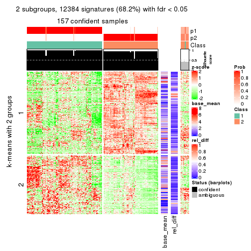</p>

</div>
<div id='tab-MAD-skmeans-get-signatures-2'>
<pre><code class="r">get_signatures(res, k = 3)
</code></pre>

<p></p>

</div>
<div id='tab-MAD-skmeans-get-signatures-3'>
<pre><code class="r">get_signatures(res, k = 4)
</code></pre>

<p></p>

</div>
<div id='tab-MAD-skmeans-get-signatures-4'>
<pre><code class="r">get_signatures(res, k = 5)
</code></pre>

<p></p>

</div>
<div id='tab-MAD-skmeans-get-signatures-5'>
<pre><code class="r">get_signatures(res, k = 6)
</code></pre>

<p></p>

</div>
</div>


Signature heatmaps where rows are not scaled:


<script>
$( function() {
	$( '#tabs-MAD-skmeans-get-signatures-no-scale' ).tabs();
} );
</script>
<div id='tabs-MAD-skmeans-get-signatures-no-scale'>
<ul>
<li><a href='#tab-MAD-skmeans-get-signatures-no-scale-1'>k = 2</a></li>
<li><a href='#tab-MAD-skmeans-get-signatures-no-scale-2'>k = 3</a></li>
<li><a href='#tab-MAD-skmeans-get-signatures-no-scale-3'>k = 4</a></li>
<li><a href='#tab-MAD-skmeans-get-signatures-no-scale-4'>k = 5</a></li>
<li><a href='#tab-MAD-skmeans-get-signatures-no-scale-5'>k = 6</a></li>
</ul>
<div id='tab-MAD-skmeans-get-signatures-no-scale-1'>
<pre><code class="r">get_signatures(res, k = 2, scale_rows = FALSE)
</code></pre>

<p></p>

</div>
<div id='tab-MAD-skmeans-get-signatures-no-scale-2'>
<pre><code class="r">get_signatures(res, k = 3, scale_rows = FALSE)
</code></pre>

<p></p>

</div>
<div id='tab-MAD-skmeans-get-signatures-no-scale-3'>
<pre><code class="r">get_signatures(res, k = 4, scale_rows = FALSE)
</code></pre>

<p></p>

</div>
<div id='tab-MAD-skmeans-get-signatures-no-scale-4'>
<pre><code class="r">get_signatures(res, k = 5, scale_rows = FALSE)
</code></pre>

<p></p>

</div>
<div id='tab-MAD-skmeans-get-signatures-no-scale-5'>
<pre><code class="r">get_signatures(res, k = 6, scale_rows = FALSE)
</code></pre>

<p></p>

</div>
</div>


Compare the overlap of signatures from different k:

```r
compare_signatures(res)
```


`get_signature()` returns a data frame invisibly. TO get the list of signatures, the function
call should be assigned to a variable explicitly. In following code, if `plot` argument is set
to `FALSE`, no heatmap is plotted while only the differential analysis is performed.

```r
# code only for demonstration
tb = get_signature(res, k = ..., plot = FALSE)
```

An example of the output of `tb` is:

```
#>   which_row         fdr    mean_1    mean_2 scaled_mean_1 scaled_mean_2 km
#> 1        38 0.042760348  8.373488  9.131774    -0.5533452     0.5164555  1
#> 2        40 0.018707592  7.106213  8.469186    -0.6173731     0.5762149  1
#> 3        55 0.019134737 10.221463 11.207825    -0.6159697     0.5749050  1
#> 4        59 0.006059896  5.921854  7.869574    -0.6899429     0.6439467  1
#> 5        60 0.018055526  8.928898 10.211722    -0.6204761     0.5791110  1
#> 6        98 0.009384629 15.714769 14.887706     0.6635654    -0.6193277  2
...
```

The columns in `tb` are:

1. `which_row`: row indices corresponding to the input matrix.
2. `fdr`: FDR for the differential test. 
3. `mean_x`: The mean value in group x.
4. `scaled_mean_x`: The mean value in group x after rows are scaled.
5. `km`: Row groups if k-means clustering is applied to rows.


UMAP plot which shows how samples are separated.


<script>
$( function() {
	$( '#tabs-MAD-skmeans-dimension-reduction' ).tabs();
} );
</script>
<div id='tabs-MAD-skmeans-dimension-reduction'>
<ul>
<li><a href='#tab-MAD-skmeans-dimension-reduction-1'>k = 2</a></li>
<li><a href='#tab-MAD-skmeans-dimension-reduction-2'>k = 3</a></li>
<li><a href='#tab-MAD-skmeans-dimension-reduction-3'>k = 4</a></li>
<li><a href='#tab-MAD-skmeans-dimension-reduction-4'>k = 5</a></li>
<li><a href='#tab-MAD-skmeans-dimension-reduction-5'>k = 6</a></li>
</ul>
<div id='tab-MAD-skmeans-dimension-reduction-1'>
<pre><code class="r">dimension_reduction(res, k = 2, method = &quot;UMAP&quot;)
</code></pre>

<p></p>

</div>
<div id='tab-MAD-skmeans-dimension-reduction-2'>
<pre><code class="r">dimension_reduction(res, k = 3, method = &quot;UMAP&quot;)
</code></pre>

<p></p>

</div>
<div id='tab-MAD-skmeans-dimension-reduction-3'>
<pre><code class="r">dimension_reduction(res, k = 4, method = &quot;UMAP&quot;)
</code></pre>

<p></p>

</div>
<div id='tab-MAD-skmeans-dimension-reduction-4'>
<pre><code class="r">dimension_reduction(res, k = 5, method = &quot;UMAP&quot;)
</code></pre>

<p></p>

</div>
<div id='tab-MAD-skmeans-dimension-reduction-5'>
<pre><code class="r">dimension_reduction(res, k = 6, method = &quot;UMAP&quot;)
</code></pre>

<p></p>

</div>
</div>


Following heatmap shows how subgroups are split when increasing `k`:

```r
collect_classes(res)
```


If matrix rows can be associated to genes, consider to use `functional_enrichment(res,
...)` to perform function enrichment for the signature genes. See [this vignette](http://bioconductor.org/packages/devel/bioc/vignettes/cola/inst/doc/functional_enrichment.html) for more detailed explanations.


 

---------------------------------------------------


### MAD:pam*


The object with results only for a single top-value method and a single partition method 
can be extracted as:

```r
res = res_list["MAD", "pam"]
# you can also extract it by
# res = res_list["MAD:pam"]
```

A summary of `res` and all the functions that can be applied to it:

```r
res
```

```
#> A 'ConsensusPartition' object with k = 2, 3, 4, 5, 6.
#>   On a matrix with 18147 rows and 167 columns.
#>   Top rows (1000, 2000, 3000, 4000, 5000) are extracted by 'MAD' method.
#>   Subgroups are detected by 'pam' method.
#>   Performed in total 1250 partitions by row resampling.
#>   Best k for subgroups seems to be 4.
#> 
#> Following methods can be applied to this 'ConsensusPartition' object:
#>  [1] "cola_report"             "collect_classes"         "collect_plots"          
#>  [4] "collect_stats"           "colnames"                "compare_signatures"     
#>  [7] "consensus_heatmap"       "dimension_reduction"     "functional_enrichment"  
#> [10] "get_anno_col"            "get_anno"                "get_classes"            
#> [13] "get_consensus"           "get_matrix"              "get_membership"         
#> [16] "get_param"               "get_signatures"          "get_stats"              
#> [19] "is_best_k"               "is_stable_k"             "membership_heatmap"     
#> [22] "ncol"                    "nrow"                    "plot_ecdf"              
#> [25] "rownames"                "select_partition_number" "show"                   
#> [28] "suggest_best_k"          "test_to_known_factors"
```

`collect_plots()` function collects all the plots made from `res` for all `k` (number of partitions)
into one single page to provide an easy and fast comparison between different `k`.

```r
collect_plots(res)
```


The plots are:

- The first row: a plot of the ECDF (empirical cumulative distribution
  function) curves of the consensus matrix for each `k` and the heatmap of
  predicted classes for each `k`.
- The second row: heatmaps of the consensus matrix for each `k`.
- The third row: heatmaps of the membership matrix for each `k`.
- The fouth row: heatmaps of the signatures for each `k`.

All the plots in panels can be made by individual functions and they are
plotted later in this section.

`select_partition_number()` produces several plots showing different
statistics for choosing "optimized" `k`. There are following statistics:

- ECDF curves of the consensus matrix for each `k`;
- 1-PAC. [The PAC
  score](https://en.wikipedia.org/wiki/Consensus_clustering#Over-interpretation_potential_of_consensus_clustering)
  measures the proportion of the ambiguous subgrouping.
- Mean silhouette score.
- Concordance. The mean probability of fiting the consensus class ids in all
  partitions.
- Area increased. Denote $A_k$ as the area under the ECDF curve for current
  `k`, the area increased is defined as $A_k - A_{k-1}$.
- Rand index. The percent of pairs of samples that are both in a same cluster
  or both are not in a same cluster in the partition of k and k-1.
- Jaccard index. The ratio of pairs of samples are both in a same cluster in
  the partition of k and k-1 and the pairs of samples are both in a same
  cluster in the partition k or k-1.

The detailed explanations of these statistics can be found in [the _cola_
vignette](http://bioconductor.org/packages/devel/bioc/vignettes/cola/inst/doc/cola.html#toc_13).

Generally speaking, lower PAC score, higher mean silhouette score or higher
concordance corresponds to better partition. Rand index and Jaccard index
measure how similar the current partition is compared to partition with `k-1`.
If they are too similar, we won't accept `k` is better than `k-1`.

```r
select_partition_number(res)
```


The numeric values for all these statistics can be obtained by `get_stats()`.

```r
get_stats(res)
```

```
#>   k 1-PAC mean_silhouette concordance area_increased  Rand Jaccard
#> 2 2 0.962           0.962       0.983         0.4639 0.537   0.537
#> 3 3 0.902           0.897       0.955         0.4403 0.769   0.580
#> 4 4 0.925           0.895       0.957         0.1039 0.853   0.601
#> 5 5 0.840           0.793       0.852         0.0664 0.910   0.674
#> 6 6 0.879           0.814       0.893         0.0448 0.948   0.758
```

`suggest_best_k()` suggests the best $k$ based on these statistics. The rules are as follows:

- All $k$ with Jaccard index larger than 0.95 are removed because increasing
  $k$ does not provide enough extra information. If all $k$ are removed, it is
  marked as no subgroup is detected.
- For all $k$ with 1-PAC score larger than 0.9, the maximal $k$ is taken as
  the best $k$, and other $k$ are marked as optional $k$.
- If it does not fit the second rule. The $k$ with the maximal vote of the
  highest 1-PAC score, highest mean silhouette, and highest concordance is
  taken as the best $k$.

```r
suggest_best_k(res)
```

```
#> [1] 4
#> attr(,"optional")
#> [1] 2 3
```

There is also optional best $k$ = 2 3 that is worth to check.

Following shows the table of the partitions (You need to click the **show/hide
code output** link to see it). The membership matrix (columns with name `p*`)
is inferred by
[`clue::cl_consensus()`](https://www.rdocumentation.org/link/cl_consensus?package=clue)
function with the `SE` method. Basically the value in the membership matrix
represents the probability to belong to a certain group. The finall class
label for an item is determined with the group with highest probability it
belongs to.

In `get_classes()` function, the entropy is calculated from the membership
matrix and the silhouette score is calculated from the consensus matrix.


<script>
$( function() {
	$( '#tabs-MAD-pam-get-classes' ).tabs();
} );
</script>
<div id='tabs-MAD-pam-get-classes'>
<ul>
<li><a href='#tab-MAD-pam-get-classes-1'>k = 2</a></li>
<li><a href='#tab-MAD-pam-get-classes-2'>k = 3</a></li>
<li><a href='#tab-MAD-pam-get-classes-3'>k = 4</a></li>
<li><a href='#tab-MAD-pam-get-classes-4'>k = 5</a></li>
<li><a href='#tab-MAD-pam-get-classes-5'>k = 6</a></li>
</ul>

<div id='tab-MAD-pam-get-classes-1'>
<p><a id='tab-MAD-pam-get-classes-1-a' style='color:#0366d6' href='#'>show/hide code output</a></p>
<pre><code class="r">cbind(get_classes(res, k = 2), get_membership(res, k = 2))
</code></pre>

<pre><code>#&gt;            class entropy silhouette    p1    p2
#&gt; SRR1313062     1  0.0000      0.985 1.000 0.000
#&gt; SRR1313063     1  0.0000      0.985 1.000 0.000
#&gt; SRR1313064     1  0.0000      0.985 1.000 0.000
#&gt; SRR1313065     1  0.0000      0.985 1.000 0.000
#&gt; SRR1313066     1  0.6887      0.779 0.816 0.184
#&gt; SRR1313067     1  0.0000      0.985 1.000 0.000
#&gt; SRR1313068     1  0.0000      0.985 1.000 0.000
#&gt; SRR1313069     1  0.0000      0.985 1.000 0.000
#&gt; SRR1313070     1  0.7056      0.767 0.808 0.192
#&gt; SRR1313071     1  0.0938      0.975 0.988 0.012
#&gt; SRR1313072     1  0.6887      0.779 0.816 0.184
#&gt; SRR1313073     1  0.0000      0.985 1.000 0.000
#&gt; SRR1313074     1  0.0000      0.985 1.000 0.000
#&gt; SRR1313075     1  0.0000      0.985 1.000 0.000
#&gt; SRR1313076     1  0.0000      0.985 1.000 0.000
#&gt; SRR1313077     1  0.0000      0.985 1.000 0.000
#&gt; SRR1313078     1  0.0000      0.985 1.000 0.000
#&gt; SRR1313079     1  0.0000      0.985 1.000 0.000
#&gt; SRR1313080     1  0.0000      0.985 1.000 0.000
#&gt; SRR1313081     1  0.0000      0.985 1.000 0.000
#&gt; SRR1313082     1  0.0000      0.985 1.000 0.000
#&gt; SRR1313083     1  0.0000      0.985 1.000 0.000
#&gt; SRR1313084     1  0.7139      0.761 0.804 0.196
#&gt; SRR1313085     1  0.9393      0.450 0.644 0.356
#&gt; SRR1313086     1  0.0000      0.985 1.000 0.000
#&gt; SRR1313087     1  0.0000      0.985 1.000 0.000
#&gt; SRR1313088     1  0.0000      0.985 1.000 0.000
#&gt; SRR1313089     1  0.4815      0.881 0.896 0.104
#&gt; SRR1313092     1  0.0000      0.985 1.000 0.000
#&gt; SRR1313090     1  0.0000      0.985 1.000 0.000
#&gt; SRR1313091     2  0.0000      0.979 0.000 1.000
#&gt; SRR1313093     1  0.0000      0.985 1.000 0.000
#&gt; SRR1313095     1  0.0000      0.985 1.000 0.000
#&gt; SRR1313096     1  0.0000      0.985 1.000 0.000
#&gt; SRR1313094     1  0.0000      0.985 1.000 0.000
#&gt; SRR1313097     1  0.0000      0.985 1.000 0.000
#&gt; SRR1313099     1  0.0000      0.985 1.000 0.000
#&gt; SRR1313098     1  0.0000      0.985 1.000 0.000
#&gt; SRR1313101     1  0.0000      0.985 1.000 0.000
#&gt; SRR1313102     1  0.0000      0.985 1.000 0.000
#&gt; SRR1313103     1  0.0000      0.985 1.000 0.000
#&gt; SRR1313100     1  0.0000      0.985 1.000 0.000
#&gt; SRR1313105     1  0.0000      0.985 1.000 0.000
#&gt; SRR1313104     1  0.0000      0.985 1.000 0.000
#&gt; SRR1313107     1  0.0000      0.985 1.000 0.000
#&gt; SRR1313106     1  0.1414      0.967 0.980 0.020
#&gt; SRR1313109     1  0.2603      0.945 0.956 0.044
#&gt; SRR1313108     1  0.0000      0.985 1.000 0.000
#&gt; SRR1313111     1  0.0000      0.985 1.000 0.000
#&gt; SRR1313110     1  0.0000      0.985 1.000 0.000
#&gt; SRR1313112     1  0.0000      0.985 1.000 0.000
#&gt; SRR1313113     1  0.0000      0.985 1.000 0.000
#&gt; SRR1313115     1  0.0000      0.985 1.000 0.000
#&gt; SRR1313114     1  0.0000      0.985 1.000 0.000
#&gt; SRR1313117     1  0.0000      0.985 1.000 0.000
#&gt; SRR1313118     1  0.0000      0.985 1.000 0.000
#&gt; SRR1313116     1  0.1843      0.960 0.972 0.028
#&gt; SRR1313120     1  0.0000      0.985 1.000 0.000
#&gt; SRR1313119     1  0.0000      0.985 1.000 0.000
#&gt; SRR1313122     1  0.0000      0.985 1.000 0.000
#&gt; SRR1313124     1  0.0000      0.985 1.000 0.000
#&gt; SRR1313121     1  0.0000      0.985 1.000 0.000
#&gt; SRR1313125     1  0.0000      0.985 1.000 0.000
#&gt; SRR1313127     1  0.0000      0.985 1.000 0.000
#&gt; SRR1313123     1  0.0000      0.985 1.000 0.000
#&gt; SRR1313128     1  0.0000      0.985 1.000 0.000
#&gt; SRR1313126     1  0.0000      0.985 1.000 0.000
#&gt; SRR1313130     2  0.0000      0.979 0.000 1.000
#&gt; SRR1313132     1  0.0000      0.985 1.000 0.000
#&gt; SRR1313129     1  0.0376      0.982 0.996 0.004
#&gt; SRR1313133     1  0.0000      0.985 1.000 0.000
#&gt; SRR1313131     1  0.0000      0.985 1.000 0.000
#&gt; SRR1313134     1  0.0000      0.985 1.000 0.000
#&gt; SRR1313135     1  0.0000      0.985 1.000 0.000
#&gt; SRR1313136     1  0.0000      0.985 1.000 0.000
#&gt; SRR1313137     1  0.0000      0.985 1.000 0.000
#&gt; SRR1313138     2  0.7219      0.752 0.200 0.800
#&gt; SRR1313140     1  0.0000      0.985 1.000 0.000
#&gt; SRR1313141     1  0.0000      0.985 1.000 0.000
#&gt; SRR1313139     1  0.0000      0.985 1.000 0.000
#&gt; SRR1313143     1  0.0000      0.985 1.000 0.000
#&gt; SRR1313142     1  0.0000      0.985 1.000 0.000
#&gt; SRR1313144     1  0.0000      0.985 1.000 0.000
#&gt; SRR1313145     1  0.0000      0.985 1.000 0.000
#&gt; SRR1313146     1  0.0000      0.985 1.000 0.000
#&gt; SRR1313147     1  0.0000      0.985 1.000 0.000
#&gt; SRR1313150     1  0.3879      0.912 0.924 0.076
#&gt; SRR1313149     1  0.0000      0.985 1.000 0.000
#&gt; SRR1313152     1  0.0000      0.985 1.000 0.000
#&gt; SRR1313151     1  0.0000      0.985 1.000 0.000
#&gt; SRR1313154     1  0.0000      0.985 1.000 0.000
#&gt; SRR1313153     1  0.0000      0.985 1.000 0.000
#&gt; SRR1313156     1  0.0000      0.985 1.000 0.000
#&gt; SRR1313155     1  0.0000      0.985 1.000 0.000
#&gt; SRR1313157     1  0.0000      0.985 1.000 0.000
#&gt; SRR1313158     1  0.0000      0.985 1.000 0.000
#&gt; SRR1313161     1  0.0000      0.985 1.000 0.000
#&gt; SRR1313159     2  0.7674      0.716 0.224 0.776
#&gt; SRR1313160     1  0.0000      0.985 1.000 0.000
#&gt; SRR1313162     1  0.0000      0.985 1.000 0.000
#&gt; SRR1313163     1  0.0000      0.985 1.000 0.000
#&gt; SRR1313165     1  0.0000      0.985 1.000 0.000
#&gt; SRR1313166     1  0.0000      0.985 1.000 0.000
#&gt; SRR1313164     1  0.0000      0.985 1.000 0.000
#&gt; SRR1313167     1  0.0000      0.985 1.000 0.000
#&gt; SRR1313168     1  0.0000      0.985 1.000 0.000
#&gt; SRR1313170     1  0.0000      0.985 1.000 0.000
#&gt; SRR1313169     1  0.0000      0.985 1.000 0.000
#&gt; SRR1313172     2  0.9833      0.262 0.424 0.576
#&gt; SRR1313171     1  0.0000      0.985 1.000 0.000
#&gt; SRR1313174     2  0.0000      0.979 0.000 1.000
#&gt; SRR1313173     1  0.0000      0.985 1.000 0.000
#&gt; SRR1313176     2  0.0000      0.979 0.000 1.000
#&gt; SRR1313175     2  0.0000      0.979 0.000 1.000
#&gt; SRR1313178     2  0.0000      0.979 0.000 1.000
#&gt; SRR1313177     2  0.0000      0.979 0.000 1.000
#&gt; SRR1313179     2  0.7139      0.758 0.196 0.804
#&gt; SRR1313180     2  0.0000      0.979 0.000 1.000
#&gt; SRR1313181     2  0.0000      0.979 0.000 1.000
#&gt; SRR1313183     2  0.0000      0.979 0.000 1.000
#&gt; SRR1313182     2  0.0000      0.979 0.000 1.000
#&gt; SRR1313184     2  0.0000      0.979 0.000 1.000
#&gt; SRR1313185     2  0.0000      0.979 0.000 1.000
#&gt; SRR1313188     2  0.0000      0.979 0.000 1.000
#&gt; SRR1313187     2  0.0000      0.979 0.000 1.000
#&gt; SRR1313186     2  0.0000      0.979 0.000 1.000
#&gt; SRR1313189     2  0.0000      0.979 0.000 1.000
#&gt; SRR1313190     2  0.0000      0.979 0.000 1.000
#&gt; SRR1313191     2  0.0000      0.979 0.000 1.000
#&gt; SRR1313192     2  0.0000      0.979 0.000 1.000
#&gt; SRR1313193     2  0.0000      0.979 0.000 1.000
#&gt; SRR1313194     2  0.0000      0.979 0.000 1.000
#&gt; SRR1313195     2  0.0000      0.979 0.000 1.000
#&gt; SRR1313196     2  0.0000      0.979 0.000 1.000
#&gt; SRR1313197     2  0.0000      0.979 0.000 1.000
#&gt; SRR1313198     2  0.0000      0.979 0.000 1.000
#&gt; SRR1313199     2  0.0000      0.979 0.000 1.000
#&gt; SRR1313200     2  0.0000      0.979 0.000 1.000
#&gt; SRR1313201     2  0.0000      0.979 0.000 1.000
#&gt; SRR1313202     2  0.0000      0.979 0.000 1.000
#&gt; SRR1313203     1  0.6148      0.822 0.848 0.152
#&gt; SRR1313204     2  0.0000      0.979 0.000 1.000
#&gt; SRR1313205     2  0.0000      0.979 0.000 1.000
#&gt; SRR1313207     2  0.0000      0.979 0.000 1.000
#&gt; SRR1313208     2  0.0000      0.979 0.000 1.000
#&gt; SRR1313206     2  0.0000      0.979 0.000 1.000
#&gt; SRR1313210     2  0.0000      0.979 0.000 1.000
#&gt; SRR1313209     2  0.0000      0.979 0.000 1.000
#&gt; SRR1313211     2  0.0000      0.979 0.000 1.000
#&gt; SRR1313212     2  0.0000      0.979 0.000 1.000
#&gt; SRR1313214     2  0.0000      0.979 0.000 1.000
#&gt; SRR1313215     2  0.0000      0.979 0.000 1.000
#&gt; SRR1313213     2  0.0000      0.979 0.000 1.000
#&gt; SRR1313216     2  0.0000      0.979 0.000 1.000
#&gt; SRR1313217     2  0.0000      0.979 0.000 1.000
#&gt; SRR1313219     2  0.0000      0.979 0.000 1.000
#&gt; SRR1313220     2  0.0000      0.979 0.000 1.000
#&gt; SRR1313218     2  0.0000      0.979 0.000 1.000
#&gt; SRR1313222     2  0.0000      0.979 0.000 1.000
#&gt; SRR1313221     2  0.0000      0.979 0.000 1.000
#&gt; SRR1313223     2  0.0000      0.979 0.000 1.000
#&gt; SRR1313224     2  0.0000      0.979 0.000 1.000
#&gt; SRR1313225     2  0.0000      0.979 0.000 1.000
#&gt; SRR1313226     2  0.6343      0.807 0.160 0.840
#&gt; SRR1313227     2  0.0000      0.979 0.000 1.000
#&gt; SRR1313228     2  0.0000      0.979 0.000 1.000
#&gt; SRR1313229     2  0.0000      0.979 0.000 1.000
</code></pre>

<script>
$('#tab-MAD-pam-get-classes-1-a').parent().next().next().hide();
$('#tab-MAD-pam-get-classes-1-a').click(function(){
  $('#tab-MAD-pam-get-classes-1-a').parent().next().next().toggle();
  return(false);
});
</script>
</div>

<div id='tab-MAD-pam-get-classes-2'>
<p><a id='tab-MAD-pam-get-classes-2-a' style='color:#0366d6' href='#'>show/hide code output</a></p>
<pre><code class="r">cbind(get_classes(res, k = 3), get_membership(res, k = 3))
</code></pre>

<pre><code>#&gt;            class entropy silhouette    p1    p2    p3
#&gt; SRR1313062     3  0.3116     0.8711 0.108 0.000 0.892
#&gt; SRR1313063     3  0.3816     0.8327 0.148 0.000 0.852
#&gt; SRR1313064     1  0.0000     0.9460 1.000 0.000 0.000
#&gt; SRR1313065     1  0.0237     0.9470 0.996 0.000 0.004
#&gt; SRR1313066     1  0.0000     0.9460 1.000 0.000 0.000
#&gt; SRR1313067     3  0.1964     0.9102 0.056 0.000 0.944
#&gt; SRR1313068     3  0.1860     0.9125 0.052 0.000 0.948
#&gt; SRR1313069     1  0.0000     0.9460 1.000 0.000 0.000
#&gt; SRR1313070     1  0.0000     0.9460 1.000 0.000 0.000
#&gt; SRR1313071     1  0.0000     0.9460 1.000 0.000 0.000
#&gt; SRR1313072     1  0.0000     0.9460 1.000 0.000 0.000
#&gt; SRR1313073     1  0.5905     0.4275 0.648 0.000 0.352
#&gt; SRR1313074     1  0.0000     0.9460 1.000 0.000 0.000
#&gt; SRR1313075     1  0.0000     0.9460 1.000 0.000 0.000
#&gt; SRR1313076     3  0.2711     0.8878 0.088 0.000 0.912
#&gt; SRR1313077     3  0.3752     0.8370 0.144 0.000 0.856
#&gt; SRR1313078     3  0.3879     0.8282 0.152 0.000 0.848
#&gt; SRR1313079     1  0.0000     0.9460 1.000 0.000 0.000
#&gt; SRR1313080     3  0.1529     0.9188 0.040 0.000 0.960
#&gt; SRR1313081     3  0.2537     0.8938 0.080 0.000 0.920
#&gt; SRR1313082     1  0.0000     0.9460 1.000 0.000 0.000
#&gt; SRR1313083     1  0.0000     0.9460 1.000 0.000 0.000
#&gt; SRR1313084     1  0.0000     0.9460 1.000 0.000 0.000
#&gt; SRR1313085     1  0.0000     0.9460 1.000 0.000 0.000
#&gt; SRR1313086     1  0.0000     0.9460 1.000 0.000 0.000
#&gt; SRR1313087     1  0.1289     0.9251 0.968 0.000 0.032
#&gt; SRR1313088     1  0.0000     0.9460 1.000 0.000 0.000
#&gt; SRR1313089     1  0.0000     0.9460 1.000 0.000 0.000
#&gt; SRR1313092     3  0.0000     0.9347 0.000 0.000 1.000
#&gt; SRR1313090     3  0.0000     0.9347 0.000 0.000 1.000
#&gt; SRR1313091     2  0.6062     0.3821 0.000 0.616 0.384
#&gt; SRR1313093     3  0.0000     0.9347 0.000 0.000 1.000
#&gt; SRR1313095     3  0.0000     0.9347 0.000 0.000 1.000
#&gt; SRR1313096     3  0.3752     0.8296 0.144 0.000 0.856
#&gt; SRR1313094     3  0.0000     0.9347 0.000 0.000 1.000
#&gt; SRR1313097     3  0.0000     0.9347 0.000 0.000 1.000
#&gt; SRR1313099     3  0.0000     0.9347 0.000 0.000 1.000
#&gt; SRR1313098     3  0.1964     0.9058 0.056 0.000 0.944
#&gt; SRR1313101     3  0.0000     0.9347 0.000 0.000 1.000
#&gt; SRR1313102     3  0.0000     0.9347 0.000 0.000 1.000
#&gt; SRR1313103     3  0.0000     0.9347 0.000 0.000 1.000
#&gt; SRR1313100     3  0.0000     0.9347 0.000 0.000 1.000
#&gt; SRR1313105     3  0.0000     0.9347 0.000 0.000 1.000
#&gt; SRR1313104     3  0.0000     0.9347 0.000 0.000 1.000
#&gt; SRR1313107     3  0.0000     0.9347 0.000 0.000 1.000
#&gt; SRR1313106     3  0.0000     0.9347 0.000 0.000 1.000
#&gt; SRR1313109     3  0.1878     0.9011 0.004 0.044 0.952
#&gt; SRR1313108     3  0.1031     0.9254 0.024 0.000 0.976
#&gt; SRR1313111     3  0.0000     0.9347 0.000 0.000 1.000
#&gt; SRR1313110     3  0.0000     0.9347 0.000 0.000 1.000
#&gt; SRR1313112     3  0.0000     0.9347 0.000 0.000 1.000
#&gt; SRR1313113     3  0.0000     0.9347 0.000 0.000 1.000
#&gt; SRR1313115     3  0.0000     0.9347 0.000 0.000 1.000
#&gt; SRR1313114     3  0.0000     0.9347 0.000 0.000 1.000
#&gt; SRR1313117     3  0.0000     0.9347 0.000 0.000 1.000
#&gt; SRR1313118     3  0.0000     0.9347 0.000 0.000 1.000
#&gt; SRR1313116     3  0.0237     0.9330 0.004 0.000 0.996
#&gt; SRR1313120     3  0.0000     0.9347 0.000 0.000 1.000
#&gt; SRR1313119     3  0.0000     0.9347 0.000 0.000 1.000
#&gt; SRR1313122     3  0.0237     0.9324 0.004 0.000 0.996
#&gt; SRR1313124     3  0.0000     0.9347 0.000 0.000 1.000
#&gt; SRR1313121     3  0.0000     0.9347 0.000 0.000 1.000
#&gt; SRR1313125     3  0.0000     0.9347 0.000 0.000 1.000
#&gt; SRR1313127     3  0.0000     0.9347 0.000 0.000 1.000
#&gt; SRR1313123     3  0.0000     0.9347 0.000 0.000 1.000
#&gt; SRR1313128     1  0.0424     0.9479 0.992 0.000 0.008
#&gt; SRR1313126     3  0.0747     0.9286 0.016 0.000 0.984
#&gt; SRR1313130     2  0.6225     0.2698 0.000 0.568 0.432
#&gt; SRR1313132     1  0.3412     0.8410 0.876 0.000 0.124
#&gt; SRR1313129     3  0.0000     0.9347 0.000 0.000 1.000
#&gt; SRR1313133     1  0.5968     0.4166 0.636 0.000 0.364
#&gt; SRR1313131     3  0.3816     0.8292 0.148 0.000 0.852
#&gt; SRR1313134     1  0.5363     0.6081 0.724 0.000 0.276
#&gt; SRR1313135     1  0.0424     0.9479 0.992 0.000 0.008
#&gt; SRR1313136     1  0.0424     0.9479 0.992 0.000 0.008
#&gt; SRR1313137     1  0.0424     0.9479 0.992 0.000 0.008
#&gt; SRR1313138     1  0.1031     0.9379 0.976 0.000 0.024
#&gt; SRR1313140     1  0.0424     0.9479 0.992 0.000 0.008
#&gt; SRR1313141     1  0.6244     0.1889 0.560 0.000 0.440
#&gt; SRR1313139     1  0.0424     0.9479 0.992 0.000 0.008
#&gt; SRR1313143     1  0.6008     0.3885 0.628 0.000 0.372
#&gt; SRR1313142     1  0.0424     0.9479 0.992 0.000 0.008
#&gt; SRR1313144     1  0.0424     0.9479 0.992 0.000 0.008
#&gt; SRR1313145     1  0.0424     0.9479 0.992 0.000 0.008
#&gt; SRR1313146     1  0.0424     0.9479 0.992 0.000 0.008
#&gt; SRR1313147     1  0.0424     0.9479 0.992 0.000 0.008
#&gt; SRR1313150     1  0.0424     0.9479 0.992 0.000 0.008
#&gt; SRR1313149     1  0.4062     0.7866 0.836 0.000 0.164
#&gt; SRR1313152     1  0.0424     0.9479 0.992 0.000 0.008
#&gt; SRR1313151     1  0.0424     0.9479 0.992 0.000 0.008
#&gt; SRR1313154     1  0.0424     0.9479 0.992 0.000 0.008
#&gt; SRR1313153     1  0.0424     0.9479 0.992 0.000 0.008
#&gt; SRR1313156     1  0.0892     0.9408 0.980 0.000 0.020
#&gt; SRR1313155     1  0.0424     0.9479 0.992 0.000 0.008
#&gt; SRR1313157     1  0.0424     0.9479 0.992 0.000 0.008
#&gt; SRR1313158     1  0.0424     0.9479 0.992 0.000 0.008
#&gt; SRR1313161     1  0.1289     0.9317 0.968 0.000 0.032
#&gt; SRR1313159     1  0.1337     0.9356 0.972 0.012 0.016
#&gt; SRR1313160     1  0.0892     0.9408 0.980 0.000 0.020
#&gt; SRR1313162     3  0.6140     0.3559 0.404 0.000 0.596
#&gt; SRR1313163     1  0.1289     0.9317 0.968 0.000 0.032
#&gt; SRR1313165     1  0.0424     0.9479 0.992 0.000 0.008
#&gt; SRR1313166     1  0.0424     0.9479 0.992 0.000 0.008
#&gt; SRR1313164     1  0.5098     0.6557 0.752 0.000 0.248
#&gt; SRR1313167     1  0.0424     0.9479 0.992 0.000 0.008
#&gt; SRR1313168     1  0.0424     0.9479 0.992 0.000 0.008
#&gt; SRR1313170     3  0.0237     0.9330 0.004 0.000 0.996
#&gt; SRR1313169     1  0.0424     0.9479 0.992 0.000 0.008
#&gt; SRR1313172     3  0.8967     0.1745 0.380 0.132 0.488
#&gt; SRR1313171     3  0.6308     0.0512 0.492 0.000 0.508
#&gt; SRR1313174     2  0.0000     0.9753 0.000 1.000 0.000
#&gt; SRR1313173     3  0.4178     0.8007 0.172 0.000 0.828
#&gt; SRR1313176     2  0.0000     0.9753 0.000 1.000 0.000
#&gt; SRR1313175     2  0.0000     0.9753 0.000 1.000 0.000
#&gt; SRR1313178     2  0.0000     0.9753 0.000 1.000 0.000
#&gt; SRR1313177     2  0.0000     0.9753 0.000 1.000 0.000
#&gt; SRR1313179     2  0.0661     0.9638 0.004 0.988 0.008
#&gt; SRR1313180     2  0.2165     0.9163 0.000 0.936 0.064
#&gt; SRR1313181     2  0.0000     0.9753 0.000 1.000 0.000
#&gt; SRR1313183     2  0.0000     0.9753 0.000 1.000 0.000
#&gt; SRR1313182     2  0.0000     0.9753 0.000 1.000 0.000
#&gt; SRR1313184     2  0.0000     0.9753 0.000 1.000 0.000
#&gt; SRR1313185     2  0.0000     0.9753 0.000 1.000 0.000
#&gt; SRR1313188     2  0.0000     0.9753 0.000 1.000 0.000
#&gt; SRR1313187     2  0.0000     0.9753 0.000 1.000 0.000
#&gt; SRR1313186     2  0.0000     0.9753 0.000 1.000 0.000
#&gt; SRR1313189     2  0.0000     0.9753 0.000 1.000 0.000
#&gt; SRR1313190     2  0.0000     0.9753 0.000 1.000 0.000
#&gt; SRR1313191     2  0.0000     0.9753 0.000 1.000 0.000
#&gt; SRR1313192     2  0.0000     0.9753 0.000 1.000 0.000
#&gt; SRR1313193     2  0.0000     0.9753 0.000 1.000 0.000
#&gt; SRR1313194     2  0.0000     0.9753 0.000 1.000 0.000
#&gt; SRR1313195     2  0.0000     0.9753 0.000 1.000 0.000
#&gt; SRR1313196     2  0.0000     0.9753 0.000 1.000 0.000
#&gt; SRR1313197     2  0.0000     0.9753 0.000 1.000 0.000
#&gt; SRR1313198     2  0.0000     0.9753 0.000 1.000 0.000
#&gt; SRR1313199     2  0.0000     0.9753 0.000 1.000 0.000
#&gt; SRR1313200     2  0.0000     0.9753 0.000 1.000 0.000
#&gt; SRR1313201     2  0.0000     0.9753 0.000 1.000 0.000
#&gt; SRR1313202     2  0.0000     0.9753 0.000 1.000 0.000
#&gt; SRR1313203     3  0.6225     0.2638 0.432 0.000 0.568
#&gt; SRR1313204     2  0.0000     0.9753 0.000 1.000 0.000
#&gt; SRR1313205     2  0.0000     0.9753 0.000 1.000 0.000
#&gt; SRR1313207     2  0.0000     0.9753 0.000 1.000 0.000
#&gt; SRR1313208     2  0.0000     0.9753 0.000 1.000 0.000
#&gt; SRR1313206     2  0.0000     0.9753 0.000 1.000 0.000
#&gt; SRR1313210     2  0.0000     0.9753 0.000 1.000 0.000
#&gt; SRR1313209     2  0.0000     0.9753 0.000 1.000 0.000
#&gt; SRR1313211     2  0.0000     0.9753 0.000 1.000 0.000
#&gt; SRR1313212     2  0.0000     0.9753 0.000 1.000 0.000
#&gt; SRR1313214     2  0.0000     0.9753 0.000 1.000 0.000
#&gt; SRR1313215     2  0.0000     0.9753 0.000 1.000 0.000
#&gt; SRR1313213     2  0.0000     0.9753 0.000 1.000 0.000
#&gt; SRR1313216     2  0.0000     0.9753 0.000 1.000 0.000
#&gt; SRR1313217     2  0.0000     0.9753 0.000 1.000 0.000
#&gt; SRR1313219     2  0.0000     0.9753 0.000 1.000 0.000
#&gt; SRR1313220     2  0.0000     0.9753 0.000 1.000 0.000
#&gt; SRR1313218     2  0.0000     0.9753 0.000 1.000 0.000
#&gt; SRR1313222     2  0.0000     0.9753 0.000 1.000 0.000
#&gt; SRR1313221     2  0.0000     0.9753 0.000 1.000 0.000
#&gt; SRR1313223     2  0.0000     0.9753 0.000 1.000 0.000
#&gt; SRR1313224     2  0.0000     0.9753 0.000 1.000 0.000
#&gt; SRR1313225     2  0.0000     0.9753 0.000 1.000 0.000
#&gt; SRR1313226     2  0.6489     0.1917 0.004 0.540 0.456
#&gt; SRR1313227     2  0.0000     0.9753 0.000 1.000 0.000
#&gt; SRR1313228     2  0.0000     0.9753 0.000 1.000 0.000
#&gt; SRR1313229     2  0.0000     0.9753 0.000 1.000 0.000
</code></pre>

<script>
$('#tab-MAD-pam-get-classes-2-a').parent().next().next().hide();
$('#tab-MAD-pam-get-classes-2-a').click(function(){
  $('#tab-MAD-pam-get-classes-2-a').parent().next().next().toggle();
  return(false);
});
</script>
</div>

<div id='tab-MAD-pam-get-classes-3'>
<p><a id='tab-MAD-pam-get-classes-3-a' style='color:#0366d6' href='#'>show/hide code output</a></p>
<pre><code class="r">cbind(get_classes(res, k = 4), get_membership(res, k = 4))
</code></pre>

<pre><code>#&gt;            class entropy silhouette    p1    p2    p3    p4
#&gt; SRR1313062     4  0.0336     0.8985 0.000 0.000 0.008 0.992
#&gt; SRR1313063     4  0.0000     0.9025 0.000 0.000 0.000 1.000
#&gt; SRR1313064     4  0.0000     0.9025 0.000 0.000 0.000 1.000
#&gt; SRR1313065     4  0.2760     0.7973 0.128 0.000 0.000 0.872
#&gt; SRR1313066     4  0.0469     0.8976 0.012 0.000 0.000 0.988
#&gt; SRR1313067     4  0.4992     0.0794 0.000 0.000 0.476 0.524
#&gt; SRR1313068     4  0.0000     0.9025 0.000 0.000 0.000 1.000
#&gt; SRR1313069     4  0.0000     0.9025 0.000 0.000 0.000 1.000
#&gt; SRR1313070     4  0.0000     0.9025 0.000 0.000 0.000 1.000
#&gt; SRR1313071     4  0.0592     0.8955 0.016 0.000 0.000 0.984
#&gt; SRR1313072     4  0.0000     0.9025 0.000 0.000 0.000 1.000
#&gt; SRR1313073     4  0.0000     0.9025 0.000 0.000 0.000 1.000
#&gt; SRR1313074     4  0.0000     0.9025 0.000 0.000 0.000 1.000
#&gt; SRR1313075     4  0.0000     0.9025 0.000 0.000 0.000 1.000
#&gt; SRR1313076     3  0.5564     0.1428 0.020 0.000 0.544 0.436
#&gt; SRR1313077     4  0.0000     0.9025 0.000 0.000 0.000 1.000
#&gt; SRR1313078     4  0.7365     0.1346 0.160 0.000 0.400 0.440
#&gt; SRR1313079     4  0.0000     0.9025 0.000 0.000 0.000 1.000
#&gt; SRR1313080     4  0.0000     0.9025 0.000 0.000 0.000 1.000
#&gt; SRR1313081     4  0.4624     0.4533 0.000 0.000 0.340 0.660
#&gt; SRR1313082     4  0.1474     0.8705 0.052 0.000 0.000 0.948
#&gt; SRR1313083     4  0.4605     0.5011 0.336 0.000 0.000 0.664
#&gt; SRR1313084     4  0.0000     0.9025 0.000 0.000 0.000 1.000
#&gt; SRR1313085     4  0.1302     0.8763 0.044 0.000 0.000 0.956
#&gt; SRR1313086     4  0.4948     0.1853 0.440 0.000 0.000 0.560
#&gt; SRR1313087     4  0.0000     0.9025 0.000 0.000 0.000 1.000
#&gt; SRR1313088     4  0.0707     0.8930 0.020 0.000 0.000 0.980
#&gt; SRR1313089     4  0.0000     0.9025 0.000 0.000 0.000 1.000
#&gt; SRR1313092     3  0.0000     0.9615 0.000 0.000 1.000 0.000
#&gt; SRR1313090     3  0.0000     0.9615 0.000 0.000 1.000 0.000
#&gt; SRR1313091     3  0.3873     0.6687 0.000 0.228 0.772 0.000
#&gt; SRR1313093     3  0.0000     0.9615 0.000 0.000 1.000 0.000
#&gt; SRR1313095     3  0.0000     0.9615 0.000 0.000 1.000 0.000
#&gt; SRR1313096     1  0.5161     0.3827 0.592 0.000 0.400 0.008
#&gt; SRR1313094     3  0.0000     0.9615 0.000 0.000 1.000 0.000
#&gt; SRR1313097     3  0.0000     0.9615 0.000 0.000 1.000 0.000
#&gt; SRR1313099     3  0.0000     0.9615 0.000 0.000 1.000 0.000
#&gt; SRR1313098     3  0.4866     0.2429 0.404 0.000 0.596 0.000
#&gt; SRR1313101     3  0.0000     0.9615 0.000 0.000 1.000 0.000
#&gt; SRR1313102     3  0.0000     0.9615 0.000 0.000 1.000 0.000
#&gt; SRR1313103     3  0.0000     0.9615 0.000 0.000 1.000 0.000
#&gt; SRR1313100     3  0.0000     0.9615 0.000 0.000 1.000 0.000
#&gt; SRR1313105     3  0.0000     0.9615 0.000 0.000 1.000 0.000
#&gt; SRR1313104     3  0.0000     0.9615 0.000 0.000 1.000 0.000
#&gt; SRR1313107     3  0.0000     0.9615 0.000 0.000 1.000 0.000
#&gt; SRR1313106     3  0.0000     0.9615 0.000 0.000 1.000 0.000
#&gt; SRR1313109     3  0.0000     0.9615 0.000 0.000 1.000 0.000
#&gt; SRR1313108     3  0.3970     0.8047 0.076 0.000 0.840 0.084
#&gt; SRR1313111     3  0.0000     0.9615 0.000 0.000 1.000 0.000
#&gt; SRR1313110     3  0.0000     0.9615 0.000 0.000 1.000 0.000
#&gt; SRR1313112     3  0.0000     0.9615 0.000 0.000 1.000 0.000
#&gt; SRR1313113     3  0.0000     0.9615 0.000 0.000 1.000 0.000
#&gt; SRR1313115     3  0.0000     0.9615 0.000 0.000 1.000 0.000
#&gt; SRR1313114     3  0.0000     0.9615 0.000 0.000 1.000 0.000
#&gt; SRR1313117     3  0.0000     0.9615 0.000 0.000 1.000 0.000
#&gt; SRR1313118     3  0.0000     0.9615 0.000 0.000 1.000 0.000
#&gt; SRR1313116     3  0.0000     0.9615 0.000 0.000 1.000 0.000
#&gt; SRR1313120     3  0.0000     0.9615 0.000 0.000 1.000 0.000
#&gt; SRR1313119     3  0.0000     0.9615 0.000 0.000 1.000 0.000
#&gt; SRR1313122     3  0.0000     0.9615 0.000 0.000 1.000 0.000
#&gt; SRR1313124     3  0.0000     0.9615 0.000 0.000 1.000 0.000
#&gt; SRR1313121     3  0.0000     0.9615 0.000 0.000 1.000 0.000
#&gt; SRR1313125     3  0.0000     0.9615 0.000 0.000 1.000 0.000
#&gt; SRR1313127     3  0.0336     0.9545 0.008 0.000 0.992 0.000
#&gt; SRR1313123     3  0.0000     0.9615 0.000 0.000 1.000 0.000
#&gt; SRR1313128     1  0.0000     0.9222 1.000 0.000 0.000 0.000
#&gt; SRR1313126     3  0.0657     0.9492 0.004 0.000 0.984 0.012
#&gt; SRR1313130     3  0.0336     0.9532 0.000 0.008 0.992 0.000
#&gt; SRR1313132     1  0.0000     0.9222 1.000 0.000 0.000 0.000
#&gt; SRR1313129     3  0.0000     0.9615 0.000 0.000 1.000 0.000
#&gt; SRR1313133     1  0.2149     0.8582 0.912 0.000 0.088 0.000
#&gt; SRR1313131     1  0.6564     0.3314 0.536 0.000 0.380 0.084
#&gt; SRR1313134     1  0.3219     0.7962 0.836 0.000 0.164 0.000
#&gt; SRR1313135     1  0.0000     0.9222 1.000 0.000 0.000 0.000
#&gt; SRR1313136     1  0.0000     0.9222 1.000 0.000 0.000 0.000
#&gt; SRR1313137     1  0.0000     0.9222 1.000 0.000 0.000 0.000
#&gt; SRR1313138     1  0.0000     0.9222 1.000 0.000 0.000 0.000
#&gt; SRR1313140     1  0.0000     0.9222 1.000 0.000 0.000 0.000
#&gt; SRR1313141     1  0.3266     0.7925 0.832 0.000 0.168 0.000
#&gt; SRR1313139     1  0.0000     0.9222 1.000 0.000 0.000 0.000
#&gt; SRR1313143     1  0.3836     0.7820 0.816 0.000 0.168 0.016
#&gt; SRR1313142     1  0.0000     0.9222 1.000 0.000 0.000 0.000
#&gt; SRR1313144     1  0.0000     0.9222 1.000 0.000 0.000 0.000
#&gt; SRR1313145     1  0.0000     0.9222 1.000 0.000 0.000 0.000
#&gt; SRR1313146     1  0.0000     0.9222 1.000 0.000 0.000 0.000
#&gt; SRR1313147     1  0.0000     0.9222 1.000 0.000 0.000 0.000
#&gt; SRR1313150     1  0.0000     0.9222 1.000 0.000 0.000 0.000
#&gt; SRR1313149     1  0.3266     0.7925 0.832 0.000 0.168 0.000
#&gt; SRR1313152     1  0.0000     0.9222 1.000 0.000 0.000 0.000
#&gt; SRR1313151     1  0.0000     0.9222 1.000 0.000 0.000 0.000
#&gt; SRR1313154     1  0.0000     0.9222 1.000 0.000 0.000 0.000
#&gt; SRR1313153     1  0.0000     0.9222 1.000 0.000 0.000 0.000
#&gt; SRR1313156     1  0.0000     0.9222 1.000 0.000 0.000 0.000
#&gt; SRR1313155     1  0.0000     0.9222 1.000 0.000 0.000 0.000
#&gt; SRR1313157     1  0.0000     0.9222 1.000 0.000 0.000 0.000
#&gt; SRR1313158     1  0.0000     0.9222 1.000 0.000 0.000 0.000
#&gt; SRR1313161     1  0.0000     0.9222 1.000 0.000 0.000 0.000
#&gt; SRR1313159     1  0.0000     0.9222 1.000 0.000 0.000 0.000
#&gt; SRR1313160     1  0.0000     0.9222 1.000 0.000 0.000 0.000
#&gt; SRR1313162     1  0.0336     0.9170 0.992 0.000 0.008 0.000
#&gt; SRR1313163     1  0.0000     0.9222 1.000 0.000 0.000 0.000
#&gt; SRR1313165     1  0.0000     0.9222 1.000 0.000 0.000 0.000
#&gt; SRR1313166     1  0.0000     0.9222 1.000 0.000 0.000 0.000
#&gt; SRR1313164     1  0.0000     0.9222 1.000 0.000 0.000 0.000
#&gt; SRR1313167     1  0.0000     0.9222 1.000 0.000 0.000 0.000
#&gt; SRR1313168     1  0.0000     0.9222 1.000 0.000 0.000 0.000
#&gt; SRR1313170     3  0.2149     0.8705 0.088 0.000 0.912 0.000
#&gt; SRR1313169     1  0.0000     0.9222 1.000 0.000 0.000 0.000
#&gt; SRR1313172     1  0.5295     0.1120 0.504 0.008 0.488 0.000
#&gt; SRR1313171     1  0.3266     0.7925 0.832 0.000 0.168 0.000
#&gt; SRR1313174     2  0.0000     0.9897 0.000 1.000 0.000 0.000
#&gt; SRR1313173     1  0.6049     0.5912 0.652 0.000 0.264 0.084
#&gt; SRR1313176     2  0.0000     0.9897 0.000 1.000 0.000 0.000
#&gt; SRR1313175     2  0.0000     0.9897 0.000 1.000 0.000 0.000
#&gt; SRR1313178     2  0.0000     0.9897 0.000 1.000 0.000 0.000
#&gt; SRR1313177     2  0.0000     0.9897 0.000 1.000 0.000 0.000
#&gt; SRR1313179     2  0.2647     0.8461 0.120 0.880 0.000 0.000
#&gt; SRR1313180     2  0.4746     0.4315 0.000 0.632 0.368 0.000
#&gt; SRR1313181     2  0.0000     0.9897 0.000 1.000 0.000 0.000
#&gt; SRR1313183     2  0.0000     0.9897 0.000 1.000 0.000 0.000
#&gt; SRR1313182     2  0.0000     0.9897 0.000 1.000 0.000 0.000
#&gt; SRR1313184     2  0.0000     0.9897 0.000 1.000 0.000 0.000
#&gt; SRR1313185     2  0.0000     0.9897 0.000 1.000 0.000 0.000
#&gt; SRR1313188     2  0.0000     0.9897 0.000 1.000 0.000 0.000
#&gt; SRR1313187     2  0.0000     0.9897 0.000 1.000 0.000 0.000
#&gt; SRR1313186     2  0.0000     0.9897 0.000 1.000 0.000 0.000
#&gt; SRR1313189     2  0.0000     0.9897 0.000 1.000 0.000 0.000
#&gt; SRR1313190     2  0.0000     0.9897 0.000 1.000 0.000 0.000
#&gt; SRR1313191     2  0.0000     0.9897 0.000 1.000 0.000 0.000
#&gt; SRR1313192     2  0.0000     0.9897 0.000 1.000 0.000 0.000
#&gt; SRR1313193     2  0.0000     0.9897 0.000 1.000 0.000 0.000
#&gt; SRR1313194     2  0.0000     0.9897 0.000 1.000 0.000 0.000
#&gt; SRR1313195     2  0.0000     0.9897 0.000 1.000 0.000 0.000
#&gt; SRR1313196     2  0.0000     0.9897 0.000 1.000 0.000 0.000
#&gt; SRR1313197     2  0.0000     0.9897 0.000 1.000 0.000 0.000
#&gt; SRR1313198     2  0.0000     0.9897 0.000 1.000 0.000 0.000
#&gt; SRR1313199     2  0.0000     0.9897 0.000 1.000 0.000 0.000
#&gt; SRR1313200     2  0.0000     0.9897 0.000 1.000 0.000 0.000
#&gt; SRR1313201     2  0.0000     0.9897 0.000 1.000 0.000 0.000
#&gt; SRR1313202     2  0.0000     0.9897 0.000 1.000 0.000 0.000
#&gt; SRR1313203     1  0.4057     0.7868 0.816 0.000 0.152 0.032
#&gt; SRR1313204     2  0.0000     0.9897 0.000 1.000 0.000 0.000
#&gt; SRR1313205     2  0.0000     0.9897 0.000 1.000 0.000 0.000
#&gt; SRR1313207     2  0.0000     0.9897 0.000 1.000 0.000 0.000
#&gt; SRR1313208     2  0.0000     0.9897 0.000 1.000 0.000 0.000
#&gt; SRR1313206     2  0.0000     0.9897 0.000 1.000 0.000 0.000
#&gt; SRR1313210     2  0.0000     0.9897 0.000 1.000 0.000 0.000
#&gt; SRR1313209     2  0.0000     0.9897 0.000 1.000 0.000 0.000
#&gt; SRR1313211     2  0.0000     0.9897 0.000 1.000 0.000 0.000
#&gt; SRR1313212     2  0.0000     0.9897 0.000 1.000 0.000 0.000
#&gt; SRR1313214     2  0.0000     0.9897 0.000 1.000 0.000 0.000
#&gt; SRR1313215     2  0.0000     0.9897 0.000 1.000 0.000 0.000
#&gt; SRR1313213     2  0.0000     0.9897 0.000 1.000 0.000 0.000
#&gt; SRR1313216     2  0.0000     0.9897 0.000 1.000 0.000 0.000
#&gt; SRR1313217     2  0.0000     0.9897 0.000 1.000 0.000 0.000
#&gt; SRR1313219     2  0.0000     0.9897 0.000 1.000 0.000 0.000
#&gt; SRR1313220     2  0.0000     0.9897 0.000 1.000 0.000 0.000
#&gt; SRR1313218     2  0.0000     0.9897 0.000 1.000 0.000 0.000
#&gt; SRR1313222     2  0.0000     0.9897 0.000 1.000 0.000 0.000
#&gt; SRR1313221     2  0.0000     0.9897 0.000 1.000 0.000 0.000
#&gt; SRR1313223     2  0.0000     0.9897 0.000 1.000 0.000 0.000
#&gt; SRR1313224     2  0.0000     0.9897 0.000 1.000 0.000 0.000
#&gt; SRR1313225     2  0.0000     0.9897 0.000 1.000 0.000 0.000
#&gt; SRR1313226     3  0.0336     0.9532 0.000 0.008 0.992 0.000
#&gt; SRR1313227     2  0.0000     0.9897 0.000 1.000 0.000 0.000
#&gt; SRR1313228     2  0.0000     0.9897 0.000 1.000 0.000 0.000
#&gt; SRR1313229     2  0.0000     0.9897 0.000 1.000 0.000 0.000
</code></pre>

<script>
$('#tab-MAD-pam-get-classes-3-a').parent().next().next().hide();
$('#tab-MAD-pam-get-classes-3-a').click(function(){
  $('#tab-MAD-pam-get-classes-3-a').parent().next().next().toggle();
  return(false);
});
</script>
</div>

<div id='tab-MAD-pam-get-classes-4'>
<p><a id='tab-MAD-pam-get-classes-4-a' style='color:#0366d6' href='#'>show/hide code output</a></p>
<pre><code class="r">cbind(get_classes(res, k = 5), get_membership(res, k = 5))
</code></pre>

<pre><code>#&gt;            class entropy silhouette    p1    p2    p3    p4    p5
#&gt; SRR1313062     4  0.0963      0.925 0.000 0.000 0.036 0.964 0.000
#&gt; SRR1313063     4  0.0000      0.951 0.000 0.000 0.000 1.000 0.000
#&gt; SRR1313064     4  0.0000      0.951 0.000 0.000 0.000 1.000 0.000
#&gt; SRR1313065     4  0.2763      0.813 0.148 0.000 0.004 0.848 0.000
#&gt; SRR1313066     4  0.1549      0.929 0.016 0.040 0.000 0.944 0.000
#&gt; SRR1313067     3  0.3983      0.508 0.000 0.000 0.660 0.340 0.000
#&gt; SRR1313068     4  0.0000      0.951 0.000 0.000 0.000 1.000 0.000
#&gt; SRR1313069     4  0.0000      0.951 0.000 0.000 0.000 1.000 0.000
#&gt; SRR1313070     4  0.0290      0.950 0.000 0.008 0.000 0.992 0.000
#&gt; SRR1313071     4  0.0798      0.944 0.016 0.008 0.000 0.976 0.000
#&gt; SRR1313072     4  0.0290      0.950 0.000 0.008 0.000 0.992 0.000
#&gt; SRR1313073     4  0.0000      0.951 0.000 0.000 0.000 1.000 0.000
#&gt; SRR1313074     4  0.0000      0.951 0.000 0.000 0.000 1.000 0.000
#&gt; SRR1313075     4  0.0162      0.950 0.000 0.004 0.000 0.996 0.000
#&gt; SRR1313076     3  0.4235      0.505 0.008 0.000 0.656 0.336 0.000
#&gt; SRR1313077     4  0.0510      0.946 0.000 0.016 0.000 0.984 0.000
#&gt; SRR1313078     2  0.7143     -0.329 0.012 0.348 0.320 0.320 0.000
#&gt; SRR1313079     4  0.0162      0.950 0.000 0.004 0.000 0.996 0.000
#&gt; SRR1313080     4  0.0000      0.951 0.000 0.000 0.000 1.000 0.000
#&gt; SRR1313081     3  0.4192      0.363 0.000 0.000 0.596 0.404 0.000
#&gt; SRR1313082     4  0.1341      0.916 0.056 0.000 0.000 0.944 0.000
#&gt; SRR1313083     4  0.5819      0.558 0.232 0.144 0.004 0.620 0.000
#&gt; SRR1313084     4  0.0290      0.950 0.000 0.008 0.000 0.992 0.000
#&gt; SRR1313085     4  0.1740      0.911 0.056 0.012 0.000 0.932 0.000
#&gt; SRR1313086     4  0.3752      0.565 0.292 0.000 0.000 0.708 0.000
#&gt; SRR1313087     4  0.0000      0.951 0.000 0.000 0.000 1.000 0.000
#&gt; SRR1313088     4  0.0912      0.943 0.016 0.012 0.000 0.972 0.000
#&gt; SRR1313089     4  0.0162      0.950 0.000 0.004 0.000 0.996 0.000
#&gt; SRR1313092     3  0.0000      0.913 0.000 0.000 1.000 0.000 0.000
#&gt; SRR1313090     3  0.0000      0.913 0.000 0.000 1.000 0.000 0.000
#&gt; SRR1313091     3  0.4305      0.132 0.000 0.000 0.512 0.000 0.488
#&gt; SRR1313093     3  0.0162      0.911 0.000 0.004 0.996 0.000 0.000
#&gt; SRR1313095     3  0.0000      0.913 0.000 0.000 1.000 0.000 0.000
#&gt; SRR1313096     2  0.7137     -0.416 0.304 0.352 0.332 0.012 0.000
#&gt; SRR1313094     3  0.0000      0.913 0.000 0.000 1.000 0.000 0.000
#&gt; SRR1313097     3  0.0000      0.913 0.000 0.000 1.000 0.000 0.000
#&gt; SRR1313099     3  0.0162      0.911 0.000 0.004 0.996 0.000 0.000
#&gt; SRR1313098     3  0.3661      0.547 0.276 0.000 0.724 0.000 0.000
#&gt; SRR1313101     3  0.0000      0.913 0.000 0.000 1.000 0.000 0.000
#&gt; SRR1313102     3  0.0000      0.913 0.000 0.000 1.000 0.000 0.000
#&gt; SRR1313103     3  0.0000      0.913 0.000 0.000 1.000 0.000 0.000
#&gt; SRR1313100     3  0.0162      0.910 0.000 0.000 0.996 0.004 0.000
#&gt; SRR1313105     3  0.0000      0.913 0.000 0.000 1.000 0.000 0.000
#&gt; SRR1313104     3  0.0000      0.913 0.000 0.000 1.000 0.000 0.000
#&gt; SRR1313107     3  0.0162      0.911 0.000 0.004 0.996 0.000 0.000
#&gt; SRR1313106     3  0.0703      0.895 0.000 0.000 0.976 0.000 0.024
#&gt; SRR1313109     3  0.3661      0.591 0.000 0.000 0.724 0.000 0.276
#&gt; SRR1313108     3  0.6714      0.432 0.064 0.300 0.548 0.088 0.000
#&gt; SRR1313111     3  0.0000      0.913 0.000 0.000 1.000 0.000 0.000
#&gt; SRR1313110     3  0.0000      0.913 0.000 0.000 1.000 0.000 0.000
#&gt; SRR1313112     3  0.0000      0.913 0.000 0.000 1.000 0.000 0.000
#&gt; SRR1313113     3  0.0000      0.913 0.000 0.000 1.000 0.000 0.000
#&gt; SRR1313115     3  0.0162      0.911 0.000 0.004 0.996 0.000 0.000
#&gt; SRR1313114     3  0.0000      0.913 0.000 0.000 1.000 0.000 0.000
#&gt; SRR1313117     3  0.0000      0.913 0.000 0.000 1.000 0.000 0.000
#&gt; SRR1313118     3  0.0000      0.913 0.000 0.000 1.000 0.000 0.000
#&gt; SRR1313116     5  0.4304     -0.102 0.000 0.000 0.484 0.000 0.516
#&gt; SRR1313120     3  0.0162      0.911 0.000 0.004 0.996 0.000 0.000
#&gt; SRR1313119     3  0.0000      0.913 0.000 0.000 1.000 0.000 0.000
#&gt; SRR1313122     3  0.0000      0.913 0.000 0.000 1.000 0.000 0.000
#&gt; SRR1313124     3  0.0000      0.913 0.000 0.000 1.000 0.000 0.000
#&gt; SRR1313121     3  0.0000      0.913 0.000 0.000 1.000 0.000 0.000
#&gt; SRR1313125     3  0.0000      0.913 0.000 0.000 1.000 0.000 0.000
#&gt; SRR1313127     3  0.0000      0.913 0.000 0.000 1.000 0.000 0.000
#&gt; SRR1313123     3  0.0000      0.913 0.000 0.000 1.000 0.000 0.000
#&gt; SRR1313128     1  0.4030      0.700 0.648 0.352 0.000 0.000 0.000
#&gt; SRR1313126     3  0.1197      0.878 0.000 0.000 0.952 0.048 0.000
#&gt; SRR1313130     3  0.4045      0.449 0.000 0.000 0.644 0.000 0.356
#&gt; SRR1313132     1  0.1965      0.829 0.904 0.096 0.000 0.000 0.000
#&gt; SRR1313129     3  0.0000      0.913 0.000 0.000 1.000 0.000 0.000
#&gt; SRR1313133     1  0.4298      0.696 0.640 0.352 0.008 0.000 0.000
#&gt; SRR1313131     2  0.7999     -0.351 0.236 0.352 0.324 0.088 0.000
#&gt; SRR1313134     1  0.5583      0.643 0.564 0.352 0.084 0.000 0.000
#&gt; SRR1313135     1  0.0000      0.865 1.000 0.000 0.000 0.000 0.000
#&gt; SRR1313136     1  0.0000      0.865 1.000 0.000 0.000 0.000 0.000
#&gt; SRR1313137     1  0.0000      0.865 1.000 0.000 0.000 0.000 0.000
#&gt; SRR1313138     1  0.0000      0.865 1.000 0.000 0.000 0.000 0.000
#&gt; SRR1313140     1  0.0290      0.863 0.992 0.008 0.000 0.000 0.000
#&gt; SRR1313141     1  0.6224      0.584 0.496 0.352 0.152 0.000 0.000
#&gt; SRR1313139     1  0.0000      0.865 1.000 0.000 0.000 0.000 0.000
#&gt; SRR1313143     1  0.6603      0.568 0.480 0.352 0.156 0.012 0.000
#&gt; SRR1313142     1  0.1478      0.843 0.936 0.064 0.000 0.000 0.000
#&gt; SRR1313144     1  0.0000      0.865 1.000 0.000 0.000 0.000 0.000
#&gt; SRR1313145     1  0.0000      0.865 1.000 0.000 0.000 0.000 0.000
#&gt; SRR1313146     1  0.0000      0.865 1.000 0.000 0.000 0.000 0.000
#&gt; SRR1313147     1  0.0000      0.865 1.000 0.000 0.000 0.000 0.000
#&gt; SRR1313150     1  0.0000      0.865 1.000 0.000 0.000 0.000 0.000
#&gt; SRR1313149     1  0.6224      0.584 0.496 0.352 0.152 0.000 0.000
#&gt; SRR1313152     1  0.0000      0.865 1.000 0.000 0.000 0.000 0.000
#&gt; SRR1313151     1  0.0162      0.864 0.996 0.004 0.000 0.000 0.000
#&gt; SRR1313154     1  0.4015      0.702 0.652 0.348 0.000 0.000 0.000
#&gt; SRR1313153     1  0.0000      0.865 1.000 0.000 0.000 0.000 0.000
#&gt; SRR1313156     1  0.0162      0.864 0.996 0.004 0.000 0.000 0.000
#&gt; SRR1313155     1  0.0000      0.865 1.000 0.000 0.000 0.000 0.000
#&gt; SRR1313157     1  0.0000      0.865 1.000 0.000 0.000 0.000 0.000
#&gt; SRR1313158     1  0.0000      0.865 1.000 0.000 0.000 0.000 0.000
#&gt; SRR1313161     1  0.0290      0.860 0.992 0.000 0.008 0.000 0.000
#&gt; SRR1313159     1  0.0324      0.863 0.992 0.004 0.000 0.000 0.004
#&gt; SRR1313160     1  0.0000      0.865 1.000 0.000 0.000 0.000 0.000
#&gt; SRR1313162     1  0.3741      0.611 0.732 0.004 0.264 0.000 0.000
#&gt; SRR1313163     1  0.0000      0.865 1.000 0.000 0.000 0.000 0.000
#&gt; SRR1313165     1  0.0000      0.865 1.000 0.000 0.000 0.000 0.000
#&gt; SRR1313166     1  0.3796      0.730 0.700 0.300 0.000 0.000 0.000
#&gt; SRR1313164     1  0.4015      0.702 0.652 0.348 0.000 0.000 0.000
#&gt; SRR1313167     1  0.0000      0.865 1.000 0.000 0.000 0.000 0.000
#&gt; SRR1313168     1  0.0000      0.865 1.000 0.000 0.000 0.000 0.000
#&gt; SRR1313170     3  0.5304      0.494 0.080 0.000 0.628 0.000 0.292
#&gt; SRR1313169     1  0.0000      0.865 1.000 0.000 0.000 0.000 0.000
#&gt; SRR1313172     1  0.6814      0.450 0.404 0.356 0.236 0.000 0.004
#&gt; SRR1313171     1  0.6132      0.596 0.508 0.352 0.140 0.000 0.000
#&gt; SRR1313174     5  0.0000      0.926 0.000 0.000 0.000 0.000 1.000
#&gt; SRR1313173     2  0.8039     -0.389 0.268 0.352 0.292 0.088 0.000
#&gt; SRR1313176     2  0.4045      0.804 0.000 0.644 0.000 0.000 0.356
#&gt; SRR1313175     5  0.0000      0.926 0.000 0.000 0.000 0.000 1.000
#&gt; SRR1313178     2  0.4045      0.804 0.000 0.644 0.000 0.000 0.356
#&gt; SRR1313177     2  0.4045      0.804 0.000 0.644 0.000 0.000 0.356
#&gt; SRR1313179     2  0.5730      0.668 0.096 0.548 0.000 0.000 0.356
#&gt; SRR1313180     5  0.0162      0.920 0.000 0.000 0.004 0.000 0.996
#&gt; SRR1313181     2  0.4045      0.804 0.000 0.644 0.000 0.000 0.356
#&gt; SRR1313183     2  0.4045      0.804 0.000 0.644 0.000 0.000 0.356
#&gt; SRR1313182     2  0.4219      0.730 0.000 0.584 0.000 0.000 0.416
#&gt; SRR1313184     2  0.4171      0.756 0.000 0.604 0.000 0.000 0.396
#&gt; SRR1313185     5  0.0000      0.926 0.000 0.000 0.000 0.000 1.000
#&gt; SRR1313188     5  0.0000      0.926 0.000 0.000 0.000 0.000 1.000
#&gt; SRR1313187     5  0.0000      0.926 0.000 0.000 0.000 0.000 1.000
#&gt; SRR1313186     5  0.0000      0.926 0.000 0.000 0.000 0.000 1.000
#&gt; SRR1313189     2  0.4045      0.804 0.000 0.644 0.000 0.000 0.356
#&gt; SRR1313190     2  0.4045      0.804 0.000 0.644 0.000 0.000 0.356
#&gt; SRR1313191     5  0.0000      0.926 0.000 0.000 0.000 0.000 1.000
#&gt; SRR1313192     2  0.4114      0.783 0.000 0.624 0.000 0.000 0.376
#&gt; SRR1313193     2  0.4219      0.730 0.000 0.584 0.000 0.000 0.416
#&gt; SRR1313194     5  0.0000      0.926 0.000 0.000 0.000 0.000 1.000
#&gt; SRR1313195     5  0.0000      0.926 0.000 0.000 0.000 0.000 1.000
#&gt; SRR1313196     5  0.0000      0.926 0.000 0.000 0.000 0.000 1.000
#&gt; SRR1313197     5  0.0000      0.926 0.000 0.000 0.000 0.000 1.000
#&gt; SRR1313198     5  0.0000      0.926 0.000 0.000 0.000 0.000 1.000
#&gt; SRR1313199     2  0.4045      0.804 0.000 0.644 0.000 0.000 0.356
#&gt; SRR1313200     5  0.0000      0.926 0.000 0.000 0.000 0.000 1.000
#&gt; SRR1313201     2  0.4045      0.804 0.000 0.644 0.000 0.000 0.356
#&gt; SRR1313202     5  0.0000      0.926 0.000 0.000 0.000 0.000 1.000
#&gt; SRR1313203     1  0.6847      0.544 0.452 0.380 0.140 0.028 0.000
#&gt; SRR1313204     2  0.4045      0.804 0.000 0.644 0.000 0.000 0.356
#&gt; SRR1313205     2  0.4114      0.783 0.000 0.624 0.000 0.000 0.376
#&gt; SRR1313207     2  0.4045      0.804 0.000 0.644 0.000 0.000 0.356
#&gt; SRR1313208     2  0.4045      0.804 0.000 0.644 0.000 0.000 0.356
#&gt; SRR1313206     2  0.4045      0.804 0.000 0.644 0.000 0.000 0.356
#&gt; SRR1313210     5  0.0000      0.926 0.000 0.000 0.000 0.000 1.000
#&gt; SRR1313209     5  0.0000      0.926 0.000 0.000 0.000 0.000 1.000
#&gt; SRR1313211     5  0.3143      0.521 0.000 0.204 0.000 0.000 0.796
#&gt; SRR1313212     2  0.4045      0.804 0.000 0.644 0.000 0.000 0.356
#&gt; SRR1313214     5  0.0000      0.926 0.000 0.000 0.000 0.000 1.000
#&gt; SRR1313215     5  0.0000      0.926 0.000 0.000 0.000 0.000 1.000
#&gt; SRR1313213     2  0.4045      0.804 0.000 0.644 0.000 0.000 0.356
#&gt; SRR1313216     5  0.0000      0.926 0.000 0.000 0.000 0.000 1.000
#&gt; SRR1313217     5  0.0000      0.926 0.000 0.000 0.000 0.000 1.000
#&gt; SRR1313219     5  0.0000      0.926 0.000 0.000 0.000 0.000 1.000
#&gt; SRR1313220     2  0.4045      0.804 0.000 0.644 0.000 0.000 0.356
#&gt; SRR1313218     5  0.0290      0.915 0.000 0.008 0.000 0.000 0.992
#&gt; SRR1313222     2  0.4045      0.804 0.000 0.644 0.000 0.000 0.356
#&gt; SRR1313221     2  0.4045      0.804 0.000 0.644 0.000 0.000 0.356
#&gt; SRR1313223     2  0.4045      0.804 0.000 0.644 0.000 0.000 0.356
#&gt; SRR1313224     2  0.4219      0.730 0.000 0.584 0.000 0.000 0.416
#&gt; SRR1313225     5  0.0000      0.926 0.000 0.000 0.000 0.000 1.000
#&gt; SRR1313226     5  0.4045      0.276 0.000 0.000 0.356 0.000 0.644
#&gt; SRR1313227     2  0.4045      0.804 0.000 0.644 0.000 0.000 0.356
#&gt; SRR1313228     2  0.4045      0.804 0.000 0.644 0.000 0.000 0.356
#&gt; SRR1313229     2  0.4045      0.804 0.000 0.644 0.000 0.000 0.356
</code></pre>

<script>
$('#tab-MAD-pam-get-classes-4-a').parent().next().next().hide();
$('#tab-MAD-pam-get-classes-4-a').click(function(){
  $('#tab-MAD-pam-get-classes-4-a').parent().next().next().toggle();
  return(false);
});
</script>
</div>

<div id='tab-MAD-pam-get-classes-5'>
<p><a id='tab-MAD-pam-get-classes-5-a' style='color:#0366d6' href='#'>show/hide code output</a></p>
<pre><code class="r">cbind(get_classes(res, k = 6), get_membership(res, k = 6))
</code></pre>

<pre><code>#&gt;            class entropy silhouette    p1    p2    p3    p4    p5    p6
#&gt; SRR1313062     4  0.4026      0.681 0.000 0.000 0.012 0.612 0.000 0.376
#&gt; SRR1313063     4  0.3695      0.687 0.000 0.000 0.000 0.624 0.000 0.376
#&gt; SRR1313064     4  0.2664      0.786 0.000 0.000 0.000 0.816 0.000 0.184
#&gt; SRR1313065     4  0.3133      0.635 0.212 0.000 0.008 0.780 0.000 0.000
#&gt; SRR1313066     4  0.2509      0.767 0.000 0.000 0.000 0.876 0.036 0.088
#&gt; SRR1313067     3  0.5309      0.239 0.000 0.000 0.488 0.104 0.000 0.408
#&gt; SRR1313068     4  0.3774      0.662 0.000 0.000 0.000 0.592 0.000 0.408
#&gt; SRR1313069     4  0.2664      0.788 0.000 0.000 0.000 0.816 0.000 0.184
#&gt; SRR1313070     4  0.1320      0.795 0.000 0.000 0.000 0.948 0.036 0.016
#&gt; SRR1313071     4  0.1320      0.795 0.000 0.000 0.000 0.948 0.036 0.016
#&gt; SRR1313072     4  0.1225      0.796 0.000 0.000 0.000 0.952 0.036 0.012
#&gt; SRR1313073     4  0.3547      0.715 0.000 0.000 0.000 0.668 0.000 0.332
#&gt; SRR1313074     4  0.3211      0.780 0.056 0.000 0.000 0.824 0.000 0.120
#&gt; SRR1313075     4  0.1010      0.797 0.000 0.000 0.000 0.960 0.036 0.004
#&gt; SRR1313076     6  0.5324     -0.170 0.000 0.000 0.428 0.104 0.000 0.468
#&gt; SRR1313077     4  0.3857      0.596 0.000 0.000 0.000 0.532 0.000 0.468
#&gt; SRR1313078     6  0.1141      0.377 0.000 0.000 0.000 0.052 0.000 0.948
#&gt; SRR1313079     4  0.3248      0.795 0.000 0.000 0.000 0.804 0.032 0.164
#&gt; SRR1313080     4  0.3756      0.669 0.000 0.000 0.000 0.600 0.000 0.400
#&gt; SRR1313081     6  0.5987     -0.205 0.000 0.000 0.312 0.252 0.000 0.436
#&gt; SRR1313082     4  0.0547      0.798 0.020 0.000 0.000 0.980 0.000 0.000
#&gt; SRR1313083     4  0.5187      0.436 0.160 0.000 0.008 0.644 0.000 0.188
#&gt; SRR1313084     4  0.1225      0.796 0.000 0.000 0.000 0.952 0.036 0.012
#&gt; SRR1313085     4  0.2074      0.782 0.004 0.000 0.000 0.912 0.036 0.048
#&gt; SRR1313086     4  0.3189      0.591 0.236 0.000 0.000 0.760 0.000 0.004
#&gt; SRR1313087     4  0.2664      0.786 0.000 0.000 0.000 0.816 0.000 0.184
#&gt; SRR1313088     4  0.1906      0.793 0.008 0.000 0.000 0.924 0.036 0.032
#&gt; SRR1313089     4  0.1124      0.797 0.000 0.000 0.000 0.956 0.036 0.008
#&gt; SRR1313092     3  0.0000      0.923 0.000 0.000 1.000 0.000 0.000 0.000
#&gt; SRR1313090     3  0.0000      0.923 0.000 0.000 1.000 0.000 0.000 0.000
#&gt; SRR1313091     3  0.3428      0.608 0.000 0.000 0.696 0.000 0.304 0.000
#&gt; SRR1313093     3  0.2092      0.831 0.000 0.000 0.876 0.000 0.000 0.124
#&gt; SRR1313095     3  0.0790      0.905 0.000 0.000 0.968 0.000 0.000 0.032
#&gt; SRR1313096     6  0.3704      0.618 0.232 0.000 0.016 0.008 0.000 0.744
#&gt; SRR1313094     3  0.0260      0.922 0.000 0.000 0.992 0.000 0.008 0.000
#&gt; SRR1313097     3  0.0260      0.922 0.000 0.000 0.992 0.000 0.008 0.000
#&gt; SRR1313099     3  0.0260      0.922 0.000 0.000 0.992 0.000 0.008 0.000
#&gt; SRR1313098     3  0.3912      0.345 0.340 0.000 0.648 0.000 0.000 0.012
#&gt; SRR1313101     3  0.0000      0.923 0.000 0.000 1.000 0.000 0.000 0.000
#&gt; SRR1313102     3  0.0000      0.923 0.000 0.000 1.000 0.000 0.000 0.000
#&gt; SRR1313103     3  0.0260      0.922 0.000 0.000 0.992 0.000 0.008 0.000
#&gt; SRR1313100     3  0.0865      0.900 0.000 0.000 0.964 0.036 0.000 0.000
#&gt; SRR1313105     3  0.0260      0.922 0.000 0.000 0.992 0.000 0.008 0.000
#&gt; SRR1313104     3  0.0000      0.923 0.000 0.000 1.000 0.000 0.000 0.000
#&gt; SRR1313107     3  0.0260      0.922 0.000 0.000 0.992 0.000 0.008 0.000
#&gt; SRR1313106     3  0.0000      0.923 0.000 0.000 1.000 0.000 0.000 0.000
#&gt; SRR1313109     3  0.1501      0.872 0.000 0.000 0.924 0.000 0.076 0.000
#&gt; SRR1313108     6  0.2020      0.386 0.000 0.000 0.096 0.008 0.000 0.896
#&gt; SRR1313111     3  0.0260      0.922 0.000 0.000 0.992 0.000 0.008 0.000
#&gt; SRR1313110     3  0.0000      0.923 0.000 0.000 1.000 0.000 0.000 0.000
#&gt; SRR1313112     3  0.0000      0.923 0.000 0.000 1.000 0.000 0.000 0.000
#&gt; SRR1313113     3  0.0260      0.922 0.000 0.000 0.992 0.000 0.008 0.000
#&gt; SRR1313115     3  0.2389      0.827 0.000 0.000 0.864 0.000 0.008 0.128
#&gt; SRR1313114     3  0.0000      0.923 0.000 0.000 1.000 0.000 0.000 0.000
#&gt; SRR1313117     3  0.0000      0.923 0.000 0.000 1.000 0.000 0.000 0.000
#&gt; SRR1313118     3  0.0000      0.923 0.000 0.000 1.000 0.000 0.000 0.000
#&gt; SRR1313116     3  0.3765      0.408 0.000 0.000 0.596 0.000 0.404 0.000
#&gt; SRR1313120     3  0.0260      0.922 0.000 0.000 0.992 0.000 0.008 0.000
#&gt; SRR1313119     3  0.0000      0.923 0.000 0.000 1.000 0.000 0.000 0.000
#&gt; SRR1313122     3  0.1349      0.887 0.000 0.000 0.940 0.004 0.000 0.056
#&gt; SRR1313124     3  0.0000      0.923 0.000 0.000 1.000 0.000 0.000 0.000
#&gt; SRR1313121     3  0.0000      0.923 0.000 0.000 1.000 0.000 0.000 0.000
#&gt; SRR1313125     3  0.0000      0.923 0.000 0.000 1.000 0.000 0.000 0.000
#&gt; SRR1313127     3  0.0000      0.923 0.000 0.000 1.000 0.000 0.000 0.000
#&gt; SRR1313123     3  0.0000      0.923 0.000 0.000 1.000 0.000 0.000 0.000
#&gt; SRR1313128     6  0.3881      0.578 0.396 0.000 0.000 0.004 0.000 0.600
#&gt; SRR1313126     3  0.4000      0.652 0.000 0.000 0.724 0.048 0.000 0.228
#&gt; SRR1313130     3  0.2793      0.743 0.000 0.000 0.800 0.000 0.200 0.000
#&gt; SRR1313132     1  0.2302      0.786 0.872 0.000 0.000 0.000 0.008 0.120
#&gt; SRR1313129     3  0.0260      0.922 0.000 0.000 0.992 0.000 0.008 0.000
#&gt; SRR1313133     6  0.3899      0.567 0.404 0.000 0.000 0.004 0.000 0.592
#&gt; SRR1313131     6  0.0146      0.428 0.000 0.000 0.000 0.004 0.000 0.996
#&gt; SRR1313134     6  0.3890      0.573 0.400 0.000 0.000 0.004 0.000 0.596
#&gt; SRR1313135     1  0.0000      0.948 1.000 0.000 0.000 0.000 0.000 0.000
#&gt; SRR1313136     1  0.0000      0.948 1.000 0.000 0.000 0.000 0.000 0.000
#&gt; SRR1313137     1  0.0000      0.948 1.000 0.000 0.000 0.000 0.000 0.000
#&gt; SRR1313138     1  0.0000      0.948 1.000 0.000 0.000 0.000 0.000 0.000
#&gt; SRR1313140     1  0.2178      0.775 0.868 0.000 0.000 0.000 0.000 0.132
#&gt; SRR1313141     6  0.3819      0.602 0.372 0.000 0.000 0.004 0.000 0.624
#&gt; SRR1313139     1  0.0000      0.948 1.000 0.000 0.000 0.000 0.000 0.000
#&gt; SRR1313143     6  0.3584      0.620 0.308 0.000 0.000 0.004 0.000 0.688
#&gt; SRR1313142     1  0.2912      0.607 0.784 0.000 0.000 0.000 0.000 0.216
#&gt; SRR1313144     1  0.0000      0.948 1.000 0.000 0.000 0.000 0.000 0.000
#&gt; SRR1313145     1  0.0000      0.948 1.000 0.000 0.000 0.000 0.000 0.000
#&gt; SRR1313146     1  0.0000      0.948 1.000 0.000 0.000 0.000 0.000 0.000
#&gt; SRR1313147     1  0.0000      0.948 1.000 0.000 0.000 0.000 0.000 0.000
#&gt; SRR1313150     1  0.0000      0.948 1.000 0.000 0.000 0.000 0.000 0.000
#&gt; SRR1313149     6  0.3807      0.605 0.368 0.000 0.000 0.004 0.000 0.628
#&gt; SRR1313152     1  0.0000      0.948 1.000 0.000 0.000 0.000 0.000 0.000
#&gt; SRR1313151     1  0.0603      0.930 0.980 0.000 0.000 0.004 0.000 0.016
#&gt; SRR1313154     6  0.3971      0.482 0.448 0.000 0.000 0.004 0.000 0.548
#&gt; SRR1313153     1  0.0000      0.948 1.000 0.000 0.000 0.000 0.000 0.000
#&gt; SRR1313156     1  0.0363      0.937 0.988 0.000 0.000 0.000 0.000 0.012
#&gt; SRR1313155     1  0.0000      0.948 1.000 0.000 0.000 0.000 0.000 0.000
#&gt; SRR1313157     1  0.0000      0.948 1.000 0.000 0.000 0.000 0.000 0.000
#&gt; SRR1313158     1  0.0000      0.948 1.000 0.000 0.000 0.000 0.000 0.000
#&gt; SRR1313161     1  0.0632      0.916 0.976 0.000 0.024 0.000 0.000 0.000
#&gt; SRR1313159     1  0.0891      0.917 0.968 0.000 0.000 0.000 0.024 0.008
#&gt; SRR1313160     1  0.0000      0.948 1.000 0.000 0.000 0.000 0.000 0.000
#&gt; SRR1313162     1  0.1390      0.899 0.948 0.000 0.016 0.004 0.000 0.032
#&gt; SRR1313163     1  0.0000      0.948 1.000 0.000 0.000 0.000 0.000 0.000
#&gt; SRR1313165     1  0.0000      0.948 1.000 0.000 0.000 0.000 0.000 0.000
#&gt; SRR1313166     1  0.3847     -0.267 0.544 0.000 0.000 0.000 0.000 0.456
#&gt; SRR1313164     6  0.3843      0.474 0.452 0.000 0.000 0.000 0.000 0.548
#&gt; SRR1313167     1  0.0000      0.948 1.000 0.000 0.000 0.000 0.000 0.000
#&gt; SRR1313168     1  0.0000      0.948 1.000 0.000 0.000 0.000 0.000 0.000
#&gt; SRR1313170     3  0.2786      0.816 0.084 0.000 0.860 0.000 0.056 0.000
#&gt; SRR1313169     1  0.0000      0.948 1.000 0.000 0.000 0.000 0.000 0.000
#&gt; SRR1313172     6  0.5117      0.575 0.288 0.000 0.116 0.000 0.000 0.596
#&gt; SRR1313171     6  0.3862      0.587 0.388 0.000 0.000 0.004 0.000 0.608
#&gt; SRR1313174     5  0.1141      0.974 0.000 0.052 0.000 0.000 0.948 0.000
#&gt; SRR1313173     6  0.0146      0.428 0.000 0.000 0.000 0.004 0.000 0.996
#&gt; SRR1313176     2  0.0000      0.932 0.000 1.000 0.000 0.000 0.000 0.000
#&gt; SRR1313175     5  0.1007      0.978 0.000 0.044 0.000 0.000 0.956 0.000
#&gt; SRR1313178     2  0.0000      0.932 0.000 1.000 0.000 0.000 0.000 0.000
#&gt; SRR1313177     2  0.0000      0.932 0.000 1.000 0.000 0.000 0.000 0.000
#&gt; SRR1313179     2  0.1908      0.819 0.096 0.900 0.000 0.000 0.000 0.004
#&gt; SRR1313180     5  0.1007      0.978 0.000 0.044 0.000 0.000 0.956 0.000
#&gt; SRR1313181     2  0.0000      0.932 0.000 1.000 0.000 0.000 0.000 0.000
#&gt; SRR1313183     2  0.0000      0.932 0.000 1.000 0.000 0.000 0.000 0.000
#&gt; SRR1313182     2  0.3563      0.524 0.000 0.664 0.000 0.000 0.336 0.000
#&gt; SRR1313184     2  0.1863      0.849 0.000 0.896 0.000 0.000 0.104 0.000
#&gt; SRR1313185     5  0.1007      0.978 0.000 0.044 0.000 0.000 0.956 0.000
#&gt; SRR1313188     5  0.1007      0.978 0.000 0.044 0.000 0.000 0.956 0.000
#&gt; SRR1313187     5  0.1007      0.978 0.000 0.044 0.000 0.000 0.956 0.000
#&gt; SRR1313186     5  0.1007      0.978 0.000 0.044 0.000 0.000 0.956 0.000
#&gt; SRR1313189     2  0.0000      0.932 0.000 1.000 0.000 0.000 0.000 0.000
#&gt; SRR1313190     2  0.0000      0.932 0.000 1.000 0.000 0.000 0.000 0.000
#&gt; SRR1313191     5  0.1141      0.974 0.000 0.052 0.000 0.000 0.948 0.000
#&gt; SRR1313192     2  0.3050      0.694 0.000 0.764 0.000 0.000 0.236 0.000
#&gt; SRR1313193     2  0.3563      0.524 0.000 0.664 0.000 0.000 0.336 0.000
#&gt; SRR1313194     5  0.1007      0.978 0.000 0.044 0.000 0.000 0.956 0.000
#&gt; SRR1313195     5  0.1007      0.978 0.000 0.044 0.000 0.000 0.956 0.000
#&gt; SRR1313196     5  0.1007      0.978 0.000 0.044 0.000 0.000 0.956 0.000
#&gt; SRR1313197     5  0.1007      0.978 0.000 0.044 0.000 0.000 0.956 0.000
#&gt; SRR1313198     5  0.1007      0.978 0.000 0.044 0.000 0.000 0.956 0.000
#&gt; SRR1313199     2  0.0000      0.932 0.000 1.000 0.000 0.000 0.000 0.000
#&gt; SRR1313200     5  0.1007      0.978 0.000 0.044 0.000 0.000 0.956 0.000
#&gt; SRR1313201     2  0.0000      0.932 0.000 1.000 0.000 0.000 0.000 0.000
#&gt; SRR1313202     5  0.0865      0.971 0.000 0.036 0.000 0.000 0.964 0.000
#&gt; SRR1313203     6  0.3911      0.604 0.368 0.000 0.000 0.008 0.000 0.624
#&gt; SRR1313204     2  0.0000      0.932 0.000 1.000 0.000 0.000 0.000 0.000
#&gt; SRR1313205     2  0.2823      0.738 0.000 0.796 0.000 0.000 0.204 0.000
#&gt; SRR1313207     2  0.0000      0.932 0.000 1.000 0.000 0.000 0.000 0.000
#&gt; SRR1313208     2  0.0000      0.932 0.000 1.000 0.000 0.000 0.000 0.000
#&gt; SRR1313206     2  0.0000      0.932 0.000 1.000 0.000 0.000 0.000 0.000
#&gt; SRR1313210     5  0.1007      0.978 0.000 0.044 0.000 0.000 0.956 0.000
#&gt; SRR1313209     5  0.1141      0.974 0.000 0.052 0.000 0.000 0.948 0.000
#&gt; SRR1313211     5  0.3717      0.374 0.000 0.384 0.000 0.000 0.616 0.000
#&gt; SRR1313212     2  0.0000      0.932 0.000 1.000 0.000 0.000 0.000 0.000
#&gt; SRR1313214     5  0.1141      0.974 0.000 0.052 0.000 0.000 0.948 0.000
#&gt; SRR1313215     5  0.1007      0.978 0.000 0.044 0.000 0.000 0.956 0.000
#&gt; SRR1313213     2  0.0000      0.932 0.000 1.000 0.000 0.000 0.000 0.000
#&gt; SRR1313216     5  0.1007      0.972 0.000 0.044 0.000 0.000 0.956 0.000
#&gt; SRR1313217     5  0.1007      0.978 0.000 0.044 0.000 0.000 0.956 0.000
#&gt; SRR1313219     5  0.1007      0.978 0.000 0.044 0.000 0.000 0.956 0.000
#&gt; SRR1313220     2  0.0000      0.932 0.000 1.000 0.000 0.000 0.000 0.000
#&gt; SRR1313218     5  0.1204      0.971 0.000 0.056 0.000 0.000 0.944 0.000
#&gt; SRR1313222     2  0.0000      0.932 0.000 1.000 0.000 0.000 0.000 0.000
#&gt; SRR1313221     2  0.0000      0.932 0.000 1.000 0.000 0.000 0.000 0.000
#&gt; SRR1313223     2  0.0000      0.932 0.000 1.000 0.000 0.000 0.000 0.000
#&gt; SRR1313224     2  0.3563      0.524 0.000 0.664 0.000 0.000 0.336 0.000
#&gt; SRR1313225     5  0.1141      0.974 0.000 0.052 0.000 0.000 0.948 0.000
#&gt; SRR1313226     5  0.0865      0.921 0.000 0.000 0.036 0.000 0.964 0.000
#&gt; SRR1313227     2  0.0000      0.932 0.000 1.000 0.000 0.000 0.000 0.000
#&gt; SRR1313228     2  0.0000      0.932 0.000 1.000 0.000 0.000 0.000 0.000
#&gt; SRR1313229     2  0.0000      0.932 0.000 1.000 0.000 0.000 0.000 0.000
</code></pre>

<script>
$('#tab-MAD-pam-get-classes-5-a').parent().next().next().hide();
$('#tab-MAD-pam-get-classes-5-a').click(function(){
  $('#tab-MAD-pam-get-classes-5-a').parent().next().next().toggle();
  return(false);
});
</script>
</div>
</div>

Heatmaps for the consensus matrix. It visualizes the probability of two
samples to be in a same group.


<script>
$( function() {
	$( '#tabs-MAD-pam-consensus-heatmap' ).tabs();
} );
</script>
<div id='tabs-MAD-pam-consensus-heatmap'>
<ul>
<li><a href='#tab-MAD-pam-consensus-heatmap-1'>k = 2</a></li>
<li><a href='#tab-MAD-pam-consensus-heatmap-2'>k = 3</a></li>
<li><a href='#tab-MAD-pam-consensus-heatmap-3'>k = 4</a></li>
<li><a href='#tab-MAD-pam-consensus-heatmap-4'>k = 5</a></li>
<li><a href='#tab-MAD-pam-consensus-heatmap-5'>k = 6</a></li>
</ul>
<div id='tab-MAD-pam-consensus-heatmap-1'>
<pre><code class="r">consensus_heatmap(res, k = 2)
</code></pre>

<p></p>

</div>
<div id='tab-MAD-pam-consensus-heatmap-2'>
<pre><code class="r">consensus_heatmap(res, k = 3)
</code></pre>

<p></p>

</div>
<div id='tab-MAD-pam-consensus-heatmap-3'>
<pre><code class="r">consensus_heatmap(res, k = 4)
</code></pre>

<p></p>

</div>
<div id='tab-MAD-pam-consensus-heatmap-4'>
<pre><code class="r">consensus_heatmap(res, k = 5)
</code></pre>

<p></p>

</div>
<div id='tab-MAD-pam-consensus-heatmap-5'>
<pre><code class="r">consensus_heatmap(res, k = 6)
</code></pre>

<p></p>

</div>
</div>

Heatmaps for the membership of samples in all partitions to see how consistent they are:


<script>
$( function() {
	$( '#tabs-MAD-pam-membership-heatmap' ).tabs();
} );
</script>
<div id='tabs-MAD-pam-membership-heatmap'>
<ul>
<li><a href='#tab-MAD-pam-membership-heatmap-1'>k = 2</a></li>
<li><a href='#tab-MAD-pam-membership-heatmap-2'>k = 3</a></li>
<li><a href='#tab-MAD-pam-membership-heatmap-3'>k = 4</a></li>
<li><a href='#tab-MAD-pam-membership-heatmap-4'>k = 5</a></li>
<li><a href='#tab-MAD-pam-membership-heatmap-5'>k = 6</a></li>
</ul>
<div id='tab-MAD-pam-membership-heatmap-1'>
<pre><code class="r">membership_heatmap(res, k = 2)
</code></pre>

<p></p>

</div>
<div id='tab-MAD-pam-membership-heatmap-2'>
<pre><code class="r">membership_heatmap(res, k = 3)
</code></pre>

<p></p>

</div>
<div id='tab-MAD-pam-membership-heatmap-3'>
<pre><code class="r">membership_heatmap(res, k = 4)
</code></pre>

<p></p>

</div>
<div id='tab-MAD-pam-membership-heatmap-4'>
<pre><code class="r">membership_heatmap(res, k = 5)
</code></pre>

<p></p>

</div>
<div id='tab-MAD-pam-membership-heatmap-5'>
<pre><code class="r">membership_heatmap(res, k = 6)
</code></pre>

<p></p>

</div>
</div>

As soon as we have had the classes for columns, we can look for signatures
which are significantly different between classes which can be candidate marks
for certain classes. Following are the heatmaps for signatures.


Signature heatmaps where rows are scaled:


<script>
$( function() {
	$( '#tabs-MAD-pam-get-signatures' ).tabs();
} );
</script>
<div id='tabs-MAD-pam-get-signatures'>
<ul>
<li><a href='#tab-MAD-pam-get-signatures-1'>k = 2</a></li>
<li><a href='#tab-MAD-pam-get-signatures-2'>k = 3</a></li>
<li><a href='#tab-MAD-pam-get-signatures-3'>k = 4</a></li>
<li><a href='#tab-MAD-pam-get-signatures-4'>k = 5</a></li>
<li><a href='#tab-MAD-pam-get-signatures-5'>k = 6</a></li>
</ul>
<div id='tab-MAD-pam-get-signatures-1'>
<pre><code class="r">get_signatures(res, k = 2)
</code></pre>

<p></p>

</div>
<div id='tab-MAD-pam-get-signatures-2'>
<pre><code class="r">get_signatures(res, k = 3)
</code></pre>

<p></p>

</div>
<div id='tab-MAD-pam-get-signatures-3'>
<pre><code class="r">get_signatures(res, k = 4)
</code></pre>

<p></p>

</div>
<div id='tab-MAD-pam-get-signatures-4'>
<pre><code class="r">get_signatures(res, k = 5)
</code></pre>

<p></p>

</div>
<div id='tab-MAD-pam-get-signatures-5'>
<pre><code class="r">get_signatures(res, k = 6)
</code></pre>

<p></p>

</div>
</div>


Signature heatmaps where rows are not scaled:


<script>
$( function() {
	$( '#tabs-MAD-pam-get-signatures-no-scale' ).tabs();
} );
</script>
<div id='tabs-MAD-pam-get-signatures-no-scale'>
<ul>
<li><a href='#tab-MAD-pam-get-signatures-no-scale-1'>k = 2</a></li>
<li><a href='#tab-MAD-pam-get-signatures-no-scale-2'>k = 3</a></li>
<li><a href='#tab-MAD-pam-get-signatures-no-scale-3'>k = 4</a></li>
<li><a href='#tab-MAD-pam-get-signatures-no-scale-4'>k = 5</a></li>
<li><a href='#tab-MAD-pam-get-signatures-no-scale-5'>k = 6</a></li>
</ul>
<div id='tab-MAD-pam-get-signatures-no-scale-1'>
<pre><code class="r">get_signatures(res, k = 2, scale_rows = FALSE)
</code></pre>

<p></p>

</div>
<div id='tab-MAD-pam-get-signatures-no-scale-2'>
<pre><code class="r">get_signatures(res, k = 3, scale_rows = FALSE)
</code></pre>

<p></p>

</div>
<div id='tab-MAD-pam-get-signatures-no-scale-3'>
<pre><code class="r">get_signatures(res, k = 4, scale_rows = FALSE)
</code></pre>

<p></p>

</div>
<div id='tab-MAD-pam-get-signatures-no-scale-4'>
<pre><code class="r">get_signatures(res, k = 5, scale_rows = FALSE)
</code></pre>

<p>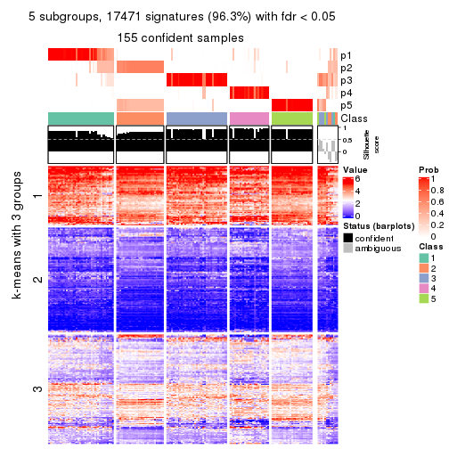</p>

</div>
<div id='tab-MAD-pam-get-signatures-no-scale-5'>
<pre><code class="r">get_signatures(res, k = 6, scale_rows = FALSE)
</code></pre>

<p></p>

</div>
</div>


Compare the overlap of signatures from different k:

```r
compare_signatures(res)
```


`get_signature()` returns a data frame invisibly. TO get the list of signatures, the function
call should be assigned to a variable explicitly. In following code, if `plot` argument is set
to `FALSE`, no heatmap is plotted while only the differential analysis is performed.

```r
# code only for demonstration
tb = get_signature(res, k = ..., plot = FALSE)
```

An example of the output of `tb` is:

```
#>   which_row         fdr    mean_1    mean_2 scaled_mean_1 scaled_mean_2 km
#> 1        38 0.042760348  8.373488  9.131774    -0.5533452     0.5164555  1
#> 2        40 0.018707592  7.106213  8.469186    -0.6173731     0.5762149  1
#> 3        55 0.019134737 10.221463 11.207825    -0.6159697     0.5749050  1
#> 4        59 0.006059896  5.921854  7.869574    -0.6899429     0.6439467  1
#> 5        60 0.018055526  8.928898 10.211722    -0.6204761     0.5791110  1
#> 6        98 0.009384629 15.714769 14.887706     0.6635654    -0.6193277  2
...
```

The columns in `tb` are:

1. `which_row`: row indices corresponding to the input matrix.
2. `fdr`: FDR for the differential test. 
3. `mean_x`: The mean value in group x.
4. `scaled_mean_x`: The mean value in group x after rows are scaled.
5. `km`: Row groups if k-means clustering is applied to rows.


UMAP plot which shows how samples are separated.


<script>
$( function() {
	$( '#tabs-MAD-pam-dimension-reduction' ).tabs();
} );
</script>
<div id='tabs-MAD-pam-dimension-reduction'>
<ul>
<li><a href='#tab-MAD-pam-dimension-reduction-1'>k = 2</a></li>
<li><a href='#tab-MAD-pam-dimension-reduction-2'>k = 3</a></li>
<li><a href='#tab-MAD-pam-dimension-reduction-3'>k = 4</a></li>
<li><a href='#tab-MAD-pam-dimension-reduction-4'>k = 5</a></li>
<li><a href='#tab-MAD-pam-dimension-reduction-5'>k = 6</a></li>
</ul>
<div id='tab-MAD-pam-dimension-reduction-1'>
<pre><code class="r">dimension_reduction(res, k = 2, method = &quot;UMAP&quot;)
</code></pre>

<p></p>

</div>
<div id='tab-MAD-pam-dimension-reduction-2'>
<pre><code class="r">dimension_reduction(res, k = 3, method = &quot;UMAP&quot;)
</code></pre>

<p></p>

</div>
<div id='tab-MAD-pam-dimension-reduction-3'>
<pre><code class="r">dimension_reduction(res, k = 4, method = &quot;UMAP&quot;)
</code></pre>

<p></p>

</div>
<div id='tab-MAD-pam-dimension-reduction-4'>
<pre><code class="r">dimension_reduction(res, k = 5, method = &quot;UMAP&quot;)
</code></pre>

<p></p>

</div>
<div id='tab-MAD-pam-dimension-reduction-5'>
<pre><code class="r">dimension_reduction(res, k = 6, method = &quot;UMAP&quot;)
</code></pre>

<p></p>

</div>
</div>


Following heatmap shows how subgroups are split when increasing `k`:

```r
collect_classes(res)
```


If matrix rows can be associated to genes, consider to use `functional_enrichment(res,
...)` to perform function enrichment for the signature genes. See [this vignette](http://bioconductor.org/packages/devel/bioc/vignettes/cola/inst/doc/functional_enrichment.html) for more detailed explanations.


 

---------------------------------------------------


### MAD:mclust


The object with results only for a single top-value method and a single partition method 
can be extracted as:

```r
res = res_list["MAD", "mclust"]
# you can also extract it by
# res = res_list["MAD:mclust"]
```

A summary of `res` and all the functions that can be applied to it:

```r
res
```

```
#> A 'ConsensusPartition' object with k = 2, 3, 4, 5, 6.
#>   On a matrix with 18147 rows and 167 columns.
#>   Top rows (1000, 2000, 3000, 4000, 5000) are extracted by 'MAD' method.
#>   Subgroups are detected by 'mclust' method.
#>   Performed in total 1250 partitions by row resampling.
#>   Best k for subgroups seems to be 4.
#> 
#> Following methods can be applied to this 'ConsensusPartition' object:
#>  [1] "cola_report"             "collect_classes"         "collect_plots"          
#>  [4] "collect_stats"           "colnames"                "compare_signatures"     
#>  [7] "consensus_heatmap"       "dimension_reduction"     "functional_enrichment"  
#> [10] "get_anno_col"            "get_anno"                "get_classes"            
#> [13] "get_consensus"           "get_matrix"              "get_membership"         
#> [16] "get_param"               "get_signatures"          "get_stats"              
#> [19] "is_best_k"               "is_stable_k"             "membership_heatmap"     
#> [22] "ncol"                    "nrow"                    "plot_ecdf"              
#> [25] "rownames"                "select_partition_number" "show"                   
#> [28] "suggest_best_k"          "test_to_known_factors"
```

`collect_plots()` function collects all the plots made from `res` for all `k` (number of partitions)
into one single page to provide an easy and fast comparison between different `k`.

```r
collect_plots(res)
```


The plots are:

- The first row: a plot of the ECDF (empirical cumulative distribution
  function) curves of the consensus matrix for each `k` and the heatmap of
  predicted classes for each `k`.
- The second row: heatmaps of the consensus matrix for each `k`.
- The third row: heatmaps of the membership matrix for each `k`.
- The fouth row: heatmaps of the signatures for each `k`.

All the plots in panels can be made by individual functions and they are
plotted later in this section.

`select_partition_number()` produces several plots showing different
statistics for choosing "optimized" `k`. There are following statistics:

- ECDF curves of the consensus matrix for each `k`;
- 1-PAC. [The PAC
  score](https://en.wikipedia.org/wiki/Consensus_clustering#Over-interpretation_potential_of_consensus_clustering)
  measures the proportion of the ambiguous subgrouping.
- Mean silhouette score.
- Concordance. The mean probability of fiting the consensus class ids in all
  partitions.
- Area increased. Denote $A_k$ as the area under the ECDF curve for current
  `k`, the area increased is defined as $A_k - A_{k-1}$.
- Rand index. The percent of pairs of samples that are both in a same cluster
  or both are not in a same cluster in the partition of k and k-1.
- Jaccard index. The ratio of pairs of samples are both in a same cluster in
  the partition of k and k-1 and the pairs of samples are both in a same
  cluster in the partition k or k-1.

The detailed explanations of these statistics can be found in [the _cola_
vignette](http://bioconductor.org/packages/devel/bioc/vignettes/cola/inst/doc/cola.html#toc_13).

Generally speaking, lower PAC score, higher mean silhouette score or higher
concordance corresponds to better partition. Rand index and Jaccard index
measure how similar the current partition is compared to partition with `k-1`.
If they are too similar, we won't accept `k` is better than `k-1`.

```r
select_partition_number(res)
```


The numeric values for all these statistics can be obtained by `get_stats()`.

```r
get_stats(res)
```

```
#>   k 1-PAC mean_silhouette concordance area_increased  Rand Jaccard
#> 2 2 0.505           0.748       0.861         0.4540 0.560   0.560
#> 3 3 0.617           0.655       0.794         0.4004 0.770   0.589
#> 4 4 0.718           0.842       0.862         0.1348 0.875   0.648
#> 5 5 0.649           0.738       0.822         0.0755 0.940   0.771
#> 6 6 0.718           0.597       0.773         0.0430 0.952   0.785
```

`suggest_best_k()` suggests the best $k$ based on these statistics. The rules are as follows:

- All $k$ with Jaccard index larger than 0.95 are removed because increasing
  $k$ does not provide enough extra information. If all $k$ are removed, it is
  marked as no subgroup is detected.
- For all $k$ with 1-PAC score larger than 0.9, the maximal $k$ is taken as
  the best $k$, and other $k$ are marked as optional $k$.
- If it does not fit the second rule. The $k$ with the maximal vote of the
  highest 1-PAC score, highest mean silhouette, and highest concordance is
  taken as the best $k$.

```r
suggest_best_k(res)
```

```
#> [1] 4
```


Following shows the table of the partitions (You need to click the **show/hide
code output** link to see it). The membership matrix (columns with name `p*`)
is inferred by
[`clue::cl_consensus()`](https://www.rdocumentation.org/link/cl_consensus?package=clue)
function with the `SE` method. Basically the value in the membership matrix
represents the probability to belong to a certain group. The finall class
label for an item is determined with the group with highest probability it
belongs to.

In `get_classes()` function, the entropy is calculated from the membership
matrix and the silhouette score is calculated from the consensus matrix.


<script>
$( function() {
	$( '#tabs-MAD-mclust-get-classes' ).tabs();
} );
</script>
<div id='tabs-MAD-mclust-get-classes'>
<ul>
<li><a href='#tab-MAD-mclust-get-classes-1'>k = 2</a></li>
<li><a href='#tab-MAD-mclust-get-classes-2'>k = 3</a></li>
<li><a href='#tab-MAD-mclust-get-classes-3'>k = 4</a></li>
<li><a href='#tab-MAD-mclust-get-classes-4'>k = 5</a></li>
<li><a href='#tab-MAD-mclust-get-classes-5'>k = 6</a></li>
</ul>

<div id='tab-MAD-mclust-get-classes-1'>
<p><a id='tab-MAD-mclust-get-classes-1-a' style='color:#0366d6' href='#'>show/hide code output</a></p>
<pre><code class="r">cbind(get_classes(res, k = 2), get_membership(res, k = 2))
</code></pre>

<pre><code>#&gt;            class entropy silhouette    p1    p2
#&gt; SRR1313062     1  0.6973      0.730 0.812 0.188
#&gt; SRR1313063     1  0.6887      0.732 0.816 0.184
#&gt; SRR1313064     1  0.0000      0.773 1.000 0.000
#&gt; SRR1313065     1  0.0000      0.773 1.000 0.000
#&gt; SRR1313066     1  0.0000      0.773 1.000 0.000
#&gt; SRR1313067     1  0.6973      0.730 0.812 0.188
#&gt; SRR1313068     1  0.6973      0.730 0.812 0.188
#&gt; SRR1313069     1  0.0000      0.773 1.000 0.000
#&gt; SRR1313070     1  0.0000      0.773 1.000 0.000
#&gt; SRR1313071     1  0.0000      0.773 1.000 0.000
#&gt; SRR1313072     1  0.0000      0.773 1.000 0.000
#&gt; SRR1313073     1  0.0000      0.773 1.000 0.000
#&gt; SRR1313074     1  0.0000      0.773 1.000 0.000
#&gt; SRR1313075     1  0.0000      0.773 1.000 0.000
#&gt; SRR1313076     1  0.6973      0.730 0.812 0.188
#&gt; SRR1313077     1  0.6973      0.730 0.812 0.188
#&gt; SRR1313078     1  0.6973      0.730 0.812 0.188
#&gt; SRR1313079     1  0.0000      0.773 1.000 0.000
#&gt; SRR1313080     1  0.6973      0.730 0.812 0.188
#&gt; SRR1313081     1  0.6973      0.730 0.812 0.188
#&gt; SRR1313082     1  0.0000      0.773 1.000 0.000
#&gt; SRR1313083     1  0.0000      0.773 1.000 0.000
#&gt; SRR1313084     1  0.0000      0.773 1.000 0.000
#&gt; SRR1313085     1  0.0000      0.773 1.000 0.000
#&gt; SRR1313086     1  0.0000      0.773 1.000 0.000
#&gt; SRR1313087     1  0.0000      0.773 1.000 0.000
#&gt; SRR1313088     1  0.0000      0.773 1.000 0.000
#&gt; SRR1313089     1  0.0000      0.773 1.000 0.000
#&gt; SRR1313092     1  0.9944      0.498 0.544 0.456
#&gt; SRR1313090     1  0.9993      0.452 0.516 0.484
#&gt; SRR1313091     1  1.0000      0.413 0.500 0.500
#&gt; SRR1313093     1  0.9933      0.503 0.548 0.452
#&gt; SRR1313095     1  0.9896      0.518 0.560 0.440
#&gt; SRR1313096     1  0.7219      0.728 0.800 0.200
#&gt; SRR1313094     1  0.9988      0.459 0.520 0.480
#&gt; SRR1313097     1  0.9993      0.452 0.516 0.484
#&gt; SRR1313099     1  0.9970      0.466 0.532 0.468
#&gt; SRR1313098     1  0.8016      0.704 0.756 0.244
#&gt; SRR1313101     1  0.9993      0.452 0.516 0.484
#&gt; SRR1313102     1  0.9993      0.452 0.516 0.484
#&gt; SRR1313103     1  0.9970      0.466 0.532 0.468
#&gt; SRR1313100     1  0.9795      0.537 0.584 0.416
#&gt; SRR1313105     1  0.9993      0.452 0.516 0.484
#&gt; SRR1313104     1  0.9993      0.452 0.516 0.484
#&gt; SRR1313107     1  0.9970      0.466 0.532 0.468
#&gt; SRR1313106     1  0.9977      0.473 0.528 0.472
#&gt; SRR1313109     1  0.9998      0.433 0.508 0.492
#&gt; SRR1313108     1  0.7602      0.717 0.780 0.220
#&gt; SRR1313111     1  0.9988      0.459 0.520 0.480
#&gt; SRR1313110     1  0.9944      0.498 0.544 0.456
#&gt; SRR1313112     1  0.9993      0.452 0.516 0.484
#&gt; SRR1313113     1  0.9993      0.452 0.516 0.484
#&gt; SRR1313115     1  0.9933      0.503 0.548 0.452
#&gt; SRR1313114     1  0.9933      0.503 0.548 0.452
#&gt; SRR1313117     1  0.9993      0.452 0.516 0.484
#&gt; SRR1313118     1  0.9944      0.498 0.544 0.456
#&gt; SRR1313116     1  0.9993      0.452 0.516 0.484
#&gt; SRR1313120     1  0.9970      0.466 0.532 0.468
#&gt; SRR1313119     1  0.9993      0.452 0.516 0.484
#&gt; SRR1313122     1  0.9922      0.506 0.552 0.448
#&gt; SRR1313124     1  0.9993      0.452 0.516 0.484
#&gt; SRR1313121     1  0.9993      0.452 0.516 0.484
#&gt; SRR1313125     1  0.9993      0.452 0.516 0.484
#&gt; SRR1313127     1  0.8144      0.698 0.748 0.252
#&gt; SRR1313123     1  0.9129      0.637 0.672 0.328
#&gt; SRR1313128     1  0.0938      0.776 0.988 0.012
#&gt; SRR1313126     1  0.6973      0.730 0.812 0.188
#&gt; SRR1313130     1  1.0000      0.413 0.500 0.500
#&gt; SRR1313132     1  0.0938      0.776 0.988 0.012
#&gt; SRR1313129     1  0.9993      0.452 0.516 0.484
#&gt; SRR1313133     1  0.0938      0.776 0.988 0.012
#&gt; SRR1313131     1  0.7219      0.728 0.800 0.200
#&gt; SRR1313134     1  0.0938      0.776 0.988 0.012
#&gt; SRR1313135     1  0.0938      0.776 0.988 0.012
#&gt; SRR1313136     1  0.0938      0.776 0.988 0.012
#&gt; SRR1313137     1  0.0938      0.776 0.988 0.012
#&gt; SRR1313138     1  0.4431      0.758 0.908 0.092
#&gt; SRR1313140     1  0.0000      0.773 1.000 0.000
#&gt; SRR1313141     1  0.0938      0.776 0.988 0.012
#&gt; SRR1313139     1  0.0000      0.773 1.000 0.000
#&gt; SRR1313143     1  0.0938      0.776 0.988 0.012
#&gt; SRR1313142     1  0.0938      0.776 0.988 0.012
#&gt; SRR1313144     1  0.0938      0.776 0.988 0.012
#&gt; SRR1313145     1  0.0938      0.776 0.988 0.012
#&gt; SRR1313146     1  0.0938      0.776 0.988 0.012
#&gt; SRR1313147     1  0.0000      0.773 1.000 0.000
#&gt; SRR1313150     1  0.1184      0.774 0.984 0.016
#&gt; SRR1313149     1  0.0938      0.776 0.988 0.012
#&gt; SRR1313152     1  0.0938      0.776 0.988 0.012
#&gt; SRR1313151     1  0.0938      0.776 0.988 0.012
#&gt; SRR1313154     1  0.0938      0.776 0.988 0.012
#&gt; SRR1313153     1  0.0938      0.776 0.988 0.012
#&gt; SRR1313156     1  0.3431      0.767 0.936 0.064
#&gt; SRR1313155     1  0.0938      0.776 0.988 0.012
#&gt; SRR1313157     1  0.0000      0.773 1.000 0.000
#&gt; SRR1313158     1  0.0938      0.776 0.988 0.012
#&gt; SRR1313161     1  0.4298      0.759 0.912 0.088
#&gt; SRR1313159     1  0.4690      0.755 0.900 0.100
#&gt; SRR1313160     1  0.3274      0.768 0.940 0.060
#&gt; SRR1313162     1  0.1633      0.776 0.976 0.024
#&gt; SRR1313163     1  0.4298      0.759 0.912 0.088
#&gt; SRR1313165     1  0.3114      0.769 0.944 0.056
#&gt; SRR1313166     1  0.0938      0.776 0.988 0.012
#&gt; SRR1313164     1  0.0938      0.776 0.988 0.012
#&gt; SRR1313167     1  0.0000      0.773 1.000 0.000
#&gt; SRR1313168     1  0.0938      0.776 0.988 0.012
#&gt; SRR1313170     1  0.9993      0.452 0.516 0.484
#&gt; SRR1313169     1  0.0938      0.776 0.988 0.012
#&gt; SRR1313172     1  0.9881      0.523 0.564 0.436
#&gt; SRR1313171     1  0.0938      0.776 0.988 0.012
#&gt; SRR1313174     2  0.0000      0.971 0.000 1.000
#&gt; SRR1313173     1  0.7219      0.728 0.800 0.200
#&gt; SRR1313176     2  0.0000      0.971 0.000 1.000
#&gt; SRR1313175     2  0.0000      0.971 0.000 1.000
#&gt; SRR1313178     2  0.0000      0.971 0.000 1.000
#&gt; SRR1313177     2  0.0000      0.971 0.000 1.000
#&gt; SRR1313179     1  0.9963      0.486 0.536 0.464
#&gt; SRR1313180     2  0.0000      0.971 0.000 1.000
#&gt; SRR1313181     2  0.0000      0.971 0.000 1.000
#&gt; SRR1313183     2  0.0000      0.971 0.000 1.000
#&gt; SRR1313182     2  0.0000      0.971 0.000 1.000
#&gt; SRR1313184     2  0.8661      0.362 0.288 0.712
#&gt; SRR1313185     2  0.0000      0.971 0.000 1.000
#&gt; SRR1313188     2  0.0000      0.971 0.000 1.000
#&gt; SRR1313187     2  0.0000      0.971 0.000 1.000
#&gt; SRR1313186     2  0.0000      0.971 0.000 1.000
#&gt; SRR1313189     2  0.0000      0.971 0.000 1.000
#&gt; SRR1313190     2  0.0000      0.971 0.000 1.000
#&gt; SRR1313191     2  0.0000      0.971 0.000 1.000
#&gt; SRR1313192     2  0.0000      0.971 0.000 1.000
#&gt; SRR1313193     2  0.0000      0.971 0.000 1.000
#&gt; SRR1313194     2  0.0000      0.971 0.000 1.000
#&gt; SRR1313195     2  0.0000      0.971 0.000 1.000
#&gt; SRR1313196     2  0.0000      0.971 0.000 1.000
#&gt; SRR1313197     2  0.0000      0.971 0.000 1.000
#&gt; SRR1313198     2  0.0000      0.971 0.000 1.000
#&gt; SRR1313199     2  0.0000      0.971 0.000 1.000
#&gt; SRR1313200     2  0.0000      0.971 0.000 1.000
#&gt; SRR1313201     2  0.0000      0.971 0.000 1.000
#&gt; SRR1313202     2  0.0000      0.971 0.000 1.000
#&gt; SRR1313203     1  0.7453      0.717 0.788 0.212
#&gt; SRR1313204     2  0.0000      0.971 0.000 1.000
#&gt; SRR1313205     2  0.0000      0.971 0.000 1.000
#&gt; SRR1313207     2  0.0000      0.971 0.000 1.000
#&gt; SRR1313208     2  0.0000      0.971 0.000 1.000
#&gt; SRR1313206     2  0.0000      0.971 0.000 1.000
#&gt; SRR1313210     2  0.0000      0.971 0.000 1.000
#&gt; SRR1313209     2  0.0000      0.971 0.000 1.000
#&gt; SRR1313211     2  0.0000      0.971 0.000 1.000
#&gt; SRR1313212     2  0.0000      0.971 0.000 1.000
#&gt; SRR1313214     2  0.0000      0.971 0.000 1.000
#&gt; SRR1313215     2  0.0000      0.971 0.000 1.000
#&gt; SRR1313213     2  0.0000      0.971 0.000 1.000
#&gt; SRR1313216     2  1.0000     -0.429 0.500 0.500
#&gt; SRR1313217     2  0.0000      0.971 0.000 1.000
#&gt; SRR1313219     2  0.0000      0.971 0.000 1.000
#&gt; SRR1313220     2  0.0000      0.971 0.000 1.000
#&gt; SRR1313218     2  0.0000      0.971 0.000 1.000
#&gt; SRR1313222     2  0.0000      0.971 0.000 1.000
#&gt; SRR1313221     2  0.0000      0.971 0.000 1.000
#&gt; SRR1313223     2  0.0000      0.971 0.000 1.000
#&gt; SRR1313224     2  0.0000      0.971 0.000 1.000
#&gt; SRR1313225     2  0.0000      0.971 0.000 1.000
#&gt; SRR1313226     2  0.8499      0.402 0.276 0.724
#&gt; SRR1313227     2  0.0000      0.971 0.000 1.000
#&gt; SRR1313228     2  0.0000      0.971 0.000 1.000
#&gt; SRR1313229     2  0.0000      0.971 0.000 1.000
</code></pre>

<script>
$('#tab-MAD-mclust-get-classes-1-a').parent().next().next().hide();
$('#tab-MAD-mclust-get-classes-1-a').click(function(){
  $('#tab-MAD-mclust-get-classes-1-a').parent().next().next().toggle();
  return(false);
});
</script>
</div>

<div id='tab-MAD-mclust-get-classes-2'>
<p><a id='tab-MAD-mclust-get-classes-2-a' style='color:#0366d6' href='#'>show/hide code output</a></p>
<pre><code class="r">cbind(get_classes(res, k = 3), get_membership(res, k = 3))
</code></pre>

<pre><code>#&gt;            class entropy silhouette    p1    p2    p3
#&gt; SRR1313062     3  0.6274     0.2614 0.456 0.000 0.544
#&gt; SRR1313063     3  0.6274     0.2614 0.456 0.000 0.544
#&gt; SRR1313064     1  0.5733     0.2817 0.676 0.000 0.324
#&gt; SRR1313065     1  0.5760     0.2791 0.672 0.000 0.328
#&gt; SRR1313066     1  0.5733     0.2817 0.676 0.000 0.324
#&gt; SRR1313067     3  0.6079     0.3567 0.388 0.000 0.612
#&gt; SRR1313068     3  0.6235     0.2881 0.436 0.000 0.564
#&gt; SRR1313069     1  0.5733     0.2817 0.676 0.000 0.324
#&gt; SRR1313070     1  0.5733     0.2817 0.676 0.000 0.324
#&gt; SRR1313071     1  0.5733     0.2817 0.676 0.000 0.324
#&gt; SRR1313072     1  0.5733     0.2817 0.676 0.000 0.324
#&gt; SRR1313073     1  0.6291    -0.1152 0.532 0.000 0.468
#&gt; SRR1313074     1  0.5733     0.2817 0.676 0.000 0.324
#&gt; SRR1313075     1  0.5733     0.2817 0.676 0.000 0.324
#&gt; SRR1313076     3  0.6192     0.3097 0.420 0.000 0.580
#&gt; SRR1313077     3  0.5465     0.5031 0.288 0.000 0.712
#&gt; SRR1313078     3  0.4235     0.6521 0.176 0.000 0.824
#&gt; SRR1313079     1  0.5733     0.2817 0.676 0.000 0.324
#&gt; SRR1313080     3  0.6274     0.2614 0.456 0.000 0.544
#&gt; SRR1313081     3  0.5497     0.4969 0.292 0.000 0.708
#&gt; SRR1313082     1  0.5733     0.2817 0.676 0.000 0.324
#&gt; SRR1313083     1  0.5905     0.2604 0.648 0.000 0.352
#&gt; SRR1313084     1  0.5733     0.2817 0.676 0.000 0.324
#&gt; SRR1313085     1  0.5733     0.2817 0.676 0.000 0.324
#&gt; SRR1313086     1  0.5733     0.2817 0.676 0.000 0.324
#&gt; SRR1313087     1  0.5733     0.2817 0.676 0.000 0.324
#&gt; SRR1313088     1  0.5733     0.2817 0.676 0.000 0.324
#&gt; SRR1313089     1  0.5733     0.2817 0.676 0.000 0.324
#&gt; SRR1313092     3  0.1860     0.7492 0.052 0.000 0.948
#&gt; SRR1313090     3  0.1411     0.7444 0.036 0.000 0.964
#&gt; SRR1313091     3  0.7901     0.1546 0.060 0.400 0.540
#&gt; SRR1313093     3  0.4062     0.6648 0.164 0.000 0.836
#&gt; SRR1313095     3  0.1964     0.7467 0.056 0.000 0.944
#&gt; SRR1313096     3  0.4062     0.6648 0.164 0.000 0.836
#&gt; SRR1313094     3  0.1964     0.7467 0.056 0.000 0.944
#&gt; SRR1313097     3  0.0475     0.7462 0.004 0.004 0.992
#&gt; SRR1313099     3  0.2998     0.7434 0.068 0.016 0.916
#&gt; SRR1313098     3  0.2165     0.7446 0.064 0.000 0.936
#&gt; SRR1313101     3  0.0237     0.7489 0.000 0.004 0.996
#&gt; SRR1313102     3  0.2383     0.7499 0.044 0.016 0.940
#&gt; SRR1313103     3  0.2749     0.7462 0.064 0.012 0.924
#&gt; SRR1313100     3  0.1753     0.7465 0.048 0.000 0.952
#&gt; SRR1313105     3  0.0475     0.7462 0.004 0.004 0.992
#&gt; SRR1313104     3  0.0000     0.7483 0.000 0.000 1.000
#&gt; SRR1313107     3  0.2680     0.7461 0.068 0.008 0.924
#&gt; SRR1313106     3  0.0661     0.7448 0.004 0.008 0.988
#&gt; SRR1313109     3  0.6678     0.4314 0.060 0.216 0.724
#&gt; SRR1313108     3  0.4062     0.6648 0.164 0.000 0.836
#&gt; SRR1313111     3  0.1878     0.7536 0.044 0.004 0.952
#&gt; SRR1313110     3  0.1411     0.7444 0.036 0.000 0.964
#&gt; SRR1313112     3  0.0237     0.7489 0.000 0.004 0.996
#&gt; SRR1313113     3  0.0237     0.7489 0.000 0.004 0.996
#&gt; SRR1313115     3  0.4002     0.6687 0.160 0.000 0.840
#&gt; SRR1313114     3  0.1411     0.7444 0.036 0.000 0.964
#&gt; SRR1313117     3  0.1289     0.7466 0.032 0.000 0.968
#&gt; SRR1313118     3  0.1411     0.7444 0.036 0.000 0.964
#&gt; SRR1313116     3  0.2096     0.7086 0.004 0.052 0.944
#&gt; SRR1313120     3  0.2261     0.7440 0.068 0.000 0.932
#&gt; SRR1313119     3  0.1411     0.7444 0.036 0.000 0.964
#&gt; SRR1313122     3  0.1860     0.7492 0.052 0.000 0.948
#&gt; SRR1313124     3  0.1289     0.7466 0.032 0.000 0.968
#&gt; SRR1313121     3  0.1163     0.7483 0.028 0.000 0.972
#&gt; SRR1313125     3  0.0237     0.7489 0.000 0.004 0.996
#&gt; SRR1313127     3  0.2165     0.7446 0.064 0.000 0.936
#&gt; SRR1313123     3  0.2066     0.7453 0.060 0.000 0.940
#&gt; SRR1313128     1  0.5621     0.5695 0.692 0.000 0.308
#&gt; SRR1313126     3  0.2448     0.7391 0.076 0.000 0.924
#&gt; SRR1313130     3  0.7915     0.1179 0.056 0.456 0.488
#&gt; SRR1313132     1  0.6140     0.5326 0.596 0.000 0.404
#&gt; SRR1313129     3  0.3253     0.7321 0.052 0.036 0.912
#&gt; SRR1313133     1  0.5621     0.5695 0.692 0.000 0.308
#&gt; SRR1313131     3  0.5016     0.5708 0.240 0.000 0.760
#&gt; SRR1313134     1  0.5810     0.5573 0.664 0.000 0.336
#&gt; SRR1313135     1  0.6126     0.5437 0.600 0.000 0.400
#&gt; SRR1313136     1  0.6126     0.5404 0.600 0.000 0.400
#&gt; SRR1313137     1  0.6062     0.5463 0.616 0.000 0.384
#&gt; SRR1313138     1  0.6373     0.5342 0.588 0.004 0.408
#&gt; SRR1313140     1  0.4002     0.4550 0.840 0.000 0.160
#&gt; SRR1313141     1  0.5835     0.5546 0.660 0.000 0.340
#&gt; SRR1313139     1  0.4931     0.4811 0.768 0.000 0.232
#&gt; SRR1313143     1  0.6295     0.3489 0.528 0.000 0.472
#&gt; SRR1313142     1  0.5650     0.5701 0.688 0.000 0.312
#&gt; SRR1313144     1  0.6062     0.5485 0.616 0.000 0.384
#&gt; SRR1313145     1  0.6095     0.5426 0.608 0.000 0.392
#&gt; SRR1313146     1  0.5733     0.5711 0.676 0.000 0.324
#&gt; SRR1313147     1  0.6026     0.5565 0.624 0.000 0.376
#&gt; SRR1313150     1  0.6295     0.4604 0.528 0.000 0.472
#&gt; SRR1313149     1  0.5905     0.5405 0.648 0.000 0.352
#&gt; SRR1313152     1  0.6062     0.5463 0.616 0.000 0.384
#&gt; SRR1313151     1  0.5650     0.5706 0.688 0.000 0.312
#&gt; SRR1313154     1  0.5621     0.5695 0.692 0.000 0.308
#&gt; SRR1313153     1  0.5706     0.5702 0.680 0.000 0.320
#&gt; SRR1313156     1  0.6140     0.5326 0.596 0.000 0.404
#&gt; SRR1313155     1  0.5948     0.5645 0.640 0.000 0.360
#&gt; SRR1313157     1  0.6267     0.4879 0.548 0.000 0.452
#&gt; SRR1313158     1  0.6140     0.5326 0.596 0.000 0.404
#&gt; SRR1313161     1  0.6180     0.5286 0.584 0.000 0.416
#&gt; SRR1313159     1  0.6498     0.5339 0.596 0.008 0.396
#&gt; SRR1313160     1  0.6111     0.5428 0.604 0.000 0.396
#&gt; SRR1313162     3  0.2448     0.7409 0.076 0.000 0.924
#&gt; SRR1313163     1  0.6168     0.5327 0.588 0.000 0.412
#&gt; SRR1313165     1  0.6111     0.5428 0.604 0.000 0.396
#&gt; SRR1313166     1  0.5650     0.5701 0.688 0.000 0.312
#&gt; SRR1313164     1  0.5706     0.5702 0.680 0.000 0.320
#&gt; SRR1313167     1  0.6280     0.4712 0.540 0.000 0.460
#&gt; SRR1313168     1  0.6045     0.5495 0.620 0.000 0.380
#&gt; SRR1313170     3  0.2918     0.7367 0.044 0.032 0.924
#&gt; SRR1313169     1  0.5905     0.5651 0.648 0.000 0.352
#&gt; SRR1313172     3  0.9474     0.1115 0.272 0.232 0.496
#&gt; SRR1313171     1  0.6291     0.3675 0.532 0.000 0.468
#&gt; SRR1313174     2  0.0661     0.9645 0.004 0.988 0.008
#&gt; SRR1313173     3  0.4291     0.6545 0.180 0.000 0.820
#&gt; SRR1313176     2  0.0000     0.9659 0.000 1.000 0.000
#&gt; SRR1313175     2  0.0661     0.9645 0.004 0.988 0.008
#&gt; SRR1313178     2  0.0000     0.9659 0.000 1.000 0.000
#&gt; SRR1313177     2  0.0237     0.9641 0.004 0.996 0.000
#&gt; SRR1313179     3  0.9058     0.1637 0.180 0.276 0.544
#&gt; SRR1313180     2  0.0661     0.9645 0.004 0.988 0.008
#&gt; SRR1313181     2  0.0000     0.9659 0.000 1.000 0.000
#&gt; SRR1313183     2  0.0237     0.9641 0.004 0.996 0.000
#&gt; SRR1313182     2  0.0237     0.9656 0.004 0.996 0.000
#&gt; SRR1313184     2  0.8058     0.1878 0.072 0.552 0.376
#&gt; SRR1313185     2  0.0000     0.9659 0.000 1.000 0.000
#&gt; SRR1313188     2  0.0661     0.9645 0.004 0.988 0.008
#&gt; SRR1313187     2  0.0661     0.9645 0.004 0.988 0.008
#&gt; SRR1313186     2  0.0000     0.9659 0.000 1.000 0.000
#&gt; SRR1313189     2  0.0237     0.9641 0.004 0.996 0.000
#&gt; SRR1313190     2  0.0000     0.9659 0.000 1.000 0.000
#&gt; SRR1313191     2  0.0237     0.9656 0.004 0.996 0.000
#&gt; SRR1313192     2  0.0000     0.9659 0.000 1.000 0.000
#&gt; SRR1313193     2  0.0000     0.9659 0.000 1.000 0.000
#&gt; SRR1313194     2  0.0661     0.9645 0.004 0.988 0.008
#&gt; SRR1313195     2  0.0661     0.9645 0.004 0.988 0.008
#&gt; SRR1313196     2  0.0661     0.9645 0.004 0.988 0.008
#&gt; SRR1313197     2  0.0661     0.9645 0.004 0.988 0.008
#&gt; SRR1313198     2  0.0661     0.9645 0.004 0.988 0.008
#&gt; SRR1313199     2  0.0000     0.9659 0.000 1.000 0.000
#&gt; SRR1313200     2  0.0661     0.9645 0.004 0.988 0.008
#&gt; SRR1313201     2  0.0000     0.9659 0.000 1.000 0.000
#&gt; SRR1313202     2  0.5024     0.6979 0.004 0.776 0.220
#&gt; SRR1313203     1  0.6274     0.1567 0.544 0.000 0.456
#&gt; SRR1313204     2  0.0000     0.9659 0.000 1.000 0.000
#&gt; SRR1313205     2  0.0000     0.9659 0.000 1.000 0.000
#&gt; SRR1313207     2  0.0000     0.9659 0.000 1.000 0.000
#&gt; SRR1313208     2  0.0000     0.9659 0.000 1.000 0.000
#&gt; SRR1313206     2  0.0000     0.9659 0.000 1.000 0.000
#&gt; SRR1313210     2  0.0661     0.9645 0.004 0.988 0.008
#&gt; SRR1313209     2  0.0661     0.9645 0.004 0.988 0.008
#&gt; SRR1313211     2  0.0000     0.9659 0.000 1.000 0.000
#&gt; SRR1313212     2  0.0000     0.9659 0.000 1.000 0.000
#&gt; SRR1313214     2  0.0661     0.9645 0.004 0.988 0.008
#&gt; SRR1313215     2  0.0661     0.9645 0.004 0.988 0.008
#&gt; SRR1313213     2  0.0000     0.9659 0.000 1.000 0.000
#&gt; SRR1313216     2  0.7987    -0.0427 0.060 0.492 0.448
#&gt; SRR1313217     2  0.0661     0.9645 0.004 0.988 0.008
#&gt; SRR1313219     2  0.0661     0.9645 0.004 0.988 0.008
#&gt; SRR1313220     2  0.0000     0.9659 0.000 1.000 0.000
#&gt; SRR1313218     2  0.0475     0.9652 0.004 0.992 0.004
#&gt; SRR1313222     2  0.0000     0.9659 0.000 1.000 0.000
#&gt; SRR1313221     2  0.0000     0.9659 0.000 1.000 0.000
#&gt; SRR1313223     2  0.0000     0.9659 0.000 1.000 0.000
#&gt; SRR1313224     2  0.0661     0.9645 0.004 0.988 0.008
#&gt; SRR1313225     2  0.0661     0.9645 0.004 0.988 0.008
#&gt; SRR1313226     2  0.5404     0.6357 0.004 0.740 0.256
#&gt; SRR1313227     2  0.0000     0.9659 0.000 1.000 0.000
#&gt; SRR1313228     2  0.0000     0.9659 0.000 1.000 0.000
#&gt; SRR1313229     2  0.0000     0.9659 0.000 1.000 0.000
</code></pre>

<script>
$('#tab-MAD-mclust-get-classes-2-a').parent().next().next().hide();
$('#tab-MAD-mclust-get-classes-2-a').click(function(){
  $('#tab-MAD-mclust-get-classes-2-a').parent().next().next().toggle();
  return(false);
});
</script>
</div>

<div id='tab-MAD-mclust-get-classes-3'>
<p><a id='tab-MAD-mclust-get-classes-3-a' style='color:#0366d6' href='#'>show/hide code output</a></p>
<pre><code class="r">cbind(get_classes(res, k = 4), get_membership(res, k = 4))
</code></pre>

<pre><code>#&gt;            class entropy silhouette    p1    p2    p3    p4
#&gt; SRR1313062     4  0.2149    0.79503 0.000 0.000 0.088 0.912
#&gt; SRR1313063     4  0.0707    0.81141 0.000 0.000 0.020 0.980
#&gt; SRR1313064     4  0.1398    0.80953 0.040 0.000 0.004 0.956
#&gt; SRR1313065     4  0.6170    0.46538 0.332 0.000 0.068 0.600
#&gt; SRR1313066     4  0.0188    0.81238 0.000 0.000 0.004 0.996
#&gt; SRR1313067     4  0.3306    0.74806 0.004 0.000 0.156 0.840
#&gt; SRR1313068     4  0.2216    0.79363 0.000 0.000 0.092 0.908
#&gt; SRR1313069     4  0.4761    0.52133 0.332 0.000 0.004 0.664
#&gt; SRR1313070     4  0.0188    0.81238 0.000 0.000 0.004 0.996
#&gt; SRR1313071     4  0.0188    0.81238 0.000 0.000 0.004 0.996
#&gt; SRR1313072     4  0.0188    0.81238 0.000 0.000 0.004 0.996
#&gt; SRR1313073     4  0.0779    0.81499 0.016 0.000 0.004 0.980
#&gt; SRR1313074     4  0.3908    0.68554 0.212 0.000 0.004 0.784
#&gt; SRR1313075     4  0.0895    0.81485 0.020 0.000 0.004 0.976
#&gt; SRR1313076     4  0.2999    0.76889 0.004 0.000 0.132 0.864
#&gt; SRR1313077     4  0.4914    0.67388 0.044 0.000 0.208 0.748
#&gt; SRR1313078     4  0.7017    0.38366 0.188 0.000 0.236 0.576
#&gt; SRR1313079     4  0.0779    0.81499 0.016 0.000 0.004 0.980
#&gt; SRR1313080     4  0.1792    0.80252 0.000 0.000 0.068 0.932
#&gt; SRR1313081     4  0.4579    0.69422 0.032 0.000 0.200 0.768
#&gt; SRR1313082     4  0.5677    0.49595 0.332 0.000 0.040 0.628
#&gt; SRR1313083     4  0.6221    0.48450 0.316 0.000 0.076 0.608
#&gt; SRR1313084     4  0.0188    0.81238 0.000 0.000 0.004 0.996
#&gt; SRR1313085     4  0.0188    0.81238 0.000 0.000 0.004 0.996
#&gt; SRR1313086     4  0.6041    0.47611 0.332 0.000 0.060 0.608
#&gt; SRR1313087     4  0.0779    0.81499 0.016 0.000 0.004 0.980
#&gt; SRR1313088     4  0.1004    0.81429 0.024 0.000 0.004 0.972
#&gt; SRR1313089     4  0.0895    0.81499 0.020 0.000 0.004 0.976
#&gt; SRR1313092     3  0.0524    0.93253 0.008 0.000 0.988 0.004
#&gt; SRR1313090     3  0.0376    0.93426 0.004 0.000 0.992 0.004
#&gt; SRR1313091     3  0.5125    0.37441 0.004 0.376 0.616 0.004
#&gt; SRR1313093     3  0.1867    0.88056 0.072 0.000 0.928 0.000
#&gt; SRR1313095     3  0.0524    0.93253 0.008 0.000 0.988 0.004
#&gt; SRR1313096     3  0.1940    0.87897 0.076 0.000 0.924 0.000
#&gt; SRR1313094     3  0.0336    0.93235 0.008 0.000 0.992 0.000
#&gt; SRR1313097     3  0.0188    0.93374 0.000 0.000 0.996 0.004
#&gt; SRR1313099     3  0.1474    0.89704 0.052 0.000 0.948 0.000
#&gt; SRR1313098     3  0.0524    0.93253 0.008 0.000 0.988 0.004
#&gt; SRR1313101     3  0.0376    0.93426 0.004 0.000 0.992 0.004
#&gt; SRR1313102     3  0.0188    0.93374 0.000 0.000 0.996 0.004
#&gt; SRR1313103     3  0.0188    0.93277 0.004 0.000 0.996 0.000
#&gt; SRR1313100     3  0.2450    0.85250 0.016 0.000 0.912 0.072
#&gt; SRR1313105     3  0.0000    0.93413 0.000 0.000 1.000 0.000
#&gt; SRR1313104     3  0.0188    0.93374 0.000 0.000 0.996 0.004
#&gt; SRR1313107     3  0.1716    0.88643 0.064 0.000 0.936 0.000
#&gt; SRR1313106     3  0.0188    0.93374 0.000 0.000 0.996 0.004
#&gt; SRR1313109     3  0.0817    0.91761 0.000 0.024 0.976 0.000
#&gt; SRR1313108     3  0.2125    0.87744 0.076 0.000 0.920 0.004
#&gt; SRR1313111     3  0.0000    0.93413 0.000 0.000 1.000 0.000
#&gt; SRR1313110     3  0.1716    0.87410 0.000 0.000 0.936 0.064
#&gt; SRR1313112     3  0.0188    0.93374 0.000 0.000 0.996 0.004
#&gt; SRR1313113     3  0.0000    0.93413 0.000 0.000 1.000 0.000
#&gt; SRR1313115     3  0.1867    0.88056 0.072 0.000 0.928 0.000
#&gt; SRR1313114     3  0.0469    0.93032 0.000 0.000 0.988 0.012
#&gt; SRR1313117     3  0.0376    0.93426 0.004 0.000 0.992 0.004
#&gt; SRR1313118     3  0.0817    0.91872 0.000 0.000 0.976 0.024
#&gt; SRR1313116     3  0.0188    0.93374 0.000 0.000 0.996 0.004
#&gt; SRR1313120     3  0.1792    0.88247 0.068 0.000 0.932 0.000
#&gt; SRR1313119     3  0.0376    0.93426 0.004 0.000 0.992 0.004
#&gt; SRR1313122     3  0.0672    0.93195 0.008 0.000 0.984 0.008
#&gt; SRR1313124     3  0.0376    0.93426 0.004 0.000 0.992 0.004
#&gt; SRR1313121     3  0.0376    0.93426 0.004 0.000 0.992 0.004
#&gt; SRR1313125     3  0.0336    0.93244 0.000 0.000 0.992 0.008
#&gt; SRR1313127     3  0.0657    0.93123 0.012 0.000 0.984 0.004
#&gt; SRR1313123     3  0.1637    0.89239 0.060 0.000 0.940 0.000
#&gt; SRR1313128     1  0.3649    0.88541 0.796 0.000 0.204 0.000
#&gt; SRR1313126     3  0.1256    0.91807 0.028 0.000 0.964 0.008
#&gt; SRR1313130     3  0.4607    0.54576 0.004 0.276 0.716 0.004
#&gt; SRR1313132     1  0.3726    0.88709 0.788 0.000 0.212 0.000
#&gt; SRR1313129     3  0.0000    0.93413 0.000 0.000 1.000 0.000
#&gt; SRR1313133     1  0.3649    0.88541 0.796 0.000 0.204 0.000
#&gt; SRR1313131     4  0.7717   -0.02476 0.344 0.000 0.232 0.424
#&gt; SRR1313134     1  0.3649    0.88541 0.796 0.000 0.204 0.000
#&gt; SRR1313135     1  0.4428    0.87695 0.720 0.000 0.276 0.004
#&gt; SRR1313136     1  0.4134    0.88384 0.740 0.000 0.260 0.000
#&gt; SRR1313137     1  0.5723    0.86665 0.684 0.000 0.244 0.072
#&gt; SRR1313138     1  0.5550    0.87096 0.692 0.000 0.248 0.060
#&gt; SRR1313140     1  0.6412    0.38095 0.592 0.000 0.088 0.320
#&gt; SRR1313141     1  0.3649    0.88541 0.796 0.000 0.204 0.000
#&gt; SRR1313139     1  0.6805    0.54829 0.592 0.000 0.148 0.260
#&gt; SRR1313143     1  0.5392    0.83146 0.724 0.000 0.204 0.072
#&gt; SRR1313142     1  0.3726    0.88860 0.788 0.000 0.212 0.000
#&gt; SRR1313144     1  0.5693    0.86843 0.688 0.000 0.240 0.072
#&gt; SRR1313145     1  0.3764    0.88973 0.784 0.000 0.216 0.000
#&gt; SRR1313146     1  0.4283    0.88501 0.740 0.000 0.256 0.004
#&gt; SRR1313147     1  0.5723    0.86665 0.684 0.000 0.244 0.072
#&gt; SRR1313150     1  0.5723    0.86665 0.684 0.000 0.244 0.072
#&gt; SRR1313149     1  0.3649    0.88541 0.796 0.000 0.204 0.000
#&gt; SRR1313152     1  0.5723    0.86665 0.684 0.000 0.244 0.072
#&gt; SRR1313151     1  0.3801    0.88954 0.780 0.000 0.220 0.000
#&gt; SRR1313154     1  0.3688    0.88692 0.792 0.000 0.208 0.000
#&gt; SRR1313153     1  0.3726    0.88860 0.788 0.000 0.212 0.000
#&gt; SRR1313156     1  0.3801    0.89000 0.780 0.000 0.220 0.000
#&gt; SRR1313155     1  0.4372    0.88067 0.728 0.000 0.268 0.004
#&gt; SRR1313157     1  0.5723    0.86665 0.684 0.000 0.244 0.072
#&gt; SRR1313158     1  0.3764    0.88973 0.784 0.000 0.216 0.000
#&gt; SRR1313161     1  0.5723    0.86665 0.684 0.000 0.244 0.072
#&gt; SRR1313159     1  0.3764    0.88975 0.784 0.000 0.216 0.000
#&gt; SRR1313160     1  0.5723    0.86665 0.684 0.000 0.244 0.072
#&gt; SRR1313162     3  0.1109    0.92236 0.028 0.000 0.968 0.004
#&gt; SRR1313163     1  0.4993    0.87760 0.712 0.000 0.260 0.028
#&gt; SRR1313165     1  0.5723    0.86665 0.684 0.000 0.244 0.072
#&gt; SRR1313166     1  0.3688    0.88692 0.792 0.000 0.208 0.000
#&gt; SRR1313164     1  0.3649    0.88541 0.796 0.000 0.204 0.000
#&gt; SRR1313167     1  0.5723    0.86665 0.684 0.000 0.244 0.072
#&gt; SRR1313168     1  0.5723    0.86665 0.684 0.000 0.244 0.072
#&gt; SRR1313170     3  0.0188    0.93374 0.000 0.000 0.996 0.004
#&gt; SRR1313169     1  0.5723    0.86665 0.684 0.000 0.244 0.072
#&gt; SRR1313172     1  0.8066    0.39323 0.448 0.328 0.208 0.016
#&gt; SRR1313171     1  0.3649    0.88541 0.796 0.000 0.204 0.000
#&gt; SRR1313174     2  0.3528    0.89018 0.192 0.808 0.000 0.000
#&gt; SRR1313173     4  0.7681   -0.00922 0.344 0.000 0.224 0.432
#&gt; SRR1313176     2  0.0376    0.92292 0.004 0.992 0.000 0.004
#&gt; SRR1313175     2  0.3528    0.89018 0.192 0.808 0.000 0.000
#&gt; SRR1313178     2  0.0657    0.92143 0.012 0.984 0.000 0.004
#&gt; SRR1313177     2  0.0779    0.92025 0.016 0.980 0.000 0.004
#&gt; SRR1313179     2  0.6263    0.56465 0.272 0.656 0.028 0.044
#&gt; SRR1313180     2  0.3528    0.89018 0.192 0.808 0.000 0.000
#&gt; SRR1313181     2  0.0524    0.92231 0.008 0.988 0.000 0.004
#&gt; SRR1313183     2  0.0779    0.92025 0.016 0.980 0.000 0.004
#&gt; SRR1313182     2  0.3123    0.89921 0.156 0.844 0.000 0.000
#&gt; SRR1313184     2  0.2742    0.89821 0.032 0.916 0.024 0.028
#&gt; SRR1313185     2  0.1022    0.92274 0.032 0.968 0.000 0.000
#&gt; SRR1313188     2  0.3528    0.89018 0.192 0.808 0.000 0.000
#&gt; SRR1313187     2  0.3528    0.89018 0.192 0.808 0.000 0.000
#&gt; SRR1313186     2  0.1474    0.92165 0.052 0.948 0.000 0.000
#&gt; SRR1313189     2  0.0779    0.92025 0.016 0.980 0.000 0.004
#&gt; SRR1313190     2  0.0657    0.92143 0.012 0.984 0.000 0.004
#&gt; SRR1313191     2  0.2868    0.90468 0.136 0.864 0.000 0.000
#&gt; SRR1313192     2  0.0000    0.92341 0.000 1.000 0.000 0.000
#&gt; SRR1313193     2  0.0188    0.92368 0.004 0.996 0.000 0.000
#&gt; SRR1313194     2  0.3528    0.89018 0.192 0.808 0.000 0.000
#&gt; SRR1313195     2  0.3528    0.89018 0.192 0.808 0.000 0.000
#&gt; SRR1313196     2  0.3528    0.89018 0.192 0.808 0.000 0.000
#&gt; SRR1313197     2  0.3528    0.89018 0.192 0.808 0.000 0.000
#&gt; SRR1313198     2  0.3528    0.89018 0.192 0.808 0.000 0.000
#&gt; SRR1313199     2  0.0524    0.92231 0.008 0.988 0.000 0.004
#&gt; SRR1313200     2  0.3528    0.89018 0.192 0.808 0.000 0.000
#&gt; SRR1313201     2  0.0336    0.92294 0.008 0.992 0.000 0.000
#&gt; SRR1313202     2  0.2565    0.90788 0.056 0.912 0.032 0.000
#&gt; SRR1313203     4  0.5352    0.64959 0.168 0.000 0.092 0.740
#&gt; SRR1313204     2  0.0524    0.92231 0.008 0.988 0.000 0.004
#&gt; SRR1313205     2  0.0000    0.92341 0.000 1.000 0.000 0.000
#&gt; SRR1313207     2  0.0657    0.92143 0.012 0.984 0.000 0.004
#&gt; SRR1313208     2  0.0336    0.92294 0.008 0.992 0.000 0.000
#&gt; SRR1313206     2  0.0000    0.92341 0.000 1.000 0.000 0.000
#&gt; SRR1313210     2  0.3528    0.89018 0.192 0.808 0.000 0.000
#&gt; SRR1313209     2  0.3528    0.89018 0.192 0.808 0.000 0.000
#&gt; SRR1313211     2  0.1118    0.92243 0.036 0.964 0.000 0.000
#&gt; SRR1313212     2  0.0657    0.92162 0.012 0.984 0.000 0.004
#&gt; SRR1313214     2  0.3528    0.89018 0.192 0.808 0.000 0.000
#&gt; SRR1313215     2  0.3528    0.89018 0.192 0.808 0.000 0.000
#&gt; SRR1313213     2  0.0657    0.92143 0.012 0.984 0.000 0.004
#&gt; SRR1313216     2  0.4413    0.80840 0.032 0.828 0.112 0.028
#&gt; SRR1313217     2  0.3528    0.89018 0.192 0.808 0.000 0.000
#&gt; SRR1313219     2  0.3528    0.89018 0.192 0.808 0.000 0.000
#&gt; SRR1313220     2  0.0336    0.92294 0.008 0.992 0.000 0.000
#&gt; SRR1313218     2  0.1792    0.91947 0.068 0.932 0.000 0.000
#&gt; SRR1313222     2  0.0657    0.92143 0.012 0.984 0.000 0.004
#&gt; SRR1313221     2  0.0657    0.92143 0.012 0.984 0.000 0.004
#&gt; SRR1313223     2  0.0657    0.92143 0.012 0.984 0.000 0.004
#&gt; SRR1313224     2  0.2216    0.91664 0.092 0.908 0.000 0.000
#&gt; SRR1313225     2  0.1557    0.92136 0.056 0.944 0.000 0.000
#&gt; SRR1313226     3  0.5678    0.46983 0.044 0.316 0.640 0.000
#&gt; SRR1313227     2  0.0376    0.92292 0.004 0.992 0.000 0.004
#&gt; SRR1313228     2  0.0376    0.92292 0.004 0.992 0.000 0.004
#&gt; SRR1313229     2  0.0657    0.92143 0.012 0.984 0.000 0.004
</code></pre>

<script>
$('#tab-MAD-mclust-get-classes-3-a').parent().next().next().hide();
$('#tab-MAD-mclust-get-classes-3-a').click(function(){
  $('#tab-MAD-mclust-get-classes-3-a').parent().next().next().toggle();
  return(false);
});
</script>
</div>

<div id='tab-MAD-mclust-get-classes-4'>
<p><a id='tab-MAD-mclust-get-classes-4-a' style='color:#0366d6' href='#'>show/hide code output</a></p>
<pre><code class="r">cbind(get_classes(res, k = 5), get_membership(res, k = 5))
</code></pre>

<pre><code>#&gt;            class entropy silhouette    p1    p2    p3    p4    p5
#&gt; SRR1313062     4  0.0566    0.86731 0.000 0.000 0.012 0.984 0.004
#&gt; SRR1313063     4  0.0566    0.86818 0.000 0.000 0.012 0.984 0.004
#&gt; SRR1313064     4  0.0404    0.87021 0.012 0.000 0.000 0.988 0.000
#&gt; SRR1313065     4  0.4519    0.67335 0.228 0.000 0.052 0.720 0.000
#&gt; SRR1313066     4  0.0290    0.86867 0.000 0.000 0.000 0.992 0.008
#&gt; SRR1313067     4  0.3950    0.75779 0.068 0.000 0.112 0.812 0.008
#&gt; SRR1313068     4  0.1831    0.83901 0.000 0.000 0.076 0.920 0.004
#&gt; SRR1313069     4  0.3109    0.74118 0.200 0.000 0.000 0.800 0.000
#&gt; SRR1313070     4  0.0290    0.86867 0.000 0.000 0.000 0.992 0.008
#&gt; SRR1313071     4  0.0290    0.86867 0.000 0.000 0.000 0.992 0.008
#&gt; SRR1313072     4  0.0290    0.86867 0.000 0.000 0.000 0.992 0.008
#&gt; SRR1313073     4  0.0162    0.86990 0.004 0.000 0.000 0.996 0.000
#&gt; SRR1313074     4  0.3109    0.74118 0.200 0.000 0.000 0.800 0.000
#&gt; SRR1313075     4  0.0290    0.87046 0.008 0.000 0.000 0.992 0.000
#&gt; SRR1313076     4  0.2953    0.80386 0.028 0.000 0.100 0.868 0.004
#&gt; SRR1313077     4  0.4863    0.66346 0.136 0.000 0.116 0.740 0.008
#&gt; SRR1313078     4  0.6381    0.45742 0.260 0.000 0.136 0.580 0.024
#&gt; SRR1313079     4  0.0290    0.87046 0.008 0.000 0.000 0.992 0.000
#&gt; SRR1313080     4  0.0865    0.86550 0.000 0.000 0.024 0.972 0.004
#&gt; SRR1313081     4  0.4519    0.69899 0.120 0.000 0.112 0.764 0.004
#&gt; SRR1313082     4  0.3897    0.72254 0.204 0.000 0.028 0.768 0.000
#&gt; SRR1313083     4  0.4800    0.66236 0.196 0.000 0.088 0.716 0.000
#&gt; SRR1313084     4  0.0290    0.86867 0.000 0.000 0.000 0.992 0.008
#&gt; SRR1313085     4  0.0290    0.86867 0.000 0.000 0.000 0.992 0.008
#&gt; SRR1313086     4  0.3496    0.73662 0.200 0.000 0.012 0.788 0.000
#&gt; SRR1313087     4  0.0290    0.87046 0.008 0.000 0.000 0.992 0.000
#&gt; SRR1313088     4  0.0992    0.86672 0.008 0.000 0.024 0.968 0.000
#&gt; SRR1313089     4  0.0404    0.87018 0.012 0.000 0.000 0.988 0.000
#&gt; SRR1313092     3  0.2930    0.81458 0.164 0.000 0.832 0.000 0.004
#&gt; SRR1313090     3  0.0162    0.84194 0.004 0.000 0.996 0.000 0.000
#&gt; SRR1313091     3  0.7197    0.30181 0.136 0.056 0.456 0.000 0.352
#&gt; SRR1313093     3  0.4122    0.73389 0.304 0.000 0.688 0.004 0.004
#&gt; SRR1313095     3  0.3365    0.80307 0.180 0.000 0.808 0.008 0.004
#&gt; SRR1313096     3  0.5411    0.67492 0.304 0.000 0.624 0.064 0.008
#&gt; SRR1313094     3  0.3093    0.81350 0.168 0.000 0.824 0.000 0.008
#&gt; SRR1313097     3  0.0162    0.84323 0.000 0.000 0.996 0.000 0.004
#&gt; SRR1313099     3  0.3621    0.80296 0.192 0.000 0.788 0.000 0.020
#&gt; SRR1313098     3  0.3266    0.78809 0.200 0.000 0.796 0.000 0.004
#&gt; SRR1313101     3  0.0324    0.84187 0.004 0.000 0.992 0.000 0.004
#&gt; SRR1313102     3  0.0865    0.84569 0.024 0.000 0.972 0.000 0.004
#&gt; SRR1313103     3  0.2439    0.83389 0.120 0.000 0.876 0.000 0.004
#&gt; SRR1313100     3  0.3262    0.81912 0.124 0.000 0.840 0.036 0.000
#&gt; SRR1313105     3  0.0162    0.84323 0.000 0.000 0.996 0.000 0.004
#&gt; SRR1313104     3  0.0162    0.84301 0.000 0.000 0.996 0.000 0.004
#&gt; SRR1313107     3  0.3527    0.80414 0.192 0.000 0.792 0.000 0.016
#&gt; SRR1313106     3  0.0162    0.84323 0.000 0.000 0.996 0.000 0.004
#&gt; SRR1313109     3  0.5472    0.60406 0.108 0.000 0.632 0.000 0.260
#&gt; SRR1313108     3  0.6066    0.60541 0.304 0.000 0.568 0.120 0.008
#&gt; SRR1313111     3  0.0451    0.84436 0.008 0.000 0.988 0.000 0.004
#&gt; SRR1313110     3  0.1908    0.83892 0.092 0.000 0.908 0.000 0.000
#&gt; SRR1313112     3  0.0324    0.84187 0.004 0.000 0.992 0.000 0.004
#&gt; SRR1313113     3  0.0162    0.84323 0.000 0.000 0.996 0.000 0.004
#&gt; SRR1313115     3  0.4122    0.73389 0.304 0.000 0.688 0.004 0.004
#&gt; SRR1313114     3  0.1792    0.84123 0.084 0.000 0.916 0.000 0.000
#&gt; SRR1313117     3  0.0324    0.84187 0.004 0.000 0.992 0.000 0.004
#&gt; SRR1313118     3  0.1041    0.84493 0.032 0.000 0.964 0.000 0.004
#&gt; SRR1313116     3  0.0451    0.84412 0.004 0.000 0.988 0.000 0.008
#&gt; SRR1313120     3  0.3123    0.81149 0.184 0.000 0.812 0.000 0.004
#&gt; SRR1313119     3  0.0324    0.84187 0.004 0.000 0.992 0.000 0.004
#&gt; SRR1313122     3  0.3688    0.81194 0.148 0.000 0.812 0.036 0.004
#&gt; SRR1313124     3  0.0162    0.84323 0.000 0.000 0.996 0.000 0.004
#&gt; SRR1313121     3  0.0162    0.84194 0.004 0.000 0.996 0.000 0.000
#&gt; SRR1313125     3  0.0290    0.84266 0.000 0.000 0.992 0.000 0.008
#&gt; SRR1313127     3  0.3300    0.78424 0.204 0.000 0.792 0.000 0.004
#&gt; SRR1313123     3  0.3461    0.76269 0.224 0.000 0.772 0.000 0.004
#&gt; SRR1313128     1  0.0693    0.81574 0.980 0.000 0.008 0.000 0.012
#&gt; SRR1313126     3  0.4656    0.75335 0.180 0.000 0.740 0.076 0.004
#&gt; SRR1313130     3  0.6976    0.35269 0.088 0.076 0.500 0.000 0.336
#&gt; SRR1313132     1  0.2389    0.85451 0.880 0.000 0.116 0.000 0.004
#&gt; SRR1313129     3  0.2653    0.83416 0.096 0.000 0.880 0.000 0.024
#&gt; SRR1313133     1  0.0807    0.81703 0.976 0.000 0.012 0.000 0.012
#&gt; SRR1313131     1  0.5404    0.00582 0.520 0.000 0.024 0.436 0.020
#&gt; SRR1313134     1  0.1799    0.80347 0.940 0.000 0.012 0.028 0.020
#&gt; SRR1313135     1  0.2439    0.85953 0.876 0.000 0.120 0.000 0.004
#&gt; SRR1313136     1  0.2074    0.86306 0.896 0.000 0.104 0.000 0.000
#&gt; SRR1313137     1  0.2953    0.85521 0.844 0.000 0.144 0.012 0.000
#&gt; SRR1313138     1  0.3163    0.85078 0.824 0.000 0.164 0.012 0.000
#&gt; SRR1313140     1  0.5312    0.59500 0.648 0.000 0.096 0.256 0.000
#&gt; SRR1313141     1  0.3360    0.65696 0.816 0.000 0.004 0.168 0.012
#&gt; SRR1313139     1  0.5210    0.66561 0.680 0.000 0.120 0.200 0.000
#&gt; SRR1313143     1  0.4512    0.42868 0.676 0.000 0.004 0.300 0.020
#&gt; SRR1313142     1  0.1671    0.85922 0.924 0.000 0.076 0.000 0.000
#&gt; SRR1313144     1  0.2771    0.86080 0.860 0.000 0.128 0.012 0.000
#&gt; SRR1313145     1  0.1965    0.86103 0.904 0.000 0.096 0.000 0.000
#&gt; SRR1313146     1  0.2583    0.85468 0.864 0.000 0.132 0.000 0.004
#&gt; SRR1313147     1  0.2997    0.85466 0.840 0.000 0.148 0.012 0.000
#&gt; SRR1313150     1  0.2997    0.85466 0.840 0.000 0.148 0.012 0.000
#&gt; SRR1313149     1  0.3846    0.60948 0.776 0.000 0.004 0.200 0.020
#&gt; SRR1313152     1  0.2909    0.85731 0.848 0.000 0.140 0.012 0.000
#&gt; SRR1313151     1  0.2286    0.86167 0.888 0.000 0.108 0.000 0.004
#&gt; SRR1313154     1  0.1041    0.84066 0.964 0.000 0.032 0.000 0.004
#&gt; SRR1313153     1  0.1851    0.86219 0.912 0.000 0.088 0.000 0.000
#&gt; SRR1313156     1  0.2338    0.85590 0.884 0.000 0.112 0.000 0.004
#&gt; SRR1313155     1  0.2286    0.86167 0.888 0.000 0.108 0.000 0.004
#&gt; SRR1313157     1  0.3039    0.85273 0.836 0.000 0.152 0.012 0.000
#&gt; SRR1313158     1  0.2286    0.85687 0.888 0.000 0.108 0.000 0.004
#&gt; SRR1313161     1  0.3039    0.85335 0.836 0.000 0.152 0.012 0.000
#&gt; SRR1313159     1  0.2389    0.85367 0.880 0.004 0.116 0.000 0.000
#&gt; SRR1313160     1  0.3039    0.85335 0.836 0.000 0.152 0.012 0.000
#&gt; SRR1313162     3  0.4457    0.74990 0.208 0.000 0.740 0.048 0.004
#&gt; SRR1313163     1  0.2773    0.84888 0.836 0.000 0.164 0.000 0.000
#&gt; SRR1313165     1  0.3039    0.85335 0.836 0.000 0.152 0.012 0.000
#&gt; SRR1313166     1  0.1205    0.84166 0.956 0.000 0.040 0.000 0.004
#&gt; SRR1313164     1  0.1485    0.83146 0.948 0.000 0.032 0.000 0.020
#&gt; SRR1313167     1  0.2818    0.86022 0.856 0.000 0.132 0.012 0.000
#&gt; SRR1313168     1  0.2818    0.86022 0.856 0.000 0.132 0.012 0.000
#&gt; SRR1313170     3  0.2843    0.83279 0.076 0.000 0.876 0.000 0.048
#&gt; SRR1313169     1  0.2818    0.86033 0.856 0.000 0.132 0.012 0.000
#&gt; SRR1313172     1  0.7229    0.43632 0.552 0.180 0.036 0.020 0.212
#&gt; SRR1313171     1  0.2002    0.80882 0.932 0.000 0.020 0.028 0.020
#&gt; SRR1313174     5  0.3242    0.75780 0.000 0.216 0.000 0.000 0.784
#&gt; SRR1313173     1  0.5249   -0.05282 0.508 0.000 0.012 0.456 0.024
#&gt; SRR1313176     2  0.3274    0.75901 0.000 0.780 0.000 0.000 0.220
#&gt; SRR1313175     5  0.2377    0.80947 0.000 0.128 0.000 0.000 0.872
#&gt; SRR1313178     2  0.2732    0.76965 0.000 0.840 0.000 0.000 0.160
#&gt; SRR1313177     2  0.0000    0.68041 0.000 1.000 0.000 0.000 0.000
#&gt; SRR1313179     2  0.6734    0.12696 0.276 0.500 0.012 0.000 0.212
#&gt; SRR1313180     5  0.1106    0.78020 0.000 0.024 0.012 0.000 0.964
#&gt; SRR1313181     2  0.2773    0.77062 0.000 0.836 0.000 0.000 0.164
#&gt; SRR1313183     2  0.0000    0.68041 0.000 1.000 0.000 0.000 0.000
#&gt; SRR1313182     5  0.3816    0.61832 0.000 0.304 0.000 0.000 0.696
#&gt; SRR1313184     2  0.6495    0.26157 0.148 0.464 0.008 0.000 0.380
#&gt; SRR1313185     2  0.4300    0.21545 0.000 0.524 0.000 0.000 0.476
#&gt; SRR1313188     5  0.1282    0.79824 0.000 0.044 0.004 0.000 0.952
#&gt; SRR1313187     5  0.1041    0.78961 0.000 0.032 0.004 0.000 0.964
#&gt; SRR1313186     5  0.4302   -0.10183 0.000 0.480 0.000 0.000 0.520
#&gt; SRR1313189     2  0.0609    0.69074 0.000 0.980 0.000 0.000 0.020
#&gt; SRR1313190     2  0.0000    0.68041 0.000 1.000 0.000 0.000 0.000
#&gt; SRR1313191     5  0.3913    0.57125 0.000 0.324 0.000 0.000 0.676
#&gt; SRR1313192     2  0.3366    0.75438 0.000 0.768 0.000 0.000 0.232
#&gt; SRR1313193     2  0.3895    0.64765 0.000 0.680 0.000 0.000 0.320
#&gt; SRR1313194     5  0.1205    0.79633 0.000 0.040 0.004 0.000 0.956
#&gt; SRR1313195     5  0.1124    0.79355 0.000 0.036 0.004 0.000 0.960
#&gt; SRR1313196     5  0.1124    0.79355 0.000 0.036 0.004 0.000 0.960
#&gt; SRR1313197     5  0.2891    0.79789 0.000 0.176 0.000 0.000 0.824
#&gt; SRR1313198     5  0.2852    0.80033 0.000 0.172 0.000 0.000 0.828
#&gt; SRR1313199     2  0.3242    0.76082 0.000 0.784 0.000 0.000 0.216
#&gt; SRR1313200     5  0.1121    0.79827 0.000 0.044 0.000 0.000 0.956
#&gt; SRR1313201     2  0.3039    0.76907 0.000 0.808 0.000 0.000 0.192
#&gt; SRR1313202     5  0.5216    0.10673 0.032 0.360 0.012 0.000 0.596
#&gt; SRR1313203     4  0.6720    0.51323 0.276 0.160 0.004 0.540 0.020
#&gt; SRR1313204     2  0.3003    0.77084 0.000 0.812 0.000 0.000 0.188
#&gt; SRR1313205     2  0.3424    0.75094 0.000 0.760 0.000 0.000 0.240
#&gt; SRR1313207     2  0.2561    0.76530 0.000 0.856 0.000 0.000 0.144
#&gt; SRR1313208     2  0.3586    0.71854 0.000 0.736 0.000 0.000 0.264
#&gt; SRR1313206     2  0.3336    0.75827 0.000 0.772 0.000 0.000 0.228
#&gt; SRR1313210     5  0.2648    0.80762 0.000 0.152 0.000 0.000 0.848
#&gt; SRR1313209     5  0.2891    0.79789 0.000 0.176 0.000 0.000 0.824
#&gt; SRR1313211     2  0.4219    0.46075 0.000 0.584 0.000 0.000 0.416
#&gt; SRR1313212     2  0.3242    0.76031 0.000 0.784 0.000 0.000 0.216
#&gt; SRR1313214     5  0.3143    0.76901 0.000 0.204 0.000 0.000 0.796
#&gt; SRR1313215     5  0.2891    0.79789 0.000 0.176 0.000 0.000 0.824
#&gt; SRR1313213     2  0.0000    0.68041 0.000 1.000 0.000 0.000 0.000
#&gt; SRR1313216     2  0.7228    0.20181 0.080 0.416 0.100 0.000 0.404
#&gt; SRR1313217     5  0.1121    0.79827 0.000 0.044 0.000 0.000 0.956
#&gt; SRR1313219     5  0.2773    0.80414 0.000 0.164 0.000 0.000 0.836
#&gt; SRR1313220     2  0.3074    0.76840 0.000 0.804 0.000 0.000 0.196
#&gt; SRR1313218     2  0.4182    0.50700 0.000 0.600 0.000 0.000 0.400
#&gt; SRR1313222     2  0.0963    0.70589 0.000 0.964 0.000 0.000 0.036
#&gt; SRR1313221     2  0.2773    0.77057 0.000 0.836 0.000 0.000 0.164
#&gt; SRR1313223     2  0.0000    0.68041 0.000 1.000 0.000 0.000 0.000
#&gt; SRR1313224     2  0.4287    0.33474 0.000 0.540 0.000 0.000 0.460
#&gt; SRR1313225     2  0.3932    0.63165 0.000 0.672 0.000 0.000 0.328
#&gt; SRR1313226     3  0.6315    0.34184 0.084 0.024 0.472 0.000 0.420
#&gt; SRR1313227     2  0.3274    0.75901 0.000 0.780 0.000 0.000 0.220
#&gt; SRR1313228     2  0.3274    0.75901 0.000 0.780 0.000 0.000 0.220
#&gt; SRR1313229     2  0.3039    0.76899 0.000 0.808 0.000 0.000 0.192
</code></pre>

<script>
$('#tab-MAD-mclust-get-classes-4-a').parent().next().next().hide();
$('#tab-MAD-mclust-get-classes-4-a').click(function(){
  $('#tab-MAD-mclust-get-classes-4-a').parent().next().next().toggle();
  return(false);
});
</script>
</div>

<div id='tab-MAD-mclust-get-classes-5'>
<p><a id='tab-MAD-mclust-get-classes-5-a' style='color:#0366d6' href='#'>show/hide code output</a></p>
<pre><code class="r">cbind(get_classes(res, k = 6), get_membership(res, k = 6))
</code></pre>

<pre><code>#&gt;            class entropy silhouette    p1    p2    p3    p4    p5    p6
#&gt; SRR1313062     4  0.4250     0.3514 0.016 0.000 0.000 0.528 0.000 0.456
#&gt; SRR1313063     4  0.3804     0.4184 0.000 0.000 0.000 0.576 0.000 0.424
#&gt; SRR1313064     4  0.1007     0.7584 0.000 0.000 0.000 0.956 0.000 0.044
#&gt; SRR1313065     4  0.3448     0.4619 0.280 0.000 0.000 0.716 0.000 0.004
#&gt; SRR1313066     4  0.0713     0.7643 0.000 0.000 0.000 0.972 0.000 0.028
#&gt; SRR1313067     6  0.5439     0.2670 0.072 0.000 0.032 0.308 0.000 0.588
#&gt; SRR1313068     4  0.4990     0.2763 0.068 0.000 0.000 0.480 0.000 0.452
#&gt; SRR1313069     4  0.1082     0.7513 0.040 0.000 0.000 0.956 0.000 0.004
#&gt; SRR1313070     4  0.0713     0.7643 0.000 0.000 0.000 0.972 0.000 0.028
#&gt; SRR1313071     4  0.0713     0.7643 0.000 0.000 0.000 0.972 0.000 0.028
#&gt; SRR1313072     4  0.0713     0.7643 0.000 0.000 0.000 0.972 0.000 0.028
#&gt; SRR1313073     4  0.3175     0.6110 0.000 0.000 0.000 0.744 0.000 0.256
#&gt; SRR1313074     4  0.0363     0.7647 0.012 0.000 0.000 0.988 0.000 0.000
#&gt; SRR1313075     4  0.0146     0.7653 0.000 0.000 0.000 0.996 0.000 0.004
#&gt; SRR1313076     4  0.5120     0.2478 0.068 0.000 0.004 0.468 0.000 0.460
#&gt; SRR1313077     6  0.5406     0.3621 0.088 0.000 0.028 0.272 0.000 0.612
#&gt; SRR1313078     6  0.5361     0.5237 0.096 0.000 0.092 0.124 0.000 0.688
#&gt; SRR1313079     4  0.1075     0.7570 0.000 0.000 0.000 0.952 0.000 0.048
#&gt; SRR1313080     4  0.3975     0.3766 0.004 0.000 0.000 0.544 0.000 0.452
#&gt; SRR1313081     6  0.5429     0.3791 0.068 0.000 0.044 0.272 0.000 0.616
#&gt; SRR1313082     4  0.2146     0.6820 0.116 0.000 0.000 0.880 0.000 0.004
#&gt; SRR1313083     4  0.2020     0.7130 0.096 0.000 0.000 0.896 0.000 0.008
#&gt; SRR1313084     4  0.0713     0.7643 0.000 0.000 0.000 0.972 0.000 0.028
#&gt; SRR1313085     4  0.0713     0.7643 0.000 0.000 0.000 0.972 0.000 0.028
#&gt; SRR1313086     4  0.0508     0.7639 0.012 0.000 0.000 0.984 0.000 0.004
#&gt; SRR1313087     4  0.2048     0.7210 0.000 0.000 0.000 0.880 0.000 0.120
#&gt; SRR1313088     4  0.0405     0.7660 0.004 0.000 0.000 0.988 0.000 0.008
#&gt; SRR1313089     4  0.0146     0.7653 0.000 0.000 0.000 0.996 0.000 0.004
#&gt; SRR1313092     3  0.3842     0.6483 0.076 0.000 0.768 0.000 0.000 0.156
#&gt; SRR1313090     3  0.0000     0.7568 0.000 0.000 1.000 0.000 0.000 0.000
#&gt; SRR1313091     3  0.8213     0.1061 0.048 0.184 0.360 0.000 0.224 0.184
#&gt; SRR1313093     3  0.4868     0.5052 0.076 0.000 0.592 0.000 0.000 0.332
#&gt; SRR1313095     3  0.4617     0.5233 0.084 0.000 0.664 0.000 0.000 0.252
#&gt; SRR1313096     6  0.5203    -0.2938 0.076 0.000 0.456 0.004 0.000 0.464
#&gt; SRR1313094     3  0.3683     0.6497 0.048 0.000 0.768 0.000 0.000 0.184
#&gt; SRR1313097     3  0.0000     0.7568 0.000 0.000 1.000 0.000 0.000 0.000
#&gt; SRR1313099     3  0.4668     0.5831 0.064 0.000 0.620 0.000 0.000 0.316
#&gt; SRR1313098     3  0.4618     0.6123 0.092 0.000 0.672 0.000 0.000 0.236
#&gt; SRR1313101     3  0.0000     0.7568 0.000 0.000 1.000 0.000 0.000 0.000
#&gt; SRR1313102     3  0.3235     0.7180 0.032 0.000 0.824 0.000 0.008 0.136
#&gt; SRR1313103     3  0.4173     0.6465 0.044 0.000 0.688 0.000 0.000 0.268
#&gt; SRR1313100     3  0.2631     0.6916 0.152 0.000 0.840 0.000 0.000 0.008
#&gt; SRR1313105     3  0.0146     0.7569 0.000 0.000 0.996 0.000 0.000 0.004
#&gt; SRR1313104     3  0.0000     0.7568 0.000 0.000 1.000 0.000 0.000 0.000
#&gt; SRR1313107     3  0.4895     0.5565 0.068 0.000 0.600 0.000 0.004 0.328
#&gt; SRR1313106     3  0.0146     0.7575 0.004 0.000 0.996 0.000 0.000 0.000
#&gt; SRR1313109     3  0.4808     0.6619 0.040 0.008 0.736 0.000 0.072 0.144
#&gt; SRR1313108     6  0.5110    -0.1198 0.072 0.000 0.396 0.004 0.000 0.528
#&gt; SRR1313111     3  0.2135     0.7300 0.000 0.000 0.872 0.000 0.000 0.128
#&gt; SRR1313110     3  0.1995     0.7512 0.052 0.000 0.912 0.000 0.000 0.036
#&gt; SRR1313112     3  0.0000     0.7568 0.000 0.000 1.000 0.000 0.000 0.000
#&gt; SRR1313113     3  0.0000     0.7568 0.000 0.000 1.000 0.000 0.000 0.000
#&gt; SRR1313115     3  0.4900     0.5066 0.080 0.000 0.592 0.000 0.000 0.328
#&gt; SRR1313114     3  0.1500     0.7495 0.052 0.000 0.936 0.000 0.000 0.012
#&gt; SRR1313117     3  0.0000     0.7568 0.000 0.000 1.000 0.000 0.000 0.000
#&gt; SRR1313118     3  0.0146     0.7575 0.004 0.000 0.996 0.000 0.000 0.000
#&gt; SRR1313116     3  0.0405     0.7574 0.004 0.000 0.988 0.000 0.000 0.008
#&gt; SRR1313120     3  0.4747     0.5684 0.068 0.000 0.608 0.000 0.000 0.324
#&gt; SRR1313119     3  0.0000     0.7568 0.000 0.000 1.000 0.000 0.000 0.000
#&gt; SRR1313122     3  0.4948     0.3956 0.076 0.000 0.604 0.004 0.000 0.316
#&gt; SRR1313124     3  0.0000     0.7568 0.000 0.000 1.000 0.000 0.000 0.000
#&gt; SRR1313121     3  0.0000     0.7568 0.000 0.000 1.000 0.000 0.000 0.000
#&gt; SRR1313125     3  0.0000     0.7568 0.000 0.000 1.000 0.000 0.000 0.000
#&gt; SRR1313127     3  0.4685     0.6062 0.096 0.000 0.664 0.000 0.000 0.240
#&gt; SRR1313123     3  0.5238     0.5014 0.128 0.000 0.580 0.000 0.000 0.292
#&gt; SRR1313128     1  0.3390     0.7542 0.704 0.000 0.000 0.000 0.000 0.296
#&gt; SRR1313126     3  0.5030     0.4552 0.104 0.000 0.628 0.004 0.000 0.264
#&gt; SRR1313130     3  0.7846     0.2101 0.028 0.180 0.400 0.000 0.236 0.156
#&gt; SRR1313132     1  0.3670     0.7677 0.704 0.000 0.012 0.000 0.000 0.284
#&gt; SRR1313129     3  0.3275     0.7160 0.036 0.000 0.816 0.000 0.004 0.144
#&gt; SRR1313133     1  0.3409     0.7528 0.700 0.000 0.000 0.000 0.000 0.300
#&gt; SRR1313131     6  0.4976     0.3487 0.248 0.000 0.012 0.088 0.000 0.652
#&gt; SRR1313134     1  0.3547     0.7520 0.696 0.000 0.000 0.004 0.000 0.300
#&gt; SRR1313135     1  0.3110     0.7916 0.792 0.000 0.012 0.000 0.000 0.196
#&gt; SRR1313136     1  0.3110     0.7940 0.792 0.000 0.012 0.000 0.000 0.196
#&gt; SRR1313137     1  0.0713     0.7510 0.972 0.000 0.028 0.000 0.000 0.000
#&gt; SRR1313138     1  0.3974     0.7873 0.744 0.000 0.032 0.000 0.012 0.212
#&gt; SRR1313140     1  0.3516     0.5396 0.760 0.000 0.004 0.220 0.000 0.016
#&gt; SRR1313141     1  0.5051     0.6282 0.596 0.000 0.000 0.104 0.000 0.300
#&gt; SRR1313139     1  0.2573     0.6250 0.856 0.000 0.004 0.132 0.000 0.008
#&gt; SRR1313143     4  0.6100    -0.2391 0.312 0.000 0.000 0.384 0.000 0.304
#&gt; SRR1313142     1  0.3109     0.7911 0.772 0.000 0.004 0.000 0.000 0.224
#&gt; SRR1313144     1  0.0858     0.7527 0.968 0.000 0.028 0.000 0.000 0.004
#&gt; SRR1313145     1  0.3189     0.7883 0.760 0.000 0.004 0.000 0.000 0.236
#&gt; SRR1313146     1  0.3586     0.7828 0.756 0.000 0.028 0.000 0.000 0.216
#&gt; SRR1313147     1  0.1053     0.7390 0.964 0.000 0.012 0.020 0.000 0.004
#&gt; SRR1313150     1  0.0935     0.7470 0.964 0.000 0.032 0.000 0.000 0.004
#&gt; SRR1313149     1  0.6037     0.2579 0.420 0.000 0.000 0.276 0.000 0.304
#&gt; SRR1313152     1  0.0713     0.7510 0.972 0.000 0.028 0.000 0.000 0.000
#&gt; SRR1313151     1  0.3141     0.7937 0.788 0.000 0.012 0.000 0.000 0.200
#&gt; SRR1313154     1  0.3163     0.7900 0.764 0.000 0.004 0.000 0.000 0.232
#&gt; SRR1313153     1  0.3163     0.7899 0.764 0.000 0.004 0.000 0.000 0.232
#&gt; SRR1313156     1  0.3855     0.7795 0.704 0.000 0.024 0.000 0.000 0.272
#&gt; SRR1313155     1  0.3014     0.7938 0.804 0.000 0.012 0.000 0.000 0.184
#&gt; SRR1313157     1  0.1116     0.7433 0.960 0.000 0.028 0.008 0.000 0.004
#&gt; SRR1313158     1  0.3494     0.7855 0.736 0.000 0.012 0.000 0.000 0.252
#&gt; SRR1313161     1  0.0935     0.7470 0.964 0.000 0.032 0.000 0.000 0.004
#&gt; SRR1313159     1  0.4160     0.7711 0.684 0.008 0.024 0.000 0.000 0.284
#&gt; SRR1313160     1  0.0935     0.7470 0.964 0.000 0.032 0.000 0.000 0.004
#&gt; SRR1313162     3  0.5030     0.5639 0.108 0.000 0.632 0.004 0.000 0.256
#&gt; SRR1313163     1  0.4111     0.6894 0.740 0.000 0.176 0.000 0.000 0.084
#&gt; SRR1313165     1  0.0935     0.7470 0.964 0.000 0.032 0.000 0.000 0.004
#&gt; SRR1313166     1  0.3330     0.7647 0.716 0.000 0.000 0.000 0.000 0.284
#&gt; SRR1313164     1  0.3409     0.7530 0.700 0.000 0.000 0.000 0.000 0.300
#&gt; SRR1313167     1  0.1116     0.7455 0.960 0.000 0.028 0.004 0.000 0.008
#&gt; SRR1313168     1  0.0713     0.7510 0.972 0.000 0.028 0.000 0.000 0.000
#&gt; SRR1313170     3  0.3658     0.7085 0.048 0.000 0.792 0.000 0.008 0.152
#&gt; SRR1313169     1  0.1168     0.7543 0.956 0.000 0.028 0.000 0.000 0.016
#&gt; SRR1313172     5  0.6889    -0.4096 0.288 0.016 0.008 0.008 0.360 0.320
#&gt; SRR1313171     1  0.3684     0.7538 0.692 0.000 0.004 0.004 0.000 0.300
#&gt; SRR1313174     5  0.4084     0.5323 0.000 0.400 0.000 0.000 0.588 0.012
#&gt; SRR1313173     6  0.4976     0.3487 0.248 0.000 0.012 0.088 0.000 0.652
#&gt; SRR1313176     2  0.1757     0.7071 0.000 0.916 0.000 0.000 0.076 0.008
#&gt; SRR1313175     5  0.2912     0.6623 0.000 0.216 0.000 0.000 0.784 0.000
#&gt; SRR1313178     2  0.0806     0.7131 0.000 0.972 0.000 0.000 0.008 0.020
#&gt; SRR1313177     2  0.3620     0.6131 0.000 0.772 0.000 0.000 0.184 0.044
#&gt; SRR1313179     5  0.7876    -0.1038 0.228 0.236 0.024 0.004 0.388 0.120
#&gt; SRR1313180     5  0.4040     0.5793 0.000 0.104 0.092 0.000 0.784 0.020
#&gt; SRR1313181     2  0.0972     0.7161 0.000 0.964 0.000 0.000 0.028 0.008
#&gt; SRR1313183     2  0.3620     0.6131 0.000 0.772 0.000 0.000 0.184 0.044
#&gt; SRR1313182     5  0.4177     0.3873 0.000 0.468 0.000 0.000 0.520 0.012
#&gt; SRR1313184     2  0.7472     0.1100 0.124 0.392 0.032 0.000 0.348 0.104
#&gt; SRR1313185     2  0.3867     0.2765 0.000 0.660 0.000 0.000 0.328 0.012
#&gt; SRR1313188     5  0.3253     0.6673 0.000 0.192 0.000 0.000 0.788 0.020
#&gt; SRR1313187     5  0.3253     0.6673 0.000 0.192 0.000 0.000 0.788 0.020
#&gt; SRR1313186     2  0.3992     0.1971 0.000 0.624 0.000 0.000 0.364 0.012
#&gt; SRR1313189     2  0.3806     0.6181 0.000 0.752 0.000 0.000 0.200 0.048
#&gt; SRR1313190     2  0.3453     0.6271 0.000 0.792 0.000 0.000 0.164 0.044
#&gt; SRR1313191     2  0.4172    -0.2354 0.000 0.528 0.000 0.000 0.460 0.012
#&gt; SRR1313192     2  0.2613     0.6625 0.000 0.848 0.000 0.000 0.140 0.012
#&gt; SRR1313193     2  0.3078     0.6041 0.000 0.796 0.000 0.000 0.192 0.012
#&gt; SRR1313194     5  0.3253     0.6673 0.000 0.192 0.000 0.000 0.788 0.020
#&gt; SRR1313195     5  0.3253     0.6673 0.000 0.192 0.000 0.000 0.788 0.020
#&gt; SRR1313196     5  0.3253     0.6673 0.000 0.192 0.000 0.000 0.788 0.020
#&gt; SRR1313197     5  0.4015     0.5721 0.000 0.372 0.000 0.000 0.616 0.012
#&gt; SRR1313198     5  0.4015     0.5721 0.000 0.372 0.000 0.000 0.616 0.012
#&gt; SRR1313199     2  0.1588     0.7083 0.000 0.924 0.000 0.000 0.072 0.004
#&gt; SRR1313200     5  0.3253     0.6673 0.000 0.192 0.000 0.000 0.788 0.020
#&gt; SRR1313201     2  0.1723     0.7126 0.000 0.928 0.000 0.000 0.036 0.036
#&gt; SRR1313202     2  0.6040    -0.1513 0.020 0.452 0.048 0.000 0.436 0.044
#&gt; SRR1313203     4  0.6696    -0.0434 0.068 0.000 0.004 0.488 0.152 0.288
#&gt; SRR1313204     2  0.1531     0.7100 0.000 0.928 0.000 0.000 0.068 0.004
#&gt; SRR1313205     2  0.2572     0.6680 0.000 0.852 0.000 0.000 0.136 0.012
#&gt; SRR1313207     2  0.2647     0.6715 0.000 0.868 0.000 0.000 0.088 0.044
#&gt; SRR1313208     2  0.2164     0.7033 0.000 0.900 0.000 0.000 0.068 0.032
#&gt; SRR1313206     2  0.2446     0.6768 0.000 0.864 0.000 0.000 0.124 0.012
#&gt; SRR1313210     5  0.3620     0.5960 0.000 0.352 0.000 0.000 0.648 0.000
#&gt; SRR1313209     5  0.4057     0.5466 0.000 0.388 0.000 0.000 0.600 0.012
#&gt; SRR1313211     2  0.3171     0.5905 0.000 0.784 0.000 0.000 0.204 0.012
#&gt; SRR1313212     2  0.2404     0.7040 0.000 0.884 0.000 0.000 0.080 0.036
#&gt; SRR1313214     5  0.4066     0.5395 0.000 0.392 0.000 0.000 0.596 0.012
#&gt; SRR1313215     5  0.3684     0.5784 0.000 0.372 0.000 0.000 0.628 0.000
#&gt; SRR1313213     2  0.3487     0.6245 0.000 0.788 0.000 0.000 0.168 0.044
#&gt; SRR1313216     2  0.7025     0.1384 0.032 0.488 0.044 0.000 0.244 0.192
#&gt; SRR1313217     5  0.3374     0.6657 0.000 0.208 0.000 0.000 0.772 0.020
#&gt; SRR1313219     5  0.3672     0.5828 0.000 0.368 0.000 0.000 0.632 0.000
#&gt; SRR1313220     2  0.1649     0.7130 0.000 0.932 0.000 0.000 0.032 0.036
#&gt; SRR1313218     2  0.3518     0.4958 0.000 0.732 0.000 0.000 0.256 0.012
#&gt; SRR1313222     2  0.3453     0.6315 0.000 0.792 0.000 0.000 0.164 0.044
#&gt; SRR1313221     2  0.1297     0.7103 0.000 0.948 0.000 0.000 0.012 0.040
#&gt; SRR1313223     2  0.3620     0.6131 0.000 0.772 0.000 0.000 0.184 0.044
#&gt; SRR1313224     2  0.3748     0.3850 0.000 0.688 0.000 0.000 0.300 0.012
#&gt; SRR1313225     2  0.2790     0.6594 0.000 0.840 0.000 0.000 0.140 0.020
#&gt; SRR1313226     5  0.4858     0.0928 0.032 0.020 0.364 0.000 0.584 0.000
#&gt; SRR1313227     2  0.1812     0.7055 0.000 0.912 0.000 0.000 0.080 0.008
#&gt; SRR1313228     2  0.1812     0.7055 0.000 0.912 0.000 0.000 0.080 0.008
#&gt; SRR1313229     2  0.1524     0.7115 0.000 0.932 0.000 0.000 0.060 0.008
</code></pre>

<script>
$('#tab-MAD-mclust-get-classes-5-a').parent().next().next().hide();
$('#tab-MAD-mclust-get-classes-5-a').click(function(){
  $('#tab-MAD-mclust-get-classes-5-a').parent().next().next().toggle();
  return(false);
});
</script>
</div>
</div>

Heatmaps for the consensus matrix. It visualizes the probability of two
samples to be in a same group.


<script>
$( function() {
	$( '#tabs-MAD-mclust-consensus-heatmap' ).tabs();
} );
</script>
<div id='tabs-MAD-mclust-consensus-heatmap'>
<ul>
<li><a href='#tab-MAD-mclust-consensus-heatmap-1'>k = 2</a></li>
<li><a href='#tab-MAD-mclust-consensus-heatmap-2'>k = 3</a></li>
<li><a href='#tab-MAD-mclust-consensus-heatmap-3'>k = 4</a></li>
<li><a href='#tab-MAD-mclust-consensus-heatmap-4'>k = 5</a></li>
<li><a href='#tab-MAD-mclust-consensus-heatmap-5'>k = 6</a></li>
</ul>
<div id='tab-MAD-mclust-consensus-heatmap-1'>
<pre><code class="r">consensus_heatmap(res, k = 2)
</code></pre>

<p></p>

</div>
<div id='tab-MAD-mclust-consensus-heatmap-2'>
<pre><code class="r">consensus_heatmap(res, k = 3)
</code></pre>

<p></p>

</div>
<div id='tab-MAD-mclust-consensus-heatmap-3'>
<pre><code class="r">consensus_heatmap(res, k = 4)
</code></pre>

<p></p>

</div>
<div id='tab-MAD-mclust-consensus-heatmap-4'>
<pre><code class="r">consensus_heatmap(res, k = 5)
</code></pre>

<p></p>

</div>
<div id='tab-MAD-mclust-consensus-heatmap-5'>
<pre><code class="r">consensus_heatmap(res, k = 6)
</code></pre>

<p></p>

</div>
</div>

Heatmaps for the membership of samples in all partitions to see how consistent they are:


<script>
$( function() {
	$( '#tabs-MAD-mclust-membership-heatmap' ).tabs();
} );
</script>
<div id='tabs-MAD-mclust-membership-heatmap'>
<ul>
<li><a href='#tab-MAD-mclust-membership-heatmap-1'>k = 2</a></li>
<li><a href='#tab-MAD-mclust-membership-heatmap-2'>k = 3</a></li>
<li><a href='#tab-MAD-mclust-membership-heatmap-3'>k = 4</a></li>
<li><a href='#tab-MAD-mclust-membership-heatmap-4'>k = 5</a></li>
<li><a href='#tab-MAD-mclust-membership-heatmap-5'>k = 6</a></li>
</ul>
<div id='tab-MAD-mclust-membership-heatmap-1'>
<pre><code class="r">membership_heatmap(res, k = 2)
</code></pre>

<p></p>

</div>
<div id='tab-MAD-mclust-membership-heatmap-2'>
<pre><code class="r">membership_heatmap(res, k = 3)
</code></pre>

<p></p>

</div>
<div id='tab-MAD-mclust-membership-heatmap-3'>
<pre><code class="r">membership_heatmap(res, k = 4)
</code></pre>

<p></p>

</div>
<div id='tab-MAD-mclust-membership-heatmap-4'>
<pre><code class="r">membership_heatmap(res, k = 5)
</code></pre>

<p></p>

</div>
<div id='tab-MAD-mclust-membership-heatmap-5'>
<pre><code class="r">membership_heatmap(res, k = 6)
</code></pre>

<p></p>

</div>
</div>

As soon as we have had the classes for columns, we can look for signatures
which are significantly different between classes which can be candidate marks
for certain classes. Following are the heatmaps for signatures.


Signature heatmaps where rows are scaled:


<script>
$( function() {
	$( '#tabs-MAD-mclust-get-signatures' ).tabs();
} );
</script>
<div id='tabs-MAD-mclust-get-signatures'>
<ul>
<li><a href='#tab-MAD-mclust-get-signatures-1'>k = 2</a></li>
<li><a href='#tab-MAD-mclust-get-signatures-2'>k = 3</a></li>
<li><a href='#tab-MAD-mclust-get-signatures-3'>k = 4</a></li>
<li><a href='#tab-MAD-mclust-get-signatures-4'>k = 5</a></li>
<li><a href='#tab-MAD-mclust-get-signatures-5'>k = 6</a></li>
</ul>
<div id='tab-MAD-mclust-get-signatures-1'>
<pre><code class="r">get_signatures(res, k = 2)
</code></pre>

<p></p>

</div>
<div id='tab-MAD-mclust-get-signatures-2'>
<pre><code class="r">get_signatures(res, k = 3)
</code></pre>

<p></p>

</div>
<div id='tab-MAD-mclust-get-signatures-3'>
<pre><code class="r">get_signatures(res, k = 4)
</code></pre>

<p></p>

</div>
<div id='tab-MAD-mclust-get-signatures-4'>
<pre><code class="r">get_signatures(res, k = 5)
</code></pre>

<p></p>

</div>
<div id='tab-MAD-mclust-get-signatures-5'>
<pre><code class="r">get_signatures(res, k = 6)
</code></pre>

<p>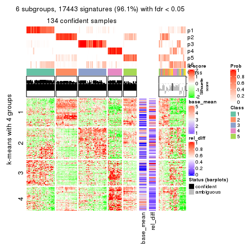</p>

</div>
</div>


Signature heatmaps where rows are not scaled:


<script>
$( function() {
	$( '#tabs-MAD-mclust-get-signatures-no-scale' ).tabs();
} );
</script>
<div id='tabs-MAD-mclust-get-signatures-no-scale'>
<ul>
<li><a href='#tab-MAD-mclust-get-signatures-no-scale-1'>k = 2</a></li>
<li><a href='#tab-MAD-mclust-get-signatures-no-scale-2'>k = 3</a></li>
<li><a href='#tab-MAD-mclust-get-signatures-no-scale-3'>k = 4</a></li>
<li><a href='#tab-MAD-mclust-get-signatures-no-scale-4'>k = 5</a></li>
<li><a href='#tab-MAD-mclust-get-signatures-no-scale-5'>k = 6</a></li>
</ul>
<div id='tab-MAD-mclust-get-signatures-no-scale-1'>
<pre><code class="r">get_signatures(res, k = 2, scale_rows = FALSE)
</code></pre>

<p></p>

</div>
<div id='tab-MAD-mclust-get-signatures-no-scale-2'>
<pre><code class="r">get_signatures(res, k = 3, scale_rows = FALSE)
</code></pre>

<p></p>

</div>
<div id='tab-MAD-mclust-get-signatures-no-scale-3'>
<pre><code class="r">get_signatures(res, k = 4, scale_rows = FALSE)
</code></pre>

<p></p>

</div>
<div id='tab-MAD-mclust-get-signatures-no-scale-4'>
<pre><code class="r">get_signatures(res, k = 5, scale_rows = FALSE)
</code></pre>

<p>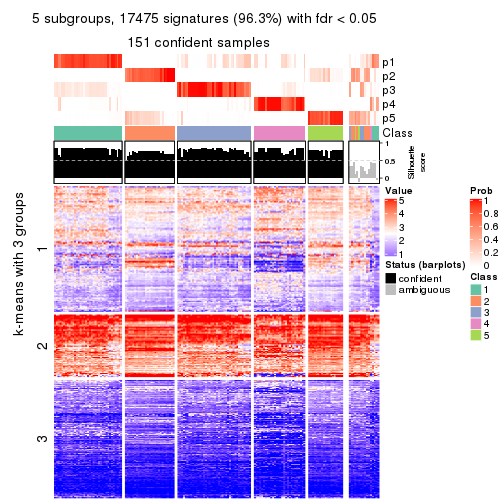</p>

</div>
<div id='tab-MAD-mclust-get-signatures-no-scale-5'>
<pre><code class="r">get_signatures(res, k = 6, scale_rows = FALSE)
</code></pre>

<p></p>

</div>
</div>


Compare the overlap of signatures from different k:

```r
compare_signatures(res)
```


`get_signature()` returns a data frame invisibly. TO get the list of signatures, the function
call should be assigned to a variable explicitly. In following code, if `plot` argument is set
to `FALSE`, no heatmap is plotted while only the differential analysis is performed.

```r
# code only for demonstration
tb = get_signature(res, k = ..., plot = FALSE)
```

An example of the output of `tb` is:

```
#>   which_row         fdr    mean_1    mean_2 scaled_mean_1 scaled_mean_2 km
#> 1        38 0.042760348  8.373488  9.131774    -0.5533452     0.5164555  1
#> 2        40 0.018707592  7.106213  8.469186    -0.6173731     0.5762149  1
#> 3        55 0.019134737 10.221463 11.207825    -0.6159697     0.5749050  1
#> 4        59 0.006059896  5.921854  7.869574    -0.6899429     0.6439467  1
#> 5        60 0.018055526  8.928898 10.211722    -0.6204761     0.5791110  1
#> 6        98 0.009384629 15.714769 14.887706     0.6635654    -0.6193277  2
...
```

The columns in `tb` are:

1. `which_row`: row indices corresponding to the input matrix.
2. `fdr`: FDR for the differential test. 
3. `mean_x`: The mean value in group x.
4. `scaled_mean_x`: The mean value in group x after rows are scaled.
5. `km`: Row groups if k-means clustering is applied to rows.


UMAP plot which shows how samples are separated.


<script>
$( function() {
	$( '#tabs-MAD-mclust-dimension-reduction' ).tabs();
} );
</script>
<div id='tabs-MAD-mclust-dimension-reduction'>
<ul>
<li><a href='#tab-MAD-mclust-dimension-reduction-1'>k = 2</a></li>
<li><a href='#tab-MAD-mclust-dimension-reduction-2'>k = 3</a></li>
<li><a href='#tab-MAD-mclust-dimension-reduction-3'>k = 4</a></li>
<li><a href='#tab-MAD-mclust-dimension-reduction-4'>k = 5</a></li>
<li><a href='#tab-MAD-mclust-dimension-reduction-5'>k = 6</a></li>
</ul>
<div id='tab-MAD-mclust-dimension-reduction-1'>
<pre><code class="r">dimension_reduction(res, k = 2, method = &quot;UMAP&quot;)
</code></pre>

<p></p>

</div>
<div id='tab-MAD-mclust-dimension-reduction-2'>
<pre><code class="r">dimension_reduction(res, k = 3, method = &quot;UMAP&quot;)
</code></pre>

<p></p>

</div>
<div id='tab-MAD-mclust-dimension-reduction-3'>
<pre><code class="r">dimension_reduction(res, k = 4, method = &quot;UMAP&quot;)
</code></pre>

<p></p>

</div>
<div id='tab-MAD-mclust-dimension-reduction-4'>
<pre><code class="r">dimension_reduction(res, k = 5, method = &quot;UMAP&quot;)
</code></pre>

<p></p>

</div>
<div id='tab-MAD-mclust-dimension-reduction-5'>
<pre><code class="r">dimension_reduction(res, k = 6, method = &quot;UMAP&quot;)
</code></pre>

<p></p>

</div>
</div>


Following heatmap shows how subgroups are split when increasing `k`:

```r
collect_classes(res)
```

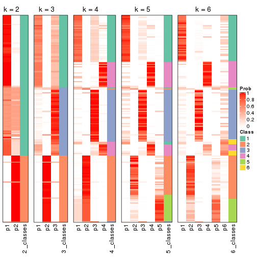


If matrix rows can be associated to genes, consider to use `functional_enrichment(res,
...)` to perform function enrichment for the signature genes. See [this vignette](http://bioconductor.org/packages/devel/bioc/vignettes/cola/inst/doc/functional_enrichment.html) for more detailed explanations.


 

---------------------------------------------------


### MAD:NMF


The object with results only for a single top-value method and a single partition method 
can be extracted as:

```r
res = res_list["MAD", "NMF"]
# you can also extract it by
# res = res_list["MAD:NMF"]
```

A summary of `res` and all the functions that can be applied to it:

```r
res
```

```
#> A 'ConsensusPartition' object with k = 2, 3, 4, 5, 6.
#>   On a matrix with 18147 rows and 167 columns.
#>   Top rows (1000, 2000, 3000, 4000, 5000) are extracted by 'MAD' method.
#>   Subgroups are detected by 'NMF' method.
#>   Performed in total 1250 partitions by row resampling.
#>   Best k for subgroups seems to be 2.
#> 
#> Following methods can be applied to this 'ConsensusPartition' object:
#>  [1] "cola_report"             "collect_classes"         "collect_plots"          
#>  [4] "collect_stats"           "colnames"                "compare_signatures"     
#>  [7] "consensus_heatmap"       "dimension_reduction"     "functional_enrichment"  
#> [10] "get_anno_col"            "get_anno"                "get_classes"            
#> [13] "get_consensus"           "get_matrix"              "get_membership"         
#> [16] "get_param"               "get_signatures"          "get_stats"              
#> [19] "is_best_k"               "is_stable_k"             "membership_heatmap"     
#> [22] "ncol"                    "nrow"                    "plot_ecdf"              
#> [25] "rownames"                "select_partition_number" "show"                   
#> [28] "suggest_best_k"          "test_to_known_factors"
```

`collect_plots()` function collects all the plots made from `res` for all `k` (number of partitions)
into one single page to provide an easy and fast comparison between different `k`.

```r
collect_plots(res)
```


The plots are:

- The first row: a plot of the ECDF (empirical cumulative distribution
  function) curves of the consensus matrix for each `k` and the heatmap of
  predicted classes for each `k`.
- The second row: heatmaps of the consensus matrix for each `k`.
- The third row: heatmaps of the membership matrix for each `k`.
- The fouth row: heatmaps of the signatures for each `k`.

All the plots in panels can be made by individual functions and they are
plotted later in this section.

`select_partition_number()` produces several plots showing different
statistics for choosing "optimized" `k`. There are following statistics:

- ECDF curves of the consensus matrix for each `k`;
- 1-PAC. [The PAC
  score](https://en.wikipedia.org/wiki/Consensus_clustering#Over-interpretation_potential_of_consensus_clustering)
  measures the proportion of the ambiguous subgrouping.
- Mean silhouette score.
- Concordance. The mean probability of fiting the consensus class ids in all
  partitions.
- Area increased. Denote $A_k$ as the area under the ECDF curve for current
  `k`, the area increased is defined as $A_k - A_{k-1}$.
- Rand index. The percent of pairs of samples that are both in a same cluster
  or both are not in a same cluster in the partition of k and k-1.
- Jaccard index. The ratio of pairs of samples are both in a same cluster in
  the partition of k and k-1 and the pairs of samples are both in a same
  cluster in the partition k or k-1.

The detailed explanations of these statistics can be found in [the _cola_
vignette](http://bioconductor.org/packages/devel/bioc/vignettes/cola/inst/doc/cola.html#toc_13).

Generally speaking, lower PAC score, higher mean silhouette score or higher
concordance corresponds to better partition. Rand index and Jaccard index
measure how similar the current partition is compared to partition with `k-1`.
If they are too similar, we won't accept `k` is better than `k-1`.

```r
select_partition_number(res)
```


The numeric values for all these statistics can be obtained by `get_stats()`.

```r
get_stats(res)
```

```
#>   k 1-PAC mean_silhouette concordance area_increased  Rand Jaccard
#> 2 2 0.878           0.917       0.965         0.4896 0.510   0.510
#> 3 3 0.810           0.831       0.925         0.3566 0.758   0.556
#> 4 4 0.886           0.867       0.933         0.0979 0.842   0.586
#> 5 5 0.746           0.655       0.853         0.0628 0.903   0.671
#> 6 6 0.718           0.705       0.809         0.0485 0.850   0.458
```

`suggest_best_k()` suggests the best $k$ based on these statistics. The rules are as follows:

- All $k$ with Jaccard index larger than 0.95 are removed because increasing
  $k$ does not provide enough extra information. If all $k$ are removed, it is
  marked as no subgroup is detected.
- For all $k$ with 1-PAC score larger than 0.9, the maximal $k$ is taken as
  the best $k$, and other $k$ are marked as optional $k$.
- If it does not fit the second rule. The $k$ with the maximal vote of the
  highest 1-PAC score, highest mean silhouette, and highest concordance is
  taken as the best $k$.

```r
suggest_best_k(res)
```

```
#> [1] 2
```


Following shows the table of the partitions (You need to click the **show/hide
code output** link to see it). The membership matrix (columns with name `p*`)
is inferred by
[`clue::cl_consensus()`](https://www.rdocumentation.org/link/cl_consensus?package=clue)
function with the `SE` method. Basically the value in the membership matrix
represents the probability to belong to a certain group. The finall class
label for an item is determined with the group with highest probability it
belongs to.

In `get_classes()` function, the entropy is calculated from the membership
matrix and the silhouette score is calculated from the consensus matrix.


<script>
$( function() {
	$( '#tabs-MAD-NMF-get-classes' ).tabs();
} );
</script>
<div id='tabs-MAD-NMF-get-classes'>
<ul>
<li><a href='#tab-MAD-NMF-get-classes-1'>k = 2</a></li>
<li><a href='#tab-MAD-NMF-get-classes-2'>k = 3</a></li>
<li><a href='#tab-MAD-NMF-get-classes-3'>k = 4</a></li>
<li><a href='#tab-MAD-NMF-get-classes-4'>k = 5</a></li>
<li><a href='#tab-MAD-NMF-get-classes-5'>k = 6</a></li>
</ul>

<div id='tab-MAD-NMF-get-classes-1'>
<p><a id='tab-MAD-NMF-get-classes-1-a' style='color:#0366d6' href='#'>show/hide code output</a></p>
<pre><code class="r">cbind(get_classes(res, k = 2), get_membership(res, k = 2))
</code></pre>

<pre><code>#&gt;            class entropy silhouette    p1    p2
#&gt; SRR1313062     1  0.0000      0.960 1.000 0.000
#&gt; SRR1313063     1  0.0000      0.960 1.000 0.000
#&gt; SRR1313064     1  0.0000      0.960 1.000 0.000
#&gt; SRR1313065     1  0.0000      0.960 1.000 0.000
#&gt; SRR1313066     2  0.7139      0.742 0.196 0.804
#&gt; SRR1313067     1  0.0000      0.960 1.000 0.000
#&gt; SRR1313068     1  0.0000      0.960 1.000 0.000
#&gt; SRR1313069     1  0.0000      0.960 1.000 0.000
#&gt; SRR1313070     1  0.0000      0.960 1.000 0.000
#&gt; SRR1313071     1  0.0000      0.960 1.000 0.000
#&gt; SRR1313072     1  0.0000      0.960 1.000 0.000
#&gt; SRR1313073     1  0.0000      0.960 1.000 0.000
#&gt; SRR1313074     1  0.0000      0.960 1.000 0.000
#&gt; SRR1313075     1  0.0000      0.960 1.000 0.000
#&gt; SRR1313076     1  0.0000      0.960 1.000 0.000
#&gt; SRR1313077     1  0.0000      0.960 1.000 0.000
#&gt; SRR1313078     1  0.0000      0.960 1.000 0.000
#&gt; SRR1313079     1  0.0000      0.960 1.000 0.000
#&gt; SRR1313080     1  0.0000      0.960 1.000 0.000
#&gt; SRR1313081     1  0.0000      0.960 1.000 0.000
#&gt; SRR1313082     1  0.0000      0.960 1.000 0.000
#&gt; SRR1313083     1  0.0000      0.960 1.000 0.000
#&gt; SRR1313084     1  0.0938      0.951 0.988 0.012
#&gt; SRR1313085     1  0.0000      0.960 1.000 0.000
#&gt; SRR1313086     1  0.0000      0.960 1.000 0.000
#&gt; SRR1313087     1  0.0000      0.960 1.000 0.000
#&gt; SRR1313088     1  0.0000      0.960 1.000 0.000
#&gt; SRR1313089     1  0.0000      0.960 1.000 0.000
#&gt; SRR1313092     1  0.0000      0.960 1.000 0.000
#&gt; SRR1313090     1  0.0000      0.960 1.000 0.000
#&gt; SRR1313091     2  0.0000      0.965 0.000 1.000
#&gt; SRR1313093     1  0.0000      0.960 1.000 0.000
#&gt; SRR1313095     1  0.0000      0.960 1.000 0.000
#&gt; SRR1313096     1  0.0000      0.960 1.000 0.000
#&gt; SRR1313094     1  0.0000      0.960 1.000 0.000
#&gt; SRR1313097     1  0.6887      0.775 0.816 0.184
#&gt; SRR1313099     2  0.9323      0.456 0.348 0.652
#&gt; SRR1313098     1  0.0000      0.960 1.000 0.000
#&gt; SRR1313101     1  0.9209      0.520 0.664 0.336
#&gt; SRR1313102     1  0.5629      0.839 0.868 0.132
#&gt; SRR1313103     1  0.9170      0.529 0.668 0.332
#&gt; SRR1313100     1  0.0000      0.960 1.000 0.000
#&gt; SRR1313105     1  0.9000      0.562 0.684 0.316
#&gt; SRR1313104     1  0.0000      0.960 1.000 0.000
#&gt; SRR1313107     2  0.8081      0.661 0.248 0.752
#&gt; SRR1313106     2  0.2236      0.934 0.036 0.964
#&gt; SRR1313109     2  0.0672      0.958 0.008 0.992
#&gt; SRR1313108     1  0.0000      0.960 1.000 0.000
#&gt; SRR1313111     1  0.7674      0.720 0.776 0.224
#&gt; SRR1313110     1  0.0000      0.960 1.000 0.000
#&gt; SRR1313112     1  0.8555      0.629 0.720 0.280
#&gt; SRR1313113     1  0.8955      0.570 0.688 0.312
#&gt; SRR1313115     1  0.0000      0.960 1.000 0.000
#&gt; SRR1313114     1  0.0000      0.960 1.000 0.000
#&gt; SRR1313117     1  0.4431      0.880 0.908 0.092
#&gt; SRR1313118     1  0.0000      0.960 1.000 0.000
#&gt; SRR1313116     2  0.9608      0.362 0.384 0.616
#&gt; SRR1313120     1  0.9393      0.475 0.644 0.356
#&gt; SRR1313119     1  0.0000      0.960 1.000 0.000
#&gt; SRR1313122     1  0.0000      0.960 1.000 0.000
#&gt; SRR1313124     1  0.0000      0.960 1.000 0.000
#&gt; SRR1313121     1  0.0000      0.960 1.000 0.000
#&gt; SRR1313125     1  0.0000      0.960 1.000 0.000
#&gt; SRR1313127     1  0.0000      0.960 1.000 0.000
#&gt; SRR1313123     1  0.0000      0.960 1.000 0.000
#&gt; SRR1313128     1  0.0000      0.960 1.000 0.000
#&gt; SRR1313126     1  0.0000      0.960 1.000 0.000
#&gt; SRR1313130     2  0.0000      0.965 0.000 1.000
#&gt; SRR1313132     1  0.6887      0.775 0.816 0.184
#&gt; SRR1313129     2  0.8813      0.563 0.300 0.700
#&gt; SRR1313133     1  0.0000      0.960 1.000 0.000
#&gt; SRR1313131     1  0.0000      0.960 1.000 0.000
#&gt; SRR1313134     1  0.7376      0.743 0.792 0.208
#&gt; SRR1313135     1  0.0000      0.960 1.000 0.000
#&gt; SRR1313136     1  0.0000      0.960 1.000 0.000
#&gt; SRR1313137     1  0.0000      0.960 1.000 0.000
#&gt; SRR1313138     2  0.6712      0.773 0.176 0.824
#&gt; SRR1313140     1  0.0000      0.960 1.000 0.000
#&gt; SRR1313141     1  0.0000      0.960 1.000 0.000
#&gt; SRR1313139     1  0.0000      0.960 1.000 0.000
#&gt; SRR1313143     1  0.0000      0.960 1.000 0.000
#&gt; SRR1313142     1  0.0000      0.960 1.000 0.000
#&gt; SRR1313144     1  0.0000      0.960 1.000 0.000
#&gt; SRR1313145     1  0.0000      0.960 1.000 0.000
#&gt; SRR1313146     1  0.0000      0.960 1.000 0.000
#&gt; SRR1313147     1  0.0000      0.960 1.000 0.000
#&gt; SRR1313150     1  0.0000      0.960 1.000 0.000
#&gt; SRR1313149     1  0.0000      0.960 1.000 0.000
#&gt; SRR1313152     1  0.0000      0.960 1.000 0.000
#&gt; SRR1313151     1  0.0000      0.960 1.000 0.000
#&gt; SRR1313154     1  0.0000      0.960 1.000 0.000
#&gt; SRR1313153     1  0.0000      0.960 1.000 0.000
#&gt; SRR1313156     1  0.9933      0.202 0.548 0.452
#&gt; SRR1313155     1  0.0000      0.960 1.000 0.000
#&gt; SRR1313157     1  0.0000      0.960 1.000 0.000
#&gt; SRR1313158     1  0.0672      0.954 0.992 0.008
#&gt; SRR1313161     1  0.0000      0.960 1.000 0.000
#&gt; SRR1313159     2  0.3114      0.915 0.056 0.944
#&gt; SRR1313160     1  0.0000      0.960 1.000 0.000
#&gt; SRR1313162     1  0.0000      0.960 1.000 0.000
#&gt; SRR1313163     1  0.3879      0.896 0.924 0.076
#&gt; SRR1313165     1  0.0000      0.960 1.000 0.000
#&gt; SRR1313166     1  0.0000      0.960 1.000 0.000
#&gt; SRR1313164     1  0.4161      0.888 0.916 0.084
#&gt; SRR1313167     1  0.0000      0.960 1.000 0.000
#&gt; SRR1313168     1  0.0000      0.960 1.000 0.000
#&gt; SRR1313170     2  0.9909      0.175 0.444 0.556
#&gt; SRR1313169     1  0.0000      0.960 1.000 0.000
#&gt; SRR1313172     2  0.0000      0.965 0.000 1.000
#&gt; SRR1313171     2  0.3879      0.895 0.076 0.924
#&gt; SRR1313174     2  0.0000      0.965 0.000 1.000
#&gt; SRR1313173     1  0.0000      0.960 1.000 0.000
#&gt; SRR1313176     2  0.0000      0.965 0.000 1.000
#&gt; SRR1313175     2  0.0000      0.965 0.000 1.000
#&gt; SRR1313178     2  0.0000      0.965 0.000 1.000
#&gt; SRR1313177     2  0.0000      0.965 0.000 1.000
#&gt; SRR1313179     2  0.0000      0.965 0.000 1.000
#&gt; SRR1313180     2  0.0000      0.965 0.000 1.000
#&gt; SRR1313181     2  0.0000      0.965 0.000 1.000
#&gt; SRR1313183     2  0.0000      0.965 0.000 1.000
#&gt; SRR1313182     2  0.0000      0.965 0.000 1.000
#&gt; SRR1313184     2  0.0000      0.965 0.000 1.000
#&gt; SRR1313185     2  0.0000      0.965 0.000 1.000
#&gt; SRR1313188     2  0.0000      0.965 0.000 1.000
#&gt; SRR1313187     2  0.0000      0.965 0.000 1.000
#&gt; SRR1313186     2  0.0000      0.965 0.000 1.000
#&gt; SRR1313189     2  0.0000      0.965 0.000 1.000
#&gt; SRR1313190     2  0.0000      0.965 0.000 1.000
#&gt; SRR1313191     2  0.0000      0.965 0.000 1.000
#&gt; SRR1313192     2  0.0000      0.965 0.000 1.000
#&gt; SRR1313193     2  0.0000      0.965 0.000 1.000
#&gt; SRR1313194     2  0.0000      0.965 0.000 1.000
#&gt; SRR1313195     2  0.0000      0.965 0.000 1.000
#&gt; SRR1313196     2  0.0000      0.965 0.000 1.000
#&gt; SRR1313197     2  0.0000      0.965 0.000 1.000
#&gt; SRR1313198     2  0.0000      0.965 0.000 1.000
#&gt; SRR1313199     2  0.0000      0.965 0.000 1.000
#&gt; SRR1313200     2  0.0000      0.965 0.000 1.000
#&gt; SRR1313201     2  0.0000      0.965 0.000 1.000
#&gt; SRR1313202     2  0.0000      0.965 0.000 1.000
#&gt; SRR1313203     2  0.0000      0.965 0.000 1.000
#&gt; SRR1313204     2  0.0000      0.965 0.000 1.000
#&gt; SRR1313205     2  0.0000      0.965 0.000 1.000
#&gt; SRR1313207     2  0.0000      0.965 0.000 1.000
#&gt; SRR1313208     2  0.0000      0.965 0.000 1.000
#&gt; SRR1313206     2  0.0000      0.965 0.000 1.000
#&gt; SRR1313210     2  0.0000      0.965 0.000 1.000
#&gt; SRR1313209     2  0.0000      0.965 0.000 1.000
#&gt; SRR1313211     2  0.0000      0.965 0.000 1.000
#&gt; SRR1313212     2  0.0000      0.965 0.000 1.000
#&gt; SRR1313214     2  0.0000      0.965 0.000 1.000
#&gt; SRR1313215     2  0.0000      0.965 0.000 1.000
#&gt; SRR1313213     2  0.0000      0.965 0.000 1.000
#&gt; SRR1313216     2  0.0000      0.965 0.000 1.000
#&gt; SRR1313217     2  0.0000      0.965 0.000 1.000
#&gt; SRR1313219     2  0.0000      0.965 0.000 1.000
#&gt; SRR1313220     2  0.0000      0.965 0.000 1.000
#&gt; SRR1313218     2  0.0000      0.965 0.000 1.000
#&gt; SRR1313222     2  0.0000      0.965 0.000 1.000
#&gt; SRR1313221     2  0.0000      0.965 0.000 1.000
#&gt; SRR1313223     2  0.0000      0.965 0.000 1.000
#&gt; SRR1313224     2  0.0000      0.965 0.000 1.000
#&gt; SRR1313225     2  0.0000      0.965 0.000 1.000
#&gt; SRR1313226     2  0.0000      0.965 0.000 1.000
#&gt; SRR1313227     2  0.0000      0.965 0.000 1.000
#&gt; SRR1313228     2  0.0000      0.965 0.000 1.000
#&gt; SRR1313229     2  0.0000      0.965 0.000 1.000
</code></pre>

<script>
$('#tab-MAD-NMF-get-classes-1-a').parent().next().next().hide();
$('#tab-MAD-NMF-get-classes-1-a').click(function(){
  $('#tab-MAD-NMF-get-classes-1-a').parent().next().next().toggle();
  return(false);
});
</script>
</div>

<div id='tab-MAD-NMF-get-classes-2'>
<p><a id='tab-MAD-NMF-get-classes-2-a' style='color:#0366d6' href='#'>show/hide code output</a></p>
<pre><code class="r">cbind(get_classes(res, k = 3), get_membership(res, k = 3))
</code></pre>

<pre><code>#&gt;            class entropy silhouette    p1    p2    p3
#&gt; SRR1313062     1  0.4291     0.7320 0.820 0.000 0.180
#&gt; SRR1313063     1  0.4555     0.7093 0.800 0.000 0.200
#&gt; SRR1313064     1  0.0000     0.8999 1.000 0.000 0.000
#&gt; SRR1313065     1  0.0000     0.8999 1.000 0.000 0.000
#&gt; SRR1313066     1  0.0000     0.8999 1.000 0.000 0.000
#&gt; SRR1313067     1  0.5810     0.5249 0.664 0.000 0.336
#&gt; SRR1313068     1  0.6126     0.4095 0.600 0.000 0.400
#&gt; SRR1313069     1  0.0000     0.8999 1.000 0.000 0.000
#&gt; SRR1313070     1  0.0000     0.8999 1.000 0.000 0.000
#&gt; SRR1313071     1  0.0000     0.8999 1.000 0.000 0.000
#&gt; SRR1313072     1  0.0000     0.8999 1.000 0.000 0.000
#&gt; SRR1313073     1  0.0000     0.8999 1.000 0.000 0.000
#&gt; SRR1313074     1  0.0000     0.8999 1.000 0.000 0.000
#&gt; SRR1313075     1  0.0000     0.8999 1.000 0.000 0.000
#&gt; SRR1313076     1  0.5835     0.5182 0.660 0.000 0.340
#&gt; SRR1313077     1  0.6126     0.4095 0.600 0.000 0.400
#&gt; SRR1313078     3  0.0000     0.8381 0.000 0.000 1.000
#&gt; SRR1313079     1  0.0000     0.8999 1.000 0.000 0.000
#&gt; SRR1313080     1  0.5905     0.4983 0.648 0.000 0.352
#&gt; SRR1313081     1  0.6095     0.4254 0.608 0.000 0.392
#&gt; SRR1313082     1  0.0000     0.8999 1.000 0.000 0.000
#&gt; SRR1313083     1  0.0000     0.8999 1.000 0.000 0.000
#&gt; SRR1313084     1  0.0000     0.8999 1.000 0.000 0.000
#&gt; SRR1313085     1  0.0000     0.8999 1.000 0.000 0.000
#&gt; SRR1313086     1  0.0000     0.8999 1.000 0.000 0.000
#&gt; SRR1313087     1  0.0000     0.8999 1.000 0.000 0.000
#&gt; SRR1313088     1  0.0000     0.8999 1.000 0.000 0.000
#&gt; SRR1313089     1  0.0000     0.8999 1.000 0.000 0.000
#&gt; SRR1313092     3  0.0000     0.8381 0.000 0.000 1.000
#&gt; SRR1313090     3  0.0000     0.8381 0.000 0.000 1.000
#&gt; SRR1313091     2  0.2796     0.8819 0.000 0.908 0.092
#&gt; SRR1313093     3  0.0000     0.8381 0.000 0.000 1.000
#&gt; SRR1313095     3  0.0000     0.8381 0.000 0.000 1.000
#&gt; SRR1313096     3  0.0000     0.8381 0.000 0.000 1.000
#&gt; SRR1313094     3  0.0000     0.8381 0.000 0.000 1.000
#&gt; SRR1313097     3  0.0000     0.8381 0.000 0.000 1.000
#&gt; SRR1313099     3  0.2448     0.7951 0.000 0.076 0.924
#&gt; SRR1313098     3  0.0000     0.8381 0.000 0.000 1.000
#&gt; SRR1313101     3  0.0000     0.8381 0.000 0.000 1.000
#&gt; SRR1313102     3  0.0000     0.8381 0.000 0.000 1.000
#&gt; SRR1313103     3  0.0000     0.8381 0.000 0.000 1.000
#&gt; SRR1313100     3  0.6126     0.1554 0.400 0.000 0.600
#&gt; SRR1313105     3  0.0000     0.8381 0.000 0.000 1.000
#&gt; SRR1313104     3  0.0000     0.8381 0.000 0.000 1.000
#&gt; SRR1313107     3  0.0424     0.8344 0.000 0.008 0.992
#&gt; SRR1313106     3  0.2625     0.7727 0.000 0.084 0.916
#&gt; SRR1313109     3  0.4974     0.6603 0.000 0.236 0.764
#&gt; SRR1313108     3  0.0000     0.8381 0.000 0.000 1.000
#&gt; SRR1313111     3  0.0000     0.8381 0.000 0.000 1.000
#&gt; SRR1313110     3  0.0000     0.8381 0.000 0.000 1.000
#&gt; SRR1313112     3  0.0000     0.8381 0.000 0.000 1.000
#&gt; SRR1313113     3  0.0000     0.8381 0.000 0.000 1.000
#&gt; SRR1313115     3  0.0000     0.8381 0.000 0.000 1.000
#&gt; SRR1313114     3  0.0000     0.8381 0.000 0.000 1.000
#&gt; SRR1313117     3  0.0000     0.8381 0.000 0.000 1.000
#&gt; SRR1313118     3  0.0237     0.8356 0.004 0.000 0.996
#&gt; SRR1313116     3  0.2066     0.8054 0.000 0.060 0.940
#&gt; SRR1313120     3  0.0000     0.8381 0.000 0.000 1.000
#&gt; SRR1313119     3  0.0000     0.8381 0.000 0.000 1.000
#&gt; SRR1313122     3  0.0000     0.8381 0.000 0.000 1.000
#&gt; SRR1313124     3  0.0000     0.8381 0.000 0.000 1.000
#&gt; SRR1313121     3  0.0000     0.8381 0.000 0.000 1.000
#&gt; SRR1313125     3  0.0000     0.8381 0.000 0.000 1.000
#&gt; SRR1313127     3  0.0000     0.8381 0.000 0.000 1.000
#&gt; SRR1313123     3  0.0000     0.8381 0.000 0.000 1.000
#&gt; SRR1313128     3  0.5968     0.5334 0.364 0.000 0.636
#&gt; SRR1313126     3  0.0000     0.8381 0.000 0.000 1.000
#&gt; SRR1313130     2  0.0424     0.9802 0.000 0.992 0.008
#&gt; SRR1313132     3  0.6264     0.7064 0.168 0.068 0.764
#&gt; SRR1313129     3  0.0000     0.8381 0.000 0.000 1.000
#&gt; SRR1313133     3  0.5178     0.6614 0.256 0.000 0.744
#&gt; SRR1313131     3  0.0000     0.8381 0.000 0.000 1.000
#&gt; SRR1313134     3  0.7918     0.6136 0.204 0.136 0.660
#&gt; SRR1313135     1  0.4399     0.6643 0.812 0.000 0.188
#&gt; SRR1313136     3  0.6295     0.3166 0.472 0.000 0.528
#&gt; SRR1313137     1  0.0000     0.8999 1.000 0.000 0.000
#&gt; SRR1313138     2  0.4346     0.7535 0.184 0.816 0.000
#&gt; SRR1313140     1  0.0000     0.8999 1.000 0.000 0.000
#&gt; SRR1313141     3  0.6062     0.5048 0.384 0.000 0.616
#&gt; SRR1313139     1  0.0000     0.8999 1.000 0.000 0.000
#&gt; SRR1313143     3  0.6126     0.4783 0.400 0.000 0.600
#&gt; SRR1313142     3  0.6111     0.4855 0.396 0.000 0.604
#&gt; SRR1313144     1  0.0000     0.8999 1.000 0.000 0.000
#&gt; SRR1313145     3  0.6126     0.4783 0.400 0.000 0.600
#&gt; SRR1313146     3  0.6295     0.3166 0.472 0.000 0.528
#&gt; SRR1313147     1  0.0000     0.8999 1.000 0.000 0.000
#&gt; SRR1313150     1  0.0000     0.8999 1.000 0.000 0.000
#&gt; SRR1313149     3  0.6079     0.4986 0.388 0.000 0.612
#&gt; SRR1313152     1  0.0000     0.8999 1.000 0.000 0.000
#&gt; SRR1313151     1  0.6140     0.0936 0.596 0.000 0.404
#&gt; SRR1313154     3  0.6267     0.3680 0.452 0.000 0.548
#&gt; SRR1313153     3  0.6235     0.4050 0.436 0.000 0.564
#&gt; SRR1313156     3  0.7600     0.4777 0.056 0.344 0.600
#&gt; SRR1313155     1  0.5363     0.4843 0.724 0.000 0.276
#&gt; SRR1313157     1  0.0000     0.8999 1.000 0.000 0.000
#&gt; SRR1313158     3  0.6111     0.4855 0.396 0.000 0.604
#&gt; SRR1313161     1  0.0000     0.8999 1.000 0.000 0.000
#&gt; SRR1313159     2  0.5859     0.4085 0.000 0.656 0.344
#&gt; SRR1313160     1  0.0000     0.8999 1.000 0.000 0.000
#&gt; SRR1313162     3  0.4504     0.7153 0.196 0.000 0.804
#&gt; SRR1313163     3  0.6111     0.4855 0.396 0.000 0.604
#&gt; SRR1313165     1  0.0000     0.8999 1.000 0.000 0.000
#&gt; SRR1313166     3  0.6026     0.5166 0.376 0.000 0.624
#&gt; SRR1313164     3  0.5178     0.6614 0.256 0.000 0.744
#&gt; SRR1313167     1  0.0000     0.8999 1.000 0.000 0.000
#&gt; SRR1313168     1  0.0000     0.8999 1.000 0.000 0.000
#&gt; SRR1313170     3  0.3686     0.7473 0.000 0.140 0.860
#&gt; SRR1313169     1  0.0000     0.8999 1.000 0.000 0.000
#&gt; SRR1313172     2  0.0000     0.9884 0.000 1.000 0.000
#&gt; SRR1313171     3  0.5988     0.4582 0.000 0.368 0.632
#&gt; SRR1313174     2  0.0000     0.9884 0.000 1.000 0.000
#&gt; SRR1313173     3  0.0000     0.8381 0.000 0.000 1.000
#&gt; SRR1313176     2  0.0000     0.9884 0.000 1.000 0.000
#&gt; SRR1313175     2  0.0000     0.9884 0.000 1.000 0.000
#&gt; SRR1313178     2  0.0000     0.9884 0.000 1.000 0.000
#&gt; SRR1313177     2  0.0000     0.9884 0.000 1.000 0.000
#&gt; SRR1313179     2  0.0000     0.9884 0.000 1.000 0.000
#&gt; SRR1313180     2  0.0000     0.9884 0.000 1.000 0.000
#&gt; SRR1313181     2  0.0000     0.9884 0.000 1.000 0.000
#&gt; SRR1313183     2  0.0000     0.9884 0.000 1.000 0.000
#&gt; SRR1313182     2  0.0000     0.9884 0.000 1.000 0.000
#&gt; SRR1313184     2  0.0000     0.9884 0.000 1.000 0.000
#&gt; SRR1313185     2  0.0000     0.9884 0.000 1.000 0.000
#&gt; SRR1313188     2  0.0000     0.9884 0.000 1.000 0.000
#&gt; SRR1313187     2  0.0000     0.9884 0.000 1.000 0.000
#&gt; SRR1313186     2  0.0000     0.9884 0.000 1.000 0.000
#&gt; SRR1313189     2  0.0000     0.9884 0.000 1.000 0.000
#&gt; SRR1313190     2  0.0000     0.9884 0.000 1.000 0.000
#&gt; SRR1313191     2  0.0000     0.9884 0.000 1.000 0.000
#&gt; SRR1313192     2  0.0000     0.9884 0.000 1.000 0.000
#&gt; SRR1313193     2  0.0000     0.9884 0.000 1.000 0.000
#&gt; SRR1313194     2  0.0000     0.9884 0.000 1.000 0.000
#&gt; SRR1313195     2  0.0000     0.9884 0.000 1.000 0.000
#&gt; SRR1313196     2  0.0000     0.9884 0.000 1.000 0.000
#&gt; SRR1313197     2  0.0000     0.9884 0.000 1.000 0.000
#&gt; SRR1313198     2  0.0000     0.9884 0.000 1.000 0.000
#&gt; SRR1313199     2  0.0000     0.9884 0.000 1.000 0.000
#&gt; SRR1313200     2  0.0000     0.9884 0.000 1.000 0.000
#&gt; SRR1313201     2  0.0000     0.9884 0.000 1.000 0.000
#&gt; SRR1313202     2  0.0000     0.9884 0.000 1.000 0.000
#&gt; SRR1313203     2  0.0000     0.9884 0.000 1.000 0.000
#&gt; SRR1313204     2  0.0000     0.9884 0.000 1.000 0.000
#&gt; SRR1313205     2  0.0000     0.9884 0.000 1.000 0.000
#&gt; SRR1313207     2  0.0000     0.9884 0.000 1.000 0.000
#&gt; SRR1313208     2  0.0000     0.9884 0.000 1.000 0.000
#&gt; SRR1313206     2  0.0000     0.9884 0.000 1.000 0.000
#&gt; SRR1313210     2  0.0000     0.9884 0.000 1.000 0.000
#&gt; SRR1313209     2  0.0000     0.9884 0.000 1.000 0.000
#&gt; SRR1313211     2  0.0000     0.9884 0.000 1.000 0.000
#&gt; SRR1313212     2  0.0000     0.9884 0.000 1.000 0.000
#&gt; SRR1313214     2  0.0000     0.9884 0.000 1.000 0.000
#&gt; SRR1313215     2  0.0000     0.9884 0.000 1.000 0.000
#&gt; SRR1313213     2  0.0000     0.9884 0.000 1.000 0.000
#&gt; SRR1313216     2  0.0000     0.9884 0.000 1.000 0.000
#&gt; SRR1313217     2  0.0000     0.9884 0.000 1.000 0.000
#&gt; SRR1313219     2  0.0000     0.9884 0.000 1.000 0.000
#&gt; SRR1313220     2  0.0000     0.9884 0.000 1.000 0.000
#&gt; SRR1313218     2  0.0000     0.9884 0.000 1.000 0.000
#&gt; SRR1313222     2  0.0000     0.9884 0.000 1.000 0.000
#&gt; SRR1313221     2  0.0000     0.9884 0.000 1.000 0.000
#&gt; SRR1313223     2  0.0000     0.9884 0.000 1.000 0.000
#&gt; SRR1313224     2  0.0000     0.9884 0.000 1.000 0.000
#&gt; SRR1313225     2  0.0000     0.9884 0.000 1.000 0.000
#&gt; SRR1313226     2  0.0000     0.9884 0.000 1.000 0.000
#&gt; SRR1313227     2  0.0000     0.9884 0.000 1.000 0.000
#&gt; SRR1313228     2  0.0000     0.9884 0.000 1.000 0.000
#&gt; SRR1313229     2  0.0000     0.9884 0.000 1.000 0.000
</code></pre>

<script>
$('#tab-MAD-NMF-get-classes-2-a').parent().next().next().hide();
$('#tab-MAD-NMF-get-classes-2-a').click(function(){
  $('#tab-MAD-NMF-get-classes-2-a').parent().next().next().toggle();
  return(false);
});
</script>
</div>

<div id='tab-MAD-NMF-get-classes-3'>
<p><a id='tab-MAD-NMF-get-classes-3-a' style='color:#0366d6' href='#'>show/hide code output</a></p>
<pre><code class="r">cbind(get_classes(res, k = 4), get_membership(res, k = 4))
</code></pre>

<pre><code>#&gt;            class entropy silhouette    p1    p2    p3    p4
#&gt; SRR1313062     4  0.4277      0.583 0.000 0.000 0.280 0.720
#&gt; SRR1313063     4  0.4008      0.652 0.000 0.000 0.244 0.756
#&gt; SRR1313064     4  0.0921      0.886 0.028 0.000 0.000 0.972
#&gt; SRR1313065     4  0.1716      0.899 0.064 0.000 0.000 0.936
#&gt; SRR1313066     4  0.0592      0.879 0.016 0.000 0.000 0.984
#&gt; SRR1313067     3  0.0817      0.913 0.000 0.000 0.976 0.024
#&gt; SRR1313068     3  0.1716      0.883 0.000 0.000 0.936 0.064
#&gt; SRR1313069     4  0.1792      0.899 0.068 0.000 0.000 0.932
#&gt; SRR1313070     4  0.1637      0.899 0.060 0.000 0.000 0.940
#&gt; SRR1313071     4  0.1716      0.899 0.064 0.000 0.000 0.936
#&gt; SRR1313072     4  0.1389      0.896 0.048 0.000 0.000 0.952
#&gt; SRR1313073     4  0.1792      0.899 0.068 0.000 0.000 0.932
#&gt; SRR1313074     4  0.1557      0.898 0.056 0.000 0.000 0.944
#&gt; SRR1313075     4  0.1389      0.895 0.048 0.000 0.000 0.952
#&gt; SRR1313076     3  0.2081      0.869 0.000 0.000 0.916 0.084
#&gt; SRR1313077     3  0.0469      0.921 0.000 0.000 0.988 0.012
#&gt; SRR1313078     3  0.0000      0.927 0.000 0.000 1.000 0.000
#&gt; SRR1313079     4  0.0592      0.879 0.016 0.000 0.000 0.984
#&gt; SRR1313080     3  0.4040      0.641 0.000 0.000 0.752 0.248
#&gt; SRR1313081     3  0.0336      0.923 0.000 0.000 0.992 0.008
#&gt; SRR1313082     4  0.1792      0.899 0.068 0.000 0.000 0.932
#&gt; SRR1313083     4  0.1792      0.899 0.068 0.000 0.000 0.932
#&gt; SRR1313084     4  0.0817      0.884 0.024 0.000 0.000 0.976
#&gt; SRR1313085     4  0.1792      0.899 0.068 0.000 0.000 0.932
#&gt; SRR1313086     4  0.1940      0.897 0.076 0.000 0.000 0.924
#&gt; SRR1313087     4  0.1118      0.890 0.036 0.000 0.000 0.964
#&gt; SRR1313088     4  0.1940      0.897 0.076 0.000 0.000 0.924
#&gt; SRR1313089     4  0.0336      0.872 0.008 0.000 0.000 0.992
#&gt; SRR1313092     3  0.1389      0.903 0.048 0.000 0.952 0.000
#&gt; SRR1313090     3  0.0000      0.927 0.000 0.000 1.000 0.000
#&gt; SRR1313091     2  0.0000      0.983 0.000 1.000 0.000 0.000
#&gt; SRR1313093     1  0.3610      0.753 0.800 0.000 0.200 0.000
#&gt; SRR1313095     3  0.1302      0.904 0.044 0.000 0.956 0.000
#&gt; SRR1313096     1  0.2408      0.845 0.896 0.000 0.104 0.000
#&gt; SRR1313094     3  0.0336      0.924 0.008 0.000 0.992 0.000
#&gt; SRR1313097     3  0.0000      0.927 0.000 0.000 1.000 0.000
#&gt; SRR1313099     1  0.6027      0.633 0.684 0.124 0.192 0.000
#&gt; SRR1313098     1  0.2469      0.842 0.892 0.000 0.108 0.000
#&gt; SRR1313101     3  0.0000      0.927 0.000 0.000 1.000 0.000
#&gt; SRR1313102     3  0.5119      0.119 0.440 0.004 0.556 0.000
#&gt; SRR1313103     1  0.2859      0.836 0.880 0.008 0.112 0.000
#&gt; SRR1313100     3  0.0000      0.927 0.000 0.000 1.000 0.000
#&gt; SRR1313105     3  0.0188      0.925 0.004 0.000 0.996 0.000
#&gt; SRR1313104     3  0.1792      0.886 0.068 0.000 0.932 0.000
#&gt; SRR1313107     1  0.3606      0.805 0.840 0.020 0.140 0.000
#&gt; SRR1313106     3  0.0000      0.927 0.000 0.000 1.000 0.000
#&gt; SRR1313109     2  0.6396      0.259 0.360 0.564 0.076 0.000
#&gt; SRR1313108     3  0.4382      0.531 0.296 0.000 0.704 0.000
#&gt; SRR1313111     1  0.4877      0.370 0.592 0.000 0.408 0.000
#&gt; SRR1313110     3  0.1637      0.893 0.060 0.000 0.940 0.000
#&gt; SRR1313112     3  0.0000      0.927 0.000 0.000 1.000 0.000
#&gt; SRR1313113     3  0.0000      0.927 0.000 0.000 1.000 0.000
#&gt; SRR1313115     1  0.2589      0.835 0.884 0.000 0.116 0.000
#&gt; SRR1313114     1  0.4972      0.231 0.544 0.000 0.456 0.000
#&gt; SRR1313117     3  0.0000      0.927 0.000 0.000 1.000 0.000
#&gt; SRR1313118     3  0.2589      0.835 0.116 0.000 0.884 0.000
#&gt; SRR1313116     3  0.1510      0.900 0.000 0.016 0.956 0.028
#&gt; SRR1313120     1  0.4382      0.617 0.704 0.000 0.296 0.000
#&gt; SRR1313119     3  0.0000      0.927 0.000 0.000 1.000 0.000
#&gt; SRR1313122     3  0.0000      0.927 0.000 0.000 1.000 0.000
#&gt; SRR1313124     3  0.0000      0.927 0.000 0.000 1.000 0.000
#&gt; SRR1313121     3  0.0000      0.927 0.000 0.000 1.000 0.000
#&gt; SRR1313125     3  0.4477      0.507 0.312 0.000 0.688 0.000
#&gt; SRR1313127     1  0.2081      0.856 0.916 0.000 0.084 0.000
#&gt; SRR1313123     1  0.1978      0.863 0.928 0.004 0.068 0.000
#&gt; SRR1313128     1  0.0000      0.886 1.000 0.000 0.000 0.000
#&gt; SRR1313126     3  0.0000      0.927 0.000 0.000 1.000 0.000
#&gt; SRR1313130     2  0.0000      0.983 0.000 1.000 0.000 0.000
#&gt; SRR1313132     1  0.0000      0.886 1.000 0.000 0.000 0.000
#&gt; SRR1313129     1  0.6275      0.121 0.484 0.056 0.460 0.000
#&gt; SRR1313133     1  0.0000      0.886 1.000 0.000 0.000 0.000
#&gt; SRR1313131     1  0.2216      0.851 0.908 0.000 0.092 0.000
#&gt; SRR1313134     1  0.0188      0.885 0.996 0.004 0.000 0.000
#&gt; SRR1313135     1  0.0336      0.883 0.992 0.000 0.000 0.008
#&gt; SRR1313136     1  0.0000      0.886 1.000 0.000 0.000 0.000
#&gt; SRR1313137     1  0.0707      0.874 0.980 0.000 0.000 0.020
#&gt; SRR1313138     1  0.0188      0.885 0.996 0.004 0.000 0.000
#&gt; SRR1313140     4  0.3486      0.823 0.188 0.000 0.000 0.812
#&gt; SRR1313141     1  0.0000      0.886 1.000 0.000 0.000 0.000
#&gt; SRR1313139     4  0.2814      0.870 0.132 0.000 0.000 0.868
#&gt; SRR1313143     1  0.0000      0.886 1.000 0.000 0.000 0.000
#&gt; SRR1313142     1  0.0000      0.886 1.000 0.000 0.000 0.000
#&gt; SRR1313144     1  0.0469      0.880 0.988 0.000 0.000 0.012
#&gt; SRR1313145     1  0.0000      0.886 1.000 0.000 0.000 0.000
#&gt; SRR1313146     1  0.0188      0.885 0.996 0.000 0.000 0.004
#&gt; SRR1313147     4  0.4661      0.599 0.348 0.000 0.000 0.652
#&gt; SRR1313150     4  0.3356      0.835 0.176 0.000 0.000 0.824
#&gt; SRR1313149     1  0.0000      0.886 1.000 0.000 0.000 0.000
#&gt; SRR1313152     1  0.0707      0.874 0.980 0.000 0.000 0.020
#&gt; SRR1313151     1  0.0336      0.883 0.992 0.000 0.000 0.008
#&gt; SRR1313154     1  0.0000      0.886 1.000 0.000 0.000 0.000
#&gt; SRR1313153     1  0.0000      0.886 1.000 0.000 0.000 0.000
#&gt; SRR1313156     1  0.0592      0.880 0.984 0.016 0.000 0.000
#&gt; SRR1313155     1  0.0000      0.886 1.000 0.000 0.000 0.000
#&gt; SRR1313157     4  0.4134      0.742 0.260 0.000 0.000 0.740
#&gt; SRR1313158     1  0.0000      0.886 1.000 0.000 0.000 0.000
#&gt; SRR1313161     4  0.5000      0.219 0.500 0.000 0.000 0.500
#&gt; SRR1313159     1  0.1940      0.841 0.924 0.076 0.000 0.000
#&gt; SRR1313160     1  0.4454      0.407 0.692 0.000 0.000 0.308
#&gt; SRR1313162     1  0.1022      0.878 0.968 0.000 0.032 0.000
#&gt; SRR1313163     1  0.0000      0.886 1.000 0.000 0.000 0.000
#&gt; SRR1313165     1  0.4830      0.142 0.608 0.000 0.000 0.392
#&gt; SRR1313166     1  0.0000      0.886 1.000 0.000 0.000 0.000
#&gt; SRR1313164     1  0.0000      0.886 1.000 0.000 0.000 0.000
#&gt; SRR1313167     4  0.2530      0.882 0.112 0.000 0.000 0.888
#&gt; SRR1313168     1  0.0336      0.882 0.992 0.000 0.000 0.008
#&gt; SRR1313170     1  0.6620      0.539 0.628 0.192 0.180 0.000
#&gt; SRR1313169     4  0.4998      0.262 0.488 0.000 0.000 0.512
#&gt; SRR1313172     2  0.0000      0.983 0.000 1.000 0.000 0.000
#&gt; SRR1313171     1  0.1867      0.844 0.928 0.072 0.000 0.000
#&gt; SRR1313174     2  0.0921      0.971 0.000 0.972 0.000 0.028
#&gt; SRR1313173     1  0.2469      0.841 0.892 0.000 0.108 0.000
#&gt; SRR1313176     2  0.0000      0.983 0.000 1.000 0.000 0.000
#&gt; SRR1313175     2  0.0707      0.975 0.000 0.980 0.000 0.020
#&gt; SRR1313178     2  0.0000      0.983 0.000 1.000 0.000 0.000
#&gt; SRR1313177     2  0.0000      0.983 0.000 1.000 0.000 0.000
#&gt; SRR1313179     2  0.0000      0.983 0.000 1.000 0.000 0.000
#&gt; SRR1313180     2  0.1792      0.943 0.000 0.932 0.000 0.068
#&gt; SRR1313181     2  0.0000      0.983 0.000 1.000 0.000 0.000
#&gt; SRR1313183     2  0.0000      0.983 0.000 1.000 0.000 0.000
#&gt; SRR1313182     2  0.0000      0.983 0.000 1.000 0.000 0.000
#&gt; SRR1313184     2  0.0000      0.983 0.000 1.000 0.000 0.000
#&gt; SRR1313185     2  0.0336      0.980 0.000 0.992 0.000 0.008
#&gt; SRR1313188     2  0.1716      0.946 0.000 0.936 0.000 0.064
#&gt; SRR1313187     2  0.1637      0.949 0.000 0.940 0.000 0.060
#&gt; SRR1313186     2  0.0000      0.983 0.000 1.000 0.000 0.000
#&gt; SRR1313189     2  0.0000      0.983 0.000 1.000 0.000 0.000
#&gt; SRR1313190     2  0.0000      0.983 0.000 1.000 0.000 0.000
#&gt; SRR1313191     2  0.0188      0.981 0.000 0.996 0.000 0.004
#&gt; SRR1313192     2  0.0000      0.983 0.000 1.000 0.000 0.000
#&gt; SRR1313193     2  0.0000      0.983 0.000 1.000 0.000 0.000
#&gt; SRR1313194     2  0.1022      0.969 0.000 0.968 0.000 0.032
#&gt; SRR1313195     2  0.0469      0.979 0.000 0.988 0.000 0.012
#&gt; SRR1313196     2  0.0921      0.971 0.000 0.972 0.000 0.028
#&gt; SRR1313197     2  0.0188      0.981 0.000 0.996 0.000 0.004
#&gt; SRR1313198     2  0.1022      0.969 0.000 0.968 0.000 0.032
#&gt; SRR1313199     2  0.0000      0.983 0.000 1.000 0.000 0.000
#&gt; SRR1313200     2  0.1211      0.964 0.000 0.960 0.000 0.040
#&gt; SRR1313201     2  0.0000      0.983 0.000 1.000 0.000 0.000
#&gt; SRR1313202     2  0.0469      0.979 0.000 0.988 0.000 0.012
#&gt; SRR1313203     2  0.0000      0.983 0.000 1.000 0.000 0.000
#&gt; SRR1313204     2  0.0000      0.983 0.000 1.000 0.000 0.000
#&gt; SRR1313205     2  0.0000      0.983 0.000 1.000 0.000 0.000
#&gt; SRR1313207     2  0.0000      0.983 0.000 1.000 0.000 0.000
#&gt; SRR1313208     2  0.0000      0.983 0.000 1.000 0.000 0.000
#&gt; SRR1313206     2  0.0000      0.983 0.000 1.000 0.000 0.000
#&gt; SRR1313210     2  0.0921      0.971 0.000 0.972 0.000 0.028
#&gt; SRR1313209     2  0.0469      0.979 0.000 0.988 0.000 0.012
#&gt; SRR1313211     2  0.0000      0.983 0.000 1.000 0.000 0.000
#&gt; SRR1313212     2  0.0000      0.983 0.000 1.000 0.000 0.000
#&gt; SRR1313214     2  0.0592      0.977 0.000 0.984 0.000 0.016
#&gt; SRR1313215     2  0.0592      0.977 0.000 0.984 0.000 0.016
#&gt; SRR1313213     2  0.0000      0.983 0.000 1.000 0.000 0.000
#&gt; SRR1313216     2  0.0000      0.983 0.000 1.000 0.000 0.000
#&gt; SRR1313217     2  0.1118      0.966 0.000 0.964 0.000 0.036
#&gt; SRR1313219     2  0.0921      0.971 0.000 0.972 0.000 0.028
#&gt; SRR1313220     2  0.0000      0.983 0.000 1.000 0.000 0.000
#&gt; SRR1313218     2  0.0000      0.983 0.000 1.000 0.000 0.000
#&gt; SRR1313222     2  0.0000      0.983 0.000 1.000 0.000 0.000
#&gt; SRR1313221     2  0.0000      0.983 0.000 1.000 0.000 0.000
#&gt; SRR1313223     2  0.0000      0.983 0.000 1.000 0.000 0.000
#&gt; SRR1313224     2  0.0000      0.983 0.000 1.000 0.000 0.000
#&gt; SRR1313225     2  0.0000      0.983 0.000 1.000 0.000 0.000
#&gt; SRR1313226     2  0.3245      0.893 0.000 0.880 0.056 0.064
#&gt; SRR1313227     2  0.0000      0.983 0.000 1.000 0.000 0.000
#&gt; SRR1313228     2  0.0000      0.983 0.000 1.000 0.000 0.000
#&gt; SRR1313229     2  0.0000      0.983 0.000 1.000 0.000 0.000
</code></pre>

<script>
$('#tab-MAD-NMF-get-classes-3-a').parent().next().next().hide();
$('#tab-MAD-NMF-get-classes-3-a').click(function(){
  $('#tab-MAD-NMF-get-classes-3-a').parent().next().next().toggle();
  return(false);
});
</script>
</div>

<div id='tab-MAD-NMF-get-classes-4'>
<p><a id='tab-MAD-NMF-get-classes-4-a' style='color:#0366d6' href='#'>show/hide code output</a></p>
<pre><code class="r">cbind(get_classes(res, k = 5), get_membership(res, k = 5))
</code></pre>

<pre><code>#&gt;            class entropy silhouette    p1    p2    p3    p4    p5
#&gt; SRR1313062     4  0.3081     0.7699 0.000 0.000 0.156 0.832 0.012
#&gt; SRR1313063     4  0.3812     0.7080 0.000 0.000 0.204 0.772 0.024
#&gt; SRR1313064     4  0.0162     0.9310 0.000 0.000 0.004 0.996 0.000
#&gt; SRR1313065     4  0.0162     0.9317 0.000 0.000 0.000 0.996 0.004
#&gt; SRR1313066     4  0.0290     0.9298 0.000 0.000 0.000 0.992 0.008
#&gt; SRR1313067     3  0.2595     0.7699 0.000 0.000 0.888 0.080 0.032
#&gt; SRR1313068     3  0.4302     0.5585 0.000 0.000 0.720 0.248 0.032
#&gt; SRR1313069     4  0.0162     0.9312 0.000 0.000 0.000 0.996 0.004
#&gt; SRR1313070     4  0.0000     0.9325 0.000 0.000 0.000 1.000 0.000
#&gt; SRR1313071     4  0.0000     0.9325 0.000 0.000 0.000 1.000 0.000
#&gt; SRR1313072     4  0.0162     0.9317 0.000 0.000 0.000 0.996 0.004
#&gt; SRR1313073     4  0.0579     0.9243 0.000 0.000 0.008 0.984 0.008
#&gt; SRR1313074     4  0.0000     0.9325 0.000 0.000 0.000 1.000 0.000
#&gt; SRR1313075     4  0.0000     0.9325 0.000 0.000 0.000 1.000 0.000
#&gt; SRR1313076     3  0.4218     0.4874 0.000 0.000 0.660 0.332 0.008
#&gt; SRR1313077     3  0.2522     0.7622 0.000 0.000 0.880 0.108 0.012
#&gt; SRR1313078     3  0.0932     0.8209 0.004 0.000 0.972 0.004 0.020
#&gt; SRR1313079     4  0.0162     0.9310 0.000 0.000 0.004 0.996 0.000
#&gt; SRR1313080     3  0.5008     0.4278 0.000 0.000 0.644 0.300 0.056
#&gt; SRR1313081     3  0.1628     0.8062 0.000 0.000 0.936 0.056 0.008
#&gt; SRR1313082     4  0.0000     0.9325 0.000 0.000 0.000 1.000 0.000
#&gt; SRR1313083     4  0.0000     0.9325 0.000 0.000 0.000 1.000 0.000
#&gt; SRR1313084     4  0.0162     0.9317 0.000 0.000 0.000 0.996 0.004
#&gt; SRR1313085     4  0.0000     0.9325 0.000 0.000 0.000 1.000 0.000
#&gt; SRR1313086     4  0.0162     0.9312 0.000 0.000 0.000 0.996 0.004
#&gt; SRR1313087     4  0.0162     0.9310 0.000 0.000 0.004 0.996 0.000
#&gt; SRR1313088     4  0.0000     0.9325 0.000 0.000 0.000 1.000 0.000
#&gt; SRR1313089     4  0.0162     0.9317 0.000 0.000 0.000 0.996 0.004
#&gt; SRR1313092     3  0.2864     0.7669 0.136 0.000 0.852 0.000 0.012
#&gt; SRR1313090     3  0.0404     0.8193 0.000 0.000 0.988 0.000 0.012
#&gt; SRR1313091     2  0.3194     0.5776 0.020 0.832 0.148 0.000 0.000
#&gt; SRR1313093     3  0.4653     0.1297 0.472 0.000 0.516 0.000 0.012
#&gt; SRR1313095     3  0.2583     0.7666 0.132 0.000 0.864 0.000 0.004
#&gt; SRR1313096     1  0.4339     0.4353 0.652 0.000 0.336 0.000 0.012
#&gt; SRR1313094     3  0.1597     0.8131 0.048 0.000 0.940 0.000 0.012
#&gt; SRR1313097     3  0.0451     0.8203 0.004 0.000 0.988 0.000 0.008
#&gt; SRR1313099     3  0.6367     0.3255 0.344 0.128 0.516 0.000 0.012
#&gt; SRR1313098     1  0.4517     0.3179 0.600 0.000 0.388 0.000 0.012
#&gt; SRR1313101     3  0.0510     0.8186 0.000 0.000 0.984 0.000 0.016
#&gt; SRR1313102     3  0.4402     0.4507 0.352 0.000 0.636 0.000 0.012
#&gt; SRR1313103     1  0.4323     0.4363 0.656 0.000 0.332 0.000 0.012
#&gt; SRR1313100     3  0.1082     0.8130 0.000 0.000 0.964 0.008 0.028
#&gt; SRR1313105     3  0.1557     0.8073 0.008 0.000 0.940 0.000 0.052
#&gt; SRR1313104     3  0.0807     0.8220 0.012 0.000 0.976 0.000 0.012
#&gt; SRR1313107     1  0.4444     0.3592 0.624 0.000 0.364 0.000 0.012
#&gt; SRR1313106     3  0.2929     0.6707 0.000 0.000 0.820 0.000 0.180
#&gt; SRR1313109     2  0.7006    -0.1574 0.232 0.380 0.376 0.000 0.012
#&gt; SRR1313108     3  0.3163     0.7356 0.164 0.000 0.824 0.000 0.012
#&gt; SRR1313111     3  0.4547     0.3540 0.400 0.000 0.588 0.000 0.012
#&gt; SRR1313110     3  0.2260     0.8127 0.064 0.000 0.908 0.000 0.028
#&gt; SRR1313112     3  0.0324     0.8206 0.004 0.000 0.992 0.000 0.004
#&gt; SRR1313113     3  0.1124     0.8153 0.004 0.000 0.960 0.000 0.036
#&gt; SRR1313115     1  0.4505     0.3121 0.604 0.000 0.384 0.000 0.012
#&gt; SRR1313114     3  0.4620     0.3598 0.392 0.000 0.592 0.000 0.016
#&gt; SRR1313117     3  0.0609     0.8183 0.000 0.000 0.980 0.000 0.020
#&gt; SRR1313118     3  0.3061     0.7631 0.136 0.000 0.844 0.000 0.020
#&gt; SRR1313116     5  0.3480     0.4225 0.000 0.000 0.248 0.000 0.752
#&gt; SRR1313120     3  0.4288     0.5130 0.324 0.000 0.664 0.000 0.012
#&gt; SRR1313119     3  0.0566     0.8208 0.004 0.000 0.984 0.000 0.012
#&gt; SRR1313122     3  0.0290     0.8197 0.000 0.000 0.992 0.000 0.008
#&gt; SRR1313124     3  0.0609     0.8183 0.000 0.000 0.980 0.000 0.020
#&gt; SRR1313121     3  0.0510     0.8186 0.000 0.000 0.984 0.000 0.016
#&gt; SRR1313125     3  0.3550     0.6642 0.236 0.000 0.760 0.000 0.004
#&gt; SRR1313127     1  0.4538     0.3799 0.620 0.000 0.364 0.000 0.016
#&gt; SRR1313123     1  0.2971     0.7187 0.836 0.000 0.156 0.000 0.008
#&gt; SRR1313128     1  0.0451     0.8377 0.988 0.000 0.004 0.000 0.008
#&gt; SRR1313126     3  0.0566     0.8207 0.004 0.000 0.984 0.000 0.012
#&gt; SRR1313130     2  0.5355     0.2772 0.000 0.624 0.084 0.000 0.292
#&gt; SRR1313132     1  0.0693     0.8356 0.980 0.000 0.008 0.000 0.012
#&gt; SRR1313129     3  0.4402     0.5709 0.292 0.008 0.688 0.000 0.012
#&gt; SRR1313133     1  0.0693     0.8356 0.980 0.000 0.008 0.000 0.012
#&gt; SRR1313131     1  0.3916     0.5782 0.732 0.000 0.256 0.000 0.012
#&gt; SRR1313134     1  0.0290     0.8384 0.992 0.000 0.000 0.000 0.008
#&gt; SRR1313135     1  0.0671     0.8392 0.980 0.000 0.000 0.016 0.004
#&gt; SRR1313136     1  0.0290     0.8392 0.992 0.000 0.000 0.000 0.008
#&gt; SRR1313137     1  0.2079     0.8081 0.916 0.000 0.000 0.064 0.020
#&gt; SRR1313138     1  0.1831     0.8118 0.920 0.000 0.000 0.004 0.076
#&gt; SRR1313140     4  0.4484     0.5319 0.308 0.000 0.000 0.668 0.024
#&gt; SRR1313141     1  0.0693     0.8356 0.980 0.000 0.008 0.000 0.012
#&gt; SRR1313139     4  0.3203     0.7652 0.168 0.000 0.000 0.820 0.012
#&gt; SRR1313143     1  0.1357     0.8266 0.948 0.000 0.004 0.000 0.048
#&gt; SRR1313142     1  0.0290     0.8392 0.992 0.000 0.000 0.000 0.008
#&gt; SRR1313144     1  0.1597     0.8213 0.940 0.000 0.000 0.048 0.012
#&gt; SRR1313145     1  0.0000     0.8392 1.000 0.000 0.000 0.000 0.000
#&gt; SRR1313146     1  0.0162     0.8394 0.996 0.000 0.000 0.000 0.004
#&gt; SRR1313147     1  0.4127     0.5052 0.680 0.000 0.000 0.312 0.008
#&gt; SRR1313150     5  0.6369    -0.1132 0.244 0.000 0.000 0.236 0.520
#&gt; SRR1313149     1  0.0579     0.8368 0.984 0.000 0.008 0.000 0.008
#&gt; SRR1313152     1  0.1740     0.8166 0.932 0.000 0.000 0.056 0.012
#&gt; SRR1313151     1  0.0290     0.8392 0.992 0.000 0.000 0.000 0.008
#&gt; SRR1313154     1  0.0162     0.8394 0.996 0.000 0.000 0.000 0.004
#&gt; SRR1313153     1  0.0566     0.8379 0.984 0.000 0.000 0.004 0.012
#&gt; SRR1313156     1  0.0404     0.8385 0.988 0.000 0.000 0.000 0.012
#&gt; SRR1313155     1  0.0671     0.8372 0.980 0.000 0.000 0.004 0.016
#&gt; SRR1313157     1  0.5386     0.2066 0.544 0.000 0.000 0.396 0.060
#&gt; SRR1313158     1  0.0162     0.8393 0.996 0.000 0.000 0.000 0.004
#&gt; SRR1313161     1  0.4046     0.5518 0.696 0.000 0.000 0.296 0.008
#&gt; SRR1313159     1  0.0566     0.8362 0.984 0.012 0.000 0.000 0.004
#&gt; SRR1313160     1  0.2248     0.7948 0.900 0.000 0.000 0.088 0.012
#&gt; SRR1313162     1  0.1670     0.8099 0.936 0.000 0.052 0.000 0.012
#&gt; SRR1313163     1  0.0671     0.8372 0.980 0.000 0.000 0.004 0.016
#&gt; SRR1313165     1  0.4940     0.4404 0.576 0.000 0.000 0.032 0.392
#&gt; SRR1313166     1  0.0579     0.8368 0.984 0.000 0.008 0.000 0.008
#&gt; SRR1313164     1  0.0000     0.8392 1.000 0.000 0.000 0.000 0.000
#&gt; SRR1313167     4  0.6068     0.4202 0.308 0.000 0.000 0.544 0.148
#&gt; SRR1313168     1  0.1774     0.8169 0.932 0.000 0.000 0.052 0.016
#&gt; SRR1313170     1  0.6903     0.0637 0.416 0.008 0.236 0.000 0.340
#&gt; SRR1313169     1  0.3455     0.6769 0.784 0.000 0.000 0.208 0.008
#&gt; SRR1313172     2  0.0000     0.7740 0.000 1.000 0.000 0.000 0.000
#&gt; SRR1313171     1  0.0865     0.8371 0.972 0.000 0.004 0.000 0.024
#&gt; SRR1313174     2  0.4138     0.2104 0.000 0.616 0.000 0.000 0.384
#&gt; SRR1313173     1  0.4251     0.4702 0.672 0.000 0.316 0.000 0.012
#&gt; SRR1313176     2  0.0000     0.7740 0.000 1.000 0.000 0.000 0.000
#&gt; SRR1313175     2  0.4304    -0.1902 0.000 0.516 0.000 0.000 0.484
#&gt; SRR1313178     2  0.0000     0.7740 0.000 1.000 0.000 0.000 0.000
#&gt; SRR1313177     2  0.0000     0.7740 0.000 1.000 0.000 0.000 0.000
#&gt; SRR1313179     2  0.0000     0.7740 0.000 1.000 0.000 0.000 0.000
#&gt; SRR1313180     5  0.1399     0.5790 0.000 0.020 0.028 0.000 0.952
#&gt; SRR1313181     2  0.0000     0.7740 0.000 1.000 0.000 0.000 0.000
#&gt; SRR1313183     2  0.0000     0.7740 0.000 1.000 0.000 0.000 0.000
#&gt; SRR1313182     2  0.3003     0.6047 0.000 0.812 0.000 0.000 0.188
#&gt; SRR1313184     2  0.0000     0.7740 0.000 1.000 0.000 0.000 0.000
#&gt; SRR1313185     2  0.4015     0.3156 0.000 0.652 0.000 0.000 0.348
#&gt; SRR1313188     5  0.1830     0.5930 0.000 0.068 0.008 0.000 0.924
#&gt; SRR1313187     5  0.4419     0.5816 0.000 0.312 0.020 0.000 0.668
#&gt; SRR1313186     2  0.3913     0.3724 0.000 0.676 0.000 0.000 0.324
#&gt; SRR1313189     2  0.0000     0.7740 0.000 1.000 0.000 0.000 0.000
#&gt; SRR1313190     2  0.0000     0.7740 0.000 1.000 0.000 0.000 0.000
#&gt; SRR1313191     2  0.4015     0.3156 0.000 0.652 0.000 0.000 0.348
#&gt; SRR1313192     2  0.0290     0.7697 0.000 0.992 0.000 0.000 0.008
#&gt; SRR1313193     2  0.1732     0.7183 0.000 0.920 0.000 0.000 0.080
#&gt; SRR1313194     5  0.4655     0.2616 0.000 0.476 0.012 0.000 0.512
#&gt; SRR1313195     2  0.5238    -0.2761 0.000 0.484 0.044 0.000 0.472
#&gt; SRR1313196     5  0.4902     0.4382 0.000 0.408 0.028 0.000 0.564
#&gt; SRR1313197     2  0.4182     0.1547 0.000 0.600 0.000 0.000 0.400
#&gt; SRR1313198     5  0.4302     0.2609 0.000 0.480 0.000 0.000 0.520
#&gt; SRR1313199     2  0.0000     0.7740 0.000 1.000 0.000 0.000 0.000
#&gt; SRR1313200     5  0.4387     0.5475 0.000 0.348 0.012 0.000 0.640
#&gt; SRR1313201     2  0.0000     0.7740 0.000 1.000 0.000 0.000 0.000
#&gt; SRR1313202     2  0.4655    -0.2001 0.000 0.512 0.012 0.000 0.476
#&gt; SRR1313203     2  0.0000     0.7740 0.000 1.000 0.000 0.000 0.000
#&gt; SRR1313204     2  0.0000     0.7740 0.000 1.000 0.000 0.000 0.000
#&gt; SRR1313205     2  0.1544     0.7282 0.000 0.932 0.000 0.000 0.068
#&gt; SRR1313207     2  0.0000     0.7740 0.000 1.000 0.000 0.000 0.000
#&gt; SRR1313208     2  0.0000     0.7740 0.000 1.000 0.000 0.000 0.000
#&gt; SRR1313206     2  0.0162     0.7720 0.000 0.996 0.000 0.000 0.004
#&gt; SRR1313210     5  0.3242     0.6030 0.000 0.216 0.000 0.000 0.784
#&gt; SRR1313209     2  0.4268    -0.0248 0.000 0.556 0.000 0.000 0.444
#&gt; SRR1313211     2  0.3366     0.5437 0.000 0.768 0.000 0.000 0.232
#&gt; SRR1313212     2  0.0000     0.7740 0.000 1.000 0.000 0.000 0.000
#&gt; SRR1313214     2  0.4291    -0.1088 0.000 0.536 0.000 0.000 0.464
#&gt; SRR1313215     5  0.4302     0.2602 0.000 0.480 0.000 0.000 0.520
#&gt; SRR1313213     2  0.0000     0.7740 0.000 1.000 0.000 0.000 0.000
#&gt; SRR1313216     2  0.4440    -0.1354 0.004 0.528 0.000 0.000 0.468
#&gt; SRR1313217     5  0.4101     0.5667 0.000 0.332 0.004 0.000 0.664
#&gt; SRR1313219     5  0.3895     0.5710 0.000 0.320 0.000 0.000 0.680
#&gt; SRR1313220     2  0.0000     0.7740 0.000 1.000 0.000 0.000 0.000
#&gt; SRR1313218     2  0.3366     0.5437 0.000 0.768 0.000 0.000 0.232
#&gt; SRR1313222     2  0.0000     0.7740 0.000 1.000 0.000 0.000 0.000
#&gt; SRR1313221     2  0.0000     0.7740 0.000 1.000 0.000 0.000 0.000
#&gt; SRR1313223     2  0.0000     0.7740 0.000 1.000 0.000 0.000 0.000
#&gt; SRR1313224     2  0.0000     0.7740 0.000 1.000 0.000 0.000 0.000
#&gt; SRR1313225     2  0.4015     0.3152 0.000 0.652 0.000 0.000 0.348
#&gt; SRR1313226     5  0.1522     0.5751 0.000 0.012 0.044 0.000 0.944
#&gt; SRR1313227     2  0.0000     0.7740 0.000 1.000 0.000 0.000 0.000
#&gt; SRR1313228     2  0.0000     0.7740 0.000 1.000 0.000 0.000 0.000
#&gt; SRR1313229     2  0.0000     0.7740 0.000 1.000 0.000 0.000 0.000
</code></pre>

<script>
$('#tab-MAD-NMF-get-classes-4-a').parent().next().next().hide();
$('#tab-MAD-NMF-get-classes-4-a').click(function(){
  $('#tab-MAD-NMF-get-classes-4-a').parent().next().next().toggle();
  return(false);
});
</script>
</div>

<div id='tab-MAD-NMF-get-classes-5'>
<p><a id='tab-MAD-NMF-get-classes-5-a' style='color:#0366d6' href='#'>show/hide code output</a></p>
<pre><code class="r">cbind(get_classes(res, k = 6), get_membership(res, k = 6))
</code></pre>

<pre><code>#&gt;            class entropy silhouette    p1    p2    p3    p4    p5    p6
#&gt; SRR1313062     6  0.4021     0.6519 0.032 0.000 0.076 0.088 0.004 0.800
#&gt; SRR1313063     6  0.4578     0.6317 0.008 0.000 0.076 0.136 0.028 0.752
#&gt; SRR1313064     6  0.3996    -0.1635 0.004 0.000 0.000 0.484 0.000 0.512
#&gt; SRR1313065     4  0.0692     0.8900 0.004 0.000 0.000 0.976 0.000 0.020
#&gt; SRR1313066     4  0.0000     0.8909 0.000 0.000 0.000 1.000 0.000 0.000
#&gt; SRR1313067     6  0.4251     0.6239 0.000 0.000 0.256 0.012 0.032 0.700
#&gt; SRR1313068     6  0.4873     0.6104 0.000 0.000 0.276 0.032 0.040 0.652
#&gt; SRR1313069     6  0.5012     0.1956 0.100 0.000 0.000 0.300 0.000 0.600
#&gt; SRR1313070     4  0.0000     0.8909 0.000 0.000 0.000 1.000 0.000 0.000
#&gt; SRR1313071     4  0.0000     0.8909 0.000 0.000 0.000 1.000 0.000 0.000
#&gt; SRR1313072     4  0.0000     0.8909 0.000 0.000 0.000 1.000 0.000 0.000
#&gt; SRR1313073     6  0.3738     0.4854 0.040 0.000 0.000 0.208 0.000 0.752
#&gt; SRR1313074     4  0.4078     0.5401 0.020 0.000 0.000 0.640 0.000 0.340
#&gt; SRR1313075     4  0.1285     0.8783 0.004 0.000 0.000 0.944 0.000 0.052
#&gt; SRR1313076     6  0.3892     0.6987 0.016 0.000 0.144 0.040 0.008 0.792
#&gt; SRR1313077     6  0.3357     0.6943 0.020 0.000 0.144 0.020 0.000 0.816
#&gt; SRR1313078     6  0.3520     0.6645 0.036 0.000 0.188 0.000 0.000 0.776
#&gt; SRR1313079     4  0.3426     0.6377 0.004 0.000 0.000 0.720 0.000 0.276
#&gt; SRR1313080     6  0.5100     0.6381 0.000 0.000 0.228 0.056 0.048 0.668
#&gt; SRR1313081     6  0.3412     0.6899 0.032 0.000 0.144 0.012 0.000 0.812
#&gt; SRR1313082     4  0.1082     0.8850 0.004 0.000 0.000 0.956 0.000 0.040
#&gt; SRR1313083     4  0.0935     0.8876 0.004 0.000 0.000 0.964 0.000 0.032
#&gt; SRR1313084     4  0.0000     0.8909 0.000 0.000 0.000 1.000 0.000 0.000
#&gt; SRR1313085     4  0.0146     0.8913 0.000 0.000 0.000 0.996 0.000 0.004
#&gt; SRR1313086     4  0.4407     0.6521 0.076 0.000 0.000 0.692 0.000 0.232
#&gt; SRR1313087     6  0.3971    -0.0253 0.004 0.000 0.000 0.448 0.000 0.548
#&gt; SRR1313088     4  0.4172     0.6935 0.072 0.000 0.000 0.724 0.000 0.204
#&gt; SRR1313089     4  0.0260     0.8914 0.000 0.000 0.000 0.992 0.000 0.008
#&gt; SRR1313092     3  0.3612     0.6423 0.092 0.000 0.804 0.000 0.004 0.100
#&gt; SRR1313090     3  0.3860     0.4551 0.000 0.000 0.728 0.000 0.036 0.236
#&gt; SRR1313091     3  0.4809     0.4132 0.020 0.300 0.644 0.000 0.028 0.008
#&gt; SRR1313093     3  0.3511     0.6448 0.216 0.000 0.760 0.000 0.000 0.024
#&gt; SRR1313095     3  0.4881     0.4747 0.088 0.000 0.640 0.000 0.004 0.268
#&gt; SRR1313096     3  0.4587     0.5863 0.296 0.000 0.640 0.000 0.000 0.064
#&gt; SRR1313094     3  0.1644     0.6454 0.040 0.000 0.932 0.000 0.000 0.028
#&gt; SRR1313097     3  0.1976     0.6207 0.008 0.000 0.916 0.000 0.016 0.060
#&gt; SRR1313099     3  0.3492     0.6579 0.176 0.004 0.788 0.000 0.000 0.032
#&gt; SRR1313098     3  0.6015     0.2139 0.240 0.000 0.384 0.000 0.000 0.376
#&gt; SRR1313101     3  0.3860     0.4637 0.000 0.000 0.728 0.000 0.036 0.236
#&gt; SRR1313102     3  0.4738     0.6485 0.200 0.000 0.684 0.000 0.004 0.112
#&gt; SRR1313103     3  0.4122     0.6232 0.248 0.000 0.704 0.000 0.000 0.048
#&gt; SRR1313100     6  0.4570     0.4765 0.000 0.000 0.368 0.012 0.024 0.596
#&gt; SRR1313105     3  0.1890     0.6291 0.008 0.000 0.924 0.000 0.044 0.024
#&gt; SRR1313104     3  0.3141     0.5675 0.004 0.000 0.832 0.000 0.040 0.124
#&gt; SRR1313107     3  0.4000     0.6352 0.228 0.000 0.724 0.000 0.000 0.048
#&gt; SRR1313106     5  0.5071     0.1316 0.000 0.000 0.444 0.000 0.480 0.076
#&gt; SRR1313109     3  0.4227     0.6024 0.092 0.116 0.772 0.000 0.004 0.016
#&gt; SRR1313108     3  0.3092     0.6508 0.104 0.000 0.836 0.000 0.000 0.060
#&gt; SRR1313111     3  0.3621     0.6604 0.192 0.000 0.772 0.000 0.004 0.032
#&gt; SRR1313110     6  0.4710     0.5649 0.072 0.000 0.208 0.000 0.020 0.700
#&gt; SRR1313112     3  0.3688     0.4432 0.000 0.000 0.724 0.000 0.020 0.256
#&gt; SRR1313113     3  0.2058     0.6113 0.000 0.000 0.908 0.000 0.056 0.036
#&gt; SRR1313115     3  0.3863     0.6165 0.260 0.000 0.712 0.000 0.000 0.028
#&gt; SRR1313114     6  0.6008    -0.0628 0.284 0.000 0.240 0.000 0.004 0.472
#&gt; SRR1313117     3  0.4079     0.5002 0.000 0.000 0.744 0.000 0.084 0.172
#&gt; SRR1313118     3  0.5883     0.1578 0.088 0.000 0.484 0.004 0.028 0.396
#&gt; SRR1313116     5  0.2615     0.6555 0.004 0.000 0.136 0.000 0.852 0.008
#&gt; SRR1313120     3  0.3098     0.6592 0.164 0.000 0.812 0.000 0.000 0.024
#&gt; SRR1313119     3  0.4671     0.5514 0.044 0.000 0.696 0.000 0.032 0.228
#&gt; SRR1313122     3  0.3670     0.4612 0.000 0.000 0.736 0.000 0.024 0.240
#&gt; SRR1313124     3  0.3857     0.5129 0.000 0.000 0.768 0.000 0.080 0.152
#&gt; SRR1313121     3  0.4183     0.3489 0.000 0.000 0.668 0.000 0.036 0.296
#&gt; SRR1313125     3  0.4457     0.6514 0.168 0.000 0.720 0.000 0.004 0.108
#&gt; SRR1313127     3  0.5600     0.5492 0.296 0.000 0.528 0.000 0.000 0.176
#&gt; SRR1313123     3  0.5442     0.3385 0.412 0.000 0.468 0.000 0.000 0.120
#&gt; SRR1313128     1  0.2622     0.8121 0.868 0.000 0.104 0.000 0.004 0.024
#&gt; SRR1313126     6  0.4453     0.4618 0.032 0.000 0.400 0.000 0.000 0.568
#&gt; SRR1313130     3  0.5895    -0.0469 0.008 0.088 0.500 0.000 0.380 0.024
#&gt; SRR1313132     1  0.3053     0.7626 0.812 0.000 0.168 0.000 0.000 0.020
#&gt; SRR1313129     3  0.4233     0.6583 0.180 0.000 0.736 0.000 0.004 0.080
#&gt; SRR1313133     1  0.2750     0.7930 0.844 0.000 0.136 0.000 0.000 0.020
#&gt; SRR1313131     3  0.4361     0.5668 0.308 0.000 0.648 0.000 0.000 0.044
#&gt; SRR1313134     1  0.2581     0.8035 0.860 0.000 0.120 0.000 0.000 0.020
#&gt; SRR1313135     1  0.1500     0.8447 0.936 0.000 0.000 0.012 0.000 0.052
#&gt; SRR1313136     1  0.1138     0.8449 0.960 0.000 0.012 0.004 0.000 0.024
#&gt; SRR1313137     1  0.2356     0.8346 0.884 0.000 0.000 0.004 0.016 0.096
#&gt; SRR1313138     1  0.3418     0.8072 0.820 0.000 0.004 0.000 0.092 0.084
#&gt; SRR1313140     1  0.4550     0.6679 0.704 0.000 0.000 0.060 0.016 0.220
#&gt; SRR1313141     1  0.3845     0.7992 0.788 0.000 0.120 0.000 0.008 0.084
#&gt; SRR1313139     1  0.5672     0.6008 0.628 0.000 0.000 0.196 0.044 0.132
#&gt; SRR1313143     1  0.4247     0.7799 0.740 0.000 0.092 0.000 0.004 0.164
#&gt; SRR1313142     1  0.0924     0.8451 0.972 0.000 0.008 0.004 0.008 0.008
#&gt; SRR1313144     1  0.2955     0.7768 0.816 0.000 0.000 0.008 0.004 0.172
#&gt; SRR1313145     1  0.2255     0.8217 0.892 0.000 0.088 0.004 0.000 0.016
#&gt; SRR1313146     1  0.2655     0.8109 0.848 0.000 0.004 0.008 0.000 0.140
#&gt; SRR1313147     1  0.3983     0.7217 0.736 0.000 0.000 0.056 0.000 0.208
#&gt; SRR1313150     1  0.5297     0.6214 0.624 0.000 0.000 0.048 0.276 0.052
#&gt; SRR1313149     1  0.3464     0.8105 0.808 0.000 0.108 0.000 0.000 0.084
#&gt; SRR1313152     1  0.2306     0.8334 0.888 0.000 0.004 0.004 0.008 0.096
#&gt; SRR1313151     1  0.2948     0.7697 0.804 0.000 0.000 0.008 0.000 0.188
#&gt; SRR1313154     1  0.2401     0.8320 0.892 0.000 0.072 0.008 0.000 0.028
#&gt; SRR1313153     1  0.0912     0.8448 0.972 0.000 0.004 0.004 0.012 0.008
#&gt; SRR1313156     1  0.1232     0.8413 0.956 0.000 0.024 0.000 0.016 0.004
#&gt; SRR1313155     1  0.1262     0.8466 0.956 0.000 0.000 0.008 0.016 0.020
#&gt; SRR1313157     1  0.4531     0.7629 0.752 0.000 0.000 0.056 0.060 0.132
#&gt; SRR1313158     1  0.2364     0.8220 0.892 0.000 0.072 0.000 0.004 0.032
#&gt; SRR1313161     1  0.3399     0.8185 0.816 0.000 0.020 0.024 0.000 0.140
#&gt; SRR1313159     1  0.3104     0.8256 0.872 0.036 0.040 0.000 0.032 0.020
#&gt; SRR1313160     1  0.2887     0.8274 0.856 0.000 0.004 0.008 0.020 0.112
#&gt; SRR1313162     1  0.3501     0.7812 0.804 0.000 0.116 0.000 0.000 0.080
#&gt; SRR1313163     1  0.2011     0.8366 0.912 0.000 0.004 0.000 0.020 0.064
#&gt; SRR1313165     1  0.4499     0.7123 0.704 0.000 0.000 0.008 0.216 0.072
#&gt; SRR1313166     1  0.2581     0.8003 0.856 0.000 0.128 0.000 0.000 0.016
#&gt; SRR1313164     1  0.2604     0.8148 0.872 0.000 0.100 0.000 0.008 0.020
#&gt; SRR1313167     1  0.5346     0.5065 0.588 0.000 0.000 0.320 0.036 0.056
#&gt; SRR1313168     1  0.2146     0.8401 0.908 0.000 0.000 0.008 0.024 0.060
#&gt; SRR1313170     5  0.5387     0.1956 0.088 0.000 0.404 0.000 0.500 0.008
#&gt; SRR1313169     1  0.3078     0.8192 0.836 0.000 0.000 0.056 0.000 0.108
#&gt; SRR1313172     2  0.1398     0.8992 0.000 0.940 0.052 0.000 0.000 0.008
#&gt; SRR1313171     1  0.3975     0.7401 0.764 0.000 0.180 0.000 0.020 0.036
#&gt; SRR1313174     5  0.3774     0.5974 0.000 0.408 0.000 0.000 0.592 0.000
#&gt; SRR1313173     3  0.4313     0.5914 0.284 0.000 0.668 0.000 0.000 0.048
#&gt; SRR1313176     2  0.0000     0.9607 0.000 1.000 0.000 0.000 0.000 0.000
#&gt; SRR1313175     5  0.3675     0.7590 0.008 0.252 0.004 0.000 0.732 0.004
#&gt; SRR1313178     2  0.0000     0.9607 0.000 1.000 0.000 0.000 0.000 0.000
#&gt; SRR1313177     2  0.0000     0.9607 0.000 1.000 0.000 0.000 0.000 0.000
#&gt; SRR1313179     2  0.0000     0.9607 0.000 1.000 0.000 0.000 0.000 0.000
#&gt; SRR1313180     5  0.1334     0.6816 0.000 0.000 0.032 0.000 0.948 0.020
#&gt; SRR1313181     2  0.0000     0.9607 0.000 1.000 0.000 0.000 0.000 0.000
#&gt; SRR1313183     2  0.0000     0.9607 0.000 1.000 0.000 0.000 0.000 0.000
#&gt; SRR1313182     2  0.2697     0.6805 0.000 0.812 0.000 0.000 0.188 0.000
#&gt; SRR1313184     2  0.0260     0.9519 0.000 0.992 0.008 0.000 0.000 0.000
#&gt; SRR1313185     5  0.3915     0.5899 0.000 0.412 0.004 0.000 0.584 0.000
#&gt; SRR1313188     5  0.0777     0.6776 0.024 0.000 0.004 0.000 0.972 0.000
#&gt; SRR1313187     5  0.3078     0.7386 0.000 0.064 0.048 0.000 0.860 0.028
#&gt; SRR1313186     5  0.3937     0.5683 0.000 0.424 0.004 0.000 0.572 0.000
#&gt; SRR1313189     2  0.0000     0.9607 0.000 1.000 0.000 0.000 0.000 0.000
#&gt; SRR1313190     2  0.0000     0.9607 0.000 1.000 0.000 0.000 0.000 0.000
#&gt; SRR1313191     5  0.3860     0.4601 0.000 0.472 0.000 0.000 0.528 0.000
#&gt; SRR1313192     2  0.0458     0.9469 0.000 0.984 0.000 0.000 0.016 0.000
#&gt; SRR1313193     2  0.2048     0.8084 0.000 0.880 0.000 0.000 0.120 0.000
#&gt; SRR1313194     5  0.4242     0.7645 0.000 0.232 0.012 0.000 0.716 0.040
#&gt; SRR1313195     5  0.4889     0.7648 0.000 0.204 0.052 0.000 0.696 0.048
#&gt; SRR1313196     5  0.3384     0.7332 0.004 0.060 0.068 0.000 0.844 0.024
#&gt; SRR1313197     5  0.3782     0.6644 0.000 0.360 0.004 0.000 0.636 0.000
#&gt; SRR1313198     5  0.3284     0.7796 0.020 0.196 0.000 0.000 0.784 0.000
#&gt; SRR1313199     2  0.0000     0.9607 0.000 1.000 0.000 0.000 0.000 0.000
#&gt; SRR1313200     5  0.2794     0.7677 0.004 0.104 0.020 0.000 0.864 0.008
#&gt; SRR1313201     2  0.0000     0.9607 0.000 1.000 0.000 0.000 0.000 0.000
#&gt; SRR1313202     5  0.4341     0.7795 0.000 0.192 0.048 0.000 0.736 0.024
#&gt; SRR1313203     2  0.0000     0.9607 0.000 1.000 0.000 0.000 0.000 0.000
#&gt; SRR1313204     2  0.0000     0.9607 0.000 1.000 0.000 0.000 0.000 0.000
#&gt; SRR1313205     2  0.0458     0.9469 0.000 0.984 0.000 0.000 0.016 0.000
#&gt; SRR1313207     2  0.0000     0.9607 0.000 1.000 0.000 0.000 0.000 0.000
#&gt; SRR1313208     2  0.0000     0.9607 0.000 1.000 0.000 0.000 0.000 0.000
#&gt; SRR1313206     2  0.0146     0.9578 0.000 0.996 0.000 0.000 0.004 0.000
#&gt; SRR1313210     5  0.2420     0.7433 0.040 0.076 0.000 0.000 0.884 0.000
#&gt; SRR1313209     5  0.3861     0.6725 0.008 0.352 0.000 0.000 0.640 0.000
#&gt; SRR1313211     2  0.3620     0.1833 0.000 0.648 0.000 0.000 0.352 0.000
#&gt; SRR1313212     2  0.0000     0.9607 0.000 1.000 0.000 0.000 0.000 0.000
#&gt; SRR1313214     5  0.3690     0.7327 0.012 0.288 0.000 0.000 0.700 0.000
#&gt; SRR1313215     5  0.3409     0.7826 0.024 0.184 0.004 0.000 0.788 0.000
#&gt; SRR1313213     2  0.0000     0.9607 0.000 1.000 0.000 0.000 0.000 0.000
#&gt; SRR1313216     5  0.3789     0.7777 0.040 0.196 0.004 0.000 0.760 0.000
#&gt; SRR1313217     5  0.2214     0.7584 0.012 0.092 0.000 0.000 0.892 0.004
#&gt; SRR1313219     5  0.2930     0.7704 0.036 0.124 0.000 0.000 0.840 0.000
#&gt; SRR1313220     2  0.0000     0.9607 0.000 1.000 0.000 0.000 0.000 0.000
#&gt; SRR1313218     2  0.2340     0.7625 0.000 0.852 0.000 0.000 0.148 0.000
#&gt; SRR1313222     2  0.0000     0.9607 0.000 1.000 0.000 0.000 0.000 0.000
#&gt; SRR1313221     2  0.0000     0.9607 0.000 1.000 0.000 0.000 0.000 0.000
#&gt; SRR1313223     2  0.0000     0.9607 0.000 1.000 0.000 0.000 0.000 0.000
#&gt; SRR1313224     2  0.0146     0.9578 0.000 0.996 0.000 0.000 0.004 0.000
#&gt; SRR1313225     5  0.3847     0.5003 0.000 0.456 0.000 0.000 0.544 0.000
#&gt; SRR1313226     5  0.1780     0.6795 0.000 0.000 0.048 0.000 0.924 0.028
#&gt; SRR1313227     2  0.0000     0.9607 0.000 1.000 0.000 0.000 0.000 0.000
#&gt; SRR1313228     2  0.0000     0.9607 0.000 1.000 0.000 0.000 0.000 0.000
#&gt; SRR1313229     2  0.0000     0.9607 0.000 1.000 0.000 0.000 0.000 0.000
</code></pre>

<script>
$('#tab-MAD-NMF-get-classes-5-a').parent().next().next().hide();
$('#tab-MAD-NMF-get-classes-5-a').click(function(){
  $('#tab-MAD-NMF-get-classes-5-a').parent().next().next().toggle();
  return(false);
});
</script>
</div>
</div>

Heatmaps for the consensus matrix. It visualizes the probability of two
samples to be in a same group.


<script>
$( function() {
	$( '#tabs-MAD-NMF-consensus-heatmap' ).tabs();
} );
</script>
<div id='tabs-MAD-NMF-consensus-heatmap'>
<ul>
<li><a href='#tab-MAD-NMF-consensus-heatmap-1'>k = 2</a></li>
<li><a href='#tab-MAD-NMF-consensus-heatmap-2'>k = 3</a></li>
<li><a href='#tab-MAD-NMF-consensus-heatmap-3'>k = 4</a></li>
<li><a href='#tab-MAD-NMF-consensus-heatmap-4'>k = 5</a></li>
<li><a href='#tab-MAD-NMF-consensus-heatmap-5'>k = 6</a></li>
</ul>
<div id='tab-MAD-NMF-consensus-heatmap-1'>
<pre><code class="r">consensus_heatmap(res, k = 2)
</code></pre>

<p></p>

</div>
<div id='tab-MAD-NMF-consensus-heatmap-2'>
<pre><code class="r">consensus_heatmap(res, k = 3)
</code></pre>

<p></p>

</div>
<div id='tab-MAD-NMF-consensus-heatmap-3'>
<pre><code class="r">consensus_heatmap(res, k = 4)
</code></pre>

<p></p>

</div>
<div id='tab-MAD-NMF-consensus-heatmap-4'>
<pre><code class="r">consensus_heatmap(res, k = 5)
</code></pre>

<p></p>

</div>
<div id='tab-MAD-NMF-consensus-heatmap-5'>
<pre><code class="r">consensus_heatmap(res, k = 6)
</code></pre>

<p></p>

</div>
</div>

Heatmaps for the membership of samples in all partitions to see how consistent they are:


<script>
$( function() {
	$( '#tabs-MAD-NMF-membership-heatmap' ).tabs();
} );
</script>
<div id='tabs-MAD-NMF-membership-heatmap'>
<ul>
<li><a href='#tab-MAD-NMF-membership-heatmap-1'>k = 2</a></li>
<li><a href='#tab-MAD-NMF-membership-heatmap-2'>k = 3</a></li>
<li><a href='#tab-MAD-NMF-membership-heatmap-3'>k = 4</a></li>
<li><a href='#tab-MAD-NMF-membership-heatmap-4'>k = 5</a></li>
<li><a href='#tab-MAD-NMF-membership-heatmap-5'>k = 6</a></li>
</ul>
<div id='tab-MAD-NMF-membership-heatmap-1'>
<pre><code class="r">membership_heatmap(res, k = 2)
</code></pre>

<p></p>

</div>
<div id='tab-MAD-NMF-membership-heatmap-2'>
<pre><code class="r">membership_heatmap(res, k = 3)
</code></pre>

<p></p>

</div>
<div id='tab-MAD-NMF-membership-heatmap-3'>
<pre><code class="r">membership_heatmap(res, k = 4)
</code></pre>

<p></p>

</div>
<div id='tab-MAD-NMF-membership-heatmap-4'>
<pre><code class="r">membership_heatmap(res, k = 5)
</code></pre>

<p></p>

</div>
<div id='tab-MAD-NMF-membership-heatmap-5'>
<pre><code class="r">membership_heatmap(res, k = 6)
</code></pre>

<p>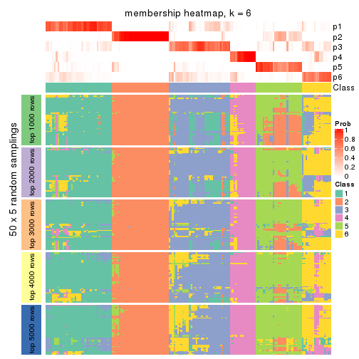</p>

</div>
</div>

As soon as we have had the classes for columns, we can look for signatures
which are significantly different between classes which can be candidate marks
for certain classes. Following are the heatmaps for signatures.


Signature heatmaps where rows are scaled:


<script>
$( function() {
	$( '#tabs-MAD-NMF-get-signatures' ).tabs();
} );
</script>
<div id='tabs-MAD-NMF-get-signatures'>
<ul>
<li><a href='#tab-MAD-NMF-get-signatures-1'>k = 2</a></li>
<li><a href='#tab-MAD-NMF-get-signatures-2'>k = 3</a></li>
<li><a href='#tab-MAD-NMF-get-signatures-3'>k = 4</a></li>
<li><a href='#tab-MAD-NMF-get-signatures-4'>k = 5</a></li>
<li><a href='#tab-MAD-NMF-get-signatures-5'>k = 6</a></li>
</ul>
<div id='tab-MAD-NMF-get-signatures-1'>
<pre><code class="r">get_signatures(res, k = 2)
</code></pre>

<p>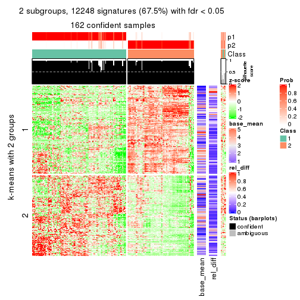</p>

</div>
<div id='tab-MAD-NMF-get-signatures-2'>
<pre><code class="r">get_signatures(res, k = 3)
</code></pre>

<p></p>

</div>
<div id='tab-MAD-NMF-get-signatures-3'>
<pre><code class="r">get_signatures(res, k = 4)
</code></pre>

<p></p>

</div>
<div id='tab-MAD-NMF-get-signatures-4'>
<pre><code class="r">get_signatures(res, k = 5)
</code></pre>

<p></p>

</div>
<div id='tab-MAD-NMF-get-signatures-5'>
<pre><code class="r">get_signatures(res, k = 6)
</code></pre>

<p></p>

</div>
</div>


Signature heatmaps where rows are not scaled:


<script>
$( function() {
	$( '#tabs-MAD-NMF-get-signatures-no-scale' ).tabs();
} );
</script>
<div id='tabs-MAD-NMF-get-signatures-no-scale'>
<ul>
<li><a href='#tab-MAD-NMF-get-signatures-no-scale-1'>k = 2</a></li>
<li><a href='#tab-MAD-NMF-get-signatures-no-scale-2'>k = 3</a></li>
<li><a href='#tab-MAD-NMF-get-signatures-no-scale-3'>k = 4</a></li>
<li><a href='#tab-MAD-NMF-get-signatures-no-scale-4'>k = 5</a></li>
<li><a href='#tab-MAD-NMF-get-signatures-no-scale-5'>k = 6</a></li>
</ul>
<div id='tab-MAD-NMF-get-signatures-no-scale-1'>
<pre><code class="r">get_signatures(res, k = 2, scale_rows = FALSE)
</code></pre>

<p></p>

</div>
<div id='tab-MAD-NMF-get-signatures-no-scale-2'>
<pre><code class="r">get_signatures(res, k = 3, scale_rows = FALSE)
</code></pre>

<p></p>

</div>
<div id='tab-MAD-NMF-get-signatures-no-scale-3'>
<pre><code class="r">get_signatures(res, k = 4, scale_rows = FALSE)
</code></pre>

<p></p>

</div>
<div id='tab-MAD-NMF-get-signatures-no-scale-4'>
<pre><code class="r">get_signatures(res, k = 5, scale_rows = FALSE)
</code></pre>

<p></p>

</div>
<div id='tab-MAD-NMF-get-signatures-no-scale-5'>
<pre><code class="r">get_signatures(res, k = 6, scale_rows = FALSE)
</code></pre>

<p></p>

</div>
</div>


Compare the overlap of signatures from different k:

```r
compare_signatures(res)
```


`get_signature()` returns a data frame invisibly. TO get the list of signatures, the function
call should be assigned to a variable explicitly. In following code, if `plot` argument is set
to `FALSE`, no heatmap is plotted while only the differential analysis is performed.

```r
# code only for demonstration
tb = get_signature(res, k = ..., plot = FALSE)
```

An example of the output of `tb` is:

```
#>   which_row         fdr    mean_1    mean_2 scaled_mean_1 scaled_mean_2 km
#> 1        38 0.042760348  8.373488  9.131774    -0.5533452     0.5164555  1
#> 2        40 0.018707592  7.106213  8.469186    -0.6173731     0.5762149  1
#> 3        55 0.019134737 10.221463 11.207825    -0.6159697     0.5749050  1
#> 4        59 0.006059896  5.921854  7.869574    -0.6899429     0.6439467  1
#> 5        60 0.018055526  8.928898 10.211722    -0.6204761     0.5791110  1
#> 6        98 0.009384629 15.714769 14.887706     0.6635654    -0.6193277  2
...
```

The columns in `tb` are:

1. `which_row`: row indices corresponding to the input matrix.
2. `fdr`: FDR for the differential test. 
3. `mean_x`: The mean value in group x.
4. `scaled_mean_x`: The mean value in group x after rows are scaled.
5. `km`: Row groups if k-means clustering is applied to rows.


UMAP plot which shows how samples are separated.


<script>
$( function() {
	$( '#tabs-MAD-NMF-dimension-reduction' ).tabs();
} );
</script>
<div id='tabs-MAD-NMF-dimension-reduction'>
<ul>
<li><a href='#tab-MAD-NMF-dimension-reduction-1'>k = 2</a></li>
<li><a href='#tab-MAD-NMF-dimension-reduction-2'>k = 3</a></li>
<li><a href='#tab-MAD-NMF-dimension-reduction-3'>k = 4</a></li>
<li><a href='#tab-MAD-NMF-dimension-reduction-4'>k = 5</a></li>
<li><a href='#tab-MAD-NMF-dimension-reduction-5'>k = 6</a></li>
</ul>
<div id='tab-MAD-NMF-dimension-reduction-1'>
<pre><code class="r">dimension_reduction(res, k = 2, method = &quot;UMAP&quot;)
</code></pre>

<p></p>

</div>
<div id='tab-MAD-NMF-dimension-reduction-2'>
<pre><code class="r">dimension_reduction(res, k = 3, method = &quot;UMAP&quot;)
</code></pre>

<p></p>

</div>
<div id='tab-MAD-NMF-dimension-reduction-3'>
<pre><code class="r">dimension_reduction(res, k = 4, method = &quot;UMAP&quot;)
</code></pre>

<p></p>

</div>
<div id='tab-MAD-NMF-dimension-reduction-4'>
<pre><code class="r">dimension_reduction(res, k = 5, method = &quot;UMAP&quot;)
</code></pre>

<p></p>

</div>
<div id='tab-MAD-NMF-dimension-reduction-5'>
<pre><code class="r">dimension_reduction(res, k = 6, method = &quot;UMAP&quot;)
</code></pre>

<p></p>

</div>
</div>


Following heatmap shows how subgroups are split when increasing `k`:

```r
collect_classes(res)
```


If matrix rows can be associated to genes, consider to use `functional_enrichment(res,
...)` to perform function enrichment for the signature genes. See [this vignette](http://bioconductor.org/packages/devel/bioc/vignettes/cola/inst/doc/functional_enrichment.html) for more detailed explanations.


 

---------------------------------------------------


### ATC:hclust


The object with results only for a single top-value method and a single partition method 
can be extracted as:

```r
res = res_list["ATC", "hclust"]
# you can also extract it by
# res = res_list["ATC:hclust"]
```

A summary of `res` and all the functions that can be applied to it:

```r
res
```

```
#> A 'ConsensusPartition' object with k = 2, 3, 4, 5, 6.
#>   On a matrix with 18147 rows and 167 columns.
#>   Top rows (1000, 2000, 3000, 4000, 5000) are extracted by 'ATC' method.
#>   Subgroups are detected by 'hclust' method.
#>   Performed in total 1250 partitions by row resampling.
#>   Best k for subgroups seems to be 3.
#> 
#> Following methods can be applied to this 'ConsensusPartition' object:
#>  [1] "cola_report"             "collect_classes"         "collect_plots"          
#>  [4] "collect_stats"           "colnames"                "compare_signatures"     
#>  [7] "consensus_heatmap"       "dimension_reduction"     "functional_enrichment"  
#> [10] "get_anno_col"            "get_anno"                "get_classes"            
#> [13] "get_consensus"           "get_matrix"              "get_membership"         
#> [16] "get_param"               "get_signatures"          "get_stats"              
#> [19] "is_best_k"               "is_stable_k"             "membership_heatmap"     
#> [22] "ncol"                    "nrow"                    "plot_ecdf"              
#> [25] "rownames"                "select_partition_number" "show"                   
#> [28] "suggest_best_k"          "test_to_known_factors"
```

`collect_plots()` function collects all the plots made from `res` for all `k` (number of partitions)
into one single page to provide an easy and fast comparison between different `k`.

```r
collect_plots(res)
```


The plots are:

- The first row: a plot of the ECDF (empirical cumulative distribution
  function) curves of the consensus matrix for each `k` and the heatmap of
  predicted classes for each `k`.
- The second row: heatmaps of the consensus matrix for each `k`.
- The third row: heatmaps of the membership matrix for each `k`.
- The fouth row: heatmaps of the signatures for each `k`.

All the plots in panels can be made by individual functions and they are
plotted later in this section.

`select_partition_number()` produces several plots showing different
statistics for choosing "optimized" `k`. There are following statistics:

- ECDF curves of the consensus matrix for each `k`;
- 1-PAC. [The PAC
  score](https://en.wikipedia.org/wiki/Consensus_clustering#Over-interpretation_potential_of_consensus_clustering)
  measures the proportion of the ambiguous subgrouping.
- Mean silhouette score.
- Concordance. The mean probability of fiting the consensus class ids in all
  partitions.
- Area increased. Denote $A_k$ as the area under the ECDF curve for current
  `k`, the area increased is defined as $A_k - A_{k-1}$.
- Rand index. The percent of pairs of samples that are both in a same cluster
  or both are not in a same cluster in the partition of k and k-1.
- Jaccard index. The ratio of pairs of samples are both in a same cluster in
  the partition of k and k-1 and the pairs of samples are both in a same
  cluster in the partition k or k-1.

The detailed explanations of these statistics can be found in [the _cola_
vignette](http://bioconductor.org/packages/devel/bioc/vignettes/cola/inst/doc/cola.html#toc_13).

Generally speaking, lower PAC score, higher mean silhouette score or higher
concordance corresponds to better partition. Rand index and Jaccard index
measure how similar the current partition is compared to partition with `k-1`.
If they are too similar, we won't accept `k` is better than `k-1`.

```r
select_partition_number(res)
```


The numeric values for all these statistics can be obtained by `get_stats()`.

```r
get_stats(res)
```

```
#>   k 1-PAC mean_silhouette concordance area_increased  Rand Jaccard
#> 2 2 0.512           0.817       0.906         0.4581 0.519   0.519
#> 3 3 0.714           0.836       0.910         0.3984 0.819   0.651
#> 4 4 0.732           0.603       0.786         0.1303 0.847   0.596
#> 5 5 0.745           0.631       0.764         0.0451 0.902   0.667
#> 6 6 0.772           0.711       0.799         0.0273 0.945   0.770
```

`suggest_best_k()` suggests the best $k$ based on these statistics. The rules are as follows:

- All $k$ with Jaccard index larger than 0.95 are removed because increasing
  $k$ does not provide enough extra information. If all $k$ are removed, it is
  marked as no subgroup is detected.
- For all $k$ with 1-PAC score larger than 0.9, the maximal $k$ is taken as
  the best $k$, and other $k$ are marked as optional $k$.
- If it does not fit the second rule. The $k$ with the maximal vote of the
  highest 1-PAC score, highest mean silhouette, and highest concordance is
  taken as the best $k$.

```r
suggest_best_k(res)
```

```
#> [1] 3
```


Following shows the table of the partitions (You need to click the **show/hide
code output** link to see it). The membership matrix (columns with name `p*`)
is inferred by
[`clue::cl_consensus()`](https://www.rdocumentation.org/link/cl_consensus?package=clue)
function with the `SE` method. Basically the value in the membership matrix
represents the probability to belong to a certain group. The finall class
label for an item is determined with the group with highest probability it
belongs to.

In `get_classes()` function, the entropy is calculated from the membership
matrix and the silhouette score is calculated from the consensus matrix.


<script>
$( function() {
	$( '#tabs-ATC-hclust-get-classes' ).tabs();
} );
</script>
<div id='tabs-ATC-hclust-get-classes'>
<ul>
<li><a href='#tab-ATC-hclust-get-classes-1'>k = 2</a></li>
<li><a href='#tab-ATC-hclust-get-classes-2'>k = 3</a></li>
<li><a href='#tab-ATC-hclust-get-classes-3'>k = 4</a></li>
<li><a href='#tab-ATC-hclust-get-classes-4'>k = 5</a></li>
<li><a href='#tab-ATC-hclust-get-classes-5'>k = 6</a></li>
</ul>

<div id='tab-ATC-hclust-get-classes-1'>
<p><a id='tab-ATC-hclust-get-classes-1-a' style='color:#0366d6' href='#'>show/hide code output</a></p>
<pre><code class="r">cbind(get_classes(res, k = 2), get_membership(res, k = 2))
</code></pre>

<pre><code>#&gt;            class entropy silhouette    p1    p2
#&gt; SRR1313062     2  0.2236     0.8942 0.036 0.964
#&gt; SRR1313063     2  0.2236     0.8942 0.036 0.964
#&gt; SRR1313064     2  0.2236     0.8942 0.036 0.964
#&gt; SRR1313065     2  0.8555     0.6245 0.280 0.720
#&gt; SRR1313066     2  0.2236     0.8942 0.036 0.964
#&gt; SRR1313067     2  0.9909     0.1716 0.444 0.556
#&gt; SRR1313068     2  0.2236     0.8942 0.036 0.964
#&gt; SRR1313069     2  0.2236     0.8942 0.036 0.964
#&gt; SRR1313070     2  0.2236     0.8942 0.036 0.964
#&gt; SRR1313071     2  0.2236     0.8942 0.036 0.964
#&gt; SRR1313072     2  0.2236     0.8942 0.036 0.964
#&gt; SRR1313073     2  0.2236     0.8942 0.036 0.964
#&gt; SRR1313074     2  0.2236     0.8942 0.036 0.964
#&gt; SRR1313075     2  0.2236     0.8942 0.036 0.964
#&gt; SRR1313076     2  0.2423     0.8919 0.040 0.960
#&gt; SRR1313077     2  0.9552     0.4044 0.376 0.624
#&gt; SRR1313078     1  0.6148     0.8446 0.848 0.152
#&gt; SRR1313079     2  0.2236     0.8942 0.036 0.964
#&gt; SRR1313080     2  0.2236     0.8942 0.036 0.964
#&gt; SRR1313081     2  0.5629     0.8110 0.132 0.868
#&gt; SRR1313082     2  0.8555     0.6245 0.280 0.720
#&gt; SRR1313083     2  0.9954     0.1103 0.460 0.540
#&gt; SRR1313084     2  0.2236     0.8942 0.036 0.964
#&gt; SRR1313085     2  0.2236     0.8942 0.036 0.964
#&gt; SRR1313086     2  0.2423     0.8919 0.040 0.960
#&gt; SRR1313087     2  0.2236     0.8942 0.036 0.964
#&gt; SRR1313088     2  0.2236     0.8942 0.036 0.964
#&gt; SRR1313089     2  0.2236     0.8942 0.036 0.964
#&gt; SRR1313092     1  0.4562     0.8770 0.904 0.096
#&gt; SRR1313090     1  0.9170     0.6077 0.668 0.332
#&gt; SRR1313091     1  0.3431     0.8810 0.936 0.064
#&gt; SRR1313093     1  0.0000     0.8694 1.000 0.000
#&gt; SRR1313095     1  0.7453     0.8013 0.788 0.212
#&gt; SRR1313096     1  0.0000     0.8694 1.000 0.000
#&gt; SRR1313094     1  0.2043     0.8791 0.968 0.032
#&gt; SRR1313097     1  0.3274     0.8816 0.940 0.060
#&gt; SRR1313099     1  0.0000     0.8694 1.000 0.000
#&gt; SRR1313098     1  0.6438     0.8453 0.836 0.164
#&gt; SRR1313101     1  0.8207     0.7463 0.744 0.256
#&gt; SRR1313102     1  0.3274     0.8816 0.940 0.060
#&gt; SRR1313103     1  0.1414     0.8717 0.980 0.020
#&gt; SRR1313100     2  0.3274     0.8788 0.060 0.940
#&gt; SRR1313105     1  0.2948     0.8809 0.948 0.052
#&gt; SRR1313104     1  0.3114     0.8815 0.944 0.056
#&gt; SRR1313107     1  0.0000     0.8694 1.000 0.000
#&gt; SRR1313106     1  0.9954     0.2915 0.540 0.460
#&gt; SRR1313109     1  0.2778     0.8801 0.952 0.048
#&gt; SRR1313108     1  0.0000     0.8694 1.000 0.000
#&gt; SRR1313111     1  0.3274     0.8816 0.940 0.060
#&gt; SRR1313110     1  0.8144     0.7474 0.748 0.252
#&gt; SRR1313112     1  0.8207     0.7463 0.744 0.256
#&gt; SRR1313113     1  0.3274     0.8816 0.940 0.060
#&gt; SRR1313115     1  0.0000     0.8694 1.000 0.000
#&gt; SRR1313114     1  0.8443     0.7207 0.728 0.272
#&gt; SRR1313117     1  0.8207     0.7463 0.744 0.256
#&gt; SRR1313118     2  0.9460     0.4407 0.364 0.636
#&gt; SRR1313116     1  0.3274     0.8816 0.940 0.060
#&gt; SRR1313120     1  0.0000     0.8694 1.000 0.000
#&gt; SRR1313119     1  0.8267     0.7404 0.740 0.260
#&gt; SRR1313122     1  0.7528     0.7952 0.784 0.216
#&gt; SRR1313124     1  0.8207     0.7463 0.744 0.256
#&gt; SRR1313121     2  0.8661     0.6109 0.288 0.712
#&gt; SRR1313125     1  0.8207     0.7463 0.744 0.256
#&gt; SRR1313127     1  0.6438     0.8453 0.836 0.164
#&gt; SRR1313123     1  0.6148     0.8543 0.848 0.152
#&gt; SRR1313128     1  0.0938     0.8730 0.988 0.012
#&gt; SRR1313126     1  0.6887     0.8277 0.816 0.184
#&gt; SRR1313130     2  0.8713     0.5710 0.292 0.708
#&gt; SRR1313132     1  0.1843     0.8783 0.972 0.028
#&gt; SRR1313129     1  0.3274     0.8816 0.940 0.060
#&gt; SRR1313133     1  0.0000     0.8694 1.000 0.000
#&gt; SRR1313131     1  0.0000     0.8694 1.000 0.000
#&gt; SRR1313134     1  0.0000     0.8694 1.000 0.000
#&gt; SRR1313135     2  0.6623     0.7768 0.172 0.828
#&gt; SRR1313136     1  0.5842     0.8623 0.860 0.140
#&gt; SRR1313137     2  0.8608     0.6172 0.284 0.716
#&gt; SRR1313138     1  0.9833     0.3534 0.576 0.424
#&gt; SRR1313140     2  0.5294     0.8290 0.120 0.880
#&gt; SRR1313141     1  0.0000     0.8694 1.000 0.000
#&gt; SRR1313139     2  0.5294     0.8290 0.120 0.880
#&gt; SRR1313143     1  0.0000     0.8694 1.000 0.000
#&gt; SRR1313142     1  0.5842     0.8623 0.860 0.140
#&gt; SRR1313144     2  0.6148     0.7961 0.152 0.848
#&gt; SRR1313145     1  0.4431     0.8766 0.908 0.092
#&gt; SRR1313146     1  0.5842     0.8623 0.860 0.140
#&gt; SRR1313147     2  0.8386     0.6439 0.268 0.732
#&gt; SRR1313150     2  0.8555     0.6241 0.280 0.720
#&gt; SRR1313149     1  0.0000     0.8694 1.000 0.000
#&gt; SRR1313152     2  0.8608     0.6172 0.284 0.716
#&gt; SRR1313151     1  0.5842     0.8623 0.860 0.140
#&gt; SRR1313154     1  0.2423     0.8791 0.960 0.040
#&gt; SRR1313153     1  0.5842     0.8623 0.860 0.140
#&gt; SRR1313156     1  0.5629     0.8656 0.868 0.132
#&gt; SRR1313155     1  0.5842     0.8623 0.860 0.140
#&gt; SRR1313157     2  0.8608     0.6172 0.284 0.716
#&gt; SRR1313158     1  0.5842     0.8623 0.860 0.140
#&gt; SRR1313161     2  0.8713     0.6025 0.292 0.708
#&gt; SRR1313159     2  0.9970    -0.0253 0.468 0.532
#&gt; SRR1313160     2  0.8763     0.5950 0.296 0.704
#&gt; SRR1313162     1  0.5842     0.8623 0.860 0.140
#&gt; SRR1313163     1  0.5629     0.8656 0.868 0.132
#&gt; SRR1313165     2  0.8763     0.5950 0.296 0.704
#&gt; SRR1313166     1  0.1843     0.8783 0.972 0.028
#&gt; SRR1313164     1  0.0376     0.8697 0.996 0.004
#&gt; SRR1313167     1  0.9775     0.3974 0.588 0.412
#&gt; SRR1313168     2  0.8608     0.6172 0.284 0.716
#&gt; SRR1313170     2  0.9970    -0.0253 0.468 0.532
#&gt; SRR1313169     2  0.8608     0.6172 0.284 0.716
#&gt; SRR1313172     1  0.0000     0.8694 1.000 0.000
#&gt; SRR1313171     1  0.0000     0.8694 1.000 0.000
#&gt; SRR1313174     2  0.0000     0.9035 0.000 1.000
#&gt; SRR1313173     1  0.0000     0.8694 1.000 0.000
#&gt; SRR1313176     2  0.0000     0.9035 0.000 1.000
#&gt; SRR1313175     2  0.0000     0.9035 0.000 1.000
#&gt; SRR1313178     2  0.0000     0.9035 0.000 1.000
#&gt; SRR1313177     2  0.0000     0.9035 0.000 1.000
#&gt; SRR1313179     2  0.0938     0.8992 0.012 0.988
#&gt; SRR1313180     2  0.0000     0.9035 0.000 1.000
#&gt; SRR1313181     2  0.0000     0.9035 0.000 1.000
#&gt; SRR1313183     2  0.0000     0.9035 0.000 1.000
#&gt; SRR1313182     2  0.0000     0.9035 0.000 1.000
#&gt; SRR1313184     2  0.0000     0.9035 0.000 1.000
#&gt; SRR1313185     2  0.0000     0.9035 0.000 1.000
#&gt; SRR1313188     2  0.0000     0.9035 0.000 1.000
#&gt; SRR1313187     2  0.0000     0.9035 0.000 1.000
#&gt; SRR1313186     2  0.0000     0.9035 0.000 1.000
#&gt; SRR1313189     2  0.0000     0.9035 0.000 1.000
#&gt; SRR1313190     2  0.0000     0.9035 0.000 1.000
#&gt; SRR1313191     2  0.0000     0.9035 0.000 1.000
#&gt; SRR1313192     2  0.0000     0.9035 0.000 1.000
#&gt; SRR1313193     2  0.0000     0.9035 0.000 1.000
#&gt; SRR1313194     2  0.0000     0.9035 0.000 1.000
#&gt; SRR1313195     2  0.0000     0.9035 0.000 1.000
#&gt; SRR1313196     2  0.0000     0.9035 0.000 1.000
#&gt; SRR1313197     2  0.0000     0.9035 0.000 1.000
#&gt; SRR1313198     2  0.0000     0.9035 0.000 1.000
#&gt; SRR1313199     2  0.0000     0.9035 0.000 1.000
#&gt; SRR1313200     2  0.0000     0.9035 0.000 1.000
#&gt; SRR1313201     2  0.0000     0.9035 0.000 1.000
#&gt; SRR1313202     2  0.0000     0.9035 0.000 1.000
#&gt; SRR1313203     1  0.4815     0.8730 0.896 0.104
#&gt; SRR1313204     2  0.0000     0.9035 0.000 1.000
#&gt; SRR1313205     2  0.0000     0.9035 0.000 1.000
#&gt; SRR1313207     2  0.0000     0.9035 0.000 1.000
#&gt; SRR1313208     2  0.0000     0.9035 0.000 1.000
#&gt; SRR1313206     2  0.0000     0.9035 0.000 1.000
#&gt; SRR1313210     2  0.0000     0.9035 0.000 1.000
#&gt; SRR1313209     2  0.0000     0.9035 0.000 1.000
#&gt; SRR1313211     2  0.0000     0.9035 0.000 1.000
#&gt; SRR1313212     2  0.0000     0.9035 0.000 1.000
#&gt; SRR1313214     2  0.0000     0.9035 0.000 1.000
#&gt; SRR1313215     2  0.0000     0.9035 0.000 1.000
#&gt; SRR1313213     2  0.0000     0.9035 0.000 1.000
#&gt; SRR1313216     1  0.6712     0.8172 0.824 0.176
#&gt; SRR1313217     2  0.0000     0.9035 0.000 1.000
#&gt; SRR1313219     2  0.0000     0.9035 0.000 1.000
#&gt; SRR1313220     2  0.0000     0.9035 0.000 1.000
#&gt; SRR1313218     2  0.0000     0.9035 0.000 1.000
#&gt; SRR1313222     2  0.0000     0.9035 0.000 1.000
#&gt; SRR1313221     2  0.0000     0.9035 0.000 1.000
#&gt; SRR1313223     2  0.0000     0.9035 0.000 1.000
#&gt; SRR1313224     2  0.0000     0.9035 0.000 1.000
#&gt; SRR1313225     2  0.0000     0.9035 0.000 1.000
#&gt; SRR1313226     2  0.0000     0.9035 0.000 1.000
#&gt; SRR1313227     2  0.0000     0.9035 0.000 1.000
#&gt; SRR1313228     2  0.0000     0.9035 0.000 1.000
#&gt; SRR1313229     2  0.0000     0.9035 0.000 1.000
</code></pre>

<script>
$('#tab-ATC-hclust-get-classes-1-a').parent().next().next().hide();
$('#tab-ATC-hclust-get-classes-1-a').click(function(){
  $('#tab-ATC-hclust-get-classes-1-a').parent().next().next().toggle();
  return(false);
});
</script>
</div>

<div id='tab-ATC-hclust-get-classes-2'>
<p><a id='tab-ATC-hclust-get-classes-2-a' style='color:#0366d6' href='#'>show/hide code output</a></p>
<pre><code class="r">cbind(get_classes(res, k = 3), get_membership(res, k = 3))
</code></pre>

<pre><code>#&gt;            class entropy silhouette    p1    p2    p3
#&gt; SRR1313062     1  0.0000    0.83441 1.000 0.000 0.000
#&gt; SRR1313063     1  0.0000    0.83441 1.000 0.000 0.000
#&gt; SRR1313064     1  0.0000    0.83441 1.000 0.000 0.000
#&gt; SRR1313065     1  0.6148    0.72189 0.728 0.028 0.244
#&gt; SRR1313066     1  0.0237    0.83443 0.996 0.004 0.000
#&gt; SRR1313067     1  0.7192    0.34170 0.560 0.028 0.412
#&gt; SRR1313068     1  0.0237    0.83443 0.996 0.004 0.000
#&gt; SRR1313069     1  0.0000    0.83441 1.000 0.000 0.000
#&gt; SRR1313070     1  0.0000    0.83441 1.000 0.000 0.000
#&gt; SRR1313071     1  0.0000    0.83441 1.000 0.000 0.000
#&gt; SRR1313072     1  0.0000    0.83441 1.000 0.000 0.000
#&gt; SRR1313073     1  0.0000    0.83441 1.000 0.000 0.000
#&gt; SRR1313074     1  0.0000    0.83441 1.000 0.000 0.000
#&gt; SRR1313075     1  0.0000    0.83441 1.000 0.000 0.000
#&gt; SRR1313076     1  0.0237    0.83472 0.996 0.000 0.004
#&gt; SRR1313077     1  0.5905    0.54710 0.648 0.000 0.352
#&gt; SRR1313078     3  0.3879    0.81546 0.152 0.000 0.848
#&gt; SRR1313079     1  0.0000    0.83441 1.000 0.000 0.000
#&gt; SRR1313080     1  0.0237    0.83443 0.996 0.004 0.000
#&gt; SRR1313081     1  0.3116    0.77729 0.892 0.000 0.108
#&gt; SRR1313082     1  0.6148    0.72189 0.728 0.028 0.244
#&gt; SRR1313083     1  0.7232    0.28941 0.544 0.028 0.428
#&gt; SRR1313084     1  0.0000    0.83441 1.000 0.000 0.000
#&gt; SRR1313085     1  0.0000    0.83441 1.000 0.000 0.000
#&gt; SRR1313086     1  0.0237    0.83472 0.996 0.000 0.004
#&gt; SRR1313087     1  0.0000    0.83441 1.000 0.000 0.000
#&gt; SRR1313088     1  0.0000    0.83441 1.000 0.000 0.000
#&gt; SRR1313089     1  0.0237    0.83443 0.996 0.004 0.000
#&gt; SRR1313092     3  0.3623    0.86172 0.072 0.032 0.896
#&gt; SRR1313090     3  0.7124    0.58226 0.296 0.048 0.656
#&gt; SRR1313091     3  0.2165    0.85936 0.000 0.064 0.936
#&gt; SRR1313093     3  0.0000    0.86368 0.000 0.000 1.000
#&gt; SRR1313095     3  0.5746    0.78738 0.180 0.040 0.780
#&gt; SRR1313096     3  0.0000    0.86368 0.000 0.000 1.000
#&gt; SRR1313094     3  0.1289    0.86780 0.000 0.032 0.968
#&gt; SRR1313097     3  0.2066    0.86128 0.000 0.060 0.940
#&gt; SRR1313099     3  0.0000    0.86368 0.000 0.000 1.000
#&gt; SRR1313098     3  0.4874    0.82507 0.144 0.028 0.828
#&gt; SRR1313101     3  0.6354    0.74570 0.204 0.052 0.744
#&gt; SRR1313102     3  0.2066    0.86128 0.000 0.060 0.940
#&gt; SRR1313103     3  0.0892    0.85958 0.000 0.020 0.980
#&gt; SRR1313100     1  0.2313    0.82533 0.944 0.032 0.024
#&gt; SRR1313105     3  0.1860    0.86363 0.000 0.052 0.948
#&gt; SRR1313104     3  0.1964    0.86266 0.000 0.056 0.944
#&gt; SRR1313107     3  0.0000    0.86368 0.000 0.000 1.000
#&gt; SRR1313106     3  0.6647    0.22684 0.008 0.452 0.540
#&gt; SRR1313109     3  0.1753    0.86380 0.000 0.048 0.952
#&gt; SRR1313108     3  0.0000    0.86368 0.000 0.000 1.000
#&gt; SRR1313111     3  0.2066    0.86128 0.000 0.060 0.940
#&gt; SRR1313110     3  0.6124    0.72951 0.220 0.036 0.744
#&gt; SRR1313112     3  0.6354    0.74570 0.204 0.052 0.744
#&gt; SRR1313113     3  0.2066    0.86128 0.000 0.060 0.940
#&gt; SRR1313115     3  0.0000    0.86368 0.000 0.000 1.000
#&gt; SRR1313114     3  0.6482    0.69598 0.244 0.040 0.716
#&gt; SRR1313117     3  0.6354    0.74570 0.204 0.052 0.744
#&gt; SRR1313118     1  0.7061    0.56585 0.632 0.036 0.332
#&gt; SRR1313116     3  0.2066    0.86128 0.000 0.060 0.940
#&gt; SRR1313120     3  0.0000    0.86368 0.000 0.000 1.000
#&gt; SRR1313119     3  0.6400    0.74019 0.208 0.052 0.740
#&gt; SRR1313122     3  0.5835    0.79251 0.164 0.052 0.784
#&gt; SRR1313124     3  0.6354    0.74570 0.204 0.052 0.744
#&gt; SRR1313121     1  0.6761    0.69568 0.700 0.048 0.252
#&gt; SRR1313125     3  0.6354    0.74570 0.204 0.052 0.744
#&gt; SRR1313127     3  0.4874    0.82507 0.144 0.028 0.828
#&gt; SRR1313123     3  0.4677    0.83431 0.132 0.028 0.840
#&gt; SRR1313128     3  0.0592    0.86402 0.012 0.000 0.988
#&gt; SRR1313126     3  0.5178    0.80699 0.164 0.028 0.808
#&gt; SRR1313130     2  0.5722    0.53418 0.004 0.704 0.292
#&gt; SRR1313132     3  0.1337    0.86864 0.016 0.012 0.972
#&gt; SRR1313129     3  0.2066    0.86128 0.000 0.060 0.940
#&gt; SRR1313133     3  0.0000    0.86368 0.000 0.000 1.000
#&gt; SRR1313131     3  0.0000    0.86368 0.000 0.000 1.000
#&gt; SRR1313134     3  0.0000    0.86368 0.000 0.000 1.000
#&gt; SRR1313135     1  0.4618    0.79430 0.840 0.024 0.136
#&gt; SRR1313136     3  0.4469    0.84251 0.120 0.028 0.852
#&gt; SRR1313137     1  0.6187    0.71752 0.724 0.028 0.248
#&gt; SRR1313138     3  0.7236    0.33015 0.392 0.032 0.576
#&gt; SRR1313140     1  0.3637    0.81499 0.892 0.024 0.084
#&gt; SRR1313141     3  0.0000    0.86368 0.000 0.000 1.000
#&gt; SRR1313139     1  0.3637    0.81499 0.892 0.024 0.084
#&gt; SRR1313143     3  0.0000    0.86368 0.000 0.000 1.000
#&gt; SRR1313142     3  0.4469    0.84251 0.120 0.028 0.852
#&gt; SRR1313144     1  0.4397    0.80123 0.856 0.028 0.116
#&gt; SRR1313145     3  0.3499    0.86029 0.072 0.028 0.900
#&gt; SRR1313146     3  0.4469    0.84251 0.120 0.028 0.852
#&gt; SRR1313147     1  0.6025    0.73172 0.740 0.028 0.232
#&gt; SRR1313150     1  0.6148    0.72158 0.728 0.028 0.244
#&gt; SRR1313149     3  0.0000    0.86368 0.000 0.000 1.000
#&gt; SRR1313152     1  0.6187    0.71752 0.724 0.028 0.248
#&gt; SRR1313151     3  0.4469    0.84251 0.120 0.028 0.852
#&gt; SRR1313154     3  0.1999    0.86564 0.036 0.012 0.952
#&gt; SRR1313153     3  0.4469    0.84251 0.120 0.028 0.852
#&gt; SRR1313156     3  0.4217    0.85129 0.100 0.032 0.868
#&gt; SRR1313155     3  0.4469    0.84251 0.120 0.028 0.852
#&gt; SRR1313157     1  0.6187    0.71752 0.724 0.028 0.248
#&gt; SRR1313158     3  0.4469    0.84251 0.120 0.028 0.852
#&gt; SRR1313161     1  0.6264    0.70694 0.716 0.028 0.256
#&gt; SRR1313159     2  0.6669   -0.00667 0.008 0.524 0.468
#&gt; SRR1313160     1  0.6337    0.69538 0.708 0.028 0.264
#&gt; SRR1313162     3  0.4469    0.84251 0.120 0.028 0.852
#&gt; SRR1313163     3  0.4217    0.85129 0.100 0.032 0.868
#&gt; SRR1313165     1  0.6337    0.69538 0.708 0.028 0.264
#&gt; SRR1313166     3  0.1337    0.86864 0.016 0.012 0.972
#&gt; SRR1313164     3  0.0237    0.86310 0.000 0.004 0.996
#&gt; SRR1313167     3  0.7129    0.34650 0.392 0.028 0.580
#&gt; SRR1313168     1  0.6187    0.71752 0.724 0.028 0.248
#&gt; SRR1313170     2  0.6669   -0.00667 0.008 0.524 0.468
#&gt; SRR1313169     1  0.6187    0.71752 0.724 0.028 0.248
#&gt; SRR1313172     3  0.0000    0.86368 0.000 0.000 1.000
#&gt; SRR1313171     3  0.0000    0.86368 0.000 0.000 1.000
#&gt; SRR1313174     2  0.0000    0.97279 0.000 1.000 0.000
#&gt; SRR1313173     3  0.0000    0.86368 0.000 0.000 1.000
#&gt; SRR1313176     2  0.0000    0.97279 0.000 1.000 0.000
#&gt; SRR1313175     2  0.0237    0.97067 0.004 0.996 0.000
#&gt; SRR1313178     2  0.0000    0.97279 0.000 1.000 0.000
#&gt; SRR1313177     2  0.0000    0.97279 0.000 1.000 0.000
#&gt; SRR1313179     2  0.1015    0.95596 0.008 0.980 0.012
#&gt; SRR1313180     2  0.0237    0.97067 0.004 0.996 0.000
#&gt; SRR1313181     2  0.0000    0.97279 0.000 1.000 0.000
#&gt; SRR1313183     2  0.0000    0.97279 0.000 1.000 0.000
#&gt; SRR1313182     2  0.0000    0.97279 0.000 1.000 0.000
#&gt; SRR1313184     2  0.0000    0.97279 0.000 1.000 0.000
#&gt; SRR1313185     2  0.0000    0.97279 0.000 1.000 0.000
#&gt; SRR1313188     2  0.0237    0.97067 0.004 0.996 0.000
#&gt; SRR1313187     2  0.0237    0.97067 0.004 0.996 0.000
#&gt; SRR1313186     2  0.0000    0.97279 0.000 1.000 0.000
#&gt; SRR1313189     2  0.0000    0.97279 0.000 1.000 0.000
#&gt; SRR1313190     2  0.0000    0.97279 0.000 1.000 0.000
#&gt; SRR1313191     2  0.0000    0.97279 0.000 1.000 0.000
#&gt; SRR1313192     2  0.0000    0.97279 0.000 1.000 0.000
#&gt; SRR1313193     2  0.0000    0.97279 0.000 1.000 0.000
#&gt; SRR1313194     2  0.0237    0.97067 0.004 0.996 0.000
#&gt; SRR1313195     2  0.0237    0.97067 0.004 0.996 0.000
#&gt; SRR1313196     2  0.0237    0.97067 0.004 0.996 0.000
#&gt; SRR1313197     2  0.0000    0.97279 0.000 1.000 0.000
#&gt; SRR1313198     2  0.0237    0.97067 0.004 0.996 0.000
#&gt; SRR1313199     2  0.0000    0.97279 0.000 1.000 0.000
#&gt; SRR1313200     2  0.0237    0.97067 0.004 0.996 0.000
#&gt; SRR1313201     2  0.0000    0.97279 0.000 1.000 0.000
#&gt; SRR1313202     2  0.0000    0.97279 0.000 1.000 0.000
#&gt; SRR1313203     3  0.3038    0.82579 0.000 0.104 0.896
#&gt; SRR1313204     2  0.0000    0.97279 0.000 1.000 0.000
#&gt; SRR1313205     2  0.0000    0.97279 0.000 1.000 0.000
#&gt; SRR1313207     2  0.0000    0.97279 0.000 1.000 0.000
#&gt; SRR1313208     2  0.0000    0.97279 0.000 1.000 0.000
#&gt; SRR1313206     2  0.0000    0.97279 0.000 1.000 0.000
#&gt; SRR1313210     2  0.0237    0.97067 0.004 0.996 0.000
#&gt; SRR1313209     2  0.0000    0.97279 0.000 1.000 0.000
#&gt; SRR1313211     2  0.0000    0.97279 0.000 1.000 0.000
#&gt; SRR1313212     2  0.0000    0.97279 0.000 1.000 0.000
#&gt; SRR1313214     2  0.0000    0.97279 0.000 1.000 0.000
#&gt; SRR1313215     2  0.0000    0.97279 0.000 1.000 0.000
#&gt; SRR1313213     2  0.0000    0.97279 0.000 1.000 0.000
#&gt; SRR1313216     3  0.4235    0.75235 0.000 0.176 0.824
#&gt; SRR1313217     2  0.0237    0.97067 0.004 0.996 0.000
#&gt; SRR1313219     2  0.0237    0.97067 0.004 0.996 0.000
#&gt; SRR1313220     2  0.0000    0.97279 0.000 1.000 0.000
#&gt; SRR1313218     2  0.0000    0.97279 0.000 1.000 0.000
#&gt; SRR1313222     2  0.0000    0.97279 0.000 1.000 0.000
#&gt; SRR1313221     2  0.0000    0.97279 0.000 1.000 0.000
#&gt; SRR1313223     2  0.0000    0.97279 0.000 1.000 0.000
#&gt; SRR1313224     2  0.0000    0.97279 0.000 1.000 0.000
#&gt; SRR1313225     2  0.0000    0.97279 0.000 1.000 0.000
#&gt; SRR1313226     2  0.0237    0.97067 0.004 0.996 0.000
#&gt; SRR1313227     2  0.0000    0.97279 0.000 1.000 0.000
#&gt; SRR1313228     2  0.0000    0.97279 0.000 1.000 0.000
#&gt; SRR1313229     2  0.0000    0.97279 0.000 1.000 0.000
</code></pre>

<script>
$('#tab-ATC-hclust-get-classes-2-a').parent().next().next().hide();
$('#tab-ATC-hclust-get-classes-2-a').click(function(){
  $('#tab-ATC-hclust-get-classes-2-a').parent().next().next().toggle();
  return(false);
});
</script>
</div>

<div id='tab-ATC-hclust-get-classes-3'>
<p><a id='tab-ATC-hclust-get-classes-3-a' style='color:#0366d6' href='#'>show/hide code output</a></p>
<pre><code class="r">cbind(get_classes(res, k = 4), get_membership(res, k = 4))
</code></pre>

<pre><code>#&gt;            class entropy silhouette    p1    p2    p3    p4
#&gt; SRR1313062     4  0.0336   0.878674 0.008 0.000 0.000 0.992
#&gt; SRR1313063     4  0.0188   0.879094 0.004 0.000 0.000 0.996
#&gt; SRR1313064     4  0.0000   0.879243 0.000 0.000 0.000 1.000
#&gt; SRR1313065     1  0.4998   0.001040 0.512 0.000 0.000 0.488
#&gt; SRR1313066     4  0.1118   0.872752 0.036 0.000 0.000 0.964
#&gt; SRR1313067     1  0.4720   0.339259 0.672 0.000 0.004 0.324
#&gt; SRR1313068     4  0.1118   0.872752 0.036 0.000 0.000 0.964
#&gt; SRR1313069     4  0.0000   0.879243 0.000 0.000 0.000 1.000
#&gt; SRR1313070     4  0.0000   0.879243 0.000 0.000 0.000 1.000
#&gt; SRR1313071     4  0.0000   0.879243 0.000 0.000 0.000 1.000
#&gt; SRR1313072     4  0.0000   0.879243 0.000 0.000 0.000 1.000
#&gt; SRR1313073     4  0.0000   0.879243 0.000 0.000 0.000 1.000
#&gt; SRR1313074     4  0.0000   0.879243 0.000 0.000 0.000 1.000
#&gt; SRR1313075     4  0.0000   0.879243 0.000 0.000 0.000 1.000
#&gt; SRR1313076     4  0.1867   0.851983 0.072 0.000 0.000 0.928
#&gt; SRR1313077     1  0.4977   0.092982 0.540 0.000 0.000 0.460
#&gt; SRR1313078     1  0.3837   0.218909 0.776 0.000 0.224 0.000
#&gt; SRR1313079     4  0.0000   0.879243 0.000 0.000 0.000 1.000
#&gt; SRR1313080     4  0.1118   0.872752 0.036 0.000 0.000 0.964
#&gt; SRR1313081     4  0.3356   0.747304 0.176 0.000 0.000 0.824
#&gt; SRR1313082     1  0.4998   0.001040 0.512 0.000 0.000 0.488
#&gt; SRR1313083     1  0.4632   0.364636 0.688 0.000 0.004 0.308
#&gt; SRR1313084     4  0.0469   0.878142 0.012 0.000 0.000 0.988
#&gt; SRR1313085     4  0.0000   0.879243 0.000 0.000 0.000 1.000
#&gt; SRR1313086     4  0.1716   0.857158 0.064 0.000 0.000 0.936
#&gt; SRR1313087     4  0.0000   0.879243 0.000 0.000 0.000 1.000
#&gt; SRR1313088     4  0.0000   0.879243 0.000 0.000 0.000 1.000
#&gt; SRR1313089     4  0.1118   0.872752 0.036 0.000 0.000 0.964
#&gt; SRR1313092     1  0.4614   0.222837 0.752 0.004 0.228 0.016
#&gt; SRR1313090     1  0.6901   0.350921 0.608 0.020 0.280 0.092
#&gt; SRR1313091     3  0.5816   0.285771 0.392 0.036 0.572 0.000
#&gt; SRR1313093     3  0.4193   0.557841 0.268 0.000 0.732 0.000
#&gt; SRR1313095     1  0.3444   0.399238 0.868 0.012 0.104 0.016
#&gt; SRR1313096     3  0.4193   0.557841 0.268 0.000 0.732 0.000
#&gt; SRR1313094     3  0.4584   0.400007 0.300 0.004 0.696 0.000
#&gt; SRR1313097     3  0.5686   0.324068 0.376 0.032 0.592 0.000
#&gt; SRR1313099     3  0.1302   0.590540 0.044 0.000 0.956 0.000
#&gt; SRR1313098     1  0.3335   0.390667 0.856 0.000 0.128 0.016
#&gt; SRR1313101     1  0.5331   0.282677 0.644 0.024 0.332 0.000
#&gt; SRR1313102     3  0.5686   0.324068 0.376 0.032 0.592 0.000
#&gt; SRR1313103     3  0.3447   0.564360 0.128 0.020 0.852 0.000
#&gt; SRR1313100     4  0.3448   0.767328 0.168 0.004 0.000 0.828
#&gt; SRR1313105     3  0.4574   0.486979 0.220 0.024 0.756 0.000
#&gt; SRR1313104     3  0.5626   0.319581 0.384 0.028 0.588 0.000
#&gt; SRR1313107     3  0.1302   0.590540 0.044 0.000 0.956 0.000
#&gt; SRR1313106     2  0.7527  -0.068960 0.192 0.452 0.356 0.000
#&gt; SRR1313109     3  0.5250   0.406954 0.316 0.024 0.660 0.000
#&gt; SRR1313108     3  0.4193   0.557841 0.268 0.000 0.732 0.000
#&gt; SRR1313111     3  0.5686   0.324068 0.376 0.032 0.592 0.000
#&gt; SRR1313110     1  0.5210   0.302145 0.652 0.008 0.332 0.008
#&gt; SRR1313112     1  0.5331   0.282677 0.644 0.024 0.332 0.000
#&gt; SRR1313113     3  0.5686   0.324068 0.376 0.032 0.592 0.000
#&gt; SRR1313115     3  0.4193   0.557841 0.268 0.000 0.732 0.000
#&gt; SRR1313114     1  0.5515   0.349962 0.688 0.012 0.272 0.028
#&gt; SRR1313117     1  0.5331   0.282677 0.644 0.024 0.332 0.000
#&gt; SRR1313118     1  0.6226   0.207529 0.548 0.008 0.040 0.404
#&gt; SRR1313116     3  0.5686   0.324068 0.376 0.032 0.592 0.000
#&gt; SRR1313120     3  0.1302   0.590540 0.044 0.000 0.956 0.000
#&gt; SRR1313119     1  0.5487   0.287353 0.644 0.024 0.328 0.004
#&gt; SRR1313122     1  0.5510   0.217093 0.600 0.024 0.376 0.000
#&gt; SRR1313124     1  0.5331   0.282677 0.644 0.024 0.332 0.000
#&gt; SRR1313121     4  0.6300  -0.066381 0.476 0.020 0.024 0.480
#&gt; SRR1313125     1  0.5331   0.282677 0.644 0.024 0.332 0.000
#&gt; SRR1313127     1  0.3335   0.390667 0.856 0.000 0.128 0.016
#&gt; SRR1313123     1  0.3547   0.378464 0.840 0.000 0.144 0.016
#&gt; SRR1313128     1  0.4989  -0.269609 0.528 0.000 0.472 0.000
#&gt; SRR1313126     1  0.3441   0.397637 0.856 0.000 0.120 0.024
#&gt; SRR1313130     2  0.5972   0.546856 0.176 0.692 0.132 0.000
#&gt; SRR1313132     1  0.4746  -0.069366 0.632 0.000 0.368 0.000
#&gt; SRR1313129     3  0.5686   0.324068 0.376 0.032 0.592 0.000
#&gt; SRR1313133     3  0.4193   0.557841 0.268 0.000 0.732 0.000
#&gt; SRR1313131     3  0.4193   0.557841 0.268 0.000 0.732 0.000
#&gt; SRR1313134     3  0.3907   0.568458 0.232 0.000 0.768 0.000
#&gt; SRR1313135     4  0.4608   0.562510 0.304 0.000 0.004 0.692
#&gt; SRR1313136     1  0.3597   0.372745 0.836 0.000 0.148 0.016
#&gt; SRR1313137     1  0.4996   0.015329 0.516 0.000 0.000 0.484
#&gt; SRR1313138     1  0.6877   0.404023 0.608 0.004 0.232 0.156
#&gt; SRR1313140     4  0.4008   0.672520 0.244 0.000 0.000 0.756
#&gt; SRR1313141     3  0.4193   0.557841 0.268 0.000 0.732 0.000
#&gt; SRR1313139     4  0.4008   0.672520 0.244 0.000 0.000 0.756
#&gt; SRR1313143     3  0.4193   0.557841 0.268 0.000 0.732 0.000
#&gt; SRR1313142     1  0.3647   0.367850 0.832 0.000 0.152 0.016
#&gt; SRR1313144     4  0.4382   0.579097 0.296 0.000 0.000 0.704
#&gt; SRR1313145     1  0.4214   0.280963 0.780 0.000 0.204 0.016
#&gt; SRR1313146     1  0.3647   0.367850 0.832 0.000 0.152 0.016
#&gt; SRR1313147     4  0.4996   0.040249 0.484 0.000 0.000 0.516
#&gt; SRR1313150     1  0.4998   0.000831 0.512 0.000 0.000 0.488
#&gt; SRR1313149     3  0.4193   0.557841 0.268 0.000 0.732 0.000
#&gt; SRR1313152     1  0.4996   0.015329 0.516 0.000 0.000 0.484
#&gt; SRR1313151     1  0.3647   0.367850 0.832 0.000 0.152 0.016
#&gt; SRR1313154     1  0.4831   0.122943 0.704 0.000 0.280 0.016
#&gt; SRR1313153     1  0.3597   0.372745 0.836 0.000 0.148 0.016
#&gt; SRR1313156     1  0.5004   0.177707 0.604 0.004 0.392 0.000
#&gt; SRR1313155     1  0.3647   0.367850 0.832 0.000 0.152 0.016
#&gt; SRR1313157     1  0.4996   0.015329 0.516 0.000 0.000 0.484
#&gt; SRR1313158     1  0.3597   0.372745 0.836 0.000 0.148 0.016
#&gt; SRR1313161     1  0.4992   0.039720 0.524 0.000 0.000 0.476
#&gt; SRR1313159     2  0.7426   0.141234 0.224 0.512 0.264 0.000
#&gt; SRR1313160     1  0.5285   0.057291 0.524 0.000 0.008 0.468
#&gt; SRR1313162     1  0.3597   0.372745 0.836 0.000 0.148 0.016
#&gt; SRR1313163     1  0.5004   0.177707 0.604 0.004 0.392 0.000
#&gt; SRR1313165     1  0.5285   0.057291 0.524 0.000 0.008 0.468
#&gt; SRR1313166     1  0.4679  -0.048728 0.648 0.000 0.352 0.000
#&gt; SRR1313164     3  0.3710   0.530949 0.192 0.004 0.804 0.000
#&gt; SRR1313167     1  0.4685   0.466609 0.784 0.000 0.060 0.156
#&gt; SRR1313168     1  0.4996   0.015329 0.516 0.000 0.000 0.484
#&gt; SRR1313170     2  0.7426   0.141234 0.224 0.512 0.264 0.000
#&gt; SRR1313169     1  0.4996   0.015329 0.516 0.000 0.000 0.484
#&gt; SRR1313172     3  0.1302   0.590540 0.044 0.000 0.956 0.000
#&gt; SRR1313171     3  0.1389   0.590860 0.048 0.000 0.952 0.000
#&gt; SRR1313174     2  0.0000   0.964324 0.000 1.000 0.000 0.000
#&gt; SRR1313173     3  0.4193   0.557841 0.268 0.000 0.732 0.000
#&gt; SRR1313176     2  0.0000   0.964324 0.000 1.000 0.000 0.000
#&gt; SRR1313175     2  0.0188   0.962398 0.004 0.996 0.000 0.000
#&gt; SRR1313178     2  0.0000   0.964324 0.000 1.000 0.000 0.000
#&gt; SRR1313177     2  0.0000   0.964324 0.000 1.000 0.000 0.000
#&gt; SRR1313179     2  0.0707   0.947980 0.020 0.980 0.000 0.000
#&gt; SRR1313180     2  0.0188   0.962398 0.004 0.996 0.000 0.000
#&gt; SRR1313181     2  0.0000   0.964324 0.000 1.000 0.000 0.000
#&gt; SRR1313183     2  0.0000   0.964324 0.000 1.000 0.000 0.000
#&gt; SRR1313182     2  0.0000   0.964324 0.000 1.000 0.000 0.000
#&gt; SRR1313184     2  0.0000   0.964324 0.000 1.000 0.000 0.000
#&gt; SRR1313185     2  0.0000   0.964324 0.000 1.000 0.000 0.000
#&gt; SRR1313188     2  0.0188   0.962398 0.004 0.996 0.000 0.000
#&gt; SRR1313187     2  0.0188   0.962398 0.004 0.996 0.000 0.000
#&gt; SRR1313186     2  0.0000   0.964324 0.000 1.000 0.000 0.000
#&gt; SRR1313189     2  0.0000   0.964324 0.000 1.000 0.000 0.000
#&gt; SRR1313190     2  0.0000   0.964324 0.000 1.000 0.000 0.000
#&gt; SRR1313191     2  0.0000   0.964324 0.000 1.000 0.000 0.000
#&gt; SRR1313192     2  0.0000   0.964324 0.000 1.000 0.000 0.000
#&gt; SRR1313193     2  0.0000   0.964324 0.000 1.000 0.000 0.000
#&gt; SRR1313194     2  0.0188   0.962398 0.004 0.996 0.000 0.000
#&gt; SRR1313195     2  0.0188   0.962398 0.004 0.996 0.000 0.000
#&gt; SRR1313196     2  0.0188   0.962398 0.004 0.996 0.000 0.000
#&gt; SRR1313197     2  0.0000   0.964324 0.000 1.000 0.000 0.000
#&gt; SRR1313198     2  0.0188   0.962398 0.004 0.996 0.000 0.000
#&gt; SRR1313199     2  0.0000   0.964324 0.000 1.000 0.000 0.000
#&gt; SRR1313200     2  0.0188   0.962398 0.004 0.996 0.000 0.000
#&gt; SRR1313201     2  0.0000   0.964324 0.000 1.000 0.000 0.000
#&gt; SRR1313202     2  0.0000   0.964324 0.000 1.000 0.000 0.000
#&gt; SRR1313203     3  0.5672   0.460477 0.188 0.100 0.712 0.000
#&gt; SRR1313204     2  0.0000   0.964324 0.000 1.000 0.000 0.000
#&gt; SRR1313205     2  0.0000   0.964324 0.000 1.000 0.000 0.000
#&gt; SRR1313207     2  0.0000   0.964324 0.000 1.000 0.000 0.000
#&gt; SRR1313208     2  0.0000   0.964324 0.000 1.000 0.000 0.000
#&gt; SRR1313206     2  0.0000   0.964324 0.000 1.000 0.000 0.000
#&gt; SRR1313210     2  0.0188   0.962398 0.004 0.996 0.000 0.000
#&gt; SRR1313209     2  0.0000   0.964324 0.000 1.000 0.000 0.000
#&gt; SRR1313211     2  0.0000   0.964324 0.000 1.000 0.000 0.000
#&gt; SRR1313212     2  0.0000   0.964324 0.000 1.000 0.000 0.000
#&gt; SRR1313214     2  0.0000   0.964324 0.000 1.000 0.000 0.000
#&gt; SRR1313215     2  0.0000   0.964324 0.000 1.000 0.000 0.000
#&gt; SRR1313213     2  0.0000   0.964324 0.000 1.000 0.000 0.000
#&gt; SRR1313216     3  0.7146   0.250530 0.336 0.148 0.516 0.000
#&gt; SRR1313217     2  0.0188   0.962398 0.004 0.996 0.000 0.000
#&gt; SRR1313219     2  0.0188   0.962398 0.004 0.996 0.000 0.000
#&gt; SRR1313220     2  0.0000   0.964324 0.000 1.000 0.000 0.000
#&gt; SRR1313218     2  0.0000   0.964324 0.000 1.000 0.000 0.000
#&gt; SRR1313222     2  0.0000   0.964324 0.000 1.000 0.000 0.000
#&gt; SRR1313221     2  0.0000   0.964324 0.000 1.000 0.000 0.000
#&gt; SRR1313223     2  0.0000   0.964324 0.000 1.000 0.000 0.000
#&gt; SRR1313224     2  0.0000   0.964324 0.000 1.000 0.000 0.000
#&gt; SRR1313225     2  0.0000   0.964324 0.000 1.000 0.000 0.000
#&gt; SRR1313226     2  0.0188   0.962398 0.004 0.996 0.000 0.000
#&gt; SRR1313227     2  0.0000   0.964324 0.000 1.000 0.000 0.000
#&gt; SRR1313228     2  0.0000   0.964324 0.000 1.000 0.000 0.000
#&gt; SRR1313229     2  0.0000   0.964324 0.000 1.000 0.000 0.000
</code></pre>

<script>
$('#tab-ATC-hclust-get-classes-3-a').parent().next().next().hide();
$('#tab-ATC-hclust-get-classes-3-a').click(function(){
  $('#tab-ATC-hclust-get-classes-3-a').parent().next().next().toggle();
  return(false);
});
</script>
</div>

<div id='tab-ATC-hclust-get-classes-4'>
<p><a id='tab-ATC-hclust-get-classes-4-a' style='color:#0366d6' href='#'>show/hide code output</a></p>
<pre><code class="r">cbind(get_classes(res, k = 5), get_membership(res, k = 5))
</code></pre>

<pre><code>#&gt;            class entropy silhouette    p1    p2    p3    p4    p5
#&gt; SRR1313062     4  0.2690     0.8265 0.156 0.000 0.000 0.844 0.000
#&gt; SRR1313063     4  0.1197     0.8289 0.048 0.000 0.000 0.952 0.000
#&gt; SRR1313064     4  0.0000     0.8157 0.000 0.000 0.000 1.000 0.000
#&gt; SRR1313065     1  0.3916     0.3633 0.732 0.000 0.012 0.256 0.000
#&gt; SRR1313066     4  0.3756     0.7973 0.248 0.000 0.008 0.744 0.000
#&gt; SRR1313067     1  0.3609     0.4665 0.836 0.000 0.016 0.112 0.036
#&gt; SRR1313068     4  0.3756     0.7973 0.248 0.000 0.008 0.744 0.000
#&gt; SRR1313069     4  0.2230     0.8335 0.116 0.000 0.000 0.884 0.000
#&gt; SRR1313070     4  0.0000     0.8157 0.000 0.000 0.000 1.000 0.000
#&gt; SRR1313071     4  0.0000     0.8157 0.000 0.000 0.000 1.000 0.000
#&gt; SRR1313072     4  0.0000     0.8157 0.000 0.000 0.000 1.000 0.000
#&gt; SRR1313073     4  0.2074     0.8336 0.104 0.000 0.000 0.896 0.000
#&gt; SRR1313074     4  0.1043     0.8272 0.040 0.000 0.000 0.960 0.000
#&gt; SRR1313075     4  0.0000     0.8157 0.000 0.000 0.000 1.000 0.000
#&gt; SRR1313076     4  0.3814     0.7524 0.276 0.000 0.004 0.720 0.000
#&gt; SRR1313077     1  0.5264     0.2491 0.652 0.000 0.092 0.256 0.000
#&gt; SRR1313078     5  0.5884     0.0449 0.420 0.000 0.100 0.000 0.480
#&gt; SRR1313079     4  0.0000     0.8157 0.000 0.000 0.000 1.000 0.000
#&gt; SRR1313080     4  0.3756     0.7973 0.248 0.000 0.008 0.744 0.000
#&gt; SRR1313081     4  0.4288     0.6736 0.384 0.000 0.004 0.612 0.000
#&gt; SRR1313082     1  0.3890     0.3682 0.736 0.000 0.012 0.252 0.000
#&gt; SRR1313083     1  0.3346     0.4609 0.856 0.000 0.016 0.092 0.036
#&gt; SRR1313084     4  0.3177     0.8166 0.208 0.000 0.000 0.792 0.000
#&gt; SRR1313085     4  0.0000     0.8157 0.000 0.000 0.000 1.000 0.000
#&gt; SRR1313086     4  0.3636     0.7590 0.272 0.000 0.000 0.728 0.000
#&gt; SRR1313087     4  0.0000     0.8157 0.000 0.000 0.000 1.000 0.000
#&gt; SRR1313088     4  0.2230     0.8335 0.116 0.000 0.000 0.884 0.000
#&gt; SRR1313089     4  0.3756     0.7973 0.248 0.000 0.008 0.744 0.000
#&gt; SRR1313092     1  0.6420     0.0669 0.448 0.000 0.176 0.000 0.376
#&gt; SRR1313090     3  0.5504     0.4168 0.448 0.000 0.488 0.064 0.000
#&gt; SRR1313091     3  0.5316     0.6641 0.152 0.004 0.688 0.000 0.156
#&gt; SRR1313093     5  0.0000     0.7059 0.000 0.000 0.000 0.000 1.000
#&gt; SRR1313095     1  0.6171     0.1661 0.556 0.000 0.204 0.000 0.240
#&gt; SRR1313096     5  0.0162     0.7061 0.000 0.000 0.004 0.000 0.996
#&gt; SRR1313094     3  0.5974     0.4565 0.144 0.000 0.564 0.000 0.292
#&gt; SRR1313097     3  0.5079     0.6607 0.136 0.000 0.700 0.000 0.164
#&gt; SRR1313099     5  0.4182     0.4144 0.004 0.000 0.352 0.000 0.644
#&gt; SRR1313098     1  0.5917     0.2720 0.564 0.000 0.132 0.000 0.304
#&gt; SRR1313101     3  0.4227     0.5849 0.420 0.000 0.580 0.000 0.000
#&gt; SRR1313102     3  0.5079     0.6607 0.136 0.000 0.700 0.000 0.164
#&gt; SRR1313103     5  0.5443     0.1207 0.060 0.000 0.436 0.000 0.504
#&gt; SRR1313100     4  0.4588     0.6175 0.380 0.000 0.016 0.604 0.000
#&gt; SRR1313105     3  0.5571     0.3398 0.084 0.000 0.568 0.000 0.348
#&gt; SRR1313104     3  0.5155     0.6567 0.140 0.000 0.692 0.000 0.168
#&gt; SRR1313107     5  0.4182     0.4144 0.004 0.000 0.352 0.000 0.644
#&gt; SRR1313106     3  0.5407     0.1776 0.048 0.424 0.524 0.000 0.004
#&gt; SRR1313109     3  0.5115     0.5663 0.092 0.000 0.676 0.000 0.232
#&gt; SRR1313108     5  0.0000     0.7059 0.000 0.000 0.000 0.000 1.000
#&gt; SRR1313111     3  0.5079     0.6607 0.136 0.000 0.700 0.000 0.164
#&gt; SRR1313110     3  0.4415     0.5504 0.444 0.000 0.552 0.004 0.000
#&gt; SRR1313112     3  0.4227     0.5849 0.420 0.000 0.580 0.000 0.000
#&gt; SRR1313113     3  0.5079     0.6607 0.136 0.000 0.700 0.000 0.164
#&gt; SRR1313115     5  0.0000     0.7059 0.000 0.000 0.000 0.000 1.000
#&gt; SRR1313114     1  0.5423    -0.4270 0.500 0.000 0.452 0.008 0.040
#&gt; SRR1313117     3  0.4227     0.5849 0.420 0.000 0.580 0.000 0.000
#&gt; SRR1313118     1  0.5526     0.3914 0.648 0.000 0.152 0.200 0.000
#&gt; SRR1313116     3  0.5079     0.6607 0.136 0.000 0.700 0.000 0.164
#&gt; SRR1313120     5  0.4182     0.4144 0.004 0.000 0.352 0.000 0.644
#&gt; SRR1313119     3  0.4235     0.5795 0.424 0.000 0.576 0.000 0.000
#&gt; SRR1313122     3  0.4225     0.6179 0.364 0.000 0.632 0.000 0.004
#&gt; SRR1313124     3  0.4227     0.5849 0.420 0.000 0.580 0.000 0.000
#&gt; SRR1313121     1  0.5493     0.3062 0.632 0.000 0.112 0.256 0.000
#&gt; SRR1313125     3  0.4227     0.5849 0.420 0.000 0.580 0.000 0.000
#&gt; SRR1313127     1  0.5917     0.2720 0.564 0.000 0.132 0.000 0.304
#&gt; SRR1313123     1  0.6050     0.2493 0.544 0.000 0.144 0.000 0.312
#&gt; SRR1313128     5  0.4613     0.4721 0.200 0.000 0.072 0.000 0.728
#&gt; SRR1313126     1  0.5834     0.2641 0.584 0.000 0.132 0.000 0.284
#&gt; SRR1313130     2  0.5028     0.5008 0.072 0.668 0.260 0.000 0.000
#&gt; SRR1313132     5  0.5915     0.2514 0.324 0.000 0.124 0.000 0.552
#&gt; SRR1313129     3  0.5079     0.6607 0.136 0.000 0.700 0.000 0.164
#&gt; SRR1313133     5  0.0162     0.7061 0.000 0.000 0.004 0.000 0.996
#&gt; SRR1313131     5  0.0000     0.7059 0.000 0.000 0.000 0.000 1.000
#&gt; SRR1313134     5  0.1597     0.6834 0.012 0.000 0.048 0.000 0.940
#&gt; SRR1313135     1  0.4653    -0.3259 0.516 0.000 0.012 0.472 0.000
#&gt; SRR1313136     1  0.5903     0.2387 0.548 0.000 0.120 0.000 0.332
#&gt; SRR1313137     1  0.3863     0.3738 0.740 0.000 0.012 0.248 0.000
#&gt; SRR1313138     1  0.5420    -0.0596 0.592 0.000 0.332 0.076 0.000
#&gt; SRR1313140     4  0.4294     0.4445 0.468 0.000 0.000 0.532 0.000
#&gt; SRR1313141     5  0.0162     0.7061 0.000 0.000 0.004 0.000 0.996
#&gt; SRR1313139     4  0.4294     0.4445 0.468 0.000 0.000 0.532 0.000
#&gt; SRR1313143     5  0.0162     0.7061 0.000 0.000 0.004 0.000 0.996
#&gt; SRR1313142     1  0.5916     0.2316 0.544 0.000 0.120 0.000 0.336
#&gt; SRR1313144     1  0.4302    -0.3370 0.520 0.000 0.000 0.480 0.000
#&gt; SRR1313145     1  0.6066     0.0867 0.488 0.000 0.124 0.000 0.388
#&gt; SRR1313146     1  0.5916     0.2316 0.544 0.000 0.120 0.000 0.336
#&gt; SRR1313147     1  0.4130     0.3045 0.696 0.000 0.012 0.292 0.000
#&gt; SRR1313150     1  0.3890     0.3678 0.736 0.000 0.012 0.252 0.000
#&gt; SRR1313149     5  0.0162     0.7061 0.000 0.000 0.004 0.000 0.996
#&gt; SRR1313152     1  0.3863     0.3738 0.740 0.000 0.012 0.248 0.000
#&gt; SRR1313151     1  0.5916     0.2316 0.544 0.000 0.120 0.000 0.336
#&gt; SRR1313154     5  0.6030     0.0599 0.420 0.000 0.116 0.000 0.464
#&gt; SRR1313153     1  0.5903     0.2387 0.548 0.000 0.120 0.000 0.332
#&gt; SRR1313156     3  0.6381     0.3559 0.384 0.000 0.448 0.000 0.168
#&gt; SRR1313155     1  0.5916     0.2316 0.544 0.000 0.120 0.000 0.336
#&gt; SRR1313157     1  0.3863     0.3738 0.740 0.000 0.012 0.248 0.000
#&gt; SRR1313158     1  0.5903     0.2387 0.548 0.000 0.120 0.000 0.332
#&gt; SRR1313161     1  0.3807     0.3838 0.748 0.000 0.012 0.240 0.000
#&gt; SRR1313159     2  0.5765    -0.0221 0.088 0.488 0.424 0.000 0.000
#&gt; SRR1313160     1  0.3970     0.3891 0.744 0.000 0.020 0.236 0.000
#&gt; SRR1313162     1  0.5903     0.2387 0.548 0.000 0.120 0.000 0.332
#&gt; SRR1313163     3  0.6381     0.3559 0.384 0.000 0.448 0.000 0.168
#&gt; SRR1313165     1  0.3970     0.3891 0.744 0.000 0.020 0.236 0.000
#&gt; SRR1313166     5  0.5865     0.2369 0.332 0.000 0.116 0.000 0.552
#&gt; SRR1313164     5  0.5965     0.1159 0.112 0.000 0.392 0.000 0.496
#&gt; SRR1313167     1  0.6700     0.3183 0.620 0.000 0.140 0.104 0.136
#&gt; SRR1313168     1  0.3863     0.3738 0.740 0.000 0.012 0.248 0.000
#&gt; SRR1313170     2  0.5765    -0.0221 0.088 0.488 0.424 0.000 0.000
#&gt; SRR1313169     1  0.3863     0.3738 0.740 0.000 0.012 0.248 0.000
#&gt; SRR1313172     5  0.4151     0.4204 0.004 0.000 0.344 0.000 0.652
#&gt; SRR1313171     5  0.4135     0.4265 0.004 0.000 0.340 0.000 0.656
#&gt; SRR1313174     2  0.0000     0.9716 0.000 1.000 0.000 0.000 0.000
#&gt; SRR1313173     5  0.0000     0.7059 0.000 0.000 0.000 0.000 1.000
#&gt; SRR1313176     2  0.0000     0.9716 0.000 1.000 0.000 0.000 0.000
#&gt; SRR1313175     2  0.0324     0.9684 0.004 0.992 0.004 0.000 0.000
#&gt; SRR1313178     2  0.0000     0.9716 0.000 1.000 0.000 0.000 0.000
#&gt; SRR1313177     2  0.0000     0.9716 0.000 1.000 0.000 0.000 0.000
#&gt; SRR1313179     2  0.0798     0.9544 0.016 0.976 0.008 0.000 0.000
#&gt; SRR1313180     2  0.0324     0.9684 0.004 0.992 0.004 0.000 0.000
#&gt; SRR1313181     2  0.0000     0.9716 0.000 1.000 0.000 0.000 0.000
#&gt; SRR1313183     2  0.0000     0.9716 0.000 1.000 0.000 0.000 0.000
#&gt; SRR1313182     2  0.0000     0.9716 0.000 1.000 0.000 0.000 0.000
#&gt; SRR1313184     2  0.0404     0.9642 0.000 0.988 0.012 0.000 0.000
#&gt; SRR1313185     2  0.0404     0.9642 0.000 0.988 0.012 0.000 0.000
#&gt; SRR1313188     2  0.0324     0.9684 0.004 0.992 0.004 0.000 0.000
#&gt; SRR1313187     2  0.0324     0.9684 0.004 0.992 0.004 0.000 0.000
#&gt; SRR1313186     2  0.0404     0.9642 0.000 0.988 0.012 0.000 0.000
#&gt; SRR1313189     2  0.0000     0.9716 0.000 1.000 0.000 0.000 0.000
#&gt; SRR1313190     2  0.0000     0.9716 0.000 1.000 0.000 0.000 0.000
#&gt; SRR1313191     2  0.0000     0.9716 0.000 1.000 0.000 0.000 0.000
#&gt; SRR1313192     2  0.0000     0.9716 0.000 1.000 0.000 0.000 0.000
#&gt; SRR1313193     2  0.0000     0.9716 0.000 1.000 0.000 0.000 0.000
#&gt; SRR1313194     2  0.0324     0.9684 0.004 0.992 0.004 0.000 0.000
#&gt; SRR1313195     2  0.0324     0.9684 0.004 0.992 0.004 0.000 0.000
#&gt; SRR1313196     2  0.0324     0.9684 0.004 0.992 0.004 0.000 0.000
#&gt; SRR1313197     2  0.0000     0.9716 0.000 1.000 0.000 0.000 0.000
#&gt; SRR1313198     2  0.0324     0.9684 0.004 0.992 0.004 0.000 0.000
#&gt; SRR1313199     2  0.0000     0.9716 0.000 1.000 0.000 0.000 0.000
#&gt; SRR1313200     2  0.0324     0.9684 0.004 0.992 0.004 0.000 0.000
#&gt; SRR1313201     2  0.0000     0.9716 0.000 1.000 0.000 0.000 0.000
#&gt; SRR1313202     2  0.0404     0.9642 0.000 0.988 0.012 0.000 0.000
#&gt; SRR1313203     3  0.2719     0.3563 0.004 0.000 0.852 0.000 0.144
#&gt; SRR1313204     2  0.0000     0.9716 0.000 1.000 0.000 0.000 0.000
#&gt; SRR1313205     2  0.0000     0.9716 0.000 1.000 0.000 0.000 0.000
#&gt; SRR1313207     2  0.0000     0.9716 0.000 1.000 0.000 0.000 0.000
#&gt; SRR1313208     2  0.0000     0.9716 0.000 1.000 0.000 0.000 0.000
#&gt; SRR1313206     2  0.0000     0.9716 0.000 1.000 0.000 0.000 0.000
#&gt; SRR1313210     2  0.0324     0.9684 0.004 0.992 0.004 0.000 0.000
#&gt; SRR1313209     2  0.0000     0.9716 0.000 1.000 0.000 0.000 0.000
#&gt; SRR1313211     2  0.0000     0.9716 0.000 1.000 0.000 0.000 0.000
#&gt; SRR1313212     2  0.0000     0.9716 0.000 1.000 0.000 0.000 0.000
#&gt; SRR1313214     2  0.0000     0.9716 0.000 1.000 0.000 0.000 0.000
#&gt; SRR1313215     2  0.0000     0.9716 0.000 1.000 0.000 0.000 0.000
#&gt; SRR1313213     2  0.0000     0.9716 0.000 1.000 0.000 0.000 0.000
#&gt; SRR1313216     3  0.6972     0.5620 0.144 0.116 0.592 0.000 0.148
#&gt; SRR1313217     2  0.0324     0.9684 0.004 0.992 0.004 0.000 0.000
#&gt; SRR1313219     2  0.0324     0.9684 0.004 0.992 0.004 0.000 0.000
#&gt; SRR1313220     2  0.0000     0.9716 0.000 1.000 0.000 0.000 0.000
#&gt; SRR1313218     2  0.0000     0.9716 0.000 1.000 0.000 0.000 0.000
#&gt; SRR1313222     2  0.0000     0.9716 0.000 1.000 0.000 0.000 0.000
#&gt; SRR1313221     2  0.0000     0.9716 0.000 1.000 0.000 0.000 0.000
#&gt; SRR1313223     2  0.0000     0.9716 0.000 1.000 0.000 0.000 0.000
#&gt; SRR1313224     2  0.0000     0.9716 0.000 1.000 0.000 0.000 0.000
#&gt; SRR1313225     2  0.0000     0.9716 0.000 1.000 0.000 0.000 0.000
#&gt; SRR1313226     2  0.0324     0.9684 0.004 0.992 0.004 0.000 0.000
#&gt; SRR1313227     2  0.0000     0.9716 0.000 1.000 0.000 0.000 0.000
#&gt; SRR1313228     2  0.0000     0.9716 0.000 1.000 0.000 0.000 0.000
#&gt; SRR1313229     2  0.0000     0.9716 0.000 1.000 0.000 0.000 0.000
</code></pre>

<script>
$('#tab-ATC-hclust-get-classes-4-a').parent().next().next().hide();
$('#tab-ATC-hclust-get-classes-4-a').click(function(){
  $('#tab-ATC-hclust-get-classes-4-a').parent().next().next().toggle();
  return(false);
});
</script>
</div>

<div id='tab-ATC-hclust-get-classes-5'>
<p><a id='tab-ATC-hclust-get-classes-5-a' style='color:#0366d6' href='#'>show/hide code output</a></p>
<pre><code class="r">cbind(get_classes(res, k = 6), get_membership(res, k = 6))
</code></pre>

<pre><code>#&gt;            class entropy silhouette    p1    p2    p3    p4    p5    p6
#&gt; SRR1313062     4  0.3163    0.73422 0.212 0.000 0.000 0.780 0.004 0.004
#&gt; SRR1313063     4  0.2006    0.77324 0.104 0.000 0.000 0.892 0.000 0.004
#&gt; SRR1313064     4  0.0458    0.76924 0.016 0.000 0.000 0.984 0.000 0.000
#&gt; SRR1313065     1  0.2743    0.77997 0.828 0.000 0.000 0.008 0.164 0.000
#&gt; SRR1313066     4  0.4952    0.51121 0.408 0.000 0.000 0.524 0.000 0.068
#&gt; SRR1313067     1  0.3531    0.61842 0.672 0.000 0.000 0.000 0.328 0.000
#&gt; SRR1313068     4  0.4978    0.47304 0.432 0.000 0.000 0.500 0.000 0.068
#&gt; SRR1313069     4  0.2738    0.75667 0.176 0.000 0.000 0.820 0.000 0.004
#&gt; SRR1313070     4  0.0458    0.76924 0.016 0.000 0.000 0.984 0.000 0.000
#&gt; SRR1313071     4  0.0458    0.76924 0.016 0.000 0.000 0.984 0.000 0.000
#&gt; SRR1313072     4  0.0458    0.76924 0.016 0.000 0.000 0.984 0.000 0.000
#&gt; SRR1313073     4  0.2595    0.76123 0.160 0.000 0.000 0.836 0.000 0.004
#&gt; SRR1313074     4  0.1501    0.77332 0.076 0.000 0.000 0.924 0.000 0.000
#&gt; SRR1313075     4  0.0458    0.76924 0.016 0.000 0.000 0.984 0.000 0.000
#&gt; SRR1313076     4  0.4387    0.50774 0.404 0.000 0.000 0.572 0.020 0.004
#&gt; SRR1313077     1  0.6656    0.10747 0.476 0.000 0.004 0.116 0.324 0.080
#&gt; SRR1313078     5  0.5547   -0.00415 0.116 0.000 0.004 0.000 0.456 0.424
#&gt; SRR1313079     4  0.0458    0.76924 0.016 0.000 0.000 0.984 0.000 0.000
#&gt; SRR1313080     4  0.4978    0.47304 0.432 0.000 0.000 0.500 0.000 0.068
#&gt; SRR1313081     4  0.5598    0.36766 0.408 0.000 0.000 0.464 0.124 0.004
#&gt; SRR1313082     1  0.3134    0.77555 0.808 0.000 0.000 0.024 0.168 0.000
#&gt; SRR1313083     1  0.3607    0.59736 0.652 0.000 0.000 0.000 0.348 0.000
#&gt; SRR1313084     4  0.4495    0.65702 0.276 0.000 0.000 0.660 0.000 0.064
#&gt; SRR1313085     4  0.0458    0.76924 0.016 0.000 0.000 0.984 0.000 0.000
#&gt; SRR1313086     4  0.4254    0.50544 0.404 0.000 0.000 0.576 0.020 0.000
#&gt; SRR1313087     4  0.0458    0.76924 0.016 0.000 0.000 0.984 0.000 0.000
#&gt; SRR1313088     4  0.2738    0.75667 0.176 0.000 0.000 0.820 0.000 0.004
#&gt; SRR1313089     4  0.4952    0.51121 0.408 0.000 0.000 0.524 0.000 0.068
#&gt; SRR1313092     5  0.3755    0.68076 0.044 0.000 0.084 0.000 0.816 0.056
#&gt; SRR1313090     3  0.6001    0.46091 0.348 0.000 0.412 0.000 0.240 0.000
#&gt; SRR1313091     3  0.5478    0.66003 0.072 0.004 0.648 0.000 0.224 0.052
#&gt; SRR1313093     6  0.2562    0.76172 0.000 0.000 0.000 0.000 0.172 0.828
#&gt; SRR1313095     5  0.4680    0.42916 0.200 0.000 0.120 0.000 0.680 0.000
#&gt; SRR1313096     6  0.2823    0.75135 0.000 0.000 0.000 0.000 0.204 0.796
#&gt; SRR1313094     3  0.6258    0.43154 0.028 0.000 0.504 0.000 0.264 0.204
#&gt; SRR1313097     3  0.5190    0.66043 0.056 0.000 0.664 0.000 0.224 0.056
#&gt; SRR1313099     6  0.5091    0.50350 0.004 0.000 0.364 0.000 0.076 0.556
#&gt; SRR1313098     5  0.2420    0.72641 0.076 0.000 0.040 0.000 0.884 0.000
#&gt; SRR1313101     3  0.5786    0.60209 0.256 0.000 0.504 0.000 0.240 0.000
#&gt; SRR1313102     3  0.5190    0.66043 0.056 0.000 0.664 0.000 0.224 0.056
#&gt; SRR1313103     3  0.5837   -0.19846 0.012 0.000 0.448 0.000 0.132 0.408
#&gt; SRR1313100     1  0.4026    0.04655 0.636 0.000 0.000 0.348 0.016 0.000
#&gt; SRR1313105     3  0.5796    0.35457 0.008 0.000 0.540 0.000 0.192 0.260
#&gt; SRR1313104     3  0.5291    0.65352 0.056 0.000 0.652 0.000 0.232 0.060
#&gt; SRR1313107     6  0.5091    0.50350 0.004 0.000 0.364 0.000 0.076 0.556
#&gt; SRR1313106     3  0.4979    0.19161 0.024 0.424 0.524 0.000 0.028 0.000
#&gt; SRR1313109     3  0.5120    0.59421 0.012 0.000 0.652 0.000 0.216 0.120
#&gt; SRR1313108     6  0.2562    0.76172 0.000 0.000 0.000 0.000 0.172 0.828
#&gt; SRR1313111     3  0.5190    0.66043 0.056 0.000 0.664 0.000 0.224 0.056
#&gt; SRR1313110     3  0.5867    0.57850 0.280 0.000 0.480 0.000 0.240 0.000
#&gt; SRR1313112     3  0.5786    0.60209 0.256 0.000 0.504 0.000 0.240 0.000
#&gt; SRR1313113     3  0.5190    0.66043 0.056 0.000 0.664 0.000 0.224 0.056
#&gt; SRR1313115     6  0.2597    0.76099 0.000 0.000 0.000 0.000 0.176 0.824
#&gt; SRR1313114     3  0.6093    0.42613 0.284 0.000 0.380 0.000 0.336 0.000
#&gt; SRR1313117     3  0.5786    0.60209 0.256 0.000 0.504 0.000 0.240 0.000
#&gt; SRR1313118     1  0.4628    0.59988 0.684 0.000 0.112 0.000 0.204 0.000
#&gt; SRR1313116     3  0.5190    0.66043 0.056 0.000 0.664 0.000 0.224 0.056
#&gt; SRR1313120     6  0.5091    0.50350 0.004 0.000 0.364 0.000 0.076 0.556
#&gt; SRR1313119     3  0.5801    0.59855 0.260 0.000 0.500 0.000 0.240 0.000
#&gt; SRR1313122     3  0.5488    0.62281 0.216 0.000 0.568 0.000 0.216 0.000
#&gt; SRR1313124     3  0.5786    0.60209 0.256 0.000 0.504 0.000 0.240 0.000
#&gt; SRR1313121     1  0.3946    0.70982 0.772 0.000 0.088 0.004 0.136 0.000
#&gt; SRR1313125     3  0.5786    0.60209 0.256 0.000 0.504 0.000 0.240 0.000
#&gt; SRR1313127     5  0.2420    0.72641 0.076 0.000 0.040 0.000 0.884 0.000
#&gt; SRR1313123     5  0.1938    0.76002 0.040 0.000 0.036 0.000 0.920 0.004
#&gt; SRR1313128     6  0.4093    0.24494 0.008 0.000 0.000 0.000 0.476 0.516
#&gt; SRR1313126     5  0.3819    0.59235 0.172 0.000 0.064 0.000 0.764 0.000
#&gt; SRR1313130     2  0.4985    0.49903 0.068 0.668 0.236 0.000 0.028 0.000
#&gt; SRR1313132     5  0.3596    0.47867 0.008 0.000 0.008 0.000 0.740 0.244
#&gt; SRR1313129     3  0.5190    0.66043 0.056 0.000 0.664 0.000 0.224 0.056
#&gt; SRR1313133     6  0.2823    0.75135 0.000 0.000 0.000 0.000 0.204 0.796
#&gt; SRR1313131     6  0.2562    0.76172 0.000 0.000 0.000 0.000 0.172 0.828
#&gt; SRR1313134     6  0.3456    0.74764 0.000 0.000 0.040 0.000 0.172 0.788
#&gt; SRR1313135     1  0.4941    0.42340 0.640 0.000 0.000 0.236 0.124 0.000
#&gt; SRR1313136     5  0.0363    0.79160 0.012 0.000 0.000 0.000 0.988 0.000
#&gt; SRR1313137     1  0.2527    0.78291 0.832 0.000 0.000 0.000 0.168 0.000
#&gt; SRR1313138     1  0.5599    0.09390 0.520 0.000 0.312 0.000 0.168 0.000
#&gt; SRR1313140     1  0.4363    0.25319 0.636 0.000 0.000 0.324 0.040 0.000
#&gt; SRR1313141     6  0.2823    0.75135 0.000 0.000 0.000 0.000 0.204 0.796
#&gt; SRR1313139     1  0.4363    0.25319 0.636 0.000 0.000 0.324 0.040 0.000
#&gt; SRR1313143     6  0.2823    0.75135 0.000 0.000 0.000 0.000 0.204 0.796
#&gt; SRR1313142     5  0.0405    0.79187 0.008 0.000 0.000 0.000 0.988 0.004
#&gt; SRR1313144     1  0.4305    0.45897 0.700 0.000 0.000 0.232 0.068 0.000
#&gt; SRR1313145     5  0.1563    0.73811 0.012 0.000 0.000 0.000 0.932 0.056
#&gt; SRR1313146     5  0.0405    0.79187 0.008 0.000 0.000 0.000 0.988 0.004
#&gt; SRR1313147     1  0.3417    0.75949 0.796 0.000 0.000 0.044 0.160 0.000
#&gt; SRR1313150     1  0.2632    0.78154 0.832 0.000 0.000 0.004 0.164 0.000
#&gt; SRR1313149     6  0.2823    0.75135 0.000 0.000 0.000 0.000 0.204 0.796
#&gt; SRR1313152     1  0.2527    0.78291 0.832 0.000 0.000 0.000 0.168 0.000
#&gt; SRR1313151     5  0.0405    0.79187 0.008 0.000 0.000 0.000 0.988 0.004
#&gt; SRR1313154     5  0.2431    0.65212 0.008 0.000 0.000 0.000 0.860 0.132
#&gt; SRR1313153     5  0.0363    0.79160 0.012 0.000 0.000 0.000 0.988 0.000
#&gt; SRR1313156     5  0.3910    0.14180 0.008 0.000 0.328 0.000 0.660 0.004
#&gt; SRR1313155     5  0.0405    0.79187 0.008 0.000 0.000 0.000 0.988 0.004
#&gt; SRR1313157     1  0.2527    0.78291 0.832 0.000 0.000 0.000 0.168 0.000
#&gt; SRR1313158     5  0.0363    0.79160 0.012 0.000 0.000 0.000 0.988 0.000
#&gt; SRR1313161     1  0.2597    0.78177 0.824 0.000 0.000 0.000 0.176 0.000
#&gt; SRR1313159     2  0.5874   -0.02900 0.072 0.488 0.392 0.000 0.048 0.000
#&gt; SRR1313160     1  0.2848    0.77973 0.816 0.000 0.008 0.000 0.176 0.000
#&gt; SRR1313162     5  0.0363    0.79160 0.012 0.000 0.000 0.000 0.988 0.000
#&gt; SRR1313163     5  0.3910    0.14180 0.008 0.000 0.328 0.000 0.660 0.004
#&gt; SRR1313165     1  0.2848    0.77973 0.816 0.000 0.008 0.000 0.176 0.000
#&gt; SRR1313166     5  0.3298    0.49848 0.008 0.000 0.000 0.000 0.756 0.236
#&gt; SRR1313164     6  0.6406    0.17513 0.024 0.000 0.368 0.000 0.204 0.404
#&gt; SRR1313167     1  0.5408    0.26413 0.476 0.000 0.116 0.000 0.408 0.000
#&gt; SRR1313168     1  0.2527    0.78291 0.832 0.000 0.000 0.000 0.168 0.000
#&gt; SRR1313170     2  0.5874   -0.02900 0.072 0.488 0.392 0.000 0.048 0.000
#&gt; SRR1313169     1  0.2527    0.78291 0.832 0.000 0.000 0.000 0.168 0.000
#&gt; SRR1313172     6  0.5050    0.51801 0.004 0.000 0.348 0.000 0.076 0.572
#&gt; SRR1313171     6  0.5083    0.52384 0.004 0.000 0.344 0.000 0.080 0.572
#&gt; SRR1313174     2  0.0000    0.97137 0.000 1.000 0.000 0.000 0.000 0.000
#&gt; SRR1313173     6  0.2562    0.76172 0.000 0.000 0.000 0.000 0.172 0.828
#&gt; SRR1313176     2  0.0000    0.97137 0.000 1.000 0.000 0.000 0.000 0.000
#&gt; SRR1313175     2  0.0260    0.96816 0.008 0.992 0.000 0.000 0.000 0.000
#&gt; SRR1313178     2  0.0000    0.97137 0.000 1.000 0.000 0.000 0.000 0.000
#&gt; SRR1313177     2  0.0000    0.97137 0.000 1.000 0.000 0.000 0.000 0.000
#&gt; SRR1313179     2  0.0767    0.95528 0.012 0.976 0.008 0.000 0.004 0.000
#&gt; SRR1313180     2  0.0260    0.96816 0.008 0.992 0.000 0.000 0.000 0.000
#&gt; SRR1313181     2  0.0000    0.97137 0.000 1.000 0.000 0.000 0.000 0.000
#&gt; SRR1313183     2  0.0000    0.97137 0.000 1.000 0.000 0.000 0.000 0.000
#&gt; SRR1313182     2  0.0000    0.97137 0.000 1.000 0.000 0.000 0.000 0.000
#&gt; SRR1313184     2  0.0363    0.96384 0.000 0.988 0.012 0.000 0.000 0.000
#&gt; SRR1313185     2  0.0363    0.96384 0.000 0.988 0.012 0.000 0.000 0.000
#&gt; SRR1313188     2  0.0260    0.96816 0.008 0.992 0.000 0.000 0.000 0.000
#&gt; SRR1313187     2  0.0260    0.96816 0.008 0.992 0.000 0.000 0.000 0.000
#&gt; SRR1313186     2  0.0363    0.96384 0.000 0.988 0.012 0.000 0.000 0.000
#&gt; SRR1313189     2  0.0000    0.97137 0.000 1.000 0.000 0.000 0.000 0.000
#&gt; SRR1313190     2  0.0000    0.97137 0.000 1.000 0.000 0.000 0.000 0.000
#&gt; SRR1313191     2  0.0000    0.97137 0.000 1.000 0.000 0.000 0.000 0.000
#&gt; SRR1313192     2  0.0000    0.97137 0.000 1.000 0.000 0.000 0.000 0.000
#&gt; SRR1313193     2  0.0000    0.97137 0.000 1.000 0.000 0.000 0.000 0.000
#&gt; SRR1313194     2  0.0260    0.96816 0.008 0.992 0.000 0.000 0.000 0.000
#&gt; SRR1313195     2  0.0260    0.96816 0.008 0.992 0.000 0.000 0.000 0.000
#&gt; SRR1313196     2  0.0260    0.96816 0.008 0.992 0.000 0.000 0.000 0.000
#&gt; SRR1313197     2  0.0000    0.97137 0.000 1.000 0.000 0.000 0.000 0.000
#&gt; SRR1313198     2  0.0260    0.96816 0.008 0.992 0.000 0.000 0.000 0.000
#&gt; SRR1313199     2  0.0000    0.97137 0.000 1.000 0.000 0.000 0.000 0.000
#&gt; SRR1313200     2  0.0260    0.96816 0.008 0.992 0.000 0.000 0.000 0.000
#&gt; SRR1313201     2  0.0000    0.97137 0.000 1.000 0.000 0.000 0.000 0.000
#&gt; SRR1313202     2  0.0363    0.96384 0.000 0.988 0.012 0.000 0.000 0.000
#&gt; SRR1313203     3  0.0909    0.39611 0.012 0.000 0.968 0.000 0.000 0.020
#&gt; SRR1313204     2  0.0000    0.97137 0.000 1.000 0.000 0.000 0.000 0.000
#&gt; SRR1313205     2  0.0000    0.97137 0.000 1.000 0.000 0.000 0.000 0.000
#&gt; SRR1313207     2  0.0000    0.97137 0.000 1.000 0.000 0.000 0.000 0.000
#&gt; SRR1313208     2  0.0000    0.97137 0.000 1.000 0.000 0.000 0.000 0.000
#&gt; SRR1313206     2  0.0000    0.97137 0.000 1.000 0.000 0.000 0.000 0.000
#&gt; SRR1313210     2  0.0260    0.96816 0.008 0.992 0.000 0.000 0.000 0.000
#&gt; SRR1313209     2  0.0000    0.97137 0.000 1.000 0.000 0.000 0.000 0.000
#&gt; SRR1313211     2  0.0000    0.97137 0.000 1.000 0.000 0.000 0.000 0.000
#&gt; SRR1313212     2  0.0000    0.97137 0.000 1.000 0.000 0.000 0.000 0.000
#&gt; SRR1313214     2  0.0000    0.97137 0.000 1.000 0.000 0.000 0.000 0.000
#&gt; SRR1313215     2  0.0000    0.97137 0.000 1.000 0.000 0.000 0.000 0.000
#&gt; SRR1313213     2  0.0000    0.97137 0.000 1.000 0.000 0.000 0.000 0.000
#&gt; SRR1313216     3  0.6919    0.56669 0.072 0.116 0.560 0.000 0.200 0.052
#&gt; SRR1313217     2  0.0260    0.96816 0.008 0.992 0.000 0.000 0.000 0.000
#&gt; SRR1313219     2  0.0260    0.96816 0.008 0.992 0.000 0.000 0.000 0.000
#&gt; SRR1313220     2  0.0000    0.97137 0.000 1.000 0.000 0.000 0.000 0.000
#&gt; SRR1313218     2  0.0000    0.97137 0.000 1.000 0.000 0.000 0.000 0.000
#&gt; SRR1313222     2  0.0000    0.97137 0.000 1.000 0.000 0.000 0.000 0.000
#&gt; SRR1313221     2  0.0000    0.97137 0.000 1.000 0.000 0.000 0.000 0.000
#&gt; SRR1313223     2  0.0000    0.97137 0.000 1.000 0.000 0.000 0.000 0.000
#&gt; SRR1313224     2  0.0000    0.97137 0.000 1.000 0.000 0.000 0.000 0.000
#&gt; SRR1313225     2  0.0000    0.97137 0.000 1.000 0.000 0.000 0.000 0.000
#&gt; SRR1313226     2  0.0260    0.96816 0.008 0.992 0.000 0.000 0.000 0.000
#&gt; SRR1313227     2  0.0000    0.97137 0.000 1.000 0.000 0.000 0.000 0.000
#&gt; SRR1313228     2  0.0000    0.97137 0.000 1.000 0.000 0.000 0.000 0.000
#&gt; SRR1313229     2  0.0000    0.97137 0.000 1.000 0.000 0.000 0.000 0.000
</code></pre>

<script>
$('#tab-ATC-hclust-get-classes-5-a').parent().next().next().hide();
$('#tab-ATC-hclust-get-classes-5-a').click(function(){
  $('#tab-ATC-hclust-get-classes-5-a').parent().next().next().toggle();
  return(false);
});
</script>
</div>
</div>

Heatmaps for the consensus matrix. It visualizes the probability of two
samples to be in a same group.


<script>
$( function() {
	$( '#tabs-ATC-hclust-consensus-heatmap' ).tabs();
} );
</script>
<div id='tabs-ATC-hclust-consensus-heatmap'>
<ul>
<li><a href='#tab-ATC-hclust-consensus-heatmap-1'>k = 2</a></li>
<li><a href='#tab-ATC-hclust-consensus-heatmap-2'>k = 3</a></li>
<li><a href='#tab-ATC-hclust-consensus-heatmap-3'>k = 4</a></li>
<li><a href='#tab-ATC-hclust-consensus-heatmap-4'>k = 5</a></li>
<li><a href='#tab-ATC-hclust-consensus-heatmap-5'>k = 6</a></li>
</ul>
<div id='tab-ATC-hclust-consensus-heatmap-1'>
<pre><code class="r">consensus_heatmap(res, k = 2)
</code></pre>

<p></p>

</div>
<div id='tab-ATC-hclust-consensus-heatmap-2'>
<pre><code class="r">consensus_heatmap(res, k = 3)
</code></pre>

<p></p>

</div>
<div id='tab-ATC-hclust-consensus-heatmap-3'>
<pre><code class="r">consensus_heatmap(res, k = 4)
</code></pre>

<p></p>

</div>
<div id='tab-ATC-hclust-consensus-heatmap-4'>
<pre><code class="r">consensus_heatmap(res, k = 5)
</code></pre>

<p></p>

</div>
<div id='tab-ATC-hclust-consensus-heatmap-5'>
<pre><code class="r">consensus_heatmap(res, k = 6)
</code></pre>

<p></p>

</div>
</div>

Heatmaps for the membership of samples in all partitions to see how consistent they are:


<script>
$( function() {
	$( '#tabs-ATC-hclust-membership-heatmap' ).tabs();
} );
</script>
<div id='tabs-ATC-hclust-membership-heatmap'>
<ul>
<li><a href='#tab-ATC-hclust-membership-heatmap-1'>k = 2</a></li>
<li><a href='#tab-ATC-hclust-membership-heatmap-2'>k = 3</a></li>
<li><a href='#tab-ATC-hclust-membership-heatmap-3'>k = 4</a></li>
<li><a href='#tab-ATC-hclust-membership-heatmap-4'>k = 5</a></li>
<li><a href='#tab-ATC-hclust-membership-heatmap-5'>k = 6</a></li>
</ul>
<div id='tab-ATC-hclust-membership-heatmap-1'>
<pre><code class="r">membership_heatmap(res, k = 2)
</code></pre>

<p></p>

</div>
<div id='tab-ATC-hclust-membership-heatmap-2'>
<pre><code class="r">membership_heatmap(res, k = 3)
</code></pre>

<p></p>

</div>
<div id='tab-ATC-hclust-membership-heatmap-3'>
<pre><code class="r">membership_heatmap(res, k = 4)
</code></pre>

<p></p>

</div>
<div id='tab-ATC-hclust-membership-heatmap-4'>
<pre><code class="r">membership_heatmap(res, k = 5)
</code></pre>

<p></p>

</div>
<div id='tab-ATC-hclust-membership-heatmap-5'>
<pre><code class="r">membership_heatmap(res, k = 6)
</code></pre>

<p></p>

</div>
</div>

As soon as we have had the classes for columns, we can look for signatures
which are significantly different between classes which can be candidate marks
for certain classes. Following are the heatmaps for signatures.


Signature heatmaps where rows are scaled:


<script>
$( function() {
	$( '#tabs-ATC-hclust-get-signatures' ).tabs();
} );
</script>
<div id='tabs-ATC-hclust-get-signatures'>
<ul>
<li><a href='#tab-ATC-hclust-get-signatures-1'>k = 2</a></li>
<li><a href='#tab-ATC-hclust-get-signatures-2'>k = 3</a></li>
<li><a href='#tab-ATC-hclust-get-signatures-3'>k = 4</a></li>
<li><a href='#tab-ATC-hclust-get-signatures-4'>k = 5</a></li>
<li><a href='#tab-ATC-hclust-get-signatures-5'>k = 6</a></li>
</ul>
<div id='tab-ATC-hclust-get-signatures-1'>
<pre><code class="r">get_signatures(res, k = 2)
</code></pre>

<p></p>

</div>
<div id='tab-ATC-hclust-get-signatures-2'>
<pre><code class="r">get_signatures(res, k = 3)
</code></pre>

<p></p>

</div>
<div id='tab-ATC-hclust-get-signatures-3'>
<pre><code class="r">get_signatures(res, k = 4)
</code></pre>

<p></p>

</div>
<div id='tab-ATC-hclust-get-signatures-4'>
<pre><code class="r">get_signatures(res, k = 5)
</code></pre>

<p></p>

</div>
<div id='tab-ATC-hclust-get-signatures-5'>
<pre><code class="r">get_signatures(res, k = 6)
</code></pre>

<p></p>

</div>
</div>


Signature heatmaps where rows are not scaled:


<script>
$( function() {
	$( '#tabs-ATC-hclust-get-signatures-no-scale' ).tabs();
} );
</script>
<div id='tabs-ATC-hclust-get-signatures-no-scale'>
<ul>
<li><a href='#tab-ATC-hclust-get-signatures-no-scale-1'>k = 2</a></li>
<li><a href='#tab-ATC-hclust-get-signatures-no-scale-2'>k = 3</a></li>
<li><a href='#tab-ATC-hclust-get-signatures-no-scale-3'>k = 4</a></li>
<li><a href='#tab-ATC-hclust-get-signatures-no-scale-4'>k = 5</a></li>
<li><a href='#tab-ATC-hclust-get-signatures-no-scale-5'>k = 6</a></li>
</ul>
<div id='tab-ATC-hclust-get-signatures-no-scale-1'>
<pre><code class="r">get_signatures(res, k = 2, scale_rows = FALSE)
</code></pre>

<p>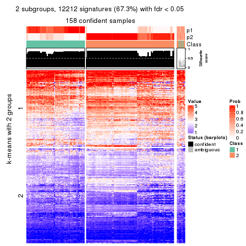</p>

</div>
<div id='tab-ATC-hclust-get-signatures-no-scale-2'>
<pre><code class="r">get_signatures(res, k = 3, scale_rows = FALSE)
</code></pre>

<p></p>

</div>
<div id='tab-ATC-hclust-get-signatures-no-scale-3'>
<pre><code class="r">get_signatures(res, k = 4, scale_rows = FALSE)
</code></pre>

<p></p>

</div>
<div id='tab-ATC-hclust-get-signatures-no-scale-4'>
<pre><code class="r">get_signatures(res, k = 5, scale_rows = FALSE)
</code></pre>

<p></p>

</div>
<div id='tab-ATC-hclust-get-signatures-no-scale-5'>
<pre><code class="r">get_signatures(res, k = 6, scale_rows = FALSE)
</code></pre>

<p></p>

</div>
</div>


Compare the overlap of signatures from different k:

```r
compare_signatures(res)
```


`get_signature()` returns a data frame invisibly. TO get the list of signatures, the function
call should be assigned to a variable explicitly. In following code, if `plot` argument is set
to `FALSE`, no heatmap is plotted while only the differential analysis is performed.

```r
# code only for demonstration
tb = get_signature(res, k = ..., plot = FALSE)
```

An example of the output of `tb` is:

```
#>   which_row         fdr    mean_1    mean_2 scaled_mean_1 scaled_mean_2 km
#> 1        38 0.042760348  8.373488  9.131774    -0.5533452     0.5164555  1
#> 2        40 0.018707592  7.106213  8.469186    -0.6173731     0.5762149  1
#> 3        55 0.019134737 10.221463 11.207825    -0.6159697     0.5749050  1
#> 4        59 0.006059896  5.921854  7.869574    -0.6899429     0.6439467  1
#> 5        60 0.018055526  8.928898 10.211722    -0.6204761     0.5791110  1
#> 6        98 0.009384629 15.714769 14.887706     0.6635654    -0.6193277  2
...
```

The columns in `tb` are:

1. `which_row`: row indices corresponding to the input matrix.
2. `fdr`: FDR for the differential test. 
3. `mean_x`: The mean value in group x.
4. `scaled_mean_x`: The mean value in group x after rows are scaled.
5. `km`: Row groups if k-means clustering is applied to rows.


UMAP plot which shows how samples are separated.


<script>
$( function() {
	$( '#tabs-ATC-hclust-dimension-reduction' ).tabs();
} );
</script>
<div id='tabs-ATC-hclust-dimension-reduction'>
<ul>
<li><a href='#tab-ATC-hclust-dimension-reduction-1'>k = 2</a></li>
<li><a href='#tab-ATC-hclust-dimension-reduction-2'>k = 3</a></li>
<li><a href='#tab-ATC-hclust-dimension-reduction-3'>k = 4</a></li>
<li><a href='#tab-ATC-hclust-dimension-reduction-4'>k = 5</a></li>
<li><a href='#tab-ATC-hclust-dimension-reduction-5'>k = 6</a></li>
</ul>
<div id='tab-ATC-hclust-dimension-reduction-1'>
<pre><code class="r">dimension_reduction(res, k = 2, method = &quot;UMAP&quot;)
</code></pre>

<p></p>

</div>
<div id='tab-ATC-hclust-dimension-reduction-2'>
<pre><code class="r">dimension_reduction(res, k = 3, method = &quot;UMAP&quot;)
</code></pre>

<p></p>

</div>
<div id='tab-ATC-hclust-dimension-reduction-3'>
<pre><code class="r">dimension_reduction(res, k = 4, method = &quot;UMAP&quot;)
</code></pre>

<p></p>

</div>
<div id='tab-ATC-hclust-dimension-reduction-4'>
<pre><code class="r">dimension_reduction(res, k = 5, method = &quot;UMAP&quot;)
</code></pre>

<p></p>

</div>
<div id='tab-ATC-hclust-dimension-reduction-5'>
<pre><code class="r">dimension_reduction(res, k = 6, method = &quot;UMAP&quot;)
</code></pre>

<p></p>

</div>
</div>


Following heatmap shows how subgroups are split when increasing `k`:

```r
collect_classes(res)
```


If matrix rows can be associated to genes, consider to use `functional_enrichment(res,
...)` to perform function enrichment for the signature genes. See [this vignette](http://bioconductor.org/packages/devel/bioc/vignettes/cola/inst/doc/functional_enrichment.html) for more detailed explanations.


 

---------------------------------------------------


### ATC:kmeans**


The object with results only for a single top-value method and a single partition method 
can be extracted as:

```r
res = res_list["ATC", "kmeans"]
# you can also extract it by
# res = res_list["ATC:kmeans"]
```

A summary of `res` and all the functions that can be applied to it:

```r
res
```

```
#> A 'ConsensusPartition' object with k = 2, 3, 4, 5, 6.
#>   On a matrix with 18147 rows and 167 columns.
#>   Top rows (1000, 2000, 3000, 4000, 5000) are extracted by 'ATC' method.
#>   Subgroups are detected by 'kmeans' method.
#>   Performed in total 1250 partitions by row resampling.
#>   Best k for subgroups seems to be 3.
#> 
#> Following methods can be applied to this 'ConsensusPartition' object:
#>  [1] "cola_report"             "collect_classes"         "collect_plots"          
#>  [4] "collect_stats"           "colnames"                "compare_signatures"     
#>  [7] "consensus_heatmap"       "dimension_reduction"     "functional_enrichment"  
#> [10] "get_anno_col"            "get_anno"                "get_classes"            
#> [13] "get_consensus"           "get_matrix"              "get_membership"         
#> [16] "get_param"               "get_signatures"          "get_stats"              
#> [19] "is_best_k"               "is_stable_k"             "membership_heatmap"     
#> [22] "ncol"                    "nrow"                    "plot_ecdf"              
#> [25] "rownames"                "select_partition_number" "show"                   
#> [28] "suggest_best_k"          "test_to_known_factors"
```

`collect_plots()` function collects all the plots made from `res` for all `k` (number of partitions)
into one single page to provide an easy and fast comparison between different `k`.

```r
collect_plots(res)
```


The plots are:

- The first row: a plot of the ECDF (empirical cumulative distribution
  function) curves of the consensus matrix for each `k` and the heatmap of
  predicted classes for each `k`.
- The second row: heatmaps of the consensus matrix for each `k`.
- The third row: heatmaps of the membership matrix for each `k`.
- The fouth row: heatmaps of the signatures for each `k`.

All the plots in panels can be made by individual functions and they are
plotted later in this section.

`select_partition_number()` produces several plots showing different
statistics for choosing "optimized" `k`. There are following statistics:

- ECDF curves of the consensus matrix for each `k`;
- 1-PAC. [The PAC
  score](https://en.wikipedia.org/wiki/Consensus_clustering#Over-interpretation_potential_of_consensus_clustering)
  measures the proportion of the ambiguous subgrouping.
- Mean silhouette score.
- Concordance. The mean probability of fiting the consensus class ids in all
  partitions.
- Area increased. Denote $A_k$ as the area under the ECDF curve for current
  `k`, the area increased is defined as $A_k - A_{k-1}$.
- Rand index. The percent of pairs of samples that are both in a same cluster
  or both are not in a same cluster in the partition of k and k-1.
- Jaccard index. The ratio of pairs of samples are both in a same cluster in
  the partition of k and k-1 and the pairs of samples are both in a same
  cluster in the partition k or k-1.

The detailed explanations of these statistics can be found in [the _cola_
vignette](http://bioconductor.org/packages/devel/bioc/vignettes/cola/inst/doc/cola.html#toc_13).

Generally speaking, lower PAC score, higher mean silhouette score or higher
concordance corresponds to better partition. Rand index and Jaccard index
measure how similar the current partition is compared to partition with `k-1`.
If they are too similar, we won't accept `k` is better than `k-1`.

```r
select_partition_number(res)
```


The numeric values for all these statistics can be obtained by `get_stats()`.

```r
get_stats(res)
```

```
#>   k 1-PAC mean_silhouette concordance area_increased  Rand Jaccard
#> 2 2 0.599           0.932       0.949         0.4568 0.548   0.548
#> 3 3 0.997           0.962       0.976         0.4406 0.785   0.611
#> 4 4 0.879           0.860       0.939         0.1156 0.853   0.613
#> 5 5 0.763           0.695       0.777         0.0676 0.905   0.675
#> 6 6 0.763           0.733       0.809         0.0441 0.908   0.615
```

`suggest_best_k()` suggests the best $k$ based on these statistics. The rules are as follows:

- All $k$ with Jaccard index larger than 0.95 are removed because increasing
  $k$ does not provide enough extra information. If all $k$ are removed, it is
  marked as no subgroup is detected.
- For all $k$ with 1-PAC score larger than 0.9, the maximal $k$ is taken as
  the best $k$, and other $k$ are marked as optional $k$.
- If it does not fit the second rule. The $k$ with the maximal vote of the
  highest 1-PAC score, highest mean silhouette, and highest concordance is
  taken as the best $k$.

```r
suggest_best_k(res)
```

```
#> [1] 3
```


Following shows the table of the partitions (You need to click the **show/hide
code output** link to see it). The membership matrix (columns with name `p*`)
is inferred by
[`clue::cl_consensus()`](https://www.rdocumentation.org/link/cl_consensus?package=clue)
function with the `SE` method. Basically the value in the membership matrix
represents the probability to belong to a certain group. The finall class
label for an item is determined with the group with highest probability it
belongs to.

In `get_classes()` function, the entropy is calculated from the membership
matrix and the silhouette score is calculated from the consensus matrix.


<script>
$( function() {
	$( '#tabs-ATC-kmeans-get-classes' ).tabs();
} );
</script>
<div id='tabs-ATC-kmeans-get-classes'>
<ul>
<li><a href='#tab-ATC-kmeans-get-classes-1'>k = 2</a></li>
<li><a href='#tab-ATC-kmeans-get-classes-2'>k = 3</a></li>
<li><a href='#tab-ATC-kmeans-get-classes-3'>k = 4</a></li>
<li><a href='#tab-ATC-kmeans-get-classes-4'>k = 5</a></li>
<li><a href='#tab-ATC-kmeans-get-classes-5'>k = 6</a></li>
</ul>

<div id='tab-ATC-kmeans-get-classes-1'>
<p><a id='tab-ATC-kmeans-get-classes-1-a' style='color:#0366d6' href='#'>show/hide code output</a></p>
<pre><code class="r">cbind(get_classes(res, k = 2), get_membership(res, k = 2))
</code></pre>

<pre><code>#&gt;            class entropy silhouette    p1    p2
#&gt; SRR1313062     1   0.671      0.878 0.824 0.176
#&gt; SRR1313063     1   0.671      0.878 0.824 0.176
#&gt; SRR1313064     1   0.671      0.878 0.824 0.176
#&gt; SRR1313065     1   0.671      0.878 0.824 0.176
#&gt; SRR1313066     1   0.671      0.878 0.824 0.176
#&gt; SRR1313067     1   0.000      0.917 1.000 0.000
#&gt; SRR1313068     1   0.671      0.878 0.824 0.176
#&gt; SRR1313069     1   0.671      0.878 0.824 0.176
#&gt; SRR1313070     1   0.671      0.878 0.824 0.176
#&gt; SRR1313071     1   0.671      0.878 0.824 0.176
#&gt; SRR1313072     1   0.671      0.878 0.824 0.176
#&gt; SRR1313073     1   0.671      0.878 0.824 0.176
#&gt; SRR1313074     1   0.671      0.878 0.824 0.176
#&gt; SRR1313075     1   0.671      0.878 0.824 0.176
#&gt; SRR1313076     1   0.671      0.878 0.824 0.176
#&gt; SRR1313077     1   0.000      0.917 1.000 0.000
#&gt; SRR1313078     1   0.000      0.917 1.000 0.000
#&gt; SRR1313079     1   0.671      0.878 0.824 0.176
#&gt; SRR1313080     1   0.671      0.878 0.824 0.176
#&gt; SRR1313081     1   0.000      0.917 1.000 0.000
#&gt; SRR1313082     1   0.671      0.878 0.824 0.176
#&gt; SRR1313083     1   0.000      0.917 1.000 0.000
#&gt; SRR1313084     1   0.671      0.878 0.824 0.176
#&gt; SRR1313085     1   0.671      0.878 0.824 0.176
#&gt; SRR1313086     1   0.671      0.878 0.824 0.176
#&gt; SRR1313087     1   0.671      0.878 0.824 0.176
#&gt; SRR1313088     1   0.671      0.878 0.824 0.176
#&gt; SRR1313089     1   0.671      0.878 0.824 0.176
#&gt; SRR1313092     1   0.000      0.917 1.000 0.000
#&gt; SRR1313090     1   0.671      0.878 0.824 0.176
#&gt; SRR1313091     2   0.671      0.781 0.176 0.824
#&gt; SRR1313093     1   0.000      0.917 1.000 0.000
#&gt; SRR1313095     1   0.000      0.917 1.000 0.000
#&gt; SRR1313096     1   0.000      0.917 1.000 0.000
#&gt; SRR1313094     1   0.000      0.917 1.000 0.000
#&gt; SRR1313097     1   0.000      0.917 1.000 0.000
#&gt; SRR1313099     1   0.000      0.917 1.000 0.000
#&gt; SRR1313098     1   0.000      0.917 1.000 0.000
#&gt; SRR1313101     1   0.671      0.878 0.824 0.176
#&gt; SRR1313102     1   0.000      0.917 1.000 0.000
#&gt; SRR1313103     1   0.000      0.917 1.000 0.000
#&gt; SRR1313100     1   0.671      0.878 0.824 0.176
#&gt; SRR1313105     1   0.000      0.917 1.000 0.000
#&gt; SRR1313104     1   0.000      0.917 1.000 0.000
#&gt; SRR1313107     1   0.000      0.917 1.000 0.000
#&gt; SRR1313106     1   0.689      0.870 0.816 0.184
#&gt; SRR1313109     1   0.000      0.917 1.000 0.000
#&gt; SRR1313108     1   0.000      0.917 1.000 0.000
#&gt; SRR1313111     1   0.000      0.917 1.000 0.000
#&gt; SRR1313110     1   0.541      0.891 0.876 0.124
#&gt; SRR1313112     1   0.671      0.878 0.824 0.176
#&gt; SRR1313113     1   0.000      0.917 1.000 0.000
#&gt; SRR1313115     1   0.000      0.917 1.000 0.000
#&gt; SRR1313114     1   0.184      0.911 0.972 0.028
#&gt; SRR1313117     1   0.671      0.878 0.824 0.176
#&gt; SRR1313118     1   0.671      0.878 0.824 0.176
#&gt; SRR1313116     1   0.000      0.917 1.000 0.000
#&gt; SRR1313120     1   0.000      0.917 1.000 0.000
#&gt; SRR1313119     1   0.671      0.878 0.824 0.176
#&gt; SRR1313122     1   0.000      0.917 1.000 0.000
#&gt; SRR1313124     1   0.000      0.917 1.000 0.000
#&gt; SRR1313121     1   0.671      0.878 0.824 0.176
#&gt; SRR1313125     1   0.000      0.917 1.000 0.000
#&gt; SRR1313127     1   0.000      0.917 1.000 0.000
#&gt; SRR1313123     1   0.000      0.917 1.000 0.000
#&gt; SRR1313128     1   0.000      0.917 1.000 0.000
#&gt; SRR1313126     1   0.000      0.917 1.000 0.000
#&gt; SRR1313130     2   0.000      0.996 0.000 1.000
#&gt; SRR1313132     1   0.000      0.917 1.000 0.000
#&gt; SRR1313129     1   0.000      0.917 1.000 0.000
#&gt; SRR1313133     1   0.000      0.917 1.000 0.000
#&gt; SRR1313131     1   0.000      0.917 1.000 0.000
#&gt; SRR1313134     1   0.000      0.917 1.000 0.000
#&gt; SRR1313135     1   0.000      0.917 1.000 0.000
#&gt; SRR1313136     1   0.000      0.917 1.000 0.000
#&gt; SRR1313137     1   0.671      0.878 0.824 0.176
#&gt; SRR1313138     1   0.671      0.878 0.824 0.176
#&gt; SRR1313140     1   0.671      0.878 0.824 0.176
#&gt; SRR1313141     1   0.000      0.917 1.000 0.000
#&gt; SRR1313139     1   0.671      0.878 0.824 0.176
#&gt; SRR1313143     1   0.000      0.917 1.000 0.000
#&gt; SRR1313142     1   0.000      0.917 1.000 0.000
#&gt; SRR1313144     1   0.671      0.878 0.824 0.176
#&gt; SRR1313145     1   0.000      0.917 1.000 0.000
#&gt; SRR1313146     1   0.000      0.917 1.000 0.000
#&gt; SRR1313147     1   0.671      0.878 0.824 0.176
#&gt; SRR1313150     1   0.671      0.878 0.824 0.176
#&gt; SRR1313149     1   0.000      0.917 1.000 0.000
#&gt; SRR1313152     1   0.671      0.878 0.824 0.176
#&gt; SRR1313151     1   0.000      0.917 1.000 0.000
#&gt; SRR1313154     1   0.000      0.917 1.000 0.000
#&gt; SRR1313153     1   0.000      0.917 1.000 0.000
#&gt; SRR1313156     1   0.000      0.917 1.000 0.000
#&gt; SRR1313155     1   0.000      0.917 1.000 0.000
#&gt; SRR1313157     1   0.671      0.878 0.824 0.176
#&gt; SRR1313158     1   0.000      0.917 1.000 0.000
#&gt; SRR1313161     1   0.671      0.878 0.824 0.176
#&gt; SRR1313159     1   0.000      0.917 1.000 0.000
#&gt; SRR1313160     1   0.671      0.878 0.824 0.176
#&gt; SRR1313162     1   0.000      0.917 1.000 0.000
#&gt; SRR1313163     1   0.000      0.917 1.000 0.000
#&gt; SRR1313165     1   0.671      0.878 0.824 0.176
#&gt; SRR1313166     1   0.000      0.917 1.000 0.000
#&gt; SRR1313164     1   0.000      0.917 1.000 0.000
#&gt; SRR1313167     1   0.000      0.917 1.000 0.000
#&gt; SRR1313168     1   0.430      0.899 0.912 0.088
#&gt; SRR1313170     1   0.671      0.878 0.824 0.176
#&gt; SRR1313169     1   0.671      0.878 0.824 0.176
#&gt; SRR1313172     1   0.000      0.917 1.000 0.000
#&gt; SRR1313171     1   0.000      0.917 1.000 0.000
#&gt; SRR1313174     2   0.000      0.996 0.000 1.000
#&gt; SRR1313173     1   0.000      0.917 1.000 0.000
#&gt; SRR1313176     2   0.000      0.996 0.000 1.000
#&gt; SRR1313175     2   0.000      0.996 0.000 1.000
#&gt; SRR1313178     2   0.000      0.996 0.000 1.000
#&gt; SRR1313177     2   0.000      0.996 0.000 1.000
#&gt; SRR1313179     2   0.000      0.996 0.000 1.000
#&gt; SRR1313180     2   0.000      0.996 0.000 1.000
#&gt; SRR1313181     2   0.000      0.996 0.000 1.000
#&gt; SRR1313183     2   0.000      0.996 0.000 1.000
#&gt; SRR1313182     2   0.000      0.996 0.000 1.000
#&gt; SRR1313184     2   0.000      0.996 0.000 1.000
#&gt; SRR1313185     2   0.000      0.996 0.000 1.000
#&gt; SRR1313188     2   0.000      0.996 0.000 1.000
#&gt; SRR1313187     2   0.000      0.996 0.000 1.000
#&gt; SRR1313186     2   0.000      0.996 0.000 1.000
#&gt; SRR1313189     2   0.000      0.996 0.000 1.000
#&gt; SRR1313190     2   0.000      0.996 0.000 1.000
#&gt; SRR1313191     2   0.000      0.996 0.000 1.000
#&gt; SRR1313192     2   0.000      0.996 0.000 1.000
#&gt; SRR1313193     2   0.000      0.996 0.000 1.000
#&gt; SRR1313194     2   0.000      0.996 0.000 1.000
#&gt; SRR1313195     2   0.000      0.996 0.000 1.000
#&gt; SRR1313196     2   0.000      0.996 0.000 1.000
#&gt; SRR1313197     2   0.000      0.996 0.000 1.000
#&gt; SRR1313198     2   0.000      0.996 0.000 1.000
#&gt; SRR1313199     2   0.000      0.996 0.000 1.000
#&gt; SRR1313200     2   0.000      0.996 0.000 1.000
#&gt; SRR1313201     2   0.000      0.996 0.000 1.000
#&gt; SRR1313202     2   0.000      0.996 0.000 1.000
#&gt; SRR1313203     1   0.000      0.917 1.000 0.000
#&gt; SRR1313204     2   0.000      0.996 0.000 1.000
#&gt; SRR1313205     2   0.000      0.996 0.000 1.000
#&gt; SRR1313207     2   0.000      0.996 0.000 1.000
#&gt; SRR1313208     2   0.000      0.996 0.000 1.000
#&gt; SRR1313206     2   0.000      0.996 0.000 1.000
#&gt; SRR1313210     2   0.000      0.996 0.000 1.000
#&gt; SRR1313209     2   0.000      0.996 0.000 1.000
#&gt; SRR1313211     2   0.000      0.996 0.000 1.000
#&gt; SRR1313212     2   0.000      0.996 0.000 1.000
#&gt; SRR1313214     2   0.000      0.996 0.000 1.000
#&gt; SRR1313215     2   0.000      0.996 0.000 1.000
#&gt; SRR1313213     2   0.000      0.996 0.000 1.000
#&gt; SRR1313216     2   0.000      0.996 0.000 1.000
#&gt; SRR1313217     2   0.000      0.996 0.000 1.000
#&gt; SRR1313219     2   0.000      0.996 0.000 1.000
#&gt; SRR1313220     2   0.000      0.996 0.000 1.000
#&gt; SRR1313218     2   0.000      0.996 0.000 1.000
#&gt; SRR1313222     2   0.000      0.996 0.000 1.000
#&gt; SRR1313221     2   0.000      0.996 0.000 1.000
#&gt; SRR1313223     2   0.000      0.996 0.000 1.000
#&gt; SRR1313224     2   0.000      0.996 0.000 1.000
#&gt; SRR1313225     2   0.000      0.996 0.000 1.000
#&gt; SRR1313226     2   0.000      0.996 0.000 1.000
#&gt; SRR1313227     2   0.000      0.996 0.000 1.000
#&gt; SRR1313228     2   0.000      0.996 0.000 1.000
#&gt; SRR1313229     2   0.000      0.996 0.000 1.000
</code></pre>

<script>
$('#tab-ATC-kmeans-get-classes-1-a').parent().next().next().hide();
$('#tab-ATC-kmeans-get-classes-1-a').click(function(){
  $('#tab-ATC-kmeans-get-classes-1-a').parent().next().next().toggle();
  return(false);
});
</script>
</div>

<div id='tab-ATC-kmeans-get-classes-2'>
<p><a id='tab-ATC-kmeans-get-classes-2-a' style='color:#0366d6' href='#'>show/hide code output</a></p>
<pre><code class="r">cbind(get_classes(res, k = 3), get_membership(res, k = 3))
</code></pre>

<pre><code>#&gt;            class entropy silhouette    p1    p2    p3
#&gt; SRR1313062     1  0.1031     1.0000 0.976 0.000 0.024
#&gt; SRR1313063     1  0.1031     1.0000 0.976 0.000 0.024
#&gt; SRR1313064     1  0.1031     1.0000 0.976 0.000 0.024
#&gt; SRR1313065     1  0.1031     1.0000 0.976 0.000 0.024
#&gt; SRR1313066     1  0.1031     1.0000 0.976 0.000 0.024
#&gt; SRR1313067     3  0.6305     0.0805 0.484 0.000 0.516
#&gt; SRR1313068     1  0.1031     1.0000 0.976 0.000 0.024
#&gt; SRR1313069     1  0.1031     1.0000 0.976 0.000 0.024
#&gt; SRR1313070     1  0.1031     1.0000 0.976 0.000 0.024
#&gt; SRR1313071     1  0.1031     1.0000 0.976 0.000 0.024
#&gt; SRR1313072     1  0.1031     1.0000 0.976 0.000 0.024
#&gt; SRR1313073     1  0.1031     1.0000 0.976 0.000 0.024
#&gt; SRR1313074     1  0.1031     1.0000 0.976 0.000 0.024
#&gt; SRR1313075     1  0.1031     1.0000 0.976 0.000 0.024
#&gt; SRR1313076     1  0.1031     1.0000 0.976 0.000 0.024
#&gt; SRR1313077     1  0.1031     1.0000 0.976 0.000 0.024
#&gt; SRR1313078     3  0.0000     0.9649 0.000 0.000 1.000
#&gt; SRR1313079     1  0.1031     1.0000 0.976 0.000 0.024
#&gt; SRR1313080     1  0.1031     1.0000 0.976 0.000 0.024
#&gt; SRR1313081     1  0.1031     1.0000 0.976 0.000 0.024
#&gt; SRR1313082     1  0.1031     1.0000 0.976 0.000 0.024
#&gt; SRR1313083     3  0.6286     0.1517 0.464 0.000 0.536
#&gt; SRR1313084     1  0.1031     1.0000 0.976 0.000 0.024
#&gt; SRR1313085     1  0.1031     1.0000 0.976 0.000 0.024
#&gt; SRR1313086     1  0.1031     1.0000 0.976 0.000 0.024
#&gt; SRR1313087     1  0.1031     1.0000 0.976 0.000 0.024
#&gt; SRR1313088     1  0.1031     1.0000 0.976 0.000 0.024
#&gt; SRR1313089     1  0.1031     1.0000 0.976 0.000 0.024
#&gt; SRR1313092     3  0.0000     0.9649 0.000 0.000 1.000
#&gt; SRR1313090     3  0.6305     0.0809 0.484 0.000 0.516
#&gt; SRR1313091     3  0.3896     0.8325 0.008 0.128 0.864
#&gt; SRR1313093     3  0.0000     0.9649 0.000 0.000 1.000
#&gt; SRR1313095     3  0.0000     0.9649 0.000 0.000 1.000
#&gt; SRR1313096     3  0.0000     0.9649 0.000 0.000 1.000
#&gt; SRR1313094     3  0.0000     0.9649 0.000 0.000 1.000
#&gt; SRR1313097     3  0.0000     0.9649 0.000 0.000 1.000
#&gt; SRR1313099     3  0.0000     0.9649 0.000 0.000 1.000
#&gt; SRR1313098     3  0.0000     0.9649 0.000 0.000 1.000
#&gt; SRR1313101     3  0.0000     0.9649 0.000 0.000 1.000
#&gt; SRR1313102     3  0.0000     0.9649 0.000 0.000 1.000
#&gt; SRR1313103     3  0.0000     0.9649 0.000 0.000 1.000
#&gt; SRR1313100     1  0.1031     1.0000 0.976 0.000 0.024
#&gt; SRR1313105     3  0.0000     0.9649 0.000 0.000 1.000
#&gt; SRR1313104     3  0.0000     0.9649 0.000 0.000 1.000
#&gt; SRR1313107     3  0.0000     0.9649 0.000 0.000 1.000
#&gt; SRR1313106     3  0.3532     0.8575 0.008 0.108 0.884
#&gt; SRR1313109     3  0.0237     0.9612 0.004 0.000 0.996
#&gt; SRR1313108     3  0.0000     0.9649 0.000 0.000 1.000
#&gt; SRR1313111     3  0.0000     0.9649 0.000 0.000 1.000
#&gt; SRR1313110     3  0.2448     0.8980 0.076 0.000 0.924
#&gt; SRR1313112     3  0.0000     0.9649 0.000 0.000 1.000
#&gt; SRR1313113     3  0.0000     0.9649 0.000 0.000 1.000
#&gt; SRR1313115     3  0.0000     0.9649 0.000 0.000 1.000
#&gt; SRR1313114     3  0.2796     0.8817 0.092 0.000 0.908
#&gt; SRR1313117     3  0.0000     0.9649 0.000 0.000 1.000
#&gt; SRR1313118     1  0.1031     1.0000 0.976 0.000 0.024
#&gt; SRR1313116     3  0.0237     0.9612 0.004 0.000 0.996
#&gt; SRR1313120     3  0.0000     0.9649 0.000 0.000 1.000
#&gt; SRR1313119     3  0.3267     0.8554 0.116 0.000 0.884
#&gt; SRR1313122     3  0.0000     0.9649 0.000 0.000 1.000
#&gt; SRR1313124     3  0.0000     0.9649 0.000 0.000 1.000
#&gt; SRR1313121     1  0.1031     1.0000 0.976 0.000 0.024
#&gt; SRR1313125     3  0.0000     0.9649 0.000 0.000 1.000
#&gt; SRR1313127     3  0.0000     0.9649 0.000 0.000 1.000
#&gt; SRR1313123     3  0.0000     0.9649 0.000 0.000 1.000
#&gt; SRR1313128     3  0.0000     0.9649 0.000 0.000 1.000
#&gt; SRR1313126     3  0.0000     0.9649 0.000 0.000 1.000
#&gt; SRR1313130     2  0.0424     0.9906 0.008 0.992 0.000
#&gt; SRR1313132     3  0.0000     0.9649 0.000 0.000 1.000
#&gt; SRR1313129     3  0.0000     0.9649 0.000 0.000 1.000
#&gt; SRR1313133     3  0.0000     0.9649 0.000 0.000 1.000
#&gt; SRR1313131     3  0.0000     0.9649 0.000 0.000 1.000
#&gt; SRR1313134     3  0.0000     0.9649 0.000 0.000 1.000
#&gt; SRR1313135     1  0.1031     1.0000 0.976 0.000 0.024
#&gt; SRR1313136     3  0.0000     0.9649 0.000 0.000 1.000
#&gt; SRR1313137     1  0.1031     1.0000 0.976 0.000 0.024
#&gt; SRR1313138     3  0.5178     0.6601 0.256 0.000 0.744
#&gt; SRR1313140     1  0.1031     1.0000 0.976 0.000 0.024
#&gt; SRR1313141     3  0.0000     0.9649 0.000 0.000 1.000
#&gt; SRR1313139     1  0.1031     1.0000 0.976 0.000 0.024
#&gt; SRR1313143     3  0.0000     0.9649 0.000 0.000 1.000
#&gt; SRR1313142     3  0.0000     0.9649 0.000 0.000 1.000
#&gt; SRR1313144     1  0.1031     1.0000 0.976 0.000 0.024
#&gt; SRR1313145     3  0.0000     0.9649 0.000 0.000 1.000
#&gt; SRR1313146     3  0.0000     0.9649 0.000 0.000 1.000
#&gt; SRR1313147     1  0.1031     1.0000 0.976 0.000 0.024
#&gt; SRR1313150     1  0.1031     1.0000 0.976 0.000 0.024
#&gt; SRR1313149     3  0.0000     0.9649 0.000 0.000 1.000
#&gt; SRR1313152     1  0.1031     1.0000 0.976 0.000 0.024
#&gt; SRR1313151     3  0.0000     0.9649 0.000 0.000 1.000
#&gt; SRR1313154     3  0.0000     0.9649 0.000 0.000 1.000
#&gt; SRR1313153     3  0.0000     0.9649 0.000 0.000 1.000
#&gt; SRR1313156     3  0.0000     0.9649 0.000 0.000 1.000
#&gt; SRR1313155     3  0.0000     0.9649 0.000 0.000 1.000
#&gt; SRR1313157     1  0.1031     1.0000 0.976 0.000 0.024
#&gt; SRR1313158     3  0.0000     0.9649 0.000 0.000 1.000
#&gt; SRR1313161     1  0.1031     1.0000 0.976 0.000 0.024
#&gt; SRR1313159     3  0.0000     0.9649 0.000 0.000 1.000
#&gt; SRR1313160     1  0.1031     1.0000 0.976 0.000 0.024
#&gt; SRR1313162     3  0.0000     0.9649 0.000 0.000 1.000
#&gt; SRR1313163     3  0.0000     0.9649 0.000 0.000 1.000
#&gt; SRR1313165     1  0.1031     1.0000 0.976 0.000 0.024
#&gt; SRR1313166     3  0.0000     0.9649 0.000 0.000 1.000
#&gt; SRR1313164     3  0.0000     0.9649 0.000 0.000 1.000
#&gt; SRR1313167     3  0.2537     0.8940 0.080 0.000 0.920
#&gt; SRR1313168     1  0.1031     1.0000 0.976 0.000 0.024
#&gt; SRR1313170     3  0.0000     0.9649 0.000 0.000 1.000
#&gt; SRR1313169     1  0.1031     1.0000 0.976 0.000 0.024
#&gt; SRR1313172     3  0.0000     0.9649 0.000 0.000 1.000
#&gt; SRR1313171     3  0.0000     0.9649 0.000 0.000 1.000
#&gt; SRR1313174     2  0.0237     0.9908 0.004 0.996 0.000
#&gt; SRR1313173     3  0.0000     0.9649 0.000 0.000 1.000
#&gt; SRR1313176     2  0.0747     0.9909 0.016 0.984 0.000
#&gt; SRR1313175     2  0.0424     0.9906 0.008 0.992 0.000
#&gt; SRR1313178     2  0.0747     0.9909 0.016 0.984 0.000
#&gt; SRR1313177     2  0.0747     0.9909 0.016 0.984 0.000
#&gt; SRR1313179     2  0.0424     0.9906 0.008 0.992 0.000
#&gt; SRR1313180     2  0.0424     0.9906 0.008 0.992 0.000
#&gt; SRR1313181     2  0.0747     0.9909 0.016 0.984 0.000
#&gt; SRR1313183     2  0.0747     0.9909 0.016 0.984 0.000
#&gt; SRR1313182     2  0.0747     0.9909 0.016 0.984 0.000
#&gt; SRR1313184     2  0.0424     0.9906 0.008 0.992 0.000
#&gt; SRR1313185     2  0.0424     0.9906 0.008 0.992 0.000
#&gt; SRR1313188     2  0.0424     0.9906 0.008 0.992 0.000
#&gt; SRR1313187     2  0.0424     0.9906 0.008 0.992 0.000
#&gt; SRR1313186     2  0.0424     0.9906 0.008 0.992 0.000
#&gt; SRR1313189     2  0.0747     0.9909 0.016 0.984 0.000
#&gt; SRR1313190     2  0.0747     0.9909 0.016 0.984 0.000
#&gt; SRR1313191     2  0.0747     0.9909 0.016 0.984 0.000
#&gt; SRR1313192     2  0.0747     0.9909 0.016 0.984 0.000
#&gt; SRR1313193     2  0.0747     0.9909 0.016 0.984 0.000
#&gt; SRR1313194     2  0.0424     0.9906 0.008 0.992 0.000
#&gt; SRR1313195     2  0.0424     0.9906 0.008 0.992 0.000
#&gt; SRR1313196     2  0.0424     0.9906 0.008 0.992 0.000
#&gt; SRR1313197     2  0.0424     0.9906 0.008 0.992 0.000
#&gt; SRR1313198     2  0.0424     0.9906 0.008 0.992 0.000
#&gt; SRR1313199     2  0.0747     0.9909 0.016 0.984 0.000
#&gt; SRR1313200     2  0.0424     0.9906 0.008 0.992 0.000
#&gt; SRR1313201     2  0.0747     0.9909 0.016 0.984 0.000
#&gt; SRR1313202     2  0.0424     0.9906 0.008 0.992 0.000
#&gt; SRR1313203     3  0.0000     0.9649 0.000 0.000 1.000
#&gt; SRR1313204     2  0.0747     0.9909 0.016 0.984 0.000
#&gt; SRR1313205     2  0.0747     0.9909 0.016 0.984 0.000
#&gt; SRR1313207     2  0.0747     0.9909 0.016 0.984 0.000
#&gt; SRR1313208     2  0.0747     0.9909 0.016 0.984 0.000
#&gt; SRR1313206     2  0.0747     0.9909 0.016 0.984 0.000
#&gt; SRR1313210     2  0.0424     0.9906 0.008 0.992 0.000
#&gt; SRR1313209     2  0.0424     0.9906 0.008 0.992 0.000
#&gt; SRR1313211     2  0.0592     0.9910 0.012 0.988 0.000
#&gt; SRR1313212     2  0.0747     0.9909 0.016 0.984 0.000
#&gt; SRR1313214     2  0.0424     0.9906 0.008 0.992 0.000
#&gt; SRR1313215     2  0.0424     0.9906 0.008 0.992 0.000
#&gt; SRR1313213     2  0.0747     0.9909 0.016 0.984 0.000
#&gt; SRR1313216     2  0.0424     0.9906 0.008 0.992 0.000
#&gt; SRR1313217     2  0.0424     0.9906 0.008 0.992 0.000
#&gt; SRR1313219     2  0.0424     0.9906 0.008 0.992 0.000
#&gt; SRR1313220     2  0.0747     0.9909 0.016 0.984 0.000
#&gt; SRR1313218     2  0.0237     0.9908 0.004 0.996 0.000
#&gt; SRR1313222     2  0.0747     0.9909 0.016 0.984 0.000
#&gt; SRR1313221     2  0.0747     0.9909 0.016 0.984 0.000
#&gt; SRR1313223     2  0.0747     0.9909 0.016 0.984 0.000
#&gt; SRR1313224     2  0.0000     0.9909 0.000 1.000 0.000
#&gt; SRR1313225     2  0.0424     0.9906 0.008 0.992 0.000
#&gt; SRR1313226     2  0.0424     0.9906 0.008 0.992 0.000
#&gt; SRR1313227     2  0.0747     0.9909 0.016 0.984 0.000
#&gt; SRR1313228     2  0.0747     0.9909 0.016 0.984 0.000
#&gt; SRR1313229     2  0.0747     0.9909 0.016 0.984 0.000
</code></pre>

<script>
$('#tab-ATC-kmeans-get-classes-2-a').parent().next().next().hide();
$('#tab-ATC-kmeans-get-classes-2-a').click(function(){
  $('#tab-ATC-kmeans-get-classes-2-a').parent().next().next().toggle();
  return(false);
});
</script>
</div>

<div id='tab-ATC-kmeans-get-classes-3'>
<p><a id='tab-ATC-kmeans-get-classes-3-a' style='color:#0366d6' href='#'>show/hide code output</a></p>
<pre><code class="r">cbind(get_classes(res, k = 4), get_membership(res, k = 4))
</code></pre>

<pre><code>#&gt;            class entropy silhouette    p1    p2    p3    p4
#&gt; SRR1313062     4  0.0000     0.9840 0.000 0.000 0.000 1.000
#&gt; SRR1313063     4  0.0000     0.9840 0.000 0.000 0.000 1.000
#&gt; SRR1313064     4  0.0000     0.9840 0.000 0.000 0.000 1.000
#&gt; SRR1313065     4  0.0000     0.9840 0.000 0.000 0.000 1.000
#&gt; SRR1313066     4  0.0000     0.9840 0.000 0.000 0.000 1.000
#&gt; SRR1313067     3  0.3266     0.7486 0.000 0.000 0.832 0.168
#&gt; SRR1313068     4  0.0000     0.9840 0.000 0.000 0.000 1.000
#&gt; SRR1313069     4  0.0000     0.9840 0.000 0.000 0.000 1.000
#&gt; SRR1313070     4  0.0000     0.9840 0.000 0.000 0.000 1.000
#&gt; SRR1313071     4  0.0000     0.9840 0.000 0.000 0.000 1.000
#&gt; SRR1313072     4  0.0000     0.9840 0.000 0.000 0.000 1.000
#&gt; SRR1313073     4  0.0000     0.9840 0.000 0.000 0.000 1.000
#&gt; SRR1313074     4  0.0000     0.9840 0.000 0.000 0.000 1.000
#&gt; SRR1313075     4  0.0000     0.9840 0.000 0.000 0.000 1.000
#&gt; SRR1313076     4  0.0000     0.9840 0.000 0.000 0.000 1.000
#&gt; SRR1313077     4  0.0000     0.9840 0.000 0.000 0.000 1.000
#&gt; SRR1313078     1  0.0000     0.9323 1.000 0.000 0.000 0.000
#&gt; SRR1313079     4  0.0000     0.9840 0.000 0.000 0.000 1.000
#&gt; SRR1313080     4  0.0000     0.9840 0.000 0.000 0.000 1.000
#&gt; SRR1313081     4  0.0000     0.9840 0.000 0.000 0.000 1.000
#&gt; SRR1313082     4  0.0000     0.9840 0.000 0.000 0.000 1.000
#&gt; SRR1313083     3  0.3569     0.7262 0.000 0.000 0.804 0.196
#&gt; SRR1313084     4  0.0000     0.9840 0.000 0.000 0.000 1.000
#&gt; SRR1313085     4  0.0000     0.9840 0.000 0.000 0.000 1.000
#&gt; SRR1313086     4  0.0000     0.9840 0.000 0.000 0.000 1.000
#&gt; SRR1313087     4  0.0000     0.9840 0.000 0.000 0.000 1.000
#&gt; SRR1313088     4  0.0000     0.9840 0.000 0.000 0.000 1.000
#&gt; SRR1313089     4  0.0000     0.9840 0.000 0.000 0.000 1.000
#&gt; SRR1313092     3  0.0000     0.8346 0.000 0.000 1.000 0.000
#&gt; SRR1313090     3  0.0000     0.8346 0.000 0.000 1.000 0.000
#&gt; SRR1313091     3  0.0000     0.8346 0.000 0.000 1.000 0.000
#&gt; SRR1313093     1  0.0000     0.9323 1.000 0.000 0.000 0.000
#&gt; SRR1313095     3  0.0000     0.8346 0.000 0.000 1.000 0.000
#&gt; SRR1313096     1  0.0000     0.9323 1.000 0.000 0.000 0.000
#&gt; SRR1313094     1  0.2281     0.8396 0.904 0.000 0.096 0.000
#&gt; SRR1313097     3  0.0000     0.8346 0.000 0.000 1.000 0.000
#&gt; SRR1313099     1  0.3688     0.7180 0.792 0.000 0.208 0.000
#&gt; SRR1313098     3  0.4356     0.6279 0.292 0.000 0.708 0.000
#&gt; SRR1313101     3  0.0000     0.8346 0.000 0.000 1.000 0.000
#&gt; SRR1313102     3  0.0000     0.8346 0.000 0.000 1.000 0.000
#&gt; SRR1313103     1  0.4277     0.6335 0.720 0.000 0.280 0.000
#&gt; SRR1313100     4  0.0000     0.9840 0.000 0.000 0.000 1.000
#&gt; SRR1313105     1  0.4941     0.3419 0.564 0.000 0.436 0.000
#&gt; SRR1313104     3  0.0000     0.8346 0.000 0.000 1.000 0.000
#&gt; SRR1313107     1  0.0000     0.9323 1.000 0.000 0.000 0.000
#&gt; SRR1313106     3  0.0000     0.8346 0.000 0.000 1.000 0.000
#&gt; SRR1313109     3  0.0000     0.8346 0.000 0.000 1.000 0.000
#&gt; SRR1313108     1  0.0000     0.9323 1.000 0.000 0.000 0.000
#&gt; SRR1313111     3  0.0000     0.8346 0.000 0.000 1.000 0.000
#&gt; SRR1313110     3  0.0000     0.8346 0.000 0.000 1.000 0.000
#&gt; SRR1313112     3  0.0000     0.8346 0.000 0.000 1.000 0.000
#&gt; SRR1313113     3  0.0000     0.8346 0.000 0.000 1.000 0.000
#&gt; SRR1313115     1  0.0000     0.9323 1.000 0.000 0.000 0.000
#&gt; SRR1313114     3  0.0000     0.8346 0.000 0.000 1.000 0.000
#&gt; SRR1313117     3  0.0000     0.8346 0.000 0.000 1.000 0.000
#&gt; SRR1313118     3  0.0000     0.8346 0.000 0.000 1.000 0.000
#&gt; SRR1313116     3  0.0000     0.8346 0.000 0.000 1.000 0.000
#&gt; SRR1313120     1  0.0000     0.9323 1.000 0.000 0.000 0.000
#&gt; SRR1313119     3  0.0000     0.8346 0.000 0.000 1.000 0.000
#&gt; SRR1313122     3  0.0000     0.8346 0.000 0.000 1.000 0.000
#&gt; SRR1313124     3  0.0000     0.8346 0.000 0.000 1.000 0.000
#&gt; SRR1313121     3  0.0000     0.8346 0.000 0.000 1.000 0.000
#&gt; SRR1313125     3  0.0000     0.8346 0.000 0.000 1.000 0.000
#&gt; SRR1313127     3  0.3528     0.7236 0.192 0.000 0.808 0.000
#&gt; SRR1313123     3  0.3486     0.7267 0.188 0.000 0.812 0.000
#&gt; SRR1313128     1  0.0000     0.9323 1.000 0.000 0.000 0.000
#&gt; SRR1313126     3  0.3569     0.7204 0.196 0.000 0.804 0.000
#&gt; SRR1313130     3  0.4967     0.0809 0.000 0.452 0.548 0.000
#&gt; SRR1313132     1  0.0000     0.9323 1.000 0.000 0.000 0.000
#&gt; SRR1313129     3  0.0000     0.8346 0.000 0.000 1.000 0.000
#&gt; SRR1313133     1  0.0000     0.9323 1.000 0.000 0.000 0.000
#&gt; SRR1313131     1  0.0000     0.9323 1.000 0.000 0.000 0.000
#&gt; SRR1313134     1  0.0000     0.9323 1.000 0.000 0.000 0.000
#&gt; SRR1313135     3  0.4948     0.3506 0.000 0.000 0.560 0.440
#&gt; SRR1313136     3  0.4331     0.6333 0.288 0.000 0.712 0.000
#&gt; SRR1313137     3  0.4877     0.4223 0.000 0.000 0.592 0.408
#&gt; SRR1313138     3  0.0000     0.8346 0.000 0.000 1.000 0.000
#&gt; SRR1313140     4  0.0000     0.9840 0.000 0.000 0.000 1.000
#&gt; SRR1313141     1  0.0000     0.9323 1.000 0.000 0.000 0.000
#&gt; SRR1313139     4  0.0000     0.9840 0.000 0.000 0.000 1.000
#&gt; SRR1313143     1  0.0000     0.9323 1.000 0.000 0.000 0.000
#&gt; SRR1313142     3  0.4331     0.6333 0.288 0.000 0.712 0.000
#&gt; SRR1313144     3  0.4961     0.3302 0.000 0.000 0.552 0.448
#&gt; SRR1313145     3  0.4331     0.6333 0.288 0.000 0.712 0.000
#&gt; SRR1313146     3  0.4356     0.6279 0.292 0.000 0.708 0.000
#&gt; SRR1313147     4  0.0000     0.9840 0.000 0.000 0.000 1.000
#&gt; SRR1313150     4  0.0000     0.9840 0.000 0.000 0.000 1.000
#&gt; SRR1313149     1  0.0000     0.9323 1.000 0.000 0.000 0.000
#&gt; SRR1313152     3  0.4948     0.3506 0.000 0.000 0.560 0.440
#&gt; SRR1313151     1  0.4994    -0.1335 0.520 0.000 0.480 0.000
#&gt; SRR1313154     1  0.0000     0.9323 1.000 0.000 0.000 0.000
#&gt; SRR1313153     3  0.4331     0.6333 0.288 0.000 0.712 0.000
#&gt; SRR1313156     3  0.0000     0.8346 0.000 0.000 1.000 0.000
#&gt; SRR1313155     3  0.4331     0.6333 0.288 0.000 0.712 0.000
#&gt; SRR1313157     4  0.4817     0.2049 0.000 0.000 0.388 0.612
#&gt; SRR1313158     3  0.4331     0.6333 0.288 0.000 0.712 0.000
#&gt; SRR1313161     3  0.4948     0.3506 0.000 0.000 0.560 0.440
#&gt; SRR1313159     3  0.0000     0.8346 0.000 0.000 1.000 0.000
#&gt; SRR1313160     3  0.0000     0.8346 0.000 0.000 1.000 0.000
#&gt; SRR1313162     3  0.4331     0.6333 0.288 0.000 0.712 0.000
#&gt; SRR1313163     3  0.0000     0.8346 0.000 0.000 1.000 0.000
#&gt; SRR1313165     3  0.4866     0.4299 0.000 0.000 0.596 0.404
#&gt; SRR1313166     1  0.0000     0.9323 1.000 0.000 0.000 0.000
#&gt; SRR1313164     1  0.0000     0.9323 1.000 0.000 0.000 0.000
#&gt; SRR1313167     3  0.0000     0.8346 0.000 0.000 1.000 0.000
#&gt; SRR1313168     3  0.4304     0.6298 0.000 0.000 0.716 0.284
#&gt; SRR1313170     3  0.0000     0.8346 0.000 0.000 1.000 0.000
#&gt; SRR1313169     3  0.4948     0.3506 0.000 0.000 0.560 0.440
#&gt; SRR1313172     1  0.0188     0.9293 0.996 0.000 0.004 0.000
#&gt; SRR1313171     1  0.0000     0.9323 1.000 0.000 0.000 0.000
#&gt; SRR1313174     2  0.0000     0.9856 0.000 1.000 0.000 0.000
#&gt; SRR1313173     1  0.0000     0.9323 1.000 0.000 0.000 0.000
#&gt; SRR1313176     2  0.0000     0.9856 0.000 1.000 0.000 0.000
#&gt; SRR1313175     2  0.0000     0.9856 0.000 1.000 0.000 0.000
#&gt; SRR1313178     2  0.0000     0.9856 0.000 1.000 0.000 0.000
#&gt; SRR1313177     2  0.0000     0.9856 0.000 1.000 0.000 0.000
#&gt; SRR1313179     2  0.0000     0.9856 0.000 1.000 0.000 0.000
#&gt; SRR1313180     2  0.0000     0.9856 0.000 1.000 0.000 0.000
#&gt; SRR1313181     2  0.0000     0.9856 0.000 1.000 0.000 0.000
#&gt; SRR1313183     2  0.0000     0.9856 0.000 1.000 0.000 0.000
#&gt; SRR1313182     2  0.0000     0.9856 0.000 1.000 0.000 0.000
#&gt; SRR1313184     2  0.0000     0.9856 0.000 1.000 0.000 0.000
#&gt; SRR1313185     2  0.0000     0.9856 0.000 1.000 0.000 0.000
#&gt; SRR1313188     2  0.0000     0.9856 0.000 1.000 0.000 0.000
#&gt; SRR1313187     2  0.0000     0.9856 0.000 1.000 0.000 0.000
#&gt; SRR1313186     2  0.0000     0.9856 0.000 1.000 0.000 0.000
#&gt; SRR1313189     2  0.0000     0.9856 0.000 1.000 0.000 0.000
#&gt; SRR1313190     2  0.0000     0.9856 0.000 1.000 0.000 0.000
#&gt; SRR1313191     2  0.0000     0.9856 0.000 1.000 0.000 0.000
#&gt; SRR1313192     2  0.0000     0.9856 0.000 1.000 0.000 0.000
#&gt; SRR1313193     2  0.0000     0.9856 0.000 1.000 0.000 0.000
#&gt; SRR1313194     2  0.0000     0.9856 0.000 1.000 0.000 0.000
#&gt; SRR1313195     2  0.0000     0.9856 0.000 1.000 0.000 0.000
#&gt; SRR1313196     2  0.0000     0.9856 0.000 1.000 0.000 0.000
#&gt; SRR1313197     2  0.0000     0.9856 0.000 1.000 0.000 0.000
#&gt; SRR1313198     2  0.0000     0.9856 0.000 1.000 0.000 0.000
#&gt; SRR1313199     2  0.0000     0.9856 0.000 1.000 0.000 0.000
#&gt; SRR1313200     2  0.0000     0.9856 0.000 1.000 0.000 0.000
#&gt; SRR1313201     2  0.0000     0.9856 0.000 1.000 0.000 0.000
#&gt; SRR1313202     2  0.0000     0.9856 0.000 1.000 0.000 0.000
#&gt; SRR1313203     3  0.4643     0.3169 0.344 0.000 0.656 0.000
#&gt; SRR1313204     2  0.0000     0.9856 0.000 1.000 0.000 0.000
#&gt; SRR1313205     2  0.0000     0.9856 0.000 1.000 0.000 0.000
#&gt; SRR1313207     2  0.0000     0.9856 0.000 1.000 0.000 0.000
#&gt; SRR1313208     2  0.0000     0.9856 0.000 1.000 0.000 0.000
#&gt; SRR1313206     2  0.0000     0.9856 0.000 1.000 0.000 0.000
#&gt; SRR1313210     2  0.0000     0.9856 0.000 1.000 0.000 0.000
#&gt; SRR1313209     2  0.0000     0.9856 0.000 1.000 0.000 0.000
#&gt; SRR1313211     2  0.0000     0.9856 0.000 1.000 0.000 0.000
#&gt; SRR1313212     2  0.0000     0.9856 0.000 1.000 0.000 0.000
#&gt; SRR1313214     2  0.0000     0.9856 0.000 1.000 0.000 0.000
#&gt; SRR1313215     2  0.0000     0.9856 0.000 1.000 0.000 0.000
#&gt; SRR1313213     2  0.0000     0.9856 0.000 1.000 0.000 0.000
#&gt; SRR1313216     2  0.4925     0.3089 0.000 0.572 0.428 0.000
#&gt; SRR1313217     2  0.0000     0.9856 0.000 1.000 0.000 0.000
#&gt; SRR1313219     2  0.0000     0.9856 0.000 1.000 0.000 0.000
#&gt; SRR1313220     2  0.0000     0.9856 0.000 1.000 0.000 0.000
#&gt; SRR1313218     2  0.0000     0.9856 0.000 1.000 0.000 0.000
#&gt; SRR1313222     2  0.0000     0.9856 0.000 1.000 0.000 0.000
#&gt; SRR1313221     2  0.0000     0.9856 0.000 1.000 0.000 0.000
#&gt; SRR1313223     2  0.0000     0.9856 0.000 1.000 0.000 0.000
#&gt; SRR1313224     2  0.0000     0.9856 0.000 1.000 0.000 0.000
#&gt; SRR1313225     2  0.0000     0.9856 0.000 1.000 0.000 0.000
#&gt; SRR1313226     2  0.4356     0.6127 0.000 0.708 0.292 0.000
#&gt; SRR1313227     2  0.0000     0.9856 0.000 1.000 0.000 0.000
#&gt; SRR1313228     2  0.0000     0.9856 0.000 1.000 0.000 0.000
#&gt; SRR1313229     2  0.0000     0.9856 0.000 1.000 0.000 0.000
</code></pre>

<script>
$('#tab-ATC-kmeans-get-classes-3-a').parent().next().next().hide();
$('#tab-ATC-kmeans-get-classes-3-a').click(function(){
  $('#tab-ATC-kmeans-get-classes-3-a').parent().next().next().toggle();
  return(false);
});
</script>
</div>

<div id='tab-ATC-kmeans-get-classes-4'>
<p><a id='tab-ATC-kmeans-get-classes-4-a' style='color:#0366d6' href='#'>show/hide code output</a></p>
<pre><code class="r">cbind(get_classes(res, k = 5), get_membership(res, k = 5))
</code></pre>

<pre><code>#&gt;            class entropy silhouette    p1    p2    p3    p4    p5
#&gt; SRR1313062     4  0.0162    0.91812 0.004 0.000 0.000 0.996 0.000
#&gt; SRR1313063     4  0.0000    0.91892 0.000 0.000 0.000 1.000 0.000
#&gt; SRR1313064     4  0.0000    0.91892 0.000 0.000 0.000 1.000 0.000
#&gt; SRR1313065     4  0.4015    0.53613 0.348 0.000 0.000 0.652 0.000
#&gt; SRR1313066     4  0.0510    0.91310 0.016 0.000 0.000 0.984 0.000
#&gt; SRR1313067     1  0.3507    0.57590 0.828 0.000 0.120 0.052 0.000
#&gt; SRR1313068     4  0.1341    0.89131 0.056 0.000 0.000 0.944 0.000
#&gt; SRR1313069     4  0.0000    0.91892 0.000 0.000 0.000 1.000 0.000
#&gt; SRR1313070     4  0.0000    0.91892 0.000 0.000 0.000 1.000 0.000
#&gt; SRR1313071     4  0.0000    0.91892 0.000 0.000 0.000 1.000 0.000
#&gt; SRR1313072     4  0.0000    0.91892 0.000 0.000 0.000 1.000 0.000
#&gt; SRR1313073     4  0.0000    0.91892 0.000 0.000 0.000 1.000 0.000
#&gt; SRR1313074     4  0.0000    0.91892 0.000 0.000 0.000 1.000 0.000
#&gt; SRR1313075     4  0.0000    0.91892 0.000 0.000 0.000 1.000 0.000
#&gt; SRR1313076     4  0.0162    0.91812 0.004 0.000 0.000 0.996 0.000
#&gt; SRR1313077     4  0.3561    0.65242 0.260 0.000 0.000 0.740 0.000
#&gt; SRR1313078     5  0.0290    0.94623 0.008 0.000 0.000 0.000 0.992
#&gt; SRR1313079     4  0.0000    0.91892 0.000 0.000 0.000 1.000 0.000
#&gt; SRR1313080     4  0.1544    0.88354 0.068 0.000 0.000 0.932 0.000
#&gt; SRR1313081     1  0.4306   -0.17923 0.508 0.000 0.000 0.492 0.000
#&gt; SRR1313082     4  0.2966    0.78146 0.184 0.000 0.000 0.816 0.000
#&gt; SRR1313083     1  0.1851    0.65683 0.912 0.000 0.000 0.088 0.000
#&gt; SRR1313084     4  0.0000    0.91892 0.000 0.000 0.000 1.000 0.000
#&gt; SRR1313085     4  0.0000    0.91892 0.000 0.000 0.000 1.000 0.000
#&gt; SRR1313086     4  0.0162    0.91812 0.004 0.000 0.000 0.996 0.000
#&gt; SRR1313087     4  0.0000    0.91892 0.000 0.000 0.000 1.000 0.000
#&gt; SRR1313088     4  0.0000    0.91892 0.000 0.000 0.000 1.000 0.000
#&gt; SRR1313089     4  0.0510    0.91310 0.016 0.000 0.000 0.984 0.000
#&gt; SRR1313092     3  0.4632    0.68024 0.448 0.000 0.540 0.000 0.012
#&gt; SRR1313090     1  0.4138   -0.35018 0.616 0.000 0.384 0.000 0.000
#&gt; SRR1313091     3  0.4161    0.67281 0.392 0.000 0.608 0.000 0.000
#&gt; SRR1313093     5  0.0162    0.95043 0.000 0.000 0.004 0.000 0.996
#&gt; SRR1313095     1  0.3452    0.31277 0.756 0.000 0.244 0.000 0.000
#&gt; SRR1313096     5  0.0000    0.95014 0.000 0.000 0.000 0.000 1.000
#&gt; SRR1313094     5  0.5501   -0.00985 0.064 0.000 0.444 0.000 0.492
#&gt; SRR1313097     3  0.4262    0.69856 0.440 0.000 0.560 0.000 0.000
#&gt; SRR1313099     3  0.5766    0.23748 0.092 0.000 0.516 0.000 0.392
#&gt; SRR1313098     1  0.5602    0.44158 0.636 0.000 0.216 0.000 0.148
#&gt; SRR1313101     3  0.4262    0.69782 0.440 0.000 0.560 0.000 0.000
#&gt; SRR1313102     3  0.4262    0.69856 0.440 0.000 0.560 0.000 0.000
#&gt; SRR1313103     3  0.5930    0.29341 0.112 0.000 0.516 0.000 0.372
#&gt; SRR1313100     4  0.2516    0.82585 0.140 0.000 0.000 0.860 0.000
#&gt; SRR1313105     3  0.6000    0.38806 0.132 0.000 0.540 0.000 0.328
#&gt; SRR1313104     3  0.4708    0.68665 0.436 0.000 0.548 0.000 0.016
#&gt; SRR1313107     5  0.2230    0.87815 0.044 0.000 0.044 0.000 0.912
#&gt; SRR1313106     3  0.2127    0.42828 0.108 0.000 0.892 0.000 0.000
#&gt; SRR1313109     3  0.4497    0.69855 0.424 0.000 0.568 0.000 0.008
#&gt; SRR1313108     5  0.0162    0.95043 0.000 0.000 0.004 0.000 0.996
#&gt; SRR1313111     3  0.4604    0.69681 0.428 0.000 0.560 0.000 0.012
#&gt; SRR1313110     1  0.2929    0.41084 0.820 0.000 0.180 0.000 0.000
#&gt; SRR1313112     3  0.4262    0.69782 0.440 0.000 0.560 0.000 0.000
#&gt; SRR1313113     3  0.4604    0.69681 0.428 0.000 0.560 0.000 0.012
#&gt; SRR1313115     5  0.0162    0.95043 0.000 0.000 0.004 0.000 0.996
#&gt; SRR1313114     1  0.1792    0.57343 0.916 0.000 0.084 0.000 0.000
#&gt; SRR1313117     3  0.4268    0.69532 0.444 0.000 0.556 0.000 0.000
#&gt; SRR1313118     1  0.1270    0.60120 0.948 0.000 0.052 0.000 0.000
#&gt; SRR1313116     3  0.4249    0.69977 0.432 0.000 0.568 0.000 0.000
#&gt; SRR1313120     5  0.0955    0.93319 0.004 0.000 0.028 0.000 0.968
#&gt; SRR1313119     1  0.4278   -0.52373 0.548 0.000 0.452 0.000 0.000
#&gt; SRR1313122     3  0.4268    0.69511 0.444 0.000 0.556 0.000 0.000
#&gt; SRR1313124     3  0.4287    0.67479 0.460 0.000 0.540 0.000 0.000
#&gt; SRR1313121     1  0.4288   -0.34032 0.612 0.000 0.384 0.004 0.000
#&gt; SRR1313125     3  0.4294    0.66043 0.468 0.000 0.532 0.000 0.000
#&gt; SRR1313127     1  0.3390    0.59498 0.840 0.000 0.100 0.000 0.060
#&gt; SRR1313123     1  0.4180    0.33965 0.744 0.000 0.220 0.000 0.036
#&gt; SRR1313128     5  0.0000    0.95014 0.000 0.000 0.000 0.000 1.000
#&gt; SRR1313126     1  0.2927    0.64650 0.868 0.000 0.040 0.000 0.092
#&gt; SRR1313130     3  0.1952    0.24935 0.004 0.084 0.912 0.000 0.000
#&gt; SRR1313132     5  0.0880    0.92867 0.000 0.000 0.032 0.000 0.968
#&gt; SRR1313129     3  0.4256    0.69926 0.436 0.000 0.564 0.000 0.000
#&gt; SRR1313133     5  0.0000    0.95014 0.000 0.000 0.000 0.000 1.000
#&gt; SRR1313131     5  0.0162    0.95043 0.000 0.000 0.004 0.000 0.996
#&gt; SRR1313134     5  0.0162    0.95043 0.000 0.000 0.004 0.000 0.996
#&gt; SRR1313135     1  0.2813    0.63571 0.832 0.000 0.000 0.168 0.000
#&gt; SRR1313136     1  0.4394    0.61210 0.764 0.000 0.100 0.000 0.136
#&gt; SRR1313137     1  0.2843    0.64593 0.848 0.000 0.008 0.144 0.000
#&gt; SRR1313138     1  0.2891    0.40854 0.824 0.000 0.176 0.000 0.000
#&gt; SRR1313140     1  0.4287   -0.09339 0.540 0.000 0.000 0.460 0.000
#&gt; SRR1313141     5  0.0000    0.95014 0.000 0.000 0.000 0.000 1.000
#&gt; SRR1313139     4  0.4235    0.37976 0.424 0.000 0.000 0.576 0.000
#&gt; SRR1313143     5  0.0000    0.95014 0.000 0.000 0.000 0.000 1.000
#&gt; SRR1313142     1  0.4478    0.60614 0.756 0.000 0.100 0.000 0.144
#&gt; SRR1313144     1  0.3171    0.63056 0.816 0.000 0.008 0.176 0.000
#&gt; SRR1313145     1  0.4478    0.60614 0.756 0.000 0.100 0.000 0.144
#&gt; SRR1313146     1  0.4519    0.60480 0.752 0.000 0.100 0.000 0.148
#&gt; SRR1313147     1  0.4262   -0.02910 0.560 0.000 0.000 0.440 0.000
#&gt; SRR1313150     4  0.4242    0.37151 0.428 0.000 0.000 0.572 0.000
#&gt; SRR1313149     5  0.0000    0.95014 0.000 0.000 0.000 0.000 1.000
#&gt; SRR1313152     1  0.3093    0.63596 0.824 0.000 0.008 0.168 0.000
#&gt; SRR1313151     1  0.4763    0.56474 0.712 0.000 0.076 0.000 0.212
#&gt; SRR1313154     5  0.3477    0.78418 0.112 0.000 0.056 0.000 0.832
#&gt; SRR1313153     1  0.4343    0.61451 0.768 0.000 0.096 0.000 0.136
#&gt; SRR1313156     3  0.4731    0.66517 0.456 0.000 0.528 0.000 0.016
#&gt; SRR1313155     1  0.4478    0.60614 0.756 0.000 0.100 0.000 0.144
#&gt; SRR1313157     1  0.3642    0.56784 0.760 0.000 0.008 0.232 0.000
#&gt; SRR1313158     1  0.4266    0.60344 0.776 0.000 0.104 0.000 0.120
#&gt; SRR1313161     1  0.3093    0.63596 0.824 0.000 0.008 0.168 0.000
#&gt; SRR1313159     3  0.4273    0.69090 0.448 0.000 0.552 0.000 0.000
#&gt; SRR1313160     1  0.0798    0.63892 0.976 0.000 0.008 0.016 0.000
#&gt; SRR1313162     1  0.4394    0.61210 0.764 0.000 0.100 0.000 0.136
#&gt; SRR1313163     1  0.2471    0.54105 0.864 0.000 0.136 0.000 0.000
#&gt; SRR1313165     1  0.2798    0.64719 0.852 0.000 0.008 0.140 0.000
#&gt; SRR1313166     5  0.0290    0.94623 0.008 0.000 0.000 0.000 0.992
#&gt; SRR1313164     5  0.0290    0.94907 0.000 0.000 0.008 0.000 0.992
#&gt; SRR1313167     1  0.0404    0.62910 0.988 0.000 0.012 0.000 0.000
#&gt; SRR1313168     1  0.2304    0.65521 0.892 0.000 0.008 0.100 0.000
#&gt; SRR1313170     3  0.4262    0.69782 0.440 0.000 0.560 0.000 0.000
#&gt; SRR1313169     1  0.3093    0.63596 0.824 0.000 0.008 0.168 0.000
#&gt; SRR1313172     5  0.2304    0.87335 0.048 0.000 0.044 0.000 0.908
#&gt; SRR1313171     5  0.0162    0.95043 0.000 0.000 0.004 0.000 0.996
#&gt; SRR1313174     2  0.3999    0.77694 0.000 0.656 0.344 0.000 0.000
#&gt; SRR1313173     5  0.0162    0.95043 0.000 0.000 0.004 0.000 0.996
#&gt; SRR1313176     2  0.0000    0.81153 0.000 1.000 0.000 0.000 0.000
#&gt; SRR1313175     2  0.4256    0.75336 0.000 0.564 0.436 0.000 0.000
#&gt; SRR1313178     2  0.0000    0.81153 0.000 1.000 0.000 0.000 0.000
#&gt; SRR1313177     2  0.0000    0.81153 0.000 1.000 0.000 0.000 0.000
#&gt; SRR1313179     2  0.4273    0.74614 0.000 0.552 0.448 0.000 0.000
#&gt; SRR1313180     2  0.4273    0.74614 0.000 0.552 0.448 0.000 0.000
#&gt; SRR1313181     2  0.0000    0.81153 0.000 1.000 0.000 0.000 0.000
#&gt; SRR1313183     2  0.0000    0.81153 0.000 1.000 0.000 0.000 0.000
#&gt; SRR1313182     2  0.1270    0.81080 0.000 0.948 0.052 0.000 0.000
#&gt; SRR1313184     2  0.4273    0.74614 0.000 0.552 0.448 0.000 0.000
#&gt; SRR1313185     2  0.3480    0.79317 0.000 0.752 0.248 0.000 0.000
#&gt; SRR1313188     2  0.4268    0.74875 0.000 0.556 0.444 0.000 0.000
#&gt; SRR1313187     2  0.4268    0.74875 0.000 0.556 0.444 0.000 0.000
#&gt; SRR1313186     2  0.3876    0.78252 0.000 0.684 0.316 0.000 0.000
#&gt; SRR1313189     2  0.0000    0.81153 0.000 1.000 0.000 0.000 0.000
#&gt; SRR1313190     2  0.0000    0.81153 0.000 1.000 0.000 0.000 0.000
#&gt; SRR1313191     2  0.1270    0.81080 0.000 0.948 0.052 0.000 0.000
#&gt; SRR1313192     2  0.0000    0.81153 0.000 1.000 0.000 0.000 0.000
#&gt; SRR1313193     2  0.0000    0.81153 0.000 1.000 0.000 0.000 0.000
#&gt; SRR1313194     2  0.4273    0.74614 0.000 0.552 0.448 0.000 0.000
#&gt; SRR1313195     2  0.4273    0.74614 0.000 0.552 0.448 0.000 0.000
#&gt; SRR1313196     2  0.4273    0.74614 0.000 0.552 0.448 0.000 0.000
#&gt; SRR1313197     2  0.4242    0.75659 0.000 0.572 0.428 0.000 0.000
#&gt; SRR1313198     2  0.4249    0.75516 0.000 0.568 0.432 0.000 0.000
#&gt; SRR1313199     2  0.0000    0.81153 0.000 1.000 0.000 0.000 0.000
#&gt; SRR1313200     2  0.4256    0.75336 0.000 0.564 0.436 0.000 0.000
#&gt; SRR1313201     2  0.0000    0.81153 0.000 1.000 0.000 0.000 0.000
#&gt; SRR1313202     2  0.4273    0.74614 0.000 0.552 0.448 0.000 0.000
#&gt; SRR1313203     3  0.6080    0.55575 0.272 0.000 0.560 0.000 0.168
#&gt; SRR1313204     2  0.0000    0.81153 0.000 1.000 0.000 0.000 0.000
#&gt; SRR1313205     2  0.0000    0.81153 0.000 1.000 0.000 0.000 0.000
#&gt; SRR1313207     2  0.0000    0.81153 0.000 1.000 0.000 0.000 0.000
#&gt; SRR1313208     2  0.0000    0.81153 0.000 1.000 0.000 0.000 0.000
#&gt; SRR1313206     2  0.0000    0.81153 0.000 1.000 0.000 0.000 0.000
#&gt; SRR1313210     2  0.4256    0.75336 0.000 0.564 0.436 0.000 0.000
#&gt; SRR1313209     2  0.4235    0.75790 0.000 0.576 0.424 0.000 0.000
#&gt; SRR1313211     2  0.2074    0.80799 0.000 0.896 0.104 0.000 0.000
#&gt; SRR1313212     2  0.0000    0.81153 0.000 1.000 0.000 0.000 0.000
#&gt; SRR1313214     2  0.4235    0.75790 0.000 0.576 0.424 0.000 0.000
#&gt; SRR1313215     2  0.4249    0.75516 0.000 0.568 0.432 0.000 0.000
#&gt; SRR1313213     2  0.0000    0.81153 0.000 1.000 0.000 0.000 0.000
#&gt; SRR1313216     3  0.0609    0.34179 0.000 0.020 0.980 0.000 0.000
#&gt; SRR1313217     2  0.4256    0.75336 0.000 0.564 0.436 0.000 0.000
#&gt; SRR1313219     2  0.4249    0.75516 0.000 0.568 0.432 0.000 0.000
#&gt; SRR1313220     2  0.0000    0.81153 0.000 1.000 0.000 0.000 0.000
#&gt; SRR1313218     2  0.3707    0.78771 0.000 0.716 0.284 0.000 0.000
#&gt; SRR1313222     2  0.0000    0.81153 0.000 1.000 0.000 0.000 0.000
#&gt; SRR1313221     2  0.0000    0.81153 0.000 1.000 0.000 0.000 0.000
#&gt; SRR1313223     2  0.0000    0.81153 0.000 1.000 0.000 0.000 0.000
#&gt; SRR1313224     2  0.3395    0.79483 0.000 0.764 0.236 0.000 0.000
#&gt; SRR1313225     2  0.4249    0.75516 0.000 0.568 0.432 0.000 0.000
#&gt; SRR1313226     3  0.4341   -0.57422 0.004 0.404 0.592 0.000 0.000
#&gt; SRR1313227     2  0.0000    0.81153 0.000 1.000 0.000 0.000 0.000
#&gt; SRR1313228     2  0.0000    0.81153 0.000 1.000 0.000 0.000 0.000
#&gt; SRR1313229     2  0.0000    0.81153 0.000 1.000 0.000 0.000 0.000
</code></pre>

<script>
$('#tab-ATC-kmeans-get-classes-4-a').parent().next().next().hide();
$('#tab-ATC-kmeans-get-classes-4-a').click(function(){
  $('#tab-ATC-kmeans-get-classes-4-a').parent().next().next().toggle();
  return(false);
});
</script>
</div>

<div id='tab-ATC-kmeans-get-classes-5'>
<p><a id='tab-ATC-kmeans-get-classes-5-a' style='color:#0366d6' href='#'>show/hide code output</a></p>
<pre><code class="r">cbind(get_classes(res, k = 6), get_membership(res, k = 6))
</code></pre>

<pre><code>#&gt;            class entropy silhouette    p1    p2    p3    p4    p5    p6
#&gt; SRR1313062     4  0.1745      0.883 0.020 0.000 0.000 0.924 0.056 0.000
#&gt; SRR1313063     4  0.1462      0.882 0.008 0.000 0.000 0.936 0.056 0.000
#&gt; SRR1313064     4  0.0000      0.896 0.000 0.000 0.000 1.000 0.000 0.000
#&gt; SRR1313065     1  0.5562      0.158 0.532 0.000 0.000 0.300 0.168 0.000
#&gt; SRR1313066     4  0.2790      0.845 0.024 0.000 0.000 0.844 0.132 0.000
#&gt; SRR1313067     1  0.5357      0.555 0.608 0.000 0.208 0.004 0.180 0.000
#&gt; SRR1313068     4  0.4354      0.751 0.132 0.000 0.000 0.724 0.144 0.000
#&gt; SRR1313069     4  0.0363      0.895 0.000 0.000 0.000 0.988 0.012 0.000
#&gt; SRR1313070     4  0.0146      0.896 0.000 0.000 0.000 0.996 0.004 0.000
#&gt; SRR1313071     4  0.0146      0.896 0.000 0.000 0.000 0.996 0.004 0.000
#&gt; SRR1313072     4  0.0146      0.896 0.000 0.000 0.000 0.996 0.004 0.000
#&gt; SRR1313073     4  0.0363      0.895 0.000 0.000 0.000 0.988 0.012 0.000
#&gt; SRR1313074     4  0.0363      0.895 0.000 0.000 0.000 0.988 0.012 0.000
#&gt; SRR1313075     4  0.0000      0.896 0.000 0.000 0.000 1.000 0.000 0.000
#&gt; SRR1313076     4  0.1745      0.883 0.020 0.000 0.000 0.924 0.056 0.000
#&gt; SRR1313077     4  0.5246      0.213 0.416 0.000 0.000 0.488 0.096 0.000
#&gt; SRR1313078     6  0.1644      0.877 0.000 0.000 0.004 0.000 0.076 0.920
#&gt; SRR1313079     4  0.0000      0.896 0.000 0.000 0.000 1.000 0.000 0.000
#&gt; SRR1313080     4  0.4603      0.721 0.156 0.000 0.000 0.696 0.148 0.000
#&gt; SRR1313081     1  0.4039      0.588 0.752 0.000 0.000 0.156 0.092 0.000
#&gt; SRR1313082     4  0.5116      0.467 0.344 0.000 0.000 0.560 0.096 0.000
#&gt; SRR1313083     1  0.2834      0.731 0.864 0.000 0.096 0.020 0.020 0.000
#&gt; SRR1313084     4  0.0622      0.892 0.012 0.000 0.000 0.980 0.008 0.000
#&gt; SRR1313085     4  0.0146      0.896 0.000 0.000 0.000 0.996 0.004 0.000
#&gt; SRR1313086     4  0.1492      0.883 0.036 0.000 0.000 0.940 0.024 0.000
#&gt; SRR1313087     4  0.0000      0.896 0.000 0.000 0.000 1.000 0.000 0.000
#&gt; SRR1313088     4  0.0363      0.895 0.000 0.000 0.000 0.988 0.012 0.000
#&gt; SRR1313089     4  0.2748      0.847 0.024 0.000 0.000 0.848 0.128 0.000
#&gt; SRR1313092     3  0.1370      0.800 0.012 0.000 0.948 0.000 0.036 0.004
#&gt; SRR1313090     3  0.5279      0.270 0.336 0.000 0.548 0.000 0.116 0.000
#&gt; SRR1313091     3  0.0632      0.815 0.000 0.000 0.976 0.000 0.024 0.000
#&gt; SRR1313093     6  0.0260      0.920 0.000 0.000 0.008 0.000 0.000 0.992
#&gt; SRR1313095     3  0.5153     -0.249 0.452 0.000 0.464 0.000 0.084 0.000
#&gt; SRR1313096     6  0.0000      0.920 0.000 0.000 0.000 0.000 0.000 1.000
#&gt; SRR1313094     3  0.2915      0.672 0.000 0.000 0.808 0.000 0.008 0.184
#&gt; SRR1313097     3  0.0405      0.818 0.008 0.000 0.988 0.000 0.004 0.000
#&gt; SRR1313099     3  0.2513      0.723 0.000 0.000 0.852 0.000 0.008 0.140
#&gt; SRR1313098     1  0.7112      0.367 0.372 0.000 0.360 0.000 0.132 0.136
#&gt; SRR1313101     3  0.2263      0.792 0.048 0.000 0.896 0.000 0.056 0.000
#&gt; SRR1313102     3  0.1003      0.815 0.016 0.000 0.964 0.000 0.020 0.000
#&gt; SRR1313103     3  0.2431      0.733 0.000 0.000 0.860 0.000 0.008 0.132
#&gt; SRR1313100     4  0.5667      0.401 0.340 0.000 0.000 0.492 0.168 0.000
#&gt; SRR1313105     3  0.1918      0.768 0.000 0.000 0.904 0.000 0.008 0.088
#&gt; SRR1313104     3  0.0622      0.815 0.000 0.000 0.980 0.000 0.008 0.012
#&gt; SRR1313107     6  0.2882      0.791 0.000 0.000 0.180 0.000 0.008 0.812
#&gt; SRR1313106     3  0.3468      0.642 0.008 0.000 0.728 0.000 0.264 0.000
#&gt; SRR1313109     3  0.0520      0.816 0.000 0.000 0.984 0.000 0.008 0.008
#&gt; SRR1313108     6  0.0260      0.920 0.000 0.000 0.008 0.000 0.000 0.992
#&gt; SRR1313111     3  0.0405      0.816 0.000 0.000 0.988 0.000 0.008 0.004
#&gt; SRR1313110     1  0.4822      0.460 0.596 0.000 0.332 0.000 0.072 0.000
#&gt; SRR1313112     3  0.2129      0.797 0.040 0.000 0.904 0.000 0.056 0.000
#&gt; SRR1313113     3  0.0520      0.816 0.000 0.000 0.984 0.000 0.008 0.008
#&gt; SRR1313115     6  0.0260      0.920 0.000 0.000 0.008 0.000 0.000 0.992
#&gt; SRR1313114     1  0.4215      0.614 0.700 0.000 0.244 0.000 0.056 0.000
#&gt; SRR1313117     3  0.2129      0.797 0.040 0.000 0.904 0.000 0.056 0.000
#&gt; SRR1313118     1  0.4026      0.663 0.752 0.000 0.160 0.000 0.088 0.000
#&gt; SRR1313116     3  0.0363      0.817 0.000 0.000 0.988 0.000 0.012 0.000
#&gt; SRR1313120     6  0.2778      0.806 0.000 0.000 0.168 0.000 0.008 0.824
#&gt; SRR1313119     3  0.4418      0.587 0.192 0.000 0.708 0.000 0.100 0.000
#&gt; SRR1313122     3  0.1745      0.805 0.020 0.000 0.924 0.000 0.056 0.000
#&gt; SRR1313124     3  0.1908      0.802 0.028 0.000 0.916 0.000 0.056 0.000
#&gt; SRR1313121     3  0.5386      0.191 0.368 0.000 0.512 0.000 0.120 0.000
#&gt; SRR1313125     3  0.2568      0.776 0.068 0.000 0.876 0.000 0.056 0.000
#&gt; SRR1313127     1  0.5948      0.600 0.560 0.000 0.272 0.000 0.132 0.036
#&gt; SRR1313123     3  0.6107     -0.313 0.392 0.000 0.448 0.000 0.132 0.028
#&gt; SRR1313128     6  0.0291      0.917 0.000 0.000 0.004 0.000 0.004 0.992
#&gt; SRR1313126     1  0.5454      0.657 0.644 0.000 0.204 0.000 0.116 0.036
#&gt; SRR1313130     5  0.4267      0.463 0.004 0.044 0.260 0.000 0.692 0.000
#&gt; SRR1313132     6  0.3845      0.775 0.000 0.000 0.140 0.000 0.088 0.772
#&gt; SRR1313129     3  0.0260      0.817 0.008 0.000 0.992 0.000 0.000 0.000
#&gt; SRR1313133     6  0.0000      0.920 0.000 0.000 0.000 0.000 0.000 1.000
#&gt; SRR1313131     6  0.0405      0.920 0.000 0.000 0.008 0.000 0.004 0.988
#&gt; SRR1313134     6  0.0405      0.920 0.000 0.000 0.008 0.000 0.004 0.988
#&gt; SRR1313135     1  0.3103      0.733 0.856 0.000 0.076 0.044 0.024 0.000
#&gt; SRR1313136     1  0.6624      0.600 0.528 0.000 0.228 0.000 0.132 0.112
#&gt; SRR1313137     1  0.2433      0.731 0.884 0.000 0.072 0.044 0.000 0.000
#&gt; SRR1313138     1  0.4548      0.503 0.632 0.000 0.312 0.000 0.056 0.000
#&gt; SRR1313140     1  0.2489      0.662 0.860 0.000 0.000 0.128 0.012 0.000
#&gt; SRR1313141     6  0.0000      0.920 0.000 0.000 0.000 0.000 0.000 1.000
#&gt; SRR1313139     1  0.3812      0.468 0.712 0.000 0.000 0.264 0.024 0.000
#&gt; SRR1313143     6  0.0000      0.920 0.000 0.000 0.000 0.000 0.000 1.000
#&gt; SRR1313142     1  0.6755      0.588 0.512 0.000 0.228 0.000 0.132 0.128
#&gt; SRR1313144     1  0.2697      0.729 0.876 0.000 0.068 0.048 0.008 0.000
#&gt; SRR1313145     1  0.6755      0.588 0.512 0.000 0.228 0.000 0.132 0.128
#&gt; SRR1313146     1  0.6755      0.588 0.512 0.000 0.228 0.000 0.132 0.128
#&gt; SRR1313147     1  0.2257      0.673 0.876 0.000 0.000 0.116 0.008 0.000
#&gt; SRR1313150     1  0.4479      0.455 0.684 0.000 0.000 0.236 0.080 0.000
#&gt; SRR1313149     6  0.0000      0.920 0.000 0.000 0.000 0.000 0.000 1.000
#&gt; SRR1313152     1  0.2433      0.731 0.884 0.000 0.072 0.044 0.000 0.000
#&gt; SRR1313151     1  0.6954      0.566 0.488 0.000 0.212 0.000 0.132 0.168
#&gt; SRR1313154     6  0.6342      0.412 0.172 0.000 0.120 0.000 0.128 0.580
#&gt; SRR1313153     1  0.6605      0.603 0.532 0.000 0.224 0.000 0.132 0.112
#&gt; SRR1313156     3  0.2544      0.736 0.012 0.000 0.864 0.000 0.120 0.004
#&gt; SRR1313155     1  0.6755      0.588 0.512 0.000 0.228 0.000 0.132 0.128
#&gt; SRR1313157     1  0.3141      0.725 0.856 0.000 0.064 0.052 0.028 0.000
#&gt; SRR1313158     1  0.6615      0.576 0.512 0.000 0.260 0.000 0.132 0.096
#&gt; SRR1313161     1  0.3590      0.716 0.828 0.000 0.072 0.040 0.060 0.000
#&gt; SRR1313159     3  0.0508      0.816 0.012 0.000 0.984 0.000 0.004 0.000
#&gt; SRR1313160     1  0.3183      0.707 0.828 0.000 0.112 0.000 0.060 0.000
#&gt; SRR1313162     1  0.6624      0.600 0.528 0.000 0.228 0.000 0.132 0.112
#&gt; SRR1313163     1  0.5199      0.576 0.580 0.000 0.300 0.000 0.120 0.000
#&gt; SRR1313165     1  0.3590      0.716 0.828 0.000 0.072 0.040 0.060 0.000
#&gt; SRR1313166     6  0.2740      0.827 0.000 0.000 0.028 0.000 0.120 0.852
#&gt; SRR1313164     6  0.2020      0.878 0.000 0.000 0.096 0.000 0.008 0.896
#&gt; SRR1313167     1  0.2624      0.719 0.856 0.000 0.124 0.000 0.020 0.000
#&gt; SRR1313168     1  0.2384      0.731 0.884 0.000 0.084 0.032 0.000 0.000
#&gt; SRR1313170     3  0.1908      0.802 0.028 0.000 0.916 0.000 0.056 0.000
#&gt; SRR1313169     1  0.2433      0.731 0.884 0.000 0.072 0.044 0.000 0.000
#&gt; SRR1313172     6  0.2841      0.804 0.000 0.000 0.164 0.000 0.012 0.824
#&gt; SRR1313171     6  0.0993      0.910 0.000 0.000 0.024 0.000 0.012 0.964
#&gt; SRR1313174     5  0.3961      0.769 0.004 0.440 0.000 0.000 0.556 0.000
#&gt; SRR1313173     6  0.0405      0.920 0.000 0.000 0.008 0.000 0.004 0.988
#&gt; SRR1313176     2  0.1349      0.857 0.056 0.940 0.004 0.000 0.000 0.000
#&gt; SRR1313175     5  0.3578      0.934 0.000 0.340 0.000 0.000 0.660 0.000
#&gt; SRR1313178     2  0.1285      0.857 0.052 0.944 0.004 0.000 0.000 0.000
#&gt; SRR1313177     2  0.1644      0.844 0.076 0.920 0.004 0.000 0.000 0.000
#&gt; SRR1313179     5  0.3699      0.933 0.000 0.336 0.004 0.000 0.660 0.000
#&gt; SRR1313180     5  0.3721      0.897 0.004 0.308 0.004 0.000 0.684 0.000
#&gt; SRR1313181     2  0.1349      0.857 0.056 0.940 0.004 0.000 0.000 0.000
#&gt; SRR1313183     2  0.1644      0.844 0.076 0.920 0.004 0.000 0.000 0.000
#&gt; SRR1313182     2  0.2431      0.697 0.008 0.860 0.000 0.000 0.132 0.000
#&gt; SRR1313184     5  0.3878      0.923 0.004 0.348 0.004 0.000 0.644 0.000
#&gt; SRR1313185     2  0.4159     -0.256 0.016 0.588 0.000 0.000 0.396 0.000
#&gt; SRR1313188     5  0.3578      0.934 0.000 0.340 0.000 0.000 0.660 0.000
#&gt; SRR1313187     5  0.3578      0.934 0.000 0.340 0.000 0.000 0.660 0.000
#&gt; SRR1313186     2  0.4184     -0.597 0.012 0.500 0.000 0.000 0.488 0.000
#&gt; SRR1313189     2  0.1285      0.856 0.052 0.944 0.004 0.000 0.000 0.000
#&gt; SRR1313190     2  0.1349      0.857 0.056 0.940 0.004 0.000 0.000 0.000
#&gt; SRR1313191     2  0.2178      0.695 0.000 0.868 0.000 0.000 0.132 0.000
#&gt; SRR1313192     2  0.0260      0.861 0.008 0.992 0.000 0.000 0.000 0.000
#&gt; SRR1313193     2  0.0260      0.858 0.008 0.992 0.000 0.000 0.000 0.000
#&gt; SRR1313194     5  0.3699      0.933 0.000 0.336 0.004 0.000 0.660 0.000
#&gt; SRR1313195     5  0.3699      0.933 0.000 0.336 0.004 0.000 0.660 0.000
#&gt; SRR1313196     5  0.3699      0.933 0.000 0.336 0.004 0.000 0.660 0.000
#&gt; SRR1313197     5  0.3728      0.931 0.004 0.344 0.000 0.000 0.652 0.000
#&gt; SRR1313198     5  0.3714      0.934 0.004 0.340 0.000 0.000 0.656 0.000
#&gt; SRR1313199     2  0.0632      0.861 0.024 0.976 0.000 0.000 0.000 0.000
#&gt; SRR1313200     5  0.3578      0.934 0.000 0.340 0.000 0.000 0.660 0.000
#&gt; SRR1313201     2  0.0363      0.859 0.012 0.988 0.000 0.000 0.000 0.000
#&gt; SRR1313202     5  0.3699      0.933 0.000 0.336 0.004 0.000 0.660 0.000
#&gt; SRR1313203     3  0.2095      0.787 0.028 0.000 0.916 0.000 0.016 0.040
#&gt; SRR1313204     2  0.0458      0.858 0.016 0.984 0.000 0.000 0.000 0.000
#&gt; SRR1313205     2  0.0260      0.858 0.008 0.992 0.000 0.000 0.000 0.000
#&gt; SRR1313207     2  0.1349      0.857 0.056 0.940 0.004 0.000 0.000 0.000
#&gt; SRR1313208     2  0.0363      0.857 0.012 0.988 0.000 0.000 0.000 0.000
#&gt; SRR1313206     2  0.0260      0.858 0.008 0.992 0.000 0.000 0.000 0.000
#&gt; SRR1313210     5  0.3714      0.934 0.004 0.340 0.000 0.000 0.656 0.000
#&gt; SRR1313209     5  0.3979      0.908 0.012 0.360 0.000 0.000 0.628 0.000
#&gt; SRR1313211     2  0.2768      0.637 0.012 0.832 0.000 0.000 0.156 0.000
#&gt; SRR1313212     2  0.0777      0.859 0.024 0.972 0.004 0.000 0.000 0.000
#&gt; SRR1313214     5  0.3992      0.903 0.012 0.364 0.000 0.000 0.624 0.000
#&gt; SRR1313215     5  0.3714      0.934 0.004 0.340 0.000 0.000 0.656 0.000
#&gt; SRR1313213     2  0.1349      0.857 0.056 0.940 0.004 0.000 0.000 0.000
#&gt; SRR1313216     3  0.3819      0.461 0.000 0.008 0.652 0.000 0.340 0.000
#&gt; SRR1313217     5  0.3714      0.934 0.004 0.340 0.000 0.000 0.656 0.000
#&gt; SRR1313219     5  0.3714      0.934 0.004 0.340 0.000 0.000 0.656 0.000
#&gt; SRR1313220     2  0.0260      0.858 0.008 0.992 0.000 0.000 0.000 0.000
#&gt; SRR1313218     2  0.4179     -0.568 0.012 0.516 0.000 0.000 0.472 0.000
#&gt; SRR1313222     2  0.1349      0.857 0.056 0.940 0.004 0.000 0.000 0.000
#&gt; SRR1313221     2  0.1349      0.857 0.056 0.940 0.004 0.000 0.000 0.000
#&gt; SRR1313223     2  0.0458      0.858 0.016 0.984 0.000 0.000 0.000 0.000
#&gt; SRR1313224     2  0.4004     -0.166 0.012 0.620 0.000 0.000 0.368 0.000
#&gt; SRR1313225     5  0.3940      0.921 0.012 0.348 0.000 0.000 0.640 0.000
#&gt; SRR1313226     5  0.4096      0.676 0.016 0.160 0.060 0.000 0.764 0.000
#&gt; SRR1313227     2  0.0632      0.861 0.024 0.976 0.000 0.000 0.000 0.000
#&gt; SRR1313228     2  0.0547      0.861 0.020 0.980 0.000 0.000 0.000 0.000
#&gt; SRR1313229     2  0.0632      0.861 0.024 0.976 0.000 0.000 0.000 0.000
</code></pre>

<script>
$('#tab-ATC-kmeans-get-classes-5-a').parent().next().next().hide();
$('#tab-ATC-kmeans-get-classes-5-a').click(function(){
  $('#tab-ATC-kmeans-get-classes-5-a').parent().next().next().toggle();
  return(false);
});
</script>
</div>
</div>

Heatmaps for the consensus matrix. It visualizes the probability of two
samples to be in a same group.


<script>
$( function() {
	$( '#tabs-ATC-kmeans-consensus-heatmap' ).tabs();
} );
</script>
<div id='tabs-ATC-kmeans-consensus-heatmap'>
<ul>
<li><a href='#tab-ATC-kmeans-consensus-heatmap-1'>k = 2</a></li>
<li><a href='#tab-ATC-kmeans-consensus-heatmap-2'>k = 3</a></li>
<li><a href='#tab-ATC-kmeans-consensus-heatmap-3'>k = 4</a></li>
<li><a href='#tab-ATC-kmeans-consensus-heatmap-4'>k = 5</a></li>
<li><a href='#tab-ATC-kmeans-consensus-heatmap-5'>k = 6</a></li>
</ul>
<div id='tab-ATC-kmeans-consensus-heatmap-1'>
<pre><code class="r">consensus_heatmap(res, k = 2)
</code></pre>

<p>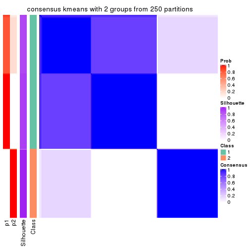</p>

</div>
<div id='tab-ATC-kmeans-consensus-heatmap-2'>
<pre><code class="r">consensus_heatmap(res, k = 3)
</code></pre>

<p></p>

</div>
<div id='tab-ATC-kmeans-consensus-heatmap-3'>
<pre><code class="r">consensus_heatmap(res, k = 4)
</code></pre>

<p></p>

</div>
<div id='tab-ATC-kmeans-consensus-heatmap-4'>
<pre><code class="r">consensus_heatmap(res, k = 5)
</code></pre>

<p></p>

</div>
<div id='tab-ATC-kmeans-consensus-heatmap-5'>
<pre><code class="r">consensus_heatmap(res, k = 6)
</code></pre>

<p></p>

</div>
</div>

Heatmaps for the membership of samples in all partitions to see how consistent they are:


<script>
$( function() {
	$( '#tabs-ATC-kmeans-membership-heatmap' ).tabs();
} );
</script>
<div id='tabs-ATC-kmeans-membership-heatmap'>
<ul>
<li><a href='#tab-ATC-kmeans-membership-heatmap-1'>k = 2</a></li>
<li><a href='#tab-ATC-kmeans-membership-heatmap-2'>k = 3</a></li>
<li><a href='#tab-ATC-kmeans-membership-heatmap-3'>k = 4</a></li>
<li><a href='#tab-ATC-kmeans-membership-heatmap-4'>k = 5</a></li>
<li><a href='#tab-ATC-kmeans-membership-heatmap-5'>k = 6</a></li>
</ul>
<div id='tab-ATC-kmeans-membership-heatmap-1'>
<pre><code class="r">membership_heatmap(res, k = 2)
</code></pre>

<p></p>

</div>
<div id='tab-ATC-kmeans-membership-heatmap-2'>
<pre><code class="r">membership_heatmap(res, k = 3)
</code></pre>

<p></p>

</div>
<div id='tab-ATC-kmeans-membership-heatmap-3'>
<pre><code class="r">membership_heatmap(res, k = 4)
</code></pre>

<p></p>

</div>
<div id='tab-ATC-kmeans-membership-heatmap-4'>
<pre><code class="r">membership_heatmap(res, k = 5)
</code></pre>

<p></p>

</div>
<div id='tab-ATC-kmeans-membership-heatmap-5'>
<pre><code class="r">membership_heatmap(res, k = 6)
</code></pre>

<p></p>

</div>
</div>

As soon as we have had the classes for columns, we can look for signatures
which are significantly different between classes which can be candidate marks
for certain classes. Following are the heatmaps for signatures.


Signature heatmaps where rows are scaled:


<script>
$( function() {
	$( '#tabs-ATC-kmeans-get-signatures' ).tabs();
} );
</script>
<div id='tabs-ATC-kmeans-get-signatures'>
<ul>
<li><a href='#tab-ATC-kmeans-get-signatures-1'>k = 2</a></li>
<li><a href='#tab-ATC-kmeans-get-signatures-2'>k = 3</a></li>
<li><a href='#tab-ATC-kmeans-get-signatures-3'>k = 4</a></li>
<li><a href='#tab-ATC-kmeans-get-signatures-4'>k = 5</a></li>
<li><a href='#tab-ATC-kmeans-get-signatures-5'>k = 6</a></li>
</ul>
<div id='tab-ATC-kmeans-get-signatures-1'>
<pre><code class="r">get_signatures(res, k = 2)
</code></pre>

<p></p>

</div>
<div id='tab-ATC-kmeans-get-signatures-2'>
<pre><code class="r">get_signatures(res, k = 3)
</code></pre>

<p></p>

</div>
<div id='tab-ATC-kmeans-get-signatures-3'>
<pre><code class="r">get_signatures(res, k = 4)
</code></pre>

<p></p>

</div>
<div id='tab-ATC-kmeans-get-signatures-4'>
<pre><code class="r">get_signatures(res, k = 5)
</code></pre>

<p></p>

</div>
<div id='tab-ATC-kmeans-get-signatures-5'>
<pre><code class="r">get_signatures(res, k = 6)
</code></pre>

<p></p>

</div>
</div>


Signature heatmaps where rows are not scaled:


<script>
$( function() {
	$( '#tabs-ATC-kmeans-get-signatures-no-scale' ).tabs();
} );
</script>
<div id='tabs-ATC-kmeans-get-signatures-no-scale'>
<ul>
<li><a href='#tab-ATC-kmeans-get-signatures-no-scale-1'>k = 2</a></li>
<li><a href='#tab-ATC-kmeans-get-signatures-no-scale-2'>k = 3</a></li>
<li><a href='#tab-ATC-kmeans-get-signatures-no-scale-3'>k = 4</a></li>
<li><a href='#tab-ATC-kmeans-get-signatures-no-scale-4'>k = 5</a></li>
<li><a href='#tab-ATC-kmeans-get-signatures-no-scale-5'>k = 6</a></li>
</ul>
<div id='tab-ATC-kmeans-get-signatures-no-scale-1'>
<pre><code class="r">get_signatures(res, k = 2, scale_rows = FALSE)
</code></pre>

<p></p>

</div>
<div id='tab-ATC-kmeans-get-signatures-no-scale-2'>
<pre><code class="r">get_signatures(res, k = 3, scale_rows = FALSE)
</code></pre>

<p></p>

</div>
<div id='tab-ATC-kmeans-get-signatures-no-scale-3'>
<pre><code class="r">get_signatures(res, k = 4, scale_rows = FALSE)
</code></pre>

<p></p>

</div>
<div id='tab-ATC-kmeans-get-signatures-no-scale-4'>
<pre><code class="r">get_signatures(res, k = 5, scale_rows = FALSE)
</code></pre>

<p></p>

</div>
<div id='tab-ATC-kmeans-get-signatures-no-scale-5'>
<pre><code class="r">get_signatures(res, k = 6, scale_rows = FALSE)
</code></pre>

<p></p>

</div>
</div>


Compare the overlap of signatures from different k:

```r
compare_signatures(res)
```


`get_signature()` returns a data frame invisibly. TO get the list of signatures, the function
call should be assigned to a variable explicitly. In following code, if `plot` argument is set
to `FALSE`, no heatmap is plotted while only the differential analysis is performed.

```r
# code only for demonstration
tb = get_signature(res, k = ..., plot = FALSE)
```

An example of the output of `tb` is:

```
#>   which_row         fdr    mean_1    mean_2 scaled_mean_1 scaled_mean_2 km
#> 1        38 0.042760348  8.373488  9.131774    -0.5533452     0.5164555  1
#> 2        40 0.018707592  7.106213  8.469186    -0.6173731     0.5762149  1
#> 3        55 0.019134737 10.221463 11.207825    -0.6159697     0.5749050  1
#> 4        59 0.006059896  5.921854  7.869574    -0.6899429     0.6439467  1
#> 5        60 0.018055526  8.928898 10.211722    -0.6204761     0.5791110  1
#> 6        98 0.009384629 15.714769 14.887706     0.6635654    -0.6193277  2
...
```

The columns in `tb` are:

1. `which_row`: row indices corresponding to the input matrix.
2. `fdr`: FDR for the differential test. 
3. `mean_x`: The mean value in group x.
4. `scaled_mean_x`: The mean value in group x after rows are scaled.
5. `km`: Row groups if k-means clustering is applied to rows.


UMAP plot which shows how samples are separated.


<script>
$( function() {
	$( '#tabs-ATC-kmeans-dimension-reduction' ).tabs();
} );
</script>
<div id='tabs-ATC-kmeans-dimension-reduction'>
<ul>
<li><a href='#tab-ATC-kmeans-dimension-reduction-1'>k = 2</a></li>
<li><a href='#tab-ATC-kmeans-dimension-reduction-2'>k = 3</a></li>
<li><a href='#tab-ATC-kmeans-dimension-reduction-3'>k = 4</a></li>
<li><a href='#tab-ATC-kmeans-dimension-reduction-4'>k = 5</a></li>
<li><a href='#tab-ATC-kmeans-dimension-reduction-5'>k = 6</a></li>
</ul>
<div id='tab-ATC-kmeans-dimension-reduction-1'>
<pre><code class="r">dimension_reduction(res, k = 2, method = &quot;UMAP&quot;)
</code></pre>

<p></p>

</div>
<div id='tab-ATC-kmeans-dimension-reduction-2'>
<pre><code class="r">dimension_reduction(res, k = 3, method = &quot;UMAP&quot;)
</code></pre>

<p></p>

</div>
<div id='tab-ATC-kmeans-dimension-reduction-3'>
<pre><code class="r">dimension_reduction(res, k = 4, method = &quot;UMAP&quot;)
</code></pre>

<p></p>

</div>
<div id='tab-ATC-kmeans-dimension-reduction-4'>
<pre><code class="r">dimension_reduction(res, k = 5, method = &quot;UMAP&quot;)
</code></pre>

<p></p>

</div>
<div id='tab-ATC-kmeans-dimension-reduction-5'>
<pre><code class="r">dimension_reduction(res, k = 6, method = &quot;UMAP&quot;)
</code></pre>

<p></p>

</div>
</div>


Following heatmap shows how subgroups are split when increasing `k`:

```r
collect_classes(res)
```


If matrix rows can be associated to genes, consider to use `functional_enrichment(res,
...)` to perform function enrichment for the signature genes. See [this vignette](http://bioconductor.org/packages/devel/bioc/vignettes/cola/inst/doc/functional_enrichment.html) for more detailed explanations.


 

---------------------------------------------------


### ATC:skmeans*


The object with results only for a single top-value method and a single partition method 
can be extracted as:

```r
res = res_list["ATC", "skmeans"]
# you can also extract it by
# res = res_list["ATC:skmeans"]
```

A summary of `res` and all the functions that can be applied to it:

```r
res
```

```
#> A 'ConsensusPartition' object with k = 2, 3, 4, 5, 6.
#>   On a matrix with 18147 rows and 167 columns.
#>   Top rows (1000, 2000, 3000, 4000, 5000) are extracted by 'ATC' method.
#>   Subgroups are detected by 'skmeans' method.
#>   Performed in total 1250 partitions by row resampling.
#>   Best k for subgroups seems to be 4.
#> 
#> Following methods can be applied to this 'ConsensusPartition' object:
#>  [1] "cola_report"             "collect_classes"         "collect_plots"          
#>  [4] "collect_stats"           "colnames"                "compare_signatures"     
#>  [7] "consensus_heatmap"       "dimension_reduction"     "functional_enrichment"  
#> [10] "get_anno_col"            "get_anno"                "get_classes"            
#> [13] "get_consensus"           "get_matrix"              "get_membership"         
#> [16] "get_param"               "get_signatures"          "get_stats"              
#> [19] "is_best_k"               "is_stable_k"             "membership_heatmap"     
#> [22] "ncol"                    "nrow"                    "plot_ecdf"              
#> [25] "rownames"                "select_partition_number" "show"                   
#> [28] "suggest_best_k"          "test_to_known_factors"
```

`collect_plots()` function collects all the plots made from `res` for all `k` (number of partitions)
into one single page to provide an easy and fast comparison between different `k`.

```r
collect_plots(res)
```


The plots are:

- The first row: a plot of the ECDF (empirical cumulative distribution
  function) curves of the consensus matrix for each `k` and the heatmap of
  predicted classes for each `k`.
- The second row: heatmaps of the consensus matrix for each `k`.
- The third row: heatmaps of the membership matrix for each `k`.
- The fouth row: heatmaps of the signatures for each `k`.

All the plots in panels can be made by individual functions and they are
plotted later in this section.

`select_partition_number()` produces several plots showing different
statistics for choosing "optimized" `k`. There are following statistics:

- ECDF curves of the consensus matrix for each `k`;
- 1-PAC. [The PAC
  score](https://en.wikipedia.org/wiki/Consensus_clustering#Over-interpretation_potential_of_consensus_clustering)
  measures the proportion of the ambiguous subgrouping.
- Mean silhouette score.
- Concordance. The mean probability of fiting the consensus class ids in all
  partitions.
- Area increased. Denote $A_k$ as the area under the ECDF curve for current
  `k`, the area increased is defined as $A_k - A_{k-1}$.
- Rand index. The percent of pairs of samples that are both in a same cluster
  or both are not in a same cluster in the partition of k and k-1.
- Jaccard index. The ratio of pairs of samples are both in a same cluster in
  the partition of k and k-1 and the pairs of samples are both in a same
  cluster in the partition k or k-1.

The detailed explanations of these statistics can be found in [the _cola_
vignette](http://bioconductor.org/packages/devel/bioc/vignettes/cola/inst/doc/cola.html#toc_13).

Generally speaking, lower PAC score, higher mean silhouette score or higher
concordance corresponds to better partition. Rand index and Jaccard index
measure how similar the current partition is compared to partition with `k-1`.
If they are too similar, we won't accept `k` is better than `k-1`.

```r
select_partition_number(res)
```


The numeric values for all these statistics can be obtained by `get_stats()`.

```r
get_stats(res)
```

```
#>   k 1-PAC mean_silhouette concordance area_increased  Rand Jaccard
#> 2 2 1.000           0.972       0.989         0.4793 0.519   0.519
#> 3 3 1.000           0.984       0.994         0.3960 0.760   0.560
#> 4 4 0.923           0.844       0.926         0.0927 0.923   0.773
#> 5 5 0.882           0.864       0.909         0.0527 0.940   0.787
#> 6 6 0.861           0.853       0.880         0.0466 0.968   0.866
```

`suggest_best_k()` suggests the best $k$ based on these statistics. The rules are as follows:

- All $k$ with Jaccard index larger than 0.95 are removed because increasing
  $k$ does not provide enough extra information. If all $k$ are removed, it is
  marked as no subgroup is detected.
- For all $k$ with 1-PAC score larger than 0.9, the maximal $k$ is taken as
  the best $k$, and other $k$ are marked as optional $k$.
- If it does not fit the second rule. The $k$ with the maximal vote of the
  highest 1-PAC score, highest mean silhouette, and highest concordance is
  taken as the best $k$.

```r
suggest_best_k(res)
```

```
#> [1] 4
#> attr(,"optional")
#> [1] 2 3
```

There is also optional best $k$ = 2 3 that is worth to check.

Following shows the table of the partitions (You need to click the **show/hide
code output** link to see it). The membership matrix (columns with name `p*`)
is inferred by
[`clue::cl_consensus()`](https://www.rdocumentation.org/link/cl_consensus?package=clue)
function with the `SE` method. Basically the value in the membership matrix
represents the probability to belong to a certain group. The finall class
label for an item is determined with the group with highest probability it
belongs to.

In `get_classes()` function, the entropy is calculated from the membership
matrix and the silhouette score is calculated from the consensus matrix.


<script>
$( function() {
	$( '#tabs-ATC-skmeans-get-classes' ).tabs();
} );
</script>
<div id='tabs-ATC-skmeans-get-classes'>
<ul>
<li><a href='#tab-ATC-skmeans-get-classes-1'>k = 2</a></li>
<li><a href='#tab-ATC-skmeans-get-classes-2'>k = 3</a></li>
<li><a href='#tab-ATC-skmeans-get-classes-3'>k = 4</a></li>
<li><a href='#tab-ATC-skmeans-get-classes-4'>k = 5</a></li>
<li><a href='#tab-ATC-skmeans-get-classes-5'>k = 6</a></li>
</ul>

<div id='tab-ATC-skmeans-get-classes-1'>
<p><a id='tab-ATC-skmeans-get-classes-1-a' style='color:#0366d6' href='#'>show/hide code output</a></p>
<pre><code class="r">cbind(get_classes(res, k = 2), get_membership(res, k = 2))
</code></pre>

<pre><code>#&gt;            class entropy silhouette    p1    p2
#&gt; SRR1313062     1   0.000     0.9944 1.000 0.000
#&gt; SRR1313063     1   0.000     0.9944 1.000 0.000
#&gt; SRR1313064     1   0.000     0.9944 1.000 0.000
#&gt; SRR1313065     1   0.000     0.9944 1.000 0.000
#&gt; SRR1313066     1   0.000     0.9944 1.000 0.000
#&gt; SRR1313067     1   0.000     0.9944 1.000 0.000
#&gt; SRR1313068     1   0.000     0.9944 1.000 0.000
#&gt; SRR1313069     1   0.000     0.9944 1.000 0.000
#&gt; SRR1313070     1   0.000     0.9944 1.000 0.000
#&gt; SRR1313071     1   0.000     0.9944 1.000 0.000
#&gt; SRR1313072     1   0.000     0.9944 1.000 0.000
#&gt; SRR1313073     1   0.000     0.9944 1.000 0.000
#&gt; SRR1313074     1   0.000     0.9944 1.000 0.000
#&gt; SRR1313075     1   0.000     0.9944 1.000 0.000
#&gt; SRR1313076     1   0.000     0.9944 1.000 0.000
#&gt; SRR1313077     1   0.000     0.9944 1.000 0.000
#&gt; SRR1313078     1   0.000     0.9944 1.000 0.000
#&gt; SRR1313079     1   0.000     0.9944 1.000 0.000
#&gt; SRR1313080     1   0.000     0.9944 1.000 0.000
#&gt; SRR1313081     1   0.000     0.9944 1.000 0.000
#&gt; SRR1313082     1   0.000     0.9944 1.000 0.000
#&gt; SRR1313083     1   0.000     0.9944 1.000 0.000
#&gt; SRR1313084     1   0.000     0.9944 1.000 0.000
#&gt; SRR1313085     1   0.000     0.9944 1.000 0.000
#&gt; SRR1313086     1   0.000     0.9944 1.000 0.000
#&gt; SRR1313087     1   0.000     0.9944 1.000 0.000
#&gt; SRR1313088     1   0.000     0.9944 1.000 0.000
#&gt; SRR1313089     1   0.000     0.9944 1.000 0.000
#&gt; SRR1313092     1   0.000     0.9944 1.000 0.000
#&gt; SRR1313090     1   0.000     0.9944 1.000 0.000
#&gt; SRR1313091     2   0.000     0.9792 0.000 1.000
#&gt; SRR1313093     1   0.000     0.9944 1.000 0.000
#&gt; SRR1313095     1   0.000     0.9944 1.000 0.000
#&gt; SRR1313096     1   0.000     0.9944 1.000 0.000
#&gt; SRR1313094     1   0.000     0.9944 1.000 0.000
#&gt; SRR1313097     1   0.000     0.9944 1.000 0.000
#&gt; SRR1313099     1   0.506     0.8717 0.888 0.112
#&gt; SRR1313098     1   0.000     0.9944 1.000 0.000
#&gt; SRR1313101     2   0.000     0.9792 0.000 1.000
#&gt; SRR1313102     2   0.999     0.0896 0.480 0.520
#&gt; SRR1313103     1   0.000     0.9944 1.000 0.000
#&gt; SRR1313100     1   0.000     0.9944 1.000 0.000
#&gt; SRR1313105     1   0.000     0.9944 1.000 0.000
#&gt; SRR1313104     1   0.000     0.9944 1.000 0.000
#&gt; SRR1313107     1   0.000     0.9944 1.000 0.000
#&gt; SRR1313106     2   0.000     0.9792 0.000 1.000
#&gt; SRR1313109     2   0.000     0.9792 0.000 1.000
#&gt; SRR1313108     1   0.000     0.9944 1.000 0.000
#&gt; SRR1313111     1   0.000     0.9944 1.000 0.000
#&gt; SRR1313110     1   0.000     0.9944 1.000 0.000
#&gt; SRR1313112     2   0.224     0.9456 0.036 0.964
#&gt; SRR1313113     1   0.000     0.9944 1.000 0.000
#&gt; SRR1313115     1   0.000     0.9944 1.000 0.000
#&gt; SRR1313114     1   0.000     0.9944 1.000 0.000
#&gt; SRR1313117     1   0.000     0.9944 1.000 0.000
#&gt; SRR1313118     1   0.000     0.9944 1.000 0.000
#&gt; SRR1313116     2   0.000     0.9792 0.000 1.000
#&gt; SRR1313120     1   0.000     0.9944 1.000 0.000
#&gt; SRR1313119     1   0.000     0.9944 1.000 0.000
#&gt; SRR1313122     1   0.000     0.9944 1.000 0.000
#&gt; SRR1313124     1   0.000     0.9944 1.000 0.000
#&gt; SRR1313121     1   0.680     0.7766 0.820 0.180
#&gt; SRR1313125     1   0.000     0.9944 1.000 0.000
#&gt; SRR1313127     1   0.000     0.9944 1.000 0.000
#&gt; SRR1313123     1   0.000     0.9944 1.000 0.000
#&gt; SRR1313128     1   0.000     0.9944 1.000 0.000
#&gt; SRR1313126     1   0.000     0.9944 1.000 0.000
#&gt; SRR1313130     2   0.000     0.9792 0.000 1.000
#&gt; SRR1313132     1   0.000     0.9944 1.000 0.000
#&gt; SRR1313129     2   0.969     0.3567 0.396 0.604
#&gt; SRR1313133     1   0.000     0.9944 1.000 0.000
#&gt; SRR1313131     1   0.000     0.9944 1.000 0.000
#&gt; SRR1313134     1   0.000     0.9944 1.000 0.000
#&gt; SRR1313135     1   0.000     0.9944 1.000 0.000
#&gt; SRR1313136     1   0.000     0.9944 1.000 0.000
#&gt; SRR1313137     1   0.000     0.9944 1.000 0.000
#&gt; SRR1313138     2   0.795     0.6876 0.240 0.760
#&gt; SRR1313140     1   0.000     0.9944 1.000 0.000
#&gt; SRR1313141     1   0.000     0.9944 1.000 0.000
#&gt; SRR1313139     1   0.000     0.9944 1.000 0.000
#&gt; SRR1313143     1   0.000     0.9944 1.000 0.000
#&gt; SRR1313142     1   0.000     0.9944 1.000 0.000
#&gt; SRR1313144     1   0.000     0.9944 1.000 0.000
#&gt; SRR1313145     1   0.000     0.9944 1.000 0.000
#&gt; SRR1313146     1   0.000     0.9944 1.000 0.000
#&gt; SRR1313147     1   0.000     0.9944 1.000 0.000
#&gt; SRR1313150     1   0.000     0.9944 1.000 0.000
#&gt; SRR1313149     1   0.000     0.9944 1.000 0.000
#&gt; SRR1313152     1   0.000     0.9944 1.000 0.000
#&gt; SRR1313151     1   0.000     0.9944 1.000 0.000
#&gt; SRR1313154     1   0.000     0.9944 1.000 0.000
#&gt; SRR1313153     1   0.000     0.9944 1.000 0.000
#&gt; SRR1313156     1   0.000     0.9944 1.000 0.000
#&gt; SRR1313155     1   0.000     0.9944 1.000 0.000
#&gt; SRR1313157     1   0.000     0.9944 1.000 0.000
#&gt; SRR1313158     1   0.000     0.9944 1.000 0.000
#&gt; SRR1313161     1   0.000     0.9944 1.000 0.000
#&gt; SRR1313159     1   0.278     0.9461 0.952 0.048
#&gt; SRR1313160     1   0.000     0.9944 1.000 0.000
#&gt; SRR1313162     1   0.000     0.9944 1.000 0.000
#&gt; SRR1313163     1   0.000     0.9944 1.000 0.000
#&gt; SRR1313165     1   0.000     0.9944 1.000 0.000
#&gt; SRR1313166     1   0.000     0.9944 1.000 0.000
#&gt; SRR1313164     1   0.000     0.9944 1.000 0.000
#&gt; SRR1313167     1   0.000     0.9944 1.000 0.000
#&gt; SRR1313168     1   0.000     0.9944 1.000 0.000
#&gt; SRR1313170     1   0.118     0.9789 0.984 0.016
#&gt; SRR1313169     1   0.000     0.9944 1.000 0.000
#&gt; SRR1313172     1   0.697     0.7657 0.812 0.188
#&gt; SRR1313171     1   0.000     0.9944 1.000 0.000
#&gt; SRR1313174     2   0.000     0.9792 0.000 1.000
#&gt; SRR1313173     1   0.000     0.9944 1.000 0.000
#&gt; SRR1313176     2   0.000     0.9792 0.000 1.000
#&gt; SRR1313175     2   0.000     0.9792 0.000 1.000
#&gt; SRR1313178     2   0.000     0.9792 0.000 1.000
#&gt; SRR1313177     2   0.000     0.9792 0.000 1.000
#&gt; SRR1313179     2   0.000     0.9792 0.000 1.000
#&gt; SRR1313180     2   0.000     0.9792 0.000 1.000
#&gt; SRR1313181     2   0.000     0.9792 0.000 1.000
#&gt; SRR1313183     2   0.000     0.9792 0.000 1.000
#&gt; SRR1313182     2   0.000     0.9792 0.000 1.000
#&gt; SRR1313184     2   0.000     0.9792 0.000 1.000
#&gt; SRR1313185     2   0.000     0.9792 0.000 1.000
#&gt; SRR1313188     2   0.000     0.9792 0.000 1.000
#&gt; SRR1313187     2   0.000     0.9792 0.000 1.000
#&gt; SRR1313186     2   0.000     0.9792 0.000 1.000
#&gt; SRR1313189     2   0.000     0.9792 0.000 1.000
#&gt; SRR1313190     2   0.000     0.9792 0.000 1.000
#&gt; SRR1313191     2   0.000     0.9792 0.000 1.000
#&gt; SRR1313192     2   0.000     0.9792 0.000 1.000
#&gt; SRR1313193     2   0.000     0.9792 0.000 1.000
#&gt; SRR1313194     2   0.000     0.9792 0.000 1.000
#&gt; SRR1313195     2   0.000     0.9792 0.000 1.000
#&gt; SRR1313196     2   0.000     0.9792 0.000 1.000
#&gt; SRR1313197     2   0.000     0.9792 0.000 1.000
#&gt; SRR1313198     2   0.000     0.9792 0.000 1.000
#&gt; SRR1313199     2   0.000     0.9792 0.000 1.000
#&gt; SRR1313200     2   0.000     0.9792 0.000 1.000
#&gt; SRR1313201     2   0.000     0.9792 0.000 1.000
#&gt; SRR1313202     2   0.000     0.9792 0.000 1.000
#&gt; SRR1313203     2   0.689     0.7716 0.184 0.816
#&gt; SRR1313204     2   0.000     0.9792 0.000 1.000
#&gt; SRR1313205     2   0.000     0.9792 0.000 1.000
#&gt; SRR1313207     2   0.000     0.9792 0.000 1.000
#&gt; SRR1313208     2   0.000     0.9792 0.000 1.000
#&gt; SRR1313206     2   0.000     0.9792 0.000 1.000
#&gt; SRR1313210     2   0.000     0.9792 0.000 1.000
#&gt; SRR1313209     2   0.000     0.9792 0.000 1.000
#&gt; SRR1313211     2   0.000     0.9792 0.000 1.000
#&gt; SRR1313212     2   0.000     0.9792 0.000 1.000
#&gt; SRR1313214     2   0.000     0.9792 0.000 1.000
#&gt; SRR1313215     2   0.000     0.9792 0.000 1.000
#&gt; SRR1313213     2   0.000     0.9792 0.000 1.000
#&gt; SRR1313216     2   0.000     0.9792 0.000 1.000
#&gt; SRR1313217     2   0.000     0.9792 0.000 1.000
#&gt; SRR1313219     2   0.000     0.9792 0.000 1.000
#&gt; SRR1313220     2   0.000     0.9792 0.000 1.000
#&gt; SRR1313218     2   0.000     0.9792 0.000 1.000
#&gt; SRR1313222     2   0.000     0.9792 0.000 1.000
#&gt; SRR1313221     2   0.000     0.9792 0.000 1.000
#&gt; SRR1313223     2   0.000     0.9792 0.000 1.000
#&gt; SRR1313224     2   0.000     0.9792 0.000 1.000
#&gt; SRR1313225     2   0.000     0.9792 0.000 1.000
#&gt; SRR1313226     2   0.000     0.9792 0.000 1.000
#&gt; SRR1313227     2   0.000     0.9792 0.000 1.000
#&gt; SRR1313228     2   0.000     0.9792 0.000 1.000
#&gt; SRR1313229     2   0.000     0.9792 0.000 1.000
</code></pre>

<script>
$('#tab-ATC-skmeans-get-classes-1-a').parent().next().next().hide();
$('#tab-ATC-skmeans-get-classes-1-a').click(function(){
  $('#tab-ATC-skmeans-get-classes-1-a').parent().next().next().toggle();
  return(false);
});
</script>
</div>

<div id='tab-ATC-skmeans-get-classes-2'>
<p><a id='tab-ATC-skmeans-get-classes-2-a' style='color:#0366d6' href='#'>show/hide code output</a></p>
<pre><code class="r">cbind(get_classes(res, k = 3), get_membership(res, k = 3))
</code></pre>

<pre><code>#&gt;            class entropy silhouette    p1    p2    p3
#&gt; SRR1313062     1  0.0000      0.996 1.000 0.000 0.000
#&gt; SRR1313063     1  0.0000      0.996 1.000 0.000 0.000
#&gt; SRR1313064     1  0.0000      0.996 1.000 0.000 0.000
#&gt; SRR1313065     1  0.0000      0.996 1.000 0.000 0.000
#&gt; SRR1313066     1  0.0000      0.996 1.000 0.000 0.000
#&gt; SRR1313067     1  0.0000      0.996 1.000 0.000 0.000
#&gt; SRR1313068     1  0.0000      0.996 1.000 0.000 0.000
#&gt; SRR1313069     1  0.0000      0.996 1.000 0.000 0.000
#&gt; SRR1313070     1  0.0000      0.996 1.000 0.000 0.000
#&gt; SRR1313071     1  0.0000      0.996 1.000 0.000 0.000
#&gt; SRR1313072     1  0.0000      0.996 1.000 0.000 0.000
#&gt; SRR1313073     1  0.0000      0.996 1.000 0.000 0.000
#&gt; SRR1313074     1  0.0000      0.996 1.000 0.000 0.000
#&gt; SRR1313075     1  0.0000      0.996 1.000 0.000 0.000
#&gt; SRR1313076     1  0.0000      0.996 1.000 0.000 0.000
#&gt; SRR1313077     1  0.0000      0.996 1.000 0.000 0.000
#&gt; SRR1313078     3  0.0000      0.993 0.000 0.000 1.000
#&gt; SRR1313079     1  0.0000      0.996 1.000 0.000 0.000
#&gt; SRR1313080     1  0.0000      0.996 1.000 0.000 0.000
#&gt; SRR1313081     1  0.0000      0.996 1.000 0.000 0.000
#&gt; SRR1313082     1  0.0000      0.996 1.000 0.000 0.000
#&gt; SRR1313083     1  0.0000      0.996 1.000 0.000 0.000
#&gt; SRR1313084     1  0.0000      0.996 1.000 0.000 0.000
#&gt; SRR1313085     1  0.0000      0.996 1.000 0.000 0.000
#&gt; SRR1313086     1  0.0000      0.996 1.000 0.000 0.000
#&gt; SRR1313087     1  0.0000      0.996 1.000 0.000 0.000
#&gt; SRR1313088     1  0.0000      0.996 1.000 0.000 0.000
#&gt; SRR1313089     1  0.0000      0.996 1.000 0.000 0.000
#&gt; SRR1313092     3  0.0000      0.993 0.000 0.000 1.000
#&gt; SRR1313090     1  0.0000      0.996 1.000 0.000 0.000
#&gt; SRR1313091     3  0.6140      0.311 0.000 0.404 0.596
#&gt; SRR1313093     3  0.0000      0.993 0.000 0.000 1.000
#&gt; SRR1313095     3  0.0000      0.993 0.000 0.000 1.000
#&gt; SRR1313096     3  0.0000      0.993 0.000 0.000 1.000
#&gt; SRR1313094     3  0.0000      0.993 0.000 0.000 1.000
#&gt; SRR1313097     3  0.0000      0.993 0.000 0.000 1.000
#&gt; SRR1313099     3  0.0000      0.993 0.000 0.000 1.000
#&gt; SRR1313098     3  0.0000      0.993 0.000 0.000 1.000
#&gt; SRR1313101     2  0.0592      0.981 0.000 0.988 0.012
#&gt; SRR1313102     3  0.0000      0.993 0.000 0.000 1.000
#&gt; SRR1313103     3  0.0000      0.993 0.000 0.000 1.000
#&gt; SRR1313100     1  0.0000      0.996 1.000 0.000 0.000
#&gt; SRR1313105     3  0.0000      0.993 0.000 0.000 1.000
#&gt; SRR1313104     3  0.0000      0.993 0.000 0.000 1.000
#&gt; SRR1313107     3  0.0000      0.993 0.000 0.000 1.000
#&gt; SRR1313106     2  0.0000      0.993 0.000 1.000 0.000
#&gt; SRR1313109     3  0.0000      0.993 0.000 0.000 1.000
#&gt; SRR1313108     3  0.0000      0.993 0.000 0.000 1.000
#&gt; SRR1313111     3  0.0000      0.993 0.000 0.000 1.000
#&gt; SRR1313110     1  0.0747      0.981 0.984 0.000 0.016
#&gt; SRR1313112     2  0.6140      0.313 0.000 0.596 0.404
#&gt; SRR1313113     3  0.0000      0.993 0.000 0.000 1.000
#&gt; SRR1313115     3  0.0000      0.993 0.000 0.000 1.000
#&gt; SRR1313114     1  0.4346      0.776 0.816 0.000 0.184
#&gt; SRR1313117     3  0.0000      0.993 0.000 0.000 1.000
#&gt; SRR1313118     1  0.0000      0.996 1.000 0.000 0.000
#&gt; SRR1313116     3  0.0000      0.993 0.000 0.000 1.000
#&gt; SRR1313120     3  0.0000      0.993 0.000 0.000 1.000
#&gt; SRR1313119     1  0.0000      0.996 1.000 0.000 0.000
#&gt; SRR1313122     3  0.0000      0.993 0.000 0.000 1.000
#&gt; SRR1313124     3  0.0000      0.993 0.000 0.000 1.000
#&gt; SRR1313121     1  0.0000      0.996 1.000 0.000 0.000
#&gt; SRR1313125     3  0.0000      0.993 0.000 0.000 1.000
#&gt; SRR1313127     3  0.0000      0.993 0.000 0.000 1.000
#&gt; SRR1313123     3  0.0000      0.993 0.000 0.000 1.000
#&gt; SRR1313128     3  0.0000      0.993 0.000 0.000 1.000
#&gt; SRR1313126     3  0.0000      0.993 0.000 0.000 1.000
#&gt; SRR1313130     2  0.0000      0.993 0.000 1.000 0.000
#&gt; SRR1313132     3  0.0000      0.993 0.000 0.000 1.000
#&gt; SRR1313129     3  0.0000      0.993 0.000 0.000 1.000
#&gt; SRR1313133     3  0.0000      0.993 0.000 0.000 1.000
#&gt; SRR1313131     3  0.0000      0.993 0.000 0.000 1.000
#&gt; SRR1313134     3  0.0000      0.993 0.000 0.000 1.000
#&gt; SRR1313135     1  0.0000      0.996 1.000 0.000 0.000
#&gt; SRR1313136     3  0.0000      0.993 0.000 0.000 1.000
#&gt; SRR1313137     1  0.0000      0.996 1.000 0.000 0.000
#&gt; SRR1313138     1  0.0000      0.996 1.000 0.000 0.000
#&gt; SRR1313140     1  0.0000      0.996 1.000 0.000 0.000
#&gt; SRR1313141     3  0.0000      0.993 0.000 0.000 1.000
#&gt; SRR1313139     1  0.0000      0.996 1.000 0.000 0.000
#&gt; SRR1313143     3  0.0000      0.993 0.000 0.000 1.000
#&gt; SRR1313142     3  0.0000      0.993 0.000 0.000 1.000
#&gt; SRR1313144     1  0.0000      0.996 1.000 0.000 0.000
#&gt; SRR1313145     3  0.0000      0.993 0.000 0.000 1.000
#&gt; SRR1313146     3  0.0000      0.993 0.000 0.000 1.000
#&gt; SRR1313147     1  0.0000      0.996 1.000 0.000 0.000
#&gt; SRR1313150     1  0.0000      0.996 1.000 0.000 0.000
#&gt; SRR1313149     3  0.0000      0.993 0.000 0.000 1.000
#&gt; SRR1313152     1  0.0000      0.996 1.000 0.000 0.000
#&gt; SRR1313151     3  0.0000      0.993 0.000 0.000 1.000
#&gt; SRR1313154     3  0.0000      0.993 0.000 0.000 1.000
#&gt; SRR1313153     3  0.0000      0.993 0.000 0.000 1.000
#&gt; SRR1313156     3  0.0000      0.993 0.000 0.000 1.000
#&gt; SRR1313155     3  0.0000      0.993 0.000 0.000 1.000
#&gt; SRR1313157     1  0.0000      0.996 1.000 0.000 0.000
#&gt; SRR1313158     3  0.0000      0.993 0.000 0.000 1.000
#&gt; SRR1313161     1  0.0000      0.996 1.000 0.000 0.000
#&gt; SRR1313159     3  0.0000      0.993 0.000 0.000 1.000
#&gt; SRR1313160     1  0.0000      0.996 1.000 0.000 0.000
#&gt; SRR1313162     3  0.0000      0.993 0.000 0.000 1.000
#&gt; SRR1313163     3  0.0000      0.993 0.000 0.000 1.000
#&gt; SRR1313165     1  0.0000      0.996 1.000 0.000 0.000
#&gt; SRR1313166     3  0.0000      0.993 0.000 0.000 1.000
#&gt; SRR1313164     3  0.0000      0.993 0.000 0.000 1.000
#&gt; SRR1313167     1  0.0000      0.996 1.000 0.000 0.000
#&gt; SRR1313168     1  0.0000      0.996 1.000 0.000 0.000
#&gt; SRR1313170     3  0.0000      0.993 0.000 0.000 1.000
#&gt; SRR1313169     1  0.0000      0.996 1.000 0.000 0.000
#&gt; SRR1313172     3  0.0000      0.993 0.000 0.000 1.000
#&gt; SRR1313171     3  0.0000      0.993 0.000 0.000 1.000
#&gt; SRR1313174     2  0.0000      0.993 0.000 1.000 0.000
#&gt; SRR1313173     3  0.0000      0.993 0.000 0.000 1.000
#&gt; SRR1313176     2  0.0000      0.993 0.000 1.000 0.000
#&gt; SRR1313175     2  0.0000      0.993 0.000 1.000 0.000
#&gt; SRR1313178     2  0.0000      0.993 0.000 1.000 0.000
#&gt; SRR1313177     2  0.0000      0.993 0.000 1.000 0.000
#&gt; SRR1313179     2  0.0000      0.993 0.000 1.000 0.000
#&gt; SRR1313180     2  0.0000      0.993 0.000 1.000 0.000
#&gt; SRR1313181     2  0.0000      0.993 0.000 1.000 0.000
#&gt; SRR1313183     2  0.0000      0.993 0.000 1.000 0.000
#&gt; SRR1313182     2  0.0000      0.993 0.000 1.000 0.000
#&gt; SRR1313184     2  0.0000      0.993 0.000 1.000 0.000
#&gt; SRR1313185     2  0.0000      0.993 0.000 1.000 0.000
#&gt; SRR1313188     2  0.0000      0.993 0.000 1.000 0.000
#&gt; SRR1313187     2  0.0000      0.993 0.000 1.000 0.000
#&gt; SRR1313186     2  0.0000      0.993 0.000 1.000 0.000
#&gt; SRR1313189     2  0.0000      0.993 0.000 1.000 0.000
#&gt; SRR1313190     2  0.0000      0.993 0.000 1.000 0.000
#&gt; SRR1313191     2  0.0000      0.993 0.000 1.000 0.000
#&gt; SRR1313192     2  0.0000      0.993 0.000 1.000 0.000
#&gt; SRR1313193     2  0.0000      0.993 0.000 1.000 0.000
#&gt; SRR1313194     2  0.0000      0.993 0.000 1.000 0.000
#&gt; SRR1313195     2  0.0000      0.993 0.000 1.000 0.000
#&gt; SRR1313196     2  0.0000      0.993 0.000 1.000 0.000
#&gt; SRR1313197     2  0.0000      0.993 0.000 1.000 0.000
#&gt; SRR1313198     2  0.0000      0.993 0.000 1.000 0.000
#&gt; SRR1313199     2  0.0000      0.993 0.000 1.000 0.000
#&gt; SRR1313200     2  0.0000      0.993 0.000 1.000 0.000
#&gt; SRR1313201     2  0.0000      0.993 0.000 1.000 0.000
#&gt; SRR1313202     2  0.0000      0.993 0.000 1.000 0.000
#&gt; SRR1313203     3  0.0000      0.993 0.000 0.000 1.000
#&gt; SRR1313204     2  0.0000      0.993 0.000 1.000 0.000
#&gt; SRR1313205     2  0.0000      0.993 0.000 1.000 0.000
#&gt; SRR1313207     2  0.0000      0.993 0.000 1.000 0.000
#&gt; SRR1313208     2  0.0000      0.993 0.000 1.000 0.000
#&gt; SRR1313206     2  0.0000      0.993 0.000 1.000 0.000
#&gt; SRR1313210     2  0.0000      0.993 0.000 1.000 0.000
#&gt; SRR1313209     2  0.0000      0.993 0.000 1.000 0.000
#&gt; SRR1313211     2  0.0000      0.993 0.000 1.000 0.000
#&gt; SRR1313212     2  0.0000      0.993 0.000 1.000 0.000
#&gt; SRR1313214     2  0.0000      0.993 0.000 1.000 0.000
#&gt; SRR1313215     2  0.0000      0.993 0.000 1.000 0.000
#&gt; SRR1313213     2  0.0000      0.993 0.000 1.000 0.000
#&gt; SRR1313216     2  0.0000      0.993 0.000 1.000 0.000
#&gt; SRR1313217     2  0.0000      0.993 0.000 1.000 0.000
#&gt; SRR1313219     2  0.0000      0.993 0.000 1.000 0.000
#&gt; SRR1313220     2  0.0000      0.993 0.000 1.000 0.000
#&gt; SRR1313218     2  0.0000      0.993 0.000 1.000 0.000
#&gt; SRR1313222     2  0.0000      0.993 0.000 1.000 0.000
#&gt; SRR1313221     2  0.0000      0.993 0.000 1.000 0.000
#&gt; SRR1313223     2  0.0000      0.993 0.000 1.000 0.000
#&gt; SRR1313224     2  0.0000      0.993 0.000 1.000 0.000
#&gt; SRR1313225     2  0.0000      0.993 0.000 1.000 0.000
#&gt; SRR1313226     2  0.0000      0.993 0.000 1.000 0.000
#&gt; SRR1313227     2  0.0000      0.993 0.000 1.000 0.000
#&gt; SRR1313228     2  0.0000      0.993 0.000 1.000 0.000
#&gt; SRR1313229     2  0.0000      0.993 0.000 1.000 0.000
</code></pre>

<script>
$('#tab-ATC-skmeans-get-classes-2-a').parent().next().next().hide();
$('#tab-ATC-skmeans-get-classes-2-a').click(function(){
  $('#tab-ATC-skmeans-get-classes-2-a').parent().next().next().toggle();
  return(false);
});
</script>
</div>

<div id='tab-ATC-skmeans-get-classes-3'>
<p><a id='tab-ATC-skmeans-get-classes-3-a' style='color:#0366d6' href='#'>show/hide code output</a></p>
<pre><code class="r">cbind(get_classes(res, k = 4), get_membership(res, k = 4))
</code></pre>

<pre><code>#&gt;            class entropy silhouette    p1    p2    p3    p4
#&gt; SRR1313062     4  0.0000     0.9873 0.000 0.000 0.000 1.000
#&gt; SRR1313063     4  0.0000     0.9873 0.000 0.000 0.000 1.000
#&gt; SRR1313064     4  0.0000     0.9873 0.000 0.000 0.000 1.000
#&gt; SRR1313065     4  0.0000     0.9873 0.000 0.000 0.000 1.000
#&gt; SRR1313066     4  0.0000     0.9873 0.000 0.000 0.000 1.000
#&gt; SRR1313067     3  0.4998     0.2282 0.000 0.000 0.512 0.488
#&gt; SRR1313068     4  0.0000     0.9873 0.000 0.000 0.000 1.000
#&gt; SRR1313069     4  0.0000     0.9873 0.000 0.000 0.000 1.000
#&gt; SRR1313070     4  0.0000     0.9873 0.000 0.000 0.000 1.000
#&gt; SRR1313071     4  0.0000     0.9873 0.000 0.000 0.000 1.000
#&gt; SRR1313072     4  0.0000     0.9873 0.000 0.000 0.000 1.000
#&gt; SRR1313073     4  0.0000     0.9873 0.000 0.000 0.000 1.000
#&gt; SRR1313074     4  0.0000     0.9873 0.000 0.000 0.000 1.000
#&gt; SRR1313075     4  0.0000     0.9873 0.000 0.000 0.000 1.000
#&gt; SRR1313076     4  0.0000     0.9873 0.000 0.000 0.000 1.000
#&gt; SRR1313077     4  0.0000     0.9873 0.000 0.000 0.000 1.000
#&gt; SRR1313078     1  0.0000     0.8194 1.000 0.000 0.000 0.000
#&gt; SRR1313079     4  0.0000     0.9873 0.000 0.000 0.000 1.000
#&gt; SRR1313080     4  0.0000     0.9873 0.000 0.000 0.000 1.000
#&gt; SRR1313081     4  0.0000     0.9873 0.000 0.000 0.000 1.000
#&gt; SRR1313082     4  0.0000     0.9873 0.000 0.000 0.000 1.000
#&gt; SRR1313083     4  0.2773     0.8153 0.116 0.000 0.004 0.880
#&gt; SRR1313084     4  0.0000     0.9873 0.000 0.000 0.000 1.000
#&gt; SRR1313085     4  0.0000     0.9873 0.000 0.000 0.000 1.000
#&gt; SRR1313086     4  0.0000     0.9873 0.000 0.000 0.000 1.000
#&gt; SRR1313087     4  0.0000     0.9873 0.000 0.000 0.000 1.000
#&gt; SRR1313088     4  0.0000     0.9873 0.000 0.000 0.000 1.000
#&gt; SRR1313089     4  0.0000     0.9873 0.000 0.000 0.000 1.000
#&gt; SRR1313092     1  0.0707     0.8065 0.980 0.000 0.020 0.000
#&gt; SRR1313090     3  0.4967     0.3107 0.000 0.000 0.548 0.452
#&gt; SRR1313091     1  0.5294     0.4332 0.508 0.008 0.484 0.000
#&gt; SRR1313093     1  0.0000     0.8194 1.000 0.000 0.000 0.000
#&gt; SRR1313095     3  0.4941     0.2956 0.436 0.000 0.564 0.000
#&gt; SRR1313096     1  0.0000     0.8194 1.000 0.000 0.000 0.000
#&gt; SRR1313094     1  0.4985     0.4672 0.532 0.000 0.468 0.000
#&gt; SRR1313097     3  0.0188     0.6465 0.004 0.000 0.996 0.000
#&gt; SRR1313099     1  0.4985     0.4672 0.532 0.000 0.468 0.000
#&gt; SRR1313098     1  0.0000     0.8194 1.000 0.000 0.000 0.000
#&gt; SRR1313101     3  0.0000     0.6481 0.000 0.000 1.000 0.000
#&gt; SRR1313102     3  0.0188     0.6465 0.004 0.000 0.996 0.000
#&gt; SRR1313103     1  0.4985     0.4672 0.532 0.000 0.468 0.000
#&gt; SRR1313100     4  0.0000     0.9873 0.000 0.000 0.000 1.000
#&gt; SRR1313105     1  0.4998     0.4376 0.512 0.000 0.488 0.000
#&gt; SRR1313104     3  0.4817    -0.0664 0.388 0.000 0.612 0.000
#&gt; SRR1313107     1  0.4967     0.4846 0.548 0.000 0.452 0.000
#&gt; SRR1313106     3  0.0188     0.6466 0.000 0.004 0.996 0.000
#&gt; SRR1313109     1  0.4985     0.4672 0.532 0.000 0.468 0.000
#&gt; SRR1313108     1  0.0000     0.8194 1.000 0.000 0.000 0.000
#&gt; SRR1313111     1  0.4996     0.4441 0.516 0.000 0.484 0.000
#&gt; SRR1313110     3  0.7011     0.5043 0.148 0.000 0.552 0.300
#&gt; SRR1313112     3  0.0000     0.6481 0.000 0.000 1.000 0.000
#&gt; SRR1313113     1  0.4996     0.4441 0.516 0.000 0.484 0.000
#&gt; SRR1313115     1  0.0000     0.8194 1.000 0.000 0.000 0.000
#&gt; SRR1313114     3  0.7182     0.5401 0.200 0.000 0.552 0.248
#&gt; SRR1313117     3  0.0000     0.6481 0.000 0.000 1.000 0.000
#&gt; SRR1313118     3  0.4999     0.2093 0.000 0.000 0.508 0.492
#&gt; SRR1313116     1  0.4998     0.4376 0.512 0.000 0.488 0.000
#&gt; SRR1313120     1  0.4948     0.4968 0.560 0.000 0.440 0.000
#&gt; SRR1313119     3  0.4907     0.3728 0.000 0.000 0.580 0.420
#&gt; SRR1313122     3  0.0188     0.6465 0.004 0.000 0.996 0.000
#&gt; SRR1313124     3  0.2081     0.6196 0.084 0.000 0.916 0.000
#&gt; SRR1313121     3  0.4989     0.2704 0.000 0.000 0.528 0.472
#&gt; SRR1313125     3  0.4661     0.4098 0.348 0.000 0.652 0.000
#&gt; SRR1313127     1  0.0188     0.8163 0.996 0.000 0.004 0.000
#&gt; SRR1313123     1  0.0000     0.8194 1.000 0.000 0.000 0.000
#&gt; SRR1313128     1  0.0000     0.8194 1.000 0.000 0.000 0.000
#&gt; SRR1313126     3  0.4998     0.2041 0.488 0.000 0.512 0.000
#&gt; SRR1313130     2  0.0000     1.0000 0.000 1.000 0.000 0.000
#&gt; SRR1313132     1  0.0000     0.8194 1.000 0.000 0.000 0.000
#&gt; SRR1313129     1  0.4998     0.4376 0.512 0.000 0.488 0.000
#&gt; SRR1313133     1  0.0000     0.8194 1.000 0.000 0.000 0.000
#&gt; SRR1313131     1  0.0000     0.8194 1.000 0.000 0.000 0.000
#&gt; SRR1313134     1  0.0000     0.8194 1.000 0.000 0.000 0.000
#&gt; SRR1313135     4  0.0188     0.9859 0.000 0.000 0.004 0.996
#&gt; SRR1313136     1  0.0188     0.8163 0.996 0.000 0.004 0.000
#&gt; SRR1313137     4  0.0188     0.9859 0.000 0.000 0.004 0.996
#&gt; SRR1313138     4  0.0188     0.9859 0.000 0.000 0.004 0.996
#&gt; SRR1313140     4  0.0188     0.9859 0.000 0.000 0.004 0.996
#&gt; SRR1313141     1  0.0000     0.8194 1.000 0.000 0.000 0.000
#&gt; SRR1313139     4  0.0188     0.9859 0.000 0.000 0.004 0.996
#&gt; SRR1313143     1  0.0000     0.8194 1.000 0.000 0.000 0.000
#&gt; SRR1313142     1  0.0000     0.8194 1.000 0.000 0.000 0.000
#&gt; SRR1313144     4  0.0188     0.9859 0.000 0.000 0.004 0.996
#&gt; SRR1313145     1  0.0000     0.8194 1.000 0.000 0.000 0.000
#&gt; SRR1313146     1  0.0000     0.8194 1.000 0.000 0.000 0.000
#&gt; SRR1313147     4  0.0188     0.9859 0.000 0.000 0.004 0.996
#&gt; SRR1313150     4  0.0000     0.9873 0.000 0.000 0.000 1.000
#&gt; SRR1313149     1  0.0000     0.8194 1.000 0.000 0.000 0.000
#&gt; SRR1313152     4  0.0188     0.9859 0.000 0.000 0.004 0.996
#&gt; SRR1313151     1  0.0000     0.8194 1.000 0.000 0.000 0.000
#&gt; SRR1313154     1  0.0000     0.8194 1.000 0.000 0.000 0.000
#&gt; SRR1313153     1  0.0188     0.8163 0.996 0.000 0.004 0.000
#&gt; SRR1313156     1  0.0000     0.8194 1.000 0.000 0.000 0.000
#&gt; SRR1313155     1  0.0000     0.8194 1.000 0.000 0.000 0.000
#&gt; SRR1313157     4  0.0188     0.9859 0.000 0.000 0.004 0.996
#&gt; SRR1313158     1  0.0000     0.8194 1.000 0.000 0.000 0.000
#&gt; SRR1313161     4  0.0188     0.9859 0.000 0.000 0.004 0.996
#&gt; SRR1313159     1  0.2149     0.7666 0.912 0.000 0.088 0.000
#&gt; SRR1313160     4  0.0188     0.9859 0.000 0.000 0.004 0.996
#&gt; SRR1313162     1  0.0188     0.8163 0.996 0.000 0.004 0.000
#&gt; SRR1313163     1  0.0188     0.8163 0.996 0.000 0.004 0.000
#&gt; SRR1313165     4  0.0188     0.9859 0.000 0.000 0.004 0.996
#&gt; SRR1313166     1  0.0000     0.8194 1.000 0.000 0.000 0.000
#&gt; SRR1313164     1  0.0000     0.8194 1.000 0.000 0.000 0.000
#&gt; SRR1313167     4  0.3870     0.6509 0.208 0.000 0.004 0.788
#&gt; SRR1313168     4  0.0188     0.9859 0.000 0.000 0.004 0.996
#&gt; SRR1313170     3  0.0707     0.6336 0.020 0.000 0.980 0.000
#&gt; SRR1313169     4  0.0188     0.9859 0.000 0.000 0.004 0.996
#&gt; SRR1313172     1  0.4933     0.5046 0.568 0.000 0.432 0.000
#&gt; SRR1313171     1  0.4661     0.5749 0.652 0.000 0.348 0.000
#&gt; SRR1313174     2  0.0000     1.0000 0.000 1.000 0.000 0.000
#&gt; SRR1313173     1  0.0000     0.8194 1.000 0.000 0.000 0.000
#&gt; SRR1313176     2  0.0000     1.0000 0.000 1.000 0.000 0.000
#&gt; SRR1313175     2  0.0000     1.0000 0.000 1.000 0.000 0.000
#&gt; SRR1313178     2  0.0000     1.0000 0.000 1.000 0.000 0.000
#&gt; SRR1313177     2  0.0000     1.0000 0.000 1.000 0.000 0.000
#&gt; SRR1313179     2  0.0000     1.0000 0.000 1.000 0.000 0.000
#&gt; SRR1313180     2  0.0000     1.0000 0.000 1.000 0.000 0.000
#&gt; SRR1313181     2  0.0000     1.0000 0.000 1.000 0.000 0.000
#&gt; SRR1313183     2  0.0000     1.0000 0.000 1.000 0.000 0.000
#&gt; SRR1313182     2  0.0000     1.0000 0.000 1.000 0.000 0.000
#&gt; SRR1313184     2  0.0000     1.0000 0.000 1.000 0.000 0.000
#&gt; SRR1313185     2  0.0000     1.0000 0.000 1.000 0.000 0.000
#&gt; SRR1313188     2  0.0000     1.0000 0.000 1.000 0.000 0.000
#&gt; SRR1313187     2  0.0000     1.0000 0.000 1.000 0.000 0.000
#&gt; SRR1313186     2  0.0000     1.0000 0.000 1.000 0.000 0.000
#&gt; SRR1313189     2  0.0000     1.0000 0.000 1.000 0.000 0.000
#&gt; SRR1313190     2  0.0000     1.0000 0.000 1.000 0.000 0.000
#&gt; SRR1313191     2  0.0000     1.0000 0.000 1.000 0.000 0.000
#&gt; SRR1313192     2  0.0000     1.0000 0.000 1.000 0.000 0.000
#&gt; SRR1313193     2  0.0000     1.0000 0.000 1.000 0.000 0.000
#&gt; SRR1313194     2  0.0000     1.0000 0.000 1.000 0.000 0.000
#&gt; SRR1313195     2  0.0000     1.0000 0.000 1.000 0.000 0.000
#&gt; SRR1313196     2  0.0000     1.0000 0.000 1.000 0.000 0.000
#&gt; SRR1313197     2  0.0000     1.0000 0.000 1.000 0.000 0.000
#&gt; SRR1313198     2  0.0000     1.0000 0.000 1.000 0.000 0.000
#&gt; SRR1313199     2  0.0000     1.0000 0.000 1.000 0.000 0.000
#&gt; SRR1313200     2  0.0000     1.0000 0.000 1.000 0.000 0.000
#&gt; SRR1313201     2  0.0000     1.0000 0.000 1.000 0.000 0.000
#&gt; SRR1313202     2  0.0000     1.0000 0.000 1.000 0.000 0.000
#&gt; SRR1313203     1  0.4933     0.5046 0.568 0.000 0.432 0.000
#&gt; SRR1313204     2  0.0000     1.0000 0.000 1.000 0.000 0.000
#&gt; SRR1313205     2  0.0000     1.0000 0.000 1.000 0.000 0.000
#&gt; SRR1313207     2  0.0000     1.0000 0.000 1.000 0.000 0.000
#&gt; SRR1313208     2  0.0000     1.0000 0.000 1.000 0.000 0.000
#&gt; SRR1313206     2  0.0000     1.0000 0.000 1.000 0.000 0.000
#&gt; SRR1313210     2  0.0000     1.0000 0.000 1.000 0.000 0.000
#&gt; SRR1313209     2  0.0000     1.0000 0.000 1.000 0.000 0.000
#&gt; SRR1313211     2  0.0000     1.0000 0.000 1.000 0.000 0.000
#&gt; SRR1313212     2  0.0000     1.0000 0.000 1.000 0.000 0.000
#&gt; SRR1313214     2  0.0000     1.0000 0.000 1.000 0.000 0.000
#&gt; SRR1313215     2  0.0000     1.0000 0.000 1.000 0.000 0.000
#&gt; SRR1313213     2  0.0000     1.0000 0.000 1.000 0.000 0.000
#&gt; SRR1313216     2  0.0000     1.0000 0.000 1.000 0.000 0.000
#&gt; SRR1313217     2  0.0000     1.0000 0.000 1.000 0.000 0.000
#&gt; SRR1313219     2  0.0000     1.0000 0.000 1.000 0.000 0.000
#&gt; SRR1313220     2  0.0000     1.0000 0.000 1.000 0.000 0.000
#&gt; SRR1313218     2  0.0000     1.0000 0.000 1.000 0.000 0.000
#&gt; SRR1313222     2  0.0000     1.0000 0.000 1.000 0.000 0.000
#&gt; SRR1313221     2  0.0000     1.0000 0.000 1.000 0.000 0.000
#&gt; SRR1313223     2  0.0000     1.0000 0.000 1.000 0.000 0.000
#&gt; SRR1313224     2  0.0000     1.0000 0.000 1.000 0.000 0.000
#&gt; SRR1313225     2  0.0000     1.0000 0.000 1.000 0.000 0.000
#&gt; SRR1313226     2  0.0000     1.0000 0.000 1.000 0.000 0.000
#&gt; SRR1313227     2  0.0000     1.0000 0.000 1.000 0.000 0.000
#&gt; SRR1313228     2  0.0000     1.0000 0.000 1.000 0.000 0.000
#&gt; SRR1313229     2  0.0000     1.0000 0.000 1.000 0.000 0.000
</code></pre>

<script>
$('#tab-ATC-skmeans-get-classes-3-a').parent().next().next().hide();
$('#tab-ATC-skmeans-get-classes-3-a').click(function(){
  $('#tab-ATC-skmeans-get-classes-3-a').parent().next().next().toggle();
  return(false);
});
</script>
</div>

<div id='tab-ATC-skmeans-get-classes-4'>
<p><a id='tab-ATC-skmeans-get-classes-4-a' style='color:#0366d6' href='#'>show/hide code output</a></p>
<pre><code class="r">cbind(get_classes(res, k = 5), get_membership(res, k = 5))
</code></pre>

<pre><code>#&gt;            class entropy silhouette    p1    p2    p3    p4    p5
#&gt; SRR1313062     4  0.0000      0.882 0.000 0.000 0.000 1.000 0.000
#&gt; SRR1313063     4  0.0162      0.881 0.000 0.000 0.004 0.996 0.000
#&gt; SRR1313064     4  0.0000      0.882 0.000 0.000 0.000 1.000 0.000
#&gt; SRR1313065     4  0.0162      0.881 0.000 0.000 0.004 0.996 0.000
#&gt; SRR1313066     4  0.0162      0.881 0.000 0.000 0.004 0.996 0.000
#&gt; SRR1313067     3  0.3366      0.718 0.000 0.000 0.768 0.232 0.000
#&gt; SRR1313068     4  0.0162      0.881 0.000 0.000 0.004 0.996 0.000
#&gt; SRR1313069     4  0.0000      0.882 0.000 0.000 0.000 1.000 0.000
#&gt; SRR1313070     4  0.0000      0.882 0.000 0.000 0.000 1.000 0.000
#&gt; SRR1313071     4  0.0000      0.882 0.000 0.000 0.000 1.000 0.000
#&gt; SRR1313072     4  0.0000      0.882 0.000 0.000 0.000 1.000 0.000
#&gt; SRR1313073     4  0.0000      0.882 0.000 0.000 0.000 1.000 0.000
#&gt; SRR1313074     4  0.0000      0.882 0.000 0.000 0.000 1.000 0.000
#&gt; SRR1313075     4  0.0000      0.882 0.000 0.000 0.000 1.000 0.000
#&gt; SRR1313076     4  0.0000      0.882 0.000 0.000 0.000 1.000 0.000
#&gt; SRR1313077     4  0.0162      0.880 0.000 0.000 0.004 0.996 0.000
#&gt; SRR1313078     1  0.0771      0.873 0.976 0.000 0.004 0.000 0.020
#&gt; SRR1313079     4  0.0162      0.881 0.000 0.000 0.004 0.996 0.000
#&gt; SRR1313080     4  0.1851      0.807 0.000 0.000 0.088 0.912 0.000
#&gt; SRR1313081     4  0.0162      0.880 0.000 0.000 0.004 0.996 0.000
#&gt; SRR1313082     4  0.0000      0.882 0.000 0.000 0.000 1.000 0.000
#&gt; SRR1313083     1  0.7223      0.345 0.548 0.000 0.168 0.196 0.088
#&gt; SRR1313084     4  0.0162      0.881 0.000 0.000 0.004 0.996 0.000
#&gt; SRR1313085     4  0.0000      0.882 0.000 0.000 0.000 1.000 0.000
#&gt; SRR1313086     4  0.0000      0.882 0.000 0.000 0.000 1.000 0.000
#&gt; SRR1313087     4  0.0000      0.882 0.000 0.000 0.000 1.000 0.000
#&gt; SRR1313088     4  0.0000      0.882 0.000 0.000 0.000 1.000 0.000
#&gt; SRR1313089     4  0.0162      0.881 0.000 0.000 0.004 0.996 0.000
#&gt; SRR1313092     1  0.1544      0.851 0.932 0.000 0.000 0.000 0.068
#&gt; SRR1313090     3  0.1918      0.807 0.000 0.000 0.928 0.036 0.036
#&gt; SRR1313091     5  0.2520      0.869 0.096 0.012 0.004 0.000 0.888
#&gt; SRR1313093     1  0.4150      0.269 0.612 0.000 0.000 0.000 0.388
#&gt; SRR1313095     3  0.4066      0.702 0.188 0.000 0.768 0.000 0.044
#&gt; SRR1313096     1  0.0794      0.872 0.972 0.000 0.000 0.000 0.028
#&gt; SRR1313094     5  0.2230      0.877 0.116 0.000 0.000 0.000 0.884
#&gt; SRR1313097     5  0.2516      0.709 0.000 0.000 0.140 0.000 0.860
#&gt; SRR1313099     5  0.2127      0.879 0.108 0.000 0.000 0.000 0.892
#&gt; SRR1313098     1  0.0771      0.873 0.976 0.000 0.004 0.000 0.020
#&gt; SRR1313101     3  0.3177      0.800 0.000 0.000 0.792 0.000 0.208
#&gt; SRR1313102     5  0.2813      0.677 0.000 0.000 0.168 0.000 0.832
#&gt; SRR1313103     5  0.2127      0.879 0.108 0.000 0.000 0.000 0.892
#&gt; SRR1313100     4  0.0162      0.881 0.000 0.000 0.004 0.996 0.000
#&gt; SRR1313105     5  0.2233      0.878 0.104 0.000 0.004 0.000 0.892
#&gt; SRR1313104     5  0.3169      0.824 0.084 0.000 0.060 0.000 0.856
#&gt; SRR1313107     5  0.2471      0.865 0.136 0.000 0.000 0.000 0.864
#&gt; SRR1313106     3  0.3336      0.779 0.000 0.000 0.772 0.000 0.228
#&gt; SRR1313109     5  0.2127      0.879 0.108 0.000 0.000 0.000 0.892
#&gt; SRR1313108     1  0.2773      0.768 0.836 0.000 0.000 0.000 0.164
#&gt; SRR1313111     5  0.2074      0.879 0.104 0.000 0.000 0.000 0.896
#&gt; SRR1313110     3  0.0912      0.788 0.016 0.000 0.972 0.012 0.000
#&gt; SRR1313112     3  0.3177      0.800 0.000 0.000 0.792 0.000 0.208
#&gt; SRR1313113     5  0.2233      0.878 0.104 0.000 0.004 0.000 0.892
#&gt; SRR1313115     1  0.2773      0.768 0.836 0.000 0.000 0.000 0.164
#&gt; SRR1313114     3  0.0898      0.789 0.020 0.000 0.972 0.008 0.000
#&gt; SRR1313117     3  0.3177      0.800 0.000 0.000 0.792 0.000 0.208
#&gt; SRR1313118     3  0.1851      0.741 0.000 0.000 0.912 0.088 0.000
#&gt; SRR1313116     5  0.2358      0.877 0.104 0.000 0.008 0.000 0.888
#&gt; SRR1313120     5  0.2561      0.861 0.144 0.000 0.000 0.000 0.856
#&gt; SRR1313119     3  0.1648      0.810 0.000 0.000 0.940 0.020 0.040
#&gt; SRR1313122     3  0.3177      0.800 0.000 0.000 0.792 0.000 0.208
#&gt; SRR1313124     3  0.3388      0.801 0.008 0.000 0.792 0.000 0.200
#&gt; SRR1313121     3  0.3366      0.719 0.000 0.000 0.768 0.232 0.000
#&gt; SRR1313125     3  0.4121      0.776 0.100 0.000 0.788 0.000 0.112
#&gt; SRR1313127     1  0.0451      0.869 0.988 0.000 0.008 0.000 0.004
#&gt; SRR1313123     1  0.0566      0.873 0.984 0.000 0.004 0.000 0.012
#&gt; SRR1313128     1  0.0703      0.873 0.976 0.000 0.000 0.000 0.024
#&gt; SRR1313126     1  0.3966      0.465 0.664 0.000 0.336 0.000 0.000
#&gt; SRR1313130     2  0.0912      0.982 0.000 0.972 0.012 0.000 0.016
#&gt; SRR1313132     1  0.1851      0.837 0.912 0.000 0.000 0.000 0.088
#&gt; SRR1313129     5  0.2233      0.878 0.104 0.000 0.004 0.000 0.892
#&gt; SRR1313133     1  0.0880      0.871 0.968 0.000 0.000 0.000 0.032
#&gt; SRR1313131     1  0.2773      0.768 0.836 0.000 0.000 0.000 0.164
#&gt; SRR1313134     1  0.2329      0.808 0.876 0.000 0.000 0.000 0.124
#&gt; SRR1313135     4  0.5581      0.761 0.032 0.000 0.192 0.688 0.088
#&gt; SRR1313136     1  0.2136      0.807 0.904 0.000 0.008 0.000 0.088
#&gt; SRR1313137     4  0.5303      0.776 0.020 0.000 0.188 0.704 0.088
#&gt; SRR1313138     4  0.5303      0.776 0.020 0.000 0.188 0.704 0.088
#&gt; SRR1313140     4  0.5114      0.781 0.012 0.000 0.188 0.712 0.088
#&gt; SRR1313141     1  0.0794      0.872 0.972 0.000 0.000 0.000 0.028
#&gt; SRR1313139     4  0.5007      0.783 0.008 0.000 0.188 0.716 0.088
#&gt; SRR1313143     1  0.0794      0.872 0.972 0.000 0.000 0.000 0.028
#&gt; SRR1313142     1  0.0162      0.872 0.996 0.000 0.004 0.000 0.000
#&gt; SRR1313144     4  0.5114      0.781 0.012 0.000 0.188 0.712 0.088
#&gt; SRR1313145     1  0.0162      0.872 0.996 0.000 0.004 0.000 0.000
#&gt; SRR1313146     1  0.0324      0.870 0.992 0.000 0.004 0.000 0.004
#&gt; SRR1313147     4  0.5114      0.781 0.012 0.000 0.188 0.712 0.088
#&gt; SRR1313150     4  0.4325      0.798 0.000 0.000 0.180 0.756 0.064
#&gt; SRR1313149     1  0.0794      0.872 0.972 0.000 0.000 0.000 0.028
#&gt; SRR1313152     4  0.5303      0.776 0.020 0.000 0.188 0.704 0.088
#&gt; SRR1313151     1  0.0162      0.872 0.996 0.000 0.004 0.000 0.000
#&gt; SRR1313154     1  0.0566      0.873 0.984 0.000 0.004 0.000 0.012
#&gt; SRR1313153     1  0.2136      0.807 0.904 0.000 0.008 0.000 0.088
#&gt; SRR1313156     1  0.1197      0.864 0.952 0.000 0.000 0.000 0.048
#&gt; SRR1313155     1  0.0451      0.869 0.988 0.000 0.004 0.000 0.008
#&gt; SRR1313157     4  0.5114      0.781 0.012 0.000 0.188 0.712 0.088
#&gt; SRR1313158     1  0.0162      0.872 0.996 0.000 0.004 0.000 0.000
#&gt; SRR1313161     4  0.5114      0.781 0.012 0.000 0.188 0.712 0.088
#&gt; SRR1313159     5  0.4304      0.265 0.484 0.000 0.000 0.000 0.516
#&gt; SRR1313160     4  0.5114      0.781 0.012 0.000 0.188 0.712 0.088
#&gt; SRR1313162     1  0.2017      0.814 0.912 0.000 0.008 0.000 0.080
#&gt; SRR1313163     1  0.3354      0.755 0.844 0.000 0.068 0.000 0.088
#&gt; SRR1313165     4  0.5114      0.781 0.012 0.000 0.188 0.712 0.088
#&gt; SRR1313166     1  0.0703      0.873 0.976 0.000 0.000 0.000 0.024
#&gt; SRR1313164     1  0.2813      0.763 0.832 0.000 0.000 0.000 0.168
#&gt; SRR1313167     1  0.7479      0.275 0.508 0.000 0.192 0.212 0.088
#&gt; SRR1313168     4  0.5303      0.776 0.020 0.000 0.188 0.704 0.088
#&gt; SRR1313170     5  0.3109      0.628 0.000 0.000 0.200 0.000 0.800
#&gt; SRR1313169     4  0.5303      0.776 0.020 0.000 0.188 0.704 0.088
#&gt; SRR1313172     5  0.2773      0.843 0.164 0.000 0.000 0.000 0.836
#&gt; SRR1313171     5  0.4074      0.555 0.364 0.000 0.000 0.000 0.636
#&gt; SRR1313174     2  0.0798      0.983 0.000 0.976 0.008 0.000 0.016
#&gt; SRR1313173     1  0.2813      0.763 0.832 0.000 0.000 0.000 0.168
#&gt; SRR1313176     2  0.0000      0.986 0.000 1.000 0.000 0.000 0.000
#&gt; SRR1313175     2  0.0912      0.982 0.000 0.972 0.012 0.000 0.016
#&gt; SRR1313178     2  0.0000      0.986 0.000 1.000 0.000 0.000 0.000
#&gt; SRR1313177     2  0.0000      0.986 0.000 1.000 0.000 0.000 0.000
#&gt; SRR1313179     2  0.0798      0.983 0.000 0.976 0.008 0.000 0.016
#&gt; SRR1313180     2  0.0912      0.982 0.000 0.972 0.012 0.000 0.016
#&gt; SRR1313181     2  0.0000      0.986 0.000 1.000 0.000 0.000 0.000
#&gt; SRR1313183     2  0.0000      0.986 0.000 1.000 0.000 0.000 0.000
#&gt; SRR1313182     2  0.0671      0.984 0.000 0.980 0.004 0.000 0.016
#&gt; SRR1313184     2  0.0000      0.986 0.000 1.000 0.000 0.000 0.000
#&gt; SRR1313185     2  0.0000      0.986 0.000 1.000 0.000 0.000 0.000
#&gt; SRR1313188     2  0.0912      0.982 0.000 0.972 0.012 0.000 0.016
#&gt; SRR1313187     2  0.0912      0.982 0.000 0.972 0.012 0.000 0.016
#&gt; SRR1313186     2  0.0000      0.986 0.000 1.000 0.000 0.000 0.000
#&gt; SRR1313189     2  0.0000      0.986 0.000 1.000 0.000 0.000 0.000
#&gt; SRR1313190     2  0.0000      0.986 0.000 1.000 0.000 0.000 0.000
#&gt; SRR1313191     2  0.0000      0.986 0.000 1.000 0.000 0.000 0.000
#&gt; SRR1313192     2  0.0000      0.986 0.000 1.000 0.000 0.000 0.000
#&gt; SRR1313193     2  0.0000      0.986 0.000 1.000 0.000 0.000 0.000
#&gt; SRR1313194     2  0.0912      0.982 0.000 0.972 0.012 0.000 0.016
#&gt; SRR1313195     2  0.0912      0.982 0.000 0.972 0.012 0.000 0.016
#&gt; SRR1313196     2  0.0912      0.982 0.000 0.972 0.012 0.000 0.016
#&gt; SRR1313197     2  0.0798      0.983 0.000 0.976 0.008 0.000 0.016
#&gt; SRR1313198     2  0.0912      0.982 0.000 0.972 0.012 0.000 0.016
#&gt; SRR1313199     2  0.0000      0.986 0.000 1.000 0.000 0.000 0.000
#&gt; SRR1313200     2  0.0912      0.982 0.000 0.972 0.012 0.000 0.016
#&gt; SRR1313201     2  0.0000      0.986 0.000 1.000 0.000 0.000 0.000
#&gt; SRR1313202     2  0.0912      0.982 0.000 0.972 0.012 0.000 0.016
#&gt; SRR1313203     5  0.3837      0.666 0.308 0.000 0.000 0.000 0.692
#&gt; SRR1313204     2  0.0000      0.986 0.000 1.000 0.000 0.000 0.000
#&gt; SRR1313205     2  0.0000      0.986 0.000 1.000 0.000 0.000 0.000
#&gt; SRR1313207     2  0.0000      0.986 0.000 1.000 0.000 0.000 0.000
#&gt; SRR1313208     2  0.0000      0.986 0.000 1.000 0.000 0.000 0.000
#&gt; SRR1313206     2  0.0000      0.986 0.000 1.000 0.000 0.000 0.000
#&gt; SRR1313210     2  0.0912      0.982 0.000 0.972 0.012 0.000 0.016
#&gt; SRR1313209     2  0.0798      0.983 0.000 0.976 0.008 0.000 0.016
#&gt; SRR1313211     2  0.0000      0.986 0.000 1.000 0.000 0.000 0.000
#&gt; SRR1313212     2  0.0000      0.986 0.000 1.000 0.000 0.000 0.000
#&gt; SRR1313214     2  0.0912      0.982 0.000 0.972 0.012 0.000 0.016
#&gt; SRR1313215     2  0.0912      0.982 0.000 0.972 0.012 0.000 0.016
#&gt; SRR1313213     2  0.0000      0.986 0.000 1.000 0.000 0.000 0.000
#&gt; SRR1313216     2  0.2773      0.801 0.000 0.836 0.000 0.000 0.164
#&gt; SRR1313217     2  0.0912      0.982 0.000 0.972 0.012 0.000 0.016
#&gt; SRR1313219     2  0.0912      0.982 0.000 0.972 0.012 0.000 0.016
#&gt; SRR1313220     2  0.0000      0.986 0.000 1.000 0.000 0.000 0.000
#&gt; SRR1313218     2  0.0798      0.983 0.000 0.976 0.008 0.000 0.016
#&gt; SRR1313222     2  0.0000      0.986 0.000 1.000 0.000 0.000 0.000
#&gt; SRR1313221     2  0.0000      0.986 0.000 1.000 0.000 0.000 0.000
#&gt; SRR1313223     2  0.0000      0.986 0.000 1.000 0.000 0.000 0.000
#&gt; SRR1313224     2  0.0000      0.986 0.000 1.000 0.000 0.000 0.000
#&gt; SRR1313225     2  0.0798      0.983 0.000 0.976 0.008 0.000 0.016
#&gt; SRR1313226     2  0.0912      0.982 0.000 0.972 0.012 0.000 0.016
#&gt; SRR1313227     2  0.0000      0.986 0.000 1.000 0.000 0.000 0.000
#&gt; SRR1313228     2  0.0000      0.986 0.000 1.000 0.000 0.000 0.000
#&gt; SRR1313229     2  0.0000      0.986 0.000 1.000 0.000 0.000 0.000
</code></pre>

<script>
$('#tab-ATC-skmeans-get-classes-4-a').parent().next().next().hide();
$('#tab-ATC-skmeans-get-classes-4-a').click(function(){
  $('#tab-ATC-skmeans-get-classes-4-a').parent().next().next().toggle();
  return(false);
});
</script>
</div>

<div id='tab-ATC-skmeans-get-classes-5'>
<p><a id='tab-ATC-skmeans-get-classes-5-a' style='color:#0366d6' href='#'>show/hide code output</a></p>
<pre><code class="r">cbind(get_classes(res, k = 6), get_membership(res, k = 6))
</code></pre>

<pre><code>#&gt;            class entropy silhouette    p1    p2    p3    p4    p5    p6
#&gt; SRR1313062     4  0.0458     0.9789 0.016 0.000 0.000 0.984 0.000 0.000
#&gt; SRR1313063     4  0.0000     0.9891 0.000 0.000 0.000 1.000 0.000 0.000
#&gt; SRR1313064     4  0.0000     0.9891 0.000 0.000 0.000 1.000 0.000 0.000
#&gt; SRR1313065     4  0.0000     0.9891 0.000 0.000 0.000 1.000 0.000 0.000
#&gt; SRR1313066     4  0.0000     0.9891 0.000 0.000 0.000 1.000 0.000 0.000
#&gt; SRR1313067     3  0.3215     0.7135 0.004 0.000 0.756 0.240 0.000 0.000
#&gt; SRR1313068     4  0.0146     0.9852 0.000 0.000 0.004 0.996 0.000 0.000
#&gt; SRR1313069     4  0.0146     0.9877 0.004 0.000 0.000 0.996 0.000 0.000
#&gt; SRR1313070     4  0.0000     0.9891 0.000 0.000 0.000 1.000 0.000 0.000
#&gt; SRR1313071     4  0.0000     0.9891 0.000 0.000 0.000 1.000 0.000 0.000
#&gt; SRR1313072     4  0.0000     0.9891 0.000 0.000 0.000 1.000 0.000 0.000
#&gt; SRR1313073     4  0.0146     0.9877 0.004 0.000 0.000 0.996 0.000 0.000
#&gt; SRR1313074     4  0.0146     0.9877 0.004 0.000 0.000 0.996 0.000 0.000
#&gt; SRR1313075     4  0.0000     0.9891 0.000 0.000 0.000 1.000 0.000 0.000
#&gt; SRR1313076     4  0.0458     0.9789 0.016 0.000 0.000 0.984 0.000 0.000
#&gt; SRR1313077     4  0.0790     0.9667 0.032 0.000 0.000 0.968 0.000 0.000
#&gt; SRR1313078     6  0.0603     0.8936 0.016 0.000 0.000 0.000 0.004 0.980
#&gt; SRR1313079     4  0.0000     0.9891 0.000 0.000 0.000 1.000 0.000 0.000
#&gt; SRR1313080     4  0.0937     0.9370 0.000 0.000 0.040 0.960 0.000 0.000
#&gt; SRR1313081     4  0.0790     0.9667 0.032 0.000 0.000 0.968 0.000 0.000
#&gt; SRR1313082     4  0.0363     0.9824 0.012 0.000 0.000 0.988 0.000 0.000
#&gt; SRR1313083     6  0.5082     0.0797 0.408 0.000 0.000 0.080 0.000 0.512
#&gt; SRR1313084     4  0.0000     0.9891 0.000 0.000 0.000 1.000 0.000 0.000
#&gt; SRR1313085     4  0.0000     0.9891 0.000 0.000 0.000 1.000 0.000 0.000
#&gt; SRR1313086     4  0.0713     0.9653 0.028 0.000 0.000 0.972 0.000 0.000
#&gt; SRR1313087     4  0.0000     0.9891 0.000 0.000 0.000 1.000 0.000 0.000
#&gt; SRR1313088     4  0.0363     0.9824 0.012 0.000 0.000 0.988 0.000 0.000
#&gt; SRR1313089     4  0.0000     0.9891 0.000 0.000 0.000 1.000 0.000 0.000
#&gt; SRR1313092     6  0.0632     0.8886 0.000 0.000 0.000 0.000 0.024 0.976
#&gt; SRR1313090     3  0.1829     0.8759 0.028 0.000 0.928 0.036 0.008 0.000
#&gt; SRR1313091     5  0.1515     0.8820 0.000 0.028 0.008 0.000 0.944 0.020
#&gt; SRR1313093     6  0.3838     0.1545 0.000 0.000 0.000 0.000 0.448 0.552
#&gt; SRR1313095     3  0.3073     0.7758 0.008 0.000 0.824 0.000 0.016 0.152
#&gt; SRR1313096     6  0.0260     0.8923 0.000 0.000 0.000 0.000 0.008 0.992
#&gt; SRR1313094     5  0.1141     0.8987 0.000 0.000 0.000 0.000 0.948 0.052
#&gt; SRR1313097     5  0.1327     0.8562 0.000 0.000 0.064 0.000 0.936 0.000
#&gt; SRR1313099     5  0.0865     0.9024 0.000 0.000 0.000 0.000 0.964 0.036
#&gt; SRR1313098     6  0.0603     0.8936 0.016 0.000 0.000 0.000 0.004 0.980
#&gt; SRR1313101     3  0.1007     0.8811 0.000 0.000 0.956 0.000 0.044 0.000
#&gt; SRR1313102     5  0.2003     0.8238 0.000 0.000 0.116 0.000 0.884 0.000
#&gt; SRR1313103     5  0.0865     0.9024 0.000 0.000 0.000 0.000 0.964 0.036
#&gt; SRR1313100     4  0.0000     0.9891 0.000 0.000 0.000 1.000 0.000 0.000
#&gt; SRR1313105     5  0.0972     0.9013 0.000 0.000 0.008 0.000 0.964 0.028
#&gt; SRR1313104     5  0.2309     0.8555 0.000 0.000 0.028 0.000 0.888 0.084
#&gt; SRR1313107     5  0.1007     0.9002 0.000 0.000 0.000 0.000 0.956 0.044
#&gt; SRR1313106     3  0.2744     0.8321 0.064 0.000 0.864 0.000 0.072 0.000
#&gt; SRR1313109     5  0.0865     0.9024 0.000 0.000 0.000 0.000 0.964 0.036
#&gt; SRR1313108     6  0.2823     0.7305 0.000 0.000 0.000 0.000 0.204 0.796
#&gt; SRR1313111     5  0.0972     0.9013 0.000 0.000 0.008 0.000 0.964 0.028
#&gt; SRR1313110     3  0.2772     0.7994 0.180 0.000 0.816 0.000 0.000 0.004
#&gt; SRR1313112     3  0.1007     0.8811 0.000 0.000 0.956 0.000 0.044 0.000
#&gt; SRR1313113     5  0.0972     0.9013 0.000 0.000 0.008 0.000 0.964 0.028
#&gt; SRR1313115     6  0.2823     0.7305 0.000 0.000 0.000 0.000 0.204 0.796
#&gt; SRR1313114     3  0.2877     0.8076 0.168 0.000 0.820 0.000 0.000 0.012
#&gt; SRR1313117     3  0.1007     0.8811 0.000 0.000 0.956 0.000 0.044 0.000
#&gt; SRR1313118     3  0.4186     0.5731 0.312 0.000 0.656 0.032 0.000 0.000
#&gt; SRR1313116     5  0.1074     0.9001 0.000 0.000 0.012 0.000 0.960 0.028
#&gt; SRR1313120     5  0.1141     0.8962 0.000 0.000 0.000 0.000 0.948 0.052
#&gt; SRR1313119     3  0.1168     0.8801 0.028 0.000 0.956 0.000 0.016 0.000
#&gt; SRR1313122     3  0.1007     0.8811 0.000 0.000 0.956 0.000 0.044 0.000
#&gt; SRR1313124     3  0.1007     0.8811 0.000 0.000 0.956 0.000 0.044 0.000
#&gt; SRR1313121     3  0.2597     0.7845 0.000 0.000 0.824 0.176 0.000 0.000
#&gt; SRR1313125     3  0.1806     0.8666 0.008 0.000 0.928 0.000 0.020 0.044
#&gt; SRR1313127     6  0.0458     0.8932 0.016 0.000 0.000 0.000 0.000 0.984
#&gt; SRR1313123     6  0.0603     0.8936 0.016 0.000 0.000 0.000 0.004 0.980
#&gt; SRR1313128     6  0.0146     0.8927 0.000 0.000 0.000 0.000 0.004 0.996
#&gt; SRR1313126     6  0.4236     0.4656 0.036 0.000 0.308 0.000 0.000 0.656
#&gt; SRR1313130     2  0.4752     0.7866 0.252 0.676 0.036 0.000 0.036 0.000
#&gt; SRR1313132     6  0.1204     0.8676 0.000 0.000 0.000 0.000 0.056 0.944
#&gt; SRR1313129     5  0.0972     0.9013 0.000 0.000 0.008 0.000 0.964 0.028
#&gt; SRR1313133     6  0.0458     0.8900 0.000 0.000 0.000 0.000 0.016 0.984
#&gt; SRR1313131     6  0.2793     0.7352 0.000 0.000 0.000 0.000 0.200 0.800
#&gt; SRR1313134     6  0.1910     0.8289 0.000 0.000 0.000 0.000 0.108 0.892
#&gt; SRR1313135     1  0.3490     0.9458 0.724 0.000 0.000 0.268 0.000 0.008
#&gt; SRR1313136     6  0.1007     0.8773 0.044 0.000 0.000 0.000 0.000 0.956
#&gt; SRR1313137     1  0.3468     0.9691 0.712 0.000 0.000 0.284 0.000 0.004
#&gt; SRR1313138     1  0.3468     0.9691 0.712 0.000 0.000 0.284 0.000 0.004
#&gt; SRR1313140     1  0.3468     0.9691 0.712 0.000 0.000 0.284 0.000 0.004
#&gt; SRR1313141     6  0.0260     0.8923 0.000 0.000 0.000 0.000 0.008 0.992
#&gt; SRR1313139     1  0.3351     0.9642 0.712 0.000 0.000 0.288 0.000 0.000
#&gt; SRR1313143     6  0.0260     0.8923 0.000 0.000 0.000 0.000 0.008 0.992
#&gt; SRR1313142     6  0.0458     0.8932 0.016 0.000 0.000 0.000 0.000 0.984
#&gt; SRR1313144     1  0.3468     0.9691 0.712 0.000 0.000 0.284 0.000 0.004
#&gt; SRR1313145     6  0.0458     0.8932 0.016 0.000 0.000 0.000 0.000 0.984
#&gt; SRR1313146     6  0.0458     0.8932 0.016 0.000 0.000 0.000 0.000 0.984
#&gt; SRR1313147     1  0.3468     0.9691 0.712 0.000 0.000 0.284 0.000 0.004
#&gt; SRR1313150     1  0.3428     0.9430 0.696 0.000 0.000 0.304 0.000 0.000
#&gt; SRR1313149     6  0.0260     0.8923 0.000 0.000 0.000 0.000 0.008 0.992
#&gt; SRR1313152     1  0.3468     0.9691 0.712 0.000 0.000 0.284 0.000 0.004
#&gt; SRR1313151     6  0.0458     0.8932 0.016 0.000 0.000 0.000 0.000 0.984
#&gt; SRR1313154     6  0.0603     0.8936 0.016 0.000 0.000 0.000 0.004 0.980
#&gt; SRR1313153     6  0.1007     0.8773 0.044 0.000 0.000 0.000 0.000 0.956
#&gt; SRR1313156     6  0.0790     0.8820 0.000 0.000 0.000 0.000 0.032 0.968
#&gt; SRR1313155     6  0.0547     0.8915 0.020 0.000 0.000 0.000 0.000 0.980
#&gt; SRR1313157     1  0.3468     0.9691 0.712 0.000 0.000 0.284 0.000 0.004
#&gt; SRR1313158     6  0.0458     0.8932 0.016 0.000 0.000 0.000 0.000 0.984
#&gt; SRR1313161     1  0.3468     0.9691 0.712 0.000 0.000 0.284 0.000 0.004
#&gt; SRR1313159     5  0.3672     0.4778 0.000 0.000 0.000 0.000 0.632 0.368
#&gt; SRR1313160     1  0.3468     0.9691 0.712 0.000 0.000 0.284 0.000 0.004
#&gt; SRR1313162     6  0.1007     0.8773 0.044 0.000 0.000 0.000 0.000 0.956
#&gt; SRR1313163     6  0.3390     0.5965 0.296 0.000 0.000 0.000 0.000 0.704
#&gt; SRR1313165     1  0.3468     0.9691 0.712 0.000 0.000 0.284 0.000 0.004
#&gt; SRR1313166     6  0.0291     0.8932 0.004 0.000 0.000 0.000 0.004 0.992
#&gt; SRR1313164     6  0.2912     0.7139 0.000 0.000 0.000 0.000 0.216 0.784
#&gt; SRR1313167     1  0.4122     0.5986 0.724 0.000 0.000 0.064 0.000 0.212
#&gt; SRR1313168     1  0.3468     0.9691 0.712 0.000 0.000 0.284 0.000 0.004
#&gt; SRR1313170     5  0.3290     0.6440 0.000 0.000 0.252 0.000 0.744 0.004
#&gt; SRR1313169     1  0.3468     0.9691 0.712 0.000 0.000 0.284 0.000 0.004
#&gt; SRR1313172     5  0.1204     0.8944 0.000 0.000 0.000 0.000 0.944 0.056
#&gt; SRR1313171     5  0.3409     0.5987 0.000 0.000 0.000 0.000 0.700 0.300
#&gt; SRR1313174     2  0.4899     0.7825 0.256 0.664 0.044 0.000 0.036 0.000
#&gt; SRR1313173     6  0.2793     0.7352 0.000 0.000 0.000 0.000 0.200 0.800
#&gt; SRR1313176     2  0.0000     0.8549 0.000 1.000 0.000 0.000 0.000 0.000
#&gt; SRR1313175     2  0.4941     0.7791 0.264 0.656 0.044 0.000 0.036 0.000
#&gt; SRR1313178     2  0.0000     0.8549 0.000 1.000 0.000 0.000 0.000 0.000
#&gt; SRR1313177     2  0.0000     0.8549 0.000 1.000 0.000 0.000 0.000 0.000
#&gt; SRR1313179     2  0.4158     0.8048 0.204 0.740 0.020 0.000 0.036 0.000
#&gt; SRR1313180     2  0.4980     0.7756 0.272 0.648 0.044 0.000 0.036 0.000
#&gt; SRR1313181     2  0.0000     0.8549 0.000 1.000 0.000 0.000 0.000 0.000
#&gt; SRR1313183     2  0.0000     0.8549 0.000 1.000 0.000 0.000 0.000 0.000
#&gt; SRR1313182     2  0.3428     0.8222 0.128 0.820 0.020 0.000 0.032 0.000
#&gt; SRR1313184     2  0.0000     0.8549 0.000 1.000 0.000 0.000 0.000 0.000
#&gt; SRR1313185     2  0.0000     0.8549 0.000 1.000 0.000 0.000 0.000 0.000
#&gt; SRR1313188     2  0.4980     0.7756 0.272 0.648 0.044 0.000 0.036 0.000
#&gt; SRR1313187     2  0.4980     0.7756 0.272 0.648 0.044 0.000 0.036 0.000
#&gt; SRR1313186     2  0.0000     0.8549 0.000 1.000 0.000 0.000 0.000 0.000
#&gt; SRR1313189     2  0.0000     0.8549 0.000 1.000 0.000 0.000 0.000 0.000
#&gt; SRR1313190     2  0.0000     0.8549 0.000 1.000 0.000 0.000 0.000 0.000
#&gt; SRR1313191     2  0.0000     0.8549 0.000 1.000 0.000 0.000 0.000 0.000
#&gt; SRR1313192     2  0.0000     0.8549 0.000 1.000 0.000 0.000 0.000 0.000
#&gt; SRR1313193     2  0.0000     0.8549 0.000 1.000 0.000 0.000 0.000 0.000
#&gt; SRR1313194     2  0.4980     0.7756 0.272 0.648 0.044 0.000 0.036 0.000
#&gt; SRR1313195     2  0.4980     0.7756 0.272 0.648 0.044 0.000 0.036 0.000
#&gt; SRR1313196     2  0.4980     0.7756 0.272 0.648 0.044 0.000 0.036 0.000
#&gt; SRR1313197     2  0.4899     0.7825 0.256 0.664 0.044 0.000 0.036 0.000
#&gt; SRR1313198     2  0.4980     0.7756 0.272 0.648 0.044 0.000 0.036 0.000
#&gt; SRR1313199     2  0.0000     0.8549 0.000 1.000 0.000 0.000 0.000 0.000
#&gt; SRR1313200     2  0.4980     0.7756 0.272 0.648 0.044 0.000 0.036 0.000
#&gt; SRR1313201     2  0.0000     0.8549 0.000 1.000 0.000 0.000 0.000 0.000
#&gt; SRR1313202     2  0.4980     0.7756 0.272 0.648 0.044 0.000 0.036 0.000
#&gt; SRR1313203     5  0.3351     0.6161 0.000 0.000 0.000 0.000 0.712 0.288
#&gt; SRR1313204     2  0.0000     0.8549 0.000 1.000 0.000 0.000 0.000 0.000
#&gt; SRR1313205     2  0.0000     0.8549 0.000 1.000 0.000 0.000 0.000 0.000
#&gt; SRR1313207     2  0.0000     0.8549 0.000 1.000 0.000 0.000 0.000 0.000
#&gt; SRR1313208     2  0.0000     0.8549 0.000 1.000 0.000 0.000 0.000 0.000
#&gt; SRR1313206     2  0.0000     0.8549 0.000 1.000 0.000 0.000 0.000 0.000
#&gt; SRR1313210     2  0.4980     0.7756 0.272 0.648 0.044 0.000 0.036 0.000
#&gt; SRR1313209     2  0.4899     0.7825 0.256 0.664 0.044 0.000 0.036 0.000
#&gt; SRR1313211     2  0.0000     0.8549 0.000 1.000 0.000 0.000 0.000 0.000
#&gt; SRR1313212     2  0.0000     0.8549 0.000 1.000 0.000 0.000 0.000 0.000
#&gt; SRR1313214     2  0.4899     0.7825 0.256 0.664 0.044 0.000 0.036 0.000
#&gt; SRR1313215     2  0.4980     0.7756 0.272 0.648 0.044 0.000 0.036 0.000
#&gt; SRR1313213     2  0.0000     0.8549 0.000 1.000 0.000 0.000 0.000 0.000
#&gt; SRR1313216     2  0.3076     0.6146 0.000 0.760 0.000 0.000 0.240 0.000
#&gt; SRR1313217     2  0.4980     0.7756 0.272 0.648 0.044 0.000 0.036 0.000
#&gt; SRR1313219     2  0.4980     0.7756 0.272 0.648 0.044 0.000 0.036 0.000
#&gt; SRR1313220     2  0.0000     0.8549 0.000 1.000 0.000 0.000 0.000 0.000
#&gt; SRR1313218     2  0.4148     0.8067 0.192 0.748 0.024 0.000 0.036 0.000
#&gt; SRR1313222     2  0.0000     0.8549 0.000 1.000 0.000 0.000 0.000 0.000
#&gt; SRR1313221     2  0.0000     0.8549 0.000 1.000 0.000 0.000 0.000 0.000
#&gt; SRR1313223     2  0.0000     0.8549 0.000 1.000 0.000 0.000 0.000 0.000
#&gt; SRR1313224     2  0.0000     0.8549 0.000 1.000 0.000 0.000 0.000 0.000
#&gt; SRR1313225     2  0.4054     0.8096 0.180 0.760 0.024 0.000 0.036 0.000
#&gt; SRR1313226     2  0.4980     0.7756 0.272 0.648 0.044 0.000 0.036 0.000
#&gt; SRR1313227     2  0.0000     0.8549 0.000 1.000 0.000 0.000 0.000 0.000
#&gt; SRR1313228     2  0.0000     0.8549 0.000 1.000 0.000 0.000 0.000 0.000
#&gt; SRR1313229     2  0.0000     0.8549 0.000 1.000 0.000 0.000 0.000 0.000
</code></pre>

<script>
$('#tab-ATC-skmeans-get-classes-5-a').parent().next().next().hide();
$('#tab-ATC-skmeans-get-classes-5-a').click(function(){
  $('#tab-ATC-skmeans-get-classes-5-a').parent().next().next().toggle();
  return(false);
});
</script>
</div>
</div>

Heatmaps for the consensus matrix. It visualizes the probability of two
samples to be in a same group.


<script>
$( function() {
	$( '#tabs-ATC-skmeans-consensus-heatmap' ).tabs();
} );
</script>
<div id='tabs-ATC-skmeans-consensus-heatmap'>
<ul>
<li><a href='#tab-ATC-skmeans-consensus-heatmap-1'>k = 2</a></li>
<li><a href='#tab-ATC-skmeans-consensus-heatmap-2'>k = 3</a></li>
<li><a href='#tab-ATC-skmeans-consensus-heatmap-3'>k = 4</a></li>
<li><a href='#tab-ATC-skmeans-consensus-heatmap-4'>k = 5</a></li>
<li><a href='#tab-ATC-skmeans-consensus-heatmap-5'>k = 6</a></li>
</ul>
<div id='tab-ATC-skmeans-consensus-heatmap-1'>
<pre><code class="r">consensus_heatmap(res, k = 2)
</code></pre>

<p></p>

</div>
<div id='tab-ATC-skmeans-consensus-heatmap-2'>
<pre><code class="r">consensus_heatmap(res, k = 3)
</code></pre>

<p></p>

</div>
<div id='tab-ATC-skmeans-consensus-heatmap-3'>
<pre><code class="r">consensus_heatmap(res, k = 4)
</code></pre>

<p></p>

</div>
<div id='tab-ATC-skmeans-consensus-heatmap-4'>
<pre><code class="r">consensus_heatmap(res, k = 5)
</code></pre>

<p></p>

</div>
<div id='tab-ATC-skmeans-consensus-heatmap-5'>
<pre><code class="r">consensus_heatmap(res, k = 6)
</code></pre>

<p>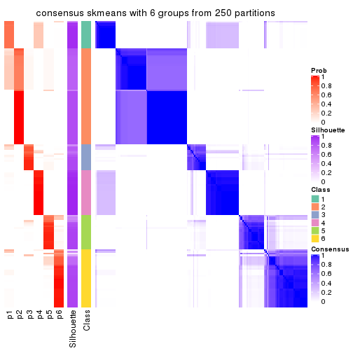</p>

</div>
</div>

Heatmaps for the membership of samples in all partitions to see how consistent they are:


<script>
$( function() {
	$( '#tabs-ATC-skmeans-membership-heatmap' ).tabs();
} );
</script>
<div id='tabs-ATC-skmeans-membership-heatmap'>
<ul>
<li><a href='#tab-ATC-skmeans-membership-heatmap-1'>k = 2</a></li>
<li><a href='#tab-ATC-skmeans-membership-heatmap-2'>k = 3</a></li>
<li><a href='#tab-ATC-skmeans-membership-heatmap-3'>k = 4</a></li>
<li><a href='#tab-ATC-skmeans-membership-heatmap-4'>k = 5</a></li>
<li><a href='#tab-ATC-skmeans-membership-heatmap-5'>k = 6</a></li>
</ul>
<div id='tab-ATC-skmeans-membership-heatmap-1'>
<pre><code class="r">membership_heatmap(res, k = 2)
</code></pre>

<p></p>

</div>
<div id='tab-ATC-skmeans-membership-heatmap-2'>
<pre><code class="r">membership_heatmap(res, k = 3)
</code></pre>

<p></p>

</div>
<div id='tab-ATC-skmeans-membership-heatmap-3'>
<pre><code class="r">membership_heatmap(res, k = 4)
</code></pre>

<p></p>

</div>
<div id='tab-ATC-skmeans-membership-heatmap-4'>
<pre><code class="r">membership_heatmap(res, k = 5)
</code></pre>

<p></p>

</div>
<div id='tab-ATC-skmeans-membership-heatmap-5'>
<pre><code class="r">membership_heatmap(res, k = 6)
</code></pre>

<p></p>

</div>
</div>

As soon as we have had the classes for columns, we can look for signatures
which are significantly different between classes which can be candidate marks
for certain classes. Following are the heatmaps for signatures.


Signature heatmaps where rows are scaled:


<script>
$( function() {
	$( '#tabs-ATC-skmeans-get-signatures' ).tabs();
} );
</script>
<div id='tabs-ATC-skmeans-get-signatures'>
<ul>
<li><a href='#tab-ATC-skmeans-get-signatures-1'>k = 2</a></li>
<li><a href='#tab-ATC-skmeans-get-signatures-2'>k = 3</a></li>
<li><a href='#tab-ATC-skmeans-get-signatures-3'>k = 4</a></li>
<li><a href='#tab-ATC-skmeans-get-signatures-4'>k = 5</a></li>
<li><a href='#tab-ATC-skmeans-get-signatures-5'>k = 6</a></li>
</ul>
<div id='tab-ATC-skmeans-get-signatures-1'>
<pre><code class="r">get_signatures(res, k = 2)
</code></pre>

<p></p>

</div>
<div id='tab-ATC-skmeans-get-signatures-2'>
<pre><code class="r">get_signatures(res, k = 3)
</code></pre>

<p></p>

</div>
<div id='tab-ATC-skmeans-get-signatures-3'>
<pre><code class="r">get_signatures(res, k = 4)
</code></pre>

<p></p>

</div>
<div id='tab-ATC-skmeans-get-signatures-4'>
<pre><code class="r">get_signatures(res, k = 5)
</code></pre>

<p></p>

</div>
<div id='tab-ATC-skmeans-get-signatures-5'>
<pre><code class="r">get_signatures(res, k = 6)
</code></pre>

<p></p>

</div>
</div>


Signature heatmaps where rows are not scaled:


<script>
$( function() {
	$( '#tabs-ATC-skmeans-get-signatures-no-scale' ).tabs();
} );
</script>
<div id='tabs-ATC-skmeans-get-signatures-no-scale'>
<ul>
<li><a href='#tab-ATC-skmeans-get-signatures-no-scale-1'>k = 2</a></li>
<li><a href='#tab-ATC-skmeans-get-signatures-no-scale-2'>k = 3</a></li>
<li><a href='#tab-ATC-skmeans-get-signatures-no-scale-3'>k = 4</a></li>
<li><a href='#tab-ATC-skmeans-get-signatures-no-scale-4'>k = 5</a></li>
<li><a href='#tab-ATC-skmeans-get-signatures-no-scale-5'>k = 6</a></li>
</ul>
<div id='tab-ATC-skmeans-get-signatures-no-scale-1'>
<pre><code class="r">get_signatures(res, k = 2, scale_rows = FALSE)
</code></pre>

<p></p>

</div>
<div id='tab-ATC-skmeans-get-signatures-no-scale-2'>
<pre><code class="r">get_signatures(res, k = 3, scale_rows = FALSE)
</code></pre>

<p></p>

</div>
<div id='tab-ATC-skmeans-get-signatures-no-scale-3'>
<pre><code class="r">get_signatures(res, k = 4, scale_rows = FALSE)
</code></pre>

<p></p>

</div>
<div id='tab-ATC-skmeans-get-signatures-no-scale-4'>
<pre><code class="r">get_signatures(res, k = 5, scale_rows = FALSE)
</code></pre>

<p></p>

</div>
<div id='tab-ATC-skmeans-get-signatures-no-scale-5'>
<pre><code class="r">get_signatures(res, k = 6, scale_rows = FALSE)
</code></pre>

<p></p>

</div>
</div>


Compare the overlap of signatures from different k:

```r
compare_signatures(res)
```


`get_signature()` returns a data frame invisibly. TO get the list of signatures, the function
call should be assigned to a variable explicitly. In following code, if `plot` argument is set
to `FALSE`, no heatmap is plotted while only the differential analysis is performed.

```r
# code only for demonstration
tb = get_signature(res, k = ..., plot = FALSE)
```

An example of the output of `tb` is:

```
#>   which_row         fdr    mean_1    mean_2 scaled_mean_1 scaled_mean_2 km
#> 1        38 0.042760348  8.373488  9.131774    -0.5533452     0.5164555  1
#> 2        40 0.018707592  7.106213  8.469186    -0.6173731     0.5762149  1
#> 3        55 0.019134737 10.221463 11.207825    -0.6159697     0.5749050  1
#> 4        59 0.006059896  5.921854  7.869574    -0.6899429     0.6439467  1
#> 5        60 0.018055526  8.928898 10.211722    -0.6204761     0.5791110  1
#> 6        98 0.009384629 15.714769 14.887706     0.6635654    -0.6193277  2
...
```

The columns in `tb` are:

1. `which_row`: row indices corresponding to the input matrix.
2. `fdr`: FDR for the differential test. 
3. `mean_x`: The mean value in group x.
4. `scaled_mean_x`: The mean value in group x after rows are scaled.
5. `km`: Row groups if k-means clustering is applied to rows.


UMAP plot which shows how samples are separated.


<script>
$( function() {
	$( '#tabs-ATC-skmeans-dimension-reduction' ).tabs();
} );
</script>
<div id='tabs-ATC-skmeans-dimension-reduction'>
<ul>
<li><a href='#tab-ATC-skmeans-dimension-reduction-1'>k = 2</a></li>
<li><a href='#tab-ATC-skmeans-dimension-reduction-2'>k = 3</a></li>
<li><a href='#tab-ATC-skmeans-dimension-reduction-3'>k = 4</a></li>
<li><a href='#tab-ATC-skmeans-dimension-reduction-4'>k = 5</a></li>
<li><a href='#tab-ATC-skmeans-dimension-reduction-5'>k = 6</a></li>
</ul>
<div id='tab-ATC-skmeans-dimension-reduction-1'>
<pre><code class="r">dimension_reduction(res, k = 2, method = &quot;UMAP&quot;)
</code></pre>

<p></p>

</div>
<div id='tab-ATC-skmeans-dimension-reduction-2'>
<pre><code class="r">dimension_reduction(res, k = 3, method = &quot;UMAP&quot;)
</code></pre>

<p></p>

</div>
<div id='tab-ATC-skmeans-dimension-reduction-3'>
<pre><code class="r">dimension_reduction(res, k = 4, method = &quot;UMAP&quot;)
</code></pre>

<p></p>

</div>
<div id='tab-ATC-skmeans-dimension-reduction-4'>
<pre><code class="r">dimension_reduction(res, k = 5, method = &quot;UMAP&quot;)
</code></pre>

<p></p>

</div>
<div id='tab-ATC-skmeans-dimension-reduction-5'>
<pre><code class="r">dimension_reduction(res, k = 6, method = &quot;UMAP&quot;)
</code></pre>

<p></p>

</div>
</div>


Following heatmap shows how subgroups are split when increasing `k`:

```r
collect_classes(res)
```


If matrix rows can be associated to genes, consider to use `functional_enrichment(res,
...)` to perform function enrichment for the signature genes. See [this vignette](http://bioconductor.org/packages/devel/bioc/vignettes/cola/inst/doc/functional_enrichment.html) for more detailed explanations.


 

---------------------------------------------------


### ATC:pam**


The object with results only for a single top-value method and a single partition method 
can be extracted as:

```r
res = res_list["ATC", "pam"]
# you can also extract it by
# res = res_list["ATC:pam"]
```

A summary of `res` and all the functions that can be applied to it:

```r
res
```

```
#> A 'ConsensusPartition' object with k = 2, 3, 4, 5, 6.
#>   On a matrix with 18147 rows and 167 columns.
#>   Top rows (1000, 2000, 3000, 4000, 5000) are extracted by 'ATC' method.
#>   Subgroups are detected by 'pam' method.
#>   Performed in total 1250 partitions by row resampling.
#>   Best k for subgroups seems to be 4.
#> 
#> Following methods can be applied to this 'ConsensusPartition' object:
#>  [1] "cola_report"             "collect_classes"         "collect_plots"          
#>  [4] "collect_stats"           "colnames"                "compare_signatures"     
#>  [7] "consensus_heatmap"       "dimension_reduction"     "functional_enrichment"  
#> [10] "get_anno_col"            "get_anno"                "get_classes"            
#> [13] "get_consensus"           "get_matrix"              "get_membership"         
#> [16] "get_param"               "get_signatures"          "get_stats"              
#> [19] "is_best_k"               "is_stable_k"             "membership_heatmap"     
#> [22] "ncol"                    "nrow"                    "plot_ecdf"              
#> [25] "rownames"                "select_partition_number" "show"                   
#> [28] "suggest_best_k"          "test_to_known_factors"
```

`collect_plots()` function collects all the plots made from `res` for all `k` (number of partitions)
into one single page to provide an easy and fast comparison between different `k`.

```r
collect_plots(res)
```


The plots are:

- The first row: a plot of the ECDF (empirical cumulative distribution
  function) curves of the consensus matrix for each `k` and the heatmap of
  predicted classes for each `k`.
- The second row: heatmaps of the consensus matrix for each `k`.
- The third row: heatmaps of the membership matrix for each `k`.
- The fouth row: heatmaps of the signatures for each `k`.

All the plots in panels can be made by individual functions and they are
plotted later in this section.

`select_partition_number()` produces several plots showing different
statistics for choosing "optimized" `k`. There are following statistics:

- ECDF curves of the consensus matrix for each `k`;
- 1-PAC. [The PAC
  score](https://en.wikipedia.org/wiki/Consensus_clustering#Over-interpretation_potential_of_consensus_clustering)
  measures the proportion of the ambiguous subgrouping.
- Mean silhouette score.
- Concordance. The mean probability of fiting the consensus class ids in all
  partitions.
- Area increased. Denote $A_k$ as the area under the ECDF curve for current
  `k`, the area increased is defined as $A_k - A_{k-1}$.
- Rand index. The percent of pairs of samples that are both in a same cluster
  or both are not in a same cluster in the partition of k and k-1.
- Jaccard index. The ratio of pairs of samples are both in a same cluster in
  the partition of k and k-1 and the pairs of samples are both in a same
  cluster in the partition k or k-1.

The detailed explanations of these statistics can be found in [the _cola_
vignette](http://bioconductor.org/packages/devel/bioc/vignettes/cola/inst/doc/cola.html#toc_13).

Generally speaking, lower PAC score, higher mean silhouette score or higher
concordance corresponds to better partition. Rand index and Jaccard index
measure how similar the current partition is compared to partition with `k-1`.
If they are too similar, we won't accept `k` is better than `k-1`.

```r
select_partition_number(res)
```


The numeric values for all these statistics can be obtained by `get_stats()`.

```r
get_stats(res)
```

```
#>   k 1-PAC mean_silhouette concordance area_increased  Rand Jaccard
#> 2 2 1.000           1.000       1.000         0.4408 0.560   0.560
#> 3 3 0.765           0.749       0.890         0.4302 0.787   0.625
#> 4 4 0.993           0.941       0.974         0.1037 0.835   0.604
#> 5 5 0.776           0.758       0.820         0.0977 0.914   0.728
#> 6 6 0.804           0.727       0.862         0.0789 0.876   0.534
```

`suggest_best_k()` suggests the best $k$ based on these statistics. The rules are as follows:

- All $k$ with Jaccard index larger than 0.95 are removed because increasing
  $k$ does not provide enough extra information. If all $k$ are removed, it is
  marked as no subgroup is detected.
- For all $k$ with 1-PAC score larger than 0.9, the maximal $k$ is taken as
  the best $k$, and other $k$ are marked as optional $k$.
- If it does not fit the second rule. The $k$ with the maximal vote of the
  highest 1-PAC score, highest mean silhouette, and highest concordance is
  taken as the best $k$.

```r
suggest_best_k(res)
```

```
#> [1] 4
#> attr(,"optional")
#> [1] 2
```

There is also optional best $k$ = 2 that is worth to check.

Following shows the table of the partitions (You need to click the **show/hide
code output** link to see it). The membership matrix (columns with name `p*`)
is inferred by
[`clue::cl_consensus()`](https://www.rdocumentation.org/link/cl_consensus?package=clue)
function with the `SE` method. Basically the value in the membership matrix
represents the probability to belong to a certain group. The finall class
label for an item is determined with the group with highest probability it
belongs to.

In `get_classes()` function, the entropy is calculated from the membership
matrix and the silhouette score is calculated from the consensus matrix.


<script>
$( function() {
	$( '#tabs-ATC-pam-get-classes' ).tabs();
} );
</script>
<div id='tabs-ATC-pam-get-classes'>
<ul>
<li><a href='#tab-ATC-pam-get-classes-1'>k = 2</a></li>
<li><a href='#tab-ATC-pam-get-classes-2'>k = 3</a></li>
<li><a href='#tab-ATC-pam-get-classes-3'>k = 4</a></li>
<li><a href='#tab-ATC-pam-get-classes-4'>k = 5</a></li>
<li><a href='#tab-ATC-pam-get-classes-5'>k = 6</a></li>
</ul>

<div id='tab-ATC-pam-get-classes-1'>
<p><a id='tab-ATC-pam-get-classes-1-a' style='color:#0366d6' href='#'>show/hide code output</a></p>
<pre><code class="r">cbind(get_classes(res, k = 2), get_membership(res, k = 2))
</code></pre>

<pre><code>#&gt;            class entropy silhouette    p1    p2
#&gt; SRR1313062     1  0.0000      1.000 1.000 0.000
#&gt; SRR1313063     1  0.0000      1.000 1.000 0.000
#&gt; SRR1313064     1  0.0000      1.000 1.000 0.000
#&gt; SRR1313065     1  0.0000      1.000 1.000 0.000
#&gt; SRR1313066     1  0.0000      1.000 1.000 0.000
#&gt; SRR1313067     1  0.0000      1.000 1.000 0.000
#&gt; SRR1313068     1  0.0000      1.000 1.000 0.000
#&gt; SRR1313069     1  0.0000      1.000 1.000 0.000
#&gt; SRR1313070     1  0.0000      1.000 1.000 0.000
#&gt; SRR1313071     1  0.0000      1.000 1.000 0.000
#&gt; SRR1313072     1  0.0000      1.000 1.000 0.000
#&gt; SRR1313073     1  0.0000      1.000 1.000 0.000
#&gt; SRR1313074     1  0.0000      1.000 1.000 0.000
#&gt; SRR1313075     1  0.0000      1.000 1.000 0.000
#&gt; SRR1313076     1  0.0000      1.000 1.000 0.000
#&gt; SRR1313077     1  0.0000      1.000 1.000 0.000
#&gt; SRR1313078     1  0.0000      1.000 1.000 0.000
#&gt; SRR1313079     1  0.0000      1.000 1.000 0.000
#&gt; SRR1313080     1  0.0000      1.000 1.000 0.000
#&gt; SRR1313081     1  0.0000      1.000 1.000 0.000
#&gt; SRR1313082     1  0.0000      1.000 1.000 0.000
#&gt; SRR1313083     1  0.0000      1.000 1.000 0.000
#&gt; SRR1313084     1  0.0000      1.000 1.000 0.000
#&gt; SRR1313085     1  0.0000      1.000 1.000 0.000
#&gt; SRR1313086     1  0.0000      1.000 1.000 0.000
#&gt; SRR1313087     1  0.0000      1.000 1.000 0.000
#&gt; SRR1313088     1  0.0000      1.000 1.000 0.000
#&gt; SRR1313089     1  0.0000      1.000 1.000 0.000
#&gt; SRR1313092     1  0.0000      1.000 1.000 0.000
#&gt; SRR1313090     1  0.0000      1.000 1.000 0.000
#&gt; SRR1313091     1  0.0000      1.000 1.000 0.000
#&gt; SRR1313093     1  0.0000      1.000 1.000 0.000
#&gt; SRR1313095     1  0.0000      1.000 1.000 0.000
#&gt; SRR1313096     1  0.0000      1.000 1.000 0.000
#&gt; SRR1313094     1  0.0000      1.000 1.000 0.000
#&gt; SRR1313097     1  0.0000      1.000 1.000 0.000
#&gt; SRR1313099     1  0.0000      1.000 1.000 0.000
#&gt; SRR1313098     1  0.0000      1.000 1.000 0.000
#&gt; SRR1313101     1  0.0000      1.000 1.000 0.000
#&gt; SRR1313102     1  0.0000      1.000 1.000 0.000
#&gt; SRR1313103     1  0.0000      1.000 1.000 0.000
#&gt; SRR1313100     1  0.0000      1.000 1.000 0.000
#&gt; SRR1313105     1  0.0000      1.000 1.000 0.000
#&gt; SRR1313104     1  0.0000      1.000 1.000 0.000
#&gt; SRR1313107     1  0.0000      1.000 1.000 0.000
#&gt; SRR1313106     1  0.0000      1.000 1.000 0.000
#&gt; SRR1313109     1  0.0000      1.000 1.000 0.000
#&gt; SRR1313108     1  0.0000      1.000 1.000 0.000
#&gt; SRR1313111     1  0.0000      1.000 1.000 0.000
#&gt; SRR1313110     1  0.0000      1.000 1.000 0.000
#&gt; SRR1313112     1  0.0000      1.000 1.000 0.000
#&gt; SRR1313113     1  0.0000      1.000 1.000 0.000
#&gt; SRR1313115     1  0.0000      1.000 1.000 0.000
#&gt; SRR1313114     1  0.0000      1.000 1.000 0.000
#&gt; SRR1313117     1  0.0000      1.000 1.000 0.000
#&gt; SRR1313118     1  0.0000      1.000 1.000 0.000
#&gt; SRR1313116     1  0.0000      1.000 1.000 0.000
#&gt; SRR1313120     1  0.0000      1.000 1.000 0.000
#&gt; SRR1313119     1  0.0000      1.000 1.000 0.000
#&gt; SRR1313122     1  0.0000      1.000 1.000 0.000
#&gt; SRR1313124     1  0.0000      1.000 1.000 0.000
#&gt; SRR1313121     1  0.0000      1.000 1.000 0.000
#&gt; SRR1313125     1  0.0000      1.000 1.000 0.000
#&gt; SRR1313127     1  0.0000      1.000 1.000 0.000
#&gt; SRR1313123     1  0.0000      1.000 1.000 0.000
#&gt; SRR1313128     1  0.0000      1.000 1.000 0.000
#&gt; SRR1313126     1  0.0000      1.000 1.000 0.000
#&gt; SRR1313130     1  0.1633      0.975 0.976 0.024
#&gt; SRR1313132     1  0.0000      1.000 1.000 0.000
#&gt; SRR1313129     1  0.0000      1.000 1.000 0.000
#&gt; SRR1313133     1  0.0000      1.000 1.000 0.000
#&gt; SRR1313131     1  0.0000      1.000 1.000 0.000
#&gt; SRR1313134     1  0.0000      1.000 1.000 0.000
#&gt; SRR1313135     1  0.0000      1.000 1.000 0.000
#&gt; SRR1313136     1  0.0000      1.000 1.000 0.000
#&gt; SRR1313137     1  0.0000      1.000 1.000 0.000
#&gt; SRR1313138     1  0.0000      1.000 1.000 0.000
#&gt; SRR1313140     1  0.0000      1.000 1.000 0.000
#&gt; SRR1313141     1  0.0000      1.000 1.000 0.000
#&gt; SRR1313139     1  0.0000      1.000 1.000 0.000
#&gt; SRR1313143     1  0.0000      1.000 1.000 0.000
#&gt; SRR1313142     1  0.0000      1.000 1.000 0.000
#&gt; SRR1313144     1  0.0000      1.000 1.000 0.000
#&gt; SRR1313145     1  0.0000      1.000 1.000 0.000
#&gt; SRR1313146     1  0.0000      1.000 1.000 0.000
#&gt; SRR1313147     1  0.0000      1.000 1.000 0.000
#&gt; SRR1313150     1  0.0000      1.000 1.000 0.000
#&gt; SRR1313149     1  0.0000      1.000 1.000 0.000
#&gt; SRR1313152     1  0.0000      1.000 1.000 0.000
#&gt; SRR1313151     1  0.0000      1.000 1.000 0.000
#&gt; SRR1313154     1  0.0000      1.000 1.000 0.000
#&gt; SRR1313153     1  0.0000      1.000 1.000 0.000
#&gt; SRR1313156     1  0.0000      1.000 1.000 0.000
#&gt; SRR1313155     1  0.0000      1.000 1.000 0.000
#&gt; SRR1313157     1  0.0000      1.000 1.000 0.000
#&gt; SRR1313158     1  0.0000      1.000 1.000 0.000
#&gt; SRR1313161     1  0.0000      1.000 1.000 0.000
#&gt; SRR1313159     1  0.0000      1.000 1.000 0.000
#&gt; SRR1313160     1  0.0000      1.000 1.000 0.000
#&gt; SRR1313162     1  0.0000      1.000 1.000 0.000
#&gt; SRR1313163     1  0.0000      1.000 1.000 0.000
#&gt; SRR1313165     1  0.0000      1.000 1.000 0.000
#&gt; SRR1313166     1  0.0000      1.000 1.000 0.000
#&gt; SRR1313164     1  0.0000      1.000 1.000 0.000
#&gt; SRR1313167     1  0.0000      1.000 1.000 0.000
#&gt; SRR1313168     1  0.0000      1.000 1.000 0.000
#&gt; SRR1313170     1  0.0000      1.000 1.000 0.000
#&gt; SRR1313169     1  0.0000      1.000 1.000 0.000
#&gt; SRR1313172     1  0.0000      1.000 1.000 0.000
#&gt; SRR1313171     1  0.0000      1.000 1.000 0.000
#&gt; SRR1313174     2  0.0000      1.000 0.000 1.000
#&gt; SRR1313173     1  0.0000      1.000 1.000 0.000
#&gt; SRR1313176     2  0.0000      1.000 0.000 1.000
#&gt; SRR1313175     2  0.0000      1.000 0.000 1.000
#&gt; SRR1313178     2  0.0000      1.000 0.000 1.000
#&gt; SRR1313177     2  0.0000      1.000 0.000 1.000
#&gt; SRR1313179     2  0.0000      1.000 0.000 1.000
#&gt; SRR1313180     2  0.0000      1.000 0.000 1.000
#&gt; SRR1313181     2  0.0000      1.000 0.000 1.000
#&gt; SRR1313183     2  0.0000      1.000 0.000 1.000
#&gt; SRR1313182     2  0.0000      1.000 0.000 1.000
#&gt; SRR1313184     2  0.0000      1.000 0.000 1.000
#&gt; SRR1313185     2  0.0000      1.000 0.000 1.000
#&gt; SRR1313188     2  0.0000      1.000 0.000 1.000
#&gt; SRR1313187     2  0.0000      1.000 0.000 1.000
#&gt; SRR1313186     2  0.0000      1.000 0.000 1.000
#&gt; SRR1313189     2  0.0000      1.000 0.000 1.000
#&gt; SRR1313190     2  0.0000      1.000 0.000 1.000
#&gt; SRR1313191     2  0.0000      1.000 0.000 1.000
#&gt; SRR1313192     2  0.0000      1.000 0.000 1.000
#&gt; SRR1313193     2  0.0000      1.000 0.000 1.000
#&gt; SRR1313194     2  0.0000      1.000 0.000 1.000
#&gt; SRR1313195     2  0.0000      1.000 0.000 1.000
#&gt; SRR1313196     2  0.0000      1.000 0.000 1.000
#&gt; SRR1313197     2  0.0000      1.000 0.000 1.000
#&gt; SRR1313198     2  0.0000      1.000 0.000 1.000
#&gt; SRR1313199     2  0.0000      1.000 0.000 1.000
#&gt; SRR1313200     2  0.0000      1.000 0.000 1.000
#&gt; SRR1313201     2  0.0000      1.000 0.000 1.000
#&gt; SRR1313202     2  0.0000      1.000 0.000 1.000
#&gt; SRR1313203     1  0.0000      1.000 1.000 0.000
#&gt; SRR1313204     2  0.0000      1.000 0.000 1.000
#&gt; SRR1313205     2  0.0000      1.000 0.000 1.000
#&gt; SRR1313207     2  0.0000      1.000 0.000 1.000
#&gt; SRR1313208     2  0.0000      1.000 0.000 1.000
#&gt; SRR1313206     2  0.0000      1.000 0.000 1.000
#&gt; SRR1313210     2  0.0000      1.000 0.000 1.000
#&gt; SRR1313209     2  0.0000      1.000 0.000 1.000
#&gt; SRR1313211     2  0.0000      1.000 0.000 1.000
#&gt; SRR1313212     2  0.0000      1.000 0.000 1.000
#&gt; SRR1313214     2  0.0000      1.000 0.000 1.000
#&gt; SRR1313215     2  0.0000      1.000 0.000 1.000
#&gt; SRR1313213     2  0.0000      1.000 0.000 1.000
#&gt; SRR1313216     2  0.0938      0.988 0.012 0.988
#&gt; SRR1313217     2  0.0000      1.000 0.000 1.000
#&gt; SRR1313219     2  0.0000      1.000 0.000 1.000
#&gt; SRR1313220     2  0.0000      1.000 0.000 1.000
#&gt; SRR1313218     2  0.0000      1.000 0.000 1.000
#&gt; SRR1313222     2  0.0000      1.000 0.000 1.000
#&gt; SRR1313221     2  0.0000      1.000 0.000 1.000
#&gt; SRR1313223     2  0.0000      1.000 0.000 1.000
#&gt; SRR1313224     2  0.0000      1.000 0.000 1.000
#&gt; SRR1313225     2  0.0000      1.000 0.000 1.000
#&gt; SRR1313226     1  0.0000      1.000 1.000 0.000
#&gt; SRR1313227     2  0.0000      1.000 0.000 1.000
#&gt; SRR1313228     2  0.0000      1.000 0.000 1.000
#&gt; SRR1313229     2  0.0000      1.000 0.000 1.000
</code></pre>

<script>
$('#tab-ATC-pam-get-classes-1-a').parent().next().next().hide();
$('#tab-ATC-pam-get-classes-1-a').click(function(){
  $('#tab-ATC-pam-get-classes-1-a').parent().next().next().toggle();
  return(false);
});
</script>
</div>

<div id='tab-ATC-pam-get-classes-2'>
<p><a id='tab-ATC-pam-get-classes-2-a' style='color:#0366d6' href='#'>show/hide code output</a></p>
<pre><code class="r">cbind(get_classes(res, k = 3), get_membership(res, k = 3))
</code></pre>

<pre><code>#&gt;            class entropy silhouette    p1    p2    p3
#&gt; SRR1313062     1  0.0000     0.8224 1.000 0.000 0.000
#&gt; SRR1313063     1  0.0000     0.8224 1.000 0.000 0.000
#&gt; SRR1313064     1  0.0000     0.8224 1.000 0.000 0.000
#&gt; SRR1313065     1  0.6286    -0.1039 0.536 0.000 0.464
#&gt; SRR1313066     1  0.0000     0.8224 1.000 0.000 0.000
#&gt; SRR1313067     3  0.5968     0.5662 0.364 0.000 0.636
#&gt; SRR1313068     1  0.1411     0.7959 0.964 0.000 0.036
#&gt; SRR1313069     1  0.0000     0.8224 1.000 0.000 0.000
#&gt; SRR1313070     1  0.0000     0.8224 1.000 0.000 0.000
#&gt; SRR1313071     1  0.0000     0.8224 1.000 0.000 0.000
#&gt; SRR1313072     1  0.0000     0.8224 1.000 0.000 0.000
#&gt; SRR1313073     1  0.0000     0.8224 1.000 0.000 0.000
#&gt; SRR1313074     1  0.0000     0.8224 1.000 0.000 0.000
#&gt; SRR1313075     1  0.0000     0.8224 1.000 0.000 0.000
#&gt; SRR1313076     1  0.0000     0.8224 1.000 0.000 0.000
#&gt; SRR1313077     1  0.0747     0.8125 0.984 0.000 0.016
#&gt; SRR1313078     3  0.0424     0.7646 0.008 0.000 0.992
#&gt; SRR1313079     1  0.0000     0.8224 1.000 0.000 0.000
#&gt; SRR1313080     1  0.2959     0.7359 0.900 0.000 0.100
#&gt; SRR1313081     1  0.6274    -0.0719 0.544 0.000 0.456
#&gt; SRR1313082     1  0.0237     0.8203 0.996 0.000 0.004
#&gt; SRR1313083     3  0.6235     0.4198 0.436 0.000 0.564
#&gt; SRR1313084     1  0.0000     0.8224 1.000 0.000 0.000
#&gt; SRR1313085     1  0.0000     0.8224 1.000 0.000 0.000
#&gt; SRR1313086     1  0.0000     0.8224 1.000 0.000 0.000
#&gt; SRR1313087     1  0.0000     0.8224 1.000 0.000 0.000
#&gt; SRR1313088     1  0.0000     0.8224 1.000 0.000 0.000
#&gt; SRR1313089     1  0.0000     0.8224 1.000 0.000 0.000
#&gt; SRR1313092     3  0.4974     0.6722 0.236 0.000 0.764
#&gt; SRR1313090     3  0.5968     0.5662 0.364 0.000 0.636
#&gt; SRR1313091     3  0.3155     0.7556 0.040 0.044 0.916
#&gt; SRR1313093     3  0.0000     0.7659 0.000 0.000 1.000
#&gt; SRR1313095     3  0.5968     0.5662 0.364 0.000 0.636
#&gt; SRR1313096     3  0.0000     0.7659 0.000 0.000 1.000
#&gt; SRR1313094     3  0.0000     0.7659 0.000 0.000 1.000
#&gt; SRR1313097     3  0.5968     0.5662 0.364 0.000 0.636
#&gt; SRR1313099     3  0.0237     0.7671 0.004 0.000 0.996
#&gt; SRR1313098     3  0.1529     0.7732 0.040 0.000 0.960
#&gt; SRR1313101     3  0.5968     0.5662 0.364 0.000 0.636
#&gt; SRR1313102     3  0.5968     0.5662 0.364 0.000 0.636
#&gt; SRR1313103     3  0.1289     0.7725 0.032 0.000 0.968
#&gt; SRR1313100     1  0.0000     0.8224 1.000 0.000 0.000
#&gt; SRR1313105     3  0.1529     0.7732 0.040 0.000 0.960
#&gt; SRR1313104     3  0.3038     0.7523 0.104 0.000 0.896
#&gt; SRR1313107     3  0.0000     0.7659 0.000 0.000 1.000
#&gt; SRR1313106     3  0.5968     0.5662 0.364 0.000 0.636
#&gt; SRR1313109     3  0.1529     0.7732 0.040 0.000 0.960
#&gt; SRR1313108     3  0.0000     0.7659 0.000 0.000 1.000
#&gt; SRR1313111     3  0.1529     0.7732 0.040 0.000 0.960
#&gt; SRR1313110     3  0.5968     0.5662 0.364 0.000 0.636
#&gt; SRR1313112     3  0.5968     0.5662 0.364 0.000 0.636
#&gt; SRR1313113     3  0.1643     0.7730 0.044 0.000 0.956
#&gt; SRR1313115     3  0.0000     0.7659 0.000 0.000 1.000
#&gt; SRR1313114     3  0.5968     0.5662 0.364 0.000 0.636
#&gt; SRR1313117     3  0.5968     0.5662 0.364 0.000 0.636
#&gt; SRR1313118     3  0.6079     0.5279 0.388 0.000 0.612
#&gt; SRR1313116     3  0.2878     0.7562 0.096 0.000 0.904
#&gt; SRR1313120     3  0.0000     0.7659 0.000 0.000 1.000
#&gt; SRR1313119     3  0.5968     0.5662 0.364 0.000 0.636
#&gt; SRR1313122     3  0.5968     0.5662 0.364 0.000 0.636
#&gt; SRR1313124     3  0.5968     0.5662 0.364 0.000 0.636
#&gt; SRR1313121     3  0.6126     0.5021 0.400 0.000 0.600
#&gt; SRR1313125     3  0.5968     0.5662 0.364 0.000 0.636
#&gt; SRR1313127     3  0.2537     0.7640 0.080 0.000 0.920
#&gt; SRR1313123     3  0.1529     0.7732 0.040 0.000 0.960
#&gt; SRR1313128     3  0.0000     0.7659 0.000 0.000 1.000
#&gt; SRR1313126     3  0.6008     0.5560 0.372 0.000 0.628
#&gt; SRR1313130     2  0.6728     0.6255 0.184 0.736 0.080
#&gt; SRR1313132     3  0.0000     0.7659 0.000 0.000 1.000
#&gt; SRR1313129     3  0.4605     0.6949 0.204 0.000 0.796
#&gt; SRR1313133     3  0.0000     0.7659 0.000 0.000 1.000
#&gt; SRR1313131     3  0.0000     0.7659 0.000 0.000 1.000
#&gt; SRR1313134     3  0.0000     0.7659 0.000 0.000 1.000
#&gt; SRR1313135     1  0.6291    -0.1204 0.532 0.000 0.468
#&gt; SRR1313136     3  0.1964     0.7702 0.056 0.000 0.944
#&gt; SRR1313137     3  0.6291     0.3273 0.468 0.000 0.532
#&gt; SRR1313138     3  0.6008     0.5545 0.372 0.000 0.628
#&gt; SRR1313140     1  0.4178     0.6518 0.828 0.000 0.172
#&gt; SRR1313141     3  0.0000     0.7659 0.000 0.000 1.000
#&gt; SRR1313139     1  0.4504     0.6165 0.804 0.000 0.196
#&gt; SRR1313143     3  0.0000     0.7659 0.000 0.000 1.000
#&gt; SRR1313142     3  0.1753     0.7721 0.048 0.000 0.952
#&gt; SRR1313144     1  0.6274    -0.0719 0.544 0.000 0.456
#&gt; SRR1313145     3  0.1964     0.7702 0.056 0.000 0.944
#&gt; SRR1313146     3  0.1163     0.7671 0.028 0.000 0.972
#&gt; SRR1313147     1  0.6274    -0.0719 0.544 0.000 0.456
#&gt; SRR1313150     1  0.5859     0.3052 0.656 0.000 0.344
#&gt; SRR1313149     3  0.0000     0.7659 0.000 0.000 1.000
#&gt; SRR1313152     3  0.6308     0.2440 0.492 0.000 0.508
#&gt; SRR1313151     3  0.0424     0.7646 0.008 0.000 0.992
#&gt; SRR1313154     3  0.0237     0.7654 0.004 0.000 0.996
#&gt; SRR1313153     3  0.1964     0.7702 0.056 0.000 0.944
#&gt; SRR1313156     3  0.1529     0.7732 0.040 0.000 0.960
#&gt; SRR1313155     3  0.1964     0.7702 0.056 0.000 0.944
#&gt; SRR1313157     1  0.6274    -0.0719 0.544 0.000 0.456
#&gt; SRR1313158     3  0.1529     0.7732 0.040 0.000 0.960
#&gt; SRR1313161     3  0.6307     0.2588 0.488 0.000 0.512
#&gt; SRR1313159     3  0.1529     0.7732 0.040 0.000 0.960
#&gt; SRR1313160     3  0.6225     0.4309 0.432 0.000 0.568
#&gt; SRR1313162     3  0.1964     0.7702 0.056 0.000 0.944
#&gt; SRR1313163     3  0.6008     0.5545 0.372 0.000 0.628
#&gt; SRR1313165     3  0.6252     0.3996 0.444 0.000 0.556
#&gt; SRR1313166     3  0.0000     0.7659 0.000 0.000 1.000
#&gt; SRR1313164     3  0.0000     0.7659 0.000 0.000 1.000
#&gt; SRR1313167     3  0.6008     0.5560 0.372 0.000 0.628
#&gt; SRR1313168     3  0.6244     0.4107 0.440 0.000 0.560
#&gt; SRR1313170     3  0.5968     0.5662 0.364 0.000 0.636
#&gt; SRR1313169     1  0.6309    -0.2316 0.504 0.000 0.496
#&gt; SRR1313172     3  0.0000     0.7659 0.000 0.000 1.000
#&gt; SRR1313171     3  0.0000     0.7659 0.000 0.000 1.000
#&gt; SRR1313174     2  0.0000     0.9801 0.000 1.000 0.000
#&gt; SRR1313173     3  0.0000     0.7659 0.000 0.000 1.000
#&gt; SRR1313176     2  0.0000     0.9801 0.000 1.000 0.000
#&gt; SRR1313175     2  0.0000     0.9801 0.000 1.000 0.000
#&gt; SRR1313178     2  0.0000     0.9801 0.000 1.000 0.000
#&gt; SRR1313177     2  0.0000     0.9801 0.000 1.000 0.000
#&gt; SRR1313179     2  0.0000     0.9801 0.000 1.000 0.000
#&gt; SRR1313180     2  0.5098     0.6223 0.248 0.752 0.000
#&gt; SRR1313181     2  0.0000     0.9801 0.000 1.000 0.000
#&gt; SRR1313183     2  0.0000     0.9801 0.000 1.000 0.000
#&gt; SRR1313182     2  0.0000     0.9801 0.000 1.000 0.000
#&gt; SRR1313184     2  0.0000     0.9801 0.000 1.000 0.000
#&gt; SRR1313185     2  0.0000     0.9801 0.000 1.000 0.000
#&gt; SRR1313188     2  0.0000     0.9801 0.000 1.000 0.000
#&gt; SRR1313187     2  0.0000     0.9801 0.000 1.000 0.000
#&gt; SRR1313186     2  0.0000     0.9801 0.000 1.000 0.000
#&gt; SRR1313189     2  0.0000     0.9801 0.000 1.000 0.000
#&gt; SRR1313190     2  0.0000     0.9801 0.000 1.000 0.000
#&gt; SRR1313191     2  0.0000     0.9801 0.000 1.000 0.000
#&gt; SRR1313192     2  0.0000     0.9801 0.000 1.000 0.000
#&gt; SRR1313193     2  0.0000     0.9801 0.000 1.000 0.000
#&gt; SRR1313194     2  0.0000     0.9801 0.000 1.000 0.000
#&gt; SRR1313195     2  0.0000     0.9801 0.000 1.000 0.000
#&gt; SRR1313196     2  0.0000     0.9801 0.000 1.000 0.000
#&gt; SRR1313197     2  0.0000     0.9801 0.000 1.000 0.000
#&gt; SRR1313198     2  0.0000     0.9801 0.000 1.000 0.000
#&gt; SRR1313199     2  0.0000     0.9801 0.000 1.000 0.000
#&gt; SRR1313200     2  0.0000     0.9801 0.000 1.000 0.000
#&gt; SRR1313201     2  0.0000     0.9801 0.000 1.000 0.000
#&gt; SRR1313202     2  0.0000     0.9801 0.000 1.000 0.000
#&gt; SRR1313203     3  0.5968     0.5662 0.364 0.000 0.636
#&gt; SRR1313204     2  0.0000     0.9801 0.000 1.000 0.000
#&gt; SRR1313205     2  0.0000     0.9801 0.000 1.000 0.000
#&gt; SRR1313207     2  0.0000     0.9801 0.000 1.000 0.000
#&gt; SRR1313208     2  0.0000     0.9801 0.000 1.000 0.000
#&gt; SRR1313206     2  0.0000     0.9801 0.000 1.000 0.000
#&gt; SRR1313210     2  0.0000     0.9801 0.000 1.000 0.000
#&gt; SRR1313209     2  0.0000     0.9801 0.000 1.000 0.000
#&gt; SRR1313211     2  0.0000     0.9801 0.000 1.000 0.000
#&gt; SRR1313212     2  0.0000     0.9801 0.000 1.000 0.000
#&gt; SRR1313214     2  0.0000     0.9801 0.000 1.000 0.000
#&gt; SRR1313215     2  0.0000     0.9801 0.000 1.000 0.000
#&gt; SRR1313213     2  0.0000     0.9801 0.000 1.000 0.000
#&gt; SRR1313216     2  0.2537     0.8895 0.000 0.920 0.080
#&gt; SRR1313217     2  0.0000     0.9801 0.000 1.000 0.000
#&gt; SRR1313219     2  0.0000     0.9801 0.000 1.000 0.000
#&gt; SRR1313220     2  0.0000     0.9801 0.000 1.000 0.000
#&gt; SRR1313218     2  0.0000     0.9801 0.000 1.000 0.000
#&gt; SRR1313222     2  0.0000     0.9801 0.000 1.000 0.000
#&gt; SRR1313221     2  0.0000     0.9801 0.000 1.000 0.000
#&gt; SRR1313223     2  0.0000     0.9801 0.000 1.000 0.000
#&gt; SRR1313224     2  0.0000     0.9801 0.000 1.000 0.000
#&gt; SRR1313225     2  0.0000     0.9801 0.000 1.000 0.000
#&gt; SRR1313226     2  0.6359     0.3290 0.364 0.628 0.008
#&gt; SRR1313227     2  0.0000     0.9801 0.000 1.000 0.000
#&gt; SRR1313228     2  0.0000     0.9801 0.000 1.000 0.000
#&gt; SRR1313229     2  0.0000     0.9801 0.000 1.000 0.000
</code></pre>

<script>
$('#tab-ATC-pam-get-classes-2-a').parent().next().next().hide();
$('#tab-ATC-pam-get-classes-2-a').click(function(){
  $('#tab-ATC-pam-get-classes-2-a').parent().next().next().toggle();
  return(false);
});
</script>
</div>

<div id='tab-ATC-pam-get-classes-3'>
<p><a id='tab-ATC-pam-get-classes-3-a' style='color:#0366d6' href='#'>show/hide code output</a></p>
<pre><code class="r">cbind(get_classes(res, k = 4), get_membership(res, k = 4))
</code></pre>

<pre><code>#&gt;            class entropy silhouette    p1    p2    p3    p4
#&gt; SRR1313062     4  0.0000      0.899 0.000 0.000 0.000 1.000
#&gt; SRR1313063     4  0.0000      0.899 0.000 0.000 0.000 1.000
#&gt; SRR1313064     4  0.0000      0.899 0.000 0.000 0.000 1.000
#&gt; SRR1313065     3  0.0000      0.959 0.000 0.000 1.000 0.000
#&gt; SRR1313066     4  0.1302      0.859 0.000 0.000 0.044 0.956
#&gt; SRR1313067     3  0.0707      0.961 0.020 0.000 0.980 0.000
#&gt; SRR1313068     4  0.4761      0.547 0.004 0.000 0.332 0.664
#&gt; SRR1313069     4  0.0000      0.899 0.000 0.000 0.000 1.000
#&gt; SRR1313070     4  0.0000      0.899 0.000 0.000 0.000 1.000
#&gt; SRR1313071     4  0.0000      0.899 0.000 0.000 0.000 1.000
#&gt; SRR1313072     4  0.0000      0.899 0.000 0.000 0.000 1.000
#&gt; SRR1313073     4  0.0000      0.899 0.000 0.000 0.000 1.000
#&gt; SRR1313074     4  0.0000      0.899 0.000 0.000 0.000 1.000
#&gt; SRR1313075     4  0.0000      0.899 0.000 0.000 0.000 1.000
#&gt; SRR1313076     4  0.0000      0.899 0.000 0.000 0.000 1.000
#&gt; SRR1313077     4  0.4866      0.410 0.000 0.000 0.404 0.596
#&gt; SRR1313078     1  0.0707      0.979 0.980 0.000 0.020 0.000
#&gt; SRR1313079     4  0.0000      0.899 0.000 0.000 0.000 1.000
#&gt; SRR1313080     4  0.4819      0.524 0.004 0.000 0.344 0.652
#&gt; SRR1313081     3  0.0817      0.944 0.000 0.000 0.976 0.024
#&gt; SRR1313082     4  0.4907      0.272 0.000 0.000 0.420 0.580
#&gt; SRR1313083     3  0.0000      0.959 0.000 0.000 1.000 0.000
#&gt; SRR1313084     4  0.0000      0.899 0.000 0.000 0.000 1.000
#&gt; SRR1313085     4  0.0000      0.899 0.000 0.000 0.000 1.000
#&gt; SRR1313086     4  0.0188      0.895 0.000 0.000 0.004 0.996
#&gt; SRR1313087     4  0.0000      0.899 0.000 0.000 0.000 1.000
#&gt; SRR1313088     4  0.0000      0.899 0.000 0.000 0.000 1.000
#&gt; SRR1313089     4  0.0000      0.899 0.000 0.000 0.000 1.000
#&gt; SRR1313092     3  0.0707      0.961 0.020 0.000 0.980 0.000
#&gt; SRR1313090     3  0.0707      0.961 0.020 0.000 0.980 0.000
#&gt; SRR1313091     3  0.0707      0.961 0.020 0.000 0.980 0.000
#&gt; SRR1313093     1  0.0000      0.986 1.000 0.000 0.000 0.000
#&gt; SRR1313095     3  0.0592      0.961 0.016 0.000 0.984 0.000
#&gt; SRR1313096     1  0.0707      0.979 0.980 0.000 0.020 0.000
#&gt; SRR1313094     3  0.4855      0.400 0.400 0.000 0.600 0.000
#&gt; SRR1313097     3  0.0707      0.961 0.020 0.000 0.980 0.000
#&gt; SRR1313099     1  0.1022      0.948 0.968 0.000 0.032 0.000
#&gt; SRR1313098     3  0.0000      0.959 0.000 0.000 1.000 0.000
#&gt; SRR1313101     3  0.0707      0.961 0.020 0.000 0.980 0.000
#&gt; SRR1313102     3  0.0707      0.961 0.020 0.000 0.980 0.000
#&gt; SRR1313103     3  0.4040      0.698 0.248 0.000 0.752 0.000
#&gt; SRR1313100     3  0.0707      0.954 0.000 0.000 0.980 0.020
#&gt; SRR1313105     3  0.0817      0.959 0.024 0.000 0.976 0.000
#&gt; SRR1313104     3  0.0707      0.961 0.020 0.000 0.980 0.000
#&gt; SRR1313107     1  0.0000      0.986 1.000 0.000 0.000 0.000
#&gt; SRR1313106     3  0.0707      0.961 0.020 0.000 0.980 0.000
#&gt; SRR1313109     3  0.0707      0.961 0.020 0.000 0.980 0.000
#&gt; SRR1313108     1  0.0000      0.986 1.000 0.000 0.000 0.000
#&gt; SRR1313111     3  0.0707      0.961 0.020 0.000 0.980 0.000
#&gt; SRR1313110     3  0.0707      0.961 0.020 0.000 0.980 0.000
#&gt; SRR1313112     3  0.0707      0.961 0.020 0.000 0.980 0.000
#&gt; SRR1313113     3  0.0707      0.961 0.020 0.000 0.980 0.000
#&gt; SRR1313115     1  0.0000      0.986 1.000 0.000 0.000 0.000
#&gt; SRR1313114     3  0.0707      0.961 0.020 0.000 0.980 0.000
#&gt; SRR1313117     3  0.0707      0.961 0.020 0.000 0.980 0.000
#&gt; SRR1313118     3  0.0592      0.961 0.016 0.000 0.984 0.000
#&gt; SRR1313116     3  0.0707      0.961 0.020 0.000 0.980 0.000
#&gt; SRR1313120     1  0.0000      0.986 1.000 0.000 0.000 0.000
#&gt; SRR1313119     3  0.0707      0.961 0.020 0.000 0.980 0.000
#&gt; SRR1313122     3  0.0707      0.961 0.020 0.000 0.980 0.000
#&gt; SRR1313124     3  0.0707      0.961 0.020 0.000 0.980 0.000
#&gt; SRR1313121     3  0.0707      0.961 0.020 0.000 0.980 0.000
#&gt; SRR1313125     3  0.0707      0.961 0.020 0.000 0.980 0.000
#&gt; SRR1313127     3  0.0000      0.959 0.000 0.000 1.000 0.000
#&gt; SRR1313123     3  0.0000      0.959 0.000 0.000 1.000 0.000
#&gt; SRR1313128     1  0.0707      0.979 0.980 0.000 0.020 0.000
#&gt; SRR1313126     3  0.0000      0.959 0.000 0.000 1.000 0.000
#&gt; SRR1313130     3  0.1411      0.945 0.020 0.020 0.960 0.000
#&gt; SRR1313132     1  0.0000      0.986 1.000 0.000 0.000 0.000
#&gt; SRR1313129     3  0.0707      0.961 0.020 0.000 0.980 0.000
#&gt; SRR1313133     1  0.0707      0.979 0.980 0.000 0.020 0.000
#&gt; SRR1313131     1  0.0000      0.986 1.000 0.000 0.000 0.000
#&gt; SRR1313134     1  0.0000      0.986 1.000 0.000 0.000 0.000
#&gt; SRR1313135     3  0.0188      0.958 0.000 0.000 0.996 0.004
#&gt; SRR1313136     3  0.0000      0.959 0.000 0.000 1.000 0.000
#&gt; SRR1313137     3  0.0000      0.959 0.000 0.000 1.000 0.000
#&gt; SRR1313138     3  0.0707      0.961 0.020 0.000 0.980 0.000
#&gt; SRR1313140     3  0.0817      0.944 0.000 0.000 0.976 0.024
#&gt; SRR1313141     1  0.0707      0.979 0.980 0.000 0.020 0.000
#&gt; SRR1313139     3  0.3569      0.733 0.000 0.000 0.804 0.196
#&gt; SRR1313143     1  0.0707      0.979 0.980 0.000 0.020 0.000
#&gt; SRR1313142     3  0.0000      0.959 0.000 0.000 1.000 0.000
#&gt; SRR1313144     3  0.0000      0.959 0.000 0.000 1.000 0.000
#&gt; SRR1313145     3  0.0188      0.958 0.004 0.000 0.996 0.000
#&gt; SRR1313146     3  0.3311      0.784 0.172 0.000 0.828 0.000
#&gt; SRR1313147     3  0.0336      0.956 0.000 0.000 0.992 0.008
#&gt; SRR1313150     3  0.0469      0.957 0.000 0.000 0.988 0.012
#&gt; SRR1313149     1  0.0707      0.979 0.980 0.000 0.020 0.000
#&gt; SRR1313152     3  0.0000      0.959 0.000 0.000 1.000 0.000
#&gt; SRR1313151     3  0.4804      0.393 0.384 0.000 0.616 0.000
#&gt; SRR1313154     3  0.4804      0.393 0.384 0.000 0.616 0.000
#&gt; SRR1313153     3  0.0000      0.959 0.000 0.000 1.000 0.000
#&gt; SRR1313156     3  0.0707      0.961 0.020 0.000 0.980 0.000
#&gt; SRR1313155     3  0.0000      0.959 0.000 0.000 1.000 0.000
#&gt; SRR1313157     3  0.0000      0.959 0.000 0.000 1.000 0.000
#&gt; SRR1313158     3  0.0000      0.959 0.000 0.000 1.000 0.000
#&gt; SRR1313161     3  0.0000      0.959 0.000 0.000 1.000 0.000
#&gt; SRR1313159     3  0.0707      0.961 0.020 0.000 0.980 0.000
#&gt; SRR1313160     3  0.0000      0.959 0.000 0.000 1.000 0.000
#&gt; SRR1313162     3  0.0000      0.959 0.000 0.000 1.000 0.000
#&gt; SRR1313163     3  0.0000      0.959 0.000 0.000 1.000 0.000
#&gt; SRR1313165     3  0.0000      0.959 0.000 0.000 1.000 0.000
#&gt; SRR1313166     1  0.0707      0.979 0.980 0.000 0.020 0.000
#&gt; SRR1313164     1  0.0000      0.986 1.000 0.000 0.000 0.000
#&gt; SRR1313167     3  0.0000      0.959 0.000 0.000 1.000 0.000
#&gt; SRR1313168     3  0.0000      0.959 0.000 0.000 1.000 0.000
#&gt; SRR1313170     3  0.0707      0.961 0.020 0.000 0.980 0.000
#&gt; SRR1313169     3  0.0000      0.959 0.000 0.000 1.000 0.000
#&gt; SRR1313172     1  0.0000      0.986 1.000 0.000 0.000 0.000
#&gt; SRR1313171     1  0.0000      0.986 1.000 0.000 0.000 0.000
#&gt; SRR1313174     2  0.0000      0.999 0.000 1.000 0.000 0.000
#&gt; SRR1313173     1  0.0000      0.986 1.000 0.000 0.000 0.000
#&gt; SRR1313176     2  0.0000      0.999 0.000 1.000 0.000 0.000
#&gt; SRR1313175     2  0.0000      0.999 0.000 1.000 0.000 0.000
#&gt; SRR1313178     2  0.0000      0.999 0.000 1.000 0.000 0.000
#&gt; SRR1313177     2  0.0000      0.999 0.000 1.000 0.000 0.000
#&gt; SRR1313179     2  0.0000      0.999 0.000 1.000 0.000 0.000
#&gt; SRR1313180     2  0.0000      0.999 0.000 1.000 0.000 0.000
#&gt; SRR1313181     2  0.0000      0.999 0.000 1.000 0.000 0.000
#&gt; SRR1313183     2  0.0000      0.999 0.000 1.000 0.000 0.000
#&gt; SRR1313182     2  0.0000      0.999 0.000 1.000 0.000 0.000
#&gt; SRR1313184     2  0.0000      0.999 0.000 1.000 0.000 0.000
#&gt; SRR1313185     2  0.0000      0.999 0.000 1.000 0.000 0.000
#&gt; SRR1313188     2  0.0000      0.999 0.000 1.000 0.000 0.000
#&gt; SRR1313187     2  0.0000      0.999 0.000 1.000 0.000 0.000
#&gt; SRR1313186     2  0.0000      0.999 0.000 1.000 0.000 0.000
#&gt; SRR1313189     2  0.0000      0.999 0.000 1.000 0.000 0.000
#&gt; SRR1313190     2  0.0000      0.999 0.000 1.000 0.000 0.000
#&gt; SRR1313191     2  0.0000      0.999 0.000 1.000 0.000 0.000
#&gt; SRR1313192     2  0.0000      0.999 0.000 1.000 0.000 0.000
#&gt; SRR1313193     2  0.0000      0.999 0.000 1.000 0.000 0.000
#&gt; SRR1313194     2  0.0000      0.999 0.000 1.000 0.000 0.000
#&gt; SRR1313195     2  0.0000      0.999 0.000 1.000 0.000 0.000
#&gt; SRR1313196     2  0.0000      0.999 0.000 1.000 0.000 0.000
#&gt; SRR1313197     2  0.0000      0.999 0.000 1.000 0.000 0.000
#&gt; SRR1313198     2  0.0000      0.999 0.000 1.000 0.000 0.000
#&gt; SRR1313199     2  0.0000      0.999 0.000 1.000 0.000 0.000
#&gt; SRR1313200     2  0.0000      0.999 0.000 1.000 0.000 0.000
#&gt; SRR1313201     2  0.0000      0.999 0.000 1.000 0.000 0.000
#&gt; SRR1313202     2  0.0000      0.999 0.000 1.000 0.000 0.000
#&gt; SRR1313203     3  0.0707      0.961 0.020 0.000 0.980 0.000
#&gt; SRR1313204     2  0.0000      0.999 0.000 1.000 0.000 0.000
#&gt; SRR1313205     2  0.0000      0.999 0.000 1.000 0.000 0.000
#&gt; SRR1313207     2  0.0000      0.999 0.000 1.000 0.000 0.000
#&gt; SRR1313208     2  0.0000      0.999 0.000 1.000 0.000 0.000
#&gt; SRR1313206     2  0.0000      0.999 0.000 1.000 0.000 0.000
#&gt; SRR1313210     2  0.0000      0.999 0.000 1.000 0.000 0.000
#&gt; SRR1313209     2  0.0000      0.999 0.000 1.000 0.000 0.000
#&gt; SRR1313211     2  0.0000      0.999 0.000 1.000 0.000 0.000
#&gt; SRR1313212     2  0.0000      0.999 0.000 1.000 0.000 0.000
#&gt; SRR1313214     2  0.0000      0.999 0.000 1.000 0.000 0.000
#&gt; SRR1313215     2  0.0000      0.999 0.000 1.000 0.000 0.000
#&gt; SRR1313213     2  0.0000      0.999 0.000 1.000 0.000 0.000
#&gt; SRR1313216     2  0.1174      0.962 0.020 0.968 0.012 0.000
#&gt; SRR1313217     2  0.0000      0.999 0.000 1.000 0.000 0.000
#&gt; SRR1313219     2  0.0000      0.999 0.000 1.000 0.000 0.000
#&gt; SRR1313220     2  0.0000      0.999 0.000 1.000 0.000 0.000
#&gt; SRR1313218     2  0.0000      0.999 0.000 1.000 0.000 0.000
#&gt; SRR1313222     2  0.0000      0.999 0.000 1.000 0.000 0.000
#&gt; SRR1313221     2  0.0000      0.999 0.000 1.000 0.000 0.000
#&gt; SRR1313223     2  0.0000      0.999 0.000 1.000 0.000 0.000
#&gt; SRR1313224     2  0.0000      0.999 0.000 1.000 0.000 0.000
#&gt; SRR1313225     2  0.0000      0.999 0.000 1.000 0.000 0.000
#&gt; SRR1313226     3  0.0707      0.961 0.020 0.000 0.980 0.000
#&gt; SRR1313227     2  0.0000      0.999 0.000 1.000 0.000 0.000
#&gt; SRR1313228     2  0.0000      0.999 0.000 1.000 0.000 0.000
#&gt; SRR1313229     2  0.0000      0.999 0.000 1.000 0.000 0.000
</code></pre>

<script>
$('#tab-ATC-pam-get-classes-3-a').parent().next().next().hide();
$('#tab-ATC-pam-get-classes-3-a').click(function(){
  $('#tab-ATC-pam-get-classes-3-a').parent().next().next().toggle();
  return(false);
});
</script>
</div>

<div id='tab-ATC-pam-get-classes-4'>
<p><a id='tab-ATC-pam-get-classes-4-a' style='color:#0366d6' href='#'>show/hide code output</a></p>
<pre><code class="r">cbind(get_classes(res, k = 5), get_membership(res, k = 5))
</code></pre>

<pre><code>#&gt;            class entropy silhouette    p1    p2    p3    p4    p5
#&gt; SRR1313062     4  0.0000     0.8896 0.000 0.000 0.000 1.000 0.000
#&gt; SRR1313063     4  0.0000     0.8896 0.000 0.000 0.000 1.000 0.000
#&gt; SRR1313064     4  0.0000     0.8896 0.000 0.000 0.000 1.000 0.000
#&gt; SRR1313065     1  0.2773     0.8089 0.836 0.000 0.164 0.000 0.000
#&gt; SRR1313066     4  0.1478     0.8439 0.064 0.000 0.000 0.936 0.000
#&gt; SRR1313067     1  0.3913     0.8139 0.676 0.000 0.324 0.000 0.000
#&gt; SRR1313068     4  0.4015     0.4573 0.348 0.000 0.000 0.652 0.000
#&gt; SRR1313069     4  0.0000     0.8896 0.000 0.000 0.000 1.000 0.000
#&gt; SRR1313070     4  0.0000     0.8896 0.000 0.000 0.000 1.000 0.000
#&gt; SRR1313071     4  0.0000     0.8896 0.000 0.000 0.000 1.000 0.000
#&gt; SRR1313072     4  0.0000     0.8896 0.000 0.000 0.000 1.000 0.000
#&gt; SRR1313073     4  0.0000     0.8896 0.000 0.000 0.000 1.000 0.000
#&gt; SRR1313074     4  0.0000     0.8896 0.000 0.000 0.000 1.000 0.000
#&gt; SRR1313075     4  0.0000     0.8896 0.000 0.000 0.000 1.000 0.000
#&gt; SRR1313076     4  0.0162     0.8875 0.004 0.000 0.000 0.996 0.000
#&gt; SRR1313077     4  0.4410     0.2565 0.440 0.000 0.004 0.556 0.000
#&gt; SRR1313078     3  0.4015     0.8840 0.000 0.000 0.652 0.000 0.348
#&gt; SRR1313079     4  0.0000     0.8896 0.000 0.000 0.000 1.000 0.000
#&gt; SRR1313080     4  0.4313     0.4259 0.356 0.000 0.008 0.636 0.000
#&gt; SRR1313081     1  0.3656     0.7973 0.800 0.000 0.168 0.032 0.000
#&gt; SRR1313082     4  0.6244     0.2750 0.348 0.000 0.156 0.496 0.000
#&gt; SRR1313083     1  0.2773     0.8089 0.836 0.000 0.164 0.000 0.000
#&gt; SRR1313084     4  0.0000     0.8896 0.000 0.000 0.000 1.000 0.000
#&gt; SRR1313085     4  0.0000     0.8896 0.000 0.000 0.000 1.000 0.000
#&gt; SRR1313086     4  0.2732     0.7626 0.160 0.000 0.000 0.840 0.000
#&gt; SRR1313087     4  0.0000     0.8896 0.000 0.000 0.000 1.000 0.000
#&gt; SRR1313088     4  0.0000     0.8896 0.000 0.000 0.000 1.000 0.000
#&gt; SRR1313089     4  0.0609     0.8779 0.020 0.000 0.000 0.980 0.000
#&gt; SRR1313092     1  0.4015     0.8086 0.652 0.000 0.348 0.000 0.000
#&gt; SRR1313090     1  0.3913     0.8138 0.676 0.000 0.324 0.000 0.000
#&gt; SRR1313091     5  0.6814    -0.2733 0.304 0.000 0.348 0.000 0.348
#&gt; SRR1313093     3  0.4015     0.8840 0.000 0.000 0.652 0.000 0.348
#&gt; SRR1313095     1  0.3932     0.8145 0.672 0.000 0.328 0.000 0.000
#&gt; SRR1313096     3  0.4015     0.8840 0.000 0.000 0.652 0.000 0.348
#&gt; SRR1313094     3  0.3707    -0.1814 0.284 0.000 0.716 0.000 0.000
#&gt; SRR1313097     1  0.4015     0.8086 0.652 0.000 0.348 0.000 0.000
#&gt; SRR1313099     3  0.3449     0.7242 0.024 0.000 0.812 0.000 0.164
#&gt; SRR1313098     1  0.4252     0.8094 0.652 0.000 0.340 0.000 0.008
#&gt; SRR1313101     1  0.3949     0.8119 0.668 0.000 0.332 0.000 0.000
#&gt; SRR1313102     1  0.3999     0.8091 0.656 0.000 0.344 0.000 0.000
#&gt; SRR1313103     3  0.4256    -0.5484 0.436 0.000 0.564 0.000 0.000
#&gt; SRR1313100     1  0.3053     0.8073 0.828 0.000 0.164 0.008 0.000
#&gt; SRR1313105     1  0.4030     0.8067 0.648 0.000 0.352 0.000 0.000
#&gt; SRR1313104     1  0.4015     0.8086 0.652 0.000 0.348 0.000 0.000
#&gt; SRR1313107     3  0.3895     0.8719 0.000 0.000 0.680 0.000 0.320
#&gt; SRR1313106     5  0.4794     0.4494 0.032 0.000 0.344 0.000 0.624
#&gt; SRR1313109     1  0.4015     0.8086 0.652 0.000 0.348 0.000 0.000
#&gt; SRR1313108     3  0.4015     0.8840 0.000 0.000 0.652 0.000 0.348
#&gt; SRR1313111     1  0.4015     0.8086 0.652 0.000 0.348 0.000 0.000
#&gt; SRR1313110     1  0.3857     0.8164 0.688 0.000 0.312 0.000 0.000
#&gt; SRR1313112     1  0.3949     0.8119 0.668 0.000 0.332 0.000 0.000
#&gt; SRR1313113     1  0.4015     0.8086 0.652 0.000 0.348 0.000 0.000
#&gt; SRR1313115     3  0.4015     0.8840 0.000 0.000 0.652 0.000 0.348
#&gt; SRR1313114     1  0.3876     0.8159 0.684 0.000 0.316 0.000 0.000
#&gt; SRR1313117     1  0.3999     0.8091 0.656 0.000 0.344 0.000 0.000
#&gt; SRR1313118     1  0.2773     0.8089 0.836 0.000 0.164 0.000 0.000
#&gt; SRR1313116     1  0.4015     0.8086 0.652 0.000 0.348 0.000 0.000
#&gt; SRR1313120     3  0.3895     0.8719 0.000 0.000 0.680 0.000 0.320
#&gt; SRR1313119     1  0.3949     0.8119 0.668 0.000 0.332 0.000 0.000
#&gt; SRR1313122     1  0.4015     0.8086 0.652 0.000 0.348 0.000 0.000
#&gt; SRR1313124     1  0.3949     0.8119 0.668 0.000 0.332 0.000 0.000
#&gt; SRR1313121     1  0.3895     0.8146 0.680 0.000 0.320 0.000 0.000
#&gt; SRR1313125     1  0.3949     0.8119 0.668 0.000 0.332 0.000 0.000
#&gt; SRR1313127     1  0.2929     0.8089 0.840 0.000 0.152 0.000 0.008
#&gt; SRR1313123     1  0.2891     0.8074 0.824 0.000 0.176 0.000 0.000
#&gt; SRR1313128     3  0.4015     0.8840 0.000 0.000 0.652 0.000 0.348
#&gt; SRR1313126     1  0.2966     0.8128 0.816 0.000 0.184 0.000 0.000
#&gt; SRR1313130     5  0.4558     0.4994 0.000 0.024 0.324 0.000 0.652
#&gt; SRR1313132     3  0.3862     0.6919 0.104 0.000 0.808 0.000 0.088
#&gt; SRR1313129     1  0.4015     0.8086 0.652 0.000 0.348 0.000 0.000
#&gt; SRR1313133     3  0.4015     0.8840 0.000 0.000 0.652 0.000 0.348
#&gt; SRR1313131     3  0.4015     0.8840 0.000 0.000 0.652 0.000 0.348
#&gt; SRR1313134     3  0.4015     0.8840 0.000 0.000 0.652 0.000 0.348
#&gt; SRR1313135     1  0.0162     0.7908 0.996 0.000 0.000 0.004 0.000
#&gt; SRR1313136     1  0.0451     0.7916 0.988 0.000 0.004 0.000 0.008
#&gt; SRR1313137     1  0.0000     0.7927 1.000 0.000 0.000 0.000 0.000
#&gt; SRR1313138     1  0.0162     0.7941 0.996 0.000 0.004 0.000 0.000
#&gt; SRR1313140     1  0.0880     0.7717 0.968 0.000 0.000 0.032 0.000
#&gt; SRR1313141     3  0.4015     0.8840 0.000 0.000 0.652 0.000 0.348
#&gt; SRR1313139     1  0.3039     0.5677 0.808 0.000 0.000 0.192 0.000
#&gt; SRR1313143     3  0.4015     0.8840 0.000 0.000 0.652 0.000 0.348
#&gt; SRR1313142     1  0.0579     0.7918 0.984 0.000 0.008 0.000 0.008
#&gt; SRR1313144     1  0.0000     0.7927 1.000 0.000 0.000 0.000 0.000
#&gt; SRR1313145     1  0.0898     0.7876 0.972 0.000 0.008 0.000 0.020
#&gt; SRR1313146     1  0.3488     0.6047 0.808 0.000 0.168 0.000 0.024
#&gt; SRR1313147     1  0.0290     0.7886 0.992 0.000 0.000 0.008 0.000
#&gt; SRR1313150     1  0.0000     0.7927 1.000 0.000 0.000 0.000 0.000
#&gt; SRR1313149     3  0.4015     0.8840 0.000 0.000 0.652 0.000 0.348
#&gt; SRR1313152     1  0.0000     0.7927 1.000 0.000 0.000 0.000 0.000
#&gt; SRR1313151     1  0.4902     0.0903 0.564 0.000 0.408 0.000 0.028
#&gt; SRR1313154     1  0.4974     0.0874 0.508 0.000 0.464 0.000 0.028
#&gt; SRR1313153     1  0.0566     0.7907 0.984 0.000 0.004 0.000 0.012
#&gt; SRR1313156     1  0.2891     0.8074 0.824 0.000 0.176 0.000 0.000
#&gt; SRR1313155     1  0.0566     0.7907 0.984 0.000 0.004 0.000 0.012
#&gt; SRR1313157     1  0.0000     0.7927 1.000 0.000 0.000 0.000 0.000
#&gt; SRR1313158     1  0.3093     0.8069 0.824 0.000 0.168 0.000 0.008
#&gt; SRR1313161     1  0.0000     0.7927 1.000 0.000 0.000 0.000 0.000
#&gt; SRR1313159     1  0.2891     0.8074 0.824 0.000 0.176 0.000 0.000
#&gt; SRR1313160     1  0.0000     0.7927 1.000 0.000 0.000 0.000 0.000
#&gt; SRR1313162     1  0.0451     0.7916 0.988 0.000 0.004 0.000 0.008
#&gt; SRR1313163     1  0.1908     0.8086 0.908 0.000 0.092 0.000 0.000
#&gt; SRR1313165     1  0.0000     0.7927 1.000 0.000 0.000 0.000 0.000
#&gt; SRR1313166     3  0.3983     0.8812 0.000 0.000 0.660 0.000 0.340
#&gt; SRR1313164     3  0.2852     0.7537 0.000 0.000 0.828 0.000 0.172
#&gt; SRR1313167     1  0.1341     0.8049 0.944 0.000 0.056 0.000 0.000
#&gt; SRR1313168     1  0.0000     0.7927 1.000 0.000 0.000 0.000 0.000
#&gt; SRR1313170     1  0.3999     0.8091 0.656 0.000 0.344 0.000 0.000
#&gt; SRR1313169     1  0.0000     0.7927 1.000 0.000 0.000 0.000 0.000
#&gt; SRR1313172     3  0.3895     0.8719 0.000 0.000 0.680 0.000 0.320
#&gt; SRR1313171     3  0.3983     0.8806 0.000 0.000 0.660 0.000 0.340
#&gt; SRR1313174     5  0.4114     0.7805 0.000 0.376 0.000 0.000 0.624
#&gt; SRR1313173     3  0.4015     0.8840 0.000 0.000 0.652 0.000 0.348
#&gt; SRR1313176     2  0.0000     0.8857 0.000 1.000 0.000 0.000 0.000
#&gt; SRR1313175     5  0.4015     0.8257 0.000 0.348 0.000 0.000 0.652
#&gt; SRR1313178     2  0.0000     0.8857 0.000 1.000 0.000 0.000 0.000
#&gt; SRR1313177     2  0.0000     0.8857 0.000 1.000 0.000 0.000 0.000
#&gt; SRR1313179     5  0.4015     0.8257 0.000 0.348 0.000 0.000 0.652
#&gt; SRR1313180     5  0.4418     0.8071 0.016 0.332 0.000 0.000 0.652
#&gt; SRR1313181     2  0.0000     0.8857 0.000 1.000 0.000 0.000 0.000
#&gt; SRR1313183     2  0.0000     0.8857 0.000 1.000 0.000 0.000 0.000
#&gt; SRR1313182     2  0.0609     0.8672 0.000 0.980 0.000 0.000 0.020
#&gt; SRR1313184     2  0.4074     0.1000 0.000 0.636 0.000 0.000 0.364
#&gt; SRR1313185     2  0.4114     0.0419 0.000 0.624 0.000 0.000 0.376
#&gt; SRR1313188     5  0.4015     0.8257 0.000 0.348 0.000 0.000 0.652
#&gt; SRR1313187     5  0.4015     0.8257 0.000 0.348 0.000 0.000 0.652
#&gt; SRR1313186     2  0.4283    -0.3344 0.000 0.544 0.000 0.000 0.456
#&gt; SRR1313189     2  0.0000     0.8857 0.000 1.000 0.000 0.000 0.000
#&gt; SRR1313190     2  0.0000     0.8857 0.000 1.000 0.000 0.000 0.000
#&gt; SRR1313191     2  0.3612     0.4381 0.000 0.732 0.000 0.000 0.268
#&gt; SRR1313192     2  0.0000     0.8857 0.000 1.000 0.000 0.000 0.000
#&gt; SRR1313193     2  0.0162     0.8822 0.000 0.996 0.000 0.000 0.004
#&gt; SRR1313194     5  0.4015     0.8257 0.000 0.348 0.000 0.000 0.652
#&gt; SRR1313195     5  0.4015     0.8257 0.000 0.348 0.000 0.000 0.652
#&gt; SRR1313196     5  0.4015     0.8257 0.000 0.348 0.000 0.000 0.652
#&gt; SRR1313197     5  0.4015     0.8257 0.000 0.348 0.000 0.000 0.652
#&gt; SRR1313198     5  0.4015     0.8257 0.000 0.348 0.000 0.000 0.652
#&gt; SRR1313199     2  0.0000     0.8857 0.000 1.000 0.000 0.000 0.000
#&gt; SRR1313200     5  0.4015     0.8257 0.000 0.348 0.000 0.000 0.652
#&gt; SRR1313201     2  0.0000     0.8857 0.000 1.000 0.000 0.000 0.000
#&gt; SRR1313202     5  0.4015     0.8257 0.000 0.348 0.000 0.000 0.652
#&gt; SRR1313203     1  0.4166     0.8069 0.648 0.000 0.348 0.000 0.004
#&gt; SRR1313204     2  0.0000     0.8857 0.000 1.000 0.000 0.000 0.000
#&gt; SRR1313205     2  0.0000     0.8857 0.000 1.000 0.000 0.000 0.000
#&gt; SRR1313207     2  0.0000     0.8857 0.000 1.000 0.000 0.000 0.000
#&gt; SRR1313208     2  0.0000     0.8857 0.000 1.000 0.000 0.000 0.000
#&gt; SRR1313206     2  0.0000     0.8857 0.000 1.000 0.000 0.000 0.000
#&gt; SRR1313210     5  0.4015     0.8257 0.000 0.348 0.000 0.000 0.652
#&gt; SRR1313209     5  0.4235     0.6789 0.000 0.424 0.000 0.000 0.576
#&gt; SRR1313211     2  0.3966     0.2072 0.000 0.664 0.000 0.000 0.336
#&gt; SRR1313212     2  0.0000     0.8857 0.000 1.000 0.000 0.000 0.000
#&gt; SRR1313214     5  0.4015     0.8257 0.000 0.348 0.000 0.000 0.652
#&gt; SRR1313215     5  0.4015     0.8257 0.000 0.348 0.000 0.000 0.652
#&gt; SRR1313213     2  0.0000     0.8857 0.000 1.000 0.000 0.000 0.000
#&gt; SRR1313216     5  0.5979     0.6092 0.016 0.168 0.180 0.000 0.636
#&gt; SRR1313217     5  0.4015     0.8257 0.000 0.348 0.000 0.000 0.652
#&gt; SRR1313219     5  0.4015     0.8257 0.000 0.348 0.000 0.000 0.652
#&gt; SRR1313220     2  0.0000     0.8857 0.000 1.000 0.000 0.000 0.000
#&gt; SRR1313218     2  0.3074     0.6088 0.000 0.804 0.000 0.000 0.196
#&gt; SRR1313222     2  0.0000     0.8857 0.000 1.000 0.000 0.000 0.000
#&gt; SRR1313221     2  0.0000     0.8857 0.000 1.000 0.000 0.000 0.000
#&gt; SRR1313223     2  0.0000     0.8857 0.000 1.000 0.000 0.000 0.000
#&gt; SRR1313224     2  0.1908     0.7824 0.000 0.908 0.000 0.000 0.092
#&gt; SRR1313225     2  0.4030     0.1520 0.000 0.648 0.000 0.000 0.352
#&gt; SRR1313226     5  0.5844     0.6147 0.016 0.156 0.176 0.000 0.652
#&gt; SRR1313227     2  0.0000     0.8857 0.000 1.000 0.000 0.000 0.000
#&gt; SRR1313228     2  0.0000     0.8857 0.000 1.000 0.000 0.000 0.000
#&gt; SRR1313229     2  0.0000     0.8857 0.000 1.000 0.000 0.000 0.000
</code></pre>

<script>
$('#tab-ATC-pam-get-classes-4-a').parent().next().next().hide();
$('#tab-ATC-pam-get-classes-4-a').click(function(){
  $('#tab-ATC-pam-get-classes-4-a').parent().next().next().toggle();
  return(false);
});
</script>
</div>

<div id='tab-ATC-pam-get-classes-5'>
<p><a id='tab-ATC-pam-get-classes-5-a' style='color:#0366d6' href='#'>show/hide code output</a></p>
<pre><code class="r">cbind(get_classes(res, k = 6), get_membership(res, k = 6))
</code></pre>

<pre><code>#&gt;            class entropy silhouette    p1    p2    p3    p4    p5    p6
#&gt; SRR1313062     4  0.0260    0.94879 0.008 0.000 0.000 0.992 0.000 0.000
#&gt; SRR1313063     4  0.0000    0.95381 0.000 0.000 0.000 1.000 0.000 0.000
#&gt; SRR1313064     4  0.0000    0.95381 0.000 0.000 0.000 1.000 0.000 0.000
#&gt; SRR1313065     1  0.3706    0.36989 0.620 0.000 0.380 0.000 0.000 0.000
#&gt; SRR1313066     4  0.2070    0.86478 0.100 0.000 0.008 0.892 0.000 0.000
#&gt; SRR1313067     3  0.2260    0.76030 0.140 0.000 0.860 0.000 0.000 0.000
#&gt; SRR1313068     4  0.4136    0.62224 0.076 0.000 0.192 0.732 0.000 0.000
#&gt; SRR1313069     4  0.0000    0.95381 0.000 0.000 0.000 1.000 0.000 0.000
#&gt; SRR1313070     4  0.0000    0.95381 0.000 0.000 0.000 1.000 0.000 0.000
#&gt; SRR1313071     4  0.0000    0.95381 0.000 0.000 0.000 1.000 0.000 0.000
#&gt; SRR1313072     4  0.0000    0.95381 0.000 0.000 0.000 1.000 0.000 0.000
#&gt; SRR1313073     4  0.0000    0.95381 0.000 0.000 0.000 1.000 0.000 0.000
#&gt; SRR1313074     4  0.0000    0.95381 0.000 0.000 0.000 1.000 0.000 0.000
#&gt; SRR1313075     4  0.0000    0.95381 0.000 0.000 0.000 1.000 0.000 0.000
#&gt; SRR1313076     4  0.1204    0.91018 0.056 0.000 0.000 0.944 0.000 0.000
#&gt; SRR1313077     1  0.3866   -0.07704 0.516 0.000 0.000 0.484 0.000 0.000
#&gt; SRR1313078     6  0.0146    0.89485 0.004 0.000 0.000 0.000 0.000 0.996
#&gt; SRR1313079     4  0.0000    0.95381 0.000 0.000 0.000 1.000 0.000 0.000
#&gt; SRR1313080     4  0.4382    0.56559 0.076 0.000 0.228 0.696 0.000 0.000
#&gt; SRR1313081     1  0.3582    0.54267 0.732 0.000 0.252 0.016 0.000 0.000
#&gt; SRR1313082     1  0.4944    0.50557 0.644 0.000 0.224 0.132 0.000 0.000
#&gt; SRR1313083     1  0.3823    0.25570 0.564 0.000 0.436 0.000 0.000 0.000
#&gt; SRR1313084     4  0.0000    0.95381 0.000 0.000 0.000 1.000 0.000 0.000
#&gt; SRR1313085     4  0.0000    0.95381 0.000 0.000 0.000 1.000 0.000 0.000
#&gt; SRR1313086     1  0.3765    0.17837 0.596 0.000 0.000 0.404 0.000 0.000
#&gt; SRR1313087     4  0.0000    0.95381 0.000 0.000 0.000 1.000 0.000 0.000
#&gt; SRR1313088     4  0.0000    0.95381 0.000 0.000 0.000 1.000 0.000 0.000
#&gt; SRR1313089     4  0.0146    0.95116 0.004 0.000 0.000 0.996 0.000 0.000
#&gt; SRR1313092     3  0.0000    0.76662 0.000 0.000 1.000 0.000 0.000 0.000
#&gt; SRR1313090     3  0.2219    0.76371 0.136 0.000 0.864 0.000 0.000 0.000
#&gt; SRR1313091     3  0.3409    0.40248 0.000 0.000 0.700 0.000 0.300 0.000
#&gt; SRR1313093     6  0.0000    0.89715 0.000 0.000 0.000 0.000 0.000 1.000
#&gt; SRR1313095     3  0.2454    0.74286 0.160 0.000 0.840 0.000 0.000 0.000
#&gt; SRR1313096     6  0.0000    0.89715 0.000 0.000 0.000 0.000 0.000 1.000
#&gt; SRR1313094     3  0.3198    0.42835 0.000 0.000 0.740 0.000 0.000 0.260
#&gt; SRR1313097     3  0.0000    0.76662 0.000 0.000 1.000 0.000 0.000 0.000
#&gt; SRR1313099     3  0.3866   -0.20104 0.000 0.000 0.516 0.000 0.000 0.484
#&gt; SRR1313098     3  0.2178    0.76733 0.132 0.000 0.868 0.000 0.000 0.000
#&gt; SRR1313101     3  0.2135    0.76774 0.128 0.000 0.872 0.000 0.000 0.000
#&gt; SRR1313102     3  0.1204    0.77205 0.056 0.000 0.944 0.000 0.000 0.000
#&gt; SRR1313103     3  0.1814    0.68951 0.000 0.000 0.900 0.000 0.000 0.100
#&gt; SRR1313100     1  0.4569    0.29080 0.564 0.000 0.396 0.040 0.000 0.000
#&gt; SRR1313105     3  0.0000    0.76662 0.000 0.000 1.000 0.000 0.000 0.000
#&gt; SRR1313104     3  0.0000    0.76662 0.000 0.000 1.000 0.000 0.000 0.000
#&gt; SRR1313107     6  0.2003    0.82699 0.000 0.000 0.116 0.000 0.000 0.884
#&gt; SRR1313106     3  0.3592    0.32922 0.000 0.000 0.656 0.000 0.344 0.000
#&gt; SRR1313109     3  0.0000    0.76662 0.000 0.000 1.000 0.000 0.000 0.000
#&gt; SRR1313108     6  0.0000    0.89715 0.000 0.000 0.000 0.000 0.000 1.000
#&gt; SRR1313111     3  0.0000    0.76662 0.000 0.000 1.000 0.000 0.000 0.000
#&gt; SRR1313110     3  0.3126    0.62858 0.248 0.000 0.752 0.000 0.000 0.000
#&gt; SRR1313112     3  0.2135    0.76774 0.128 0.000 0.872 0.000 0.000 0.000
#&gt; SRR1313113     3  0.0000    0.76662 0.000 0.000 1.000 0.000 0.000 0.000
#&gt; SRR1313115     6  0.0000    0.89715 0.000 0.000 0.000 0.000 0.000 1.000
#&gt; SRR1313114     3  0.3050    0.64825 0.236 0.000 0.764 0.000 0.000 0.000
#&gt; SRR1313117     3  0.2092    0.76904 0.124 0.000 0.876 0.000 0.000 0.000
#&gt; SRR1313118     3  0.3869   -0.11643 0.500 0.000 0.500 0.000 0.000 0.000
#&gt; SRR1313116     3  0.0000    0.76662 0.000 0.000 1.000 0.000 0.000 0.000
#&gt; SRR1313120     6  0.2003    0.82699 0.000 0.000 0.116 0.000 0.000 0.884
#&gt; SRR1313119     3  0.2135    0.76774 0.128 0.000 0.872 0.000 0.000 0.000
#&gt; SRR1313122     3  0.1765    0.77217 0.096 0.000 0.904 0.000 0.000 0.000
#&gt; SRR1313124     3  0.2135    0.76774 0.128 0.000 0.872 0.000 0.000 0.000
#&gt; SRR1313121     3  0.3315    0.72752 0.156 0.000 0.804 0.000 0.040 0.000
#&gt; SRR1313125     3  0.2219    0.76335 0.136 0.000 0.864 0.000 0.000 0.000
#&gt; SRR1313127     1  0.3869   -0.10374 0.500 0.000 0.500 0.000 0.000 0.000
#&gt; SRR1313123     3  0.3747    0.37883 0.396 0.000 0.604 0.000 0.000 0.000
#&gt; SRR1313128     6  0.0000    0.89715 0.000 0.000 0.000 0.000 0.000 1.000
#&gt; SRR1313126     3  0.3857    0.00664 0.468 0.000 0.532 0.000 0.000 0.000
#&gt; SRR1313130     5  0.3023    0.64058 0.000 0.000 0.232 0.000 0.768 0.000
#&gt; SRR1313132     6  0.5605    0.26663 0.152 0.000 0.360 0.000 0.000 0.488
#&gt; SRR1313129     3  0.0000    0.76662 0.000 0.000 1.000 0.000 0.000 0.000
#&gt; SRR1313133     6  0.0000    0.89715 0.000 0.000 0.000 0.000 0.000 1.000
#&gt; SRR1313131     6  0.0000    0.89715 0.000 0.000 0.000 0.000 0.000 1.000
#&gt; SRR1313134     6  0.0000    0.89715 0.000 0.000 0.000 0.000 0.000 1.000
#&gt; SRR1313135     1  0.0146    0.76259 0.996 0.000 0.000 0.004 0.000 0.000
#&gt; SRR1313136     1  0.1714    0.73547 0.908 0.000 0.092 0.000 0.000 0.000
#&gt; SRR1313137     1  0.0000    0.76370 1.000 0.000 0.000 0.000 0.000 0.000
#&gt; SRR1313138     1  0.3266    0.56716 0.728 0.000 0.272 0.000 0.000 0.000
#&gt; SRR1313140     1  0.0458    0.75659 0.984 0.000 0.000 0.016 0.000 0.000
#&gt; SRR1313141     6  0.0000    0.89715 0.000 0.000 0.000 0.000 0.000 1.000
#&gt; SRR1313139     1  0.0632    0.75192 0.976 0.000 0.000 0.024 0.000 0.000
#&gt; SRR1313143     6  0.0000    0.89715 0.000 0.000 0.000 0.000 0.000 1.000
#&gt; SRR1313142     1  0.3198    0.58146 0.740 0.000 0.260 0.000 0.000 0.000
#&gt; SRR1313144     1  0.0146    0.76445 0.996 0.000 0.004 0.000 0.000 0.000
#&gt; SRR1313145     1  0.2445    0.72690 0.872 0.000 0.108 0.000 0.000 0.020
#&gt; SRR1313146     1  0.2679    0.72832 0.864 0.000 0.096 0.000 0.000 0.040
#&gt; SRR1313147     1  0.0146    0.76259 0.996 0.000 0.000 0.004 0.000 0.000
#&gt; SRR1313150     1  0.0146    0.76445 0.996 0.000 0.004 0.000 0.000 0.000
#&gt; SRR1313149     6  0.0000    0.89715 0.000 0.000 0.000 0.000 0.000 1.000
#&gt; SRR1313152     1  0.0000    0.76370 1.000 0.000 0.000 0.000 0.000 0.000
#&gt; SRR1313151     1  0.5740    0.00111 0.436 0.000 0.168 0.000 0.000 0.396
#&gt; SRR1313154     6  0.6012    0.05566 0.364 0.000 0.240 0.000 0.000 0.396
#&gt; SRR1313153     1  0.0000    0.76370 1.000 0.000 0.000 0.000 0.000 0.000
#&gt; SRR1313156     3  0.3244    0.48546 0.268 0.000 0.732 0.000 0.000 0.000
#&gt; SRR1313155     1  0.1957    0.72480 0.888 0.000 0.112 0.000 0.000 0.000
#&gt; SRR1313157     1  0.0146    0.76445 0.996 0.000 0.004 0.000 0.000 0.000
#&gt; SRR1313158     3  0.3756    0.37309 0.400 0.000 0.600 0.000 0.000 0.000
#&gt; SRR1313161     1  0.0146    0.76445 0.996 0.000 0.004 0.000 0.000 0.000
#&gt; SRR1313159     3  0.3747    0.37883 0.396 0.000 0.604 0.000 0.000 0.000
#&gt; SRR1313160     1  0.3050    0.61298 0.764 0.000 0.236 0.000 0.000 0.000
#&gt; SRR1313162     1  0.3023    0.61869 0.768 0.000 0.232 0.000 0.000 0.000
#&gt; SRR1313163     1  0.3804    0.20466 0.576 0.000 0.424 0.000 0.000 0.000
#&gt; SRR1313165     1  0.0146    0.76445 0.996 0.000 0.004 0.000 0.000 0.000
#&gt; SRR1313166     6  0.0291    0.89381 0.004 0.000 0.004 0.000 0.000 0.992
#&gt; SRR1313164     6  0.3866    0.23765 0.000 0.000 0.484 0.000 0.000 0.516
#&gt; SRR1313167     1  0.3659    0.43011 0.636 0.000 0.364 0.000 0.000 0.000
#&gt; SRR1313168     1  0.0146    0.76445 0.996 0.000 0.004 0.000 0.000 0.000
#&gt; SRR1313170     3  0.2092    0.76904 0.124 0.000 0.876 0.000 0.000 0.000
#&gt; SRR1313169     1  0.0000    0.76370 1.000 0.000 0.000 0.000 0.000 0.000
#&gt; SRR1313172     6  0.2260    0.80510 0.000 0.000 0.140 0.000 0.000 0.860
#&gt; SRR1313171     6  0.0000    0.89715 0.000 0.000 0.000 0.000 0.000 1.000
#&gt; SRR1313174     5  0.0458    0.89144 0.000 0.016 0.000 0.000 0.984 0.000
#&gt; SRR1313173     6  0.0000    0.89715 0.000 0.000 0.000 0.000 0.000 1.000
#&gt; SRR1313176     2  0.0000    0.93015 0.000 1.000 0.000 0.000 0.000 0.000
#&gt; SRR1313175     5  0.0000    0.89971 0.000 0.000 0.000 0.000 1.000 0.000
#&gt; SRR1313178     2  0.0000    0.93015 0.000 1.000 0.000 0.000 0.000 0.000
#&gt; SRR1313177     2  0.0000    0.93015 0.000 1.000 0.000 0.000 0.000 0.000
#&gt; SRR1313179     5  0.0000    0.89971 0.000 0.000 0.000 0.000 1.000 0.000
#&gt; SRR1313180     5  0.0000    0.89971 0.000 0.000 0.000 0.000 1.000 0.000
#&gt; SRR1313181     2  0.0000    0.93015 0.000 1.000 0.000 0.000 0.000 0.000
#&gt; SRR1313183     2  0.0000    0.93015 0.000 1.000 0.000 0.000 0.000 0.000
#&gt; SRR1313182     2  0.3727    0.33740 0.000 0.612 0.000 0.000 0.388 0.000
#&gt; SRR1313184     5  0.5300    0.36045 0.000 0.344 0.116 0.000 0.540 0.000
#&gt; SRR1313185     5  0.3151    0.63973 0.000 0.252 0.000 0.000 0.748 0.000
#&gt; SRR1313188     5  0.0000    0.89971 0.000 0.000 0.000 0.000 1.000 0.000
#&gt; SRR1313187     5  0.0000    0.89971 0.000 0.000 0.000 0.000 1.000 0.000
#&gt; SRR1313186     5  0.2048    0.80695 0.000 0.120 0.000 0.000 0.880 0.000
#&gt; SRR1313189     2  0.0000    0.93015 0.000 1.000 0.000 0.000 0.000 0.000
#&gt; SRR1313190     2  0.0000    0.93015 0.000 1.000 0.000 0.000 0.000 0.000
#&gt; SRR1313191     5  0.3789    0.28079 0.000 0.416 0.000 0.000 0.584 0.000
#&gt; SRR1313192     2  0.0000    0.93015 0.000 1.000 0.000 0.000 0.000 0.000
#&gt; SRR1313193     2  0.0937    0.89333 0.000 0.960 0.000 0.000 0.040 0.000
#&gt; SRR1313194     5  0.0000    0.89971 0.000 0.000 0.000 0.000 1.000 0.000
#&gt; SRR1313195     5  0.0000    0.89971 0.000 0.000 0.000 0.000 1.000 0.000
#&gt; SRR1313196     5  0.0000    0.89971 0.000 0.000 0.000 0.000 1.000 0.000
#&gt; SRR1313197     5  0.0000    0.89971 0.000 0.000 0.000 0.000 1.000 0.000
#&gt; SRR1313198     5  0.0000    0.89971 0.000 0.000 0.000 0.000 1.000 0.000
#&gt; SRR1313199     2  0.0000    0.93015 0.000 1.000 0.000 0.000 0.000 0.000
#&gt; SRR1313200     5  0.0000    0.89971 0.000 0.000 0.000 0.000 1.000 0.000
#&gt; SRR1313201     2  0.0000    0.93015 0.000 1.000 0.000 0.000 0.000 0.000
#&gt; SRR1313202     5  0.0000    0.89971 0.000 0.000 0.000 0.000 1.000 0.000
#&gt; SRR1313203     3  0.0146    0.76462 0.000 0.000 0.996 0.000 0.004 0.000
#&gt; SRR1313204     2  0.0000    0.93015 0.000 1.000 0.000 0.000 0.000 0.000
#&gt; SRR1313205     2  0.0000    0.93015 0.000 1.000 0.000 0.000 0.000 0.000
#&gt; SRR1313207     2  0.0000    0.93015 0.000 1.000 0.000 0.000 0.000 0.000
#&gt; SRR1313208     2  0.0000    0.93015 0.000 1.000 0.000 0.000 0.000 0.000
#&gt; SRR1313206     2  0.0000    0.93015 0.000 1.000 0.000 0.000 0.000 0.000
#&gt; SRR1313210     5  0.0000    0.89971 0.000 0.000 0.000 0.000 1.000 0.000
#&gt; SRR1313209     5  0.1444    0.85037 0.000 0.072 0.000 0.000 0.928 0.000
#&gt; SRR1313211     2  0.3727    0.30634 0.000 0.612 0.000 0.000 0.388 0.000
#&gt; SRR1313212     2  0.0000    0.93015 0.000 1.000 0.000 0.000 0.000 0.000
#&gt; SRR1313214     5  0.0260    0.89598 0.000 0.008 0.000 0.000 0.992 0.000
#&gt; SRR1313215     5  0.0000    0.89971 0.000 0.000 0.000 0.000 1.000 0.000
#&gt; SRR1313213     2  0.0000    0.93015 0.000 1.000 0.000 0.000 0.000 0.000
#&gt; SRR1313216     5  0.4381    0.20324 0.016 0.004 0.456 0.000 0.524 0.000
#&gt; SRR1313217     5  0.0000    0.89971 0.000 0.000 0.000 0.000 1.000 0.000
#&gt; SRR1313219     5  0.0000    0.89971 0.000 0.000 0.000 0.000 1.000 0.000
#&gt; SRR1313220     2  0.0000    0.93015 0.000 1.000 0.000 0.000 0.000 0.000
#&gt; SRR1313218     2  0.3868   -0.01010 0.000 0.508 0.000 0.000 0.492 0.000
#&gt; SRR1313222     2  0.0000    0.93015 0.000 1.000 0.000 0.000 0.000 0.000
#&gt; SRR1313221     2  0.0000    0.93015 0.000 1.000 0.000 0.000 0.000 0.000
#&gt; SRR1313223     2  0.0000    0.93015 0.000 1.000 0.000 0.000 0.000 0.000
#&gt; SRR1313224     2  0.3810    0.22297 0.000 0.572 0.000 0.000 0.428 0.000
#&gt; SRR1313225     5  0.3515    0.50981 0.000 0.324 0.000 0.000 0.676 0.000
#&gt; SRR1313226     5  0.0000    0.89971 0.000 0.000 0.000 0.000 1.000 0.000
#&gt; SRR1313227     2  0.0000    0.93015 0.000 1.000 0.000 0.000 0.000 0.000
#&gt; SRR1313228     2  0.0000    0.93015 0.000 1.000 0.000 0.000 0.000 0.000
#&gt; SRR1313229     2  0.0000    0.93015 0.000 1.000 0.000 0.000 0.000 0.000
</code></pre>

<script>
$('#tab-ATC-pam-get-classes-5-a').parent().next().next().hide();
$('#tab-ATC-pam-get-classes-5-a').click(function(){
  $('#tab-ATC-pam-get-classes-5-a').parent().next().next().toggle();
  return(false);
});
</script>
</div>
</div>

Heatmaps for the consensus matrix. It visualizes the probability of two
samples to be in a same group.


<script>
$( function() {
	$( '#tabs-ATC-pam-consensus-heatmap' ).tabs();
} );
</script>
<div id='tabs-ATC-pam-consensus-heatmap'>
<ul>
<li><a href='#tab-ATC-pam-consensus-heatmap-1'>k = 2</a></li>
<li><a href='#tab-ATC-pam-consensus-heatmap-2'>k = 3</a></li>
<li><a href='#tab-ATC-pam-consensus-heatmap-3'>k = 4</a></li>
<li><a href='#tab-ATC-pam-consensus-heatmap-4'>k = 5</a></li>
<li><a href='#tab-ATC-pam-consensus-heatmap-5'>k = 6</a></li>
</ul>
<div id='tab-ATC-pam-consensus-heatmap-1'>
<pre><code class="r">consensus_heatmap(res, k = 2)
</code></pre>

<p></p>

</div>
<div id='tab-ATC-pam-consensus-heatmap-2'>
<pre><code class="r">consensus_heatmap(res, k = 3)
</code></pre>

<p></p>

</div>
<div id='tab-ATC-pam-consensus-heatmap-3'>
<pre><code class="r">consensus_heatmap(res, k = 4)
</code></pre>

<p></p>

</div>
<div id='tab-ATC-pam-consensus-heatmap-4'>
<pre><code class="r">consensus_heatmap(res, k = 5)
</code></pre>

<p></p>

</div>
<div id='tab-ATC-pam-consensus-heatmap-5'>
<pre><code class="r">consensus_heatmap(res, k = 6)
</code></pre>

<p></p>

</div>
</div>

Heatmaps for the membership of samples in all partitions to see how consistent they are:


<script>
$( function() {
	$( '#tabs-ATC-pam-membership-heatmap' ).tabs();
} );
</script>
<div id='tabs-ATC-pam-membership-heatmap'>
<ul>
<li><a href='#tab-ATC-pam-membership-heatmap-1'>k = 2</a></li>
<li><a href='#tab-ATC-pam-membership-heatmap-2'>k = 3</a></li>
<li><a href='#tab-ATC-pam-membership-heatmap-3'>k = 4</a></li>
<li><a href='#tab-ATC-pam-membership-heatmap-4'>k = 5</a></li>
<li><a href='#tab-ATC-pam-membership-heatmap-5'>k = 6</a></li>
</ul>
<div id='tab-ATC-pam-membership-heatmap-1'>
<pre><code class="r">membership_heatmap(res, k = 2)
</code></pre>

<p></p>

</div>
<div id='tab-ATC-pam-membership-heatmap-2'>
<pre><code class="r">membership_heatmap(res, k = 3)
</code></pre>

<p></p>

</div>
<div id='tab-ATC-pam-membership-heatmap-3'>
<pre><code class="r">membership_heatmap(res, k = 4)
</code></pre>

<p></p>

</div>
<div id='tab-ATC-pam-membership-heatmap-4'>
<pre><code class="r">membership_heatmap(res, k = 5)
</code></pre>

<p></p>

</div>
<div id='tab-ATC-pam-membership-heatmap-5'>
<pre><code class="r">membership_heatmap(res, k = 6)
</code></pre>

<p></p>

</div>
</div>

As soon as we have had the classes for columns, we can look for signatures
which are significantly different between classes which can be candidate marks
for certain classes. Following are the heatmaps for signatures.


Signature heatmaps where rows are scaled:


<script>
$( function() {
	$( '#tabs-ATC-pam-get-signatures' ).tabs();
} );
</script>
<div id='tabs-ATC-pam-get-signatures'>
<ul>
<li><a href='#tab-ATC-pam-get-signatures-1'>k = 2</a></li>
<li><a href='#tab-ATC-pam-get-signatures-2'>k = 3</a></li>
<li><a href='#tab-ATC-pam-get-signatures-3'>k = 4</a></li>
<li><a href='#tab-ATC-pam-get-signatures-4'>k = 5</a></li>
<li><a href='#tab-ATC-pam-get-signatures-5'>k = 6</a></li>
</ul>
<div id='tab-ATC-pam-get-signatures-1'>
<pre><code class="r">get_signatures(res, k = 2)
</code></pre>

<p></p>

</div>
<div id='tab-ATC-pam-get-signatures-2'>
<pre><code class="r">get_signatures(res, k = 3)
</code></pre>

<p></p>

</div>
<div id='tab-ATC-pam-get-signatures-3'>
<pre><code class="r">get_signatures(res, k = 4)
</code></pre>

<p></p>

</div>
<div id='tab-ATC-pam-get-signatures-4'>
<pre><code class="r">get_signatures(res, k = 5)
</code></pre>

<p></p>

</div>
<div id='tab-ATC-pam-get-signatures-5'>
<pre><code class="r">get_signatures(res, k = 6)
</code></pre>

<p></p>

</div>
</div>


Signature heatmaps where rows are not scaled:


<script>
$( function() {
	$( '#tabs-ATC-pam-get-signatures-no-scale' ).tabs();
} );
</script>
<div id='tabs-ATC-pam-get-signatures-no-scale'>
<ul>
<li><a href='#tab-ATC-pam-get-signatures-no-scale-1'>k = 2</a></li>
<li><a href='#tab-ATC-pam-get-signatures-no-scale-2'>k = 3</a></li>
<li><a href='#tab-ATC-pam-get-signatures-no-scale-3'>k = 4</a></li>
<li><a href='#tab-ATC-pam-get-signatures-no-scale-4'>k = 5</a></li>
<li><a href='#tab-ATC-pam-get-signatures-no-scale-5'>k = 6</a></li>
</ul>
<div id='tab-ATC-pam-get-signatures-no-scale-1'>
<pre><code class="r">get_signatures(res, k = 2, scale_rows = FALSE)
</code></pre>

<p></p>

</div>
<div id='tab-ATC-pam-get-signatures-no-scale-2'>
<pre><code class="r">get_signatures(res, k = 3, scale_rows = FALSE)
</code></pre>

<p></p>

</div>
<div id='tab-ATC-pam-get-signatures-no-scale-3'>
<pre><code class="r">get_signatures(res, k = 4, scale_rows = FALSE)
</code></pre>

<p></p>

</div>
<div id='tab-ATC-pam-get-signatures-no-scale-4'>
<pre><code class="r">get_signatures(res, k = 5, scale_rows = FALSE)
</code></pre>

<p></p>

</div>
<div id='tab-ATC-pam-get-signatures-no-scale-5'>
<pre><code class="r">get_signatures(res, k = 6, scale_rows = FALSE)
</code></pre>

<p></p>

</div>
</div>


Compare the overlap of signatures from different k:

```r
compare_signatures(res)
```


`get_signature()` returns a data frame invisibly. TO get the list of signatures, the function
call should be assigned to a variable explicitly. In following code, if `plot` argument is set
to `FALSE`, no heatmap is plotted while only the differential analysis is performed.

```r
# code only for demonstration
tb = get_signature(res, k = ..., plot = FALSE)
```

An example of the output of `tb` is:

```
#>   which_row         fdr    mean_1    mean_2 scaled_mean_1 scaled_mean_2 km
#> 1        38 0.042760348  8.373488  9.131774    -0.5533452     0.5164555  1
#> 2        40 0.018707592  7.106213  8.469186    -0.6173731     0.5762149  1
#> 3        55 0.019134737 10.221463 11.207825    -0.6159697     0.5749050  1
#> 4        59 0.006059896  5.921854  7.869574    -0.6899429     0.6439467  1
#> 5        60 0.018055526  8.928898 10.211722    -0.6204761     0.5791110  1
#> 6        98 0.009384629 15.714769 14.887706     0.6635654    -0.6193277  2
...
```

The columns in `tb` are:

1. `which_row`: row indices corresponding to the input matrix.
2. `fdr`: FDR for the differential test. 
3. `mean_x`: The mean value in group x.
4. `scaled_mean_x`: The mean value in group x after rows are scaled.
5. `km`: Row groups if k-means clustering is applied to rows.


UMAP plot which shows how samples are separated.


<script>
$( function() {
	$( '#tabs-ATC-pam-dimension-reduction' ).tabs();
} );
</script>
<div id='tabs-ATC-pam-dimension-reduction'>
<ul>
<li><a href='#tab-ATC-pam-dimension-reduction-1'>k = 2</a></li>
<li><a href='#tab-ATC-pam-dimension-reduction-2'>k = 3</a></li>
<li><a href='#tab-ATC-pam-dimension-reduction-3'>k = 4</a></li>
<li><a href='#tab-ATC-pam-dimension-reduction-4'>k = 5</a></li>
<li><a href='#tab-ATC-pam-dimension-reduction-5'>k = 6</a></li>
</ul>
<div id='tab-ATC-pam-dimension-reduction-1'>
<pre><code class="r">dimension_reduction(res, k = 2, method = &quot;UMAP&quot;)
</code></pre>

<p></p>

</div>
<div id='tab-ATC-pam-dimension-reduction-2'>
<pre><code class="r">dimension_reduction(res, k = 3, method = &quot;UMAP&quot;)
</code></pre>

<p></p>

</div>
<div id='tab-ATC-pam-dimension-reduction-3'>
<pre><code class="r">dimension_reduction(res, k = 4, method = &quot;UMAP&quot;)
</code></pre>

<p></p>

</div>
<div id='tab-ATC-pam-dimension-reduction-4'>
<pre><code class="r">dimension_reduction(res, k = 5, method = &quot;UMAP&quot;)
</code></pre>

<p></p>

</div>
<div id='tab-ATC-pam-dimension-reduction-5'>
<pre><code class="r">dimension_reduction(res, k = 6, method = &quot;UMAP&quot;)
</code></pre>

<p></p>

</div>
</div>


Following heatmap shows how subgroups are split when increasing `k`:

```r
collect_classes(res)
```


If matrix rows can be associated to genes, consider to use `functional_enrichment(res,
...)` to perform function enrichment for the signature genes. See [this vignette](http://bioconductor.org/packages/devel/bioc/vignettes/cola/inst/doc/functional_enrichment.html) for more detailed explanations.


 

---------------------------------------------------


### ATC:mclust**


The object with results only for a single top-value method and a single partition method 
can be extracted as:

```r
res = res_list["ATC", "mclust"]
# you can also extract it by
# res = res_list["ATC:mclust"]
```

A summary of `res` and all the functions that can be applied to it:

```r
res
```

```
#> A 'ConsensusPartition' object with k = 2, 3, 4, 5, 6.
#>   On a matrix with 18147 rows and 167 columns.
#>   Top rows (1000, 2000, 3000, 4000, 5000) are extracted by 'ATC' method.
#>   Subgroups are detected by 'mclust' method.
#>   Performed in total 1250 partitions by row resampling.
#>   Best k for subgroups seems to be 2.
#> 
#> Following methods can be applied to this 'ConsensusPartition' object:
#>  [1] "cola_report"             "collect_classes"         "collect_plots"          
#>  [4] "collect_stats"           "colnames"                "compare_signatures"     
#>  [7] "consensus_heatmap"       "dimension_reduction"     "functional_enrichment"  
#> [10] "get_anno_col"            "get_anno"                "get_classes"            
#> [13] "get_consensus"           "get_matrix"              "get_membership"         
#> [16] "get_param"               "get_signatures"          "get_stats"              
#> [19] "is_best_k"               "is_stable_k"             "membership_heatmap"     
#> [22] "ncol"                    "nrow"                    "plot_ecdf"              
#> [25] "rownames"                "select_partition_number" "show"                   
#> [28] "suggest_best_k"          "test_to_known_factors"
```

`collect_plots()` function collects all the plots made from `res` for all `k` (number of partitions)
into one single page to provide an easy and fast comparison between different `k`.

```r
collect_plots(res)
```


The plots are:

- The first row: a plot of the ECDF (empirical cumulative distribution
  function) curves of the consensus matrix for each `k` and the heatmap of
  predicted classes for each `k`.
- The second row: heatmaps of the consensus matrix for each `k`.
- The third row: heatmaps of the membership matrix for each `k`.
- The fouth row: heatmaps of the signatures for each `k`.

All the plots in panels can be made by individual functions and they are
plotted later in this section.

`select_partition_number()` produces several plots showing different
statistics for choosing "optimized" `k`. There are following statistics:

- ECDF curves of the consensus matrix for each `k`;
- 1-PAC. [The PAC
  score](https://en.wikipedia.org/wiki/Consensus_clustering#Over-interpretation_potential_of_consensus_clustering)
  measures the proportion of the ambiguous subgrouping.
- Mean silhouette score.
- Concordance. The mean probability of fiting the consensus class ids in all
  partitions.
- Area increased. Denote $A_k$ as the area under the ECDF curve for current
  `k`, the area increased is defined as $A_k - A_{k-1}$.
- Rand index. The percent of pairs of samples that are both in a same cluster
  or both are not in a same cluster in the partition of k and k-1.
- Jaccard index. The ratio of pairs of samples are both in a same cluster in
  the partition of k and k-1 and the pairs of samples are both in a same
  cluster in the partition k or k-1.

The detailed explanations of these statistics can be found in [the _cola_
vignette](http://bioconductor.org/packages/devel/bioc/vignettes/cola/inst/doc/cola.html#toc_13).

Generally speaking, lower PAC score, higher mean silhouette score or higher
concordance corresponds to better partition. Rand index and Jaccard index
measure how similar the current partition is compared to partition with `k-1`.
If they are too similar, we won't accept `k` is better than `k-1`.

```r
select_partition_number(res)
```


The numeric values for all these statistics can be obtained by `get_stats()`.

```r
get_stats(res)
```

```
#>   k 1-PAC mean_silhouette concordance area_increased  Rand Jaccard
#> 2 2 1.000           0.986       0.992         0.4445 0.556   0.556
#> 3 3 0.517           0.582       0.712         0.4048 0.790   0.622
#> 4 4 0.572           0.647       0.750         0.1118 0.851   0.605
#> 5 5 0.608           0.551       0.714         0.0860 0.893   0.628
#> 6 6 0.672           0.620       0.748         0.0563 0.896   0.594
```

`suggest_best_k()` suggests the best $k$ based on these statistics. The rules are as follows:

- All $k$ with Jaccard index larger than 0.95 are removed because increasing
  $k$ does not provide enough extra information. If all $k$ are removed, it is
  marked as no subgroup is detected.
- For all $k$ with 1-PAC score larger than 0.9, the maximal $k$ is taken as
  the best $k$, and other $k$ are marked as optional $k$.
- If it does not fit the second rule. The $k$ with the maximal vote of the
  highest 1-PAC score, highest mean silhouette, and highest concordance is
  taken as the best $k$.

```r
suggest_best_k(res)
```

```
#> [1] 2
```


Following shows the table of the partitions (You need to click the **show/hide
code output** link to see it). The membership matrix (columns with name `p*`)
is inferred by
[`clue::cl_consensus()`](https://www.rdocumentation.org/link/cl_consensus?package=clue)
function with the `SE` method. Basically the value in the membership matrix
represents the probability to belong to a certain group. The finall class
label for an item is determined with the group with highest probability it
belongs to.

In `get_classes()` function, the entropy is calculated from the membership
matrix and the silhouette score is calculated from the consensus matrix.


<script>
$( function() {
	$( '#tabs-ATC-mclust-get-classes' ).tabs();
} );
</script>
<div id='tabs-ATC-mclust-get-classes'>
<ul>
<li><a href='#tab-ATC-mclust-get-classes-1'>k = 2</a></li>
<li><a href='#tab-ATC-mclust-get-classes-2'>k = 3</a></li>
<li><a href='#tab-ATC-mclust-get-classes-3'>k = 4</a></li>
<li><a href='#tab-ATC-mclust-get-classes-4'>k = 5</a></li>
<li><a href='#tab-ATC-mclust-get-classes-5'>k = 6</a></li>
</ul>

<div id='tab-ATC-mclust-get-classes-1'>
<p><a id='tab-ATC-mclust-get-classes-1-a' style='color:#0366d6' href='#'>show/hide code output</a></p>
<pre><code class="r">cbind(get_classes(res, k = 2), get_membership(res, k = 2))
</code></pre>

<pre><code>#&gt;            class entropy silhouette    p1    p2
#&gt; SRR1313062     1  0.0000      0.993 1.000 0.000
#&gt; SRR1313063     1  0.0000      0.993 1.000 0.000
#&gt; SRR1313064     1  0.0000      0.993 1.000 0.000
#&gt; SRR1313065     1  0.0000      0.993 1.000 0.000
#&gt; SRR1313066     1  0.0000      0.993 1.000 0.000
#&gt; SRR1313067     1  0.0000      0.993 1.000 0.000
#&gt; SRR1313068     1  0.0000      0.993 1.000 0.000
#&gt; SRR1313069     1  0.0000      0.993 1.000 0.000
#&gt; SRR1313070     1  0.0000      0.993 1.000 0.000
#&gt; SRR1313071     1  0.0000      0.993 1.000 0.000
#&gt; SRR1313072     1  0.0000      0.993 1.000 0.000
#&gt; SRR1313073     1  0.0000      0.993 1.000 0.000
#&gt; SRR1313074     1  0.0000      0.993 1.000 0.000
#&gt; SRR1313075     1  0.0000      0.993 1.000 0.000
#&gt; SRR1313076     1  0.0000      0.993 1.000 0.000
#&gt; SRR1313077     1  0.0000      0.993 1.000 0.000
#&gt; SRR1313078     1  0.0000      0.993 1.000 0.000
#&gt; SRR1313079     1  0.0000      0.993 1.000 0.000
#&gt; SRR1313080     1  0.0000      0.993 1.000 0.000
#&gt; SRR1313081     1  0.0000      0.993 1.000 0.000
#&gt; SRR1313082     1  0.0000      0.993 1.000 0.000
#&gt; SRR1313083     1  0.0000      0.993 1.000 0.000
#&gt; SRR1313084     1  0.0000      0.993 1.000 0.000
#&gt; SRR1313085     1  0.0000      0.993 1.000 0.000
#&gt; SRR1313086     1  0.0000      0.993 1.000 0.000
#&gt; SRR1313087     1  0.0000      0.993 1.000 0.000
#&gt; SRR1313088     1  0.0000      0.993 1.000 0.000
#&gt; SRR1313089     1  0.0000      0.993 1.000 0.000
#&gt; SRR1313092     1  0.0000      0.993 1.000 0.000
#&gt; SRR1313090     1  0.1633      0.981 0.976 0.024
#&gt; SRR1313091     1  0.1633      0.981 0.976 0.024
#&gt; SRR1313093     1  0.0000      0.993 1.000 0.000
#&gt; SRR1313095     1  0.0000      0.993 1.000 0.000
#&gt; SRR1313096     1  0.0000      0.993 1.000 0.000
#&gt; SRR1313094     1  0.1633      0.981 0.976 0.024
#&gt; SRR1313097     1  0.1633      0.981 0.976 0.024
#&gt; SRR1313099     1  0.1633      0.981 0.976 0.024
#&gt; SRR1313098     1  0.0000      0.993 1.000 0.000
#&gt; SRR1313101     1  0.1633      0.981 0.976 0.024
#&gt; SRR1313102     1  0.1633      0.981 0.976 0.024
#&gt; SRR1313103     1  0.1633      0.981 0.976 0.024
#&gt; SRR1313100     1  0.0000      0.993 1.000 0.000
#&gt; SRR1313105     1  0.1633      0.981 0.976 0.024
#&gt; SRR1313104     1  0.1633      0.981 0.976 0.024
#&gt; SRR1313107     1  0.1633      0.981 0.976 0.024
#&gt; SRR1313106     1  0.1633      0.981 0.976 0.024
#&gt; SRR1313109     1  0.1633      0.981 0.976 0.024
#&gt; SRR1313108     1  0.0000      0.993 1.000 0.000
#&gt; SRR1313111     1  0.1633      0.981 0.976 0.024
#&gt; SRR1313110     1  0.0938      0.987 0.988 0.012
#&gt; SRR1313112     1  0.1633      0.981 0.976 0.024
#&gt; SRR1313113     1  0.1633      0.981 0.976 0.024
#&gt; SRR1313115     1  0.0000      0.993 1.000 0.000
#&gt; SRR1313114     1  0.0672      0.989 0.992 0.008
#&gt; SRR1313117     1  0.1633      0.981 0.976 0.024
#&gt; SRR1313118     1  0.1633      0.981 0.976 0.024
#&gt; SRR1313116     1  0.1633      0.981 0.976 0.024
#&gt; SRR1313120     1  0.0000      0.993 1.000 0.000
#&gt; SRR1313119     1  0.1633      0.981 0.976 0.024
#&gt; SRR1313122     1  0.1633      0.981 0.976 0.024
#&gt; SRR1313124     1  0.1633      0.981 0.976 0.024
#&gt; SRR1313121     1  0.1633      0.981 0.976 0.024
#&gt; SRR1313125     1  0.1633      0.981 0.976 0.024
#&gt; SRR1313127     1  0.0000      0.993 1.000 0.000
#&gt; SRR1313123     1  0.0000      0.993 1.000 0.000
#&gt; SRR1313128     1  0.0000      0.993 1.000 0.000
#&gt; SRR1313126     1  0.0000      0.993 1.000 0.000
#&gt; SRR1313130     2  0.8081      0.670 0.248 0.752
#&gt; SRR1313132     1  0.0000      0.993 1.000 0.000
#&gt; SRR1313129     1  0.1633      0.981 0.976 0.024
#&gt; SRR1313133     1  0.0000      0.993 1.000 0.000
#&gt; SRR1313131     1  0.0000      0.993 1.000 0.000
#&gt; SRR1313134     1  0.0000      0.993 1.000 0.000
#&gt; SRR1313135     1  0.0000      0.993 1.000 0.000
#&gt; SRR1313136     1  0.0000      0.993 1.000 0.000
#&gt; SRR1313137     1  0.0000      0.993 1.000 0.000
#&gt; SRR1313138     1  0.1633      0.981 0.976 0.024
#&gt; SRR1313140     1  0.0000      0.993 1.000 0.000
#&gt; SRR1313141     1  0.0000      0.993 1.000 0.000
#&gt; SRR1313139     1  0.0000      0.993 1.000 0.000
#&gt; SRR1313143     1  0.0000      0.993 1.000 0.000
#&gt; SRR1313142     1  0.0000      0.993 1.000 0.000
#&gt; SRR1313144     1  0.0000      0.993 1.000 0.000
#&gt; SRR1313145     1  0.0000      0.993 1.000 0.000
#&gt; SRR1313146     1  0.0000      0.993 1.000 0.000
#&gt; SRR1313147     1  0.0000      0.993 1.000 0.000
#&gt; SRR1313150     1  0.0000      0.993 1.000 0.000
#&gt; SRR1313149     1  0.0000      0.993 1.000 0.000
#&gt; SRR1313152     1  0.0000      0.993 1.000 0.000
#&gt; SRR1313151     1  0.0000      0.993 1.000 0.000
#&gt; SRR1313154     1  0.0000      0.993 1.000 0.000
#&gt; SRR1313153     1  0.0000      0.993 1.000 0.000
#&gt; SRR1313156     1  0.0000      0.993 1.000 0.000
#&gt; SRR1313155     1  0.0000      0.993 1.000 0.000
#&gt; SRR1313157     1  0.0000      0.993 1.000 0.000
#&gt; SRR1313158     1  0.0000      0.993 1.000 0.000
#&gt; SRR1313161     1  0.0000      0.993 1.000 0.000
#&gt; SRR1313159     1  0.1633      0.981 0.976 0.024
#&gt; SRR1313160     1  0.0000      0.993 1.000 0.000
#&gt; SRR1313162     1  0.0000      0.993 1.000 0.000
#&gt; SRR1313163     1  0.0000      0.993 1.000 0.000
#&gt; SRR1313165     1  0.0000      0.993 1.000 0.000
#&gt; SRR1313166     1  0.0000      0.993 1.000 0.000
#&gt; SRR1313164     1  0.0000      0.993 1.000 0.000
#&gt; SRR1313167     1  0.0000      0.993 1.000 0.000
#&gt; SRR1313168     1  0.0000      0.993 1.000 0.000
#&gt; SRR1313170     1  0.1633      0.981 0.976 0.024
#&gt; SRR1313169     1  0.0000      0.993 1.000 0.000
#&gt; SRR1313172     1  0.0000      0.993 1.000 0.000
#&gt; SRR1313171     1  0.0000      0.993 1.000 0.000
#&gt; SRR1313174     2  0.0000      0.991 0.000 1.000
#&gt; SRR1313173     1  0.0000      0.993 1.000 0.000
#&gt; SRR1313176     2  0.0000      0.991 0.000 1.000
#&gt; SRR1313175     2  0.0000      0.991 0.000 1.000
#&gt; SRR1313178     2  0.0000      0.991 0.000 1.000
#&gt; SRR1313177     2  0.0000      0.991 0.000 1.000
#&gt; SRR1313179     2  0.0000      0.991 0.000 1.000
#&gt; SRR1313180     2  0.0000      0.991 0.000 1.000
#&gt; SRR1313181     2  0.0000      0.991 0.000 1.000
#&gt; SRR1313183     2  0.0000      0.991 0.000 1.000
#&gt; SRR1313182     2  0.0000      0.991 0.000 1.000
#&gt; SRR1313184     2  0.0000      0.991 0.000 1.000
#&gt; SRR1313185     2  0.0000      0.991 0.000 1.000
#&gt; SRR1313188     2  0.0000      0.991 0.000 1.000
#&gt; SRR1313187     2  0.0000      0.991 0.000 1.000
#&gt; SRR1313186     2  0.0000      0.991 0.000 1.000
#&gt; SRR1313189     2  0.0000      0.991 0.000 1.000
#&gt; SRR1313190     2  0.0000      0.991 0.000 1.000
#&gt; SRR1313191     2  0.0000      0.991 0.000 1.000
#&gt; SRR1313192     2  0.0000      0.991 0.000 1.000
#&gt; SRR1313193     2  0.0000      0.991 0.000 1.000
#&gt; SRR1313194     2  0.0000      0.991 0.000 1.000
#&gt; SRR1313195     2  0.0000      0.991 0.000 1.000
#&gt; SRR1313196     2  0.0000      0.991 0.000 1.000
#&gt; SRR1313197     2  0.0000      0.991 0.000 1.000
#&gt; SRR1313198     2  0.0000      0.991 0.000 1.000
#&gt; SRR1313199     2  0.0000      0.991 0.000 1.000
#&gt; SRR1313200     2  0.0000      0.991 0.000 1.000
#&gt; SRR1313201     2  0.0000      0.991 0.000 1.000
#&gt; SRR1313202     2  0.0000      0.991 0.000 1.000
#&gt; SRR1313203     1  0.0000      0.993 1.000 0.000
#&gt; SRR1313204     2  0.0000      0.991 0.000 1.000
#&gt; SRR1313205     2  0.0000      0.991 0.000 1.000
#&gt; SRR1313207     2  0.0000      0.991 0.000 1.000
#&gt; SRR1313208     2  0.0000      0.991 0.000 1.000
#&gt; SRR1313206     2  0.0000      0.991 0.000 1.000
#&gt; SRR1313210     2  0.0000      0.991 0.000 1.000
#&gt; SRR1313209     2  0.0000      0.991 0.000 1.000
#&gt; SRR1313211     2  0.0000      0.991 0.000 1.000
#&gt; SRR1313212     2  0.0000      0.991 0.000 1.000
#&gt; SRR1313214     2  0.0000      0.991 0.000 1.000
#&gt; SRR1313215     2  0.0000      0.991 0.000 1.000
#&gt; SRR1313213     2  0.0000      0.991 0.000 1.000
#&gt; SRR1313216     1  0.4562      0.905 0.904 0.096
#&gt; SRR1313217     2  0.0000      0.991 0.000 1.000
#&gt; SRR1313219     2  0.0000      0.991 0.000 1.000
#&gt; SRR1313220     2  0.0000      0.991 0.000 1.000
#&gt; SRR1313218     2  0.0000      0.991 0.000 1.000
#&gt; SRR1313222     2  0.0000      0.991 0.000 1.000
#&gt; SRR1313221     2  0.0000      0.991 0.000 1.000
#&gt; SRR1313223     2  0.0000      0.991 0.000 1.000
#&gt; SRR1313224     2  0.0000      0.991 0.000 1.000
#&gt; SRR1313225     2  0.0000      0.991 0.000 1.000
#&gt; SRR1313226     2  0.8207      0.655 0.256 0.744
#&gt; SRR1313227     2  0.0000      0.991 0.000 1.000
#&gt; SRR1313228     2  0.0000      0.991 0.000 1.000
#&gt; SRR1313229     2  0.0000      0.991 0.000 1.000
</code></pre>

<script>
$('#tab-ATC-mclust-get-classes-1-a').parent().next().next().hide();
$('#tab-ATC-mclust-get-classes-1-a').click(function(){
  $('#tab-ATC-mclust-get-classes-1-a').parent().next().next().toggle();
  return(false);
});
</script>
</div>

<div id='tab-ATC-mclust-get-classes-2'>
<p><a id='tab-ATC-mclust-get-classes-2-a' style='color:#0366d6' href='#'>show/hide code output</a></p>
<pre><code class="r">cbind(get_classes(res, k = 3), get_membership(res, k = 3))
</code></pre>

<pre><code>#&gt;            class entropy silhouette    p1    p2    p3
#&gt; SRR1313062     1  0.5591     0.5476 0.696 0.000 0.304
#&gt; SRR1313063     1  0.5591     0.5639 0.696 0.000 0.304
#&gt; SRR1313064     1  0.4842     0.5748 0.776 0.000 0.224
#&gt; SRR1313065     1  0.6026     0.3736 0.624 0.000 0.376
#&gt; SRR1313066     1  0.6026     0.4376 0.624 0.000 0.376
#&gt; SRR1313067     3  0.6154     0.6912 0.408 0.000 0.592
#&gt; SRR1313068     1  0.6973     0.2700 0.564 0.020 0.416
#&gt; SRR1313069     1  0.4842     0.5748 0.776 0.000 0.224
#&gt; SRR1313070     1  0.4842     0.5748 0.776 0.000 0.224
#&gt; SRR1313071     1  0.4842     0.5748 0.776 0.000 0.224
#&gt; SRR1313072     1  0.4842     0.5748 0.776 0.000 0.224
#&gt; SRR1313073     1  0.4842     0.5748 0.776 0.000 0.224
#&gt; SRR1313074     1  0.4842     0.5748 0.776 0.000 0.224
#&gt; SRR1313075     1  0.4842     0.5748 0.776 0.000 0.224
#&gt; SRR1313076     1  0.6192     0.4289 0.580 0.000 0.420
#&gt; SRR1313077     1  0.4178     0.5874 0.828 0.000 0.172
#&gt; SRR1313078     1  0.1860     0.5519 0.948 0.000 0.052
#&gt; SRR1313079     1  0.5254     0.5730 0.736 0.000 0.264
#&gt; SRR1313080     1  0.7839     0.2977 0.560 0.060 0.380
#&gt; SRR1313081     1  0.6302     0.2275 0.520 0.000 0.480
#&gt; SRR1313082     1  0.4931     0.5756 0.768 0.000 0.232
#&gt; SRR1313083     1  0.3941     0.5376 0.844 0.000 0.156
#&gt; SRR1313084     1  0.6026     0.4467 0.624 0.000 0.376
#&gt; SRR1313085     1  0.4842     0.5748 0.776 0.000 0.224
#&gt; SRR1313086     1  0.4842     0.5748 0.776 0.000 0.224
#&gt; SRR1313087     1  0.4842     0.5748 0.776 0.000 0.224
#&gt; SRR1313088     1  0.4842     0.5748 0.776 0.000 0.224
#&gt; SRR1313089     1  0.5926     0.4165 0.644 0.000 0.356
#&gt; SRR1313092     3  0.6215     0.6909 0.428 0.000 0.572
#&gt; SRR1313090     3  0.6359     0.7022 0.404 0.004 0.592
#&gt; SRR1313091     3  0.9063     0.5181 0.200 0.248 0.552
#&gt; SRR1313093     1  0.2711     0.5227 0.912 0.000 0.088
#&gt; SRR1313095     3  0.6154     0.6980 0.408 0.000 0.592
#&gt; SRR1313096     1  0.1860     0.5519 0.948 0.000 0.052
#&gt; SRR1313094     3  0.6225     0.6975 0.432 0.000 0.568
#&gt; SRR1313097     3  0.8625     0.6407 0.252 0.156 0.592
#&gt; SRR1313099     3  0.6252     0.6905 0.444 0.000 0.556
#&gt; SRR1313098     1  0.6154    -0.2484 0.592 0.000 0.408
#&gt; SRR1313101     3  0.8753     0.5640 0.188 0.224 0.588
#&gt; SRR1313102     3  0.8714     0.6405 0.264 0.156 0.580
#&gt; SRR1313103     3  0.6252     0.6905 0.444 0.000 0.556
#&gt; SRR1313100     3  0.6154     0.6912 0.408 0.000 0.592
#&gt; SRR1313105     3  0.6168     0.6994 0.412 0.000 0.588
#&gt; SRR1313104     3  0.7490     0.7124 0.380 0.044 0.576
#&gt; SRR1313107     3  0.6260     0.6870 0.448 0.000 0.552
#&gt; SRR1313106     3  0.9371     0.3850 0.172 0.376 0.452
#&gt; SRR1313109     3  0.8771     0.6321 0.304 0.140 0.556
#&gt; SRR1313108     1  0.2711     0.5227 0.912 0.000 0.088
#&gt; SRR1313111     3  0.6460     0.6945 0.440 0.004 0.556
#&gt; SRR1313110     3  0.6154     0.6980 0.408 0.000 0.592
#&gt; SRR1313112     3  0.8862     0.6293 0.272 0.164 0.564
#&gt; SRR1313113     3  0.8269     0.6767 0.316 0.100 0.584
#&gt; SRR1313115     1  0.4555     0.3701 0.800 0.000 0.200
#&gt; SRR1313114     3  0.6154     0.6980 0.408 0.000 0.592
#&gt; SRR1313117     3  0.8717     0.6075 0.220 0.188 0.592
#&gt; SRR1313118     3  0.6154     0.6980 0.408 0.000 0.592
#&gt; SRR1313116     3  0.8799     0.5675 0.196 0.220 0.584
#&gt; SRR1313120     3  0.6291     0.6594 0.468 0.000 0.532
#&gt; SRR1313119     3  0.6881     0.7114 0.388 0.020 0.592
#&gt; SRR1313122     3  0.8683     0.6251 0.236 0.172 0.592
#&gt; SRR1313124     3  0.7571     0.7103 0.356 0.052 0.592
#&gt; SRR1313121     3  0.7099     0.7133 0.384 0.028 0.588
#&gt; SRR1313125     3  0.7571     0.7103 0.356 0.052 0.592
#&gt; SRR1313127     1  0.5988    -0.0562 0.632 0.000 0.368
#&gt; SRR1313123     1  0.6244    -0.4083 0.560 0.000 0.440
#&gt; SRR1313128     1  0.1529     0.5564 0.960 0.000 0.040
#&gt; SRR1313126     1  0.6235    -0.2449 0.564 0.000 0.436
#&gt; SRR1313130     2  0.7918     0.3050 0.136 0.660 0.204
#&gt; SRR1313132     1  0.6140    -0.2727 0.596 0.000 0.404
#&gt; SRR1313129     3  0.9040     0.5750 0.240 0.204 0.556
#&gt; SRR1313133     1  0.1860     0.5519 0.948 0.000 0.052
#&gt; SRR1313131     1  0.2711     0.5227 0.912 0.000 0.088
#&gt; SRR1313134     1  0.2711     0.5227 0.912 0.000 0.088
#&gt; SRR1313135     1  0.6267     0.2603 0.548 0.000 0.452
#&gt; SRR1313136     1  0.5529     0.1325 0.704 0.000 0.296
#&gt; SRR1313137     1  0.6274     0.2659 0.544 0.000 0.456
#&gt; SRR1313138     3  0.6299     0.6450 0.476 0.000 0.524
#&gt; SRR1313140     1  0.6305     0.2965 0.516 0.000 0.484
#&gt; SRR1313141     1  0.1860     0.5519 0.948 0.000 0.052
#&gt; SRR1313139     1  0.6307     0.2992 0.512 0.000 0.488
#&gt; SRR1313143     1  0.1860     0.5519 0.948 0.000 0.052
#&gt; SRR1313142     1  0.1031     0.5717 0.976 0.000 0.024
#&gt; SRR1313144     1  0.6295     0.2859 0.528 0.000 0.472
#&gt; SRR1313145     1  0.5529     0.1325 0.704 0.000 0.296
#&gt; SRR1313146     1  0.4842     0.2684 0.776 0.000 0.224
#&gt; SRR1313147     1  0.6305     0.2965 0.516 0.000 0.484
#&gt; SRR1313150     3  0.6062     0.3109 0.384 0.000 0.616
#&gt; SRR1313149     1  0.1860     0.5519 0.948 0.000 0.052
#&gt; SRR1313152     1  0.6299     0.2899 0.524 0.000 0.476
#&gt; SRR1313151     1  0.0237     0.5663 0.996 0.000 0.004
#&gt; SRR1313154     1  0.0237     0.5663 0.996 0.000 0.004
#&gt; SRR1313153     1  0.4931     0.3198 0.768 0.000 0.232
#&gt; SRR1313156     1  0.6309    -0.5943 0.504 0.000 0.496
#&gt; SRR1313155     1  0.1529     0.5705 0.960 0.000 0.040
#&gt; SRR1313157     1  0.6299     0.2899 0.524 0.000 0.476
#&gt; SRR1313158     1  0.5926    -0.1257 0.644 0.000 0.356
#&gt; SRR1313161     3  0.6192     0.2603 0.420 0.000 0.580
#&gt; SRR1313159     3  0.6299     0.6450 0.476 0.000 0.524
#&gt; SRR1313160     3  0.6079     0.3438 0.388 0.000 0.612
#&gt; SRR1313162     1  0.5706     0.1043 0.680 0.000 0.320
#&gt; SRR1313163     1  0.6274    -0.4806 0.544 0.000 0.456
#&gt; SRR1313165     3  0.6168     0.3594 0.412 0.000 0.588
#&gt; SRR1313166     1  0.1860     0.5550 0.948 0.000 0.052
#&gt; SRR1313164     1  0.4750     0.3643 0.784 0.000 0.216
#&gt; SRR1313167     3  0.6286     0.5769 0.464 0.000 0.536
#&gt; SRR1313168     1  0.6267     0.2603 0.548 0.000 0.452
#&gt; SRR1313170     3  0.7589     0.7110 0.360 0.052 0.588
#&gt; SRR1313169     1  0.6295     0.2859 0.528 0.000 0.472
#&gt; SRR1313172     1  0.5363     0.2315 0.724 0.000 0.276
#&gt; SRR1313171     1  0.4974     0.3176 0.764 0.000 0.236
#&gt; SRR1313174     2  0.0000     0.8771 0.000 1.000 0.000
#&gt; SRR1313173     1  0.2711     0.5227 0.912 0.000 0.088
#&gt; SRR1313176     2  0.5254     0.8735 0.000 0.736 0.264
#&gt; SRR1313175     2  0.0000     0.8771 0.000 1.000 0.000
#&gt; SRR1313178     2  0.5254     0.8735 0.000 0.736 0.264
#&gt; SRR1313177     2  0.5254     0.8735 0.000 0.736 0.264
#&gt; SRR1313179     2  0.0475     0.8733 0.004 0.992 0.004
#&gt; SRR1313180     2  0.0592     0.8709 0.012 0.988 0.000
#&gt; SRR1313181     2  0.5254     0.8735 0.000 0.736 0.264
#&gt; SRR1313183     2  0.5254     0.8735 0.000 0.736 0.264
#&gt; SRR1313182     2  0.1031     0.8794 0.000 0.976 0.024
#&gt; SRR1313184     2  0.0000     0.8771 0.000 1.000 0.000
#&gt; SRR1313185     2  0.2448     0.8814 0.000 0.924 0.076
#&gt; SRR1313188     2  0.0000     0.8771 0.000 1.000 0.000
#&gt; SRR1313187     2  0.0000     0.8771 0.000 1.000 0.000
#&gt; SRR1313186     2  0.2165     0.8812 0.000 0.936 0.064
#&gt; SRR1313189     2  0.5254     0.8735 0.000 0.736 0.264
#&gt; SRR1313190     2  0.5254     0.8735 0.000 0.736 0.264
#&gt; SRR1313191     2  0.2356     0.8817 0.000 0.928 0.072
#&gt; SRR1313192     2  0.5254     0.8735 0.000 0.736 0.264
#&gt; SRR1313193     2  0.4931     0.8759 0.000 0.768 0.232
#&gt; SRR1313194     2  0.0000     0.8771 0.000 1.000 0.000
#&gt; SRR1313195     2  0.0000     0.8771 0.000 1.000 0.000
#&gt; SRR1313196     2  0.0000     0.8771 0.000 1.000 0.000
#&gt; SRR1313197     2  0.0000     0.8771 0.000 1.000 0.000
#&gt; SRR1313198     2  0.0000     0.8771 0.000 1.000 0.000
#&gt; SRR1313199     2  0.5254     0.8735 0.000 0.736 0.264
#&gt; SRR1313200     2  0.0000     0.8771 0.000 1.000 0.000
#&gt; SRR1313201     2  0.5254     0.8735 0.000 0.736 0.264
#&gt; SRR1313202     2  0.0000     0.8771 0.000 1.000 0.000
#&gt; SRR1313203     1  0.8941     0.0217 0.544 0.156 0.300
#&gt; SRR1313204     2  0.5254     0.8735 0.000 0.736 0.264
#&gt; SRR1313205     2  0.5254     0.8735 0.000 0.736 0.264
#&gt; SRR1313207     2  0.5254     0.8735 0.000 0.736 0.264
#&gt; SRR1313208     2  0.2878     0.8810 0.000 0.904 0.096
#&gt; SRR1313206     2  0.5254     0.8735 0.000 0.736 0.264
#&gt; SRR1313210     2  0.0000     0.8771 0.000 1.000 0.000
#&gt; SRR1313209     2  0.0000     0.8771 0.000 1.000 0.000
#&gt; SRR1313211     2  0.4654     0.8771 0.000 0.792 0.208
#&gt; SRR1313212     2  0.5058     0.8754 0.000 0.756 0.244
#&gt; SRR1313214     2  0.0000     0.8771 0.000 1.000 0.000
#&gt; SRR1313215     2  0.0000     0.8771 0.000 1.000 0.000
#&gt; SRR1313213     2  0.5254     0.8735 0.000 0.736 0.264
#&gt; SRR1313216     3  0.9500     0.4100 0.196 0.344 0.460
#&gt; SRR1313217     2  0.0000     0.8771 0.000 1.000 0.000
#&gt; SRR1313219     2  0.0000     0.8771 0.000 1.000 0.000
#&gt; SRR1313220     2  0.5254     0.8735 0.000 0.736 0.264
#&gt; SRR1313218     2  0.0892     0.8790 0.000 0.980 0.020
#&gt; SRR1313222     2  0.5254     0.8735 0.000 0.736 0.264
#&gt; SRR1313221     2  0.5254     0.8735 0.000 0.736 0.264
#&gt; SRR1313223     2  0.5254     0.8735 0.000 0.736 0.264
#&gt; SRR1313224     2  0.0892     0.8790 0.000 0.980 0.020
#&gt; SRR1313225     2  0.0424     0.8780 0.000 0.992 0.008
#&gt; SRR1313226     2  0.8657     0.0829 0.164 0.592 0.244
#&gt; SRR1313227     2  0.5254     0.8735 0.000 0.736 0.264
#&gt; SRR1313228     2  0.5254     0.8735 0.000 0.736 0.264
#&gt; SRR1313229     2  0.5254     0.8735 0.000 0.736 0.264
</code></pre>

<script>
$('#tab-ATC-mclust-get-classes-2-a').parent().next().next().hide();
$('#tab-ATC-mclust-get-classes-2-a').click(function(){
  $('#tab-ATC-mclust-get-classes-2-a').parent().next().next().toggle();
  return(false);
});
</script>
</div>

<div id='tab-ATC-mclust-get-classes-3'>
<p><a id='tab-ATC-mclust-get-classes-3-a' style='color:#0366d6' href='#'>show/hide code output</a></p>
<pre><code class="r">cbind(get_classes(res, k = 4), get_membership(res, k = 4))
</code></pre>

<pre><code>#&gt;            class entropy silhouette    p1    p2    p3    p4
#&gt; SRR1313062     4  0.3172     0.6357 0.000 0.000 0.160 0.840
#&gt; SRR1313063     4  0.3024     0.5858 0.000 0.000 0.148 0.852
#&gt; SRR1313064     4  0.0000     0.6582 0.000 0.000 0.000 1.000
#&gt; SRR1313065     4  0.4008     0.4687 0.000 0.000 0.244 0.756
#&gt; SRR1313066     4  0.3486     0.5442 0.000 0.000 0.188 0.812
#&gt; SRR1313067     3  0.4594     0.6517 0.008 0.000 0.712 0.280
#&gt; SRR1313068     4  0.5632     0.2549 0.000 0.036 0.340 0.624
#&gt; SRR1313069     4  0.0000     0.6582 0.000 0.000 0.000 1.000
#&gt; SRR1313070     4  0.0000     0.6582 0.000 0.000 0.000 1.000
#&gt; SRR1313071     4  0.0000     0.6582 0.000 0.000 0.000 1.000
#&gt; SRR1313072     4  0.0000     0.6582 0.000 0.000 0.000 1.000
#&gt; SRR1313073     4  0.0000     0.6582 0.000 0.000 0.000 1.000
#&gt; SRR1313074     4  0.0000     0.6582 0.000 0.000 0.000 1.000
#&gt; SRR1313075     4  0.0000     0.6582 0.000 0.000 0.000 1.000
#&gt; SRR1313076     4  0.3610     0.6161 0.000 0.000 0.200 0.800
#&gt; SRR1313077     4  0.5343     0.4648 0.028 0.000 0.316 0.656
#&gt; SRR1313078     1  0.6578     0.6482 0.620 0.000 0.244 0.136
#&gt; SRR1313079     4  0.0921     0.6531 0.000 0.000 0.028 0.972
#&gt; SRR1313080     4  0.6238     0.2843 0.000 0.084 0.296 0.620
#&gt; SRR1313081     4  0.4313     0.5730 0.004 0.000 0.260 0.736
#&gt; SRR1313082     4  0.0000     0.6582 0.000 0.000 0.000 1.000
#&gt; SRR1313083     4  0.7253     0.2495 0.172 0.000 0.308 0.520
#&gt; SRR1313084     4  0.3356     0.5571 0.000 0.000 0.176 0.824
#&gt; SRR1313085     4  0.0000     0.6582 0.000 0.000 0.000 1.000
#&gt; SRR1313086     4  0.0000     0.6582 0.000 0.000 0.000 1.000
#&gt; SRR1313087     4  0.0469     0.6559 0.000 0.000 0.012 0.988
#&gt; SRR1313088     4  0.0000     0.6582 0.000 0.000 0.000 1.000
#&gt; SRR1313089     4  0.3942     0.4812 0.000 0.000 0.236 0.764
#&gt; SRR1313092     3  0.4907     0.7423 0.060 0.000 0.764 0.176
#&gt; SRR1313090     3  0.3356     0.7680 0.000 0.000 0.824 0.176
#&gt; SRR1313091     3  0.5111     0.5463 0.052 0.148 0.780 0.020
#&gt; SRR1313093     1  0.4713     0.5693 0.640 0.000 0.360 0.000
#&gt; SRR1313095     3  0.5314     0.7087 0.084 0.000 0.740 0.176
#&gt; SRR1313096     1  0.5083     0.6490 0.716 0.000 0.248 0.036
#&gt; SRR1313094     3  0.4370     0.7569 0.044 0.000 0.800 0.156
#&gt; SRR1313097     3  0.3862     0.7564 0.000 0.024 0.824 0.152
#&gt; SRR1313099     3  0.4370     0.7567 0.044 0.000 0.800 0.156
#&gt; SRR1313098     3  0.7748     0.0592 0.276 0.000 0.440 0.284
#&gt; SRR1313101     3  0.4231     0.6688 0.000 0.096 0.824 0.080
#&gt; SRR1313102     3  0.4688     0.6788 0.012 0.088 0.812 0.088
#&gt; SRR1313103     3  0.4452     0.7551 0.048 0.000 0.796 0.156
#&gt; SRR1313100     3  0.4453     0.7076 0.012 0.000 0.744 0.244
#&gt; SRR1313105     3  0.3356     0.7680 0.000 0.000 0.824 0.176
#&gt; SRR1313104     3  0.4139     0.7648 0.024 0.000 0.800 0.176
#&gt; SRR1313107     3  0.4370     0.7567 0.044 0.000 0.800 0.156
#&gt; SRR1313106     3  0.7297     0.1952 0.000 0.392 0.456 0.152
#&gt; SRR1313109     3  0.4452     0.7546 0.048 0.000 0.796 0.156
#&gt; SRR1313108     1  0.4661     0.5793 0.652 0.000 0.348 0.000
#&gt; SRR1313111     3  0.4285     0.7585 0.040 0.000 0.804 0.156
#&gt; SRR1313110     3  0.3356     0.7680 0.000 0.000 0.824 0.176
#&gt; SRR1313112     3  0.4199     0.7627 0.032 0.000 0.804 0.164
#&gt; SRR1313113     3  0.3356     0.7680 0.000 0.000 0.824 0.176
#&gt; SRR1313115     1  0.4948     0.4888 0.560 0.000 0.440 0.000
#&gt; SRR1313114     3  0.4756     0.7284 0.052 0.000 0.772 0.176
#&gt; SRR1313117     3  0.3539     0.7677 0.000 0.004 0.820 0.176
#&gt; SRR1313118     3  0.3681     0.7654 0.008 0.000 0.816 0.176
#&gt; SRR1313116     3  0.4231     0.6682 0.000 0.096 0.824 0.080
#&gt; SRR1313120     3  0.4685     0.7469 0.060 0.000 0.784 0.156
#&gt; SRR1313119     3  0.3356     0.7680 0.000 0.000 0.824 0.176
#&gt; SRR1313122     3  0.4035     0.7607 0.000 0.020 0.804 0.176
#&gt; SRR1313124     3  0.3356     0.7680 0.000 0.000 0.824 0.176
#&gt; SRR1313121     3  0.3356     0.7680 0.000 0.000 0.824 0.176
#&gt; SRR1313125     3  0.3356     0.7680 0.000 0.000 0.824 0.176
#&gt; SRR1313127     3  0.7760    -0.0409 0.236 0.000 0.392 0.372
#&gt; SRR1313123     3  0.7510    -0.1768 0.380 0.000 0.436 0.184
#&gt; SRR1313128     1  0.5219     0.6506 0.712 0.000 0.244 0.044
#&gt; SRR1313126     4  0.6969    -0.0227 0.112 0.000 0.436 0.452
#&gt; SRR1313130     2  0.5306     0.2654 0.020 0.632 0.348 0.000
#&gt; SRR1313132     1  0.7442     0.3428 0.456 0.000 0.368 0.176
#&gt; SRR1313129     3  0.5146     0.6616 0.044 0.084 0.800 0.072
#&gt; SRR1313133     1  0.3557     0.5885 0.856 0.000 0.108 0.036
#&gt; SRR1313131     1  0.2011     0.5392 0.920 0.000 0.080 0.000
#&gt; SRR1313134     1  0.4168     0.5718 0.828 0.000 0.080 0.092
#&gt; SRR1313135     4  0.6452     0.4787 0.112 0.000 0.268 0.620
#&gt; SRR1313136     1  0.7530     0.5805 0.480 0.000 0.308 0.212
#&gt; SRR1313137     4  0.5979     0.5097 0.076 0.000 0.272 0.652
#&gt; SRR1313138     3  0.5957     0.2408 0.040 0.000 0.540 0.420
#&gt; SRR1313140     4  0.3907     0.5955 0.000 0.000 0.232 0.768
#&gt; SRR1313141     1  0.5083     0.6490 0.716 0.000 0.248 0.036
#&gt; SRR1313139     4  0.4103     0.5747 0.000 0.000 0.256 0.744
#&gt; SRR1313143     1  0.2408     0.5457 0.920 0.000 0.044 0.036
#&gt; SRR1313142     1  0.7503     0.5867 0.488 0.000 0.300 0.212
#&gt; SRR1313144     4  0.5890     0.5202 0.072 0.000 0.268 0.660
#&gt; SRR1313145     1  0.7517     0.5855 0.484 0.000 0.304 0.212
#&gt; SRR1313146     1  0.7344     0.6109 0.512 0.000 0.300 0.188
#&gt; SRR1313147     4  0.5744     0.5405 0.068 0.000 0.256 0.676
#&gt; SRR1313150     4  0.6058     0.5004 0.072 0.000 0.296 0.632
#&gt; SRR1313149     1  0.2408     0.5457 0.920 0.000 0.044 0.036
#&gt; SRR1313152     4  0.5873     0.5354 0.076 0.000 0.256 0.668
#&gt; SRR1313151     1  0.7235     0.6267 0.532 0.000 0.288 0.180
#&gt; SRR1313154     1  0.7091     0.6427 0.564 0.000 0.248 0.188
#&gt; SRR1313153     1  0.7517     0.5855 0.484 0.000 0.304 0.212
#&gt; SRR1313156     3  0.7510    -0.1657 0.380 0.000 0.436 0.184
#&gt; SRR1313155     1  0.7517     0.5855 0.484 0.000 0.304 0.212
#&gt; SRR1313157     4  0.5837     0.5327 0.072 0.000 0.260 0.668
#&gt; SRR1313158     1  0.7717     0.4007 0.424 0.000 0.344 0.232
#&gt; SRR1313161     4  0.6421     0.3497 0.076 0.000 0.368 0.556
#&gt; SRR1313159     3  0.7241     0.2633 0.276 0.000 0.536 0.188
#&gt; SRR1313160     4  0.6355     0.4056 0.076 0.000 0.348 0.576
#&gt; SRR1313162     1  0.7712     0.4576 0.404 0.000 0.372 0.224
#&gt; SRR1313163     3  0.7756    -0.2008 0.364 0.000 0.400 0.236
#&gt; SRR1313165     4  0.6374     0.3460 0.072 0.000 0.372 0.556
#&gt; SRR1313166     1  0.7205     0.6218 0.532 0.000 0.296 0.172
#&gt; SRR1313164     1  0.7421     0.3293 0.456 0.000 0.372 0.172
#&gt; SRR1313167     4  0.7423     0.0280 0.168 0.000 0.404 0.428
#&gt; SRR1313168     4  0.6004     0.5022 0.076 0.000 0.276 0.648
#&gt; SRR1313170     3  0.3356     0.7680 0.000 0.000 0.824 0.176
#&gt; SRR1313169     4  0.5873     0.5354 0.076 0.000 0.256 0.668
#&gt; SRR1313172     3  0.7335     0.1768 0.400 0.000 0.444 0.156
#&gt; SRR1313171     1  0.6423     0.3824 0.648 0.000 0.196 0.156
#&gt; SRR1313174     2  0.0000     0.8775 0.000 1.000 0.000 0.000
#&gt; SRR1313173     1  0.2011     0.5392 0.920 0.000 0.080 0.000
#&gt; SRR1313176     2  0.5250     0.8676 0.080 0.744 0.176 0.000
#&gt; SRR1313175     2  0.0000     0.8775 0.000 1.000 0.000 0.000
#&gt; SRR1313178     2  0.5250     0.8676 0.080 0.744 0.176 0.000
#&gt; SRR1313177     2  0.5250     0.8676 0.080 0.744 0.176 0.000
#&gt; SRR1313179     2  0.0592     0.8690 0.016 0.984 0.000 0.000
#&gt; SRR1313180     2  0.0592     0.8723 0.000 0.984 0.016 0.000
#&gt; SRR1313181     2  0.5250     0.8676 0.080 0.744 0.176 0.000
#&gt; SRR1313183     2  0.5118     0.8684 0.072 0.752 0.176 0.000
#&gt; SRR1313182     2  0.1557     0.8809 0.056 0.944 0.000 0.000
#&gt; SRR1313184     2  0.0707     0.8664 0.020 0.980 0.000 0.000
#&gt; SRR1313185     2  0.1256     0.8809 0.008 0.964 0.028 0.000
#&gt; SRR1313188     2  0.0000     0.8775 0.000 1.000 0.000 0.000
#&gt; SRR1313187     2  0.0000     0.8775 0.000 1.000 0.000 0.000
#&gt; SRR1313186     2  0.1151     0.8806 0.008 0.968 0.024 0.000
#&gt; SRR1313189     2  0.5250     0.8676 0.080 0.744 0.176 0.000
#&gt; SRR1313190     2  0.5250     0.8676 0.080 0.744 0.176 0.000
#&gt; SRR1313191     2  0.1733     0.8814 0.028 0.948 0.024 0.000
#&gt; SRR1313192     2  0.5250     0.8676 0.080 0.744 0.176 0.000
#&gt; SRR1313193     2  0.5250     0.8676 0.080 0.744 0.176 0.000
#&gt; SRR1313194     2  0.0000     0.8775 0.000 1.000 0.000 0.000
#&gt; SRR1313195     2  0.0000     0.8775 0.000 1.000 0.000 0.000
#&gt; SRR1313196     2  0.0000     0.8775 0.000 1.000 0.000 0.000
#&gt; SRR1313197     2  0.0000     0.8775 0.000 1.000 0.000 0.000
#&gt; SRR1313198     2  0.0000     0.8775 0.000 1.000 0.000 0.000
#&gt; SRR1313199     2  0.5250     0.8676 0.080 0.744 0.176 0.000
#&gt; SRR1313200     2  0.0000     0.8775 0.000 1.000 0.000 0.000
#&gt; SRR1313201     2  0.5250     0.8676 0.080 0.744 0.176 0.000
#&gt; SRR1313202     2  0.0000     0.8775 0.000 1.000 0.000 0.000
#&gt; SRR1313203     3  0.8326     0.1180 0.380 0.076 0.444 0.100
#&gt; SRR1313204     2  0.5250     0.8676 0.080 0.744 0.176 0.000
#&gt; SRR1313205     2  0.5250     0.8676 0.080 0.744 0.176 0.000
#&gt; SRR1313207     2  0.5250     0.8676 0.080 0.744 0.176 0.000
#&gt; SRR1313208     2  0.2759     0.8807 0.044 0.904 0.052 0.000
#&gt; SRR1313206     2  0.5250     0.8676 0.080 0.744 0.176 0.000
#&gt; SRR1313210     2  0.0000     0.8775 0.000 1.000 0.000 0.000
#&gt; SRR1313209     2  0.0000     0.8775 0.000 1.000 0.000 0.000
#&gt; SRR1313211     2  0.3606     0.8765 0.024 0.844 0.132 0.000
#&gt; SRR1313212     2  0.4356     0.8735 0.048 0.804 0.148 0.000
#&gt; SRR1313214     2  0.0000     0.8775 0.000 1.000 0.000 0.000
#&gt; SRR1313215     2  0.0000     0.8775 0.000 1.000 0.000 0.000
#&gt; SRR1313213     2  0.5250     0.8676 0.080 0.744 0.176 0.000
#&gt; SRR1313216     3  0.5624     0.3514 0.052 0.280 0.668 0.000
#&gt; SRR1313217     2  0.0000     0.8775 0.000 1.000 0.000 0.000
#&gt; SRR1313219     2  0.0000     0.8775 0.000 1.000 0.000 0.000
#&gt; SRR1313220     2  0.5250     0.8676 0.080 0.744 0.176 0.000
#&gt; SRR1313218     2  0.0592     0.8794 0.016 0.984 0.000 0.000
#&gt; SRR1313222     2  0.5250     0.8676 0.080 0.744 0.176 0.000
#&gt; SRR1313221     2  0.5250     0.8676 0.080 0.744 0.176 0.000
#&gt; SRR1313223     2  0.5250     0.8676 0.080 0.744 0.176 0.000
#&gt; SRR1313224     2  0.0469     0.8714 0.012 0.988 0.000 0.000
#&gt; SRR1313225     2  0.0000     0.8775 0.000 1.000 0.000 0.000
#&gt; SRR1313226     2  0.4585     0.3284 0.000 0.668 0.332 0.000
#&gt; SRR1313227     2  0.5250     0.8676 0.080 0.744 0.176 0.000
#&gt; SRR1313228     2  0.5250     0.8676 0.080 0.744 0.176 0.000
#&gt; SRR1313229     2  0.5250     0.8676 0.080 0.744 0.176 0.000
</code></pre>

<script>
$('#tab-ATC-mclust-get-classes-3-a').parent().next().next().hide();
$('#tab-ATC-mclust-get-classes-3-a').click(function(){
  $('#tab-ATC-mclust-get-classes-3-a').parent().next().next().toggle();
  return(false);
});
</script>
</div>

<div id='tab-ATC-mclust-get-classes-4'>
<p><a id='tab-ATC-mclust-get-classes-4-a' style='color:#0366d6' href='#'>show/hide code output</a></p>
<pre><code class="r">cbind(get_classes(res, k = 5), get_membership(res, k = 5))
</code></pre>

<pre><code>#&gt;            class entropy silhouette    p1    p2    p3    p4    p5
#&gt; SRR1313062     4  0.5714     0.5876 0.000 0.000 0.164 0.624 0.212
#&gt; SRR1313063     4  0.6886     0.5764 0.096 0.000 0.108 0.584 0.212
#&gt; SRR1313064     4  0.3789     0.6243 0.000 0.000 0.020 0.768 0.212
#&gt; SRR1313065     3  0.6804    -0.1476 0.084 0.000 0.440 0.420 0.056
#&gt; SRR1313066     4  0.7193     0.4974 0.064 0.000 0.208 0.532 0.196
#&gt; SRR1313067     3  0.6147     0.4460 0.092 0.000 0.672 0.104 0.132
#&gt; SRR1313068     4  0.7589     0.2775 0.064 0.000 0.352 0.400 0.184
#&gt; SRR1313069     4  0.3789     0.6243 0.000 0.000 0.020 0.768 0.212
#&gt; SRR1313070     4  0.3789     0.6243 0.000 0.000 0.020 0.768 0.212
#&gt; SRR1313071     4  0.3789     0.6243 0.000 0.000 0.020 0.768 0.212
#&gt; SRR1313072     4  0.3789     0.6243 0.000 0.000 0.020 0.768 0.212
#&gt; SRR1313073     4  0.3877     0.6254 0.000 0.000 0.024 0.764 0.212
#&gt; SRR1313074     4  0.3877     0.6254 0.000 0.000 0.024 0.764 0.212
#&gt; SRR1313075     4  0.3789     0.6243 0.000 0.000 0.020 0.768 0.212
#&gt; SRR1313076     4  0.6109     0.5514 0.000 0.000 0.220 0.568 0.212
#&gt; SRR1313077     3  0.8456    -0.2159 0.228 0.000 0.348 0.228 0.196
#&gt; SRR1313078     1  0.5922     0.5637 0.572 0.000 0.320 0.100 0.008
#&gt; SRR1313079     4  0.3993     0.6241 0.000 0.000 0.028 0.756 0.216
#&gt; SRR1313080     4  0.7769     0.2822 0.064 0.004 0.336 0.400 0.196
#&gt; SRR1313081     4  0.7391     0.4145 0.044 0.000 0.348 0.412 0.196
#&gt; SRR1313082     4  0.4944     0.6180 0.044 0.000 0.028 0.724 0.204
#&gt; SRR1313083     3  0.7100    -0.2881 0.284 0.000 0.424 0.276 0.016
#&gt; SRR1313084     4  0.6982     0.5710 0.096 0.000 0.120 0.576 0.208
#&gt; SRR1313085     4  0.3789     0.6243 0.000 0.000 0.020 0.768 0.212
#&gt; SRR1313086     4  0.2236     0.5814 0.000 0.000 0.024 0.908 0.068
#&gt; SRR1313087     4  0.3877     0.6254 0.000 0.000 0.024 0.764 0.212
#&gt; SRR1313088     4  0.3877     0.6254 0.000 0.000 0.024 0.764 0.212
#&gt; SRR1313089     4  0.7488     0.4411 0.068 0.000 0.248 0.480 0.204
#&gt; SRR1313092     3  0.0579     0.6677 0.008 0.000 0.984 0.000 0.008
#&gt; SRR1313090     3  0.1043     0.6633 0.040 0.000 0.960 0.000 0.000
#&gt; SRR1313091     3  0.3491     0.5955 0.036 0.036 0.856 0.000 0.072
#&gt; SRR1313093     1  0.4972     0.5250 0.620 0.000 0.336 0.000 0.044
#&gt; SRR1313095     3  0.0579     0.6677 0.008 0.000 0.984 0.000 0.008
#&gt; SRR1313096     1  0.3707     0.5778 0.716 0.000 0.284 0.000 0.000
#&gt; SRR1313094     3  0.0693     0.6659 0.012 0.000 0.980 0.000 0.008
#&gt; SRR1313097     3  0.0510     0.6700 0.016 0.000 0.984 0.000 0.000
#&gt; SRR1313099     3  0.1831     0.6310 0.076 0.000 0.920 0.000 0.004
#&gt; SRR1313098     3  0.6667    -0.3730 0.372 0.000 0.464 0.148 0.016
#&gt; SRR1313101     3  0.1638     0.6491 0.064 0.000 0.932 0.000 0.004
#&gt; SRR1313102     3  0.0162     0.6699 0.000 0.000 0.996 0.000 0.004
#&gt; SRR1313103     3  0.2389     0.5973 0.116 0.000 0.880 0.000 0.004
#&gt; SRR1313100     3  0.5251     0.4781 0.136 0.000 0.680 0.000 0.184
#&gt; SRR1313105     3  0.0963     0.6671 0.036 0.000 0.964 0.000 0.000
#&gt; SRR1313104     3  0.0451     0.6685 0.004 0.000 0.988 0.000 0.008
#&gt; SRR1313107     3  0.3790     0.3670 0.272 0.000 0.724 0.000 0.004
#&gt; SRR1313106     3  0.5005     0.4545 0.064 0.204 0.716 0.000 0.016
#&gt; SRR1313109     3  0.1704     0.6371 0.068 0.000 0.928 0.000 0.004
#&gt; SRR1313108     1  0.4854     0.5353 0.648 0.000 0.308 0.000 0.044
#&gt; SRR1313111     3  0.0566     0.6661 0.012 0.000 0.984 0.000 0.004
#&gt; SRR1313110     3  0.0566     0.6674 0.000 0.000 0.984 0.012 0.004
#&gt; SRR1313112     3  0.0162     0.6691 0.004 0.000 0.996 0.000 0.000
#&gt; SRR1313113     3  0.0324     0.6691 0.004 0.000 0.992 0.000 0.004
#&gt; SRR1313115     1  0.4235     0.4313 0.576 0.000 0.424 0.000 0.000
#&gt; SRR1313114     3  0.0867     0.6642 0.008 0.000 0.976 0.008 0.008
#&gt; SRR1313117     3  0.1638     0.6491 0.064 0.000 0.932 0.000 0.004
#&gt; SRR1313118     3  0.1455     0.6466 0.032 0.000 0.952 0.008 0.008
#&gt; SRR1313116     3  0.0880     0.6663 0.032 0.000 0.968 0.000 0.000
#&gt; SRR1313120     3  0.4009     0.2624 0.312 0.000 0.684 0.000 0.004
#&gt; SRR1313119     3  0.1638     0.6491 0.064 0.000 0.932 0.000 0.004
#&gt; SRR1313122     3  0.1924     0.6481 0.064 0.008 0.924 0.000 0.004
#&gt; SRR1313124     3  0.1197     0.6595 0.048 0.000 0.952 0.000 0.000
#&gt; SRR1313121     3  0.1764     0.6480 0.064 0.000 0.928 0.000 0.008
#&gt; SRR1313125     3  0.0290     0.6692 0.000 0.000 0.992 0.000 0.008
#&gt; SRR1313127     3  0.7096    -0.3415 0.276 0.000 0.448 0.256 0.020
#&gt; SRR1313123     1  0.7125     0.4499 0.380 0.000 0.380 0.220 0.020
#&gt; SRR1313128     1  0.4315     0.5838 0.700 0.000 0.276 0.024 0.000
#&gt; SRR1313126     3  0.5402     0.3333 0.172 0.000 0.692 0.124 0.012
#&gt; SRR1313130     3  0.7006    -0.3278 0.008 0.280 0.388 0.000 0.324
#&gt; SRR1313132     1  0.6587     0.4685 0.440 0.000 0.392 0.160 0.008
#&gt; SRR1313129     3  0.0771     0.6630 0.020 0.000 0.976 0.000 0.004
#&gt; SRR1313133     1  0.4002     0.5190 0.796 0.000 0.120 0.000 0.084
#&gt; SRR1313131     1  0.4149     0.4784 0.784 0.000 0.128 0.000 0.088
#&gt; SRR1313134     1  0.4749     0.4742 0.736 0.000 0.172 0.004 0.088
#&gt; SRR1313135     4  0.5947     0.2041 0.084 0.000 0.324 0.576 0.016
#&gt; SRR1313136     1  0.7162     0.5291 0.420 0.000 0.308 0.252 0.020
#&gt; SRR1313137     4  0.6026     0.2037 0.092 0.000 0.320 0.572 0.016
#&gt; SRR1313138     3  0.5709     0.2330 0.116 0.000 0.636 0.240 0.008
#&gt; SRR1313140     4  0.4030     0.4115 0.008 0.000 0.248 0.736 0.008
#&gt; SRR1313141     1  0.3730     0.5755 0.712 0.000 0.288 0.000 0.000
#&gt; SRR1313139     4  0.5113     0.4066 0.036 0.000 0.248 0.688 0.028
#&gt; SRR1313143     1  0.3593     0.4980 0.828 0.000 0.084 0.000 0.088
#&gt; SRR1313142     1  0.7136     0.5401 0.432 0.000 0.296 0.252 0.020
#&gt; SRR1313144     4  0.6010     0.2290 0.096 0.000 0.304 0.584 0.016
#&gt; SRR1313145     1  0.7154     0.5331 0.424 0.000 0.304 0.252 0.020
#&gt; SRR1313146     1  0.7136     0.5405 0.432 0.000 0.296 0.252 0.020
#&gt; SRR1313147     4  0.5617     0.3109 0.076 0.000 0.272 0.636 0.016
#&gt; SRR1313150     4  0.6011     0.2923 0.104 0.000 0.284 0.596 0.016
#&gt; SRR1313149     1  0.3593     0.4980 0.828 0.000 0.084 0.000 0.088
#&gt; SRR1313152     4  0.5869     0.2328 0.080 0.000 0.316 0.588 0.016
#&gt; SRR1313151     1  0.7037     0.5489 0.444 0.000 0.288 0.252 0.016
#&gt; SRR1313154     1  0.6976     0.5586 0.464 0.000 0.268 0.252 0.016
#&gt; SRR1313153     1  0.7154     0.5331 0.424 0.000 0.304 0.252 0.020
#&gt; SRR1313156     3  0.6842    -0.4000 0.340 0.000 0.432 0.220 0.008
#&gt; SRR1313155     1  0.7145     0.5365 0.428 0.000 0.300 0.252 0.020
#&gt; SRR1313157     4  0.5626     0.3168 0.080 0.000 0.264 0.640 0.016
#&gt; SRR1313158     1  0.7080     0.4945 0.408 0.000 0.340 0.236 0.016
#&gt; SRR1313161     4  0.6183     0.0959 0.100 0.000 0.380 0.508 0.012
#&gt; SRR1313159     3  0.6018     0.1384 0.172 0.000 0.612 0.208 0.008
#&gt; SRR1313160     4  0.6142     0.0728 0.092 0.000 0.408 0.488 0.012
#&gt; SRR1313162     3  0.7277    -0.4887 0.344 0.000 0.348 0.288 0.020
#&gt; SRR1313163     3  0.6878    -0.2164 0.280 0.000 0.484 0.220 0.016
#&gt; SRR1313165     4  0.6319     0.0112 0.100 0.000 0.420 0.464 0.016
#&gt; SRR1313166     1  0.7003     0.5293 0.444 0.000 0.312 0.228 0.016
#&gt; SRR1313164     1  0.4201     0.4545 0.592 0.000 0.408 0.000 0.000
#&gt; SRR1313167     3  0.6275     0.0980 0.208 0.000 0.596 0.180 0.016
#&gt; SRR1313168     4  0.6040     0.1939 0.092 0.000 0.324 0.568 0.016
#&gt; SRR1313170     3  0.0510     0.6700 0.016 0.000 0.984 0.000 0.000
#&gt; SRR1313169     4  0.5917     0.2267 0.084 0.000 0.316 0.584 0.016
#&gt; SRR1313172     1  0.5538     0.3016 0.596 0.000 0.312 0.000 0.092
#&gt; SRR1313171     1  0.5117     0.4122 0.672 0.000 0.240 0.000 0.088
#&gt; SRR1313174     5  0.4218     0.9411 0.000 0.332 0.008 0.000 0.660
#&gt; SRR1313173     1  0.4149     0.4784 0.784 0.000 0.128 0.000 0.088
#&gt; SRR1313176     2  0.0000     0.8898 0.000 1.000 0.000 0.000 0.000
#&gt; SRR1313175     5  0.4306     0.9442 0.000 0.328 0.012 0.000 0.660
#&gt; SRR1313178     2  0.0000     0.8898 0.000 1.000 0.000 0.000 0.000
#&gt; SRR1313177     2  0.0290     0.8865 0.000 0.992 0.000 0.000 0.008
#&gt; SRR1313179     5  0.4828     0.9259 0.012 0.320 0.020 0.000 0.648
#&gt; SRR1313180     5  0.6795     0.7345 0.064 0.324 0.088 0.000 0.524
#&gt; SRR1313181     2  0.0000     0.8898 0.000 1.000 0.000 0.000 0.000
#&gt; SRR1313183     2  0.0290     0.8865 0.000 0.992 0.000 0.000 0.008
#&gt; SRR1313182     2  0.3816     0.2400 0.000 0.696 0.000 0.000 0.304
#&gt; SRR1313184     5  0.4828     0.9291 0.012 0.320 0.020 0.000 0.648
#&gt; SRR1313185     5  0.4300     0.6782 0.000 0.476 0.000 0.000 0.524
#&gt; SRR1313188     5  0.4384     0.9438 0.000 0.324 0.016 0.000 0.660
#&gt; SRR1313187     5  0.4852     0.9309 0.016 0.324 0.016 0.000 0.644
#&gt; SRR1313186     5  0.4443     0.6882 0.000 0.472 0.004 0.000 0.524
#&gt; SRR1313189     2  0.0290     0.8865 0.000 0.992 0.000 0.000 0.008
#&gt; SRR1313190     2  0.0000     0.8898 0.000 1.000 0.000 0.000 0.000
#&gt; SRR1313191     2  0.4114    -0.1546 0.000 0.624 0.000 0.000 0.376
#&gt; SRR1313192     2  0.1478     0.8286 0.000 0.936 0.000 0.000 0.064
#&gt; SRR1313193     2  0.1478     0.8286 0.000 0.936 0.000 0.000 0.064
#&gt; SRR1313194     5  0.4384     0.9438 0.000 0.324 0.016 0.000 0.660
#&gt; SRR1313195     5  0.4384     0.9438 0.000 0.324 0.016 0.000 0.660
#&gt; SRR1313196     5  0.4384     0.9438 0.000 0.324 0.016 0.000 0.660
#&gt; SRR1313197     5  0.4118     0.9370 0.000 0.336 0.004 0.000 0.660
#&gt; SRR1313198     5  0.4306     0.9442 0.000 0.328 0.012 0.000 0.660
#&gt; SRR1313199     2  0.0000     0.8898 0.000 1.000 0.000 0.000 0.000
#&gt; SRR1313200     5  0.4384     0.9438 0.000 0.324 0.016 0.000 0.660
#&gt; SRR1313201     2  0.0404     0.8832 0.000 0.988 0.000 0.000 0.012
#&gt; SRR1313202     5  0.4625     0.9380 0.004 0.324 0.020 0.000 0.652
#&gt; SRR1313203     3  0.5744     0.1885 0.380 0.000 0.528 0.000 0.092
#&gt; SRR1313204     2  0.0000     0.8898 0.000 1.000 0.000 0.000 0.000
#&gt; SRR1313205     2  0.0000     0.8898 0.000 1.000 0.000 0.000 0.000
#&gt; SRR1313207     2  0.0000     0.8898 0.000 1.000 0.000 0.000 0.000
#&gt; SRR1313208     2  0.1851     0.7929 0.000 0.912 0.000 0.000 0.088
#&gt; SRR1313206     2  0.0000     0.8898 0.000 1.000 0.000 0.000 0.000
#&gt; SRR1313210     5  0.4306     0.9442 0.000 0.328 0.012 0.000 0.660
#&gt; SRR1313209     5  0.3983     0.9305 0.000 0.340 0.000 0.000 0.660
#&gt; SRR1313211     2  0.3395     0.4772 0.000 0.764 0.000 0.000 0.236
#&gt; SRR1313212     2  0.0963     0.8603 0.000 0.964 0.000 0.000 0.036
#&gt; SRR1313214     5  0.4118     0.9370 0.000 0.336 0.004 0.000 0.660
#&gt; SRR1313215     5  0.4118     0.9370 0.000 0.336 0.004 0.000 0.660
#&gt; SRR1313213     2  0.0000     0.8898 0.000 1.000 0.000 0.000 0.000
#&gt; SRR1313216     3  0.5895     0.3704 0.036 0.108 0.664 0.000 0.192
#&gt; SRR1313217     5  0.4384     0.9438 0.000 0.324 0.016 0.000 0.660
#&gt; SRR1313219     5  0.4306     0.9442 0.000 0.328 0.012 0.000 0.660
#&gt; SRR1313220     2  0.0000     0.8898 0.000 1.000 0.000 0.000 0.000
#&gt; SRR1313218     2  0.4192    -0.2495 0.000 0.596 0.000 0.000 0.404
#&gt; SRR1313222     2  0.0000     0.8898 0.000 1.000 0.000 0.000 0.000
#&gt; SRR1313221     2  0.0000     0.8898 0.000 1.000 0.000 0.000 0.000
#&gt; SRR1313223     2  0.0000     0.8898 0.000 1.000 0.000 0.000 0.000
#&gt; SRR1313224     2  0.4192    -0.2495 0.000 0.596 0.000 0.000 0.404
#&gt; SRR1313225     5  0.4242     0.7884 0.000 0.428 0.000 0.000 0.572
#&gt; SRR1313226     3  0.7313     0.0338 0.068 0.320 0.472 0.000 0.140
#&gt; SRR1313227     2  0.0162     0.8888 0.000 0.996 0.000 0.000 0.004
#&gt; SRR1313228     2  0.0162     0.8888 0.000 0.996 0.000 0.000 0.004
#&gt; SRR1313229     2  0.0162     0.8888 0.000 0.996 0.000 0.000 0.004
</code></pre>

<script>
$('#tab-ATC-mclust-get-classes-4-a').parent().next().next().hide();
$('#tab-ATC-mclust-get-classes-4-a').click(function(){
  $('#tab-ATC-mclust-get-classes-4-a').parent().next().next().toggle();
  return(false);
});
</script>
</div>

<div id='tab-ATC-mclust-get-classes-5'>
<p><a id='tab-ATC-mclust-get-classes-5-a' style='color:#0366d6' href='#'>show/hide code output</a></p>
<pre><code class="r">cbind(get_classes(res, k = 6), get_membership(res, k = 6))
</code></pre>

<pre><code>#&gt;            class entropy silhouette    p1    p2    p3    p4    p5    p6
#&gt; SRR1313062     4  0.4418     0.5574 0.192 0.000 0.100 0.708 0.000 0.000
#&gt; SRR1313063     4  0.5954     0.4053 0.060 0.000 0.224 0.596 0.000 0.120
#&gt; SRR1313064     4  0.0000     0.7286 0.000 0.000 0.000 1.000 0.000 0.000
#&gt; SRR1313065     3  0.7227     0.3028 0.232 0.000 0.420 0.228 0.000 0.120
#&gt; SRR1313066     4  0.6517     0.1215 0.076 0.000 0.324 0.480 0.000 0.120
#&gt; SRR1313067     3  0.5064     0.5365 0.216 0.000 0.652 0.008 0.000 0.124
#&gt; SRR1313068     3  0.6856     0.3662 0.128 0.000 0.472 0.280 0.000 0.120
#&gt; SRR1313069     4  0.0000     0.7286 0.000 0.000 0.000 1.000 0.000 0.000
#&gt; SRR1313070     4  0.0146     0.7271 0.004 0.000 0.000 0.996 0.000 0.000
#&gt; SRR1313071     4  0.0146     0.7271 0.004 0.000 0.000 0.996 0.000 0.000
#&gt; SRR1313072     4  0.0146     0.7271 0.004 0.000 0.000 0.996 0.000 0.000
#&gt; SRR1313073     4  0.0000     0.7286 0.000 0.000 0.000 1.000 0.000 0.000
#&gt; SRR1313074     4  0.0000     0.7286 0.000 0.000 0.000 1.000 0.000 0.000
#&gt; SRR1313075     4  0.0000     0.7286 0.000 0.000 0.000 1.000 0.000 0.000
#&gt; SRR1313076     4  0.4573     0.5347 0.208 0.000 0.104 0.688 0.000 0.000
#&gt; SRR1313077     3  0.6888     0.0325 0.248 0.000 0.360 0.340 0.000 0.052
#&gt; SRR1313078     6  0.4478     0.7946 0.244 0.000 0.076 0.000 0.000 0.680
#&gt; SRR1313079     4  0.0000     0.7286 0.000 0.000 0.000 1.000 0.000 0.000
#&gt; SRR1313080     3  0.6831     0.3859 0.128 0.000 0.480 0.272 0.000 0.120
#&gt; SRR1313081     3  0.6296    -0.0834 0.320 0.000 0.388 0.284 0.000 0.008
#&gt; SRR1313082     4  0.3564     0.6078 0.204 0.000 0.024 0.768 0.000 0.004
#&gt; SRR1313083     1  0.4566    -0.1054 0.540 0.000 0.428 0.028 0.000 0.004
#&gt; SRR1313084     4  0.6237     0.2547 0.060 0.000 0.288 0.532 0.000 0.120
#&gt; SRR1313085     4  0.0146     0.7271 0.004 0.000 0.000 0.996 0.000 0.000
#&gt; SRR1313086     4  0.1719     0.7025 0.060 0.000 0.000 0.924 0.016 0.000
#&gt; SRR1313087     4  0.0000     0.7286 0.000 0.000 0.000 1.000 0.000 0.000
#&gt; SRR1313088     4  0.0000     0.7286 0.000 0.000 0.000 1.000 0.000 0.000
#&gt; SRR1313089     3  0.7064     0.1942 0.144 0.000 0.404 0.332 0.000 0.120
#&gt; SRR1313092     3  0.1444     0.7020 0.072 0.000 0.928 0.000 0.000 0.000
#&gt; SRR1313090     3  0.1341     0.7153 0.028 0.000 0.948 0.000 0.000 0.024
#&gt; SRR1313091     3  0.3239     0.6956 0.004 0.164 0.808 0.000 0.024 0.000
#&gt; SRR1313093     6  0.4687     0.8066 0.180 0.000 0.136 0.000 0.000 0.684
#&gt; SRR1313095     3  0.1967     0.6903 0.084 0.000 0.904 0.012 0.000 0.000
#&gt; SRR1313096     6  0.4573     0.8012 0.236 0.000 0.088 0.000 0.000 0.676
#&gt; SRR1313094     3  0.2558     0.7171 0.028 0.104 0.868 0.000 0.000 0.000
#&gt; SRR1313097     3  0.0363     0.7208 0.000 0.012 0.988 0.000 0.000 0.000
#&gt; SRR1313099     3  0.3147     0.6983 0.008 0.160 0.816 0.000 0.000 0.016
#&gt; SRR1313098     3  0.5192     0.3490 0.308 0.000 0.576 0.000 0.000 0.116
#&gt; SRR1313101     3  0.1204     0.7103 0.000 0.000 0.944 0.000 0.000 0.056
#&gt; SRR1313102     3  0.2454     0.7031 0.000 0.160 0.840 0.000 0.000 0.000
#&gt; SRR1313103     3  0.3122     0.6951 0.004 0.160 0.816 0.000 0.000 0.020
#&gt; SRR1313100     3  0.4596     0.5496 0.188 0.000 0.692 0.000 0.000 0.120
#&gt; SRR1313105     3  0.1765     0.7144 0.000 0.096 0.904 0.000 0.000 0.000
#&gt; SRR1313104     3  0.1714     0.7153 0.000 0.092 0.908 0.000 0.000 0.000
#&gt; SRR1313107     3  0.3331     0.6976 0.012 0.160 0.808 0.000 0.000 0.020
#&gt; SRR1313106     3  0.2588     0.6982 0.008 0.024 0.876 0.000 0.000 0.092
#&gt; SRR1313109     3  0.2595     0.7026 0.004 0.160 0.836 0.000 0.000 0.000
#&gt; SRR1313108     6  0.4650     0.8108 0.180 0.000 0.132 0.000 0.000 0.688
#&gt; SRR1313111     3  0.2454     0.7031 0.000 0.160 0.840 0.000 0.000 0.000
#&gt; SRR1313110     3  0.0713     0.7142 0.028 0.000 0.972 0.000 0.000 0.000
#&gt; SRR1313112     3  0.0458     0.7209 0.000 0.016 0.984 0.000 0.000 0.000
#&gt; SRR1313113     3  0.2595     0.7045 0.004 0.160 0.836 0.000 0.000 0.000
#&gt; SRR1313115     6  0.4757     0.7850 0.144 0.000 0.180 0.000 0.000 0.676
#&gt; SRR1313114     3  0.0865     0.7135 0.036 0.000 0.964 0.000 0.000 0.000
#&gt; SRR1313117     3  0.2163     0.6950 0.016 0.000 0.892 0.000 0.000 0.092
#&gt; SRR1313118     3  0.1007     0.7118 0.044 0.000 0.956 0.000 0.000 0.000
#&gt; SRR1313116     3  0.1610     0.7170 0.000 0.084 0.916 0.000 0.000 0.000
#&gt; SRR1313120     3  0.3819     0.6952 0.028 0.160 0.784 0.000 0.000 0.028
#&gt; SRR1313119     3  0.2145     0.7024 0.028 0.000 0.900 0.000 0.000 0.072
#&gt; SRR1313122     3  0.1970     0.6950 0.008 0.000 0.900 0.000 0.000 0.092
#&gt; SRR1313124     3  0.0405     0.7192 0.004 0.000 0.988 0.000 0.000 0.008
#&gt; SRR1313121     3  0.2250     0.6948 0.020 0.000 0.888 0.000 0.000 0.092
#&gt; SRR1313125     3  0.0622     0.7194 0.012 0.008 0.980 0.000 0.000 0.000
#&gt; SRR1313127     1  0.5221     0.1998 0.476 0.000 0.432 0.000 0.000 0.092
#&gt; SRR1313123     1  0.5179     0.1263 0.516 0.000 0.392 0.000 0.000 0.092
#&gt; SRR1313128     6  0.4526     0.7923 0.244 0.000 0.080 0.000 0.000 0.676
#&gt; SRR1313126     3  0.4150     0.5301 0.204 0.000 0.732 0.004 0.000 0.060
#&gt; SRR1313130     5  0.4264     0.0364 0.000 0.016 0.484 0.000 0.500 0.000
#&gt; SRR1313132     1  0.5803     0.1115 0.444 0.000 0.372 0.000 0.000 0.184
#&gt; SRR1313129     3  0.2454     0.7031 0.000 0.160 0.840 0.000 0.000 0.000
#&gt; SRR1313133     6  0.3020     0.8231 0.080 0.000 0.076 0.000 0.000 0.844
#&gt; SRR1313131     6  0.2678     0.7945 0.004 0.020 0.116 0.000 0.000 0.860
#&gt; SRR1313134     6  0.3041     0.8032 0.036 0.020 0.088 0.000 0.000 0.856
#&gt; SRR1313135     1  0.5768    -0.1030 0.464 0.000 0.112 0.408 0.016 0.000
#&gt; SRR1313136     1  0.2537     0.4218 0.872 0.000 0.032 0.000 0.000 0.096
#&gt; SRR1313137     1  0.5774    -0.1282 0.452 0.000 0.112 0.420 0.016 0.000
#&gt; SRR1313138     3  0.2647     0.6994 0.088 0.000 0.868 0.044 0.000 0.000
#&gt; SRR1313140     4  0.5699     0.1975 0.404 0.000 0.104 0.476 0.016 0.000
#&gt; SRR1313141     6  0.4573     0.8012 0.236 0.000 0.088 0.000 0.000 0.676
#&gt; SRR1313139     4  0.5514     0.3744 0.304 0.000 0.108 0.572 0.016 0.000
#&gt; SRR1313143     6  0.2641     0.8095 0.048 0.004 0.072 0.000 0.000 0.876
#&gt; SRR1313142     1  0.2404     0.3960 0.872 0.000 0.016 0.000 0.000 0.112
#&gt; SRR1313144     1  0.5743    -0.1350 0.456 0.000 0.108 0.420 0.016 0.000
#&gt; SRR1313145     1  0.2350     0.4147 0.880 0.000 0.020 0.000 0.000 0.100
#&gt; SRR1313146     1  0.2624     0.3891 0.856 0.000 0.020 0.000 0.000 0.124
#&gt; SRR1313147     4  0.5744     0.1398 0.424 0.000 0.108 0.452 0.016 0.000
#&gt; SRR1313150     4  0.6041     0.1565 0.312 0.000 0.272 0.416 0.000 0.000
#&gt; SRR1313149     6  0.3031     0.8042 0.048 0.020 0.072 0.000 0.000 0.860
#&gt; SRR1313152     1  0.5743    -0.1350 0.456 0.000 0.108 0.420 0.016 0.000
#&gt; SRR1313151     1  0.3629     0.0923 0.724 0.000 0.016 0.000 0.000 0.260
#&gt; SRR1313154     1  0.3629     0.0923 0.724 0.000 0.016 0.000 0.000 0.260
#&gt; SRR1313153     1  0.2301     0.4167 0.884 0.000 0.020 0.000 0.000 0.096
#&gt; SRR1313156     3  0.5361     0.2480 0.372 0.000 0.512 0.000 0.000 0.116
#&gt; SRR1313155     1  0.2263     0.4103 0.884 0.000 0.016 0.000 0.000 0.100
#&gt; SRR1313157     4  0.5907     0.1742 0.396 0.000 0.132 0.456 0.016 0.000
#&gt; SRR1313158     1  0.4812     0.3190 0.640 0.000 0.264 0.000 0.000 0.096
#&gt; SRR1313161     3  0.6430    -0.0697 0.328 0.000 0.388 0.268 0.016 0.000
#&gt; SRR1313159     3  0.2668     0.6734 0.168 0.004 0.828 0.000 0.000 0.000
#&gt; SRR1313160     3  0.4812     0.3685 0.344 0.000 0.588 0.068 0.000 0.000
#&gt; SRR1313162     1  0.4849     0.4023 0.648 0.000 0.240 0.000 0.000 0.112
#&gt; SRR1313163     3  0.4229     0.1758 0.436 0.000 0.548 0.000 0.000 0.016
#&gt; SRR1313165     3  0.5590     0.2138 0.328 0.000 0.512 0.160 0.000 0.000
#&gt; SRR1313166     1  0.3799     0.0495 0.704 0.000 0.020 0.000 0.000 0.276
#&gt; SRR1313164     3  0.5703     0.2365 0.212 0.000 0.520 0.000 0.000 0.268
#&gt; SRR1313167     3  0.3989     0.3310 0.468 0.000 0.528 0.000 0.000 0.004
#&gt; SRR1313168     1  0.5799    -0.1045 0.460 0.000 0.116 0.408 0.016 0.000
#&gt; SRR1313170     3  0.0820     0.7198 0.016 0.012 0.972 0.000 0.000 0.000
#&gt; SRR1313169     1  0.5712    -0.1427 0.456 0.000 0.104 0.424 0.016 0.000
#&gt; SRR1313172     3  0.4394     0.3554 0.004 0.020 0.568 0.000 0.000 0.408
#&gt; SRR1313171     3  0.4463     0.1969 0.004 0.020 0.508 0.000 0.000 0.468
#&gt; SRR1313174     5  0.2060     0.8300 0.000 0.084 0.016 0.000 0.900 0.000
#&gt; SRR1313173     6  0.2678     0.7945 0.004 0.020 0.116 0.000 0.000 0.860
#&gt; SRR1313176     2  0.2664     0.9647 0.000 0.816 0.000 0.000 0.184 0.000
#&gt; SRR1313175     5  0.0458     0.9087 0.000 0.000 0.016 0.000 0.984 0.000
#&gt; SRR1313178     2  0.2664     0.9647 0.000 0.816 0.000 0.000 0.184 0.000
#&gt; SRR1313177     2  0.2631     0.9619 0.000 0.820 0.000 0.000 0.180 0.000
#&gt; SRR1313179     5  0.1984     0.8490 0.000 0.056 0.032 0.000 0.912 0.000
#&gt; SRR1313180     5  0.3967     0.6741 0.000 0.000 0.148 0.000 0.760 0.092
#&gt; SRR1313181     2  0.2664     0.9647 0.000 0.816 0.000 0.000 0.184 0.000
#&gt; SRR1313183     2  0.2631     0.9619 0.000 0.820 0.000 0.000 0.180 0.000
#&gt; SRR1313182     2  0.3023     0.9235 0.000 0.768 0.000 0.000 0.232 0.000
#&gt; SRR1313184     5  0.0935     0.9011 0.000 0.004 0.032 0.000 0.964 0.000
#&gt; SRR1313185     5  0.1387     0.8519 0.000 0.068 0.000 0.000 0.932 0.000
#&gt; SRR1313188     5  0.0692     0.9063 0.000 0.000 0.020 0.000 0.976 0.004
#&gt; SRR1313187     5  0.0692     0.9063 0.000 0.000 0.020 0.000 0.976 0.004
#&gt; SRR1313186     5  0.1151     0.8897 0.000 0.032 0.012 0.000 0.956 0.000
#&gt; SRR1313189     2  0.2631     0.9619 0.000 0.820 0.000 0.000 0.180 0.000
#&gt; SRR1313190     2  0.2664     0.9647 0.000 0.816 0.000 0.000 0.184 0.000
#&gt; SRR1313191     5  0.3817    -0.1469 0.000 0.432 0.000 0.000 0.568 0.000
#&gt; SRR1313192     2  0.2793     0.9549 0.000 0.800 0.000 0.000 0.200 0.000
#&gt; SRR1313193     2  0.2854     0.9478 0.000 0.792 0.000 0.000 0.208 0.000
#&gt; SRR1313194     5  0.0632     0.9066 0.000 0.000 0.024 0.000 0.976 0.000
#&gt; SRR1313195     5  0.0713     0.9048 0.000 0.000 0.028 0.000 0.972 0.000
#&gt; SRR1313196     5  0.0458     0.9087 0.000 0.000 0.016 0.000 0.984 0.000
#&gt; SRR1313197     5  0.0508     0.9063 0.000 0.004 0.012 0.000 0.984 0.000
#&gt; SRR1313198     5  0.0458     0.9087 0.000 0.000 0.016 0.000 0.984 0.000
#&gt; SRR1313199     2  0.2664     0.9647 0.000 0.816 0.000 0.000 0.184 0.000
#&gt; SRR1313200     5  0.0458     0.9087 0.000 0.000 0.016 0.000 0.984 0.000
#&gt; SRR1313201     2  0.2762     0.9580 0.000 0.804 0.000 0.000 0.196 0.000
#&gt; SRR1313202     5  0.0713     0.9048 0.000 0.000 0.028 0.000 0.972 0.000
#&gt; SRR1313203     3  0.4442     0.4067 0.004 0.020 0.536 0.000 0.000 0.440
#&gt; SRR1313204     2  0.2664     0.9647 0.000 0.816 0.000 0.000 0.184 0.000
#&gt; SRR1313205     2  0.2762     0.9580 0.000 0.804 0.000 0.000 0.196 0.000
#&gt; SRR1313207     2  0.2664     0.9647 0.000 0.816 0.000 0.000 0.184 0.000
#&gt; SRR1313208     2  0.2664     0.9611 0.000 0.816 0.000 0.000 0.184 0.000
#&gt; SRR1313206     2  0.2730     0.9606 0.000 0.808 0.000 0.000 0.192 0.000
#&gt; SRR1313210     5  0.0458     0.9087 0.000 0.000 0.016 0.000 0.984 0.000
#&gt; SRR1313209     5  0.0458     0.8945 0.000 0.016 0.000 0.000 0.984 0.000
#&gt; SRR1313211     2  0.3717     0.6919 0.000 0.616 0.000 0.000 0.384 0.000
#&gt; SRR1313212     2  0.2631     0.9619 0.000 0.820 0.000 0.000 0.180 0.000
#&gt; SRR1313214     5  0.0508     0.8991 0.000 0.012 0.004 0.000 0.984 0.000
#&gt; SRR1313215     5  0.0458     0.9087 0.000 0.000 0.016 0.000 0.984 0.000
#&gt; SRR1313213     2  0.2664     0.9647 0.000 0.816 0.000 0.000 0.184 0.000
#&gt; SRR1313216     3  0.3389     0.6918 0.004 0.164 0.800 0.000 0.032 0.000
#&gt; SRR1313217     5  0.0458     0.9087 0.000 0.000 0.016 0.000 0.984 0.000
#&gt; SRR1313219     5  0.0458     0.9087 0.000 0.000 0.016 0.000 0.984 0.000
#&gt; SRR1313220     2  0.2664     0.9647 0.000 0.816 0.000 0.000 0.184 0.000
#&gt; SRR1313218     2  0.3756     0.6655 0.000 0.600 0.000 0.000 0.400 0.000
#&gt; SRR1313222     2  0.2664     0.9647 0.000 0.816 0.000 0.000 0.184 0.000
#&gt; SRR1313221     2  0.2664     0.9647 0.000 0.816 0.000 0.000 0.184 0.000
#&gt; SRR1313223     2  0.2664     0.9647 0.000 0.816 0.000 0.000 0.184 0.000
#&gt; SRR1313224     2  0.3756     0.6655 0.000 0.600 0.000 0.000 0.400 0.000
#&gt; SRR1313225     5  0.2653     0.7396 0.000 0.144 0.012 0.000 0.844 0.000
#&gt; SRR1313226     3  0.4980     0.4450 0.000 0.004 0.624 0.000 0.280 0.092
#&gt; SRR1313227     2  0.2664     0.9647 0.000 0.816 0.000 0.000 0.184 0.000
#&gt; SRR1313228     2  0.2664     0.9647 0.000 0.816 0.000 0.000 0.184 0.000
#&gt; SRR1313229     2  0.2664     0.9647 0.000 0.816 0.000 0.000 0.184 0.000
</code></pre>

<script>
$('#tab-ATC-mclust-get-classes-5-a').parent().next().next().hide();
$('#tab-ATC-mclust-get-classes-5-a').click(function(){
  $('#tab-ATC-mclust-get-classes-5-a').parent().next().next().toggle();
  return(false);
});
</script>
</div>
</div>

Heatmaps for the consensus matrix. It visualizes the probability of two
samples to be in a same group.


<script>
$( function() {
	$( '#tabs-ATC-mclust-consensus-heatmap' ).tabs();
} );
</script>
<div id='tabs-ATC-mclust-consensus-heatmap'>
<ul>
<li><a href='#tab-ATC-mclust-consensus-heatmap-1'>k = 2</a></li>
<li><a href='#tab-ATC-mclust-consensus-heatmap-2'>k = 3</a></li>
<li><a href='#tab-ATC-mclust-consensus-heatmap-3'>k = 4</a></li>
<li><a href='#tab-ATC-mclust-consensus-heatmap-4'>k = 5</a></li>
<li><a href='#tab-ATC-mclust-consensus-heatmap-5'>k = 6</a></li>
</ul>
<div id='tab-ATC-mclust-consensus-heatmap-1'>
<pre><code class="r">consensus_heatmap(res, k = 2)
</code></pre>

<p></p>

</div>
<div id='tab-ATC-mclust-consensus-heatmap-2'>
<pre><code class="r">consensus_heatmap(res, k = 3)
</code></pre>

<p>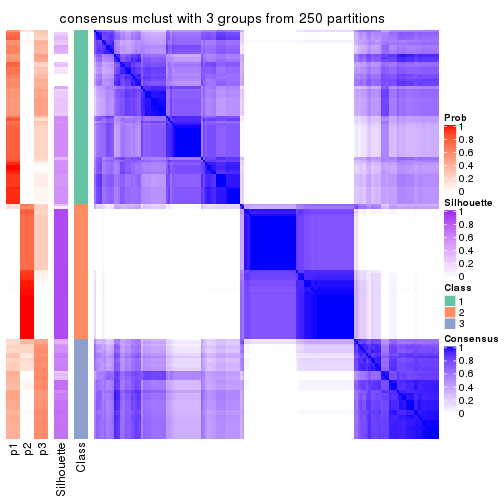</p>

</div>
<div id='tab-ATC-mclust-consensus-heatmap-3'>
<pre><code class="r">consensus_heatmap(res, k = 4)
</code></pre>

<p></p>

</div>
<div id='tab-ATC-mclust-consensus-heatmap-4'>
<pre><code class="r">consensus_heatmap(res, k = 5)
</code></pre>

<p></p>

</div>
<div id='tab-ATC-mclust-consensus-heatmap-5'>
<pre><code class="r">consensus_heatmap(res, k = 6)
</code></pre>

<p></p>

</div>
</div>

Heatmaps for the membership of samples in all partitions to see how consistent they are:


<script>
$( function() {
	$( '#tabs-ATC-mclust-membership-heatmap' ).tabs();
} );
</script>
<div id='tabs-ATC-mclust-membership-heatmap'>
<ul>
<li><a href='#tab-ATC-mclust-membership-heatmap-1'>k = 2</a></li>
<li><a href='#tab-ATC-mclust-membership-heatmap-2'>k = 3</a></li>
<li><a href='#tab-ATC-mclust-membership-heatmap-3'>k = 4</a></li>
<li><a href='#tab-ATC-mclust-membership-heatmap-4'>k = 5</a></li>
<li><a href='#tab-ATC-mclust-membership-heatmap-5'>k = 6</a></li>
</ul>
<div id='tab-ATC-mclust-membership-heatmap-1'>
<pre><code class="r">membership_heatmap(res, k = 2)
</code></pre>

<p></p>

</div>
<div id='tab-ATC-mclust-membership-heatmap-2'>
<pre><code class="r">membership_heatmap(res, k = 3)
</code></pre>

<p></p>

</div>
<div id='tab-ATC-mclust-membership-heatmap-3'>
<pre><code class="r">membership_heatmap(res, k = 4)
</code></pre>

<p></p>

</div>
<div id='tab-ATC-mclust-membership-heatmap-4'>
<pre><code class="r">membership_heatmap(res, k = 5)
</code></pre>

<p></p>

</div>
<div id='tab-ATC-mclust-membership-heatmap-5'>
<pre><code class="r">membership_heatmap(res, k = 6)
</code></pre>

<p></p>

</div>
</div>

As soon as we have had the classes for columns, we can look for signatures
which are significantly different between classes which can be candidate marks
for certain classes. Following are the heatmaps for signatures.


Signature heatmaps where rows are scaled:


<script>
$( function() {
	$( '#tabs-ATC-mclust-get-signatures' ).tabs();
} );
</script>
<div id='tabs-ATC-mclust-get-signatures'>
<ul>
<li><a href='#tab-ATC-mclust-get-signatures-1'>k = 2</a></li>
<li><a href='#tab-ATC-mclust-get-signatures-2'>k = 3</a></li>
<li><a href='#tab-ATC-mclust-get-signatures-3'>k = 4</a></li>
<li><a href='#tab-ATC-mclust-get-signatures-4'>k = 5</a></li>
<li><a href='#tab-ATC-mclust-get-signatures-5'>k = 6</a></li>
</ul>
<div id='tab-ATC-mclust-get-signatures-1'>
<pre><code class="r">get_signatures(res, k = 2)
</code></pre>

<p></p>

</div>
<div id='tab-ATC-mclust-get-signatures-2'>
<pre><code class="r">get_signatures(res, k = 3)
</code></pre>

<p></p>

</div>
<div id='tab-ATC-mclust-get-signatures-3'>
<pre><code class="r">get_signatures(res, k = 4)
</code></pre>

<p></p>

</div>
<div id='tab-ATC-mclust-get-signatures-4'>
<pre><code class="r">get_signatures(res, k = 5)
</code></pre>

<p></p>

</div>
<div id='tab-ATC-mclust-get-signatures-5'>
<pre><code class="r">get_signatures(res, k = 6)
</code></pre>

<p></p>

</div>
</div>


Signature heatmaps where rows are not scaled:


<script>
$( function() {
	$( '#tabs-ATC-mclust-get-signatures-no-scale' ).tabs();
} );
</script>
<div id='tabs-ATC-mclust-get-signatures-no-scale'>
<ul>
<li><a href='#tab-ATC-mclust-get-signatures-no-scale-1'>k = 2</a></li>
<li><a href='#tab-ATC-mclust-get-signatures-no-scale-2'>k = 3</a></li>
<li><a href='#tab-ATC-mclust-get-signatures-no-scale-3'>k = 4</a></li>
<li><a href='#tab-ATC-mclust-get-signatures-no-scale-4'>k = 5</a></li>
<li><a href='#tab-ATC-mclust-get-signatures-no-scale-5'>k = 6</a></li>
</ul>
<div id='tab-ATC-mclust-get-signatures-no-scale-1'>
<pre><code class="r">get_signatures(res, k = 2, scale_rows = FALSE)
</code></pre>

<p></p>

</div>
<div id='tab-ATC-mclust-get-signatures-no-scale-2'>
<pre><code class="r">get_signatures(res, k = 3, scale_rows = FALSE)
</code></pre>

<p></p>

</div>
<div id='tab-ATC-mclust-get-signatures-no-scale-3'>
<pre><code class="r">get_signatures(res, k = 4, scale_rows = FALSE)
</code></pre>

<p></p>

</div>
<div id='tab-ATC-mclust-get-signatures-no-scale-4'>
<pre><code class="r">get_signatures(res, k = 5, scale_rows = FALSE)
</code></pre>

<p></p>

</div>
<div id='tab-ATC-mclust-get-signatures-no-scale-5'>
<pre><code class="r">get_signatures(res, k = 6, scale_rows = FALSE)
</code></pre>

<p></p>

</div>
</div>


Compare the overlap of signatures from different k:

```r
compare_signatures(res)
```


`get_signature()` returns a data frame invisibly. TO get the list of signatures, the function
call should be assigned to a variable explicitly. In following code, if `plot` argument is set
to `FALSE`, no heatmap is plotted while only the differential analysis is performed.

```r
# code only for demonstration
tb = get_signature(res, k = ..., plot = FALSE)
```

An example of the output of `tb` is:

```
#>   which_row         fdr    mean_1    mean_2 scaled_mean_1 scaled_mean_2 km
#> 1        38 0.042760348  8.373488  9.131774    -0.5533452     0.5164555  1
#> 2        40 0.018707592  7.106213  8.469186    -0.6173731     0.5762149  1
#> 3        55 0.019134737 10.221463 11.207825    -0.6159697     0.5749050  1
#> 4        59 0.006059896  5.921854  7.869574    -0.6899429     0.6439467  1
#> 5        60 0.018055526  8.928898 10.211722    -0.6204761     0.5791110  1
#> 6        98 0.009384629 15.714769 14.887706     0.6635654    -0.6193277  2
...
```

The columns in `tb` are:

1. `which_row`: row indices corresponding to the input matrix.
2. `fdr`: FDR for the differential test. 
3. `mean_x`: The mean value in group x.
4. `scaled_mean_x`: The mean value in group x after rows are scaled.
5. `km`: Row groups if k-means clustering is applied to rows.


UMAP plot which shows how samples are separated.


<script>
$( function() {
	$( '#tabs-ATC-mclust-dimension-reduction' ).tabs();
} );
</script>
<div id='tabs-ATC-mclust-dimension-reduction'>
<ul>
<li><a href='#tab-ATC-mclust-dimension-reduction-1'>k = 2</a></li>
<li><a href='#tab-ATC-mclust-dimension-reduction-2'>k = 3</a></li>
<li><a href='#tab-ATC-mclust-dimension-reduction-3'>k = 4</a></li>
<li><a href='#tab-ATC-mclust-dimension-reduction-4'>k = 5</a></li>
<li><a href='#tab-ATC-mclust-dimension-reduction-5'>k = 6</a></li>
</ul>
<div id='tab-ATC-mclust-dimension-reduction-1'>
<pre><code class="r">dimension_reduction(res, k = 2, method = &quot;UMAP&quot;)
</code></pre>

<p></p>

</div>
<div id='tab-ATC-mclust-dimension-reduction-2'>
<pre><code class="r">dimension_reduction(res, k = 3, method = &quot;UMAP&quot;)
</code></pre>

<p></p>

</div>
<div id='tab-ATC-mclust-dimension-reduction-3'>
<pre><code class="r">dimension_reduction(res, k = 4, method = &quot;UMAP&quot;)
</code></pre>

<p></p>

</div>
<div id='tab-ATC-mclust-dimension-reduction-4'>
<pre><code class="r">dimension_reduction(res, k = 5, method = &quot;UMAP&quot;)
</code></pre>

<p></p>

</div>
<div id='tab-ATC-mclust-dimension-reduction-5'>
<pre><code class="r">dimension_reduction(res, k = 6, method = &quot;UMAP&quot;)
</code></pre>

<p></p>

</div>
</div>


Following heatmap shows how subgroups are split when increasing `k`:

```r
collect_classes(res)
```


If matrix rows can be associated to genes, consider to use `functional_enrichment(res,
...)` to perform function enrichment for the signature genes. See [this vignette](http://bioconductor.org/packages/devel/bioc/vignettes/cola/inst/doc/functional_enrichment.html) for more detailed explanations.


 

---------------------------------------------------


### ATC:NMF*


The object with results only for a single top-value method and a single partition method 
can be extracted as:

```r
res = res_list["ATC", "NMF"]
# you can also extract it by
# res = res_list["ATC:NMF"]
```

A summary of `res` and all the functions that can be applied to it:

```r
res
```

```
#> A 'ConsensusPartition' object with k = 2, 3, 4, 5, 6.
#>   On a matrix with 18147 rows and 167 columns.
#>   Top rows (1000, 2000, 3000, 4000, 5000) are extracted by 'ATC' method.
#>   Subgroups are detected by 'NMF' method.
#>   Performed in total 1250 partitions by row resampling.
#>   Best k for subgroups seems to be 3.
#> 
#> Following methods can be applied to this 'ConsensusPartition' object:
#>  [1] "cola_report"             "collect_classes"         "collect_plots"          
#>  [4] "collect_stats"           "colnames"                "compare_signatures"     
#>  [7] "consensus_heatmap"       "dimension_reduction"     "functional_enrichment"  
#> [10] "get_anno_col"            "get_anno"                "get_classes"            
#> [13] "get_consensus"           "get_matrix"              "get_membership"         
#> [16] "get_param"               "get_signatures"          "get_stats"              
#> [19] "is_best_k"               "is_stable_k"             "membership_heatmap"     
#> [22] "ncol"                    "nrow"                    "plot_ecdf"              
#> [25] "rownames"                "select_partition_number" "show"                   
#> [28] "suggest_best_k"          "test_to_known_factors"
```

`collect_plots()` function collects all the plots made from `res` for all `k` (number of partitions)
into one single page to provide an easy and fast comparison between different `k`.

```r
collect_plots(res)
```


The plots are:

- The first row: a plot of the ECDF (empirical cumulative distribution
  function) curves of the consensus matrix for each `k` and the heatmap of
  predicted classes for each `k`.
- The second row: heatmaps of the consensus matrix for each `k`.
- The third row: heatmaps of the membership matrix for each `k`.
- The fouth row: heatmaps of the signatures for each `k`.

All the plots in panels can be made by individual functions and they are
plotted later in this section.

`select_partition_number()` produces several plots showing different
statistics for choosing "optimized" `k`. There are following statistics:

- ECDF curves of the consensus matrix for each `k`;
- 1-PAC. [The PAC
  score](https://en.wikipedia.org/wiki/Consensus_clustering#Over-interpretation_potential_of_consensus_clustering)
  measures the proportion of the ambiguous subgrouping.
- Mean silhouette score.
- Concordance. The mean probability of fiting the consensus class ids in all
  partitions.
- Area increased. Denote $A_k$ as the area under the ECDF curve for current
  `k`, the area increased is defined as $A_k - A_{k-1}$.
- Rand index. The percent of pairs of samples that are both in a same cluster
  or both are not in a same cluster in the partition of k and k-1.
- Jaccard index. The ratio of pairs of samples are both in a same cluster in
  the partition of k and k-1 and the pairs of samples are both in a same
  cluster in the partition k or k-1.

The detailed explanations of these statistics can be found in [the _cola_
vignette](http://bioconductor.org/packages/devel/bioc/vignettes/cola/inst/doc/cola.html#toc_13).

Generally speaking, lower PAC score, higher mean silhouette score or higher
concordance corresponds to better partition. Rand index and Jaccard index
measure how similar the current partition is compared to partition with `k-1`.
If they are too similar, we won't accept `k` is better than `k-1`.

```r
select_partition_number(res)
```


The numeric values for all these statistics can be obtained by `get_stats()`.

```r
get_stats(res)
```

```
#>   k 1-PAC mean_silhouette concordance area_increased  Rand Jaccard
#> 2 2 0.975           0.946       0.979         0.5006 0.500   0.500
#> 3 3 0.918           0.903       0.959         0.2935 0.812   0.638
#> 4 4 0.777           0.794       0.905         0.1404 0.805   0.515
#> 5 5 0.804           0.774       0.882         0.0479 0.901   0.662
#> 6 6 0.750           0.595       0.779         0.0409 0.935   0.741
```

`suggest_best_k()` suggests the best $k$ based on these statistics. The rules are as follows:

- All $k$ with Jaccard index larger than 0.95 are removed because increasing
  $k$ does not provide enough extra information. If all $k$ are removed, it is
  marked as no subgroup is detected.
- For all $k$ with 1-PAC score larger than 0.9, the maximal $k$ is taken as
  the best $k$, and other $k$ are marked as optional $k$.
- If it does not fit the second rule. The $k$ with the maximal vote of the
  highest 1-PAC score, highest mean silhouette, and highest concordance is
  taken as the best $k$.

```r
suggest_best_k(res)
```

```
#> [1] 3
#> attr(,"optional")
#> [1] 2
```

There is also optional best $k$ = 2 that is worth to check.

Following shows the table of the partitions (You need to click the **show/hide
code output** link to see it). The membership matrix (columns with name `p*`)
is inferred by
[`clue::cl_consensus()`](https://www.rdocumentation.org/link/cl_consensus?package=clue)
function with the `SE` method. Basically the value in the membership matrix
represents the probability to belong to a certain group. The finall class
label for an item is determined with the group with highest probability it
belongs to.

In `get_classes()` function, the entropy is calculated from the membership
matrix and the silhouette score is calculated from the consensus matrix.


<script>
$( function() {
	$( '#tabs-ATC-NMF-get-classes' ).tabs();
} );
</script>
<div id='tabs-ATC-NMF-get-classes'>
<ul>
<li><a href='#tab-ATC-NMF-get-classes-1'>k = 2</a></li>
<li><a href='#tab-ATC-NMF-get-classes-2'>k = 3</a></li>
<li><a href='#tab-ATC-NMF-get-classes-3'>k = 4</a></li>
<li><a href='#tab-ATC-NMF-get-classes-4'>k = 5</a></li>
<li><a href='#tab-ATC-NMF-get-classes-5'>k = 6</a></li>
</ul>

<div id='tab-ATC-NMF-get-classes-1'>
<p><a id='tab-ATC-NMF-get-classes-1-a' style='color:#0366d6' href='#'>show/hide code output</a></p>
<pre><code class="r">cbind(get_classes(res, k = 2), get_membership(res, k = 2))
</code></pre>

<pre><code>#&gt;            class entropy silhouette    p1    p2
#&gt; SRR1313062     1   0.000     0.9729 1.000 0.000
#&gt; SRR1313063     1   0.000     0.9729 1.000 0.000
#&gt; SRR1313064     1   0.000     0.9729 1.000 0.000
#&gt; SRR1313065     1   0.000     0.9729 1.000 0.000
#&gt; SRR1313066     1   0.000     0.9729 1.000 0.000
#&gt; SRR1313067     1   0.000     0.9729 1.000 0.000
#&gt; SRR1313068     1   0.000     0.9729 1.000 0.000
#&gt; SRR1313069     1   0.000     0.9729 1.000 0.000
#&gt; SRR1313070     1   0.000     0.9729 1.000 0.000
#&gt; SRR1313071     1   0.000     0.9729 1.000 0.000
#&gt; SRR1313072     1   0.000     0.9729 1.000 0.000
#&gt; SRR1313073     1   0.000     0.9729 1.000 0.000
#&gt; SRR1313074     1   0.000     0.9729 1.000 0.000
#&gt; SRR1313075     1   0.000     0.9729 1.000 0.000
#&gt; SRR1313076     1   0.000     0.9729 1.000 0.000
#&gt; SRR1313077     1   0.000     0.9729 1.000 0.000
#&gt; SRR1313078     1   0.000     0.9729 1.000 0.000
#&gt; SRR1313079     1   0.000     0.9729 1.000 0.000
#&gt; SRR1313080     1   0.000     0.9729 1.000 0.000
#&gt; SRR1313081     1   0.000     0.9729 1.000 0.000
#&gt; SRR1313082     1   0.000     0.9729 1.000 0.000
#&gt; SRR1313083     1   0.000     0.9729 1.000 0.000
#&gt; SRR1313084     1   0.000     0.9729 1.000 0.000
#&gt; SRR1313085     1   0.000     0.9729 1.000 0.000
#&gt; SRR1313086     1   0.000     0.9729 1.000 0.000
#&gt; SRR1313087     1   0.000     0.9729 1.000 0.000
#&gt; SRR1313088     1   0.000     0.9729 1.000 0.000
#&gt; SRR1313089     1   0.000     0.9729 1.000 0.000
#&gt; SRR1313092     1   0.000     0.9729 1.000 0.000
#&gt; SRR1313090     1   0.000     0.9729 1.000 0.000
#&gt; SRR1313091     2   0.000     0.9844 0.000 1.000
#&gt; SRR1313093     1   0.204     0.9433 0.968 0.032
#&gt; SRR1313095     1   0.000     0.9729 1.000 0.000
#&gt; SRR1313096     1   0.000     0.9729 1.000 0.000
#&gt; SRR1313094     1   0.706     0.7544 0.808 0.192
#&gt; SRR1313097     2   0.644     0.7945 0.164 0.836
#&gt; SRR1313099     2   0.000     0.9844 0.000 1.000
#&gt; SRR1313098     1   0.000     0.9729 1.000 0.000
#&gt; SRR1313101     2   0.000     0.9844 0.000 1.000
#&gt; SRR1313102     2   0.000     0.9844 0.000 1.000
#&gt; SRR1313103     2   0.000     0.9844 0.000 1.000
#&gt; SRR1313100     1   0.000     0.9729 1.000 0.000
#&gt; SRR1313105     2   0.000     0.9844 0.000 1.000
#&gt; SRR1313104     1   0.788     0.6873 0.764 0.236
#&gt; SRR1313107     2   0.000     0.9844 0.000 1.000
#&gt; SRR1313106     2   0.000     0.9844 0.000 1.000
#&gt; SRR1313109     2   0.000     0.9844 0.000 1.000
#&gt; SRR1313108     1   0.000     0.9729 1.000 0.000
#&gt; SRR1313111     2   0.204     0.9531 0.032 0.968
#&gt; SRR1313110     1   0.000     0.9729 1.000 0.000
#&gt; SRR1313112     2   0.775     0.6964 0.228 0.772
#&gt; SRR1313113     2   0.000     0.9844 0.000 1.000
#&gt; SRR1313115     1   0.000     0.9729 1.000 0.000
#&gt; SRR1313114     1   0.000     0.9729 1.000 0.000
#&gt; SRR1313117     1   1.000     0.0588 0.512 0.488
#&gt; SRR1313118     1   0.000     0.9729 1.000 0.000
#&gt; SRR1313116     2   0.000     0.9844 0.000 1.000
#&gt; SRR1313120     2   0.000     0.9844 0.000 1.000
#&gt; SRR1313119     1   0.000     0.9729 1.000 0.000
#&gt; SRR1313122     1   0.966     0.3629 0.608 0.392
#&gt; SRR1313124     1   0.000     0.9729 1.000 0.000
#&gt; SRR1313121     1   0.000     0.9729 1.000 0.000
#&gt; SRR1313125     1   0.000     0.9729 1.000 0.000
#&gt; SRR1313127     1   0.000     0.9729 1.000 0.000
#&gt; SRR1313123     1   0.000     0.9729 1.000 0.000
#&gt; SRR1313128     1   0.000     0.9729 1.000 0.000
#&gt; SRR1313126     1   0.000     0.9729 1.000 0.000
#&gt; SRR1313130     2   0.000     0.9844 0.000 1.000
#&gt; SRR1313132     1   0.000     0.9729 1.000 0.000
#&gt; SRR1313129     2   0.000     0.9844 0.000 1.000
#&gt; SRR1313133     1   0.000     0.9729 1.000 0.000
#&gt; SRR1313131     1   0.000     0.9729 1.000 0.000
#&gt; SRR1313134     1   0.000     0.9729 1.000 0.000
#&gt; SRR1313135     1   0.000     0.9729 1.000 0.000
#&gt; SRR1313136     1   0.000     0.9729 1.000 0.000
#&gt; SRR1313137     1   0.000     0.9729 1.000 0.000
#&gt; SRR1313138     1   0.999     0.0744 0.516 0.484
#&gt; SRR1313140     1   0.000     0.9729 1.000 0.000
#&gt; SRR1313141     1   0.000     0.9729 1.000 0.000
#&gt; SRR1313139     1   0.000     0.9729 1.000 0.000
#&gt; SRR1313143     1   0.000     0.9729 1.000 0.000
#&gt; SRR1313142     1   0.000     0.9729 1.000 0.000
#&gt; SRR1313144     1   0.000     0.9729 1.000 0.000
#&gt; SRR1313145     1   0.000     0.9729 1.000 0.000
#&gt; SRR1313146     1   0.000     0.9729 1.000 0.000
#&gt; SRR1313147     1   0.000     0.9729 1.000 0.000
#&gt; SRR1313150     1   0.000     0.9729 1.000 0.000
#&gt; SRR1313149     1   0.000     0.9729 1.000 0.000
#&gt; SRR1313152     1   0.000     0.9729 1.000 0.000
#&gt; SRR1313151     1   0.000     0.9729 1.000 0.000
#&gt; SRR1313154     1   0.000     0.9729 1.000 0.000
#&gt; SRR1313153     1   0.000     0.9729 1.000 0.000
#&gt; SRR1313156     1   0.963     0.3738 0.612 0.388
#&gt; SRR1313155     1   0.000     0.9729 1.000 0.000
#&gt; SRR1313157     1   0.000     0.9729 1.000 0.000
#&gt; SRR1313158     1   0.000     0.9729 1.000 0.000
#&gt; SRR1313161     1   0.000     0.9729 1.000 0.000
#&gt; SRR1313159     2   0.833     0.6325 0.264 0.736
#&gt; SRR1313160     1   0.000     0.9729 1.000 0.000
#&gt; SRR1313162     1   0.000     0.9729 1.000 0.000
#&gt; SRR1313163     1   0.000     0.9729 1.000 0.000
#&gt; SRR1313165     1   0.000     0.9729 1.000 0.000
#&gt; SRR1313166     1   0.000     0.9729 1.000 0.000
#&gt; SRR1313164     1   0.552     0.8394 0.872 0.128
#&gt; SRR1313167     1   0.000     0.9729 1.000 0.000
#&gt; SRR1313168     1   0.000     0.9729 1.000 0.000
#&gt; SRR1313170     2   0.992     0.1625 0.448 0.552
#&gt; SRR1313169     1   0.000     0.9729 1.000 0.000
#&gt; SRR1313172     2   0.000     0.9844 0.000 1.000
#&gt; SRR1313171     2   0.000     0.9844 0.000 1.000
#&gt; SRR1313174     2   0.000     0.9844 0.000 1.000
#&gt; SRR1313173     1   0.000     0.9729 1.000 0.000
#&gt; SRR1313176     2   0.000     0.9844 0.000 1.000
#&gt; SRR1313175     2   0.000     0.9844 0.000 1.000
#&gt; SRR1313178     2   0.000     0.9844 0.000 1.000
#&gt; SRR1313177     2   0.000     0.9844 0.000 1.000
#&gt; SRR1313179     2   0.000     0.9844 0.000 1.000
#&gt; SRR1313180     2   0.000     0.9844 0.000 1.000
#&gt; SRR1313181     2   0.000     0.9844 0.000 1.000
#&gt; SRR1313183     2   0.000     0.9844 0.000 1.000
#&gt; SRR1313182     2   0.000     0.9844 0.000 1.000
#&gt; SRR1313184     2   0.000     0.9844 0.000 1.000
#&gt; SRR1313185     2   0.000     0.9844 0.000 1.000
#&gt; SRR1313188     2   0.000     0.9844 0.000 1.000
#&gt; SRR1313187     2   0.000     0.9844 0.000 1.000
#&gt; SRR1313186     2   0.000     0.9844 0.000 1.000
#&gt; SRR1313189     2   0.000     0.9844 0.000 1.000
#&gt; SRR1313190     2   0.000     0.9844 0.000 1.000
#&gt; SRR1313191     2   0.000     0.9844 0.000 1.000
#&gt; SRR1313192     2   0.000     0.9844 0.000 1.000
#&gt; SRR1313193     2   0.000     0.9844 0.000 1.000
#&gt; SRR1313194     2   0.000     0.9844 0.000 1.000
#&gt; SRR1313195     2   0.000     0.9844 0.000 1.000
#&gt; SRR1313196     2   0.000     0.9844 0.000 1.000
#&gt; SRR1313197     2   0.000     0.9844 0.000 1.000
#&gt; SRR1313198     2   0.000     0.9844 0.000 1.000
#&gt; SRR1313199     2   0.000     0.9844 0.000 1.000
#&gt; SRR1313200     2   0.000     0.9844 0.000 1.000
#&gt; SRR1313201     2   0.000     0.9844 0.000 1.000
#&gt; SRR1313202     2   0.000     0.9844 0.000 1.000
#&gt; SRR1313203     2   0.000     0.9844 0.000 1.000
#&gt; SRR1313204     2   0.000     0.9844 0.000 1.000
#&gt; SRR1313205     2   0.000     0.9844 0.000 1.000
#&gt; SRR1313207     2   0.000     0.9844 0.000 1.000
#&gt; SRR1313208     2   0.000     0.9844 0.000 1.000
#&gt; SRR1313206     2   0.000     0.9844 0.000 1.000
#&gt; SRR1313210     2   0.000     0.9844 0.000 1.000
#&gt; SRR1313209     2   0.000     0.9844 0.000 1.000
#&gt; SRR1313211     2   0.000     0.9844 0.000 1.000
#&gt; SRR1313212     2   0.000     0.9844 0.000 1.000
#&gt; SRR1313214     2   0.000     0.9844 0.000 1.000
#&gt; SRR1313215     2   0.000     0.9844 0.000 1.000
#&gt; SRR1313213     2   0.000     0.9844 0.000 1.000
#&gt; SRR1313216     2   0.000     0.9844 0.000 1.000
#&gt; SRR1313217     2   0.000     0.9844 0.000 1.000
#&gt; SRR1313219     2   0.000     0.9844 0.000 1.000
#&gt; SRR1313220     2   0.000     0.9844 0.000 1.000
#&gt; SRR1313218     2   0.000     0.9844 0.000 1.000
#&gt; SRR1313222     2   0.000     0.9844 0.000 1.000
#&gt; SRR1313221     2   0.000     0.9844 0.000 1.000
#&gt; SRR1313223     2   0.000     0.9844 0.000 1.000
#&gt; SRR1313224     2   0.000     0.9844 0.000 1.000
#&gt; SRR1313225     2   0.000     0.9844 0.000 1.000
#&gt; SRR1313226     2   0.000     0.9844 0.000 1.000
#&gt; SRR1313227     2   0.000     0.9844 0.000 1.000
#&gt; SRR1313228     2   0.000     0.9844 0.000 1.000
#&gt; SRR1313229     2   0.000     0.9844 0.000 1.000
</code></pre>

<script>
$('#tab-ATC-NMF-get-classes-1-a').parent().next().next().hide();
$('#tab-ATC-NMF-get-classes-1-a').click(function(){
  $('#tab-ATC-NMF-get-classes-1-a').parent().next().next().toggle();
  return(false);
});
</script>
</div>

<div id='tab-ATC-NMF-get-classes-2'>
<p><a id='tab-ATC-NMF-get-classes-2-a' style='color:#0366d6' href='#'>show/hide code output</a></p>
<pre><code class="r">cbind(get_classes(res, k = 3), get_membership(res, k = 3))
</code></pre>

<pre><code>#&gt;            class entropy silhouette    p1    p2    p3
#&gt; SRR1313062     1  0.0237      0.958 0.996 0.000 0.004
#&gt; SRR1313063     1  0.0000      0.959 1.000 0.000 0.000
#&gt; SRR1313064     1  0.0000      0.959 1.000 0.000 0.000
#&gt; SRR1313065     1  0.0000      0.959 1.000 0.000 0.000
#&gt; SRR1313066     1  0.0000      0.959 1.000 0.000 0.000
#&gt; SRR1313067     1  0.0000      0.959 1.000 0.000 0.000
#&gt; SRR1313068     1  0.0000      0.959 1.000 0.000 0.000
#&gt; SRR1313069     1  0.0000      0.959 1.000 0.000 0.000
#&gt; SRR1313070     1  0.0000      0.959 1.000 0.000 0.000
#&gt; SRR1313071     1  0.0000      0.959 1.000 0.000 0.000
#&gt; SRR1313072     1  0.0000      0.959 1.000 0.000 0.000
#&gt; SRR1313073     1  0.0000      0.959 1.000 0.000 0.000
#&gt; SRR1313074     1  0.0000      0.959 1.000 0.000 0.000
#&gt; SRR1313075     1  0.0000      0.959 1.000 0.000 0.000
#&gt; SRR1313076     1  0.0237      0.958 0.996 0.000 0.004
#&gt; SRR1313077     1  0.0424      0.957 0.992 0.000 0.008
#&gt; SRR1313078     3  0.6168      0.317 0.412 0.000 0.588
#&gt; SRR1313079     1  0.0000      0.959 1.000 0.000 0.000
#&gt; SRR1313080     1  0.0000      0.959 1.000 0.000 0.000
#&gt; SRR1313081     1  0.0424      0.957 0.992 0.000 0.008
#&gt; SRR1313082     1  0.0000      0.959 1.000 0.000 0.000
#&gt; SRR1313083     1  0.0424      0.957 0.992 0.000 0.008
#&gt; SRR1313084     1  0.0000      0.959 1.000 0.000 0.000
#&gt; SRR1313085     1  0.0000      0.959 1.000 0.000 0.000
#&gt; SRR1313086     1  0.0237      0.958 0.996 0.000 0.004
#&gt; SRR1313087     1  0.0000      0.959 1.000 0.000 0.000
#&gt; SRR1313088     1  0.0237      0.958 0.996 0.000 0.004
#&gt; SRR1313089     1  0.0000      0.959 1.000 0.000 0.000
#&gt; SRR1313092     3  0.0000      0.910 0.000 0.000 1.000
#&gt; SRR1313090     1  0.0000      0.959 1.000 0.000 0.000
#&gt; SRR1313091     2  0.0000      0.973 0.000 1.000 0.000
#&gt; SRR1313093     3  0.0000      0.910 0.000 0.000 1.000
#&gt; SRR1313095     1  0.0237      0.958 0.996 0.000 0.004
#&gt; SRR1313096     3  0.0000      0.910 0.000 0.000 1.000
#&gt; SRR1313094     3  0.1529      0.894 0.000 0.040 0.960
#&gt; SRR1313097     2  0.6204      0.252 0.000 0.576 0.424
#&gt; SRR1313099     3  0.6008      0.399 0.000 0.372 0.628
#&gt; SRR1313098     3  0.0424      0.907 0.008 0.000 0.992
#&gt; SRR1313101     2  0.0000      0.973 0.000 1.000 0.000
#&gt; SRR1313102     2  0.0000      0.973 0.000 1.000 0.000
#&gt; SRR1313103     3  0.1964      0.883 0.000 0.056 0.944
#&gt; SRR1313100     1  0.0000      0.959 1.000 0.000 0.000
#&gt; SRR1313105     2  0.5785      0.492 0.000 0.668 0.332
#&gt; SRR1313104     3  0.1163      0.900 0.000 0.028 0.972
#&gt; SRR1313107     3  0.1964      0.883 0.000 0.056 0.944
#&gt; SRR1313106     2  0.0000      0.973 0.000 1.000 0.000
#&gt; SRR1313109     2  0.0237      0.970 0.000 0.996 0.004
#&gt; SRR1313108     3  0.0000      0.910 0.000 0.000 1.000
#&gt; SRR1313111     3  0.5529      0.570 0.000 0.296 0.704
#&gt; SRR1313110     1  0.0424      0.954 0.992 0.008 0.000
#&gt; SRR1313112     2  0.0000      0.973 0.000 1.000 0.000
#&gt; SRR1313113     2  0.4178      0.776 0.000 0.828 0.172
#&gt; SRR1313115     3  0.0000      0.910 0.000 0.000 1.000
#&gt; SRR1313114     1  0.0424      0.957 0.992 0.000 0.008
#&gt; SRR1313117     2  0.6126      0.329 0.400 0.600 0.000
#&gt; SRR1313118     1  0.0000      0.959 1.000 0.000 0.000
#&gt; SRR1313116     2  0.0237      0.970 0.000 0.996 0.004
#&gt; SRR1313120     3  0.1643      0.892 0.000 0.044 0.956
#&gt; SRR1313119     1  0.0000      0.959 1.000 0.000 0.000
#&gt; SRR1313122     1  0.5948      0.429 0.640 0.360 0.000
#&gt; SRR1313124     1  0.5706      0.477 0.680 0.000 0.320
#&gt; SRR1313121     1  0.0000      0.959 1.000 0.000 0.000
#&gt; SRR1313125     1  0.3771      0.833 0.876 0.012 0.112
#&gt; SRR1313127     3  0.0747      0.902 0.016 0.000 0.984
#&gt; SRR1313123     3  0.0000      0.910 0.000 0.000 1.000
#&gt; SRR1313128     3  0.0000      0.910 0.000 0.000 1.000
#&gt; SRR1313126     1  0.1031      0.945 0.976 0.000 0.024
#&gt; SRR1313130     2  0.0000      0.973 0.000 1.000 0.000
#&gt; SRR1313132     3  0.0747      0.905 0.000 0.016 0.984
#&gt; SRR1313129     2  0.0000      0.973 0.000 1.000 0.000
#&gt; SRR1313133     3  0.0000      0.910 0.000 0.000 1.000
#&gt; SRR1313131     3  0.0000      0.910 0.000 0.000 1.000
#&gt; SRR1313134     3  0.0000      0.910 0.000 0.000 1.000
#&gt; SRR1313135     1  0.1289      0.938 0.968 0.000 0.032
#&gt; SRR1313136     3  0.4842      0.696 0.224 0.000 0.776
#&gt; SRR1313137     1  0.1031      0.945 0.976 0.000 0.024
#&gt; SRR1313138     1  0.6008      0.411 0.628 0.372 0.000
#&gt; SRR1313140     1  0.0424      0.957 0.992 0.000 0.008
#&gt; SRR1313141     3  0.0000      0.910 0.000 0.000 1.000
#&gt; SRR1313139     1  0.0237      0.958 0.996 0.000 0.004
#&gt; SRR1313143     3  0.0000      0.910 0.000 0.000 1.000
#&gt; SRR1313142     3  0.5431      0.603 0.284 0.000 0.716
#&gt; SRR1313144     1  0.0747      0.951 0.984 0.000 0.016
#&gt; SRR1313145     3  0.0000      0.910 0.000 0.000 1.000
#&gt; SRR1313146     3  0.5098      0.669 0.248 0.000 0.752
#&gt; SRR1313147     1  0.0424      0.957 0.992 0.000 0.008
#&gt; SRR1313150     1  0.0000      0.959 1.000 0.000 0.000
#&gt; SRR1313149     3  0.0000      0.910 0.000 0.000 1.000
#&gt; SRR1313152     1  0.0892      0.948 0.980 0.000 0.020
#&gt; SRR1313151     3  0.0000      0.910 0.000 0.000 1.000
#&gt; SRR1313154     3  0.0000      0.910 0.000 0.000 1.000
#&gt; SRR1313153     1  0.5859      0.458 0.656 0.000 0.344
#&gt; SRR1313156     3  0.1643      0.892 0.000 0.044 0.956
#&gt; SRR1313155     1  0.5058      0.663 0.756 0.000 0.244
#&gt; SRR1313157     1  0.0000      0.959 1.000 0.000 0.000
#&gt; SRR1313158     3  0.0000      0.910 0.000 0.000 1.000
#&gt; SRR1313161     1  0.0000      0.959 1.000 0.000 0.000
#&gt; SRR1313159     2  0.5465      0.584 0.000 0.712 0.288
#&gt; SRR1313160     1  0.0000      0.959 1.000 0.000 0.000
#&gt; SRR1313162     3  0.5859      0.494 0.344 0.000 0.656
#&gt; SRR1313163     3  0.6629      0.456 0.360 0.016 0.624
#&gt; SRR1313165     1  0.0000      0.959 1.000 0.000 0.000
#&gt; SRR1313166     3  0.0000      0.910 0.000 0.000 1.000
#&gt; SRR1313164     3  0.1163      0.900 0.000 0.028 0.972
#&gt; SRR1313167     1  0.0000      0.959 1.000 0.000 0.000
#&gt; SRR1313168     1  0.0424      0.957 0.992 0.000 0.008
#&gt; SRR1313170     2  0.2261      0.906 0.000 0.932 0.068
#&gt; SRR1313169     1  0.0424      0.957 0.992 0.000 0.008
#&gt; SRR1313172     2  0.0000      0.973 0.000 1.000 0.000
#&gt; SRR1313171     3  0.3816      0.795 0.000 0.148 0.852
#&gt; SRR1313174     2  0.0000      0.973 0.000 1.000 0.000
#&gt; SRR1313173     3  0.0000      0.910 0.000 0.000 1.000
#&gt; SRR1313176     2  0.0000      0.973 0.000 1.000 0.000
#&gt; SRR1313175     2  0.0000      0.973 0.000 1.000 0.000
#&gt; SRR1313178     2  0.0000      0.973 0.000 1.000 0.000
#&gt; SRR1313177     2  0.0000      0.973 0.000 1.000 0.000
#&gt; SRR1313179     2  0.0000      0.973 0.000 1.000 0.000
#&gt; SRR1313180     2  0.1163      0.945 0.028 0.972 0.000
#&gt; SRR1313181     2  0.0000      0.973 0.000 1.000 0.000
#&gt; SRR1313183     2  0.0000      0.973 0.000 1.000 0.000
#&gt; SRR1313182     2  0.0000      0.973 0.000 1.000 0.000
#&gt; SRR1313184     2  0.0000      0.973 0.000 1.000 0.000
#&gt; SRR1313185     2  0.0000      0.973 0.000 1.000 0.000
#&gt; SRR1313188     2  0.0000      0.973 0.000 1.000 0.000
#&gt; SRR1313187     2  0.0000      0.973 0.000 1.000 0.000
#&gt; SRR1313186     2  0.0000      0.973 0.000 1.000 0.000
#&gt; SRR1313189     2  0.0000      0.973 0.000 1.000 0.000
#&gt; SRR1313190     2  0.0000      0.973 0.000 1.000 0.000
#&gt; SRR1313191     2  0.0000      0.973 0.000 1.000 0.000
#&gt; SRR1313192     2  0.0000      0.973 0.000 1.000 0.000
#&gt; SRR1313193     2  0.0000      0.973 0.000 1.000 0.000
#&gt; SRR1313194     2  0.0000      0.973 0.000 1.000 0.000
#&gt; SRR1313195     2  0.0000      0.973 0.000 1.000 0.000
#&gt; SRR1313196     2  0.0000      0.973 0.000 1.000 0.000
#&gt; SRR1313197     2  0.0000      0.973 0.000 1.000 0.000
#&gt; SRR1313198     2  0.0000      0.973 0.000 1.000 0.000
#&gt; SRR1313199     2  0.0000      0.973 0.000 1.000 0.000
#&gt; SRR1313200     2  0.0000      0.973 0.000 1.000 0.000
#&gt; SRR1313201     2  0.0000      0.973 0.000 1.000 0.000
#&gt; SRR1313202     2  0.0000      0.973 0.000 1.000 0.000
#&gt; SRR1313203     2  0.0000      0.973 0.000 1.000 0.000
#&gt; SRR1313204     2  0.0000      0.973 0.000 1.000 0.000
#&gt; SRR1313205     2  0.0000      0.973 0.000 1.000 0.000
#&gt; SRR1313207     2  0.0000      0.973 0.000 1.000 0.000
#&gt; SRR1313208     2  0.0000      0.973 0.000 1.000 0.000
#&gt; SRR1313206     2  0.0000      0.973 0.000 1.000 0.000
#&gt; SRR1313210     2  0.0000      0.973 0.000 1.000 0.000
#&gt; SRR1313209     2  0.0000      0.973 0.000 1.000 0.000
#&gt; SRR1313211     2  0.0000      0.973 0.000 1.000 0.000
#&gt; SRR1313212     2  0.0000      0.973 0.000 1.000 0.000
#&gt; SRR1313214     2  0.0000      0.973 0.000 1.000 0.000
#&gt; SRR1313215     2  0.0000      0.973 0.000 1.000 0.000
#&gt; SRR1313213     2  0.0000      0.973 0.000 1.000 0.000
#&gt; SRR1313216     2  0.0000      0.973 0.000 1.000 0.000
#&gt; SRR1313217     2  0.0000      0.973 0.000 1.000 0.000
#&gt; SRR1313219     2  0.0000      0.973 0.000 1.000 0.000
#&gt; SRR1313220     2  0.0000      0.973 0.000 1.000 0.000
#&gt; SRR1313218     2  0.0000      0.973 0.000 1.000 0.000
#&gt; SRR1313222     2  0.0000      0.973 0.000 1.000 0.000
#&gt; SRR1313221     2  0.0000      0.973 0.000 1.000 0.000
#&gt; SRR1313223     2  0.0000      0.973 0.000 1.000 0.000
#&gt; SRR1313224     2  0.0000      0.973 0.000 1.000 0.000
#&gt; SRR1313225     2  0.0000      0.973 0.000 1.000 0.000
#&gt; SRR1313226     2  0.1289      0.941 0.032 0.968 0.000
#&gt; SRR1313227     2  0.0000      0.973 0.000 1.000 0.000
#&gt; SRR1313228     2  0.0000      0.973 0.000 1.000 0.000
#&gt; SRR1313229     2  0.0000      0.973 0.000 1.000 0.000
</code></pre>

<script>
$('#tab-ATC-NMF-get-classes-2-a').parent().next().next().hide();
$('#tab-ATC-NMF-get-classes-2-a').click(function(){
  $('#tab-ATC-NMF-get-classes-2-a').parent().next().next().toggle();
  return(false);
});
</script>
</div>

<div id='tab-ATC-NMF-get-classes-3'>
<p><a id='tab-ATC-NMF-get-classes-3-a' style='color:#0366d6' href='#'>show/hide code output</a></p>
<pre><code class="r">cbind(get_classes(res, k = 4), get_membership(res, k = 4))
</code></pre>

<pre><code>#&gt;            class entropy silhouette    p1    p2    p3    p4
#&gt; SRR1313062     4  0.0336     0.8576 0.000 0.000 0.008 0.992
#&gt; SRR1313063     4  0.4406     0.6712 0.000 0.000 0.300 0.700
#&gt; SRR1313064     4  0.2868     0.8366 0.000 0.000 0.136 0.864
#&gt; SRR1313065     3  0.4989    -0.1542 0.000 0.000 0.528 0.472
#&gt; SRR1313066     3  0.5000    -0.2412 0.000 0.000 0.504 0.496
#&gt; SRR1313067     3  0.0707     0.7790 0.000 0.000 0.980 0.020
#&gt; SRR1313068     3  0.3528     0.6020 0.000 0.000 0.808 0.192
#&gt; SRR1313069     4  0.0188     0.8574 0.000 0.000 0.004 0.996
#&gt; SRR1313070     4  0.3024     0.8308 0.000 0.000 0.148 0.852
#&gt; SRR1313071     4  0.2921     0.8348 0.000 0.000 0.140 0.860
#&gt; SRR1313072     4  0.3486     0.8037 0.000 0.000 0.188 0.812
#&gt; SRR1313073     4  0.1867     0.8546 0.000 0.000 0.072 0.928
#&gt; SRR1313074     4  0.1211     0.8588 0.000 0.000 0.040 0.960
#&gt; SRR1313075     4  0.2530     0.8452 0.000 0.000 0.112 0.888
#&gt; SRR1313076     4  0.0188     0.8574 0.000 0.000 0.004 0.996
#&gt; SRR1313077     4  0.0188     0.8574 0.000 0.000 0.004 0.996
#&gt; SRR1313078     4  0.1637     0.8308 0.060 0.000 0.000 0.940
#&gt; SRR1313079     4  0.3610     0.7936 0.000 0.000 0.200 0.800
#&gt; SRR1313080     3  0.2530     0.7092 0.000 0.000 0.888 0.112
#&gt; SRR1313081     4  0.0336     0.8576 0.000 0.000 0.008 0.992
#&gt; SRR1313082     4  0.3074     0.8287 0.000 0.000 0.152 0.848
#&gt; SRR1313083     4  0.0000     0.8568 0.000 0.000 0.000 1.000
#&gt; SRR1313084     4  0.4948     0.3915 0.000 0.000 0.440 0.560
#&gt; SRR1313085     4  0.2814     0.8383 0.000 0.000 0.132 0.868
#&gt; SRR1313086     4  0.0000     0.8568 0.000 0.000 0.000 1.000
#&gt; SRR1313087     4  0.3801     0.7756 0.000 0.000 0.220 0.780
#&gt; SRR1313088     4  0.0000     0.8568 0.000 0.000 0.000 1.000
#&gt; SRR1313089     3  0.4948    -0.0521 0.000 0.000 0.560 0.440
#&gt; SRR1313092     1  0.3052     0.7704 0.860 0.000 0.136 0.004
#&gt; SRR1313090     3  0.0336     0.7817 0.000 0.000 0.992 0.008
#&gt; SRR1313091     2  0.0000     0.9813 0.000 1.000 0.000 0.000
#&gt; SRR1313093     1  0.0188     0.8574 0.996 0.000 0.004 0.000
#&gt; SRR1313095     3  0.2048     0.7549 0.064 0.000 0.928 0.008
#&gt; SRR1313096     1  0.2760     0.7907 0.872 0.000 0.000 0.128
#&gt; SRR1313094     1  0.3356     0.7336 0.824 0.000 0.176 0.000
#&gt; SRR1313097     3  0.5163    -0.0291 0.480 0.004 0.516 0.000
#&gt; SRR1313099     1  0.1576     0.8336 0.948 0.048 0.004 0.000
#&gt; SRR1313098     1  0.0376     0.8567 0.992 0.000 0.004 0.004
#&gt; SRR1313101     3  0.0376     0.7815 0.000 0.004 0.992 0.004
#&gt; SRR1313102     3  0.5055     0.2953 0.368 0.008 0.624 0.000
#&gt; SRR1313103     1  0.0188     0.8574 0.996 0.000 0.004 0.000
#&gt; SRR1313100     3  0.0921     0.7759 0.000 0.000 0.972 0.028
#&gt; SRR1313105     1  0.3831     0.6973 0.792 0.004 0.204 0.000
#&gt; SRR1313104     1  0.4356     0.5661 0.708 0.000 0.292 0.000
#&gt; SRR1313107     1  0.0188     0.8574 0.996 0.000 0.004 0.000
#&gt; SRR1313106     3  0.0336     0.7798 0.000 0.008 0.992 0.000
#&gt; SRR1313109     1  0.5097     0.2641 0.568 0.428 0.004 0.000
#&gt; SRR1313108     1  0.0188     0.8574 0.996 0.000 0.004 0.000
#&gt; SRR1313111     1  0.1716     0.8286 0.936 0.000 0.064 0.000
#&gt; SRR1313110     3  0.1576     0.7676 0.004 0.000 0.948 0.048
#&gt; SRR1313112     3  0.2988     0.7093 0.012 0.112 0.876 0.000
#&gt; SRR1313113     1  0.5039     0.3247 0.592 0.004 0.404 0.000
#&gt; SRR1313115     1  0.0188     0.8574 0.996 0.000 0.004 0.000
#&gt; SRR1313114     3  0.3351     0.6744 0.148 0.000 0.844 0.008
#&gt; SRR1313117     3  0.0188     0.7812 0.000 0.000 0.996 0.004
#&gt; SRR1313118     3  0.0336     0.7817 0.000 0.000 0.992 0.008
#&gt; SRR1313116     1  0.5080     0.2902 0.576 0.004 0.420 0.000
#&gt; SRR1313120     1  0.0188     0.8574 0.996 0.000 0.004 0.000
#&gt; SRR1313119     3  0.0336     0.7817 0.000 0.000 0.992 0.008
#&gt; SRR1313122     3  0.0188     0.7812 0.000 0.000 0.996 0.004
#&gt; SRR1313124     3  0.2053     0.7409 0.072 0.000 0.924 0.004
#&gt; SRR1313121     3  0.0336     0.7817 0.000 0.000 0.992 0.008
#&gt; SRR1313125     3  0.5151     0.0284 0.464 0.000 0.532 0.004
#&gt; SRR1313127     1  0.0657     0.8556 0.984 0.000 0.004 0.012
#&gt; SRR1313123     1  0.0779     0.8545 0.980 0.000 0.004 0.016
#&gt; SRR1313128     1  0.3688     0.7222 0.792 0.000 0.000 0.208
#&gt; SRR1313126     4  0.4793     0.6873 0.040 0.000 0.204 0.756
#&gt; SRR1313130     3  0.4761     0.3922 0.000 0.372 0.628 0.000
#&gt; SRR1313132     1  0.0000     0.8570 1.000 0.000 0.000 0.000
#&gt; SRR1313129     1  0.4152     0.7361 0.808 0.032 0.160 0.000
#&gt; SRR1313133     1  0.0000     0.8570 1.000 0.000 0.000 0.000
#&gt; SRR1313131     1  0.0188     0.8574 0.996 0.000 0.004 0.000
#&gt; SRR1313134     1  0.0000     0.8570 1.000 0.000 0.000 0.000
#&gt; SRR1313135     4  0.0188     0.8555 0.004 0.000 0.000 0.996
#&gt; SRR1313136     4  0.2530     0.8013 0.112 0.000 0.000 0.888
#&gt; SRR1313137     4  0.0188     0.8579 0.000 0.000 0.004 0.996
#&gt; SRR1313138     4  0.7133     0.4330 0.000 0.172 0.280 0.548
#&gt; SRR1313140     4  0.0000     0.8568 0.000 0.000 0.000 1.000
#&gt; SRR1313141     1  0.3074     0.7726 0.848 0.000 0.000 0.152
#&gt; SRR1313139     4  0.2408     0.8471 0.000 0.000 0.104 0.896
#&gt; SRR1313143     1  0.3688     0.7210 0.792 0.000 0.000 0.208
#&gt; SRR1313142     4  0.1792     0.8241 0.068 0.000 0.000 0.932
#&gt; SRR1313144     4  0.0188     0.8579 0.000 0.000 0.004 0.996
#&gt; SRR1313145     4  0.4898     0.2179 0.416 0.000 0.000 0.584
#&gt; SRR1313146     4  0.2281     0.8037 0.096 0.000 0.000 0.904
#&gt; SRR1313147     4  0.1022     0.8593 0.000 0.000 0.032 0.968
#&gt; SRR1313150     4  0.3400     0.8088 0.000 0.000 0.180 0.820
#&gt; SRR1313149     1  0.3486     0.7409 0.812 0.000 0.000 0.188
#&gt; SRR1313152     4  0.0921     0.8592 0.000 0.000 0.028 0.972
#&gt; SRR1313151     4  0.3400     0.7225 0.180 0.000 0.000 0.820
#&gt; SRR1313154     4  0.3726     0.6786 0.212 0.000 0.000 0.788
#&gt; SRR1313153     4  0.1022     0.8448 0.032 0.000 0.000 0.968
#&gt; SRR1313156     1  0.6646     0.4984 0.624 0.172 0.000 0.204
#&gt; SRR1313155     4  0.0469     0.8532 0.012 0.000 0.000 0.988
#&gt; SRR1313157     4  0.3024     0.8300 0.000 0.000 0.148 0.852
#&gt; SRR1313158     1  0.1716     0.8250 0.936 0.000 0.000 0.064
#&gt; SRR1313161     4  0.3311     0.8146 0.000 0.000 0.172 0.828
#&gt; SRR1313159     2  0.3494     0.7738 0.172 0.824 0.000 0.004
#&gt; SRR1313160     4  0.3688     0.7850 0.000 0.000 0.208 0.792
#&gt; SRR1313162     4  0.3873     0.6536 0.228 0.000 0.000 0.772
#&gt; SRR1313163     4  0.4072     0.7009 0.252 0.000 0.000 0.748
#&gt; SRR1313165     4  0.3726     0.7812 0.000 0.000 0.212 0.788
#&gt; SRR1313166     1  0.2704     0.7952 0.876 0.000 0.000 0.124
#&gt; SRR1313164     1  0.0000     0.8570 1.000 0.000 0.000 0.000
#&gt; SRR1313167     4  0.3688     0.7855 0.000 0.000 0.208 0.792
#&gt; SRR1313168     4  0.2814     0.8376 0.000 0.000 0.132 0.868
#&gt; SRR1313170     3  0.1716     0.7528 0.064 0.000 0.936 0.000
#&gt; SRR1313169     4  0.0469     0.8589 0.000 0.000 0.012 0.988
#&gt; SRR1313172     2  0.0188     0.9775 0.000 0.996 0.004 0.000
#&gt; SRR1313171     1  0.1398     0.8391 0.956 0.040 0.004 0.000
#&gt; SRR1313174     2  0.0000     0.9813 0.000 1.000 0.000 0.000
#&gt; SRR1313173     1  0.0188     0.8574 0.996 0.000 0.004 0.000
#&gt; SRR1313176     2  0.0000     0.9813 0.000 1.000 0.000 0.000
#&gt; SRR1313175     2  0.0000     0.9813 0.000 1.000 0.000 0.000
#&gt; SRR1313178     2  0.0000     0.9813 0.000 1.000 0.000 0.000
#&gt; SRR1313177     2  0.0000     0.9813 0.000 1.000 0.000 0.000
#&gt; SRR1313179     2  0.0000     0.9813 0.000 1.000 0.000 0.000
#&gt; SRR1313180     3  0.0336     0.7800 0.000 0.008 0.992 0.000
#&gt; SRR1313181     2  0.0000     0.9813 0.000 1.000 0.000 0.000
#&gt; SRR1313183     2  0.0000     0.9813 0.000 1.000 0.000 0.000
#&gt; SRR1313182     2  0.0000     0.9813 0.000 1.000 0.000 0.000
#&gt; SRR1313184     2  0.0000     0.9813 0.000 1.000 0.000 0.000
#&gt; SRR1313185     2  0.0000     0.9813 0.000 1.000 0.000 0.000
#&gt; SRR1313188     3  0.3074     0.6742 0.000 0.152 0.848 0.000
#&gt; SRR1313187     3  0.4817     0.3540 0.000 0.388 0.612 0.000
#&gt; SRR1313186     2  0.0000     0.9813 0.000 1.000 0.000 0.000
#&gt; SRR1313189     2  0.0000     0.9813 0.000 1.000 0.000 0.000
#&gt; SRR1313190     2  0.0000     0.9813 0.000 1.000 0.000 0.000
#&gt; SRR1313191     2  0.0000     0.9813 0.000 1.000 0.000 0.000
#&gt; SRR1313192     2  0.0000     0.9813 0.000 1.000 0.000 0.000
#&gt; SRR1313193     2  0.0000     0.9813 0.000 1.000 0.000 0.000
#&gt; SRR1313194     2  0.0592     0.9663 0.000 0.984 0.016 0.000
#&gt; SRR1313195     2  0.1211     0.9415 0.000 0.960 0.040 0.000
#&gt; SRR1313196     3  0.4697     0.4242 0.000 0.356 0.644 0.000
#&gt; SRR1313197     2  0.0000     0.9813 0.000 1.000 0.000 0.000
#&gt; SRR1313198     2  0.0000     0.9813 0.000 1.000 0.000 0.000
#&gt; SRR1313199     2  0.0000     0.9813 0.000 1.000 0.000 0.000
#&gt; SRR1313200     2  0.4679     0.4194 0.000 0.648 0.352 0.000
#&gt; SRR1313201     2  0.0000     0.9813 0.000 1.000 0.000 0.000
#&gt; SRR1313202     2  0.0592     0.9664 0.000 0.984 0.016 0.000
#&gt; SRR1313203     2  0.0000     0.9813 0.000 1.000 0.000 0.000
#&gt; SRR1313204     2  0.0000     0.9813 0.000 1.000 0.000 0.000
#&gt; SRR1313205     2  0.0000     0.9813 0.000 1.000 0.000 0.000
#&gt; SRR1313207     2  0.0000     0.9813 0.000 1.000 0.000 0.000
#&gt; SRR1313208     2  0.0000     0.9813 0.000 1.000 0.000 0.000
#&gt; SRR1313206     2  0.0000     0.9813 0.000 1.000 0.000 0.000
#&gt; SRR1313210     2  0.0000     0.9813 0.000 1.000 0.000 0.000
#&gt; SRR1313209     2  0.0000     0.9813 0.000 1.000 0.000 0.000
#&gt; SRR1313211     2  0.0000     0.9813 0.000 1.000 0.000 0.000
#&gt; SRR1313212     2  0.0000     0.9813 0.000 1.000 0.000 0.000
#&gt; SRR1313214     2  0.0000     0.9813 0.000 1.000 0.000 0.000
#&gt; SRR1313215     2  0.0000     0.9813 0.000 1.000 0.000 0.000
#&gt; SRR1313213     2  0.0000     0.9813 0.000 1.000 0.000 0.000
#&gt; SRR1313216     2  0.0000     0.9813 0.000 1.000 0.000 0.000
#&gt; SRR1313217     2  0.4406     0.5425 0.000 0.700 0.300 0.000
#&gt; SRR1313219     2  0.0000     0.9813 0.000 1.000 0.000 0.000
#&gt; SRR1313220     2  0.0000     0.9813 0.000 1.000 0.000 0.000
#&gt; SRR1313218     2  0.0000     0.9813 0.000 1.000 0.000 0.000
#&gt; SRR1313222     2  0.0000     0.9813 0.000 1.000 0.000 0.000
#&gt; SRR1313221     2  0.0000     0.9813 0.000 1.000 0.000 0.000
#&gt; SRR1313223     2  0.0000     0.9813 0.000 1.000 0.000 0.000
#&gt; SRR1313224     2  0.0000     0.9813 0.000 1.000 0.000 0.000
#&gt; SRR1313225     2  0.0000     0.9813 0.000 1.000 0.000 0.000
#&gt; SRR1313226     3  0.0188     0.7811 0.000 0.000 0.996 0.004
#&gt; SRR1313227     2  0.0000     0.9813 0.000 1.000 0.000 0.000
#&gt; SRR1313228     2  0.0000     0.9813 0.000 1.000 0.000 0.000
#&gt; SRR1313229     2  0.0000     0.9813 0.000 1.000 0.000 0.000
</code></pre>

<script>
$('#tab-ATC-NMF-get-classes-3-a').parent().next().next().hide();
$('#tab-ATC-NMF-get-classes-3-a').click(function(){
  $('#tab-ATC-NMF-get-classes-3-a').parent().next().next().toggle();
  return(false);
});
</script>
</div>

<div id='tab-ATC-NMF-get-classes-4'>
<p><a id='tab-ATC-NMF-get-classes-4-a' style='color:#0366d6' href='#'>show/hide code output</a></p>
<pre><code class="r">cbind(get_classes(res, k = 5), get_membership(res, k = 5))
</code></pre>

<pre><code>#&gt;            class entropy silhouette    p1    p2    p3    p4    p5
#&gt; SRR1313062     1  0.3318     0.7296 0.800 0.000 0.008 0.192 0.000
#&gt; SRR1313063     4  0.3132     0.6843 0.172 0.000 0.008 0.820 0.000
#&gt; SRR1313064     1  0.4101     0.4177 0.628 0.000 0.000 0.372 0.000
#&gt; SRR1313065     4  0.2230     0.7272 0.116 0.000 0.000 0.884 0.000
#&gt; SRR1313066     4  0.1768     0.7473 0.072 0.000 0.004 0.924 0.000
#&gt; SRR1313067     4  0.2377     0.6850 0.000 0.000 0.128 0.872 0.000
#&gt; SRR1313068     4  0.1661     0.7431 0.036 0.000 0.024 0.940 0.000
#&gt; SRR1313069     1  0.2471     0.7639 0.864 0.000 0.000 0.136 0.000
#&gt; SRR1313070     1  0.3177     0.7116 0.792 0.000 0.000 0.208 0.000
#&gt; SRR1313071     1  0.3109     0.7191 0.800 0.000 0.000 0.200 0.000
#&gt; SRR1313072     4  0.4304    -0.0496 0.484 0.000 0.000 0.516 0.000
#&gt; SRR1313073     1  0.2605     0.7564 0.852 0.000 0.000 0.148 0.000
#&gt; SRR1313074     1  0.2329     0.7713 0.876 0.000 0.000 0.124 0.000
#&gt; SRR1313075     1  0.2516     0.7665 0.860 0.000 0.000 0.140 0.000
#&gt; SRR1313076     1  0.4883     0.4031 0.600 0.000 0.004 0.372 0.024
#&gt; SRR1313077     1  0.5095     0.3920 0.592 0.000 0.004 0.368 0.036
#&gt; SRR1313078     5  0.5409     0.4280 0.304 0.000 0.000 0.084 0.612
#&gt; SRR1313079     4  0.3752     0.5079 0.292 0.000 0.000 0.708 0.000
#&gt; SRR1313080     4  0.1774     0.7324 0.016 0.000 0.052 0.932 0.000
#&gt; SRR1313081     4  0.5875     0.1558 0.396 0.000 0.004 0.512 0.088
#&gt; SRR1313082     1  0.2020     0.7835 0.900 0.000 0.000 0.100 0.000
#&gt; SRR1313083     1  0.1952     0.7934 0.912 0.000 0.000 0.084 0.004
#&gt; SRR1313084     4  0.2377     0.7189 0.128 0.000 0.000 0.872 0.000
#&gt; SRR1313085     1  0.2690     0.7581 0.844 0.000 0.000 0.156 0.000
#&gt; SRR1313086     1  0.1851     0.7856 0.912 0.000 0.000 0.088 0.000
#&gt; SRR1313087     4  0.4060     0.3645 0.360 0.000 0.000 0.640 0.000
#&gt; SRR1313088     1  0.1965     0.7837 0.904 0.000 0.000 0.096 0.000
#&gt; SRR1313089     4  0.1571     0.7490 0.060 0.000 0.004 0.936 0.000
#&gt; SRR1313092     3  0.2450     0.8089 0.048 0.000 0.900 0.000 0.052
#&gt; SRR1313090     3  0.2732     0.7875 0.000 0.000 0.840 0.160 0.000
#&gt; SRR1313091     2  0.0162     0.9694 0.000 0.996 0.000 0.004 0.000
#&gt; SRR1313093     5  0.1043     0.8536 0.000 0.000 0.040 0.000 0.960
#&gt; SRR1313095     3  0.3132     0.7783 0.000 0.000 0.820 0.172 0.008
#&gt; SRR1313096     5  0.0609     0.8524 0.000 0.000 0.000 0.020 0.980
#&gt; SRR1313094     3  0.3895     0.6211 0.004 0.000 0.728 0.004 0.264
#&gt; SRR1313097     3  0.1907     0.8216 0.000 0.000 0.928 0.044 0.028
#&gt; SRR1313099     5  0.4328     0.7374 0.000 0.108 0.108 0.004 0.780
#&gt; SRR1313098     3  0.5155     0.6954 0.140 0.000 0.692 0.000 0.168
#&gt; SRR1313101     3  0.1608     0.8201 0.000 0.000 0.928 0.072 0.000
#&gt; SRR1313102     3  0.0609     0.8225 0.000 0.000 0.980 0.020 0.000
#&gt; SRR1313103     5  0.3266     0.7456 0.000 0.000 0.200 0.004 0.796
#&gt; SRR1313100     4  0.3132     0.6543 0.008 0.000 0.172 0.820 0.000
#&gt; SRR1313105     3  0.1740     0.8148 0.000 0.000 0.932 0.012 0.056
#&gt; SRR1313104     3  0.1082     0.8222 0.000 0.000 0.964 0.008 0.028
#&gt; SRR1313107     5  0.3167     0.7771 0.000 0.004 0.172 0.004 0.820
#&gt; SRR1313106     3  0.3074     0.7687 0.000 0.000 0.804 0.196 0.000
#&gt; SRR1313109     5  0.6142     0.1897 0.000 0.428 0.112 0.004 0.456
#&gt; SRR1313108     5  0.0162     0.8596 0.000 0.000 0.004 0.000 0.996
#&gt; SRR1313111     3  0.4047     0.4904 0.000 0.000 0.676 0.004 0.320
#&gt; SRR1313110     3  0.2516     0.7700 0.140 0.000 0.860 0.000 0.000
#&gt; SRR1313112     3  0.2863     0.7949 0.000 0.064 0.876 0.060 0.000
#&gt; SRR1313113     3  0.2012     0.8163 0.000 0.000 0.920 0.020 0.060
#&gt; SRR1313115     5  0.0162     0.8596 0.000 0.000 0.004 0.000 0.996
#&gt; SRR1313114     3  0.2411     0.7893 0.108 0.000 0.884 0.000 0.008
#&gt; SRR1313117     3  0.2605     0.7927 0.000 0.000 0.852 0.148 0.000
#&gt; SRR1313118     3  0.2144     0.8142 0.068 0.000 0.912 0.020 0.000
#&gt; SRR1313116     3  0.2291     0.8157 0.000 0.000 0.908 0.036 0.056
#&gt; SRR1313120     5  0.1341     0.8478 0.000 0.000 0.056 0.000 0.944
#&gt; SRR1313119     3  0.1831     0.8192 0.004 0.000 0.920 0.076 0.000
#&gt; SRR1313122     3  0.3336     0.7352 0.000 0.000 0.772 0.228 0.000
#&gt; SRR1313124     3  0.1671     0.8196 0.000 0.000 0.924 0.076 0.000
#&gt; SRR1313121     3  0.3039     0.7691 0.000 0.000 0.808 0.192 0.000
#&gt; SRR1313125     3  0.1830     0.8136 0.052 0.000 0.932 0.004 0.012
#&gt; SRR1313127     3  0.4925     0.5098 0.324 0.000 0.632 0.000 0.044
#&gt; SRR1313123     3  0.3752     0.7472 0.148 0.000 0.804 0.000 0.048
#&gt; SRR1313128     5  0.0771     0.8513 0.004 0.000 0.000 0.020 0.976
#&gt; SRR1313126     1  0.5185     0.2833 0.568 0.000 0.384 0.000 0.048
#&gt; SRR1313130     3  0.6183     0.4161 0.000 0.284 0.584 0.112 0.020
#&gt; SRR1313132     5  0.0794     0.8567 0.000 0.000 0.028 0.000 0.972
#&gt; SRR1313129     3  0.2430     0.8081 0.020 0.012 0.912 0.004 0.052
#&gt; SRR1313133     5  0.0162     0.8596 0.000 0.000 0.004 0.000 0.996
#&gt; SRR1313131     5  0.0162     0.8596 0.000 0.000 0.004 0.000 0.996
#&gt; SRR1313134     5  0.0162     0.8596 0.000 0.000 0.004 0.000 0.996
#&gt; SRR1313135     1  0.1270     0.7987 0.948 0.000 0.000 0.052 0.000
#&gt; SRR1313136     1  0.1872     0.7859 0.928 0.000 0.020 0.000 0.052
#&gt; SRR1313137     1  0.0963     0.7982 0.964 0.000 0.036 0.000 0.000
#&gt; SRR1313138     3  0.4524     0.4809 0.336 0.000 0.644 0.020 0.000
#&gt; SRR1313140     1  0.1041     0.8045 0.964 0.000 0.004 0.032 0.000
#&gt; SRR1313141     5  0.0771     0.8509 0.004 0.000 0.000 0.020 0.976
#&gt; SRR1313139     1  0.0451     0.8042 0.988 0.000 0.008 0.004 0.000
#&gt; SRR1313143     5  0.1582     0.8334 0.028 0.000 0.000 0.028 0.944
#&gt; SRR1313142     1  0.1626     0.7922 0.940 0.000 0.016 0.000 0.044
#&gt; SRR1313144     1  0.0671     0.8052 0.980 0.000 0.004 0.016 0.000
#&gt; SRR1313145     5  0.4383     0.2291 0.424 0.000 0.000 0.004 0.572
#&gt; SRR1313146     1  0.1560     0.7954 0.948 0.000 0.004 0.028 0.020
#&gt; SRR1313147     1  0.0693     0.8047 0.980 0.000 0.008 0.012 0.000
#&gt; SRR1313150     1  0.0992     0.8039 0.968 0.000 0.008 0.024 0.000
#&gt; SRR1313149     5  0.1399     0.8376 0.020 0.000 0.000 0.028 0.952
#&gt; SRR1313152     1  0.1018     0.8024 0.968 0.000 0.016 0.016 0.000
#&gt; SRR1313151     1  0.2305     0.7804 0.916 0.000 0.012 0.028 0.044
#&gt; SRR1313154     5  0.3596     0.6680 0.212 0.000 0.000 0.012 0.776
#&gt; SRR1313153     1  0.0798     0.8041 0.976 0.000 0.000 0.016 0.008
#&gt; SRR1313156     1  0.6234     0.4888 0.660 0.172 0.104 0.004 0.060
#&gt; SRR1313155     1  0.1116     0.8010 0.964 0.000 0.004 0.028 0.004
#&gt; SRR1313157     1  0.1485     0.7990 0.948 0.000 0.032 0.020 0.000
#&gt; SRR1313158     1  0.5812     0.2137 0.528 0.000 0.100 0.000 0.372
#&gt; SRR1313161     1  0.3724     0.6508 0.776 0.000 0.204 0.020 0.000
#&gt; SRR1313159     2  0.2929     0.7969 0.008 0.840 0.000 0.000 0.152
#&gt; SRR1313160     1  0.4132     0.5823 0.720 0.000 0.260 0.020 0.000
#&gt; SRR1313162     1  0.1911     0.7924 0.932 0.000 0.004 0.028 0.036
#&gt; SRR1313163     1  0.4946     0.4744 0.648 0.000 0.300 0.000 0.052
#&gt; SRR1313165     1  0.4555     0.4334 0.636 0.000 0.344 0.020 0.000
#&gt; SRR1313166     5  0.0451     0.8588 0.008 0.000 0.004 0.000 0.988
#&gt; SRR1313164     5  0.2377     0.8119 0.000 0.000 0.128 0.000 0.872
#&gt; SRR1313167     1  0.4824     0.0498 0.512 0.000 0.468 0.020 0.000
#&gt; SRR1313168     1  0.1399     0.8002 0.952 0.000 0.028 0.020 0.000
#&gt; SRR1313170     3  0.4581     0.7636 0.000 0.000 0.732 0.196 0.072
#&gt; SRR1313169     1  0.1251     0.7983 0.956 0.000 0.036 0.008 0.000
#&gt; SRR1313172     2  0.2741     0.8299 0.000 0.860 0.132 0.004 0.004
#&gt; SRR1313171     5  0.3594     0.7737 0.000 0.020 0.172 0.004 0.804
#&gt; SRR1313174     2  0.0290     0.9676 0.000 0.992 0.000 0.008 0.000
#&gt; SRR1313173     5  0.0609     0.8583 0.000 0.000 0.020 0.000 0.980
#&gt; SRR1313176     2  0.0000     0.9715 0.000 1.000 0.000 0.000 0.000
#&gt; SRR1313175     2  0.0290     0.9677 0.000 0.992 0.000 0.008 0.000
#&gt; SRR1313178     2  0.0000     0.9715 0.000 1.000 0.000 0.000 0.000
#&gt; SRR1313177     2  0.0000     0.9715 0.000 1.000 0.000 0.000 0.000
#&gt; SRR1313179     2  0.0290     0.9679 0.000 0.992 0.000 0.008 0.000
#&gt; SRR1313180     4  0.2516     0.6670 0.000 0.000 0.140 0.860 0.000
#&gt; SRR1313181     2  0.0000     0.9715 0.000 1.000 0.000 0.000 0.000
#&gt; SRR1313183     2  0.0000     0.9715 0.000 1.000 0.000 0.000 0.000
#&gt; SRR1313182     2  0.0000     0.9715 0.000 1.000 0.000 0.000 0.000
#&gt; SRR1313184     2  0.0000     0.9715 0.000 1.000 0.000 0.000 0.000
#&gt; SRR1313185     2  0.0162     0.9698 0.000 0.996 0.000 0.004 0.000
#&gt; SRR1313188     4  0.2825     0.6698 0.000 0.016 0.124 0.860 0.000
#&gt; SRR1313187     4  0.5948     0.1516 0.000 0.408 0.108 0.484 0.000
#&gt; SRR1313186     2  0.0162     0.9698 0.000 0.996 0.000 0.004 0.000
#&gt; SRR1313189     2  0.0000     0.9715 0.000 1.000 0.000 0.000 0.000
#&gt; SRR1313190     2  0.0000     0.9715 0.000 1.000 0.000 0.000 0.000
#&gt; SRR1313191     2  0.0000     0.9715 0.000 1.000 0.000 0.000 0.000
#&gt; SRR1313192     2  0.0000     0.9715 0.000 1.000 0.000 0.000 0.000
#&gt; SRR1313193     2  0.0000     0.9715 0.000 1.000 0.000 0.000 0.000
#&gt; SRR1313194     2  0.1331     0.9311 0.000 0.952 0.040 0.008 0.000
#&gt; SRR1313195     2  0.4464     0.2441 0.000 0.584 0.408 0.008 0.000
#&gt; SRR1313196     3  0.4101     0.7504 0.000 0.048 0.768 0.184 0.000
#&gt; SRR1313197     2  0.0162     0.9698 0.000 0.996 0.000 0.004 0.000
#&gt; SRR1313198     2  0.0404     0.9654 0.000 0.988 0.000 0.012 0.000
#&gt; SRR1313199     2  0.0000     0.9715 0.000 1.000 0.000 0.000 0.000
#&gt; SRR1313200     2  0.4238     0.6912 0.000 0.756 0.052 0.192 0.000
#&gt; SRR1313201     2  0.0000     0.9715 0.000 1.000 0.000 0.000 0.000
#&gt; SRR1313202     2  0.0671     0.9594 0.000 0.980 0.004 0.016 0.000
#&gt; SRR1313203     2  0.0162     0.9692 0.000 0.996 0.000 0.004 0.000
#&gt; SRR1313204     2  0.0000     0.9715 0.000 1.000 0.000 0.000 0.000
#&gt; SRR1313205     2  0.0000     0.9715 0.000 1.000 0.000 0.000 0.000
#&gt; SRR1313207     2  0.0000     0.9715 0.000 1.000 0.000 0.000 0.000
#&gt; SRR1313208     2  0.0000     0.9715 0.000 1.000 0.000 0.000 0.000
#&gt; SRR1313206     2  0.0000     0.9715 0.000 1.000 0.000 0.000 0.000
#&gt; SRR1313210     2  0.0290     0.9677 0.000 0.992 0.000 0.008 0.000
#&gt; SRR1313209     2  0.0162     0.9698 0.000 0.996 0.000 0.004 0.000
#&gt; SRR1313211     2  0.0000     0.9715 0.000 1.000 0.000 0.000 0.000
#&gt; SRR1313212     2  0.0000     0.9715 0.000 1.000 0.000 0.000 0.000
#&gt; SRR1313214     2  0.0000     0.9715 0.000 1.000 0.000 0.000 0.000
#&gt; SRR1313215     2  0.0290     0.9677 0.000 0.992 0.000 0.008 0.000
#&gt; SRR1313213     2  0.0000     0.9715 0.000 1.000 0.000 0.000 0.000
#&gt; SRR1313216     2  0.0000     0.9715 0.000 1.000 0.000 0.000 0.000
#&gt; SRR1313217     2  0.4003     0.5957 0.000 0.704 0.008 0.288 0.000
#&gt; SRR1313219     2  0.0510     0.9627 0.000 0.984 0.000 0.016 0.000
#&gt; SRR1313220     2  0.0000     0.9715 0.000 1.000 0.000 0.000 0.000
#&gt; SRR1313218     2  0.0000     0.9715 0.000 1.000 0.000 0.000 0.000
#&gt; SRR1313222     2  0.0000     0.9715 0.000 1.000 0.000 0.000 0.000
#&gt; SRR1313221     2  0.0000     0.9715 0.000 1.000 0.000 0.000 0.000
#&gt; SRR1313223     2  0.0000     0.9715 0.000 1.000 0.000 0.000 0.000
#&gt; SRR1313224     2  0.0000     0.9715 0.000 1.000 0.000 0.000 0.000
#&gt; SRR1313225     2  0.0000     0.9715 0.000 1.000 0.000 0.000 0.000
#&gt; SRR1313226     4  0.2732     0.6481 0.000 0.000 0.160 0.840 0.000
#&gt; SRR1313227     2  0.0000     0.9715 0.000 1.000 0.000 0.000 0.000
#&gt; SRR1313228     2  0.0000     0.9715 0.000 1.000 0.000 0.000 0.000
#&gt; SRR1313229     2  0.0000     0.9715 0.000 1.000 0.000 0.000 0.000
</code></pre>

<script>
$('#tab-ATC-NMF-get-classes-4-a').parent().next().next().hide();
$('#tab-ATC-NMF-get-classes-4-a').click(function(){
  $('#tab-ATC-NMF-get-classes-4-a').parent().next().next().toggle();
  return(false);
});
</script>
</div>

<div id='tab-ATC-NMF-get-classes-5'>
<p><a id='tab-ATC-NMF-get-classes-5-a' style='color:#0366d6' href='#'>show/hide code output</a></p>
<pre><code class="r">cbind(get_classes(res, k = 6), get_membership(res, k = 6))
</code></pre>

<pre><code>#&gt;            class entropy silhouette    p1    p2    p3    p4    p5    p6
#&gt; SRR1313062     4  0.6816   0.041768 0.312 0.000 0.040 0.344 0.304 0.000
#&gt; SRR1313063     4  0.4225   0.495532 0.060 0.000 0.072 0.784 0.084 0.000
#&gt; SRR1313064     4  0.3998   0.496177 0.248 0.000 0.000 0.712 0.040 0.000
#&gt; SRR1313065     4  0.2685   0.528336 0.052 0.000 0.024 0.884 0.040 0.000
#&gt; SRR1313066     4  0.2006   0.489597 0.000 0.000 0.004 0.892 0.104 0.000
#&gt; SRR1313067     3  0.4783   0.317457 0.000 0.000 0.616 0.308 0.076 0.000
#&gt; SRR1313068     4  0.3819   0.439958 0.004 0.000 0.176 0.768 0.052 0.000
#&gt; SRR1313069     1  0.5556  -0.098440 0.452 0.000 0.000 0.412 0.136 0.000
#&gt; SRR1313070     4  0.4029   0.488939 0.292 0.000 0.000 0.680 0.028 0.000
#&gt; SRR1313071     4  0.4167   0.503425 0.236 0.000 0.000 0.708 0.056 0.000
#&gt; SRR1313072     4  0.3283   0.537511 0.160 0.000 0.000 0.804 0.036 0.000
#&gt; SRR1313073     4  0.5682   0.205568 0.380 0.000 0.000 0.460 0.160 0.000
#&gt; SRR1313074     4  0.5190   0.133780 0.448 0.000 0.000 0.464 0.088 0.000
#&gt; SRR1313075     4  0.4475   0.307517 0.412 0.000 0.000 0.556 0.032 0.000
#&gt; SRR1313076     4  0.6723   0.039674 0.312 0.000 0.032 0.336 0.320 0.000
#&gt; SRR1313077     4  0.6139   0.230022 0.276 0.000 0.008 0.460 0.256 0.000
#&gt; SRR1313078     6  0.6704   0.106792 0.140 0.000 0.000 0.076 0.352 0.432
#&gt; SRR1313079     4  0.3172   0.534519 0.128 0.000 0.000 0.824 0.048 0.000
#&gt; SRR1313080     4  0.3954   0.419399 0.000 0.000 0.204 0.740 0.056 0.000
#&gt; SRR1313081     5  0.7500  -0.459921 0.244 0.000 0.080 0.320 0.340 0.016
#&gt; SRR1313082     1  0.5601   0.323605 0.544 0.000 0.000 0.208 0.248 0.000
#&gt; SRR1313083     1  0.5227   0.431487 0.564 0.000 0.004 0.080 0.348 0.004
#&gt; SRR1313084     4  0.2030   0.518619 0.028 0.000 0.000 0.908 0.064 0.000
#&gt; SRR1313085     4  0.4548   0.462919 0.312 0.000 0.000 0.632 0.056 0.000
#&gt; SRR1313086     1  0.5495   0.363174 0.548 0.000 0.000 0.164 0.288 0.000
#&gt; SRR1313087     4  0.3522   0.527812 0.172 0.000 0.000 0.784 0.044 0.000
#&gt; SRR1313088     1  0.5708   0.228257 0.520 0.000 0.000 0.264 0.216 0.000
#&gt; SRR1313089     4  0.1542   0.510305 0.008 0.000 0.004 0.936 0.052 0.000
#&gt; SRR1313092     3  0.5350   0.573466 0.260 0.000 0.624 0.000 0.088 0.028
#&gt; SRR1313090     3  0.1515   0.632802 0.020 0.000 0.944 0.008 0.028 0.000
#&gt; SRR1313091     2  0.1332   0.866316 0.000 0.952 0.008 0.000 0.012 0.028
#&gt; SRR1313093     6  0.0806   0.813369 0.000 0.000 0.020 0.000 0.008 0.972
#&gt; SRR1313095     3  0.4774   0.587346 0.100 0.000 0.740 0.092 0.068 0.000
#&gt; SRR1313096     6  0.1387   0.798901 0.000 0.000 0.000 0.000 0.068 0.932
#&gt; SRR1313094     6  0.5905   0.000757 0.032 0.000 0.416 0.000 0.096 0.456
#&gt; SRR1313097     3  0.2831   0.610197 0.000 0.000 0.840 0.000 0.136 0.024
#&gt; SRR1313099     6  0.3554   0.749372 0.000 0.040 0.028 0.000 0.112 0.820
#&gt; SRR1313098     3  0.6864   0.412647 0.324 0.000 0.444 0.004 0.076 0.152
#&gt; SRR1313101     3  0.2636   0.652737 0.120 0.000 0.860 0.004 0.016 0.000
#&gt; SRR1313102     3  0.3283   0.622763 0.036 0.000 0.804 0.000 0.160 0.000
#&gt; SRR1313103     6  0.2912   0.762051 0.000 0.000 0.040 0.000 0.116 0.844
#&gt; SRR1313100     3  0.4941   0.252970 0.004 0.000 0.572 0.360 0.064 0.000
#&gt; SRR1313105     3  0.4249   0.518726 0.000 0.000 0.688 0.000 0.260 0.052
#&gt; SRR1313104     3  0.3239   0.620836 0.024 0.000 0.816 0.000 0.152 0.008
#&gt; SRR1313107     6  0.4532   0.601942 0.000 0.000 0.056 0.000 0.308 0.636
#&gt; SRR1313106     3  0.2692   0.557172 0.000 0.000 0.840 0.012 0.148 0.000
#&gt; SRR1313109     6  0.5935   0.355544 0.000 0.256 0.028 0.000 0.156 0.560
#&gt; SRR1313108     6  0.0725   0.814745 0.000 0.000 0.012 0.000 0.012 0.976
#&gt; SRR1313111     6  0.5830   0.415882 0.008 0.000 0.204 0.000 0.252 0.536
#&gt; SRR1313110     3  0.4736   0.513591 0.352 0.000 0.588 0.000 0.060 0.000
#&gt; SRR1313112     3  0.4355   0.624278 0.116 0.024 0.780 0.020 0.060 0.000
#&gt; SRR1313113     3  0.4975   0.563979 0.028 0.000 0.692 0.000 0.184 0.096
#&gt; SRR1313115     6  0.0622   0.814291 0.000 0.000 0.012 0.000 0.008 0.980
#&gt; SRR1313114     3  0.5127   0.509748 0.348 0.000 0.556 0.000 0.096 0.000
#&gt; SRR1313117     3  0.2556   0.649200 0.076 0.000 0.884 0.012 0.028 0.000
#&gt; SRR1313118     3  0.3316   0.653379 0.136 0.000 0.812 0.000 0.052 0.000
#&gt; SRR1313116     3  0.4797   0.398047 0.000 0.000 0.580 0.000 0.356 0.064
#&gt; SRR1313120     6  0.1867   0.796517 0.000 0.000 0.020 0.000 0.064 0.916
#&gt; SRR1313119     3  0.3229   0.645950 0.172 0.000 0.804 0.004 0.020 0.000
#&gt; SRR1313122     3  0.3351   0.627299 0.060 0.000 0.844 0.036 0.060 0.000
#&gt; SRR1313124     3  0.1713   0.654709 0.044 0.000 0.928 0.000 0.028 0.000
#&gt; SRR1313121     3  0.1700   0.607668 0.000 0.000 0.928 0.024 0.048 0.000
#&gt; SRR1313125     3  0.5305   0.525147 0.328 0.000 0.568 0.000 0.096 0.008
#&gt; SRR1313127     1  0.3541   0.471719 0.748 0.000 0.232 0.000 0.020 0.000
#&gt; SRR1313123     1  0.4793   0.276112 0.648 0.000 0.252 0.000 0.100 0.000
#&gt; SRR1313128     6  0.1531   0.798659 0.004 0.000 0.000 0.000 0.068 0.928
#&gt; SRR1313126     3  0.5896   0.390021 0.292 0.000 0.552 0.032 0.124 0.000
#&gt; SRR1313130     5  0.7241  -0.277124 0.028 0.256 0.300 0.000 0.380 0.036
#&gt; SRR1313132     6  0.0632   0.815003 0.000 0.000 0.000 0.000 0.024 0.976
#&gt; SRR1313129     3  0.6743   0.398699 0.316 0.000 0.424 0.000 0.208 0.052
#&gt; SRR1313133     6  0.1007   0.806757 0.000 0.000 0.000 0.000 0.044 0.956
#&gt; SRR1313131     6  0.0508   0.814113 0.000 0.000 0.004 0.000 0.012 0.984
#&gt; SRR1313134     6  0.0777   0.814940 0.004 0.000 0.000 0.000 0.024 0.972
#&gt; SRR1313135     1  0.4740   0.504047 0.632 0.000 0.000 0.064 0.300 0.004
#&gt; SRR1313136     1  0.0951   0.673401 0.968 0.000 0.004 0.000 0.020 0.008
#&gt; SRR1313137     1  0.1333   0.665743 0.944 0.000 0.048 0.000 0.008 0.000
#&gt; SRR1313138     1  0.5636   0.048643 0.516 0.000 0.176 0.000 0.308 0.000
#&gt; SRR1313140     1  0.4420   0.523629 0.644 0.000 0.000 0.048 0.308 0.000
#&gt; SRR1313141     6  0.1588   0.796711 0.004 0.000 0.000 0.000 0.072 0.924
#&gt; SRR1313139     1  0.3881   0.590140 0.720 0.000 0.004 0.024 0.252 0.000
#&gt; SRR1313143     6  0.1866   0.789540 0.008 0.000 0.000 0.000 0.084 0.908
#&gt; SRR1313142     1  0.0767   0.673790 0.976 0.000 0.004 0.000 0.008 0.012
#&gt; SRR1313144     1  0.3134   0.634128 0.808 0.000 0.000 0.024 0.168 0.000
#&gt; SRR1313145     6  0.4932   0.493863 0.240 0.000 0.000 0.012 0.088 0.660
#&gt; SRR1313146     1  0.4134   0.545849 0.656 0.000 0.000 0.000 0.316 0.028
#&gt; SRR1313147     1  0.2782   0.668459 0.876 0.000 0.032 0.024 0.068 0.000
#&gt; SRR1313150     1  0.2136   0.668065 0.908 0.000 0.012 0.016 0.064 0.000
#&gt; SRR1313149     6  0.1866   0.789540 0.008 0.000 0.000 0.000 0.084 0.908
#&gt; SRR1313152     1  0.1053   0.672205 0.964 0.000 0.020 0.004 0.012 0.000
#&gt; SRR1313151     1  0.4170   0.549297 0.660 0.000 0.000 0.000 0.308 0.032
#&gt; SRR1313154     6  0.2604   0.750258 0.096 0.000 0.000 0.028 0.004 0.872
#&gt; SRR1313153     1  0.2925   0.652228 0.856 0.000 0.000 0.016 0.104 0.024
#&gt; SRR1313156     1  0.5712   0.387907 0.660 0.052 0.028 0.000 0.196 0.064
#&gt; SRR1313155     1  0.3782   0.606302 0.752 0.000 0.000 0.016 0.216 0.016
#&gt; SRR1313157     1  0.1820   0.663360 0.924 0.000 0.056 0.012 0.008 0.000
#&gt; SRR1313158     1  0.5928   0.107048 0.492 0.000 0.020 0.000 0.132 0.356
#&gt; SRR1313161     1  0.3196   0.616662 0.836 0.000 0.096 0.004 0.064 0.000
#&gt; SRR1313159     2  0.6815  -0.024315 0.188 0.452 0.000 0.000 0.072 0.288
#&gt; SRR1313160     1  0.3404   0.615985 0.832 0.000 0.096 0.020 0.052 0.000
#&gt; SRR1313162     1  0.4818   0.574461 0.684 0.000 0.032 0.004 0.240 0.040
#&gt; SRR1313163     1  0.3740   0.560729 0.784 0.000 0.120 0.000 0.096 0.000
#&gt; SRR1313165     1  0.2612   0.629944 0.868 0.000 0.108 0.008 0.016 0.000
#&gt; SRR1313166     6  0.0777   0.810334 0.024 0.000 0.000 0.000 0.004 0.972
#&gt; SRR1313164     6  0.2633   0.773041 0.004 0.000 0.020 0.000 0.112 0.864
#&gt; SRR1313167     1  0.3252   0.610882 0.828 0.000 0.128 0.012 0.032 0.000
#&gt; SRR1313168     1  0.2137   0.664302 0.912 0.000 0.048 0.028 0.012 0.000
#&gt; SRR1313170     3  0.8254   0.265520 0.276 0.000 0.328 0.072 0.220 0.104
#&gt; SRR1313169     1  0.1624   0.668545 0.936 0.000 0.044 0.008 0.012 0.000
#&gt; SRR1313172     2  0.4695   0.402520 0.000 0.616 0.016 0.000 0.336 0.032
#&gt; SRR1313171     6  0.4607   0.564154 0.000 0.012 0.028 0.000 0.356 0.604
#&gt; SRR1313174     2  0.0865   0.882745 0.000 0.964 0.000 0.000 0.036 0.000
#&gt; SRR1313173     6  0.0520   0.814510 0.000 0.000 0.008 0.000 0.008 0.984
#&gt; SRR1313176     2  0.0000   0.896558 0.000 1.000 0.000 0.000 0.000 0.000
#&gt; SRR1313175     2  0.1333   0.872376 0.000 0.944 0.008 0.000 0.048 0.000
#&gt; SRR1313178     2  0.0000   0.896558 0.000 1.000 0.000 0.000 0.000 0.000
#&gt; SRR1313177     2  0.0000   0.896558 0.000 1.000 0.000 0.000 0.000 0.000
#&gt; SRR1313179     2  0.2511   0.822954 0.000 0.880 0.000 0.064 0.056 0.000
#&gt; SRR1313180     4  0.5238   0.283467 0.000 0.000 0.236 0.604 0.160 0.000
#&gt; SRR1313181     2  0.0000   0.896558 0.000 1.000 0.000 0.000 0.000 0.000
#&gt; SRR1313183     2  0.0000   0.896558 0.000 1.000 0.000 0.000 0.000 0.000
#&gt; SRR1313182     2  0.0000   0.896558 0.000 1.000 0.000 0.000 0.000 0.000
#&gt; SRR1313184     2  0.0260   0.893882 0.000 0.992 0.008 0.000 0.000 0.000
#&gt; SRR1313185     2  0.1003   0.881910 0.000 0.964 0.016 0.000 0.020 0.000
#&gt; SRR1313188     4  0.6730   0.166967 0.000 0.096 0.208 0.512 0.184 0.000
#&gt; SRR1313187     4  0.7666  -0.136059 0.000 0.272 0.220 0.304 0.204 0.000
#&gt; SRR1313186     2  0.2972   0.785233 0.000 0.836 0.036 0.000 0.128 0.000
#&gt; SRR1313189     2  0.0000   0.896558 0.000 1.000 0.000 0.000 0.000 0.000
#&gt; SRR1313190     2  0.0000   0.896558 0.000 1.000 0.000 0.000 0.000 0.000
#&gt; SRR1313191     2  0.0146   0.895381 0.000 0.996 0.000 0.000 0.004 0.000
#&gt; SRR1313192     2  0.0000   0.896558 0.000 1.000 0.000 0.000 0.000 0.000
#&gt; SRR1313193     2  0.0146   0.895406 0.000 0.996 0.000 0.000 0.004 0.000
#&gt; SRR1313194     2  0.3650   0.729455 0.000 0.792 0.116 0.000 0.092 0.000
#&gt; SRR1313195     2  0.5623   0.027539 0.000 0.476 0.372 0.000 0.152 0.000
#&gt; SRR1313196     3  0.5113   0.324023 0.000 0.028 0.572 0.040 0.360 0.000
#&gt; SRR1313197     2  0.1867   0.853819 0.000 0.916 0.020 0.000 0.064 0.000
#&gt; SRR1313198     2  0.5303   0.537908 0.000 0.648 0.020 0.196 0.136 0.000
#&gt; SRR1313199     2  0.0000   0.896558 0.000 1.000 0.000 0.000 0.000 0.000
#&gt; SRR1313200     2  0.7332  -0.070297 0.000 0.384 0.140 0.184 0.292 0.000
#&gt; SRR1313201     2  0.0000   0.896558 0.000 1.000 0.000 0.000 0.000 0.000
#&gt; SRR1313202     2  0.4478   0.635514 0.000 0.708 0.088 0.004 0.200 0.000
#&gt; SRR1313203     2  0.0146   0.894880 0.000 0.996 0.000 0.004 0.000 0.000
#&gt; SRR1313204     2  0.0000   0.896558 0.000 1.000 0.000 0.000 0.000 0.000
#&gt; SRR1313205     2  0.0000   0.896558 0.000 1.000 0.000 0.000 0.000 0.000
#&gt; SRR1313207     2  0.0000   0.896558 0.000 1.000 0.000 0.000 0.000 0.000
#&gt; SRR1313208     2  0.0000   0.896558 0.000 1.000 0.000 0.000 0.000 0.000
#&gt; SRR1313206     2  0.0000   0.896558 0.000 1.000 0.000 0.000 0.000 0.000
#&gt; SRR1313210     2  0.4148   0.699032 0.000 0.748 0.016 0.048 0.188 0.000
#&gt; SRR1313209     2  0.1204   0.872648 0.000 0.944 0.000 0.000 0.056 0.000
#&gt; SRR1313211     2  0.0146   0.895406 0.000 0.996 0.000 0.000 0.004 0.000
#&gt; SRR1313212     2  0.0000   0.896558 0.000 1.000 0.000 0.000 0.000 0.000
#&gt; SRR1313214     2  0.1204   0.873727 0.000 0.944 0.000 0.000 0.056 0.000
#&gt; SRR1313215     2  0.3087   0.767691 0.000 0.808 0.012 0.004 0.176 0.000
#&gt; SRR1313213     2  0.0000   0.896558 0.000 1.000 0.000 0.000 0.000 0.000
#&gt; SRR1313216     2  0.1267   0.870594 0.000 0.940 0.000 0.000 0.060 0.000
#&gt; SRR1313217     2  0.6042   0.330141 0.000 0.544 0.036 0.280 0.140 0.000
#&gt; SRR1313219     2  0.5516   0.422170 0.000 0.588 0.012 0.264 0.136 0.000
#&gt; SRR1313220     2  0.0000   0.896558 0.000 1.000 0.000 0.000 0.000 0.000
#&gt; SRR1313218     2  0.0363   0.893181 0.000 0.988 0.000 0.000 0.012 0.000
#&gt; SRR1313222     2  0.0000   0.896558 0.000 1.000 0.000 0.000 0.000 0.000
#&gt; SRR1313221     2  0.0000   0.896558 0.000 1.000 0.000 0.000 0.000 0.000
#&gt; SRR1313223     2  0.0000   0.896558 0.000 1.000 0.000 0.000 0.000 0.000
#&gt; SRR1313224     2  0.0000   0.896558 0.000 1.000 0.000 0.000 0.000 0.000
#&gt; SRR1313225     2  0.0937   0.881941 0.000 0.960 0.000 0.000 0.040 0.000
#&gt; SRR1313226     4  0.5591   0.161569 0.000 0.000 0.388 0.468 0.144 0.000
#&gt; SRR1313227     2  0.0000   0.896558 0.000 1.000 0.000 0.000 0.000 0.000
#&gt; SRR1313228     2  0.0000   0.896558 0.000 1.000 0.000 0.000 0.000 0.000
#&gt; SRR1313229     2  0.0000   0.896558 0.000 1.000 0.000 0.000 0.000 0.000
</code></pre>

<script>
$('#tab-ATC-NMF-get-classes-5-a').parent().next().next().hide();
$('#tab-ATC-NMF-get-classes-5-a').click(function(){
  $('#tab-ATC-NMF-get-classes-5-a').parent().next().next().toggle();
  return(false);
});
</script>
</div>
</div>

Heatmaps for the consensus matrix. It visualizes the probability of two
samples to be in a same group.


<script>
$( function() {
	$( '#tabs-ATC-NMF-consensus-heatmap' ).tabs();
} );
</script>
<div id='tabs-ATC-NMF-consensus-heatmap'>
<ul>
<li><a href='#tab-ATC-NMF-consensus-heatmap-1'>k = 2</a></li>
<li><a href='#tab-ATC-NMF-consensus-heatmap-2'>k = 3</a></li>
<li><a href='#tab-ATC-NMF-consensus-heatmap-3'>k = 4</a></li>
<li><a href='#tab-ATC-NMF-consensus-heatmap-4'>k = 5</a></li>
<li><a href='#tab-ATC-NMF-consensus-heatmap-5'>k = 6</a></li>
</ul>
<div id='tab-ATC-NMF-consensus-heatmap-1'>
<pre><code class="r">consensus_heatmap(res, k = 2)
</code></pre>

<p></p>

</div>
<div id='tab-ATC-NMF-consensus-heatmap-2'>
<pre><code class="r">consensus_heatmap(res, k = 3)
</code></pre>

<p></p>

</div>
<div id='tab-ATC-NMF-consensus-heatmap-3'>
<pre><code class="r">consensus_heatmap(res, k = 4)
</code></pre>

<p></p>

</div>
<div id='tab-ATC-NMF-consensus-heatmap-4'>
<pre><code class="r">consensus_heatmap(res, k = 5)
</code></pre>

<p></p>

</div>
<div id='tab-ATC-NMF-consensus-heatmap-5'>
<pre><code class="r">consensus_heatmap(res, k = 6)
</code></pre>

<p></p>

</div>
</div>

Heatmaps for the membership of samples in all partitions to see how consistent they are:


<script>
$( function() {
	$( '#tabs-ATC-NMF-membership-heatmap' ).tabs();
} );
</script>
<div id='tabs-ATC-NMF-membership-heatmap'>
<ul>
<li><a href='#tab-ATC-NMF-membership-heatmap-1'>k = 2</a></li>
<li><a href='#tab-ATC-NMF-membership-heatmap-2'>k = 3</a></li>
<li><a href='#tab-ATC-NMF-membership-heatmap-3'>k = 4</a></li>
<li><a href='#tab-ATC-NMF-membership-heatmap-4'>k = 5</a></li>
<li><a href='#tab-ATC-NMF-membership-heatmap-5'>k = 6</a></li>
</ul>
<div id='tab-ATC-NMF-membership-heatmap-1'>
<pre><code class="r">membership_heatmap(res, k = 2)
</code></pre>

<p></p>

</div>
<div id='tab-ATC-NMF-membership-heatmap-2'>
<pre><code class="r">membership_heatmap(res, k = 3)
</code></pre>

<p></p>

</div>
<div id='tab-ATC-NMF-membership-heatmap-3'>
<pre><code class="r">membership_heatmap(res, k = 4)
</code></pre>

<p></p>

</div>
<div id='tab-ATC-NMF-membership-heatmap-4'>
<pre><code class="r">membership_heatmap(res, k = 5)
</code></pre>

<p></p>

</div>
<div id='tab-ATC-NMF-membership-heatmap-5'>
<pre><code class="r">membership_heatmap(res, k = 6)
</code></pre>

<p></p>

</div>
</div>

As soon as we have had the classes for columns, we can look for signatures
which are significantly different between classes which can be candidate marks
for certain classes. Following are the heatmaps for signatures.


Signature heatmaps where rows are scaled:


<script>
$( function() {
	$( '#tabs-ATC-NMF-get-signatures' ).tabs();
} );
</script>
<div id='tabs-ATC-NMF-get-signatures'>
<ul>
<li><a href='#tab-ATC-NMF-get-signatures-1'>k = 2</a></li>
<li><a href='#tab-ATC-NMF-get-signatures-2'>k = 3</a></li>
<li><a href='#tab-ATC-NMF-get-signatures-3'>k = 4</a></li>
<li><a href='#tab-ATC-NMF-get-signatures-4'>k = 5</a></li>
<li><a href='#tab-ATC-NMF-get-signatures-5'>k = 6</a></li>
</ul>
<div id='tab-ATC-NMF-get-signatures-1'>
<pre><code class="r">get_signatures(res, k = 2)
</code></pre>

<p></p>

</div>
<div id='tab-ATC-NMF-get-signatures-2'>
<pre><code class="r">get_signatures(res, k = 3)
</code></pre>

<p></p>

</div>
<div id='tab-ATC-NMF-get-signatures-3'>
<pre><code class="r">get_signatures(res, k = 4)
</code></pre>

<p></p>

</div>
<div id='tab-ATC-NMF-get-signatures-4'>
<pre><code class="r">get_signatures(res, k = 5)
</code></pre>

<p></p>

</div>
<div id='tab-ATC-NMF-get-signatures-5'>
<pre><code class="r">get_signatures(res, k = 6)
</code></pre>

<p></p>

</div>
</div>


Signature heatmaps where rows are not scaled:


<script>
$( function() {
	$( '#tabs-ATC-NMF-get-signatures-no-scale' ).tabs();
} );
</script>
<div id='tabs-ATC-NMF-get-signatures-no-scale'>
<ul>
<li><a href='#tab-ATC-NMF-get-signatures-no-scale-1'>k = 2</a></li>
<li><a href='#tab-ATC-NMF-get-signatures-no-scale-2'>k = 3</a></li>
<li><a href='#tab-ATC-NMF-get-signatures-no-scale-3'>k = 4</a></li>
<li><a href='#tab-ATC-NMF-get-signatures-no-scale-4'>k = 5</a></li>
<li><a href='#tab-ATC-NMF-get-signatures-no-scale-5'>k = 6</a></li>
</ul>
<div id='tab-ATC-NMF-get-signatures-no-scale-1'>
<pre><code class="r">get_signatures(res, k = 2, scale_rows = FALSE)
</code></pre>

<p></p>

</div>
<div id='tab-ATC-NMF-get-signatures-no-scale-2'>
<pre><code class="r">get_signatures(res, k = 3, scale_rows = FALSE)
</code></pre>

<p></p>

</div>
<div id='tab-ATC-NMF-get-signatures-no-scale-3'>
<pre><code class="r">get_signatures(res, k = 4, scale_rows = FALSE)
</code></pre>

<p></p>

</div>
<div id='tab-ATC-NMF-get-signatures-no-scale-4'>
<pre><code class="r">get_signatures(res, k = 5, scale_rows = FALSE)
</code></pre>

<p></p>

</div>
<div id='tab-ATC-NMF-get-signatures-no-scale-5'>
<pre><code class="r">get_signatures(res, k = 6, scale_rows = FALSE)
</code></pre>

<p></p>

</div>
</div>


Compare the overlap of signatures from different k:

```r
compare_signatures(res)
```


`get_signature()` returns a data frame invisibly. TO get the list of signatures, the function
call should be assigned to a variable explicitly. In following code, if `plot` argument is set
to `FALSE`, no heatmap is plotted while only the differential analysis is performed.

```r
# code only for demonstration
tb = get_signature(res, k = ..., plot = FALSE)
```

An example of the output of `tb` is:

```
#>   which_row         fdr    mean_1    mean_2 scaled_mean_1 scaled_mean_2 km
#> 1        38 0.042760348  8.373488  9.131774    -0.5533452     0.5164555  1
#> 2        40 0.018707592  7.106213  8.469186    -0.6173731     0.5762149  1
#> 3        55 0.019134737 10.221463 11.207825    -0.6159697     0.5749050  1
#> 4        59 0.006059896  5.921854  7.869574    -0.6899429     0.6439467  1
#> 5        60 0.018055526  8.928898 10.211722    -0.6204761     0.5791110  1
#> 6        98 0.009384629 15.714769 14.887706     0.6635654    -0.6193277  2
...
```

The columns in `tb` are:

1. `which_row`: row indices corresponding to the input matrix.
2. `fdr`: FDR for the differential test. 
3. `mean_x`: The mean value in group x.
4. `scaled_mean_x`: The mean value in group x after rows are scaled.
5. `km`: Row groups if k-means clustering is applied to rows.


UMAP plot which shows how samples are separated.


<script>
$( function() {
	$( '#tabs-ATC-NMF-dimension-reduction' ).tabs();
} );
</script>
<div id='tabs-ATC-NMF-dimension-reduction'>
<ul>
<li><a href='#tab-ATC-NMF-dimension-reduction-1'>k = 2</a></li>
<li><a href='#tab-ATC-NMF-dimension-reduction-2'>k = 3</a></li>
<li><a href='#tab-ATC-NMF-dimension-reduction-3'>k = 4</a></li>
<li><a href='#tab-ATC-NMF-dimension-reduction-4'>k = 5</a></li>
<li><a href='#tab-ATC-NMF-dimension-reduction-5'>k = 6</a></li>
</ul>
<div id='tab-ATC-NMF-dimension-reduction-1'>
<pre><code class="r">dimension_reduction(res, k = 2, method = &quot;UMAP&quot;)
</code></pre>

<p></p>

</div>
<div id='tab-ATC-NMF-dimension-reduction-2'>
<pre><code class="r">dimension_reduction(res, k = 3, method = &quot;UMAP&quot;)
</code></pre>

<p></p>

</div>
<div id='tab-ATC-NMF-dimension-reduction-3'>
<pre><code class="r">dimension_reduction(res, k = 4, method = &quot;UMAP&quot;)
</code></pre>

<p></p>

</div>
<div id='tab-ATC-NMF-dimension-reduction-4'>
<pre><code class="r">dimension_reduction(res, k = 5, method = &quot;UMAP&quot;)
</code></pre>

<p></p>

</div>
<div id='tab-ATC-NMF-dimension-reduction-5'>
<pre><code class="r">dimension_reduction(res, k = 6, method = &quot;UMAP&quot;)
</code></pre>

<p></p>

</div>
</div>


Following heatmap shows how subgroups are split when increasing `k`:

```r
collect_classes(res)
```


If matrix rows can be associated to genes, consider to use `functional_enrichment(res,
...)` to perform function enrichment for the signature genes. See [this vignette](http://bioconductor.org/packages/devel/bioc/vignettes/cola/inst/doc/functional_enrichment.html) for more detailed explanations.


 

## Session info


```r
sessionInfo()
```

```
#> R version 3.6.0 (2019-04-26)
#> Platform: x86_64-pc-linux-gnu (64-bit)
#> Running under: CentOS Linux 7 (Core)
#> 
#> Matrix products: default
#> BLAS:   /usr/lib64/libblas.so.3.4.2
#> LAPACK: /usr/lib64/liblapack.so.3.4.2
#> 
#> locale:
#>  [1] LC_CTYPE=en_GB.UTF-8       LC_NUMERIC=C               LC_TIME=en_GB.UTF-8       
#>  [4] LC_COLLATE=en_GB.UTF-8     LC_MONETARY=en_GB.UTF-8    LC_MESSAGES=en_GB.UTF-8   
#>  [7] LC_PAPER=en_GB.UTF-8       LC_NAME=C                  LC_ADDRESS=C              
#> [10] LC_TELEPHONE=C             LC_MEASUREMENT=en_GB.UTF-8 LC_IDENTIFICATION=C       
#> 
#> attached base packages:
#> [1] grid      stats     graphics  grDevices utils     datasets  methods   base     
#> 
#> other attached packages:
#> [1] genefilter_1.66.0    ComplexHeatmap_2.3.1 markdown_1.1         knitr_1.26          
#> [5] GetoptLong_0.1.7     cola_1.3.2          
#> 
#> loaded via a namespace (and not attached):
#>  [1] circlize_0.4.8       shape_1.4.4          xfun_0.11            slam_0.1-46         
#>  [5] lattice_0.20-38      splines_3.6.0        colorspace_1.4-1     vctrs_0.2.0         
#>  [9] stats4_3.6.0         blob_1.2.0           XML_3.98-1.20        survival_2.44-1.1   
#> [13] rlang_0.4.2          pillar_1.4.2         DBI_1.0.0            BiocGenerics_0.30.0 
#> [17] bit64_0.9-7          RColorBrewer_1.1-2   matrixStats_0.55.0   stringr_1.4.0       
#> [21] GlobalOptions_0.1.1  evaluate_0.14        memoise_1.1.0        Biobase_2.44.0      
#> [25] IRanges_2.18.3       parallel_3.6.0       AnnotationDbi_1.46.1 highr_0.8           
#> [29] Rcpp_1.0.3           xtable_1.8-4         backports_1.1.5      S4Vectors_0.22.1    
#> [33] annotate_1.62.0      skmeans_0.2-11       bit_1.1-14           microbenchmark_1.4-7
#> [37] brew_1.0-6           impute_1.58.0        rjson_0.2.20         png_0.1-7           
#> [41] digest_0.6.23        stringi_1.4.3        polyclip_1.10-0      clue_0.3-57         
#> [45] tools_3.6.0          bitops_1.0-6         magrittr_1.5         eulerr_6.0.0        
#> [49] RCurl_1.95-4.12      RSQLite_2.1.4        tibble_2.1.3         cluster_2.1.0       
#> [53] crayon_1.3.4         pkgconfig_2.0.3      zeallot_0.1.0        Matrix_1.2-17       
#> [57] xml2_1.2.2           httr_1.4.1           R6_2.4.1             mclust_5.4.5        
#> [61] compiler_3.6.0
```


